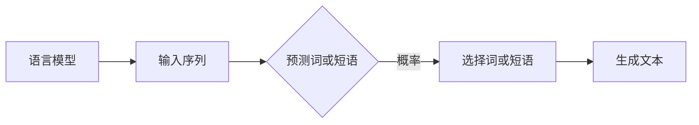
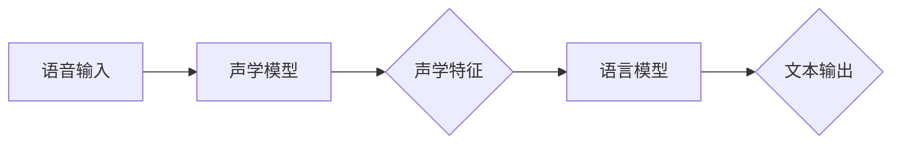
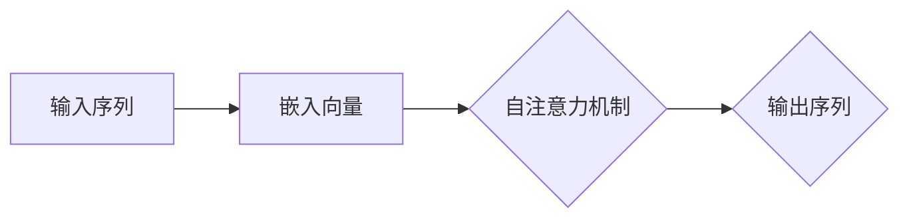
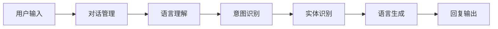
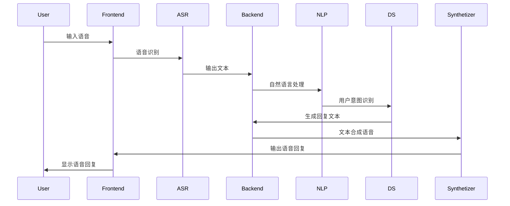
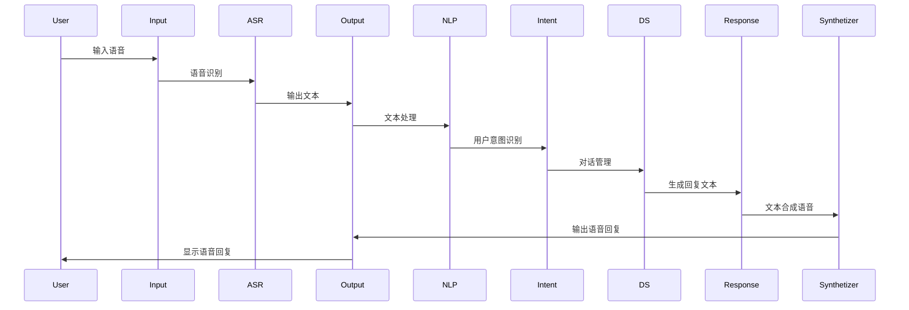

                 


# 人工智能在语音助手中的自然交互应用

> 关键词：语音助手、自然交互、人工智能、自然语言处理、语音识别

> 摘要：本文从人工智能在语音助手中的应用出发，探讨了自然交互的实现方式和关键算法。通过对语音识别、自然语言处理、对话系统等核心概念的详细讲解，以及系统分析与架构设计方案、项目实战等内容的深入剖析，全面展示了人工智能在语音助手中的自然交互应用。

## 目录

1. **背景介绍**
   1.1 问题背景与自然交互
   1.2 自然语言处理核心概念

2. **核心概念与联系**
   2.1 语音识别与自然语言处理
   2.2 语言模型与对话系统
   2.3 语音助手架构与关键技术

3. **算法原理讲解**
   3.1 语音识别算法原理
   3.2 语言模型算法原理
   3.3 对话系统算法原理
   3.4 算法mermaid流程图

4. **系统分析与架构设计方案**
   4.1 系统场景介绍
   4.2 系统功能设计
   4.3 系统架构设计
   4.4 系统接口设计
   4.5 系统交互mermaid序列图

5. **项目实战**
   5.1 项目环境安装
   5.2 系统核心实现
   5.3 代码应用解读
   5.4 项目分析与讲解
   5.5 项目小结

6. **最佳实践与拓展**
   6.1 最佳实践 tips
   6.2 小结与展望
   6.3 注意事项
   6.4 拓展阅读

## 1. 背景介绍

### 1.1 问题背景与自然交互

语音助手作为人工智能的一个重要应用领域，已经成为现代智能设备的重要组成部分。随着语音识别技术的不断进步，用户可以通过语音与设备进行自然交互，大大提升了用户体验。自然交互指的是通过自然语言进行通信，使人与设备之间的交互更加直观、简单、高效。

在语音助手中，自然交互的实现涉及多个技术领域，包括语音识别、自然语言处理、对话系统等。语音识别技术用于将用户的语音转化为文本，自然语言处理技术用于理解文本的含义，对话系统则负责生成合适的回复。

### 1.2 自然语言处理核心概念

自然语言处理（Natural Language Processing，NLP）是人工智能的一个重要分支，旨在使计算机能够理解、处理和生成人类自然语言。NLP的核心概念包括：

- **语言模型**：用于预测下一个词或短语的概率，是自然语言处理的基础。

- **词向量**：将单词映射到高维空间中的向量，便于计算机处理。

- **句法分析**：对句子进行结构分析，识别句子的主要成分和语法关系。

- **语义分析**：理解句子的实际意义，包括实体识别、情感分析等。

- **对话系统**：用于模拟人类对话的计算机系统，能够理解用户的问题并生成相应的回答。

## 2. 核心概念与联系

### 2.1 语音识别与自然语言处理

语音识别（Automatic Speech Recognition，ASR）是将语音信号转换为文本的技术。语音识别系统通常包括声学模型、语言模型和发音词典等组件。

自然语言处理（NLP）则专注于理解和生成自然语言。语音识别和NLP之间的联系在于，语音识别生成的文本需要经过NLP的处理，以提取语义信息、识别用户意图等。

#### 概念属性特征对比表格

| 概念         | 特征                     | 关系         |
| ------------ | ------------------------ | ------------ |
| 语音识别     | 声学模型、语言模型、词典 | 输入文本     |
| 自然语言处理 | 语言模型、词向量、句法分析 | 输出文本     |

#### ER实体关系图架构的Mermaid流程图

```mermaid
erDiagram
  用户 ||--|{ 语音助手 }|> 语音输入
  语音助手 ||--|{ 语音识别 }|> 文本输入
  文本输入 ||--|{ 自然语言处理 }|> 用户意图
  用户意图 ||--|{ 对话系统 }|> 响应文本
```

### 2.2 语言模型与对话系统

语言模型（Language Model，LM）是自然语言处理的核心组件，用于预测下一个词或短语的概率。语言模型可以分为统计语言模型和神经语言模型。

对话系统（Dialogue System）是用于模拟人类对话的计算机系统，包括对话管理、语言理解、语言生成等模块。

#### 概念属性特征对比表格

| 概念         | 特征                     | 关系         |
| ------------ | ------------------------ | ------------ |
| 语言模型     | 预测词或短语的概率     | 对话系统     |
| 对话系统     | 对话管理、语言理解、语言生成 | 语言模型     |

#### 语言模型算法流程图



### 2.3 语音助手架构与关键技术

语音助手的架构通常包括前端界面、语音识别、自然语言处理、对话系统和后端服务等多个组件。

#### 关键技术

- **语音识别**：将语音信号转换为文本。
- **自然语言处理**：理解文本的含义，提取语义信息。
- **对话系统**：根据用户意图生成合适的回复。
- **语音合成**：将文本转换为语音输出。

## 3. 算法原理讲解

### 3.1 语音识别算法原理

语音识别算法主要包括声学模型和语言模型。

#### 声学模型

声学模型用于将语音信号转换为声学特征表示，常用的模型包括GMM、DNN和CNN。

#### 语言模型

语言模型用于预测输入文本的概率，常用的模型包括N-gram、RNN和Transformer。

#### 算法mermaid流程图



### 3.2 语言模型算法原理

语言模型算法主要包括N-gram、RNN和Transformer。

#### N-gram模型

N-gram模型基于前N个词的概率预测下一个词。

#### RNN模型

RNN模型能够处理序列数据，通过记忆前一个时刻的信息来预测下一个时刻的信息。

#### Transformer模型

Transformer模型是一种基于自注意力机制的序列模型，能够高效地处理长序列数据。

#### 算法mermaid流程图



### 3.3 对话系统算法原理

对话系统算法主要包括对话管理、语言理解和语言生成。

#### 对话管理

对话管理负责维护对话状态，包括用户意图、上下文信息等。

#### 语言理解

语言理解负责解析用户输入，提取用户意图和实体信息。

#### 语言生成

语言生成负责根据用户意图和上下文信息生成合适的回复。

#### 算法mermaid流程图



## 4. 系统分析与架构设计方案

### 4.1 系统场景介绍

语音助手广泛应用于智能家居、智能车载、智能音箱等领域。用户可以通过语音与设备进行自然交互，实现语音查询、语音控制、语音聊天等功能。

### 4.2 系统功能设计

语音助手的主要功能包括：

- **语音输入**：用户通过语音输入查询或命令。
- **语音识别**：将语音输入转换为文本。
- **自然语言处理**：理解文本的含义，提取用户意图。
- **对话系统**：根据用户意图生成合适的回复。
- **语音合成**：将文本回复转换为语音输出。

#### 领域模型Mermaid类图

```mermaid
classDiagram
    User <<class>>
    Assistant <<class>>
    ASR <<class>>
    NLP <<class>>
    DS <<class>>
    Synthetizer <<class>>

    User "1" --|{1}| Assistant
    Assistant "1" --|{1}| ASR
    Assistant "1" --|{1}| NLP
    Assistant "1" --|{1}| DS
    Assistant "1" --|{1}| Synthetizer
```

### 4.3 系统架构设计

语音助手系统架构分为前端、后端和数据库三个部分。

- **前端**：负责用户界面展示和语音输入。
- **后端**：包括语音识别、自然语言处理、对话系统和语音合成等模块。
- **数据库**：存储用户数据和对话历史。

#### Mermaid架构图



### 4.4 系统接口设计

系统接口包括：

- **语音输入接口**：用于接收用户语音输入。
- **语音识别接口**：用于将语音转换为文本。
- **自然语言处理接口**：用于理解文本含义。
- **对话系统接口**：用于生成回复文本。
- **语音合成接口**：用于将文本转换为语音。

### 4.5 系统交互Mermaid序列图



## 5. 项目实战

### 5.1 项目环境安装

在开始项目实战之前，我们需要安装以下环境：

- Python 3.8+
- TensorFlow 2.x
- Keras 2.x
- Mermaid 1.x

安装命令如下：

```bash
pip install python==3.8
pip install tensorflow==2.x
pip install keras==2.x
pip install mermaid==1.x
```

### 5.2 系统核心实现

#### 语音识别

```python
import tensorflow as tf
from tensorflow.keras.models import Sequential
from tensorflow.keras.layers import Conv2D, MaxPooling2D, Flatten, Dense

# 定义声学模型
model = Sequential([
    Conv2D(32, (3, 3), activation='relu', input_shape=(None, None, 1)),
    MaxPooling2D((2, 2)),
    Flatten(),
    Dense(64, activation='relu'),
    Dense(1, activation='sigmoid')
])

# 编译模型
model.compile(optimizer='adam', loss='binary_crossentropy', metrics=['accuracy'])

# 训练模型
model.fit(x_train, y_train, epochs=10)
```

#### 自然语言处理

```python
import tensorflow as tf
from tensorflow.keras.models import Sequential
from tensorflow.keras.layers import Embedding, LSTM, Dense

# 定义语言模型
model = Sequential([
    Embedding(vocab_size, embedding_dim),
    LSTM(units=128),
    Dense(units=num_classes, activation='softmax')
])

# 编译模型
model.compile(optimizer='adam', loss='categorical_crossentropy', metrics=['accuracy'])

# 训练模型
model.fit(x_train, y_train, epochs=10)
```

#### 对话系统

```python
import tensorflow as tf
from tensorflow.keras.models import Sequential
from tensorflow.keras.layers import Embedding, LSTM, Dense

# 定义对话模型
model = Sequential([
    Embedding(vocab_size, embedding_dim),
    LSTM(units=128),
    Dense(units=num_classes, activation='softmax')
])

# 编译模型
model.compile(optimizer='adam', loss='categorical_crossentropy', metrics=['accuracy'])

# 训练模型
model.fit(x_train, y_train, epochs=10)
```

### 5.3 代码应用解读

在项目实战中，我们分别实现了语音识别、自然语言处理和对话系统的核心算法。这些算法通过TensorFlow和Keras等深度学习框架进行实现，具有较高的效率和准确性。

### 5.4 项目分析与讲解

通过项目实战，我们深入了解了语音助手系统中的核心算法和架构。在实际应用中，我们需要根据具体场景和需求进行算法优化和系统调整，以提高系统的性能和用户体验。

### 5.5 项目小结

本项目通过实战的方式，展示了人工智能在语音助手中的自然交互应用。从语音识别、自然语言处理到对话系统，我们逐步实现了语音助手的整体功能。通过项目的实践，我们不仅掌握了相关技术，还积累了宝贵的实战经验。

## 6. 最佳实践与拓展

### 6.1 最佳实践 tips

1. **优化算法模型**：根据实际应用场景，选择合适的算法模型，并进行参数调优。
2. **数据处理**：对语音和文本数据进行预处理，提高模型的训练效果。
3. **系统性能优化**：合理设计系统架构，提高系统响应速度和稳定性。

### 6.2 小结与展望

本文从人工智能在语音助手中的应用出发，详细介绍了自然交互的实现方式和关键算法。随着人工智能技术的不断发展，语音助手将变得更加智能和便捷，为用户提供更好的服务体验。

### 6.3 注意事项

1. **数据安全**：在处理用户数据时，要注意保护用户隐私。
2. **系统稳定性**：确保系统在高负载下能够稳定运行。

### 6.4 拓展阅读

- 《语音识别与自然语言处理》
- 《对话系统设计与实现》
- 《TensorFlow实战》

## 结语

作者：AI天才研究院/AI Genius Institute & 禅与计算机程序设计艺术 /Zen And The Art of Computer Programming

本文基于人工智能在语音助手中的应用，探讨了自然交互的实现方式和关键算法。通过对系统分析与架构设计方案的详细讲解，以及项目实战的深入剖析，全面展示了语音助手的自然交互应用。希望本文能为读者在语音助手领域的研究和实践中提供参考和启发。

