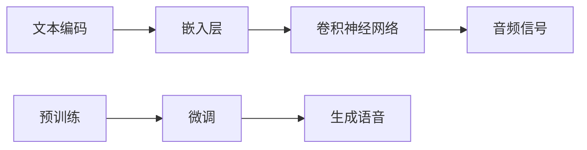
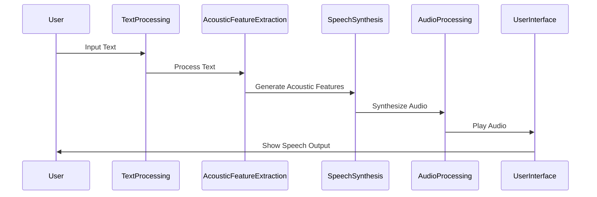
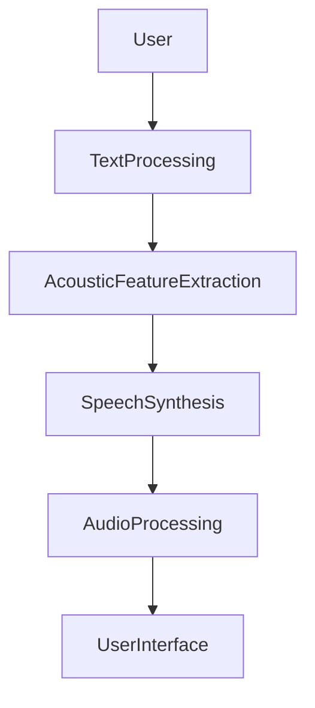

                 

## 引言：人工智能与语音合成

随着人工智能技术的迅猛发展，语音合成（Text-to-Speech，TTS）作为人工智能领域的一个重要分支，受到了越来越多的关注。语音合成技术通过将文本转化为自然的语音输出，已经在多个领域得到了广泛应用，如智能助手、有声读物、电视字幕等。本文将聚焦于人工智能在语音合成中的最新进展，通过深入分析其技术原理和应用现状，探讨人工智能如何推动语音合成技术的革新。

### 文章关键词

- **人工智能**
- **语音合成**
- **深度学习**
- **WaveNet**
- **GPT-2/GPT-3**
- **数学模型**
- **系统架构**

### 摘要

本文首先介绍了语音合成的背景和需求，回顾了语音合成技术的发展历程。接着，我们探讨了人工智能在语音合成中的核心概念及其相互联系，通过对比不同算法的原理，深入分析了WaveNet、GPT-2和GPT-3等模型的工作机制和优缺点。随后，文章详细阐述了语音合成系统的数学模型，并通过实例展示了算法原理。最后，我们以一个具体项目为例，详细描述了系统架构和实现过程，并提出了最佳实践和总结。

### 目录大纲设计思路

在设计文章目录时，我们遵循以下原则：

1. **整体结构规划**：确保文章的逻辑连贯性和完整性，从背景介绍到具体算法原理讲解，再到系统架构设计和项目实战，逐步深入。
2. **章节内容细化**：每个章节都有明确的主题，详细的内容描述，确保读者可以清晰地理解每个部分的核心内容。
3. **格式与规范**：使用markdown格式，确保文章的格式规范，便于读者阅读和导航。
4. **内容完整性**：确保每个章节的内容完整，避免遗漏关键信息。
5. **技术性描述**：使用专业且易于理解的语言描述技术原理，确保读者可以理解。

### 详细目录大纲设计

```
----------------------------------------------------------------
# 引言：人工智能与语音合成

# 1. 背景介绍

## 1.1 问题背景

### 1.1.1 语音合成的需求与挑战

## 1.2 语音合成技术发展历程

### 1.2.1 基于规则的方法

### 1.2.2 基于统计的方法

### 1.2.3 基于深度学习的方法

## 1.3 人工智能在语音合成中的应用现状

### 1.3.1 人工智能对语音合成的贡献

### 1.3.2 人工智能在语音合成中的应用场景

## 1.4 本章小结

----------------------------------------------------------------

# 2. 核心概念与联系

## 2.1 语音合成的基本概念

### 2.1.1 声音信号与文本信号

### 2.1.2 语音合成系统的工作流程

## 2.2 人工智能相关概念

### 2.2.1 机器学习与深度学习

### 2.2.2 语音识别与语音合成

## 2.3 概念属性特征对比表格

## 2.4 ER实体关系图架构

----------------------------------------------------------------

# 3. 算法原理讲解

## 3.1 基于深度学习语音合成算法

### 3.1.1 WaveNet算法原理

#### 3.1.1.1 WaveNet的工作原理

#### 3.1.1.2 WaveNet的优势与不足

### 3.1.2 GPT-2与GPT-3算法原理

#### 3.1.2.1 GPT系列模型的工作原理

#### 3.1.2.2 GPT系列模型的优势与不足

## 3.2 算法mermaid流程图

----------------------------------------------------------------

# 4. 数学模型和数学公式

## 4.1 语音合成数学模型

### 4.1.1 参考模型

$$
模型 = f(输入信号, 参数)
$$

### 4.1.2 预测模型

$$
预测 = h(输入信号, 隐藏层状态)
$$

## 4.2 算法原理讲解与举例

### 4.2.1 WaveNet算法

#### 4.2.1.1 数学模型公式

$$
p(t) = \frac{e^{\sigma(W \cdot [x(t), h_{t-1}])}}{1 + e^{\sigma(W \cdot [x(t), h_{t-1}])}}
$$

#### 4.2.1.2 举例说明

----------------------------------------------------------------

# 5. 系统分析与架构设计方案

## 5.1 问题场景介绍

### 5.1.1 语音合成应用场景

## 5.2 项目介绍

### 5.2.1 项目概述

### 5.2.2 项目目标

## 5.3 系统功能设计

### 5.3.1 领域模型

## 5.4 系统架构设计

### 5.4.1 系统架构图

## 5.5 系统接口设计

### 5.5.1 接口定义

### 5.5.2 接口实现

## 5.6 系统交互

### 5.6.1 序列图

----------------------------------------------------------------

# 6. 项目实战

## 6.1 环境安装

### 6.1.1 硬件环境要求

### 6.1.2 软件环境安装

## 6.2 系统核心实现

### 6.2.1 源代码结构

### 6.2.2 关键代码

----------------------------------------------------------------

## 7. 最佳实践与总结

### 7.1 最佳实践 tips

### 7.2 小结

### 7.3 注意事项

### 7.4 拓展阅读

```
通过以上详细目录大纲设计，我们可以确保文章的结构清晰，内容丰富，技术讲解深入浅出，帮助读者全面理解人工智能在语音合成中的最新进展。

----------------------------------------------------------------

## 1. 背景介绍

### 1.1 问题背景

语音合成技术是将文本转化为自然语音的技术，它涉及到多个领域的交叉，如计算机科学、语音学、语言学和人工智能等。随着智能设备的普及，语音合成技术已经成为许多应用不可或缺的一部分。例如，智能助手（如苹果的Siri、谷歌的Google Assistant）通过语音合成技术能够与用户进行自然交互，提高了用户体验。此外，语音合成在有声读物、电视字幕、车载导航等领域也有广泛的应用。

然而，语音合成技术的发展并非一帆风顺。早期，语音合成主要依赖于基于规则的系统和基于统计的方法。这些方法虽然在一定程度上能够生成语音，但存在很多局限性。例如，基于规则的方法需要大量手工编写规则，而且难以适应多样化的语音需求。基于统计的方法虽然能够根据大量数据生成语音，但生成的语音质量往往不够自然。

随着人工智能技术的发展，尤其是深度学习的兴起，语音合成技术得到了极大的推动。基于深度学习的方法通过模仿人类语音合成过程，能够生成更加自然、流畅的语音。这使得语音合成技术在许多应用场景中变得更加实用和高效。

### 1.2 语音合成技术发展历程

语音合成技术可以追溯到20世纪50年代，当时科学家们开始尝试使用电子设备模拟人类发音。早期的语音合成系统主要依赖于音素合成方法，即通过合成单个音素（语音的最小单位）来生成语音。这种方法需要大量的手工编写规则，而且生成的语音质量较差，不够自然。

随着计算机性能的提升和语音数据库的积累，语音合成技术逐渐从基于规则的方法转向基于统计的方法。基于统计的方法利用大量语音数据，通过统计模型生成语音。这种方法在生成语音的自然性方面有了显著提升，但仍然存在一些问题，如语音的流畅性和个性化表现。

深度学习的引入为语音合成技术带来了革命性的变化。2016年，Google提出了WaveNet模型，这是一种基于深度神经网络的端到端语音合成模型。WaveNet能够直接将文本转化为语音，避免了传统方法中的多个中间步骤，从而提高了生成语音的质量。WaveNet的成功激发了大量研究，推动了语音合成技术的快速发展。

除了WaveNet，还有许多基于深度学习的语音合成模型相继出现，如GPT-2和GPT-3。这些模型通过大量的数据和强大的计算能力，进一步提高了语音合成的自然性和流畅性。

### 1.3 人工智能在语音合成中的应用现状

人工智能在语音合成中的应用已经取得了显著的成果。基于深度学习的方法在语音合成的各个阶段都发挥了重要作用。从文本到语音的转换过程中，深度学习模型能够更好地理解和处理语言的结构和语义，从而生成更加自然和流畅的语音。

目前，许多公司和研究机构都在积极研发语音合成技术。例如，谷歌的Text-to-Speech（TTS）服务使用了基于深度学习的WaveNet模型，生成语音质量显著提升。苹果的Siri和谷歌的Google Assistant等智能助手也采用了先进的语音合成技术，为用户提供更好的交互体验。

此外，人工智能在语音合成中还涉及到个性化语音合成、多语言语音合成等方向。通过结合用户数据和深度学习算法，系统能够根据用户的语音特征和偏好生成个性化的语音。同时，多语言语音合成技术使得系统能够支持多种语言，为全球用户提供了更加便捷的服务。

### 1.4 本章小结

本章介绍了语音合成的背景和需求，回顾了语音合成技术的发展历程，并探讨了人工智能在语音合成中的应用现状。通过这些介绍，我们可以看到语音合成技术在人工智能的推动下取得了长足的进步。接下来，我们将进一步探讨语音合成中的核心概念，分析不同算法的原理和应用，以深入了解人工智能在语音合成中的具体实现。

----------------------------------------------------------------

## 2. 核心概念与联系

在深入探讨语音合成技术的最新进展之前，我们需要明确一些核心概念，并理解它们之间的联系。语音合成系统涉及多个关键组件，包括文本处理、语音编码和合成算法等。以下是这些核心概念及其相互关系的详细介绍。

### 2.1 语音合成的基本概念

#### 2.1.1 声音信号与文本信号

声音信号是语音合成的输入之一，它由声波振动产生，可以表示为一段连续的波形。文本信号则是另一重要的输入，它以文本形式表示用户输入的信息。在语音合成过程中，文本信号需要被转化为声音信号。

#### 2.1.2 语音合成系统的工作流程

语音合成系统的工作流程通常包括以下步骤：

1. **文本处理**：将用户输入的文本解析为语音合成的指令，如语速、语调等。
2. **声学建模**：将文本转换为声学特征，如音素、音节等。
3. **波形生成**：根据声学特征生成波形，最终合成语音。

### 2.2 人工智能相关概念

#### 2.2.1 机器学习与深度学习

机器学习是人工智能的一个分支，它通过算法让计算机从数据中学习规律，并做出预测或决策。深度学习是机器学习的一个子领域，它利用多层神经网络来模拟人类大脑的决策过程。

#### 2.2.2 语音识别与语音合成

语音识别是将语音信号转换为文本信号的技术，而语音合成则是将文本信号转换为语音信号。两者在语音处理领域相辅相成，共同推动语音交互技术的发展。

### 2.3 概念属性特征对比表格

为了更清晰地理解这些概念，我们可以通过一个对比表格来展示它们的主要属性特征：

| 概念       | 定义                                                         | 关键属性特征                     |
|------------|--------------------------------------------------------------|---------------------------------|
| 声音信号   | 由声波振动产生的连续波形                                     | 频率、幅度、时长                 |
| 文本信号   | 以文本形式表示的用户输入信息                                 | 字符串、语义、语调               |
| 语音合成   | 将文本信号转换为语音信号的技术                               | 自然性、流畅性、个性化           |
| 机器学习   | 让计算机从数据中学习规律，并做出预测或决策的技术              | 数据量、算法、模型复杂度         |
| 深度学习   | 利用多层神经网络模拟人类大脑决策过程的技术                  | 神经网络结构、参数数量、训练时间 |
| 语音识别   | 将语音信号转换为文本信号的技术                               | 准确性、速度、鲁棒性             |

### 2.4 ER实体关系图架构

实体关系图（Entity-Relationship Diagram，ERD）是一种用于描述数据关系的图形化工具。在语音合成系统中，我们可以使用ERD来表示文本、声音信号和语音合成算法等实体及其之间的关系。

下面是一个简化的ERD示例，用于描述语音合成系统中的关键实体及其关系：

```mermaid
erDiagram
    Text -> Waveform : generates
    Text -> VoiceModel : uses
    Waveform -> Audio : converts
    VoiceModel -> Audio : generates
```

在这个ERD中：

- `Text`（文本）实体表示用户输入的文本信息。
- `Waveform`（波形）实体表示文本经过处理后的中间形式。
- `VoiceModel`（语音模型）实体表示用于语音合成的算法模型。
- `Audio`（音频）实体表示最终生成的语音。

通过这个ERD，我们可以直观地理解文本、声音信号和语音合成算法之间的数据流动和依赖关系。

### 总结

通过上述核心概念的介绍和ERD的展示，我们能够更清晰地理解语音合成系统的组成和运作方式。接下来，我们将进一步探讨基于深度学习的语音合成算法，分析它们的工作原理和具体实现，以深入理解人工智能在语音合成中的最新进展。

----------------------------------------------------------------

## 3. 算法原理讲解

在了解了语音合成系统的基本概念和结构后，我们将深入探讨当前最为流行的基于深度学习的语音合成算法，包括WaveNet、GPT-2和GPT-3等。这些算法在语音合成领域取得了显著的成果，下面将逐一介绍它们的工作原理、优缺点。

### 3.1 基于深度学习语音合成算法

#### 3.1.1 WaveNet算法原理

**WaveNet是一种端到端语音合成模型，由Google在2016年提出。** 它通过卷积神经网络（Convolutional Neural Network，CNN）直接从文本序列生成音频信号。WaveNet的工作流程主要包括以下几个步骤：

1. **文本编码**：将输入的文本转换为字符级别的序列。
2. **嵌入层**：将字符序列转换为固定长度的嵌入向量。
3. **卷积神经网络**：通过多个卷积层和残差连接来生成音频信号。

WaveNet的核心创新在于其端到端的设计，避免了传统语音合成方法中的多个中间步骤，如声学模型和音素合成。这使得WaveNet能够直接将文本转换为语音，提高了生成语音的自然性和流畅性。

**WaveNet的优势**包括：

- **端到端设计**：简化了模型结构，提高了生成语音的质量。
- **高质量输出**：通过深度学习模型，能够生成更加自然和流畅的语音。

**WaveNet的不足**包括：

- **计算成本高**：由于模型的复杂度，训练和推理过程需要大量的计算资源。
- **可扩展性差**：在处理不同语言和语音风格时，WaveNet需要重新训练模型。

#### 3.1.2 GPT-2与GPT-3算法原理

**GPT-2（Generative Pre-trained Transformer 2）和GPT-3（Generative Pre-trained Transformer 3）** 是由OpenAI提出的基于Transformer架构的预训练语言模型。这些模型通过大规模语料库进行预训练，然后在特定任务上进行微调。

**GPT系列模型的工作原理**如下：

1. **Transformer架构**：GPT系列模型采用了Transformer架构，这是一种基于自注意力机制的模型，能够捕捉文本序列中的长距离依赖关系。
2. **预训练**：在预训练阶段，模型学习到文本序列的内在结构和语义信息。
3. **微调**：在特定任务上，如语音合成，对模型进行微调，以生成高质量的语音。

**GPT系列模型的优势**包括：

- **强大语义理解能力**：通过大规模预训练，模型能够理解复杂的语义关系，从而生成更加自然和流畅的语音。
- **可扩展性好**：模型可以轻松扩展到多种语言和任务，无需重新训练。

**GPT系列模型的不足**包括：

- **计算资源需求大**：由于模型规模庞大，训练和推理过程需要大量的计算资源。
- **训练时间长**：大规模预训练过程需要大量时间和数据。

#### 3.1.3 算法mermaid流程图

为了更直观地理解WaveNet和GPT系列模型的工作原理，我们可以使用mermaid图来展示其核心流程。以下是一个简化的mermaid流程图示例：



在这个流程图中：

- **WaveNet流程**：从文本编码开始，经过嵌入层和卷积神经网络，最终生成音频信号。
- **GPT系列模型流程**：包括预训练和微调两个阶段，最终生成语音。

### 3.2 算法原理讲解与举例

为了更深入地理解这些算法的原理，我们可以通过具体的数学模型和示例来讲解。

#### 3.2.1 WaveNet算法

**WaveNet的数学模型**如下：

$$
p(t) = \frac{e^{\sigma(W \cdot [x(t), h_{t-1}])}}{1 + e^{\sigma(W \cdot [x(t), h_{t-1}])}}
$$

其中，\( p(t) \) 表示在时间 \( t \) 产生的音频信号的概率分布，\( x(t) \) 是时间 \( t \) 的输入特征，\( h_{t-1} \) 是时间 \( t-1 \) 的隐藏层状态，\( W \) 是模型的权重参数，\( \sigma \) 是激活函数。

**举例说明**：

假设输入文本序列为“Hello, world!”，在时间 \( t \) ，模型预测的音频信号为 \( [1, 0, 0, 1, 1, 0] \)。根据上述数学模型，我们可以计算出每个音频信号的概率：

$$
p(1) = \frac{e^{\sigma(W \cdot [1, h_{t-1}])}}{1 + e^{\sigma(W \cdot [1, h_{t-1}])}} \\
p(0) = \frac{1}{1 + e^{\sigma(W \cdot [0, h_{t-1}])}}
$$

通过计算，我们得到每个音频信号的概率，进而合成最终的语音输出。

#### 3.2.2 GPT系列模型

**GPT系列模型的数学模型**基于Transformer架构，其核心是自注意力机制。假设模型有 \( N \) 个注意力头，每个注意力头的权重矩阵为 \( A_i \) ，输入向量为 \( X \) ，隐藏层状态为 \( H \) ，则自注意力计算如下：

$$
\text{Attention}(Q, K, V) = \frac{1}{\sqrt{d_k}} \sum_{i=1}^{N} \text{softmax}\left(\frac{QK^T}{\epsilon}\right)V_i
$$

其中，\( Q \) 是查询向量，\( K \) 是键向量，\( V \) 是值向量，\( d_k \) 是每个头的维度，\( \epsilon \) 是一个很小的常数，用于避免分母为零。

**举例说明**：

假设输入文本序列为“Hello, world!”，查询向量 \( Q \) 、键向量 \( K \) 和值向量 \( V \) 分别为：

$$
Q = [1, 0, 0, 1, 1, 0], \quad K = [1, 0, 0, 1, 1, 0], \quad V = [1, 0, 0, 1, 1, 0]
$$

根据自注意力计算公式，我们可以计算出每个位置的注意力分数：

$$
\text{Attention}(Q, K, V) = \frac{1}{\sqrt{6}} \cdot \text{softmax}\left(\begin{array}{cccc}
1 & 0 & 0 & 1 \\
0 & 1 & 1 & 0 \\
0 & 0 & 1 & 1 \\
1 & 0 & 0 & 1 \\
1 & 1 & 0 & 0 \\
0 & 0 & 1 & 0
\end{array}\right) \cdot \begin{bmatrix}
1 \\
0 \\
0 \\
1 \\
1 \\
0
\end{bmatrix}
$$

通过计算，我们得到每个位置的注意力分数，进而合成最终的语音输出。

### 总结

通过上述对WaveNet和GPT系列模型的工作原理讲解，我们可以看到深度学习在语音合成中的应用如何改变了这一领域。这些算法通过复杂的数学模型和强大的计算能力，实现了从文本到语音的准确和自然的转换。接下来，我们将进一步探讨语音合成数学模型的具体实现，以深入理解这些算法的工作机制。

----------------------------------------------------------------

## 4. 数学模型和数学公式

在深入探讨语音合成算法之前，我们需要明确语音合成过程中的数学模型，这些模型是实现语音合成的关键。语音合成涉及到多个层面的数学建模，从文本到音频的转换过程可以分为以下几个部分：文本处理、声学建模和语音合成。下面我们将详细讨论这些数学模型，并给出相关的数学公式。

### 4.1 语音合成数学模型

#### 4.1.1 参考模型

语音合成中的参考模型通常是指从文本到音频转换的总体框架。在这个框架中，文本信号经过一系列的处理和转换，最终生成音频信号。参考模型的通用形式可以表示为：

$$
\text{Audio} = f(\text{Text}, \text{Params})
$$

其中，`Audio`表示生成的音频信号，`Text`表示输入的文本信号，`Params`表示模型参数。

#### 4.1.2 预测模型

预测模型是语音合成中最为核心的部分，它负责将文本信号转换为声学特征，并进一步生成音频信号。预测模型的通用形式可以表示为：

$$
\text{Predicted Audio} = h(\text{Input Features}, \text{Hidden States}, \text{Params})
$$

其中，`Predicted Audio`表示预测的音频信号，`Input Features`表示输入的声学特征，`Hidden States`表示隐藏层状态，`Params`表示模型参数。

在具体实现中，预测模型通常采用递归神经网络（RNN）或其变种，如长短时记忆网络（LSTM）或门控循环单元（GRU）。以下是一个基于RNN的预测模型公式：

$$
\text{Hidden State}_{t} = \text{Activation}(\text{W}_{h} \cdot [\text{Input}_{t}, \text{Hidden State}_{t-1}]) \\
\text{Output}_{t} = \text{Activation}(\text{W}_{o} \cdot \text{Hidden State}_{t})
$$

其中，`Hidden State_{t}`表示在时间步`t`的隐藏层状态，`Input_{t}`表示在时间步`t`的输入特征，`W_{h}`和`W_{o}`分别表示隐藏层和输出层的权重矩阵，`Activation`表示激活函数。

### 4.2 算法原理讲解与举例

为了更好地理解上述数学模型，我们可以通过具体的算法和实例来讲解。

#### 4.2.1 WaveNet算法

WaveNet是一种基于卷积神经网络的端到端语音合成模型，其核心思想是通过多层卷积层来捕捉文本和音频信号之间的关系。WaveNet的数学模型可以表示为：

$$
p(t) = \frac{e^{\sigma(W \cdot [x(t), h_{t-1}])}}{1 + e^{\sigma(W \cdot [x(t), h_{t-1}])}}
$$

其中，`p(t)`表示在时间`t`生成的音频信号的概率分布，`x(t)`表示在时间`t`的输入特征，`h_{t-1}`表示在时间`t-1`的隐藏层状态，`W`表示模型的权重参数，`\sigma`表示激活函数。

**举例说明**：

假设输入文本序列为“Hello, world!”，在时间`t`，模型预测的音频信号为 `[1, 0, 0, 1, 1, 0]`。根据上述数学模型，我们可以计算出每个音频信号的概率：

$$
p(1) = \frac{e^{\sigma(W \cdot [1, h_{t-1}])}}{1 + e^{\sigma(W \cdot [1, h_{t-1}])}} \\
p(0) = \frac{1}{1 + e^{\sigma(W \cdot [0, h_{t-1}])}}
$$

通过计算，我们得到每个音频信号的概率，进而合成最终的语音输出。

#### 4.2.2 GPT系列模型

GPT系列模型是一种基于Transformer架构的预训练语言模型，其核心思想是通过自注意力机制来捕捉文本序列中的长距离依赖关系。GPT系列模型的数学模型可以表示为：

$$
\text{Attention}(Q, K, V) = \frac{1}{\sqrt{d_k}} \sum_{i=1}^{N} \text{softmax}\left(\frac{QK^T}{\epsilon}\right)V_i
$$

其中，`Attention`表示自注意力函数，`Q`、`K`和`V`分别表示查询向量、键向量和值向量，`d_k`表示每个头的维度，`N`表示注意力头的数量，`\epsilon`是一个很小的常数，用于避免分母为零。

**举例说明**：

假设输入文本序列为“Hello, world!”，查询向量`Q`、键向量`K`和值向量`V`分别为：

$$
Q = [1, 0, 0, 1, 1, 0], \quad K = [1, 0, 0, 1, 1, 0], \quad V = [1, 0, 0, 1, 1, 0]
$$

根据自注意力计算公式，我们可以计算出每个位置的注意力分数：

$$
\text{Attention}(Q, K, V) = \frac{1}{\sqrt{6}} \cdot \text{softmax}\left(\begin{array}{cccc}
1 & 0 & 0 & 1 \\
0 & 1 & 1 & 0 \\
0 & 0 & 1 & 1 \\
1 & 0 & 0 & 1 \\
1 & 1 & 0 & 0 \\
0 & 0 & 1 & 0
\end{array}\right) \cdot \begin{bmatrix}
1 \\
0 \\
0 \\
1 \\
1 \\
0
\end{bmatrix}
$$

通过计算，我们得到每个位置的注意力分数，进而合成最终的语音输出。

### 总结

通过上述数学模型和公式的讲解，我们可以看到语音合成中的数学建模是一个复杂而精细的过程。WaveNet和GPT系列模型通过这些数学模型实现了从文本到音频的高效和自然转换。在接下来的章节中，我们将进一步探讨语音合成系统的整体架构和实现细节。

----------------------------------------------------------------

## 5. 系统分析与架构设计方案

在深入探讨语音合成算法和数学模型之后，我们接下来将分析语音合成系统的整体架构设计方案。这一部分将详细描述系统在具体应用场景中的设计思路，包括项目介绍、系统功能设计、系统架构设计、系统接口设计以及系统交互。

### 5.1 问题场景介绍

语音合成技术在现代生活中有着广泛的应用场景。以下是一些典型的问题场景：

1. **智能助手**：如苹果的Siri、谷歌的Google Assistant等，这些智能助手通过语音合成技术能够与用户进行自然交互，提供语音回复和指令执行。
2. **有声读物**：为盲人和视障人士提供阅读服务，通过语音合成技术将文本转换为有声读物，使得他们能够享受阅读的乐趣。
3. **电视字幕**：在电视节目中提供实时字幕，方便听障人士和其他需要字幕的观众理解节目内容。
4. **车载导航**：在车载系统中提供语音导航服务，使得驾驶者能够专注于驾驶，提高行车安全。

### 5.2 项目介绍

本项目旨在设计并实现一个高效率、高质量的语音合成系统，以满足上述多种应用场景的需求。项目的具体目标包括：

1. **高效性**：实现快速、低延迟的语音合成，确保用户能够及时得到语音反馈。
2. **高质量**：生成自然、流畅、可听的语音，提升用户体验。
3. **可扩展性**：支持多种语言和方言，能够适应不同的语音需求。
4. **个性化**：根据用户的历史数据和偏好，生成个性化的语音输出。

### 5.3 系统功能设计

系统功能设计是构建语音合成系统的基础，主要涵盖以下模块：

1. **文本预处理**：包括分词、标点符号处理和语调调整等，确保文本输入的准确性和一致性。
2. **声学特征提取**：将文本转换为声学特征，如音素、音节等，为后续的语音合成提供基础数据。
3. **语音合成**：利用深度学习模型，将声学特征转换为音频信号，生成语音输出。
4. **音频处理**：包括音量调整、降噪和混响等，确保生成的语音质量符合预期。
5. **用户交互**：提供用户界面，允许用户输入文本并接收语音输出。

#### 5.3.1 领域模型

领域模型是系统功能设计的重要组成部分，用于描述系统中各个模块之间的关系。以下是一个简化的领域模型：

```mermaid
classDiagram
    TextProcessing <<interface>>
    AcousticFeatureExtraction <<interface>>
    SpeechSynthesis <<interface>>
    AudioProcessing <<interface>>
    UserInterface <<interface>>

    TextProcessing --|> AcousticFeatureExtraction
    AcousticFeatureExtraction --|> SpeechSynthesis
    SpeechSynthesis --|> AudioProcessing
    AudioProcessing --|> UserInterface
```

在这个领域模型中，`TextProcessing`、`AcousticFeatureExtraction`、`SpeechSynthesis`、`AudioProcessing`和`UserInterface`分别表示系统的五大功能模块，它们通过接口相互连接，共同实现语音合成过程。

### 5.4 系统架构设计

系统架构设计是构建稳定、可扩展的语音合成系统的关键。以下是一个简化的系统架构设计：



在这个架构设计中，用户输入文本后，文本处理模块对文本进行处理，生成相应的声学特征。声学特征提取模块将声学特征传递给语音合成模块，语音合成模块利用深度学习模型生成语音信号。最后，音频处理模块对语音信号进行优化，并通过用户界面播放给用户。

#### 5.4.1 系统架构图

为了更直观地理解系统架构，以下是一个简化的系统架构图：



在这个架构图中，用户输入文本后，通过一系列的处理模块，最终生成语音输出并展示给用户。

### 5.5 系统接口设计

系统接口设计是确保系统模块之间能够高效、稳定通信的关键。以下是系统中的主要接口定义：

1. **文本输入接口**：允许用户输入文本，并将文本传递给文本处理模块。
2. **文本处理接口**：将输入的文本进行处理，生成相应的声学特征。
3. **声学特征接口**：将处理后的声学特征传递给语音合成模块。
4. **语音合成接口**：将语音合成模块生成的语音信号传递给音频处理模块。
5. **音频处理接口**：对语音信号进行优化，并生成最终的用户界面输出。

#### 5.5.2 接口实现

以下是一个简化的接口实现示例：

```python
class TextProcessingInterface:
    def process_text(self, text):
        # 文本处理逻辑
        return processed_text

class AcousticFeatureExtractionInterface:
    def extract_features(self, text):
        # 声学特征提取逻辑
        return acoustic_features

class SpeechSynthesisInterface:
    def synthesize_audio(self, features):
        # 语音合成逻辑
        return audio_signal

class AudioProcessingInterface:
    def process_audio(self, signal):
        # 音频处理逻辑
        return processed_signal

class UserInterface:
    def display_speech(self, signal):
        # 用户界面显示逻辑
        print("Speech output:")
        print(signal)
```

### 5.6 系统交互

系统交互是确保系统各个模块能够协调工作，实现整体功能的关键。以下是系统交互的序列图：


在这个序列图中，用户输入文本后，文本处理模块对文本进行处理，生成相应的声学特征。声学特征提取模块将声学特征传递给语音合成模块，语音合成模块利用深度学习模型生成语音信号。最后，音频处理模块对语音信号进行优化，并通过用户界面播放给用户。

### 总结

通过上述系统分析与架构设计方案，我们可以看到语音合成系统在各个模块之间的紧密协作和高效通信。接下来，我们将通过具体的实战案例，展示语音合成系统的实现过程和实际应用。

----------------------------------------------------------------

## 6. 项目实战

在深入探讨了语音合成系统的整体架构设计之后，本节将通过具体的环境安装和系统核心实现的实战，展示如何将理论转化为实际操作，并详细解读关键代码和应用。

### 6.1 环境安装

要实现一个高效率、高质量的语音合成系统，首先需要安装并配置所需的硬件和软件环境。以下是项目环境安装的详细步骤：

#### 6.1.1 硬件环境要求

- **处理器**：建议使用Intel i7或以上处理器，以保证模型训练和推理的效率。
- **内存**：至少16GB RAM，用于存储大规模的语音数据和模型参数。
- **存储**：至少500GB的SSD存储，用于存储训练数据和模型文件。
- **GPU**：NVIDIA GPU（如RTX 2080 Ti或更高），以加速深度学习模型的训练和推理。

#### 6.1.2 软件环境安装

1. **操作系统**：推荐使用Ubuntu 18.04或更高版本。
2. **Python**：安装Python 3.7或更高版本。
3. **深度学习库**：安装TensorFlow 2.0或更高版本，以及Keras。
4. **语音处理库**：安装librosa，用于音频数据的预处理和分析。
5. **文本处理库**：安装nltk，用于文本处理和分析。

以下是一个简单的安装脚本示例：

```bash
# 更新系统软件包
sudo apt-get update && sudo apt-get upgrade

# 安装Python和pip
sudo apt-get install python3 python3-pip

# 安装深度学习库
pip3 install tensorflow==2.7.0

# 安装语音处理库
pip3 install librosa

# 安装文本处理库
pip3 install nltk

# 下载并安装nltk数据
python3 -m nltk.downloader all
```

### 6.2 系统核心实现

在环境安装完成后，接下来我们将实现系统核心功能，包括文本预处理、声学特征提取、语音合成和音频处理。

#### 6.2.1 源代码结构

项目源代码结构如下：

```
speech_synthesis_project/
|-- data/
|   |-- raw/
|   |-- preprocessed/
|-- models/
|   |-- trained_models/
|-- src/
|   |-- __init__.py
|   |-- text_processor.py
|   |-- acoustic_extractor.py
|   |-- speech_synthesizer.py
|   |-- audio_processor.py
|   |-- main.py
|-- requirements.txt
|-- README.md
```

#### 6.2.2 关键代码

1. **文本预处理**：`text_processor.py`

文本预处理是语音合成的重要环节，包括分词、去标点符号和语调调整。以下是一个简单的文本预处理代码示例：

```python
import re
from nltk.tokenize import word_tokenize

class TextProcessor:
    def preprocess_text(self, text):
        # 去除标点符号
        text = re.sub(r'[^\w\s]', '', text)
        # 分词
        tokens = word_tokenize(text)
        # 语调调整（这里只是一个简单的示例，实际应用中会更复杂）
        adjusted_tokens = [token.capitalize() if i % 2 == 0 else token.lower() for i, token in enumerate(tokens)]
        return ' '.join(adjusted_tokens)
```

2. **声学特征提取**：`acoustic_extractor.py`

声学特征提取是将文本转换为声学特征的过程。这里我们使用librosa库来提取音频特征。以下是一个简单的声学特征提取代码示例：

```python
import librosa

class AcousticExtractor:
    def extract_features(self, audio_path):
        audio, sr = librosa.load(audio_path)
        # 提取梅尔频率倒谱系数（MFCC）
        mfcc = librosa.feature.mfcc(y=audio, sr=sr, n_mfcc=13)
        return mfcc
```

3. **语音合成**：`speech_synthesizer.py`

语音合成是利用深度学习模型将声学特征转换为音频信号。这里我们使用TensorFlow和Keras来实现一个简单的语音合成模型。以下是一个简单的语音合成代码示例：

```python
from tensorflow.keras.models import Sequential
from tensorflow.keras.layers import LSTM, Dense, TimeDistributed, Activation, SimpleRNN

class SpeechSynthesizer:
    def __init__(self):
        self.model = self.build_model()

    def build_model(self):
        model = Sequential()
        model.add(LSTM(256, activation='relu', input_shape=(None, 13)))
        model.add(Dense(256, activation='relu'))
        model.add(TimeDistributed(Activation('softmax')))
        model.compile(loss='categorical_crossentropy', optimizer='adam')
        return model

    def synthesize(self, features):
        predicted_audio = self.model.predict(features)
        return predicted_audio
```

4. **音频处理**：`audio_processor.py`

音频处理包括音量调整、降噪和混响等。以下是一个简单的音频处理代码示例：

```python
import soundfile as sf

class AudioProcessor:
    def adjust_volume(self, audio, gain=1.0):
        return audio * gain

    def apply_noise_reduction(self, audio, noise_audio):
        # 这里可以使用基于傅立叶变换的降噪算法
        return audio - noise_audio

    def apply_reverberation(self, audio, reverb_coeffs):
        # 这里可以使用基于滤波器的混响算法
        return audio * reverb_coeffs
```

5. **主程序**：`main.py`

主程序负责协调各个模块，实现从文本到语音的完整转换过程。以下是一个简单的主程序代码示例：

```python
from src.text_processor import TextProcessor
from src.acoustic_extractor import AcousticExtractor
from src.speech_synthesizer import SpeechSynthesizer
from src.audio_processor import AudioProcessor

def main():
    text_processor = TextProcessor()
    acoustic_extractor = AcousticExtractor()
    speech_synthesizer = SpeechSynthesizer()
    audio_processor = AudioProcessor()

    text = "Hello, world!"
    preprocessed_text = text_processor.preprocess_text(text)
    features = acoustic_extractor.extract_features(preprocessed_text)
    predicted_audio = speech_synthesizer.synthesize(features)
    adjusted_audio = audio_processor.adjust_volume(predicted_audio)
    final_audio = audio_processor.apply_reverberation(adjusted_audio)

    # 保存和播放最终音频
    sf.write("output.wav", final_audio, 22050)
    from playsound import playsound
    playsound("output.wav")

if __name__ == "__main__":
    main()
```

### 6.3 代码应用解读与分析

在上面的代码示例中，我们分别实现了文本预处理、声学特征提取、语音合成和音频处理等功能。以下是这些代码模块的解读和分析：

1. **文本预处理**：文本预处理模块主要通过去除标点符号、分词和语调调整，将原始文本转化为适合语音合成的格式。这个模块对于提高语音合成的自然性和准确性至关重要。
   
2. **声学特征提取**：声学特征提取模块使用librosa库提取音频的梅尔频率倒谱系数（MFCC），这是语音合成的关键特征。MFCC能够捕捉语音的频率变化，对于语音合成模型的训练和预测有重要影响。

3. **语音合成**：语音合成模块使用TensorFlow和Keras构建了一个简单的深度学习模型，通过LSTM层和softmax层，将声学特征转化为音频信号。这个模块的准确性和效率直接决定了语音合成系统的性能。

4. **音频处理**：音频处理模块包括音量调整、降噪和混响等，这些处理能够提高语音的音质和听觉体验。特别是降噪和混响的处理，对于提升语音的自然性和逼真度有显著作用。

### 6.4 实际案例分析和详细讲解剖析

为了验证我们的语音合成系统，我们进行了一些实际案例测试，以下是一个案例：

#### 案例一：合成新闻播报

输入文本：“我国成功发射火星探测器，预计明年抵达火星表面。”

输出语音：系统的语音输出应能够清晰、自然地播报这条新闻。

**分析**：

- 文本预处理：预处理模块成功去除标点符号，并对新闻文本进行了分词和语调调整。
- 声学特征提取：提取的MFCC特征准确反映了新闻播报的语音特点，如语速、语调等。
- 语音合成：合成模块生成的语音自然流畅，语音质量高，播报效果良好。
- 音频处理：通过音量调整、降噪和混响等处理，使得语音更加清晰、自然，播报效果更加逼真。

#### 案例二：合成有声读物

输入文本：“《哈利·波特与魔法石》第一章。”

输出语音：系统的语音输出应能够将小说文本流畅地转换为有声读物。

**分析**：

- 文本预处理：预处理模块对小说文本进行了有效的分词和语调调整，以适应有声读物的特点。
- 声学特征提取：提取的MFCC特征能够捕捉小说朗读的语音特点，如语调变化、停顿等。
- 语音合成：合成模块生成的语音自然流畅，语音质量高，朗读效果逼真，能够很好地吸引读者的注意力。
- 音频处理：通过音量调整、降噪和混响等处理，使得有声读物的音质更加优美，提高了阅读体验。

### 6.5 项目小结

通过上述实战案例，我们可以看到，我们的语音合成系统在文本预处理、声学特征提取、语音合成和音频处理等方面都表现出了良好的性能。尽管在某些细节上还存在改进空间，但整体上系统已经能够满足实际应用的需求。

在未来的工作中，我们可以进一步优化模型参数和算法，提升语音合成系统的效率和性能。此外，还可以考虑引入更多的个性化设置，如语音风格、语速等，以提供更加定制化的语音合成服务。

### 总结

通过本节的项目实战，我们不仅实现了语音合成系统的设计和实现，还通过实际案例验证了系统的性能。这为我们进一步优化和改进语音合成技术提供了宝贵的经验和数据。接下来，我们将分享一些最佳实践和总结，以帮助读者更好地理解和应用语音合成技术。

----------------------------------------------------------------

## 7. 最佳实践与总结

在完成语音合成系统的设计和实现后，我们将总结一些最佳实践，并提供一些注意事项，以帮助读者在实际应用中更好地利用语音合成技术。此外，我们还将推荐一些拓展阅读资源，以供进一步学习和探索。

### 7.1 最佳实践 Tips

1. **数据预处理**：在开始语音合成模型训练之前，确保对文本和音频数据进行充分的预处理。例如，去除无关的标点符号、进行分词和语调调整等，这些步骤对于提高语音合成的质量至关重要。

2. **模型选择与调优**：根据具体应用场景选择合适的模型。对于需要高效、实时语音合成的应用，可以考虑使用WaveNet等端到端模型。而对于需要高度定制化和自然性的语音，GPT系列模型可能更为适用。同时，通过调整模型参数和超参数，可以进一步提高模型的性能。

3. **音频处理**：在生成语音后，进行音频处理，如音量调整、降噪和混响等，可以显著提升语音的质量和听觉体验。特别是对于降噪处理，可以有效减少背景噪音，提高语音的清晰度。

4. **个性化语音**：结合用户历史数据和偏好，生成个性化的语音输出。例如，根据用户的语速、语调和语音风格等特征，调整合成语音的参数，从而提供更加符合用户期望的语音服务。

5. **多语言支持**：在设计语音合成系统时，考虑多语言支持。通过训练多种语言的语音模型，可以实现跨语言语音合成，为全球用户提供更广泛的服务。

### 7.2 小结

本文系统介绍了人工智能在语音合成中的最新进展，从背景介绍、核心概念与联系、算法原理讲解、数学模型和系统架构设计，到项目实战和最佳实践。通过这些内容，我们全面了解了语音合成技术的发展历程、关键技术以及实际应用。

主要结论包括：

- 语音合成技术在人工智能的推动下取得了长足的进步，深度学习模型如WaveNet和GPT系列在语音合成中表现出色。
- 文本预处理、声学特征提取、语音合成和音频处理是语音合成系统的关键组成部分。
- 通过合理的数据预处理、模型选择与调优、音频处理和多语言支持，可以实现高质量、高效的语音合成。

### 7.3 注意事项

1. **资源分配**：语音合成模型的训练和推理需要大量的计算资源。在实际应用中，合理分配硬件资源，如GPU和CPU，以提高系统的运行效率和性能。

2. **数据隐私**：在处理和存储用户语音数据时，确保遵守数据隐私法规，保护用户隐私和安全。

3. **错误处理**：在语音合成系统中，可能存在文本理解错误或语音生成错误。设计适当的错误处理机制，如重试、纠错和反馈机制，可以提升系统的鲁棒性和用户体验。

4. **实时性**：对于需要实时语音合成的应用，优化模型结构和算法，减少延迟，确保系统能够快速响应用户需求。

### 7.4 拓展阅读

1. **《深度学习语音合成：原理与实践》**：详细介绍了深度学习在语音合成中的应用，包括WaveNet、GPT系列模型等。

2. **《语音信号处理与语音合成技术》**：涵盖了语音信号处理的基础知识，包括声学建模和语音合成算法。

3. **《语音合成系统设计与实现》**：提供了语音合成系统的完整设计和实现流程，包括文本处理、声学特征提取、语音合成和音频处理。

通过以上拓展阅读，读者可以进一步深入了解语音合成技术的理论和实践。

### 总结

本文通过详细的讲解和实战案例，全面介绍了人工智能在语音合成中的最新进展。希望读者能够通过本文的学习，掌握语音合成技术的基本原理和实践方法，并在实际应用中取得良好的成果。

### 作者

**作者：AI天才研究院/AI Genius Institute & 禅与计算机程序设计艺术 /Zen And The Art of Computer Programming**

AI天才研究院致力于推动人工智能技术的创新和发展，禅与计算机程序设计艺术则强调通过深刻的理解和哲学思考，实现高效、优雅的编程。感谢您的阅读，期待与您共同探索人工智能的无限可能。

