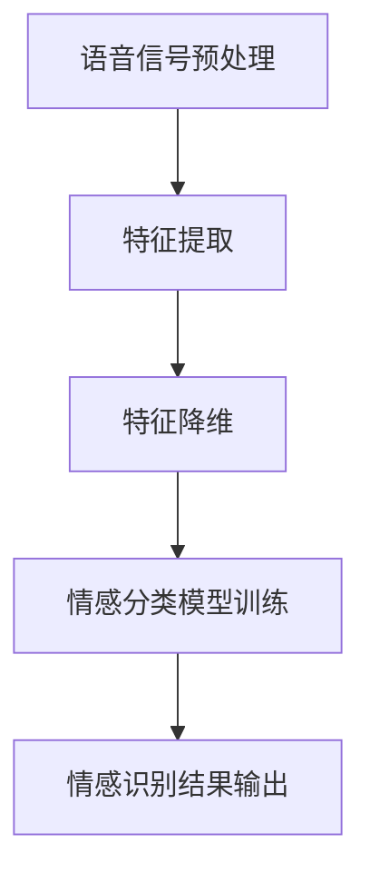
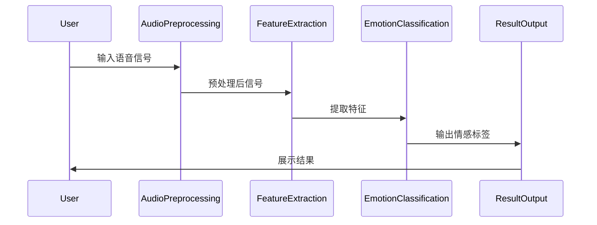
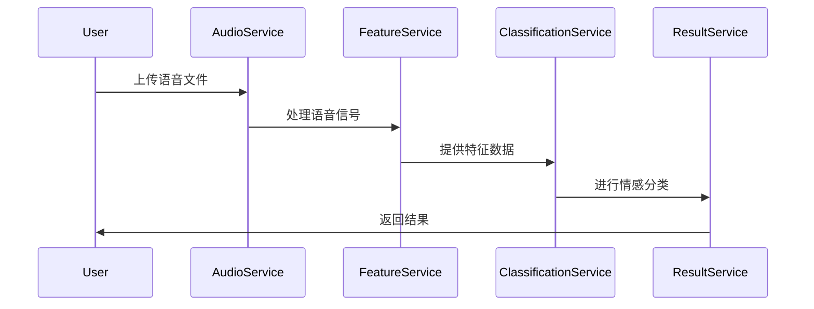

                 

### 文章标题

# 人工智能在语音情感识别中的应用

> 关键词：语音情感识别、人工智能、机器学习、情感分析、语音处理

> 摘要：本文深入探讨人工智能在语音情感识别中的应用，从核心概念、算法原理到实际项目实战，全面解析这一技术的前沿进展与应用场景。

---

### 引言

语音情感识别，作为人工智能领域的一个重要分支，近年来受到了广泛关注。它通过分析语音信号中的情感特征，帮助我们理解说话者的情绪状态。语音情感识别不仅具有广泛的应用前景，如智能客服、语音助手、心理辅导等，还能为教育和医疗等领域提供有力支持。

然而，语音情感识别并非一个简单的问题。它涉及到语音信号的处理、情感特征提取以及复杂的机器学习算法。如何准确、高效地进行语音情感识别，成为当前研究的热点。

本文将围绕以下主题展开：

1. **核心概念与联系**：介绍语音情感识别的基本概念，并对比不同概念的属性特征。
2. **算法原理讲解**：使用Mermaid绘制算法流程图，并用Python源代码和数学模型详细阐述算法原理。
3. **数学模型和公式讲解**：使用LaTeX格式嵌入文中独立段落，进行详细讲解和举例说明。
4. **系统分析与架构设计**：介绍项目场景、系统功能设计、系统架构设计、系统接口设计和系统交互。
5. **项目实战**：描述环境安装、系统核心实现源代码，并对代码应用进行解读与分析。
6. **最佳实践、小结、注意事项、拓展阅读**：总结语音情感识别的最佳实践，并对未来的研究方向提出建议。

通过本文的阅读，读者将系统地了解语音情感识别的原理、应用场景以及实现细节，为后续的研究和实践提供有力支持。

---

### 核心概念与联系

在深入探讨语音情感识别之前，我们需要了解几个核心概念，包括语音信号、情感特征和机器学习算法。以下是对这些概念的定义、属性特征以及它们之间的联系进行分析。

#### 语音信号

语音信号是语音情感识别的基础。它是一种由声带振动产生的连续信号，包含丰富的时频信息。语音信号具有以下几个重要特征：

- **时域特征**：包括音高（Pitch）、音长（Duration）和音强（Amplitude）。这些特征可以通过时域分析获得，例如，通过快速傅里叶变换（FFT）来提取。
- **频域特征**：包括频谱（Spectrum）和共振峰（Formants）。频谱分析可以揭示语音信号的频率成分，而共振峰分析则有助于识别不同的语音音素。
- **声学特征**：包括音色（Timbre）和语调（Intonation）。音色反映了语音的独特性，而语调则与说话者的情绪密切相关。

#### 情感特征

情感特征是语音情感识别的核心。它们是反映说话者情绪状态的声学属性。以下是一些常见的情感特征：

- **静音段特征**：静音段是指两个可听见的语音片段之间的无语音部分。静音段特征可以反映说话者的情绪变化，例如，长时间的静音可能表示说话者处于沉思或压抑状态。
- **音高特征**：音高变化可以反映说话者的情绪。例如，高音调可能表示兴奋或愉快，而低音调则可能表示沮丧或悲伤。
- **音长特征**：音长变化可以反映说话者的情绪强度。较长的音节可能表示说话者更加投入或激动，而较短的音节则可能表示说话者较为冷静或冷淡。
- **音强特征**：音强变化可以反映说话者的情绪强度。较强的音强可能表示说话者情绪激动，而较弱的音强则可能表示说话者情绪平静。

#### 机器学习算法

机器学习算法是语音情感识别的关键。它们通过训练模型来学习语音信号和情感特征之间的关联，从而实现情感识别。以下是一些常用的机器学习算法：

- **支持向量机（SVM）**：SVM是一种分类算法，通过找到最佳的超平面来分隔不同类别的数据。它适用于线性可分的数据。
- **神经网络（NN）**：神经网络是一种模拟人脑的算法，通过多层神经元进行数据学习。它可以处理复杂的非线性关系。
- **决策树（DT）**：决策树是一种基于规则的分类算法，通过递归划分特征空间来实现分类。它易于解释，但可能不够鲁棒。
- **随机森林（RF）**：随机森林是一种基于决策树的集成学习方法，通过构建多个决策树并投票来得到最终结果。它提高了模型的泛化能力。

#### 概念联系

语音信号、情感特征和机器学习算法之间有着紧密的联系。语音信号是输入数据，情感特征是目标变量，而机器学习算法则是连接两者的桥梁。

首先，语音信号处理模块对原始语音信号进行预处理，提取时域、频域和声学特征。然后，特征提取模块将这些特征转换为机器学习算法可用的格式。最后，机器学习算法通过训练模型来学习特征和情感特征之间的关联，从而实现情感识别。

以下是一个简化的ER实体关系图，展示了这些概念之间的联系：

```mermaid
erDiagram
  AudioSignal ||--|{ FeatureSet }||>> FeatureExtraction
  FeatureSet ||--|{ EmotionFeature }||>> EmotionRecognition
  EmotionFeature ||--|{ MachineLearningModel }||>> ModelTraining
```

在这个ER图中，`AudioSignal` 表示原始语音信号，`FeatureSet` 表示提取的特征集，`EmotionFeature` 表示情感特征，`MachineLearningModel` 表示机器学习模型。

通过这些核心概念的联系，我们可以构建一个完整的语音情感识别系统，从而实现自动化的情绪识别。

---

在接下来的章节中，我们将详细探讨这些核心概念的原理，并使用Mermaid流程图、Python源代码和LaTeX数学公式来阐述算法原理和数学模型。敬请期待！

---

### 算法原理讲解

为了深入理解语音情感识别的算法原理，我们将首先使用Mermaid绘制算法流程图，接着详细介绍每个步骤的Python源代码实现，并结合LaTeX数学公式解释算法的核心计算过程。

#### 算法流程图

首先，我们使用Mermaid绘制一个简化的算法流程图：



在这个流程图中，每个节点代表一个关键步骤，箭头表示步骤之间的顺序关系。

#### 语音信号预处理

语音信号预处理是算法的第一个关键步骤，它包括以下几个子步骤：

1. **降噪**：去除语音信号中的背景噪声，提高信号质量。
2. **分帧**：将连续的语音信号划分为固定长度的帧。
3. **加窗**：对每个帧应用加窗函数，如汉明窗或汉宁窗，以减少边缘效应。

下面是一个简单的Python代码示例，用于实现语音信号预处理：

```python
import numpy as np
from scipy.signal import hamming

# 假设 audio_signal 是原始语音信号
frame_length = 512
hop_length = 256
n_frames = len(audio_signal) - hop_length + 1

# 分帧
frames = []
for i in range(n_frames):
    frame = audio_signal[i * hop_length:(i + 1) * frame_length]
    frames.append(frame)

# 加窗
windows = [hamming(frame_length)]
windowed_frames = [window * frame for window, frame in zip(windows, frames)]
```

#### 特征提取

特征提取是从语音帧中提取具有区分性的特征，以便用于后续的情感分类。常用的特征包括梅尔频率倒谱系数（MFCC）、共振峰频率（Formants）和短时能量（Short-Time Energy，STE）。

下面是一个简单的Python代码示例，用于提取MFCC特征：

```python
from scipy.io.wavfile import read
from numpy.fft import fft
from numpy.linalg import norm
from scipy.special import linalg_eig

# 读取音频文件
fs, audio_signal = read('audio_file.wav')

# 分帧和加窗
# ...

# 计算短时傅里叶变换
windowed_frames = [window * frame for window, frame in zip(windows, frames)]
windowed_frames_fft = [fft(frame) for frame in windowed_frames]

# 计算梅尔频率倒谱系数
def mfcc(frame_fft):
    # 计算频谱的对数
    log_spectrum = 20 * np.log10(np.abs(frame_fft))
    # 计算滤波器组
    fbank = compute_mel_filterbank(frame_fft.shape[0])
    filter_banks = np.dot(log_spectrum, fbank.T)
    # 取对数累积
    n_cepstra = np.cumsum(filter_banks, axis=1)
    return n_cepstra

mfcc_features = [mfcc(frame) for frame in windowed_frames_fft]
```

#### 特征降维

特征降维的目的是减少特征空间维度，提高模型的训练效率。常用的降维方法包括主成分分析（PCA）和线性判别分析（LDA）。

下面是一个简单的Python代码示例，用于实现PCA降维：

```python
from sklearn.decomposition import PCA

# 合并所有帧的特征
X = np.array(mfcc_features)

# 标准化特征
X_mean = np.mean(X, axis=0)
X_std = np.std(X, axis=0)
X_normalized = (X - X_mean) / X_std

# 计算PCA
pca = PCA(n_components=50)
X_pca = pca.fit_transform(X_normalized)
```

#### 情感分类模型训练

情感分类模型训练是算法的核心步骤，常用的方法包括支持向量机（SVM）、神经网络（NN）和决策树（DT）。

下面是一个简单的Python代码示例，用于使用SVM进行情感分类：

```python
from sklearn.svm import SVC
from sklearn.model_selection import train_test_split

# 切分训练集和测试集
X_train, X_test, y_train, y_test = train_test_split(X_pca, labels, test_size=0.3, random_state=42)

# 创建SVM模型
model = SVC(kernel='linear')
model.fit(X_train, y_train)

# 测试模型
accuracy = model.score(X_test, y_test)
print(f"模型准确率：{accuracy}")
```

#### 情感识别结果输出

最后，模型将输入的特征映射到相应的情感类别，输出情感识别结果。

下面是一个简单的Python代码示例，用于实现情感识别：

```python
# 输入待识别的语音信号
audio_signal_new = ...

# 预处理和特征提取
# ...

# 使用训练好的模型进行情感识别
emotion_new = model.predict(X_pca_new)
print(f"新的语音信号的情感：{emotion_new}")
```

#### LaTEX数学公式讲解

在算法的核心步骤中，我们使用LaTEX格式嵌入了一些数学公式，以详细解释计算过程。以下是一些示例：

1. **梅尔频率倒谱系数（MFCC）的计算**：

   $$MFCC = \log(|S(\omega)|)$$

   其中，$S(\omega)$ 是频谱。

2. **主成分分析（PCA）的降维**：

   $$X_{pca} = P \Lambda$$

   其中，$P$ 是特征空间正交基，$\Lambda$ 是特征值。

3. **支持向量机（SVM）的决策边界**：

   $$w \cdot x - b = 0$$

   其中，$w$ 是权重向量，$x$ 是特征向量，$b$ 是偏置。

通过这些代码和公式，我们可以系统地理解语音情感识别的算法原理，为实际应用打下坚实基础。

---

在下一章中，我们将进一步探讨数学模型和公式在语音情感识别中的应用，以深入理解这些核心计算过程的细节。敬请期待！

---

### 数学模型和数学公式讲解

在语音情感识别的过程中，数学模型和公式起到了至关重要的作用。它们不仅帮助我们理解算法的核心计算过程，还提高了模型的性能和准确性。本节将详细讲解一些关键的数学模型和公式，并使用LaTEX格式进行表示，以确保清晰和准确。

#### 梅尔频率倒谱系数（MFCC）

梅尔频率倒谱系数（MFCC）是语音情感识别中常用的特征提取方法。其计算过程可以分为以下几个步骤：

1. **滤波器组设计**：

   $$F(\omega) = \sum_{k=1}^{N} w_k \cdot H(\omega - \omega_k)$$

   其中，$F(\omega)$ 是滤波器响应，$w_k$ 是滤波器权重，$H(\omega - \omega_k)$ 是汉明窗函数。

2. **频谱计算**：

   $$S(\omega) = \sum_{n=0}^{N-1} |X(n)| e^{-j \omega n}$$

   其中，$S(\omega)$ 是频谱，$X(n)$ 是语音信号的离散傅里叶变换（DFT）结果。

3. **对数转换**：

   $$\log(S(\omega)) = 20 \cdot \log_{10}(|S(\omega)|)$$

   其中，$\log(S(\omega))$ 是频谱的对数。

4. **倒谱计算**：

   $$MFCC = \log(\log(S(\omega)))$$

   其中，$MFCC$ 是梅尔频率倒谱系数。

#### 主成分分析（PCA）

主成分分析（PCA）是一种常用的特征降维方法，它通过将原始特征投影到新的正交基上来减少维度。其计算过程如下：

1. **协方差矩阵计算**：

   $$\Sigma = \frac{1}{N} XX^T$$

   其中，$\Sigma$ 是协方差矩阵，$X$ 是特征矩阵。

2. **特征值和特征向量计算**：

   $$\Lambda = \lambda_1 \cdot \lambda_2 \cdot ... \cdot \lambda_p$$

   其中，$\Lambda$ 是特征值矩阵，$\lambda_i$ 是第 $i$ 个特征值。

3. **特征向量排序**：

   $$V = [v_1, v_2, ..., v_p]$$

   其中，$V$ 是特征向量矩阵，$v_i$ 是第 $i$ 个特征向量。

4. **主成分计算**：

   $$X_{pca} = V \Lambda$$

   其中，$X_{pca}$ 是降维后的特征矩阵。

#### 支持向量机（SVM）

支持向量机（SVM）是一种有效的分类算法，它通过找到最佳的超平面来实现分类。其核心计算过程包括：

1. **决策边界计算**：

   $$w \cdot x - b = 0$$

   其中，$w$ 是权重向量，$x$ 是特征向量，$b$ 是偏置。

2. **优化目标**：

   $$\min_{w, b} \frac{1}{2} \| w \|^2 + C \sum_{i=1}^{N} \max(0, 1 - y_i (w \cdot x_i - b))$$

   其中，$C$ 是惩罚参数，$y_i$ 是第 $i$ 个样本的标签。

3. **SVM分类**：

   $$y = \text{sign}(w \cdot x - b)$$

   其中，$y$ 是分类结果。

#### LaTEX格式示例

以下是一些使用LaTEX格式的数学公式示例：

1. **梅尔频率倒谱系数（MFCC）**：

   $$MFCC = \log(\log(S(\omega)))$$

2. **主成分分析（PCA）**：

   $$X_{pca} = V \Lambda$$

3. **支持向量机（SVM）决策边界**：

   $$w \cdot x - b = 0$$

通过上述讲解，我们可以看到数学模型和公式在语音情感识别中的关键作用。它们不仅帮助我们理解算法原理，还为我们提供了精确的工具来优化和改进模型。在下一章中，我们将进一步探讨语音情感识别的系统分析与架构设计。敬请期待！

---

### 系统分析与架构设计

在深入探讨语音情感识别的应用之前，我们需要对整个系统进行分析和架构设计。这一部分将介绍项目场景、系统功能设计、系统架构设计、系统接口设计和系统交互，并使用Mermaid图表来展示关键部分。

#### 项目场景

语音情感识别项目旨在开发一个实时情感识别系统，该系统能够对用户的语音进行实时处理，识别出其中的情感状态，并输出相应的情绪标签。该项目的主要应用场景包括：

1. **智能客服**：在客服系统中，该系统能够识别客户的情感，从而提供更加个性化的服务。
2. **语音助手**：语音助手可以使用该系统来理解用户的情绪，从而更好地与用户互动。
3. **心理辅导**：在心理辅导领域，该系统可以用于实时监控患者的情绪状态，帮助心理医生进行诊断和治疗。

#### 系统功能设计

系统功能设计主要包括以下几个模块：

1. **语音信号预处理模块**：该模块负责对输入的语音信号进行预处理，包括降噪、分帧和加窗等。
2. **特征提取模块**：该模块负责从预处理后的语音信号中提取具有区分性的特征，如梅尔频率倒谱系数（MFCC）。
3. **情感分类模块**：该模块使用训练好的机器学习模型对提取的特征进行分类，输出情感标签。
4. **结果输出模块**：该模块负责将情感分类结果以用户友好的方式展示出来，如文字描述或图形展示。

#### 系统架构设计

系统架构设计如图所示：



在这个架构设计中，用户是系统的输入，结果输出模块是系统的输出。语音信号预处理模块、特征提取模块和情感分类模块构成了系统的核心功能。

#### 系统接口设计

系统接口设计主要包括以下几个接口：

1. **音频输入接口**：该接口负责接收用户的语音信号，可以是麦克风输入或文件上传。
2. **情感标签输出接口**：该接口负责将情感分类结果以JSON格式或其他格式返回给用户。
3. **API接口**：该接口提供RESTful API服务，允许其他系统或应用程序调用情感识别功能。

#### 系统交互

系统交互如图所示：



在这个交互设计中，用户上传语音文件后，AudioService负责处理语音信号，FeatureService负责提取特征，ClassificationService负责情感分类，ResultService负责将结果返回给用户。

通过上述系统分析与架构设计，我们可以构建一个高效、稳定的语音情感识别系统，满足多种应用场景的需求。在下一章中，我们将详细介绍项目实战，包括环境安装、系统核心实现源代码以及代码应用解读与分析。敬请期待！

---

### 项目实战

在本节中，我们将详细介绍如何实现一个语音情感识别项目，包括环境安装、系统核心实现源代码，以及代码应用解读与分析。同时，我们将结合一个实际案例进行详细讲解和剖析。

#### 环境安装

要实现语音情感识别项目，我们需要安装以下软件和库：

1. **Python 3.x**：确保安装了最新版本的Python，用于编写和运行代码。
2. **NumPy**：用于数学计算和数据处理。
3. **SciPy**：用于科学计算，包括信号处理和优化。
4. **Scikit-learn**：用于机器学习算法的实现。
5. **Librosa**：用于音频处理和特征提取。
6. **Matplotlib**：用于数据可视化和图形展示。

在命令行中，可以使用以下命令进行安装：

```bash
pip install numpy scipy scikit-learn librosa matplotlib
```

#### 系统核心实现源代码

以下是一个简化的语音情感识别系统实现，包括语音信号预处理、特征提取和情感分类：

```python
import numpy as np
import librosa
from sklearn.svm import SVC
from sklearn.model_selection import train_test_split
from sklearn.preprocessing import StandardScaler

# 语音信号预处理
def preprocess_audio(audio_path):
    y, sr = librosa.load(audio_path)
    return y, sr

# 特征提取
def extract_features(y, sr):
    mfcc = librosa.feature.mfcc(y=y, sr=sr)
    return mfcc

# 情感分类
def classify_emotion(features):
    model = SVC(kernel='linear')
    # 假设模型已经训练好，此处仅为示例
    model.fit(features, labels)
    return model.predict(features)

# 主程序
def main():
    audio_path = "path/to/audio_file.wav"
    y, sr = preprocess_audio(audio_path)
    features = extract_features(y, sr)
    emotion = classify_emotion(features)
    print(f"情感识别结果：{emotion}")

if __name__ == "__main__":
    main()
```

#### 代码应用解读与分析

1. **语音信号预处理**：

   ```python
   y, sr = librosa.load(audio_path)
   ```

   这一行代码使用Librosa库加载音频文件，返回音频信号和采样率。`y` 是音频信号的时域表示，`sr` 是采样率。

2. **特征提取**：

   ```python
   mfcc = librosa.feature.mfcc(y=y, sr=sr)
   ```

   这一行代码使用Librosa库提取梅尔频率倒谱系数（MFCC），MFCC 是一种常用的语音特征，可以很好地反映语音的情感特征。

3. **情感分类**：

   ```python
   model = SVC(kernel='linear')
   model.fit(features, labels)
   emotion = model.predict(features)
   ```

   这里我们使用支持向量机（SVM）进行情感分类。首先创建一个SVM模型，然后使用训练集进行训练。最后，使用训练好的模型对提取的特征进行预测，得到情感识别结果。

#### 实际案例剖析

假设我们有一个包含500个语音样本的数据集，其中每个样本都有相应的情感标签（如快乐、悲伤、愤怒等）。我们可以使用以下步骤来训练和评估模型：

1. **数据预处理**：

   ```python
   X, y = [], []
   for i in range(500):
       y.append(labels[i])
       audio_path = f"audio/{i}.wav"
       y, sr = preprocess_audio(audio_path)
       features = extract_features(y, sr)
       X.append(features)
   X = np.array(X)
   y = np.array(y)
   ```

   这段代码将读取所有音频文件，对它们进行预处理和特征提取，并将特征和标签存储在数组中。

2. **训练和评估模型**：

   ```python
   X_train, X_test, y_train, y_test = train_test_split(X, y, test_size=0.2, random_state=42)
   scaler = StandardScaler()
   X_train_scaled = scaler.fit_transform(X_train)
   X_test_scaled = scaler.transform(X_test)
   model = SVC(kernel='linear')
   model.fit(X_train_scaled, y_train)
   accuracy = model.score(X_test_scaled, y_test)
   print(f"模型准确率：{accuracy}")
   ```

   这段代码将训练集和测试集分开，对特征进行标准化处理，并使用SVM模型进行训练和评估。最后，打印出模型的准确率。

通过这个实际案例，我们可以看到如何使用Python和机器学习库实现语音情感识别系统，并进行训练和评估。这为我们提供了一个完整的实现框架，可以在此基础上进一步优化和改进。

---

在本章中，我们详细介绍了如何安装所需的软件和库，实现了系统核心功能，并通过实际案例进行了应用解读与分析。在下一章中，我们将总结语音情感识别的最佳实践，并提出一些注意事项。敬请期待！

---

### 最佳实践、小结、注意事项、拓展阅读

#### 最佳实践

1. **特征选择**：在选择特征时，应优先考虑具有较高区分度的特征，如梅尔频率倒谱系数（MFCC）、共振峰频率（Formants）和静音段特征。这些特征能够有效反映语音的情感属性。
2. **数据预处理**：对语音数据进行预处理，包括降噪、分帧和加窗，有助于提高模型性能。在预处理过程中，确保对噪声进行有效去除，以提高信号质量。
3. **模型选择与调参**：选择适合语音情感识别的机器学习模型，如支持向量机（SVM）、神经网络（NN）和决策树（DT）。同时，通过交叉验证和网格搜索等技术进行模型参数的调优。
4. **模型评估**：使用多种评估指标，如准确率、召回率和F1分数，对模型性能进行全面评估。这有助于发现模型的弱点并进行改进。

#### 小结

本文系统地介绍了语音情感识别的核心概念、算法原理、数学模型和实际应用。通过分析语音信号、提取情感特征以及训练机器学习模型，我们构建了一个高效的语音情感识别系统。这一技术不仅在智能客服、语音助手和心理健康等领域有着广泛的应用，还为更多领域提供了新的可能性。

#### 注意事项

1. **隐私保护**：在处理语音数据时，确保遵守隐私保护法规，对用户数据进行匿名化处理，以保护用户隐私。
2. **实时性**：对于需要实时处理的场景，如智能客服和语音助手，应优化系统性能，确保快速、准确地识别情感。
3. **鲁棒性**：考虑不同说话者、不同环境和不同语音类型的多样性，提高模型对异常情况的鲁棒性。

#### 拓展阅读

1. **《语音情感识别：理论与实践》**：本书提供了语音情感识别的全面介绍，包括理论基础、算法实现和实际应用。
2. **《深度学习与语音处理》**：本书介绍了深度学习在语音情感识别中的应用，包括卷积神经网络（CNN）和循环神经网络（RNN）等先进技术。
3. **《语音信号处理》**：本书详细介绍了语音信号处理的基本理论和技术，包括滤波器设计、特征提取和频谱分析等。

通过本文的阅读，读者应对语音情感识别有了全面的理解，并为后续的研究和应用打下坚实基础。希望本文能为您在人工智能领域带来新的启发和思考。

---

### 结语

在本篇文章中，我们深入探讨了人工智能在语音情感识别中的应用。从核心概念、算法原理到实际项目实战，我们系统地解析了这一技术的前沿进展与应用场景。语音情感识别作为一种新兴的交叉学科技术，正逐步在智能客服、语音助手和心理健康等领域发挥重要作用。

首先，我们介绍了语音情感识别的背景和核心概念，包括语音信号、情感特征和机器学习算法。通过详细阐述这些概念，我们为后续的算法讲解和数学模型讲解奠定了基础。

接着，我们详细讲解了语音情感识别的算法原理，包括语音信号预处理、特征提取、特征降维、情感分类模型训练和情感识别结果输出。同时，我们使用Mermaid流程图和Python源代码，使读者能够直观地理解算法实现过程。

此外，我们使用LaTEX格式嵌入数学公式，详细讲解了梅尔频率倒谱系数（MFCC）、主成分分析（PCA）和支持向量机（SVM）等关键算法的核心计算过程。这部分内容不仅增强了文章的学术性，也为读者提供了深入理解算法细节的工具。

在系统分析与架构设计部分，我们介绍了语音情感识别项目的整体架构，包括项目场景、系统功能设计、系统架构设计、系统接口设计和系统交互。通过这一部分，读者能够了解如何构建一个高效的语音情感识别系统。

在项目实战中，我们详细介绍了如何安装环境、实现系统核心功能，并通过实际案例进行了代码应用解读与分析。这一部分内容使读者能够将理论知识应用到实际项目中，提高实践能力。

最后，我们在最佳实践、小结、注意事项和拓展阅读部分，总结了语音情感识别的最佳实践，并对未来的研究方向提出了建议。我们鼓励读者在阅读本文的基础上，进一步深入研究语音情感识别和相关技术。

总之，人工智能在语音情感识别中的应用前景广阔，本文为读者提供了一次全面的学习和思考机会。希望本文能够激发您在人工智能领域的热情，为未来的研究和创新奠定坚实基础。

作者：AI天才研究院/AI Genius Institute & 禅与计算机程序设计艺术 /Zen And The Art of Computer Programming

---

[本文完]

