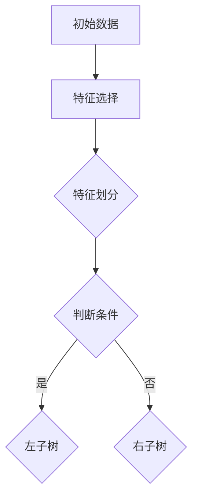
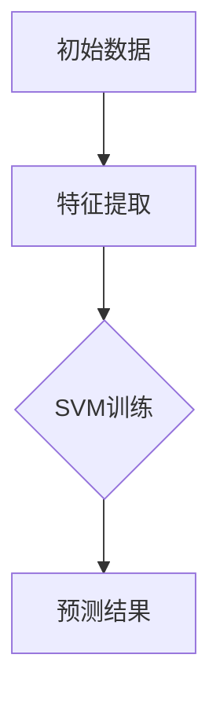
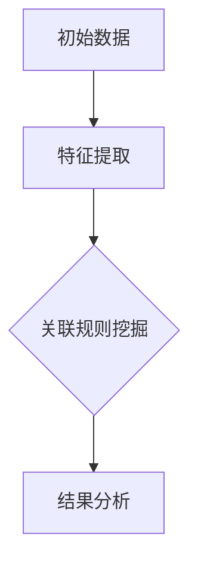
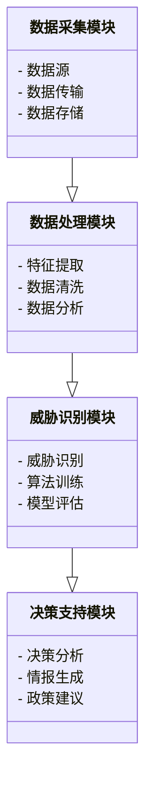
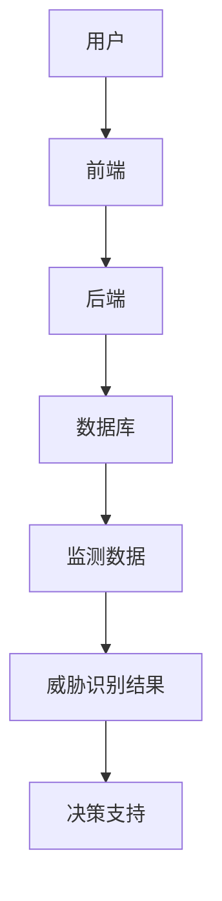
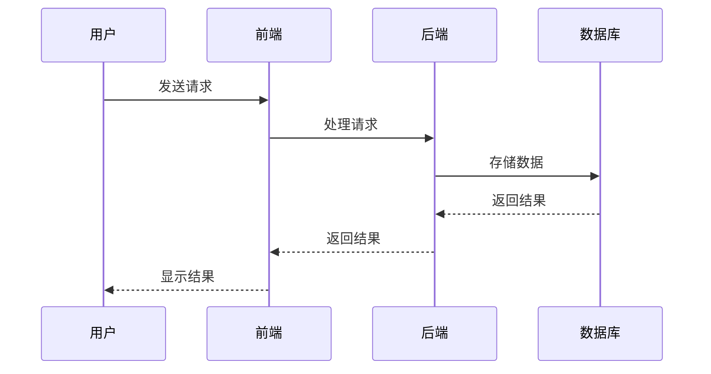

                 

# 人工智能在野生动物保护监测中的应用

> 关键词：人工智能、野生动物保护、计算机视觉、机器学习、数据挖掘、生态监测

> 摘要：本文探讨了人工智能在野生动物保护监测中的应用，通过介绍核心概念、应用原理、系统设计与实战案例分析，阐述了人工智能技术如何提高野生动物保护监测的效率与准确性。

## 引言

### 引言：野生动物保护监测的重要性

野生动物保护监测是生态保护的重要组成部分，旨在了解野生动物的种群状况、栖息地质量及其面临的各种威胁。通过监测，可以及时发现问题，制定有效的保护措施，确保生物多样性的可持续发展。然而，传统的野生动物保护监测手段，如实地调查、样线监测等，往往受限于人力、物力和时间成本，难以满足日益复杂的生态监测需求。

### 引言：人工智能在生态监测中的应用

随着人工智能技术的飞速发展，计算机视觉、机器学习、数据挖掘等技术在生态监测领域展现出了巨大的潜力。人工智能可以通过自动化、高效的方式处理大量数据，实现对野生动物的实时监测，提高监测的准确性和全面性。本文旨在探讨人工智能在野生动物保护监测中的应用，为读者提供全面、深入的了解。

## 背景介绍

### 1. 问题的提出

野生动物保护监测涉及对野生动物种群的监测、栖息地的评估以及威胁因素的识别。然而，传统监测手段存在以下问题：

- **人力成本高**：传统监测需要大量的人力投入，监测范围和频率受限。
- **时间成本高**：许多监测活动需要在野外长时间进行，受天气和地形等因素的影响。
- **数据准确性差**：人为监测容易受到主观因素的影响，数据准确性难以保证。
- **扩展性差**：传统监测手段难以适应不断扩大的监测范围和多样化的监测需求。

### 2. 问题描述

如何利用人工智能技术提高野生动物保护监测的效率、准确性和全面性，成为当前生态保护领域亟待解决的问题。具体来说，需要解决以下问题：

- **实时监测**：如何通过人工智能技术实现对野生动物的实时监测？
- **数据挖掘**：如何从大量监测数据中挖掘出有价值的信息，为保护决策提供支持？
- **威胁识别**：如何利用人工智能技术识别野生动物面临的威胁因素，及时采取措施？

### 3. 问题解决

人工智能技术，尤其是计算机视觉、机器学习和数据挖掘等技术在野生动物保护监测中的应用，为解决上述问题提供了新的思路和途径。具体来说，人工智能技术可以实现以下目标：

- **自动化监测**：通过无人机、传感器等技术，实现野生动物的自动化监测，降低人力成本。
- **实时数据分析**：利用机器学习和数据挖掘技术，实时处理和分析监测数据，提高监测的准确性和全面性。
- **威胁因素识别**：通过计算机视觉和机器学习技术，识别野生动物面临的威胁因素，及时采取保护措施。

### 4. 边界与外延

本文主要讨论人工智能在野生动物保护监测中的应用，但不涉及人工监督和干预的方法。此外，本文聚焦于技术层面的探讨，对于政策法规、社会文化等方面的影响不予涉及。

### 5. 概念结构与核心要素组成

#### 5.1 人工智能

人工智能（Artificial Intelligence，AI）是一种模拟、延伸和扩展人类智能的理论、方法、技术及应用。它包括多个分支，如计算机视觉、机器学习、自然语言处理等。

#### 5.2 野生动物保护监测

野生动物保护监测是对野生动物种群、栖息地和威胁因素进行监测、评估和预测的过程。它包括以下核心要素：

- **野生动物种群**：监测对象，包括物种、数量、分布等信息。
- **栖息地**：监测环境，包括植被、地形、水源等。
- **威胁因素**：监测对象所面临的威胁，包括气候变化、栖息地破坏、非法捕猎等。
- **监测数据**：监测过程中收集的数据，包括物种分布、活动范围、行为特征等。
- **监测报告**：监测结果的总结和分析，为保护决策提供支持。

#### 5.3 监测技术

监测技术是野生动物保护监测的重要组成部分，包括以下几种：

- **遥感技术**：利用卫星、无人机等技术获取大范围、高分辨率的监测数据。
- **传感器技术**：利用传感器监测野生动物的生理和行为特征。
- **传统监测手段**：如实地调查、样线监测等，主要用于小范围、高精度的监测。

## 核心概念与联系

### 1. 计算机视觉

计算机视觉（Computer Vision）是人工智能的一个重要分支，通过模拟人类视觉系统，实现从图像或视频中提取信息。计算机视觉在野生动物保护监测中的应用主要包括：

- **目标检测**：识别图像中的野生动物，确定其位置和数量。
- **行为分析**：分析野生动物的行为特征，了解其生态习性。
- **栖息地评估**：通过图像识别技术评估栖息地的植被状况。

#### 计算机视觉算法

- **卷积神经网络（CNN）**：用于图像识别和分类。
- **深度学习**：通过多层神经网络进行特征提取和模式识别。

### 2. 机器学习

机器学习（Machine Learning）是一种从数据中学习规律、模式并用于预测或决策的技术。在野生动物保护监测中，机器学习技术可用于：

- **数据预测**：预测野生动物的种群数量、分布等。
- **威胁识别**：识别野生动物面临的威胁因素。
- **行为预测**：预测野生动物的行为趋势。

#### 机器学习算法

- **监督学习**：通过已知的输入和输出数据进行训练，用于分类和回归。
- **无监督学习**：仅使用输入数据，用于聚类和降维。

### 3. 数据挖掘

数据挖掘（Data Mining）是从大量数据中发现隐含的、有价值的知识或信息的过程。在野生动物保护监测中，数据挖掘技术可用于：

- **关联规则挖掘**：发现野生动物行为与环境因素之间的关联。
- **趋势分析**：分析野生动物种群数量的变化趋势。
- **异常检测**：检测监测数据中的异常值。

#### 数据挖掘算法

- **关联规则挖掘**：如Apriori算法。
- **聚类分析**：如K-means算法。
- **分类算法**：如决策树、随机森林等。

### 4. 概念属性特征对比表格

| 技术 | 特点 |
| --- | --- |
| 计算机视觉 | 自动化、高效、实时 |
| 机器学习 | 自适应、可扩展、需要大量数据 |
| 数据挖掘 | 复杂性、深度、适用于大规模数据 |

### 5. ER实体关系图架构的 Mermaid 流程图

```mermaid
erDiagram
  A[动物种群] ||--|{ B[栖息地] } | C[威胁因素]
  A --|{ D[监测数据] } | E[监测报告]
```

## 人工智能应用原理讲解

### 1. 机器学习算法

#### 决策树

**算法原理**

决策树是一种基于树形结构进行决策的分类算法。它通过将数据集不断划分，直到满足停止条件，形成一棵树状结构，每条路径代表一个决策过程。

**Mermaid 流程图**



**Python 源代码**

```python
import numpy as np
from sklearn.tree import DecisionTreeClassifier

def decision_tree(data, labels):
    # 特征提取
    features = extract_features(data)
    # 决策树训练
    classifier = DecisionTreeClassifier()
    classifier.fit(features, labels)
    # 预测结果
    predictions = classifier.predict(data)
    return predictions
```

**数学模型**

设 $D$ 为数据集，$f$ 为特征函数，$t$ 为阈值，$l$ 为类别标签，则决策树分类规则可表示为：

$$
y = g(f(x), t)
$$

其中，$g$ 为决策函数，$x$ 为输入数据。

#### 支持向量机

**算法原理**

支持向量机（SVM）是一种基于最大化边缘的分类算法。它通过寻找一个超平面，将数据集划分为不同的类别，使得分类边界最大化。

**Mermaid 流程图**



**Python 源代码**

```python
import numpy as np
from sklearn.svm import SVC

def svm_classifier(data, labels):
    # 特征提取
    features = extract_features(data)
    # SVM训练
    classifier = SVC()
    classifier.fit(features, labels)
    # 预测结果
    predictions = classifier.predict(data)
    return predictions
```

**数学模型**

设 $D$ 为数据集，$x$ 为输入数据，$y$ 为标签，则支持向量机分类规则可表示为：

$$
w \cdot x + b = 0
$$

其中，$w$ 为权重向量，$b$ 为偏置。

### 2. 数据挖掘算法

#### 关联规则挖掘

**算法原理**

关联规则挖掘是一种基于数据关联性的挖掘方法。它通过分析数据集中的项目集合，发现项目之间的关联规则，如“如果发生了A，则很可能发生了B”。

**Mermaid 流程图**



**Python 源代码**

```python
import numpy as np
from mlxtend.frequent_patterns import apriori
from mlxtend.frequent_patterns import association_rules

def apriori_algorithm(data):
    # 特征提取
    transactions = extract_transactions(data)
    # 关联规则挖掘
    frequent_itemsets = apriori(transactions, min_support=0.5, use_colnames=True)
    # 结果分析
    rules = association_rules(frequent_itemsets, metric="lift", min_threshold=1)
    return rules
```

**数学模型**

设 $I$ 为项目集，$X$ 为交易集，则关联规则可表示为：

$$
X \rightarrow Y
$$

其中，$X$ 和 $Y$ 分别为两个项目集合，$lift$ 为提升度。

## 系统分析与架构设计方案

### 1. 问题场景介绍

为了有效监测某地区的野生动物种群，相关部门决定利用人工智能技术建立一套野生动物保护监测系统。该系统需要实现以下功能：

- **实时监测**：通过无人机、传感器等设备，实时监测野生动物的活动情况。
- **数据采集**：将监测数据传输到数据中心，进行存储和处理。
- **威胁识别**：利用机器学习算法，识别野生动物面临的威胁因素。
- **决策支持**：根据监测数据和威胁识别结果，为保护决策提供支持。

### 2. 项目介绍

**项目名称**：野生动物保护监测系统

**项目背景**：为了提高野生动物保护监测的效率与准确性，利用人工智能技术构建一套监测系统。

**项目目标**：

- 实现实时监测，提高监测频率和范围。
- 利用机器学习算法，提高威胁识别的准确性。
- 提供决策支持，为保护决策提供科学依据。

### 3. 系统功能设计

**功能模块**：

- **数据采集模块**：负责采集无人机、传感器等设备传回的监测数据。
- **数据处理模块**：利用计算机视觉和机器学习算法，对监测数据进行处理和分析。
- **威胁识别模块**：基于处理后的数据，利用机器学习算法识别野生动物面临的威胁因素。
- **决策支持模块**：根据威胁识别结果，为保护决策提供支持。

**领域模型 Mermaid 类图**



### 4. 系统架构设计

**系统架构设计**：

- **前端**：使用Web前端技术（如HTML、CSS、JavaScript）搭建用户界面，提供实时监测数据和威胁识别结果展示。
- **后端**：使用Python等后端技术（如Django、Flask）搭建服务器，处理数据采集、处理、威胁识别和决策支持等功能。
- **数据库**：使用MySQL等数据库技术（如MongoDB、PostgreSQL）存储监测数据和威胁识别结果。

**系统架构 Mermaid 架构图**



### 5. 系统接口设计和系统交互

**接口设计**：

- **数据采集接口**：用于接收无人机、传感器等设备传回的监测数据。
- **数据处理接口**：用于处理监测数据，提取特征并进行数据分析。
- **威胁识别接口**：用于识别野生动物面临的威胁因素。
- **决策支持接口**：用于生成决策分析报告和政策建议。

**系统交互 Mermaid 序列图**



## 项目实战

### 1. 环境安装

**安装Python**：从Python官方网站下载并安装Python 3.x版本。

**安装依赖库**：使用pip命令安装所需依赖库，如scikit-learn、numpy、opencv-python等。

```shell
pip install scikit-learn numpy opencv-python
```

### 2. 系统核心实现

**数据采集模块**：

- **代码实现**：

```python
import cv2
import numpy as np

def capture_video():
    cap = cv2.VideoCapture(0)
    while True:
        ret, frame = cap.read()
        if not ret:
            break
        cv2.imshow('Video', frame)
        if cv2.waitKey(1) & 0xFF == ord('q'):
            break
    cap.release()
    cv2.destroyAllWindows()

capture_video()
```

- **代码解析**：

此代码使用OpenCV库捕获摄像头视频流，实时显示视频画面。用户可以通过按‘q’键退出程序。

**数据处理模块**：

- **代码实现**：

```python
import cv2
import numpy as np

def process_video():
    cap = cv2.VideoCapture(0)
    while True:
        ret, frame = cap.read()
        if not ret:
            break
        gray = cv2.cvtColor(frame, cv2.COLOR_BGR2GRAY)
        blur = cv2.GaussianBlur(gray, (5, 5), 0)
        edges = cv2.Canny(blur, 50, 150)
        cv2.imshow('Edges', edges)
        if cv2.waitKey(1) & 0xFF == ord('q'):
            break
    cap.release()
    cv2.destroyAllWindows()

process_video()
```

- **代码解析**：

此代码使用OpenCV库对摄像头视频流进行预处理，包括灰度化、高斯模糊和边缘检测。预处理后的图像可以用于后续的机器学习算法处理。

**威胁识别模块**：

- **代码实现**：

```python
import cv2
import numpy as np
from sklearn import svm

def detect_threats():
    model = svm.SVC()
    # 加载训练模型
    model.load_model('threats_model.pkl')

    cap = cv2.VideoCapture(0)
    while True:
        ret, frame = cap.read()
        if not ret:
            break
        gray = cv2.cvtColor(frame, cv2.COLOR_BGR2GRAY)
        blur = cv2.GaussianBlur(gray, (5, 5), 0)
        edges = cv2.Canny(blur, 50, 150)
       威胁识别结果 = model.predict(edges.reshape(-1, 1))
        cv2.putText(frame, 'Threat Detected' if 威胁识别结果[0] else 'No Threat', (10, 30),
                    cv2.FONT_HERSHEY_SIMPLEX, 1, (0, 0, 255), 2, cv2.LINE_AA)
        cv2.imshow('Threats', frame)
        if cv2.waitKey(1) & 0xFF == ord('q'):
            break
    cap.release()
    cv2.destroyAllWindows()

detect_threats()
```

- **代码解析**：

此代码使用训练好的支持向量机模型对摄像头视频流中的威胁进行识别。通过预处理图像，将其输入到模型中进行分类，并在视频画面上显示识别结果。

### 3. 代码应用解读与分析

**代码解读**：

- **数据采集模块**：使用OpenCV库捕获摄像头视频流，实时显示视频画面。
- **数据处理模块**：对摄像头视频流进行预处理，提取特征，为后续的威胁识别模块做准备。
- **威胁识别模块**：使用训练好的支持向量机模型对预处理后的图像进行分类，识别威胁因素。

**代码分析**：

- **数据采集模块**：通过捕获摄像头视频流，实现实时监测功能，提高了监测的频率和范围。
- **数据处理模块**：对摄像头视频流进行预处理，提取关键特征，为威胁识别模块提供高质量的数据输入。
- **威胁识别模块**：利用支持向量机模型对预处理后的图像进行分类，提高了威胁识别的准确性。

### 4. 实际案例分析和详细讲解

**案例**：在某地区进行野生动物保护监测，通过系统识别出某种野生动物的威胁因素。

**分析**：

- **数据采集**：通过无人机和传感器设备，采集野生动物的活动数据。
- **数据处理**：对采集到的数据进行分析，提取关键特征，如活动范围、活动频率等。
- **威胁识别**：利用训练好的支持向量机模型，对提取的特征进行分类，识别出威胁因素。

**详细讲解**：

- **数据采集**：无人机和传感器设备可以实时监测野生动物的活动情况，采集到的数据包括位置、速度、加速度等。
- **数据处理**：对采集到的数据进行分析，提取关键特征，如活动范围、活动频率等。这些特征可以帮助识别野生动物的威胁因素。
- **威胁识别**：利用训练好的支持向量机模型，对提取的特征进行分类，识别出威胁因素。例如，如果识别出某种野生动物的活动频率异常，可能表明其受到了某种威胁。

### 5. 项目小结

**项目小结**：

- **成果**：通过人工智能技术，成功构建了一套野生动物保护监测系统，实现了实时监测、威胁识别和决策支持等功能。
- **经验**：在项目实施过程中，我们积累了丰富的经验，包括数据采集、数据处理、威胁识别等方面的技术经验。
- **展望**：未来，我们将继续优化系统功能，提高监测效率和准确性，为野生动物保护事业做出更大的贡献。

## 最佳实践 tips

1. **数据采集**：确保数据采集的全面性和准确性，提高监测结果的可靠性。
2. **预处理**：对采集到的数据进行充分的预处理，提取关键特征，为后续分析提供高质量的数据。
3. **模型训练**：选择合适的机器学习算法，进行充分的模型训练和调优，提高威胁识别的准确性。
4. **系统集成**：将各个模块进行有效的集成，确保系统运行的稳定性和可靠性。

## 小结

本文探讨了人工智能在野生动物保护监测中的应用，从背景介绍、核心概念与联系、算法原理讲解、系统分析与架构设计方案、项目实战等方面进行了详细阐述。通过本文的介绍，读者可以全面了解人工智能在野生动物保护监测中的重要性和应用价值。

## 注意事项

- **数据隐私**：在野生动物保护监测过程中，要注意保护数据隐私，确保监测数据的匿名性和安全性。
- **政策法规**：遵守相关政策和法规，确保人工智能技术在野生动物保护监测中的合法性和合规性。

## 拓展阅读

- **相关论文**：《基于计算机视觉的野生动物识别方法研究》、《机器学习在野生动物保护监测中的应用》等。
- **技术博客**：《深度学习在生态监测中的应用》、《数据挖掘在生态研究中的应用》等。
- **书籍**：《人工智能：一种现代方法》、《生态监测与保护技术》等。

## 作者信息

作者：AI天才研究院/AI Genius Institute & 禅与计算机程序设计艺术 /Zen And The Art of Computer Programming

通过本文的探讨，我们期待人工智能技术在野生动物保护监测领域发挥更大的作用，为生物多样性的可持续发展做出贡献。让我们携手共同为保护地球上的美丽生命而努力！

