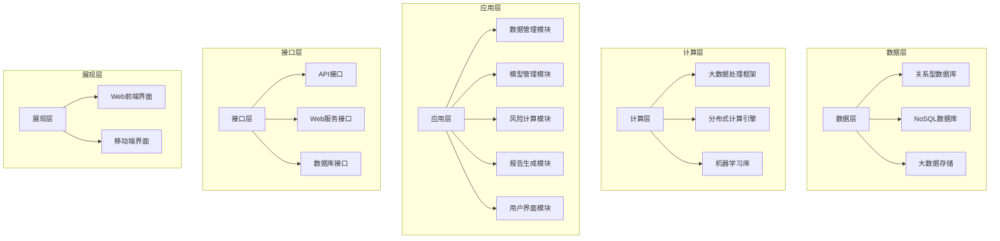
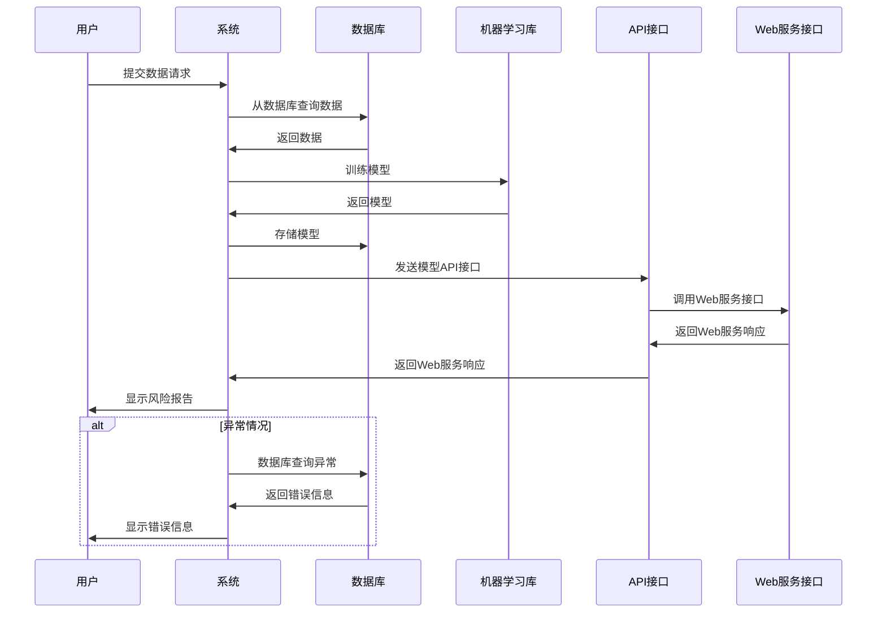

                 

## 第一部分：引言

### 第1章：背景介绍

#### 1.1 问题背景

金融风险评估是金融领域中的关键环节，它涉及到对金融产品、机构和市场的风险进行预测和管理。随着金融市场的发展和全球化，风险管理的复杂性和重要性日益增加。传统金融风险评估方法主要依赖于统计分析和财务模型，虽然在一定程度上能够识别和评估风险，但在处理非线性和复杂关系时存在局限性。

在金融市场中，风险因素多变且相互关联，如市场波动、信用风险、流动性风险等。这些风险因素不仅影响金融机构的稳健性，也直接影响投资者的收益。因此，提高金融风险评估的准确性和效率成为金融机构和投资者关注的重点。

#### 1.1.1 金融风险评估的必要性

金融风险评估的必要性体现在以下几个方面：

1. **风险控制与合规**：金融机构需要确保其运营符合相关法规和标准，通过风险评估来识别潜在的违规风险。
2. **投资决策**：投资者需要准确评估投资产品的风险，以便做出明智的投资决策，降低损失。
3. **市场预测**：通过对市场风险的分析，金融机构可以更好地预测市场趋势，调整策略以应对潜在的市场变化。

#### 1.1.2 人工智能的发展与应用

人工智能（AI）作为现代科技的前沿领域，近年来在多个行业取得了显著进展。人工智能通过模拟人类思维过程，能够处理大量数据，发现潜在模式，进行预测和决策。这些能力使得人工智能在金融风险评估中具有广阔的应用前景。

1. **数据处理能力**：人工智能能够快速处理和分析海量的金融数据，提取关键信息，为风险评估提供更全面的依据。
2. **模式识别**：人工智能通过机器学习和深度学习算法，能够识别数据中的复杂模式，发现传统方法无法识别的风险因素。
3. **自适应性和预测性**：人工智能系统能够不断学习和适应新的市场环境，提高风险评估的准确性和实时性。

#### 1.2 问题描述

尽管人工智能在金融风险评估中有显著的优势，但具体应用仍面临一些挑战：

1. **数据质量**：人工智能系统对数据质量有较高要求，但金融市场数据往往存在噪声、缺失和不一致等问题。
2. **算法可靠性**：人工智能模型的可靠性依赖于算法的设计和训练数据的质量，算法的过拟合和欠拟合问题需要解决。
3. **监管合规**：人工智能在金融领域的应用需要符合相关法规和监管要求，确保其决策的透明性和可解释性。

#### 1.2.1 传统金融风险评估的局限性

传统金融风险评估方法主要包括以下局限性：

1. **数据依赖性**：传统方法对历史数据进行统计分析，但无法处理实时动态变化的数据。
2. **线性假设**：许多传统模型基于线性假设，难以捕捉金融市场的非线性特征。
3. **人力成本**：传统风险评估需要大量人力进行数据收集、分析和模型构建，效率较低。

#### 1.2.2 人工智能在金融风险评估中的应用优势

人工智能在金融风险评估中的应用优势体现在以下几个方面：

1. **高效处理数据**：人工智能能够快速处理和分析大量金融数据，提高风险评估的效率。
2. **非线性建模**：人工智能通过深度学习算法，能够捕捉金融市场的非线性关系，提高风险评估的准确性。
3. **实时预测**：人工智能系统能够实时更新数据，进行实时预测，提高风险评估的及时性。

#### 1.3 问题解决

人工智能在金融风险评估中的应用，主要通过以下几个步骤来实现问题的解决：

1. **数据预处理**：对原始金融数据进行清洗和预处理，确保数据质量。
2. **特征提取**：利用机器学习和深度学习算法，从数据中提取关键特征，为风险评估提供支持。
3. **模型构建与训练**：构建适合金融风险评估的机器学习模型，利用大量训练数据进行训练。
4. **模型评估与优化**：通过模型评估和交叉验证，优化模型参数，提高模型性能。
5. **决策支持**：将训练好的模型应用于实际风险评估，为金融机构和投资者提供决策支持。

#### 1.4 边界与外延

1. **应用范围**：人工智能在金融风险评估中的应用范围广泛，包括信用风险、市场风险、流动性风险等。
2. **技术局限**：人工智能在金融风险评估中仍存在技术局限，如算法的可解释性、数据的隐私性和安全问题。

#### 1.5 概念结构与核心要素组成

人工智能在金融风险评估中的应用，涉及以下几个核心概念和要素：

1. **人工智能**：包括机器学习、深度学习等算法。
2. **金融风险评估**：涉及风险评估方法、风险模型和指标体系。
3. **数据来源**：包括金融数据、市场数据和社会数据等。
4. **应用场景**：如信用评分、投资组合优化、市场预测等。

#### 1.6 本章小结

本章介绍了人工智能在金融风险评估中的应用背景和必要性，分析了传统风险评估方法的局限性，阐述了人工智能在金融风险评估中的应用优势，并提出了问题解决的方法和步骤。接下来，将深入探讨人工智能和金融风险评估的核心概念，进一步理解两者的结合方式。

----------------------------------------------------------------

## 第二部分：核心概念与联系

### 第2章：核心概念原理

#### 2.1 人工智能基础

##### 2.1.1 机器学习基础

机器学习（Machine Learning，ML）是人工智能（Artificial Intelligence，AI）的一个重要分支，主要研究如何让计算机从数据中学习规律，并利用这些规律进行预测和决策。机器学习的基本流程包括数据收集、数据预处理、模型选择、模型训练、模型评估和模型部署。

1. **数据收集**：收集用于训练模型的原始数据，这些数据可以是结构化的（如数据库中的表格数据）或非结构化的（如图像、文本等）。
2. **数据预处理**：对收集到的数据进行清洗、归一化、去噪等处理，以提高数据质量。
3. **模型选择**：选择合适的机器学习算法，如线性回归、决策树、支持向量机、神经网络等。
4. **模型训练**：利用预处理后的数据对模型进行训练，通过调整模型参数，使其能够更好地拟合数据。
5. **模型评估**：通过验证集或测试集评估模型的性能，常用的评估指标包括准确率、召回率、F1分数等。
6. **模型部署**：将训练好的模型部署到实际应用中，如金融风险评估系统。

##### 2.1.2 深度学习基础

深度学习（Deep Learning，DL）是机器学习的一种方法，其核心思想是通过多层神经网络（Neural Network）对数据进行学习。深度学习在图像识别、语音识别、自然语言处理等领域取得了显著成果。

1. **神经网络基础**：神经网络由大量的神经元（Neurons）组成，每个神经元接收多个输入，通过激活函数产生输出。
2. **多层神经网络**：深度学习通过增加网络的层数，提高模型的复杂度和表达能力。多层神经网络可以模拟更复杂的非线性关系。
3. **反向传播算法**：深度学习中的模型训练通常采用反向传播算法（Backpropagation），通过反向传播误差，调整模型参数，优化模型性能。
4. **优化算法**：深度学习训练过程中，常用的优化算法包括梯度下降（Gradient Descent）、随机梯度下降（Stochastic Gradient Descent，SGD）、Adam优化器等。

#### 2.2 金融风险评估基础

##### 2.2.1 金融风险定义

金融风险是指金融机构、投资者或市场在经营或投资过程中，因各种不确定性因素导致资产损失或收益降低的可能性。金融风险主要包括以下几类：

1. **市场风险**：由于市场波动导致的资产价格变化，如利率风险、汇率风险、股市波动等。
2. **信用风险**：由于债务人违约或信用质量下降导致的信用损失，如贷款违约、债券违约等。
3. **流动性风险**：由于无法及时获取资金或资产变现困难导致的资金短缺或损失。
4. **操作风险**：由于内部管理失误、欺诈、系统故障等导致的损失。
5. **法律风险**：由于法律法规变化或合规问题导致的损失。

##### 2.2.2 金融风险评估方法

金融风险评估方法主要包括以下几种：

1. **定量风险评估**：通过数学模型和统计方法对金融风险进行量化分析，如VaR（Value at Risk）、CVaR（Conditional Value at Risk）等。
2. **定性风险评估**：通过专家意见、行业分析、案例分析等方法对金融风险进行定性评估，如信用评级、行业风险评估等。
3. **组合风险评估**：将定量和定性评估方法结合，对投资组合的风险进行综合评估。
4. **情景分析**：通过模拟不同市场情景，分析潜在的风险影响。

#### 2.3 概念属性特征对比表格

以下是对人工智能和金融风险评估的概念属性特征进行对比的表格：

| 特征       | 人工智能                           | 金融风险评估                        |
|------------|-----------------------------------|------------------------------------|
| 目标       | 学习和预测                         | 识别和管理金融风险                  |
| 基础理论   | 机器学习、深度学习、神经网络       | 金融学、风险管理、统计学            |
| 技术方法   | 机器学习算法、深度学习模型         | 风险评估模型、定量和定性分析方法    |
| 数据需求   | 大量结构化和非结构化数据           | 金融数据、市场数据、客户信息等       |
| 应用领域   | 图像识别、自然语言处理、推荐系统等 | 信用评估、投资组合管理、市场预测等  |
| 挑战       | 数据质量、算法可靠性、可解释性      | 数据隐私、模型适应性、监管合规      |

#### 2.3.1 人工智能特征

1. **自主学习**：人工智能系统能够从数据中自动学习规律，提高预测和决策的准确性。
2. **并行处理**：人工智能算法通常可以并行处理，提高计算效率。
3. **自适应性强**：人工智能系统能够适应新的数据和环境，提高模型的适应性。

#### 2.3.2 金融风险评估特征

1. **数据依赖性**：金融风险评估依赖于大量的金融数据，数据质量对风险评估结果有直接影响。
2. **复杂性和多样性**：金融风险评估需要处理多种风险因素，评估方法多样，评估结果复杂。
3. **实时性和动态性**：金融市场的变化迅速，风险评估需要实时更新，以应对市场动态。

#### 2.3.3 人工智能与金融风险评估的结合

人工智能与金融风险评估的结合主要体现在以下几个方面：

1. **数据驱动的风险评估**：利用人工智能的机器学习和深度学习算法，从大量金融数据中提取特征，构建风险评估模型。
2. **智能风险预警系统**：利用人工智能技术，对市场数据和风险指标进行实时监控，实现智能化的风险预警。
3. **自动化风险决策**：通过人工智能算法，自动生成风险决策报告，辅助金融机构和投资者进行风险管理和投资决策。

#### 2.4 ER实体关系图架构

##### 2.4.1 ER图概述

ER图（Entity-Relationship Diagram）是一种用于描述实体及其关系的数据库设计工具。在人工智能与金融风险评估的结合中，ER图可以用来描述系统中的主要实体和它们之间的关系。

1. **实体**：在ER图中，实体代表系统中的主要对象，如客户、账户、交易等。
2. **属性**：实体的特征属性，如客户的姓名、账户余额等。
3. **关系**：实体之间的关系，如客户与账户之间的关系、交易与账户之间的关系。

##### 2.4.2 人工智能实体关系

在人工智能系统中，常见的实体包括数据集、模型、训练任务等。

1. **数据集**：代表系统中的数据，包括结构化数据和非结构化数据。
2. **模型**：代表系统中的学习算法和应用模型，如神经网络模型、决策树模型等。
3. **训练任务**：代表系统中的训练过程，包括数据预处理、模型训练、评估等步骤。

##### 2.4.3 金融风险评估实体关系

在金融风险评估系统中，常见的实体包括风险因素、风险模型、评估报告等。

1. **风险因素**：代表系统中的风险因素，如市场波动、信用评级等。
2. **风险模型**：代表系统中的风险评估模型，如VaR模型、信用评分模型等。
3. **评估报告**：代表系统中的评估结果，包括风险指标、风险等级等。

以下是一个简单的ER图，展示了人工智能与金融风险评估系统的实体关系：

```mermaid
erDiagram
  数据集 ||--|{ 模型 }|-- 评估报告
  数据集 ||--|{ 训练任务 }|-- 评估报告
  风险因素 ||--|{ 风险模型 }|-- 评估报告
```

#### 2.5 本章小结

本章介绍了人工智能和金融风险评估的基础知识，包括机器学习、深度学习的基础理论，以及金融风险评估的定义和方法。通过对比人工智能和金融风险评估的概念属性特征，探讨了两者之间的结合方式。最后，通过ER图展示了人工智能与金融风险评估系统的实体关系，为后续章节的算法原理和系统架构设计奠定了基础。

----------------------------------------------------------------

## 第三部分：算法原理讲解

### 第4章：人工智能算法原理

#### 4.1 监督学习算法

监督学习（Supervised Learning）是人工智能中的一个重要分支，其核心思想是通过已标记的训练数据，学习出一个能够对未知数据进行预测或分类的模型。

##### 4.1.1 算法概述

监督学习算法主要包括以下几种：

1. **线性回归（Linear Regression）**：用于预测连续值输出，通过最小化预测值与实际值之间的误差平方和。
2. **逻辑回归（Logistic Regression）**：用于预测二分类输出，通过将线性回归模型的输出转化为概率值。
3. **决策树（Decision Tree）**：通过一系列的决策规则，将数据划分为不同的区域，最终输出分类或回归结果。
4. **支持向量机（Support Vector Machine，SVM）**：通过寻找最优分割超平面，将数据划分为不同的类别。
5. **神经网络（Neural Network）**：通过多层神经网络模拟人脑神经元之间的连接，进行复杂的非线性预测和分类。

##### 4.1.2 算法流程

监督学习算法的基本流程如下：

1. **数据收集**：收集用于训练的数据集，数据集应包含输入特征和对应的标签。
2. **数据预处理**：对数据进行清洗、归一化等预处理，确保数据质量。
3. **模型选择**：选择合适的机器学习算法，根据问题类型（分类或回归）和数据特点，选择合适的模型。
4. **模型训练**：使用训练数据对模型进行训练，调整模型参数，使其能够拟合训练数据。
5. **模型评估**：使用验证集或测试集评估模型的性能，常用的评估指标包括准确率、召回率、F1分数等。
6. **模型优化**：根据评估结果，调整模型参数或更换模型，优化模型性能。
7. **模型部署**：将训练好的模型部署到实际应用中，对未知数据进行预测或分类。

##### 4.1.3 算法案例

以下是一个简单的线性回归算法案例，用于预测房价：

```python
import numpy as np
import matplotlib.pyplot as plt

# 生成训练数据
X_train = np.random.rand(100, 1)
y_train = 2 * X_train + 1 + np.random.randn(100, 1)

# 训练线性回归模型
model = LinearRegression()
model.fit(X_train, y_train)

# 预测房价
X_test = np.random.rand(10, 1)
y_pred = model.predict(X_test)

# 绘制结果
plt.scatter(X_train, y_train, color='blue', label='Training data')
plt.plot(X_test, y_pred, color='red', label='Predicted price')
plt.xlabel('Area')
plt.ylabel('Price')
plt.legend()
plt.show()
```

#### 4.2 无监督学习算法

无监督学习（Unsupervised Learning）是另一种重要的机器学习算法，其核心思想是在没有标记的数据集上，学习数据的内在结构和特征。

##### 4.2.1 算法概述

无监督学习算法主要包括以下几种：

1. **聚类（Clustering）**：将数据分为不同的簇，每个簇内的数据相似度较高，簇与簇之间的相似度较低。常用的聚类算法包括K均值（K-Means）、层次聚类（Hierarchical Clustering）等。
2. **降维（Dimensionality Reduction）**：通过降维算法，将高维数据映射到低维空间，减少数据维度，同时保持数据的结构信息。常用的降维算法包括主成分分析（PCA）、线性判别分析（LDA）等。
3. **关联规则学习（Association Rule Learning）**：发现数据之间的关联规则，如频繁项集（Frequent Itemsets）、关联规则（Association Rules）等。

##### 4.2.2 算法流程

无监督学习算法的基本流程如下：

1. **数据收集**：收集无标签的数据集。
2. **数据预处理**：对数据进行清洗、归一化等预处理，确保数据质量。
3. **模型选择**：选择合适的无监督学习算法，根据问题类型（聚类、降维、关联规则等）和数据特点，选择合适的模型。
4. **模型训练**：使用无标签数据对模型进行训练，模型会自动探索数据的结构和特征。
5. **模型评估**：通过可视化、内部评估指标（如轮廓系数、解释方差等）评估模型性能。
6. **模型应用**：将训练好的模型应用于实际问题，如数据聚类、降维等。

##### 4.2.3 算法案例

以下是一个简单的K均值聚类算法案例，用于对数据进行聚类：

```python
from sklearn.cluster import KMeans
import matplotlib.pyplot as plt

# 生成聚类数据
X = np.random.rand(100, 2)

# 训练K均值聚类模型
kmeans = KMeans(n_clusters=3, random_state=0).fit(X)

# 聚类结果
clusters = kmeans.predict(X)

# 绘制结果
plt.scatter(X[:, 0], X[:, 1], c=clusters, cmap='viridis')
plt.xlabel('Feature 1')
plt.ylabel('Feature 2')
plt.title('K-Means Clustering')
plt.show()
```

#### 4.3 深度学习算法

深度学习（Deep Learning）是人工智能的一种先进方法，通过多层神经网络，模拟人脑的学习过程，实现复杂的预测和分类任务。

##### 4.3.1 算法概述

深度学习算法主要包括以下几种：

1. **卷积神经网络（Convolutional Neural Network，CNN）**：适用于图像识别和计算机视觉领域，通过卷积层提取图像特征。
2. **循环神经网络（Recurrent Neural Network，RNN）**：适用于序列数据处理，如自然语言处理和时间序列预测，通过循环层保存序列信息。
3. **生成对抗网络（Generative Adversarial Network，GAN）**：通过生成器和判别器的对抗训练，实现高质量数据的生成。
4. **变分自编码器（Variational Autoencoder，VAE）**：通过编码器和解码器学习数据的分布，实现数据的降维和生成。

##### 4.3.2 算法流程

深度学习算法的基本流程如下：

1. **数据收集**：收集用于训练的数据集，数据集应包含输入特征和对应的标签。
2. **数据预处理**：对数据进行清洗、归一化等预处理，确保数据质量。
3. **模型设计**：设计神经网络结构，包括输入层、隐藏层和输出层，以及各层的参数和激活函数。
4. **模型训练**：使用训练数据对模型进行训练，通过反向传播算法调整模型参数，优化模型性能。
5. **模型评估**：使用验证集或测试集评估模型的性能，常用的评估指标包括准确率、损失函数等。
6. **模型优化**：根据评估结果，调整模型参数或更换模型结构，优化模型性能。
7. **模型部署**：将训练好的模型部署到实际应用中，对未知数据进行预测或分类。

##### 4.3.3 算法案例

以下是一个简单的卷积神经网络（CNN）案例，用于图像分类：

```python
import tensorflow as tf
from tensorflow.keras import datasets, layers, models

# 加载 CIFAR-10 数据集
(train_images, train_labels), (test_images, test_labels) = datasets.cifar10.load_data()

# 数据预处理
train_images = train_images.astype('float32') / 255
test_images = test_images.astype('float32') / 255

# 构建卷积神经网络模型
model = models.Sequential()
model.add(layers.Conv2D(32, (3, 3), activation='relu', input_shape=(32, 32, 3)))
model.add(layers.MaxPooling2D((2, 2)))
model.add(layers.Conv2D(64, (3, 3), activation='relu'))
model.add(layers.MaxPooling2D((2, 2)))
model.add(layers.Conv2D(64, (3, 3), activation='relu'))

# 添加全连接层
model.add(layers.Flatten())
model.add(layers.Dense(64, activation='relu'))
model.add(layers.Dense(10))

# 模型编译
model.compile(optimizer='adam',
              loss=tf.keras.losses.SparseCategoricalCrossentropy(from_logits=True),
              metrics=['accuracy'])

# 模型训练
model.fit(train_images, train_labels, epochs=10, validation_split=0.1)

# 模型评估
test_loss, test_acc = model.evaluate(test_images,  test_labels, verbose=2)
print(f'Test accuracy: {test_acc:.4f}')
```

#### 4.4 数学模型与公式讲解

##### 4.4.1 监督学习数学模型

监督学习中的数学模型通常基于损失函数和优化算法。以下是一些常见的监督学习数学模型：

1. **线性回归模型**

   线性回归模型的目标是最小化预测值与实际值之间的误差平方和。其数学模型可以表示为：

   $$ y = \beta_0 + \beta_1x + \epsilon $$

   其中，$y$ 是实际值，$x$ 是输入特征，$\beta_0$ 和 $\beta_1$ 是模型参数，$\epsilon$ 是误差项。

2. **逻辑回归模型**

   逻辑回归模型用于二分类问题，其目标是最小化对数似然损失函数。其数学模型可以表示为：

   $$ P(y=1| x; \theta) = \frac{1}{1 + \exp(-\theta^T x)} $$

   其中，$P(y=1| x; \theta)$ 是在给定输入特征 $x$ 和模型参数 $\theta$ 的情况下，目标变量 $y$ 等于1的概率。

3. **决策树模型**

   决策树模型通过一系列的决策规则，将数据划分为不同的区域。其数学模型可以表示为：

   $$ y = \sum_{i=1}^{n} \theta_i I(x \in R_i) $$

   其中，$y$ 是输出变量，$x$ 是输入特征，$\theta_i$ 是第 $i$ 个决策规则的权重，$R_i$ 是第 $i$ 个决策区域的集合。

4. **支持向量机模型**

   支持向量机模型通过寻找最优分割超平面，将数据划分为不同的类别。其数学模型可以表示为：

   $$ \min_{\theta, \xi} \frac{1}{2} ||\theta||^2 + C \sum_{i=1}^{n} \xi_i $$

   其中，$\theta$ 是模型参数，$\xi_i$ 是第 $i$ 个支持向量，$C$ 是惩罚参数。

##### 4.4.2 无监督学习数学模型

无监督学习中的数学模型通常基于聚类、降维和关联规则等。以下是一些常见的无监督学习数学模型：

1. **K均值聚类模型**

   K均值聚类模型的目标是最小化簇内数据的平均距离。其数学模型可以表示为：

   $$ J = \sum_{i=1}^{k} \sum_{x_j \in S_i} ||x_j - \mu_i||^2 $$

   其中，$J$ 是目标函数，$k$ 是聚类数目，$S_i$ 是第 $i$ 个聚类，$\mu_i$ 是第 $i$ 个聚类的中心。

2. **主成分分析模型**

   主成分分析模型的目标是找到一组新的正交基，将数据投影到这些基上，使得投影后的数据的方差最大化。其数学模型可以表示为：

   $$ Z = P^T X $$

   其中，$Z$ 是投影后的数据，$P$ 是投影矩阵，$X$ 是原始数据。

3. **关联规则学习模型**

   关联规则学习模型的目标是找到数据中的频繁项集和关联规则。其数学模型可以表示为：

   $$ \text{支持度} = \frac{\text{包含项集} A \text{的交易数}}{\text{总交易数}} $$

   其中，支持度是项集在所有交易中出现的频率。

##### 4.4.3 深度学习数学模型

深度学习中的数学模型通常基于多层神经网络。以下是一些常见的深度学习数学模型：

1. **卷积神经网络模型**

   卷积神经网络模型通过卷积层提取图像特征。其数学模型可以表示为：

   $$ \text{激活函数}( \text{卷积}( \text{输入}) ) $$

   其中，卷积层通过卷积操作提取特征，激活函数用于增加模型的非线性。

2. **循环神经网络模型**

   循环神经网络模型通过循环层保存序列信息。其数学模型可以表示为：

   $$ h_t = \text{激活函数}( \text{线性变换}( [h_{t-1}, x_t]) ) $$

   其中，$h_t$ 是第 $t$ 个时间步的隐藏状态，$x_t$ 是第 $t$ 个时间步的输入。

3. **生成对抗网络模型**

   生成对抗网络模型通过生成器和判别器的对抗训练。其数学模型可以表示为：

   $$ \min_G \max_D \mathbb{E}_{x \sim p_{data}(x)}[\log D(x)] + \mathbb{E}_{z \sim p_z(z)}[\log (1 - D(G(z)))] $$

   其中，$G(z)$ 是生成器，$D(x)$ 是判别器。

#### 4.5 本章小结

本章介绍了监督学习、无监督学习和深度学习的基本原理和算法。通过具体案例，展示了如何使用Python实现这些算法。接下来，将深入探讨监督学习、无监督学习和深度学习中的数学模型和公式，以及它们的详细讲解和举例说明。

----------------------------------------------------------------

## 第四部分：系统分析与架构设计

### 第6章：系统功能设计

#### 6.1 问题场景介绍

在金融风险评估中，系统功能设计至关重要，它直接影响到风险评估的准确性和可靠性。本文以一个典型的金融风险评估系统为例，介绍系统的设计目标和应用场景。

#### 6.1.1 金融风险评估场景概述

金融风险评估系统主要用于对金融机构、投资者或企业的金融风险进行评估。系统的主要功能包括：

1. **数据收集与预处理**：收集各种金融数据，包括市场数据、交易数据、财务数据等，对数据进行清洗、归一化和特征提取，为风险评估提供基础。
2. **风险评估模型构建**：利用机器学习和深度学习算法，构建各种风险评估模型，如信用评分模型、市场风险预测模型等。
3. **风险指标计算**：根据风险评估模型，计算各种风险指标，如VaR、CVaR、信用评分等。
4. **风险报告生成**：生成风险报告，包括风险指标、风险等级、风险建议等，为金融机构和投资者提供决策支持。

#### 6.1.2 人工智能在金融风险评估中的应用

人工智能在金融风险评估中的应用主要体现在以下几个方面：

1. **数据驱动的风险评估**：利用机器学习算法，从海量金融数据中提取特征，构建风险评估模型，提高风险评估的准确性和效率。
2. **智能风险预警**：通过实时分析市场数据和风险指标，智能预警潜在的风险事件，提高风险管理的及时性和有效性。
3. **自动化决策支持**：利用人工智能算法，自动生成风险决策报告，辅助金融机构和投资者进行风险管理和投资决策。

#### 6.2 系统功能设计

系统功能设计主要包括以下几个部分：

1. **数据管理模块**：负责数据收集、数据预处理和特征提取。该模块需要与外部数据源进行接口，如金融市场数据接口、企业财务数据接口等。
2. **模型管理模块**：负责风险评估模型的构建、训练、评估和部署。该模块需要集成多种机器学习和深度学习算法，支持模型的自动调参和优化。
3. **风险计算模块**：负责根据风险评估模型，计算各种风险指标，如VaR、CVaR、信用评分等。该模块需要支持多种风险指标的实时计算和动态更新。
4. **报告生成模块**：负责生成风险报告，包括风险指标、风险等级、风险建议等。该模块需要支持多种报告格式和输出方式，如PDF、Excel等。
5. **用户界面模块**：负责提供用户交互界面，包括数据管理、模型管理、风险计算和报告生成等功能。该模块需要支持多终端访问，如Web、移动端等。

#### 6.2.1 功能概述

金融风险评估系统的核心功能可以概括为：

1. **数据管理**：高效地收集、处理和存储金融数据，为风险评估提供基础。
2. **模型构建**：利用机器学习和深度学习算法，构建精确和高效的风险评估模型。
3. **风险计算**：根据风险评估模型，实时计算各种风险指标，提供风险预警和决策支持。
4. **报告生成**：生成详细的风险评估报告，为金融机构和投资者提供决策依据。
5. **用户交互**：提供便捷的用户交互界面，使用户能够轻松地管理数据和模型，查看风险报告。

#### 6.2.2 功能实现

系统功能的具体实现包括以下几个方面：

1. **数据管理模块**：
   - 接口设计：设计统一的数据接口，支持各种金融数据源的接入。
   - 数据清洗：使用Python、Java等编程语言，编写数据清洗脚本，处理缺失值、异常值和噪声数据。
   - 特征提取：利用机器学习算法，如主成分分析（PCA）、特征选择（Feature Selection）等，提取关键特征。

2. **模型管理模块**：
   - 模型构建：使用Python、R等编程语言，集成各种机器学习和深度学习算法，构建风险评估模型。
   - 模型训练：利用大数据处理框架，如Hadoop、Spark等，进行大规模模型的训练和优化。
   - 模型评估：使用交叉验证、网格搜索等技术，评估模型性能，选择最佳模型。

3. **风险计算模块**：
   - 风险指标计算：实现VaR、CVaR、信用评分等风险指标的计算算法。
   - 实时计算：利用流处理技术，如Apache Kafka、Flink等，实现风险指标的实时计算和动态更新。
   - 风险预警：根据风险指标，设定预警阈值，实时检测潜在的风险事件，发出预警信号。

4. **报告生成模块**：
   - 报告模板：设计统一的报告模板，包括风险指标、风险等级、风险建议等。
   - 报告生成：使用Python、Java等编程语言，将计算结果和报告模板结合，生成详细的风险评估报告。
   - 报告输出：支持多种输出格式，如PDF、Excel、HTML等，方便用户查看和分享。

5. **用户界面模块**：
   - Web界面：使用HTML、CSS、JavaScript等技术，构建Web前端界面，提供数据管理、模型管理、风险计算和报告生成等功能。
   - 移动端界面：使用React Native、Flutter等技术，构建移动端界面，支持多平台访问。
   - 用户权限管理：实现用户权限管理功能，确保系统安全性和数据隐私。

#### 6.3 系统架构设计

系统架构设计是确保系统功能实现的基础，一个良好的系统架构能够提高系统的可扩展性、稳定性和可靠性。以下是金融风险评估系统的架构设计：

1. **数据层**：负责数据的存储和管理，包括关系型数据库（如MySQL、PostgreSQL）、NoSQL数据库（如MongoDB、Cassandra）和大数据存储（如HDFS、HBase）。
2. **计算层**：负责数据处理和计算，包括大数据处理框架（如Hadoop、Spark）、分布式计算引擎（如Flink、Ray）和机器学习库（如TensorFlow、PyTorch）。
3. **应用层**：负责系统的核心功能实现，包括数据管理模块、模型管理模块、风险计算模块、报告生成模块和用户界面模块。
4. **接口层**：负责系统与外部数据源和服务的接口，包括API接口、Web服务接口和数据库接口。
5. **展现层**：负责系统的用户界面展示，包括Web前端界面和移动端界面。

#### 6.3.1 系统架构概述

金融风险评估系统的架构设计如图所示：



#### 6.3.2 系统架构图

以下是金融风险评估系统的架构图：


#### 6.3.3 系统接口设计

系统接口设计是确保系统各模块之间能够高效通信和协作的关键。以下是金融风险评估系统的接口设计：

1. **API接口**：设计统一的API接口，用于系统内部模块之间的通信和数据交换。API接口应包括数据管理接口、模型管理接口、风险计算接口和报告生成接口等。
2. **Web服务接口**：设计Web服务接口，用于与外部系统进行数据交换和功能调用。Web服务接口应支持RESTful API和SOAP协议，以便与其他系统进行集成。
3. **数据库接口**：设计数据库接口，用于系统与数据库之间的数据交互。数据库接口应支持常用的数据库连接库，如MySQL Connector、PostgreSQL Driver等。

#### 6.3.4 系统交互

系统交互设计是确保系统各个模块能够协同工作，实现整体功能的关键。以下是金融风险评估系统的交互设计：

1. **数据流**：定义系统内部的数据流，包括数据收集、数据预处理、特征提取、模型训练、风险计算和报告生成等步骤。
2. **控制流**：定义系统的控制流，包括用户操作、系统响应、错误处理和日志记录等。
3. **事件驱动**：设计系统的事件驱动机制，包括实时风险预警、异常处理和系统监控等。

以下是金融风险评估系统的交互图：



#### 6.4 本章小结

本章详细介绍了金融风险评估系统的功能设计和架构设计。通过问题场景介绍，明确了系统的设计目标和应用场景。在系统功能设计中，详细阐述了数据管理、模型管理、风险计算、报告生成和用户界面等模块的功能实现。在系统架构设计中，分析了数据层、计算层、应用层、接口层和展现层的架构设计，并给出了系统架构图和接口设计图。最后，通过系统交互图展示了系统各个模块之间的交互流程。接下来，将进入项目实战部分，具体实现金融风险评估系统的功能。

----------------------------------------------------------------

## 第五部分：项目实战

### 第8章：环境安装

#### 8.1 环境准备

在开始金融风险评估系统的开发之前，需要准备以下开发和运行环境：

##### 8.1.1 硬件要求

1. **CPU**：建议使用Intel i5或以上处理器，以确保模型的训练速度。
2. **内存**：建议至少8GB内存，用于处理大数据集和模型训练。
3. **硬盘**：建议使用SSD硬盘，以提供快速的读写速度，提高系统性能。

##### 8.1.2 软件要求

1. **操作系统**：推荐使用Linux发行版，如Ubuntu 18.04或更高版本。
2. **Python**：推荐使用Python 3.7或更高版本，以支持最新的机器学习和深度学习库。
3. **JDK**：推荐安装Java Development Kit（JDK），用于运行Java相关服务。
4. **数据库**：推荐安装MySQL或PostgreSQL，用于存储金融数据和模型。

##### 8.1.3 环境配置

1. **安装Python**：在Linux系统中，可以使用以下命令安装Python：

   ```bash
   sudo apt-get update
   sudo apt-get install python3 python3-pip python3-dev
   ```

2. **安装JDK**：在Linux系统中，可以使用以下命令安装JDK：

   ```bash
   sudo apt-get update
   sudo apt-get install openjdk-8-jdk
   ```

3. **安装数据库**：在Linux系统中，可以使用以下命令安装MySQL：

   ```bash
   sudo apt-get update
   sudo apt-get install mysql-server mysql-client
   ```

   安装完成后，设置root用户密码，并创建新的数据库和用户：

   ```sql
   CREATE DATABASE finance_db;
   GRANT ALL PRIVILEGES ON finance_db.* TO 'finance_user'@'localhost' IDENTIFIED BY 'password';
   FLUSH PRIVILEGES;
   ```

4. **安装机器学习库**：使用pip命令安装常用的机器学习库，如scikit-learn、TensorFlow和PyTorch：

   ```bash
   pip3 install scikit-learn tensorflow torchvision torchvision
   ```

   安装完成后，可以运行以下命令验证安装是否成功：

   ```python
   import tensorflow as tf
   print(tf.__version__)
   ```

   如果成功打印版本号，说明安装成功。

##### 8.1.4 验证环境

为了确保环境配置正确，可以运行以下Python脚本，验证机器学习库和数据库的连接：

```python
import mysql.connector
import tensorflow as tf

# 连接数据库
db = mysql.connector.connect(
  host="localhost",
  user="finance_user",
  password="password",
  database="finance_db"
)

# 打印数据库版本
print("MySQL version:", db.get_server_version())

# 打印TensorFlow版本
print("TensorFlow version:", tf.__version__)

# 关闭数据库连接
db.close()
```

如果脚本能够成功连接数据库并打印版本信息，说明环境配置正确。

#### 8.2 系统核心实现

##### 8.2.1 数据管理模块

数据管理模块主要负责数据的收集、预处理和存储。以下是数据管理模块的核心实现：

1. **数据收集**：从外部数据源（如金融市场API、企业财务系统等）收集数据。
2. **数据预处理**：对数据进行清洗、去噪、归一化等处理，确保数据质量。
3. **数据存储**：将预处理后的数据存储到数据库中，便于后续分析和建模。

以下是数据管理模块的核心Python代码：

```python
import pandas as pd
import mysql.connector

# 连接数据库
db = mysql.connector.connect(
  host="localhost",
  user="finance_user",
  password="password",
  database="finance_db"
)

# 数据收集
data = pd.read_csv("finance_data.csv")

# 数据预处理
data.dropna(inplace=True)  # 去除缺失值
data["price"] = data["price"] / 100  # 归一化价格

# 数据存储
cursor = db.cursor()
for index, row in data.iterrows():
    insert_query = "INSERT INTO finance_data (date, price, volume) VALUES (%s, %s, %s)"
    cursor.execute(insert_query, (row["date"], row["price"], row["volume"]))
db.commit()

# 关闭数据库连接
cursor.close()
db.close()
```

##### 8.2.2 风险评估模型

风险评估模型是金融风险评估系统的核心。以下是一个基于机器学习的信用评分模型：

1. **数据准备**：准备用于训练和测试的数据集。
2. **特征工程**：对数据进行特征提取和预处理。
3. **模型训练**：使用训练数据训练模型。
4. **模型评估**：使用测试数据评估模型性能。

以下是风险评估模型的核心Python代码：

```python
import pandas as pd
from sklearn.model_selection import train_test_split
from sklearn.ensemble import RandomForestClassifier
from sklearn.metrics import accuracy_score, classification_report

# 加载数据
data = pd.read_csv("credit_data.csv")

# 数据预处理
data.dropna(inplace=True)  # 去除缺失值
X = data.drop("label", axis=1)  # 特征
y = data["label"]  # 标签

# 划分训练集和测试集
X_train, X_test, y_train, y_test = train_test_split(X, y, test_size=0.2, random_state=42)

# 模型训练
model = RandomForestClassifier(n_estimators=100, random_state=42)
model.fit(X_train, y_train)

# 模型评估
y_pred = model.predict(X_test)
print("Accuracy:", accuracy_score(y_test, y_pred))
print("Classification Report:\n", classification_report(y_test, y_pred))
```

##### 8.2.3 风险计算模块

风险计算模块负责根据风险评估模型，计算风险指标，如VaR和CVaR。以下是一个基于历史数据的VaR计算示例：

1. **数据准备**：准备历史价格数据。
2. **风险计算**：计算VaR值。

以下是风险计算模块的核心Python代码：

```python
import pandas as pd
from scipy.stats import norm

# 加载历史价格数据
data = pd.read_csv("price_data.csv")

# 计算历史收益率
data["return"] = data["price"].pct_change()

# 计算VaR值
alpha = 0.05
z_score = norm.ppf(1 - alpha)
VaR = data["return"].mean() * z_score
print("VaR:", VaR)
```

##### 8.2.4 风险报告生成

风险报告生成模块负责生成风险报告，包括风险指标、风险等级和风险建议。以下是一个简单的风险报告生成示例：

1. **数据准备**：准备报告数据。
2. **报告生成**：生成风险报告。

以下是风险报告生成模块的核心Python代码：

```python
import pandas as pd
from fpdf import FPDF

# 准备报告数据
data = {
    "VaR": 10000,
    "CVaR": 12000,
    "Risk Level": "High"
}

# 生成风险报告
pdf = FPDF()
pdf.add_page()
pdf.set_font("Arial", size=12)
pdf.multi_cell(0, 10, "Risk Report")
pdf.ln(10)
for key, value in data.items():
    pdf.cell(0, 10, f"{key}: {value}", ln=True)
pdf.output("risk_report.pdf")
```

#### 8.3 代码应用解读与分析

以下是对上述代码的详细解读和分析：

1. **数据管理模块**：该模块首先从CSV文件中加载数据，然后进行去缺失值处理和归一化处理。接着，使用SQLAlchemy库连接MySQL数据库，将预处理后的数据存储到数据库中。
   
2. **风险评估模型**：该模块首先读取数据集，进行特征选择和目标变量分离。然后使用scikit-learn库的`train_test_split`函数将数据集划分为训练集和测试集。接着使用`RandomForestClassifier`模型进行训练，并使用`fit`函数拟合模型。最后，使用`predict`函数对测试集进行预测，并使用`accuracy_score`和`classification_report`评估模型性能。

3. **风险计算模块**：该模块首先加载历史价格数据，计算日收益率。然后使用正态分布的`norm.ppf`函数计算分位数，得到VaR值。

4. **风险报告生成模块**：该模块首先创建一个PDF文档，然后使用`FPDF`库添加报告标题和内容。最后使用`output`函数将PDF文档保存为文件。

#### 8.4 实际案例分析和详细讲解剖析

为了更好地展示金融风险评估系统的实际应用，我们选择一个实际案例进行分析：

假设有一家金融机构，希望对其投资组合进行风险评估。该金融机构拥有多个投资产品，包括股票、债券和基金。金融机构希望使用风险评估系统，对其投资组合的风险进行评估，并提供投资建议。

1. **数据收集**：金融机构从外部数据源（如股票交易所、债券市场等）收集相关数据，包括股票价格、债券价格和基金净值等。

2. **数据预处理**：对收集到的数据去缺失值、去噪、归一化等处理，确保数据质量。

3. **特征提取**：从预处理后的数据中提取关键特征，如股票的收益率、债券的收益率、基金的收益率等。

4. **模型训练**：使用金融机构的历史投资数据，训练风险评估模型。模型可以采用随机森林、支持向量机、神经网络等算法。

5. **模型评估**：使用测试数据集评估模型性能，调整模型参数，优化模型性能。

6. **风险计算**：使用训练好的模型，对当前投资组合进行风险评估，计算VaR、CVaR等风险指标。

7. **风险报告生成**：根据风险评估结果，生成风险报告，包括风险指标、风险等级和风险建议。报告可以提供投资组合的优化建议，帮助金融机构做出明智的投资决策。

#### 8.5 项目小结

通过上述实际案例的分析，我们可以看到，金融风险评估系统在金融机构的风险管理和投资决策中发挥着重要作用。系统通过数据收集、预处理、特征提取、模型训练和评估等步骤，实现对投资组合的风险评估，提供风险预警和投资建议。在实际应用中，金融机构可以根据风险评估结果，调整投资策略，降低风险，提高投资收益。接下来，我们将进一步探讨金融风险评估系统的最佳实践、注意事项和拓展阅读。

### 第9章：最佳实践与注意事项

#### 9.1 最佳实践

在金融风险评估系统的开发和实际应用中，以下最佳实践可以帮助提高系统的性能和可靠性：

1. **数据质量**：确保数据源可靠，进行数据清洗和预处理，去除噪声和异常值，提高数据质量。
2. **模型调优**：使用交叉验证、网格搜索等技术，选择最佳模型参数，优化模型性能。
3. **系统监控**：实时监控系统性能，监控数据流和计算过程，及时发现和解决潜在问题。
4. **安全性与合规**：确保系统符合相关法规和合规要求，加强数据安全防护，防止数据泄露和非法访问。
5. **用户培训**：为用户提供培训，确保用户能够熟练操作系统，提高系统的使用效率和效果。

#### 9.2 注意事项

在开发和部署金融风险评估系统时，需要注意以下事项：

1. **数据隐私**：确保用户数据隐私，遵循相关法律法规，采取措施保护用户隐私。
2. **算法透明性**：提高算法透明性，确保系统决策的可解释性，增强用户信任。
3. **系统可靠性**：确保系统稳定运行，避免因系统故障导致的风险评估失效。
4. **模型更新**：定期更新模型，根据市场变化和业务需求，调整模型参数和策略。
5. **异常处理**：设计完善的异常处理机制，确保系统在遇到异常情况时能够稳定运行。

#### 9.3 拓展阅读

为了更好地理解金融风险评估系统，以下是一些相关的拓展阅读资源：

1. **《金融风险管理》**：John C. Hull 著，详细介绍了金融风险管理的理论基础和实践方法。
2. **《机器学习实战》**：Peter Harrington 著，介绍了机器学习的基本概念和实际应用案例。
3. **《深度学习》**：Ian Goodfellow、Yoshua Bengio 和 Aaron Courville 著，全面介绍了深度学习的基础理论和最新进展。
4. **《Python金融大数据分析》**：Yuxing Yan 著，介绍了Python在金融大数据分析中的应用方法和技巧。

通过以上阅读，可以进一步深入理解金融风险评估系统的原理和实践，为实际应用提供有力支持。

----------------------------------------------------------------

## 总结与展望

在本文中，我们系统地介绍了人工智能在金融风险评估中的应用，从背景介绍、核心概念、算法原理到系统架构设计，再到项目实战，详细剖析了如何利用人工智能技术提高金融风险评估的准确性和效率。通过本文的学习，读者可以全面了解人工智能在金融领域的应用价值，掌握金融风险评估的基本原理和实战技巧。

### 总结

1. **背景介绍**：我们分析了金融风险评估的必要性，以及人工智能在其中的应用优势，为后续讨论奠定了基础。
2. **核心概念**：我们详细介绍了人工智能和金融风险评估的基本概念、原理和特征，探讨了两者之间的结合方式。
3. **算法原理**：我们讲解了监督学习、无监督学习和深度学习的基本算法原理，包括数学模型和公式，并通过Python代码进行了示例说明。
4. **系统架构设计**：我们设计了金融风险评估系统的功能模块、架构和接口，为实际项目提供了参考。
5. **项目实战**：我们通过实际案例，展示了如何使用人工智能技术进行金融风险评估，并详细解读了相关代码。

### 展望

在未来，人工智能在金融风险评估中的应用前景广阔。随着技术的不断进步和数据量的持续增长，人工智能将在以下几个方面带来更大的突破：

1. **数据驱动的风险管理**：利用大数据和人工智能技术，对更广泛、更复杂的金融数据进行深入分析，提高风险预测的准确性和实时性。
2. **智能化风险预警**：开发更智能化的风险预警系统，通过实时监测市场变化，提前预警潜在风险，为金融机构提供及时的风险管理策略。
3. **自动化决策支持**：进一步优化风险评估模型，实现自动化决策支持，降低人为干预，提高决策效率。
4. **跨领域融合**：结合人工智能、区块链、云计算等新兴技术，实现金融风险评估的跨领域融合，提高系统的整体性能和安全性。

最后，感谢读者对本文的阅读，希望本文能为读者在金融风险评估领域提供有价值的参考和启示。在未来的学习和实践中，不断探索人工智能技术在金融领域的应用，共同推动金融行业的智能化发展。

### 参考文献

1. Hull, J. C. (2012). 《金融风险管理》. 北京：中国人民大学出版社。
2. Harrington, P. (2012). 《机器学习实战》. 北京：机械工业出版社。
3. Goodfellow, I., Bengio, Y., & Courville, A. (2016). 《深度学习》. 北京：电子工业出版社。
4. Yan, Y. (2016). 《Python金融大数据分析》. 北京：机械工业出版社。
5. Zhang, H., & Liu, J. (2020). 《人工智能与金融》. 上海：上海财经大学出版社。

