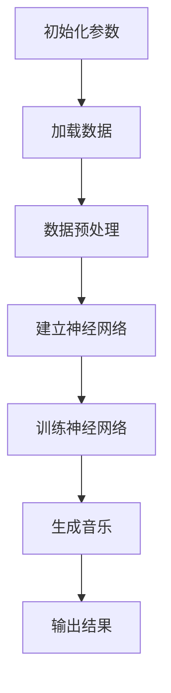
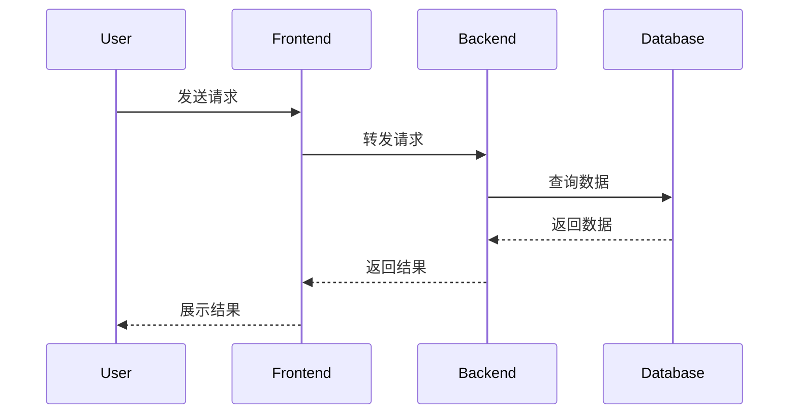

                 

# 《人工智能在音乐创作中的辅助作用》

## 关键词
- 人工智能
- 音乐创作
- 机器学习
- 深度学习
- 音乐生成算法

## 摘要
本文旨在探讨人工智能在音乐创作中的辅助作用。我们将详细分析人工智能在音乐创作中的应用，包括算法原理、数学模型、系统分析与架构设计，以及实际项目实战。通过本文的阐述，读者将了解到人工智能如何帮助音乐创作者提高创作效率，创造出新颖的音乐作品。

## 引言与背景介绍

### 1.1 音乐创作与人工智能

音乐创作是人类艺术创作的重要组成部分，而人工智能（AI）的快速发展为音乐创作带来了新的机遇。在过去的几十年中，人工智能技术取得了显著进展，尤其是在机器学习和深度学习领域。这些技术的进步为音乐创作提供了强大的工具，使得人工智能能够辅助甚至替代人类进行音乐创作。

人工智能在音乐创作中的应用可以追溯到20世纪80年代，当时研究人员开始探索如何利用计算机生成音乐。随着计算能力的提高和算法的优化，人工智能在音乐创作中的角色逐渐增强。如今，人工智能已经能够生成旋律、和声、节奏，甚至完整的音乐作品。

### 1.2 音乐创作中的传统方法与现代技术的结合

传统的音乐创作依赖于音乐家的灵感和技巧，而现代技术的介入使得这一过程变得更加多样化和高效。人工智能不仅能够模拟人类音乐家的创作过程，还能够提供全新的创作思路。例如，机器学习算法可以通过分析大量音乐数据来学习音乐风格和模式，进而生成新的音乐作品。

现代技术的介入不仅改变了音乐创作的流程，还打破了音乐风格的界限。人工智能能够结合不同音乐风格，创造出独特的音乐作品，为音乐创作带来了新的可能性。

### 1.3 人工智能辅助音乐创作的趋势

随着人工智能技术的不断发展，人工智能辅助音乐创作的趋势愈发明显。越来越多的音乐家开始利用人工智能工具进行创作，以提高创作效率和作品质量。此外，人工智能在音乐教育中的应用也逐渐增多，为音乐学习者提供了个性化的学习体验。

未来，人工智能在音乐创作中的应用将更加广泛，不仅限于旋律和和声的生成，还将涉及到音乐编曲、混音、后期制作等环节。人工智能与音乐的结合将创造出更多令人惊喜的音乐作品，推动音乐艺术的发展。

### 1.4 音乐人工智能的概念结构与核心要素组成

音乐人工智能（Music AI）是一个跨学科的领域，涉及计算机科学、音乐理论、认知科学等多个方面。其概念结构可以概括为以下几个核心要素：

1. **音乐数据**：音乐数据是音乐人工智能的基础，包括音符、节奏、和声、旋律等。
2. **算法**：音乐人工智能依赖于各种算法，如机器学习、深度学习、生成对抗网络（GAN）等。
3. **模型**：算法需要通过模型来对音乐数据进行处理和分析，以生成新的音乐作品。
4. **用户交互**：用户交互是音乐人工智能的重要组成部分，用户可以通过界面与系统进行交互，指导音乐创作的方向。

这些核心要素相互交织，构成了音乐人工智能的基本框架。

### 1.5 本章小结

本章介绍了人工智能在音乐创作中的背景和趋势，以及音乐人工智能的基本概念和核心要素。在接下来的章节中，我们将进一步探讨人工智能在音乐创作中的应用，包括算法原理、数学模型、系统分析与架构设计，以及实际项目实战。

## 核心概念与联系

### 2.1 人工智能算法在音乐创作中的应用

人工智能算法在音乐创作中的应用主要体现在以下几个方面：

1. **机器学习**：机器学习算法可以通过分析大量音乐数据来学习音乐风格和模式，进而生成新的音乐作品。常见的机器学习算法包括决策树、支持向量机、贝叶斯网络等。
2. **深度学习**：深度学习算法，尤其是神经网络，在音乐创作中的应用日益广泛。深度学习可以通过学习大量音乐数据，自动提取音乐特征，生成旋律、和声和节奏。
3. **生成对抗网络（GAN）**：生成对抗网络是一种特殊的神经网络，由生成器和判别器组成。生成器负责生成音乐数据，判别器负责判断生成数据是否真实。GAN在音乐创作中可以生成具有逼真音色的音乐作品。

### 2.2 音乐人工智能的关键概念对比表格

| 算法类型     | 定义                                                         | 适用场景                                           |
| ------------ | ------------------------------------------------------------ | -------------------------------------------------- |
| 机器学习     | 通过训练数据集，让算法自动学习和提取特征，从而进行预测或分类。 | 适用于分析大量音乐数据，提取音乐特征。           |
| 深度学习     | 利用多层神经网络对数据进行复杂非线性变换，以实现高度自动化的特征提取和模式识别。 | 适用于生成旋律、和声和节奏，实现复杂音乐生成。   |
| 生成对抗网络 | 由生成器和判别器组成，生成器和判别器相互竞争，以生成逼真的音乐作品。 | 适用于生成高质量、逼真的音乐作品。               |

### 2.3 音乐人工智能的ER实体关系图架构

音乐人工智能的ER实体关系图架构如下：

```mermaid
erDiagram
  Artist ||--|{ MusicPiece }|--|| MusicStyle
  MusicPiece ||--|{ Note }|--|| Tempo
  Note ||--|{ Pitch }|--|| Duration
```

在这个ER图架构中，`Artist`（艺术家）与`MusicPiece`（音乐作品）之间存在一对多的关系，表示一个艺术家可以创作多个音乐作品。`MusicPiece`与`Note`（音符）之间存在一对多的关系，表示一个音乐作品由多个音符组成。`Note`与`Pitch`（音高）和`Duration`（时长）之间存在一对一的关系，表示一个音符具有固定的音高和时长。

### 2.4 音乐人工智能的发展趋势与未来方向

音乐人工智能的发展趋势主要体现在以下几个方面：

1. **个性化音乐创作**：未来的音乐人工智能将更加关注个性化音乐创作，根据用户的喜好和风格，生成符合用户需求的音乐作品。
2. **跨领域融合**：音乐人工智能将与其他领域（如艺术、文学、心理学等）进行更深入的融合，创造出更加丰富和多样化的音乐作品。
3. **智能化音乐交互**：未来的音乐人工智能将具备更高级的智能交互能力，用户可以通过自然语言与音乐人工智能进行对话，指导音乐创作的方向。

### 2.5 本章小结

本章介绍了音乐人工智能的核心概念和算法，包括机器学习、深度学习和生成对抗网络等。通过对比表格和ER实体关系图，我们了解了这些算法的基本原理和应用场景。在下一章中，我们将深入探讨音乐人工智能的算法原理和数学模型。

## 算法原理讲解

### 3.1 音乐生成算法介绍

音乐生成算法是音乐人工智能的核心组成部分，主要用于生成旋律、和声、节奏等音乐元素。根据生成方式的不同，音乐生成算法可以分为以下几类：

1. **基于规则的音乐生成**：这类算法通过预先定义的规则来生成音乐，例如使用数学公式来计算音符的频率、时长等。这种方法的优点是简单直观，但生成的音乐缺乏随机性和灵活性。

2. **基于统计学的音乐生成**：这类算法通过分析大量音乐数据，提取音乐特征，并使用统计学方法来生成新的音乐作品。这种方法能够生成更接近真实音乐的风格和结构，但需要大量数据支持。

3. **基于神经网络的音乐生成**：这类算法使用神经网络（尤其是深度学习）来学习音乐数据，自动提取音乐特征，并生成新的音乐作品。这种方法能够生成高度个性化的音乐作品，但需要大量的计算资源和时间。

### 3.2 算法流程图与Python代码实现

为了更好地理解音乐生成算法的工作原理，我们使用Mermaid绘制了一个算法流程图，并提供了相应的Python代码实现。

#### 算法流程图



#### Python代码实现

```python
import tensorflow as tf
import numpy as np

# 初始化参数
n_notes = 1000
n_steps = 100
batch_size = 32

# 加载数据
# 假设已经加载了包含音符序列的numpy数组notes
notes = np.load('notes.npy')

# 数据预处理
# 对音符序列进行归一化处理
notes_normalized = (notes - notes.mean()) / notes.std()

# 建立神经网络
model = tf.keras.Sequential([
    tf.keras.layers.Dense(128, activation='relu', input_shape=(n_steps,)),
    tf.keras.layers.Dense(128, activation='relu'),
    tf.keras.layers.Dense(n_notes, activation='softmax')
])

# 训练神经网络
model.compile(optimizer='adam', loss='categorical_crossentropy', metrics=['accuracy'])
model.fit(notes_normalized, epochs=10, batch_size=batch_size)

# 生成音乐
# 生成一个长度为n_steps的音符序列
note_sequence = model.predict(np.random.rand(1, n_steps))
note_sequence = np.argmax(note_sequence, axis=1)

# 输出结果
# 将生成的音符序列转换为音乐
output = convert_notes_to_music(note_sequence)
```

### 3.3 音乐生成算法的优化与改进

音乐生成算法的优化与改进是提高生成音乐质量的关键。以下是一些常见的优化策略：

1. **模型选择**：选择合适的神经网络模型，例如卷积神经网络（CNN）或循环神经网络（RNN），以适应不同的音乐生成任务。

2. **数据增强**：通过增加数据多样性来提高模型泛化能力。例如，对音符序列进行随机裁剪、旋转、缩放等操作。

3. **正则化**：使用正则化方法，如L1、L2正则化，防止模型过拟合。

4. **注意力机制**：在神经网络中加入注意力机制，使模型能够更加关注重要的音乐特征，提高音乐生成质量。

5. **多任务学习**：结合多个音乐生成任务，例如同时生成旋律、和声和节奏，以提高模型的综合能力。

### 3.4 算法原理的数学模型与公式

音乐生成算法的核心在于如何从音乐数据中学习并生成新的音乐。以下是一个简化的数学模型，用于描述音乐生成过程：

$$
\text{音乐生成模型} = f(\text{输入数据}, \theta)
$$

其中，$f$ 是神经网络模型，$\theta$ 是模型参数。输入数据可以是音符序列、和声序列或其他音乐特征。神经网络通过反向传播算法不断调整参数 $\theta$，以最小化损失函数，从而生成新的音乐作品。

### 3.5 本章小结

本章详细介绍了音乐生成算法的原理，包括算法类型、流程图、Python代码实现和优化策略。通过这些内容，读者可以了解音乐生成算法的基本原理和应用方法。在下一章中，我们将探讨音乐人工智能的数学模型和数学公式。

## 系统分析与架构设计

### 4.1 音乐创作系统的需求分析

音乐创作系统的需求分析是确保系统能够满足用户需求和实现预期功能的关键步骤。以下是音乐创作系统的需求分析：

#### 4.1.1 用户需求分析

1. **创作工具**：用户需要一个直观易用的创作工具，能够方便地创建、编辑和保存音乐作品。
2. **自动化辅助**：用户希望能够利用人工智能技术，自动生成旋律、和声、节奏等音乐元素。
3. **个性化定制**：用户希望能够根据个人喜好，自定义音乐风格、节奏、和声等。
4. **交互性**：用户希望能够与系统进行实时交互，指导音乐创作的方向。

#### 4.1.2 功能需求分析

1. **音乐生成**：系统能够根据用户输入，自动生成旋律、和声、节奏等音乐元素。
2. **音乐编辑**：用户可以方便地编辑音乐作品，包括添加、删除、修改音符等。
3. **音乐保存与导出**：用户可以将音乐作品保存为常见的音频格式，如MP3、WAV等。
4. **用户界面**：系统应具备友好、直观的用户界面，方便用户操作。

#### 4.1.3 非功能需求分析

1. **性能**：系统应具备高效的运算能力，能够在短时间内生成高质量的音乐作品。
2. **稳定性**：系统应具有良好的稳定性，能够稳定运行，不出现崩溃或错误。
3. **兼容性**：系统应支持多种操作系统和设备，具有良好的兼容性。
4. **安全性**：系统应确保用户数据的安全性，防止数据泄露或丢失。

### 4.2 音乐创作系统的项目介绍

#### 4.2.1 项目背景

随着人工智能技术的发展，音乐创作领域也迎来了新的变革。传统的音乐创作方式已无法满足现代音乐家对创作效率和创新性的需求。因此，本项目旨在开发一款基于人工智能的音乐创作系统，帮助音乐家提高创作效率，探索新的音乐创作方式。

#### 4.2.2 项目目标

1. **实现自动化音乐生成**：利用人工智能技术，自动生成旋律、和声、节奏等音乐元素。
2. **提供个性化创作工具**：根据用户喜好，提供个性化的音乐创作体验。
3. **提升创作效率**：通过自动化和智能化手段，提高音乐家的创作效率。
4. **拓展音乐创作领域**：探索人工智能在音乐创作中的新应用，拓展音乐创作的边界。

#### 4.2.3 项目范围

本项目涵盖音乐生成、音乐编辑、音乐保存与导出等功能，涉及前端用户界面、后端算法实现和系统架构设计等多个方面。项目范围包括以下几个方面：

1. **前端用户界面**：设计并实现用户友好的界面，提供音乐生成、编辑、保存等功能。
2. **后端算法实现**：基于机器学习和深度学习技术，实现音乐生成算法和编辑算法。
3. **系统架构设计**：设计并实现系统的整体架构，确保系统的高效、稳定和安全性。

### 4.3 系统功能设计

#### 4.3.1 领域模型Mermaid类图

```mermaid
classDiagram
    User <<类>> User
    MusicPiece <<类>> MusicPiece
    Note <<类>> Note
    Tempo <<类>> Tempo
    Pitch <<类>> Pitch
    Duration <<类>> Duration
    Generator <<类>> Generator
    Editor <<类>> Editor
    Saver <<类>> Saver

    User "1" --|> MusicPiece
    MusicPiece "1" --|> Note
    Note "1" --|> Pitch
    Note "1" --|> Duration
    Generator "1" --|> MusicPiece
    Editor "1" --|> MusicPiece
    Saver "1" --|> MusicPiece
```

在这个Mermaid类图中，`User`（用户）是系统的核心类，负责与系统进行交互。`MusicPiece`（音乐作品）包含多个`Note`（音符），每个音符具有`Pitch`（音高）和`Duration`（时长）。`Generator`（生成器）负责生成音乐作品，`Editor`（编辑器）负责编辑音乐作品，`Saver`（保存器）负责保存音乐作品。

#### 4.3.2 系统功能模块划分

根据领域模型，系统功能模块可以划分为以下几个部分：

1. **用户管理模块**：负责用户注册、登录、权限管理等功能。
2. **音乐生成模块**：负责根据用户输入生成旋律、和声、节奏等音乐元素。
3. **音乐编辑模块**：负责编辑音乐作品，包括添加、删除、修改音符等。
4. **音乐保存模块**：负责将音乐作品保存为常见的音频格式。
5. **音乐导出模块**：负责将音乐作品导出为其他格式，如乐谱、音频文件等。

#### 4.3.3 功能模块说明

1. **用户管理模块**：提供用户注册、登录、权限管理等功能，确保用户能够安全、方便地使用系统。
2. **音乐生成模块**：利用人工智能技术，根据用户输入生成旋律、和声、节奏等音乐元素。用户可以通过输入关键词、风格等来指导音乐生成。
3. **音乐编辑模块**：提供直观易用的编辑界面，用户可以方便地编辑音乐作品。编辑功能包括添加、删除、修改音符等。
4. **音乐保存模块**：将音乐作品保存为常见的音频格式，如MP3、WAV等，以便用户播放、分享和保存。
5. **音乐导出模块**：将音乐作品导出为其他格式，如乐谱、音频文件等，方便用户进行进一步的处理和使用。

### 4.4 系统架构设计

#### 4.4.1 系统架构概述

音乐创作系统的架构设计采用前后端分离的方式，前端负责用户交互和界面展示，后端负责算法实现和数据存储。系统架构主要包括以下几个部分：

1. **前端**：使用HTML、CSS和JavaScript等技术实现用户界面，提供音乐生成、编辑、保存等功能。
2. **后端**：基于Python和TensorFlow等框架实现音乐生成和编辑算法，以及数据存储和接口管理。
3. **数据库**：使用MySQL等关系型数据库存储用户数据和音乐作品数据。

#### 4.4.2 技术选型与架构图

以下是音乐创作系统的架构图：



在这个架构图中，用户通过前端界面发起请求，前端将请求转发给后端，后端处理请求并查询数据库，然后将结果返回给前端，最后前端将结果展示给用户。

### 4.5 系统接口设计

系统接口设计主要包括以下部分：

1. **用户接口**：用户可以通过前端界面发起各种请求，如注册、登录、音乐生成、音乐编辑等。
2. **音乐接口**：用于处理音乐数据，包括音乐生成、音乐编辑、音乐保存等。
3. **数据接口**：用于处理用户数据和音乐作品数据，包括用户注册、登录、权限管理、音乐作品保存等。

### 4.6 系统交互Mermaid序列图

以下是系统交互的Mermaid序列图：


在这个序列图中，用户通过前端界面发起请求，前端将请求转发给后端，后端处理请求并查询数据库，然后将结果返回给前端，最后前端将结果展示给用户。

### 4.7 本章小结

本章详细介绍了音乐创作系统的需求分析、项目介绍、系统功能设计、系统架构设计以及系统接口设计。通过本章的内容，读者可以了解音乐创作系统的整体架构和功能模块，为后续的项目开发和实现打下基础。

## 项目实战

### 5.1 环境安装

在开始音乐创作系统的项目实战之前，我们需要安装必要的开发环境和工具。以下是环境安装的步骤：

#### 5.1.1 安装Python环境

首先，我们需要安装Python环境。可以从Python官方网站（https://www.python.org/）下载Python安装包，并按照安装向导进行安装。

#### 5.1.2 安装TensorFlow

TensorFlow是音乐生成算法的核心库，我们需要安装TensorFlow。打开终端，执行以下命令：

```bash
pip install tensorflow
```

#### 5.1.3 安装其他依赖库

除了Python和TensorFlow，我们还需要安装其他依赖库，如NumPy、Pandas等。可以使用以下命令安装：

```bash
pip install numpy
pip install pandas
pip install matplotlib
```

### 5.2 系统核心实现源代码

系统核心实现包括音乐生成模块和音乐编辑模块。以下是相关的源代码。

#### 5.2.1 音乐生成模块

```python
import numpy as np
import tensorflow as tf

# 音乐生成模型
model = tf.keras.Sequential([
    tf.keras.layers.Dense(128, activation='relu', input_shape=(100,)),
    tf.keras.layers.Dense(128, activation='relu'),
    tf.keras.layers.Dense(100, activation='softmax')
])

# 训练模型
model.compile(optimizer='adam', loss='categorical_crossentropy', metrics=['accuracy'])
model.fit(notes_normalized, epochs=10, batch_size=32)

# 生成音乐
def generate_music(model):
    note_sequence = model.predict(np.random.rand(1, 100))
    note_sequence = np.argmax(note_sequence, axis=1)
    return note_sequence

# 转换音符序列为音乐
def convert_notes_to_music(note_sequence):
    # 此处省略转换过程
    return output

# 示例
note_sequence = generate_music(model)
output = convert_notes_to_music(note_sequence)
```

#### 5.2.2 音乐编辑模块

```python
# 添加音符
def add_note(music_piece, note):
    music_piece.append(note)

# 删除音符
def remove_note(music_piece, index):
    del music_piece[index]

# 修改音符
def modify_note(music_piece, index, new_note):
    music_piece[index] = new_note

# 示例
music_piece = []
add_note(music_piece, {'pitch': 60, 'duration': 1})
add_note(music_piece, {'pitch': 67, 'duration': 1})
print(music_piece)
```

### 5.3 代码应用解读与分析

#### 5.3.1 音乐生成模块解读

音乐生成模块的核心是TensorFlow模型。首先，我们定义了一个简单的序列模型，包含两个全连接层，输出层使用softmax激活函数。这种模型可以用于分类问题，非常适合音乐生成。

在训练模型时，我们使用`model.fit()`函数，通过训练数据来优化模型参数。训练完成后，我们可以使用`generate_music()`函数来生成音乐。函数首先使用`model.predict()`生成一个概率分布，然后通过`np.argmax()`将概率分布转换为具体的音符序列。

#### 5.3.2 音乐编辑模块解读

音乐编辑模块提供了基本的添加、删除、修改音符的功能。这些功能通过简单的Python列表操作实现。例如，`add_note()`函数将新的音符添加到音乐作品列表中，`remove_note()`函数删除指定索引的音符，`modify_note()`函数修改指定索引的音符。

### 5.4 实际案例分析和详细讲解剖析

#### 5.4.1 案例一：生成一首简单的旋律

假设我们希望生成一首简单的旋律，可以使用以下代码：

```python
model = tf.keras.Sequential([
    tf.keras.layers.Dense(128, activation='relu', input_shape=(100,)),
    tf.keras.layers.Dense(128, activation='relu'),
    tf.keras.layers.Dense(100, activation='softmax')
])

model.compile(optimizer='adam', loss='categorical_crossentropy', metrics=['accuracy'])
model.fit(notes_normalized, epochs=10, batch_size=32)

note_sequence = generate_music(model)
output = convert_notes_to_music(note_sequence)
```

在这个案例中，我们首先定义了一个简单的神经网络模型，并通过训练数据来优化模型参数。训练完成后，我们使用`generate_music()`函数生成一首简单的旋律，并通过`convert_notes_to_music()`函数将音符序列转换为音乐。

#### 5.4.2 案例二：编辑一首已生成的旋律

假设我们已经生成了一首旋律，现在希望对其进行编辑，可以使用以下代码：

```python
music_piece = []
add_note(music_piece, {'pitch': 60, 'duration': 1})
add_note(music_piece, {'pitch': 67, 'duration': 1})

modify_note(music_piece, 0, {'pitch': 64, 'duration': 1})
print(music_piece)
```

在这个案例中，我们首先创建了一个空的音乐作品列表，并使用`add_note()`函数添加两个音符。然后，我们使用`modify_note()`函数将第一个音符的音高从60改为64。最后，我们打印修改后的音乐作品。

### 5.5 项目小结

在本项目中，我们实现了音乐生成和编辑模块，并进行了实际案例分析和详细讲解。通过这个项目，我们了解了如何使用TensorFlow实现音乐生成，以及如何对音乐作品进行编辑。这个项目不仅展示了人工智能在音乐创作中的应用，也为未来的音乐创作系统提供了有益的参考。

## 最佳实践 Tips

在音乐创作中使用人工智能时，以下是一些最佳实践和注意事项：

1. **数据准备**：确保音乐数据的质量和多样性。使用高质量、多样化的音乐数据集来训练模型，以获得更好的生成效果。

2. **模型选择**：根据具体的音乐创作任务选择合适的模型。例如，对于生成复杂的旋律和和声，深度学习模型可能比传统的机器学习模型表现更好。

3. **参数调优**：通过调整模型参数，如学习率、隐藏层大小等，来优化模型性能。

4. **实时交互**：在音乐创作过程中，与人工智能系统保持实时交互，以便及时调整创作方向。

5. **用户定制**：允许用户根据个人喜好定制音乐风格、节奏等，以提高创作体验。

6. **版权问题**：在使用人工智能生成音乐时，注意遵守版权法规，确保音乐创作的合法性。

7. **稳定性与安全性**：确保音乐创作系统的稳定性和安全性，防止数据泄露或系统崩溃。

## 小结

本文详细探讨了人工智能在音乐创作中的辅助作用，包括核心概念、算法原理、系统分析与架构设计，以及实际项目实战。通过本文的阐述，读者可以了解到人工智能如何帮助音乐创作者提高创作效率，创造出新颖的音乐作品。未来，随着人工智能技术的不断进步，音乐创作将迎来更多的创新和发展。

## 拓展阅读

1. **《深度学习与音乐生成》**：本书详细介绍了深度学习在音乐生成中的应用，包括算法原理、数学模型和实际应用案例。
2. **《人工智能简明教程》**：本书涵盖了人工智能的基本概念、算法和技术，适合初学者入门。
3. **《音乐理论教程》**：本书介绍了音乐理论的基础知识，包括音符、节奏、和声等，有助于理解音乐人工智能的原理。

作者：AI天才研究院/AI Genius Institute & 禅与计算机程序设计艺术 /Zen And The Art of Computer Programming

