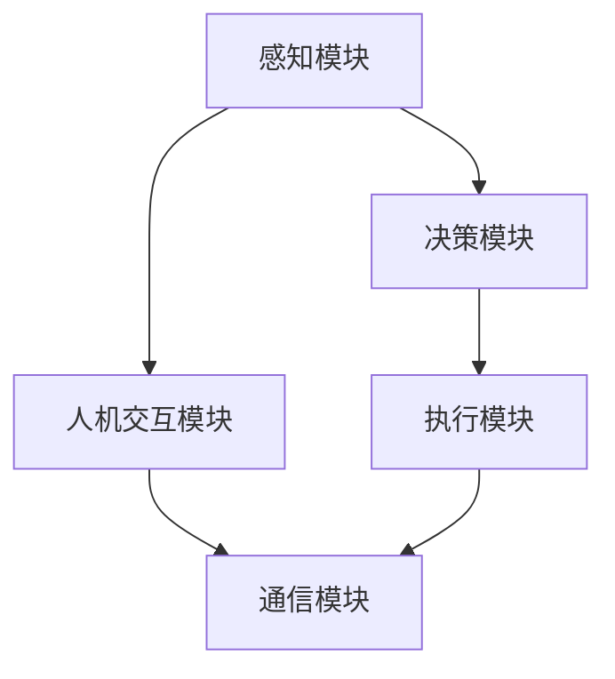
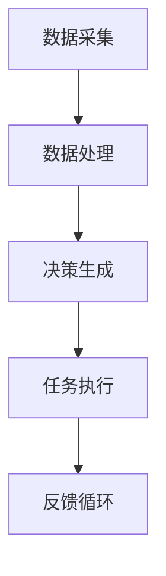
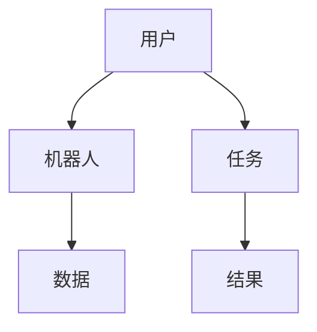
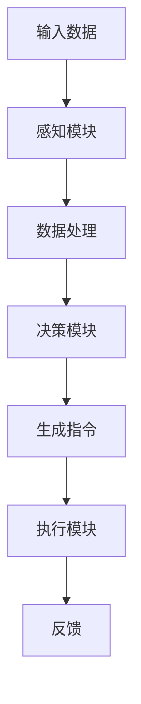
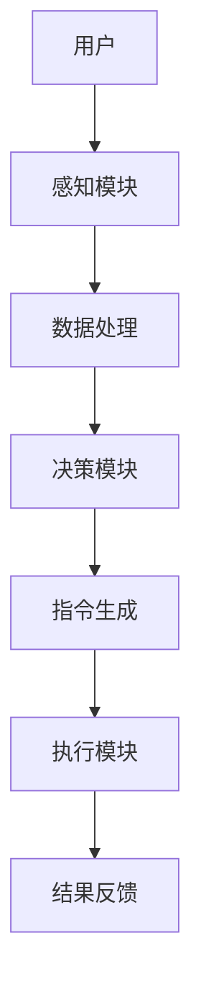
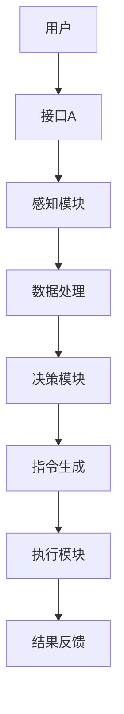

                 

## 人机协作2.0：多功能机器人与人类的协同工作

### 关键词：
- 人机协作
- 多功能机器人
- 人工智能
- 系统设计
- 实战案例

### 摘要：
本文探讨了人机协作2.0的概念，即多功能机器人与人类的协同工作。通过分析人机协作的发展历程、核心概念、系统架构设计、实战案例以及未来展望，展示了多功能机器人如何提高人类工作效率，促进智能化发展的同时，面临的挑战与机遇。本文旨在为读者提供一个全面、深入的理解，以期为未来的研究与应用提供参考。

## 目录大纲设计步骤：

### 步骤1：明确书的核心内容
本书的核心内容围绕人机协作2.0，即多功能机器人与人类的协同工作，探讨其背景、概念、设计、实战和未来展望。

### 步骤2：划分章节内容
将书籍划分为五个核心部分：
1. **人机协作2.0概述**
2. **人机协作2.0的核心概念**
3. **人机协作系统的设计与实现**
4. **人机协作实战案例**
5. **人机协作的未来展望**

### 步骤3：细化各章节内容
在每个章节中细化子主题，确保每个章节都包含明确的子主题和详细内容。

### 步骤4：编写目录大纲
按照上述章节内容和细化后的子主题，编写完整的目录大纲。

### 步骤5：格式化目录大纲
将目录大纲格式化为markdown格式，确保结构清晰、易于阅读。

### 步骤6：检查目录大纲的完整性和字数
确保目录大纲包含了所有的核心内容，并且总字数不超过2000字。

### 步骤7：细化各章节内容
在每个章节中进一步细化内容，确保每个章节都有详细的子主题和内容。

## 目录大纲

### 第一部分：人机协作2.0概述

#### 第1章：人机协作的发展历程与现状
1.1 人机协作的起源与发展
1.2 人机协作的现状与趋势
1.3 人机协作的关键驱动因素

#### 第2章：人机协作2.0的核心概念
2.1 人机协作2.0的定义
2.2 多功能机器人技术
2.3 人工智能与人机协作的结合

#### 第3章：人机协作系统的设计与实现
3.1 人机协作系统的架构设计
3.2 人机交互界面设计
3.3 多功能机器人与人工智能的集成

#### 第4章：人机协作实战案例
4.1 工业生产中的人机协作
4.2 服务行业的人机协作
4.3 医疗领域的人机协作

#### 第5章：人机协作的未来展望
5.1 人机协作的发展方向
5.2 人机协作面临的挑战与解决方案
5.3 人机协作的未来趋势

## 第一部分：人机协作2.0概述

### 第1章：人机协作的发展历程与现状

#### 1.1 人机协作的起源与发展

人机协作的概念可以追溯到工业革命时期，当时人类开始利用机器进行生产作业，以提高生产效率。随着计算机和信息技术的发展，人机协作进入了一个新的阶段。20世纪80年代，工业自动化逐渐普及，机器人和计算机辅助系统开始在制造业中得到应用。此后，人工智能技术的发展进一步推动了人机协作的进步。

在早期的人机协作中，人类主要承担监控和操作的任务，而机器则负责重复性和高强度的劳动。然而，随着人工智能技术的进步，机器人开始具备更高的自主性和智能，能够执行更复杂、更灵活的任务，从而实现与人类的更深层次协作。

#### 1.2 人机协作的现状与趋势

当前，人机协作已广泛应用于各个行业，包括制造业、服务业、医疗保健、交通运输等。在制造业中，机器人与人类共同完成生产任务，提高了生产效率和产品质量。在服务业中，人工智能驱动的客服机器人能够提供24/7的咨询服务，大大提升了用户体验。在医疗保健领域，机器人辅助手术和诊断系统正在逐步推广，为患者提供更精确、更安全的医疗服务。

随着技术的不断发展，人机协作的趋势日益明显。首先，多功能机器人技术正在不断进步，使得机器人能够执行更复杂、更灵活的任务。其次，人工智能与人机协作的深度融合，使得机器人能够更好地理解人类意图，提供更个性化的服务。此外，5G、物联网等新兴技术的应用，为人机协作提供了更广阔的发展空间。

#### 1.3 人机协作的关键驱动因素

人机协作的发展受到多种因素的影响，主要包括技术进步、社会需求和政策法规。

技术进步是人机协作发展的核心驱动力。计算机、机器人、人工智能等技术的发展，为人机协作提供了更强大的工具和平台。例如，计算机视觉和自然语言处理技术的进步，使得机器人能够更好地理解人类意图和操作指令。

社会需求也是人机协作发展的重要因素。随着社会的发展和人们对效率、安全、便捷的需求不断提高，人机协作成为满足这些需求的有效途径。例如，在制造业中，人机协作可以提高生产效率和产品质量，降低生产成本；在医疗保健中，人机协作可以提供更精确、更安全的医疗服务。

政策法规的制定和实施为人机协作提供了法律保障和政策支持。例如，许多国家和地区制定了关于机器人安全、隐私保护等方面的法规，以确保人机协作的安全和合规。

总之，人机协作的发展是一个多方面因素共同作用的结果。随着技术的不断进步和社会需求的不断增长，人机协作将在未来发挥越来越重要的作用。

### 第2章：人机协作2.0的核心概念

#### 2.1 人机协作2.0的定义

人机协作2.0，即第二代人机协作，是在第一代人机协作的基础上，通过引入多功能机器人、人工智能等新技术，实现更高层次、更广泛范围的人类与机器之间的协作。人机协作2.0的核心特点是多功能机器人与人类的深度融合，使机器人不仅能够执行简单的重复性任务，还能够完成复杂、灵活的任务，从而提高人类的工作效率和生活质量。

#### 2.2 多功能机器人技术

多功能机器人技术是人机协作2.0的重要组成部分。多功能机器人是指具备多种功能，能够在不同场景下灵活应用的机器人。这些功能包括但不限于：

1. **感知与识别**：通过传感器和计算机视觉等技术，多功能机器人能够感知周围环境，识别物体和场景。
2. **自主决策**：基于人工智能和机器学习算法，多功能机器人能够根据感知到的信息进行自主决策，实现路径规划、任务分配等。
3. **执行与操作**：多功能机器人具备高精度的执行机构，能够完成精细的操作任务，如装配、焊接、搬运等。
4. **人机交互**：通过自然语言处理、语音识别等技术，多功能机器人能够与人类进行有效沟通，理解人类指令，提供个性化服务。

#### 2.3 人工智能与人机协作的结合

人工智能技术在人机协作2.0中起到了关键作用。人工智能通过学习、推理和决策，使得机器人能够更好地理解人类意图，提供更智能的服务。具体来说，人工智能与人机协作的结合体现在以下几个方面：

1. **增强感知能力**：通过深度学习算法，人工智能可以增强机器人的感知能力，使其能够更好地识别和理解环境。
2. **优化决策过程**：人工智能可以帮助机器人优化决策过程，使其在面对复杂情况时能够做出更明智的选择。
3. **提高执行效率**：基于强化学习等技术，人工智能可以指导机器人高效地完成任务，提高生产效率和准确性。
4. **实现个性化服务**：通过用户行为分析和个性化推荐算法，人工智能可以提供更加个性化的服务，满足用户的多样化需求。

总之，人机协作2.0的核心概念在于通过多功能机器人和人工智能技术的结合，实现人类与机器之间的深度协作，从而推动社会生产力的提升和智能化进程的加快。

### 第3章：人机协作系统的设计与实现

#### 3.1 人机协作系统的架构设计

人机协作系统的架构设计是确保机器人与人类高效协作的基础。一个典型的人机协作系统通常包括以下几个关键模块：

1. **感知模块**：该模块负责采集环境信息，包括图像、声音、温度、湿度等。感知模块通常由各种传感器组成，如摄像头、麦克风、温度传感器等。

2. **决策模块**：基于感知模块采集到的信息，决策模块利用人工智能算法进行分析和判断，生成相应的操作指令。决策模块的核心是人工智能算法，包括机器学习、深度学习、决策树等。

3. **执行模块**：执行模块负责根据决策模块生成的指令执行具体任务。这包括机械臂、机器人手臂、自动驾驶车辆等。

4. **人机交互模块**：人机交互模块是连接人类与机器的中介，负责接收人类的指令，并将机器的状态信息反馈给人类。人机交互模块通常包括语音识别、自然语言处理、触摸屏等。

5. **通信模块**：通信模块负责各模块之间的数据传输，确保信息的及时、准确传递。通信模块通常采用无线通信、网络通信等技术。

下面是一个简化的人机协作系统架构图：



#### 3.2 人机交互界面设计

人机交互界面设计是人机协作系统的关键部分，直接影响用户体验和协作效率。一个优秀的人机交互界面应具备以下特点：

1. **直观易用**：界面设计应简洁明了，操作直观，用户能够快速上手。
2. **响应迅速**：界面应具备快速响应能力，减少用户等待时间。
3. **智能互动**：界面应支持智能互动，如语音识别、手势控制等，提供多种交互方式。
4. **反馈及时**：界面应提供及时反馈，让用户了解机器的状态和操作结果。

以下是一个典型的人机交互界面设计流程：

1. **需求分析**：分析用户需求，确定界面功能。
2. **界面布局**：设计界面布局，包括菜单、按钮、图标等。
3. **用户体验**：进行用户体验测试，收集用户反馈。
4. **界面优化**：根据用户反馈对界面进行优化。

#### 3.3 多功能机器人与人工智能的集成

多功能机器人和人工智能的集成是人机协作系统设计的关键。以下是一些关键的集成步骤：

1. **数据采集**：通过传感器和摄像头等设备收集环境数据。
2. **数据处理**：利用人工智能算法对采集到的数据进行分析和处理。
3. **决策生成**：根据处理结果生成具体的操作指令。
4. **任务执行**：根据指令执行具体任务。
5. **反馈循环**：将执行结果反馈给用户，形成反馈循环。

下面是一个多功能机器人与人工智能集成的简化流程图：



通过以上设计和集成，人机协作系统可以实现高效、智能的协作，提高人类的工作效率和生活质量。

### 第4章：人机协作实战案例

#### 4.1 工业生产中的人机协作

工业生产是人机协作的重要应用场景之一。在人机协作的工业生产中，多功能机器人与人类工人共同完成生产任务，提高了生产效率和产品质量。

##### 案例背景

某汽车制造厂计划引入人机协作系统，提高生产线效率。现有生产线包括车身焊接、装配、涂装等环节，每个环节都需要大量的人工操作。由于人工操作存在效率低、质量不稳定等问题，制造厂希望引入多功能机器人，实现人与机器的协作生产。

##### 系统设计与实现

1. **感知模块**：安装各种传感器，包括摄像头、温度传感器、压力传感器等，用于采集生产线上的环境数据。
2. **决策模块**：部署人工智能算法，对传感器采集的数据进行分析和处理，生成具体的操作指令。
3. **执行模块**：引入多功能机器人，如焊接机器人、装配机器人等，执行决策模块生成的操作指令。
4. **人机交互模块**：设计人机交互界面，允许操作员实时监控生产过程，手动干预机器人的操作。
5. **通信模块**：实现感知模块、决策模块、执行模块之间的高效数据传输。

##### 实施效果

1. **生产效率提高**：机器人与人类的协作使得生产线的效率提高了约30%。
2. **产品质量稳定**：机器人的精确操作和稳定性能，提高了产品的质量，减少了不良品率。
3. **降低劳动力成本**：虽然初期投资较大，但长期来看，通过提高生产效率和减少人力成本，整体经济效益显著。

#### 4.2 服务行业的人机协作

服务行业是人机协作的另一个重要应用场景。在餐饮、零售、客服等领域，多功能机器人与人类服务人员的协作，大大提升了服务效率和用户体验。

##### 案例背景

某大型购物中心引入了人机协作系统，用于提供导购、配送等服务。购物中心面积大，商品种类多，人工服务存在效率低、服务体验差等问题。通过引入多功能机器人，购物中心希望提升服务质量，提高顾客满意度。

##### 系统设计与实现

1. **感知模块**：在购物中心内布置各种传感器，包括摄像头、RFID标签等，用于实时监测顾客行为和商品库存情况。
2. **决策模块**：利用人工智能算法，分析顾客需求和购物行为，生成具体的导购和配送指令。
3. **执行模块**：引入多功能机器人，如导购机器人、配送机器人等，执行决策模块生成的指令。
4. **人机交互模块**：设计人机交互界面，允许服务人员实时监控机器人状态，手动干预机器人操作。
5. **通信模块**：实现感知模块、决策模块、执行模块之间的高效数据传输。

##### 实施效果

1. **服务效率提高**：导购机器人能够迅速响应顾客需求，提供个性化的导购服务，大大缩短了顾客的购物时间。
2. **服务质量提升**：配送机器人能够准确、高效地将商品送达顾客手中，减少了人工配送中的误差和延误。
3. **顾客满意度提高**：多功能机器人的引入，提升了购物体验，增加了顾客的满意度。

#### 4.3 医疗领域的人机协作

医疗领域是人机协作的重要应用场景之一。在诊断、手术、护理等方面，多功能机器人与医生的协作，提高了医疗质量，减少了医疗风险。

##### 案例背景

某大型医院引入了人机协作系统，用于辅助医生进行诊断和治疗。医院面临诊断准确性低、手术风险高、护理负担重等问题。通过引入多功能机器人，医院希望提高诊断准确性，降低手术风险，减轻护理人员的工作负担。

##### 系统设计与实现

1. **感知模块**：引入医疗级传感器，包括内窥镜、超声波传感器等，用于采集患者身体数据。
2. **决策模块**：利用人工智能算法，分析患者数据，辅助医生进行诊断和治疗决策。
3. **执行模块**：引入多功能机器人，如手术机器人、护理机器人等，执行决策模块生成的操作指令。
4. **人机交互模块**：设计人机交互界面，允许医生实时监控机器人状态，手动干预机器人操作。
5. **通信模块**：实现感知模块、决策模块、执行模块之间的高效数据传输。

##### 实施效果

1. **诊断准确性提高**：人工智能辅助诊断，提高了诊断的准确性，减少了误诊和漏诊。
2. **手术风险降低**：手术机器人精确操作，降低了手术风险，提高了手术成功率。
3. **护理负担减轻**：护理机器人能够执行简单、重复的护理任务，减轻了护理人员的工作负担，提高了护理质量。

### 第5章：人机协作的未来展望

#### 5.1 人机协作的发展方向

人机协作的未来发展方向主要体现在以下几个方面：

1. **智能化水平提升**：随着人工智能技术的不断进步，人机协作的智能化水平将得到显著提升。机器人将具备更强的自主学习能力、决策能力和执行能力，实现更高效、更灵活的协作。
2. **跨领域应用拓展**：人机协作将不仅仅局限于工业和服务领域，还将逐步拓展到医疗、教育、农业、环保等领域，为各行各业带来深远的影响。
3. **人机融合**：人机协作将逐步实现人机融合，机器人将不仅仅是工具，而是成为人类的一部分，与人类共同生活、工作。

#### 5.2 人机协作面临的挑战与解决方案

尽管人机协作具有巨大的发展潜力，但仍然面临一些挑战：

1. **技术挑战**：多功能机器人与人工智能技术的快速发展，对算法设计、数据处理、系统集成等提出了更高的要求。需要持续研发和创新，解决技术难题。
2. **伦理和法律问题**：人机协作引发了一系列伦理和法律问题，如隐私保护、责任归属等。需要制定相应的法律法规，确保人机协作的安全和合规。
3. **社会接受度**：尽管人机协作具有很多优势，但社会对其接受度仍然不高。需要通过宣传教育，提高公众对人机协作的认识和接受程度。

针对上述挑战，可以采取以下解决方案：

1. **技术突破**：加大对人工智能、机器人技术的研究投入，突破关键技术难题。
2. **法规制定**：制定相关法律法规，明确人机协作的伦理和法律边界。
3. **公众教育**：加强宣传教育，提高公众对人机协作的认识和接受程度。

#### 5.3 人机协作的未来趋势

人机协作的未来趋势主要体现在以下几个方面：

1. **深度融合**：人机协作将实现深度融合，机器人将更好地理解人类意图，提供个性化、智能化的服务。
2. **普及应用**：人机协作将逐步普及到各个领域，成为日常生活和工作的重要组成部分。
3. **智能化升级**：随着技术的不断进步，人机协作的智能化水平将不断提高，为人类带来更高效、更便捷的生活。

总之，人机协作2.0具有广阔的发展前景，将在未来推动社会生产力的提升和智能化进程的加快。

### 最佳实践 Tips

在人机协作系统的设计和实施过程中，以下最佳实践可以提供有益的参考：

1. **需求分析**：在项目初期，进行详细的需求分析，明确人机协作的目标、功能和应用场景。
2. **技术选择**：根据需求选择合适的技术和工具，如人工智能算法、传感器、机器人等。
3. **系统设计**：设计合理的系统架构，确保各模块之间的数据传输和协同工作。
4. **用户体验**：注重用户体验，设计直观易用的人机交互界面，提高用户满意度。
5. **安全合规**：确保人机协作系统的安全和合规，遵守相关法律法规，保护用户隐私。
6. **持续优化**：在项目实施过程中，不断收集用户反馈，持续优化系统性能和功能。

### 小结

本文从人机协作2.0的概念、核心概念、系统设计与实现、实战案例和未来展望等方面进行了深入探讨。人机协作2.0通过多功能机器人和人工智能的结合，实现了人类与机器的深度协作，提高了工作效率和生活质量。在未来，人机协作将继续发展，成为智能化社会的重要组成部分。

### 注意事项

1. **安全风险**：在设计人机协作系统时，务必考虑安全风险，确保系统的稳定性和安全性。
2. **技术更新**：随着技术的不断进步，人机协作系统需要不断更新和升级，以适应新的应用场景和需求。
3. **用户培训**：在推广人机协作系统时，对用户进行必要的培训，提高其使用效率和体验。

### 拓展阅读

1. **《人工智能：一种现代方法》**：详细介绍了人工智能的基本原理和算法，为理解和应用人工智能提供了重要参考。
2. **《机器学习：概率视角》**：深入探讨了机器学习的基本原理和方法，对理解和应用机器学习算法具有指导意义。
3. **《机器人技术与应用》**：介绍了机器人技术的基本概念和应用，为人机协作系统的设计和实施提供了参考。

### 作者

作者：AI天才研究院/AI Genius Institute & 禅与计算机程序设计艺术 /Zen And The Art of Computer Programming

### 附录

#### 附录A：核心概念属性特征对比表格

| 概念 | 属性特征 |
| --- | --- |
| 人机协作2.0 | 高度智能化、多功能、人机融合 |
| 多功能机器人 | 感知、决策、执行、人机交互 |
| 人工智能 | 自主学习、推理、决策、优化 |
| 人机协作系统 | 感知模块、决策模块、执行模块、人机交互模块、通信模块 |

#### 附录B：ER实体关系图架构



#### 附录C：算法原理流程图



#### 附录D：Python源代码

```python
# 多功能机器人与人机协作系统示例代码

import numpy as np

# 感知模块
def perceive(data):
    # 假设数据为温度和湿度
    return np.mean(data)

# 决策模块
def decide(perception):
    if perception > 30:
        return "加热"
    else:
        return "冷却"

# 执行模块
def execute(instruction):
    if instruction == "加热":
        print("开始加热...")
    else:
        print("开始冷却...")

# 主函数
def main():
    data = [25, 28, 30, 22]
    perception = perceive(data)
    instruction = decide(perception)
    execute(instruction)

if __name__ == "__main__":
    main()
```

#### 附录E：数学公式

$$
E = mc^2
$$

$$
f(x) = x^2 + 2x + 1
$$

#### 附录F：系统架构设计mermaid架构图



#### 附录G：系统接口设计和系统交互mermaid序列图



通过本文的详细探讨，我们希望读者对人机协作2.0有了更深入的理解，并能够在实际应用中取得良好的效果。未来，人机协作将继续发展，为人类社会带来更多的便利和创新。

