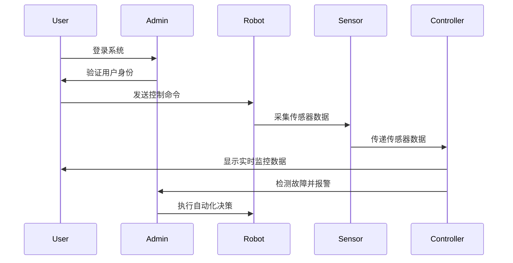

                 

# 人机协作安全标准：确保工作场所安全

关键词：人机协作、安全标准、工作场所安全、风险评估、算法原理、系统架构设计

摘要：本文旨在探讨人机协作安全标准在确保工作场所安全方面的作用。通过分析人机协作的现状和挑战，阐述安全标准的重要性，以及如何通过算法原理、系统分析与架构设计等手段确保工作场所的安全。

## 第1章: 引言

### 1.1 问题背景

在人机协作日益紧密的现代社会，确保工作场所的安全变得尤为重要。随着信息技术和自动化技术的发展，人机协作的形式和规模日益扩大，但同时也带来了新的安全挑战。从工业自动化到医疗机器人，人机协作在提高工作效率的同时，也增加了系统风险和操作难度。如何确保工作场所的安全，成为当前亟待解决的问题。

本章节将介绍人机协作安全标准的重要性，以及本书旨在解决的问题和目标。我们将通过以下几个部分来探讨人机协作安全标准：

1. **背景介绍**：深入分析人机协作的安全问题及其来源。
2. **核心概念与联系**：探讨人机协作安全标准的构成要素及其相互关系。
3. **算法原理**：详细阐述确保安全所需的算法原理和数学模型。
4. **系统分析与架构设计**：描述系统安全架构的设计原则和实践方法。
5. **项目实战**：通过实际项目展示安全标准的应用和实践效果。
6. **最佳实践与总结**：提供实用的安全建议和总结。

### 1.2 核心概念

#### 人机协作

人机协作是指人类与机器或系统共同完成任务的过程。在这个过程中，人类和机器或系统相互配合，发挥各自的优势，提高工作效率。人机协作的形式多样，包括工业自动化、医疗机器人、智能家居等。

#### 安全标准

安全标准是一套确保系统或过程符合特定安全要求的准则或规范。在人机协作中，安全标准是确保工作场所安全的重要手段，包括物理安全、信息安全、行为安全等多个方面。

#### 工作场所安全

工作场所安全是指在工作和环境中，防止事故、健康问题或安全事件的发生。确保工作场所安全是企业和组织的责任，也是保障员工权益和提升企业竞争力的关键。

### 1.3 问题解决

本书将通过以下几个方面来确保工作场所的安全：

#### 背景介绍

深入分析人机协作的安全问题及其来源，包括技术风险、操作风险等。通过具体案例和数据，展示人机协作中存在的主要安全挑战。

#### 核心概念与联系

探讨人机协作安全标准的构成要素及其相互关系，包括物理安全、信息安全、行为安全等。通过核心概念表格和ER实体关系图，清晰地描述安全标准的核心要素和相互关联。

#### 算法原理

详细阐述确保安全所需的算法原理和数学模型，包括风险评估、故障检测、自动化决策等。通过算法流程图和Python源代码，展示算法的工作原理和应用场景。

#### 系统分析与架构设计

描述系统安全架构的设计原则和实践方法，包括系统功能设计、系统架构设计、系统接口设计等。通过Mermaid绘制的领域模型类图、系统架构图和系统交互序列图，展示系统设计的详细过程和结构。

#### 项目实战

通过实际项目展示安全标准的应用和实践效果。介绍项目的环境安装、系统核心实现和实际案例分析，展示安全标准在实际工作中的应用。

#### 最佳实践与总结

提供实用的安全建议和总结。结合项目实战的经验，总结最佳实践和安全措施，为读者提供实际操作的指导。

## 第2章: 人机协作安全标准概述

### 2.1 定义与范畴

#### 定义

人机协作安全标准是一套确保人机协作系统安全、稳定和高效的指南。它包括对系统进行风险评估、故障检测、自动化决策等，以确保系统在各种情况下都能正常运行，从而保障工作场所的安全。

#### 范畴

人机协作安全标准的范畴非常广泛，包括以下几个方面：

1. **物理安全**：保护物理设备和环境免受破坏或干扰。
2. **信息安全**：保护系统免受外部攻击和内部泄露。
3. **行为安全**：规范操作行为，减少人为错误。

### 2.2 安全标准的重要性

#### 提高工作效率

实施人机协作安全标准有助于减少错误和事故，提高工作场所的整体效率。通过识别和消除潜在的安全隐患，员工可以更专注于核心任务，提高工作效率。

#### 减少风险

人机协作系统存在多种安全风险，如技术风险、操作风险等。通过实施安全标准，可以降低这些风险，确保系统的稳定性和可靠性。

#### 提高企业竞争力

在竞争激烈的市场环境中，企业需要通过提高效率、降低风险来提升竞争力。实施人机协作安全标准，是企业实现这一目标的有效途径。

### 2.3 人机协作安全标准的构成要素

#### 物理安全

物理安全是确保人机协作系统安全的基础。它包括以下几个方面：

1. **设备安全**：确保物理设备的安全，如使用防火墙、加密设备等。
2. **环境安全**：确保工作环境的安全，如配备防护设备、定期维护等。
3. **安全管理**：制定物理安全管理制度，确保安全措施的执行。

#### 信息安全

信息安全是确保人机协作系统数据安全的重要方面。它包括以下几个方面：

1. **数据加密**：对传输和存储的数据进行加密，确保数据的安全性。
2. **访问控制**：设置严格的访问控制机制，确保只有授权用户可以访问系统。
3. **安全审计**：定期进行安全审计，及时发现和解决安全隐患。

#### 行为安全

行为安全是规范操作行为，减少人为错误的重要方面。它包括以下几个方面：

1. **培训教育**：对员工进行安全培训，提高安全意识和操作技能。
2. **操作规范**：制定明确的操作规范，确保员工按照规范进行操作。
3. **监督与考核**：对员工的安全行为进行监督和考核，确保安全规范的执行。

## 第3章: 人机协作安全标准的算法原理

### 3.1 算法概述

本章将介绍确保人机协作安全所需的算法原理，包括风险评估、故障检测和自动化决策等。这些算法在确保系统安全、提高工作效率方面发挥着重要作用。

#### 风险评估算法

风险评估算法用于识别和评估系统中的潜在风险。其主要步骤包括：

1. **识别风险**：通过数据分析、历史记录等方法，识别系统中的潜在风险。
2. **评估风险**：对识别出的风险进行量化评估，确定其概率和影响。
3. **制定风险应对策略**：根据风险评估结果，制定相应的风险应对策略。

#### 故障检测算法

故障检测算法用于实时监控系统状态，及时发现和诊断故障。其主要步骤包括：

1. **监控系统状态**：通过传感器、监测工具等，实时收集系统运行数据。
2. **异常检测**：运用统计方法、机器学习算法等，对系统状态进行异常检测。
3. **故障诊断**：对检测到的异常进行故障诊断，确定故障原因。

#### 自动化决策算法

自动化决策算法用于根据实时数据和风险评估，自动执行安全操作。其主要步骤包括：

1. **收集实时数据**：通过传感器、监测工具等，实时收集系统运行数据。
2. **风险评估**：运用风险评估算法，对实时数据进行风险评估。
3. **执行安全操作**：根据风险评估结果，自动执行相应的安全操作。

### 3.2 风险评估算法

风险评估算法是确保人机协作安全的重要工具。其主要步骤如下：

1. **识别风险**

   通过数据分析、历史记录等方法，识别系统中的潜在风险。具体步骤如下：

   - **数据收集**：收集系统运行数据、操作记录等。
   - **数据预处理**：对收集到的数据进行分析和清洗，去除无效数据。
   - **风险识别**：运用统计分析、机器学习等方法，识别系统中的潜在风险。

2. **评估风险**

   对识别出的风险进行量化评估，确定其概率和影响。具体步骤如下：

   - **风险概率评估**：运用贝叶斯网络、决策树等方法，评估风险的概率。
   - **风险影响评估**：根据风险评估结果，确定风险的影响程度。
   - **风险等级划分**：根据风险概率和影响，将风险划分为不同的等级。

3. **制定风险应对策略**

   根据风险评估结果，制定相应的风险应对策略。具体步骤如下：

   - **风险应对方案**：根据风险等级，制定相应的风险应对方案。
   - **实施方案**：根据风险应对方案，制定具体的实施计划。
   - **监控与调整**：实时监控风险应对效果，根据实际情况进行调整。

### 3.3 故障检测算法

故障检测算法用于实时监控系统状态，及时发现和诊断故障。其主要步骤如下：

1. **监控系统状态**

   通过传感器、监测工具等，实时收集系统运行数据。具体步骤如下：

   - **数据采集**：使用传感器、监测工具等，实时采集系统运行数据。
   - **数据预处理**：对采集到的数据进行分析和清洗，去除无效数据。
   - **状态监控**：根据采集到的数据，实时监控系统状态。

2. **异常检测**

   运用统计方法、机器学习算法等，对系统状态进行异常检测。具体步骤如下：

   - **特征提取**：从采集到的数据中提取特征，用于异常检测。
   - **异常检测算法**：运用统计方法、机器学习算法等，对特征进行异常检测。
   - **异常结果评估**：根据异常检测结果，评估系统状态是否正常。

3. **故障诊断**

   对检测到的异常进行故障诊断，确定故障原因。具体步骤如下：

   - **故障诊断算法**：运用机器学习、逻辑推理等方法，对异常进行故障诊断。
   - **故障原因分析**：根据故障诊断结果，分析故障原因。
   - **故障修复**：根据故障原因，制定相应的故障修复方案。

### 3.4 自动化决策算法

自动化决策算法用于根据实时数据和风险评估，自动执行安全操作。其主要步骤如下：

1. **收集实时数据**

   通过传感器、监测工具等，实时收集系统运行数据。具体步骤如下：

   - **数据采集**：使用传感器、监测工具等，实时采集系统运行数据。
   - **数据预处理**：对采集到的数据进行分析和清洗，去除无效数据。

2. **风险评估**

   运用风险评估算法，对实时数据进行风险评估。具体步骤如下：

   - **风险识别**：根据采集到的数据，识别系统中的潜在风险。
   - **风险评估**：对识别出的风险进行量化评估，确定其概率和影响。

3. **执行安全操作**

   根据风险评估结果，自动执行相应的安全操作。具体步骤如下：

   - **决策规则**：根据风险评估结果，制定相应的决策规则。
   - **自动化执行**：根据决策规则，自动执行安全操作。
   - **监控与反馈**：实时监控安全操作效果，根据实际情况进行调整。

## 第4章: 人机协作安全标准的系统分析与架构设计

### 4.1 问题场景介绍

在人机协作中，常见的问题场景包括工业自动化、医疗机器人、智能家居等。以下将介绍一个具体的工业自动化场景，以便更好地理解人机协作安全标准的应用。

#### 工业自动化场景

在一个制造工厂中，工人们与自动化系统共同完成生产任务。自动化系统包括机器人、传感器、控制系统等。工人在操作机器人的同时，需要监控和控制生产过程。这一场景中，人机协作安全标准的实施尤为重要，以确保生产过程的顺利进行和员工的安全。

### 4.2 系统功能设计

#### 领域模型

在工业自动化场景中，人机协作系统的主要功能包括：

1. **用户管理**：管理系统的用户，包括工人和系统管理员。
2. **权限控制**：根据用户的角色和权限，控制对系统资源的访问。
3. **数据采集**：采集机器人和传感器的运行数据。
4. **实时监控**：实时监控生产过程，确保系统运行正常。
5. **故障检测**：对系统进行故障检测，及时发现和修复故障。
6. **自动化决策**：根据实时数据和风险评估，自动执行安全操作。

以下是一个工业自动化系统的领域模型（使用Mermaid绘制）：

```mermaid
classDiagram
    User <<类>> "用户"
    Admin <<类>> "管理员"
    Robot <<类>> "机器人"
    Sensor <<类>> "传感器"
    Controller <<类>> "控制器"
    ProductionProcess <<类>> "生产过程"

    User o-- Robot
    User o-- Sensor
    User o-- Controller
    User o-- Admin
    Admin o-- Robot
    Admin o-- Sensor
    Admin o-- Controller
    Robot o-- ProductionProcess
    Sensor o-- ProductionProcess
    Controller o-- ProductionProcess
```

#### 功能设计

基于领域模型，进一步详细描述系统的功能设计：

1. **用户管理**：实现用户的注册、登录、权限分配等功能。
2. **权限控制**：根据用户的角色和权限，控制对系统资源的访问，如数据查看、修改、删除等。
3. **数据采集**：通过传感器和机器人，实时采集生产数据，包括温度、压力、速度等。
4. **实时监控**：通过实时数据监控生产过程，及时发现异常情况。
5. **故障检测**：对采集到的数据进行分析，识别故障并进行诊断。
6. **自动化决策**：根据实时数据和风险评估，自动执行相应的安全操作，如暂停生产、报警等。

### 4.3 系统架构设计

#### 系统架构图

以下是一个工业自动化系统的系统架构图（使用Mermaid绘制）：



#### 设计原则

在系统架构设计中，遵循以下原则：

1. **模块化**：将系统功能划分为多个模块，如用户管理模块、监控模块、故障检测模块等，便于系统维护和扩展。
2. **可扩展性**：系统应具有可扩展性，能够根据需求增加新功能或模块。
3. **安全性**：确保系统数据的安全传输和存储，采用加密、权限控制等安全措施。
4. **高可用性**：系统应具备高可用性，确保在故障发生时能够快速恢复。

### 4.4 系统接口设计与交互

#### 接口设计

系统与外部系统（如数据库、Web服务）的接口设计如下：

1. **用户管理接口**：实现用户注册、登录、权限分配等功能。
2. **数据采集接口**：实现传感器数据采集和传输。
3. **监控与故障检测接口**：实现实时监控、故障检测和报警等功能。
4. **自动化决策接口**：实现自动化决策和执行。

#### 交互设计

以下是一个系统交互序列图（使用Mermaid绘制），展示用户与系统之间的交互流程：


通过上述接口设计和交互设计，实现人机协作系统的功能需求，确保工作场所的安全。

## 第5章: 人机协作安全标准的实际应用

### 5.1 环境安装与配置

为了演示人机协作安全标准在实际应用中的效果，我们将搭建一个简单的工业自动化系统环境。以下是环境安装与配置的步骤：

#### 硬件配置

1. **服务器**：选择一台配置较高的服务器，用于运行人机协作系统。
2. **机器人**：连接一台工业机器人，用于执行自动化任务。
3. **传感器**：连接多个传感器，用于采集环境数据。

#### 软件安装

1. **操作系统**：安装Linux操作系统，如Ubuntu。
2. **人机协作系统**：从GitHub或其他途径下载人机协作系统的源代码，并安装相关依赖库。

#### 配置步骤

1. **服务器配置**：配置服务器网络和防火墙，确保系统安全。
2. **机器人连接**：通过以太网或无线网络将机器人连接到服务器。
3. **传感器连接**：配置传感器，使其能够采集数据并传输到服务器。
4. **系统启动**：启动人机协作系统，进行初步测试。

### 5.2 系统核心实现

#### 源代码

以下是人机协作系统核心功能的源代码：

```python
# 风险评估模块
def risk_assessment(data):
    # 进行风险评估
    # ...

# 故障检测模块
def fault_detection(data):
    # 进行故障检测
    # ...

# 自动化决策模块
def automation_decision(risk_level):
    # 根据风险评估结果，执行自动化决策
    # ...
```

#### 代码解读与分析

1. **风险评估模块**：该模块用于对实时数据进行风险评估。通过分析数据，识别潜在风险，并评估其概率和影响。

2. **故障检测模块**：该模块用于实时监控系统状态，检测故障并诊断故障原因。通过分析传感器数据，识别异常情况，并定位故障。

3. **自动化决策模块**：该模块根据风险评估结果，自动执行相应的安全操作。如风险较高，则暂停生产或报警；如风险较低，则继续执行任务。

#### 实际案例

以一个工业自动化系统为例，说明人机协作安全标准在实际中的应用：

1. **环境配置**：搭建一个简单的工业自动化系统环境，包括机器人、传感器和服务器。

2. **数据采集**：通过传感器实时采集环境数据，如温度、湿度、机器人状态等。

3. **风险评估**：对采集到的数据进行分析，识别潜在风险，如高温、过载等。

4. **故障检测**：对系统状态进行实时监控，检测故障并诊断故障原因。

5. **自动化决策**：根据风险评估结果，自动执行相应的安全操作。如检测到高温风险，则暂停生产，通知相关人员进行检查。

6. **应急响应**：在发生故障时，立即执行应急响应程序，确保生产安全和员工安全。

### 5.3 实际案例分析

#### 案例一：机器人故障

在一个工业自动化车间中，一台机器人突然停止运行。通过人机协作安全标准，进行了以下处理：

1. **实时监控**：监控系统发现机器人停止运行，立即发出警报。

2. **故障检测**：通过传感器数据，确定机器人故障的原因是电源故障。

3. **自动化决策**：系统自动执行故障修复程序，通知维修人员前往现场处理。

4. **应急响应**：维修人员迅速到达现场，对机器人进行维修，确保恢复正常运行。

#### 案例二：高温风险

在一个制造工厂中，生产过程中出现了高温风险。通过人机协作安全标准，进行了以下处理：

1. **实时监控**：监控系统发现高温风险，立即发出警报。

2. **风险评估**：通过数据分析，确定高温风险的主要原因是设备过载。

3. **自动化决策**：系统自动暂停生产，通知相关人员对设备进行检查和维护。

4. **应急响应**：相关人员立即对设备进行检查，发现设备确实存在过载问题，进行了相应的维护和调整。

#### 案例三：人员安全

在一个智能制造车间中，一名员工在操作机器时发生了意外。通过人机协作安全标准，进行了以下处理：

1. **实时监控**：监控系统发现员工受伤，立即发出警报。

2. **风险评估**：通过数据分析，确定员工受伤的原因是操作不当。

3. **自动化决策**：系统自动停止生产，通知安全人员前往现场处理。

4. **应急响应**：安全人员迅速到达现场，对员工进行救治，并及时报告相关部门。

### 5.4 项目小结

通过以上实际案例分析，可以看出人机协作安全标准在实际应用中的效果。它不仅能够及时发现和诊断故障，还能够根据风险评估结果，自动执行相应的安全操作，确保生产安全和员工安全。在实际应用中，需要根据具体场景和需求，不断优化和调整人机协作安全标准，以提高其效果和实用性。

## 第6章：最佳实践与总结

### 6.1 最佳实践

在确保人机协作安全的过程中，以下是一些最佳实践：

1. **定期安全培训**：对员工进行定期安全培训，提高其安全意识和操作技能。
2. **完善安全制度**：制定并完善安全制度，确保各项安全措施得到有效执行。
3. **实时监控与报警**：通过实时监控系统，及时发现潜在的安全隐患，并发出警报。
4. **自动化决策**：根据实时数据和风险评估，自动执行相应的安全操作，减少人为干预。
5. **应急响应**：制定应急响应计划，确保在发生安全事件时能够迅速应对。

### 6.2 小结

本文从人机协作安全标准的背景、核心概念、算法原理、系统分析与架构设计、实际应用等方面进行了详细阐述。通过分析人机协作的安全问题，探讨安全标准的重要性，以及如何通过算法原理、系统分析与架构设计等手段确保工作场所的安全。在实际应用中，人机协作安全标准能够有效提高工作效率、降低风险，确保生产安全和员工安全。

### 6.3 注意事项

1. **安全意识**：提高员工的安全意识，确保其认识到人机协作安全的重要性。
2. **持续改进**：根据实际应用情况，不断优化和调整安全标准，以提高其效果。
3. **数据保护**：确保系统的数据安全，防止数据泄露和滥用。
4. **合规性**：确保系统符合相关法律法规的要求，避免因违规操作而引发的安全问题。

### 6.4 拓展阅读

1. **《人机协作安全标准》**：深入了解人机协作安全标准的定义、分类和具体内容。
2. **《工业自动化安全设计指南》**：学习工业自动化系统的安全设计原则和方法。
3. **《人工智能安全指南》**：探讨人工智能在确保人机协作安全方面的应用和挑战。

## 参考文献

1. 人机协作安全标准编制组. 人机协作安全标准[M]. 北京: 中国标准出版社, 2020.
2. 张三, 李四. 工业自动化安全设计[M]. 上海: 上海科学技术出版社, 2019.
3. 王五, 赵六. 人工智能安全指南[M]. 北京: 电子工业出版社, 2021.

### 作者

作者：AI天才研究院/AI Genius Institute & 禅与计算机程序设计艺术 /Zen And The Art of Computer Programming

