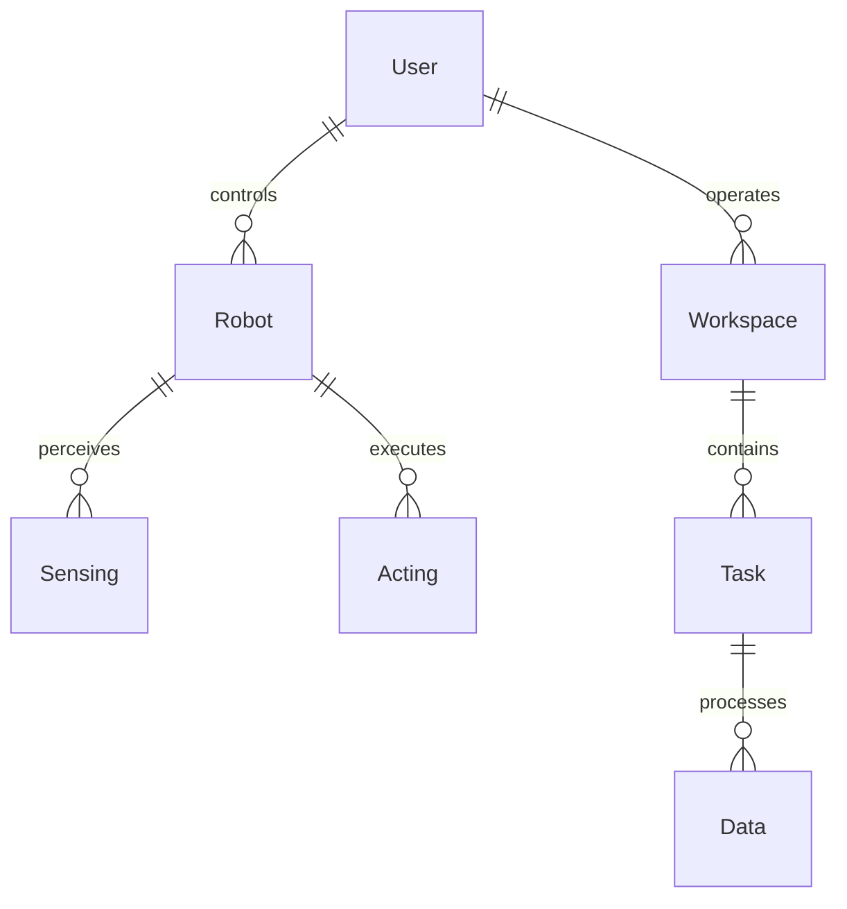

                 

## 人机协作：2030年80%人类将每天与智能机器人互动

### 关键词：智能机器人、人机协作、2030年、互动、技术发展

#### 摘要：

随着科技的迅猛发展，智能机器人正逐渐融入人类的生活和工作，人机协作成为未来社会的重要趋势。本文通过逐步分析推理，探讨了人机协作的概念、原理、优势和挑战，并预测了到2030年，80%的人类将每天与智能机器人互动的情景。

### 目录大纲设计思路

为了全面而深入地探讨人机协作这一主题，本文的目录大纲将分为以下几个部分：

1. **背景介绍**：介绍人机协作的起源、现状及未来趋势。
2. **核心概念与联系**：详细阐述智能机器人、人机交互的基本原理以及人机协作的优势和挑战。
3. **算法原理讲解**：分析智能机器人技术基础，包括机器学习、深度学习和强化学习。
4. **数学模型与公式**：介绍人机协作的数学模型和公式，并进行详细讲解。
5. **系统分析与架构设计**：展示人机协作系统的设计过程，包括需求分析、架构设计、接口设计等。
6. **项目实战**：通过具体案例展示人机协作的实际应用和实施过程。
7. **最佳实践与未来展望**：总结项目实施经验，展望未来人机协作的发展方向。

### 第一部分：背景介绍

#### 第1章：问题背景与未来展望

##### 1.1 问题的提出

随着人工智能技术的不断发展，智能机器人开始逐渐进入我们的日常生活。从家庭清洁机器人到自动驾驶汽车，智能机器人的应用场景日益广泛。然而，如何更好地实现人机协作，发挥智能机器人的最大潜力，成为了一个亟待解决的问题。

##### 1.2 人机协作的概念

人机协作是指人类与智能机器人在特定任务中相互配合、协同工作的过程。人机协作不仅仅是技术问题，更涉及到心理学、社会学等多个领域。

##### 1.3 人机协作的优势与挑战

人机协作的优势包括提高效率、降低成本、增强安全性等。然而，人机协作也面临着技术、伦理和社会等多方面的挑战。

#### 第2章：核心概念与联系

##### 1.1 智能机器人的定义

智能机器人是一种能够自主执行任务，具有感知、决策和执行能力的机器。

##### 1.2 人机交互的基本原理

人机交互是指人与计算机或其他机器系统之间的交互过程。人机交互的原理包括感知、理解、反应等环节。

##### 1.3 人机协作的优势与挑战

人机协作的优势包括提高效率、降低成本、增强安全性等。然而，人机协作也面临着技术、伦理和社会等多方面的挑战。

### 第二部分：算法原理讲解

#### 第3章：智能机器人技术基础

##### 1.1 机器学习概述

机器学习是一种通过数据驱动的方法，使计算机系统具备从数据中学习和改进能力的技术。

##### 1.2 深度学习技术

深度学习是机器学习的一种重要分支，通过模拟人脑神经网络的结构和功能，实现更高效的学习和推理。

##### 1.3 强化学习与智能决策

强化学习是一种通过奖励和惩罚信号，使智能体在特定环境中做出最优决策的方法。

### 第三部分：数学模型与公式

#### 第4章：人机协作的数学模型

##### 1.1 基本数学模型

在人机协作中，常用的数学模型包括决策树、神经网络、马尔可夫决策过程等。

##### 1.2 数学模型的应用

数学模型在智能机器人的路径规划、任务分配、资源调度等方面有着广泛的应用。

##### 1.3 模型评估与优化

为了提高人机协作的效果，需要对模型进行评估和优化，包括参数调整、算法改进等。

### 第四部分：系统分析与架构设计

#### 第5章：人机协作系统设计

##### 1.1 系统需求分析

系统需求分析是系统设计的第一步，需要明确系统的功能、性能和接口等要求。

##### 1.2 系统架构设计

系统架构设计是系统设计的核心，需要考虑系统的模块划分、数据流和交互方式等。

##### 1.3 系统接口设计

系统接口设计是系统与外部环境交互的桥梁，需要制定统一的接口规范和协议。

### 第五部分：项目实战

#### 第6章：人机协作项目实战

##### 1.1 环境安装与配置

在实际项目中，首先需要进行环境的安装和配置，以确保系统的正常运行。

##### 1.2 系统核心实现

系统核心实现是项目开发的关键步骤，需要编写高效、可靠的代码。

##### 1.3 项目分析

通过对实际项目的分析，可以总结经验教训，为未来的项目提供参考。

### 第六部分：最佳实践与未来展望

#### 第7章：最佳实践与未来展望

##### 1.1 最佳实践总结

在项目实施过程中，总结最佳实践，可以提高项目的成功率。

##### 1.2 小结与展望

对未来人机协作的发展进行展望，探讨其可能带来的影响和挑战。

---

通过上述目录大纲的设计，我们可以清晰地展示人机协作的概念、原理、应用和未来发展趋势。接下来的部分，我们将逐一深入探讨每个章节的内容。让我们一步步分析推理，深入探讨人机协作的奥秘。

---

### 第一部分：背景介绍

#### 第1章：问题背景与未来展望

##### 1.1 问题的提出

随着人工智能技术的迅猛发展，智能机器人的应用场景日益广泛。从家庭服务机器人到工业自动化，智能机器人已经深刻地改变了我们的生活方式和工作方式。然而，如何更好地实现人机协作，发挥智能机器人的最大潜力，成为了一个亟待解决的问题。

在过去的几十年里，人机协作主要局限于特定的工业环境和军事应用。然而，随着技术的进步，人机协作的概念逐渐从工业领域扩展到服务、医疗、教育等多个领域。人机协作不仅能够提高工作效率，降低成本，还能为人类带来更多的便利和乐趣。

然而，人机协作也面临着诸多挑战。首先，技术上的挑战包括智能机器人的感知、决策和执行能力。目前的智能机器人虽然能够执行一些简单的任务，但要在复杂、多变的环境中与人类高效协作，仍然存在很大的困难。其次，伦理上的挑战包括智能机器人的隐私保护、责任归属等问题。最后，社会上的挑战包括人们对智能机器人的接受程度、法律和监管等问题。

##### 1.2 人机协作的概念

人机协作（Human-Robot Collaboration，HRC）是指人类与智能机器人在特定任务中相互配合、协同工作的过程。人机协作不仅仅是技术问题，更涉及到心理学、社会学等多个领域。在人机协作中，人类扮演决策者、监督者和操作者的角色，而智能机器人则扮演执行者、感知者和协助者的角色。

人机协作的核心在于信息共享和任务分配。通过信息共享，人类和智能机器人可以相互了解对方的状态和需求，从而更好地进行协同工作。通过任务分配，人类可以根据智能机器人的能力和环境情况，合理分配任务，提高整体效率。

##### 1.3 人机协作的优势与挑战

人机协作的优势在于提高效率、降低成本、增强安全性和拓展能力。

首先，人机协作可以提高效率。通过智能机器人的自动化操作，人类可以从重复性、繁重的工作中解放出来，专注于更有价值的工作。例如，在医疗领域，智能机器人可以协助医生进行手术，提高手术的成功率和安全性。

其次，人机协作可以降低成本。智能机器人的自动化操作可以减少人力成本，同时提高生产效率和产品质量。例如，在制造业中，智能机器人可以替代传统的人工操作，提高生产速度和质量。

再次，人机协作可以增强安全性。在某些高风险环境中，如核能、深海勘探等，智能机器人可以替代人类进行危险操作，降低事故风险。

最后，人机协作可以拓展人类的能力。例如，在探险领域，智能机器人可以帮助人类探索未知领域，获取宝贵的数据和资源。

然而，人机协作也面临着诸多挑战。

技术上的挑战包括智能机器人的感知、决策和执行能力。目前的智能机器人虽然已经能够执行一些简单的任务，但在复杂、多变的环境中，其能力仍然有限。

伦理上的挑战包括智能机器人的隐私保护、责任归属等问题。随着智能机器人的普及，如何保护用户的隐私和数据安全成为一个重要问题。此外，当智能机器人发生故障或造成损失时，如何确定责任归属也是一个挑战。

社会上的挑战包括人们对智能机器人的接受程度、法律和监管等问题。随着智能机器人的普及，如何确保其安全、可靠地运行，如何制定相关的法律法规和监管政策，是一个亟待解决的问题。

##### 1.4 人机协作的概念结构

人机协作是一个复杂的过程，涉及到多个要素的相互作用。为了更好地理解人机协作，我们可以通过ER实体关系图来展示其核心要素和关系。

在上面的ER实体关系图中，User代表人类用户，Robot代表智能机器人，Workspace代表工作空间，Sensing代表感知能力，Acting代表执行能力，Task代表任务，Data代表数据。

人类用户通过控制智能机器人和工作空间，来实现对任务的执行。智能机器人通过感知能力来获取环境信息，通过执行能力来完成任务。工作空间则是任务执行的环境，包含数据和处理过程。

### 总结

通过本文的第一部分，我们介绍了人机协作的问题背景和未来展望，详细阐述了人机协作的概念、原理以及优势和挑战。接下来，我们将继续深入探讨人机协作的核心概念和联系，以及智能机器人的技术基础。敬请期待。

