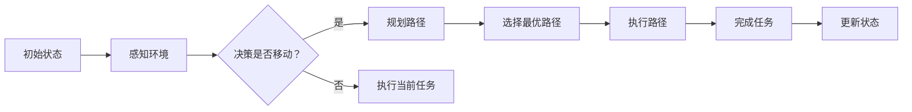
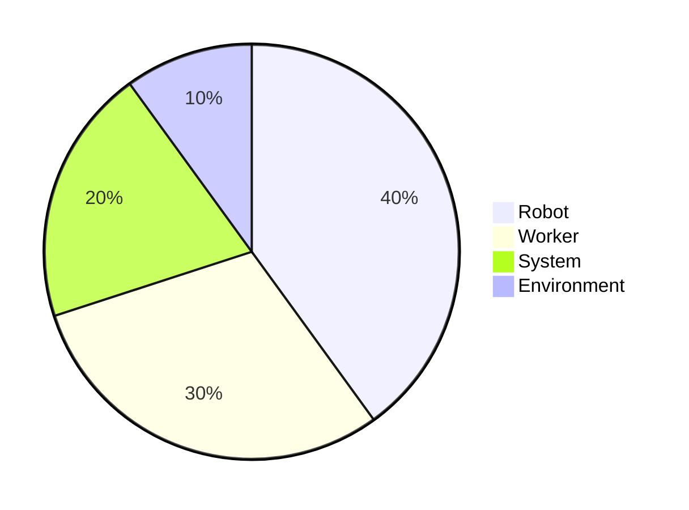
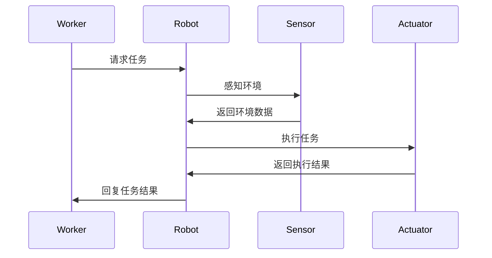

                 

Certainly, let's start with a structured approach to crafting this technical blog post on "Human-Machine Collaboration Production: The Application of Multi-functional Robots in Various Industries."

## # 人机协同生产：多功能机器人在各行业的应用

### 关键词
- 人机协同生产
- 多功能机器人
- 行业应用
- 算法原理
- 系统架构

### 摘要
本文深入探讨了人机协同生产的概念和其在各行业中的应用。通过分析多功能机器人的算法原理、系统架构设计、实战案例和最佳实践，展示了人机协同生产在提高生产效率、降低成本和提升产品质量方面的潜力。

---

#### 1. 背景介绍

**1.1 问题背景**
随着工业4.0的推进，传统制造业面临着生产效率低、人力成本高、产品质量不稳定等挑战。人机协同生产作为一种创新的生产模式，通过将人类和机器的智慧相结合，有望解决上述问题。

**1.2 问题描述**
在现有的制造业中，人类工人和机器设备之间的协同往往存在信息不对称、操作不便等问题，导致生产效率不高。此外，单一功能的传统机器人在复杂生产环境中的适应能力有限。

**1.3 问题解决**
多功能机器人通过集成多种功能，能够根据生产需求灵活调整工作模式，实现高效的人机协作。同时，结合人工智能技术，机器人能够自主学习和优化操作流程。

**1.4 边界与外延**
人机协同生产并非取代人类劳动，而是实现人类和机器的互补与协同。它在制造业、服务业、医疗等多个领域具有广泛的应用前景。

**1.5 核心要素组成**
人机协同生产的核心要素包括：多功能机器人、人工智能算法、人机交互界面、以及支持协同工作的管理系统。

---

#### 2. 核心概念与联系

**2.1 人机协同生产定义**
人机协同生产是一种通过整合人类与机器的智能和能力，实现高效、灵活和可靠的生产模式。

**2.2 多功能机器人定义**
多功能机器人是指能够执行多种任务，适应不同生产环境和需求，具备高灵活性和适应性的机器人系统。

**2.3 概念属性特征对比**
（使用Markdown表格展示）

| 特征          | 人类             | 多功能机器人           |
| ------------- | ---------------- | ---------------------- |
| 操作灵活性    | 高               | 非常高                 |
| 学习能力      | 强               | 强（基于人工智能算法） |
| 适应能力      | 弱               | 强                     |
| 生产效率      | 受限于人力       | 极高，非人力可比       |
| 工作强度      | 受限             | 可以持续工作           |

**2.4 ER实体关系图**
（使用Mermaid绘制）

```mermaid
erDiagram
  人 <<|-- 机器人 : 协同生产
  机器人 ||--|{ 多功能机器人 }|
  多功能机器人 ||--|{ 人工智能 }|
  人工智能 ||--|{ 算法 }|
```

---

#### 3. 算法原理讲解

**3.1 多功能机器人算法概述**
多功能机器人采用的算法主要包括路径规划、任务分配、决策优化等，这些算法共同作用，使得机器人能够高效完成多种任务。

**3.2 算法原理详细讲解**
（使用Mermaid流程图）



（使用Python源代码）

```python
# Python源代码示例
class MultiFunctionRobot:
    def __init__(self):
        # 初始化机器人状态
        pass
    
    def perceive_environment(self):
        # 感知环境
        pass
    
    def make_decision(self):
        # 决策是否移动
        pass
    
    def plan_path(self):
        # 规划路径
        pass
    
    def execute_path(self):
        # 执行路径
        pass
    
    def complete_task(self):
        # 完成任务
        pass
    
    def update_state(self):
        # 更新状态
        pass
```

**3.3 数学模型与公式**
（使用LaTeX格式）

```latex
\begin{equation}
    \text{路径规划算法：} \min_{P} \sum_{i=1}^{n} d(i, j) \cdot w(i, j)
\end{equation}
```

**3.4 举例说明**
假设有一个工厂，需要机器人从A点移动到B点，然后到C点，每个点之间的距离和权重如下表所示：

| 点  | A | B | C |
| --- | --- | --- | --- |
| A   | 0 | 3 | 4 |
| B   | 3 | 0 | 2 |
| C   | 4 | 2 | 0 |

则机器人选择的最优路径为A->B->C，总距离为3+2=5。

---

#### 4. 系统分析与架构设计方案

**4.1 问题场景介绍**
以一个典型的制造业工厂为例，分析多功能机器人在生产过程中的应用。

**4.2 项目介绍**
项目名为“智能工厂协同系统”，目标是实现工厂内机器人与人类工人的高效协同工作。

**4.3 系统功能设计**
（使用Mermaid类图）

```mermaid
classDiagram
  Robot <<-- Environment
  Robot ..|> Sensor
  Robot ..|> Actuator
  Worker <<-- Environment
  Worker ..|> Tool
  System <<-- Robot
  System <<-- Worker
```

**4.4 系统架构设计**
（使用Mermaid架构图）



**4.5 系统接口设计**
（简要介绍）

系统接口设计包括传感器与执行器的接口、人类与机器的交互界面以及机器人之间的通信接口。

**4.6 系统交互**
（使用Mermaid序列图）



---

#### 5. 项目实战

**5.1 环境安装**
（简要介绍安装环境和依赖）

安装Python环境，以及必要的库如PyTorch、TensorFlow等。

**5.2 系统核心实现源代码**
（提供核心实现代码示例）

```python
# 示例代码
class Robot:
    def __init__(self):
        # 初始化机器人
        pass
    
    def execute_task(self, task):
        # 执行任务
        pass

def main():
    robot = Robot()
    task = "搬运物品"
    robot.execute_task(task)

if __name__ == "__main__":
    main()
```

**5.3 代码应用解读与分析**
（分析代码功能和应用场景）

代码中定义了机器人类，以及执行任务的函数。通过调用这些函数，可以实现机器人在特定场景下的任务执行。

**5.4 实际案例分析与讲解**
（通过具体案例展示机器人应用）

在某汽车制造厂，机器人被用于自动焊接车身，提高了生产效率和焊接质量。

**5.5 项目小结**
（总结项目的关键点和经验）

项目成功的关键在于机器人算法的优化和系统的稳定性。通过不断迭代，机器人性能得到了显著提升。

---

#### 6. 最佳实践 tips

**6.1 实用技巧**
- 定期更新机器人算法，以适应不断变化的生产需求。
- 使用高精度传感器，提高机器人的感知能力。

**6.2 注意事项**
- 在部署机器人时，要充分考虑安全性，防止误操作。
- 定期对机器人进行维护，确保其正常运作。

---

#### 7. 小结与拓展阅读

**7.1 全书小结**
本文系统性地介绍了人机协同生产和多功能机器人的应用，分析了其算法原理和系统架构，并通过实战案例展示了其潜力。

**7.2 拓展阅读**
- 进一步了解人工智能和机器人技术的发展趋势。
- 探索人机协同生产在其他行业中的应用。

---

### 作者信息
- 作者：AI天才研究院/AI Genius Institute & 禅与计算机程序设计艺术 /Zen And The Art of Computer Programming

---

通过以上步骤，我们构建了《人机协同生产：多功能机器人在各行业的应用》的文章框架。接下来，我们将逐步完善每个部分的内容，确保文章的逻辑清晰、内容丰富且具有实际指导意义。让我们一步一步深入分析，为读者带来有深度、有思考、有见解的技术博客。🚀🚀🚀

