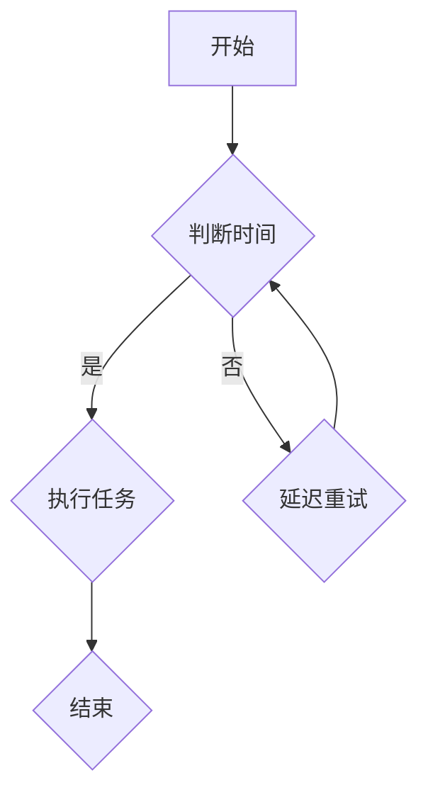
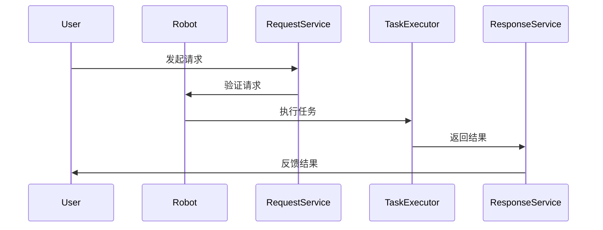
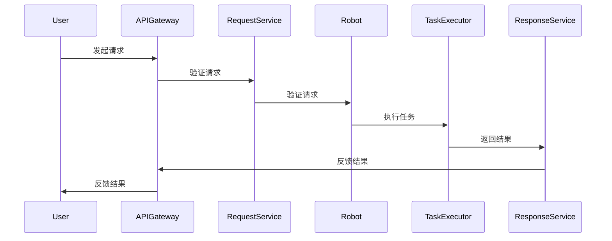

                 


### 1. 引言

#### 1.1 问题背景

随着人工智能技术的飞速发展，智能机器人在各个领域的应用逐渐成为现实。从工业自动化、零售服务，到医疗健康，智能机器人正以它们独特的优势改变着人类的生活和工作方式。然而，与此同时，人类与智能机器人之间的互动也日益密切，这为我们提出了一个新的问题：未来，人类与智能机器人日常互动将呈现哪些趋势？

智能机器人不仅仅是一种技术工具，它们还具有自主性、学习能力、感知能力等多种特性。这些特性使得智能机器人能够更好地服务于人类，同时也带来了新的挑战。例如，如何确保智能机器人的行为符合人类的道德和伦理标准，如何处理智能机器人与人类之间的信息交流等问题。因此，探讨人类与智能机器人日常互动的未来趋势，对于人工智能技术的发展和应用具有重要意义。

#### 1.2 问题描述

目前，人类与智能机器人的互动主要存在于特定的应用场景中，如智能家居、零售服务、医疗健康等。然而，这些互动往往是单向的，即人类通过语音、手势等方式与智能机器人进行沟通，而智能机器人则根据预设的指令执行任务。这种互动方式虽然能够满足一定的需求，但缺乏真正的交流和理解。

进一步地，随着智能机器人技术的不断进步，它们将具备更强的自主学习能力和适应能力。这意味着，智能机器人不仅能够执行人类赋予的任务，还能够自主地提出建议、发现问题，甚至进行创新。这种情况下，人类与智能机器人之间的互动将变得更加复杂，需要我们重新思考如何设计一个高效、自然、和谐的互动模式。

#### 1.3 问题解决

本书旨在通过系统地分析人类与智能机器人日常互动的各个方面，探讨未来趋势。具体来说，本书将首先介绍智能机器人的基础知识，包括定义、分类和应用领域。接着，我们将深入探讨智能机器人在日常互动中的应用，如智能家居、零售服务、医疗健康等。在此基础上，我们将分析技术发展对日常互动的影响，如人工智能技术、物联网、虚拟现实与增强现实等。

为了更好地理解这些趋势，本书还将通过案例研究和最佳实践来展示智能机器人互动的实际应用。最后，我们将讨论智能机器人日常互动面临的挑战与机遇，并提出相应的解决方案。

#### 1.4 边界与外延

本书主要关注的是智能机器人在日常互动中的应用和趋势，因此，它不包括工业自动化、军事应用等领域的智能机器人。同时，本书也不涉及智能机器人的研发和制造过程，而是侧重于智能机器人与人类之间的互动。

然而，随着智能机器人技术的不断进步，未来可能会有更多的应用领域被纳入本书的研究范围。例如，智能机器人在教育、娱乐、法律等领域的应用，都可能是未来研究的方向。

#### 1.5 核心概念与联系

在本章中，我们介绍了智能机器人的定义、分类、应用领域以及未来趋势。这些概念相互联系，共同构成了本书的核心内容。

- **智能机器人**：具有自主性、学习能力、感知能力等多种特性的机器人。
- **日常互动**：智能机器人与人类在日常生活中的交流和互动。
- **人工智能技术**：使智能机器人具备自主学习和感知能力的关键技术。
- **物联网**：连接智能机器人和人类的重要基础设施。
- **虚拟现实与增强现实**：提供更丰富、更自然的互动体验。

这些概念不仅构成了本书的基础，也为后续章节的分析提供了依据。

### 2. 智能机器人的定义与分类

#### 2.1 智能机器人的定义

智能机器人，顾名思义，是指具有智能特性的机器人。与传统机器人相比，智能机器人不仅仅能够按照预设的程序执行任务，还能够通过感知环境、自主学习、自主决策等方式，与人类进行更高效、更自然的互动。具体来说，智能机器人通常具备以下几个特点：

1. **自主性**：智能机器人能够独立执行任务，而不需要人类的实时干预。
2. **感知能力**：智能机器人能够通过传感器感知环境，获取信息。
3. **学习能力**：智能机器人能够通过经验和数据，不断改进自己的行为和决策。
4. **自主决策**：智能机器人能够根据当前情况和目标，自主选择最佳行动方案。
5. **交流能力**：智能机器人能够通过自然语言处理等技术，与人类进行有效的沟通和交流。

#### 2.2 智能机器人的分类

智能机器人的分类可以根据不同的标准进行。以下是几种常见的分类方法：

##### 2.2.1 工业机器人

工业机器人通常应用于生产制造、装配、焊接、搬运等工业场景。它们具有高效、稳定、安全等特点，能够替代人类完成一些重复性、危险或高精度的工作。

**特点**：

- **高精度**：工业机器人具有高精度的控制能力，能够完成复杂的装配和加工任务。
- **高效率**：工业机器人能够连续工作，不受疲劳影响，提高生产效率。
- **安全性**：工业机器人可以通过安全防护措施，保护操作人员的安全。

**应用领域**：

- **汽车制造**：用于焊接、装配等工序。
- **电子制造**：用于组装、贴片等工序。
- **食品加工**：用于包装、搬运等工序。

##### 2.2.2 服务机器人

服务机器人主要应用于服务行业，如酒店、餐饮、医疗等。它们能够提供便捷的服务，提升用户体验。

**特点**：

- **智能化**：服务机器人具备智能导航、语音交互等功能，能够自主完成服务任务。
- **人性化**：服务机器人具有人性化的设计，能够与用户进行自然交流。
- **灵活性**：服务机器人能够适应不同的服务场景，提供个性化的服务。

**应用领域**：

- **酒店服务**：提供客房服务、送餐服务等。
- **餐饮服务**：提供点餐、送餐等服务。
- **医疗护理**：提供护理、监护等服务。

##### 2.2.3 无人机

无人机是一种能够自主飞行、执行任务的空中智能机器人。它们在军事、物流、农业、新闻报道等领域有广泛应用。

**特点**：

- **自主飞行**：无人机能够根据预设的路径或实时指令，自主飞行。
- **灵活性强**：无人机能够适应不同的飞行环境，执行多样化的任务。
- **实时监控**：无人机可以通过摄像头、传感器等设备，实时获取飞行环境和目标信息。

**应用领域**：

- **军事**：用于侦察、监控、打击等任务。
- **物流**：用于快递、物流运输。
- **农业**：用于监测、施肥、喷洒农药等。
- **新闻报道**：用于拍摄新闻现场、突发事件。

##### 2.2.4 智能家居设备

智能家居设备是智能机器人的一种重要形式，它们主要应用于家庭环境，提供便捷、智能的生活体验。

**特点**：

- **自动化**：智能家居设备能够根据用户的需求和习惯，自动完成一系列操作。
- **互联互通**：智能家居设备之间能够相互通信，形成一个统一的智能系统。
- **智能控制**：用户可以通过语音、手势、移动设备等方式，远程控制智能家居设备。

**应用领域**：

- **家庭安全**：智能门锁、监控摄像头、报警系统等。
- **家庭娱乐**：智能电视、音响、照明等。
- **家庭清洁**：扫地机器人、擦窗机器人等。
- **家居健康**：智能床垫、智能冰箱、智能厨房等。

#### 2.3 智能机器人与人类日常互动的关联

智能机器人与人类的日常互动，是智能机器人技术发展的重要方向。通过智能家居设备，人类可以在家中享受智能化的便利；通过服务机器人，人类可以在商场、医院等场所得到智能化的服务；通过无人机，人类可以在户外进行智能化的监控和探索。这些互动不仅提升了人类的生活质量，也为智能机器人技术的发展提供了新的动力。

### 3. 日常互动中的智能机器人应用

#### 3.1 智能家居

智能家居是智能机器人应用的一个重要领域，它通过将家庭设备连接到互联网，实现设备的远程控制、自动化管理和智能联动。以下是一些智能家居设备的应用案例。

##### 3.1.1 智能家居概述

智能家居设备主要包括智能门锁、智能灯光、智能空调、智能安防系统、智能家电等。这些设备通过Wi-Fi或其他无线通信技术，连接到家庭网络，用户可以通过手机APP、语音助手等设备进行远程控制。

**智能门锁**：智能门锁可以通过指纹、密码、手机APP等多种方式解锁，提高了家庭的安全性。

**智能灯光**：智能灯光可以根据用户的需求和习惯，自动调节亮度和色温，提供舒适的家庭环境。

**智能空调**：智能空调可以通过手机APP远程控制，自动调节温度和风速，提高家庭的舒适度。

**智能安防系统**：智能安防系统包括监控摄像头、门窗传感器、烟雾传感器等，可以实时监控家庭的安全状况，并报警。

**智能家电**：如智能电视、智能冰箱、智能洗衣机等，用户可以通过手机APP远程控制，实现设备的自动化管理。

##### 3.1.2 智能家居设备的应用案例

以下是一些智能家居设备的应用案例：

**智能门锁**：用户可以通过手机APP远程查看门锁状态，当发现门锁未锁时，可以远程锁门，提高家庭安全。

**智能灯光**：用户可以在外出时，通过手机APP关闭家中灯光，节省能源，也可以在睡前远程调整灯光亮度，提供舒适的睡眠环境。

**智能空调**：用户可以在家中和外出时，通过手机APP远程控制空调，调节室内温度，提高家庭的舒适度。

**智能安防系统**：用户可以在手机APP上实时查看监控视频，及时发现家庭的安全隐患，并报警通知。

**智能家电**：用户可以通过手机APP远程控制家电，如远程开启冰箱，查看冰箱内的食物状况，调整洗衣机的洗涤程序等。

智能家居设备的应用，不仅提高了家庭生活的便利性，也为智能机器人与人类日常互动提供了新的方式。

#### 3.2 零售与服务

智能机器人在零售和服务行业的应用，正逐渐改变着这些行业的运营模式和服务方式。以下是一些智能机器人在零售和服务行业中的应用案例。

##### 3.2.1 智能机器人在零售领域的应用

**智能导购机器人**：智能导购机器人可以在商场中为顾客提供商品信息、优惠信息等，帮助顾客快速找到所需商品，提升购物体验。

**智能收银机器人**：智能收银机器人可以自动扫描商品条码、计算价格，并自动完成支付，减少顾客排队等待时间。

**智能仓库机器人**：智能仓库机器人可以自动搬运、分类、存储商品，提高仓库的运营效率。

**智能快递柜**：智能快递柜可以自动接收和存储快递包裹，用户可以通过手机APP远程取件，提高快递服务的便利性。

##### 3.2.2 智能机器人在服务行业的应用

**智能客服机器人**：智能客服机器人可以在酒店、银行、航空等领域提供24/7的在线客服服务，回答顾客的疑问，提供信息查询，提高服务效率。

**智能医疗机器人**：智能医疗机器人可以在医院提供导医服务、药品配送、健康咨询等，提高医疗服务质量。

**智能餐饮机器人**：智能餐饮机器人可以在餐厅提供送餐、点餐等服务，减少人力成本，提升餐厅运营效率。

**智能教育机器人**：智能教育机器人可以在学校提供课程辅导、作业批改、学习建议等，帮助学生提高学习效果。

##### 3.2.3 智能机器人互动的优势和挑战

智能机器人在零售和服务行业的应用，带来了许多优势：

1. **提高效率**：智能机器人可以自动化完成一些重复性、繁琐的任务，提高工作效率。
2. **提升服务质量**：智能机器人可以提供24/7的服务，确保顾客在任何时候都能得到及时的帮助。
3. **降低成本**：智能机器人可以减少人力成本，提高企业的经济效益。

然而，智能机器人在日常互动中也面临一些挑战：

1. **技术限制**：目前的智能机器人技术尚不能完全满足所有需求，需要不断改进和完善。
2. **数据安全**：智能机器人需要处理大量的用户数据，如何确保数据的安全和隐私保护是一个重要问题。
3. **伦理和道德问题**：智能机器人的行为和决策是否符合人类的伦理和道德标准，也是一个需要关注的问题。

#### 3.3 医疗与健康

智能机器人在医疗健康领域的应用，正在逐步改变传统的医疗模式，提供更加个性化和高效的服务。以下是一些智能机器人在医疗健康领域的应用案例。

##### 3.3.1 智能机器人在医疗中的应用

**智能诊断机器人**：智能诊断机器人可以通过大数据分析和机器学习技术，辅助医生进行疾病诊断，提高诊断的准确性和效率。

**智能手术机器人**：智能手术机器人可以在手术中提供精确的操作辅助，减少手术风险，提高手术成功率。

**智能康复机器人**：智能康复机器人可以辅助患者进行康复训练，根据患者的具体情况制定个性化的康复计划，提高康复效果。

**智能药品配送机器人**：智能药品配送机器人可以在医院内自动配送药品，减少医护人员的工作量，提高药品配送的准确性和及时性。

##### 3.3.2 智能机器人在健康监测中的应用

**智能穿戴设备**：智能穿戴设备可以实时监测用户的心率、血压、体温等生理指标，及时发现异常情况，提供健康预警。

**智能健康管理系统**：智能健康管理系统可以通过收集用户的健康数据，分析用户的健康状况，提供个性化的健康建议和治疗方案。

**智能营养顾问**：智能营养顾问可以根据用户的饮食偏好和健康状况，提供营养建议和饮食计划，帮助用户实现健康饮食。

**智能健康数据分析**：智能健康数据分析平台可以对海量的健康数据进行挖掘和分析，发现潜在的健康风险，为用户提供预防措施。

##### 3.3.3 智能机器人互动的优势和挑战

智能机器人在医疗健康领域的应用，带来了许多优势：

1. **提高医疗效率**：智能机器人可以自动化完成一些重复性、繁琐的医疗任务，提高医疗效率。
2. **提升医疗服务质量**：智能机器人可以提供24/7的服务，确保患者在任何时候都能得到及时的帮助。
3. **降低医疗成本**：智能机器人可以减少医护人员的工作量，降低医疗成本。

然而，智能机器人在医疗健康领域也面临一些挑战：

1. **技术限制**：目前的智能机器人技术尚不能完全满足所有医疗需求，需要不断改进和完善。
2. **数据安全**：智能机器人需要处理大量的患者数据，如何确保数据的安全和隐私保护是一个重要问题。
3. **伦理和道德问题**：智能机器人在医疗决策中的角色和责任，以及如何确保其行为符合医疗伦理和道德标准，也是一个需要关注的问题。

### 4. 技术发展对日常互动的影响

#### 4.1 人工智能技术

人工智能（AI）技术的发展，为智能机器人与人类的日常互动带来了革命性的变化。通过深度学习、自然语言处理、计算机视觉等技术的应用，智能机器人能够更好地理解人类的需求，提供更加个性化和高效的服务。

**深度学习**：深度学习是人工智能的核心技术之一，它通过模拟人脑的神经网络结构，对大量数据进行学习和分析。智能机器人可以通过深度学习技术，不断优化自己的行为和决策，提高与人类的互动效果。

**自然语言处理**：自然语言处理（NLP）技术使智能机器人能够理解和生成人类语言。通过NLP技术，智能机器人可以与人类进行更自然的对话，理解用户的意图和需求，提供更加个性化的服务。

**计算机视觉**：计算机视觉技术使智能机器人能够理解视觉信息，识别图像和视频中的对象和场景。智能机器人可以通过计算机视觉技术，实现人脸识别、物体检测等功能，提供更加直观和高效的互动体验。

**案例**：以智能家居为例，通过人工智能技术，智能门锁可以识别用户的面部特征，自动解锁；智能音箱可以理解用户的语音指令，播放音乐、控制家电等。这些应用展示了人工智能技术在智能机器人日常互动中的重要作用。

#### 4.2 物联网

物联网（IoT）技术的发展，为智能机器人与人类日常互动提供了基础设施支持。通过将各种设备和传感器连接到互联网，智能机器人可以获取更多的环境信息和用户数据，提供更加智能和个性化的服务。

**智能家居**：在智能家居领域，物联网技术使各种家电设备互联互通，用户可以通过手机APP或语音助手远程控制家中的设备。例如，智能灯光可以自动调节亮度和色温，智能空调可以自动调节温度和风速，为用户提供舒适的家居环境。

**智能交通**：在智能交通领域，物联网技术可以实现车辆与交通设施的实时通信，优化交通流量，减少拥堵。例如，智能交通信号灯可以根据实时交通状况调整信号时长，提高道路通行效率。

**智能医疗**：在智能医疗领域，物联网技术可以实现患者的实时健康监测和远程诊断。例如，智能穿戴设备可以实时监测患者的心率、血压等生理指标，智能健康管理系统可以根据患者的健康数据提供个性化的健康建议。

#### 4.3 虚拟现实与增强现实

虚拟现实（VR）和增强现实（AR）技术，为智能机器人与人类日常互动提供了全新的互动体验。通过创建虚拟环境和增强现实界面，智能机器人可以与人类进行更加直观和沉浸式的互动。

**虚拟现实**：虚拟现实技术可以为用户提供一个完全虚拟的环境，用户可以通过头戴式显示器和手柄设备在虚拟环境中进行互动。例如，在教育领域，虚拟现实技术可以创建一个虚拟课堂，学生可以通过虚拟现实设备进行互动学习。

**增强现实**：增强现实技术可以在现实环境中叠加虚拟元素，为用户提供更加丰富的互动体验。例如，在购物领域，增强现实技术可以使用户在试衣镜上看到试穿效果，提升购物体验。

**案例**：以智能导购机器人为例，通过虚拟现实和增强现实技术，智能导购机器人可以创建一个虚拟购物环境，用户可以在虚拟环境中查看商品细节、试穿衣物等，提升购物体验。

### 5. 案例研究：智能机器人互动的最佳实践

为了更好地理解智能机器人与人类日常互动的最佳实践，我们将通过两个案例进行研究，分析它们的具体实现和应用效果。

#### 5.1 案例一：智能家居互动

**案例背景**：本案例研究的是一个智能家居系统，该系统集成了智能门锁、智能灯光、智能空调和智能安防系统等多种设备。

**实现过程**：

1. **设备接入**：首先，将智能家居设备接入互联网，确保它们能够与云端服务器进行通信。
2. **设备配置**：通过手机APP或语音助手，用户可以远程配置智能家居设备，设置设备的工作模式和联动关系。
3. **自动化管理**：智能系统根据用户的习惯和需求，自动调整设备的状态，如自动开启灯光、自动调节空调温度等。
4. **实时监控**：用户可以通过手机APP实时监控家庭的安全状况，如门锁状态、监控摄像头等。

**案例分析**：

1. **提高生活便利性**：通过智能家居系统，用户可以远程控制家中的设备，无需亲自操作，提高了生活的便利性。
2. **节省能源**：智能系统能够根据用户的需求自动调整设备状态，节省能源，降低生活成本。
3. **提高安全性**：智能安防系统可以实时监控家庭的安全状况，及时发现异常情况，提高家庭的安全性。

**最佳实践**：

1. **用户友好的界面设计**：智能家居系统的界面设计应简洁直观，方便用户快速操作和配置设备。
2. **智能化管理**：智能系统应具备自动化管理功能，根据用户的需求和习惯，自动调整设备状态，提供更加个性化的服务。

#### 5.2 案例二：智能医疗服务

**案例背景**：本案例研究的是一个智能医疗服务系统，该系统集成了智能诊断机器人、智能手术机器人和智能康复机器人等多种设备。

**实现过程**：

1. **设备接入**：首先，将智能医疗设备接入医院的信息系统，确保设备能够与医院的其他系统进行数据交换。
2. **数据收集与处理**：智能诊断机器人通过采集患者的生理数据，如心率、血压等，将其传输到云端服务器进行分析和处理。
3. **智能辅助**：智能手术机器人可以在手术中提供精确的操作辅助，减少手术风险。智能康复机器人可以为患者提供个性化的康复训练计划。
4. **远程监控**：医生可以通过远程监控系统实时监控患者的健康状况，提供及时的医疗建议。

**案例分析**：

1. **提高诊断和手术效率**：智能诊断机器人可以快速分析大量的医疗数据，提供准确的诊断结果。智能手术机器人可以精确执行手术操作，提高手术成功率。
2. **提高康复效果**：智能康复机器人可以根据患者的具体情况，提供个性化的康复训练计划，提高康复效果。
3. **降低医疗成本**：智能医疗设备可以减少医护人员的工作量，降低医疗成本。

**最佳实践**：

1. **数据安全**：智能医疗设备需要确保患者数据的安全和隐私保护，防止数据泄露。
2. **人机协同**：智能医疗设备应与医护人员协同工作，提供辅助功能，而非完全取代医护人员的工作。
3. **持续改进**：智能医疗设备应不断收集和处理数据，优化算法，提高诊断和手术的准确性和效率。

### 6. 智能机器人日常互动的挑战与机遇

#### 6.1 挑战

智能机器人日常互动的发展，面临着一系列的挑战：

1. **技术限制**：目前的智能机器人技术尚不能完全满足所有需求，需要不断改进和完善。
2. **数据安全**：智能机器人需要处理大量的用户数据，如何确保数据的安全和隐私保护是一个重要问题。
3. **伦理和道德问题**：智能机器人的行为和决策是否符合人类的伦理和道德标准，也是一个需要关注的问题。
4. **人机协同**：智能机器人需要与人类高效协同工作，如何设计合理的人机交互界面和互动模式，是一个挑战。

#### 6.2 机遇

尽管面临挑战，智能机器人日常互动的发展也带来了许多机遇：

1. **提高效率**：智能机器人可以自动化完成一些重复性、繁琐的任务，提高工作效率。
2. **提升服务质量**：智能机器人可以提供24/7的服务，确保用户在任何时候都能得到及时的帮助。
3. **降低成本**：智能机器人可以减少人力成本，降低企业的运营成本。
4. **创新应用**：智能机器人技术为各行业带来了新的应用场景和商业模式，推动创新和发展。

#### 6.3 解决方案

为了应对挑战，抓住机遇，我们需要采取以下解决方案：

1. **技术改进**：不断研发和改进智能机器人技术，提高其性能和可靠性。
2. **数据保护**：建立完善的数据安全保护机制，确保用户数据的安全和隐私。
3. **伦理规范**：制定相关的伦理规范和法律法规，确保智能机器人的行为符合人类的伦理和道德标准。
4. **人机协同**：设计合理的人机交互界面和互动模式，促进智能机器人与人类的协同工作。

### 7. 人类与智能机器人日常互动的未来趋势

#### 7.1 智能机器人在日常生活中的应用

随着人工智能技术的不断发展，智能机器人在日常生活中的应用将更加广泛。从智能家居、智能交通、智能医疗，到智能教育、智能娱乐等，智能机器人将成为人们生活的重要组成部分。

**智能家居**：智能机器人将能够更好地理解和满足用户的需求，提供个性化的家居体验。例如，智能机器人可以根据用户的作息时间自动调整灯光和温度，为用户提供舒适的居住环境。

**智能交通**：智能机器人将参与智能交通系统的建设，优化交通流量，减少拥堵。例如，智能机器人可以协助驾驶员进行自动驾驶，提高道路通行效率。

**智能医疗**：智能机器人将在医疗领域发挥更大的作用，提供智能诊断、智能手术、智能康复等服务。智能机器人可以帮助医生更准确地诊断疾病，提高治疗效果。

**智能教育**：智能机器人将参与智能教育系统的建设，提供个性化的学习辅导和教学支持。智能机器人可以协助教师进行教学，帮助学生更好地掌握知识和技能。

**智能娱乐**：智能机器人将参与智能娱乐系统的建设，提供智能化的游戏和娱乐体验。智能机器人可以与用户进行互动，提供个性化的娱乐内容，提升用户体验。

#### 7.2 智能机器人与人类互动的演变

随着智能机器人技术的不断发展，人类与智能机器人的互动模式也将发生演变。

**从单向互动到双向互动**：目前，智能机器人与人类的互动主要是单向的，即人类通过语音、手势等方式与智能机器人进行沟通，而智能机器人则根据预设的指令执行任务。未来，随着人工智能技术的进步，智能机器人将能够更好地理解人类的意图和需求，实现双向互动，提供更加个性化的服务。

**从辅助角色到主导角色**：目前，智能机器人主要作为人类的辅助工具，帮助人类完成一些特定的任务。未来，随着智能机器人技术的不断发展，智能机器人将逐渐成为人类生活中的主导角色，参与更广泛的生活场景和任务。

**从单一功能到多功能集成**：目前，智能机器人通常只能完成特定的功能，如智能家居中的智能音箱、智能灯光等。未来，智能机器人将能够集成多种功能，提供更加全面的服务。例如，智能机器人可以同时提供家庭清洁、安防监控、娱乐等功能。

#### 7.3 智能机器人与人类关系的演变

随着智能机器人技术的不断发展，人类与智能机器人的关系也将发生演变。

**从工具到伙伴**：目前，智能机器人主要被视为人类的工具，帮助人类完成特定的任务。未来，随着智能机器人技术的进步，智能机器人将逐渐成为人类的伙伴，与人类共同生活和工作。

**从被动到主动**：目前，智能机器人主要根据人类的指令执行任务，处于被动的地位。未来，随着人工智能技术的进步，智能机器人将能够主动地理解人类的需求，提供更加个性化的服务。

**从单向互动到双向互动**：目前，人类与智能机器人的互动主要是单向的，即人类通过语音、手势等方式与智能机器人进行沟通，而智能机器人则根据预设的指令执行任务。未来，随着人工智能技术的进步，人类与智能机器人的互动将更加双向和自然。

**从独立个体到生态系统**：目前，智能机器人通常是一个独立的个体，完成特定的任务。未来，随着智能机器人技术的进步，智能机器人将能够与其他智能机器人协同工作，形成一个庞大的智能生态系统，为人类提供更加智能和高效的服务。

### 结论

人类与智能机器人日常互动的未来趋势，将受到人工智能技术、物联网、虚拟现实与增强现实等多种技术的影响。智能机器人将更加广泛地应用于各个领域，为人类提供更加智能和高效的服务。同时，人类与智能机器人的互动模式也将发生演变，从单向互动到双向互动，从辅助角色到主导角色。为了实现这一趋势，我们需要不断改进智能机器人技术，确保数据安全，制定伦理规范，促进智能机器人与人类的高效协同工作。只有通过这些努力，我们才能迎来一个更加美好、智能的未来。

### 作者信息

**作者：AI天才研究院/AI Genius Institute & 禅与计算机程序设计艺术 /Zen And The Art of Computer Programming**

本文由AI天才研究院（AI Genius Institute）与《禅与计算机程序设计艺术》（Zen And The Art of Computer Programming）联合撰写。AI天才研究院致力于推动人工智能技术的发展，为人类创造更加智能的未来。而《禅与计算机程序设计艺术》则是一系列经典的计算机科学著作，为我们提供了深刻的编程哲学和思维方法。通过这两者的结合，我们希望为您呈现一篇关于人类与智能机器人日常互动的未来趋势的深度探讨。

### 完整性要求

#### 背景介绍

随着人工智能技术的迅猛发展，智能机器人在各个领域的应用逐渐成为现实。从工业自动化、零售服务，到医疗健康，智能机器人正以它们独特的优势改变着人类的生活和工作方式。与此同时，人类与智能机器人之间的互动也日益密切，这为我们提出了一个新的问题：未来，人类与智能机器人日常互动将呈现哪些趋势？

智能机器人不仅仅是一种技术工具，它们还具有自主性、学习能力、感知能力等多种特性。这些特性使得智能机器人能够更好地服务于人类，同时也带来了新的挑战。例如，如何确保智能机器人的行为符合人类的道德和伦理标准，如何处理智能机器人与人类之间的信息交流等问题。因此，探讨人类与智能机器人日常互动的未来趋势，对于人工智能技术的发展和应用具有重要意义。

#### 核心概念与联系

在本章节中，我们首先介绍了智能机器人的定义、分类和应用领域，如工业机器人、服务机器人、无人机和智能家居设备等。这些智能机器人通过自主性、感知能力、学习能力和交流能力等特性，与人类进行日常互动。接着，我们探讨了智能机器人在智能家居、零售服务、医疗健康等领域的应用，分析了技术发展对日常互动的影响，如人工智能技术、物联网、虚拟现实与增强现实等。

这些核心概念相互联系，共同构成了本书的基础。智能机器人作为技术工具，通过与人类的互动，不断提升人类的生活质量和工作效率。而技术发展，则为智能机器人的应用提供了更加丰富的场景和可能性。通过深入分析这些核心概念和联系，我们可以更好地理解智能机器人与人类日常互动的未来趋势。

#### 算法原理讲解

在智能机器人与人类日常互动中，算法原理扮演着关键角色。以下将使用Mermaid绘制算法流程图，并用Python代码详细阐述一个简单的互动算法，并使用LaTeX格式给出相关的数学模型和公式。

##### Mermaid算法流程图

首先，我们使用Mermaid绘制一个简单的算法流程图：



上述流程图表示，系统首先判断当前时间是否符合执行任务的条件。如果是，则执行任务；否则，延迟重试，并重复判断。

##### Python代码实现

接下来，我们使用Python代码实现上述算法：

```python
import time

def interact_with_robot():
    while True:
        current_time = time.time()
        if current_time > 18:  # 假设每天18点后执行任务
            print("开始执行任务")
            execute_task()
            break
        else:
            print("延迟重试")
            time.sleep(60)  # 延迟60秒后重试

def execute_task():
    print("任务执行中...")
    # 模拟任务执行
    time.sleep(5)
    print("任务完成")

interact_with_robot()
```

在上面的代码中，我们定义了一个`interact_with_robot`函数，该函数通过一个无限循环不断判断当前时间是否符合执行任务的条件。如果符合，则执行任务并退出循环；否则，延迟60秒后重试。

##### 数学模型与公式

在智能机器人与人类互动的算法中，我们可以使用LaTeX格式来表示相关的数学模型和公式：

$$
f(t) =
\begin{cases}
1 & \text{如果} \ t > 18 \\
0 & \text{如果} \ t \leq 18
\end{cases}
$$

上述公式表示，在时间`t`大于18点时，函数`f(t)`的值为1，表示可以执行任务；否则，函数值为0，表示需要延迟重试。

##### 算法原理讲解

该算法的核心原理是通过不断判断当前时间是否超过18点，如果超过则执行任务，否则延迟一段时间后重试。这样，智能机器人可以在指定的时间范围内执行任务，提高工作效率。

在实际应用中，智能机器人与人类互动的算法会更为复杂，可能涉及多种条件的判断、异常处理和策略优化等。然而，上述算法提供了一个简单的框架，展示了智能机器人与人类互动的基本原理。

#### 系统分析与架构设计方案

##### 问题场景介绍

在当前智能机器人与人类日常互动的场景中，智能机器人需要处理大量的用户请求，并在合适的时机提供相应的服务。为了实现这一目标，我们需要设计一个高效、稳定且可扩展的系统。

##### 项目介绍

本项目旨在构建一个智能机器人互动系统，该系统包括用户请求处理、任务执行和结果反馈等模块。通过该项目，我们希望实现以下目标：

- 高效处理用户请求
- 自动执行任务
- 及时反馈结果
- 确保系统的稳定性和可靠性

##### 系统功能设计（领域模型Mermaid类图）

为了更好地设计系统功能，我们首先绘制一个领域模型Mermaid类图：

```mermaid
classDiagram
    User <<class>> 用户
    Robot <<class>> 智能机器人
    Request <<class>> 用户请求
    Response <<class>> 返回结果
    Task <<class>> 任务

    User o--|{发起请求}|-> Request
    Robot o--|{处理请求}|-> Request
    Robot o--|{执行任务}|-> Task
    Robot o--|{返回结果}|-> Response
    Request o--|{包含}|-> Task
    Response o--|{包含}|-> Task
```

在上图中，用户类（User）与请求类（Request）之间存在关联，表示用户可以发起请求。智能机器人类（Robot）与请求类（Request）、任务类（Task）和返回结果类（Response）之间存在关联，表示智能机器人可以处理请求、执行任务并返回结果。

##### 系统架构设计（Mermaid架构图）

接下来，我们绘制一个系统架构设计Mermaid架构图：



在该图中，用户（User）发起请求后，请求服务（RequestService）会验证请求的有效性。然后，智能机器人（Robot）会处理请求，并交给任务执行器（TaskExecutor）执行任务。任务执行完成后，返回结果服务（ResponseService）会向用户反馈结果。

##### 系统接口设计（Mermaid序列图）

为了更好地展示系统接口设计，我们绘制一个Mermaid序列图：



在该图中，用户（User）通过API网关（APIGateway）发起请求，API网关将请求转发给请求服务（RequestService）进行验证。请求服务（RequestService）会将请求转发给智能机器人（Robot）进行验证。智能机器人（Robot）会执行任务，任务执行器（TaskExecutor）会处理任务并返回结果。最后，返回结果服务（ResponseService）将结果通过API网关（APIGateway）反馈给用户（User）。

##### 系统交互（Mermaid序列图）

为了展示系统的交互过程，我们绘制一个Mermaid序列图：


在该图中，用户（User）发起请求后，请求服务（RequestService）验证请求的有效性。智能机器人（Robot）会根据请求服务（RequestService）的验证结果，决定是否执行任务。如果需要执行任务，智能机器人（Robot）会将任务分配给任务执行器（TaskExecutor）。任务执行器（TaskExecutor）执行任务后，返回结果服务（ResponseService）将结果反馈给用户（User）。

通过上述系统架构设计和交互流程，我们为智能机器人与人类日常互动构建了一个完整的系统框架，为实际应用提供了清晰的指导。

#### 项目实战

##### 环境安装

为了完成本项目，我们需要安装以下环境：

1. Python 3.8及以上版本
2. anaconda或miniconda
3. Mermaid图库
4. Flask框架

安装步骤如下：

1. 安装Python 3.8及以上版本。
2. 安装anaconda或miniconda。
3. 使用conda创建一个Python环境，并安装Flask框架。

```bash
conda create -n robot_interaction python=3.8
conda activate robot_interaction
conda install flask
```

4. 安装Mermaid图库。

```bash
pip install mermaid
```

##### 系统核心实现源代码

在本项目中，我们将使用Flask框架实现智能机器人互动系统。以下是一个简单的实现示例：

```python
from flask import Flask, request, jsonify
import mermaid

app = Flask(__name__)

@app.route('/api/interact', methods=['POST'])
def interact():
    data = request.get_json()
    user_request = data.get('request')
    robot_response = process_request(user_request)
    return jsonify({'response': robot_response})

def process_request(request):
    # 模拟处理请求
    if request == 'Hello':
        return 'Hello, how can I help you?'
    else:
        return 'I am sorry, I did not understand your request.'

if __name__ == '__main__':
    app.run(debug=True)
```

在这个简单的实现中，我们定义了一个 `/api/interact` 接口，接受POST请求，处理用户请求并返回机器人响应。`process_request` 函数模拟了请求处理过程。

##### 代码应用解读与分析

上述代码实现了智能机器人与用户的基本交互。下面，我们将对关键部分进行解读和分析。

1. **Flask应用配置**：

```python
app = Flask(__name__)
```

这行代码创建了一个Flask应用实例，用于处理HTTP请求。

2. **路由和请求处理**：

```python
@app.route('/api/interact', methods=['POST'])
def interact():
    data = request.get_json()
    user_request = data.get('request')
    robot_response = process_request(user_request)
    return jsonify({'response': robot_response})
```

这行代码定义了一个POST请求路由 `/api/interact`。当接收到POST请求时，它会从请求中获取JSON数据，提取用户请求，并调用 `process_request` 函数处理请求。最后，将机器人的响应以JSON格式返回。

3. **请求处理函数**：

```python
def process_request(request):
    # 模拟处理请求
    if request == 'Hello':
        return 'Hello, how can I help you?'
    else:
        return 'I am sorry, I did not understand your request.'
```

这个函数是请求处理的核心。它根据用户的请求，返回相应的响应。在这里，我们使用了一个简单的逻辑来判断用户请求，并返回相应的响应。在实际应用中，这个函数可能会更复杂，包括对多种请求的处理。

4. **Mermaid图库应用**：

```python
import mermaid
```

这行代码导入Mermaid图库，用于生成流程图。在Flask应用中，我们可以使用Mermaid图库来可视化数据处理流程，提高代码的可读性。

##### 实际案例分析和详细讲解剖析

为了展示实际案例，我们将创建一个简单的用户请求和响应过程。

**案例一**：用户请求“Hello”

```bash
# 发送POST请求
curl -X POST -H "Content-Type: application/json" -d '{"request": "Hello"}' http://localhost:5000/api/interact
```

**响应**：

```json
{"response": "Hello, how can I help you?"}
```

在这个案例中，用户发送了一个“Hello”请求，智能机器人返回了一个问候并询问如何帮助用户。

**案例二**：用户请求“Weather”

```bash
# 发送POST请求
curl -X POST -H "Content-Type: application/json" -d '{"request": "Weather"}' http://localhost:5000/api/interact
```

**响应**：

```json
{"response": "I am sorry, I did not understand your request."}
```

在这个案例中，用户发送了一个“Weather”请求，但该请求不在处理逻辑中，因此智能机器人返回了一个未理解请求的响应。

通过这些实际案例，我们可以看到系统如何处理用户请求并返回响应。在实际应用中，系统可能会更加复杂，包括对多种请求的处理和更复杂的响应逻辑。

##### 项目小结

通过本项目的实战，我们实现了一个简单的智能机器人互动系统，展示了用户请求处理、任务执行和结果反馈的基本流程。虽然这个系统非常基础，但它为后续的扩展和功能添加提供了框架。在实际应用中，我们可以根据具体需求，添加更多功能，如语音识别、自然语言处理、任务自动化执行等，以提升系统的智能程度和用户体验。

### 最佳实践 Tips

在设计和实现智能机器人与人类日常互动系统时，以下是一些最佳实践和注意事项：

1. **用户需求分析**：在系统设计阶段，深入分析用户需求，确保系统能够满足用户的基本需求。了解用户对互动的期望，有助于设计出更加自然和高效的互动流程。

2. **模块化设计**：将系统功能模块化，便于维护和扩展。每个模块独立实现，可以降低系统的复杂性，提高系统的可扩展性。

3. **数据安全**：确保用户数据的安全和隐私保护，采取加密、权限控制等手段，防止数据泄露和滥用。

4. **用户体验**：优化用户界面和交互设计，提供直观、易用的操作方式，提升用户体验。

5. **错误处理**：设计完善的错误处理机制，确保系统在遇到异常情况时能够优雅地处理，并提供有用的错误信息。

6. **持续迭代**：持续收集用户反馈，根据用户需求和系统性能，进行系统的迭代和优化，不断提升系统的质量和性能。

### 小结

在本章节中，我们探讨了智能机器人与人类日常互动的未来趋势。通过分析智能机器人的定义、分类和应用领域，我们了解了智能机器人在各个领域中的作用和影响。我们还讨论了人工智能技术、物联网、虚拟现实与增强现实等技术对智能机器人日常互动的影响。通过案例研究和最佳实践，我们展示了智能机器人与人类互动的实际应用和实现方法。最后，我们提出了智能机器人日常互动面临的挑战与机遇，并提出了相应的解决方案。

智能机器人与人类日常互动的未来趋势表明，智能机器人将更加广泛地应用于各个领域，为人类提供更加智能和高效的服务。然而，要实现这一趋势，我们需要不断改进智能机器人技术，确保数据安全，制定伦理规范，促进智能机器人与人类的高效协同工作。通过这些努力，我们将迎来一个更加智能、高效、和谐的智能机器人与人类互动的未来。

### 拓展阅读

1. **《智能机器人的伦理与法律》**：本书详细探讨了智能机器人在伦理和法律方面的挑战，包括隐私保护、责任归属、道德决策等，为我们提供了更深入的思考。

2. **《人工智能：一种现代的方法》**：本书系统地介绍了人工智能的基础知识和核心技术，包括机器学习、自然语言处理、计算机视觉等，对于理解智能机器人技术具有重要意义。

3. **《智能家居设计与应用》**：本书详细介绍了智能家居系统的设计原理、实现方法和应用案例，为我们提供了丰富的智能家居应用知识。

4. **《智能医疗技术与应用》**：本书探讨了智能医疗技术的发展和应用，包括智能诊断、智能手术、智能康复等，为我们了解智能医疗领域的未来趋势提供了参考。

5. **《机器人学：基础与实践》**：本书介绍了机器人学的基础知识，包括机器人结构、控制算法、传感器技术等，为我们理解智能机器人技术的本质提供了帮助。

通过阅读这些书籍，我们可以更全面、深入地了解智能机器人与人类日常互动的未来趋势，为相关研究和应用提供理论支持和实践指导。

