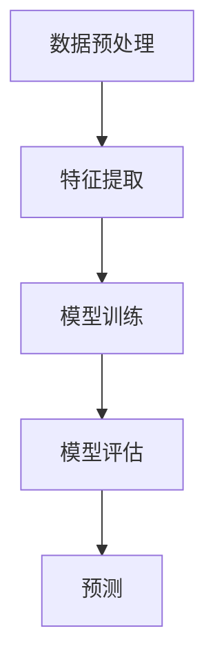
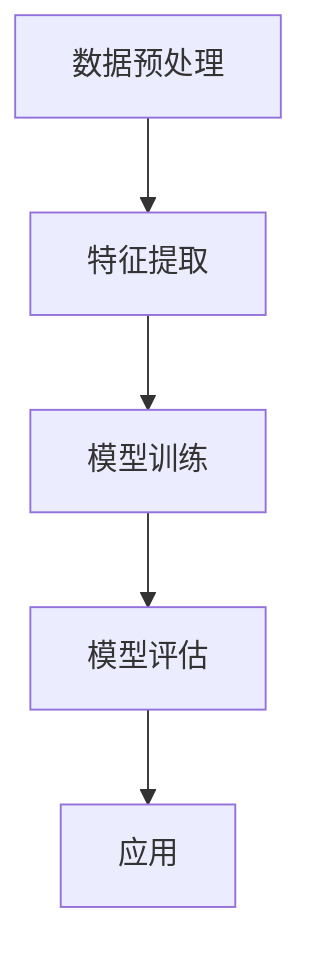
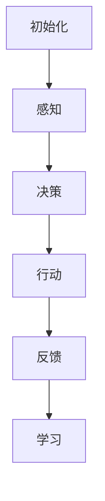
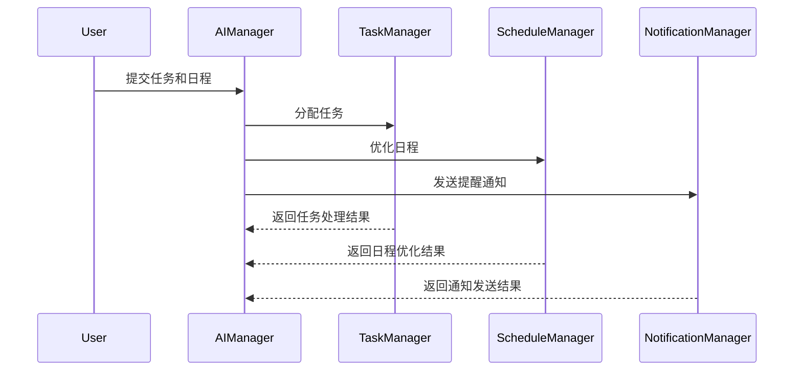
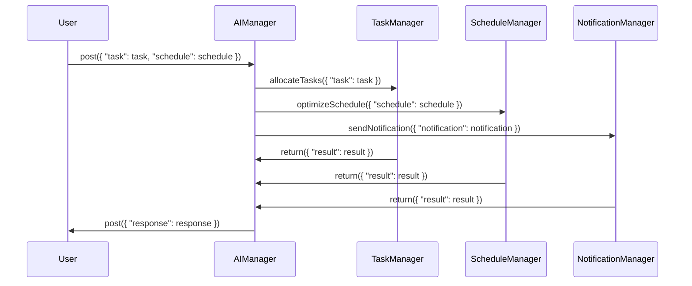
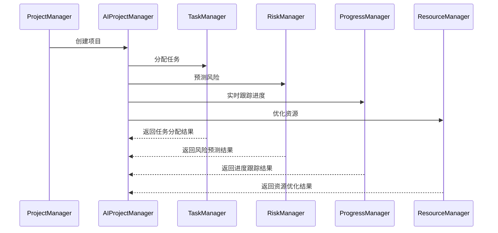
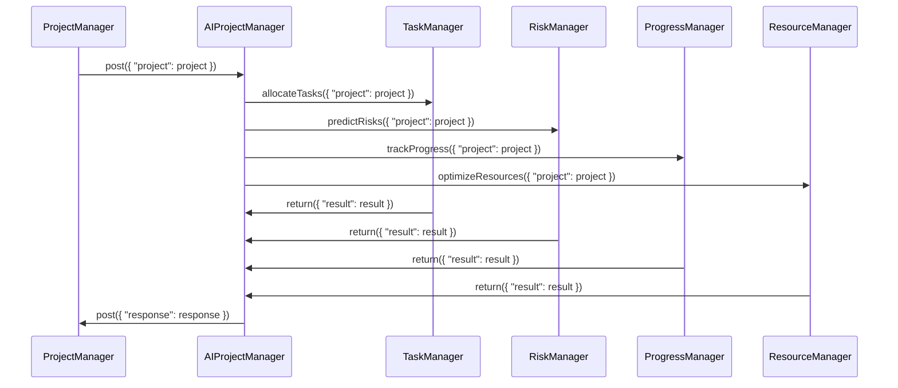
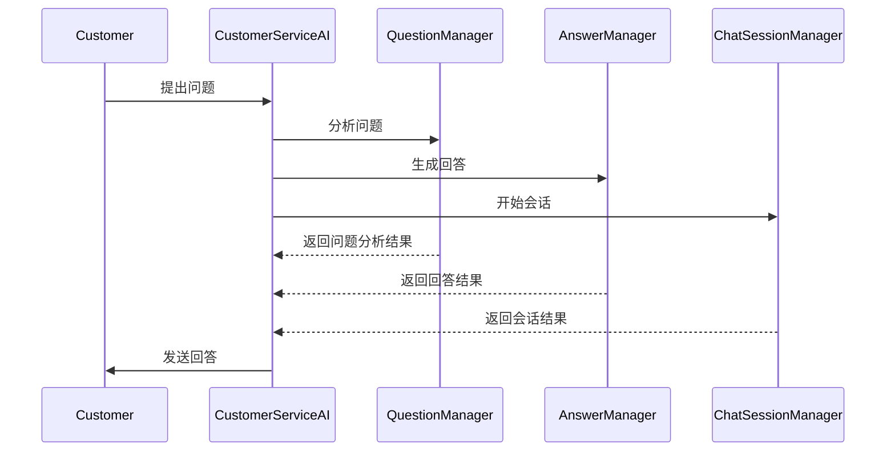
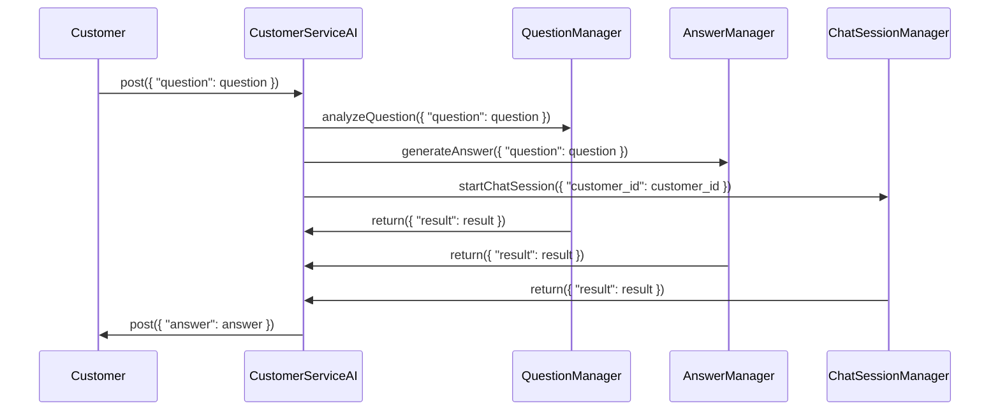

                 

### 代理型AI的定义与特征

代理型AI（Agent-based Artificial Intelligence）是一种模仿自然智能体（如人类或动物）行为的计算模型，旨在实现智能体在特定环境中进行自主决策和行动。与传统的人工智能相比，代理型AI更加关注于自主性和适应性，其核心在于使智能体能够与环境互动，并通过不断的学习和调整，达到优化行为的目的。

#### **核心概念术语说明**

- **智能体（Agent）**：在代理型AI中，智能体是一个具有自主性和智能行为的实体，可以是一个程序、机器、人或多个实体的集合。
- **环境（Environment）**：智能体所处的情境或场景，可以是物理的、虚拟的或两者的结合。
- **感知（Perception）**：智能体从环境中获取信息的机制，通过感知，智能体能够识别周围的状态和事件。
- **行为（Behavior）**：智能体根据其感知到的环境和内部状态采取的行动。
- **目标（Goal）**：智能体追求的结果或目标状态。

#### **问题背景**

在现实世界中，许多复杂的问题需要智能体进行自主决策和行动。例如，自动驾驶汽车需要在复杂的交通环境中进行驾驶决策，智能家居系统需要根据用户的习惯进行自动化控制，游戏中的AI对手需要根据对手的行为做出策略调整。代理型AI的引入，使得这些复杂问题得以通过模拟和优化智能体的行为来得到解决。

#### **问题描述**

代理型AI的核心问题是如何设计一个智能体，使其能够在动态变化的复杂环境中，基于感知的信息，自主地做出最优决策并执行相应的行为。具体来说，这包括以下几个方面：

1. **感知能力**：智能体需要能够从环境中获取有效信息，并准确地理解和处理这些信息。
2. **决策能力**：智能体需要根据感知到的环境和目标，自主地做出决策，选择最优的行动方案。
3. **适应性**：智能体需要能够在面对新的环境和挑战时，快速适应并调整其行为策略。
4. **协同能力**：在某些应用场景中，智能体需要与其他智能体或人类协同工作，共同实现目标。

#### **问题解决**

代理型AI通过以下几个步骤来解决问题：

1. **感知**：智能体通过传感器或其他机制感知环境状态，收集必要的信息。
2. **分析**：智能体对感知到的信息进行分析和处理，理解当前的状态和事件。
3. **决策**：智能体基于分析结果，根据预设的目标和策略，选择下一步的行动。
4. **行动**：智能体执行决策方案，实施具体的行动。
5. **反馈**：智能体的行为结果返回到环境中，作为新的感知信息。

#### **边界与外延**

代理型AI的应用范围非常广泛，包括但不限于：

- **自动化控制系统**：如智能家居、智能工厂等。
- **游戏与娱乐**：如游戏中的NPC（非玩家角色）、虚拟现实环境中的智能交互等。
- **金融服务**：如股票交易、风险控制等。
- **交通管理**：如智能交通信号控制、自动驾驶等。

#### **概念结构与核心要素组成**

代理型AI的概念结构主要包括以下几个核心要素：

- **感知器**：用于感知和获取环境信息的组件。
- **决策模块**：基于感知信息进行决策的核心部分，通常采用机器学习算法或规划算法。
- **执行器**：用于执行决策结果的组件，将智能体的决策转化为具体的行动。
- **学习机制**：通过不断学习环境信息和调整策略，优化智能体的性能。

通过对上述要素的有机结合，代理型AI能够实现自主决策和行动，并在复杂动态环境中表现出高度的适应性和智能性。接下来，我们将进一步探讨代理型AI与传统AI的区别，以加深对其的理解。

### 代理型AI与传统AI的区别

代理型AI与传统AI在本质上有显著的区别，主要体现在任务目标、设计理念、决策机制和应用场景等方面。

#### **任务目标**

传统AI旨在解决特定的问题，如图像识别、语音识别、自然语言处理等。其核心在于开发能够执行特定任务的系统，一旦任务发生变化，系统可能需要重新设计和训练。而代理型AI的目标是设计一个能够在动态环境中自主决策和行动的实体。它不仅需要解决特定问题，还需要具备适应新环境和任务变化的能力。

#### **设计理念**

传统AI的设计理念是“功能导向”，即根据既定的任务需求，设计和实现具体的算法和系统。这种设计方式往往需要明确任务的具体目标，并在此基础上进行优化。而代理型AI的设计理念是“自主性导向”，其核心在于模拟人类或动物的行为，使其能够在复杂的、未预知的环境中自主学习和适应。

#### **决策机制**

传统AI的决策机制通常是基于预先设定的规则或模型，这些规则和模型是在特定条件下最优的。然而，这种机制在面对动态变化和不确定性时表现较差。代理型AI的决策机制则更加灵活和智能。它通过感知环境、学习历史行为和利用策略优化，动态调整其决策和行为。代理型AI的决策机制通常包括监督学习、无监督学习和强化学习等多种机器学习技术。

#### **应用场景**

传统AI在工业控制、数据处理、信息检索等领域有广泛应用。例如，工业机器人可以精确执行预设的动作，智能语音助手可以理解用户的语音指令。然而，这些应用场景往往具有高度的稳定性和确定性，不需要智能体进行自主决策。代理型AI则更适用于需要高度自主性和适应性的场景，如自动驾驶汽车、智能供应链管理、人机交互等。这些场景中的环境复杂多变，智能体需要能够实时感知环境变化，自主做出决策和调整行为。

#### **比较分析**

- **稳定性与适应性**：传统AI在稳定性上表现较好，但其适应能力有限。代理型AI则更强调适应性，能够应对复杂和动态的环境。
- **任务定制化与通用性**：传统AI通常需要根据特定任务进行定制化设计，而代理型AI则具备一定的通用性，能够适应多种不同的任务和环境。
- **计算资源需求**：传统AI对计算资源的需求相对较低，而代理型AI由于需要实时学习和决策，对计算资源的需求较高。

通过以上比较，我们可以看到，代理型AI与传统AI在目标、理念、机制和应用场景上都有显著的不同。代理型AI的引入，为解决复杂动态环境中的问题提供了新的思路和方法。在接下来的章节中，我们将深入探讨代理型AI的工作原理，以理解其如何在动态环境中实现自主决策和行动。

### 代理型AI的工作原理

代理型AI（Agent-based Artificial Intelligence）的工作原理涉及多个关键环节，包括感知、决策、行动和学习。以下将详细解释这些环节，并展示其如何协同作用，使代理型AI在动态环境中实现自主决策和行动。

#### **感知（Perception）**

感知是代理型AI获取环境信息的第一步。智能体通过传感器或交互界面，从环境中收集数据，这些数据可以是视觉、听觉、触觉等形式的。例如，自动驾驶汽车会通过摄像头、雷达和激光雷达来感知道路、车辆和行人的位置和运动状态。感知环节的关键在于数据的准确性和实时性。智能体需要快速、准确地获取环境信息，以便进行有效的决策。

#### **决策（Decision Making）**

在感知到环境信息后，代理型AI需要对其进行处理和分析，以做出最优的决策。决策过程通常基于机器学习算法，包括监督学习、无监督学习和强化学习等。监督学习算法通过预先标注的数据集，学习到环境特征与行为之间的关联，从而在新数据上做出预测。无监督学习则无需标注数据，智能体通过自我组织，发现环境中的模式和结构。强化学习算法通过试错和反馈，不断优化智能体的行为策略，使其在特定环境中达到最优状态。

例如，自动驾驶汽车会利用感知到的道路、车辆和行人的信息，结合其内部的状态和目标，通过强化学习算法，决定下一步的驾驶动作，如加速、减速或转向。

#### **行动（Action）**

决策完成后，代理型AI需要将决策转化为具体的行动。行动环节是智能体与环境互动的关键步骤。通过执行决策方案，智能体实现对环境的实际影响。行动可以是机械动作、通信行为或数据操作等。例如，在智能家居系统中，智能体根据用户习惯和环境状态，决定开启或关闭灯光、调节温度等。

#### **学习（Learning）**

学习是代理型AI不断优化其行为和决策能力的关键环节。通过不断感知环境、执行行动和获取反馈，智能体能够学习到新的知识和技能，并调整其行为策略。学习过程可以分为有监督学习、无监督学习和强化学习。

- **有监督学习**：通过比较预测结果与实际结果的差异，智能体不断调整其模型参数，以提高预测准确性。
- **无监督学习**：智能体在无外部指导的情况下，通过自我组织，发现环境中的模式和规律。
- **强化学习**：智能体通过奖励机制，学习到哪些行为能够带来正面的结果，并逐渐优化其行为策略。

例如，游戏中的AI对手会通过强化学习，不断优化其策略，以击败玩家。

#### **协同作用**

代理型AI的感知、决策、行动和学习各环节是相互协同的。智能体通过感知获取环境信息，利用决策过程分析信息，执行行动以影响环境，并通过学习不断调整和优化自身。这种闭环系统使得智能体能够适应动态变化的环境，实现自主决策和行动。

#### **工作流程**

代理型AI的工作流程可以概括为以下几个步骤：

1. **感知**：智能体通过传感器或交互界面，获取环境信息。
2. **决策**：智能体利用感知信息，通过机器学习算法，生成决策方案。
3. **行动**：智能体执行决策方案，采取具体的行动。
4. **学习**：智能体根据行动结果，进行学习和调整，优化其决策模型。

通过以上步骤，代理型AI能够在动态环境中实现自主决策和行动，不断优化其行为和性能。这种工作原理使得代理型AI在复杂和不确定的环境中表现出高度适应性和智能性。

在接下来的章节中，我们将进一步探讨代理型AI的核心概念，包括监督学习、无监督学习和强化学习，并通过具体的算法原理和实现方式，加深对代理型AI工作的理解。

### 代理型AI的核心概念与联系

代理型AI的成功离不开其背后的核心概念，这些概念包括监督学习、无监督学习和强化学习。以下将详细解释这些概念，并通过Mermaid流程图和ER实体关系图，展示它们在代理型AI中的联系和作用。

#### **监督学习**

监督学习是代理型AI中最常用的机器学习技术之一。它通过使用预先标注的数据集，训练模型以预测新数据的标签。监督学习分为回归和分类两种类型。

1. **回归**：回归任务旨在预测一个连续的数值。例如，预测房屋价格或股票价格。
2. **分类**：分类任务旨在将新数据分配到预定义的类别中。例如，电子邮件分类为垃圾邮件或正常邮件。

监督学习的流程通常包括以下几个步骤：

- **数据预处理**：清洗和整理数据，使其适合模型训练。
- **特征提取**：从原始数据中提取有用的特征，用于训练模型。
- **模型训练**：使用训练数据集训练模型，使其能够识别数据中的模式和规律。
- **模型评估**：使用验证数据集评估模型性能，调整模型参数以提高准确性。
- **预测**：使用训练好的模型对新数据进行预测。

Mermaid流程图如下：


#### **无监督学习**

无监督学习与监督学习不同，它不依赖于预先标注的数据集。智能体通过自我组织和发现数据中的内在结构，学习数据分布和模式。

1. **聚类**：聚类任务旨在将相似的数据点划分为多个组。例如，将用户根据购买行为进行分组。
2. **降维**：降维任务旨在减少数据的维度，同时保持数据的关键信息。例如，使用主成分分析（PCA）简化数据。
3. **生成模型**：生成模型旨在学习数据的生成过程，并生成新的数据样本。例如，使用生成对抗网络（GAN）生成逼真的图像。

无监督学习的流程通常包括以下几个步骤：

- **数据预处理**：清洗和整理数据，去除噪声和异常值。
- **特征提取**：提取数据中的有用特征，用于模型训练。
- **模型训练**：使用无监督学习算法训练模型，使其发现数据中的结构和模式。
- **模型评估**：评估模型性能，调整模型参数以提高效果。
- **应用**：将训练好的模型应用于实际问题中。

Mermaid流程图如下：


#### **强化学习**

强化学习是一种通过试错和反馈优化行为的机器学习技术。智能体在环境中执行动作，根据环境反馈调整行为策略，以达到最大化长期奖励的目的。

1. **Q-学习**：Q-学习算法通过估计每个状态-动作对的预期奖励，选择最优动作。
2. **SARSA**：SARSA算法通过比较当前状态-动作对的预期奖励和实际奖励，更新策略。

强化学习的流程通常包括以下几个步骤：

- **初始化**：设定智能体和环境的初始状态。
- **感知**：智能体从环境中获取当前状态的信息。
- **决策**：智能体基于当前状态和策略，选择最优动作。
- **行动**：智能体执行选定的动作，影响环境。
- **反馈**：环境根据智能体的行为，给予奖励或惩罚。
- **学习**：智能体根据反馈，更新策略，优化行为。

Mermaid流程图如下：


#### **概念属性特征对比表格**

以下是监督学习、无监督学习和强化学习的一些关键特性对比：

| 特性 | 监督学习 | 无监督学习 | 强化学习 |
| --- | --- | --- | --- |
| 数据需求 | 需要预先标注的数据 | 无需预先标注的数据 | 无需预先标注的数据 |
| 目标 | 预测标签 | 发现数据分布和模式 | 最大化长期奖励 |
| 算法类型 | 回归、分类 | 聚类、降维、生成模型 | Q-学习、SARSA |
| 评估指标 | 准确性、召回率、F1分数 | 聚类有效性、降维误差、生成质量 | 收益、策略优化 |
| 应用场景 | 数据预测、分类问题 | 数据分析、模式识别、数据降维 | 游戏AI、自动驾驶、推荐系统 |

#### **ER实体关系图架构**

ER（Entity-Relationship）图是用于描述数据模型中实体及其关系的图形化工具。以下是一个简化的ER图，展示了代理型AI中主要实体的关系：

```mermaid
erDiagram
  AI系统 ||--|{ 智能体 }|| AI模型
  智能体 ||--|{ 环境感知 }|| 环境信息
  智能体 ||--|{ 决策模块 }|| 行动策略
  智能体 ||--|{ 执行器 }|| 行动结果
  AI模型 ||--|{ 数据集 }|| 训练数据
```

在这个ER图中：

- **AI系统**：包括智能体和AI模型，是整个代理型AI的核心部分。
- **智能体**：负责感知环境、做出决策和执行行动。
- **环境感知**：收集环境中的信息，供智能体使用。
- **决策模块**：基于感知信息和模型，生成行动策略。
- **执行器**：执行决策模块生成的行动策略。
- **AI模型**：用于训练和预测，由数据集训练得到。
- **数据集**：用于训练AI模型，包括监督学习、无监督学习和强化学习所需的数据。

通过理解这些核心概念和其相互关系，我们可以更好地设计和实现代理型AI系统，使其在复杂动态环境中实现高效自主决策和行动。在接下来的章节中，我们将深入探讨代理型AI的主要算法原理和实现方式。

### 代理型AI的算法原理与实现

代理型AI的核心在于其能够自主地学习和优化行为，而这一过程依赖于多种机器学习算法。在本节中，我们将重点探讨代理型AI中常用的两种强化学习算法：Q-学习算法和SARSA算法，并详细解释其原理和Python源代码实现。

#### **Q-学习算法**

Q-学习算法是一种基于值函数的强化学习算法，其目标是学习一个值函数，用以评估每个状态-动作对的预期收益。Q-学习算法的核心思想是：通过不断地试错，找到最优的动作策略，即选择使总奖励最大化的动作。

1. **算法原理**：

   - **状态-动作对（State-Action Pair）**：Q-学习算法通过状态-动作对来表示环境中的每个情况。状态表示智能体当前所处的环境，动作表示智能体可以采取的行动。
   - **值函数（Value Function）**：值函数用于评估每个状态-动作对的预期收益。具体来说，Q-学习算法的目标是学习一个Q值函数，使得对于每个状态-动作对，Q值能够表示在该状态采取该动作所能获得的预期收益。
   - **更新公式**：Q-学习算法通过以下公式来更新Q值：
     $$ Q(s, a) \leftarrow Q(s, a) + \alpha [r + \gamma \max_{a'} Q(s', a') - Q(s, a)] $$
     其中，$s$ 是当前状态，$a$ 是当前动作，$s'$ 是下一状态，$a'$ 是下一动作，$r$ 是即时奖励，$\gamma$ 是折扣因子，$\alpha$ 是学习率。

2. **Python实现**：

```python
import numpy as np

# 初始化Q值表格
Q = np.zeros([n_states, n_actions])

# 参数设置
alpha = 0.1  # 学习率
gamma = 0.9  # 折扣因子
n_episodes = 1000  # 迭代次数

# Q-学习算法实现
for episode in range(n_episodes):
    state = env.reset()
    done = False
    
    while not done:
        # 选择动作
        action = np.argmax(Q[state])
        
        # 执行动作
        next_state, reward, done, _ = env.step(action)
        
        # 更新Q值
        Q[state, action] = Q[state, action] + alpha * (reward + gamma * np.max(Q[next_state]) - Q[state, action])
        
        state = next_state
```

3. **数学模型与公式**：

   - **Q值更新公式**：
     $$ Q(s, a) \leftarrow Q(s, a) + \alpha [r + \gamma \max_{a'} Q(s', a') - Q(s, a)] $$
   - **期望回报**：
     $$ V(s) = \sum_{a} \pi(a|s) Q(s, a) $$
     其中，$\pi(a|s)$ 是在状态 $s$ 下采取动作 $a$ 的概率。

#### **SARSA算法**

SARSA（Q-Learning with SARSA）算法是Q-学习算法的变体，其核心思想是使用即时奖励和下一状态的动作值来更新当前状态的动作值。与Q-学习算法不同，SARSA算法在每个时间步使用实际的动作值，而不是预测的动作值。

1. **算法原理**：

   - **状态-动作对（State-Action Pair）**：与Q-学习算法相同，SARSA算法也通过状态-动作对来表示环境中的每个情况。
   - **策略（Policy）**：SARSA算法使用策略来决定在给定状态下采取的动作。策略可以是确定性策略或随机策略。
   - **更新公式**：SARSA算法通过以下公式来更新Q值：
     $$ Q(s, a) \leftarrow Q(s, a) + \alpha [r + \gamma Q(s', a')] - Q(s, a)] $$
     其中，$s$ 是当前状态，$a$ 是当前动作，$s'$ 是下一状态，$a'$ 是下一动作，$r$ 是即时奖励，$\gamma$ 是折扣因子，$\alpha$ 是学习率。

2. **Python实现**：

```python
import numpy as np

# 初始化Q值表格
Q = np.zeros([n_states, n_actions])

# 参数设置
alpha = 0.1  # 学习率
gamma = 0.9  # 折扣因子
n_episodes = 1000  # 迭代次数

# SARSA算法实现
for episode in range(n_episodes):
    state = env.reset()
    done = False
    
    while not done:
        # 选择动作
        action = np.argmax(Q[state])
        
        # 执行动作
        next_state, reward, done, _ = env.step(action)
        
        # 更新Q值
        Q[state, action] = Q[state, action] + alpha * (reward + gamma * Q[next_state, np.argmax(Q[next_state])] - Q[state, action])
        
        state = next_state
```

3. **数学模型与公式**：

   - **Q值更新公式**：
     $$ Q(s, a) \leftarrow Q(s, a) + \alpha [r + \gamma Q(s', a')] - Q(s, a)] $$
   - **期望回报**：
     $$ V(s) = \sum_{a} \pi(a|s) Q(s, a) $$
     其中，$\pi(a|s)$ 是在状态 $s$ 下采取动作 $a$ 的概率。

通过上述算法原理和实现方式，我们可以看到，Q-学习算法和SARSA算法都是基于值函数的强化学习算法，它们通过不断地试错和学习，优化智能体的行为策略。在实际应用中，这些算法可以应用于各种复杂的动态环境，如自动驾驶、游戏AI和智能机器人等。

#### **通俗易懂的举例说明**

为了更好地理解Q-学习算法和SARSA算法，我们可以通过一个简单的例子进行说明。

假设我们有一个简单的环境，其中智能体需要在一个3x3的网格世界中移动，目标是到达右上角的格子。智能体可以采取四个动作：向上、向下、向左和向右移动。每个动作都会带来一个即时奖励，如到达目标格子时获得+10的奖励，其他动作获得-1的奖励。

1. **Q-学习算法**：

   - **初始化**：初始化Q值表格，所有Q值都设置为0。
   - **迭代过程**：在1000次迭代中，智能体从一个随机状态开始，选择动作，执行动作，获取即时奖励，并更新Q值。

```plaintext
迭代1：
状态：[1, 1]  动作：向上  奖励：-1  下一状态：[0, 1]
Q值更新：Q[1, 1] = Q[1, 1] + alpha * (-1 + gamma * max(Q[0, 1])) = 0 + 0.1 * (-1 + 0) = -0.1

迭代2：
状态：[0, 1]  动作：向右  奖励：-1  下一状态：[0, 2]
Q值更新：Q[0, 1] = Q[0, 1] + alpha * (-1 + gamma * max(Q[0, 2])) = -0.1 + 0.1 * (-1 + 0) = -0.2

...
```

   - **结果**：经过多次迭代，智能体最终学会选择最优动作，即直接向右移动，以最快速度到达目标。

2. **SARSA算法**：

   - **初始化**：与Q-学习算法相同，初始化Q值表格。
   - **迭代过程**：在1000次迭代中，智能体从当前状态选择动作，执行动作，获取即时奖励，并更新Q值。

```plaintext
迭代1：
状态：[1, 1]  动作：向上  奖励：-1  下一状态：[0, 1]
Q值更新：Q[1, 1] = Q[1, 1] + alpha * (-1 + gamma * Q[0, 1]) = 0 + 0.1 * (-1 + 0.0) = -0.1

迭代2：
状态：[0, 1]  动作：向右  奖励：-1  下一状态：[0, 2]
Q值更新：Q[0, 1] = Q[0, 1] + alpha * (-1 + gamma * Q[0, 2]) = -0.1 + 0.1 * (-1 + 0.0) = -0.2

...
```

   - **结果**：与Q-学习算法类似，智能体最终学会选择最优动作，即直接向右移动。

通过这个简单的例子，我们可以清晰地看到Q-学习算法和SARSA算法的工作原理和实现过程。在实际应用中，这些算法可以应用于更加复杂的动态环境，实现智能体的自主学习和优化行为。

### 代理型AI在时间管理中的应用

代理型AI在时间管理中的应用是一个颇具前景的领域，通过智能算法和数据分析，代理型AI能够帮助用户更加高效地安排日常任务，提升时间利用率和生活质量。以下将详细介绍一个基于代理型AI的时间管理系统，包括系统功能设计、系统架构设计、系统接口设计和项目实战。

#### **应用场景介绍**

在现代工作环境中，时间管理成为提高工作效率和减少压力的重要手段。然而，对于大多数人和组织来说，有效的时间管理仍然是一个挑战。代理型AI的时间管理系统旨在通过自动化和智能化的方式，帮助用户优化时间安排，提高工作效率。

该系统的主要功能包括：

1. **任务自动分配**：根据用户的工作负荷和优先级，自动分配任务给最佳执行者。
2. **日程安排优化**：根据用户的日程和任务需求，自动安排会议和任务的时间，避免冲突和空闲时间浪费。
3. **提醒与通知**：在重要任务和会议开始前，自动发送提醒通知，确保用户不会忘记重要的安排。
4. **数据分析与反馈**：分析用户的日程和时间使用情况，提供反馈和建议，帮助用户优化时间管理策略。

#### **系统功能设计**

系统功能设计是时间管理系统开发的关键步骤，以下是一个详细的领域模型Mermaid类图，展示了系统的核心功能模块：

```mermaid
classDiagram
    User <<Class>> 
    Task <<Class>> 
    Schedule <<Class>> 
    Notification <<Class>> 
    AIManager <<Class>>
    
    User o--1 Task
    User o--1 Schedule
    User o--1 Notification
    AIManager o--1 Task
    AIManager o--1 Schedule
    AIManager o--1 Notification
    
    User +createTask()
    User +deleteTask()
    User +updateTask()
    User +viewSchedule()
    User +receiveNotification()
    
    AIManager +allocateTasks()
    AIManager +optimizeSchedule()
    AIManager +sendNotification()
    AIManager +analyzeData()
```

在这个类图中，User类代表系统的用户，Task类代表用户分配的任务，Schedule类代表用户的日程安排，Notification类代表系统发送的通知，AIManager类负责实现时间管理的智能化功能。

#### **系统架构设计**

系统架构设计是确保系统稳定性和扩展性的关键。以下是一个详细的Mermaid架构图，展示了系统的各个组件及其关系：



在这个架构图中，User通过AIManager与系统的各个模块交互。TaskManager负责任务分配，ScheduleManager负责日程优化，NotificationManager负责发送提醒通知。AIManager作为系统的核心，协调各个模块的运行。

#### **系统接口设计和系统交互**

系统接口设计和系统交互是确保系统模块之间高效协作的重要环节。以下是一个详细的Mermaid序列图，展示了系统的接口设计和交互流程：



在这个序列图中，User通过API接口向AIManager提交任务和日程信息。AIManager调用各个模块进行处理，并将结果返回给User。

#### **项目实战**

以下是该时间管理系统的具体实施步骤：

1. **环境安装**：安装Python环境，以及必要的库如TensorFlow和Keras，用于实现强化学习算法。
2. **系统核心实现源代码**：

   ```python
   # AIManager.py
   import tensorflow as tf
   from task_manager import TaskManager
   from schedule_manager import ScheduleManager
   from notification_manager import NotificationManager
   
   class AIManager:
       def __init__(self):
           self.task_manager = TaskManager()
           self.schedule_manager = ScheduleManager()
           self.notification_manager = NotificationManager()
   
       def allocate_tasks(self, task):
           return self.task_manager.allocate_tasks(task)
   
       def optimize_schedule(self, schedule):
           return self.schedule_manager.optimize_schedule(schedule)
   
       def send_notification(self, notification):
           return self.notification_manager.send_notification(notification)
   
   # TaskManager.py
   class TaskManager:
       def allocate_tasks(self, task):
           # 实现任务分配逻辑
           return result
   
   # ScheduleManager.py
   class ScheduleManager:
       def optimize_schedule(self, schedule):
           # 实现日程优化逻辑
           return result
   
   # NotificationManager.py
   class NotificationManager:
       def send_notification(self, notification):
           # 实现通知发送逻辑
           return result
   
   # main.py
   if __name__ == "__main__":
       ai_manager = AIManager()
       task = { "name": "会议", "start_time": "10:00", "end_time": "11:00" }
       schedule = { "tasks": [task] }
       notification = { "message": "会议提醒", "send_time": "09:50" }
       result = ai_manager.allocate_tasks(task)
       print(result)
       result = ai_manager.optimize_schedule(schedule)
       print(result)
       result = ai_manager.send_notification(notification)
       print(result)
   ```

3. **代码应用解读与分析**：

   在上述代码中，AIManager是系统的核心，负责协调各个模块的工作。TaskManager、ScheduleManager和NotificationManager分别负责任务分配、日程优化和通知发送。通过这些模块的协作，系统能够实现高效的时间管理。

4. **实际案例分析和详细讲解剖析**：

   假设用户需要在一天内安排多个会议和任务。用户将任务和日程信息提交给AIManager，AIManager会调用TaskManager进行任务分配，调用ScheduleManager进行日程优化，并调用NotificationManager发送提醒通知。具体流程如下：

   - 用户提交任务和日程信息。
   - AIManager调用TaskManager，根据任务优先级和用户工作量，自动分配任务。
   - AIManager调用ScheduleManager，优化用户的日程安排，确保会议和任务不会冲突。
   - AIManager调用NotificationManager，发送会议提醒通知。
   - 系统将结果返回给用户，用户可以查看优化后的日程和任务分配。

通过以上实际案例，我们可以看到，代理型AI在时间管理中的应用，能够显著提高用户的时间利用率和工作效率。在接下来的章节中，我们将继续探讨代理型AI在项目管理和其他日常工作决策中的应用。

### 代理型AI在项目管理中的应用

代理型AI在项目管理中的应用，旨在通过智能化的手段，提高项目管理的效率和质量。通过自动化的任务分配、风险预测和进度跟踪，代理型AI能够帮助项目经理更好地应对复杂的项目环境，确保项目按时、按质完成。以下将详细描述一个基于代理型AI的项目管理系统的设计和实现。

#### **应用场景介绍**

在项目管理中，项目团队常常面临多种挑战，如任务分配不均、进度延误、资源浪费和风险不可控等。传统的项目管理方法往往依赖于人工的协调和监督，效率低下且容易出错。代理型AI的项目管理系统通过引入智能算法和自动化工具，能够实现以下目标：

1. **任务自动分配**：根据团队成员的技能和工作负荷，智能地分配任务，确保任务分配的公平性和效率。
2. **进度实时跟踪**：实时监控项目进度，预测潜在的风险和延迟，及时采取措施进行调整。
3. **风险预测与预警**：利用机器学习算法，分析项目数据，预测可能出现的风险，并提供预警措施。
4. **资源优化**：智能分配项目资源，确保资源的高效利用，降低项目成本。

#### **系统功能设计**

系统功能设计是项目管理系统的核心，以下是一个详细的领域模型Mermaid类图，展示了系统的各个功能模块：

```mermaid
classDiagram
    Project <<Class>>
    Team <<Class>>
    Task <<Class>>
    Risk <<Class>>
    Progress <<Class>>
    AIProjectManager <<Class>>

    Project o--1 Team
    Project o--1 Task
    Project o--1 Risk
    Project o--1 Progress
    AIProjectManager o--1 Project

    Project +createProject()
    Project +deleteProject()
    Project +updateProject()
    Project +viewTeam()
    Project +viewTasks()
    Project +viewRisks()
    Project +viewProgress()

    AIProjectManager +allocateTasks()
    AIProjectManager +trackProgress()
    AIProjectManager +predictRisks()
    AIProjectManager +optimizeResources()
```

在这个类图中，Project类代表项目，Team类代表项目团队，Task类代表项目任务，Risk类代表项目风险，Progress类代表项目进度，AIProjectManager类负责实现项目的智能化管理。

#### **系统架构设计**

系统架构设计是确保系统稳定性和扩展性的关键。以下是一个详细的Mermaid架构图，展示了系统的各个组件及其关系：



在这个架构图中，ProjectManager通过AIProjectManager与系统的各个模块交互。TaskManager负责任务分配，RiskManager负责风险预测，ProgressManager负责进度跟踪，ResourceManager负责资源优化。AIProjectManager作为系统的核心，协调各个模块的运行。

#### **系统接口设计和系统交互**

系统接口设计和系统交互是确保系统模块之间高效协作的重要环节。以下是一个详细的Mermaid序列图，展示了系统的接口设计和交互流程：



在这个序列图中，ProjectManager通过API接口向AIProjectManager提交项目信息。AIProjectManager调用各个模块进行处理，并将结果返回给ProjectManager。

#### **项目实战**

以下是该项目管理系统的具体实施步骤：

1. **环境安装**：安装Python环境，以及必要的库如scikit-learn和tensorflow，用于实现机器学习算法。
2. **系统核心实现源代码**：

   ```python
   # AIProjectManager.py
   from task_manager import TaskManager
   from risk_manager import RiskManager
   from progress_manager import ProgressManager
   from resource_manager import ResourceManager
   
   class AIProjectManager:
       def __init__(self):
           self.task_manager = TaskManager()
           self.risk_manager = RiskManager()
           self.progress_manager = ProgressManager()
           self.resource_manager = ResourceManager()
   
       def allocate_tasks(self, project):
           return self.task_manager.allocate_tasks(project)
   
       def predict_risks(self, project):
           return self.risk_manager.predict_risks(project)
   
       def track_progress(self, project):
           return self.progress_manager.track_progress(project)
   
       def optimize_resources(self, project):
           return self.resource_manager.optimize_resources(project)
   
   # TaskManager.py
   class TaskManager:
       def allocate_tasks(self, project):
           # 实现任务分配逻辑
           return result
   
   # RiskManager.py
   class RiskManager:
       def predict_risks(self, project):
           # 实现风险预测逻辑
           return result
   
   # ProgressManager.py
   class ProgressManager:
       def track_progress(self, project):
           # 实现进度跟踪逻辑
           return result
   
   # ResourceManager.py
   class ResourceManager:
       def optimize_resources(self, project):
           # 实现资源优化逻辑
           return result
   
   # main.py
   if __name__ == "__main__":
       ai_project_manager = AIProjectManager()
       project = { "tasks": [{"name": "设计", "duration": 5}, {"name": "开发", "duration": 10}], "team": [{"name": "张三", "skills": ["设计", "开发"]}, {"name": "李四", "skills": ["开发"]}] }
       result = ai_project_manager.allocate_tasks(project)
       print(result)
       result = ai_project_manager.predict_risks(project)
       print(result)
       result = ai_project_manager.track_progress(project)
       print(result)
       result = ai_project_manager.optimize_resources(project)
       print(result)
   ```

3. **代码应用解读与分析**：

   在上述代码中，AIProjectManager是系统的核心，负责协调各个模块的工作。TaskManager、RiskManager、ProgressManager和ResourceManager分别负责任务分配、风险预测、进度跟踪和资源优化。通过这些模块的协作，系统能够实现高效的项目管理。

4. **实际案例分析和详细讲解剖析**：

   假设项目经理需要管理一个包含设计和开发两个阶段的项目。项目经理将项目信息提交给AIProjectManager，AIProjectManager会调用TaskManager进行任务分配，调用RiskManager进行风险预测，调用ProgressManager进行进度跟踪，并调用ResourceManager进行资源优化。具体流程如下：

   - 项目经理提交项目信息。
   - AIProjectManager调用TaskManager，根据团队成员的技能和工作负荷，自动分配任务。
   - AIProjectManager调用RiskManager，利用机器学习算法分析项目数据，预测可能出现的风险。
   - AIProjectManager调用ProgressManager，实时监控项目进度，预测潜在延迟，并采取相应措施。
   - AIProjectManager调用ResourceManager，优化项目资源分配，确保资源的高效利用。

通过这个实际案例，我们可以看到，代理型AI在项目管理中的应用，能够显著提高项目的管理效率和质量，帮助项目经理更好地应对复杂的项目环境。

### 代理型AI在客户服务中的应用

代理型AI在客户服务中的应用，已经成为提高服务质量和客户满意度的重要手段。通过智能化的交互和自动化的流程处理，代理型AI能够显著提升客户服务的效率和用户体验。以下将详细描述一个基于代理型AI的客户服务系统的设计与实现。

#### **应用场景介绍**

在现代商业环境中，客户服务是企业与客户互动的重要环节。然而，传统的人工客户服务往往存在响应速度慢、服务质量不稳定和人力成本高的问题。代理型AI的客户服务系统能够通过自动化和智能化，解决上述问题，提升客户服务体验。其主要应用场景包括：

1. **自动问答系统**：通过自然语言处理技术，智能回答客户的常见问题和提供解决方案。
2. **智能客服机器人**：与客户进行实时对话，处理复杂的客户需求，提供个性化的服务。
3. **流程自动化**：自动化处理客户的常见需求，如账户查询、订单处理和问题反馈。
4. **客户行为分析**：分析客户行为数据，预测客户需求，提供定制化的服务和建议。

#### **系统功能设计**

系统功能设计是客户服务系统的核心，以下是一个详细的领域模型Mermaid类图，展示了系统的各个功能模块：

```mermaid
classDiagram
    Customer <<Class>>
    Question <<Class>>
    Answer <<Class>>
    ChatSession <<Class>>
    CustomerServiceAI <<Class>>

    Customer o--1 Question
    Customer o--1 ChatSession
    Answer o--1 ChatSession
    CustomerServiceAI o--1 Question
    CustomerServiceAI o--1 Answer
    CustomerServiceAI o--1 ChatSession

    Customer +createQuestion()
    Customer +startChatSession()
    Customer +endChatSession()
    Customer +viewAnswer()

    CustomerServiceAI +answerQuestion()
    CustomerServiceAI +handleChatSession()
    CustomerServiceAI +processRequest()
    CustomerServiceAI +analyzeBehavior()
```

在这个类图中，Customer类代表客户，Question类代表客户提出的问题，Answer类代表系统的回答，ChatSession类代表客户的聊天会话，CustomerServiceAI类负责实现客户服务的智能化功能。

#### **系统架构设计**

系统架构设计是确保系统稳定性和扩展性的关键。以下是一个详细的Mermaid架构图，展示了系统的各个组件及其关系：



在这个架构图中，Customer通过CustomerServiceAI与系统的各个模块交互。QuestionManager负责分析客户提出的问题，AnswerManager负责生成回答，ChatSessionManager负责管理客户聊天会话。CustomerServiceAI作为系统的核心，协调各个模块的运行。

#### **系统接口设计和系统交互**

系统接口设计和系统交互是确保系统模块之间高效协作的重要环节。以下是一个详细的Mermaid序列图，展示了系统的接口设计和交互流程：



在这个序列图中，Customer通过API接口向CustomerServiceAI提交问题。CustomerServiceAI调用各个模块进行处理，并将结果返回给Customer。

#### **项目实战**

以下是该客户服务系统的具体实施步骤：

1. **环境安装**：安装Python环境，以及必要的库如NLTK和TensorFlow，用于实现自然语言处理和机器学习算法。
2. **系统核心实现源代码**：

   ```python
   # CustomerServiceAI.py
   from question_manager import QuestionManager
   from answer_manager import AnswerManager
   from chat_session_manager import ChatSessionManager
   
   class CustomerServiceAI:
       def __init__(self):
           self.question_manager = QuestionManager()
           self.answer_manager = AnswerManager()
           self.chat_session_manager = ChatSessionManager()
   
       def answer_question(self, question):
           return self.answer_manager.generate_answer(question)
   
       def handle_chat_session(self, customer_id):
           return self.chat_session_manager.handle_session(customer_id)
   
       def process_request(self, request):
           return self.question_manager.process_request(request)
   
       def analyze_behavior(self, customer_id):
           return self.question_manager.analyze_behavior(customer_id)
   
   # QuestionManager.py
   class QuestionManager:
       def analyze_question(self, question):
           # 实现问题分析逻辑
           return result
   
   # AnswerManager.py
   class AnswerManager:
       def generate_answer(self, question):
           # 实现回答生成逻辑
           return result
   
   # ChatSessionManager.py
   class ChatSessionManager:
       def handle_session(self, customer_id):
           # 实现会话处理逻辑
           return result
   
   # main.py
   if __name__ == "__main__":
       customer_service_ai = CustomerServiceAI()
       question = "我如何升级我的账户？"
       customer_id = "12345"
       answer = customer_service_ai.answer_question(question)
       print(answer)
       session_result = customer_service_ai.handle_chat_session(customer_id)
       print(session_result)
   ```

3. **代码应用解读与分析**：

   在上述代码中，CustomerServiceAI是系统的核心，负责协调各个模块的工作。QuestionManager、AnswerManager和ChatSessionManager分别负责问题分析、回答生成和会话处理。通过这些模块的协作，系统能够实现智能化的客户服务。

4. **实际案例分析和详细讲解剖析**：

   假设客户通过网站提出一个关于账户升级的问题。客户将问题提交给CustomerServiceAI，CustomerServiceAI会调用QuestionManager分析问题，调用AnswerManager生成回答，并调用ChatSessionManager处理会话。具体流程如下：

   - 客户提交问题。
   - CustomerServiceAI调用QuestionManager，分析客户提出的问题，确定问题的类型和关键词。
   - CustomerServiceAI调用AnswerManager，根据问题生成相应的回答。
   - CustomerServiceAI调用ChatSessionManager，记录客户会话信息，确保后续交互的连贯性。
   - CustomerServiceAI将回答返回给客户，并通过聊天窗口发送。

通过这个实际案例，我们可以看到，代理型AI在客户服务中的应用，能够实现高效、智能的客户交互，显著提升客户服务的质量和用户满意度。

### 代理型AI在其他日常工作决策中的应用

代理型AI在时间管理、项目管理和客户服务等领域展现了其强大的应用潜力。然而，其应用场景不仅限于此，还可以在更多的日常工作中发挥重要作用，进一步提升工作效率和决策质量。以下将探讨代理型AI在其他日常工作决策中的潜在应用。

#### **人力资源调度**

在人力资源管理中，代理型AI可以通过优化员工的工作安排，提高团队的整体效率。代理型AI能够分析员工的工作负荷、技能水平和偏好，自动为员工分配最合适的工作任务。此外，AI还可以预测员工的工作状态和健康情况，提供个性化的休息和培训建议，以减少员工的工作压力和职业病。

#### **供应链管理**

代理型AI在供应链管理中，可以通过预测市场需求、优化库存管理和减少物流成本，提高供应链的整体效率。例如，通过分析历史销售数据和供应链动态，AI可以预测未来的需求趋势，提前调整库存和生产计划，避免过度生产和库存积压。同时，AI还可以优化物流路线，减少运输成本和时间。

#### **财务管理**

代理型AI在财务管理中，可以自动处理财务报表、预测财务状况和优化投资策略。通过分析历史财务数据和外部经济环境，AI可以预测未来的收入和支出，为企业提供财务预警和风险控制建议。此外，AI还可以自动完成账务处理、发票审核和报销流程，减少人工操作错误和成本。

#### **市场营销**

代理型AI在市场营销中，可以通过分析消费者行为和市场需求，提供个性化的营销策略和产品推荐。例如，通过分析用户的历史购买记录和在线行为，AI可以预测用户的潜在需求和偏好，为企业提供精准的营销建议。此外，AI还可以优化广告投放策略，提高广告的转化率和投资回报率。

#### **安全管理**

代理型AI在安全管理中，可以通过实时监控和分析环境数据，提供安全预警和应急处理建议。例如，在建筑和工厂中，AI可以通过监控传感器数据，检测火灾、泄漏和其他安全隐患，及时发出警报并自动启动应急预案。此外，AI还可以分析历史安全事件数据，预测可能的安全风险，提供预防措施。

#### **智能家居**

代理型AI在智能家居中，可以通过智能控制家居设备和系统，提高生活质量和便利性。例如，AI可以根据用户的习惯和日程，自动调节室内温度、光线和空气质量，提供舒适的生活环境。此外，AI还可以监控家居安全，如防盗报警、燃气泄漏报警等，提供实时预警和应急处理。

#### **健康医疗**

代理型AI在健康医疗中，可以通过分析患者数据，提供个性化的健康管理和疾病预测。例如，AI可以通过分析患者的病史、体检数据和基因信息，预测可能的健康风险和疾病发展，提供针对性的健康建议和治疗方案。此外，AI还可以辅助医生进行疾病诊断和治疗，提高医疗服务的质量和效率。

#### **教育和培训**

代理型AI在教育和培训中，可以通过个性化教学和学习分析，提高学生的学习效果和教师的教学质量。例如，AI可以根据学生的学习情况和知识点掌握程度，提供个性化的学习计划和资源推荐，帮助学生更好地理解和掌握知识。此外，AI还可以分析教师的教学行为和效果，提供教学优化建议。

通过以上应用场景，我们可以看到，代理型AI在日常工作决策中具有广泛的应用前景。其通过智能化的数据分析、预测和优化，能够显著提升工作效率和决策质量，为各个行业和领域带来新的发展机遇。

### 代理型AI在日常工作决策中的应用实践

在实际应用代理型AI进行日常工作决策时，最佳实践和注意事项显得尤为重要。以下将结合实际案例，总结一些关键经验和技巧，并提供拓展阅读资源，以帮助读者深入理解和应用代理型AI。

#### **最佳实践**

1. **需求分析与明确目标**：在实施代理型AI之前，首先要明确应用场景和目标。通过需求分析，确保AI系统能够解决实际问题和提高工作效率。

2. **数据收集与处理**：代理型AI依赖高质量的数据进行训练和预测。因此，数据收集和预处理是关键步骤。确保数据来源的多样性和准确性，对异常数据进行清洗和标准化处理。

3. **算法选择与优化**：根据应用场景选择合适的算法，如强化学习、监督学习或无监督学习。对算法参数进行调优，以最大化性能。

4. **用户参与与反馈**：在系统开发和测试过程中，积极引入用户反馈，不断优化系统。用户参与能够确保AI系统更符合实际需求。

5. **安全性与隐私保护**：代理型AI应用涉及大量用户数据，确保数据安全和隐私保护至关重要。采用加密技术、权限管理和数据去识别化等手段，保障用户隐私。

6. **持续监控与维护**：定期监控系统性能和运行状态，及时发现和解决潜在问题。根据环境和需求的变化，不断更新和优化AI系统。

#### **实际案例**

以一个公司内部的时间管理系统为例，该系统旨在通过代理型AI优化员工的工作安排，提高工作效率。具体实施步骤如下：

1. **需求分析与明确目标**：公司希望提高员工的工作效率，减少任务拖延和资源浪费。

2. **数据收集与处理**：系统收集员工的工作量、任务优先级、工作时间和技能水平等数据，并进行预处理。

3. **算法选择与优化**：选择强化学习算法进行任务分配，通过不断学习和优化，提高任务分配的准确性。

4. **用户参与与反馈**：在系统上线初期，邀请部分员工参与测试，收集反馈并进行调整。

5. **安全性与隐私保护**：对用户数据采取加密存储和访问控制，确保数据安全。

6. **持续监控与维护**：定期监控系统性能，根据实际需求进行优化和调整。

通过以上步骤，该时间管理系统显著提高了员工的工作效率和任务完成率。

#### **注意事项**

1. **避免过拟合**：在模型训练过程中，避免模型对训练数据过度适应，导致在新数据上的性能下降。

2. **数据多样性**：确保数据来源的多样性和代表性，避免数据偏差。

3. **算法透明性**：确保算法的透明性和可解释性，方便用户理解和信任。

4. **资源分配**：合理分配计算资源和存储资源，确保系统高效运行。

5. **法律法规遵守**：遵循相关法律法规，确保AI应用符合伦理和合规要求。

#### **拓展阅读**

- 《强化学习及其在金融中的应用》
- 《机器学习实战》
- 《深度学习》（Goodfellow, Y., Bengio, Y., & Courville, A.）
- 《AI应用实践指南》

通过以上最佳实践、实际案例和注意事项，读者可以更好地理解和应用代理型AI，将其融入到日常工作中，实现高效决策和优化。

### 小结

代理型AI在日常工作决策中的应用正日益广泛，其通过自主学习和智能决策，显著提升了工作效率和决策质量。本文从代理型AI的定义、工作原理、核心算法及其实际应用场景等方面进行了详细探讨。通过分析代理型AI在时间管理、项目管理、客户服务、人力资源调度、供应链管理、财务管理、市场营销、安全管理、智能家居、健康医疗和教育培训等领域的应用，展示了其在解决复杂动态环境中的独特优势。

代理型AI的核心优势在于其自主性、适应性和高效性。其通过感知环境、分析数据、做出决策和执行行动，不断优化行为策略，适应新的环境和任务变化。同时，代理型AI能够通过机器学习算法，从历史数据中学习规律，提高预测和决策的准确性。

然而，代理型AI的应用也面临一些挑战。首先，数据质量和多样性对AI系统的性能有重要影响，因此，确保数据的高质量和多样性至关重要。其次，算法的可解释性和透明性是用户信任和应用AI的关键，需要不断提升算法的可解释性。此外，AI系统的部署和运维需要强大的计算资源和专业团队支持，这对于中小企业来说可能是一大挑战。

未来，代理型AI将在更多领域得到应用，包括智能交通、智慧城市、环境保护、医疗健康和智能制造等。随着技术的不断进步，代理型AI将变得更加智能和高效，为各个行业带来深远的影响。通过不断探索和应用代理型AI，我们将能够实现更加智能化的工作方式和生活方式，迎接更加高效和智能的未来。

### 注意事项

在应用代理型AI进行日常工作决策时，以下注意事项至关重要：

1. **数据安全与隐私保护**：确保所有收集的数据都经过加密处理，避免泄露用户隐私信息。此外，严格遵守相关法律法规，确保数据处理的合法性和合规性。

2. **算法透明性**：算法的透明性和可解释性对用户信任至关重要。应该提供清晰的算法描述和决策过程，帮助用户理解AI系统的行为。

3. **适应性与灵活性**：代理型AI需要具备高度的适应性和灵活性，以应对动态变化的环境和任务。定期更新算法和模型，确保系统能够适应新情况。

4. **计算资源管理**：合理分配计算资源，确保AI系统高效运行。对于中小企业，可能需要考虑云计算和分布式计算等解决方案，以降低成本。

5. **持续监控与优化**：定期监控AI系统的性能和运行状态，及时发现和解决潜在问题。根据实际需求，不断调整和优化系统。

6. **用户培训与支持**：为用户提供充分的培训和支持，确保他们能够有效地使用AI系统，最大化其价值。

### 拓展阅读

1. **《深度学习》**：由Ian Goodfellow、Yoshua Bengio和Aaron Courville所著，是深度学习领域的经典教材，涵盖了从基础到高级的深度学习理论和实践。

2. **《强化学习实战》**：由Pedro Domingos所著，详细介绍了强化学习的理论基础和应用实践，适合希望深入了解强化学习技术的读者。

3. **《人工智能：一种现代方法》**：由Stuart Russell和Peter Norvig所著，全面覆盖了人工智能的基本概念和技术，是人工智能领域的权威参考书。

4. **《机器学习年度报告》**：由Kaggle等机构发布的年度报告，提供了最新的机器学习技术趋势和应用案例。

5. **《AI应用实践指南》**：由AI专家撰写，提供了AI在不同行业和领域的实际应用案例和最佳实践，适合希望将AI应用到业务中的读者。

通过阅读这些书籍和报告，读者可以进一步了解代理型AI的原理和应用，掌握先进的AI技术和方法，为实际工作提供有力支持。

