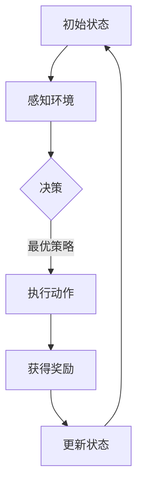

                 

### 《代理型AI：自主决策的虚拟劳动力》

#### 关键词：代理型AI、自主决策、虚拟劳动力、AI应用、系统架构

> 摘要：本文深入探讨了代理型AI的核心概念、原理、系统架构及其在虚拟劳动力中的应用。通过逐步分析，本文旨在揭示代理型AI如何通过自主决策实现智能化虚拟劳动力，从而推动人工智能技术的发展。

---

### 目录

1. **背景与概述**
   - **1.1 代理型AI的起源与发展**
   - **1.2 自主决策的重要性**
   - **1.3 虚拟劳动力的发展趋势**
2. **代理型AI的核心概念与原理**
   - **2.1 代理型AI的基础理论**
   - **2.2 自主决策算法**
   - **2.3 代理型AI在虚拟劳动力中的应用**
3. **代理型AI系统架构与设计**
   - **3.1 代理型AI系统设计原则**
   - **3.2 代理型AI系统的实现与部署**
4. **代理型AI应用案例**
   - **5.1 虚拟客服系统案例**
   - **5.2 虚拟销售助手案例**
   - **5.3 虚拟顾问系统案例**
5. **总结与展望**
   - **8.1 代理型AI的未来发展趋势**
   - **8.2 社会影响与伦理**
   - **9.1 最佳实践与总结**

---

### 第一部分：背景与概述

#### 1.1 代理型AI的起源与发展

代理型AI（Agent-Based AI）起源于对智能体的研究。在人工智能领域，智能体是指能够在环境中自主执行任务并与之交互的实体。代理型AI的核心概念是使智能体能够在不确定的环境中做出自主决策，从而完成特定任务。

代理型AI的发展经历了几个关键阶段。最早的研究可以追溯到20世纪80年代，当时人们开始探索如何通过规则和模型来模拟智能体的行为。随着计算能力和算法的进步，特别是深度学习和强化学习的兴起，代理型AI得到了快速发展。

代理型AI的主要应用领域包括自动化、机器人、智能交通、智能客服等。在这些领域，代理型AI通过自主决策和适应环境，实现了高效、智能化的任务执行。

#### 1.2 自主决策的重要性

自主决策是代理型AI的核心特征。自主决策不仅使智能体能够适应复杂、动态的环境，还能提高系统的灵活性和鲁棒性。在现实世界中，环境是高度不确定的，智能体需要能够根据当前的状态和先前的经验做出最佳决策。

自主决策的重要性体现在多个方面。首先，它能够使系统在变化的环境中保持稳定性和高效性。其次，它能够减少对人类操作的依赖，从而降低成本和提高效率。最后，自主决策能够促进人工智能技术的进一步发展，推动智能系统的普及和应用。

然而，实现自主决策也面临诸多挑战。例如，环境复杂度、数据质量、计算资源限制等都可能影响自主决策的效果。如何有效地应对这些挑战，是代理型AI研究的重要方向。

#### 1.3 虚拟劳动力的发展趋势

虚拟劳动力是指通过人工智能技术模拟的人类劳动力，它们可以在虚拟环境中执行各种任务。随着代理型AI的发展，虚拟劳动力的应用越来越广泛，趋势表现为：

1. **智能化水平的提升**：虚拟劳动力不仅能够执行简单的重复性任务，还能够处理复杂的问题，进行自主决策。
2. **应用领域的扩展**：从客服、销售到医疗、金融，虚拟劳动力的应用范围不断扩展。
3. **用户体验的优化**：通过不断学习和适应，虚拟劳动力能够提供更加个性化和高效的服务。
4. **成本效益的提高**：虚拟劳动力能够降低人力成本，提高生产效率。

未来，随着技术的进步和应用的深入，虚拟劳动力将在各个行业中发挥越来越重要的作用，成为人工智能的重要应用场景之一。

### 第二部分：代理型AI的核心概念与原理

#### 2.1 代理型AI的基础理论

代理型AI的核心在于智能体的设计。一个智能体通常包括感知、决策和行动三个基本组成部分。感知模块负责收集环境信息，决策模块根据感知信息进行决策，行动模块执行决策结果。

代理型AI的关键概念包括：

- **状态**：环境中的特定情况。
- **动作**：智能体可以执行的操作。
- **奖励**：动作执行后系统获得的反馈。

代理型AI通过学习这些概念，形成对环境的理解和应对策略。

#### 2.2 自主决策算法

自主决策算法是实现代理型AI的核心。常见的自主决策算法包括：

- **强化学习算法**：通过试错和奖励机制学习最优策略。
- **规划算法**：基于目标状态，制定从当前状态到目标状态的步骤。
- **混合智能算法**：结合多种算法的优势，实现更高效的决策。

这些算法的核心是学习如何在复杂、动态的环境中做出最佳决策。例如，强化学习通过不断尝试和反馈，优化决策策略；规划算法则通过预先定义的规则，快速找到最优路径。

为了更直观地理解这些算法，我们可以使用Mermaid流程图来展示它们的基本流程和关键步骤。



这个流程图展示了强化学习算法的基本流程：智能体通过感知环境，根据当前状态和奖励信息进行决策，执行动作，并不断更新状态，以实现最优策略。

#### 2.3 代理型AI在虚拟劳动力中的应用

代理型AI在虚拟劳动力中的应用非常广泛，以下是一些典型的应用场景：

- **虚拟客服**：通过智能对话系统，自动处理客户咨询，提供高效、个性化的服务。
- **虚拟销售助手**：分析用户行为，推荐产品，提高销售转化率。
- **虚拟顾问**：根据用户需求和偏好，提供专业建议，提升用户体验。

这些应用场景都利用了代理型AI的自主决策能力，实现了智能化、个性化的服务。

为了更好地理解这些应用，我们可以通过Python代码来展示一个简单的虚拟客服系统的实现。

```python
class VirtualAssistant:
    def __init__(self):
        self.current_state = "initial"
    
    def perceive_environment(self):
        # 模拟感知环境，获取用户输入
        user_input = input("How can I assist you today? ")
        return user_input
    
    def make_decision(self, user_input):
        # 模拟决策过程，根据用户输入返回响应
        if "hello" in user_input:
            return "Hello! How may I help you?"
        else:
            return "I'm sorry, I don't understand. Can you please rephrase your question?"
    
    def execute_action(self, response):
        # 模拟执行动作，输出响应
        print(response)
    
    def update_state(self):
        # 模拟状态更新，准备下一次交互
        self.current_state = "awaiting_next_input"

# 创建虚拟客服实例
assistant = VirtualAssistant()

# 开始与虚拟客服的交互
while True:
    user_input = assistant.perceive_environment()
    response = assistant.make_decision(user_input)
    assistant.execute_action(response)
    assistant.update_state()
```

这个简单的Python代码实现了一个基本的虚拟客服系统。它通过感知用户输入，根据预设的规则进行决策，并输出响应。虽然这个实现非常基础，但它展示了代理型AI在虚拟劳动力中的应用潜力。

### 第三部分：代理型AI系统架构与设计

#### 3.1 代理型AI系统设计原则

设计代理型AI系统时，需要考虑以下原则：

- **模块化**：将系统划分为多个模块，每个模块负责特定的功能，便于维护和扩展。
- **灵活性**：系统能够适应不同环境和需求的变化，具有良好的扩展性和适应性。
- **可维护性**：系统设计应便于调试和维护，减少故障发生和修复时间。
- **高效性**：系统在执行任务时，应尽可能高效，减少计算资源和时间的消耗。

为了满足这些设计原则，我们需要对系统进行详细的规划和设计。

#### 3.2 代理型AI系统的实现与部署

代理型AI系统的实现包括以下几个关键步骤：

1. **系统环境搭建**：选择合适的硬件和软件环境，搭建开发、测试和部署平台。
2. **核心代码实现**：实现智能体的感知、决策和行动功能，构建代理型AI的核心算法。
3. **系统测试与优化**：对系统进行全面的测试，包括单元测试、集成测试和性能测试，确保系统稳定、高效运行。

在实现过程中，我们需要考虑以下技术细节：

- **数据处理**：使用高效的算法和框架处理大量数据，确保数据质量和处理速度。
- **模型训练**：采用深度学习和强化学习等技术，训练智能体的决策模型。
- **接口设计**：设计清晰、易用的API接口，方便与其他系统进行集成。

以下是代理型AI系统实现的一个简单示例：

```python
import random

class Agent:
    def __init__(self):
        self.state = "start"
    
    def perceive(self, environment):
        # 模拟感知环境
        return environment
    
    def decide(self, state):
        # 模拟决策过程
        if state == "start":
            action = "move_right"
        elif state == "goal":
            action = "stop"
        else:
            action = "move_left"
        return action
    
    def act(self, action):
        # 模拟执行动作
        print(f"Agent is performing action: {action}")
    
    def update_state(self, action, reward):
        # 模拟状态更新
        if action == "move_right":
            self.state = "goal"
        elif action == "move_left":
            self.state = "start"
        else:
            self.state = "error"
    
    def train(self, episodes):
        # 模拟训练过程
        for _ in range(episodes):
            environment = random.choice(["start", "goal", "error"])
            action = self.decide(environment)
            reward = 1 if action == "stop" else 0
            self.act(action)
            self.update_state(action, reward)

# 创建代理实例并训练
agent = Agent()
agent.train(100)
```

这个示例实现了简单的代理型AI，通过感知环境、决策和执行动作，并不断更新状态。虽然它非常基础，但它展示了代理型AI的基本实现流程。

### 第四部分：代理型AI应用案例

#### 5.1 虚拟客服系统案例

虚拟客服系统是代理型AI应用的一个典型例子。它通过智能对话系统，自动处理客户咨询，提供高效、个性化的服务。

**案例背景**：

某大型电商企业希望通过引入虚拟客服系统，提高客户满意度，减少人工客服的工作量。

**系统设计与实现**：

1. **功能设计**：
   - 自动识别客户问题类型，提供相关解决方案。
   - 根据客户反馈调整对话策略，提高服务质量。
   - 集成语音识别和自然语言处理技术，实现多渠道沟通。

2. **系统架构**：
   - 数据层：存储客户问题和解决方案。
   - 服务层：实现智能对话逻辑，提供API接口。
   - 表示层：前端界面，用于与客户交互。

3. **代码实现**：

```python
class VirtualAssistant:
    def __init__(self):
        self.state = "idle"
        self.knowledge_base = {}

    def perceive(self, input_text):
        # 模拟感知输入
        return input_text

    def decide(self, state, input_text):
        # 模拟决策过程
        if state == "idle" and "hello" in input_text:
            return "greet"
        elif state == "greet" and "help" in input_text:
            return "provide_help"
        else:
            return "ask_for_details"

    def act(self, action):
        # 模拟执行动作
        if action == "greet":
            print("Hello! How can I assist you today?")
        elif action == "provide_help":
            print("I can help you with various issues. What would you like to know?")
        elif action == "ask_for_details":
            print("Could you please provide more details about your problem?")

    def update_state(self, action, input_text):
        # 模拟状态更新
        if action == "greet":
            self.state = "greet"
        elif action == "provide_help":
            self.state = "helping"
        elif action == "ask_for_details":
            self.state = "collecting_details"

    def train(self, input_text, response):
        # 模拟训练过程
        self.knowledge_base[input_text] = response

    def respond(self, input_text):
        # 模拟响应客户
        action = self.decide(self.state, input_text)
        self.act(action)
        if action == "ask_for_details":
            self.update_state(action, input_text)

# 创建虚拟客服实例并运行
assistant = VirtualAssistant()
while True:
    input_text = input("User input: ")
    assistant.respond(input_text)
```

**案例分析**：

通过运行上述代码，我们可以看到虚拟客服系统如何与用户进行交互。系统首先欢迎用户，然后根据用户的输入提供相应的帮助。如果用户需要更多帮助，系统会进一步询问细节，以便更好地理解问题并给出解决方案。

**小结**：

虚拟客服系统通过代理型AI技术，实现了自动化的客户服务，提高了服务效率和用户满意度。虽然这个案例非常基础，但它展示了代理型AI在解决实际业务问题中的应用潜力。

#### 5.2 虚拟销售助手案例

虚拟销售助手是另一个典型的代理型AI应用场景。它通过分析用户行为和偏好，提供个性化的产品推荐，提高销售转化率。

**案例背景**：

某电商平台希望通过引入虚拟销售助手，提升用户体验，增加销售额。

**系统设计与实现**：

1. **功能设计**：
   - 分析用户浏览和购买行为，提供个性化推荐。
   - 根据用户反馈调整推荐策略，提高推荐准确性。
   - 集成自然语言处理和机器学习技术，实现智能对话。

2. **系统架构**：
   - 数据层：存储用户行为数据和产品信息。
   - 服务层：实现推荐算法和对话逻辑。
   - 表示层：前端界面，用于与用户交互。

3. **代码实现**：

```python
class VirtualSalesAssistant:
    def __init__(self):
        self.user_profile = {}
        self.product_catalog = {}

    def perceive(self, user_action):
        # 模拟感知用户行为
        return user_action

    def decide(self, user_action):
        # 模拟决策过程
        if user_action == "view_product":
            return "recommend_product"
        elif user_action == "add_to_cart":
            return "confirm_purchase"
        else:
            return "collect_user_feedback"

    def act(self, action):
        # 模拟执行动作
        if action == "recommend_product":
            print("Based on your interest, we recommend these products:")
            # 调用推荐算法，获取推荐产品
        elif action == "confirm_purchase":
            print("Thank you for your purchase!")
        elif action == "collect_user_feedback":
            print("How satisfied are you with our recommendation?")

    def update_state(self, action, user_feedback):
        # 模拟状态更新
        if action == "recommend_product":
            self.user_profile["last_action"] = "view_product"
        elif action == "confirm_purchase":
            self.user_profile["last_action"] = "purchase"
        elif action == "collect_user_feedback":
            self.user_profile["last_feedback"] = user_feedback

    def train(self, user_action, user_feedback):
        # 模拟训练过程
        # 更新用户行为数据和产品信息
        pass

    def assist(self, user_action):
        # 模拟协助用户
        action = self.decide(user_action)
        self.act(action)
        if action == "collect_user_feedback":
            user_feedback = input("User feedback: ")
            self.update_state(action, user_feedback)

# 创建虚拟销售助手实例并运行
assistant = VirtualSalesAssistant()
while True:
    user_action = input("User action: ")
    assistant.assist(user_action)
```

**案例分析**：

通过运行上述代码，我们可以看到虚拟销售助手如何与用户进行交互。系统根据用户的浏览和购买行为，提供相应的推荐和确认服务。如果用户对推荐不满意，系统会收集反馈并尝试改进。

**小结**：

虚拟销售助手通过代理型AI技术，实现了个性化的产品推荐和用户服务，提高了销售转化率和用户满意度。虽然这个案例非常基础，但它展示了代理型AI在提升电子商务体验中的应用潜力。

#### 5.3 虚拟顾问系统案例

虚拟顾问系统是代理型AI在专业服务领域的应用。它通过分析用户需求和背景，提供专业的咨询和建议。

**案例背景**：

某金融公司希望通过引入虚拟顾问系统，为客户提供个性化的投资建议和理财规划。

**系统设计与实现**：

1. **功能设计**：
   - 分析用户财务状况，提供投资组合建议。
   - 根据市场变化调整投资策略，提高投资回报。
   - 集成自然语言处理和机器学习技术，实现智能对话。

2. **系统架构**：
   - 数据层：存储用户财务数据和市场信息。
   - 服务层：实现投资策略和对话逻辑。
   - 表示层：前端界面，用于与用户交互。

3. **代码实现**：

```python
class VirtualAdvisor:
    def __init__(self):
        self.user_profile = {}
        self.market_data = {}

    def perceive(self, user_query):
        # 模拟感知用户查询
        return user_query

    def decide(self, user_query):
        # 模拟决策过程
        if "investment" in user_query:
            return "provide_investment_advice"
        elif "budget" in user_query:
            return "provide_financial_planning"
        else:
            return "collect_user_data"

    def act(self, action):
        # 模拟执行动作
        if action == "provide_investment_advice":
            print("Based on your financial goals, here's our investment advice:")
            # 调用投资策略算法，生成建议
        elif action == "provide_financial_planning":
            print("Here's a tailored financial plan to help you achieve your goals:")
            # 调用理财规划算法，生成计划
        elif action == "collect_user_data":
            print("Please provide the following information for a personalized plan:")

    def update_state(self, action, user_data):
        # 模拟状态更新
        if action == "provide_investment_advice":
            self.user_profile["investment_goals"] = user_data
        elif action == "provide_financial_planning":
            self.user_profile["financial_status"] = user_data
        elif action == "collect_user_data":
            self.user_profile.update(user_data)

    def train(self, user_query, user_data):
        # 模拟训练过程
        # 更新用户数据和市场信息
        pass

    def advise(self, user_query):
        # 模拟提供咨询
        action = self.decide(user_query)
        self.act(action)
        if action == "collect_user_data":
            user_data = input("User data: ")
            self.update_state(action, user_data)

# 创建虚拟顾问实例并运行
advisor = VirtualAdvisor()
while True:
    user_query = input("User query: ")
    advisor.advise(user_query)
```

**案例分析**：

通过运行上述代码，我们可以看到虚拟顾问系统如何与用户进行交互。系统根据用户的查询，提供相应的投资建议和理财规划。如果用户需要更多帮助，系统会进一步收集用户的财务数据，以提供更个性化的服务。

**小结**：

虚拟顾问系统通过代理型AI技术，实现了专业的金融咨询服务，提高了用户满意度。虽然这个案例非常基础，但它展示了代理型AI在专业服务领域的应用潜力。

### 第五部分：总结与展望

#### 8.1 代理型AI的未来发展趋势

随着人工智能技术的不断进步，代理型AI在未来有望实现更广泛的应用和发展。以下是一些关键趋势：

- **更复杂的决策能力**：代理型AI将能够处理更复杂的问题，应对更复杂的环境，提供更高质量的决策。
- **跨领域应用**：代理型AI将在医疗、教育、金融、制造等多个领域得到广泛应用，推动这些领域的数字化转型。
- **更强的交互能力**：代理型AI将具备更强大的自然语言处理和视觉理解能力，实现更自然、更高效的交互。
- **更加智能的自主学习**：代理型AI将通过深度学习和强化学习等技术，实现更加自主的学习和优化，提高系统性能和鲁棒性。

#### 8.2 社会影响与伦理

代理型AI的发展将对社会产生深远的影响，同时也引发了一系列伦理问题。以下是一些关键点：

- **就业影响**：代理型AI将部分取代传统劳动力，可能会对就业市场产生冲击。需要关注如何平衡自动化与就业机会的关系。
- **数据隐私**：代理型AI需要处理大量用户数据，如何确保数据隐私和安全是一个重要问题。
- **决策透明性**：代理型AI的决策过程通常是基于复杂算法，如何确保决策的透明性和可解释性，是公众关注的焦点。
- **伦理审查**：需要建立完善的伦理审查机制，确保代理型AI的应用符合社会价值观和法律法规。

#### 8.3 总结与展望

代理型AI通过自主决策和智能化服务，已经在多个领域展现出巨大的应用潜力。未来，随着技术的进一步发展，代理型AI有望实现更广泛、更深入的应用，推动人工智能技术的持续创新。同时，我们也需要关注代理型AI对社会和伦理的影响，确保其在发展过程中符合社会需求和价值观。

### 最佳实践与总结

代理型AI的开发和应用需要遵循以下最佳实践：

1. **明确需求和目标**：在开始开发前，明确系统的需求和目标，确保开发工作有明确的方向。
2. **模块化设计**：采用模块化设计，将系统划分为多个模块，便于维护和扩展。
3. **数据质量**：确保数据质量，使用高质量的数据进行模型训练，提高系统性能。
4. **用户反馈**：及时收集用户反馈，根据反馈调整系统设计和功能，提高用户体验。
5. **持续优化**：定期对系统进行性能优化，提高系统的稳定性和鲁棒性。

通过以上最佳实践，可以确保代理型AI系统的开发和应用达到预期效果，为社会带来更大的价值。

### 文章末尾作者信息

作者：AI天才研究院/AI Genius Institute & 禅与计算机程序设计艺术 /Zen And The Art of Computer Programming

---

本篇文章详细探讨了代理型AI的核心概念、原理、系统架构及其在虚拟劳动力中的应用。通过逐步分析，本文揭示了代理型AI如何通过自主决策实现智能化虚拟劳动力，从而推动人工智能技术的发展。文章涵盖了从基础理论到系统架构，再到实际应用案例的全面内容，旨在为读者提供深入的理解和实用的指导。

代理型AI作为一种新兴的人工智能技术，正日益受到广泛关注。随着技术的不断进步，代理型AI在各个领域的应用将更加广泛，为企业和个人带来前所未有的便利和创新。同时，我们也需要关注代理型AI对社会和伦理的影响，确保其在发展过程中符合社会需求和价值观。

未来，随着人工智能技术的进一步发展，代理型AI有望实现更复杂的决策能力和更广泛的应用。同时，我们也需要不断创新和完善，解决代理型AI面临的挑战，推动人工智能技术的持续进步。让我们共同期待代理型AI带来的美好未来。

