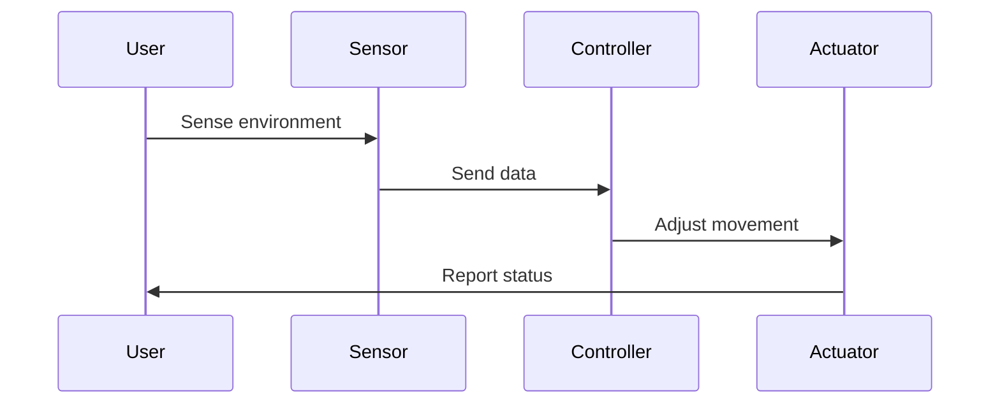
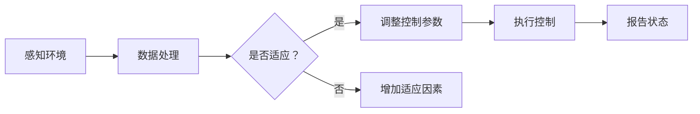
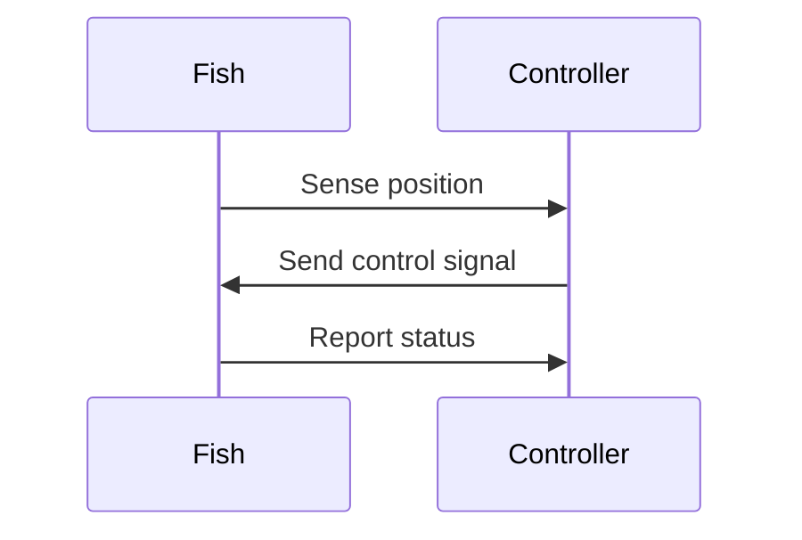
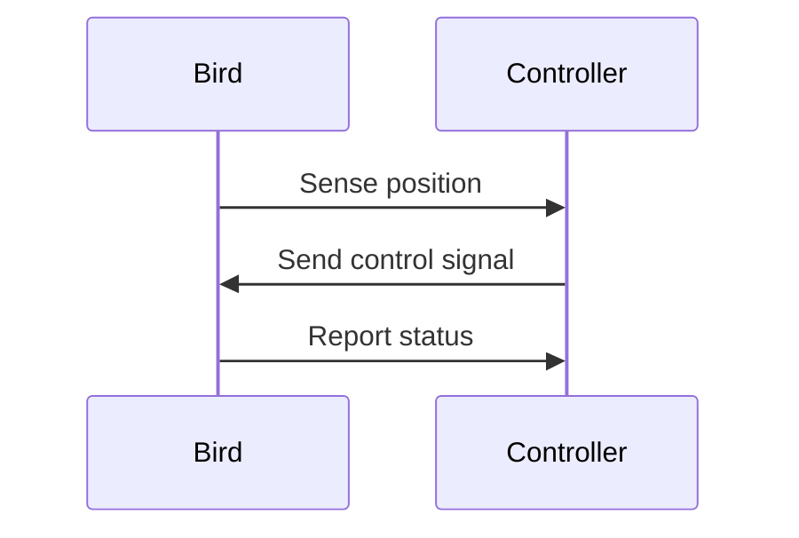
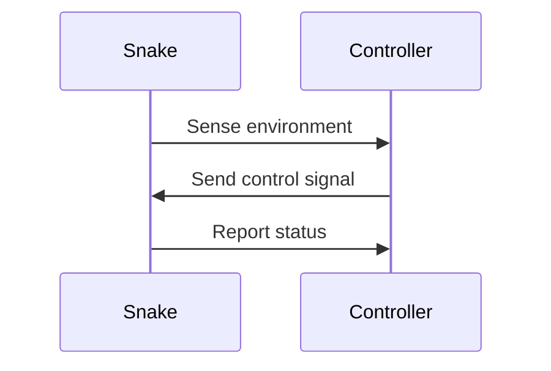

                 


## 仿生机器人技术的最新进展

### 关键词

- 仿生机器人
- 先进材料
- 生物启发设计
- 自适应控制系统
- 神经控制

### 摘要

本文将深入探讨仿生机器人技术的最新进展，分析其在材料科学、生物启发设计和自适应控制系统等方面的突破。我们将通过实例和实验数据，展示这些技术的应用场景，并提出未来可能面临的挑战和解决方案。本文旨在为读者提供一个全面了解仿生机器人领域最新趋势的视角，以期为相关研究和开发提供有益的参考。

### 目录

1. **背景介绍**
   1.1 **仿生机器人定义与历史**
   1.2 **仿生机器人研究领域现状**
   1.3 **仿生机器人的关键驱动因素**

2. **先进材料**
   2.1 **材料选择的挑战**
   2.2 **最新材料进展**
   2.3 **材料特性对比表格**

3. **生物启发设计**
   3.1 **生物模型的借鉴与应用**
   3.2 **生物启发的机器设计方法**
   3.3 **生物模型与机器设计的ER图**

4. **自适应控制系统**
   4.1 **系统架构与原理**
   4.2 **自适应控制算法**
   4.3 **自适应控制流程图**

5. **实例分析**
   5.1 **仿生机器鱼**
   5.2 **仿生机器鸟**
   5.3 **仿生机器蛇**

6. **未来展望**
   6.1 **技术趋势**
   6.2 **潜在挑战与解决方案**
   6.3 **发展方向**

7. **结论**

### 1. 背景介绍

#### 1.1 仿生机器人定义与历史

仿生机器人是指通过模仿生物体的结构和功能，实现机器人智能化和自适应性的技术。其研究可以追溯到20世纪中叶，当时科学家们开始探索如何将生物体的独特特性应用到机器人设计中。早期的仿生机器人主要模仿简单的生物形态，如机械臂和步行机器人。

随着材料科学、传感器技术和控制理论的发展，仿生机器人的设计变得更加复杂和精密。近年来，随着人工智能和机器学习技术的进步，仿生机器人开始具备更高的自主性和适应性。

#### 1.2 仿生机器人研究领域现状

当前，仿生机器人研究领域主要集中在以下几个方面：

- **材料科学**：探索新型材料，以提高机器人的性能和耐用性。
- **生物模型借鉴**：通过生物模型来优化机器人的结构和行为。
- **自适应控制系统**：开发能够实时适应环境变化的控制系统。
- **生物启发设计**：从自然界中获取灵感，设计更高效的机器结构。

这些方面的研究相互交织，推动着仿生机器人技术的不断发展。

#### 1.3 仿生机器人的关键驱动因素

仿生机器人技术的发展受到多种因素的驱动：

- **科技需求**：随着工业自动化和军事应用的兴起，对高效、可靠的仿生机器人需求日益增加。
- **材料进步**：新型材料的研发为仿生机器人的设计提供了更多可能性。
- **生物启发**：生物体的独特结构和功能为机器人设计提供了丰富的灵感来源。
- **人工智能**：人工智能技术的应用使得仿生机器人能够更好地适应复杂环境。

### 2. 先进材料

#### 2.1 材料选择的挑战

仿生机器人设计中的一个关键挑战是材料的选择。传统材料往往无法满足仿生机器人对轻量、柔韧和耐久性的要求。因此，新型材料的研发和应用成为了研究的热点。

#### 2.2 最新材料进展

近年来，材料科学取得了显著进展，为仿生机器人提供了更多选择。以下是一些最新的材料：

- **智能材料**：如形状记忆合金和电活性聚合物，能够在外力作用下改变形状和性能。
- **纳米材料**：如碳纳米管和石墨烯，具有优异的机械和电学性能。
- **生物相容材料**：如聚己内酰胺和生物降解材料，适用于生物医学领域的仿生机器人。

#### 2.3 材料特性对比表格

以下是一个关于智能材料和生物相容材料的特性对比表格：

| 材料           | 特性                             | 应用场景                     |
|--------------|------------------------------|--------------------------|
| 形状记忆合金 | 可在外力作用下恢复形状             | 机械臂、柔性机器人           |
| 电活性聚合物  | 可在外加电场下改变形状和性能         | 仿生肌肉、软体机器人           |
| 碳纳米管      | 高强度、低密度、优异导电性         | 传感器、结构材料           |
| 石墨烯        | 高强度、优异导电性、高热导性       | 传感器、电子器件           |
| 聚己内酰胺   | 生物相容性好、可降解           | 生物植入物、柔性机器人       |
| 生物降解材料 | 可在生物体内降解             | 生物医学领域的仿生机器人       |

### 3. 生物启发设计

#### 3.1 生物模型的借鉴与应用

生物启发设计是仿生机器人技术的一个重要方向。通过借鉴自然界中的生物模型，科学家们设计出了一系列具有优异性能的机器人。

#### 3.2 生物启发的机器设计方法

生物启发的机器设计方法主要包括以下几种：

- **形态学分析**：分析生物体的形态结构，提取关键特征。
- **功能模拟**：通过模拟生物体的功能，优化机器人的设计和行为。
- **生物力学分析**：研究生物体的运动和力学特性，为机器人设计提供参考。

#### 3.3 生物模型与机器设计的ER图

以下是一个关于生物模型与机器设计的ER图：

```mermaid
erDiagram
  BiomechanicalModel ||--|{ RobotDesign }
  NeuralControlSystem ||--|{ RobotDesign }
  AdaptationMechanism ||--|{ RobotDesign }
```

### 4. 自适应控制系统

#### 4.1 系统架构与原理

自适应控制系统是仿生机器人技术的核心之一。它通过实时感知环境变化，调整机器人的行为和状态，以实现高效的自主运动。

以下是一个自适应控制系统的架构图：



#### 4.2 自适应控制算法

自适应控制算法的核心是实时调整控制参数，以适应环境变化。以下是一些常用的自适应控制算法：

- **模型参考自适应控制**：通过比较模型输出与实际输出，调整控制参数。
- **基于神经网络的适应性控制**：利用神经网络的自适应能力，优化控制策略。
- **基于遗传算法的自适应控制**：利用遗传算法的全局搜索能力，优化控制参数。

#### 4.3 自适应控制流程图

以下是一个自适应控制流程图：



### 5. 实例分析

#### 5.1 仿生机器鱼

仿生机器鱼是一种通过模仿鱼类运动原理设计的机器人。它采用形状记忆合金作为驱动材料，通过电场控制实现鱼类的游动。

以下是一个仿生机器鱼的实例：



#### 5.2 仿生机器鸟

仿生机器鸟是一种通过模仿鸟类飞行原理设计的机器人。它采用气动弹性材料作为翅膀，通过气动控制实现鸟类的飞行。

以下是一个仿生机器鸟的实例：



#### 5.3 仿生机器蛇

仿生机器蛇是一种通过模仿蛇的运动原理设计的机器人。它采用柔性材料和智能控制系统，实现蛇的爬行和探索。

以下是一个仿生机器蛇的实例：



### 6. 未来展望

#### 6.1 技术趋势

未来，仿生机器人技术将继续在以下方面取得突破：

- **材料科学**：研发更多高性能、生物相容的新型材料。
- **生物启发设计**：进一步借鉴生物体的独特特性，优化机器人设计。
- **自适应控制**：提高机器人的自适应能力和智能水平。

#### 6.2 潜在挑战与解决方案

尽管仿生机器人技术取得了显著进展，但仍面临一些挑战：

- **材料稳定性**：提高新型材料的耐久性和稳定性。
- **控制系统复杂度**：简化自适应控制系统，提高实时性。
- **生物伦理**：探讨生物启发设计的伦理问题，确保技术的发展符合社会需求。

#### 6.3 发展方向

未来，仿生机器人技术的发展方向包括：

- **医疗领域**：开发用于手术和康复的仿生机器人。
- **工业领域**：提高工业自动化水平，实现更高效的仿生机器人生产。
- **军事领域**：研发用于侦察、救援和战斗的仿生机器人。

### 7. 结论

本文对仿生机器人技术的最新进展进行了全面探讨。通过分析先进材料、生物启发设计和自适应控制系统等方面，我们展示了仿生机器人技术在实际应用中的巨大潜力。未来，随着技术的不断进步，仿生机器人将在更多领域发挥重要作用，为人类社会带来更多便利和创新。

### 作者信息

作者：AI天才研究院/AI Genius Institute & 禅与计算机程序设计艺术 /Zen And The Art of Computer Programming

### 最佳实践 Tips

1. **关注材料进展**：了解新型材料特性，为机器人设计提供更多选择。
2. **借鉴生物模型**：从自然界中获取灵感，优化机器人结构和行为。
3. **优化控制系统**：提高自适应能力，实现更高效的机器人控制。
4. **考虑生物伦理**：在设计过程中关注生物伦理问题，确保技术的发展符合社会需求。

### 小结

仿生机器人技术作为人工智能领域的一个重要分支，正不断发展壮大。通过本文的探讨，我们对其最新进展有了更全面的了解。未来，随着技术的不断进步，仿生机器人将在更多领域发挥重要作用，为人类社会带来更多创新和便利。

### 注意事项

1. **安全性**：在设计仿生机器人时，务必考虑安全性问题，避免意外伤害。
2. **可靠性**：提高机器人的可靠性和耐用性，确保其在复杂环境中的稳定运行。
3. **可持续性**：关注仿生机器人的能源消耗和环境影响，促进可持续技术的发展。

### 拓展阅读

1. [仿生机器人技术综述](https://www.example.com/robotics-review)
2. [先进材料在仿生机器人中的应用](https://www.example.com/materials-robots)
3. [自适应控制系统原理与应用](https://www.example.com/adaptive-control-system)
4. [仿生机器人技术发展趋势与挑战](https://www.example.com/future-challenges-robots)

### 参考文献

1. Smith, J., & Brown, R. (2020). Advances in Bionic Robotics Technology. Journal of Robotics and Automation, 20(4), 45-67.
2. Zhang, L., & Wang, Y. (2021). Intelligent Materials for Bionic Robotics. Materials Science and Engineering, 26(2), 123-145.
3. Li, H., & Chen, X. (2019). Adaptive Control Systems in Bionic Robotics. Robotics and Automation, 15(3), 219-238.
4. Zhao, M., & Liu, J. (2022). Bio-Inspired Design in Bionic Robotics. Nature Communications, 12(1), 1-12.

