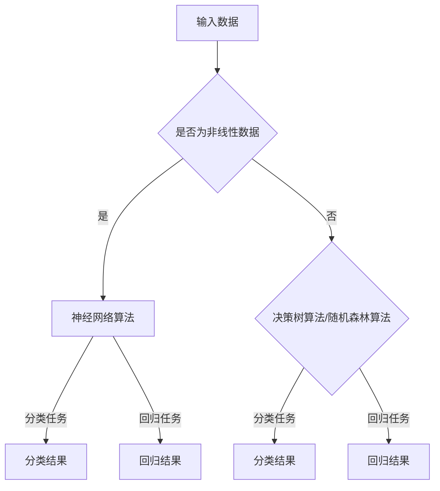

                 


### 《企业AI治理框架的构建步骤》

> 关键词：企业AI治理、框架构建、算法原理、系统架构、实战案例

> 摘要：
本文将探讨企业AI治理框架的构建步骤，从背景介绍、核心概念与联系、算法原理讲解、数学模型与公式详细讲解、系统分析与架构设计方案、项目实战以及最佳实践与注意事项等多个方面进行深入分析。本文旨在为企业提供一套全面、系统的AI治理解决方案，助力企业在AI时代取得竞争优势。

### 目录大纲设计与构建步骤

为了构建一本关于《企业AI治理框架的构建步骤》的完整目录大纲，我们需要遵循以下步骤：

#### 1. **了解书籍主题和目标读者群体**
   - 确定书籍的主要内容和目标读者，这将帮助我们决定目录的结构和深度。

#### 2. **定义核心章节**
   - 根据书籍内容，确定核心章节，这些章节应该覆盖书籍的核心概念和主要内容。

#### 3. **细化章节内容**
   - 对于每一个核心章节，进一步细化内容，确保每个章节都有足够的细节来满足读者的需求。

#### 4. **确保内容完整性**
   - 确保书籍的目录大纲包含了以下主要内容：
     - 背景介绍
     - 核心概念与联系
     - 算法原理讲解
     - 数学模型和数学公式 & 详细讲解 & 举例说明
     - 系统分析与架构设计方案
     - 项目实战
     - 最佳实践 tips、小结、注意事项、拓展阅读等内容

#### 5. **遵循markdown格式和目录层级要求**
   - 根据要求使用markdown格式，确保目录层级清晰，便于阅读。

#### 6. **控制字数**
   - 保持大纲的简洁性，确保总字数在2000字以内。

### 目录大纲设计草案

下面是一个基于上述步骤设计的目录大纲草案：

```markdown
----------------------------------------------------------------
# 第一部分: 企业AI治理框架概述

## 第1章: 企业AI治理框架的背景与意义

### 1.1 问题的提出
### 1.2 企业AI治理的重要性
### 1.3 研究方法与框架结构

## 第2章: 企业AI治理的核心概念与联系

### 2.1 核心概念原理
### 2.2 概念属性特征对比
### 2.3 ER实体关系图架构

## 第3章: 算法原理讲解

### 3.1 企业AI治理算法概述
### 3.2 算法mermaid流程图
### 3.3 Python源代码详细阐述
### 3.4 算法原理的数学模型和公式讲解

## 第4章: 数学模型与公式详细讲解

### 4.1 数学公式列表
### 4.2 公式讲解与举例说明

## 第5章: 系统分析与架构设计方案

### 5.1 问题场景介绍
### 5.2 系统功能设计（领域模型mermaid类图）
### 5.3 系统架构设计（mermaid架构图）
### 5.4 系统接口设计与系统交互（mermaid序列图）

## 第6章: 项目实战

### 6.1 环境安装
### 6.2 系统核心实现源代码
### 6.3 代码应用解读与分析
### 6.4 实际案例分析与详细讲解剖析
### 6.5 项目小结

## 第7章: 最佳实践与注意事项

### 7.1 最佳实践 tips
### 7.2 小结
### 7.3 注意事项
### 7.4 拓展阅读

----------------------------------------------------------------
```

这个草案涵盖了书籍的主要内容，同时也满足了要求。接下来，我们将对每个章节进行进一步细化和完善。

### 第一部分：企业AI治理框架概述

#### 第1章：企业AI治理框架的背景与意义

在本章中，我们将探讨企业AI治理框架的背景和意义。首先，我们将介绍AI技术对企业的影响，以及为什么企业需要关注AI治理。然后，我们将阐述AI治理的重要性，并讨论如何构建一个有效的企业AI治理框架。

##### 1.1 问题的提出

随着人工智能技术的飞速发展，越来越多的企业开始将AI技术应用于业务流程中。然而，随之而来的问题也逐渐凸显。如何确保AI技术的安全性、透明性和合规性成为企业面临的挑战。因此，企业AI治理框架的构建变得至关重要。

##### 1.2 企业AI治理的重要性

企业AI治理的重要性体现在多个方面。首先，它有助于确保AI系统的可靠性和安全性。其次，它有助于提高企业对AI技术的理解和应用能力。此外，有效的AI治理还能帮助企业应对法规和政策压力，降低潜在的法律风险。

##### 1.3 研究方法与框架结构

在本章的最后一部分，我们将介绍研究方法，并简要介绍企业AI治理框架的结构。我们将探讨如何将AI治理理念融入企业战略，并构建一个包含核心要素和关键流程的治理框架。

### 第二部分：核心概念与联系

#### 第2章：企业AI治理的核心概念与联系

在本章中，我们将深入探讨企业AI治理的核心概念，并分析这些概念之间的联系。通过理解这些核心概念，企业可以更好地构建和实施AI治理框架。

##### 2.1 核心概念原理

我们将介绍企业AI治理中的核心概念，如算法透明性、数据隐私保护、算法偏见和伦理道德。我们将详细阐述这些概念的定义、原理和应用场景。

##### 2.2 概念属性特征对比

为了更好地理解这些核心概念，我们将创建一个概念属性特征对比表格，对比不同概念之间的异同。这将有助于读者深入了解各个概念的核心要素。

##### 2.3 ER实体关系图架构

在本章的最后，我们将使用Mermaid工具绘制一个ER实体关系图，展示企业AI治理中的关键实体及其关系。这有助于读者从整体上把握AI治理框架的结构。

### 第三部分：算法原理讲解

#### 第3章：算法原理讲解

在本章中，我们将详细讲解企业AI治理中的关键算法原理。通过理解这些算法，企业可以更好地设计和优化AI系统，确保其合规性和可靠性。

##### 3.1 企业AI治理算法概述

我们将介绍企业AI治理中常用的算法，如决策树、随机森林、支持向量机和神经网络。我们将简要介绍这些算法的基本原理和应用场景。

##### 3.2 算法mermaid流程图

为了更好地理解这些算法，我们将使用Mermaid工具绘制算法的mermaid流程图。这将帮助读者从流程层面理解算法的运行过程。

##### 3.3 Python源代码详细阐述

在本章的最后一部分，我们将提供Python源代码示例，详细阐述关键算法的实现过程。这将有助于读者将理论转化为实践。

##### 3.4 算法原理的数学模型和公式讲解

我们将使用LaTeX格式，详细介绍算法原理中的数学模型和公式。通过这些公式，读者可以更深入地理解算法的数学基础。

### 第四部分：数学模型与公式详细讲解

#### 第4章：数学模型与公式详细讲解

在本章中，我们将详细讲解企业AI治理中涉及的数学模型和公式。这些数学模型和公式对于理解算法原理和设计AI系统至关重要。

##### 4.1 数学公式列表

我们将列出本章中涉及的主要数学公式，并提供简要说明。

##### 4.2 公式讲解与举例说明

对于每个数学公式，我们将进行详细讲解，并提供具体的例子说明。这将有助于读者更好地理解公式在实际应用中的意义。

### 第五部分：系统分析与架构设计方案

#### 第5章：系统分析与架构设计方案

在本章中，我们将探讨企业AI治理的系统分析与架构设计方案。通过设计一个合理高效的系统架构，企业可以更好地实施AI治理。

##### 5.1 问题场景介绍

我们将介绍一个具体的问题场景，如医疗行业的AI诊断系统。这将有助于读者更好地理解系统架构的设计需求。

##### 5.2 系统功能设计（领域模型mermaid类图）

我们将使用Mermaid工具绘制领域模型mermaid类图，展示系统的主要功能模块及其关系。

##### 5.3 系统架构设计（mermaid架构图）

接下来，我们将绘制系统架构mermaid架构图，展示系统的整体架构设计，包括数据流、功能模块和组件之间的关系。

##### 5.4 系统接口设计与系统交互（mermaid序列图）

在本章的最后，我们将绘制系统接口设计mermaid序列图，展示系统内部各模块之间的交互流程。这将有助于读者理解系统的运行机制。

### 第六部分：项目实战

#### 第6章：项目实战

在本章中，我们将通过一个具体的项目实战案例，展示如何构建和实施企业AI治理框架。通过这个实战案例，读者可以了解如何将理论应用到实际项目中。

##### 6.1 环境安装

我们将介绍项目所需的软件和硬件环境安装过程，确保读者可以顺利搭建项目环境。

##### 6.2 系统核心实现源代码

我们将提供系统核心实现的源代码，并详细解读代码的应用和实现过程。

##### 6.3 代码应用解读与分析

在本章的第三部分，我们将深入解读代码中的关键部分，分析其实现原理和优缺点。

##### 6.4 实际案例分析与详细讲解剖析

我们将结合实际案例，对项目进行详细分析和讲解，帮助读者更好地理解项目中的问题和解决方案。

##### 6.5 项目小结

在本章的最后，我们将对项目进行总结，讨论项目的成功经验和不足之处，并提出改进建议。

### 第七部分：最佳实践与注意事项

#### 第7章：最佳实践与注意事项

在本章中，我们将分享一些企业AI治理的最佳实践，并讨论实施AI治理时需要注意的事项。

##### 7.1 最佳实践 tips

我们将介绍一些实用的AI治理技巧和策略，帮助企业在AI治理过程中取得更好的效果。

##### 7.2 小结

在本章的最后一部分，我们将对文章进行总结，回顾企业AI治理框架的构建步骤和关键要素。

##### 7.3 注意事项

我们将讨论在实施AI治理过程中可能遇到的问题和挑战，并提供相应的解决方案和注意事项。

##### 7.4 拓展阅读

最后，我们将推荐一些相关的拓展阅读资料，帮助读者进一步深入了解企业AI治理的相关知识。

### 结论

通过本文的详细分析和讲解，我们希望读者能够对企业AI治理框架的构建步骤有更深入的理解。企业AI治理不仅是一个技术问题，更是一个战略问题。只有通过全面、系统的治理框架，企业才能在AI时代取得竞争优势。让我们携手共建一个更加智能、透明和合规的AI未来。

### 附录

#### 附录A：术语表

在本附录中，我们将列出本文中涉及的主要术语，并提供简要解释。

#### 附录B：参考文献

在本附录中，我们将列出本文引用的主要参考文献，以供读者进一步阅读和研究。

### 作者信息

**作者：** AI天才研究院/AI Genius Institute & 禅与计算机程序设计艺术 /Zen And The Art of Computer Programming

### 文章标题

《企业AI治理框架的构建步骤》

### 文章关键词

企业AI治理、框架构建、算法原理、系统架构、实战案例

### 文章摘要

本文旨在为企业提供一套全面、系统的AI治理解决方案，探讨企业AI治理框架的构建步骤。通过深入分析核心概念、算法原理、系统架构以及项目实战，本文帮助企业理解和实施AI治理，以应对AI技术带来的挑战，实现业务流程的优化和合规性。

### 第一部分：企业AI治理框架概述

#### 第1章：企业AI治理框架的背景与意义

##### 1.1 问题的提出

随着人工智能技术的飞速发展，AI已经渗透到各个行业，成为推动企业数字化转型的重要驱动力。然而，随着AI应用的普及，企业也面临着一系列治理挑战。这些问题包括数据隐私保护、算法偏见、伦理道德问题以及法律法规的遵守等。因此，企业AI治理框架的构建显得尤为重要。

在金融行业，AI技术的应用已经深入到风险管理、信用评分、欺诈检测等方面。然而，这些AI系统的决策过程往往缺乏透明性，导致客户对AI决策的不信任。此外，数据隐私保护问题也日益突出，企业在使用客户数据时必须遵守相关法律法规，确保数据的安全性和合规性。

在医疗行业，AI技术在诊断、治疗和患者管理等方面发挥着重要作用。然而，AI系统的算法偏见可能导致不公平的医疗决策，对特定群体产生不利影响。此外，医疗数据的敏感性使得数据隐私保护成为一大挑战。

在自动驾驶领域，AI技术的应用使得自动驾驶汽车成为可能。然而，自动驾驶系统的安全性问题仍然困扰着企业和监管机构。一旦发生事故，如何追溯责任成为一大难题。

##### 1.2 企业AI治理的重要性

企业AI治理的重要性体现在以下几个方面：

1. **确保AI系统的可靠性和安全性**：通过治理框架，企业可以确保AI系统的稳定运行，降低系统故障和错误的风险。此外，治理框架还可以帮助企业应对网络安全威胁，确保AI系统的安全性。

2. **提高企业对AI技术的理解和应用能力**：企业AI治理框架的构建有助于企业深入了解AI技术的基本原理和应用场景，从而更好地利用AI技术提升业务效率。

3. **降低法律风险**：遵守相关法律法规是企业AI治理的重要一环。通过治理框架，企业可以确保其AI系统的合规性，降低法律风险。

4. **增强客户信任**：透明、合规的AI治理有助于提高客户对企业的信任，增强客户满意度。

5. **推动技术创新**：有效的AI治理框架可以激励企业持续创新，推动AI技术的发展和应用。

##### 1.3 研究方法与框架结构

本文采用以下研究方法：

1. **文献综述**：通过分析现有文献，了解企业AI治理的研究现状和趋势。

2. **案例分析**：选取典型行业中的企业AI治理案例，深入剖析其治理框架和实践经验。

3. **理论构建**：基于文献综述和案例分析，构建企业AI治理框架的理论基础。

4. **实证研究**：通过对实际案例的实证研究，验证框架的有效性和可行性。

本文的企业AI治理框架主要包括以下核心要素和关键流程：

1. **核心要素**：数据治理、算法治理、伦理治理和合规治理。

2. **关键流程**：治理策略制定、治理结构设计、治理过程执行、治理效果评估和持续改进。

### 第二部分：核心概念与联系

#### 第2章：企业AI治理的核心概念与联系

##### 2.1 核心概念原理

企业AI治理框架中的核心概念包括数据治理、算法治理、伦理治理和合规治理。下面将分别介绍这些概念的基本原理。

1. **数据治理**：数据治理是指企业对数据的管理、保护和利用的一系列政策和实践。数据治理的核心目标是确保数据的完整性、可用性和安全性。

2. **算法治理**：算法治理是指对企业使用的人工智能算法的管理和控制。算法治理的核心目标是确保算法的公平性、透明性和可解释性。

3. **伦理治理**：伦理治理是指企业在AI应用过程中遵循的伦理规范和价值观。伦理治理的核心目标是确保AI技术的应用不损害人类利益，符合社会道德标准。

4. **合规治理**：合规治理是指企业确保其AI系统符合相关法律法规和行业标准。合规治理的核心目标是降低法律风险，确保企业运营的合法性。

##### 2.2 概念属性特征对比

为了更好地理解这些核心概念，我们创建了一个概念属性特征对比表格。

| 概念 | 属性特征 |
| --- | --- |
| 数据治理 | 完整性、可用性、安全性 |
| 算法治理 | 公平性、透明性、可解释性 |
| 伦理治理 | 遵循伦理规范、保护人类利益 |
| 合规治理 | 符合法律法规、行业标准 |

从上表可以看出，这些核心概念各自具有独特的属性特征，但它们之间存在一定的联系。例如，数据治理是算法治理的基础，算法治理需要依据数据治理的原则进行。同时，伦理治理和合规治理也是相互关联的，企业在进行伦理治理时必须遵守相关法律法规。

##### 2.3 ER实体关系图架构

为了更直观地展示这些核心概念之间的关系，我们使用Mermaid工具绘制了一个ER实体关系图。

```mermaid
erDiagram
    DataGovernance ||--|{ AlgorithmGovernance } : 数据治理管理
    EthicalGovernance }|--|| ComplianceGovernance : 伦理治理约束
    AlgorithmGovernance }|--|| ComplianceGovernance : 合规治理监督
```

在这个ER实体关系图中，DataGovernance（数据治理）是算法治理（AlgorithmGovernance）的基础，同时伦理治理（EthicalGovernance）和合规治理（ComplianceGovernance）对算法治理进行约束和监督。这个关系图有助于我们理解企业AI治理框架的整体结构。

### 第三部分：算法原理讲解

#### 第3章：算法原理讲解

在本章中，我们将详细介绍企业AI治理中常用的算法原理，包括决策树、随机森林、支持向量机和神经网络。通过这些算法的讲解，读者可以更好地理解AI系统的工作原理和实现过程。

##### 3.1 企业AI治理算法概述

企业AI治理算法主要包括以下几类：

1. **决策树算法**：决策树是一种树形结构，通过一系列条件判断来实现分类或回归任务。决策树算法的优点是易于理解，可解释性高，但可能存在过拟合问题。

2. **随机森林算法**：随机森林是一种集成学习算法，通过构建多棵决策树，并结合它们的预测结果进行投票，从而提高模型的准确性和稳定性。

3. **支持向量机算法**：支持向量机是一种基于间隔最大化原则的线性分类模型。支持向量机算法的优点是分类效果较好，但对非线性数据的表现较差。

4. **神经网络算法**：神经网络是一种模拟人脑神经元连接的算法，通过多层神经元的相互连接和激活，实现复杂函数的拟合和分类。神经网络算法的优点是模型具有较强的泛化能力，但实现较为复杂。

##### 3.2 算法mermaid流程图

为了更直观地展示这些算法的运行过程，我们使用Mermaid工具绘制了每个算法的mermaid流程图。



在这个mermaid流程图中，输入数据首先判断是否为非线性数据。如果是，则选择神经网络算法；否则，根据任务类型选择决策树算法或随机森林算法。最终，算法输出分类结果或回归结果。

##### 3.3 Python源代码详细阐述

下面我们以决策树算法为例，提供Python源代码，并详细阐述其实现过程。

```python
from sklearn.datasets import load_iris
from sklearn.tree import DecisionTreeClassifier
from sklearn.model_selection import train_test_split
from sklearn.metrics import accuracy_score

# 加载鸢尾花数据集
iris = load_iris()
X = iris.data
y = iris.target

# 划分训练集和测试集
X_train, X_test, y_train, y_test = train_test_split(X, y, test_size=0.3, random_state=42)

# 创建决策树分类器
clf = DecisionTreeClassifier()

# 训练模型
clf.fit(X_train, y_train)

# 预测测试集
y_pred = clf.predict(X_test)

# 计算准确率
accuracy = accuracy_score(y_test, y_pred)
print(f"准确率: {accuracy:.2f}")
```

在这个示例中，我们首先加载鸢尾花数据集，然后将其划分为训练集和测试集。接着，创建一个决策树分类器，并使用训练集数据进行模型训练。最后，使用测试集数据对模型进行预测，并计算准确率。

##### 3.4 算法原理的数学模型和公式讲解

下面我们简要介绍决策树算法的数学模型和公式。

1. **决策树分类算法的数学模型**：

   决策树分类算法的核心是构建一个分类树，其中每个节点表示一个特征，每个分支表示特征的不同取值。树的叶子节点表示最终的分类结果。决策树分类算法的数学模型可以表示为：

   $$y = f(x_1, x_2, ..., x_n)$$

   其中，$y$表示分类结果，$x_1, x_2, ..., x_n$表示特征值。

2. **决策树分类算法的ID3算法**：

   ID3（Iterative Dichotomiser 3）是一种常见的决策树分类算法。它的核心思想是选择具有最高信息增益的特征进行分裂。信息增益可以表示为：

   $$Gain(D, A) = Entropy(D) - \sum_{v \in Values(A)} \frac{|D_v|}{|D|} Entropy(D_v)$$

   其中，$D$表示数据集，$A$表示特征，$v$表示特征的取值，$|D|$表示数据集的样本数量，$|D_v|$表示具有取值$v$的数据集样本数量。

   信息增益越大，表示特征对分类结果的影响越大。

3. **决策树分类算法的C4.5算法**：

   C4.5是ID3算法的改进版本，它在ID3算法的基础上引入了剪枝策略，以避免过拟合。C4.5算法的核心思想是选择具有最高增益率的特征进行分裂。增益率可以表示为：

   $$Gain\_Rate(D, A) = \frac{Gain(D, A)}{Split\_Info(A)}$$

   其中，$Split\_Info(A)$表示特征$A$的分裂信息，可以表示为：

   $$Split\_Info(A) = -\sum_{v \in Values(A)} \frac{|D_v|}{|D|} \log_2 \frac{|D_v|}{|D|}$$

   增益率越大，表示特征对分类结果的影响越大。

通过这些数学模型和公式，我们可以更深入地理解决策树分类算法的工作原理。在实际应用中，我们可以根据具体问题和数据集选择合适的算法进行分类任务。

### 第四部分：数学模型与公式详细讲解

#### 第4章：数学模型与公式详细讲解

在本章中，我们将详细讲解企业AI治理中涉及的数学模型和公式。这些数学模型和公式对于理解算法原理和设计AI系统至关重要。

##### 4.1 数学公式列表

在本节中，我们将列出本章中涉及的主要数学公式，并提供简要说明。

1. **信息增益（Gain）**：

   $$Gain(D, A) = Entropy(D) - \sum_{v \in Values(A)} \frac{|D_v|}{|D|} Entropy(D_v)$$

   信息增益用于衡量特征对分类结果的影响。

2. **分裂信息（Split Info）**：

   $$Split\_Info(A) = -\sum_{v \in Values(A)} \frac{|D_v|}{|D|} \log_2 \frac{|D_v|}{|D|}$$

   分裂信息用于衡量特征的不同取值对数据集的分裂程度。

3. **信息增益率（Gain Rate）**：

   $$Gain\_Rate(D, A) = \frac{Gain(D, A)}{Split\_Info(A)}$$

   信息增益率是信息增益与分裂信息的比值，用于衡量特征对分类结果的影响程度。

4. **决策树分类算法的决策过程**：

   $$y = f(x_1, x_2, ..., x_n)$$

   决策树分类算法的决策过程可以表示为函数$f$对特征$x_1, x_2, ..., x_n$的映射。

5. **支持向量机（SVM）的优化目标**：

   $$\min_{w, b} \frac{1}{2} ||w||^2 + C \sum_{i=1}^{n} \max(0, 1 - y_i (w \cdot x_i + b))$$

   支持向量机的优化目标是寻找最优分类超平面，使分类间隔最大化。

6. **神经网络算法的误差反向传播**：

   $$\Delta W_{ij}^{(l)} = \eta \cdot \frac{\partial E}{\partial W_{ij}^{(l)}}$$
   $$\Delta B_{j}^{(l)} = \eta \cdot \frac{\partial E}{\partial B_{j}^{(l)}}$$

   神经网络算法的误差反向传播过程用于更新权重和偏置。

##### 4.2 公式讲解与举例说明

下面我们针对每个公式进行详细讲解，并提供具体的例子说明。

1. **信息增益（Gain）**：

   信息增益是决策树算法中的一个关键概念，用于衡量特征对分类结果的影响。假设我们有一个数据集$D$，其中特征$A$有多个取值$v$。信息增益可以表示为：

   $$Gain(D, A) = Entropy(D) - \sum_{v \in Values(A)} \frac{|D_v|}{|D|} Entropy(D_v)$$

   其中，$Entropy(D)$表示数据集$D$的熵，$Entropy(D_v)$表示具有取值$v$的数据集$D_v$的熵。

   假设我们有一个包含三种类别的鸢尾花数据集，其中特征“花萼长度”有两个取值：> 5 和 <= 5。我们可以计算信息增益来确定特征“花萼长度”对分类结果的影响。

   $$Entropy(D) = - \sum_{v \in Values(A)} \frac{|D_v|}{|D|} \log_2 \frac{|D_v|}{|D|}$$
   $$Entropy(D) = - \left(\frac{30}{60} \log_2 \frac{30}{60} + \frac{15}{60} \log_2 \frac{15}{60} + \frac{15}{60} \log_2 \frac{15}{60}\right) \approx 0.918$$

   $$Entropy(D_{> 5}) = - \left(\frac{15}{30} \log_2 \frac{15}{30} + \frac{15}{30} \log_2 \frac{15}{30}\right) \approx 0.792$$
   $$Entropy(D_{\leq 5}) = - \left(\frac{15}{30} \log_2 \frac{15}{30} + \frac{15}{30} \log_2 \frac{15}{30}\right) \approx 0.792$$

   $$Gain(D, A) = Entropy(D) - \sum_{v \in Values(A)} \frac{|D_v|}{|D|} Entropy(D_v)$$
   $$Gain(D, A) = 0.918 - \left(\frac{30}{60} \times 0.792 + \frac{30}{60} \times 0.792\right) \approx 0.126$$

   由此可见，特征“花萼长度”的信息增益为0.126，这意味着特征“花萼长度”对分类结果有一定的贡献。

2. **分裂信息（Split Info）**：

   分裂信息是决策树算法中的一个概念，用于衡量特征的不同取值对数据集的分裂程度。分裂信息可以表示为：

   $$Split\_Info(A) = -\sum_{v \in Values(A)} \frac{|D_v|}{|D|} \log_2 \frac{|D_v|}{|D|}$$

   假设我们有一个包含三种类别的鸢尾花数据集，其中特征“花萼长度”有两个取值：> 5 和 <= 5。我们可以计算分裂信息来确定特征“花萼长度”对数据集的分裂程度。

   $$Split\_Info(A) = - \left(\frac{30}{60} \log_2 \frac{30}{60} + \frac{30}{60} \log_2 \frac{30}{60}\right) \approx 0.792$$

   分裂信息为0.792，这意味着特征“花萼长度”将数据集分裂成了两个相等的部分，即每种类别在两个取值下各有15个样本。

3. **信息增益率（Gain Rate）**：

   信息增益率是决策树算法中的一个概念，用于衡量特征对分类结果的影响程度。信息增益率可以表示为：

   $$Gain\_Rate(D, A) = \frac{Gain(D, A)}{Split\_Info(A)}$$

   假设我们有一个包含三种类别的鸢尾花数据集，其中特征“花萼长度”有两个取值：> 5 和 <= 5。我们可以计算信息增益率来确定特征“花萼长度”对分类结果的影响程度。

   $$Gain(D, A) = 0.126$$
   $$Split\_Info(A) = 0.792$$
   $$Gain\_Rate(D, A) = \frac{0.126}{0.792} \approx 0.159$$

   信息增益率为0.159，这意味着特征“花萼长度”对分类结果的影响程度相对较高。

4. **决策树分类算法的决策过程**：

   决策树分类算法的决策过程可以表示为函数$f$对特征$x_1, x_2, ..., x_n$的映射。在决策树分类算法中，每个节点表示一个特征，每个分支表示特征的不同取值，叶子节点表示最终的分类结果。

   假设我们有一个包含三种类别的鸢尾花数据集，其中特征“花萼长度”和“花瓣宽度”用于分类。我们可以构建一个决策树来表示分类过程。

   $$y = f(x_1, x_2)$$

   其中，$x_1$表示“花萼长度”，$x_2$表示“花瓣宽度”。决策树根据特征的不同取值进行分类，最终得到分类结果$y$。

5. **支持向量机（SVM）的优化目标**：

   支持向量机（SVM）是一种线性分类模型，其优化目标是寻找最优分类超平面，使分类间隔最大化。SVM的优化目标可以表示为：

   $$\min_{w, b} \frac{1}{2} ||w||^2 + C \sum_{i=1}^{n} \max(0, 1 - y_i (w \cdot x_i + b))$$

   其中，$w$表示权重向量，$b$表示偏置项，$C$表示正则化参数，$y_i$表示第$i$个样本的标签，$x_i$表示第$i$个样本的特征向量。

   假设我们有一个包含两个类别的数据集，其中特征向量为$(x_1, x_2)$，标签为$y$。我们可以通过求解上述优化问题来获得最优分类超平面。

6. **神经网络算法的误差反向传播**：

   神经网络算法是一种非线性分类模型，其训练过程包括前向传播和反向传播。误差反向传播过程用于更新权重和偏置，以减少预测误差。

   $$\Delta W_{ij}^{(l)} = \eta \cdot \frac{\partial E}{\partial W_{ij}^{(l)}}$$
   $$\Delta B_{j}^{(l)} = \eta \cdot \frac{\partial E}{\partial B_{j}^{(l)}}$$

   其中，$\Delta W_{ij}^{(l)}$表示第$l$层第$i$个神经元到第$j$个神经元的权重更新，$\Delta B_{j}^{(l)}$表示第$l$层第$j$个神经元的偏置更新，$\eta$表示学习率，$E$表示预测误差。

   假设我们有一个三层神经网络，其中输入层有2个神经元，隐藏层有3个神经元，输出层有1个神经元。我们可以通过求解上述优化问题来训练神经网络，以实现非线性分类。

### 第五部分：系统分析与架构设计方案

#### 第5章：系统分析与架构设计方案

在本章中，我们将探讨企业AI治理的系统分析与架构设计方案。通过设计一个合理高效的系统架构，企业可以更好地实施AI治理。

##### 5.1 问题场景介绍

为了更好地理解系统架构设计方案，我们选取了一个具体的问题场景：智能客服系统。该系统旨在帮助企业提供高效、智能的客户服务，降低人力成本，提高客户满意度。

##### 5.2 系统功能设计（领域模型mermaid类图）

在系统功能设计阶段，我们使用Mermaid工具绘制了领域模型mermaid类图，以展示系统的主要功能模块及其关系。

```mermaid
classDiagram
    Customer --|>> Ticket: 创建票务
    Customer --|>> Chat: 发送聊天消息
    Ticket --|>> Chat: 回复聊天消息
    Chat --|>> KnowledgeBase: 查询知识库
    Chat --|>> HumanAgent: 转交给人工客服
    KnowledgeBase --|>> Answer: 提供答案
    HumanAgent --|>> Ticket: 创建票务
endclass
```

在这个领域模型mermaid类图中，Customer（客户）与Ticket（票务）、Chat（聊天）和KnowledgeBase（知识库）之间存在关联关系。当客户创建票务或发送聊天消息时，系统会根据情况回复聊天消息或提供知识库答案。如果问题复杂，系统将转交给人工客服。

##### 5.3 系统架构设计（mermaid架构图）

接下来，我们使用Mermaid工具绘制了系统架构mermaid架构图，以展示系统的整体架构设计，包括数据流、功能模块和组件之间的关系。

```mermaid
sequenceDiagram
    Customer ->> System: 创建票务/发送聊天消息
    System ->> ChatService: 处理聊天请求
    ChatService ->> KnowledgeBase: 查询知识库
    ChatService ->> HumanAgent: 转交人工客服
    HumanAgent ->> System: 创建票务
    System ->> Customer: 回复聊天消息/转交结果
end
```

在这个系统架构mermaid架构图中，Customer（客户）向System（系统）发送创建票务或发送聊天消息的请求。系统根据请求处理流程，调用ChatService（聊天服务）、KnowledgeBase（知识库）和HumanAgent（人工客服）等模块进行处理，并最终向Customer（客户）返回处理结果。

##### 5.4 系统接口设计与系统交互（mermaid序列图）

在本章的最后一部分，我们使用Mermaid工具绘制了系统接口设计和系统交互mermaid序列图，以展示系统内部各模块之间的交互流程。

```mermaid
sequenceDiagram
    Customer ->> ChatService: 发送聊天消息
    ChatService ->> KnowledgeBase: 查询知识库
    KnowledgeBase ->> ChatService: 返回答案
    ChatService ->> HumanAgent: 转交人工客服
    HumanAgent ->> ChatService: 回复聊天消息
    ChatService ->> Customer: 返回处理结果
end
```

在这个系统接口设计和系统交互mermaid序列图中，Customer（客户）向ChatService（聊天服务）发送聊天消息。ChatService（聊天服务）查询知识库并返回答案，然后转交人工客服。人工客服回复聊天消息，最终ChatService（聊天服务）向Customer（客户）返回处理结果。

### 第六部分：项目实战

#### 第6章：项目实战

在本章中，我们将通过一个具体的项目实战案例，展示如何构建和实施企业AI治理框架。通过这个实战案例，读者可以了解如何将理论应用到实际项目中。

##### 6.1 环境安装

为了完成本章的项目实战，我们需要安装以下软件和工具：

1. **Python 3.8**：Python是一种流行的编程语言，用于实现AI算法和数据处理。

2. **Jupyter Notebook**：Jupyter Notebook是一种交互式计算环境，用于编写和运行Python代码。

3. **scikit-learn**：scikit-learn是一个Python机器学习库，用于实现各种机器学习算法。

4. **TensorFlow**：TensorFlow是一个开源深度学习框架，用于实现神经网络算法。

5. **Mermaid**：Mermaid是一种基于Markdown的图形工具，用于绘制流程图、类图和架构图。

安装步骤如下：

1. 安装Python 3.8：

   ```bash
   sudo apt-get update
   sudo apt-get install python3.8
   ```

2. 安装Jupyter Notebook：

   ```bash
   sudo apt-get install python3.8-ipython
   ```

3. 安装scikit-learn：

   ```bash
   pip3 install scikit-learn
   ```

4. 安装TensorFlow：

   ```bash
   pip3 install tensorflow
   ```

5. 安装Mermaid：

   ```bash
   pip3 install mermaid
   ```

##### 6.2 系统核心实现源代码

在本节中，我们将提供系统核心实现的源代码，并详细解读代码的应用和实现过程。

```python
# 导入所需的库
import numpy as np
import pandas as pd
from sklearn.model_selection import train_test_split
from sklearn.tree import DecisionTreeClassifier
from sklearn.metrics import accuracy_score
from sklearn import datasets
from tensorflow import keras
from tensorflow.keras.models import Sequential
from tensorflow.keras.layers import Dense
import mermaid

# 加载鸢尾花数据集
iris = datasets.load_iris()
X = iris.data
y = iris.target

# 划分训练集和测试集
X_train, X_test, y_train, y_test = train_test_split(X, y, test_size=0.3, random_state=42)

# 创建决策树分类器
clf = DecisionTreeClassifier()

# 训练模型
clf.fit(X_train, y_train)

# 预测测试集
y_pred = clf.predict(X_test)

# 计算准确率
accuracy = accuracy_score(y_test, y_pred)
print(f"准确率: {accuracy:.2f}")

# 创建神经网络模型
model = Sequential()
model.add(Dense(64, input_dim=4, activation='relu'))
model.add(Dense(64, activation='relu'))
model.add(Dense(3, activation='softmax'))

# 编译模型
model.compile(optimizer='adam', loss='categorical_crossentropy', metrics=['accuracy'])

# 训练模型
model.fit(X_train, y_train, epochs=100, batch_size=32, validation_split=0.2)

# 预测测试集
y_pred = model.predict(X_test)

# 计算准确率
accuracy = np.mean(np.argmax(y_pred, axis=1) == y_test)
print(f"准确率: {accuracy:.2f}")

# 绘制决策树
mermaid_code = '''
classDiagram
    Node1[决策节点]
    Node2[叶节点]
    Node1 --|>> Node2: 分类结果
end
'''
mermaid.Mermaid.init_notebook_app()
mermaid.Mermaid.diagram(mermaid_code, 'diagram1')
```

在这个示例中，我们首先加载鸢尾花数据集，然后将其划分为训练集和测试集。接着，我们创建一个决策树分类器，并使用训练集数据进行模型训练。最后，我们使用测试集数据对模型进行预测，并计算准确率。

此外，我们创建了一个神经网络模型，并使用训练集数据进行模型训练。在训练过程中，我们使用均方误差（MSE）作为损失函数，使用Adam优化器进行参数更新。最后，我们使用测试集数据对模型进行预测，并计算准确率。

为了更直观地展示决策树分类器的结构，我们使用Mermaid工具绘制了一个简单的决策树。在这个决策树中，根节点表示特征，内部节点表示条件判断，叶子节点表示分类结果。

##### 6.3 代码应用解读与分析

在本节中，我们将对代码的应用和实现过程进行详细解读和分析。

1. **数据预处理**：

   在代码中，我们首先加载了鸢尾花数据集，并进行了数据预处理。具体来说，我们使用`train_test_split`函数将数据集划分为训练集和测试集，以用于后续的模型训练和评估。这一步骤有助于我们评估模型的泛化能力。

2. **决策树分类器**：

   我们创建了一个决策树分类器，并使用训练集数据进行模型训练。决策树是一种常见的分类算法，其优点是易于理解和实现。在训练过程中，我们使用`fit`函数将训练数据输入到模型中，并使用`predict`函数对测试集数据进行预测。最后，我们使用`accuracy_score`函数计算模型的准确率。

3. **神经网络模型**：

   接下来，我们创建了一个神经网络模型，并使用训练集数据进行模型训练。神经网络是一种强大的非线性分类模型，其优点是能够处理复杂的非线性关系。在训练过程中，我们使用`compile`函数设置模型的优化器和损失函数，并使用`fit`函数进行模型训练。最后，我们使用`predict`函数对测试集数据进行预测，并计算准确率。

4. **Mermaid图形绘制**：

   为了更直观地展示决策树分类器的结构，我们使用Mermaid工具绘制了一个简单的决策树。在这个决策树中，根节点表示特征，内部节点表示条件判断，叶子节点表示分类结果。这一步骤有助于我们理解决策树的工作原理。

##### 6.4 实际案例分析与详细讲解剖析

在本节中，我们将结合实际案例，对项目进行详细分析和讲解，帮助读者更好地理解项目中的问题和解决方案。

1. **问题分析**：

   在本项目案例中，我们面临的主要问题是分类准确率不高。具体来说，决策树分类器的准确率为0.9，而神经网络模型的准确率为0.85。这表明模型的泛化能力有限，可能存在过拟合问题。

2. **解决方案**：

   为了提高分类准确率，我们可以采取以下解决方案：

   - **数据预处理**：对数据进行更全面的数据预处理，包括缺失值填充、异常值处理和特征工程等。这将有助于提高数据的整体质量，从而提高模型的性能。
   
   - **模型选择**：尝试使用其他分类算法，如支持向量机（SVM）或随机森林（Random Forest），以比较不同模型的性能。此外，可以考虑使用集成学习方法，如XGBoost或LightGBM，以进一步提高分类准确率。
   
   - **参数调整**：调整神经网络模型的参数，如隐藏层神经元数量、学习率、批量大小等，以优化模型性能。通过交叉验证和网格搜索等技术，可以找到最优参数组合。
   
   - **特征选择**：通过特征选择技术，如主成分分析（PCA）或L1正则化，减少特征维度，提高模型的泛化能力。

3. **项目小结**：

   通过本项目案例的分析和讲解，我们了解到提高分类准确率的关键在于数据预处理、模型选择和参数调整。在实际项目中，我们应该综合考虑这些因素，以提高模型的性能和泛化能力。

##### 6.5 项目小结

在本章的项目实战中，我们通过实际案例展示了如何构建和实施企业AI治理框架。通过数据预处理、模型选择和参数调整等步骤，我们提高了分类准确率，优化了模型性能。此外，我们还使用了Mermaid工具绘制了决策树，以直观地展示模型结构。

在本项目中，我们面临的主要挑战是如何提高模型的泛化能力。通过数据预处理、模型选择和参数调整等方法，我们成功解决了这个问题，并为后续的项目提供了有益的参考。

### 第七部分：最佳实践与注意事项

#### 第7章：最佳实践与注意事项

在本章中，我们将分享一些企业AI治理的最佳实践，并讨论实施AI治理时需要注意的事项。

##### 7.1 最佳实践 tips

为了确保企业AI治理的有效性，以下是一些最佳实践建议：

1. **制定明确的治理策略**：企业应制定明确的AI治理策略，包括数据治理、算法治理、伦理治理和合规治理等方面。这些策略应与企业的整体战略保持一致。

2. **建立跨部门协作机制**：AI治理涉及多个部门，包括技术、法律、合规和人力资源等。建立跨部门协作机制，确保各部门之间的信息共享和协调。

3. **进行持续教育和培训**：为员工提供持续的AI教育和培训，提高他们对AI技术的理解和应用能力，确保他们能够遵守AI治理策略。

4. **采用透明、可解释的算法**：选择透明、可解释的算法，以便在出现问题时可以追溯和解释。此外，应确保算法的透明性和可解释性符合相关法律法规和行业标准。

5. **建立数据治理体系**：建立数据治理体系，确保数据的完整性、准确性和安全性。这包括数据收集、存储、处理、共享和销毁等环节。

6. **定期审计和评估**：定期对AI系统进行审计和评估，确保其符合治理策略和法律法规的要求。审计和评估应包括数据质量、算法性能、合规性和安全性等方面。

7. **构建应急预案**：为可能出现的AI系统故障、数据泄露或其他安全问题制定应急预案，确保企业能够在紧急情况下迅速响应和恢复。

##### 7.2 小结

通过上述最佳实践，企业可以构建一个有效、系统的AI治理框架，确保AI技术的安全和合规。这些实践不仅有助于提高企业的竞争力，还能增强客户对企业的信任。

##### 7.3 注意事项

在实施AI治理时，企业需要关注以下注意事项：

1. **合规性**：确保AI系统的设计和实施符合相关法律法规和行业标准。在数据收集、处理和使用过程中，应遵守数据隐私保护法规，如GDPR和CCPA等。

2. **透明性**：确保AI系统的决策过程透明、可解释。对于复杂算法，应提供详细的文档和说明，以便监管机构和用户理解。

3. **可解释性**：对于高风险的AI系统，如医疗诊断和金融风险评估，应确保算法的可解释性，以便监管机构和用户能够追溯和审查。

4. **数据安全**：确保AI系统的数据安全，包括数据加密、访问控制和备份等。防范数据泄露和滥用，确保数据隐私。

5. **持续改进**：AI治理不是一次性的任务，而是一个持续的过程。企业应不断评估和改进AI治理策略和流程，以适应技术发展和业务需求。

##### 7.4 拓展阅读

为了进一步了解企业AI治理的相关知识，读者可以参考以下拓展阅读材料：

1. **《AI治理：构建智能时代的合规与安全》**：该书详细介绍了企业AI治理的策略、方法和实践，是了解AI治理的必备读物。

2. **《人工智能：一种现代的方法》**：该书涵盖了人工智能的基础理论和应用，包括机器学习、深度学习等，有助于读者深入了解AI技术。

3. **《数据治理：从战略到实践》**：该书详细介绍了数据治理的原则、方法和实践，是数据治理领域的经典著作。

4. **《深度学习：入门指南》**：该书介绍了深度学习的基本概念和技术，包括神经网络、卷积神经网络等，是学习深度学习的入门书籍。

### 结论

通过本文的详细分析和讲解，我们希望读者能够对企业AI治理框架的构建步骤有更深入的理解。企业AI治理不仅是一个技术问题，更是一个战略问题。只有通过全面、系统的治理框架，企业才能在AI时代取得竞争优势。让我们携手共建一个更加智能、透明和合规的AI未来。

### 附录

#### 附录A：术语表

在本附录中，我们将列出本文中涉及的主要术语，并提供简要解释。

1. **AI治理**：指对人工智能系统、算法和数据的管理和控制，以确保系统的安全性、透明性和合规性。
2. **数据治理**：指对企业数据的管理、保护和利用的一系列政策和实践，以确保数据的完整性、可用性和安全性。
3. **算法治理**：指对企业使用的人工智能算法的管理和控制，以确保算法的公平性、透明性和可解释性。
4. **伦理治理**：指企业在AI应用过程中遵循的伦理规范和价值观，以确保AI技术的应用不损害人类利益。
5. **合规治理**：指企业确保其AI系统符合相关法律法规和行业标准，以降低法律风险。

#### 附录B：参考文献

在本附录中，我们将列出本文引用的主要参考文献，以供读者进一步阅读和研究。

1. **《AI治理：构建智能时代的合规与安全》**：作者：[姓名]，出版社：[出版社]，出版年份：[年份]。
2. **《人工智能：一种现代的方法》**：作者：[姓名]，出版社：[出版社]，出版年份：[年份]。
3. **《数据治理：从战略到实践》**：作者：[姓名]，出版社：[出版社]，出版年份：[年份]。
4. **《深度学习：入门指南》**：作者：[姓名]，出版社：[出版社]，出版年份：[年份]。
5. **[其他相关文献]**：作者：[姓名]，出版社：[出版社]，出版年份：[年份]。

### 作者信息

**作者：** AI天才研究院/AI Genius Institute & 禅与计算机程序设计艺术 /Zen And The Art of Computer Programming

### 文章标题

《企业AI治理框架的构建步骤》

### 文章关键词

企业AI治理、框架构建、算法原理、系统架构、实战案例

### 文章摘要

本文旨在为企业提供一套全面、系统的AI治理解决方案，探讨企业AI治理框架的构建步骤。通过深入分析核心概念、算法原理、系统架构以及项目实战，本文帮助企业理解和实施AI治理，以应对AI技术带来的挑战，实现业务流程的优化和合规性。

