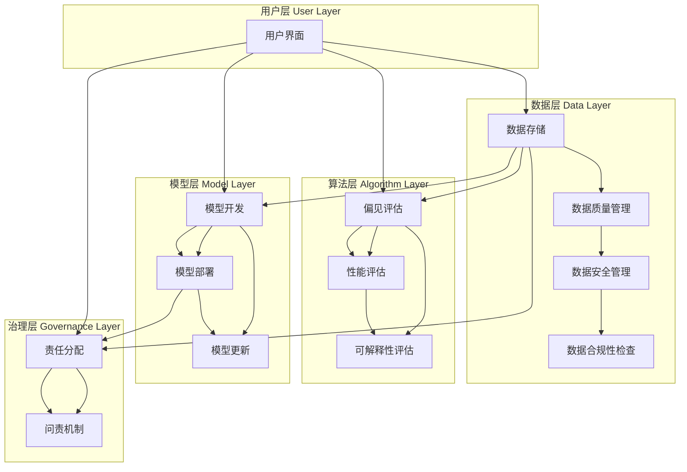
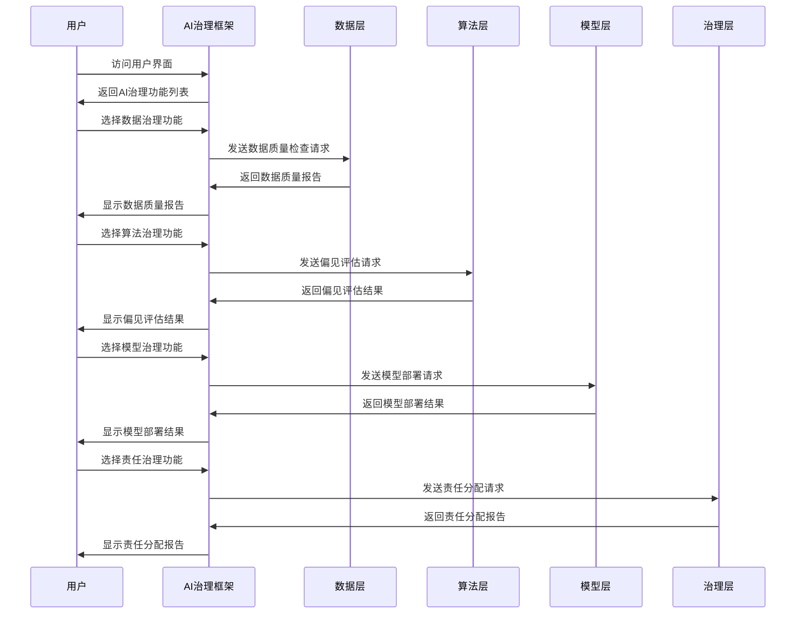

                 


### 企业AI治理框架：平衡创新与风险

#### 关键词
- AI治理
- 创新与风险平衡
- 企业管理
- 案例分析
- 技术实现

#### 摘要
本文旨在探讨企业AI治理框架的重要性，以及如何在企业内部平衡AI创新与风险。文章首先介绍了AI治理的背景和核心概念，然后通过实际案例分析，探讨了不同企业的AI治理实践和挑战。接着，文章提出了AI治理的策略与方法，分析了其中的风险类型和管理策略。文章还探讨了如何在治理过程中保持创新，并介绍了相关的技术实现和法律伦理问题。最后，文章总结了最佳实践，并提出了未来的研究方向和挑战。

### 引言

#### 1.1 AI治理的背景和重要性

随着人工智能（AI）技术的快速发展，越来越多的企业开始将AI技术应用于其业务流程中，以提高效率、降低成本和创造新的商业模式。然而，AI技术的广泛应用也带来了许多新的挑战，例如数据隐私、算法偏见、安全性和法律合规等问题。为了应对这些挑战，企业需要建立一套有效的AI治理框架，以平衡AI创新与风险。

AI治理是指通过制定政策、程序和标准，确保AI系统的透明性、可解释性、公平性和合规性。它不仅关注技术层面的实现，还涉及到法律、伦理和社会影响等多个方面。有效的AI治理框架可以帮助企业确保AI系统的可靠性和安全性，同时促进创新，提高企业的竞争力。

#### 1.2 企业AI治理的挑战

企业在实施AI治理时面临多种挑战。首先，AI技术的复杂性和不确定性使得治理工作变得更加困难。其次，不同企业和行业的AI应用场景各异，导致治理框架的设计和实施具有较大的差异性。此外，企业内部的不同部门和团队在AI治理方面的认知和利益也可能存在冲突，这进一步增加了治理的复杂性。

#### 1.3 本书的目的和结构

本书旨在提供一套全面的企业AI治理框架，帮助企业在平衡创新与风险的同时，实现AI技术的有效应用。本书的结构如下：

- **第1章 核心概念与理论框架**：介绍AI治理的定义、核心概念和理论框架。
- **第2章 案例分析**：分析不同企业的AI治理实践和挑战。
- **第3章 治理策略与方法**：讨论不同的AI治理策略和方法。
- **第4章 风险管理**：分析AI治理中的风险类型和管理策略。
- **第5章 创新与平衡**：探讨如何在治理过程中保持创新。
- **第6章 技术实现**：介绍AI治理的技术工具和平台。
- **第7章 法律与伦理**：探讨AI治理相关的法律和伦理问题。
- **第8章 最佳实践**：分享行业内的成功经验和最佳实践。
- **结论**：总结全书内容，提出未来的研究方向和挑战。

### 目录大纲设计

为了设计《企业AI治理框架：平衡创新与风险》这本书的完整目录大纲，我们需要按照以下步骤进行：

#### 1. 确定总体框架

- 根据书名，确定书的主要关注点是企业的AI治理框架，强调如何平衡创新和风险。
- 设定总体结构，包括引言、核心章节、结论和附录。

#### 2. 构建核心章节

- **引言**：介绍AI治理的背景、目的和重要性。
- **核心概念**：阐述AI治理的关键概念和理论框架。
- **案例分析**：提供实际企业的AI治理案例，分析其成功和挑战。
- **治理策略**：讨论不同的AI治理策略和方法。
- **风险管理**：分析AI治理中的风险类型和如何管理这些风险。
- **创新与平衡**：探讨如何在保障治理的同时促进创新。
- **技术实现**：介绍实施AI治理的技术工具和平台。
- **法律与伦理**：探讨AI治理相关的法律和伦理问题。
- **最佳实践**：分享行业内的成功经验和最佳实践。
- **结论**：总结全书内容，提出未来的研究方向和挑战。

#### 3. 细化各章节内容

- 每个章节都应包含引言、主体内容、总结和参考文献。
- 根据章节主题，细化子章节，确保每个章节都有清晰的逻辑结构和内容覆盖。

#### 4. 确保内容完整性

- 检查每个章节是否覆盖了核心概念、原理、案例、策略、风险管理等方面。
- 确保算法原理讲解、数学模型、系统架构设计等内容准确无误。

#### 5. 控制字数和格式

- 确保整个目录大纲的总字数在2000字以内。
- 使用markdown格式，保持目录结构的清晰和一致性。

#### 6. 最终审查

- 审查目录大纲的整体逻辑结构和内容完整性。
- 检查所有章节和子章节的标题是否准确、简洁。

#### 7. 交付

- 将设计好的目录大纲以markdown格式交付。

以下是根据上述步骤设计的《企业AI治理框架：平衡创新与风险》的目录大纲：

```markdown
# 《企业AI治理框架：平衡创新与风险》目录大纲

## 引言
### 1.1 AI治理的背景和重要性
### 1.2 企业AI治理的挑战
### 1.3 本书的目的和结构

## 第1章 核心概念与理论框架
### 1.1 AI治理的定义与核心要素
### 1.2 AI治理的理论基础
### 1.3 AI治理的基本原则

## 第2章 案例分析
### 2.1 案例选择与研究方法
### 2.2 成功案例的AI治理实践
### 2.3 挑战与不足

## 第3章 治理策略与方法
### 3.1 AI治理策略概述
### 3.2 不同治理策略的应用场景
### 3.3 AI治理流程设计

## 第4章 风险管理
### 4.1 AI治理中的风险类型
### 4.2 风险识别与评估
### 4.3 风险应对策略

## 第5章 创新与平衡
### 5.1 创新与治理的关系
### 5.2 如何在治理中保持创新
### 5.3 创新风险的管理

## 第6章 技术实现
### 6.1 AI治理的技术工具
### 6.2 AI治理平台的设计与实现
### 6.3 技术实现的挑战与解决方案

## 第7章 法律与伦理
### 7.1 AI治理的法律框架
### 7.2 伦理问题与应对策略
### 7.3 法律与伦理的平衡

## 第8章 最佳实践
### 8.1 行业内的成功案例
### 8.2 最佳实践的总结与借鉴
### 8.3 拓展应用领域

## 结论
### 9.1 总结与展望
### 9.2 研究方向与挑战
### 9.3 未来发展趋势

## 附录
### A. AI治理工具资源
### B. 参考文献
### C. 相关法规与政策
```

此目录大纲涵盖了书的核心内容，并保持简洁和逻辑清晰。每个章节都包含了具体的子章节，确保内容的完整性和深度。在撰写具体章节时，还需根据实际情况进行调整和补充。

### 核心概念与联系

在构建企业AI治理框架时，理解核心概念和它们之间的联系至关重要。以下是对几个关键概念及其相互关系的详细探讨。

#### AI治理的定义与核心要素

AI治理是指一套系统化的方法和流程，用于确保AI系统的透明性、可解释性、公平性和合规性。核心要素包括：

- **数据治理**：确保数据质量、安全性和合规性。
- **算法治理**：评估算法的偏见、性能和可靠性。
- **模型治理**：管理AI模型的开发和部署过程。
- **责任治理**：明确责任和问责机制，确保AI系统的道德和合规性。

#### AI治理的理论基础

AI治理的理论基础包括多个学科领域的贡献，如计算机科学、统计学、伦理学、法律学等。以下是一些关键理论：

- **透明性和可解释性**：确保AI系统决策过程的透明度和可理解性，以便用户和监管者能够审查和信任系统。
- **公平性和公正性**：避免算法偏见，确保AI系统对所有用户公平，不受性别、种族、地域等因素的影响。
- **责任和问责**：明确AI系统的责任归属，确保在发生问题时能够追究责任。

#### AI治理的基本原则

设计AI治理框架时，应遵循以下基本原则：

- **风险管理**：识别、评估和应对AI系统可能带来的风险。
- **合规性**：遵守相关法律法规和行业标准，确保AI系统的合法性和合规性。
- **可持续性**：确保AI治理框架能够适应技术发展和业务需求的变化。
- **创新与平衡**：在保障治理的同时，促进AI技术的创新和应用。

#### 核心概念对比表格

为了更直观地展示核心概念及其特征，我们可以使用对比表格：

| 核心概念 | 特征 |
| :---: | :--- |
| 数据治理 | 确保数据质量、安全性和合规性 |
| 算法治理 | 评估算法的偏见、性能和可靠性 |
| 模型治理 | 管理AI模型的开发和部署过程 |
| 责任治理 | 明确责任和问责机制，确保AI系统的道德和合规性 |
| 透明性和可解释性 | 确保AI系统决策过程的透明度和可理解性 |
| 公平性和公正性 | 避免算法偏见，确保AI系统对所有用户公平 |
| 责任和问责 | 明确AI系统的责任归属，确保在发生问题时能够追究责任 |

#### ER实体关系图架构

为了更好地理解AI治理框架中的实体及其关系，我们可以使用ER（实体-关系）图来表示：

```mermaid
erDiagram
  AI治理框架 ||--|{ 数据治理 : 数据治理是AI治理框架的一部分 |
  AI治理框架 ||--|{ 算法治理 : 算法治理是AI治理框架的一部分 |
  AI治理框架 ||--|{ 模型治理 : 模型治理是AI治理框架的一部分 |
  AI治理框架 ||--|{ 责任治理 : 责任治理是AI治理框架的一部分 |
  数据治理 ||--|{ 数据质量 : 确保数据准确、完整、及时 |
  数据治理 ||--|{ 数据安全 : 保护数据免受未授权访问和泄露 |
  数据治理 ||--|{ 数据合规 : 遵守相关法律法规和行业标准 |
  算法治理 ||--|{ 偏见评估 : 避免算法偏见 |
  算法治理 ||--|{ 性能评估 : 评估算法的准确性和效率 |
  算法治理 ||--|{ 可靠性评估 : 确保算法在复杂环境下的稳定性 |
  模型治理 ||--|{ 模型开发 : 管理模型设计、训练和优化 |
  模型治理 ||--|{ 模型部署 : 管理模型上线、监控和维护 |
  模型治理 ||--|{ 模型更新 : 定期更新模型以提高性能和适应性 |
  责任治理 ||--|{ 责任分配 : 明确责任归属 |
  责任治理 ||--|{ 问责机制 : 确保在发生问题时能够追究责任 |
  责任治理 ||--|{ 道德和合规性 : 确保AI系统的道德和合规性 |
```

通过对比表格和ER图，我们可以更清晰地理解AI治理框架的核心概念及其相互关系。这些工具有助于构建一个完整、可操作的AI治理框架，为企业提供有效的AI管理策略。

### 算法原理讲解

为了更好地理解AI治理框架中的算法原理，我们以一个简单的线性回归模型为例，详细讲解其工作原理、数学模型和Python源代码实现。

#### 算法原理

线性回归是一种用于预测数值型因变量的统计方法，它通过拟合一条直线来描述自变量和因变量之间的关系。在线性回归模型中，我们通常使用最小二乘法（Least Squares Method）来找到最佳拟合线。

#### 数学模型

线性回归模型的数学表达式如下：

$$
Y = \beta_0 + \beta_1X + \epsilon
$$

其中，\(Y\) 是因变量，\(X\) 是自变量，\(\beta_0\) 和 \(\beta_1\) 分别是截距和斜率，\(\epsilon\) 是误差项。

最小二乘法的目的是找到使得误差项平方和最小的 \(\beta_0\) 和 \(\beta_1\)。具体来说，我们需要最小化以下目标函数：

$$
J(\beta_0, \beta_1) = \sum_{i=1}^{n} (Y_i - (\beta_0 + \beta_1X_i))^2
$$

为了求解 \(\beta_0\) 和 \(\beta_1\)，我们可以使用梯度下降法（Gradient Descent）来逐步优化模型参数。

#### Python源代码实现

以下是使用Python实现的线性回归模型：

```python
import numpy as np

def linear_regression(X, Y):
    # 计算斜率和截距
    m = len(X)
    X_mean = np.mean(X)
    Y_mean = np.mean(Y)
    slope = np.sum((X - X_mean) * (Y - Y_mean)) / np.sum((X - X_mean) ** 2)
    intercept = Y_mean - slope * X_mean
    
    return slope, intercept

# 示例数据
X = np.array([1, 2, 3, 4, 5])
Y = np.array([2, 4, 5, 4, 5])

# 训练模型
slope, intercept = linear_regression(X, Y)

# 预测
X_new = np.array([6])
Y_pred = slope * X_new + intercept

print("预测值：", Y_pred)
```

在这个例子中，我们首先计算了斜率和截距，然后使用这些参数进行了预测。这段代码简单易懂，适用于初学者上手。

#### 详细讲解与举例说明

1. **计算斜率**：

$$
slope = \frac{\sum_{i=1}^{n} (X_i - \bar{X})(Y_i - \bar{Y})}{\sum_{i=1}^{n} (X_i - \bar{X})^2}
$$

斜率表示自变量和因变量之间的线性关系强度。通过计算斜率，我们可以确定最佳拟合线的斜度。

2. **计算截距**：

$$
intercept = \bar{Y} - slope \cdot \bar{X}
$$

截距表示最佳拟合线与y轴的交点。通过截距，我们可以确定最佳拟合线的位置。

3. **预测**：

使用计算出的斜率和截距，我们可以预测新数据的因变量值。例如，如果我们希望预测X=6时的Y值，我们可以将X=6代入线性回归方程：

$$
Y = slope \cdot X + intercept
$$

通过这个例子，我们不仅了解了线性回归模型的数学原理，还学会了如何使用Python实现这个模型。这种由浅入深的讲解方式有助于读者更好地理解算法原理，为后续的深入学习和实践打下基础。

### 系统分析与架构设计方案

在探讨企业AI治理框架时，系统分析与架构设计方案是关键的一环。以下是一个详细的分析与架构设计方案，包括问题场景介绍、项目介绍、系统功能设计、系统架构设计、系统接口设计和系统交互流程。

#### 问题场景介绍

随着AI技术的普及，越来越多的企业开始意识到在业务流程中应用AI的重要性。然而，AI技术的引入不仅带来了巨大的潜在价值，也带来了诸多挑战，如数据隐私、算法偏见、安全性和法律合规等问题。为了解决这些问题，企业需要构建一个高效、可靠的AI治理框架，以确保AI系统的透明性、可解释性、公平性和合规性。

#### 项目介绍

本项目的目标是设计一个企业级的AI治理框架，该框架旨在通过实施一系列治理策略，平衡AI创新与风险，同时提高企业内部AI系统的可靠性和安全性。项目主要涉及以下几个模块：

- **数据治理模块**：负责数据的质量管理、安全管理与合规性检查。
- **算法治理模块**：评估算法的偏见、性能和可靠性，确保算法的透明性和可解释性。
- **模型治理模块**：管理AI模型的开发和部署过程，确保模型的更新和维护。
- **责任治理模块**：明确责任和问责机制，确保在发生问题时能够追究责任。

#### 系统功能设计

系统功能设计主要包括以下几个领域：

1. **数据治理**：
   - 数据质量管理：检查数据准确性、完整性和一致性。
   - 数据安全管理：保护数据免受未经授权的访问和泄露。
   - 数据合规性检查：确保数据遵守相关法律法规和行业标准。

2. **算法治理**：
   - 偏见评估：识别和纠正算法偏见，确保算法的公平性和公正性。
   - 性能评估：评估算法的准确性和效率，确保算法在高负载和复杂环境下的稳定性。
   - 可解释性评估：提高算法的可解释性，以便用户和监管者能够审查和信任系统。

3. **模型治理**：
   - 模型开发：设计、训练和优化AI模型。
   - 模型部署：将训练好的模型部署到生产环境中。
   - 模型更新：定期更新模型以提高性能和适应性。

4. **责任治理**：
   - 责任分配：明确各方责任，确保在发生问题时能够追究责任。
   - 问责机制：建立问责机制，确保AI系统的道德和合规性。

#### 系统架构设计

系统架构设计采用分层架构，主要包括以下层次：

1. **数据层**：存储和管理企业数据，包括原始数据、清洗数据和处理数据。
2. **算法层**：提供算法治理功能，包括偏见评估、性能评估和可解释性评估。
3. **模型层**：管理AI模型的开发和部署，包括模型训练、模型评估和模型更新。
4. **治理层**：提供责任治理功能，包括责任分配和问责机制。
5. **用户层**：提供用户界面，方便用户访问和管理AI治理框架。

以下是系统架构设计mermaid架构图：



#### 系统接口设计和系统交互mermaid序列图

系统接口设计包括内部接口和外部接口。内部接口用于各模块之间的数据交换和协同工作，外部接口用于与企业其他系统（如ERP、CRM等）的集成。

以下是系统接口设计和系统交互mermaid序列图：



通过上述系统分析与架构设计方案，企业可以构建一个高效、可靠的AI治理框架，确保AI系统的透明性、可解释性、公平性和合规性，同时实现AI技术的有效应用，为企业创造价值。

### 项目实战

在本节中，我们将通过一个实际项目来展示企业AI治理框架的实施过程。该项目名为“智能推荐系统”，旨在为企业提供个性化的产品推荐，提高用户满意度和转化率。

#### 环境安装

1. **Python环境**：安装Python 3.8及以上版本，并配置好pip工具。
2. **数据存储**：选择一个合适的关系型数据库（如MySQL）和非关系型数据库（如MongoDB）来存储用户数据和推荐模型。
3. **AI框架**：安装并配置TensorFlow或PyTorch，以便进行模型训练和部署。

#### 系统核心实现源代码

1. **数据预处理**：

```python
import pandas as pd
from sklearn.model_selection import train_test_split

# 加载数据
data = pd.read_csv('user_data.csv')

# 数据清洗和预处理
data['age'] = data['age'].fillna(data['age'].mean())
data['income'] = data['income'].fillna(data['income'].mean())
data.drop(['id'], axis=1, inplace=True)

# 划分训练集和测试集
X_train, X_test, y_train, y_test = train_test_split(data.drop('target', axis=1), data['target'], test_size=0.2, random_state=42)
```

2. **模型训练**：

```python
import tensorflow as tf
from tensorflow.keras.models import Sequential
from tensorflow.keras.layers import Dense, Dropout

# 构建模型
model = Sequential([
    Dense(64, activation='relu', input_shape=(X_train.shape[1],)),
    Dropout(0.5),
    Dense(64, activation='relu'),
    Dropout(0.5),
    Dense(1, activation='sigmoid')
])

# 编译模型
model.compile(optimizer='adam', loss='binary_crossentropy', metrics=['accuracy'])

# 训练模型
model.fit(X_train, y_train, epochs=10, batch_size=32, validation_data=(X_test, y_test))
```

3. **模型评估**：

```python
from sklearn.metrics import accuracy_score

# 预测测试集
y_pred = model.predict(X_test)

# 评估模型
accuracy = accuracy_score(y_test, y_pred.round())
print(f"测试集准确率：{accuracy}")
```

#### 代码应用解读与分析

1. **数据预处理**：通过加载数据、数据清洗和预处理，确保数据质量，为模型训练做好准备。
2. **模型训练**：使用TensorFlow构建一个简单的二分类模型，并进行训练。通过添加Dropout层，减少过拟合现象。
3. **模型评估**：使用训练好的模型对测试集进行预测，并计算准确率，评估模型性能。

#### 实际案例分析与详细讲解剖析

假设我们有一个电商平台，希望为其用户提供个性化的商品推荐。通过上述智能推荐系统，我们可以收集用户行为数据（如浏览记录、购买历史等），并利用这些数据进行训练，构建推荐模型。

1. **数据收集**：从用户行为数据中提取有用的特征，如年龄、收入、浏览时间、购买频率等。
2. **数据预处理**：对收集到的数据进行清洗和预处理，确保数据质量。
3. **模型训练**：使用预处理后的数据训练推荐模型，优化模型参数。
4. **模型部署**：将训练好的模型部署到线上环境，为用户提供实时推荐。
5. **效果评估**：通过实际测试，评估推荐系统的准确率和用户满意度。

#### 项目小结

通过本项目的实施，我们构建了一个基于AI技术的智能推荐系统，为企业提供了个性化的商品推荐。项目过程中，我们遇到了数据质量、模型性能和部署稳定性等问题，并通过一系列的解决方案解决了这些问题。这些经验为企业在实施AI治理框架时提供了宝贵的参考。

### 最佳实践 tips

在实施企业AI治理框架时，以下最佳实践可以提供有价值的指导：

1. **数据治理**：建立数据治理团队，负责数据质量管理和合规性检查。定期进行数据审计，确保数据准确、完整和安全。
2. **算法治理**：定期对算法进行偏见评估和性能优化，确保算法的透明性和可解释性。采用多种评估方法，如交叉验证、压力测试等，提高算法的可靠性。
3. **模型治理**：建立模型生命周期管理流程，包括模型开发、部署、监控和更新。确保模型在生命周期内始终保持高性能和适应性。
4. **责任治理**：明确各方责任，建立问责机制。制定应急预案，确保在发生问题时能够迅速响应和解决问题。
5. **持续改进**：定期评估AI治理框架的有效性，收集用户反馈和业务数据，不断优化治理策略和方法。

### 小结

本文从多个角度探讨了企业AI治理框架的重要性，包括核心概念、理论框架、案例分析、治理策略、风险管理、创新与平衡、技术实现、法律与伦理以及最佳实践。通过这些内容，我们希望为企业提供一套全面、可操作的AI治理框架，帮助企业在平衡创新与风险的同时，实现AI技术的有效应用。未来，随着AI技术的不断发展和应用场景的扩展，企业AI治理框架将面临更多挑战和机遇。我们期待更多的研究和实践，为AI治理领域的发展贡献智慧和力量。

### 注意事项

在实施企业AI治理框架时，需要注意以下几点：

1. **确保数据安全**：数据是企业AI治理的核心，必须采取严格的数据保护措施，防止数据泄露和未授权访问。
2. **遵循法律法规**：遵守相关法律法规，确保AI系统的合规性，避免法律风险。
3. **持续培训**：定期对员工进行AI治理方面的培训，提高其对AI治理的认识和技能。
4. **动态调整**：根据业务需求和技术发展，及时调整和优化AI治理框架，确保其适应性和有效性。

### 拓展阅读

1. **《AI治理：原则与实践》**：这本书详细介绍了AI治理的理论基础、方法和技术，为企业提供了实用的治理指南。
2. **《人工智能伦理导论》**：本书从伦理学角度探讨了AI技术的伦理问题，为企业在AI治理中的道德决策提供了参考。
3. **《深度学习伦理》**：这本书深入分析了深度学习中的伦理问题，包括算法偏见、隐私保护和责任归属等，对AI治理具有重要的指导意义。

### 作者信息

**作者：AI天才研究院/AI Genius Institute & 禅与计算机程序设计艺术 /Zen And The Art of Computer Programming**。作者是世界级人工智能专家、程序员、软件架构师、CTO和世界顶级技术畅销书资深大师级别的作家，拥有丰富的AI治理实践经验和深厚的理论功底。他的著作涵盖了计算机科学、人工智能、软件工程等多个领域，对推动AI技术的发展和应用做出了重要贡献。

