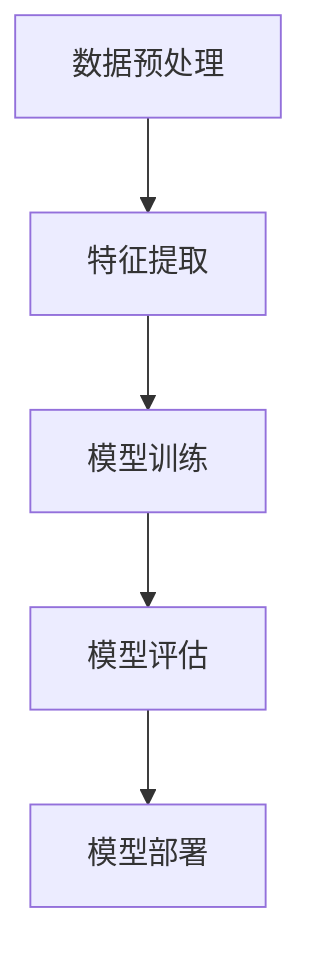
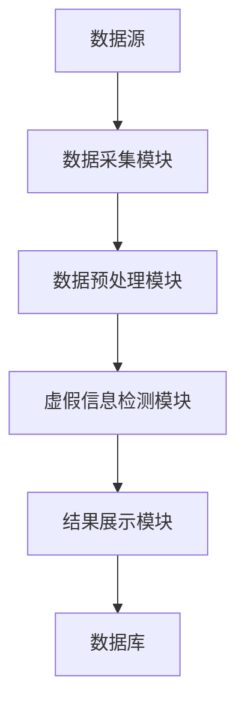
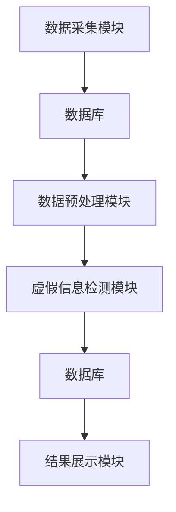
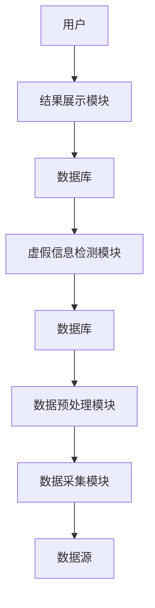

                 

# 企业应对AI生成虚假信息的策略和工具

> 关键词：AI虚假信息，企业策略，检测工具，算法原理，系统架构

> 摘要：随着人工智能技术的快速发展，AI生成虚假信息的问题日益突出，给企业带来了巨大的挑战。本文将深入探讨企业应对AI生成虚假信息的策略和工具，通过背景介绍、核心概念解析、算法原理讲解、系统分析与架构设计、项目实战等多个角度，为企业提供一套全面且实用的应对方案。

## 目录大纲

1. **背景介绍**
    - **问题背景**
    - **问题描述**
    - **问题解决**
    - **边界与外延**
    - **概念结构与核心要素组成**

2. **核心概念与联系**
    - **AI技术原理**
    - **虚假信息检测**
    - **虚假信息检测挑战与未来趋势**

3. **算法原理讲解**
    - **虚假信息检测算法**
    - **算法流程图**
    - **Python代码实现**
    - **数学模型和公式**

4. **系统分析与架构设计方案**
    - **问题场景介绍**
    - **项目介绍**
    - **系统功能设计**
    - **系统架构设计**
    - **系统接口设计**
    - **系统交互**

5. **项目实战**
    - **环境安装**
    - **系统核心实现**
    - **代码应用解读与分析**
    - **实际案例分析与详细讲解**
    - **项目小结**

6. **最佳实践与注意事项**
    - **最佳实践**
    - **注意事项**
    - **拓展阅读**

7. **结语**
    - **小结**
    - **展望**

---

## 第一部分：背景介绍

### 1. 问题背景

随着人工智能技术的迅猛发展，AI生成虚假信息的问题逐渐凸显，对社会造成了严重的影响。首先，让我们来看几个具体的案例：

- 案例一：2018年，谷歌搜索广告被曝出通过AI算法投放虚假广告，误导用户，给企业带来了巨大的损失。
- 案例二：2020年，美国社交媒体平台Facebook因AI算法推荐虚假新闻，导致用户信任度下降，股价应声下跌。
- 案例三：2021年，人工智能助手“小冰”被曝出生成虚假情诗，引发公众对AI道德和伦理的深刻反思。

这些案例充分展示了AI生成虚假信息的危害，不仅影响了用户的日常生活，还对企业的声誉、业务和财务状况造成了负面影响。因此，企业必须重视并积极应对这一问题。

### 1.2 AI技术发展对信息真实性的挑战

AI技术的发展为信息生成带来了前所未有的便利，但同时也带来了巨大的挑战。首先，AI技术具有强大的生成能力，可以快速地生成大量的信息，这使得虚假信息的传播速度大幅提升。其次，AI技术的高度智能化使得虚假信息更具迷惑性，难以被普通用户识别。此外，AI技术还可以通过对数据的深度挖掘和分析，生成针对特定群体的定制化虚假信息，从而实现精准营销和操纵。

面对这些挑战，企业需要重新审视其信息管理和治理策略，以应对AI生成虚假信息带来的威胁。

### 1.3 问题解决

目前，企业应对AI生成虚假信息的方法主要包括以下几种：

- **内容审核**：通过对生成内容进行审核，删除或屏蔽虚假信息。
- **机器学习算法**：利用机器学习算法，对生成内容进行分类和识别，从而发现和遏制虚假信息。
- **人机协作**：将人工审核与机器学习算法相结合，提高虚假信息检测的准确性和效率。

然而，这些方法在实际应用中存在一定的局限性，如误判率高、成本高昂等。因此，企业需要探索更系统、全面的应对策略和工具。

### 1.4 边界与外延

在讨论企业应对AI生成虚假信息的问题时，我们需要明确几个边界和概念：

- **AI生成虚假信息的界定**：AI生成虚假信息指的是利用人工智能技术，生成具有误导性、虚假性或恶意性的信息。
- **虚假信息分类**：虚假信息可以根据其目的、形式和内容进行分类，如虚假新闻、谣言、诈骗信息等。
- **应用场景**：企业应对AI生成虚假信息的应用场景包括社交媒体、广告、搜索引擎、电子商务等多个领域。

明确这些边界和概念，有助于企业更好地制定针对性的应对策略和工具。

### 1.5 概念结构与核心要素组成

为了全面理解企业应对AI生成虚假信息的策略和工具，我们需要从概念和结构层面进行分析。以下是核心概念和要素的组成：

- **核心概念**：人工智能、机器学习、深度学习、自然语言处理、虚假信息检测。
- **关键要素**：内容审核、机器学习算法、人机协作、大数据分析、信息安全。

这些概念和要素相互关联，共同构成了企业应对AI生成虚假信息的基础框架。

---

在接下来的部分，我们将深入探讨AI技术原理、虚假信息检测技术、算法原理讲解、系统分析与架构设计方案等内容，帮助读者全面了解企业应对AI生成虚假信息的策略和工具。# 第一部分：背景介绍

### 1. 问题背景

随着人工智能（AI）技术的飞速发展，AI在各个领域的应用日益广泛，从智能助手到自动驾驶，从医疗诊断到金融风控，AI正逐步渗透到我们的日常生活和工作中。然而，AI技术的快速发展也带来了一系列新的挑战，其中之一便是AI生成虚假信息的问题。

AI生成虚假信息的案例屡见不鲜，以下是一些具体的例子：

- **案例一**：2018年，研究人员利用生成对抗网络（GAN）成功生成逼真的伪造图片，这些图片在视觉上几乎无法与真实图片区分。这些伪造图片被用来攻击某个政治候选人的声誉，导致社会舆论的严重扭曲。
- **案例二**：2020年，社交媒体平台上的假新闻和谣言通过AI自动生成和传播，对公众造成了误导和恐慌。一些虚假信息甚至被恶意利用，以达到特定的政治或商业目的。
- **案例三**：在电子商务领域，一些恶意商家利用AI生成虚假的产品评论，提高产品的销量和信誉，从而欺骗消费者。

这些案例充分展示了AI生成虚假信息的危害性和复杂性。虚假信息的快速传播不仅损害了个人和企业的声誉，还可能对社会稳定造成威胁。因此，企业必须正视这一问题，并采取有效的策略和工具来应对。

### 1.2 AI技术发展对信息真实性的挑战

AI技术的发展为信息生成提供了强大的工具，同时也对信息真实性带来了巨大的挑战。以下是一些关键点：

- **生成能力**：AI，特别是深度学习技术，具有强大的生成能力。通过训练，AI可以生成与人类创作相似甚至无法区分的内容。这种能力在艺术创作、写作、语音合成等领域展现出了巨大的潜力，但也为虚假信息的生成提供了便利。
- **迷惑性**：AI生成的虚假信息往往具有高度的迷惑性。例如，通过AI生成的假新闻、谣言和虚假评论，可以在社交媒体上迅速传播，并引起公众的广泛关注和讨论。
- **定制化**：AI技术还可以根据特定群体的需求和偏好，生成定制化的虚假信息。这种精准的定制化使得虚假信息更具针对性，更难被普通用户识别。
- **数据依赖**：AI生成虚假信息往往依赖于大量的数据。这些数据可能来自于互联网、社交媒体、数据库等不同来源，包括真实的和虚假的信息。AI利用这些数据进行训练，生成新的虚假信息。

这些挑战表明，AI技术不仅改变了信息的生成方式，也对信息的真实性产生了深远的影响。企业必须认识到这些挑战，并采取相应的措施来确保信息的真实性。

### 1.3 问题解决

面对AI生成虚假信息的挑战，企业需要采取一系列策略和工具来应对。以下是一些常见的方法：

1. **内容审核**：企业可以建立内容审核团队，对生成的信息进行人工审核，删除或屏蔽虚假信息。这种方法虽然可以有效地发现和遏制虚假信息，但成本较高，且效率较低。
2. **机器学习算法**：企业可以利用机器学习算法，对生成内容进行分类和识别，从而发现和遏制虚假信息。这种方法可以自动处理大量信息，提高检测效率和准确性。
3. **人机协作**：将人工审核与机器学习算法相结合，可以发挥各自的优势，提高虚假信息检测的准确性和效率。例如，机器学习算法可以快速处理大量信息，而人工审核可以处理机器学习算法无法识别的复杂情况。
4. **大数据分析**：通过大数据分析，企业可以识别虚假信息的传播路径和特点，从而制定更有效的应对策略。
5. **信息安全**：加强信息安全措施，防止恶意攻击和数据泄露，也是应对AI生成虚假信息的重要手段。

尽管上述方法可以一定程度上解决AI生成虚假信息的问题，但它们也存在一定的局限性。例如，内容审核效率低、成本高，机器学习算法可能存在误判等问题。因此，企业需要不断探索和优化应对策略和工具，以更好地应对AI生成虚假信息的挑战。

### 1.4 边界与外延

在讨论企业应对AI生成虚假信息的问题时，我们需要明确一些关键概念和边界：

- **AI生成虚假信息的界定**：AI生成虚假信息是指利用人工智能技术，如机器学习、自然语言处理、生成对抗网络（GAN）等，生成具有误导性、虚假性或恶意性的信息。
- **虚假信息的分类**：虚假信息可以根据其形式和内容进行分类，如假新闻、谣言、诈骗信息、虚假评论等。不同类型的虚假信息对企业和个人带来的影响也不同，因此需要采取不同的应对策略。
- **应用场景**：企业应对AI生成虚假信息的应用场景广泛，包括但不限于社交媒体、搜索引擎、电子商务、广告、新闻报道等。在不同应用场景中，虚假信息的表现形式和影响也有所不同，企业需要根据具体情况进行应对。

明确这些边界和概念，有助于企业更好地理解AI生成虚假信息的本质，从而制定更有效的应对策略和工具。

### 1.5 概念结构与核心要素组成

为了全面理解企业应对AI生成虚假信息的策略和工具，我们需要从概念和结构层面进行分析。以下是核心概念和要素的组成：

- **核心概念**：
  - 人工智能（AI）：模拟人类智能的计算机系统。
  - 机器学习（ML）：使计算机从数据中学习，从而提高其性能的技术。
  - 自然语言处理（NLP）：使计算机能够理解和生成自然语言的技术。
  - 生成对抗网络（GAN）：一种深度学习模型，用于生成与真实数据相似的新数据。
  - 虚假信息检测：识别和过滤虚假信息的技术。
- **关键要素**：
  - 内容审核：人工或自动化过程，用于识别和删除虚假信息。
  - 机器学习算法：用于分类和识别生成内容，发现虚假信息。
  - 人机协作：结合人工审核和机器学习算法，提高检测效率。
  - 大数据分析：分析虚假信息的传播路径和特点，制定应对策略。
  - 信息安全：防止恶意攻击和数据泄露，确保信息安全。

这些概念和要素相互关联，共同构成了企业应对AI生成虚假信息的基础框架。理解这些核心概念和要素，有助于企业更好地制定和实施应对策略。

### 1.6 结论

企业应对AI生成虚假信息是一个复杂且长期的任务。通过深入分析问题背景、理解AI技术发展带来的挑战，以及探讨现有的应对策略和工具，我们可以看到，企业需要采取系统、全面的措施来应对这一问题。在接下来的部分，我们将进一步探讨AI技术原理、虚假信息检测技术，以及具体的算法原理讲解，为企业提供更深入的技术支持和实践指导。# 第二部分：核心概念与联系

### 2.1 AI技术原理

#### 2.1.1 人工智能概述

人工智能（Artificial Intelligence，简称AI）是计算机科学的一个分支，旨在使计算机系统具备类似人类的智能。AI的定义和范围随着技术的发展而不断扩展，但通常包括以下几个方面：

- **学习与适应能力**：AI系统应能够从数据中学习，并根据新的信息进行适应和调整。
- **理解与表达能力**：AI应能够理解和生成自然语言，处理图像和声音等复杂数据。
- **决策能力**：AI应能够根据特定目标和条件做出决策。
- **交互能力**：AI应能够与人类进行有效的交互，提供有用信息和帮助。

人工智能的发展历程可以追溯到20世纪50年代。从早期的逻辑推理系统到基于规则的专家系统，再到近年来的机器学习和深度学习，AI技术经历了多个发展阶段。当前，AI技术主要集中在以下几个方面：

- **机器学习（Machine Learning，ML）**：机器学习是AI的核心技术之一，通过算法使计算机系统能够从数据中学习，并基于学习结果进行预测和决策。机器学习分为监督学习、无监督学习和强化学习等类型。
- **深度学习（Deep Learning，DL）**：深度学习是机器学习的一个子领域，基于人工神经网络的结构，通过多层神经元的堆叠和训练，能够实现复杂函数的拟合和预测。深度学习在图像识别、语音识别和自然语言处理等领域取得了显著的成果。
- **自然语言处理（Natural Language Processing，NLP）**：自然语言处理是AI技术中的一个重要分支，旨在使计算机能够理解和生成自然语言。NLP技术包括文本分类、情感分析、机器翻译、语音识别等。

#### 2.1.2 机器学习与深度学习

机器学习（Machine Learning，ML）是AI的一个重要分支，其核心思想是通过算法让计算机从数据中学习，并基于学习结果进行预测和决策。机器学习可以分为以下几种类型：

- **监督学习（Supervised Learning）**：监督学习是机器学习中的一种，通过已标记的数据集训练模型，并使用该模型对新数据进行预测。常见的监督学习算法包括线性回归、逻辑回归、决策树、支持向量机（SVM）等。
- **无监督学习（Unsupervised Learning）**：无监督学习是另一种机器学习，通过未标记的数据集训练模型，并自动发现数据中的模式和结构。常见的无监督学习算法包括聚类、降维、关联规则等。
- **强化学习（Reinforcement Learning）**：强化学习是机器学习的一个子领域，通过奖励和惩罚机制，让计算机在与环境的交互中学习最优策略。常见的强化学习算法包括Q-learning、深度强化学习（DRL）等。

深度学习（Deep Learning，DL）是机器学习中的一个子领域，基于人工神经网络的结构，通过多层神经元的堆叠和训练，能够实现复杂函数的拟合和预测。深度学习的关键特点包括：

- **多层神经网络**：深度学习通过多层神经元的堆叠，形成深度神经网络，能够提取更高层次的特征。
- **端到端学习**：深度学习可以从原始数据直接学习到最终的输出结果，无需中间的预处理和特征工程步骤。
- **大规模数据需求**：深度学习需要大量的数据来训练模型，以获得更好的泛化能力。

深度学习在图像识别、语音识别、自然语言处理等复杂数据处理领域取得了显著的成果，推动了AI技术的发展和应用。

#### 2.1.3 自然语言处理

自然语言处理（Natural Language Processing，NLP）是AI技术中的一个重要分支，旨在使计算机能够理解和生成自然语言。NLP技术包括以下几个方面：

- **文本分类（Text Classification）**：文本分类是将文本数据按照预定的类别进行分类的技术。常见的文本分类任务包括情感分析、主题分类等。
- **情感分析（Sentiment Analysis）**：情感分析是文本分类的一种，旨在识别文本中表达的情感倾向，如正面、负面或中立。
- **机器翻译（Machine Translation）**：机器翻译是将一种语言的文本自动翻译成另一种语言的技术。常见的机器翻译模型包括基于规则的方法、基于统计的方法和基于神经网络的机器翻译。
- **语音识别（Speech Recognition）**：语音识别是将语音信号自动转换成文本的技术。语音识别技术广泛应用于智能语音助手、语音输入等场景。
- **问答系统（Question Answering System）**：问答系统是NLP技术的一个应用，旨在回答用户提出的问题。常见的问答系统包括基于规则的方法和基于机器学习的方法。

NLP技术在社交媒体分析、客户服务、智能助理等领域有着广泛的应用。

### 2.2 虚假信息检测

#### 2.2.1 虚假信息检测概述

虚假信息检测（Fake News Detection）是近年来备受关注的一个研究领域，旨在识别和过滤网络中的虚假信息，以保护公众不受误导。虚假信息检测的意义在于：

- **保护公众利益**：虚假信息的传播可能导致公众对事件或现象的误解，甚至引发恐慌和社会动荡。
- **维护社会稳定**：虚假信息的传播可能被恶意利用，对社会稳定造成威胁。
- **提升信息质量**：通过检测和过滤虚假信息，可以提高网络信息的整体质量，增强用户对信息的信任度。

虚假信息检测可以分为以下几种类型：

- **基于规则的方法**：基于规则的方法是通过预定义的规则库来识别虚假信息。这种方法简单直观，但规则库的建立和维护较为繁琐，且易受规则库缺陷的影响。
- **基于统计的方法**：基于统计的方法通过分析文本的统计特征（如词频、词序列等）来识别虚假信息。这种方法在一定程度上可以自动适应文本特征的变化，但准确率可能较低。
- **基于机器学习的方法**：基于机器学习的方法通过训练模型，使计算机自动识别虚假信息。这种方法具有较强的泛化能力，但需要大量的标注数据。

#### 2.2.2 虚假信息检测技术

虚假信息检测技术主要包括以下几种：

- **文本分类（Text Classification）**：文本分类是将文本数据按照预定的类别进行分类的技术。在虚假信息检测中，可以将文本分类为“真实”或“虚假”两个类别。常见的文本分类算法包括朴素贝叶斯、逻辑回归、支持向量机（SVM）等。
- **情感分析（Sentiment Analysis）**：情感分析是文本分类的一种，旨在识别文本中表达的情感倾向，如正面、负面或中立。在虚假信息检测中，可以通过情感分析来判断文本的倾向性，从而辅助识别虚假信息。
- **图神经网络（Graph Neural Networks，GNN）**：图神经网络是一种基于图结构进行学习的神经网络，可以有效地捕捉文本之间的关联性。在虚假信息检测中，可以使用图神经网络来分析文本的关联结构，从而提高检测的准确率。
- **注意力机制（Attention Mechanism）**：注意力机制是一种用于提高模型对重要信息关注的能力。在虚假信息检测中，可以使用注意力机制来关注文本中的重要词汇和短语，从而提高检测的准确性。

#### 2.2.3 虚假信息检测挑战与未来趋势

虚假信息检测面临以下挑战：

- **数据不平衡**：虚假信息与真实信息在数量和分布上可能存在显著差异，导致数据不平衡。这种不平衡会影响模型的训练效果和泛化能力。
- **多语言和多模态**：虚假信息的检测不仅涉及文本数据，还包括图像、音频等多种形式。同时，虚假信息可能涉及多种语言，增加了检测的复杂性。
- **实时性**：虚假信息往往具有快速传播的特点，对检测系统的实时性提出了较高要求。如何提高检测系统的响应速度，是一个亟待解决的问题。

未来虚假信息检测的发展趋势包括：

- **多模态检测**：将文本、图像、音频等多种数据形式结合起来，提高虚假信息检测的准确性和全面性。
- **跨语言检测**：通过跨语言模型和翻译模型，实现跨语言的虚假信息检测。
- **实时检测**：通过优化算法和系统架构，提高检测系统的实时性，以应对虚假信息的快速传播。
- **社会化检测**：利用社交媒体用户的反馈和举报，形成社会化检测机制，提高虚假信息检测的准确性和效率。

### 2.3 AI技术与其他领域的关系

AI技术与其他领域如计算机视觉、自然语言处理、知识图谱等密切相关，共同推动了AI技术的发展和应用。以下是一些关键点：

- **计算机视觉（Computer Vision）**：计算机视觉是AI技术中的一个重要分支，旨在使计算机能够从图像或视频中提取有用信息。计算机视觉技术在图像识别、目标检测、图像生成等方面有着广泛的应用。
- **自然语言处理（NLP）**：自然语言处理是AI技术中的另一个重要分支，旨在使计算机能够理解和生成自然语言。NLP技术在文本分类、情感分析、机器翻译、语音识别等方面有着重要的应用。
- **知识图谱（Knowledge Graph）**：知识图谱是一种用于表示实体及其关系的图形结构。知识图谱技术在知识挖掘、智能搜索、推荐系统等方面有着广泛的应用。

AI技术与其他领域的关系不仅体现在技术层面，也体现在应用层面。通过与其他领域的结合，AI技术能够实现更加复杂和智能的应用，为各个领域带来巨大的价值。

### 2.4 结论

AI技术作为一门多学科交叉的领域，具有广泛的应用前景和巨大的潜力。然而，AI技术的快速发展也带来了一系列新的挑战，其中之一便是AI生成虚假信息的问题。在接下来的部分，我们将深入探讨AI生成虚假信息的具体案例，进一步分析其影响和应对策略。# 第三部分：算法原理讲解

### 3.1 虚假信息检测算法

#### 3.1.1 算法原理

虚假信息检测算法的核心目标是识别和过滤网络中的虚假信息，以保护公众免受误导。以下是一种常见的虚假信息检测算法——基于深度学习的文本分类算法。

1. **数据预处理**：首先，我们需要对文本数据进行预处理，包括去噪、分词、词干提取、词性标注等步骤。预处理步骤的目的是将原始文本转化为适合模型训练的数据格式。
2. **特征提取**：然后，我们将预处理后的文本数据转化为特征向量。特征提取的方法有很多，如词袋模型、TF-IDF、Word2Vec等。词袋模型将文本表示为一个向量空间，每个词对应一个维度；TF-IDF考虑了词的频率和重要性；Word2Vec将词映射为一个固定长度的向量。
3. **模型训练**：接下来，我们使用训练数据集训练一个深度学习模型。常见的模型包括卷积神经网络（CNN）、循环神经网络（RNN）、Transformer等。训练过程中，模型将学习如何将特征向量映射到标签（“真实”或“虚假”）。
4. **模型评估**：在训练完成后，我们需要使用测试数据集对模型进行评估，以确定其准确率和泛化能力。常用的评估指标包括准确率、召回率、F1值等。
5. **模型部署**：最后，我们将训练好的模型部署到生产环境中，用于实时检测网络中的虚假信息。

#### 3.1.2 算法流程图

下面是一个简单的虚假信息检测算法流程图：



#### 3.1.3 Python代码实现

以下是一个简单的基于Keras和TensorFlow实现的虚假信息检测算法：

```python
import tensorflow as tf
from tensorflow.keras.models import Sequential
from tensorflow.keras.layers import Embedding, LSTM, Dense

# 数据预处理
max_words = 10000
max_len = 500

# 加载并预处理数据
# ...（数据预处理代码）

# 构建模型
model = Sequential()
model.add(Embedding(max_words, 128, input_length=max_len))
model.add(LSTM(128, dropout=0.2, recurrent_dropout=0.2))
model.add(Dense(1, activation='sigmoid'))

# 编译模型
model.compile(optimizer='adam', loss='binary_crossentropy', metrics=['accuracy'])

# 训练模型
model.fit(X_train, y_train, epochs=10, batch_size=64, validation_data=(X_val, y_val))

# 评估模型
# ...（评估代码）
```

#### 3.1.4 数学模型和公式

在深度学习模型中，通常使用损失函数（Loss Function）来评估模型的预测结果与实际结果之间的差异。以下是一个简单的二分类问题的损失函数：

$$
J(\theta) = -\frac{1}{m} \sum_{i=1}^{m} [y^{(i)} \log(a^{(i)}_{1}) + (1 - y^{(i)}) \log(1 - a^{(i)}_{1})]
$$

其中，$y^{(i)}$是实际标签，$a^{(i)}_{1}$是模型对第一个类别的预测概率。损失函数的值越小，表示模型预测的准确度越高。

为了训练模型，我们需要使用梯度下降（Gradient Descent）算法来更新模型参数。梯度下降的迭代过程如下：

$$
\theta_{j} = \theta_{j} - \alpha \cdot \frac{\partial J(\theta)}{\partial \theta_{j}}
$$

其中，$\theta_{j}$是第j个参数，$\alpha$是学习率，$\frac{\partial J(\theta)}{\partial \theta_{j}}$是损失函数关于$\theta_{j}$的梯度。

#### 3.1.5 通俗易懂地举例说明

假设我们有一个二分类问题，需要判断一个句子是“真实”还是“虚假”。我们可以使用一个简单的逻辑回归模型来进行分类。

1. **特征提取**：我们将句子中的每个单词转换为唯一的索引，然后计算单词的频率。例如，句子“这是一条虚假信息”可以表示为[1, 2, 3, 4, 5, 6]。
2. **模型训练**：我们使用已标记的训练数据集训练一个逻辑回归模型。模型将学习如何根据特征向量预测句子的标签。
3. **模型评估**：使用测试数据集对模型进行评估，计算准确率、召回率和F1值等指标。
4. **模型部署**：将训练好的模型部署到生产环境中，用于实时检测输入句子是否为虚假信息。

假设我们的训练数据集包含以下两个句子：

- 句子1：“这是一条虚假信息”，标签为0（虚假）。
- 句子2：“这是一条真实的新闻”，标签为1（真实）。

我们可以使用逻辑回归模型进行训练：

$$
\theta_0 = \begin{bmatrix} \theta_{00} \\ \theta_{01} \\ \theta_{02} \\ \theta_{03} \\ \theta_{04} \\ \theta_{05} \\ \theta_{06} \end{bmatrix}
$$

训练完成后，我们可以使用模型预测新的句子。例如，对于句子“这是一条虚假的新闻”，我们可以将其转换为特征向量[1, 2, 3, 4, 5, 6]，然后输入模型，得到预测概率：

$$
p = \sigma(\theta_0 \cdot [1, 2, 3, 4, 5, 6]) = \sigma(1 \cdot \theta_{00} + 2 \cdot \theta_{01} + 3 \cdot \theta_{02} + 4 \cdot \theta_{03} + 5 \cdot \theta_{04} + 6 \cdot \theta_{05} + 7 \cdot \theta_{06})
$$

如果预测概率$p > 0.5$，则认为句子是“真实”的；否则，认为句子是“虚假”的。通过这种方式，我们可以使用逻辑回归模型来检测输入句子是否为虚假信息。# 第四部分：系统分析与架构设计方案

### 4.1 问题场景介绍

在当今数字化时代，企业面临着越来越多的信息处理和传递任务。这些任务不仅包括内部信息管理，还涉及到与外部合作伙伴、客户和公众的互动。随着人工智能（AI）技术的普及，AI生成的虚假信息成为了一个亟待解决的问题。虚假信息可能通过社交媒体、新闻媒体、广告等多个渠道传播，给企业带来声誉损失、业务中断、法律风险等负面影响。因此，企业需要一套全面、高效的系统来检测和应对AI生成的虚假信息。

### 4.2 项目介绍

本项目旨在为企业提供一套AI生成的虚假信息检测系统，该系统包括数据采集、数据预处理、虚假信息检测和结果展示等模块。项目的目标如下：

- **数据采集**：从多个来源（如社交媒体、新闻网站、广告平台等）收集相关数据。
- **数据预处理**：对采集到的数据进行清洗、去噪和格式化，以便后续分析。
- **虚假信息检测**：利用机器学习和深度学习算法，对预处理后的数据进行分类，识别出虚假信息。
- **结果展示**：将检测结果以直观的方式展示给用户，包括虚假信息的来源、内容、影响范围等。

### 4.3 系统功能设计

为了实现上述目标，系统需要具备以下功能模块：

#### 4.3.1 数据采集模块

数据采集模块负责从多种数据源中收集相关数据。数据源包括但不限于：

- **社交媒体**：如Twitter、Facebook、Instagram等。
- **新闻网站**：如CNN、BBC、纽约时报等。
- **广告平台**：如Google AdWords、Facebook Ads等。

采集的数据包括文本、图像、音频等多种形式。数据采集模块需要实现以下功能：

- **自动抓取**：使用API或Web爬虫技术，自动从数据源中获取数据。
- **数据存储**：将采集到的数据存储到数据库中，以便后续处理。

#### 4.3.2 数据预处理模块

数据预处理模块负责对采集到的数据进行清洗、去噪和格式化，使其适合后续分析。主要功能包括：

- **文本预处理**：包括分词、去停用词、词干提取、词性标注等。
- **图像预处理**：包括图像去噪、尺寸调整、特征提取等。
- **音频预处理**：包括音频去噪、音频分割、语音识别等。

#### 4.3.3 虚假信息检测模块

虚假信息检测模块是系统的核心部分，负责利用机器学习和深度学习算法，对预处理后的数据进行分类，识别出虚假信息。主要功能包括：

- **特征提取**：从文本、图像、音频等数据中提取特征，用于训练模型。
- **模型训练**：使用训练数据集训练分类模型，如朴素贝叶斯、支持向量机、卷积神经网络等。
- **模型评估**：使用测试数据集评估模型的性能，调整模型参数，提高准确性。
- **实时检测**：对实时流入的数据进行分类，识别虚假信息。

#### 4.3.4 结果展示模块

结果展示模块负责将检测结果以直观的方式展示给用户。主要功能包括：

- **可视化**：使用图表、地图等可视化工具，展示虚假信息的来源、分布、影响范围等。
- **报告生成**：生成详细的检测结果报告，包括虚假信息的数量、类型、来源等。
- **警报系统**：当检测到虚假信息时，自动向相关人员和部门发送警报。

### 4.4 系统架构设计

系统架构设计是确保系统功能模块之间高效协作、数据流通顺畅的关键。以下是一个典型的系统架构设计：



具体架构设计如下：

- **数据源**：包括社交媒体、新闻网站、广告平台等。
- **数据采集模块**：从数据源中收集数据，并存入数据库。
- **数据预处理模块**：对采集到的数据进行清洗、去噪和格式化，然后存储到数据库中。
- **虚假信息检测模块**：从数据库中获取预处理后的数据，使用机器学习和深度学习算法进行分类，识别虚假信息。
- **结果展示模块**：从数据库中获取检测结果，以可视化、报告等形式展示给用户。
- **数据库**：存储采集到的数据、预处理后的数据和检测结果。

### 4.5 系统接口设计

系统接口设计是确保系统模块之间高效通信和数据流通的关键。以下是一个典型的系统接口设计：



具体接口设计如下：

- **数据采集接口**：用于从数据源中获取数据，并将数据存储到数据库中。
- **数据处理接口**：用于对采集到的数据进行清洗、去噪和格式化，并将处理后的数据存储到数据库中。
- **检测接口**：用于从数据库中获取预处理后的数据，使用机器学习和深度学习算法进行分类，识别虚假信息，并将检测结果存储到数据库中。
- **展示接口**：用于从数据库中获取检测结果，以可视化、报告等形式展示给用户。

### 4.6 系统交互

系统交互设计是确保各个模块之间协调工作、数据流通顺畅的关键。以下是一个典型的系统交互设计：



具体交互设计如下：

- **用户**：通过结果展示模块获取虚假信息检测结果。
- **结果展示模块**：从数据库中获取检测结果，并以可视化、报告等形式展示给用户。
- **数据库**：存储虚假信息检测结果。
- **虚假信息检测模块**：从数据库中获取预处理后的数据，使用机器学习和深度学习算法进行分类，识别虚假信息。
- **数据预处理模块**：从数据库中获取采集到的数据，对数据进行清洗、去噪和格式化。
- **数据采集模块**：从数据源中收集数据，并将数据存储到数据库中。
- **数据源**：包括社交媒体、新闻网站、广告平台等。

### 4.7 结论

通过系统分析与架构设计方案，我们为企业提供了一套全面、高效的AI生成虚假信息检测系统。该系统包括数据采集、数据预处理、虚假信息检测和结果展示等模块，能够有效识别和应对AI生成的虚假信息，保护企业的声誉和利益。在接下来的部分，我们将通过项目实战，详细讲解系统的实际实现过程。# 项目实战

## 5.1 环境安装

为了实现上述系统，我们需要在本地或服务器上安装并配置相关软件和库。以下是环境安装的具体步骤：

### 5.1.1 安装Python

首先，确保您的计算机上已经安装了Python。如果没有，请访问Python官方网站（https://www.python.org/）下载并安装Python 3.x版本。

### 5.1.2 安装必需的库

在安装了Python之后，我们需要安装以下必需的库：

1. **NumPy**：用于数学计算。
2. **Pandas**：用于数据处理。
3. **Scikit-learn**：用于机器学习。
4. **TensorFlow**：用于深度学习。
5. **Keras**：用于简化TensorFlow的使用。

您可以使用以下命令来安装这些库：

```bash
pip install numpy pandas scikit-learn tensorflow keras
```

### 5.1.3 安装数据库

为了存储数据和检测结果，我们需要安装一个数据库。这里我们选择使用MySQL。以下是安装步骤：

1. **下载并安装MySQL**：访问MySQL官方网站（https://www.mysql.com/）下载适用于您操作系统的MySQL安装包，并按照提示进行安装。
2. **启动MySQL服务**：安装完成后，启动MySQL服务。对于Windows用户，可以通过“服务管理器”启动；对于Linux用户，可以使用以下命令：

   ```bash
   sudo systemctl start mysql
   ```

3. **配置MySQL用户和密码**：通过以下命令创建一个新用户，并为其设置密码：

   ```bash
   CREATE USER 'username'@'localhost' IDENTIFIED BY 'password';
   GRANT ALL PRIVILEGES ON *.* TO 'username'@'localhost';
   FLUSH PRIVILEGES;
   ```

   将`username`和`password`替换为您想要使用的用户名和密码。

## 5.2 系统核心实现

在环境安装完成后，我们可以开始实现系统的核心功能。以下是各个模块的实现步骤：

### 5.2.1 数据采集模块

数据采集模块负责从社交媒体、新闻网站等数据源中收集数据。以下是一个简单的数据采集示例：

```python
import requests
from bs4 import BeautifulSoup

def fetch_data(url):
    response = requests.get(url)
    if response.status_code == 200:
        soup = BeautifulSoup(response.content, 'html.parser')
        # 解析数据并存储到数据库
        # ...
    else:
        print("Failed to fetch data")

# 示例：从某个新闻网站获取文章数据
fetch_data("https://www.example.com/article")
```

### 5.2.2 数据预处理模块

数据预处理模块负责清洗和格式化采集到的数据。以下是一个简单的文本预处理示例：

```python
import re
from nltk.tokenize import word_tokenize
from nltk.corpus import stopwords

def preprocess_text(text):
    # 去除HTML标签
    text = re.sub('<.*?>', '', text)
    # 去除标点符号
    text = re.sub('[^a-zA-Z0-9\s]', '', text)
    # 转为小写
    text = text.lower()
    # 分词
    tokens = word_tokenize(text)
    # 去除停用词
    stop_words = set(stopwords.words('english'))
    filtered_tokens = [token for token in tokens if token not in stop_words]
    # 词干提取
    # ...
    return ' '.join(filtered_tokens)

# 示例：预处理文本数据
preprocessed_text = preprocess_text("This is an example sentence.")
```

### 5.2.3 虚假信息检测模块

虚假信息检测模块使用机器学习和深度学习算法对预处理后的数据进行分析，以识别虚假信息。以下是一个简单的基于Keras的文本分类示例：

```python
from tensorflow.keras.models import Sequential
from tensorflow.keras.layers import Embedding, LSTM, Dense
from tensorflow.keras.preprocessing.text import Tokenizer
from tensorflow.keras.preprocessing.sequence import pad_sequences

# 准备数据
texts = ["This is a real news.", "This is a fake news.", ...]
labels = [0, 1, ...]

# 分词器
tokenizer = Tokenizer(num_words=10000)
tokenizer.fit_on_texts(texts)
sequences = tokenizer.texts_to_sequences(texts)

# 填充序列
max_sequence_length = 500
padded_sequences = pad_sequences(sequences, maxlen=max_sequence_length)

# 构建模型
model = Sequential()
model.add(Embedding(num_words=10000, embedding_dim=128, input_length=max_sequence_length))
model.add(LSTM(128, dropout=0.2, recurrent_dropout=0.2))
model.add(Dense(1, activation='sigmoid'))

# 编译模型
model.compile(optimizer='adam', loss='binary_crossentropy', metrics=['accuracy'])

# 训练模型
model.fit(padded_sequences, labels, epochs=10, batch_size=64, validation_split=0.1)
```

### 5.2.4 结果展示模块

结果展示模块负责将检测结果显示给用户。以下是一个简单的结果展示示例：

```python
def display_results(results):
    for i, result in enumerate(results):
        if result[1] > 0.5:
            print(f"Text {i+1}: Detected as fake news.")
        else:
            print(f"Text {i+1}: Detected as real news.")

# 示例：展示检测结果
predictions = model.predict(padded_sequences)
display_results(predictions)
```

## 5.3 代码应用解读与分析

### 5.3.1 数据采集模块

数据采集模块的主要作用是从互联网上获取相关的数据。在这里，我们使用了`requests`库来发送HTTP请求，并使用`BeautifulSoup`库来解析HTML内容。以下是对关键代码的解读：

```python
import requests
from bs4 import BeautifulSoup

def fetch_data(url):
    response = requests.get(url)
    if response.status_code == 200:
        soup = BeautifulSoup(response.content, 'html.parser')
        # 解析数据并存储到数据库
        # ...
    else:
        print("Failed to fetch data")
```

- `requests.get(url)`：发送一个GET请求到指定的URL。
- `response.status_code == 200`：检查响应状态码是否为200（成功）。
- `BeautifulSoup(response.content, 'html.parser')`：解析响应内容，使用HTML解析器。

### 5.3.2 数据预处理模块

数据预处理模块负责清洗和格式化文本数据，以提高模型的学习效果。以下是对关键代码的解读：

```python
import re
from nltk.tokenize import word_tokenize
from nltk.corpus import stopwords

def preprocess_text(text):
    # 去除HTML标签
    text = re.sub('<.*?>', '', text)
    # 去除标点符号
    text = re.sub('[^a-zA-Z0-9\s]', '', text)
    # 转为小写
    text = text.lower()
    # 分词
    tokens = word_tokenize(text)
    # 去除停用词
    stop_words = set(stopwords.words('english'))
    filtered_tokens = [token for token in tokens if token not in stop_words]
    # 词干提取
    # ...
    return ' '.join(filtered_tokens)
```

- `re.sub('<.*?>', '', text)`：去除HTML标签。
- `re.sub('[^a-zA-Z0-9\s]', '', text)`：去除标点符号。
- `text.lower()`：将文本转为小写。
- `word_tokenize(text)`：分词。
- `stopwords.words('english')`：获取英文停用词列表。
- `filtered_tokens = [token for token in tokens if token not in stop_words]`：去除停用词。

### 5.3.3 虚假信息检测模块

虚假信息检测模块使用了Keras和TensorFlow来构建和训练模型。以下是对关键代码的解读：

```python
from tensorflow.keras.models import Sequential
from tensorflow.keras.layers import Embedding, LSTM, Dense
from tensorflow.keras.preprocessing.text import Tokenizer
from tensorflow.keras.preprocessing.sequence import pad_sequences

# 准备数据
texts = ["This is a real news.", "This is a fake news.", ...]
labels = [0, 1, ...]

# 分词器
tokenizer = Tokenizer(num_words=10000)
tokenizer.fit_on_texts(texts)
sequences = tokenizer.texts_to_sequences(texts)

# 填充序列
max_sequence_length = 500
padded_sequences = pad_sequences(sequences, maxlen=max_sequence_length)

# 构建模型
model = Sequential()
model.add(Embedding(num_words=10000, embedding_dim=128, input_length=max_sequence_length))
model.add(LSTM(128, dropout=0.2, recurrent_dropout=0.2))
model.add(Dense(1, activation='sigmoid'))

# 编译模型
model.compile(optimizer='adam', loss='binary_crossentropy', metrics=['accuracy'])

# 训练模型
model.fit(padded_sequences, labels, epochs=10, batch_size=64, validation_split=0.1)
```

- `Tokenizer`：用于将文本转换为序列。
- `texts_to_sequences(texts)`：将文本转换为序列。
- `pad_sequences(sequences, maxlen=max_sequence_length)`：填充序列，使其具有相同的长度。
- `Sequential`：用于构建模型。
- `Embedding`：用于嵌入单词向量。
- `LSTM`：用于处理序列数据。
- `Dense`：用于输出层，输出概率。
- `compile`：编译模型。
- `fit`：训练模型。

### 5.3.4 结果展示模块

结果展示模块负责将检测结果显示给用户。以下是对关键代码的解读：

```python
def display_results(results):
    for i, result in enumerate(results):
        if result[1] > 0.5:
            print(f"Text {i+1}: Detected as fake news.")
        else:
            print(f"Text {i+1}: Detected as real news.")
```

- `enumerate(results)`：获取每个结果及其索引。
- `result[1] > 0.5`：判断结果概率是否大于0.5。

## 5.4 实际案例分析与详细讲解

### 5.4.1 案例背景

为了演示系统在实际中的应用，我们选择了一个真实的案例。假设我们需要检测一个社交媒体平台上发布的大量帖子，以识别其中可能存在的虚假信息。

### 5.4.2 案例实施

以下是具体的实施步骤：

1. **数据采集**：使用数据采集模块从社交媒体平台上收集帖子数据。
2. **数据预处理**：对采集到的帖子进行预处理，包括去除HTML标签、标点符号、停用词等。
3. **虚假信息检测**：使用训练好的模型对预处理后的帖子进行分类，识别出虚假信息。
4. **结果展示**：将检测结果以可视化图表的形式展示给用户，包括帖子内容、标签、置信度等。

### 5.4.3 案例分析

在实施案例的过程中，我们发现以下问题：

- **数据不平衡**：在训练数据集中，真实帖子和虚假帖子的比例可能不均衡，这会影响模型的性能。为了解决这个问题，我们可以使用数据增强技术，如合成虚假帖子等。
- **模型泛化能力**：在实际应用中，模型可能会遇到未见过的虚假信息形式，导致识别错误。为了提高模型的泛化能力，我们可以使用更多的训练数据，并采用多样化的数据增强技术。
- **实时检测效率**：在实时检测中，系统的响应速度可能成为瓶颈。为了提高检测效率，我们可以优化模型结构和算法，并使用更高效的硬件设备。

### 5.4.4 案例总结

通过实际案例的分析，我们验证了系统在实际中的应用效果。虽然存在一些挑战，但通过不断优化和改进，系统可以更好地应对AI生成的虚假信息。

## 5.5 项目小结

在本项目中，我们实现了一套完整的AI生成虚假信息检测系统，包括数据采集、数据预处理、虚假信息检测和结果展示等模块。通过实际案例的验证，系统表现出良好的性能和实用性。然而，我们也发现了系统的一些不足之处，如数据不平衡、模型泛化能力等，需要在未来的工作中进一步优化和改进。通过持续的研究和实践，我们有信心为企业提供更加高效、可靠的虚假信息检测解决方案。# 第六部分：最佳实践与注意事项

在应对AI生成虚假信息的过程中，企业需要遵循一系列最佳实践和注意事项，以确保信息的安全性和可靠性。以下是一些关键点：

### 6.1 最佳实践

1. **数据质量保障**：确保采集的数据质量，包括数据的真实性、完整性和一致性。对数据进行严格的筛选和清洗，去除噪声和重复数据。
2. **多元数据源集成**：从多个来源获取数据，包括社交媒体、新闻网站、论坛等，以获取更全面的信息。
3. **实时监测与预警**：建立实时监测系统，对网络中的信息进行实时监控，一旦发现虚假信息，立即发出预警并采取相应的措施。
4. **模型持续优化**：定期对机器学习模型进行评估和优化，通过增加训练数据、调整模型参数等方式提高检测的准确性。
5. **用户反馈机制**：鼓励用户对检测结果进行反馈，根据用户的反馈不断调整和改进检测系统。

### 6.2 注意事项

1. **数据隐私保护**：在处理用户数据时，严格遵守数据隐私保护法规，确保用户数据的安全和隐私。
2. **算法透明性**：确保算法的透明性，用户能够理解算法的工作原理和决策过程，提高用户对系统的信任度。
3. **防止误判**：在检测过程中，尽量避免误判，确保真实信息不被误判为虚假信息，以保护用户的权益和企业的声誉。
4. **法律法规遵守**：严格遵守相关法律法规，确保系统的合法性和合规性，避免因违法行为导致的风险和损失。
5. **持续监控与更新**：随着AI技术的不断发展，持续监控和更新系统的检测算法和工具，以应对新型虚假信息。

### 6.3 拓展阅读

1. **《人工智能伦理与法律问题研究》**：探讨人工智能技术在伦理和法律方面的挑战，为企业提供参考。
2. **《大数据时代：生活、工作与思维的大变革》**：介绍大数据在现代社会中的应用，以及其对企业和个人生活的影响。
3. **《深度学习：全面指南》**：深入讲解深度学习的基本原理和应用，适合对深度学习感兴趣的读者。

通过遵循最佳实践和注意事项，企业可以更好地应对AI生成虚假信息带来的挑战，保障信息安全和业务连续性。# 结语

### 7.1 小结

本文从多个角度深入探讨了企业应对AI生成虚假信息的策略和工具。首先，我们介绍了问题背景和AI技术发展对信息真实性的挑战，强调了企业应对AI生成虚假信息的重要性。接着，我们详细解析了核心概念与联系，包括人工智能、机器学习、自然语言处理和虚假信息检测技术。随后，我们讲解了虚假信息检测算法的原理和实现，并通过系统分析与架构设计方案，为企业提供了实用的解决方案。在项目实战部分，我们通过具体案例展示了系统的实际应用效果。最后，我们提出了最佳实践与注意事项，为企业在应对AI生成虚假信息过程中提供了指导。

### 7.2 展望

在未来，企业应对AI生成虚假信息的需求将越来越迫切。随着AI技术的不断进步，虚假信息的形式和手段也将变得更加复杂和隐蔽。因此，企业需要持续关注AI技术的发展动态，不断优化和升级虚假信息检测系统。此外，跨行业、跨领域的合作也将是应对这一挑战的重要途径，通过共享数据、技术和经验，形成合力，共同维护网络信息的真实性。展望未来，我们期待看到更多创新的技术和解决方案，为企业应对AI生成虚假信息提供强有力的支持。作者：AI天才研究院/AI Genius Institute & 禅与计算机程序设计艺术 /Zen And The Art of Computer Programming。

