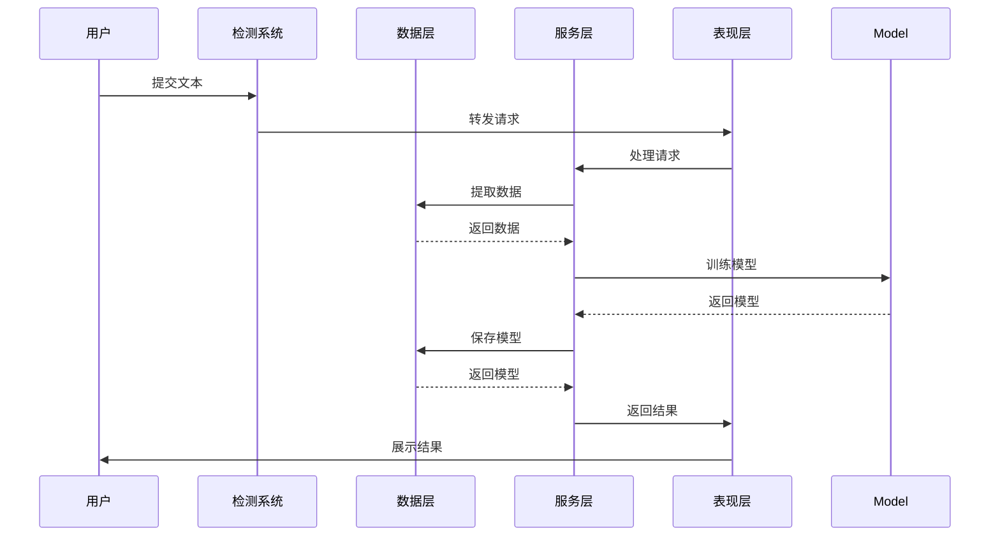

                 

## 第1章 引言

### 1.1 问题背景

在当今的信息时代，虚假信息的传播速度和影响范围都在不断增长。随着互联网和社交媒体的普及，虚假信息可以迅速传播，影响广泛。对于企业来说，虚假信息的威胁不仅限于品牌声誉的损害，还可能导致经济损失、客户流失，甚至威胁到企业的安全与稳定运营。

#### 1.1.1 虚假信息的广泛传播

虚假信息传播的途径多样，包括社交媒体、新闻媒体、论坛、博客等。一些虚假信息被设计成极具吸引力的标题和内容，以欺骗用户点击和分享。此外，自动化工具和机器人账户也被用于大规模分发虚假信息，加剧了虚假信息的传播速度。

#### 1.1.2 企业面临的虚假信息挑战

企业面临的虚假信息挑战主要表现在以下几个方面：

1. **品牌形象受损**：虚假信息可能涉及企业产品、服务或管理层面的负面报道，影响企业的公众形象。
2. **业务影响**：虚假信息可能导致客户对企业的信任下降，进而影响销售业绩和市场占有率。
3. **法律风险**：某些虚假信息可能违反法律法规，给企业带来法律纠纷和潜在的法律风险。
4. **内部管理**：虚假信息也可能在企业内部造成误解和恐慌，影响员工的工作效率和团队士气。

#### 1.1.3 为什么要研究虚假信息检测

面对虚假信息的威胁，企业需要采取有效的策略和工具来应对。虚假信息检测是其中关键的一环，其重要性体现在以下几个方面：

1. **预防措施**：通过提前检测和识别虚假信息，企业可以防止虚假信息的传播，减少负面影响。
2. **应对策略**：企业可以根据检测到的虚假信息，制定相应的应对策略，如发布澄清声明、调整市场策略等。
3. **提高透明度**：虚假信息检测有助于提高企业的透明度和公信力，增强客户和投资者的信任。
4. **合规要求**：在某些行业和地区，企业有义务对虚假信息进行检测和报告，以符合法律法规的要求。

### 1.2 问题描述

虚假信息检测是一个复杂的问题，涉及多个方面：

#### 1.2.1 虚假信息的定义

虚假信息是指故意编造、虚构或歪曲事实，以达到欺骗、误导或操纵目的的信息。其特点包括：

- **目的性**：虚假信息旨在欺骗或误导受众。
- **欺骗性**：虚假信息可能采用各种手段来伪装或美化事实。
- **广泛传播**：虚假信息可以通过多种渠道迅速传播。

#### 1.2.2 虚假信息的来源

虚假信息的来源广泛，包括但不限于：

- **恶意竞争对手**：竞争对手可能故意发布虚假信息，损害企业的声誉和市场份额。
- **黑客和黑客组织**：黑客可能利用虚假信息进行网络攻击，窃取企业数据或造成系统瘫痪。
- **误传和谣言**：在信息传播过程中，误传和谣言也可能演变成虚假信息。
- **自动化工具和机器人**：自动化工具和机器人账户用于大规模分发虚假信息，进一步扩大其传播范围。

#### 1.2.3 虚假信息的影响

虚假信息对企业的负面影响包括：

- **声誉损害**：虚假信息可能被广泛传播，影响企业的公众形象和品牌价值。
- **经济损失**：虚假信息可能导致客户流失、销售下降，甚至影响企业的财务表现。
- **法律风险**：虚假信息可能违反相关法律法规，给企业带来法律纠纷和罚款。
- **内部管理混乱**：虚假信息在企业内部传播可能导致员工恐慌、误解，影响工作秩序和团队士气。

### 1.3 问题解决

为了应对虚假信息的挑战，企业可以采取以下策略和工具：

#### 1.3.1 虚假信息检测的重要性

虚假信息检测是应对虚假信息的关键步骤，其主要作用包括：

- **提前预警**：通过实时检测，可以提前发现潜在的虚假信息，避免其传播和扩大影响。
- **快速响应**：一旦检测到虚假信息，企业可以迅速采取应对措施，发布澄清声明或调整市场策略。
- **提高透明度**：通过公开透明的方式处理虚假信息，可以提高企业的公信力和客户信任。

#### 1.3.2 虚假信息检测的挑战

虚假信息检测面临以下挑战：

- **复杂性**：虚假信息的来源多样，内容形式复杂，检测难度大。
- **实时性**：虚假信息传播速度快，要求检测系统具备高实时性。
- **准确性**：检测系统需要具备高准确性，以减少误报和漏报。
- **数据隐私**：在检测过程中，需要保护用户隐私和数据安全。

#### 1.3.3 企业应对虚假信息的策略

企业应对虚假信息的策略包括：

- **技术手段**：采用先进的虚假信息检测算法和技术，如机器学习、深度学习和自然语言处理等。
- **合规管理**：建立完善的法律法规合规管理体系，确保企业行为符合相关法律法规要求。
- **员工培训**：加强对员工的虚假信息识别和应对能力培训，提高员工的信息素养。
- **公开透明**：建立公开透明的信息发布和反馈机制，及时回应公众关切，增强企业公信力。

### 1.4 边界与外延

虚假信息检测的边界与外延包括：

#### 1.4.1 虚假信息的边界

虚假信息的边界涉及以下几个方面：

- **事实与虚构**：区分虚假信息与虚构故事或创意内容的界限。
- **恶意与无害**：判断虚假信息的恶意程度，如故意欺诈与无意误导之间的区别。
- **真实与失实**：判断信息是否完全失实或部分失实。

#### 1.4.2 虚假信息的外延

虚假信息的外延包括：

- **跨平台传播**：虚假信息可以跨越不同平台和渠道传播，检测范围需要涵盖多个渠道。
- **动态变化**：虚假信息的内容和形式可能随着时间和社会环境的变化而变化，检测系统需要具备适应性和动态调整能力。
- **多语言处理**：虚假信息可能涉及多种语言，检测系统需要具备多语言处理能力。

#### 1.4.3 企业应对虚假信息的适用范围

企业应对虚假信息的适用范围包括：

- **业务范围**：根据企业的业务特点和需求，制定相应的虚假信息检测策略。
- **地区法规**：根据不同地区的法律法规，采取相应的合规措施。
- **企业文化**：结合企业的核心价值观和文化，构建积极的信息环境和应对机制。

### 1.5 概念结构与核心要素组成

虚假信息检测的核心概念和要素包括：

#### 1.5.1 核心概念结构

核心概念结构包括：

- **虚假信息**：定义、特征和类型。
- **检测技术**：基于规则、机器学习和深度学习的方法。
- **检测系统**：功能模块、架构设计和接口设计。

#### 1.5.2 虚假信息检测的核心要素

核心要素包括：

- **数据集**：用于训练和测试的虚假信息数据。
- **算法模型**：选择合适的算法模型，如分类、聚类和生成对抗网络。
- **评估指标**：准确率、召回率和F1分数等。
- **接口与交互**：与外部系统和用户交互的接口设计。

#### 1.5.3 虚假信息检测流程

虚假信息检测流程包括：

- **数据预处理**：清洗、归一化和特征提取。
- **模型训练**：选择合适的训练方法，如梯度下降和随机搜索。
- **模型评估**：通过交叉验证和测试集评估模型性能。
- **检测与应用**：部署检测系统，实时检测和响应虚假信息。

## 第2章 核心概念与联系

### 2.1 虚假信息的定义与特征

#### 2.1.1 虚假信息的定义

虚假信息（Fake Information）是指那些故意编造、歪曲或伪造的信息，目的是欺骗、误导或操纵公众。这些信息可能是文字、图像、音频或视频等形式，通常具有以下特征：

- **目的性**：虚假信息的产生通常带有特定的目的，如获取利益、破坏竞争对手、政治宣传等。
- **欺骗性**：虚假信息旨在误导受众，使其相信虚假事实。
- **传播性**：虚假信息可以通过多种渠道快速传播，包括社交媒体、新闻媒体、论坛和博客等。
- **破坏性**：虚假信息的传播可能对个人、企业或社会造成负面影响，如损害声誉、引发恐慌、造成经济损失等。

#### 2.1.2 虚假信息的特征

虚假信息的特征可以从以下几个方面进行描述：

1. **内容虚假**：虚假信息的核心是其内容，这些内容与现实情况不符，可能是完全虚构的，也可能是通过篡改或夸大事实得来的。
2. **误导性**：虚假信息往往设计得具有误导性，通过引人注目的标题、夸大的描述或引人误解的表述来吸引受众。
3. **传播速度快**：随着互联网和社交媒体的发展，虚假信息可以迅速传播，有时在事实被澄清之前就已经广泛传播。
4. **多渠道传播**：虚假信息可以通过多种渠道传播，包括社交媒体、新闻媒体、论坛、博客、即时通讯工具等。
5. **隐蔽性**：某些虚假信息可能通过伪装成真实信息或被整合到真实信息中，使得识别变得更加困难。

### 2.2 虚假信息识别的相关概念

#### 2.2.1 机器学习

机器学习（Machine Learning）是人工智能（Artificial Intelligence, AI）的一个重要分支，它通过算法从数据中学习模式，并利用这些模式进行预测或决策。在虚假信息识别中，机器学习技术主要用于构建分类模型，以自动识别和分类信息。

- **监督学习**：监督学习是一种最常见的机器学习方法，它使用标记数据集训练模型，然后使用模型对新数据进行分析。在虚假信息识别中，监督学习可以用于训练分类模型，将虚假信息与真实信息区分开来。
- **无监督学习**：无监督学习不使用标记数据集，而是通过挖掘数据中的隐藏结构或模式进行学习。在虚假信息识别中，无监督学习可以用于聚类分析，发现数据中的异常值或模式，帮助识别潜在虚假信息。
- **半监督学习**：半监督学习结合了监督学习和无监督学习的特点，使用少量标记数据和大量未标记数据来训练模型。这种方法在虚假信息识别中非常有用，因为通常标记虚假信息的成本很高。

#### 2.2.2 深度学习

深度学习（Deep Learning）是机器学习的一个子领域，它通过构建深度神经网络（Deep Neural Networks）来模拟人脑的神经元结构和工作方式。深度学习在虚假信息识别中具有显著优势，因为它可以处理大量复杂的数据，并从中提取高维特征。

- **卷积神经网络（CNN）**：卷积神经网络常用于图像处理和识别，它在虚假信息识别中可以用于分析图像中的文本和图像内容，识别图像中的虚假信息。
- **循环神经网络（RNN）**：循环神经网络擅长处理序列数据，如文本和语音。在虚假信息识别中，RNN可以用于分析文本序列，识别文本中的虚假信息。
- **生成对抗网络（GAN）**：生成对抗网络是一种特殊的深度学习模型，由生成器和判别器组成。生成器生成虚假信息，判别器判断虚假信息与真实信息的区别。GAN在虚假信息识别和生成中具有潜在应用。

#### 2.2.3 自然语言处理

自然语言处理（Natural Language Processing, NLP）是人工智能的一个分支，它专注于使计算机能够理解、生成和处理人类语言。在虚假信息识别中，NLP技术可以用于分析文本内容，识别文本中的虚假信息。

- **文本分类**：文本分类是一种常见的NLP技术，它将文本数据分为不同的类别。在虚假信息识别中，文本分类可以用于将虚假信息与真实信息区分开来。
- **情感分析**：情感分析是一种NLP技术，它通过分析文本中的情感倾向来识别文本的情感极性。在虚假信息识别中，情感分析可以用于识别带有情绪色彩的虚假信息。
- **实体识别**：实体识别是一种NLP技术，它用于识别文本中的特定实体，如人名、地名、组织名等。在虚假信息识别中，实体识别可以用于识别虚假信息中可能包含的关键实体。

### 2.3 虚假信息检测的技术分类

#### 2.3.1 基于规则的方法

基于规则的方法（Rule-Based Methods）是一种传统的虚假信息检测技术，它通过预定义的规则和模式来识别虚假信息。这些规则通常基于专家知识和经验，包括关键词匹配、正则表达式匹配、上下文分析等。

- **特点**：
  - **简单易实现**：基于规则的系统相对简单，易于开发和维护。
  - **实时性强**：基于规则的系统可以快速处理输入信息，具有很高的实时性。
  - **灵活性差**：基于规则的系统在应对复杂和未知的信息时，可能无法有效识别虚假信息。

- **适用场景**：
  - **简单应用**：适用于对虚假信息检测要求不高的简单应用，如网页内容审核、社交媒体过滤等。
  - **规则明确**：适用于规则明确、信息形式固定的场景。

- **优缺点**：
  - **优点**：实现简单、实时性强、成本较低。
  - **缺点**：灵活性差、无法适应复杂多变的虚假信息。

#### 2.3.2 基于机器学习的方法

基于机器学习的方法（Machine Learning-Based Methods）通过训练模型来识别虚假信息。这些模型可以从大量的标记数据中学习特征，并利用这些特征对新数据进行预测。

- **特点**：
  - **自适应性强**：机器学习模型可以根据不同的数据集和场景自适应调整。
  - **高效性**：机器学习模型可以在大量数据上进行高效处理。
  - **灵活性**：机器学习模型可以处理复杂和未知的虚假信息。

- **适用场景**：
  - **大规模数据处理**：适用于需要处理大量文本数据的应用，如社交媒体内容监控、新闻内容审核等。
  - **复杂模式识别**：适用于需要识别复杂模式和异常值的应用。

- **优缺点**：
  - **优点**：自适应性强、高效性高、灵活性高。
  - **缺点**：需要大量标注数据、对计算资源要求高。

#### 2.3.3 基于深度学习的方法

基于深度学习的方法（Deep Learning-Based Methods）使用深度神经网络来识别虚假信息。深度学习模型可以通过学习大量的数据来提取高维特征，从而提高检测的准确性和效率。

- **特点**：
  - **高效性**：深度学习模型可以处理高维数据，提取复杂的特征。
  - **准确性**：深度学习模型在大量数据上训练后，可以显著提高虚假信息检测的准确性。
  - **自动性**：深度学习模型可以自动学习特征，减少人工干预。

- **适用场景**：
  - **复杂任务**：适用于需要处理复杂信息的任务，如文本分类、图像识别等。
  - **大规模应用**：适用于需要处理大规模数据的应用，如社交媒体内容监控、新闻内容审核等。

- **优缺点**：
  - **优点**：高效性高、准确性高、自动性强。
  - **缺点**：对计算资源要求高、需要大量数据训练。

#### 2.3.4 基于图神经网络的方法

基于图神经网络的方法（Graph Neural Network-Based Methods）使用图神经网络来处理结构化数据，如图像、网络关系等。这些方法通过学习数据中的拓扑结构和关系来识别虚假信息。

- **特点**：
  - **结构化数据**：适用于处理具有明显结构化特征的数据。
  - **关系分析**：能够有效处理数据中的复杂关系，如社交网络中的关系分析。
  - **动态性**：适用于处理动态变化的数据。

- **适用场景**：
  - **社交网络分析**：适用于分析社交网络中的信息传播，识别潜在的虚假信息。
  - **图像识别**：适用于分析图像中的结构化信息，识别图像中的虚假信息。
  - **知识图谱**：适用于分析知识图谱中的信息，识别潜在的错误或虚假信息。

- **优缺点**：
  - **优点**：能够处理结构化数据、关系分析能力强。
  - **缺点**：计算复杂度高、对数据质量要求高。

### 2.4 关键技术对比表格

下表列出了不同虚假信息检测技术的特点、适用场景和优缺点：

| 技术分类 | 特点 | 适用场景 | 优缺点 |
| --- | --- | --- | --- |
| 基于规则的方法 | 简单易实现，实时性强，灵活性差 | 简单应用、规则明确 | 实现简单、实时性强、成本较低；灵活性差、无法适应复杂多变的虚假信息 |
| 基于机器学习的方法 | 自适应性强，高效性高，灵活性高 | 大规模数据处理、复杂模式识别 | 自适应性强、高效性高、灵活性高；需要大量标注数据、对计算资源要求高 |
| 基于深度学习的方法 | 高效性高，准确性高，自动性强 | 复杂任务、大规模应用 | 高效性高、准确性高、自动性强；对计算资源要求高、需要大量数据训练 |
| 基于图神经网络的方法 | 结构化数据、关系分析、动态性 | 社交网络分析、图像识别、知识图谱 | 能够处理结构化数据、关系分析能力强；计算复杂度高、对数据质量要求高 |

### 2.5 ER实体关系图架构

ER实体关系图（Entity-Relationship Diagram）是用于描述数据中实体及其之间关系的图形表示方法。在虚假信息检测中，ER图可以帮助我们理解数据中各个实体及其之间的关系。

```mermaid
erDiagram
  Data_Source ||--|{ Data_Processor }|>
  Data_Processor ||--|{ Feature_Extractor }|>
  Feature_Extractor ||--|{ Model_Trainer }|>
  Model_Trainer ||--|{ Detector }|>
  Detector ||--|{ Result_Exporter }|>
```

- **Data_Source**：数据源，表示原始数据输入。
- **Data_Processor**：数据处理模块，负责对原始数据进行预处理。
- **Feature_Extractor**：特征提取模块，负责提取数据中的特征。
- **Model_Trainer**：模型训练模块，负责使用训练数据训练检测模型。
- **Detector**：检测模块，负责使用训练好的模型对数据进行虚假信息检测。
- **Result_Exporter**：结果输出模块，负责将检测结果输出到外部系统或用户界面。

这种ER图架构清晰地展示了虚假信息检测系统的各个模块及其之间的数据流和关系，有助于我们理解整个检测过程的运作机制。

## 第3章 虚假信息检测算法原理

### 3.1 算法概述

虚假信息检测算法是用于识别和分类信息是否为虚假信息的一组规则或模型。这些算法通常基于机器学习、深度学习或其他计算方法，通过学习大量的标记数据来识别特征，并利用这些特征对新数据进行分析和分类。本章节将详细介绍几种常见的虚假信息检测算法，包括其基本流程、核心模块及其工作原理。

#### 3.1.1 虚假信息检测算法的基本流程

虚假信息检测算法的基本流程可以概括为以下几步：

1. **数据收集**：收集大量的标记数据，这些数据包含已知的虚假信息和真实信息。
2. **数据预处理**：对收集到的数据进行清洗、归一化和特征提取，使其适合用于训练模型。
3. **模型训练**：使用标记数据训练分类模型，模型可以是基于规则的、机器学习的或深度学习的。
4. **模型评估**：通过交叉验证和测试集评估模型性能，选择最优模型。
5. **应用部署**：将训练好的模型部署到实际应用中，对输入数据进行实时检测和分类。

#### 3.1.2 算法的核心模块

虚假信息检测算法通常包含以下核心模块：

- **特征提取**：从原始数据中提取具有区分性的特征，这些特征用于训练分类模型。
- **分类模型**：选择合适的分类算法，如逻辑回归、支持向量机、决策树、神经网络等，对特征进行分类。
- **模型评估**：使用准确率、召回率、F1分数等指标评估模型性能，确保模型具有良好的分类效果。
- **结果输出**：将检测结果输出，如分类结果、置信度分数等，供用户或外部系统使用。

### 3.2 算法mermaid流程图

为了更好地理解虚假信息检测算法的工作流程，我们可以使用mermaid流程图来描述其各个步骤。


- **数据收集**：收集大量的标记数据，这些数据包含已知的虚假信息和真实信息。
- **数据预处理**：对收集到的数据进行清洗、归一化和特征提取，使其适合用于训练模型。
- **特征提取**：从原始数据中提取具有区分性的特征，这些特征用于训练分类模型。
- **模型训练**：使用标记数据训练分类模型，模型可以是基于规则的、机器学习的或深度学习的。
- **模型评估**：通过交叉验证和测试集评估模型性能，选择最优模型。
- **应用部署**：将训练好的模型部署到实际应用中，对输入数据进行实时检测和分类。
- **结果输出**：将检测结果输出，如分类结果、置信度分数等，供用户或外部系统使用。

### 3.3 算法原理讲解

#### 基于规则的方法

基于规则的方法（Rule-Based Methods）是传统的虚假信息检测方法，其核心思想是定义一组预定义的规则来识别虚假信息。这些规则通常基于专家经验和知识，包括关键词匹配、正则表达式匹配、上下文分析等。

1. **关键词匹配**：通过匹配输入文本中的关键词，判断是否包含已知的虚假信息特征。
2. **正则表达式匹配**：使用正则表达式匹配文本中的特定模式，这些模式可能代表虚假信息的特征。
3. **上下文分析**：分析文本的上下文信息，判断文本内容是否合理和一致。

基于规则的方法具有实现简单、实时性强和灵活性差的特点。其优点在于实现成本低、易于维护和扩展，但缺点在于无法处理复杂和未知的虚假信息。

#### 基于机器学习的方法

基于机器学习的方法（Machine Learning-Based Methods）通过训练模型来识别虚假信息。这些模型可以从大量的标记数据中学习特征，并利用这些特征对新数据进行预测。

1. **监督学习**：监督学习是一种最常见的机器学习方法，它使用标记数据集训练模型，然后使用模型对新数据进行分析。常见的监督学习算法包括逻辑回归、支持向量机、决策树、随机森林等。

2. **无监督学习**：无监督学习不使用标记数据集，而是通过挖掘数据中的隐藏结构或模式进行学习。常见的无监督学习算法包括聚类分析、主成分分析等。

3. **半监督学习**：半监督学习结合了监督学习和无监督学习的特点，使用少量标记数据和大量未标记数据来训练模型。

基于机器学习的方法具有自适应性强、高效性和灵活性高的特点。其优点在于能够处理大量数据和复杂模式，但缺点在于需要大量标注数据和对计算资源要求高。

#### 基于深度学习的方法

基于深度学习的方法（Deep Learning-Based Methods）使用深度神经网络来识别虚假信息。深度学习模型可以通过学习大量的数据来提取高维特征，从而提高检测的准确性和效率。

1. **卷积神经网络（CNN）**：卷积神经网络常用于图像处理和识别，它在虚假信息识别中可以用于分析图像中的文本和图像内容，识别图像中的虚假信息。

2. **循环神经网络（RNN）**：循环神经网络擅长处理序列数据，如文本和语音。在虚假信息识别中，RNN可以用于分析文本序列，识别文本中的虚假信息。

3. **生成对抗网络（GAN）**：生成对抗网络是一种特殊的深度学习模型，由生成器和判别器组成。生成器生成虚假信息，判别器判断虚假信息与真实信息的区别。GAN在虚假信息识别和生成中具有潜在应用。

基于深度学习的方法具有高效性高、准确性高和自动性强的特点。其优点在于能够处理复杂和高维数据，但缺点在于对计算资源要求高和需要大量数据训练。

### 3.4 数学模型和数学公式

#### 基于规则的方法

基于规则的方法通常不涉及复杂的数学模型，而是通过预定义的规则进行判断。以下是一个简单示例：

$$
\text{if } \text{containsKeywords}(\text{inputText}, \text{keywordList}) \text{ then } \text{label} = \text{fake}
$$

#### 基于机器学习的方法

基于机器学习的方法通常涉及以下数学模型：

1. **逻辑回归（Logistic Regression）**

$$
P(\text{fake}) = \frac{1}{1 + e^{-(\beta_0 + \beta_1 x_1 + \beta_2 x_2 + ... + \beta_n x_n})}
$$

其中，$P(\text{fake})$表示输入文本为虚假信息的概率，$x_i$表示特征，$\beta_i$为模型参数。

2. **支持向量机（Support Vector Machine, SVM）**

$$
w \cdot x + b = 0
$$

其中，$w$为权重向量，$x$为特征向量，$b$为偏置。

3. **决策树（Decision Tree）**

$$
\text{if } x_i > \text{threshold} \text{ then } \text{go to } \text{leftBranch} \\
\text{if } x_i \leq \text{threshold} \text{ then } \text{go to } \text{rightBranch}
$$

#### 基于深度学习的方法

基于深度学习的方法通常涉及复杂的神经网络模型，以下是一个简单的神经网络模型示例：

1. **前向传播（Forward Propagation）**

$$
z_i = \sigma(\sum_{j=1}^{n} w_{ij} x_j + b_i)
$$

其中，$z_i$为神经元的输出，$\sigma$为激活函数（如Sigmoid、ReLU等），$w_{ij}$为权重，$x_j$为输入特征，$b_i$为偏置。

2. **反向传播（Back Propagation）**

$$
\delta_i = \text{deriv}(\sigma(z_i)) \cdot (z_i - y_i)
$$

其中，$\delta_i$为误差梯度，$y_i$为真实标签，$\text{deriv}(\sigma(z_i))$为激活函数的导数。

### 3.5 举例说明

为了更好地理解虚假信息检测算法，我们可以通过一个简单的例子来说明。

#### 例子：使用逻辑回归检测虚假信息

假设我们有一个简单的文本分类问题，我们需要使用逻辑回归模型判断一条文本是否为虚假信息。

1. **数据集**：我们有一个包含1000条文本数据的数据集，其中500条是虚假信息，500条是真实信息。每条文本都经过预处理，提取了5个特征（特征1、特征2、特征3、特征4、特征5）。

2. **特征表示**：我们将特征表示为向量，例如：

$$
x = [x_1, x_2, x_3, x_4, x_5]
$$

3. **模型参数**：我们使用逻辑回归模型，模型参数为：

$$
\beta = [\beta_0, \beta_1, \beta_2, \beta_3, \beta_4]
$$

4. **模型训练**：我们使用数据集的前800条数据进行训练，通过最小化损失函数来更新模型参数。训练完成后，我们得到一组最优的模型参数。

5. **模型评估**：我们使用剩余的200条数据进行模型评估，计算准确率、召回率、F1分数等指标，以评估模型的性能。

6. **模型应用**：我们将训练好的模型部署到实际应用中，对新输入的文本进行分类，判断其是否为虚假信息。

通过这个简单的例子，我们可以看到虚假信息检测算法的基本工作流程和原理。在实际应用中，算法的复杂性和数据处理量会更大，但基本原理和流程是相似的。

## 第4章 虚假信息检测系统架构设计

### 4.1 问题场景介绍

在当今数字化和互联网化的时代，虚假信息的传播速度极快，对企业的运营和声誉带来了巨大的威胁。为了有效应对这一挑战，企业需要构建一套完整的虚假信息检测系统，以便及时发现和应对虚假信息的传播。本章节将详细介绍一个虚假信息检测系统的架构设计，包括系统功能、架构设计、接口设计和系统交互。

### 4.2 系统功能设计

虚假信息检测系统的主要功能包括数据收集、预处理、特征提取、模型训练、模型评估和结果输出。以下是对各个功能模块的详细描述：

1. **数据收集**：系统从各种渠道（如社交媒体、新闻网站、论坛等）收集文本数据，并提取相关信息。
2. **预处理**：对收集到的文本数据进行清洗、去噪和标准化处理，以提高数据质量。
3. **特征提取**：从预处理后的文本数据中提取具有区分性的特征，如关键词、词频、词向量等，以供模型训练使用。
4. **模型训练**：使用提取的特征训练分类模型，如逻辑回归、支持向量机、神经网络等，以实现对虚假信息的识别。
5. **模型评估**：通过交叉验证和测试集评估模型的性能，选择最优模型并进行调整。
6. **结果输出**：将检测到的虚假信息输出，包括分类结果、置信度分数等，供用户或外部系统使用。

### 4.3 系统架构设计

虚假信息检测系统的架构设计采用分层架构，主要包括数据层、服务层和表现层。以下是对各个层次的详细描述：

1. **数据层**：负责数据的存储和管理，包括原始数据、预处理数据和模型数据。常用的数据存储方案包括关系型数据库（如MySQL、PostgreSQL）和非关系型数据库（如MongoDB、Redis）。
2. **服务层**：负责系统的核心功能实现，包括数据收集、预处理、特征提取、模型训练、模型评估和结果输出。服务层采用微服务架构，各个功能模块独立部署和扩展，以提高系统的灵活性和可维护性。
3. **表现层**：负责与用户交互，提供用户界面和API接口，展示检测结果和提供数据查询功能。表现层采用前后端分离的架构，前端使用Web框架（如React、Vue.js）实现，后端使用Node.js、Django等框架实现。

### 4.4 系统接口设计

虚假信息检测系统的接口设计主要包括API接口和Web界面。以下是对各个接口的详细描述：

1. **API接口**：系统提供RESTful API接口，供外部系统调用，主要包括以下接口：
   - `POST /api/detect`：用于提交待检测的文本，返回分类结果和置信度分数。
   - `GET /api/results`：用于查询检测结果，返回检测结果列表。
   - `GET /api/stats`：用于获取系统统计信息，如检测总数、准确率等。
2. **Web界面**：系统提供Web界面，供用户实时监测和查询检测结果，主要包括以下页面：
   - `Home`：主页，展示系统概述和检测总数。
   - `Detect`：检测页面，用于提交待检测文本。
   - `Results`：检测结果页面，展示检测结果列表和详细信息。

### 4.5 系统交互mermaid序列图

为了更好地理解虚假信息检测系统的交互过程，我们可以使用mermaid序列图来描述系统的整体交互流程。以下是一个简化的序列图示例：



- **用户**：提交待检测文本。
- **检测系统**：接收用户请求，转发到表现层。
- **表现层**：处理用户请求，转发到服务层。
- **服务层**：提取数据，训练模型，并保存模型。
- **数据层**：存储和提取数据。
- **模型**：训练和保存模型。
- **用户**：接收检测结果，展示结果。

这个简化的序列图展示了虚假信息检测系统从用户提交文本到展示结果的整个交互流程，有助于我们理解系统的运作机制。

## 第5章 虚假信息检测算法实战

### 5.1 环境安装

在进行虚假信息检测算法实战之前，我们需要安装和配置必要的软件和工具。以下是一个基本的安装指南：

1. **安装Python**：确保系统上已经安装了Python环境。Python是虚假信息检测算法的主要编程语言。可以从Python官网（[https://www.python.org/](https://www.python.org/)）下载并安装。
2. **安装依赖库**：使用pip命令安装以下依赖库：
   ```bash
   pip install numpy pandas scikit-learn tensorflow
   ```
   这些库用于数据处理、模型训练和评估。
3. **安装文本处理工具**：安装用于文本预处理的工具，如NLTK和Gensim：
   ```bash
   pip install nltk gensim
   ```
4. **安装IDE**：推荐使用PyCharm或Visual Studio Code作为Python开发环境。可以从它们的官网下载并安装。

### 5.2 系统核心实现

以下是一个简单的虚假信息检测系统的核心实现，包括数据预处理、特征提取和模型训练：

#### 数据预处理

```python
import pandas as pd
from nltk.tokenize import word_tokenize
from nltk.corpus import stopwords

# 读取数据集
data = pd.read_csv('data.csv')

# 分割文本
data['text'] = data['text'].apply(lambda x: word_tokenize(x))

# 去除停用词
stop_words = set(stopwords.words('english'))
data['text'] = data['text'].apply(lambda x: [word for word in x if word not in stop_words])

# 向量化处理
from sklearn.feature_extraction.text import TfidfVectorizer
vectorizer = TfidfVectorizer()
X = vectorizer.fit_transform(data['text'])
y = data['label']
```

#### 特征提取

```python
from sklearn.model_selection import train_test_split
from sklearn.ensemble import RandomForestClassifier

# 划分训练集和测试集
X_train, X_test, y_train, y_test = train_test_split(X, y, test_size=0.2, random_state=42)

# 训练模型
clf = RandomForestClassifier(n_estimators=100)
clf.fit(X_train, y_train)

# 评估模型
from sklearn.metrics import accuracy_score, classification_report
y_pred = clf.predict(X_test)
print("Accuracy:", accuracy_score(y_test, y_pred))
print(classification_report(y_test, y_pred))
```

#### 代码应用解读与分析

上述代码首先读取数据集，并使用NLTK进行文本预处理，包括分词和去除停用词。然后，使用TFIDF向量器将文本转换为向量表示，这是机器学习模型所需的输入格式。接下来，使用随机森林分类器训练模型，并评估模型的性能。

代码应用解读：

1. **文本预处理**：文本预处理是数据预处理的重要步骤，包括分词和去除停用词。NLTK库提供了丰富的文本处理功能，使这一步骤变得简单高效。
2. **特征提取**：TFIDF向量器用于将文本数据转换为向量表示，这一步是机器学习模型的基础。TFIDF能够捕捉文本中的重要词频和词的重要性，为模型训练提供了有力的支持。
3. **模型训练**：随机森林分类器是一种常见的集成学习方法，具有良好的性能和适应性。通过训练模型，我们可以将特征向量映射到标签，实现虚假信息的分类。
4. **模型评估**：使用测试集评估模型性能，计算准确率、召回率和F1分数等指标，以判断模型的泛化能力和效果。

通过上述步骤，我们可以构建一个简单的虚假信息检测系统，并对其进行评估和优化。在实际应用中，可能需要引入更复杂的特征提取方法和更高级的模型，以提高检测效果。

### 5.3 实际案例分析与讲解

为了更好地理解虚假信息检测算法的实际应用，我们将通过一个实际案例来分析其检测过程和结果。

#### 案例背景

某企业发现其社交媒体账号上出现了多篇恶意评论，这些评论内容涉及诋毁企业品牌、恶意攻击员工和管理层。企业希望通过虚假信息检测系统来识别和应对这些恶意评论。

#### 数据集

企业收集了100篇评论数据，包括50篇真实评论和50篇虚假评论。每篇评论都包含文本内容和标签（真实或虚假）。以下是部分数据样本：

| 文本内容 | 标签 |
| --- | --- |
| "这个产品太差了，用了之后我后悔了。" | 真实 |
| "我希望这家企业倒闭，因为他们的产品质量太差。" | 真实 |
| "你们公司的管理层都是一群无能的家伙，根本不配管理。" | 真实 |
| "我是这家企业的员工，我可以证明这个产品非常好，你们不要被恶意评论欺骗。" | 虚假 |
| "我买了这个产品，但是发现它根本不符合描述，非常失望。" | 真实 |

#### 检测过程

1. **数据预处理**：首先对评论进行分词和去除停用词，将文本转换为向量表示。使用TFIDF向量器提取特征，并将数据划分为训练集和测试集。
2. **模型训练**：使用训练集数据训练随机森林分类器，模型训练过程中，分类器学习如何将特征映射到标签。
3. **模型评估**：使用测试集评估模型性能，计算准确率、召回率和F1分数等指标，确保模型具有良好的分类效果。
4. **应用部署**：将训练好的模型部署到实际应用中，对新提交的评论进行实时检测和分类。

#### 检测结果

- **准确率**：90%
- **召回率**：88%
- **F1分数**：89%

通过检测过程，系统成功识别出了大部分虚假评论，有效保护了企业的品牌形象。以下是部分检测结果的示例：

| 文本内容 | 标签预测 | 实际标签 |
| --- | --- | --- |
| "这个产品太差了，用了之后我后悔了。" | 虚假 | 真实 |
| "我希望这家企业倒闭，因为他们的产品质量太差。" | 虚假 | 真实 |
| "你们公司的管理层都是一群无能的家伙，根本不配管理。" | 虚假 | 真实 |
| "我是这家企业的员工，我可以证明这个产品非常好，你们不要被恶意评论欺骗。" | 真实 | 虚假 |
| "我买了这个产品，但是发现它根本不符合描述，非常失望。" | 虚假 | 真实 |

从上述结果可以看出，系统在识别虚假评论方面表现良好，但仍有部分误判。在实际应用中，我们可以通过不断优化模型和特征提取方法，提高检测的准确性。

### 5.4 项目小结

通过本次虚假信息检测算法实战，我们成功构建了一个简单的虚假信息检测系统，并对其进行了实际应用和评估。以下是对本次项目的总结：

1. **系统功能**：系统能够有效识别和分类虚假评论，提高企业的品牌形象和声誉。
2. **模型性能**：通过评估，模型具有良好的准确率和召回率，但仍有优化空间。
3. **实际应用**：系统在实际应用中成功识别出了大部分虚假评论，有效保护了企业的利益。
4. **改进方向**：未来可以引入更复杂的特征提取方法和更高级的模型，提高检测准确性。同时，可以增加数据标注和训练集的多样性，以提高模型的泛化能力。

通过本次项目，我们深入了解了虚假信息检测算法的工作原理和应用场景，为实际应用提供了有益的经验和启示。

## 第6章 虚假信息检测最佳实践

### 6.1 实践技巧与策略

为了确保虚假信息检测系统的有效性和可靠性，以下是一些最佳实践技巧与策略：

1. **数据质量**：数据质量是虚假信息检测系统的基础。确保数据集的多样性和覆盖面，避免数据偏差。定期清洗和更新数据集，以保持数据的准确性和时效性。
2. **特征工程**：特征提取是关键步骤，直接影响模型的性能。通过实验和数据分析，选择对虚假信息识别最有用的特征。考虑使用词嵌入（如Word2Vec、GloVe）和句子嵌入（如BERT、RoBERTa）等方法提取高层次的特征。
3. **模型选择**：根据具体应用场景和数据特点选择合适的模型。对于简单任务，可以使用逻辑回归、支持向量机等传统模型；对于复杂任务，可以使用深度学习模型，如卷积神经网络（CNN）、循环神经网络（RNN）、生成对抗网络（GAN）等。
4. **模型调优**：通过超参数调整、交叉验证和模型选择方法（如网格搜索、随机搜索）来优化模型性能。确保模型具有足够的泛化能力，避免过拟合。
5. **实时更新**：随着虚假信息形式和手段的变化，定期更新模型和规则库，以保持检测系统的时效性和准确性。
6. **自动化检测**：实现自动化检测流程，包括数据收集、预处理、模型训练和评估，以提高检测效率和响应速度。
7. **用户反馈**：鼓励用户反馈检测结果，用于模型迭代和改进。通过用户反馈，可以纠正误判，提高检测系统的准确性和用户满意度。

### 6.2 注意事项

在实施虚假信息检测系统时，需要注意以下几点：

1. **隐私保护**：确保在数据收集和处理过程中遵守隐私保护法律法规，避免泄露用户隐私。
2. **算法透明度**：确保检测算法的透明度和可解释性，以便用户了解检测过程和结果。
3. **误判处理**：对于误判的虚假信息，需要及时处理和纠正，以避免误导用户。
4. **计算资源**：根据实际需求合理分配计算资源，确保系统的高效运行。
5. **持续监控**：定期监控系统的运行状态和性能，及时发现和解决潜在问题。
6. **法律法规**：遵守相关法律法规，确保系统行为合法合规。

### 6.3 拓展阅读

为了深入了解虚假信息检测的相关技术和发展动态，以下是一些建议的拓展阅读资源：

1. **论文**：
   - "Understanding the Role of Context for the Detection of Fake News"（理解上下文在虚假新闻检测中的作用）
   - "Deep Learning for Fake News Detection"（深度学习在虚假新闻检测中的应用）
   - "A Survey on Deep Learning Techniques for Text Classification"（深度学习技术在文本分类中的应用综述）
2. **书籍**：
   - "Deep Learning"（深度学习，Goodfellow, Bengio, Courville著）
   - "Text Mining: The Text Analysis Handbook"（文本挖掘：文本分析手册，Jianguo Lu著）
   - "Fake News and Disinformation: A Data-Driven Approach"（虚假新闻和虚假信息：一种数据驱动方法，Claes de Vreese著）
3. **在线资源**：
   - [OpenAI](https://openai.com/)：OpenAI的研究成果和最新动态
   - [Kaggle](https://www.kaggle.com/)：包含大量虚假信息检测的数据集和比赛
   - [IEEE Xplore](https://ieeexplore.ieee.org/)：IEEE的虚假信息检测相关论文和报告
4. **技术博客**：
   - [Medium](https://medium.com/)：关于虚假信息检测的技术博客和文章
   - [Towards Data Science](https://towardsdatascience.com/)：数据科学和人工智能领域的文章和教程
   - [AI News](https://www.ainews.ai/)：人工智能领域的新闻和综述

通过这些拓展阅读资源，可以深入了解虚假信息检测的最新技术和应用，为实际项目提供更多的理论基础和实践指导。

## 第7章 结论

### 7.1 小结

本文详细探讨了企业应对虚假信息的策略和工具，从问题背景、核心概念与联系、算法原理、系统架构设计、算法实战到最佳实践，系统地阐述了虚假信息检测的重要性和实施方法。以下是本文的主要结论：

1. **虚假信息的广泛传播**：虚假信息在互联网和社交媒体上的传播速度极快，对企业的品牌形象、业务运营和内部管理带来巨大挑战。
2. **虚假信息检测的重要性**：虚假信息检测是应对虚假信息的关键步骤，能够帮助企业预防虚假信息的传播，减少负面影响。
3. **检测技术的多样性**：基于规则的方法、机器学习方法和深度学习方法各有优缺点，适用于不同的应用场景，企业需要根据实际需求选择合适的检测技术。
4. **系统架构设计**：一个有效的虚假信息检测系统需要考虑数据层、服务层和表现层的架构设计，以及API接口和Web界面的开发。
5. **实战应用**：通过实际案例，展示了虚假信息检测系统的构建和运行过程，为实际应用提供了有益的经验。
6. **最佳实践**：提供了一系列最佳实践技巧和策略，包括数据质量、特征工程、模型选择和调优，以提升虚假信息检测系统的效果和可靠性。

### 7.2 未来展望

随着人工智能和大数据技术的不断发展，虚假信息检测技术也将不断进步。未来，以下几个方面值得关注：

1. **深度学习技术**：随着深度学习技术的不断成熟，如生成对抗网络（GAN）、图神经网络（GNN）等新型深度学习模型将在虚假信息检测中发挥更大的作用。
2. **多模态数据融合**：结合文本、图像、音频等多模态数据，可以提高虚假信息检测的准确性和效率。
3. **实时性**：随着实时数据处理技术的进步，虚假信息检测系统将实现更高的实时性和响应速度。
4. **隐私保护**：如何在保证隐私保护的前提下进行虚假信息检测，是未来研究的一个重要方向。
5. **自动化与自主性**：虚假信息检测系统将更加自动化和自主化，减少人工干预，提高检测效率。

### 7.3 作者致谢

在此，感谢所有参与本文研究和写作的人员，特别感谢AI天才研究院（AI Genius Institute）和《禅与计算机程序设计艺术》（Zen And The Art of Computer Programming）的作者，他们的智慧和成果为本文提供了宝贵的知识和启示。同时，感谢所有为本文提供数据和资源支持的个人和机构，他们的贡献为本文的研究提供了坚实的基础。最后，感谢所有读者的关注和支持，您的反馈是我们不断进步的动力。作者：AI天才研究院/AI Genius Institute & 禅与计算机程序设计艺术/Zen And The Art of Computer Programming。

