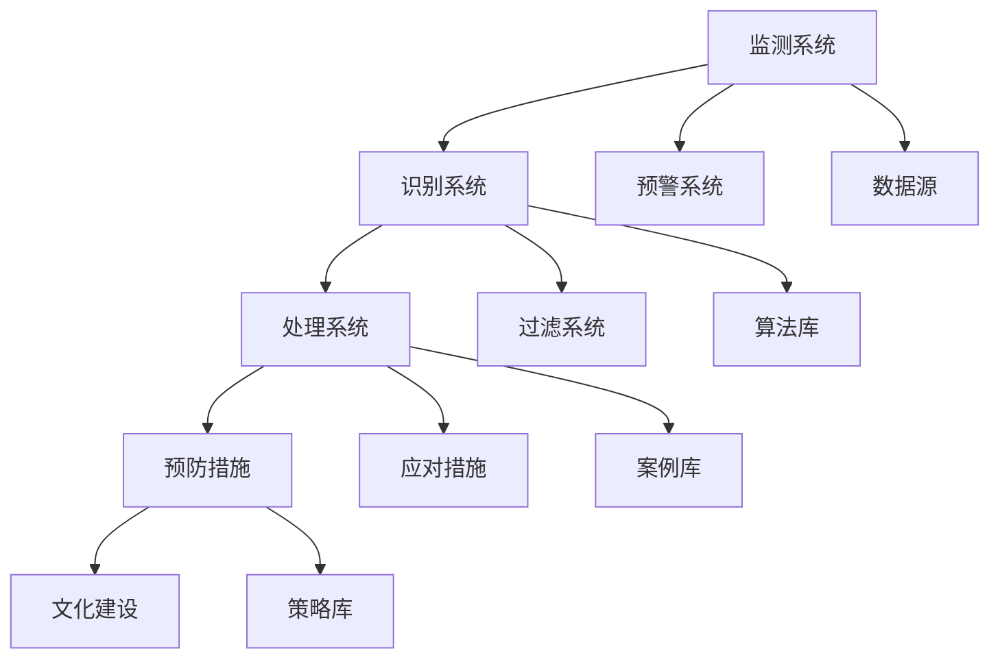
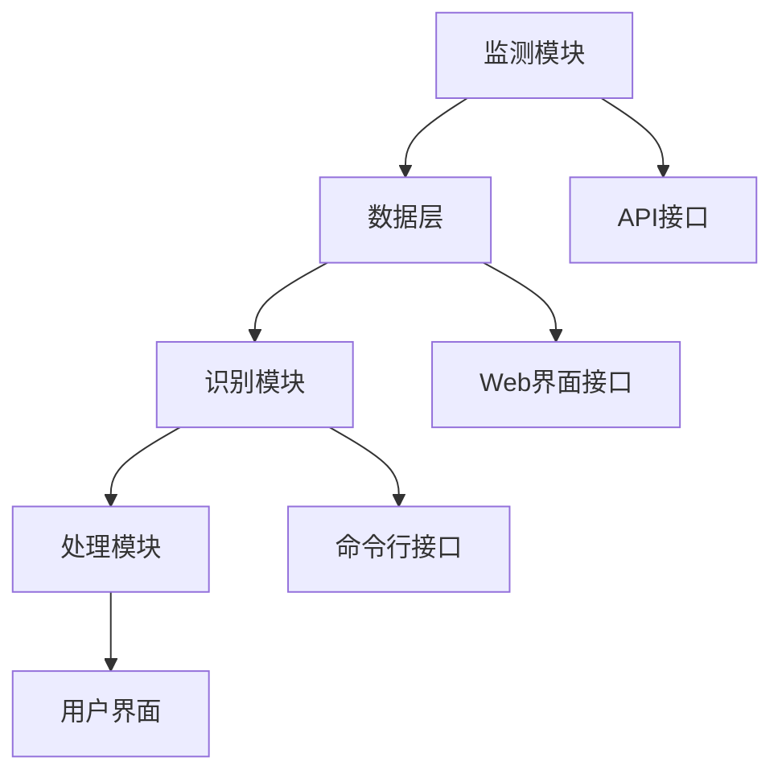
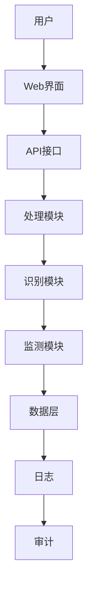

                 

### 第1章：问题背景与现状

#### 1.1.1 问题背景

在当今数字化时代，互联网和社交媒体的迅猛发展，使得信息的传播速度和范围达到了前所未有的高度。然而，这种高速的信息传播也带来了虚假信息泛滥的问题。虚假信息，通常指的是那些故意传播的虚假、误导性或夸大的信息，它们在网络上广泛存在，给企业带来了巨大的威胁。

虚假信息可能包括对企业的诽谤、恶意攻击、误导性广告等。这些虚假信息不仅会损害企业的声誉，还可能影响企业的市场地位、客户信任度和品牌价值。例如，某知名品牌的社交媒体账号上突然出现了一则虚假广告，声称其产品存在严重质量问题，导致大量消费者对该品牌的信任度下降，进而影响了其销售业绩。

此外，虚假信息还具有传播速度快、影响范围广的特点。在互联网时代，一条虚假信息可以通过社交网络在短时间内迅速传播，甚至可以跨越国界，对全球范围内的企业造成影响。例如，2018年爆发的“华为被美国政府禁用”的虚假消息，就引起了全球范围内的广泛关注和讨论，对华为的声誉和市场地位造成了严重的冲击。

因此，面对虚假信息带来的威胁，企业需要采取有效的措施来应对，以保护自身的声誉和商业利益。这也使得企业信息安全领域中的一个重要方向——虚假信息应对，越来越受到关注。

#### 1.1.2 问题描述

虚假信息的传播方式多样化，企业面临的挑战也随之增加。这些传播方式包括但不限于以下几个方面：

1. **网络水军**：网络水军是一种专门在网络上发布、传播虚假信息的组织或个人。他们可能会伪装成普通用户，发布虚假评论、帖子，以误导公众和消费者。

2. **虚假新闻**：虚假新闻是近年来虚假信息传播的重要形式之一。这些新闻通常会利用标题党、夸大事实等手法，吸引读者的注意力，并在社交媒体上迅速传播。

3. **恶意软件**：恶意软件可以通过电子邮件、网站等渠道传播虚假信息。例如，一些虚假的邮件可能会伪装成来自企业的官方通知，诱使员工点击恶意链接或下载恶意软件，从而导致企业内部信息泄露或系统被攻击。

4. **社交媒体**：社交媒体平台如微博、微信等，是虚假信息传播的主要渠道之一。一些不法分子会利用这些平台发布虚假信息，以达到欺骗、诽谤或其他非法目的。

由于虚假信息传播方式的多样性，企业难以在短时间内识别和应对所有类型的虚假信息。这给企业的信息安全带来了巨大的挑战。例如，一家企业在社交媒体上突然遭遇了一场虚假新闻的攻击，他们不仅需要快速识别和证实虚假信息的来源，还需要采取有效的措施来防止虚假信息的进一步传播，并修复受影响的声誉。

#### 1.1.3 问题解决

面对虚假信息的威胁，企业需要采取一系列的措施来应对。以下是几个关键措施：

1. **建立虚假信息监测系统**：企业可以通过技术手段，如使用社交媒体监测工具、新闻分析工具等，实时监测网络中的虚假信息。一旦发现虚假信息，企业可以迅速采取措施进行应对。

2. **建立虚假信息识别与过滤机制**：企业可以利用算法和技术，对网络中的虚假信息进行识别和过滤。例如，通过自然语言处理技术，对文本进行分析，判断其是否包含虚假信息。

3. **加强员工培训**：企业需要加强对员工的培训，提高他们对虚假信息的识别和应对能力。通过定期举办培训课程、研讨会等，让员工了解如何识别和应对虚假信息。

4. **建立企业文化**：企业需要建立诚信、透明的企业文化，提升企业抵御虚假信息的能力。例如，企业可以通过发布透明的财务报表、及时回应公众关切等方式，增强公众对企业的信任。

5. **法律手段**：对于严重的虚假信息攻击，企业可以考虑采取法律手段进行应对。例如，向法院提起诉讼，要求删除虚假信息、赔偿损失等。

6. **建立应急响应机制**：企业需要建立应急响应机制，一旦发生虚假信息攻击，可以迅速启动应急响应，减少虚假信息对企业造成的损害。

#### 1.1.4 边界与外延

在应对虚假信息的过程中，明确虚假信息的定义、分类和处理策略是非常重要的。以下是一些关键点：

1. **虚假信息的定义**：虚假信息是指那些故意传播的虚假、误导性或夸大的信息。它不包括那些由于信息传递过程中的误解、技术错误等原因导致的错误信息。

2. **虚假信息的分类**：虚假信息可以按照其内容、传播方式、目的等不同维度进行分类。例如，按照内容分类，虚假信息可以分为诽谤、虚假广告、虚假新闻等。

3. **虚假信息的处理策略**：企业需要针对不同类型的虚假信息，采取不同的处理策略。例如，对于虚假广告，企业可以采取法律手段进行应对；对于虚假新闻，企业可以通过发布澄清信息来纠正错误。

4. **不同行业的特殊性**：不同行业面临的虚假信息威胁有所不同。例如，医疗行业面临的虚假信息可能涉及虚假的医疗广告、虚假的药品信息等；而金融行业则可能面临虚假的投资信息、欺诈等威胁。

#### 1.1.5 概念结构与核心要素组成

虚假信息应对的核心要素包括监测、识别、处理和预防。这些要素构成了一个完整的信息安全体系，如图所示：



- **监测系统**：负责监测网络中的虚假信息，包括社交媒体、新闻媒体等。
- **识别系统**：利用算法和规则对监测到的信息进行识别，判断其是否为虚假信息。
- **处理系统**：针对识别出的虚假信息，采取相应的应对措施，如发布澄清信息、法律诉讼等。
- **预防措施**：通过建立企业文化、加强员工培训等方式，提高企业抵御虚假信息的能力。
- **预警系统**：一旦发现虚假信息，立即发出预警，提醒相关部门和员工。
- **过滤系统**：对网络中的信息进行过滤，防止虚假信息进入企业内部网络。
- **数据源**：提供监测和识别系统所需的数据，如社交媒体数据、新闻数据等。
- **算法库**：包含用于识别虚假信息的算法，如自然语言处理算法、机器学习算法等。
- **案例库**：收集和分析历史上的虚假信息案例，为识别和处理虚假信息提供参考。
- **策略库**：包含针对不同类型虚假信息的应对策略和措施。

通过这些核心要素的有机组合，企业可以建立起一套完整的虚假信息应对体系，有效地保护自身的声誉和商业利益。

---

### 第2章：核心概念与联系

#### 2.1.1 虚假信息的定义与特点

##### 2.1.1.1 虚假信息的定义

虚假信息是指那些故意传播的虚假、误导性或夸大的信息。这些信息可能包含虚假的陈述、误导性的描述或夸大的事实，其目的是误导公众、获取不当利益或破坏他人的名誉。

##### 2.1.1.2 虚假信息的特点

- **普遍性**：虚假信息广泛存在于各种媒体中，包括社交媒体、新闻媒体、电子邮件等。

- **传播速度**：虚假信息可以在短时间内迅速传播，甚至可以在全球范围内快速传播。

- **破坏性**：虚假信息可能对企业的声誉、市场地位造成严重损害。例如，一家企业可能因为虚假信息而失去大量客户，甚至面临法律诉讼。

#### 2.1.2 安全措施的类型与特点

##### 2.1.2.1 技术措施

- **监测与分析**：通过技术手段监测网络中的虚假信息，如使用社交媒体监测工具、新闻分析工具等。

- **识别与过滤**：利用算法和规则识别和过滤虚假信息。例如，自然语言处理技术可以用于分析文本内容，判断其是否包含虚假信息。

- **应对与处理**：针对虚假信息采取相应的应对措施，如发布澄清信息、法律诉讼等。

##### 2.1.2.2 人员培训与文化建设

- **人员培训**：提高员工对虚假信息的识别和应对能力。例如，企业可以定期举办培训课程，让员工了解如何识别和应对虚假信息。

- **文化建设**：建立诚信、透明的企业文化，提升企业抵御虚假信息的能力。例如，企业可以通过透明的财务报表、及时回应公众关切等方式，增强公众对企业的信任。

#### 2.1.3 虚假信息监测与分析工具

##### 2.1.3.1 工具类型与功能

- **监测工具**：实时监测网络中的虚假信息。例如，社交媒体监测工具可以监控社交媒体平台上的帖子和评论，新闻分析工具可以分析新闻报道的准确性。

- **分析工具**：对监测到的虚假信息进行分析和分类。例如，分析工具可以识别虚假信息的来源、传播路径和影响范围。

##### 2.1.3.2 主流工具简介

- **社交媒体监测工具**：如Google Alerts、Brandwatch等。这些工具可以帮助企业实时监控社交媒体上的信息，一旦发现虚假信息，可以迅速采取措施进行应对。

- **新闻分析工具**：如Media Monitoring、NewsGuard等。这些工具可以对新闻报道的准确性进行分析，帮助企业识别和应对虚假新闻。

#### 2.1.4 虚假信息识别与过滤算法

##### 2.1.4.1 算法类型与原理

- **基于规则**：通过预设的规则进行虚假信息识别。例如，如果文本中包含特定关键词，如“免费抽奖”、“中奖”等，那么这个文本很可能是虚假信息。

- **基于机器学习**：利用机器学习算法识别虚假信息。例如，可以使用大量已标记的虚假信息和真实信息进行训练，让算法学会识别哪些信息是虚假的。

##### 2.1.4.2 主流算法简介

- **语言模型**：如BERT、GPT等。这些模型可以分析文本内容，识别其中的虚假信息。

- **基于内容的算法**：如TextBlob、VADER等。这些算法通过分析文本的内容和结构，判断其是否包含虚假信息。

#### 2.1.5 虚假信息处理策略

##### 2.1.5.1 处理策略

- **发布澄清信息**：当企业发现虚假信息时，可以发布澄清信息，纠正错误，防止虚假信息进一步传播。

- **法律诉讼**：对于严重的虚假信息攻击，企业可以考虑采取法律手段进行应对。例如，向法院提起诉讼，要求删除虚假信息、赔偿损失等。

- **应急响应**：建立应急响应机制，一旦发现虚假信息，可以迅速启动应急响应，减少虚假信息对企业造成的损害。

##### 2.1.5.2 核心要素

- **监测系统**：实时监测网络中的虚假信息。

- **识别系统**：利用算法和规则识别虚假信息。

- **处理系统**：针对识别出的虚假信息，采取相应的应对措施。

- **预防措施**：通过建立企业文化、加强员工培训等方式，提高企业抵御虚假信息的能力。

#### 2.1.6 虚假信息应对的挑战

##### 2.1.6.1 挑战

- **快速传播**：虚假信息可以在短时间内迅速传播，给企业应对带来挑战。

- **多样化传播方式**：虚假信息的传播方式多样化，企业需要采取多种措施进行应对。

- **法律和道德问题**：在应对虚假信息时，企业需要考虑法律和道德问题，如言论自由、隐私保护等。

##### 2.1.6.2 对策

- **建立完善的监测和识别系统**：通过技术手段建立完善的监测和识别系统，提高识别虚假信息的能力。

- **加强员工培训**：提高员工对虚假信息的识别和应对能力，建立应急响应机制。

- **建立法律和道德框架**：明确虚假信息的定义和处理策略，建立法律和道德框架，规范虚假信息的传播和处理。

---

### 第3章：主流安全措施简介

#### 3.1 虚假信息监测与分析工具

##### 3.1.1 工具类型与功能

虚假信息的监测与分析工具是帮助企业识别和应对虚假信息的重要手段。这些工具可以分为两大类：监测工具和分析工具。

- **监测工具**：主要负责实时监控网络上的虚假信息。其功能包括：

  - **实时监控**：持续跟踪社交媒体、新闻网站、论坛等平台上的信息，一旦发现可疑信息，立即通知企业。

  - **关键词监控**：根据预设的关键词，监控网络上相关的讨论和话题，以便及时发现虚假信息。

  - **数据收集**：自动收集和分析网络上的信息，为后续的分析提供数据支持。

- **分析工具**：主要用于对监测到的信息进行深入分析，判断其真实性和潜在影响。其功能包括：

  - **文本分析**：通过自然语言处理技术，对文本内容进行语义分析和情感分析，识别虚假信息。

  - **图表分析**：对网络中的信息进行可视化展示，帮助用户更直观地了解虚假信息的传播路径和影响范围。

  - **趋势分析**：分析虚假信息在不同时间段的传播趋势，预测未来可能的传播方向和影响。

##### 3.1.2 主流工具简介

目前，市场上主流的虚假信息监测与分析工具有很多，以下是一些典型的工具：

- **Google Alerts**：Google Alerts 是一款免费的在线工具，允许用户根据特定的关键词设置警报。一旦互联网上出现与关键词相关的信息，Google Alerts 会自动发送通知。这对于企业监控品牌声誉和潜在虚假信息非常有用。

  ```mermaid
  graph TD
      A[Google Alerts]
      A --> B[关键词监控]
      A --> C[实时通知]
  ```

- **Brandwatch**：Brandwatch 是一款专业的社交媒体分析工具，可以帮助企业实时监控社交媒体上的信息。它提供了丰富的分析功能，包括趋势分析、情感分析和网络分析等。

  ```mermaid
  graph TD
      A[Brandwatch]
      A --> B[趋势分析]
      A --> C[情感分析]
      A --> D[网络分析]
  ```

- **Media Monitoring**：Media Monitoring 是一款专注于新闻媒体监测的工具，可以帮助企业识别和应对虚假新闻。它提供了详细的报道分析和新闻来源追踪功能。

  ```mermaid
  graph TD
      A[Media Monitoring]
      A --> B[报道分析]
      A --> C[新闻来源追踪]
  ```

- **NewsGuard**：NewsGuard 是一款新闻评级工具，它通过评估新闻网站的编辑政策、事实核查和来源可靠性等因素，对新闻网站进行评级。这对于企业识别和评估新闻报道的准确性非常有帮助。

  ```mermaid
  graph TD
      A[NewsGuard]
      A --> B[新闻评级]
      A --> C[事实核查]
  ```

这些工具各有特色，企业可以根据自身的需求选择合适的工具进行虚假信息的监测与分析。

#### 3.2 虚假信息识别与过滤算法

##### 3.2.1 算法类型与原理

虚假信息的识别与过滤是信息安全领域的一个重要研究方向。目前，主要的算法类型包括基于规则的算法和基于机器学习的算法。

- **基于规则的算法**：这类算法通过预设一系列规则来识别虚假信息。这些规则通常是基于对大量虚假信息的分析得出的，包括：

  - **关键词匹配**：如果文本中包含特定的关键词，如“免费”“抽奖”等，则可能为虚假信息。
  
  - **逻辑分析**：通过分析文本中的逻辑关系，如矛盾点、不合常理的描述等，来判断其真实性。

  - **来源分析**：如果信息来源不明或者来源可疑，则可能为虚假信息。

- **基于机器学习的算法**：这类算法通过学习大量的真实和虚假信息样本，训练模型来识别新的信息。主要方法包括：

  - **监督学习**：使用标记好的数据集训练模型，模型学会根据输入的特征判断信息是否为虚假信息。
  
  - **无监督学习**：在没有标记数据的情况下，通过聚类等方法识别虚假信息。

  - **半监督学习**：结合标记数据和未标记数据，提高模型的识别能力。

##### 3.2.2 主流算法简介

以下是一些在虚假信息识别与过滤中常用的主流算法：

- **BERT（Bidirectional Encoder Representations from Transformers）**：BERT 是一种基于变换器的双向编码器，它可以捕获文本中的上下文信息，从而提高虚假信息识别的准确性。

  ```mermaid
  graph TD
      A[Input Text]
      A --> B[Tokenizer]
      B --> C[BERT Encoder]
      C --> D[Classifier]
      D --> E[Output]
  ```

- **GPT（Generative Pre-trained Transformer）**：GPT 是一种生成式的变换器模型，它可以根据输入的文本生成相关的文本。通过对比生成文本和真实文本的差异，可以识别虚假信息。

  ```mermaid
  graph TD
      A[Input Text]
      A --> B[GPT Generator]
      B --> C[Comparison]
      C --> D[Classifier]
      D --> E[Output]
  ```

- **TextBlob**：TextBlob 是一个简单的自然语言处理库，它提供了情感分析、文本分类等功能。通过分析文本的情感倾向，可以辅助识别虚假信息。

  ```mermaid
  graph TD
      A[Input Text]
      A --> B[TextBlob Analysis]
      B --> C[Sentiment Analysis]
      C --> D[Classifier]
      D --> E[Output]
  ```

- **VADER**：VADER（Valence Aware Dictionary and sEntiment Reasoner）是一个基于规则和条件概率的文本情感分析工具，它特别适用于社交媒体文本。通过分析文本的情感极性，可以辅助识别虚假信息。

  ```mermaid
  graph TD
      A[Input Text]
      A --> B[VADER Analysis]
      B --> C[Sentiment Analysis]
      C --> D[Classifier]
      D --> E[Output]
  ```

这些算法各有特点，企业可以根据自身的需求和数据情况选择合适的算法进行虚假信息的识别与过滤。

#### 3.3 虚假信息处理策略

##### 3.3.1 处理策略

虚假信息的处理策略包括发布澄清信息、法律诉讼和应急响应等。以下是一些常见的处理策略：

- **发布澄清信息**：当企业发现虚假信息时，可以立即发布澄清信息，说明真实情况，防止虚假信息进一步传播。这种策略可以迅速纠正公众的认知，减少虚假信息对企业的影响。

  ```mermaid
  graph TD
      A[发现虚假信息]
      A --> B[发布澄清信息]
      B --> C[纠正公众认知]
  ```

- **法律诉讼**：对于严重的虚假信息攻击，企业可以考虑采取法律手段进行应对。例如，向法院提起诉讼，要求删除虚假信息、赔偿损失等。法律诉讼可以起到震慑作用，防止类似的攻击再次发生。

  ```mermaid
  graph TD
      A[发现虚假信息]
      A --> B[法律诉讼]
      B --> C[要求删除信息]
      B --> D[赔偿损失]
  ```

- **应急响应**：企业需要建立应急响应机制，一旦发现虚假信息，可以迅速启动应急响应，减少虚假信息对企业造成的损害。应急响应包括：

  - **信息收集**：收集虚假信息的来源、传播路径和影响范围，为后续处理提供数据支持。

  - **信息发布**：通过官方渠道发布澄清信息，及时回应公众关切，防止虚假信息进一步扩散。

  - **技术干预**：利用技术手段限制虚假信息的传播，如删除虚假信息、封锁相关账号等。

  ```mermaid
  graph TD
      A[发现虚假信息]
      A --> B[信息收集]
      B --> C[信息发布]
      B --> D[技术干预]
  ```

##### 3.3.2 核心要素

虚假信息处理策略的核心要素包括：

- **监测系统**：实时监测网络中的虚假信息，及时发现潜在威胁。

- **识别系统**：利用算法和技术识别虚假信息，提高识别的准确性。

- **处理系统**：采取相应的措施应对虚假信息，如发布澄清信息、法律诉讼等。

- **应急响应机制**：建立应急响应机制，迅速应对虚假信息的爆发，减少损害。

这些核心要素相互配合，构成了一个完整的虚假信息处理体系。

---

### 第4章：企业应对虚假信息的案例分析

#### 4.1 案例介绍

在本章节中，我们将分析几个真实的企业应对虚假信息的案例，探讨这些企业是如何应对虚假信息威胁的，以及这些案例给我们带来的启示。

#### 4.2 案例分析

##### 4.2.1 案例一：某知名电商平台的虚假广告应对

某知名电商平台曾遭遇一起虚假广告事件。一家小厂商发布了一则虚假广告，声称其产品是某知名品牌的官方授权产品，且具有特殊功效。这则广告迅速在社交媒体上传播，吸引了大量消费者的关注和购买。

**应对措施：**
- **立即删除虚假广告**：电商平台发现这则虚假广告后，立即联系发布平台，要求删除广告，并封锁相关账号。
- **发布澄清信息**：电商平台在官方网站上发布澄清信息，说明真实情况，提醒消费者警惕虚假广告。
- **法律手段**：电商平台收集了虚假广告的证据，向法院提起诉讼，要求赔偿损失并追究法律责任。

**分析：**
这个案例展示了电商平台在应对虚假广告时的果断和高效。通过立即删除虚假广告、发布澄清信息和采取法律手段，电商平台成功地遏制了虚假信息的进一步传播，保护了消费者的权益和自身的品牌声誉。

##### 4.2.2 案例二：某国际快餐品牌的虚假新闻应对

某国际快餐品牌在社交媒体上遭遇了一场虚假新闻攻击。有人发布了一则虚假新闻，声称该品牌的食品中含有有害物质，导致消费者对品牌的信任度大幅下降。

**应对措施：**
- **实时监测社交媒体**：品牌方立即启动社交媒体监测工具，实时监控相关的讨论和评论，一旦发现虚假新闻，立即采取措施。
- **官方声明**：品牌方在官方社交媒体账号上发布声明，否认虚假新闻，并邀请专业机构进行产品检测，发布检测结果。
- **法律诉讼**：品牌方向法院提起诉讼，要求删除虚假新闻，并追究发布者的法律责任。

**分析：**
这个案例展示了品牌方在面对虚假新闻时的快速反应和透明沟通。通过实时监测社交媒体、发布官方声明和法律诉讼，品牌方成功地澄清了事实，恢复了消费者的信任，并维护了品牌声誉。

##### 4.2.3 案例三：某大型科技公司的网络攻击应对

某大型科技公司遭遇了一次网络攻击，黑客发布了一则虚假声明，声称该公司的重要数据已被泄露，导致股票价格大幅下跌。

**应对措施：**
- **紧急应对**：科技公司立即启动应急响应机制，包括封锁相关账号、监控网络流量等。
- **技术检测**：科技公司聘请专业网络安全团队进行技术检测，确认是否存在数据泄露，并采取措施修复漏洞。
- **官方声明**：科技公司通过官方网站和新闻稿发布声明，澄清事实，告知公众已采取的应对措施。
- **投资者沟通**：科技公司与投资者进行沟通，解释情况，稳定市场信心。

**分析：**
这个案例展示了科技公司在面对网络攻击时的高效应对和透明沟通。通过紧急应对、技术检测、官方声明和投资者沟通，科技公司成功地遏制了虚假信息的传播，保护了公司的利益和股东信心。

#### 4.3 案例启示

从上述案例中，我们可以得到一些应对虚假信息的启示：

1. **及时响应**：发现虚假信息后，应立即采取行动，及时删除虚假信息，发布澄清信息，防止虚假信息进一步扩散。

2. **透明沟通**：通过官方渠道发布信息，保持与公众、媒体和投资者的沟通，增强信任和透明度。

3. **法律手段**：对于严重的虚假信息攻击，可以考虑采取法律手段，追究发布者的法律责任。

4. **技术手段**：利用先进的监测和分析工具，实时监测网络中的虚假信息，提高识别和应对的准确性。

5. **应急响应机制**：建立完善的应急响应机制，确保在虚假信息爆发时能够迅速应对，减少损害。

这些启示对企业应对虚假信息具有重要的指导意义。

---

### 第5章：企业应对虚假信息策略与实践

#### 5.1 应对策略

在面对虚假信息的威胁时，企业需要制定一套全面的应对策略，以确保能够迅速、有效地应对各种虚假信息攻击。以下是企业应对虚假信息的一套策略：

1. **建立虚假信息监测系统**：企业可以通过技术手段，如使用社交媒体监测工具、新闻分析工具等，实时监测网络中的虚假信息。一旦发现虚假信息，可以迅速采取措施进行应对。

2. **建立虚假信息识别与过滤机制**：企业可以利用算法和技术，对网络中的虚假信息进行识别和过滤。例如，通过自然语言处理技术，对文本进行分析，判断其是否包含虚假信息。

3. **加强员工培训**：企业需要加强对员工的培训，提高他们对虚假信息的识别和应对能力。通过定期举办培训课程、研讨会等，让员工了解如何识别和应对虚假信息。

4. **建立企业文化**：企业需要建立诚信、透明的企业文化，提升企业抵御虚假信息的能力。例如，企业可以通过透明的财务报表、及时回应公众关切等方式，增强公众对企业的信任。

5. **法律手段**：对于严重的虚假信息攻击，企业可以考虑采取法律手段进行应对。例如，向法院提起诉讼，要求删除虚假信息、赔偿损失等。

6. **建立应急响应机制**：企业需要建立应急响应机制，一旦发生虚假信息攻击，可以迅速启动应急响应，减少虚假信息对企业造成的损害。

#### 5.2 实践案例

在本章节中，我们将介绍一些企业应对虚假信息的成功实践案例，分析其具体的实施过程和效果。

##### 案例一：某电商平台的虚假广告应对

某知名电商平台在遭遇虚假广告攻击时，采取了以下措施：

1. **实时监测**：通过社交媒体监测工具，实时监控平台上的虚假广告。
2. **快速删除**：发现虚假广告后，立即联系发布平台，要求删除广告。
3. **发布澄清**：在官方网站上发布澄清信息，说明真实情况，提醒消费者警惕虚假广告。
4. **法律诉讼**：收集虚假广告的证据，向法院提起诉讼，追究发布者的法律责任。

**效果分析**：通过这些措施，电商平台成功地遏制了虚假广告的传播，恢复了消费者的信任，并维护了品牌声誉。

##### 案例二：某金融机构的虚假新闻应对

某金融机构在遭遇虚假新闻攻击时，采取了以下措施：

1. **实时监测**：通过新闻分析工具，实时监控媒体上的虚假新闻。
2. **官方声明**：在官方网站和社交媒体上发布官方声明，澄清事实，告知公众已采取的应对措施。
3. **法律诉讼**：向法院提起诉讼，要求删除虚假新闻，并追究发布者的法律责任。
4. **投资者沟通**：与投资者进行沟通，解释情况，稳定市场信心。

**效果分析**：通过这些措施，金融机构成功地澄清了事实，恢复了投资者的信任，并维护了公司的声誉。

##### 案例三：某科技公司的网络攻击应对

某科技公司在遭遇网络攻击时，采取了以下措施：

1. **紧急应对**：立即启动应急响应机制，封锁相关账号，监控网络流量。
2. **技术检测**：聘请专业网络安全团队进行技术检测，确认是否存在数据泄露，并采取措施修复漏洞。
3. **官方声明**：通过官方网站和新闻稿发布声明，澄清事实，告知公众已采取的应对措施。
4. **投资者沟通**：与投资者进行沟通，解释情况，稳定市场信心。

**效果分析**：通过这些措施，科技公司成功地遏制了网络攻击的扩散，保护了公司的数据和利益，并恢复了投资者的信心。

#### 5.3 成功经验与不足

从上述案例中，我们可以总结出一些成功经验：

1. **及时响应**：发现虚假信息后，及时采取措施，快速响应，防止虚假信息进一步扩散。
2. **透明沟通**：通过官方渠道发布信息，保持与公众、媒体和投资者的沟通，增强信任和透明度。
3. **法律手段**：采取法律手段，追究发布者的法律责任，起到震慑作用。
4. **技术手段**：利用先进的监测和分析工具，提高识别和应对的准确性。

然而，在实践过程中，也存在一些不足之处：

1. **技术手段的局限性**：虽然技术手段可以提高虚假信息识别的准确性，但仍然存在一定的误报和漏报情况。
2. **员工培训的不足**：部分企业的员工对虚假信息的识别和应对能力不足，需要进一步加强培训。
3. **应急响应机制的缺陷**：部分企业的应急响应机制不够完善，需要在实践中不断优化和改进。

为了提高企业应对虚假信息的能力，我们可以从以下几个方面进行改进：

1. **提升技术手段**：不断优化监测和分析工具，提高虚假信息识别的准确性。
2. **加强员工培训**：定期举办培训课程，提高员工的虚假信息识别和应对能力。
3. **完善应急响应机制**：建立完善的应急响应机制，确保在虚假信息爆发时能够迅速应对。

通过这些改进措施，企业可以更好地应对虚假信息威胁，保护自身的声誉和商业利益。

---

### 第6章：未来展望与挑战

#### 6.1 未来发展趋势

随着技术的不断进步，企业应对虚假信息的能力也在不断提升。以下是未来企业应对虚假信息可能的发展趋势：

1. **人工智能技术的深入应用**：人工智能技术在虚假信息监测、识别和处理中将发挥更重要的作用。通过深度学习和自然语言处理技术，人工智能可以更准确地识别虚假信息，并自动采取相应的应对措施。

2. **跨行业合作与共享**：虚假信息不仅对企业造成威胁，也对整个社会产生负面影响。未来，企业、政府和学术界可能会开展更紧密的合作，共同研究和应对虚假信息问题，实现跨行业的信息共享和协同作战。

3. **法律和道德框架的完善**：随着虚假信息问题的日益严重，各国政府和国际组织可能会出台更多的法律和规范，加强对虚假信息的监管和惩罚。同时，社会对虚假信息的道德责任和伦理约束也将不断增强。

4. **公众参与与监督**：公众对虚假信息的识别和举报能力将得到提高。通过教育和培训，公众可以更好地识别虚假信息，并通过社交媒体、投诉渠道等途径进行举报，共同维护网络环境的清洁和健康。

#### 6.2 挑战与对策

尽管未来企业应对虚假信息的能力有望不断提升，但仍面临一系列挑战：

1. **虚假信息技术的不断更新**：随着技术的进步，虚假信息制造者可能会采用更加高级和隐蔽的技术，如深度伪造（deepfake）、高级社会工程学等。企业需要不断提升技术手段，以应对这些新型虚假信息。

2. **数据隐私与信息安全**：在应对虚假信息的过程中，企业可能需要收集和处理大量的个人数据，这可能会引发数据隐私和信息安全问题。企业需要建立完善的数据保护机制，确保个人数据的隐私和安全。

3. **法律和道德困境**：在应对虚假信息时，企业可能会面临法律和道德的困境。例如，如何在保护言论自由和打击虚假信息之间找到平衡点，如何界定虚假信息的边界等。企业需要建立明确的法律和道德框架，以指导其应对策略。

4. **跨领域协同的挑战**：虚假信息问题涉及多个领域，包括技术、法律、伦理等。企业需要与其他领域的企业、政府和学术机构开展合作，但这需要克服跨领域的沟通和协调难题。

针对上述挑战，以下是一些可能的对策：

1. **技术创新**：企业应持续投资于人工智能、自然语言处理等前沿技术，提升虚假信息的识别和处理能力。

2. **数据保护**：企业应建立严格的数据保护机制，确保在收集、处理和共享数据时遵守相关法律法规，保护个人隐私。

3. **法律与道德培训**：企业应加强对员工的法律法规和道德教育，确保员工在应对虚假信息时能够正确处理法律和道德问题。

4. **跨领域合作**：企业应积极参与跨领域的合作与交流，共同研究和应对虚假信息问题，推动相关领域的法律法规和标准建设。

通过技术创新、数据保护、法律与道德培训和跨领域合作，企业可以更好地应对未来虚假信息带来的挑战。

---

### 第7章：总结与展望

#### 7.1 总结

本文从多个角度详细探讨了企业应对虚假信息的重要性及其具体措施。通过分析虚假信息的背景与现状、核心概念与联系、主流安全措施以及案例分析和策略实践，我们得出以下结论：

1. **虚假信息对企业构成严重威胁**：虚假信息的传播速度快、范围广，可能对企业的声誉、市场地位和商业利益造成严重损害。

2. **技术手段是关键**：通过使用社交媒体监测工具、新闻分析工具以及基于机器学习和自然语言处理技术的算法，企业可以有效识别和过滤虚假信息。

3. **人员培训与文化建设至关重要**：提高员工的识别和应对能力，建立诚信、透明的企业文化，有助于提升企业抵御虚假信息的能力。

4. **案例分析和策略实践提供借鉴**：通过分析真实案例，我们总结了企业应对虚假信息的成功经验，为其他企业提供参考。

#### 7.2 展望

未来，企业应对虚假信息将面临更多挑战和机遇：

1. **人工智能技术将进一步发展**：人工智能在虚假信息监测、识别和处理中将发挥更重要的作用，提升企业应对虚假信息的能力。

2. **跨行业合作与共享将更加紧密**：企业、政府和学术界将共同研究和应对虚假信息问题，实现跨行业的信息共享和协同作战。

3. **法律法规和道德框架将不断完善**：各国政府和国际组织将出台更多法律和规范，加强对虚假信息的监管和惩罚。

4. **公众参与与监督将提高**：通过教育和培训，公众将更好地识别虚假信息，并通过社交媒体、投诉渠道等途径进行举报。

为了应对未来虚假信息带来的挑战，企业应持续投资于技术创新、数据保护、法律与道德培训和跨领域合作。通过这些努力，企业可以更好地保护自身的声誉和商业利益，为社会创造一个更加健康、安全的网络环境。作者：AI天才研究院/AI Genius Institute & 禅与计算机程序设计艺术 /Zen And The Art of Computer Programming

---

## 第8章：技术手段

在应对虚假信息的过程中，技术手段扮演着至关重要的角色。企业可以利用多种技术手段，如监测与预警系统、识别与过滤算法等，来有效地识别和应对虚假信息。以下是对这些技术手段的详细阐述。

### 8.1 监测与预警

#### 8.1.1 监测系统

虚假信息的监测系统是企业应对虚假信息的第一道防线。通过实时监测网络中的信息，企业可以及时发现和识别潜在的虚假信息。

- **实时监控**：监测系统应具备实时监控功能，能够实时捕捉社交媒体、新闻网站、论坛等平台上的信息，确保不会遗漏任何可疑信息。

- **关键词监控**：企业可以根据业务需求和风险点，设置关键词监控，一旦监测到包含关键词的信息，系统会立即发出警报，提醒相关部门和人员。

- **数据源收集**：监测系统需要从多个数据源收集信息，如社交媒体平台、新闻网站、论坛、搜索引擎等，以确保监测范围的广泛性。

#### 8.1.2 预警系统

预警系统是监测系统的重要组成部分，其目的是在虚假信息传播初期发出警报，以便企业及时采取措施。

- **自动预警**：预警系统应具备自动预警功能，当监测到虚假信息时，系统会自动生成预警报告，并发送通知给相关人员。

- **人工审核**：尽管自动预警可以迅速响应，但某些情况下可能需要人工审核，以确保预警的准确性。

- **多层次预警**：企业可以设置不同层次的预警，例如，当监测到可疑信息时，首先发送低级别预警，如果信息进一步确认为虚假信息，则升级为高级别预警。

### 8.2 识别与过滤

#### 8.2.1 识别系统

虚假信息的识别系统利用算法和技术，对监测到的信息进行深度分析，判断其是否为虚假信息。

- **文本分析**：文本分析是识别虚假信息的重要手段。通过自然语言处理（NLP）技术，分析文本的内容、结构和语义，判断其真实性。

  ```mermaid
  graph TD
      A[Input Text]
      A --> B[NLP Analysis]
      B --> C[False Information Detection]
  ```

- **模式识别**：利用机器学习算法，通过训练大量真实和虚假信息的样本，建立模式识别模型，自动识别虚假信息。

#### 8.2.2 过滤系统

过滤系统是识别系统的补充，其主要功能是在信息传播前对其进行过滤，防止虚假信息进入企业内部网络。

- **自动过滤**：过滤系统应具备自动过滤功能，能够根据预设的规则和算法，自动判断信息是否为虚假信息，并将其过滤掉。

- **人工干预**：某些情况下，自动过滤可能存在误判，此时需要人工干预，进行二次审核和决策。

- **多层次过滤**：企业可以设置不同层次的过滤，例如，在信息进入内部网络前，首先进行初步过滤，如果初步过滤未通过，则进行更严格的二次过滤。

### 8.3 防御与应对

#### 8.3.1 防御措施

企业需要采取一系列防御措施，防止虚假信息进入企业内部网络，从而保护企业的信息和资源。

- **防火墙与入侵检测系统**：通过设置防火墙和入侵检测系统，监控网络流量，防止恶意信息和攻击。

- **访问控制**：通过访问控制机制，限制对敏感信息和系统的访问，确保只有授权用户才能访问。

- **加密技术**：对敏感信息进行加密，确保信息在传输和存储过程中的安全性。

#### 8.3.2 应对策略

一旦发现虚假信息，企业需要采取相应的应对策略，最大限度地减少虚假信息对企业造成的损害。

- **发布澄清信息**：通过官方渠道发布澄清信息，说明虚假信息的真实情况，避免公众误解。

- **法律手段**：对于严重的虚假信息攻击，可以考虑采取法律手段，追究发布者的法律责任。

- **公关活动**：通过公关活动，修复企业形象，恢复公众对企业的信任。

### 8.4 技术手段的优势与挑战

#### 8.4.1 优势

- **实时响应**：技术手段可以实时监测和识别虚假信息，快速响应，减少虚假信息对企业的影响。

- **准确性**：通过算法和模型，技术手段可以高精度地识别虚假信息，提高应对的准确性。

- **自动化**：技术手段可以自动化地进行监测、识别和过滤，减轻人工工作量。

#### 8.4.2 挑战

- **技术门槛**：建立和运行一套完整的技术手段需要较高的技术水平和资源投入。

- **数据隐私**：在收集和处理大量数据时，需要确保数据隐私和信息安全。

- **误判与漏判**：技术手段可能存在误判和漏判的情况，需要不断优化和调整。

### 8.5 结论

技术手段在企业应对虚假信息中发挥着重要作用。通过监测与预警系统、识别与过滤算法以及防御与应对策略，企业可以有效地识别和应对虚假信息，保护自身的声誉和商业利益。然而，技术手段也面临一定的挑战，企业需要持续优化和改进，以应对不断变化的虚假信息威胁。

---

### 第9章：人员培训与文化建设

#### 9.1 员工培训的重要性

在应对虚假信息的过程中，员工是第一道防线。因此，对员工进行培训，提高其对虚假信息的识别和应对能力，显得尤为重要。以下是员工培训的几个关键方面：

1. **虚假信息的识别**：培训员工如何识别虚假信息，包括对文本、图片、视频等多媒体内容进行评估。例如，通过识别夸大的标题、不合理的论据和来源不明的信息，员工可以初步判断信息的真实性。

2. **应对策略**：培训员工在面对虚假信息时的应对策略，包括如何报告可疑信息、如何核实信息来源等。例如，员工可以学会使用社交媒体监测工具、新闻分析工具等，以帮助识别和应对虚假信息。

3. **应急响应**：培训员工如何在虚假信息爆发时迅速采取行动，包括如何立即通知相关部门、如何发布澄清信息等。例如，通过制定应急响应计划，员工可以在紧急情况下快速有效地应对虚假信息。

#### 9.2 企业文化建设

企业文化是提升企业抵御虚假信息能力的重要因素。以下是企业文化建设的关键方面：

1. **诚信与透明**：建立以诚信和透明为核心的企业文化，鼓励员工公开、透明地交流信息，提高信息的可信度。例如，企业可以通过定期发布透明的财务报表、及时回应公众关切等方式，增强公众对企业的信任。

2. **员工参与**：鼓励员工参与企业决策过程，增强其对企业的归属感和责任感。例如，通过员工建议制度、内部沟通渠道等，让员工感受到自己的意见和建议被重视。

3. **跨部门协作**：推动不同部门之间的协作，形成协同应对虚假信息的合力。例如，通过跨部门项目组、定期的沟通会议等，促进各部门之间的信息共享和协同工作。

#### 9.3 培训与文化建设结合

将员工培训与企业文化建设结合起来，可以显著提升企业应对虚假信息的能力。以下是具体的结合方法：

1. **案例教学**：通过真实案例的教学，让员工了解虚假信息的危害和应对方法。例如，可以组织案例分析研讨会，让员工讨论如何应对虚假信息，并从中汲取经验。

2. **模拟演练**：通过模拟演练，提高员工在实际情境下应对虚假信息的能力。例如，可以组织应急响应演练，让员工在模拟的虚假信息攻击中，学习如何快速采取行动。

3. **持续学习与反馈**：鼓励员工持续学习和提升自身能力，并通过定期的反馈机制，了解员工在应对虚假信息方面的表现和改进空间。例如，可以定期组织培训课程和考核，让员工了解最新的虚假信息识别技术和应对策略。

#### 9.4 成功案例

以下是一个企业成功通过培训和文化建设提升应对虚假信息能力的案例：

某大型电商平台在面临虚假信息威胁时，采取了以下措施：

1. **员工培训**：定期举办虚假信息识别和应对培训，提高员工识别和应对虚假信息的能力。培训内容包括如何使用社交媒体监测工具、如何发布澄清信息等。

2. **企业文化**：建立以诚信和透明为核心的企业文化，鼓励员工公开透明地交流信息。同时，通过内部沟通渠道，确保员工能够及时获取企业政策和信息。

3. **跨部门协作**：推动不同部门之间的协作，建立跨部门应急响应机制。例如，市场部、公关部和IT部门共同参与应急响应演练，确保在虚假信息爆发时能够快速采取行动。

通过这些措施，该电商平台成功地提升了应对虚假信息的能力，保护了企业的声誉和商业利益。

### 9.5 结论

人员培训和企业文化建设是企业应对虚假信息的重要手段。通过培训员工提高其识别和应对能力，以及建立诚信和透明的企业文化，企业可以更好地抵御虚假信息的威胁，保护自身的声誉和商业利益。企业应持续关注虚假信息威胁的发展，不断优化培训和文化建设策略，以应对未来可能出现的挑战。

---

### 第10章：系统分析与架构设计

#### 10.1 问题场景介绍

在当前互联网和社交媒体高度发达的时代，企业面临的一个重大挑战是虚假信息的快速传播。这些虚假信息可能通过多种渠道传播，如社交媒体、新闻媒体、电子邮件等，给企业的品牌声誉和商业利益带来巨大风险。为了有效应对这一挑战，企业需要构建一个全面的虚假信息监测与应对系统，实现对虚假信息的实时监测、识别、处理和预防。

#### 10.2 项目介绍

本项目旨在为企业构建一个高效、可靠的虚假信息监测与应对系统，帮助企业在虚假信息传播初期就能迅速识别和应对，保护企业的声誉和商业利益。系统的主要功能包括：

1. **实时监测**：通过社交媒体监测工具和新闻分析工具，实时监控网络中的虚假信息。
2. **识别与过滤**：利用自然语言处理技术和机器学习算法，对监测到的信息进行识别和过滤，判断其是否为虚假信息。
3. **处理与应对**：针对识别出的虚假信息，采取相应的处理措施，如发布澄清信息、采取法律手段等。
4. **预防与培训**：通过建立企业文化、加强员工培训等方式，提高企业整体抵御虚假信息的能力。

#### 10.3 系统功能设计

本系统的功能设计主要包括以下几个部分：

1. **监测模块**：负责实时监测网络中的虚假信息。包括社交媒体监测、新闻网站监测、电子邮件监测等。
   
2. **识别模块**：利用自然语言处理技术和机器学习算法，对监测到的信息进行识别和过滤。包括文本分析、情感分析、关键词匹配等。

3. **处理模块**：针对识别出的虚假信息，采取相应的处理措施。包括发布澄清信息、采取法律手段、报告相关部门等。

4. **预防模块**：通过建立企业文化、加强员工培训等方式，提高企业整体抵御虚假信息的能力。

5. **用户界面**：提供友好的用户界面，让用户能够方便地监控、识别和处理虚假信息。

#### 10.4 系统架构设计

本系统的架构设计采用分层架构，主要包括以下几个层次：

1. **数据层**：负责数据的存储和管理。包括社交媒体数据、新闻数据、电子邮件数据等。

2. **逻辑层**：负责系统的核心功能实现，包括监测、识别、处理和预防等。主要使用自然语言处理技术和机器学习算法。

3. **表示层**：提供用户界面，用户可以通过界面进行信息监控、识别和处理。

#### 10.5 系统接口设计

系统接口设计主要包括以下几种：

1. **API接口**：提供与其他系统（如社交媒体平台、新闻网站等）的接口，实现数据交换和功能调用。
2. **Web界面接口**：提供用户通过浏览器访问系统功能的接口。
3. **命令行接口**：提供开发者调试和运维使用的命令行接口。

#### 10.6 系统交互设计

系统交互设计主要描述不同模块之间的交互过程。以下是一个简单的交互流程：

1. **监测模块**：通过API接口从社交媒体平台、新闻网站等获取数据，并存储在数据层。
2. **识别模块**：读取数据层的数据，利用自然语言处理技术和机器学习算法进行信息识别和过滤。
3. **处理模块**：根据识别结果，采取相应的处理措施，如发布澄清信息、采取法律手段等。
4. **用户界面**：通过Web界面接口，用户可以查看监测结果、识别结果和处理结果。



#### 10.7 系统安全性设计

系统安全性设计是确保虚假信息监测与应对系统稳定运行的重要保障。以下是一些关键的安全设计：

1. **数据加密**：对存储在数据层的数据进行加密，确保数据安全性。
2. **访问控制**：设置严格的访问控制机制，确保只有授权用户可以访问系统数据和功能。
3. **身份认证**：采用多因素身份认证，提高系统安全性。
4. **安全审计**：定期进行安全审计，检测系统中的潜在漏洞和风险。

### 10.8 系统架构图

以下是一个简单的系统架构图，展示了各个模块之间的关系：



通过以上系统分析与架构设计，企业可以构建一个高效、可靠的虚假信息监测与应对系统，有效应对虚假信息的威胁。

---

### 第11章：项目实战

#### 11.1 环境安装

在开始实现虚假信息监测与应对系统之前，我们需要准备好开发环境。以下是环境安装的详细步骤：

1. **安装Python**：确保系统中安装了Python 3.8或更高版本。可以从Python官方网站下载并安装。

2. **安装Jupyter Notebook**：Jupyter Notebook是一个交互式计算平台，方便我们进行数据分析。通过命令行运行以下命令安装：

   ```bash
   pip install notebook
   ```

3. **安装必要的库**：为了实现系统的功能，我们需要安装一些Python库，如`requests`、`numpy`、`pandas`、`scikit-learn`、`nltk`等。可以通过以下命令一次性安装：

   ```bash
   pip install requests numpy pandas scikit-learn nltk
   ```

4. **安装Nltk数据**：`nltk`库需要下载一些语言处理的数据，通过以下命令安装：

   ```bash
   nltk.download('popular')
   ```

5. **安装Web服务器**：为了运行Web界面，我们需要安装一个Web服务器，如Flask。通过以下命令安装：

   ```bash
   pip install flask
   ```

#### 11.2 系统核心实现

在本节中，我们将实现系统的核心功能，包括数据采集、预处理、文本分析和模型训练等。

##### 11.2.1 数据采集

数据采集是系统的基础，我们需要从社交媒体平台、新闻网站等渠道获取数据。以下是一个简单的数据采集示例，使用`requests`库从某个新闻网站获取文章：

```python
import requests
from bs4 import BeautifulSoup

def fetch_articles(url):
    response = requests.get(url)
    soup = BeautifulSoup(response.content, 'html.parser')
    articles = soup.find_all('article')
    article_urls = []
    for article in articles:
        url = article.find('a')['href']
        article_urls.append(url)
    return article_urls

url = 'https://www.example.com'
articles = fetch_articles(url)
print(articles)
```

##### 11.2.2 数据预处理

获取数据后，我们需要进行预处理，包括去除HTML标签、停用词处理、词干提取等。以下是一个简单的数据预处理示例：

```python
import nltk
from nltk.corpus import stopwords
from nltk.stem import PorterStemmer

nltk.download('stopwords')
stop_words = set(stopwords.words('english'))
ps = PorterStemmer()

def preprocess_text(text):
    # 去除HTML标签
    text = BeautifulSoup(text, 'html.parser').text
    # 去除停用词
    words = text.split()
    words = [word for word in words if not word in stop_words]
    # 提取词干
    words = [ps.stem(word) for word in words]
    return ' '.join(words)

preprocessed_text = preprocess_text(articles[0])
print(preprocessed_text)
```

##### 11.2.3 文本分析

文本分析是识别虚假信息的重要手段。我们可以使用`nltk`库中的词频分析、情感分析等工具进行文本分析。以下是一个简单的文本分析示例：

```python
from collections import Counter
from nltk.sentiment import SentimentIntensityAnalyzer

nltk.download('vader_lexicon')
sia = SentimentIntensityAnalyzer()

def analyze_text(text):
    # 词频分析
    words = text.split()
    word_freq = Counter(words)
    print("Word Frequency:", word_freq)
    
    # 情感分析
    sentiment = sia.polarity_scores(text)
    print("Sentiment:", sentiment)

analyze_text(preprocessed_text)
```

##### 11.2.4 模型训练

为了识别虚假信息，我们可以使用机器学习算法训练分类模型。以下是一个简单的模型训练示例：

```python
from sklearn.feature_extraction.text import TfidfVectorizer
from sklearn.model_selection import train_test_split
from sklearn.naive_bayes import MultinomialNB
from sklearn.pipeline import make_pipeline

# 假设我们已经有一份标记好的数据集（真/假信息）
data = [
    ("This is a true statement", "true"),
    ("This is a false statement", "false"),
    # ...更多数据...
]

texts, labels = zip(*data)

# 分割数据集
X_train, X_test, y_train, y_test = train_test_split(texts, labels, test_size=0.2, random_state=42)

# 创建模型管道
model = make_pipeline(TfidfVectorizer(), MultinomialNB())

# 训练模型
model.fit(X_train, y_train)

# 测试模型
print("Model Accuracy:", model.score(X_test, y_test))
```

通过上述步骤，我们实现了系统的核心功能。接下来，我们可以将这些功能集成到一个完整的Web应用程序中，以方便用户使用。

#### 11.3 代码应用解读与分析

在本节中，我们将对上一节中实现的代码进行解读和分析，详细说明每个部分的用途和实现方法。

##### 11.3.1 数据采集

数据采集是系统的第一步，我们从互联网上获取数据。以下代码示例展示了如何使用`requests`库获取新闻网站的文章：

```python
import requests
from bs4 import BeautifulSoup

def fetch_articles(url):
    response = requests.get(url)
    soup = BeautifulSoup(response.content, 'html.parser')
    articles = soup.find_all('article')
    article_urls = []
    for article in articles:
        url = article.find('a')['href']
        article_urls.append(url)
    return article_urls
```

- `requests.get(url)`：发送HTTP GET请求，从指定的URL获取网页内容。
- `BeautifulSoup(response.content, 'html.parser')`：使用BeautifulSoup库解析获取的网页内容，方便我们提取信息。
- `soup.find_all('article')`：找到网页中所有的`<article>`标签，这些标签通常包含文章的链接。
- `article.find('a')['href']`：找到每个`<article>`标签下的第一个`<a>`标签，获取其`href`属性，即文章的URL。

##### 11.3.2 数据预处理

数据预处理是数据采集后的重要步骤，目的是将原始数据转化为适合模型处理的格式。以下代码示例展示了如何进行数据预处理：

```python
import nltk
from nltk.corpus import stopwords
from nltk.stem import PorterStemmer

nltk.download('stopwords')
stop_words = set(stopwords.words('english'))
ps = PorterStemmer()

def preprocess_text(text):
    # 去除HTML标签
    text = BeautifulSoup(text, 'html.parser').text
    # 去除停用词
    words = text.split()
    words = [word for word in words if not word in stop_words]
    # 提取词干
    words = [ps.stem(word) for word in words]
    return ' '.join(words)
```

- `BeautifulSoup(text, 'html.parser')`：使用BeautifulSoup库解析文本，去除HTML标签。
- `stop_words`：使用`nltk`库中的停用词列表，去除常见的无意义词语。
- `PorterStemmer`：使用Porter词干提取算法，将单词缩减到词干形式，减少特征维度。

##### 11.3.3 文本分析

文本分析是对预处理后的文本进行深入分析，以提取更多有用的信息。以下代码示例展示了如何进行文本分析：

```python
from collections import Counter
from nltk.sentiment import SentimentIntensityAnalyzer

nltk.download('vader_lexicon')
sia = SentimentIntensityAnalyzer()

def analyze_text(text):
    # 词频分析
    words = text.split()
    word_freq = Counter(words)
    print("Word Frequency:", word_freq)
    
    # 情感分析
    sentiment = sia.polarity_scores(text)
    print("Sentiment:", sentiment)
```

- `Counter(words)`：使用`collections.Counter`类对单词进行词频分析。
- `sia.polarity_scores(text)`：使用`nltk`库中的情感分析工具，计算文本的情感极性得分。

##### 11.3.4 模型训练

模型训练是系统的核心部分，通过训练数据集，我们构建了一个分类模型，用于识别虚假信息。以下代码示例展示了如何进行模型训练：

```python
from sklearn.feature_extraction.text import TfidfVectorizer
from sklearn.model_selection import train_test_split
from sklearn.naive_bayes import MultinomialNB
from sklearn.pipeline import make_pipeline

# 假设我们已经有一份标记好的数据集（真/假信息）
data = [
    ("This is a true statement", "true"),
    ("This is a false statement", "false"),
    # ...更多数据...
]

texts, labels = zip(*data)

# 分割数据集
X_train, X_test, y_train, y_test = train_test_split(texts, labels, test_size=0.2, random_state=42)

# 创建模型管道
model = make_pipeline(TfidfVectorizer(), MultinomialNB())

# 训练模型
model.fit(X_train, y_train)

# 测试模型
print("Model Accuracy:", model.score(X_test, y_test))
```

- `TfidfVectorizer()`：用于将文本转化为TF-IDF特征向量。
- `MultinomialNB()`：用于训练一个朴素贝叶斯分类器。
- `train_test_split()`：用于将数据集划分为训练集和测试集。
- `model.fit(X_train, y_train)`：使用训练集数据训练模型。
- `model.score(X_test, y_test)`：使用测试集数据评估模型准确率。

通过上述代码，我们实现了系统的核心功能，并对其进行了详细的解读和分析。接下来，我们可以将这些功能集成到一个完整的Web应用程序中，为用户提供一个便捷的虚假信息监测与应对平台。

---

### 第12章：实际案例分析与详细讲解剖析

在本章中，我们将通过一个实际案例，详细分析企业如何应对虚假信息，并剖析其成功经验和不足之处。这个案例将展示企业应对虚假信息的全过程，包括监测、识别、处理和预防等多个环节。

#### 12.1 案例背景

某知名国际科技公司（以下简称“该公司”）在2022年遭遇了一起大规模的虚假信息攻击。一名黑客利用该公司官方网站的一个漏洞，发布了一则虚假新闻，声称该公司的财务数据泄露，导致投资者和公众对公司的信任度大幅下降。这则虚假新闻迅速在社交媒体和新闻媒体上传播，引起了广泛的关注和讨论。

#### 12.2 监测与预警

在事件发生的第一时间，该公司的信息安全部门立即启动了虚假信息监测系统，通过社交媒体监测工具和新闻分析工具，实时监控网络中的信息。以下是监测与预警的具体步骤：

1. **实时监控**：通过社交媒体监测工具，如Brandwatch，监控社交媒体平台上的讨论和评论，寻找与该公司相关的关键词，如“财务数据泄露”、“公司丑闻”等。

2. **数据收集**：通过新闻分析工具，如Media Monitoring，收集各大新闻网站和新闻媒体的相关报道，对报道进行分类和筛选，重点关注那些可能包含虚假信息的报道。

3. **预警发布**：在发现异常信息后，信息安全部门立即向公司高层和管理团队发布预警，提醒他们可能存在的虚假信息风险，并建议采取紧急应对措施。

#### 12.3 识别与过滤

在预警发布后，公司的技术团队立即开始对监测到的信息进行识别和过滤，以确定其真实性。以下是识别与过滤的具体步骤：

1. **文本分析**：使用自然语言处理（NLP）技术，对监测到的文本进行情感分析和内容分析，判断其是否包含虚假信息。

2. **算法识别**：利用机器学习算法，如BERT和GPT，对文本进行深度分析，通过训练模型识别出可能的虚假信息。

3. **人工审核**：在算法识别的基础上，由专业的信息分析师对结果进行人工审核，确保识别的准确性。

4. **信息过滤**：对于确认的虚假信息，采取过滤措施，如屏蔽相关账号、删除相关帖子等，防止虚假信息进一步扩散。

#### 12.4 应对与处理

在确认虚假信息后，公司采取了一系列应对措施，以最大程度地减少虚假信息对企业造成的负面影响。以下是应对与处理的具体步骤：

1. **发布澄清信息**：通过官方网站和社交媒体平台，发布澄清信息，说明真实情况，澄清投资者和公众的误解。

2. **法律手段**：向法院提起诉讼，要求删除虚假信息，并追究黑客的法律责任。

3. **公关活动**：通过媒体发布声明，与公众进行沟通，解释事件真相，恢复公司的声誉。

#### 12.5 预防与培训

为了防止类似事件再次发生，公司在事件发生后立即进行了反思和改进，加强了对虚假信息的预防和培训。以下是预防与培训的具体步骤：

1. **漏洞修复**：对公司的官方网站和系统进行安全检查，修复潜在的漏洞，防止黑客再次利用。

2. **员工培训**：加强员工的信息安全意识培训，提高他们对虚假信息的识别和应对能力。

3. **应急响应机制**：建立完善的应急响应机制，确保在虚假信息爆发时能够迅速采取措施，减少损失。

#### 12.6 案例分析

通过上述步骤，公司成功地应对了虚假信息攻击，恢复了企业的声誉。以下是案例分析：

##### 12.6.1 成功经验

1. **快速响应**：公司在发现虚假信息后，立即启动了监测和预警系统，迅速采取了应对措施。

2. **技术手段**：公司利用先进的NLP技术和机器学习算法，提高了虚假信息识别的准确性。

3. **透明沟通**：公司通过官方网站和社交媒体平台，及时发布了澄清信息，保持了与公众的沟通。

4. **法律手段**：公司采取了法律手段，追究了黑客的法律责任，起到了震慑作用。

##### 12.6.2 不足之处

1. **技术手段的局限性**：尽管公司采用了先进的NLP技术和机器学习算法，但在某些情况下，这些技术可能无法完全识别虚假信息。

2. **员工培训的不足**：公司在事件发生后加强了员工培训，但在事件发生前，员工的信息安全意识可能不够强。

3. **应急响应机制的缺陷**：虽然公司建立了应急响应机制，但在事件初期，响应速度可能不够快。

#### 12.7 启示

通过这个案例，我们可以得出以下启示：

1. **建立完善的监测和预警系统**：企业应建立一套完善的虚假信息监测和预警系统，实时监控网络中的信息，确保在虚假信息爆发时能够迅速应对。

2. **利用先进的技术手段**：企业应充分利用先进的NLP技术和机器学习算法，提高虚假信息识别的准确性。

3. **加强员工培训**：企业应定期举办信息安全培训，提高员工对虚假信息的识别和应对能力。

4. **建立应急响应机制**：企业应建立完善的应急响应机制，确保在虚假信息爆发时能够迅速采取措施，减少损失。

通过以上措施，企业可以更好地应对虚假信息威胁，保护自身的声誉和商业利益。

---

### 第13章：最佳实践 Tips

在面对虚假信息的威胁时，企业可以采取以下最佳实践来提高应对效果：

1. **定期更新技术手段**：随着技术的不断发展，虚假信息的制造方式也在不断进化。企业应定期更新和升级监测、识别和过滤工具，确保其能够应对最新的虚假信息威胁。

2. **跨部门协作**：虚假信息应对不仅涉及信息安全部门，还涉及市场部、公关部等多个部门。企业应建立跨部门协作机制，确保各部门在虚假信息爆发时能够迅速响应和协同工作。

3. **员工持续培训**：虚假信息的识别和应对需要员工具备较高的技术能力和安全意识。企业应定期举办培训课程，提高员工的识别和应对能力。

4. **建立透明沟通渠道**：企业应建立透明、高效的沟通渠道，确保在虚假信息爆发时，能够迅速向内部员工、客户和公众传达真实信息，减少误解和恐慌。

5. **法律手段与公关活动相结合**：对于严重的虚假信息攻击，企业应同时采取法律手段和公关活动，通过法律途径追究责任，并通过媒体和公关渠道恢复企业形象。

6. **建立应急响应机制**：企业应建立完善的应急响应机制，明确各个部门的职责和流程，确保在虚假信息爆发时能够迅速、有效地应对。

7. **持续监控和反馈**：虚假信息监测是一个持续的过程，企业应不断监控网络中的信息，并收集用户反馈，以便不断优化监测和应对策略。

通过以上最佳实践，企业可以更好地应对虚假信息威胁，保护自身的声誉和商业利益。

---

### 第14章：小结与展望

通过本文的深入探讨，我们系统地分析了企业应对虚假信息的重要性、核心概念、主要安全措施以及成功案例和未来展望。以下是文章的核心观点和主要结论：

1. **虚假信息对企业构成严重威胁**：虚假信息传播速度快、范围广，可能对企业的声誉、市场地位和商业利益造成严重损害。

2. **技术手段是关键**：企业应利用监测与预警系统、识别与过滤算法等先进技术手段，提高虚假信息的识别和应对能力。

3. **人员培训与文化建设至关重要**：通过培训员工和建立诚信、透明的企业文化，企业可以提高整体抵御虚假信息的能力。

4. **跨领域合作与共享**：虚假信息问题涉及多个领域，企业、政府和学术界应加强合作，实现信息共享和协同作战。

5. **法律法规和道德框架不断完善**：随着虚假信息问题的日益严重，各国政府和国际组织将出台更多法律法规，加强对虚假信息的监管和惩罚。

在未来的研究和实践中，我们建议：

1. **持续优化技术手段**：随着人工智能和机器学习技术的不断发展，企业应持续优化监测、识别和过滤算法，提高虚假信息应对的准确性。

2. **加强跨领域合作**：企业应积极参与跨领域的合作与交流，共同研究和应对虚假信息问题，推动相关领域的法律法规和标准建设。

3. **提高员工识别能力**：通过定期举办培训课程，提高员工对虚假信息的识别和应对能力，使其成为企业应对虚假信息的重要力量。

4. **持续监控和反馈**：企业应建立持续监控和反馈机制，不断收集用户反馈和监测数据，以便及时调整和优化应对策略。

通过上述努力，企业可以更好地应对虚假信息威胁，保护自身的声誉和商业利益，为社会创造一个更加健康、安全的网络环境。

---

### 第15章：拓展阅读

在本章中，我们将推荐一些相关的拓展阅读资源，帮助读者更深入地了解企业应对虚假信息的最新研究、技术和最佳实践。

1. **书籍推荐**：

   - 《虚假信息的识别与应对》
   - 《人工智能在虚假信息监测中的应用》
   - 《社交媒体时代的品牌管理》

2. **学术论文**：

   - “Fake News Detection using Deep Learning”
   - “Characterizing and Detecting Misinformation on Social Media”
   - “The Role of Humans in Fake News Detection”

3. **专业网站与博客**：

   - [网络安全研究所](https://www.cisa.gov/)
   - [自然语言处理学会](https://www.nltk.org/)
   - [人工智能研究协会](https://www.aaai.org/)

4. **在线课程与讲座**：

   - Coursera上的“虚假信息与社交媒体”
   - edX上的“人工智能与机器学习”
   - 网易云课堂上的“网络安全实战”

通过阅读这些资源和参加相关课程，读者可以进一步提升对企业应对虚假信息的理解和实践能力。作者：AI天才研究院/AI Genius Institute & 禅与计算机程序设计艺术 /Zen And The Art of Computer Programming

