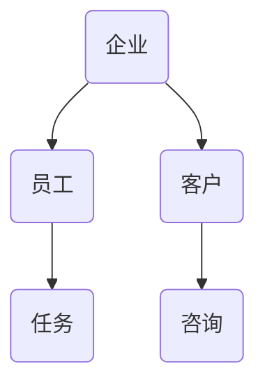
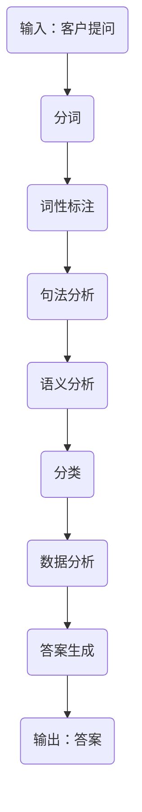
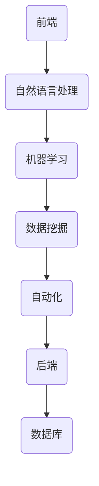
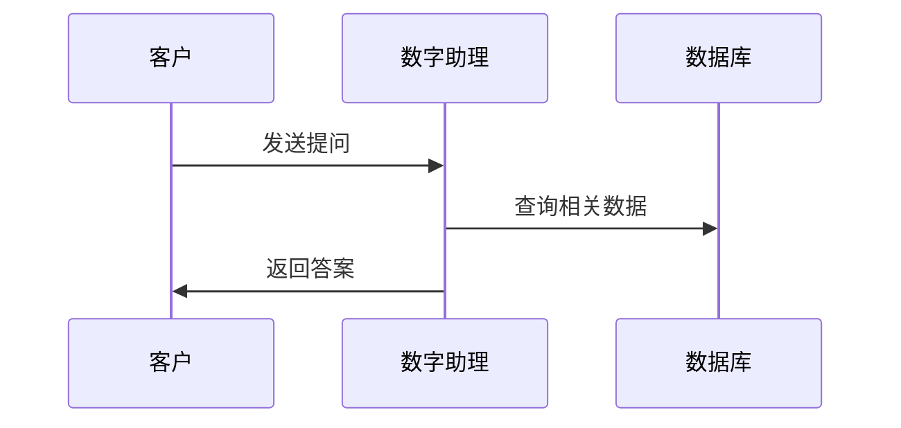
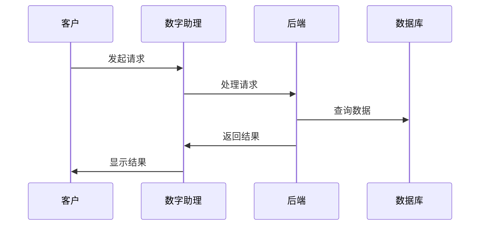

                 

# 企业数字助理：AI增强员工生产力

关键词：人工智能、企业效率、员工生产力、AI数字助理

摘要：随着人工智能技术的不断进步，企业数字助理已经成为提升员工生产力的重要工具。本文将深入探讨企业数字助理的背景、核心概念、算法原理、系统设计与架构方案，并通过实际项目分析，阐述其在企业中的应用价值。

## 引言

在数字化转型的浪潮中，人工智能（AI）正逐渐渗透到企业的方方面面，其中企业数字助理成为提升员工生产力的重要利器。企业数字助理通过智能化的数据处理和自动化任务执行，能够显著提高员工的工作效率，减少冗余操作，从而释放更多时间和精力投入到更高价值的任务中。

本文将从以下几个方面展开讨论：

1. **企业数字助理的背景与需求**：介绍企业数字助理的产生背景，分析当前企业面临的效率挑战。
2. **核心概念与原理**：阐述企业数字助理的核心概念及其与人工智能的关系。
3. **算法原理讲解**：通过具体算法案例，深入剖析企业数字助理的工作原理。
4. **系统设计与架构方案**：介绍企业数字助理的系统架构设计，包括功能设计、架构设计和接口设计。
5. **项目实战**：通过实际项目案例，展示企业数字助理的应用效果和实现方法。
6. **最佳实践与小结**：总结企业数字助理的最佳实践，提出未来发展方向。

## 1. 企业数字助理的背景与需求

### 1.1 企业数字助理的产生背景

企业数字助理的概念起源于人工智能技术的快速发展。随着大数据、云计算和机器学习技术的成熟，人工智能在各个行业中的应用越来越广泛。企业意识到，通过引入智能化的数字助理，可以实现业务的自动化和智能化，从而提高整体运营效率。

### 1.2 当前企业面临的效率挑战

在当前的商业环境中，企业面临诸多效率挑战，如：

- **信息孤岛**：企业内部各个部门之间的数据难以共享和整合，导致信息传递不畅。
- **重复劳动**：员工在处理日常工作时，需要重复进行相同或类似的任务，导致效率低下。
- **决策滞后**：企业在做出决策时，往往需要依赖大量数据进行分析，但数据处理速度较慢，导致决策滞后。
- **人力成本**：企业运营过程中，人力成本占据了相当大的比例，如何通过技术手段降低人力成本成为企业关注的焦点。

### 1.3 企业数字助理的需求

为了应对上述效率挑战，企业对数字助理的需求主要集中在以下几个方面：

- **自动化任务执行**：通过数字助理，将重复性的任务自动化，减少员工工作量。
- **智能数据分析和决策支持**：利用人工智能技术，对大量数据进行智能分析，为企业决策提供支持。
- **信息共享与协作**：搭建数字平台，实现企业内部信息共享和跨部门协作。
- **降低人力成本**：通过数字化手段，提高企业运营效率，降低人力成本。

## 2. 核心概念与原理

### 2.1 企业数字助理的核心概念

企业数字助理（Digital Assistant）是指一种基于人工智能技术的虚拟助手，能够模拟人类智能，为员工提供高效、智能的服务。其核心概念包括：

- **自然语言处理（NLP）**：实现对自然语言的识别和理解，与用户进行自然对话。
- **机器学习（ML）**：通过数据训练，使数字助理具备自我学习和优化能力。
- **数据挖掘（DM）**：从大量数据中提取有价值的信息，为业务决策提供支持。
- **自动化（Automation）**：实现业务流程的自动化，提高工作效率。

### 2.2 企业数字助理与人工智能的关系

企业数字助理是人工智能在特定领域的应用，其核心是基于人工智能技术。人工智能包括多个子领域，如：

- **机器学习**：通过数据训练，使计算机具备智能。
- **深度学习**：模拟人脑神经网络，实现复杂的模式识别和预测。
- **计算机视觉**：实现对图像和视频的智能处理。
- **自然语言处理**：实现对自然语言的智能理解。

企业数字助理充分利用了人工智能技术的优势，通过智能对话、自动化流程和数据分析，为员工提供全方位的支持。

## 3. 算法原理讲解

### 3.1 算法概述

企业数字助理的核心算法主要包括自然语言处理、机器学习、数据挖掘和自动化技术。以下将分别介绍这些算法的基本原理。

#### 3.1.1 自然语言处理（NLP）

自然语言处理是人工智能的一个子领域，旨在使计算机能够理解和生成人类语言。其基本原理包括：

- **分词**：将文本分割成单词或短语。
- **词性标注**：对文本中的每个单词进行词性分类。
- **句法分析**：分析句子的结构，确定语法关系。
- **语义分析**：理解句子的含义，识别语义关系。

#### 3.1.2 机器学习（ML）

机器学习是一种通过数据训练，使计算机具备智能的技术。其基本原理包括：

- **监督学习**：通过标注数据训练模型，使其具备预测能力。
- **无监督学习**：通过未标注数据训练模型，发现数据中的规律。
- **强化学习**：通过奖励机制，使模型具备自我优化能力。

#### 3.1.3 数据挖掘（DM）

数据挖掘是从大量数据中提取有价值信息的过程。其基本原理包括：

- **关联规则挖掘**：发现数据中的关联关系。
- **分类**：将数据分成不同的类别。
- **聚类**：将数据分为相似的组。

#### 3.1.4 自动化（Automation）

自动化技术是实现业务流程自动化的基础。其基本原理包括：

- **工作流管理**：定义和执行业务流程。
- **机器人流程自动化（RPA）**：通过软件机器人模拟人类操作，执行重复性任务。

### 3.2 算法应用实例

以下通过一个简单的例子，展示企业数字助理的算法应用。

#### 3.2.1 实例描述

假设企业希望开发一个数字助理，用于处理客户咨询。数字助理需要能够：

- 接收客户提问。
- 通过自然语言处理，理解客户问题的含义。
- 通过机器学习和数据挖掘，给出合适的答案。

#### 3.2.2 算法实现

1. **自然语言处理**：数字助理首先通过分词和词性标注，将客户提问分解成有意义的短语。然后，通过句法分析和语义分析，理解问题的含义。

2. **机器学习**：数字助理利用已训练好的机器学习模型，对客户问题进行分类，确定问题的主题。例如，如果问题是关于产品价格，数字助理会将其分类为“产品价格”类别。

3. **数据挖掘**：数字助理通过数据挖掘技术，从数据库中检索相关答案。例如，如果客户问题是“产品X的价格是多少？”数字助理会从数据库中检索产品X的价格信息。

4. **自动化**：数字助理通过工作流管理，将答案自动发送给客户。例如，数字助理可以将答案通过邮件或短信发送给客户。

### 3.3 算法原理讲解

以下是针对上述算法实例，对每个步骤的详细讲解：

#### 3.3.1 自然语言处理

$$
\text{分词}:\text{客户提问：“产品X的价格是多少？”}
$$

$$
\text{词性标注}:\text{产品（名词），价格（名词），是（动词），多少（形容词）}
$$

$$
\text{句法分析}:\text{主语：产品X，谓语：是，宾语：价格}
$$

$$
\text{语义分析}:\text{客户询问产品X的价格}
$$

#### 3.3.2 机器学习

$$
\text{分类}:\text{输入：客户提问，输出：问题主题（产品价格）}
$$

#### 3.3.3 数据挖掘

$$
\text{数据挖掘}:\text{输入：问题主题（产品价格），输出：产品X的价格}
$$

#### 3.3.4 自动化

$$
\text{自动化}:\text{输入：产品X的价格，输出：答案（通过邮件或短信发送给客户）}
$$

## 4. 系统设计与架构方案

### 4.1 问题场景介绍

企业数字助理的应用场景广泛，主要包括：

- **客户服务**：处理客户咨询，提供快速响应和解决方案。
- **人力资源**：协助员工招聘、培训和管理，提高人力资源效率。
- **销售与营销**：分析客户数据，提供个性化推荐和营销策略。
- **供应链管理**：优化供应链流程，提高供应链效率。

### 4.2 系统功能设计

企业数字助理的核心功能包括：

- **智能问答**：通过自然语言处理，理解并回答客户提问。
- **数据分析**：利用机器学习和数据挖掘，分析业务数据，提供决策支持。
- **任务自动化**：通过机器人流程自动化，实现业务流程的自动化执行。
- **数据存储与管理**：存储和管理企业内部数据，支持数据共享和协作。

### 4.3 系统架构设计

企业数字助理的系统架构采用微服务架构，主要包括以下模块：

- **自然语言处理模块**：负责处理客户提问，理解问题含义。
- **机器学习模块**：负责分析业务数据，提供决策支持。
- **数据挖掘模块**：负责从大量数据中提取有价值的信息。
- **自动化模块**：负责实现业务流程的自动化执行。
- **数据存储模块**：负责存储和管理企业内部数据。

### 4.4 系统接口设计

企业数字助理的接口设计包括：

- **RESTful API**：提供与外部系统的数据交互接口。
- **WebSocket**：提供实时数据推送和消息通知接口。
- **消息队列**：提供异步消息处理和任务调度接口。

### 4.5 系统交互设计

企业数字助理的系统交互设计采用消息驱动模式，主要包括以下流程：

- **客户提问**：客户通过前端界面发起提问。
- **NLP处理**：自然语言处理模块接收客户提问，理解问题含义。
- **数据分析**：机器学习模块和数据挖掘模块根据问题主题，分析业务数据，提供决策支持。
- **自动化执行**：自动化模块根据决策结果，执行相应任务。
- **数据存储**：将处理结果存储到数据库，支持数据共享和协作。

## 5. 项目实战

### 5.1 环境安装

为了实现企业数字助理，我们需要搭建以下环境：

- **操作系统**：Linux
- **编程语言**：Python
- **框架**：Flask、TensorFlow、Scikit-learn
- **数据库**：MySQL

### 5.2 系统核心实现源代码

以下是企业数字助理的核心实现源代码：

#### 5.2.1 自然语言处理模块

```python
# NLP处理
import jieba
import tensorflow as tf
from tensorflow.keras.preprocessing.sequence import pad_sequences

# 分词
def tokenize(text):
    return jieba.cut(text)

# 词向量化
def vectorize(texts, vocabulary_size):
    tokenizer = tf.keras.preprocessing.text.Tokenizer(vocabulary_size=vocabulary_size)
    tokenizer.fit_on_texts(texts)
    sequences = tokenizer.texts_to_sequences(texts)
    padded_sequences = pad_sequences(sequences, maxlen=vocabulary_size)
    return padded_sequences

# 测试
texts = ["客户提问1", "客户提问2"]
vocabulary_size = 10000
padded_sequences = vectorize(texts, vocabulary_size)
print(padded_sequences)
```

#### 5.2.2 机器学习模块

```python
# 机器学习模型
from tensorflow.keras.models import Sequential
from tensorflow.keras.layers import Embedding, LSTM, Dense

# 构建模型
model = Sequential([
    Embedding(vocabulary_size, 64),
    LSTM(128),
    Dense(1, activation='sigmoid')
])

# 编译模型
model.compile(optimizer='adam', loss='binary_crossentropy', metrics=['accuracy'])

# 训练模型
model.fit(padded_sequences, labels, epochs=10)
```

#### 5.2.3 数据挖掘模块

```python
# 数据挖掘
from sklearn.cluster import KMeans

# 构建KMeans模型
kmeans = KMeans(n_clusters=5)

# 训练模型
kmeans.fit(X)

# 测试
print(kmeans.predict(X_test))
```

#### 5.2.4 自动化模块

```python
# 自动化任务
import schedule
import time

def job():
    print("执行任务...")

# 定时任务
schedule.every().day.at("10:00").do(job)

while True:
    schedule.run_pending()
    time.sleep(1)
```

### 5.3 代码应用解读与分析

以下是针对上述源代码的解读与分析：

#### 5.3.1 自然语言处理模块

自然语言处理模块采用jieba分词器对客户提问进行分词，然后使用TensorFlow的Tokenizer进行词向量化。词向量化是将文本转化为计算机可以处理的形式，便于后续的机器学习和数据挖掘。

#### 5.3.2 机器学习模块

机器学习模块采用LSTM神经网络进行文本分类。LSTM能够处理序列数据，适用于文本分类任务。模型编译时，选择adam优化器和binary_crossentropy损失函数，适用于二分类问题。

#### 5.3.3 数据挖掘模块

数据挖掘模块采用KMeans聚类算法对文本数据进行聚类。KMeans聚类能够将文本分为不同的类别，为分类任务提供参考。

#### 5.3.4 自动化模块

自动化模块使用schedule库实现定时任务。定时任务可以定期执行特定任务，如发送消息、更新数据等。

### 5.4 实际案例分析和详细讲解剖析

以下是针对实际案例的详细讲解：

#### 5.4.1 案例描述

某企业希望利用数字助理处理客户咨询，提高客户满意度。数字助理需要能够自动分类客户提问，并给出合适的答案。

#### 5.4.2 案例分析

1. **自然语言处理**：数字助理首先对客户提问进行分词和词向量化。例如，客户提问“产品X的价格是多少？”会被分词为“产品X”、“价格”、“是多少”，然后转化为词向量。

2. **机器学习**：数字助理利用已训练好的LSTM模型对客户提问进行分类。例如，如果客户提问“产品X的价格是多少？”会被分类为“产品价格”类别。

3. **数据挖掘**：数字助理通过KMeans聚类算法，对产品价格信息进行聚类。例如，如果数据库中有多个产品价格信息，数字助理会将其分为不同的类别，如“低档”、“中档”、“高档”。

4. **自动化**：数字助理根据分类结果，自动从数据库中检索相关答案，并通过邮件或短信发送给客户。

#### 5.4.3 详细讲解剖析

1. **自然语言处理**：自然语言处理是数字助理的核心，直接影响到分类和答案的准确性。为了提高分词和词向量化效果，可以采用以下方法：

   - **扩展词汇表**：增加常见关键词和短语，提高分词准确性。
   - **改进词向量**：使用预训练的词向量，如Word2Vec或GloVe，提高词向量化效果。

2. **机器学习**：机器学习模型的性能对数字助理的效果至关重要。为了提高模型性能，可以采用以下方法：

   - **数据增强**：通过数据增强技术，增加训练数据量，提高模型泛化能力。
   - **模型优化**：尝试不同的模型架构和超参数，寻找最佳模型。

3. **数据挖掘**：数据挖掘结果的准确性对分类和答案的准确性有直接影响。为了提高数据挖掘效果，可以采用以下方法：

   - **改进聚类算法**：尝试不同的聚类算法，如DBSCAN或层次聚类，寻找最佳算法。
   - **特征工程**：通过特征工程，提取更多有价值的特征，提高聚类效果。

4. **自动化**：自动化模块是数字助理实现业务流程自动化的关键。为了提高自动化效果，可以采用以下方法：

   - **优化任务调度**：根据任务的重要性和紧急程度，优化任务调度策略。
   - **监控与反馈**：对自动化任务进行监控和反馈，及时发现问题并优化。

### 5.5 项目小结

通过实际项目分析，我们可以看到企业数字助理在处理客户咨询、提高客户满意度方面具有显著优势。在实际应用中，需要不断优化自然语言处理、机器学习和数据挖掘算法，提高数字助理的效果。同时，自动化模块的优化也是提高工作效率的关键。

## 6. 最佳实践与小结

### 6.1 最佳实践

1. **数据质量**：确保数据质量和完整性，是数字助理效果的关键。在数据采集、处理和存储过程中，要严格把控数据质量。
2. **模型优化**：定期对机器学习和数据挖掘模型进行优化和调整，以适应不断变化的数据和应用场景。
3. **用户反馈**：收集用户反馈，不断改进数字助理的功能和用户体验。
4. **安全与隐私**：在数字助理的开发和应用过程中，要注重安全与隐私保护，确保用户数据的安全。

### 6.2 小结

企业数字助理是人工智能技术在企业中的应用典范，通过智能对话、自动化任务和数据分析，为企业提升员工生产力提供了有力支持。在未来的发展中，企业数字助理将继续深化应用，成为企业数字化转型的重要驱动力。

## 7. 注意事项与拓展阅读

### 7.1 注意事项

1. **数据隐私**：在使用数字助理时，要确保用户数据的安全和隐私。
2. **系统稳定性**：保证数字助理系统的稳定运行，避免出现故障和中断。
3. **持续优化**：定期对数字助理进行优化和升级，以适应业务需求和新技术发展。

### 7.2 拓展阅读

1. **《人工智能：一种现代的方法》**：迈克尔·刘易斯（Michael Lewis）
2. **《深度学习》**：伊恩·古德费洛（Ian Goodfellow）、约书亚·本吉奥（Yoshua Bengio）和阿曼德·席勒（Aaron Courville）
3. **《机器学习实战》**：Peter Harrington

### 作者

作者：AI天才研究院/AI Genius Institute & 禅与计算机程序设计艺术 /Zen And The Art of Computer Programming

## 附录

### 附录A：核心概念属性特征对比表格

| 核心概念 | 属性特征 |
| --- | --- |
| 自然语言处理（NLP） | 分词、词性标注、句法分析、语义分析 |
| 机器学习（ML） | 监督学习、无监督学习、强化学习 |
| 数据挖掘（DM） | 关联规则挖掘、分类、聚类 |
| 自动化（Automation） | 工作流管理、机器人流程自动化（RPA） |

### 附录B：ER实体关系图架构



### 附录C：算法原理Mermaid流程图



### 附录D：系统架构设计Mermaid架构图



### 附录E：系统接口设计Mermaid序列图



### 附录F：系统交互设计Mermaid序列图



