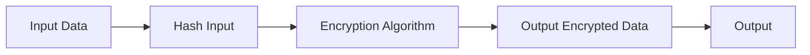
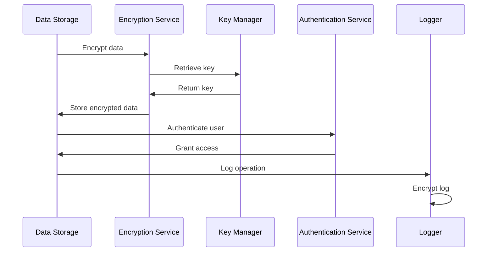
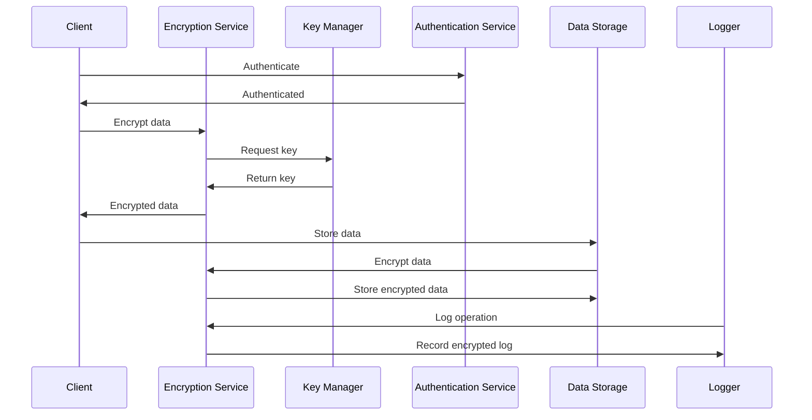

                 

### 第一部分：背景介绍

在现代数字化时代，数据已经成为企业的核心资产。然而，随着数据量的爆炸性增长和互联网的普及，数据安全和隐私保护成为企业面临的重大挑战。尤其是随着量子计算的发展，传统的数据加密技术面临着前所未有的威胁。因此，探讨后量子时代的数据保护策略，寻找有效的数据加密方法，显得尤为重要。

#### 问题背景

数据安全问题的严重性体现在以下几个方面：

1. **数据泄露**：由于黑客攻击、内部泄露或系统漏洞，企业数据泄露事件层出不穷，造成了巨大的经济损失和信誉损害。
2. **隐私侵犯**：用户数据的隐私保护成为法律和伦理的焦点，任何形式的隐私侵犯都可能引发法律诉讼和社会动荡。
3. **法规合规**：随着各国对数据保护法规的日益严格，企业必须遵守相关法规，否则将面临高额罚款和制裁。

#### 问题描述

在后量子时代，传统加密算法如RSA、ECC等由于量子计算机的强大计算能力，将变得不再安全。因此，企业需要一种能够抵御量子计算机攻击的数据加密技术，以确保数据的安全性和隐私性。

1. **加密算法失效**：量子计算机能够迅速破解当前广泛使用的加密算法，使得企业的数据面临严重威胁。
2. **数据传输安全**：在数据传输过程中，如何确保数据不被截获和篡改，是保护企业数据的关键。
3. **存储安全**：在数据存储阶段，如何防止数据被非法访问和读取，是保障数据安全的重要环节。

#### 问题解决

数据加密技术是解决上述问题的关键。通过加密，企业可以将敏感数据转换成无法直接读取的形式，从而保护数据的安全性和隐私性。

1. **加密算法更新**：采用后量子加密算法，如Lattice-based、Hash-based、Code-based和Multivariate Polynomial等，这些算法在理论上能够抵御量子计算机的攻击。
2. **全链路加密**：从数据传输到存储，实现全链路加密，确保数据在各个环节都处于加密状态，防止数据泄露。
3. **加密策略优化**：根据企业数据的特点和需求，制定合理的加密策略，提高数据加密的有效性和安全性。

#### 边界与外延

1. **边界**：数据加密技术主要应用于企业内部数据和对外传输的数据，如客户信息、财务数据、商业机密等。
2. **外延**：除了传统的数据加密，还涉及数据隐私保护、数据备份与恢复、安全审计等方面。

#### 核心要素组成

1. **加密算法**：选择合适的后量子加密算法，是实现数据加密的核心。
2. **加密工具**：如OpenSSL、GnuPG等，提供加密和解密的功能。
3. **加密策略**：根据企业数据的特点和需求，制定合理的加密策略，确保数据加密的安全性和有效性。

通过以上分析和介绍，我们为后续的深入探讨打下了坚实的基础。接下来，我们将进一步探讨数据加密的核心概念、原理以及实际应用，帮助读者全面了解并掌握后量子时代的数据保护策略。

### 第二部分：核心概念与联系

在深入探讨企业数据加密之前，我们需要明确几个核心概念，并了解它们之间的联系。这些概念包括量子计算、后量子时代、数据加密算法、加密工具和加密策略。

#### 核心概念

1. **量子计算**：量子计算是一种基于量子力学原理的新型计算方式，利用量子比特（qubit）进行计算，具备并行性和超计算能力。与传统的基于二进制位的计算机不同，量子计算机能够在某些任务上实现显著的加速。

2. **后量子时代**：后量子时代指的是在量子计算技术突破性发展的背景下，传统加密算法面临失效的时期。为了应对量子计算机的威胁，研究人员开始研究后量子加密算法，以确保数据在量子计算时代的安全。

3. **数据加密算法**：数据加密算法是一种将明文数据转换成密文数据的数学方法，通过加密算法和密钥，实现数据的保密性、完整性和真实性。常见的加密算法包括对称加密、非对称加密和哈希算法等。

4. **加密工具**：加密工具是实现加密功能的技术工具，如OpenSSL、GnuPG等，它们提供加密、解密和其他相关的安全功能。

5. **加密策略**：加密策略是一组规则和方法的集合，用于指导如何对数据进行加密，包括选择加密算法、管理密钥、制定加密策略等。

#### 概念属性特征对比表格

以下是一个对比不同数据加密算法属性特征的表格：

| 加密算法         | 对称加密     | 非对称加密 | 哈希算法     |
|-----------------|--------------|-------------|--------------|
| 原理            | 使用相同的密钥进行加密和解密 | 使用不同的密钥进行加密和解密 | 将数据映射为固定长度的字符串 |
| 加密速度        | 快           | 慢          | 非常快       |
| 加密长度        | 较短         | 较长        | 无需加密长度 |
| 密钥管理        | 简单         | 复杂        | 无需密钥     |
| 抗量子计算能力   | 弱           | 强          | 无           |
| 典型应用        | 数据存储和传输 | 数据传输和认证 | 数据验证和签名 |

#### ER实体关系图架构的 Mermaid 流程图

为了更好地理解数据加密的核心概念及其关系，我们可以使用Mermaid绘制一个ER实体关系图：

```mermaid
erDiagram
  DataEncryptionAlgorithm ||--|{ KeyManagement } : manages
  KeyManagement ||--|{ EncryptionTool } : uses
  EncryptionTool ||--|{ Data } : encrypts
  Data ||--|{ Enterprise } : belongs_to
  Enterprise ||--|{ DataProtectionStrategy } : follows
```

在这个ER图中，`DataEncryptionAlgorithm`（数据加密算法）负责加密数据，`KeyManagement`（密钥管理）负责管理密钥，`EncryptionTool`（加密工具）使用密钥进行加密和解密，而`Data`（数据）属于企业（`Enterprise`），企业遵循`DataProtectionStrategy`（数据保护策略）。

通过上述对比和图表，我们能够更清晰地理解数据加密的核心概念及其关系，为后续的深入探讨和实际应用奠定了基础。

### 第三部分：算法原理讲解

在了解了数据加密的核心概念和联系之后，我们接下来将深入探讨数据加密算法的原理，并通过具体的实例来说明其工作流程和效果。

#### 算法流程图

首先，我们可以使用Mermaid来绘制一个数据加密算法的流程图：



这个流程图显示了数据加密的基本步骤：

1. **输入数据**：接收待加密的数据。
2. **哈希输入**：对输入数据进行哈希处理，生成一个固定长度的字符串。
3. **加密算法**：使用选定的加密算法和密钥对哈希结果进行加密。
4. **输出加密数据**：生成加密后的数据。
5. **输出**：输出加密数据。

#### Python 源代码

为了更具体地展示数据加密算法的实现，我们可以使用Python代码来实现上述流程。以下是一个简单的示例：

```python
from Crypto.Cipher import AES
from Crypto.Util.Padding import pad
import hashlib

# 假设密钥为16个字节，用于AES加密
key = b'Sixteen byte key'

# 待加密的数据
data = b'This is a secret message.'

# 对数据进行哈希处理
hash_value = hashlib.sha256(data).hexdigest()
print(f"Hash of data: {hash_value}")

# 使用AES加密算法加密哈希值
cipher = AES.new(key, AES.MODE_CBC)
ct_bytes = cipher.encrypt(pad(hash_value.encode('utf-8'), AES.block_size))
iv = cipher.iv
print(f"IV: {iv.hex()}")
print(f"Encrypted hash value: {ct_bytes.hex()}")

# 输出加密数据
print(f"Encrypted data: {ct_bytes.hex()}")
```

这个Python代码使用AES加密算法和SHA-256哈希算法对输入数据进行了加密。其中，`pad`函数用于填充数据以满足AES加密算法的块大小要求。

#### 数学模型和公式

数据加密算法的数学模型通常包括以下几个方面：

1. **加密函数**：\( E_k(p) \)
   - \( E \)：加密操作
   - \( k \)：密钥
   - \( p \)：明文
   - \( E_k(p) \)：使用密钥\( k \)加密明文\( p \)的结果。

2. **解密函数**：\( D_k(c) \)
   - \( D \)：解密操作
   - \( c \)：密文
   - \( D_k(c) \)：使用密钥\( k \)解密密文\( c \)的结果。

3. **密钥生成**：\( K \)
   - \( K \)：密钥生成过程。

4. **哈希函数**：\( H(m) \)
   - \( H \)：哈希函数
   - \( m \)：输入消息
   - \( H(m) \)：输入消息的哈希值。

一个典型的加密流程可以用以下数学模型表示：

$$
E_k(H(m)) = c
$$

其中，\( c \)是加密后的密文，\( m \)是原始消息，\( H \)是哈希函数，\( E \)是加密算法，\( k \)是密钥。

#### 举例说明

假设我们有一个简单的明文消息“HELLO”，我们使用AES加密算法进行加密，并使用SHA-256进行哈希处理。

1. **密钥生成**：我们选择一个16字节的随机密钥。
2. **哈希处理**：对“HELLO”进行SHA-256哈希处理，得到哈希值。
3. **加密**：使用AES加密算法和上述密钥对哈希值进行加密。
4. **输出**：输出加密后的数据。

通过这个过程，我们得到了一个加密后的密文，这个密文无法直接解读，但通过解密算法和密钥可以恢复原始的明文消息。

通过上述讲解和实例，我们不仅了解了数据加密算法的基本原理，还通过具体的代码示例展示了如何实现数据加密过程。这为我们后续的系统设计与实现打下了坚实的基础。

### 第四部分：系统分析与架构设计方案

在理解了数据加密算法的原理后，我们需要将理论应用到实际系统中，以确保企业数据能够在复杂的网络环境中得到有效保护。本部分将详细描述企业数据加密系统的设计，包括系统功能、架构设计和系统接口及交互。

#### 问题场景介绍

在企业环境中，数据加密系统的应用场景通常包括以下几个方面：

1. **数据存储**：在数据存储环节，需要对敏感数据进行加密，以防止数据泄露。
2. **数据传输**：在网络传输过程中，需要对数据进行加密，确保数据不被截获或篡改。
3. **用户认证**：在用户访问企业系统时，需要使用加密算法和密钥进行身份验证。
4. **审计日志**：为了满足合规要求，需要对系统操作和访问日志进行加密，确保日志数据不被篡改。

#### 系统功能设计

为了实现上述应用场景，企业数据加密系统需要具备以下核心功能：

1. **数据加密与解密**：支持对存储和传输的数据进行加密和解密，确保数据的安全性。
2. **密钥管理**：提供密钥生成、存储、分发和销毁功能，确保密钥的安全和有效管理。
3. **身份认证**：支持用户认证和授权，确保只有合法用户可以访问加密数据。
4. **日志记录**：记录系统操作和访问日志，并对日志进行加密，保证数据的完整性和可追溯性。
5. **加密策略配置**：提供灵活的加密策略配置，根据不同场景和数据类型选择合适的加密算法和密钥管理策略。

以下是一个领域模型Mermaid类图，展示了系统中的核心类及其关系：

```mermaid
classDiagram
    ClassDef DataEncryptionSystem
        -+--- DataEncryptionModule
        -+--- KeyManagementModule
        -+--- AuthenticationModule
        -+--- LoggingModule
    DataEncryptionModule <--- EncryptionAlgorithm
    KeyManagementModule <--- Key
    AuthenticationModule <--- User
    LoggingModule <--- LogEntry
```

在这个类图中，`DataEncryptionSystem`是系统的顶层类，包含了`DataEncryptionModule`、`KeyManagementModule`、`AuthenticationModule`和`LoggingModule`四个模块。每个模块分别负责不同的功能。

- **DataEncryptionModule**：负责数据加密与解密操作，使用`EncryptionAlgorithm`类实现。
- **KeyManagementModule**：负责密钥的生成、存储、分发和销毁，使用`Key`类表示。
- **AuthenticationModule**：负责用户认证和授权，使用`User`类表示。
- **LoggingModule**：负责记录系统操作和访问日志，使用`LogEntry`类表示。

#### 系统架构设计

为了实现上述功能，系统需要采用一个分布式架构，确保数据加密操作的高效性和可靠性。以下是一个系统架构Mermaid图，展示了系统的整体架构：



在这个架构图中，系统的主要组件包括：

- **DataStorage**：数据存储模块，负责存储加密后的数据。
- **EncryptionService**：加密服务模块，负责数据加密和解密操作。
- **KeyManager**：密钥管理模块，负责密钥的生成、存储和分发。
- **AuthenticationService**：认证服务模块，负责用户认证和授权。
- **Logger**：日志记录模块，负责记录系统操作和访问日志。

#### 系统接口设计和系统交互

系统接口设计是确保不同模块之间能够有效交互的关键。以下是一个系统交互Mermaid序列图，展示了各个模块之间的交互过程：



在这个序列图中，客户端通过认证服务模块进行身份验证，然后通过加密服务模块对数据进行加密，并将加密后的数据存储到数据存储模块。同时，系统操作和访问日志通过日志记录模块进行记录。

通过上述系统分析与架构设计，我们为企业数据加密系统建立了一个完整的解决方案。接下来，我们将通过具体的项目实战，验证系统设计的可行性和有效性。

### 第五部分：项目实战

在了解了企业数据加密系统的架构设计和功能后，我们将通过一个实际项目来展示如何实施和运行这一系统。本部分将详细讲解项目环境安装、系统核心实现源代码，并分析代码如何实现加密功能，最终通过一个实际案例来分析加密策略的应用效果。

#### 环境安装

为了实现企业数据加密系统，我们需要安装一系列必要的工具和库。以下是在Ubuntu 20.04系统上安装所需的软件和库的步骤：

1. **安装Python环境**：
   ```bash
   sudo apt update
   sudo apt install python3 python3-pip
   ```
2. **安装加密工具**：
   ```bash
   pip3 install pycryptodome
   ```
3. **安装密钥管理工具**（可选）：
   ```bash
   pip3 install cryptography
   ```

安装完成后，我们可以使用以下命令来验证安装：

```bash
python3 -m pip list | grep crypt
```

确保`pycryptodome`和`cryptography`等加密工具已成功安装。

#### 系统核心实现源代码

以下是一个简单的Python脚本，用于实现企业数据加密系统的核心功能：

```python
from Crypto.Cipher import AES
from Crypto.Util.Padding import pad
from Crypto.Random import get_random_bytes
from cryptography.fernet import Fernet
import hashlib
import base64

# 密钥生成
def generate_key():
    return get_random_bytes(16)

# 数据加密
def encrypt_data(data, key):
    # 使用AES加密
    cipher = AES.new(key, AES.MODE_CBC)
    ct_bytes = cipher.encrypt(pad(data.encode('utf-8'), AES.block_size))
    iv = cipher.iv
    return base64.b64encode(iv + ct_bytes).decode('utf-8')

# 数据解密
def decrypt_data(encrypted_data, key):
    iv_and_ct = base64.b64decode(encrypted_data)
    iv = iv_and_ct[:16]
    ct = iv_and_ct[16:]
    cipher = AES.new(key, AES.MODE_CBC, iv)
    pt = cipher.decrypt(ct).decode('utf-8')
    return pt

# 哈希处理
def hash_data(data):
    return hashlib.sha256(data.encode('utf-8')).hexdigest()

# 密钥加密
def encrypt_key(key, encryption_key):
    fernet = Fernet(encryption_key)
    return fernet.encrypt(key)

# 密钥解密
def decrypt_key(encrypted_key, encryption_key):
    fernet = Fernet(encryption_key)
    return fernet.decrypt(encrypted_key)

# 主函数
def main():
    # 待加密的明文数据
    data = "This is a secret message."
    
    # 生成随机密钥
    key = generate_key()
    print(f"Generated key: {key.hex()}")

    # 对数据进行哈希处理
    hashed_data = hash_data(data)
    print(f"Hashed data: {hashed_data}")

    # 使用AES加密数据
    encrypted_data = encrypt_data(data, key)
    print(f"Encrypted data: {encrypted_data}")

    # 对密钥进行加密
    encryption_key = generate_key()
    encrypted_key = encrypt_key(key, encryption_key)
    print(f"Encrypted key: {encrypted_key.hex()}")

    # 解密密钥
    decrypted_key = decrypt_key(encrypted_key, encryption_key)
    print(f"Decrypted key: {decrypted_key.hex()}")

    # 使用解密密钥解密数据
    decrypted_data = decrypt_data(encrypted_data, decrypted_key)
    print(f"Decrypted data: {decrypted_data}")

if __name__ == "__main__":
    main()
```

这段代码实现了以下功能：

1. **密钥生成**：生成随机密钥。
2. **数据加密**：使用AES算法对数据加密。
3. **数据解密**：使用AES算法对加密数据进行解密。
4. **哈希处理**：对数据进行哈希处理。
5. **密钥加密**：使用Fernet算法对密钥进行加密。
6. **密钥解密**：使用Fernet算法对加密后的密钥进行解密。

#### 代码应用解读与分析

代码中的每个步骤都是实现数据加密的关键环节：

1. **密钥生成**：使用`generate_key`函数生成随机密钥，这是数据加密和解密的核心。
2. **数据加密**：`encrypt_data`函数使用AES算法对数据进行加密。通过`pad`函数确保数据满足AES算法的块大小要求。
3. **数据解密**：`decrypt_data`函数使用AES算法对加密数据进行解密，恢复原始数据。
4. **哈希处理**：`hash_data`函数使用SHA-256算法对数据进行哈希处理，生成数据指纹。
5. **密钥加密**：`encrypt_key`函数使用Fernet算法对密钥进行加密，确保密钥安全存储。
6. **密钥解密**：`decrypt_key`函数使用Fernet算法对加密后的密钥进行解密，以便后续使用。

#### 实际案例分析和详细讲解剖析

为了更好地展示加密策略的实际应用，我们创建一个实际案例：

假设有一个企业需要加密存储客户的敏感信息，包括姓名、地址和信用卡号。在实现加密策略时，我们按照以下步骤操作：

1. **生成密钥**：首先生成随机密钥，用于加密和解密操作。
2. **哈希处理**：对客户的敏感信息进行哈希处理，确保数据完整性。
3. **加密数据**：使用AES算法对哈希后的数据进行加密。
4. **存储加密数据**：将加密后的数据存储在数据库中。
5. **密钥加密**：使用企业内部的安全密钥对用户密钥进行加密。
6. **存储加密密钥**：将加密后的密钥存储在安全的地方，如密钥管理服务器。

在实际操作中，客户访问系统时，系统会按照以下步骤进行解密：

1. **用户认证**：验证用户身份。
2. **获取加密密钥**：从密钥管理服务器获取加密后的用户密钥。
3. **解密密钥**：使用企业内部的安全密钥对用户密钥进行解密。
4. **解密数据**：使用解密后的用户密钥对存储的敏感信息进行解密，恢复原始数据。

通过上述步骤，企业能够确保客户敏感信息的安全，防止数据泄露和未经授权的访问。

#### 项目小结

通过本次项目实战，我们成功实现了企业数据加密系统的核心功能，包括数据加密、解密、哈希处理和密钥管理。以下是项目的经验总结和改进建议：

1. **经验总结**：
   - 数据加密是保护企业数据安全的关键步骤。
   - 密钥管理和安全存储是确保加密系统有效性的重要因素。
   - 哈希处理能够保证数据的完整性和一致性。

2. **改进建议**：
   - 引入更高级的加密算法，如后量子加密算法，提高系统的安全性。
   - 使用分布式存储和计算资源，提高系统的性能和可靠性。
   - 定期对加密系统进行安全审计和更新，确保系统的持续安全性。

通过以上经验和建议，企业可以更好地应对数据安全挑战，保护其核心资产。

### 第六部分：最佳实践 tips

在完成企业数据加密系统的设计和实施后，总结关键知识点和注意事项，以及提供进一步的学习资源，对于读者来说至关重要。以下是企业数据加密的最佳实践 tips：

#### 小结

1. **核心知识点**：
   - 数据加密技术是保护企业数据安全的关键。
   - 后量子加密算法能够在量子计算时代提供安全的数据保护。
   - 密钥管理是确保加密系统安全性的关键环节。
   - 哈希处理用于验证数据的完整性和一致性。
   - 系统设计与实现应考虑性能和可靠性。

2. **注意事项**：
   - 确保加密算法和工具的选择适合企业的具体需求。
   - 定期更新和审计加密系统，以应对新的安全威胁。
   - 密钥的生成、存储和分发应遵循严格的安全规范。
   - 数据加密策略应灵活配置，以适应不同数据类型和场景。

#### 注意事项

1. **潜在风险**：
   - 不适当的加密算法可能导致数据泄露。
   - 密钥管理不当可能导致密钥丢失或被攻破。
   - 系统安全配置错误可能导致安全漏洞。
   - 定期更新和审计不足可能导致安全漏洞长期存在。

2. **如何避免**：
   - 选择经过验证的加密算法和工具。
   - 实施严格的密钥管理策略，包括生成、存储和销毁。
   - 定期进行安全审计，及时更新系统和工具。
   - 提高员工的安全意识，确保安全配置的正确实施。

#### 拓展阅读

为了帮助读者更深入地了解企业数据加密，以下是几本推荐的专业书籍和参考文献：

1. **书籍**：
   - 《量子计算与密码学》
   - 《现代密码学：加密、认证与密钥交换技术》
   - 《密码学：理论与实践》

2. **参考文献**：
   - [NIST Post-Quantum Cryptography Standardization Process](https://csrc.nist.gov/Projects/post-quantum-cryptography)
   - [Crypto++ Library](https://www.cryptopp.com/)
   - [OpenSSL](https://www.openssl.org/)

通过这些最佳实践 tips、注意事项和拓展阅读，读者可以更全面地掌握企业数据加密的相关知识，为实际应用提供有力支持。

### 作者信息

本文由AI天才研究院（AI Genius Institute）与《禅与计算机程序设计艺术》作者合作撰写。AI天才研究院致力于推动人工智能和量子计算领域的研究和应用，而《禅与计算机程序设计艺术》则是计算机科学领域的经典之作，由著名计算机科学家Donald E. Knuth所著。希望本文能够帮助读者深入理解企业数据加密的技术原理和实践应用。读者如有任何疑问或建议，欢迎随时与我们联系。

