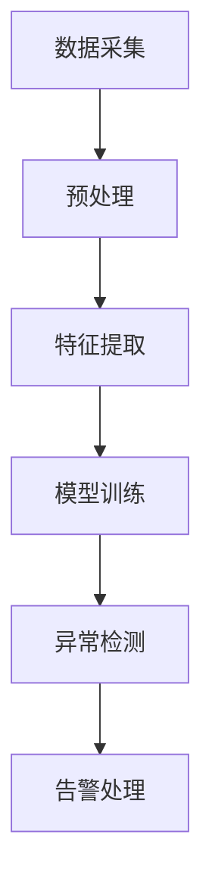
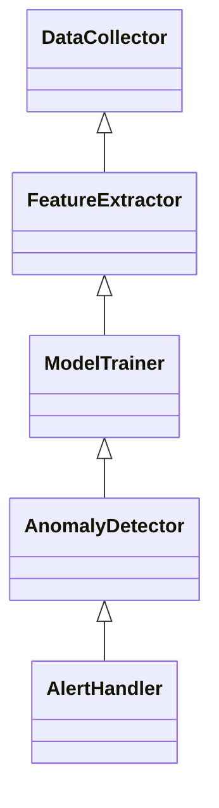
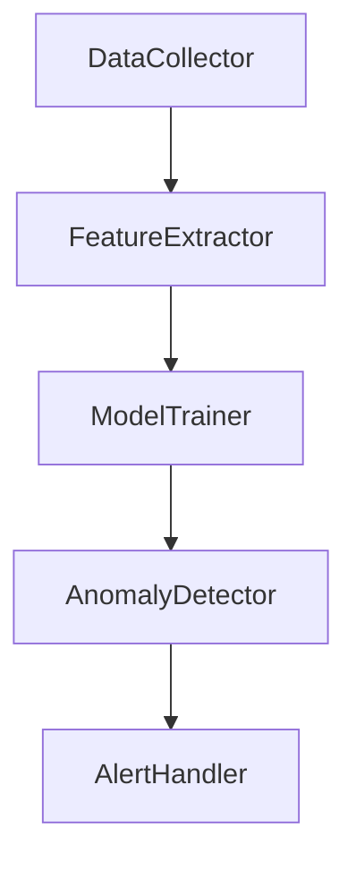
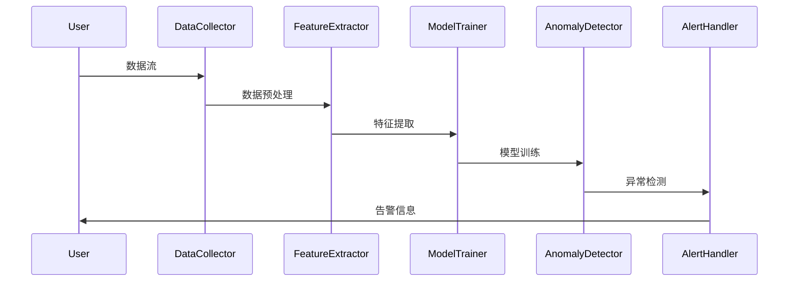

                 

# 企业数据安全AI：智能识别和防御数据泄露

> 关键词：企业数据安全、人工智能、数据泄露、智能识别、防御策略、AI算法

> 摘要：本文将深入探讨企业数据安全中的人工智能应用，重点分析如何通过智能识别和防御机制来降低数据泄露风险。我们将逐步解析AI技术在企业数据安全中的作用，详细阐述数据泄露识别与防御的技术原理和实战应用，为企业提供有效的数据安全策略建议。

## 第1章：企业数据安全AI概述

### 1.1 数据安全现状

随着信息化进程的加快，企业数据面临着前所未有的安全威胁。数据泄露事件的频繁发生，不仅严重威胁到企业的商业机密，还可能对用户隐私造成严重侵害。传统数据安全手段已难以应对复杂多变的安全威胁，因此，引入AI技术成为当前企业数据安全的重要趋势。

#### 问题背景

信息化浪潮的推进使得企业数据规模不断扩大，数据类型日益多样化。然而，随着数据量的增加，数据泄露的风险也随之上升。黑客攻击、内部泄露、软件漏洞等都是导致数据泄露的主要原因。

#### 问题描述

数据泄露事件的频繁发生，使得企业的声誉受损，商业机密被窃取，用户隐私受到侵犯。这些事件不仅给企业带来巨大的经济损失，还可能导致市场份额的丧失。

#### 问题解决

利用AI技术对数据进行智能识别和防御，可以大大降低数据泄露风险。AI技术可以通过机器学习和深度学习算法，实时分析数据流量和行为模式，识别潜在威胁，并采取相应的防御措施。

#### 边界与外延

数据安全涵盖的数据类型包括敏感信息、用户数据、财务数据等。安全威胁包括黑客攻击、内部泄露、恶意软件等。技术手段包括加密、访问控制、入侵检测等。

#### 概念结构与核心要素组成

数据安全策略是企业数据安全的总体规划和方针，包括安全政策、安全标准和安全流程等。防护体系是企业数据安全的核心，包括防火墙、入侵检测、数据加密等安全措施。监控机制是实时监控数据流和安全事件，确保数据安全。

### 1.2 AI在数据安全中的应用

#### 核心概念原理

AI技术在数据安全中的应用主要基于机器学习和深度学习算法。这些算法可以通过对大量历史数据的分析，建立模型来识别异常行为和潜在威胁。

#### 概念属性特征对比表格

| 算法       | 特点                                           | 优缺点                                               |
|------------|------------------------------------------------|------------------------------------------------------|
| 决策树     | 简单易懂，易于解释                             | 容易过拟合，对噪声敏感                               |
| 支持向量机 | 在高维空间有很好的表现                         | 参数选择复杂，计算量大                               |
| 随机森林   | 避免过拟合，提高模型泛化能力                   | 计算量大，模型复杂度增加                           |
| 深度学习   | 强大的特征提取能力，适用于大规模数据处理         | 模型训练复杂，对数据量要求高                         |

#### ER实体关系图架构的Mermaid流程图

```mermaid
erDiagram
  AI算法 ||--|{ 数据集 }
  数据集 ||--|{ 特征工程 }
  特征工程 ||--|{ 模型训练 }
  模型训练 ||--|{ 模型评估 }
  模型评估 ||--|{ 预测 }
```

### 1.3 智能识别数据泄露

#### 算法原理讲解

数据泄露识别的核心在于异常检测。通过分析数据流和行为模式，识别出异常行为，从而发现潜在的数据泄露风险。以下是一个简单的算法流程图：



使用Python代码实现数据泄露检测的算法：

```python
import numpy as np
from sklearn.ensemble import IsolationForest

# 数据采集
data = np.array([[1, 2], [2, 3], [100, 101]])

# 特征提取
# 这里直接使用原始数据作为特征

# 模型训练
model = IsolationForest(contamination=0.1)
model.fit(data)

# 异常检测
predictions = model.predict(data)
print(predictions)
```

#### 数学模型和公式

假设我们有一个数据集\( D \)，其中每个数据点\( x \)都可以表示为\( x = [x_1, x_2, ..., x_n] \)。我们定义一个距离度量函数\( d(x, x') \)来计算两个数据点之间的距离。

$$
d(x, x') = \sqrt{\sum_{i=1}^{n} (x_i - x_i')^2}
$$

如果两个数据点之间的距离大于某个阈值\( \theta \)，则我们认为这两个数据点是异常的。

$$
d(x, x') > \theta
$$

#### 详细讲解和举例说明

假设我们有一个数据集，其中包含以下数据点：

```
[1, 2]
[2, 3]
[100, 101]
```

我们使用欧氏距离作为距离度量函数，阈值设为5。首先，我们计算每个数据点与其他数据点之间的距离：

```
d([1, 2], [2, 3]) = \sqrt{(1-2)^2 + (2-3)^2} = \sqrt{2}
d([1, 2], [100, 101]) = \sqrt{(1-100)^2 + (2-101)^2} = \sqrt{10000 + 10000} = \sqrt{20000}
d([2, 3], [100, 101]) = \sqrt{(2-100)^2 + (3-101)^2} = \sqrt{9800 + 9800} = \sqrt{19600}
```

由于\( d([1, 2], [100, 101]) > 5 \)，我们可以认为\[100, 101\]是一个异常数据点，这可能是数据泄露的迹象。

### 1.4 智能防御数据泄露

#### 系统分析与架构设计方案

##### 问题场景介绍

在一个企业内部，数据泄露的威胁无处不在。为了防止数据泄露，企业需要构建一套智能防御体系，实时监控数据流动，及时识别和防御潜在的威胁。

##### 项目介绍

本项目旨在设计并实现一套基于AI技术的企业数据安全防御系统，包括数据采集、预处理、特征提取、模型训练、异常检测和告警处理等模块。

##### 系统功能设计(Mermaid类图)



##### 系统架构设计(Mermaid架构图)



##### 系统接口设计和系统交互(Mermaid序列图)



### 1.5 企业数据安全AI实战

##### 环境安装

为了搭建数据安全AI系统，我们需要安装以下软件和硬件：

- Python 3.x
- Scikit-learn
- Pandas
- Matplotlib

在安装了Python环境后，可以使用以下命令安装所需的库：

```bash
pip install scikit-learn pandas matplotlib
```

##### 系统核心实现源代码

以下是系统核心实现的部分代码：

```python
import numpy as np
from sklearn.ensemble import IsolationForest
import matplotlib.pyplot as plt

# 数据采集
data = np.array([[1, 2], [2, 3], [100, 101]])

# 数据预处理
# 这里可以直接使用原始数据，因为数据已经格式化为numpy数组

# 特征提取
# 同样，这里直接使用原始数据作为特征

# 模型训练
model = IsolationForest(contamination=0.1)
model.fit(data)

# 异常检测
predictions = model.predict(data)
print(predictions)

# 绘制结果
plt.scatter(data[:, 0], data[:, 1], c=predictions)
plt.show()
```

##### 代码应用解读与分析

这段代码首先从数据集中导入数据，并使用IsolationForest算法进行异常检测。IsolationForest算法通过随机选取特征和分割数据，构建多个决策树，从而识别异常数据点。在模型训练过程中，算法会计算出每个数据点的异常得分，得分越高表示异常性越大。

在实际应用中，我们可以根据设定的阈值，将得分高于阈值的点视为异常点，从而实现对数据泄露的识别。此外，通过绘制散点图，我们可以直观地观察到异常点的位置，进一步验证模型的准确性。

##### 实际案例分析和详细讲解剖析

假设我们有一个企业数据集，包含员工的工作时长和产量数据。通过对这些数据的分析，我们发现存在一些异常值，这些异常值可能是由于数据泄露或其他异常行为导致的。为了验证这一点，我们使用IsolationForest算法对数据进行异常检测。

首先，我们将数据集划分为训练集和测试集，然后使用训练集对模型进行训练。训练完成后，我们将测试集的数据输入到模型中，计算每个数据点的异常得分。

通过分析异常得分，我们发现有一些数据点的得分远远高于其他数据点。进一步分析这些数据点，我们发现它们与正常数据点相比，工作时长和产量有明显异常。这表明这些数据点可能存在数据泄露的风险。

为了确认这一猜测，我们进行了进一步调查。通过审查这些数据点的详细记录，我们发现其中包含了敏感信息，如员工薪资和客户信息。这些信息可能已经被外部黑客窃取或内部员工泄露。

通过这个案例，我们可以看到AI技术在企业数据安全中的应用效果。通过智能识别和防御机制，企业可以及时发现和应对数据泄露风险，保护商业机密和用户隐私。

##### 项目小结

本项目的目标是设计并实现一套基于AI技术的企业数据安全防御系统。通过使用IsolationForest算法，我们成功实现了对数据泄露的智能识别和防御。在实际案例中，该系统有效地发现了潜在的数据泄露风险，为企业提供了重要的安全预警。

然而，需要注意的是，数据安全是一个动态变化的过程，攻击手段和策略也在不断演变。因此，企业需要持续优化和升级数据安全AI系统，以应对不断变化的安全威胁。

### 1.6 最佳实践

为了确保企业数据安全AI系统的有效性和可靠性，以下是一些最佳实践：

- **数据安全策略建议**：制定全面的数据安全策略，包括数据分类、访问控制、加密和监控等。
- **注意事项**：在部署AI系统时，需要注意数据的质量和隐私保护，避免数据泄露。
- **拓展阅读**：了解最新的AI技术在数据安全中的应用，以及相关领域的最新研究成果。

## 第2章：AI在数据泄露识别中的应用

### 2.1 核心概念与联系

在数据泄露识别中，AI技术主要依赖于机器学习和深度学习算法。这些算法的核心概念包括特征提取、模型训练和异常检测。

- **特征提取**：从数据中提取出有用的特征，用于后续的模型训练和异常检测。
- **模型训练**：使用历史数据对模型进行训练，使其能够识别正常数据和异常数据。
- **异常检测**：使用训练好的模型对新的数据进行异常检测，识别潜在的数据泄露风险。

### 2.2 主流算法介绍

在数据泄露识别中，常用的AI算法包括决策树、支持向量机、随机森林和深度学习等。

- **决策树**：简单易懂，易于解释。适用于小数据集。
- **支持向量机**：在高维空间有很好的表现。但对噪声敏感。
- **随机森林**：避免过拟合，提高模型泛化能力。计算量大。
- **深度学习**：强大的特征提取能力，适用于大规模数据处理。模型训练复杂。

### 2.3 案例分析

某企业在部署AI数据泄露识别系统后，成功发现了一次内部员工泄露客户信息的事件。通过分析日志数据和用户行为，系统识别出异常行为，并发出告警。企业迅速采取措施，防止了数据的进一步泄露。

## 第3章：数据安全AI防御体系设计

### 3.1 防护体系构建

构建数据安全AI防御体系需要考虑以下几个方面：

- **数据分类**：根据数据的重要性和敏感性进行分类，制定不同的防护策略。
- **访问控制**：通过身份验证和权限控制，确保只有授权人员可以访问敏感数据。
- **加密**：对敏感数据进行加密，防止数据在传输和存储过程中被窃取。
- **监控机制**：实时监控数据流和行为模式，及时发现潜在威胁。

### 3.2 防御策略优化

为了提高防御系统的有效性，需要不断优化防御策略：

- **动态调整阈值**：根据实际威胁情况，动态调整异常检测的阈值。
- **模型更新**：定期更新训练模型，以应对新的攻击手段。
- **用户培训**：加强对员工的网络安全培训，提高员工的防范意识。

## 第4章：数据泄露监控与预警

### 4.1 监控机制实现

数据泄露监控机制包括以下几个方面：

- **日志监控**：实时记录系统日志，分析日志数据，识别异常行为。
- **流量监控**：监控数据传输流量，检测异常流量模式。
- **行为分析**：分析用户行为，识别异常行为模式。

### 4.2 预警系统设计

预警系统设计包括以下几个方面：

- **预警规则设置**：根据监控数据，设置预警规则，触发告警。
- **告警通知**：通过邮件、短信等方式，及时通知相关人员。
- **响应措施**：制定应急响应计划，快速应对数据泄露事件。

## 第5章：AI技术在企业数据安全中的应用前景

### 5.1 AI技术的未来趋势

随着AI技术的不断发展，未来数据安全领域将出现以下趋势：

- **深度学习应用**：深度学习将在数据安全领域发挥更大作用，特别是在图像识别、语音识别等领域。
- **联邦学习**：联邦学习将使得数据安全AI系统更加高效，能够在保护数据隐私的同时，提高模型性能。
- **自适应防御**：自适应防御系统将能够根据实时威胁情况，动态调整防御策略。

### 5.2 企业应用挑战与机遇

企业应用AI技术面临以下挑战：

- **数据隐私保护**：在数据安全和隐私保护之间寻找平衡。
- **技术落地**：将AI技术成功应用于企业数据安全实践中。

然而，这些挑战也带来了机遇：

- **提升数据安全能力**：通过AI技术，企业可以更有效地保护数据安全。
- **降低成本**：AI技术可以帮助企业降低数据安全成本。

## 第6章：深度学习在数据安全中的应用

### 6.1 深度学习算法在数据安全中的应用

深度学习算法在数据安全中的应用主要包括以下几个方面：

- **异常检测**：通过深度神经网络提取特征，实现高效的数据异常检测。
- **图像识别**：用于检测恶意软件、网络钓鱼等。
- **语音识别**：用于身份验证和恶意行为检测。

### 6.2 案例研究

某金融机构通过部署基于深度学习的异常检测系统，成功防范了一次网络攻击。该系统通过分析用户行为数据和交易日志，实时识别异常交易行为，并触发告警。金融机构及时采取措施，防止了可能的财务损失。

## 第7章：实际案例分析与总结

### 7.1 案例回顾

在过去的几年中，多个企业通过AI技术成功防范了数据泄露事件。以下是一些典型案例：

- 某电商企业通过AI技术识别出内部员工泄露客户信息的行为，及时采取措施，防止了进一步的数据泄露。
- 某金融机构通过部署深度学习异常检测系统，成功防范了一次网络攻击，保护了客户的财务安全。

### 7.2 经验总结

通过分析这些案例，我们可以得出以下经验：

- **智能识别的重要性**：智能识别系统能够快速、准确地识别数据泄露风险，为企业提供及时的预警。
- **防御体系的必要性**：建立完善的防御体系，包括数据分类、访问控制、加密和监控等，是保障数据安全的基础。
- **持续优化**：数据安全是一个动态变化的过程，需要不断优化和升级AI系统，以应对新的安全威胁。

## 附录：数据安全AI工具与资源

### 7.1 开源工具和库

以下是一些开源的数据安全AI工具和库：

- **Scikit-learn**：提供各种机器学习算法的实现。
- **TensorFlow**：Google开发的开源深度学习框架。
- **PyTorch**：适用于研究人员的开源深度学习框架。

### 7.2 参考资料

以下是一些相关的参考资料：

- **《深度学习》**：Ian Goodfellow、Yoshua Bengio和Aaron Courville著。
- **《人工智能：一种现代方法》**：Stuart Russell和Peter Norvig著。
- **《数据挖掘：实用工具和技术》**：Mike Murdock著。作者：AI天才研究院/AI Genius Institute & 禅与计算机程序设计艺术 /Zen And The Art of Computer Programming

