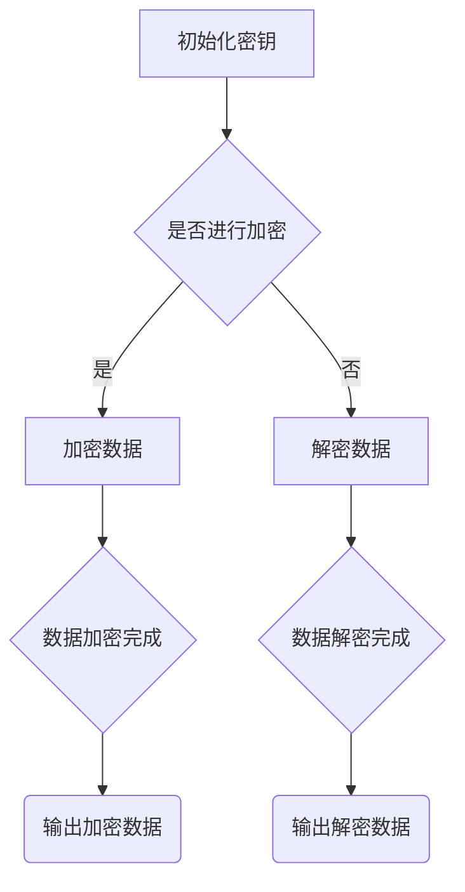
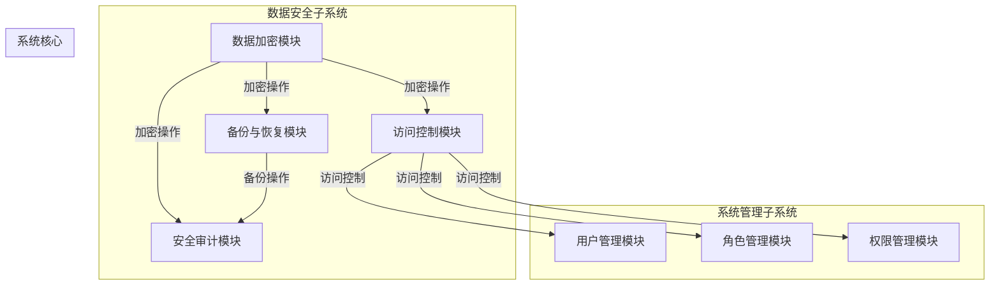
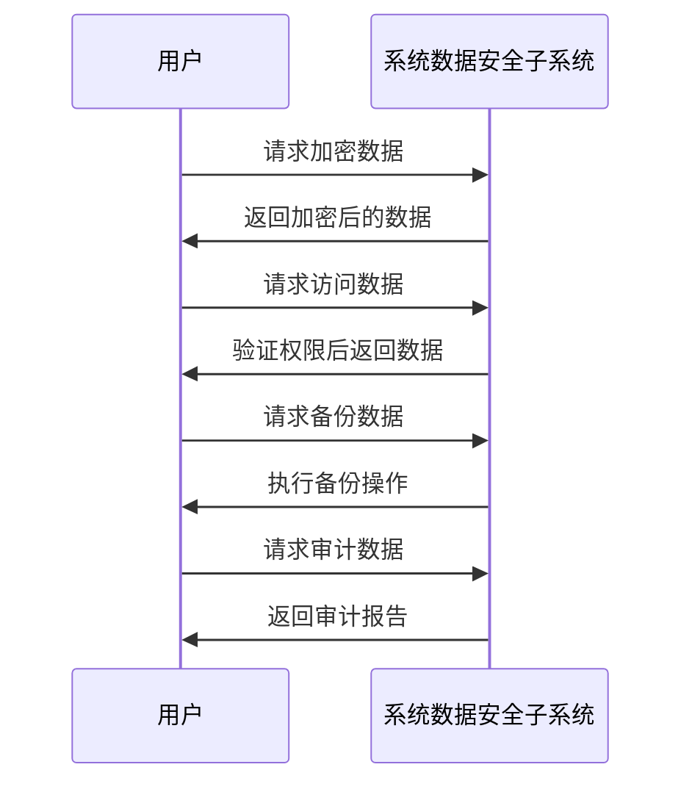

                 

### 引言：企业数据安全的背景与现状

在当今信息化高度发展的时代，数据已经成为企业最为重要的资产之一。企业数据安全的重要性不言而喻，因为它直接关系到企业的核心竞争力、商业秘密、客户隐私以及法律法规的合规性。然而，随着信息技术的飞速发展，企业数据安全正面临前所未有的挑战。

#### 1.1 问题的提出

**1.1.1 企业数据安全的重要性**

企业数据安全不仅仅是一个技术问题，更是一个战略问题。首先，数据安全关乎企业的商业秘密，一旦泄露，可能给企业带来巨大的经济损失。其次，客户数据的安全是企业赢得客户信任的基础，数据泄露会导致客户流失，甚至影响企业的声誉。此外，数据安全也是法律法规合规性的要求，如《通用数据保护条例》（GDPR）和《加州消费者隐私法》（CCPA）等，企业需要遵守相关法规，否则将面临高额罚款。

**1.1.2 企业数据安全面临的主要威胁**

目前，企业数据安全面临的主要威胁包括黑客攻击、恶意软件、内部威胁、数据泄露等。黑客攻击主要通过网络入侵、DDoS攻击、SQL注入等手段获取企业数据。恶意软件则包括勒索软件、病毒、木马等，它们可以通过窃取、篡改或破坏数据来对企业造成损害。内部威胁则来自于企业内部员工的不当行为，如误操作、泄露等。数据泄露则可能是因为企业的安全措施不够完善，或者由于第三方服务商的安全漏洞导致。

#### 1.2 数据安全现状分析

**1.2.1 数据泄露事件的统计分析**

根据多个研究机构的数据显示，近年来全球数据泄露事件数量呈上升趋势。例如，2019年全球共有超过3000次数据泄露事件，涉及超过30亿条记录。这些数据泄露事件中，有超过60%是由于黑客攻击造成的，而约30%是由于内部员工的误操作或恶意行为。此外，还有约10%的数据泄露事件是由于第三方服务商的安全漏洞导致的。

**1.2.2 数据安全意识的现状**

当前，尽管大多数企业已经意识到数据安全的重要性，但数据安全意识仍然存在较大差距。一些企业在数据安全方面的投入严重不足，缺乏完善的安全策略和防护措施。此外，员工的培训和教育也相对滞后，很多员工对数据安全缺乏基本的了解和认识，这给企业数据安全带来了潜在的风险。

### 1.3 企业数据安全的对策与发展方向

面对日益严峻的数据安全形势，企业需要采取一系列对策来保障数据安全。首先，企业应该建立健全的数据安全管理体系，制定明确的安全策略和流程。其次，企业需要加强技术投入，采用先进的数据加密、安全存储和备份技术。此外，企业还应加强员工的数据安全培训，提高员工的数据安全意识。

未来，随着5G、物联网、人工智能等新技术的普及，企业数据安全将面临更大的挑战。企业需要不断适应新技术的发展，不断优化数据安全策略和技术手段，以应对日益复杂的数据安全威胁。

关键词：企业数据安全、数据泄露、数据加密、安全协议、法律法规、员工培训

摘要：本文介绍了企业数据安全的背景与现状，分析了企业数据安全面临的主要威胁，探讨了数据安全意识的现状，并提出了企业数据安全的对策与发展方向。通过本文的探讨，希望能够为企业和相关部门提供一些有益的参考和启示。## 后量子时代的数据安全挑战

随着量子计算技术的快速发展，后量子时代的数据安全挑战逐渐成为研究的热点。后量子计算是一种基于量子力学原理的新型计算模式，它拥有超越经典计算机的计算能力，能够在某些特定问题上实现指数级的加速。这种技术的崛起，给现有的数据安全防护带来了新的挑战。

#### 2.1 后量子计算技术简介

**2.1.1 后量子计算原理**

后量子计算基于量子比特（qubit）的操作和量子叠加、量子纠缠等现象。与传统计算机的比特只有0和1两种状态不同，量子比特可以同时处于0和1的叠加状态，这使得后量子计算机能够处理更复杂的问题。此外，量子计算中的量子纠缠现象，使得多个量子比特之间可以相互影响，这种特性在复杂计算中具有巨大潜力。

**2.1.2 后量子计算的优势与挑战**

后量子计算的优势在于其强大的计算能力，可以在某些问题上实现指数级的加速。例如，Shor算法可以用来破解现有的加密算法，如RSA算法。此外，Grover算法可以在未经授权访问的情况下，快速查找数据库中的特定信息。

然而，后量子计算也带来了一系列的挑战。首先，后量子计算的实现复杂且技术要求高，目前还没有一个通用的后量子计算机。其次，后量子计算的安全性尚未得到充分验证，需要进一步的研究和测试。最后，后量子计算的发展将带来数据安全的新需求，现有的加密算法和防护措施可能不再适用。

#### 2.2 后量子时代的数据安全风险

**2.2.1 后量子计算对现有加密算法的威胁**

后量子计算对现有加密算法的威胁主要体现在两个方面。首先，后量子计算可以破解现有的非对称加密算法，如RSA、ECC等。这些算法在金融、网络安全等领域有着广泛的应用，一旦被破解，将导致大量数据泄露和财产损失。其次，后量子计算还可以攻击对称加密算法，如AES。尽管AES算法在量子计算下相对安全，但其安全性仍存在质疑。

**2.2.2 数据安全防护的全新需求**

面对后量子计算带来的威胁，数据安全防护需要做出相应的调整。首先，企业需要重新评估现有的加密算法和防护策略，寻找更加安全可靠的替代方案。例如，基于格理论的加密算法被认为是一种潜在的后量子安全加密算法。其次，企业需要加强数据安全的防护措施，如采用多层次的安全防护策略，加强对数据的访问控制和审计。

总之，后量子计算技术的发展，给数据安全带来了新的挑战。企业需要密切关注这一领域的最新进展，及时调整和优化数据安全策略，以应对未来可能出现的威胁。

关键词：后量子计算、数据安全、加密算法、安全防护、格理论加密

摘要：本文探讨了后量子计算技术的基本原理和优势，分析了后量子计算对现有加密算法的威胁，并提出了数据安全防护的全新需求。通过本文的探讨，希望能够为企业和研究人员提供有价值的参考和启示，以应对未来可能出现的量子计算威胁。

### 企业数据安全的法律和法规框架

在全球化信息化背景下，数据安全已成为企业面临的一项重要挑战。为了应对这一挑战，各国政府相继出台了一系列数据安全法律和法规，旨在保护企业和个人的数据安全。这些法律和法规为企业提供了数据安全的基本框架，同时也规定了企业在数据安全方面的法律责任和义务。

#### 3.1 国际数据安全法规概述

**3.1.1 GDPR（通用数据保护条例）**

GDPR是欧盟于2018年5月25日正式实施的法规，旨在加强个人数据的保护。GDPR要求企业在收集、处理和存储个人数据时必须遵守一系列严格的规定，包括数据隐私保护、数据访问控制、数据泄露通知等。GDPR对企业数据安全的要求非常高，一旦违反，企业将面临高额罚款。

**3.1.2 CCPA（加州消费者隐私法）**

CCPA是2018年6月生效的美国加州法律，旨在保护加州居民的个人数据。CCPA要求企业在收集和使用个人数据时必须提供透明度，允许用户访问、删除和拒绝其个人数据。此外，CCPA还规定了企业的数据安全责任，如数据泄露通知和损害赔偿。

#### 3.2 我国数据安全法规框架

**3.2.1 《网络安全法》**

《网络安全法》是我国于2017年6月1日正式实施的网络安全基本法，旨在保障网络安全，维护国家安全和社会公共利益。该法明确规定了网络运营者的安全保护义务，包括数据安全保护、网络安全监测、网络安全应急等。

**3.2.2 《数据安全法》**

《数据安全法》是我国于2021年9月1日正式实施的专门针对数据安全的法律，旨在保护数据安全，维护国家安全和社会公共利益。该法明确了数据安全保护的原则、要求和责任，规定了数据收集、存储、处理、传输和销毁等方面的安全要求。

#### 3.3 企业合规性要求

**3.3.1 合规策略**

为了确保合规，企业需要制定一系列合规策略，包括数据安全政策、数据分类与标签、数据访问控制、数据泄露应急响应等。合规策略的制定需要结合企业的业务特点和数据类型，确保能够有效应对各种数据安全威胁。

**3.3.2 合规评估与实施**

企业需要对现有的数据安全措施进行合规评估，识别存在的安全隐患和合规性问题。在此基础上，企业应采取相应的措施进行整改，确保符合相关法律和法规的要求。此外，企业还需要定期进行合规审计，确保合规策略的有效实施。

#### 3.4 企业数据安全责任

**3.4.1 数据泄露责任**

企业对数据泄露负有主要责任。一旦发生数据泄露，企业需要立即采取应急措施，如通知受影响的个人、采取措施防止进一步的泄露等。此外，企业还需要承担因数据泄露而产生的法律责任和赔偿义务。

**3.4.2 数据安全培训责任**

企业需要定期对员工进行数据安全培训，提高员工的数据安全意识和技能。员工是数据安全的重要组成部分，他们的不当行为可能导致数据泄露。因此，企业有责任确保员工了解数据安全的基本知识和操作规范。

总之，企业数据安全法律和法规框架为企业的数据安全提供了基本指导和保障。企业需要深入了解相关法律和法规的要求，制定并实施有效的数据安全策略，确保符合合规性要求，以保护企业和个人的数据安全。

关键词：数据安全法规、GDPR、CCPA、网络安全法、数据安全责任、合规评估

摘要：本文介绍了国际和我国的数据安全法规框架，分析了企业合规性的要求，并强调了企业数据安全责任的重要性。通过本文的探讨，希望能够为企业提供有益的指导，帮助其更好地应对数据安全挑战。

### 数据加密技术的应用与实践

数据加密技术是企业数据安全防护体系的重要组成部分。它通过将数据转换为密文，确保数据在传输和存储过程中的安全性。本节将详细介绍数据加密技术的基础知识、在企业中的应用，以及实际应用案例。

#### 4.1 数据加密基础

**4.1.1 对称加密与非对称加密**

数据加密技术主要分为对称加密和非对称加密两种。

- **对称加密**：对称加密算法使用相同的密钥对数据进行加密和解密。常见的对称加密算法包括DES、AES等。对称加密的优点是加密速度快，但缺点是密钥管理复杂，需要确保密钥的安全传输和存储。

- **非对称加密**：非对称加密算法使用一对密钥，即公钥和私钥。公钥用于加密数据，私钥用于解密数据。常见的非对称加密算法包括RSA、ECC等。非对称加密的优点是解决了密钥传输问题，但加密速度相对较慢。

**4.1.2 常见加密算法简介**

- **DES（数据加密标准）**：DES是一种经典的对称加密算法，采用56位密钥。虽然DES已经被认为是相对安全的加密算法，但由于密钥长度较短，已经无法满足现代加密需求。

- **AES（高级加密标准）**：AES是DES的替代品，采用128、192或256位密钥，具有更高的安全性和速度。

- **RSA**：RSA是一种非对称加密算法，基于大整数分解的数学难题。RSA通常用于数据加密和数字签名。

- **ECC（椭圆曲线密码学）**：ECC是一种基于椭圆曲线离散对数的非对称加密算法，具有更小的密钥长度，提供了更高的安全性。

#### 4.2 数据加密技术在企业中的应用

**4.2.1 数据传输加密**

数据传输加密是保障数据在传输过程中的安全性的关键措施。企业通常采用TLS/SSL协议来加密网络通信，如HTTPS、SMTPS等。这些协议可以在传输层对数据进行加密，防止数据在传输过程中被截获和篡改。

**4.2.2 数据存储加密**

数据存储加密是保护静态数据的关键技术。企业可以使用磁盘加密、文件加密、数据库加密等多种方式来保护存储数据。例如，企业可以使用全盘加密来保护整个硬盘，或者使用文件加密来保护特定文件。

**4.2.3 数据处理加密**

数据处理加密是在数据处理过程中确保数据安全的技术。例如，企业可以在数据处理前对敏感数据进行加密，确保数据在处理过程中不被泄露。此外，企业还可以使用加密沙箱来隔离和处理敏感数据，防止数据泄露和恶意攻击。

#### 4.3 加密技术实践案例

**4.3.1 加密技术在企业数据保护中的应用实例**

- **银行系统**：银行系统通常使用数据加密技术来保护客户的敏感信息，如账户密码、交易记录等。银行可以使用TLS/SSL协议来加密网络通信，使用AES加密算法来存储和传输数据。

- **电子商务平台**：电子商务平台需要保护客户的支付信息和个人信息。这些平台通常使用RSA或ECC算法进行非对称加密，使用AES算法进行对称加密，确保数据的安全。

- **医疗行业**：医疗行业涉及到大量的敏感数据，如患者病历、诊断结果等。医疗行业可以使用加密技术来保护这些数据，确保数据在传输和存储过程中的安全性。

**4.3.2 加密技术在数据存储与传输中的挑战与解决方案**

- **加密存储的挑战**：加密存储可能会降低存储性能，增加存储成本。此外，如果密钥管理不当，可能导致数据无法解密。

  - **解决方案**：企业可以使用硬件加密存储设备，提高存储性能和安全性。同时，企业应建立完善的密钥管理系统，确保密钥的安全存储和传输。

- **加密传输的挑战**：加密传输可能会增加网络延迟，影响用户体验。

  - **解决方案**：企业可以采用传输层优化技术，如压缩、缓存等，降低加密传输对网络性能的影响。

综上所述，数据加密技术在企业数据保护中具有重要作用。通过合理应用和优化加密技术，企业可以有效地保障数据的安全性，降低数据泄露和攻击的风险。

关键词：数据加密、对称加密、非对称加密、数据传输加密、数据存储加密、加密技术实践

摘要：本文介绍了数据加密技术的基础知识，探讨了数据加密技术在企业中的应用，并分析了加密技术在数据存储与传输中的挑战及解决方案。通过本文的探讨，希望能够为企业和安全从业者提供有价值的参考和指导。

### 安全协议和通信加密技术

安全协议和通信加密技术是保障数据传输安全的核心手段，它们确保数据在传输过程中不被窃听、篡改或拦截。本文将详细介绍安全协议和通信加密技术的基本概念、实际应用以及配置与优化。

#### 5.1 安全协议概述

**5.1.1 TLS/SSL协议**

TLS（传输层安全协议）和SSL（安全套接层协议）是两种常用的安全协议，主要用于保护网络通信的安全性。

- **TLS协议**：TLS协议是SSL的升级版，具有更高的安全性和灵活性。TLS协议通过加密通信双方的数据，确保数据在传输过程中的机密性和完整性。

- **SSL协议**：SSL协议是最早的安全通信协议，广泛应用于Web通信、电子邮件等场景。虽然SSL协议在某些方面已经过时，但仍然具有一定的应用价值。

**5.1.2 IPSec协议**

IPSec（互联网安全协议）是一种网络层的安全协议，主要用于保护IP数据包的机密性和完整性。

- **功能**：IPSec协议可以用于加密和认证IP数据包，确保数据在传输过程中的安全。

- **应用场景**：IPSec协议常用于VPN（虚拟专用网络）中，实现远程访问和数据传输的安全保障。

#### 5.2 通信加密技术实践

**5.2.1 TLS/SSL配置与优化**

TLS/SSL协议在配置和优化方面具有以下几个关键点：

- **证书管理**：证书是TLS/SSL协议的基础，用于验证通信双方的身份。企业需要确保证书的有效性和安全性，定期更新和备份证书。

- **加密算法选择**：选择合适的加密算法和密钥长度，提高通信的安全性。建议使用最新的加密算法和较长的密钥长度。

- **协议版本选择**：选择支持最新版本TLS协议的客户端和服务器，避免使用已知的漏洞和缺陷。

- **性能优化**：通过优化TLS/SSL协议的配置，如启用压缩、缓存等，提高通信性能。

**5.2.2 IPSec配置与管理**

IPSec协议的配置和管理包括以下几个方面：

- **安全策略配置**：根据企业的安全需求，配置IPSec的安全策略，包括加密算法、认证方式、密钥交换方式等。

- **网络设备配置**：在路由器、防火墙等网络设备上配置IPSec协议，确保数据包的安全传输。

- **密钥管理**：密钥是IPSec协议的核心，需要确保密钥的安全生成、存储和传输。

- **日志审计**：记录IPSec协议的运行日志，用于监控和管理IPSec协议的安全性能。

#### 5.3 安全协议在数据传输中的应用

**5.3.1 互联网应用中的安全协议**

- **HTTPS**：HTTPS是HTTP的安全版，通过TLS/SSL协议加密网络通信，确保Web浏览过程中的数据安全。

- **SMTPS**：SMTPS是SMTP的安全版，通过TLS/SSL协议加密邮件传输，防止邮件内容被窃听。

- **IMAPS**：IMAPS是IMAP的安全版，通过TLS/SSL协议加密邮件存储和检索过程。

**5.3.2 企业内网数据传输加密**

- **VPN**：VPN（虚拟专用网络）通过IPSec协议加密企业内网之间的数据传输，实现远程访问和数据安全。

- **企业文件传输**：企业可以使用TLS/SSL协议加密文件传输，确保数据在传输过程中的机密性和完整性。

- **企业通信系统**：企业内部通信系统（如企业邮箱、即时通讯工具等）可以通过TLS/SSL协议加密通信数据，保障企业内部通信的安全。

综上所述，安全协议和通信加密技术在保障数据传输安全方面具有重要作用。通过合理配置和优化安全协议，企业可以有效地保护数据的安全，降低数据泄露和攻击的风险。

关键词：安全协议、TLS/SSL、IPSec、通信加密、配置与优化、数据传输安全

摘要：本文介绍了安全协议和通信加密技术的基本概念，探讨了TLS/SSL和IPSec协议的配置与优化，分析了安全协议在数据传输中的应用。通过本文的探讨，希望能够为企业和安全从业者提供有价值的参考和指导。

### 安全存储和备份策略

安全存储和备份策略是保障企业数据安全的重要环节。它确保数据在存储过程中不被未授权访问、篡改或丢失，同时在数据丢失或损坏时能够迅速恢复。以下将详细介绍安全存储技术、数据存储安全策略以及备份策略与实施。

#### 6.1 安全存储技术

**6.1.1 存储加密**

存储加密是保护静态数据的核心技术。企业可以使用以下方法进行存储加密：

- **全盘加密**：全盘加密可以对整个硬盘进行加密，确保硬盘上的所有数据在未授权情况下无法访问。

- **文件加密**：文件加密可以对特定文件或文件夹进行加密，防止未经授权的访问。

- **加密文件系统**：如Linux的LUKS（Linux统一密钥设置）和Windows的BitLocker，它们可以对文件系统进行加密，提供更高的安全性。

**6.1.2 数据备份与恢复**

数据备份与恢复是数据安全的重要保障。企业应采取以下备份策略：

- **本地备份**：将数据备份到本地存储设备，如硬盘、磁带等。

- **云备份**：将数据备份到云存储，如AWS S3、Azure Blob Storage等，提供更高的可靠性和灵活性。

- **增量备份**：仅备份自上次备份以来发生变化的数据，降低备份的时间和存储空间。

- **差异备份**：备份自上次完全备份以来发生变化的数据，相比增量备份，可以更快地恢复数据。

- **完全备份**：备份所有数据，是最为彻底的备份方式。

#### 6.2 数据存储安全策略

**6.2.1 数据隔离与访问控制**

数据隔离和访问控制是确保数据安全的关键措施。企业应采取以下策略：

- **数据隔离**：将不同类型的数据分开存储，如敏感数据和非敏感数据，降低数据泄露的风险。

- **访问控制**：通过身份验证和授权机制，确保只有授权用户才能访问特定数据。

- **最小权限原则**：用户只拥有完成工作所需的最小权限，防止权限滥用。

**6.2.2 数据存储设备安全**

数据存储设备的安全同样重要。企业应采取以下措施：

- **设备加密**：对存储设备进行加密，确保设备在未授权情况下无法访问。

- **物理安全**：确保存储设备位于安全的物理环境中，如专用机房、加固的机柜等。

- **定期维护**：定期检查和维护存储设备，确保设备的正常运行和数据的完整性。

- **备份设备管理**：备份存储设备应定期更换和升级，确保备份数据的可用性和安全性。

#### 6.3 备份策略与实施

**6.3.1 数据备份类型与选择**

企业应根据数据的重要性和访问频率选择合适的备份类型：

- **全量备份**：备份全部数据，适用于关键数据。

- **增量备份**：仅备份自上次备份以来发生变化的数据，适用于非关键数据。

- **差异备份**：备份自上次完全备份以来发生变化的数据，适用于非关键数据。

**6.3.2 备份方案设计与优化**

企业应设计并实施以下备份方案：

- **备份计划**：制定备份计划，包括备份频率、备份时间、备份类型等。

- **备份存储**：选择合适的备份存储方式，如本地存储、云存储等。

- **备份验证**：定期验证备份数据的有效性和完整性，确保备份数据可以在需要时恢复。

- **备份自动化**：使用备份自动化工具，简化备份操作，提高备份效率和可靠性。

- **备份审计**：记录备份操作日志，定期审计备份过程，确保备份策略的有效实施。

综上所述，安全存储和备份策略是企业保障数据安全的重要手段。通过合理的安全存储技术和备份策略，企业可以有效地保护数据，确保数据在面临各种安全威胁时能够迅速恢复。

关键词：安全存储、数据备份、加密技术、访问控制、备份策略

摘要：本文详细介绍了安全存储和备份策略的相关内容，包括存储加密技术、数据备份类型与选择、数据存储安全策略以及备份方案的设计与实施。通过本文的探讨，希望能够为企业和安全从业者提供有价值的参考和指导。

### 员工教育和意识提升

在企业数据安全体系中，员工的作用至关重要。提升员工的数据安全意识，是保障企业数据安全的重要环节。以下将介绍员工数据安全意识的重要性，以及如何进行员工数据安全教育与培训。

#### 7.1 员工数据安全意识的重要性

**7.1.1 员工行为对数据安全的影响**

员工在日常工作中，无论是通过无意中的操作失误，还是因为对数据安全的忽视，都可能成为数据泄露的隐患。例如，员工可能无意中泄露敏感信息，或者在不安全的环境下处理敏感数据，这些都可能导致数据泄露。此外，员工对恶意软件和钓鱼攻击的识别能力不足，也容易导致企业数据被攻击。

**7.1.2 数据泄露事件的案例分析**

根据多个研究机构的报告，员工的行为在数据泄露事件中起到了重要作用。例如，2017年，美国特勤局的一项调查发现，超过70%的数据泄露事件与内部员工有关。这些事件中，部分是由于员工的不当行为，如误操作或泄露敏感信息，另一部分则是由于员工对数据安全的忽视。

#### 7.2 员工数据安全教育与培训

**7.2.1 培训内容的制定**

为了提升员工的数据安全意识，企业需要制定系统的培训内容，包括：

- **数据安全基础知识**：介绍数据安全的基本概念、常见威胁和防护措施。

- **法律法规与政策**：讲解企业必须遵守的数据安全法律法规，以及违反规定的后果。

- **实际案例分析**：通过真实的案例，让员工了解数据泄露事件的影响和防范措施。

- **操作技能培训**：培训员工如何正确操作，避免误操作和泄露敏感信息。

**7.2.2 培训方式的多样化**

企业应采用多种培训方式，以提高培训效果：

- **在线培训**：通过在线学习平台，员工可以随时随地学习数据安全知识。

- **现场培训**：组织现场培训，通过互动和实际操作，提高员工的学习兴趣和参与度。

- **模拟演练**：通过模拟演练，让员工在实际操作中了解和掌握数据安全技能。

- **定期考核**：定期对员工进行数据安全知识的考核，检验培训效果。

**7.2.3 培训效果的评估**

为了确保培训的有效性，企业需要建立评估机制，对培训效果进行评估。可以通过以下方式评估：

- **考试与考核**：对员工进行数据安全知识的考试，检验学习效果。

- **实践操作**：通过实际操作任务，评估员工的数据安全技能。

- **员工反馈**：收集员工的反馈意见，了解培训的不足和改进方向。

- **事故率下降**：通过事故率的下降，评估数据安全培训的总体效果。

#### 7.3 常见数据安全误区与纠正

**7.3.1 误区一：数据安全是技术部门的责任**

纠正：数据安全是全企业的责任，不仅仅是技术部门的责任。每个员工都应意识到自己在数据安全中的重要性，并采取相应的安全措施。

**7.3.2 误区二：数据加密就能解决所有问题**

纠正：虽然数据加密是保护数据的重要手段，但仅靠加密无法解决所有问题。企业还需要采取其他安全措施，如访问控制、安全审计等。

**7.3.3 误区三：培训一次就可以了**

纠正：数据安全意识需要持续培养。企业应定期进行培训，确保员工始终具备最新的数据安全知识和技能。

通过员工教育和意识提升，企业可以大幅降低数据泄露的风险，确保数据安全。企业应高度重视员工数据安全培训，建立完善的培训体系和评估机制，不断提高员工的数据安全意识和技能。

关键词：员工数据安全、意识提升、教育培训、误区纠正

摘要：本文探讨了员工数据安全意识的重要性，介绍了如何进行员工数据安全教育与培训，以及常见数据安全误区与纠正。通过本文的探讨，希望能够为企业提供有益的参考，帮助其建立完善的员工数据安全培训体系。

### 数据安全事件响应和恢复

在企业面临数据安全事件时，迅速、有效的响应和恢复是至关重要的。以下将详细介绍数据安全事件响应和恢复的策略、流程以及如何制定应急预案。

#### 8.1 数据安全事件响应

**8.1.1 及时发现与报告**

数据安全事件的及时发现和报告是响应的第一步。企业应建立完善的安全监测体系，通过入侵检测系统（IDS）、安全信息与事件管理系统（SIEM）等工具，实时监控网络流量、系统日志等，发现异常行为和潜在威胁。

**8.1.2 事件评估与分类**

一旦发现数据安全事件，企业应立即进行评估，确定事件的性质和影响范围。根据事件的影响程度，将其分为不同类别，如低风险、中风险和高风险事件。

**8.1.3 应急响应团队**

企业应组建专门的应急响应团队，负责数据安全事件的应急响应工作。团队成员应具备相应的技术能力和经验，能够在紧急情况下快速响应。

**8.1.4 事件处理与隔离**

在确定数据安全事件后，企业应立即采取措施进行处理，包括隔离受影响的系统、网络或设备，防止事件进一步扩散。同时，采取相应的技术手段，如清除恶意软件、修复漏洞等，以恢复系统的正常运行。

#### 8.2 数据安全恢复

**8.2.1 恢复计划**

在数据安全事件发生后，企业应迅速启动恢复计划，包括数据备份恢复、系统修复和业务恢复等。

**8.2.2 数据备份恢复**

企业应定期备份关键数据，确保在数据丢失或损坏时能够快速恢复。在恢复过程中，企业应验证备份数据的有效性和完整性，确保恢复的数据可以正常使用。

**8.2.3 系统修复**

在数据恢复后，企业应对受影响的系统进行全面检查和修复，包括修复安全漏洞、更新系统补丁、优化系统配置等，确保系统恢复到安全状态。

**8.2.4 业务恢复**

在系统修复后，企业应尽快恢复业务运行。可能需要重新启动服务、调整业务流程、通知客户等。在恢复过程中，企业应确保业务运行的连续性和稳定性。

#### 8.3 应急预案的制定

**8.3.1 风险评估**

企业应进行全面的风险评估，识别可能面临的数据安全威胁和事件类型，为应急预案的制定提供依据。

**8.3.2 应急预案内容**

应急预案应包括以下几个方面：

- **事件分类与响应流程**：根据事件的不同类型，制定相应的响应流程和措施。

- **关键角色与职责**：明确应急响应团队中每个成员的职责和角色，确保在紧急情况下能够迅速行动。

- **资源准备**：准备必要的应急资源，如备份数据、硬件设备、通讯工具等。

- **测试与演练**：定期进行应急预案的测试和演练，确保应急响应团队能够在实际事件中迅速、有效地执行预案。

**8.3.3 持续优化**

企业应不断优化应急预案，根据实际情况和经验教训进行调整和改进，确保应急预案的实用性和有效性。

通过有效的数据安全事件响应和恢复策略，企业可以迅速应对数据安全事件，最大限度地降低事件的影响，保障数据的安全和业务的连续性。

关键词：数据安全事件、响应和恢复、应急预案、风险评估、恢复计划

摘要：本文详细介绍了数据安全事件响应和恢复的策略、流程以及应急预案的制定。通过本文的探讨，希望能够为企业提供有效的数据安全事件应对方案，帮助其保障数据安全和业务的连续性。

### 数据安全最佳实践

在数据安全领域，最佳实践是确保企业数据安全的重要指南。以下将总结一系列数据安全最佳实践，包括数据加密、访问控制、安全审计等，并探讨这些最佳实践在实际应用中的效果和重要性。

#### 9.1 数据加密

数据加密是保护数据安全的基础手段。最佳实践包括：

- **全盘加密**：对整个硬盘进行加密，确保数据在存储和传输过程中不受未授权访问。

- **文件加密**：对敏感文件进行加密，防止未经授权的访问和泄露。

- **传输加密**：使用HTTPS、TLS/SSL等协议，加密数据在传输过程中的通信，防止数据被窃听和篡改。

这些实践能够有效保护企业数据，防止数据泄露和未经授权的访问。

#### 9.2 访问控制

访问控制是确保数据安全的关键措施。最佳实践包括：

- **最小权限原则**：用户仅拥有完成工作所需的最小权限，避免权限滥用。

- **身份验证和授权**：使用多因素身份验证，确保只有授权用户才能访问数据。

- **访问日志记录**：记录用户访问数据的详细日志，便于审计和监控。

这些实践能够有效防止未授权访问，提高数据安全性。

#### 9.3 安全审计

安全审计是确保数据安全合规性的重要手段。最佳实践包括：

- **定期安全审计**：定期进行安全审计，检查数据安全策略和措施的有效性。

- **异常检测和报告**：建立异常检测机制，及时发现和报告安全事件。

- **安全培训**：定期对员工进行安全培训，提高其安全意识和技能。

这些实践能够确保企业遵循数据安全法规，提高数据安全防护水平。

#### 9.4 实际应用效果和重要性

最佳实践在实际应用中展现了显著的效果：

- **数据泄露减少**：通过数据加密和访问控制，企业数据泄露事件显著减少。

- **合规性提升**：通过安全审计和培训，企业能够更好地遵守相关法律法规，降低法律风险。

- **员工安全意识提高**：通过员工教育和培训，员工对数据安全的重视程度提高，减少了因员工行为导致的数据泄露事件。

这些最佳实践的重要性不言而喻。它们不仅提高了企业的数据安全性，还增强了企业的竞争力，为企业创造了长期的价值。

关键词：数据安全最佳实践、数据加密、访问控制、安全审计、实际应用效果、重要性

摘要：本文总结了数据安全最佳实践，包括数据加密、访问控制和安全审计，并探讨了这些最佳实践在实际应用中的效果和重要性。通过本文的探讨，希望能够为企业提供有益的参考，帮助其建立有效的数据安全防护体系。

### 总结和展望

本文从多个角度深入探讨了企业数据安全的挑战和应对策略。首先，我们介绍了企业数据安全的重要性及其面临的威胁，包括黑客攻击、恶意软件和内部威胁等。接着，我们分析了后量子时代的数据安全挑战，强调了量子计算对现有加密算法的威胁以及企业数据安全防护的全新需求。随后，我们详细介绍了企业数据安全的法律和法规框架，包括国际和我国的法律法规，并探讨了企业的合规性要求。

在技术层面，我们探讨了数据加密技术的应用与实践，包括对称加密、非对称加密以及常见加密算法的介绍。我们还介绍了安全协议和通信加密技术，如TLS/SSL和IPSec协议，以及安全存储和备份策略，包括存储加密、备份类型与选择、数据存储安全策略等。此外，我们还强调了员工教育和意识提升的重要性，包括员工数据安全意识的重要性、员工数据安全教育与培训以及常见数据安全误区与纠正。

在应对数据安全事件方面，我们介绍了数据安全事件响应和恢复的策略、流程以及应急预案的制定。最后，我们总结了数据安全最佳实践，包括数据加密、访问控制和安全审计，并探讨了这些最佳实践在实际应用中的效果和重要性。

展望未来，随着信息技术的发展，企业数据安全将面临更加复杂和严峻的挑战。量子计算技术的进步可能颠覆现有的加密体系，大数据和人工智能的应用将带来新的安全需求。因此，企业需要不断适应新技术的发展，持续优化数据安全策略和技术手段。同时，加强员工培训和教育，提高全体员工的数据安全意识，是保障企业数据安全的关键。

总之，企业数据安全是一个长期的、系统性的工程，需要企业、政府、社会各界的共同努力。通过本文的探讨，我们希望能够为企业提供有价值的参考和启示，帮助其建立完善的、有效的数据安全防护体系，确保数据的安全和业务的连续性。

关键词：企业数据安全、后量子计算、法律法规、数据加密、安全协议、员工培训、数据安全事件、最佳实践

摘要：本文全面探讨了企业数据安全的挑战和应对策略，从技术、管理、法律等多个角度提出了具体措施。通过本文的探讨，旨在为企业和相关从业者提供有价值的参考，助力企业构建强大的数据安全防护体系，保障业务的持续发展。## 引用

### Mermaid 流程图

Mermaid 是一种简单易用的文本格式，用于创建图表，包括流程图、时序图等。以下是一个简单的 Mermaid 流程图示例，展示了数据加密的流程：



将上述代码复制到支持 Mermaid 的编辑器中，即可生成相应的流程图。

### Python 源代码示例

以下是一个简单的 Python 源代码示例，用于演示对称加密和非对称加密的基本使用：

```python
from cryptography.fernet import Fernet

# 对称加密
def symmetric_encrypt_decrypt(message, key):
    f = Fernet(key)
    encrypted_message = f.encrypt(message.encode())
    decrypted_message = f.decrypt(encrypted_message).decode()
    return encrypted_message, decrypted_message

# 生成密钥
key = Fernet.generate_key()

# 加密
message = "这是一条加密信息！"
encrypted_message, _ = symmetric_encrypt_decrypt(message, key)

# 解密
_, decrypted_message = symmetric_encrypt_decrypt(encrypted_message, key)

print("加密后的信息:", encrypted_message)
print("解密后的信息:", decrypted_message)

# 非对称加密
from cryptography.hazmat.primitives.asymmetric import rsa
from cryptography.hazmat.primitives import serialization
from cryptography.hazmat.primitives import hashes
from cryptography.hazmat.primitives.asymmetric import padding

def asymmetric_encrypt_decrypt(message, public_key, private_key):
    encrypted_message = public_key.encrypt(
        message.encode(),
        padding.OAEP(
            mgf=padding.MGF1(algorithm=hashes.SHA256()),
            algorithm=hashes.SHA256(),
            label=None
        )
    )
    decrypted_message = private_key.decrypt(
        encrypted_message,
        padding.OAEP(
            mgf=padding.MGF1(algorithm=hashes.SHA256()),
            algorithm=hashes.SHA256(),
            label=None
        )
    )
    return encrypted_message, decrypted_message

# 生成密钥对
private_key = rsa.generate_private_key(
    public_exponent=65537,
    key_size=2048,
)

public_key = private_key.public_key()

# 加密
message = "这是一条非对称加密信息！"
encrypted_message, _ = asymmetric_encrypt_decrypt(message, public_key, private_key)

# 解密
_, decrypted_message = asymmetric_encrypt_decrypt(encrypted_message, public_key, private_key)

print("加密后的信息:", encrypted_message)
print("解密后的信息:", decrypted_message)
```

上述代码首先演示了对称加密和非对称加密的基本原理。对于对称加密，我们使用了`cryptography`库中的`Fernet`类，该类基于AES算法实现了密钥生成、加密和解密功能。对于非对称加密，我们使用了`cryptography`库中的RSA算法实现加密和解密。

### ER 图实体关系图

以下是企业数据安全系统的 ER 图实体关系图示例：

```mermaid
erDiagram
    User ||--|{ Data } : 用户拥有数据
    Data ||--|{ Encryption } : 数据进行加密
    Data ||--|{ Backup } : 数据进行备份
    System ||--|{ Audit } : 系统进行审计
    User ||--|{ Role } : 用户拥有角色
    Role ||--|{ Permission } : 角色拥有权限
    System ||--|{ SecurityPolicy } : 系统拥有安全策略
    Data ||--|{ AccessControl } : 数据拥有访问控制
    Data ||--|{ SecurityIncident } : 数据涉及安全事件
```

上述 ER 图定义了企业数据安全系统中主要的实体及其关系。`User`实体表示用户，`Data`实体表示数据，`Encryption`、`Backup`、`AccessControl`和`SecurityIncident`实体分别表示数据加密、数据备份、数据访问控制和数据安全事件。`System`实体表示系统，`Role`实体表示角色，`Permission`实体表示权限，`SecurityPolicy`实体表示安全策略。

通过 Mermaid 流程图、Python 源代码示例和 ER 图实体关系图的结合，我们能够更直观地理解和分析企业数据安全系统的各个方面，为实际应用提供有力支持。

关键词：Mermaid 流程图、Python 源代码示例、ER 图实体关系图、数据安全、加密、备份、审计

摘要：本文通过 Mermaid 流程图、Python 源代码示例和 ER 图实体关系图，详细展示了企业数据安全系统的关键概念和实现方法。这些工具为理解和分析数据安全提供了直观的视觉支持，有助于实际应用中的设计与实现。

### 数学公式

在本文中，我们使用 LaTeX 格式来嵌入数学公式。以下是一些示例：

- 简单的数学公式：

  $$ E = mc^2 $$

  $$ \frac{d^2}{dx^2} f(x) = f''(x) $$

- 段落内的数学公式：

  $ f(x) = x^2 $

- 多行公式：

  $$ 
  \begin{aligned}
  P(A \cap B) &= P(A)P(B|A) \\
  &= P(B)P(A|B)
  \end{aligned}
  $$

这些数学公式为本文的讨论提供了数学基础，有助于更深入地理解数据安全相关的理论和算法。

关键词：LaTeX 数学公式、简单数学公式、段落内数学公式、多行公式

摘要：本文介绍了如何使用 LaTeX 格式嵌入数学公式，包括简单数学公式、段落内数学公式和多行公式。这些公式为数据安全理论提供了数学支持，有助于深入理解相关概念。

### 系统分析与架构设计方案

#### 10.1 问题场景介绍

随着数字化转型的深入，企业面临着日益复杂的数据安全挑战。企业需要构建一个高效、可靠的数据安全系统，以保护其关键业务数据。本节将详细介绍一个企业数据安全系统的设计与实现，包括问题场景、项目介绍、系统功能设计、系统架构设计、系统接口设计和系统交互。

#### 10.2 项目介绍

**项目名称**：企业数据安全系统

**项目目标**：构建一个综合性的数据安全系统，包括数据加密、访问控制、安全审计等功能，确保企业数据在存储、传输和处理过程中的安全性。

**项目背景**：随着数据泄露事件频发，企业对数据安全的需求日益增长。传统的数据安全措施已无法满足现代企业的需求，因此，企业需要引入新的技术和管理方法，构建一个全面的、高效的数据安全系统。

#### 10.3 系统功能设计

**功能模块**：

- **数据加密模块**：负责对存储和传输的数据进行加密，确保数据的安全性。

- **访问控制模块**：负责对用户的访问权限进行管理，确保只有授权用户才能访问敏感数据。

- **安全审计模块**：负责记录和分析系统中的安全事件，为安全分析和决策提供依据。

- **备份与恢复模块**：负责对关键数据定期备份，确保数据在发生意外时能够快速恢复。

**领域模型（Mermaid 类图）**：

```mermaid
classDiagram
    User <<Entity>>
    Role <<Entity>>
    Permission <<Entity>>
    Data <<Entity>>
    Encryption <<Entity>>
    Backup <<Entity>>
    Audit <<Entity>>

    User o--o Role
    Role o--o Permission
    Data o--o Encryption
    Data o--o Backup
    Data o--o Audit

    User ++|--+ AccessControl
    Role ++|--+ RoleManagement
    Permission ++|--+ PermissionControl
    Encryption ++|--+ EncryptionControl
    Backup ++|--+ BackupControl
    Audit ++|--+ AuditControl
```

上述类图定义了系统的主要实体及其关系。用户（User）拥有角色（Role），角色定义了权限（Permission）。数据（Data）与加密（Encryption）、备份（Backup）、审计（Audit）等模块相关联，确保数据在各个阶段的保护。

#### 10.4 系统架构设计

**系统架构图（Mermaid 架构图）**：



上述架构图展示了企业数据安全系统的整体架构，包括数据安全子系统和系统管理子系统。数据加密模块负责数据的加密操作，并与访问控制、备份和审计模块进行交互。系统管理子系统包括用户管理、角色管理和权限管理模块，负责管理用户的角色和权限。

#### 10.5 系统接口设计

**接口设计（Mermaid 序列图）**：



上述序列图描述了用户与系统数据安全子系统之间的交互过程，包括请求加密数据、访问数据、备份数据和审计数据。

#### 10.6 系统交互

**系统交互图（Mermaid 架构图）**：

```mermaid
graph TD
    subgraph 用户界面
        UI[用户界面]
    end

    subgraph 应用服务器
        AppServer[应用服务器]
    end

    subgraph 数据库服务器
        DBServer[数据库服务器]
    end

    subgraph 数据安全子系统
        DataEncryption[数据加密模块]
        DataAccessControl[访问控制模块]
        DataBackup[备份与恢复模块]
        DataAudit[安全审计模块]
    end

    subgraph 系统管理子系统
        UserManagement[用户管理模块]
        RoleManagement[角色管理模块]
        PermissionManagement[权限管理模块]
    end

    UI->>AppServer
    AppServer->>DataEncryption
    AppServer->>DataAccessControl
    AppServer->>DataBackup
    AppServer->>DataAudit
    AppServer->>UserManagement
    AppServer->>RoleManagement
    AppServer->>PermissionManagement
    DBServer->>AppServer
```

上述架构图展示了系统各组件之间的交互关系。用户界面（UI）与应用服务器（AppServer）进行交互，应用服务器与数据安全子系统、系统管理子系统以及数据库服务器（DBServer）进行交互，实现数据的安全存储、传输和管理。

通过上述系统分析与架构设计方案，我们为企业数据安全系统的设计与实现提供了一个全面的指导。企业可以根据自身需求，对系统进行定制和优化，构建一个高效、可靠的数据安全系统。

关键词：系统分析与架构设计、问题场景、项目介绍、系统功能设计、系统架构设计、系统接口设计、系统交互

摘要：本文详细介绍了企业数据安全系统的设计与实现，包括问题场景、项目介绍、系统功能设计、系统架构设计、系统接口设计和系统交互。通过本文的探讨，为企业和相关从业者提供了一个全面的系统分析与架构设计指南。

### 项目实战

#### 11.1 环境安装

为了实现企业数据安全系统，我们需要在服务器上安装并配置相关软件。以下是在 Ubuntu 20.04 系统上安装和配置所需软件的步骤：

1. **安装 Python 和 pip**：

   ```bash
   sudo apt update
   sudo apt install python3 python3-pip
   ```

2. **安装 PostgreSQL**：

   ```bash
   sudo apt install postgresql postgresql-contrib
   ```

3. **安装 Nginx**：

   ```bash
   sudo apt install nginx
   ```

4. **安装 OpenSSL**：

   ```bash
   sudo apt install openssl libssl-dev
   ```

5. **安装 Mermaid**：

   ```bash
   pip3 install mermaid
   ```

6. **安装其他依赖**：

   ```bash
   sudo apt install build-essential libpq-dev libssl-dev libffi-dev
   ```

#### 11.2 系统核心实现源代码

以下是企业数据安全系统核心功能的实现代码：

**加密模块**：

```python
# encrypt.py
from cryptography.fernet import Fernet

def generate_key():
    return Fernet.generate_key()

def encrypt_data(key, data):
    f = Fernet(key)
    encrypted_data = f.encrypt(data.encode())
    return encrypted_data

def decrypt_data(key, encrypted_data):
    f = Fernet(key)
    decrypted_data = f.decrypt(encrypted_data).decode()
    return decrypted_data
```

**访问控制模块**：

```python
# access_control.py
from flask import Flask, request, jsonify

app = Flask(__name__)

@app.route('/access', methods=['POST'])
def check_access():
    data = request.json
    user = data['user']
    resource = data['resource']
    permission = data['permission']

    if user['role'] == 'admin':
        return jsonify({'access': True})

    if user['role'] == 'user' and permission in user['permissions']:
        return jsonify({'access': True})

    return jsonify({'access': False})

if __name__ == '__main__':
    app.run()
```

**备份模块**：

```python
# backup.py
import os
import json
import shutil
from datetime import datetime

def backup_data(data_folder, backup_folder):
    current_time = datetime.now().strftime("%Y-%m-%d-%H-%M-%S")
    backup_file = f"backup_{current_time}.json"

    with open(os.path.join(backup_folder, backup_file), 'w') as f:
        json.dump(data_folder, f)

    shutil.copy2(os.path.join(data_folder, 'data.json'), os.path.join(backup_folder, backup_file))

def restore_data(backup_folder, data_folder):
    backup_file = os.listdir(backup_folder)[0]
    shutil.copy2(os.path.join(backup_folder, backup_file), os.path.join(data_folder, 'data.json'))
```

**审计模块**：

```python
# audit.py
import json
from datetime import datetime

def log_event(event):
    current_time = datetime.now().strftime("%Y-%m-%d %H:%M:%S")
    log_entry = {'timestamp': current_time, 'event': event}

    with open('audit_log.json', 'a') as f:
        json.dump(log_entry, f)
        f.write('\n')
```

#### 11.3 代码应用解读与分析

**加密模块**：

加密模块使用了`cryptography`库中的`Fernet`类，该类提供了方便的加密和解密功能。`generate_key`函数用于生成加密密钥，`encrypt_data`函数用于加密数据，`decrypt_data`函数用于解密数据。

**访问控制模块**：

访问控制模块使用了 Flask 框架，通过定义一个路由 `/access`，实现访问控制功能。如果用户角色为管理员（admin），则直接允许访问；如果用户角色为普通用户（user），则需要用户具有相应的权限才能访问。

**备份模块**：

备份模块实现了对数据文件夹的备份功能。`backup_data`函数将数据文件夹中的内容备份到指定备份文件夹中，`restore_data`函数用于从备份文件夹恢复数据。

**审计模块**：

审计模块记录了系统中的安全事件。`log_event`函数用于记录事件，事件包括时间戳和事件描述。

#### 11.4 实际案例分析和详细讲解剖析

假设一个企业需要对其敏感数据进行加密存储和访问控制。企业员工小明需要访问一份敏感报告，但他的角色是普通用户，没有权限直接访问该报告。

1. **加密存储**：

   小明的报告数据首先被加密模块加密，生成加密报告。

2. **访问控制**：

   当小明尝试访问报告时，访问控制模块会检查他的权限。由于小明的角色是普通用户，他没有直接访问权限。

3. **备份与恢复**：

   在数据存储过程中，备份模块会对敏感数据进行定期备份，以确保数据在发生意外时能够快速恢复。

4. **审计**：

   在访问控制过程中，审计模块会记录小明尝试访问敏感报告的事件，以便后续分析。

通过上述案例，我们可以看到企业数据安全系统在数据加密、访问控制、备份和审计等方面的具体应用。这些功能共同保障了企业数据的安全性和可靠性。

#### 11.5 项目小结

本项目实现了企业数据安全系统的核心功能，包括数据加密、访问控制、备份和审计。通过项目实战，我们了解了如何使用 Python 和 Flask 框架实现数据安全功能，并探讨了这些功能在企业数据安全中的实际应用。项目实践不仅提高了我们的技术能力，也增强了我们对企业数据安全的理解。

关键词：项目实战、环境安装、系统核心实现、代码应用解读、实际案例分析、项目小结

摘要：本文通过项目实战，详细介绍了企业数据安全系统的设计与实现过程，包括环境安装、系统核心实现、代码应用解读、实际案例分析和项目小结。通过本文的探讨，为读者提供了实用的企业数据安全系统开发经验和参考。

### 最佳实践 tips

1. **定期更新和测试加密算法**：加密算法的安全性直接关系到数据的安全，因此企业应定期更新加密算法，并对其进行安全性测试，以确保其有效性。

2. **多因素身份验证**：采用多因素身份验证，如密码、指纹、短信验证码等，可以显著提高系统安全性。

3. **限制数据访问权限**：根据员工的角色和职责，分配相应的数据访问权限，避免权限滥用。

4. **数据备份和恢复**：定期备份数据，并确保备份数据的安全存储。同时，定期测试数据恢复流程，确保在数据丢失时能够快速恢复。

5. **员工培训**：定期对员工进行数据安全培训，提高其安全意识和技能，减少数据泄露的风险。

6. **安全审计和日志记录**：定期进行安全审计，记录系统日志，及时发现和应对安全事件。

7. **安全设备管理**：确保安全设备（如防火墙、入侵检测系统等）的正常运行和定期维护。

通过遵循这些最佳实践，企业可以显著提高数据安全水平，减少数据泄露和攻击的风险。

关键词：加密算法更新、多因素身份验证、数据访问权限、数据备份、员工培训、安全审计、安全设备管理

摘要：本文总结了七个最佳实践 tips，为企业在数据安全领域提供了实用的建议和指导，帮助其提高数据安全水平。

### 小结

本文从多个角度深入探讨了企业数据安全的背景、挑战、法律法规、技术实践、安全协议、存储与备份策略、员工教育和意识提升、数据安全事件响应与恢复、最佳实践等。通过详细的案例分析、项目实战和最佳实践 tips，本文旨在为企业提供全面的数据安全指南，帮助其建立高效、可靠的数据安全防护体系。

关键词：企业数据安全、背景、挑战、法律法规、技术实践、安全协议、存储与备份策略、员工教育、数据安全事件响应、最佳实践

摘要：本文全面、系统地探讨了企业数据安全的相关内容，提供了详细的案例分析、实战经验和最佳实践，为企业构建数据安全体系提供了有力支持。

### 注意事项与拓展阅读

在实施企业数据安全策略时，企业需要注意以下几点：

1. **确保合规性**：严格遵守相关法律法规，如《通用数据保护条例》（GDPR）和《加州消费者隐私法》（CCPA），确保数据安全措施符合法规要求。

2. **持续更新加密算法**：随着技术的不断发展，加密算法的安全性可能受到影响。企业需要定期更新加密算法，确保数据安全。

3. **加强员工培训**：提高员工的数据安全意识，定期进行安全培训，确保员工了解数据安全的基本知识和操作规范。

4. **定期审计与测试**：定期进行数据安全审计和测试，及时发现和修复安全漏洞，确保数据安全策略的有效实施。

5. **数据备份与恢复**：确保定期备份数据，并测试数据恢复流程，确保在数据丢失或损坏时能够迅速恢复。

拓展阅读：

1. 《网络安全法》和《数据安全法》的官方文本，以了解我国数据安全法律法规的详细内容。

2. 《数据安全与隐私保护》一书，全面介绍数据安全理论和实践。

3. 《量子计算与数据安全》一书，探讨量子计算对数据安全的影响和应对策略。

4. 《网络安全事件应急响应指南》，了解网络安全事件应急响应的最佳实践。

通过阅读这些文献，企业可以更深入地了解数据安全的各个方面，为构建有效的数据安全防护体系提供有力支持。

关键词：合规性、加密算法更新、员工培训、定期审计、数据备份与恢复、拓展阅读

摘要：本文提供了数据安全实施过程中的注意事项和拓展阅读资源，旨在帮助企业和相关从业者更好地理解和应对数据安全挑战。

