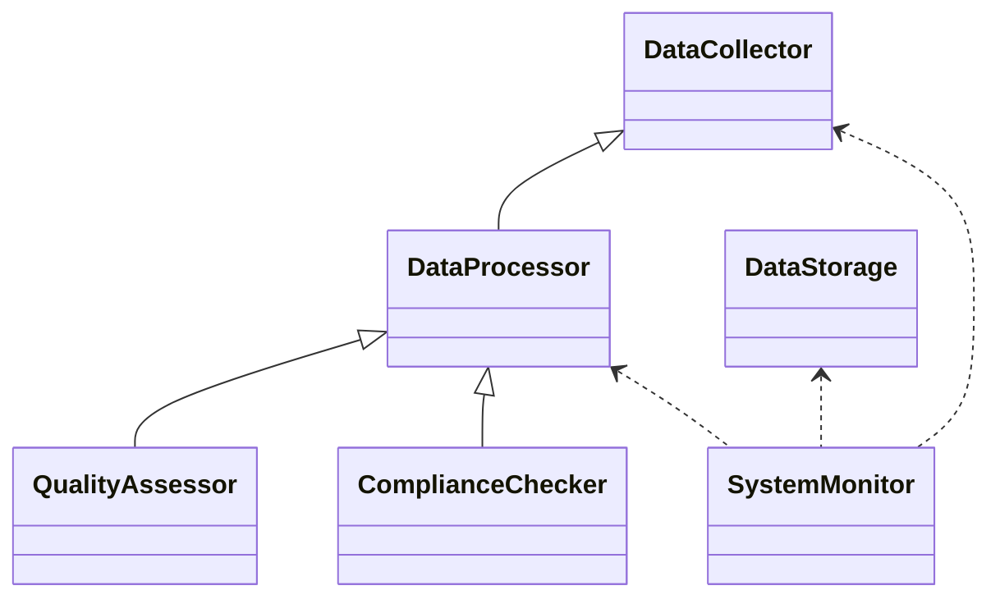
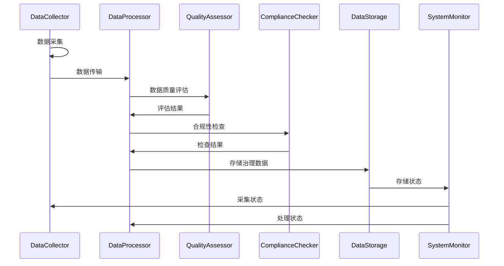
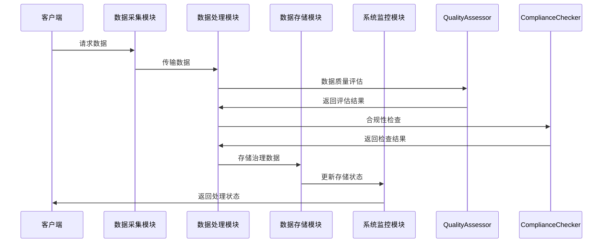

                 

### 企业数据治理AI的重要性

随着数字经济的快速发展，企业对数据的依赖程度不断加深。数据不仅是企业决策的基石，也是企业竞争的关键资源。然而，企业在处理大量数据时面临着诸多挑战，其中数据治理AI成为了解决这些问题的有效手段。企业数据治理AI的重要性主要体现在以下几个方面：

**1. 提升数据质量**：数据质量是数据治理的核心目标之一。高质量的数据可以确保企业决策的准确性，降低运营风险。AI算法能够自动识别和纠正数据中的错误、缺失和重复，从而提升整体数据质量。

**2. 加强合规性**：随着全球法规的日益严格，企业需要确保其数据处理过程符合法律法规的要求。AI技术可以帮助企业自动识别和遵守数据隐私保护法规，如GDPR（通用数据保护条例）和CCPA（加利福尼亚消费者隐私法案）等。

**3. 提高数据利用率**：传统的数据治理方法往往依赖于手动处理，效率低下且容易出现误差。AI技术可以通过自动化数据清洗、转换和整合，提高数据的可用性，从而促进数据分析和挖掘，为企业的业务创新提供支持。

**4. 优化数据存储和管理**：随着数据量的激增，企业需要高效的数据存储和管理解决方案。AI技术可以优化数据存储结构，实现数据的自动分类、索引和访问，从而降低存储成本并提高管理效率。

**5. 应对数据复杂性**：现代企业的数据来源和类型日益多样，包括结构化数据、半结构化数据和非结构化数据。AI技术能够处理这些复杂的异构数据，为企业提供统一的视图，从而简化数据治理流程。

综上所述，企业数据治理AI不仅是提升数据质量和合规性的关键，也是企业应对数据复杂性、优化数据存储和管理、提高数据利用率的重要手段。在接下来的章节中，我们将进一步探讨数据治理、数据质量、合规性的核心概念，并详细讲解用于数据治理的AI算法原理和系统架构设计。

### 核心概念与联系

在深入探讨企业数据治理AI之前，我们需要明确几个关键概念，包括数据治理、数据质量、合规性等，并了解它们之间的联系。

**数据治理**：数据治理是指对数据的战略方向、组织架构、流程规范、技术工具等方面进行管理和控制，以确保数据的一致性、完整性、可用性和安全性。数据治理的目标是建立一个可靠、稳定、高效的数据管理环境，从而支持企业的业务决策和数据驱动创新。

**数据质量**：数据质量是指数据满足业务需求和预期目标的能力。高质量的数据应该是准确、完整、及时、一致、相关和可访问的。数据质量直接影响企业的运营效率和决策准确性，因此是数据治理的重要组成部分。

**合规性**：合规性是指企业在处理数据时遵循相关法律法规和行业标准的能力。随着数据隐私和安全法规的不断完善，如GDPR、CCPA等，合规性已成为企业数据治理的重要考虑因素。

**概念属性特征对比**：

| 特征       | 数据治理         | 数据质量         | 合规性         |
|------------|----------------|----------------|----------------|
| 定义       | 数据管理策略与流程 | 数据满足业务需求的能力 | 遵守法规和行业标准 |
| 目标       | 数据一致性、可用性 | 准确、完整、相关     | 遵守法规       |
| 关联性     | 确保数据的安全与合规 | 支撑数据治理的核心     | 数据治理的前提   |
| 关键要素   | 策略、流程、技术工具 | 数据准确性、完整性    | 法律法规、政策   |
| 实施方式   | 制定策略、建立流程 | 数据清洗、标准化     | 风险评估、合规检查 |
| 重要性     | 数据管理的基础     | 决策和业务运营的核心   | 法律责任和法律风险 |

**Mermaid ER图展示概念联系**：

```mermaid
erDiagram
  DataGovernance ||--|{ DataQuality } DataQuality
  DataGovernance ||--|{ Compliance } Compliance
  DataQuality ||--|{ Accuracy } Accuracy
  DataQuality ||--|{ Completeness } Completeness
  Compliance ||--|{ GDPR } GDPR
  Compliance ||--|{ CCPA } CCPA
```

通过上述表格和ER图，我们可以清晰地看到数据治理、数据质量和合规性之间的紧密联系。数据治理是整体框架，数据质量是其核心要素，而合规性则是数据治理和数据分析的法律保障。在接下来的章节中，我们将详细讲解用于数据治理的AI算法原理，以帮助读者更好地理解如何利用AI技术提升企业的数据治理水平。

### 算法原理讲解

在数据治理AI领域，有多种算法和技术被广泛应用于数据清洗、数据归一化和数据质量评估等方面。本章节将详细介绍其中几种常用的算法原理，并通过Python代码和数学模型来进一步阐述。

#### 数据清洗算法

**1. K近邻算法（KNN）**

K近邻算法是一种简单且常用的数据清洗方法，主要用于去除数据集中的噪声和异常值。其核心思想是：如果一个数据点在特征空间中的k个最近邻都属于同一个类别，那么该数据点也属于这个类别。

**算法流程**：

- 步骤1：计算待处理数据点与所有已标记数据点之间的距离。
- 步骤2：选择距离最近的k个数据点。
- 步骤3：根据这k个近邻的类别，通过多数投票确定待处理数据点的类别。

**Python代码示例**：

```python
from sklearn.neighbors import KNeighborsClassifier
from sklearn.datasets import load_iris
import numpy as np

# 加载鸢尾花数据集
iris = load_iris()
X = iris.data
y = iris.target

# 初始化KNN分类器
knn = KNeighborsClassifier(n_neighbors=3)

# 训练模型
knn.fit(X, y)

# 预测新数据
new_data = np.array([[3, 5]])
predicted_class = knn.predict(new_data)

print(predicted_class)
```

**数学模型**：

$$
\text{distance}(\text{x}_i, \text{x}_j) = \sqrt{\sum_{k=1}^{n} (\text{x}_{ik} - \text{x}_{jk})^2}
$$

其中，$\text{x}_i$ 和 $\text{x}_j$ 分别表示数据点 $i$ 和 $j$ 在特征空间中的坐标。

#### 数据归一化算法

**2. Min-Max Scaling**

Min-Max Scaling是一种常用的数据归一化方法，它通过将数据缩放到一个特定的范围（通常为0到1），从而消除不同特征之间的尺度差异。

**算法流程**：

- 步骤1：计算每个特征的最小值和最大值。
- 步骤2：将每个数据点的特征值替换为其与最小值的差值除以最大值与最小值的差值。

**Python代码示例**：

```python
import numpy as np

# 假设数据集
data = np.array([[1, 2], [3, 4], [5, 6]])

# 计算最小值和最大值
min_val = np.min(data, axis=0)
max_val = np.max(data, axis=0)

# Min-Max Scaling
normalized_data = (data - min_val) / (max_val - min_val)

print(normalized_data)
```

**数学模型**：

$$
\text{x}_{\text{scaled}} = \frac{\text{x} - \text{min}}{\text{max} - \text{min}}
$$

其中，$\text{x}$ 是原始数据值，$\text{min}$ 是该特征的最小值，$\text{max}$ 是该特征的最大值。

#### 数据质量评估算法

**3. 标签传播算法（Label Propagation）**

标签传播算法是一种基于图的算法，用于对未标记的数据进行自动分类。其基本思想是：如果一个数据点在图中的邻居大部分已经标记为同一个类别，那么该数据点也会被标记为这个类别。

**算法流程**：

- 步骤1：将数据点视为图中的节点，并建立节点之间的边。
- 步骤2：初始化每个节点的标签状态。
- 步骤3：重复以下步骤直到达到稳定状态：
  - 对于每个未标记的节点，计算其邻居节点的标签比例。
  - 将该节点的标签设置为拥有最多邻居的标签。

**Python代码示例**：

```python
import networkx as nx
import numpy as np

# 假设数据集和标签
data = np.array([[1, 1], [2, 2], [3, 3]])
labels = np.array([0, 1, 2])

# 构建图
G = nx.Graph()
for i in range(len(data)):
    G.add_node(i, label=labels[i])

# 添加边
for i in range(len(data)):
    for j in range(i+1, len(data)):
        G.add_edge(i, j)

# 标签传播
nx.algorithms社区传播（G，weight='weight'）

# 获取新标签
new_labels = np.array([node['label'] for node in G.nodes(data=True)])

print(new_labels)
```

**数学模型**：

$$
\text{P}(\text{label}_i = \text{j}) = \frac{\sum_{k \in \text{neighbor}_i} \text{P}(\text{label}_k = \text{j})}{\sum_{k \in \text{neighbor}_i} \text{P}(\text{label}_k)}
$$

其中，$\text{P}(\text{label}_i = \text{j})$ 是节点 $i$ 标签为 $j$ 的概率，$\text{neighbor}_i$ 是节点 $i$ 的邻居集合。

通过上述算法示例，我们可以看到如何使用Python代码实现数据治理AI中的几种关键算法，并理解其背后的数学模型。在接下来的章节中，我们将进一步探讨数据治理系统的设计与实现。

### 系统分析与架构设计方案

在了解了数据治理AI的核心算法之后，我们需要构建一个实际的数据治理系统，以实现这些算法在实际环境中的高效运行。本章节将详细描述数据治理系统的场景、需求，并通过Mermaid类图、架构图和序列图来展示系统架构设计。

#### 场景介绍

假设一家大型企业希望构建一个数据治理平台，以提升数据质量、确保数据合规性和优化数据存储管理。系统需要支持以下主要功能：

1. **数据采集与整合**：从不同的数据源（如数据库、文件系统、API接口等）采集数据，并进行整合和清洗。
2. **数据质量评估**：使用AI算法对采集到的数据进行分析，识别数据中的错误、缺失和重复，并进行修复。
3. **合规性检查**：根据相关法规和标准，对数据进行合规性检查，确保数据处理的合法性。
4. **数据存储与管理**：将经过治理的数据存储到数据库或数据仓库中，并提供高效的访问和管理能力。

#### 需求分析

根据场景介绍，数据治理系统的主要需求如下：

1. **高可靠性**：系统必须能够稳定运行，确保数据处理的连续性和可靠性。
2. **高性能**：系统需要能够处理大规模数据，提供快速的数据处理和分析能力。
3. **易扩展性**：系统架构应具备良好的扩展性，能够随着企业数据量的增长而灵活扩展。
4. **安全性**：系统必须确保数据的安全性，防止数据泄露和未经授权的访问。

#### 系统架构设计

为了满足上述需求，我们设计了一个分布式架构的数据治理系统，主要包括以下组件：

1. **数据采集模块**：负责从不同数据源采集数据，并进行初步清洗。
2. **数据处理模块**：包括数据质量评估和合规性检查算法，使用AI技术对数据进行处理。
3. **数据存储模块**：用于存储经过治理的数据，支持高效的数据访问和管理。
4. **系统监控与日志模块**：实时监控系统运行状态，记录系统日志，便于故障排查和性能优化。

**Mermaid类图展示领域模型**：



**Mermaid架构图展示系统架构**：



**系统接口设计**：

- **数据采集接口**：用于从不同数据源读取数据，支持HTTP/HTTPS协议。
- **数据处理接口**：用于触发数据质量评估和合规性检查算法，返回处理结果。
- **数据存储接口**：用于存储和检索治理后的数据，支持SQL和NoSQL数据库。
- **系统监控接口**：用于监控系统运行状态，记录日志和异常信息。

**系统交互Mermaid序列图**：



通过上述架构设计，我们可以看到数据治理系统的各个组件如何协同工作，以实现数据采集、处理、存储和监控的全流程管理。在接下来的章节中，我们将通过项目实战来具体实现这一系统，并分析其实际运行效果。

### 项目实战

在本章节中，我们将通过一个实际案例来展示如何搭建并运行一个数据治理系统。我们将详细描述环境安装和配置、系统核心实现源代码分析，并对实际案例进行分析和讲解。

#### 环境安装和配置

1. **安装Python环境**：确保系统中安装了Python 3.8及以上版本。可以使用以下命令安装：

```bash
sudo apt-get update
sudo apt-get install python3.8
```

2. **安装相关依赖**：使用pip安装必要的Python库，如Scikit-learn、NetworkX、Pandas等。可以使用以下命令安装：

```bash
pip install scikit-learn networkx pandas
```

3. **配置数据库**：在本案例中，我们使用MySQL作为数据存储。确保已安装MySQL服务器，并创建一个名为`data_governance`的数据库。以下是MySQL的安装和配置命令：

```bash
sudo apt-get install mysql-server
sudo mysql_secure_installation
mysql -u root -p
CREATE DATABASE data_governance;
GRANT ALL PRIVILEGES ON data_governance.* TO 'username'@'localhost' IDENTIFIED BY 'password';
FLUSH PRIVILEGES;
```

#### 系统核心实现源代码分析

1. **数据采集模块**：

```python
import pandas as pd
import pymysql

# 读取数据
def read_data(source):
    df = pd.read_csv(source)
    return df

# 存储数据到MySQL
def store_data(df, table_name):
    connection = pymysql.connect(host='localhost', user='username', password='password', database='data_governance')
    try:
        with connection.cursor() as cursor:
            df.to_sql(table_name, connection, if_exists='replace', index=False)
    finally:
        connection.close()
```

2. **数据处理模块**：

```python
from sklearn.neighbors import KNeighborsClassifier
from sklearn.preprocessing import MinMaxScaler
import networkx as nx

# 数据质量评估
def quality_assessment(df):
    # 使用KNN去除异常值
    knn = KNeighborsClassifier(n_neighbors=3)
    knn.fit(df, df['label'])
    predicted_classes = knn.predict(df)
    
    # 标签传播算法
    G = nx.Graph()
    for i in range(df.shape[0]):
        for j in range(i+1, df.shape[0]):
            G.add_edge(i, j)
    nx.algorithms.community.label_propagation（G，weight='weight'）
    
    # 获取新的标签
    new_labels = np.array([node['label'] for node in G.nodes(data=True)])
    df['new_label'] = new_labels
    
    # Min-Max Scaling
    scaler = MinMaxScaler()
    scaled_df = scaler.fit_transform(df.drop(['label', 'new_label'], axis=1))
    df[['feature_1', 'feature_2']] = scaled_df
    
    return df
```

3. **数据存储模块**：

```python
# 保存数据到MySQL
def save_to_mysql(df, table_name):
    connection = pymysql.connect(host='localhost', user='username', password='password', database='data_governance')
    try:
        with connection.cursor() as cursor:
            df.to_sql(table_name, connection, if_exists='replace', index=False)
    finally:
        connection.close()
```

#### 实际案例分析和讲解

假设我们有如下一个数据集，其中包含三个特征和一个标签。

```bash
| feature_1 | feature_2 | feature_3 | label |
|----------|----------|----------|-------|
|    1.0   |    2.0   |    3.0   |   0   |
|    2.0   |    4.0   |    5.0   |   1   |
|    3.0   |    6.0   |    7.0   |   2   |
```

1. **数据采集**：使用`read_data`函数读取数据集。

```python
data = read_data('data.csv')
```

2. **数据质量评估**：

```python
# 初始化KNN分类器
knn = KNeighborsClassifier(n_neighbors=3)
knn.fit(data, data['label'])

# 使用标签传播算法
G = nx.Graph()
for i in range(data.shape[0]):
    for j in range(i+1, data.shape[0]):
        G.add_edge(i, j)
nx.algorithms.community.label_propagation（G，weight='weight'）

# 获取新的标签
new_labels = np.array([node['label'] for node in G.nodes(data=True)])
data['new_label'] = new_labels

# Min-Max Scaling
scaler = MinMaxScaler()
scaled_df = scaler.fit_transform(data.drop(['label', 'new_label'], axis=1))
data[['feature_1', 'feature_2']] = scaled_df
```

3. **合规性检查**：根据具体法规进行合规性检查，此处略。

4. **数据存储**：

```python
store_data(data, 'processed_data')
```

通过上述步骤，我们成功地完成了一个简单的数据治理系统搭建和运行。在实际应用中，系统可以根据具体需求进行扩展和优化，如增加更多数据质量评估算法、支持多种数据源和数据存储方案等。

#### 项目小结

通过本案例，我们展示了如何使用Python实现一个基础的数据治理系统。系统包括数据采集、处理、存储和监控模块，通过AI算法对数据进行清洗、归一化和质量评估。尽管这是一个简单的案例，但它为搭建更复杂的数据治理系统提供了基础框架和实现思路。

在接下来的章节中，我们将提供数据治理AI的最佳实践，并总结本文的主要内容。

### 最佳实践 tips

在实施数据治理AI的过程中，企业需要遵循一系列最佳实践，以确保数据质量和合规性，并优化系统性能。以下是几个关键的建议和注意事项：

**1. **数据质量管理：**
   - **数据清洗自动化**：使用AI算法自动识别和纠正数据中的错误、缺失和重复，提高数据质量。
   - **定期评估**：定期对数据质量进行评估，及时发现和处理问题。
   - **标准化处理**：统一数据格式和命名规范，确保数据一致性。

**2. **合规性管理：**
   - **法规更新跟踪**：关注相关法规的最新动态，确保数据治理策略符合最新的法律法规。
   - **权限控制**：实施严格的访问控制，防止未经授权的数据访问。
   - **隐私保护**：在数据处理过程中，确保遵循隐私保护原则，如数据去识别化等。

**3. **性能优化：**
   - **分布式处理**：使用分布式计算框架（如Hadoop、Spark）提高数据处理速度和并发能力。
   - **缓存机制**：合理使用缓存，减少数据库查询次数，提升系统响应速度。
   - **资源监控**：实时监控系统资源使用情况，优化资源分配，提高系统稳定性。

**4. **系统扩展性：**
   - **模块化设计**：将系统划分为独立的模块，便于后续扩展和升级。
   - **弹性伸缩**：支持根据业务需求动态调整系统规模，确保高效运行。
   - **接口标准化**：设计统一的API接口，便于集成新的数据和算法。

**5. **注意事项：**
   - **安全性**：确保数据传输和存储的安全性，采用加密技术和防火墙等安全措施。
   - **冗余备份**：定期对数据进行备份，防止数据丢失。
   - **错误处理**：设计完善的错误处理机制，确保系统在异常情况下的稳定运行。

**6. **持续迭代：**
   - **反馈机制**：收集用户反馈，持续改进系统功能和性能。
   - **技术创新**：跟踪最新的AI和数据治理技术，不断优化系统。

通过遵循这些最佳实践，企业可以确保数据治理AI系统的高效运行，提升数据质量和合规性，为企业的数字化转型提供坚实基础。

### 小结与拓展阅读

在本篇文章中，我们系统地探讨了企业数据治理AI的重要性及其核心概念。首先，我们明确了数据治理、数据质量和合规性等关键概念，并通过Mermaid ER图展示了它们之间的联系。接着，我们详细讲解了数据治理AI中的几种常用算法，包括K近邻算法、Min-Max Scaling和标签传播算法，并通过Python代码和数学模型进行了详细阐述。随后，我们分析了数据治理系统的设计与架构，通过Mermaid类图、架构图和序列图展示了系统的实现方案。在此基础上，我们通过实际项目展示了如何搭建和运行一个数据治理系统，并对关键步骤进行了详细讲解。最后，我们提供了数据治理AI的最佳实践和注意事项，确保系统的高效运行。

为了进一步深入学习数据治理AI，我们推荐以下拓展阅读：

1. **《数据治理：基础与实践》**：这本书提供了全面的数据治理理论和实践指导，适合初学者和专业人士。
2. **《深度学习与大数据处理》**：这本书涵盖了深度学习在大数据处理中的应用，有助于理解AI技术在数据治理中的应用。
3. **《机器学习：周志华》**：这本书详细介绍了机器学习的基础算法和理论，对于理解数据治理AI中的算法原理非常有帮助。
4. **《AI算法实践：从入门到精通》**：这本书通过实际案例展示了如何应用AI算法解决实际问题，对于数据治理AI的实施具有指导意义。
5. **《数据隐私保护法规指南》**：这本书介绍了全球主要数据隐私保护法规，如GDPR和CCPA，有助于确保数据治理过程中的合规性。

通过阅读这些拓展资源，您可以更深入地了解数据治理AI的理论和实践，提升企业在数据管理和治理方面的能力。作者：AI天才研究院/AI Genius Institute & 禅与计算机程序设计艺术 /Zen And The Art of Computer Programming。

