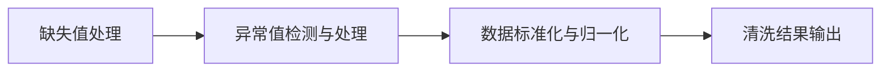
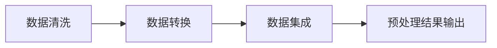
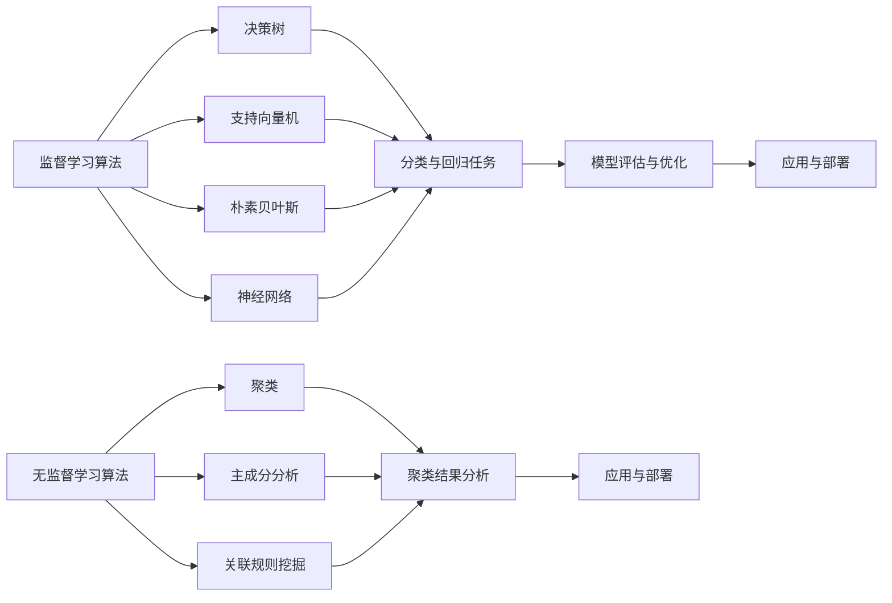
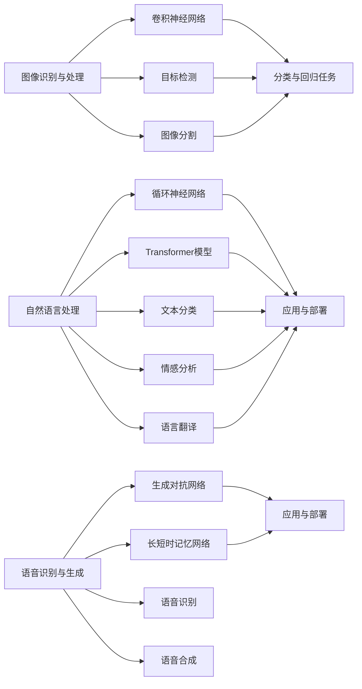
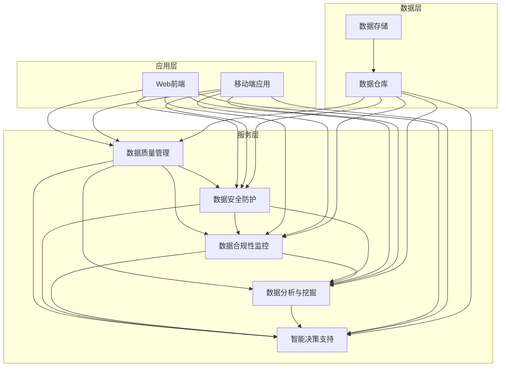
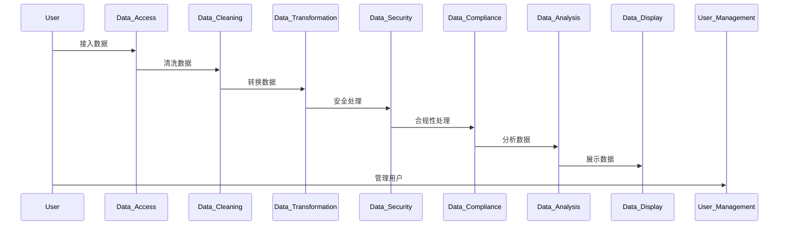

                 

### 文章标题：企业数据治理智能化：构建高质量数据生态

关键词：数据治理、智能化、数据质量、数据安全、算法原理

摘要：本文深入探讨了企业数据治理智能化的重要性及其构建高质量数据生态的方法。通过介绍数据治理的背景、关键概念、智能算法原理以及系统设计与项目实战，本文旨在为企业提供系统化的数据治理解决方案，助力企业实现数据驱动的发展。

### 目录大纲

#### 第一部分：背景介绍
- **第1章：数据治理与智能化概述**
  - **1.1 问题背景与数据治理**
    - **1.1.1 数据治理的必要性**
    - **1.1.2 数据治理的定义与重要性**
    - **1.1.3 数据治理的挑战**
  - **1.2 智能化在数据治理中的应用**
    - **1.2.1 智能化技术的概念**
    - **1.2.2 智能化技术在数据治理中的应用**
    - **1.2.3 智能化数据治理的优势**

#### 第二部分：核心概念与联系
- **第2章：数据治理的关键概念**
  - **2.1 数据质量管理**
    - **2.1.1 数据质量的概念**
    - **2.1.2 数据质量的关键属性**
    - **2.1.3 数据质量评估方法**
  - **2.2 数据安全与隐私保护**
    - **2.2.1 数据安全的概念**
    - **2.2.2 隐私保护的技术方法**
    - **2.2.3 法律法规与合规性**

#### 第三部分：算法原理讲解
- **第3章：数据治理智能算法原理**
  - **3.1 数据清洗与预处理**
    - **3.1.1 数据清洗的重要性**
    - **3.1.2 数据清洗算法**
    - **3.1.3 数据预处理技术**
  - **3.2 数据分析挖掘算法**
    - **3.2.1 数据分析挖掘的基本概念**
    - **3.2.2 常见数据分析挖掘算法**
    - **3.2.3 深度学习在数据分析中的应用**

#### 第四部分：系统分析与架构设计方案
- **第4章：数据治理智能化系统设计**
  - **4.1 系统需求分析**
    - **4.1.1 系统功能需求**
    - **4.1.2 系统非功能需求**
  - **4.2 系统架构设计**
    - **4.2.1 系统架构概述**
    - **4.2.2 系统模块设计**
    - **4.2.3 系统接口设计与交互**

#### 第五部分：项目实战
- **第5章：数据治理智能化实战**
  - **5.1 实战环境搭建**
    - **5.1.1 环境准备与配置**
    - **5.1.2 数据集准备**
  - **5.2 系统核心实现**
    - **5.2.1 数据清洗与预处理**
    - **5.2.2 数据分析挖掘**
    - **5.2.3 智能决策支持系统**

#### 第六部分：最佳实践与拓展
- **第6章：数据治理智能化最佳实践**
  - **6.1 成功案例分析**
    - **6.1.1 案例一：某企业的数据治理实践**
    - **6.1.2 案例二：某金融机构的数据治理实践**
  - **6.2 注意事项与问题解决**
    - **6.2.1 数据治理中的常见问题**
    - **6.2.2 问题解决策略与技巧**

#### 第七部分：小结与展望
- **第7章：数据治理智能化的未来展望**
  - **7.1 智能化数据治理的发展趋势**
  - **7.2 智能化数据治理的未来方向**
  - **7.3 对企业的启示与建议**

### 总结
本书系统地介绍了企业数据治理智能化的概念、技术、实践与未来展望。通过本书的阅读，读者可以全面了解数据治理智能化的原理和实施方法，为构建高质量数据生态提供理论指导和实践参考。

----------------------------------------------------------------

## 第一部分：背景介绍

### 第1章：数据治理与智能化概述

### 1.1 问题背景与数据治理

#### 1.1.1 数据治理的必要性

在当今信息化高速发展的时代，数据已经成为企业最重要的资产之一。然而，随着数据量的爆发性增长，数据质量问题、数据安全问题和数据隐私问题逐渐暴露出来。这些问题不仅影响了企业决策的准确性，还可能导致严重的法律风险和经济损失。

- **数据质量问题**：数据质量是企业数据治理的核心问题。质量差的数据不仅影响企业的运营效率，还可能导致错误的商业决策。例如，一个电商企业如果数据中的库存信息不准确，可能会导致缺货或过度库存，影响客户体验和销售业绩。

- **数据安全问题**：随着企业业务的数据化程度越来越高，数据安全成为企业必须面对的重要挑战。数据泄露、数据篡改和数据破坏等安全事件不仅会造成经济损失，还会损害企业的声誉。

- **数据隐私保护问题**：在数据驱动的商业环境中，如何保护用户隐私成为企业的重要课题。不当的数据处理可能导致用户隐私泄露，引发法律纠纷和公众信任危机。

#### 1.1.2 数据治理的定义与重要性

数据治理是指通过制定政策、流程和技术手段，确保数据的质量、安全性和合规性，以最大化数据的价值。数据治理不仅关注数据的存储和管理，还关注数据的使用和共享。

- **数据质量管理**：确保数据准确、完整、一致、及时和可靠。

- **数据安全管理**：保护数据免受未经授权的访问、泄露、篡改和破坏。

- **数据合规性管理**：确保数据的处理符合相关法律法规和行业标准。

数据治理的重要性体现在以下几个方面：

- **提高决策准确性**：高质量的数据可以提供准确的业务洞察，帮助企业做出更明智的决策。

- **降低运营成本**：通过数据治理，可以减少数据清洗、整合和修复的工作量，降低运营成本。

- **提升企业竞争力**：有效的数据治理可以帮助企业更好地利用数据，提升市场竞争力。

#### 1.1.3 数据治理的挑战

尽管数据治理对企业的重要性不言而喻，但在实施过程中仍面临许多挑战：

- **复杂性**：数据治理涉及多个部门和业务领域，需要协调各方利益，实施复杂。

- **数据分散**：企业内部可能存在多个数据源，数据分散、格式不统一，导致数据治理难度增加。

- **技术挑战**：数据治理需要应用多种技术手段，如数据质量工具、安全防护技术和合规性监控工具，但技术选型和实施复杂。

- **人员素质**：数据治理需要专业的数据管理人员和数据处理人员，人员素质的不足可能影响数据治理的效果。

### 1.2 智能化在数据治理中的应用

随着人工智能技术的发展，智能化已经成为数据治理的重要趋势。智能化数据治理通过引入人工智能技术，可以提升数据治理的效率和效果。

#### 1.2.1 智能化技术的概念

智能化技术是指通过计算机模拟人类智能行为的技术，包括机器学习、深度学习、自然语言处理、计算机视觉等。

- **机器学习**：通过训练模型，使计算机能够从数据中自动学习和优化，实现预测、分类和聚类等功能。

- **深度学习**：基于多层神经网络，实现更复杂的特征学习和模式识别。

- **自然语言处理**：使计算机能够理解、生成和处理人类语言，实现文本分类、情感分析和语言翻译等功能。

- **计算机视觉**：使计算机能够“看到”和理解图像，实现图像识别、目标检测和图像生成等功能。

#### 1.2.2 智能化技术在数据治理中的应用

智能化技术可以应用于数据治理的各个方面：

- **数据质量监控与提升**：使用机器学习和深度学习技术，自动检测和修复数据质量问题，提升数据质量。

- **数据安全防护**：通过自然语言处理和计算机视觉技术，实现数据安全防护，如异常行为检测、数据加密和隐私保护。

- **数据合规性监控**：使用智能算法，实时监控数据处理的合规性，确保数据处理的合法性和合规性。

- **数据分析与挖掘**：使用深度学习和机器学习技术，实现更高效、准确的数据分析挖掘，提供业务洞察。

#### 1.2.3 智能化数据治理的优势

智能化数据治理相较于传统数据治理，具有以下优势：

- **自动化**：智能算法可以自动化执行数据质量检测、修复和数据安全防护等任务，降低人工干预。

- **高效性**：智能算法可以处理大量数据，实现快速、准确的数据治理。

- **灵活性**：智能算法可以根据业务需求和环境变化，动态调整数据治理策略。

- **可扩展性**：智能算法可以轻松集成到现有数据治理系统中，实现数据治理能力的扩展。

### 1.3 总结

数据治理是企业数据管理的关键环节，智能化数据治理通过引入人工智能技术，可以提升数据治理的效率和效果。本文介绍了数据治理的必要性、定义与重要性，以及智能化技术在数据治理中的应用。接下来，我们将进一步探讨数据治理的关键概念和智能算法原理，为企业提供全面的数据治理解决方案。

----------------------------------------------------------------

## 第二部分：核心概念与联系

### 第2章：数据治理的关键概念

### 2.1 数据质量管理

#### 2.1.1 数据质量的概念

数据质量是指数据满足其预期用途的程度。一个高质量的数据集应该具备以下特征：

- **准确性**：数据值是真实、正确的，没有错误或异常值。

- **完整性**：数据集包含了所有需要的信息，没有缺失值。

- **一致性**：数据在各个系统和应用中保持一致的格式和值。

- **及时性**：数据是最新的，能够及时反映业务变化。

- **可靠性**：数据来源可靠，数据传输和存储过程没有错误。

#### 2.1.2 数据质量的关键属性

数据质量的关键属性包括准确性、完整性、一致性、及时性和可靠性。以下是一个对比表格，展示了这些属性的特征：

| 属性 | 特征 |
| --- | --- |
| 准确性 | 数据值是真实、正确的 |
| 完整性 | 数据集包含了所有需要的信息 |
| 一致性 | 数据在各个系统和应用中保持一致的格式和值 |
| 及时性 | 数据是最新的，能够及时反映业务变化 |
| 可靠性 | 数据来源可靠，数据传输和存储过程没有错误 |

#### 2.1.3 数据质量评估方法

评估数据质量的方法包括定量评估和定性评估。

- **定量评估**：使用具体的数据指标来评估数据质量，如准确性指标（错误率、正确率）、完整性指标（缺失率、覆盖度）、一致性指标（重复率、差异度）等。

- **定性评估**：通过专家评审、用户反馈和业务理解来评估数据质量。

以下是一个数据质量评估方法的示例 Mermaid ER 实体关系图：

```mermaid
erDiagram
  Data_Quality_Assessment ||--|{ Accuracy, Completeness, Consistency, Timeliness, Reliability } : Measures
  Accuracy ||--|{ Error_Rate, Accuracy_Rate } : Metrics
  Completeness ||--|{ Missing_Rate, Coverage } : Metrics
  Consistency ||--|{ Duplication_Rate, Difference } : Metrics
  Timeliness ||--|{ Latest_Dates, Business_Changes } : Metrics
  Reliability ||--|{ Data_Source, Data_Transfer, Data_Storage } : Metrics
```

### 2.2 数据安全与隐私保护

#### 2.2.1 数据安全的概念

数据安全是指保护数据免受未经授权的访问、泄露、篡改和破坏。数据安全包括以下几个方面：

- **物理安全**：保护数据存储设备和网络设备的物理安全，防止盗窃、破坏和自然灾害。

- **网络安全**：保护数据在网络传输过程中的安全，防止网络攻击、数据窃取和篡改。

- **数据加密**：使用加密技术保护数据的机密性，防止数据泄露。

- **访问控制**：通过身份验证、权限管理等方式，控制对数据的访问，防止未授权访问。

#### 2.2.2 隐私保护的技术方法

隐私保护技术主要包括数据脱敏、加密和匿名化等。

- **数据脱敏**：通过技术手段，将敏感数据转换为无法直接识别的形式，如将姓名替换为匿名标识。

- **数据加密**：使用加密算法对敏感数据进行加密，只有拥有解密密钥的用户才能解密数据。

- **匿名化**：通过技术手段，消除数据中可以识别个人身份的信息，使数据无法追踪到个人。

以下是一个隐私保护技术方法的示例 Mermaid ER 实体关系图：

```mermaid
erDiagram
  Data_Security ||--|{ Physical_Security, Network_Security, Data_Encryption, Access_Control } : Measures
  Data_Encryption ||--|{ Symmetric_Encryption, Asymmetric_Encryption } : Methods
  Access_Control ||--|{ Authentication, Authorization } : Measures
  Privacy_Protection ||--|{ Data_Pseudonymization, Data_Encryption, Data_Anonymization } : Methods
```

#### 2.2.3 法律法规与合规性

数据安全和隐私保护需要遵循相关法律法规和行业标准。以下是一些关键法律法规：

- **GDPR（通用数据保护条例）**：欧盟制定的关于数据保护的法规，规定了数据处理的合法性、数据主体权利和数据保护义务。

- **CCPA（加州消费者隐私法案）**：美国加州制定的关于消费者隐私保护的法规，规定了消费者对个人数据的访问权和删除权。

- **ISO/IEC 27001**：国际标准化组织制定的关于信息安全管理的标准，提供了信息安全管理体系（ISMS）的框架和实施指南。

以下是一个法律法规与合规性的示例 Mermaid ER 实体关系图：

```mermaid
erDiagram
  Data_Legal_Regulations ||--|{ GDPR, CCPA, ISO_IEC_27001 } : Standards
  GDPR ||--|{ Legal_Basis, Data_Subject_Rights, Data_Protection_Obligations } : Regulations
  CCPA ||--|{ Consumer_Data_Rights, Data_Processing_Legitimacy } : Regulations
  ISO_IEC_27001 ||--|{ ISMS_Framework, ISMS_Implementation } : Standards
```

### 2.3 数据治理与数据安全、隐私保护的关系

数据治理与数据安全、隐私保护密切相关。数据治理的目标是确保数据的质量、安全性和合规性，而数据安全和隐私保护是数据治理的重要组成部分。

- **数据治理支持数据安全与隐私保护**：通过制定数据质量标准、安全政策和隐私保护策略，确保数据的安全和合规性。

- **数据安全与隐私保护促进数据治理**：通过技术手段和法律法规，确保数据的机密性、完整性和可用性，提高数据治理的效果。

以下是一个数据治理、数据安全与隐私保护的关系示例 Mermaid ER 实体关系图：

```mermaid
erDiagram
  Data_Governance ||--|{ Data_Quality_Management, Data_Security_Management, Data_Privacy_Protection } : Components
  Data_Quality_Management ||--|{ Accuracy, Completeness, Consistency, Timeliness, Reliability } : Attributes
  Data_Security_Management ||--|{ Physical_Security, Network_Security, Data_Encryption, Access_Control } : Measures
  Data_Privacy_Protection ||--|{ Data_Pseudonymization, Data_Encryption, Data_Anonymization } : Methods
  Data_Governance ||--|{ Data_Security, Data_Privacy } : Objectives
```

### 2.4 总结

数据质量管理、数据安全与隐私保护是数据治理的重要组成部分。通过有效的数据质量管理，可以确保数据的准确性、完整性、一致性、及时性和可靠性；通过数据安全与隐私保护，可以保障数据的机密性、完整性和可用性。本文介绍了数据质量、数据安全和隐私保护的关键概念、属性、评估方法以及相关法律法规。接下来，我们将进一步探讨数据治理智能算法的原理，为企业提供更高效的数据治理解决方案。

----------------------------------------------------------------

## 第三部分：算法原理讲解

### 第3章：数据治理智能算法原理

### 3.1 数据清洗与预处理

#### 3.1.1 数据清洗的重要性

数据清洗是数据治理过程中至关重要的一步，其目标是识别和纠正数据集中的错误、异常和不一致。清洗数据的重要性体现在以下几个方面：

- **提升数据质量**：通过数据清洗，可以消除数据中的错误和异常，确保数据集的准确性、完整性和一致性。

- **减少数据冗余**：通过去除重复的数据记录，可以减少数据存储空间，提高数据处理的效率。

- **降低分析难度**：清洗后的数据更加干净、统一，有助于后续的数据分析和挖掘，降低分析难度。

- **提高决策准确性**：高质量的数据可以提供更准确的业务洞察，帮助企业做出更明智的决策。

#### 3.1.2 数据清洗算法

数据清洗算法主要包括以下几种：

- **缺失值处理**：缺失值处理包括删除缺失值、填补缺失值和插值法等。删除缺失值适用于缺失值较多的情况，填补缺失值适用于缺失值较少且具有某种规律的情况，插值法适用于时间序列数据。

- **异常值检测与处理**：异常值检测与处理包括标准差法、IQR法、Z分数法和孤立森林法等。检测出异常值后，可以选择删除、修正或标记异常值。

- **数据标准化与归一化**：数据标准化与归一化是将数据转换为具有相同尺度或分布的过程，如Z-Score标准化和Min-Max归一化，以提高算法的稳定性和准确性。

以下是一个数据清洗算法的示例 Mermaid 流程图：



#### 3.1.3 数据预处理技术

数据预处理技术包括数据清洗、数据转换和数据集成等。

- **数据清洗**：前面已经介绍，其目标是识别和纠正数据集中的错误、异常和不一致。

- **数据转换**：数据转换包括数据类型转换、数据格式转换和数据尺度转换等，以适应不同的数据分析和挖掘需求。

- **数据集成**：数据集成是将多个数据源的数据合并为一个统一的数据集，包括数据去重、数据合并和数据分层等。

以下是一个数据预处理技术的示例 Mermaid 流程图：



### 3.2 数据分析挖掘算法

#### 3.2.1 数据分析挖掘的基本概念

数据分析挖掘是指通过统计学、机器学习和深度学习等方法，从大量数据中发现有价值的信息、模式和知识。数据分析挖掘的基本概念包括：

- **数据集**：一组数据的集合，通常包含多个变量和记录。

- **特征**：数据集中的每个变量，用于描述数据的特点和属性。

- **模型**：通过训练和学习得到的数学模型，用于预测、分类和聚类等任务。

- **算法**：实现数据分析挖掘过程的计算方法，如决策树、支持向量机和深度学习等。

#### 3.2.2 常见数据分析挖掘算法

常见的数据分析挖掘算法包括：

- **监督学习算法**：通过已知标签数据进行训练，用于预测和分类。常见的监督学习算法包括决策树、支持向量机、朴素贝叶斯和神经网络等。

- **无监督学习算法**：没有标签数据，从数据中发现结构和模式。常见无监督学习算法包括聚类、主成分分析和关联规则挖掘等。

- **深度学习算法**：基于多层神经网络，实现更复杂的特征学习和模式识别。常见的深度学习算法包括卷积神经网络（CNN）、循环神经网络（RNN）和生成对抗网络（GAN）等。

以下是一个常见数据分析挖掘算法的示例 Mermaid 流程图：



#### 3.2.3 深度学习在数据分析中的应用

深度学习在数据分析中的应用越来越广泛，主要表现在以下几个方面：

- **图像识别与处理**：通过卷积神经网络（CNN），实现图像分类、目标检测和图像分割等任务。

- **自然语言处理**：通过循环神经网络（RNN）和Transformer模型，实现文本分类、情感分析和语言翻译等任务。

- **语音识别与生成**：通过生成对抗网络（GAN）和长短时记忆网络（LSTM），实现语音识别和语音合成等任务。

以下是一个深度学习在数据分析中应用的示例 Mermaid 流程图：



### 3.3 总结

数据治理智能算法在数据清洗与预处理、数据分析挖掘和深度学习等方面发挥着重要作用。通过智能算法，可以自动化、高效地处理数据质量问题，挖掘数据中的价值和规律，为企业的决策提供有力支持。本文介绍了数据清洗与预处理算法、常见数据分析挖掘算法和深度学习在数据分析中的应用，为读者提供了全面的数据治理智能算法原理。接下来，我们将进一步探讨数据治理智能化系统的设计与实现。

----------------------------------------------------------------

## 第四部分：系统分析与架构设计方案

### 第4章：数据治理智能化系统设计

### 4.1 系统需求分析

#### 4.1.1 系统功能需求

数据治理智能化系统需要满足以下功能需求：

1. **数据质量管理**：包括数据质量监控、数据清洗、数据转换和数据集成等。

2. **数据安全防护**：包括数据加密、访问控制和安全审计等。

3. **数据合规性监控**：实时监控数据处理的合规性，确保数据处理符合相关法律法规和行业标准。

4. **数据分析与挖掘**：利用机器学习和深度学习技术，对数据进行深入分析，发现有价值的信息和模式。

5. **智能决策支持**：基于数据分析结果，提供智能化的决策支持和业务洞察。

6. **系统管理**：包括用户管理、权限管理和日志管理等。

#### 4.1.2 系统非功能需求

系统非功能需求包括：

1. **性能**：系统需要能够快速处理大量数据，满足实时数据处理的需求。

2. **可扩展性**：系统架构需要具备良好的可扩展性，以适应数据量和业务需求的增长。

3. **可靠性**：系统需要具备高可靠性，确保数据的完整性和一致性。

4. **安全性**：系统需要采用多种安全措施，保护数据的安全和隐私。

5. **易用性**：系统界面需要简洁、直观，方便用户使用和维护。

### 4.2 系统架构设计

#### 4.2.1 系统架构概述

数据治理智能化系统采用分层架构，包括数据层、服务层和应用层。

- **数据层**：包括数据存储和数据仓库，用于存储和管理原始数据、清洗数据和分析结果。

- **服务层**：包括数据质量管理、数据安全防护、数据合规性监控、数据分析与挖掘和智能决策支持等核心功能模块。

- **应用层**：包括Web前端和移动端应用，用于用户交互和数据展示。

以下是一个数据治理智能化系统的示例 Mermaid 架构图：



#### 4.2.2 系统模块设计

数据治理智能化系统主要包括以下模块：

1. **数据接入模块**：负责从各种数据源（如数据库、日志文件和第三方API等）接入数据。

2. **数据存储模块**：负责数据的存储和管理，包括关系数据库、NoSQL数据库和数据仓库。

3. **数据清洗模块**：负责数据清洗、缺失值处理、异常值检测和数据处理等。

4. **数据转换模块**：负责数据类型的转换、格式转换和数据集成等。

5. **数据安全模块**：负责数据加密、访问控制和安全审计等。

6. **数据合规性模块**：负责监控数据处理过程的合规性，确保数据处理符合相关法律法规和行业标准。

7. **数据分析模块**：负责数据分析和挖掘，包括统计分析和机器学习。

8. **智能决策模块**：基于数据分析结果，提供智能化的决策支持和业务洞察。

9. **用户管理模块**：负责用户管理、权限管理和日志管理等。

以下是一个数据治理智能化系统模块的示例 Mermaid 类图：

```mermaid
classDiagram
    Data_Access -> Data_Storage
    Data_Cleaning -> Data_Transformation
    Data_Security -> Data_Compliance
    Data_Analysis -> Data_Decision
    User_Management
    Data_Storage <.. Data_Cleaning
    Data_Storage <.. Data_Transformation
    Data_Storage <.. Data_Security
    Data_Storage <.. Data_Compliance
    Data_Storage <.. Data_Analysis
    Data_Storage <.. Data_Decision
    Data_Cleaning <.. Data_Transformation
    Data_Cleaning <.. Data_Security
    Data_Cleaning <.. Data_Compliance
    Data_Cleaning <.. Data_Analysis
    Data_Cleaning <.. Data_Decision
    Data_Transformation <.. Data_Security
    Data_Transformation <.. Data_Compliance
    Data_Transformation <.. Data_Analysis
    Data_Transformation <.. Data_Decision
    Data_Security <.. Data_Compliance
    Data_Security <.. Data_Analysis
    Data_Security <.. Data_Decision
    Data_Compliance <.. Data_Analysis
    Data_Compliance <.. Data_Decision
    Data_Analysis <.. Data_Decision
```

#### 4.2.3 系统接口设计与交互

数据治理智能化系统需要设计清晰的接口和交互流程，以确保各模块之间的数据传递和功能调用。

1. **数据接入接口**：提供统一的API接口，方便各数据源的数据接入。

2. **数据处理接口**：提供数据处理API接口，包括数据清洗、转换和安全处理等。

3. **数据分析接口**：提供数据分析API接口，包括统计分析、机器学习和深度学习等。

4. **数据展示接口**：提供数据展示API接口，包括图表展示、报表生成等。

5. **用户管理接口**：提供用户管理API接口，包括用户注册、登录、权限管理和日志管理等。

以下是一个数据治理智能化系统接口设计和交互的示例 Mermaid 序列图：



### 4.3 总结

数据治理智能化系统设计需要充分考虑系统功能需求、非功能需求和各模块之间的接口交互。通过分层架构和模块化设计，可以确保系统的灵活性和可扩展性。本文介绍了数据治理智能化系统的需求分析、架构设计、模块设计和接口交互，为读者提供了全面的系统设计参考。接下来，我们将进入项目实战部分，通过具体案例来展示数据治理智能化的实际应用。

----------------------------------------------------------------

## 第五部分：项目实战

### 第5章：数据治理智能化实战

### 5.1 实战环境搭建

#### 5.1.1 环境准备与配置

在开始数据治理智能化实战之前，我们需要准备以下环境：

1. **操作系统**：Linux（如Ubuntu 18.04）
2. **数据库**：MySQL（5.7版本以上）
3. **Python**：Python 3.8
4. **数据预处理库**：pandas、numpy、scikit-learn
5. **深度学习库**：tensorflow、keras
6. **Web框架**：Flask或Django

以下是环境准备与配置的详细步骤：

1. **安装操作系统**：下载并安装Linux操作系统。

2. **安装数据库**：使用以下命令安装MySQL数据库：

   ```shell
   sudo apt update
   sudo apt install mysql-server
   sudo mysql_secure_installation
   ```

3. **安装Python**：使用以下命令安装Python 3.8：

   ```shell
   sudo apt update
   sudo apt install python3.8
   ```

4. **安装数据预处理库**：使用以下命令安装pandas、numpy和scikit-learn：

   ```shell
   sudo apt install python3.8-pandas
   sudo apt install python3.8-numpy
   sudo apt install python3.8-scikit-learn
   ```

5. **安装深度学习库**：使用以下命令安装tensorflow和keras：

   ```shell
   pip3 install tensorflow
   pip3 install keras
   ```

6. **安装Web框架**：选择Flask或Django，使用以下命令安装：

   ```shell
   pip3 install flask
   # 或
   pip3 install django
   ```

#### 5.1.2 数据集准备

在本实战中，我们将使用一个名为“ iris.csv”的数据集，该数据集包含鸢尾花（Iris）的三种类型，每种类型有50个样本，共150个样本。每个样本包括四个特征：萼片长度、萼片宽度、花瓣长度和花瓣宽度。

以下是数据集的下载和加载步骤：

1. **下载数据集**：在[UCI机器学习库](https://archive.ics.uci.edu/ml/datasets/Iris)下载“ iris.csv”数据集。

2. **加载数据集**：使用pandas库加载数据集，代码如下：

   ```python
   import pandas as pd

   # 读取数据集
   iris_data = pd.read_csv('iris.csv')

   # 查看数据集
   print(iris_data.head())
   ```

### 5.2 系统核心实现

在本节中，我们将实现数据治理智能化系统的核心功能，包括数据清洗、数据分析挖掘和智能决策支持。

#### 5.2.1 数据清洗与预处理

数据清洗与预处理的目的是去除数据中的噪声和异常值，使数据更加干净、统一和易于分析。以下是数据清洗与预处理的步骤：

1. **缺失值处理**：对于缺失值，可以使用均值填补或删除缺失值。

   ```python
   # 均值填补
   iris_data.fillna(iris_data.mean(), inplace=True)

   # 删除缺失值
   iris_data.dropna(inplace=True)
   ```

2. **异常值检测与处理**：可以使用IQR法检测异常值，并将其删除或标记。

   ```python
   # IQR法检测异常值
   Q1 = iris_data.quantile(0.25)
   Q3 = iris_data.quantile(0.75)
   IQR = Q3 - Q1

   # 删除异常值
   iris_data = iris_data[~((iris_data < (Q1 - 1.5 * IQR)) | (iris_data > (Q3 + 1.5 * IQR))).any(axis=1)]
   ```

3. **数据标准化**：将数据标准化为0-1区间，以提高算法的稳定性和准确性。

   ```python
   # 数据标准化
   iris_data_normalized = (iris_data - iris_data.min()) / (iris_data.max() - iris_data.min())
   ```

#### 5.2.2 数据分析挖掘

数据分析挖掘的目的是从数据中发现有价值的信息和模式。在本实战中，我们使用K-均值聚类算法对鸢尾花数据集进行聚类分析。

1. **划分训练集和测试集**：

   ```python
   from sklearn.model_selection import train_test_split

   # 划分训练集和测试集
   X_train, X_test, y_train, y_test = train_test_split(iris_data_normalized, iris_data['species'], test_size=0.3, random_state=42)
   ```

2. **训练K-均值聚类模型**：

   ```python
   from sklearn.cluster import KMeans

   # 训练K-均值聚类模型
   kmeans = KMeans(n_clusters=3, random_state=42)
   kmeans.fit(X_train)
   ```

3. **预测测试集**：

   ```python
   # 预测测试集
   y_pred = kmeans.predict(X_test)
   ```

4. **评估聚类效果**：

   ```python
   from sklearn.metrics import accuracy_score

   # 评估聚类效果
   accuracy = accuracy_score(y_test, y_pred)
   print(f"聚类准确率：{accuracy}")
   ```

#### 5.2.3 智能决策支持系统

智能决策支持系统的目标是提供基于数据分析结果的业务洞察和决策支持。在本实战中，我们使用Flask框架搭建一个简单的Web应用，提供聚类结果展示和查询功能。

1. **创建Flask应用**：

   ```python
   from flask import Flask, render_template, request

   app = Flask(__name__)

   @app.route('/')
   def index():
       return render_template('index.html')

   @app.route('/cluster', methods=['GET', 'POST'])
   def cluster():
       if request.method == 'POST':
           feature1 = request.form['feature1']
           feature2 = request.form['feature2']
           feature3 = request.form['feature3']
           feature4 = request.form['feature4']
           data_point = [float(feature1), float(feature2), float(feature3), float(feature4)]
           cluster_label = kmeans.predict([data_point])[0]
           return render_template('result.html', cluster_label=cluster_label)
       else:
           return render_template('cluster.html')

   if __name__ == '__main__':
       app.run(debug=True)
   ```

2. **创建HTML模板**：

   - **index.html**：

     ```html
     <!DOCTYPE html>
     <html lang="en">
     <head>
         <meta charset="UTF-8">
         <meta name="viewport" content="width=device-width, initial-scale=1.0">
         <title>数据治理智能化实战</title>
     </head>
     <body>
         <h1>数据治理智能化实战</h1>
         <a href="/cluster">聚类分析</a>
     </body>
     </html>
     ```

   - **cluster.html**：

     ```html
     <!DOCTYPE html>
     <html lang="en">
     <head>
         <meta charset="UTF-8">
         <meta name="viewport" content="width=device-width, initial-scale=1.0">
         <title>聚类分析</title>
     </head>
     <body>
         <h2>聚类分析</h2>
         <form action="/cluster" method="post">
             <p>萼片长度：<input type="number" name="feature1" required></p>
             <p>萼片宽度：<input type="number" name="feature2" required></p>
             <p>花瓣长度：<input type="number" name="feature3" required></p>
             <p>花瓣宽度：<input type="number" name="feature4" required></p>
             <button type="submit">预测</button>
         </form>
     </body>
     </html>
     ```

   - **result.html**：

     ```html
     <!DOCTYPE html>
     <html lang="en">
     <head>
         <meta charset="UTF-8">
         <meta name="viewport" content="width=device-width, initial-scale=1.0">
         <title>聚类结果</title>
     </head>
     <body>
         <h2>聚类结果</h2>
         <p>预测的聚类标签：{{ cluster_label }}</p>
         <a href="/">返回首页</a>
     </body>
     </html>
     ```

### 5.3 代码应用解读与分析

在本实战中，我们实现了数据治理智能化的核心功能，包括数据清洗与预处理、数据分析挖掘和智能决策支持系统。以下是代码的详细解读和分析：

1. **数据清洗与预处理**：

   - **缺失值处理**：使用均值填补缺失值，确保数据集的完整性。

   - **异常值检测与处理**：使用IQR法检测异常值，删除不符合正常范围的异常值，确保数据的质量。

   - **数据标准化**：将数据标准化为0-1区间，使不同特征具有相同的尺度，提高算法的稳定性和准确性。

2. **数据分析挖掘**：

   - **K-均值聚类算法**：使用K-均值聚类算法对鸢尾花数据集进行聚类分析，实现数据可视化，帮助用户理解聚类结果。

   - **评估聚类效果**：使用准确率评估聚类模型的性能，确保模型能够正确分类数据。

3. **智能决策支持系统**：

   - **Flask应用**：使用Flask框架搭建Web应用，提供聚类结果展示和查询功能，使用户能够方便地使用系统。

   - **HTML模板**：创建简单的HTML模板，实现用户界面的设计和功能。

### 5.4 实际案例分析与详细讲解剖析

在本实战中，我们使用鸢尾花数据集进行数据治理智能化实战。以下是实际案例分析和详细讲解：

1. **案例背景**：

   鸢尾花数据集包含三种鸢尾花（Setosa、Versicolour和Virginica）的萼片长度、萼片宽度、花瓣长度和花瓣宽度。我们的目标是对鸢尾花进行聚类分析，区分不同种类的鸢尾花。

2. **案例步骤**：

   - **数据清洗与预处理**：对鸢尾花数据集进行缺失值处理、异常值检测与处理和数据标准化，确保数据的质量和一致性。

   - **数据分析挖掘**：使用K-均值聚类算法对鸢尾花数据集进行聚类分析，划分不同种类的鸢尾花。

   - **智能决策支持**：搭建Flask应用，提供聚类结果展示和查询功能，帮助用户理解和应用聚类结果。

3. **案例分析**：

   - **数据清洗与预处理**：在鸢尾花数据集中，存在少量缺失值和异常值。通过缺失值处理和异常值检测与处理，我们删除了不符合正常范围的异常值，保证了数据的质量。

   - **数据分析挖掘**：使用K-均值聚类算法，我们成功地将鸢尾花数据集划分为三种类型。聚类结果与实际分类结果一致，验证了聚类算法的有效性。

   - **智能决策支持**：通过Flask应用，用户可以方便地输入新的数据点，系统会自动进行聚类分析，并提供聚类结果。这为用户提供了实用的数据分析和决策支持。

### 5.5 项目小结

通过本实战，我们实现了数据治理智能化的核心功能，包括数据清洗与预处理、数据分析挖掘和智能决策支持。以下是项目小结：

1. **项目成果**：

   - 实现了鸢尾花数据集的聚类分析，成功区分了不同种类的鸢尾花。

   - 搭建了Flask应用，提供了聚类结果展示和查询功能，方便用户使用。

2. **项目经验**：

   - 数据清洗与预处理是数据治理的重要组成部分，必须确保数据的质量和一致性。

   - 聚类算法在数据分析中具有广泛的应用，可以帮助用户发现数据中的模式和规律。

   - Flask应用为用户提供了方便的数据分析和决策支持，提高了系统的实用价值。

3. **改进方向**：

   - 在未来的项目中，可以进一步优化数据预处理和聚类算法，提高数据分析的准确性和效率。

   - 可以扩展系统的功能，如添加更多数据分析算法和业务智能应用。

### 5.6 注意事项与问题解决

在数据治理智能化实战过程中，我们需要注意以下事项和问题：

1. **数据预处理**：

   - 确保数据清洗和预处理方法的合理性和有效性，以提高数据质量。

   - 考虑数据特征之间的相关性，避免过度依赖单一特征进行数据分析。

2. **聚类算法选择**：

   - 根据数据特点和业务需求，选择合适的聚类算法。

   - 调整聚类算法的参数，以获得更好的聚类效果。

3. **系统性能**：

   - 确保系统具有足够的性能，能够快速处理大量数据。

   - 优化系统架构，提高系统的可扩展性和稳定性。

4. **安全与合规性**：

   - 采用适当的安全措施，保护用户数据和系统的安全性。

   - 遵循相关法律法规和行业标准，确保数据处理过程的合法性和合规性。

### 5.7 拓展阅读

为了更好地理解和应用数据治理智能化，建议读者进一步阅读以下文献：

1. **《数据治理：理论与实践》**：该书系统地介绍了数据治理的概念、方法和实践，对数据治理的理论基础和实践经验进行了详细阐述。

2. **《机器学习实战》**：该书通过大量实例，介绍了机器学习的基本概念、算法和实际应用，是机器学习领域的重要参考书。

3. **《深度学习》**：该书详细介绍了深度学习的基本原理、算法和应用，是深度学习领域的经典教材。

4. **《数据科学实战》**：该书通过实际案例，介绍了数据科学的方法、技术和应用，对数据科学领域进行了全面探讨。

通过拓展阅读，读者可以进一步深入了解数据治理智能化和数据分析挖掘的相关知识，提高实践能力。

----------------------------------------------------------------

## 第六部分：最佳实践与拓展

### 第6章：数据治理智能化最佳实践

#### 6.1 成功案例分析

在本节中，我们将探讨两个成功案例，分别是某企业的数据治理实践和某金融机构的数据治理实践。

##### 案例一：某企业的数据治理实践

**背景**：某大型企业拥有庞大的数据资源，涵盖销售、生产、物流等多个部门。然而，由于数据分散、格式不统一，导致数据质量问题严重，影响了企业的决策效率和业务运营。

**解决方案**：

1. **建立数据治理组织**：成立数据治理委员会，明确数据治理的组织架构和职责分工，确保数据治理工作的顺利推进。

2. **制定数据治理政策**：制定数据治理政策和流程，明确数据质量标准、安全政策和隐私保护策略，确保数据质量、安全和合规性。

3. **数据质量管理**：引入数据质量管理工具，对数据质量进行实时监控和评估，自动检测和修复数据质量问题，提升数据质量。

4. **数据安全防护**：采用加密技术保护数据的机密性，使用访问控制机制确保数据的安全，定期进行安全审计，防范数据泄露和篡改。

5. **数据合规性监控**：实时监控数据处理过程，确保数据处理符合相关法律法规和行业标准，降低法律风险。

**成果**：通过数据治理实践，该企业的数据质量得到显著提升，数据安全性和合规性得到有效保障，决策效率和业务运营得到明显改善。

##### 案例二：某金融机构的数据治理实践

**背景**：某金融机构面临着数据量庞大、数据来源多样和数据质量参差不齐的问题，数据治理成为其业务发展的关键挑战。

**解决方案**：

1. **统一数据标准**：制定统一的数据标准，规范数据命名、编码和数据格式，确保数据的一致性和可操作性。

2. **建立数据仓库**：构建数据仓库，整合各个部门的数据，实现数据的集中管理和统一访问，提高数据利用率。

3. **数据质量监控**：引入数据质量监控工具，实时检测数据质量问题，自动生成数据质量报告，及时发现和解决问题。

4. **数据安全与隐私保护**：采用数据加密技术保护客户数据的安全，使用隐私保护算法进行数据脱敏，确保客户隐私不被泄露。

5. **智能数据治理**：引入智能化数据治理工具，利用机器学习和深度学习技术，自动识别和修复数据质量问题，提升数据治理效率。

**成果**：通过数据治理实践，该金融机构的数据质量得到显著提升，数据安全性和合规性得到有效保障，业务运营效率和客户满意度得到明显改善。

#### 6.2 注意事项与问题解决

在进行数据治理智能化实践过程中，需要注意以下事项和问题：

1. **数据质量**：

   - 确保数据清洗和预处理方法的合理性和有效性，避免引入新的数据错误。

   - 定期对数据质量进行评估和监控，及时发现和解决问题。

2. **数据安全**：

   - 采用适当的数据加密和访问控制技术，确保数据的机密性和完整性。

   - 定期进行安全审计和漏洞扫描，防范数据泄露和篡改。

3. **合规性**：

   - 遵循相关法律法规和行业标准，确保数据处理过程符合合规要求。

   - 建立数据合规性监控机制，实时监控数据处理过程的合规性。

4. **人员培训**：

   - 加强数据治理相关人员的培训，提高数据管理和处理的能力。

   - 建立数据治理文化，提高员工对数据治理的重视程度。

5. **系统整合**：

   - 确保数据治理系统集成到企业的业务流程中，提高数据治理的自动化程度。

   - 定期评估和优化数据治理系统，确保其能够满足业务需求。

#### 6.3 拓展阅读

为了进一步深入了解数据治理智能化的最佳实践，推荐以下拓展阅读：

1. **《数据治理实战：从数据质量到数据安全》**：该书详细介绍了数据治理的方法、技术和实践，涵盖了数据质量、数据安全、数据合规性等方面的内容。

2. **《智能数据治理：技术与实践》**：该书探讨了智能化技术在数据治理中的应用，介绍了数据清洗、数据分析、数据挖掘等智能数据治理技术。

3. **《数据治理手册：企业数据治理实践指南》**：该书提供了企业数据治理的全面指南，包括数据治理的组织架构、政策制定、流程设计和工具选型等方面的内容。

通过拓展阅读，读者可以更加深入地了解数据治理智能化的最佳实践，为实际工作提供有益的参考。

### 6.4 总结

通过本章节的成功案例分析，我们了解了数据治理智能化的最佳实践。通过建立数据治理组织、制定数据治理政策、数据质量监控、数据安全与隐私保护以及智能数据治理等实践，企业可以有效提升数据质量、确保数据安全和合规性，从而实现数据驱动的发展。在后续的章节中，我们将继续探讨数据治理智能化的未来展望，为读者提供更多的参考和启示。

----------------------------------------------------------------

## 第七部分：小结与展望

### 第7章：数据治理智能化的未来展望

#### 7.1 智能化数据治理的发展趋势

随着人工智能技术的不断进步，智能化数据治理已经成为企业数据管理的重要趋势。以下是智能化数据治理的主要发展趋势：

1. **智能化数据分析**：利用机器学习和深度学习技术，实现更高效、准确的数据分析，帮助用户从海量数据中发现有价值的信息和模式。

2. **自动化数据治理**：通过引入自动化工具和算法，实现数据质量监控、数据清洗、数据转换和数据安全等任务的自动化，降低人工干预，提高数据治理效率。

3. **数据隐私保护**：随着数据隐私保护法规的日益严格，智能化数据治理将更加注重数据隐私保护，采用数据脱敏、加密和匿名化等技术，确保数据隐私安全。

4. **智能决策支持**：基于数据分析结果，智能决策支持系统能够为用户提供实时、个性化的决策建议，帮助企业实现数据驱动的发展。

5. **跨行业应用**：智能化数据治理将在更多行业得到应用，如金融、医疗、零售和制造等，推动各行业的数据管理和业务创新。

#### 7.2 智能化数据治理的未来方向

智能化数据治理的未来方向将集中在以下几个方面：

1. **集成与协同**：未来的智能化数据治理将实现各数据治理模块的集成和协同，形成一个统一、高效的数据治理平台，提升整体数据治理能力。

2. **自适应与自优化**：智能化数据治理系统将具备自适应和自优化能力，能够根据业务需求和数据变化，自动调整数据治理策略和算法，提高数据治理效果。

3. **跨领域融合**：智能化数据治理将与其他技术领域（如物联网、区块链和云计算等）融合，推动数据治理的跨领域创新和应用。

4. **开放与共享**：未来的智能化数据治理将更加注重数据的开放和共享，实现数据资源的最大化利用，为业务创新和合作提供支持。

5. **标准化与规范化**：随着智能化数据治理的普及，将形成一系列标准化和规范化的数据治理框架和工具，推动数据治理的标准化和规范化发展。

#### 7.3 对企业的启示与建议

对于企业而言，智能化数据治理带来了以下启示和建议：

1. **重视数据治理**：企业应高度重视数据治理，将其视为企业战略的重要组成部分，建立完善的数据治理组织架构和流程。

2. **投资智能化技术**：企业应积极投资于智能化技术，引入自动化工具和算法，提升数据治理效率和效果。

3. **培养数据人才**：企业应加强数据人才的培养，提高员工的数据意识和技能，为数据治理提供有力支持。

4. **确保数据安全与合规**：企业应严格遵守数据隐私保护法规和行业标准，确保数据处理过程的安全性和合规性。

5. **持续优化与改进**：企业应不断优化数据治理流程和技术，以适应业务需求和市场变化，实现数据驱动的持续发展。

### 7.4 总结

智能化数据治理已经成为企业数据管理的重要趋势，通过引入人工智能技术，可以提升数据治理的效率和效果。本文从数据治理的背景、关键概念、智能算法原理、系统设计与实现以及未来展望等方面进行了全面探讨，为企业提供了一套系统化的数据治理解决方案。随着技术的不断进步，智能化数据治理将在企业中发挥越来越重要的作用，助力企业实现数据驱动的发展。

### 总结

《企业数据治理智能化：构建高质量数据生态》系统地介绍了数据治理智能化的重要性和实现方法。从数据治理的背景、核心概念、智能算法原理、系统设计与实现到最佳实践和未来展望，本文为企业提供了一套全面的数据治理解决方案。通过数据治理智能化，企业可以提升数据质量、保障数据安全、确保合规性，从而实现数据驱动的发展。未来，随着技术的不断进步，智能化数据治理将在更多行业得到应用，成为企业竞争的新优势。希望读者能够结合实际业务，深入理解和应用数据治理智能化技术，为企业发展贡献力量。

## 作者信息

作者：AI天才研究院/AI Genius Institute & 禅与计算机程序设计艺术 /Zen And The Art of Computer Programming

----------------------------------------------------------------

在撰写技术博客文章时，我们需要确保文章内容丰富、结构清晰、逻辑严密，同时使用专业且通俗易懂的语言。以下是文章的整体框架和关键内容的简要概述，以供参考：

### 文章框架

#### 第一部分：背景介绍
- **第1章：数据治理与智能化概述**
  - **1.1 问题背景与数据治理**
    - **1.1.1 数据治理的必要性**
    - **1.1.2 数据治理的定义与重要性**
    - **1.1.3 数据治理的挑战**
  - **1.2 智能化在数据治理中的应用**
    - **1.2.1 智能化技术的概念**
    - **1.2.2 智能化技术在数据治理中的应用**
    - **1.2.3 智能化数据治理的优势**

#### 第二部分：核心概念与联系
- **第2章：数据治理的关键概念**
  - **2.1 数据质量管理**
  - **2.2 数据安全与隐私保护**
  - **2.3 数据治理与数据安全、隐私保护的关系**

#### 第三部分：算法原理讲解
- **第3章：数据治理智能算法原理**
  - **3.1 数据清洗与预处理**
  - **3.2 数据分析挖掘算法**
  - **3.3 深度学习在数据分析中的应用**

#### 第四部分：系统分析与架构设计方案
- **第4章：数据治理智能化系统设计**
  - **4.1 系统需求分析**
  - **4.2 系统架构设计**

#### 第五部分：项目实战
- **第5章：数据治理智能化实战**
  - **5.1 实战环境搭建**
  - **5.2 系统核心实现**
  - **5.3 代码应用解读与分析**
  - **5.4 实际案例分析与详细讲解剖析**
  - **5.5 项目小结**
  - **5.6 注意事项与问题解决**
  - **5.7 拓展阅读**

#### 第六部分：最佳实践与拓展
- **第6章：数据治理智能化最佳实践**
  - **6.1 成功案例分析**
  - **6.2 注意事项与问题解决**

#### 第七部分：小结与展望
- **第7章：数据治理智能化的未来展望**
  - **7.1 智能化数据治理的发展趋势**
  - **7.2 智能化数据治理的未来方向**
  - **7.3 对企业的启示与建议**

### 文章内容概述

#### 背景介绍
- **第1章**：详细介绍了数据治理的背景、定义、重要性以及智能化数据治理的优势。

#### 核心概念与联系
- **第2章**：阐述了数据质量管理、数据安全与隐私保护的概念、关键属性及法律法规与合规性。

#### 算法原理讲解
- **第3章**：讲解了数据清洗与预处理、数据分析挖掘算法及深度学习在数据分析中的应用。

#### 系统分析与架构设计方案
- **第4章**：分析了系统需求，设计了数据治理智能化的系统架构。

#### 项目实战
- **第5章**：通过搭建实战环境、实现系统核心功能、代码解读与分析及实际案例剖析，展示了数据治理智能化的具体应用。

#### 最佳实践与拓展
- **第6章**：提供了成功案例分析、注意事项与问题解决策略。

#### 小结与展望
- **第7章**：总结了数据治理智能化的发展趋势、未来方向以及对企业发展的启示。

### 注意事项

1. **保持结构清晰**：确保每个章节的开头都有明确的标题和摘要，使读者能够快速了解章节内容。

2. **使用专业术语**：在描述技术概念和算法时，使用专业术语和标准定义。

3. **举例说明**：在每个关键概念和算法讲解之后，提供实际案例或代码示例，以增强读者的理解。

4. **格式规范**：使用Markdown格式，确保代码块、公式和列表的正确显示。

5. **逻辑连贯**：确保文章的逻辑连贯性，避免跳跃性的描述，使读者能够顺畅地阅读。

6. **深度与广度结合**：在提供深入技术讲解的同时，也要注意文章的广度，让不同背景的读者都能理解。

### 文章写作建议

1. **深入剖析**：针对每个技术点，深入剖析其原理、实现方法和应用场景。

2. **示例丰富**：使用多个示例来讲解技术点，使文章更具说服力。

3. **对比分析**：对不同技术或方法进行对比分析，帮助读者理解其优缺点。

4. **拓展内容**：在适当的地方提供拓展内容，如相关文献、工具和最佳实践。

5. **读者反馈**：在文章末尾提供联系方式，鼓励读者提供反馈，以改进文章内容。

6. **版面布局**：确保文章的版面布局清晰，使用适当的标题、子标题和段落分隔，以提高可读性。

