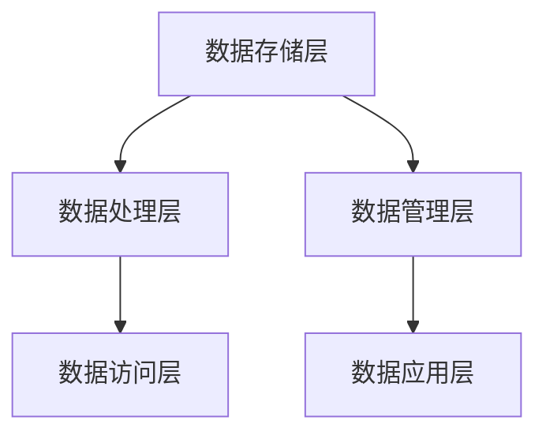
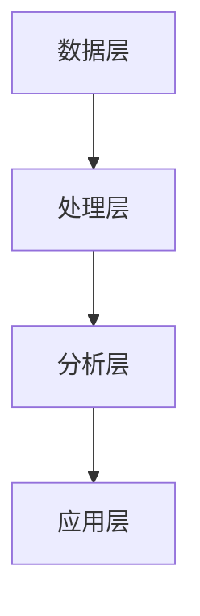
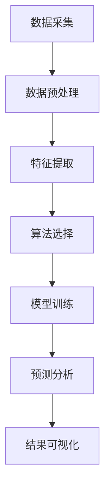
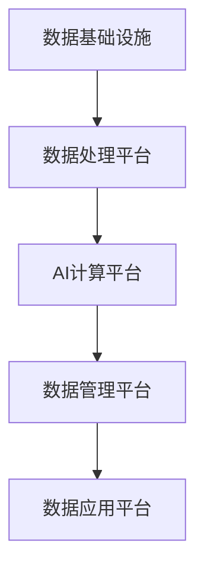

                 

# 企业数据湖智能化：构建AI友好的数据生态

## 关键词

数据湖，AI，智能化，数据生态，性能优化，安全隐私

## 摘要

随着数据量的爆炸式增长，企业对于数据处理的需求愈发迫切。数据湖作为大数据领域的重要技术，其智能化构建已成为提升企业数据资产管理效率的关键。本文将深入探讨企业数据湖智能化的重要性，分析AI与数据湖结合的原理及其应用，详细阐述数据湖智能化构建的技术方法，以及如何设计一个AI友好的数据生态。同时，还将讨论数据湖的性能优化策略、安全隐私保护措施，并通过实际案例解析，为企业数据湖的智能化构建提供实践指导和策略建议。

## 目录大纲

### 第一部分：背景介绍与核心概念

#### 第1章：问题背景与核心概念

1.1 问题背景

1.2 数据湖的定义与特点

1.3 数据湖的发展历程

1.4 数据湖的核心要素与结构

### 第二部分：AI与数据湖的结合

#### 第2章：AI与数据湖的融合原理

2.1 AI在数据湖中的角色与作用

2.2 数据湖与AI的集成架构

2.3 AI算法在数据湖中的应用

### 第三部分：数据湖的智能化构建

#### 第3章：数据湖的智能化技术

3.1 智能数据采集与处理

3.2 智能数据存储与管理

3.3 智能数据分析与挖掘

3.4 智能数据应用与可视化

### 第四部分：AI友好的数据生态设计

#### 第4章：AI友好的数据生态体系

4.1 AI友好的数据生态架构

4.2 数据资产管理与数据治理

4.3 数据价值挖掘与商业模式创新

4.4 AI友好数据生态的实施策略

### 第五部分：数据湖的优化与性能提升

#### 第5章：数据湖性能优化策略

5.1 数据湖性能评估指标

5.2 数据湖性能优化方法

5.3 数据湖资源调度与负载均衡

5.4 数据湖的可扩展性与容错性

### 第六部分：数据湖的安全与隐私保护

#### 第6章：数据湖安全与隐私保护

6.1 数据湖安全挑战与威胁分析

6.2 数据湖安全架构设计

6.3 数据隐私保护技术与策略

6.4 数据湖安全管理的最佳实践

### 第七部分：数据湖案例分析

#### 第7章：企业数据湖实践案例分析

7.1 案例背景与目标

7.2 数据湖建设与实施过程

7.3 案例分析与总结

7.4 案例启示与拓展思考

## 第1章：问题背景与核心概念

### 1.1 问题背景

在当今的信息时代，数据已成为企业最重要的资产之一。然而，随着数据量的快速增长和复杂度的增加，传统的数据处理方式已经难以满足企业的需求。如何有效地管理和利用海量数据，已经成为企业面临的重大挑战。数据湖作为一种新型的大数据架构，旨在解决这些问题，提供了一种灵活、高效的数据存储和处理方式。

随着人工智能（AI）技术的发展，AI在数据处理和分析中的应用越来越广泛。AI能够自动地从大量数据中提取有价值的信息，帮助企业做出更加精准的决策。因此，如何将AI与数据湖相结合，构建一个AI友好的数据生态，成为当前企业数据管理的热门话题。

### 1.2 数据湖的定义与特点

数据湖是一种大数据存储架构，它将结构化、半结构化和非结构化数据统一存储在一个分布式文件系统中。数据湖与传统数据仓库的主要区别在于，数据湖不对数据进行预先处理和结构化，而是采用“存储即用”的方式，将原始数据保存在原始格式，并在需要时进行加工处理。

数据湖的主要特点包括：

1. **灵活性**：数据湖可以存储不同类型、格式和规模的数据，包括文本、图片、视频等。

2. **可扩展性**：数据湖通常基于分布式文件系统，可以无缝扩展存储容量和处理能力。

3. **低成本**：由于数据湖采用分布式存储和计算，可以有效降低存储成本。

4. **高效性**：数据湖支持实时数据处理和分析，可以快速响应业务需求。

### 1.3 数据湖的发展历程

数据湖的概念起源于大数据时代，随着云计算、分布式计算和存储技术的发展，数据湖逐渐成为企业大数据架构的重要组成部分。以下是数据湖发展历程的简要回顾：

1. **2007年**：Google首次提出数据湖的概念，用于描述一种分布式存储架构。

2. **2010年**：Amazon S3的推出，标志着数据湖开始进入商用阶段。

3. **2012年**：Cloudera推出Impala，为数据湖提供了高效的数据查询工具。

4. **2015年**：Hadoop 2.0的发布，增强了数据湖的可扩展性和可靠性。

5. **2017年**：数据湖成为大数据技术领域的重要方向，吸引了大量企业和研究机构的关注。

### 1.4 数据湖的核心要素与结构

一个典型的数据湖架构包括以下几个核心要素：

1. **数据存储层**：通常采用分布式文件系统，如HDFS、Alluxio等，用于存储海量数据。

2. **数据处理层**：包括ETL（抽取、转换、加载）工具，如Apache NiFi、Apache Spark等，用于数据的预处理和加工。

3. **数据管理层**：提供元数据管理、数据质量监控、数据安全控制等功能。

4. **数据访问层**：包括SQL查询引擎、机器学习框架等，用于数据分析和挖掘。

5. **数据应用层**：包括数据可视化工具、业务智能应用等，用于支持业务决策。

下面是一个简单的数据湖结构示意图：

## 第2章：AI与数据湖的融合原理

### 2.1 AI在数据湖中的角色与作用

AI在数据湖中扮演着重要的角色，其主要作用包括：

1. **数据预处理**：AI算法可以对原始数据进行清洗、归一化和特征提取，提高数据质量，为后续分析提供可靠的数据基础。

2. **模式识别**：AI可以通过机器学习算法从大量数据中自动识别出潜在的规律和模式，帮助业务人员发现数据中的价值。

3. **预测分析**：基于历史数据，AI可以预测未来的趋势和变化，为业务决策提供科学依据。

4. **自动化运维**：AI可以自动化地管理数据湖，如自动优化查询、资源调度等，提高数据湖的运行效率。

### 2.2 数据湖与AI的集成架构

数据湖与AI的集成架构可以分为以下几个层次：

1. **数据层**：数据湖作为底层存储，提供海量数据的存储和管理。

2. **处理层**：ETL工具和AI算法在处理层对数据进行预处理和加工。

3. **分析层**：机器学习算法和数据挖掘工具在分析层对数据进行分析和挖掘，提取有价值的信息。

4. **应用层**：数据可视化工具和业务智能应用在应用层将分析结果呈现给用户，支持业务决策。

下面是一个简单的数据湖与AI集成架构示意图：

### 2.3 AI算法在数据湖中的应用

AI算法在数据湖中有着广泛的应用，下面介绍几种常见的AI算法及其在数据湖中的应用：

1. **监督学习算法**：如线性回归、决策树、支持向量机等，用于分类和回归任务，可以对数据进行特征提取和预测分析。

2. **无监督学习算法**：如聚类算法、关联规则挖掘等，用于探索数据中的潜在模式和规律。

3. **深度学习算法**：如神经网络、卷积神经网络等，用于处理复杂的数据结构和模式识别任务，如图像和语音识别。

4. **强化学习算法**：用于优化数据湖的运维和管理，如自动优化查询、资源调度等。

下面是一个简单的AI算法在数据湖中的应用流程：

## 第3章：数据湖的智能化构建

### 3.1 智能数据采集与处理

智能数据采集与处理是数据湖智能化构建的基础。其主要目标是通过自动化和智能化的方式，提高数据采集和处理效率，保证数据质量和一致性。

1. **自动化数据采集**：利用AI技术，如自然语言处理（NLP）和图像识别，自动从各种数据源采集数据。

2. **实时数据处理**：利用流处理技术，如Apache Kafka和Apache Flink，实现数据的实时处理和传输。

3. **数据质量监控**：通过机器学习算法，自动检测和纠正数据中的错误和异常。

4. **数据一致性维护**：利用分布式数据库和版本控制技术，确保数据的一致性和完整性。

### 3.2 智能数据存储与管理

智能数据存储与管理是数据湖智能化构建的核心。其主要目标是通过自动化和智能化的方式，提高数据存储和管理的效率，降低成本，并确保数据的安全性和可靠性。

1. **自动化存储分配**：根据数据的使用频率和访问模式，自动调整存储资源的分配。

2. **智能存储优化**：利用机器学习算法，自动优化存储布局和访问策略，提高存储效率。

3. **数据生命周期管理**：根据数据的访问频率和价值，自动调整数据的存储位置和存储策略。

4. **数据加密和安全控制**：利用加密技术和访问控制机制，确保数据的安全性和隐私性。

### 3.3 智能数据分析与挖掘

智能数据分析与挖掘是数据湖智能化构建的亮点。其主要目标是通过自动化和智能化的方式，从海量数据中提取有价值的信息，支持业务决策。

1. **自动化特征提取**：利用深度学习和自然语言处理技术，自动提取数据中的特征。

2. **智能分类与预测**：利用监督学习和无监督学习算法，对数据进行分类和预测分析。

3. **关联规则挖掘**：利用关联规则挖掘算法，发现数据中的潜在关联和规律。

4. **数据可视化与报告**：利用数据可视化工具，将分析结果以图表和报告的形式呈现，支持业务决策。

### 3.4 智能数据应用与可视化

智能数据应用与可视化是数据湖智能化构建的最终目标。其主要目标是通过自动化和智能化的方式，将数据分析结果应用于实际业务场景，并为业务人员提供直观的数据可视化。

1. **自动化应用开发**：利用低代码开发平台，如Apache NiFi和Apache Airflow，实现自动化应用开发。

2. **智能应用优化**：利用机器学习算法，自动优化应用的性能和效率。

3. **数据可视化与报告**：利用数据可视化工具，如Tableau和Power BI，将分析结果以图表和报告的形式呈现。

4. **业务智能应用**：将数据分析结果应用于实际业务场景，如销售预测、风险控制等。

### 第4章：AI友好的数据生态体系

#### 4.1 AI友好的数据生态架构

一个AI友好的数据生态体系需要具备以下几个核心组成部分：

1. **数据基础设施**：包括数据存储、计算、网络等基础设施，为AI应用提供基础支持。

2. **数据处理平台**：包括ETL工具、数据清洗、数据集成等平台，为AI应用提供数据预处理和加工。

3. **AI计算平台**：包括深度学习框架、机器学习算法等，为AI应用提供计算能力。

4. **数据管理平台**：包括数据治理、数据安全、数据质量等平台，确保数据的有效管理和利用。

5. **数据应用平台**：包括数据可视化、业务智能应用等平台，将AI分析结果应用于实际业务场景。

下面是一个简单的AI友好数据生态体系架构示意图：

#### 4.2 数据资产管理与数据治理

数据资产管理和数据治理是AI友好数据生态体系的重要组成部分。其主要目标是确保数据的质量、一致性和安全性，从而提高数据的价值。

1. **数据资产管理**：通过数据目录、元数据管理等方式，对数据资源进行全面的梳理和监控。

2. **数据治理**：通过制定数据政策和流程，确保数据的质量、一致性和安全性。

3. **数据质量管理**：通过数据清洗、数据质量监控等方式，提高数据质量。

4. **数据安全控制**：通过数据加密、访问控制等方式，确保数据的安全性。

#### 4.3 数据价值挖掘与商业模式创新

数据价值挖掘和商业模式创新是AI友好数据生态体系的最终目标。其主要目标是通过对数据的深入分析和挖掘，发现新的业务机会和商业模式。

1. **数据价值挖掘**：利用机器学习和数据分析技术，从海量数据中提取有价值的信息。

2. **商业模式创新**：将数据价值转化为实际业务价值，如开发新的产品、优化业务流程等。

3. **数据驱动的决策**：利用数据分析结果，支持业务决策和战略规划。

#### 4.4 AI友好数据生态的实施策略

要构建一个AI友好的数据生态体系，企业需要采取以下实施策略：

1. **战略规划**：明确数据生态体系的目标和愿景，制定长期规划和短期实施计划。

2. **技术选型**：选择合适的数据基础设施、数据处理平台、AI计算平台等，确保技术架构的合理性和可扩展性。

3. **人才培养**：培养具备数据管理和分析能力的人才，确保数据生态体系的有效运行。

4. **文化变革**：推动企业内部的数据文化变革，提高员工的数据意识和数据利用能力。

5. **持续优化**：不断优化数据生态体系，提高数据的质量、效率和安全性。

### 第5章：数据湖性能优化策略

#### 5.1 数据湖性能评估指标

数据湖性能优化需要依据一系列评估指标来衡量其性能。以下是一些常见的性能评估指标：

1. **响应时间**：数据查询和处理的响应时间，反映了数据湖的响应能力。

2. **吞吐量**：数据湖在单位时间内处理的数据量，反映了数据湖的处理能力。

3. **延迟**：数据从采集到处理的时间延迟，反映了数据湖的实时性。

4. **资源利用率**：数据湖中资源的利用率，如CPU、内存、存储等，反映了资源分配的合理性。

5. **稳定性**：数据湖在长时间运行中的稳定性和可靠性，反映了系统的健壮性。

#### 5.2 数据湖性能优化方法

为了提升数据湖的性能，可以采取以下优化方法：

1. **数据分区**：将数据按照一定的规则进行分区，减少数据查询的负载，提高查询效率。

2. **索引优化**：建立适当的索引，提高数据查询的速度。

3. **压缩与编码**：采用合适的压缩和编码技术，减少存储空间和传输带宽的需求。

4. **缓存策略**：利用缓存技术，如内存缓存、分布式缓存等，减少数据的重复读取和计算。

5. **负载均衡**：通过负载均衡技术，合理分配数据处理的负载，提高系统的处理能力。

6. **并行处理**：采用并行处理技术，如MapReduce、Spark等，提高数据处理的速度。

7. **资源调度**：采用资源调度技术，如容器编排、资源分配等，优化资源的利用效率。

#### 5.3 数据湖资源调度与负载均衡

数据湖的资源调度和负载均衡是优化数据湖性能的关键。以下是一些资源调度和负载均衡的方法：

1. **静态资源调度**：根据预先设定的规则和策略，静态分配资源。

2. **动态资源调度**：根据数据湖的实时运行状态，动态调整资源的分配。

3. **负载均衡算法**：采用负载均衡算法，如轮询、最小连接数、最小响应时间等，平衡数据处理的负载。

4. **自动化调度**：利用自动化调度工具，如Apache Airflow、Kubernetes等，实现自动化资源调度和负载均衡。

5. **弹性扩展**：根据业务需求和数据量的变化，自动扩展或缩减资源，保持系统的稳定性和性能。

#### 5.4 数据湖的可扩展性与容错性

数据湖的可扩展性和容错性是保证其性能和稳定性的关键。以下是一些实现可扩展性和容错性的方法：

1. **分布式存储**：采用分布式存储技术，如HDFS、Alluxio等，提高数据的可扩展性。

2. **分布式计算**：采用分布式计算技术，如MapReduce、Spark等，提高数据处理的能力。

3. **数据冗余**：通过数据冗余和备份，提高数据的容错性。

4. **故障检测与恢复**：通过故障检测和恢复机制，确保数据湖在故障发生时能够快速恢复。

5. **高可用性架构**：采用高可用性架构，如主从复制、负载均衡等，提高系统的稳定性和可靠性。

### 第6章：数据湖的安全与隐私保护

#### 6.1 数据湖安全挑战与威胁分析

数据湖作为一个集中存储和管理海量数据的重要基础设施，面临着诸多安全挑战和威胁。以下是一些常见的安全挑战和威胁：

1. **数据泄露**：由于数据湖中存储的数据种类繁多，包括敏感信息，数据泄露的风险较高。

2. **数据篡改**：恶意用户可能对数据湖中的数据进行篡改，造成数据的不一致性。

3. **数据丢失**：由于硬件故障、软件错误等原因，数据湖中的数据可能会丢失。

4. **数据滥用**：内部人员可能滥用数据湖中的数据，进行不当的商业行为或个人行为。

5. **安全漏洞**：数据湖的架构和软件可能存在安全漏洞，容易受到攻击。

6. **分布式拒绝服务攻击（DDoS）**：恶意用户通过分布式拒绝服务攻击，使数据湖的可用性受到影响。

#### 6.2 数据湖安全架构设计

为了应对数据湖的安全挑战和威胁，需要设计一个全面的安全架构。以下是一个典型的数据湖安全架构：

1. **身份认证与访问控制**：通过身份认证机制，确保只有授权用户才能访问数据湖。采用访问控制策略，根据用户的角色和权限，控制对数据的访问。

2. **加密技术**：对数据湖中的数据进行加密，确保数据在传输和存储过程中的安全性。采用加密算法，如AES、RSA等。

3. **安全审计**：对数据湖的访问和操作进行审计，记录所有的访问和变更记录，以便在发生安全事件时进行追踪和调查。

4. **网络安全**：采用防火墙、入侵检测系统（IDS）、入侵防御系统（IPS）等网络安全设备，保护数据湖的网络通信安全。

5. **数据备份与恢复**：定期备份数据湖中的数据，确保在发生数据丢失或损坏时能够迅速恢复。

6. **安全培训与意识**：对数据湖的维护人员和使用人员进行安全培训，提高他们的安全意识和操作规范。

#### 6.3 数据隐私保护技术与策略

数据隐私保护是数据湖安全的重要组成部分。以下是一些常用的数据隐私保护技术和策略：

1. **数据匿名化**：通过数据匿名化技术，如数据脱敏、数据泛化等，保护个人隐私信息。

2. **数据加密**：对敏感数据采用加密技术，确保在数据传输和存储过程中的安全性。

3. **数据访问控制**：通过访问控制策略，确保只有授权用户才能访问敏感数据。

4. **隐私影响评估**：在数据收集和处理过程中，进行隐私影响评估，确保数据处理符合隐私法规和标准。

5. **隐私增强技术**：采用隐私增强技术，如差分隐私、隐私随机响应等，降低数据泄露的风险。

6. **合规性检查**：定期对数据湖中的数据进行合规性检查，确保数据处理符合相关隐私法规和标准。

#### 6.4 数据湖安全管理的最佳实践

为了确保数据湖的安全，企业需要采取一系列最佳实践。以下是一些数据湖安全管理的最佳实践：

1. **制定安全政策与流程**：明确数据湖的安全政策与流程，确保安全措施的有效执行。

2. **定期安全审计**：定期对数据湖进行安全审计，检查安全措施的执行情况和漏洞。

3. **安全培训与意识**：定期对数据湖的维护人员和使用人员进行安全培训，提高安全意识和操作规范。

4. **安全监控与报警**：采用安全监控工具，实时监控数据湖的安全状态，及时响应和处理安全事件。

5. **安全事件响应计划**：制定安全事件响应计划，确保在发生安全事件时能够迅速采取措施，降低损失。

6. **安全测试与评估**：定期对数据湖的安全架构和应用程序进行安全测试和评估，发现和修复安全漏洞。

### 第7章：企业数据湖实践案例分析

#### 7.1 案例背景与目标

某大型电商平台在业务快速增长的过程中，面临着海量数据存储和处理的需求。为了提高数据资产的利用效率，该公司决定构建一个企业级数据湖，实现数据的统一存储、管理和分析。

案例目标包括：

1. 提高数据存储和处理效率，降低成本。
2. 提升数据分析能力，支持业务决策。
3. 确保数据质量和安全性，满足合规要求。

#### 7.2 数据湖建设与实施过程

数据湖建设与实施过程分为以下几个阶段：

1. **需求分析与规划**：对业务需求进行深入分析，制定数据湖建设方案。包括数据源梳理、数据存储和计算架构设计、数据处理流程设计等。

2. **基础设施搭建**：搭建数据湖基础设施，包括分布式存储（如HDFS）、计算集群（如Spark）、数据集成工具（如Apache NiFi）等。

3. **数据导入**：将各类数据源（如数据库、日志文件、外部数据等）的数据导入数据湖，并进行数据预处理和清洗。

4. **数据处理**：利用数据处理工具（如Apache Spark）对数据进行ETL处理，生成数据仓库，为数据分析提供数据基础。

5. **数据建模与分析**：利用机器学习算法和数据挖掘工具，对数据进行分析和建模，提取有价值的信息。

6. **数据可视化与报告**：利用数据可视化工具（如Tableau、Power BI），将分析结果以图表和报告的形式呈现。

7. **安全与合规**：实施数据加密、访问控制、安全审计等安全措施，确保数据安全和合规。

#### 7.3 案例分析与总结

通过数据湖建设，该公司实现了以下几个方面的成效：

1. **提高数据处理效率**：采用分布式存储和计算架构，数据处理效率显著提高。

2. **降低数据存储成本**：通过数据压缩和存储优化技术，降低了数据存储成本。

3. **提升数据分析能力**：利用机器学习和数据挖掘技术，提升了数据分析能力，为业务决策提供了有力支持。

4. **确保数据质量和安全性**：通过数据预处理、数据治理和安全措施，确保了数据质量和安全性。

#### 7.4 案例启示与拓展思考

1. **案例启示**：该案例表明，企业数据湖建设是提高数据资产管理效率的有效手段。通过智能化构建，可以更好地支持业务决策和优化运营。

2. **拓展思考**：在数据湖建设中，企业需要关注以下几个方面：

   - **数据治理**：建立健全的数据治理体系，确保数据的准确性和一致性。
   - **安全与隐私保护**：采取有效的安全措施，确保数据安全和用户隐私。
   - **弹性与可扩展性**：设计灵活、可扩展的数据湖架构，以应对数据量的快速增长。
   - **人才培养**：培养具备数据管理和分析能力的人才，确保数据湖的有效运营。

## 总结

本文详细探讨了企业数据湖智能化构建的重要性、原理、方法以及AI友好的数据生态设计。通过分析数据湖与AI的融合原理，介绍了数据湖智能化构建的技术方法，并探讨了如何设计一个AI友好的数据生态。同时，本文还讨论了数据湖的性能优化策略、安全与隐私保护措施，并通过实际案例解析，为企业数据湖的智能化构建提供了实践指导和策略建议。希望本文能为读者在数据湖智能化领域提供有价值的参考和启示。

