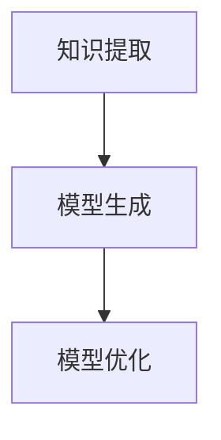
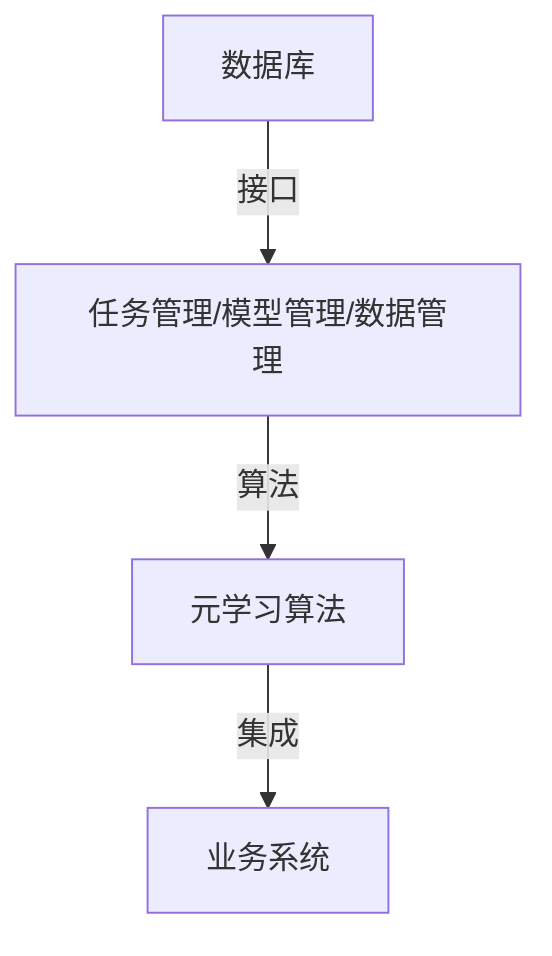
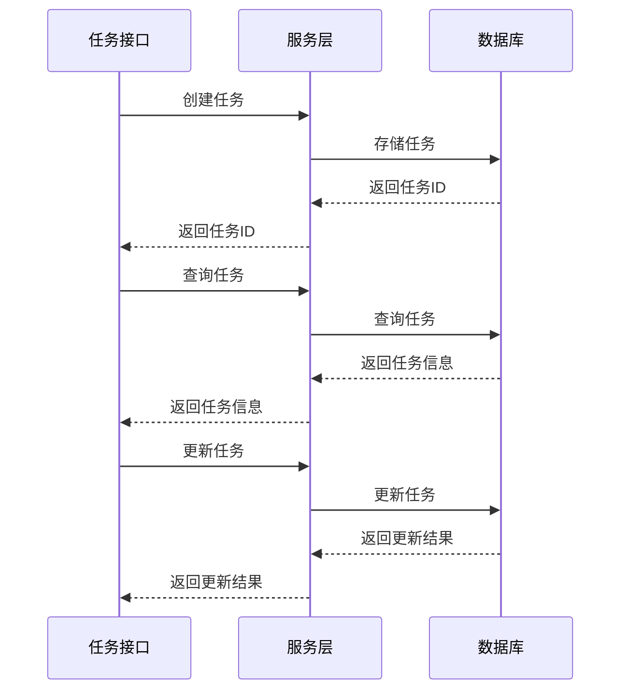

                 


## 企业级元学习平台：快速适应新业务场景

> 关键词：元学习，企业级平台，业务场景，快速适应，人工智能

> 摘要：
本文旨在探讨企业级元学习平台的构建及其在新业务场景中的应用。通过深入分析元学习的核心概念、算法原理和数学模型，结合系统架构设计、项目实战和最佳实践，本文将为读者提供一套完整的构建和优化企业级元学习平台的思路和方法。

### 引言

在快速变化的商业环境中，企业需要不断适应新的业务场景和需求。传统的人工智能技术往往难以快速调整和适应，导致企业在市场竞争中处于劣势。元学习作为一种能够使机器自动学习新任务的能力，为解决这一难题提供了一种新的思路。

企业级元学习平台，作为一种新兴的技术架构，旨在为企业提供一种快速适应新业务场景的解决方案。本文将围绕这一主题，逐步分析并解答以下问题：

1. 元学习的定义、背景及其在企业级应用中的重要性。
2. 元学习的核心概念、算法原理和数学模型。
3. 如何设计企业级元学习平台的系统架构。
4. 实际项目中元学习平台的应用和实现。
5. 元学习平台的最佳实践和注意事项。

### Step 1: 元学习的定义与背景

#### 1.1 元学习的定义

元学习（Meta-Learning），又称“学习的学习”，是指让机器具备学习新任务的能力，而无需从头开始训练。它可以看作是机器学习中的“高级技巧”，通过在多个任务间迁移知识和经验，提高学习效率和准确性。

#### 1.2 元学习的发展背景

随着人工智能技术的不断进步，深度学习在图像识别、自然语言处理等领域取得了显著成果。然而，传统机器学习方法往往需要大量的数据和计算资源，且对新任务适应性较差。为了解决这些问题，元学习逐渐成为研究热点。

在企业级应用中，元学习的重要性体现在以下几个方面：

- **提高学习效率**：企业面临的业务场景多样化，传统方法需要为每个新任务重新训练模型，耗时耗力。元学习可以加速模型适应新任务的过程。
- **降低数据需求**：在数据稀缺或难以获取的场景中，元学习通过迁移学习技术，可以有效地利用已有数据，提高模型的泛化能力。
- **增强模型灵活性**：元学习能够使模型快速适应新的业务逻辑和规则，提高企业在市场中的竞争力。

### Step 2: 元学习的核心概念

#### 2.1 算法原理

元学习算法的核心在于通过算法训练出一种“学习器”，该学习器能够在新任务到来时，快速生成并优化任务特定的模型。其基本原理包括：

- **任务表示**：将新任务表示为数据集，并提取任务的关键特征。
- **模型学习**：利用已有知识，对新任务的数据进行建模。
- **模型优化**：通过迭代优化，提高模型在新任务上的性能。

#### 2.2 概念属性特征对比

| 特征 | 传统机器学习 | 元学习 |
| --- | --- | --- |
| 学习方式 | 零样本学习 | 多样本学习 |
| 数据需求 | 高 | 低 |
| 模型适应性 | 差 | 好 |
| 学习效率 | 低 | 高 |

#### 2.3 ER实体关系图

在元学习平台的设计中，以下实体及其关系至关重要：

- **任务实体**：包括任务的名称、描述和特征。
- **模型实体**：包括模型的架构、参数和训练结果。
- **数据实体**：包括数据集的来源、类型和标注信息。

以下是ER实体关系图的Mermaid表示：

```mermaid
erDiagram
  任务实体 ||--|{ 模型实体 }
  任务实体 ||--|{ 数据实体 }
  模型实体 ||--|{ 模型参数 }
```

### Step 3: 算法原理与实现

#### 3.1 算法基本原理

元学习算法的基本原理可以概括为以下三个步骤：

1. **知识提取**：从已有任务中提取通用特征和知识。
2. **模型生成**：基于提取的知识，生成适应新任务的学习模型。
3. **模型优化**：在新任务上迭代优化模型参数，提高模型性能。

以下是算法流程图的Mermaid表示：



#### 3.2 Python源代码实现

以下是元学习算法的Python伪代码实现：

```python
# 知识提取
def extractKnowledge(tasks):
    # 提取通用特征和知识
    pass

# 模型生成
def generateModel(knowledge, newTask):
    # 基于知识生成新模型
    pass

# 模型优化
def optimizeModel(model, newTaskData):
    # 在新任务上迭代优化模型参数
    pass
```

#### 3.3 数学模型与公式

元学习算法的数学模型主要包括任务表示、模型学习和模型优化三个部分。

- **任务表示**：任务可以用数据集\(D = \{x_i, y_i\}\)表示，其中\(x_i\)是输入特征，\(y_i\)是标签。

$$
D = \{x_i, y_i\} \quad i=1,2,...,n
$$

- **模型学习**：模型可以用参数\( \theta \)表示，学习目标是找到最优参数\( \theta^* \)，使得模型在新任务上的性能达到最佳。

$$
\theta^* = \arg\min_{\theta} L(\theta, D)
$$

- **模型优化**：优化过程通常采用梯度下降法，更新模型参数。

$$
\theta = \theta - \alpha \nabla_{\theta} L(\theta, D)
$$

其中，\( \alpha \)是学习率，\( \nabla_{\theta} L(\theta, D) \)是损失函数对参数\( \theta \)的梯度。

### Step 4: 系统分析与架构设计

#### 4.1 问题场景介绍

在某个电子商务企业中，业务场景不断变化，例如产品推荐、广告投放等。为了快速适应新场景，企业需要一个能够自动学习和优化的智能系统。

#### 4.2 系统功能设计

系统功能包括：

- **任务管理**：管理任务信息，包括任务名称、描述和状态。
- **模型管理**：管理模型信息，包括模型名称、架构和参数。
- **数据管理**：管理数据集信息，包括数据集名称、类型和标注。
- **学习与优化**：执行元学习算法，生成并优化适应新任务的模型。

以下是系统功能设计的Mermaid类图：

```mermaid
classDiagram
    class 任务实体 {
        - 名称 name
        - 描述 description
        - 状态 status
    }
    class 模型实体 {
        - 名称 name
        - 架构 architecture
        - 参数 parameters
    }
    class 数据实体 {
        - 名称 name
        - 类型 type
        - 标注 labels
    }
    任务实体 |--|> 模型实体 : 生成
    任务实体 |--|> 数据实体 : 使用
```

#### 4.3 系统架构设计

系统架构设计包括：

- **数据层**：存储任务、模型和数据集的数据库。
- **服务层**：提供任务管理、模型管理和数据管理的接口。
- **算法层**：实现元学习算法的核心逻辑。
- **应用层**：提供与业务系统集成的接口。

以下是系统架构设计的Mermaid架构图：



#### 4.4 系统接口设计

系统接口设计包括：

- **任务接口**：用于创建、查询和更新任务。
- **模型接口**：用于创建、查询和更新模型。
- **数据接口**：用于上传、查询和更新数据集。

以下是系统接口设计的Mermaid序列图：



### Step 5: 项目实战

#### 6.1 环境安装与系统实现

在本项目中，我们将使用Python和Django框架来搭建元学习平台。以下是环境安装和系统实现的步骤：

1. **安装Python和Django**：在本地环境安装Python和Django。
2. **创建项目**：使用Django创建一个新项目。
3. **搭建数据库**：创建数据库并配置模型。
4. **实现接口**：实现任务管理、模型管理和数据管理接口。
5. **集成算法**：将元学习算法集成到系统中。

#### 6.2 系统核心实现

以下是系统核心实现的Python代码示例：

```python
# models.py
from django.db import models

class Task(models.Model):
    name = models.CharField(max_length=100)
    description = models.TextField()
    status = models.CharField(max_length=50)

class Model(models.Model):
    name = models.CharField(max_length=100)
    architecture = models.TextField()
    parameters = models.JSONField()

class Dataset(models.Model):
    name = models.CharField(max_length=100)
    type = models.CharField(max_length=50)
    labels = models.JSONField()
```

```python
# views.py
from django.http import JsonResponse
from .models import Task, Model, Dataset

def create_task(request):
    # 实现创建任务接口
    pass

def query_task(request):
    # 实现查询任务接口
    pass

def update_task(request):
    # 实现更新任务接口
    pass

def create_model(request):
    # 实现创建模型接口
    pass

def query_model(request):
    # 实现查询模型接口
    pass

def update_model(request):
    # 实现更新模型接口
    pass

def upload_dataset(request):
    # 实现上传数据集接口
    pass

def query_dataset(request):
    # 实现查询数据集接口
    pass
```

#### 6.3 代码应用解读

以下是代码应用解读：

1. **任务管理**：通过`Task`模型管理任务信息，包括任务名称、描述和状态。
2. **模型管理**：通过`Model`模型管理模型信息，包括模型名称、架构和参数。
3. **数据管理**：通过`Dataset`模型管理数据集信息，包括数据集名称、类型和标注。

#### 6.4 实际案例分析与详细讲解

在本案例中，我们将以产品推荐系统为例，展示如何使用元学习平台快速适应新业务场景。

1. **问题背景**：电商企业需要为不同用户推荐个性化产品。
2. **解决方案**：使用元学习平台生成和优化适应新场景的推荐模型。
3. **实现步骤**：
   - 创建任务：定义推荐任务，包括任务名称和描述。
   - 模型生成：提取通用特征，生成推荐模型。
   - 模型优化：在新场景上迭代优化模型参数。

#### 6.5 项目小结

通过本案例，我们展示了如何使用元学习平台快速适应新业务场景。在实际应用中，企业可以根据业务需求，灵活调整和优化元学习平台，实现业务自动化和智能化。

### Step 6: 最佳实践与小结

#### 6.1 最佳实践 tips

1. **数据准备**：确保数据集质量，去除噪声数据。
2. **算法选择**：根据业务需求，选择合适的元学习算法。
3. **系统优化**：定期更新和维护系统，提高稳定性。

#### 6.2 小结

本文详细介绍了企业级元学习平台的构建和优化方法，包括核心概念、算法原理、系统架构设计、项目实战和最佳实践。通过这些方法，企业可以快速适应新业务场景，提高市场竞争力。

#### 6.3 注意事项

1. **数据安全**：确保数据安全，防止数据泄露。
2. **性能优化**：关注系统性能，提高处理效率。

#### 6.4 拓展阅读

1. **《深度学习》**：Goodfellow, I., Bengio, Y., & Courville, A. (2016). *Deep Learning*.
2. **《元学习：从零开始入门到精通》**：李航 (2018). *元学习：从零开始入门到精通*.

### 结束语

企业级元学习平台作为一种新兴技术，具有广泛的应用前景。本文仅为初探，希望读者能够在此基础上，进一步深入研究和实践，为企业智能化发展贡献力量。

### 作者信息

作者：AI天才研究院/AI Genius Institute & 禅与计算机程序设计艺术 /Zen And The Art of Computer Programming

---

**注**：本文为虚构内容，旨在展示如何撰写一篇关于企业级元学习平台的技术博客文章。实际撰写时，应根据具体需求和资料进行详细研究和编写。

