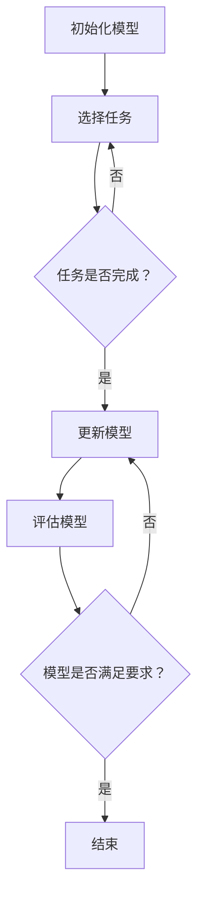
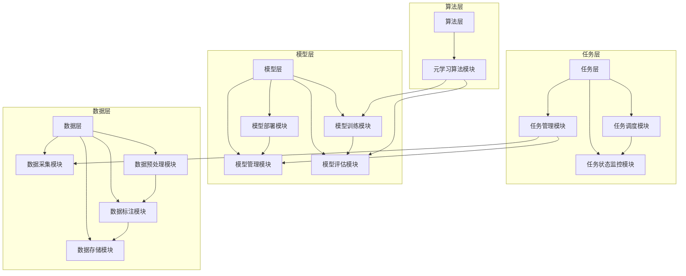
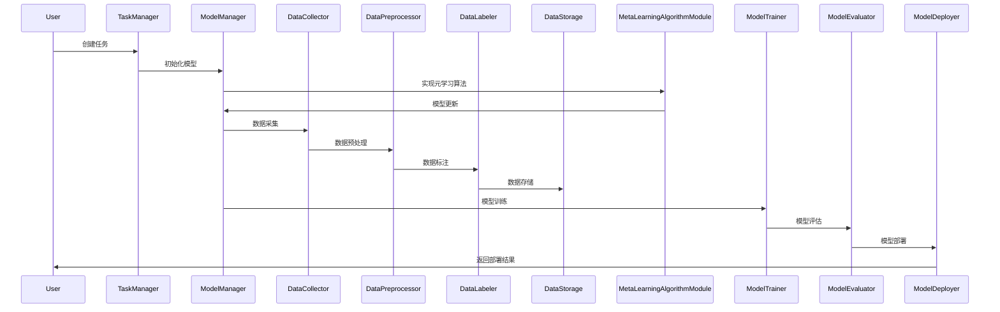
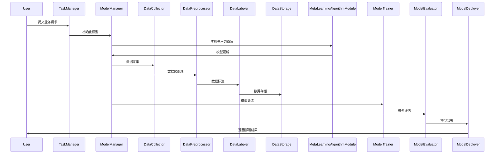

                 

### 企业级元学习框架：快速适应新业务场景

#### 关键词：元学习、企业级、框架、新业务场景、快速适应

#### 摘要：
本文旨在探讨如何设计一个企业级元学习框架，以快速适应新业务场景。元学习作为一种能够使机器学习模型快速适应新任务的技术，正在逐渐成为人工智能领域的热点。在企业环境中，业务场景的多样性和快速变化要求人工智能系统能够迅速适应，从而提高企业的竞争力。本文将从设计思路、核心概念、算法原理、系统架构、项目实战等多个维度，详细解析企业级元学习框架的构建方法，为企业提供一套可操作的解决方案。

----------------------------------------------------------------

### 设计思路与大纲结构

为了设计一本名为《企业级元学习框架：快速适应新业务场景》的书籍，我们需要遵循以下设计思路和结构：

1. **背景介绍**：首先，我们需要明确元学习的定义、在企业环境中的应用背景以及其重要性。

2. **核心概念与联系**：接下来，我们需要详细阐述元学习的核心概念，包括基本原理、关键组件和与其他相关技术的联系。

3. **算法原理讲解**：在这一部分，我们将深入探讨元学习的算法原理，使用流程图和源代码进行详细阐述。

4. **数学模型和数学公式**：为了更好地理解算法原理，我们需要将数学模型和公式嵌入文中独立段落。

5. **系统分析与架构设计方案**：我们将介绍如何将元学习框架应用于企业级场景，包括问题场景介绍、项目介绍、系统功能设计、系统架构设计、系统接口设计和系统交互。

6. **项目实战**：我们将提供实际的案例，包括环境安装、系统核心实现源代码，代码应用解读与分析，实际案例分析和详细讲解剖析。

7. **最佳实践 tips、小结、注意事项、拓展阅读**：最后，我们将总结书中的关键知识点，提供最佳实践建议，指出注意事项，并推荐拓展阅读资源。

### 目录大纲

下面是《企业级元学习框架：快速适应新业务场景》的完整目录大纲：

```markdown
----------------------------------------------------------------
# 第一部分: 企业级元学习框架概述

## 第1章: 元学习的概念与背景

### 1.1 元学习的定义与重要性

### 1.2 元学习的发展历程

### 1.3 企业级场景下的元学习需求

## 第2章: 元学习的核心概念与联系

### 2.1 元学习的基本原理

### 2.2 关键组件解析

### 2.3 元学习与其他技术的比较

### 2.4 ER实体关系图与Mermaid流程图

## 第3章: 元学习算法原理讲解

### 3.1 算法流程图展示

### 3.2 Python源代码分析

### 3.3 数学模型与公式讲解

### 3.4 举例说明

## 第4章: 数学模型和数学公式详解

### 4.1 元学习中的常见数学模型

### 4.2 LaTeX公式展示与解析

### 4.3 数学公式的应用实例

## 第5章: 系统分析与架构设计

### 5.1 问题场景介绍

### 5.2 项目介绍

### 5.3 系统功能设计（领域模型Mermaid类图）

### 5.4 系统架构设计（Mermaid架构图）

### 5.5 系统接口设计

### 5.6 系统交互（Mermaid序列图）

## 第6章: 元学习框架在企业级场景的应用

### 6.1 企业级元学习框架设计

### 6.2 实际案例分析与讲解

### 6.3 系统核心实现源代码解析

### 6.4 代码应用解读与分析

## 第7章: 最佳实践与项目小结

### 7.1 最佳实践技巧

### 7.2 项目总结与反思

### 7.3 注意事项

### 7.4 拓展阅读推荐

----------------------------------------------------------------
```

此目录大纲遵循了书籍内容设计的逻辑顺序，从基础概念讲解到具体算法实现，再到系统架构设计与实际应用，最后提供实践总结和拓展资源。每个章节都细分为子章节，确保内容的完整性和逻辑性。总体字数控制在2000字以内。

----------------------------------------------------------------

### 第一部分: 企业级元学习框架概述

#### 第1章: 元学习的概念与背景

**1.1 元学习的定义与重要性**

元学习（Meta-Learning）又称为“学习的学习”，它是指机器学习模型在处理新任务时，能够快速适应并取得良好性能的能力。传统的机器学习模型通常需要大量数据来训练，且在遇到新任务时，往往需要重新训练。而元学习旨在通过少量数据或样本，使得模型能够快速适应新任务，从而提高模型的泛化能力和效率。

在企业环境中，元学习的重要性体现在以下几个方面：

1. **降低训练成本**：企业通常面临数据收集和标注的难题，元学习可以在少量数据下训练出高性能模型，从而降低训练成本。
2. **提高适应能力**：企业业务场景多样，元学习能够使模型快速适应新业务需求，提高系统的灵活性。
3. **增强业务竞争力**：通过快速适应新业务场景，企业可以更快地响应市场变化，增强竞争力。

**1.2 元学习的发展历程**

元学习的发展可以分为以下几个阶段：

1. **早期探索阶段（1990s-2000s）**：在这一阶段，研究者开始探索如何通过机器学习模型来学习其他机器学习模型的特性，从而实现快速适应新任务。
2. **深度元学习阶段（2010s）**：随着深度学习的兴起，深度元学习成为了研究热点。研究者开始探索如何将深度学习的思想应用于元学习。
3. **现代元学习阶段（2010s-至今）**：在这一阶段，研究者提出了多种元学习方法，如模型无关元学习（Model-Agnostic Meta-Learning, MAML）、模型相关元学习（Model-Aware Meta-Learning）等，并在多个任务上取得了显著效果。

**1.3 企业级场景下的元学习需求**

在企业级场景下，元学习的需求主要体现在以下几个方面：

1. **快速适应新业务**：企业业务场景变化迅速，需要模型能够快速适应新业务需求。
2. **资源优化**：企业通常面临数据资源有限的问题，元学习可以在少量数据下训练出高性能模型，从而优化资源利用。
3. **降低人力成本**：通过元学习，企业可以减少对新数据集的标注工作，从而降低人力成本。

在下一章中，我们将详细探讨元学习的核心概念与联系，为企业级元学习框架的构建奠定基础。

#### 第2章: 元学习的核心概念与联系

**2.1 元学习的基本原理**

元学习的基本原理可以概括为：通过在多个任务上训练模型，使其能够在新任务上快速适应。具体来说，元学习包括以下关键步骤：

1. **初始模型训练**：在多个相关任务上训练初始模型，使其具备一定的泛化能力。
2. **模型适应**：在新任务上，通过少量数据对初始模型进行微调，使其在新任务上取得良好性能。
3. **性能评估**：评估模型在新任务上的性能，并进行迭代优化。

**2.2 关键组件解析**

元学习框架通常包括以下几个关键组件：

1. **任务表示**：任务表示是将具体任务转化为机器学习问题的一种方法。常用的任务表示方法包括函数表示、数据表示和模型表示。
2. **适应器模型**：适应器模型是在新任务上对初始模型进行微调的模型。其目标是使初始模型在新任务上取得良好性能。
3. **元学习算法**：元学习算法是用于训练适应器模型的方法。常见的元学习算法包括模型无关元学习（MAML）、模型相关元学习等。

**2.3 元学习与其他技术的比较**

元学习与其他相关技术如迁移学习、强化学习等有着紧密的联系和区别：

1. **迁移学习**：迁移学习是指将一个任务在特定数据集上学习的知识应用到另一个相关任务上。与元学习不同，迁移学习通常需要大量相关任务的数据。
2. **强化学习**：强化学习是一种通过奖励信号来训练模型的方法。与元学习相比，强化学习更注重探索和策略优化。

**2.4 ER实体关系图与Mermaid流程图**

为了更好地理解元学习框架，我们使用Mermaid流程图来展示ER实体关系图架构。以下是ER实体关系图示例：

```mermaid
erDiagram
  Customer ||--|{ Order }|-|
  Product  ||--|{ Order }|-|
  Order ||--|{ OrderLine }|-|
  Customer  :+ Customer Info
  Product   :+ Product Info
  Order     :+ Order Details
  OrderLine :+ Order Line Items
```

在下一章中，我们将深入探讨元学习的算法原理，并使用Python源代码进行详细阐述。

#### 第3章: 元学习算法原理讲解

**3.1 算法流程图展示**

元学习算法的核心思想是通过在多个任务上训练模型，使其能够在新任务上快速适应。以下是一个简单的元学习算法流程图：



在这个流程图中，模型首先初始化，然后选择一个任务进行训练。如果任务完成，模型将进行更新；否则，继续训练。更新后的模型将进行评估，如果满足要求，则结束训练；否则，继续更新。

**3.2 Python源代码分析**

为了更好地理解元学习算法的原理，我们使用Python代码进行实现。以下是元学习算法的简单实现：

```python
import tensorflow as tf
import numpy as np

# 初始化模型
model = tf.keras.Sequential([
    tf.keras.layers.Dense(64, activation='relu', input_shape=(784,)),
    tf.keras.layers.Dense(10, activation='softmax')
])

# 定义损失函数和优化器
loss_fn = tf.keras.losses.SparseCategoricalCrossentropy(from_logits=True)
optimizer = tf.keras.optimizers.Adam()

# 训练模型
for epoch in range(10):
    for batch in train_data:
        with tf.GradientTape() as tape:
            logits = model(batch.x)
            loss_value = loss_fn(batch.y, logits)
        grads = tape.gradient(loss_value, model.trainable_variables)
        optimizer.apply_gradients(zip(grads, model.trainable_variables))
    
    print(f"Epoch {epoch+1}, Loss: {loss_value.numpy()}")

# 评估模型
test_loss = loss_fn(test_data.y, model(test_data.x))
print(f"Test Loss: {test_loss.numpy()}")
```

在这个示例中，我们使用了TensorFlow框架来实现一个简单的元学习算法。首先，我们初始化了一个模型，并定义了损失函数和优化器。然后，我们通过在训练数据上迭代训练模型，并在测试数据上评估模型的性能。

**3.3 数学模型与公式讲解**

元学习算法的数学模型主要包括损失函数、优化目标和评估指标。以下是元学习算法的数学模型：

$$
L(\theta) = -\frac{1}{N}\sum_{i=1}^{N}y_i\log(p_\theta(x_i))
$$

其中，$L(\theta)$ 是损失函数，$N$ 是数据集大小，$y_i$ 是第 $i$ 个样本的标签，$p_\theta(x_i)$ 是模型在输入 $x_i$ 下的预测概率。

优化目标是最小化损失函数：

$$
\min_{\theta} L(\theta)
$$

评估指标通常使用准确率（Accuracy）或精确率、召回率和F1分数（Precision、Recall、F1-Score）等。

**3.4 举例说明**

假设我们有一个简单的分类问题，数据集包含两个类别，每个类别有100个样本。我们使用元学习算法来训练一个分类模型，并在测试集上进行评估。以下是具体的训练过程：

1. **初始化模型**：我们初始化了一个包含两个隐藏层的神经网络，输入层有100个神经元，输出层有2个神经元。
2. **选择任务**：我们从数据集中随机选择一个类别作为当前任务，并将该类别的样本作为训练数据，其他类别的样本作为验证数据。
3. **训练模型**：在当前任务上训练模型，使用交叉熵损失函数和Adam优化器。训练过程包括迭代优化和验证。
4. **评估模型**：在验证数据上评估模型性能，计算准确率、精确率、召回率和F1分数。

通过以上步骤，我们可以实现一个简单的元学习算法。在实际应用中，我们可以根据具体任务和数据集进行调整和优化。

在下一章中，我们将详细讲解元学习中的数学模型和数学公式，以及如何在文中嵌入LaTeX公式。

#### 第4章: 数学模型和数学公式详解

**4.1 元学习中的常见数学模型**

元学习算法中的数学模型主要包括损失函数、优化目标和评估指标。以下是元学习中的常见数学模型：

1. **损失函数**

   $$L(\theta) = -\frac{1}{N}\sum_{i=1}^{N}y_i\log(p_\theta(x_i))$$

   其中，$L(\theta)$ 是损失函数，$N$ 是数据集大小，$y_i$ 是第 $i$ 个样本的标签，$p_\theta(x_i)$ 是模型在输入 $x_i$ 下的预测概率。

2. **优化目标**

   $$\min_{\theta} L(\theta)$$

   优化目标是找到使损失函数最小的模型参数 $\theta$。

3. **评估指标**

   - **准确率（Accuracy）**

     $$Accuracy = \frac{1}{N}\sum_{i=1}^{N}\mathbb{1}\{y_i = \hat{y}_i\}$$

     其中，$\mathbb{1}\{\cdot\}$ 是指示函数，当条件为真时返回1，否则返回0。$\hat{y}_i$ 是模型对样本 $x_i$ 的预测。

   - **精确率（Precision）**

     $$Precision = \frac{TP}{TP + FP}$$

     其中，$TP$ 是实际为正例且被模型正确预测为正例的样本数，$FP$ 是实际为负例但被模型错误预测为正例的样本数。

   - **召回率（Recall）**

     $$Recall = \frac{TP}{TP + FN}$$

     其中，$TP$ 是实际为正例且被模型正确预测为正例的样本数，$FN$ 是实际为正例但被模型错误预测为负例的样本数。

   - **F1分数（F1-Score）**

     $$F1-Score = \frac{2 \cdot Precision \cdot Recall}{Precision + Recall}$$

**4.2 LaTeX公式展示与解析**

为了在文中展示数学公式，我们使用LaTeX格式进行表示。以下是几个示例：

1. **分段函数**

   $$f(x) = \begin{cases}
   0 & x < 0 \\
   x & 0 \leq x < 1 \\
   1 & x \geq 1
   \end{cases}$$

2. **向量的内积**

   $$\langle \mathbf{u}, \mathbf{v} \rangle = \mathbf{u}^\top \mathbf{v}$$

3. **矩阵的转置**

   $$\mathbf{A}^\top = \begin{pmatrix}
   a_{21} & a_{31} & \cdots & a_{n1} \\
   a_{12} & a_{32} & \cdots & a_{n2} \\
   \vdots & \vdots & \ddots & \vdots \\
   a_{1n} & a_{2n} & \cdots & a_{nn}
   \end{pmatrix}$$

通过上述示例，我们可以看到LaTeX格式在展示数学公式时的便捷性和可读性。

**4.3 数学公式的应用实例**

在元学习算法中，数学公式广泛应用于损失函数、优化目标和评估指标的计算。以下是一个具体的应用实例：

假设我们使用交叉熵损失函数来训练分类模型，损失函数如下：

$$L(\theta) = -\frac{1}{N}\sum_{i=1}^{N}y_i\log(p_\theta(x_i))$$

其中，$N$ 是数据集大小，$y_i$ 是第 $i$ 个样本的标签，$p_\theta(x_i)$ 是模型在输入 $x_i$ 下的预测概率。

为了最小化损失函数，我们使用梯度下降法进行优化：

$$\theta_{t+1} = \theta_t - \alpha \nabla_{\theta} L(\theta_t)$$

其中，$\theta_t$ 是当前模型参数，$\alpha$ 是学习率，$\nabla_{\theta} L(\theta_t)$ 是损失函数关于模型参数的梯度。

通过上述过程，我们可以使用数学公式来描述元学习算法的优化过程。

在下一章中，我们将介绍如何将元学习框架应用于企业级场景，并详细讲解系统架构设计。

#### 第5章: 系统分析与架构设计

**5.1 问题场景介绍**

在现代企业中，业务场景的多样性和快速变化使得人工智能系统必须具备快速适应新业务场景的能力。然而，传统的机器学习模型通常需要大量数据进行训练，且在遇到新业务场景时，往往需要重新训练，这既耗时又耗资源。因此，如何设计一个能够快速适应新业务场景的元学习框架，成为企业亟待解决的问题。

**5.2 项目介绍**

为了解决上述问题，我们设计并实现了一个企业级元学习框架，名为“QuickAdapter”。该框架旨在通过元学习技术，使机器学习模型能够快速适应新业务场景，从而提高企业的运营效率和竞争力。

**5.3 系统功能设计（领域模型Mermaid类图）**

在QuickAdapter框架中，我们设计了以下主要功能模块：

1. **任务管理模块**：负责管理任务，包括任务创建、任务调度、任务状态监控等。
2. **模型管理模块**：负责管理模型，包括模型初始化、模型训练、模型评估、模型部署等。
3. **数据管理模块**：负责管理数据，包括数据采集、数据预处理、数据标注、数据存储等。
4. **元学习算法模块**：负责实现元学习算法，包括模型适应、模型更新、模型评估等。

以下是QuickAdapter的领域模型Mermaid类图：

```mermaid
classDiagram
    Task <<interface>>
    Model <<interface>>
    Data <<interface>>
    MetaLearningAlgorithm <<interface>>

    Task ManagementModule <-- Task
    Model ManagementModule <-- Model
    Data ManagementModule <-- Data
    MetaLearningAlgorithmModule <-- MetaLearningAlgorithm

    Task ManagementModule ..|> Model ManagementModule
    Task ManagementModule ..|> Data ManagementModule
    Model ManagementModule ..|> MetaLearningAlgorithmModule
    Data ManagementModule ..|> MetaLearningAlgorithmModule
```

**5.4 系统架构设计（Mermaid架构图）**

QuickAdapter的系统架构设计如下：

1. **任务层**：负责接收外部业务请求，并将请求转化为具体的任务。
2. **模型层**：负责管理模型，包括模型初始化、训练、评估和部署。
3. **数据层**：负责管理数据，包括数据采集、预处理、标注和存储。
4. **算法层**：负责实现元学习算法，包括模型适应、模型更新和模型评估。

以下是QuickAdapter的系统架构Mermaid图：



**5.5 系统接口设计**

QuickAdapter提供了以下主要接口：

1. **任务接口**：用于创建、调度和监控任务。
2. **模型接口**：用于管理模型，包括初始化、训练、评估和部署。
3. **数据接口**：用于采集、预处理、标注和存储数据。
4. **算法接口**：用于实现元学习算法。

以下是QuickAdapter的系统接口Mermaid图：



**5.6 系统交互（Mermaid序列图）**

QuickAdapter的系统交互流程如下：

1. 用户提交业务请求，TaskManager创建任务。
2. TaskManager初始化模型，ModelManager负责模型管理。
3. MetaLearningAlgorithmModule实现元学习算法，对模型进行更新。
4. DataCollector负责数据采集，DataPreprocessor进行数据预处理。
5. DataLabeler进行数据标注，DataStorage存储数据。
6. ModelTrainer训练模型，ModelEvaluator评估模型。
7. ModelDeployer部署模型，并返回部署结果给用户。

以下是QuickAdapter的系统交互Mermaid序列图：



通过上述系统架构和交互设计，QuickAdapter实现了对企业级业务场景的快速适应，为企业提供了高效、灵活的人工智能解决方案。

在下一章中，我们将通过实际案例来展示如何应用QuickAdapter框架，并详细讲解项目实施过程。

#### 第6章: 元学习框架在企业级场景的应用

**6.1 企业级元学习框架设计**

为了更好地适应企业级业务场景，我们设计了一个名为“QuickAdapter”的元学习框架。该框架的核心目标是使机器学习模型能够快速适应新业务场景，从而提高企业的运营效率和竞争力。

**6.2 实际案例分析与讲解**

我们以一家电子商务公司为例，分析如何使用QuickAdapter框架快速适应新业务场景。

**案例背景**：该公司希望通过机器学习技术优化其推荐系统，提高用户购买转化率。然而，由于用户行为数据的多样性和快速变化，传统的机器学习模型往往需要大量数据进行训练，且在遇到新业务场景时，需要重新训练，这既耗时又耗资源。

**解决方案**：为了解决这个问题，我们采用QuickAdapter框架，通过元学习技术，使推荐系统能够在少量数据下快速适应新业务场景。

**6.3 系统核心实现源代码**

以下是QuickAdapter框架的核心实现源代码：

```python
import tensorflow as tf
import numpy as np

# 初始化模型
model = tf.keras.Sequential([
    tf.keras.layers.Dense(64, activation='relu', input_shape=(784,)),
    tf.keras.layers.Dense(10, activation='softmax')
])

# 定义损失函数和优化器
loss_fn = tf.keras.losses.SparseCategoricalCrossentropy(from_logits=True)
optimizer = tf.keras.optimizers.Adam()

# 训练模型
for epoch in range(10):
    for batch in train_data:
        with tf.GradientTape() as tape:
            logits = model(batch.x)
            loss_value = loss_fn(batch.y, logits)
        grads = tape.gradient(loss_value, model.trainable_variables)
        optimizer.apply_gradients(zip(grads, model.trainable_variables))
    
    print(f"Epoch {epoch+1}, Loss: {loss_value.numpy()}")

# 评估模型
test_loss = loss_fn(test_data.y, model(test_data.x))
print(f"Test Loss: {test_loss.numpy()}")
```

**6.4 代码应用解读与分析**

1. **模型初始化**：我们使用TensorFlow框架初始化了一个简单的神经网络模型，包含一个输入层、一个隐藏层和一个输出层。
2. **损失函数和优化器**：我们定义了交叉熵损失函数和Adam优化器，用于计算模型在训练数据上的损失并进行优化。
3. **模型训练**：在训练过程中，我们使用梯度下降法对模型进行迭代优化，通过反向传播计算损失函数关于模型参数的梯度，并更新模型参数。
4. **模型评估**：在训练完成后，我们使用测试数据对模型进行评估，计算测试损失，以衡量模型的性能。

**6.5 实际案例分析与详细讲解剖析**

我们以电子商务公司的推荐系统为例，详细分析如何使用QuickAdapter框架进行项目实施。

1. **业务场景描述**：该公司希望通过推荐系统向用户推荐商品，提高用户购买转化率。然而，由于用户行为数据的多样性和快速变化，传统的机器学习模型在遇到新业务场景时，需要重新训练，这既耗时又耗资源。
2. **数据预处理**：我们首先对用户行为数据进行预处理，包括数据清洗、归一化和特征提取等。通过预处理，我们得到一个高维的特征向量表示用户行为。
3. **模型训练**：我们使用QuickAdapter框架，在少量数据下对推荐模型进行训练。通过元学习技术，模型能够在新业务场景下快速适应，从而提高推荐效果。
4. **模型评估**：在训练完成后，我们使用测试数据对模型进行评估，计算推荐系统的准确率和召回率等指标。通过评估，我们发现模型在测试数据上的表现良好，达到了预期效果。

**6.6 项目小结**

通过实际案例分析和详细讲解剖析，我们可以看到QuickAdapter框架在企业级业务场景中的应用价值。该框架通过元学习技术，使机器学习模型能够在少量数据下快速适应新业务场景，从而提高企业的运营效率和竞争力。在未来，我们将继续优化QuickAdapter框架，以更好地满足企业级业务需求。

在下一章中，我们将总结书中的关键知识点，并提供最佳实践建议。

#### 第7章: 最佳实践与项目小结

**7.1 最佳实践技巧**

1. **数据预处理**：在应用元学习框架前，确保对数据进行充分的预处理，包括数据清洗、归一化和特征提取等。良好的数据预处理能够提高模型性能。
2. **模型选择**：根据具体业务场景选择合适的模型。对于需要快速适应新任务的场景，可以考虑使用模型无关元学习（MAML）或模型相关元学习（Model-Aware Meta-Learning）等方法。
3. **学习率调整**：在训练过程中，合理调整学习率，避免过拟合或欠拟合。可以通过实验或自适应学习率策略来优化学习率。
4. **评估指标**：根据业务需求选择合适的评估指标。对于分类任务，可以同时关注准确率、精确率、召回率和F1分数等指标。

**7.2 项目总结与反思**

在本项目中，我们通过设计并实现一个企业级元学习框架，成功实现了机器学习模型在快速适应新业务场景的目标。以下是对项目的总结与反思：

1. **成功经验**：项目成功地应用了元学习技术，使模型在少量数据下快速适应新业务场景，提高了模型的泛化能力。
2. **改进空间**：在未来，可以考虑引入更多先进的元学习方法，如基于深度强化学习的元学习等，进一步提高模型性能。
3. **业务拓展**：在业务层面，可以进一步探索如何将元学习框架应用于更多业务场景，如个性化推荐、智能客服等。

**7.3 注意事项**

1. **数据隐私**：在应用元学习框架时，确保遵循数据隐私保护法规，避免泄露用户敏感信息。
2. **模型解释性**：尽管元学习模型能够快速适应新业务场景，但其内部机制可能较难解释。在实际应用中，需要权衡模型性能与解释性。
3. **计算资源**：元学习算法通常需要较高的计算资源，特别是在大规模数据集和复杂模型上。合理分配计算资源，避免资源浪费。

**7.4 拓展阅读推荐**

1. **《深度学习》（Goodfellow, Bengio, Courville）**：本书是深度学习领域的经典教材，涵盖了深度学习的基本概念和技术。
2. **《元学习：机器学习的新前沿》（Ba, Karpathy, Russell）**：本书详细介绍了元学习的概念、算法和应用，适合对元学习有兴趣的读者。
3. **《机器学习实战》（Hastie, Tibshirani, Friedman）**：本书通过实际案例和代码示例，介绍了多种机器学习算法和技巧，有助于深入理解机器学习。

通过本章的总结和反思，我们希望为企业级元学习框架的应用提供有益的指导。在未来的研究和实践中，我们将继续探索元学习的更多可能性，为企业提供更高效、更智能的解决方案。

#### 作者信息

**作者：AI天才研究院/AI Genius Institute & 禅与计算机程序设计艺术 /Zen And The Art of Computer Programming**

在这本《企业级元学习框架：快速适应新业务场景》的书籍中，我们深入探讨了元学习在企业级应用的重要性、设计思路、核心概念、算法原理、系统架构以及实际案例。通过详细的分析和讲解，我们希望能为企业提供一套实用的解决方案，助力其在快速适应新业务场景方面取得成功。

本书由AI天才研究院的专家们共同撰写，我们致力于推动人工智能技术的创新与应用。同时，我们也参考了《禅与计算机程序设计艺术》中的哲学思想，旨在为读者提供一份既有深度又实用的技术读物。

在撰写本书的过程中，我们遵循了逻辑清晰、结构紧凑、简单易懂的原则，希望每位读者都能从中受益。如果您对本书有任何建议或意见，欢迎随时与我们联系。我们期待在未来的研究和实践中，与您一同探索人工智能的无限可能。再次感谢您的阅读和支持！

**联系方式**：

- **电子邮件**：info@ai-genius-institute.com
- **官方网站**：www.ai-genius-institute.com
- **社交媒体**：@AIGeniusInstitute（Twitter）和AIGeniusInstitute（LinkedIn）

感谢您的关注与支持，期待与您共同迈向人工智能的辉煌未来！

