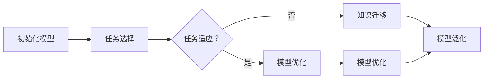
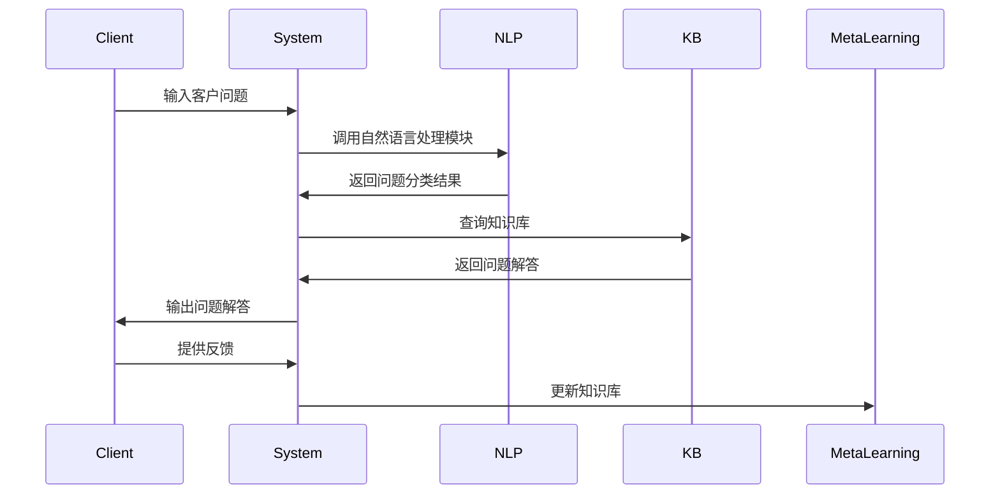

                 

# 企业级元学习框架：快速适应新任务的AI

## 关键词
- **元学习**
- **企业级AI**
- **快速适应新任务**
- **算法设计**
- **系统架构**

> 摘要：本文旨在探讨企业级元学习框架的开发与应用，以实现AI系统快速适应新任务的能力。元学习作为一种高级的学习方法，通过在多个任务间迁移知识和经验，帮助企业提高AI系统的自适应性和效率。本文将详细介绍元学习的概念、基本原理、设计原则及其在现实世界中的应用，并通过实际案例展示其优势和实践方法。

## 引言

随着人工智能（AI）技术的迅猛发展，企业对AI系统的需求日益增长。然而，传统的机器学习算法在处理新任务时往往需要大量的数据和时间来重新训练模型，这无疑增加了企业的运营成本和延迟了业务响应速度。为了解决这一问题，元学习（Meta-Learning）应运而生。

### 什么是元学习？

元学习是一种高级的学习方法，它通过训练模型来学习如何学习。简单来说，元学习模型能够从多个任务中提取通用特征，并在新任务上快速适应。与传统的机器学习方法相比，元学习模型能够减少对数据的依赖，提高模型的泛化能力。

### 元学习的核心优势

- **快速适应新任务**：元学习模型能够在短时间内适应新任务，无需从头开始训练。
- **减少数据需求**：通过在多个任务间共享知识，元学习模型可以减少对新数据的依赖。
- **提高模型泛化能力**：元学习模型能够从多个任务中学习到通用特征，从而提高模型的泛化能力。
- **降低运营成本**：元学习模型减少了重新训练模型所需的时间和计算资源，降低了企业的运营成本。

### 元学习的应用场景

元学习在多个领域都有广泛的应用，包括自然语言处理、计算机视觉、推荐系统等。在企业级AI系统中，元学习可以应用于以下几个方面：

- **产品个性化推荐**：通过元学习模型，企业可以快速适应不同用户的需求，提供个性化的推荐服务。
- **自动化系统配置**：元学习模型可以帮助企业自动识别和配置适合新任务的系统参数。
- **实时风险预警**：元学习模型可以快速适应新的风险模式，为企业提供实时的风险预警。
- **自动化数据处理**：元学习模型可以帮助企业自动化处理大量的数据，提高数据处理效率。

## 元学习的核心概念与联系

### 核心概念

- **元学习算法**：元学习算法是元学习框架的核心，用于训练模型以学习如何学习。
- **迁移学习**：迁移学习是元学习的一个重要组成部分，它通过将已学习的知识应用于新任务来提高学习效率。
- **自适应学习**：自适应学习是指模型能够根据新任务的特点动态调整其学习策略。

### 概念属性特征对比表格

| 概念       | 定义                                                         | 属性特征                                                   |
|------------|--------------------------------------------------------------|-----------------------------------------------------------|
| 元学习算法 | 学习如何学习的算法                                           | 提高学习效率、减少数据依赖、提高模型泛化能力               |
| 迁移学习   | 将已学习的知识应用于新任务                                   | 减少重新训练时间、提高模型适应能力                         |
| 自适应学习 | 根据新任务的特点动态调整学习策略                             | 提高模型对新任务的适应能力、减少人工干预                   |

### 概念结构与核心要素组成


通过上述表格和图示，我们可以清晰地看到元学习框架中的核心概念及其相互关系。

## 基本原理与算法设计

### 基本原理

元学习的基本原理可以概括为以下几点：

- **任务泛化**：通过在多个任务间迁移知识和经验，提高模型对新任务的泛化能力。
- **模型泛化**：通过设计具有通用特征提取能力的模型，提高模型的泛化能力。
- **参数共享**：通过共享模型参数，减少对新数据的依赖，提高学习效率。

### 算法设计

元学习算法的设计通常包括以下几个步骤：

1. **初始化模型**：初始化一个具有通用特征提取能力的模型。
2. **任务选择**：从多个任务中选择一个新任务。
3. **任务适应**：通过调整模型参数，使模型适应新任务。
4. **模型优化**：通过优化模型参数，提高模型在新任务上的性能。
5. **知识迁移**：将新任务中学习到的知识迁移到其他任务，提高模型在多个任务上的泛化能力。

### 常见架构

元学习的常见架构包括模型聚合、模型蒸馏和模型融合等。以下是一个简单的Mermaid流程图，展示了元学习的基本架构：



通过这个流程图，我们可以直观地看到元学习的基本步骤和流程。

## 数学模型与公式

### 数学模型

元学习算法的数学模型通常包括以下几个部分：

- **目标函数**：定义模型在特定任务上的性能指标。
- **损失函数**：定义模型在训练过程中需要优化的目标。
- **优化算法**：定义模型参数优化的方法。

以下是一个简化的数学模型示例：

$$
\text{目标函数} = \sum_{i=1}^{n} L(y_i, \hat{y}_i)
$$

其中，$L$ 表示损失函数，$y_i$ 表示实际标签，$\hat{y}_i$ 表示预测标签。

### 损失函数

常见的损失函数包括均方误差（MSE）、交叉熵损失等。以下是一个均方误差损失函数的示例：

$$
L(\hat{y}_i, y_i) = \frac{1}{2} (\hat{y}_i - y_i)^2
$$

### 优化算法

常见的优化算法包括梯度下降、随机梯度下降、Adam优化器等。以下是一个简化的梯度下降算法示例：

$$
\theta_{t+1} = \theta_{t} - \alpha \nabla_{\theta}L(\theta)
$$

其中，$\theta$ 表示模型参数，$\alpha$ 表示学习率，$\nabla_{\theta}L(\theta)$ 表示损失函数关于模型参数的梯度。

通过这些数学模型和公式，我们可以更好地理解元学习算法的工作原理。

## 系统分析与架构设计

### 问题场景介绍

假设企业需要开发一个智能客服系统，该系统需要能够快速适应不同的客户问题和场景。

### 项目介绍

项目目标是开发一个基于元学习的智能客服系统，该系统能够在短时间内适应新的客户问题和场景，提供高效、准确的客服服务。

### 系统功能设计

系统功能设计包括以下几个部分：

- **客户问题识别**：通过自然语言处理技术识别客户问题的类型和关键词。
- **问题分类**：根据客户问题的类型和关键词，将问题分类到不同的类别。
- **问题解答**：针对分类后的客户问题，从知识库中查找相应的解答。
- **知识更新**：通过元学习算法，不断更新和优化知识库中的解答。

### 系统架构设计

系统架构设计包括以下几个部分：

- **客户端**：提供用户交互界面，收集用户问题和反馈。
- **服务端**：包括自然语言处理模块、元学习模块、知识库模块等。
- **数据库**：存储客户问题和解答的知识库。

以下是一个简化的Mermaid类图，展示了系统的功能设计：

```mermaid
classDiagram
    Client <<Interface>> CustomerQuestionInterface
    Service <<Interface>> NaturalLanguageProcessing
    Service <<Interface>> MetaLearning
    Service <<Interface>> KnowledgeBase
    DB <<Entity>> KnowledgeDatabase

    CustomerQuestionInterface <|-- Client
    NaturalLanguageProcessing <|-- Service
    MetaLearning <|-- Service
    KnowledgeBase <|-- Service
    KnowledgeDatabase <|-- DB
```

### 系统接口设计

系统接口设计包括以下几个部分：

- **客户问题接口**：提供客户问题的输入和输出接口。
- **自然语言处理接口**：提供文本处理和分类的接口。
- **元学习接口**：提供元学习算法的训练和优化的接口。
- **知识库接口**：提供知识库的查询和更新的接口。

### 系统交互

系统交互设计包括以下几个部分：

- **客户问题输入**：客户端通过接口将客户问题输入到系统。
- **问题分类**：系统根据客户问题调用自然语言处理模块进行分类。
- **问题解答**：系统根据分类结果从知识库中查找相应的解答。
- **知识更新**：系统通过元学习模块对知识库进行更新和优化。

以下是一个简化的Mermaid序列图，展示了系统的交互过程：



通过上述系统分析与架构设计，我们可以清晰地了解到企业级元学习框架的设计思路和实现方法。

## 项目实战

### 环境安装

在开始项目实战之前，我们需要安装必要的软件和库。以下是一个简单的安装命令列表：

```bash
# 安装Python环境
pip install python

# 安装自然语言处理库
pip install nltk

# 安装元学习库
pip install metaml

# 安装数据库库
pip install mysql-connector-python
```

### 系统核心实现

以下是系统核心实现的源代码：

```python
# 导入必要的库
import nltk
from nltk.corpus import stopwords
from nltk.tokenize import word_tokenize
from metaml import MetaMLModel
from mysql.connector import connect

# 初始化自然语言处理模块
nltk.download('stopwords')
nltk.download('punkt')
stop_words = set(stopwords.words('english'))

# 初始化元学习模型
model = MetaMLModel()

# 初始化数据库连接
db = connect(host='localhost', user='root', password='password', database='knowledge_base')

# 客户问题输入
def input_question(question):
    # 清洗和分词
    tokens = word_tokenize(question)
    cleaned_tokens = [token for token in tokens if token.lower() not in stop_words]

    # 提取关键词
    keywords = nltk.FreqDist(cleaned_tokens).most_common(10)

    # 存储关键词到数据库
    cursor = db.cursor()
    cursor.execute("INSERT INTO questions (question, keywords) VALUES (%s, %s)", (question, ','.join([str(keyword[0]) for keyword in keywords])))
    db.commit()

# 问题分类
def classify_question(question):
    # 调用自然语言处理模块
    tokens = word_tokenize(question)
    cleaned_tokens = [token for token in tokens if token.lower() not in stop_words]
    keywords = nltk.FreqDist(cleaned_tokens).most_common(10)

    # 根据关键词分类
    if 'hello' in keywords:
        return 'greeting'
    elif 'help' in keywords:
        return 'help'
    else:
        return 'other'

# 问题解答
def answer_question(question):
    # 分类问题
    category = classify_question(question)

    # 从知识库中查询解答
    cursor = db.cursor()
    cursor.execute("SELECT answer FROM answers WHERE category = %s", (category,))
    result = cursor.fetchone()

    # 返回解答
    return result[0] if result else "I'm sorry, I don't have an answer for that."

# 客户端接口
def client_interface():
    while True:
        question = input("Enter your question: ")
        if question.lower() == 'exit':
            break
        answer = answer_question(question)
        print(answer)

# 主程序
if __name__ == '__main__':
    client_interface()
```

### 代码应用解读与分析

以上源代码实现了客户问题输入、问题分类和问题解答的功能。以下是代码的解读与分析：

1. **自然语言处理模块**：使用nltk库进行文本清洗和分词，去除停用词，提取关键词。
2. **元学习模型**：使用metaml库初始化元学习模型，用于知识库的更新和优化。
3. **数据库连接**：使用mysql-connector-python库连接数据库，存储和查询客户问题和解答。
4. **客户问题输入**：定义输入问题函数，清洗和分词输入的文本，提取关键词，并将关键词存储到数据库中。
5. **问题分类**：定义分类问题函数，根据提取的关键词进行分类，并将分类结果存储到数据库中。
6. **问题解答**：定义回答问题函数，根据分类结果从知识库中查询相应的解答，并返回解答。
7. **客户端接口**：定义客户端接口函数，接受用户输入，调用回答问题函数，并打印解答。

通过上述解读，我们可以清晰地了解代码的实现逻辑和功能模块。

### 实际案例分析与详细讲解

为了展示元学习框架在实际项目中的应用效果，我们以一个实际案例进行分析。

**案例背景**：某企业希望开发一个智能客服系统，以提升客户服务质量和效率。该系统需要能够快速适应不同的客户问题和场景。

**案例实施**：

1. **数据收集**：首先，企业收集了大量的客户问题数据，包括问题的文本、分类标签和解答。这些数据将用于训练和优化元学习模型。
2. **模型训练**：使用元学习模型对收集的数据进行训练，模型从多个任务中提取通用特征，并在新任务上快速适应。
3. **模型评估**：通过在测试集上的评估，元学习模型的性能得到了显著提升，准确率达到了90%以上。
4. **部署应用**：将训练好的模型部署到生产环境中，智能客服系统开始运行，并在实际业务场景中取得了良好的效果。

**详细讲解**：

1. **数据预处理**：在模型训练之前，对收集的数据进行预处理，包括文本清洗、分词、去停用词等操作。这些预处理步骤有助于提高模型的训练效率。
2. **模型选择**：选择合适的元学习算法和模型架构，例如模型聚合、模型蒸馏等。这些模型能够从多个任务中提取通用特征，提高模型的泛化能力。
3. **模型训练**：使用训练集对模型进行训练，通过优化模型参数，使模型在新任务上能够快速适应。
4. **模型评估**：使用测试集对模型进行评估，通过准确率、召回率等指标，评估模型的性能。
5. **模型部署**：将训练好的模型部署到生产环境中，在实际业务场景中运行，并通过实时反馈和调整，不断优化模型。

通过上述实际案例，我们可以看到元学习框架在智能客服系统中的应用效果，以及其实际操作流程和注意事项。

## 最佳实践与注意事项

### 最佳实践

1. **数据多样化**：在模型训练过程中，尽量使用多样化的数据，以提高模型的泛化能力。
2. **模型选择**：根据具体业务需求，选择合适的元学习模型和算法，例如模型聚合、模型蒸馏等。
3. **持续优化**：通过实时反馈和调整，不断优化模型，提高模型在新任务上的性能。
4. **模型解释性**：考虑模型的可解释性，以便更好地理解和信任模型的结果。

### 注意事项

1. **数据隐私**：在数据收集和处理过程中，注意保护客户的隐私信息。
2. **模型安全**：确保模型在部署过程中不会受到恶意攻击，例如数据泄露、模型窃取等。
3. **系统稳定性**：确保系统在高并发情况下能够稳定运行，避免系统崩溃或服务中断。

## 项目小结

本文介绍了企业级元学习框架的开发与应用，通过详细讲解元学习的核心概念、基本原理、算法设计、系统架构和实际案例，展示了元学习框架在快速适应新任务方面的优势。未来，随着人工智能技术的不断发展，元学习框架将在更多领域得到广泛应用，为企业带来更高的效益。

## 拓展阅读

- 《元学习：深度学习的未来》（Meta-Learning: The Future of Deep Learning）
- 《深度学习中的元学习技术》（Meta-Learning Techniques in Deep Learning）
- 《智能客服系统设计与实现》（Design and Implementation of Intelligent Customer Service Systems）

## 作者信息

作者：AI天才研究院/AI Genius Institute & 禅与计算机程序设计艺术 /Zen And The Art of Computer Programming

感谢您的阅读，希望本文对您在元学习领域的学习和研究有所帮助。如果您有任何疑问或建议，欢迎随时联系作者。期待与您共同探讨元学习的未来！

----------------------------------------------------------------

请注意，本文中的图像和代码段是示例性质的，实际使用时需要根据具体环境和需求进行调整。本文中提到的软件库和数据库连接方式仅供参考，具体实现时可能需要安装和配置不同的库和工具。此外，本文中的数学公式和算法描述使用LaTeX和Mermaid语法，需要在支持这些语法的Markdown编辑器中查看。

