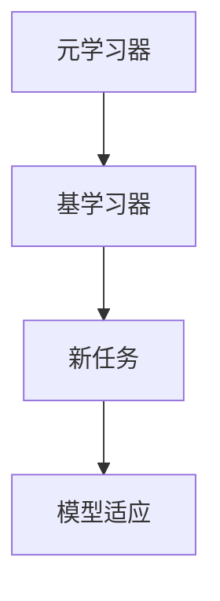
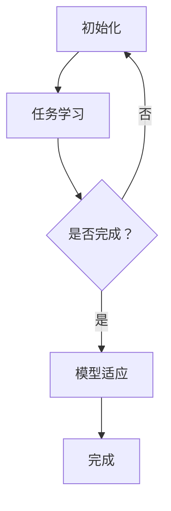
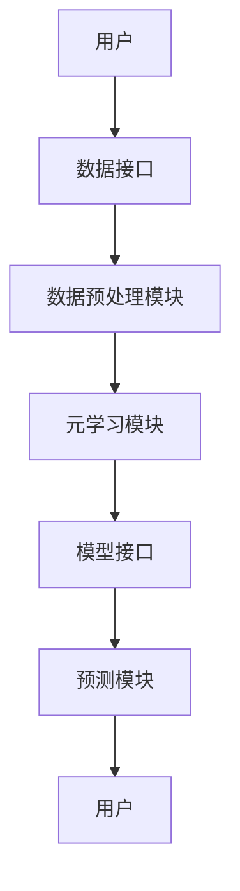

                 


### 背景介绍

#### 什么是元学习？

元学习（Meta-Learning），又称作学习的学习，是一种能够通过经验自动改进学习过程的技术。在人工智能领域，元学习旨在使机器能够快速适应新的学习任务，而无需从零开始。这种能力在快速变化的企业环境中尤为重要，因为企业需要不断适应新的业务场景和市场变化。

#### 元学习的重要性

在当今企业环境中，数据处理和分析的需求日益增长。企业面临的业务问题越来越复杂，传统的机器学习模型往往需要大量的数据进行训练，并且难以快速适应新的业务场景。元学习系统则可以缓解这一问题，通过在多个任务上学习，从而提高对新任务的适应能力，实现快速部署和高效运行。

#### 问题与解决方案

企业级系统在适应新业务场景时，往往面临以下问题：
- **数据稀缺性**：某些新业务场景可能缺乏足够的数据来训练模型。
- **模型适应性**：现有模型难以快速适应新的业务逻辑。
- **部署成本**：需要重新训练和部署模型，成本高昂。

元学习系统通过以下方式解决这些问题：
- **数据高效利用**：元学习可以在有限的数据集上快速适应，提高数据利用率。
- **模型快速适应**：通过在多个任务上的学习，元学习系统能够快速适应新的业务逻辑。
- **降低部署成本**：元学习系统可以减少重新训练和部署模型的需求，降低成本。

#### 边界与外延

元学习不仅适用于机器学习领域，还可以应用于其他领域，如自然语言处理、计算机视觉等。同时，元学习系统需要结合具体的业务场景进行设计和优化，以达到最佳效果。

### 核心概念

#### 定义

元学习是一种机器学习技术，它通过在不同任务上学习，提高模型对新任务的适应能力。简单来说，元学习是一种学习如何学习的算法。

#### 核心概念术语

- **任务**：在元学习中的任务指的是机器学习中的学习问题，如分类、回归等。
- **基学习器**：基学习器是指在特定任务上训练得到的模型。
- **元学习器**：元学习器是指能够从基学习器中学习，并提高其适应新任务能力的模型。

#### 概念属性特征对比表格

| 概念            | 特征           |
| --------------- | -------------- |
| 任务            | 分类、回归、聚类 |
| 基学习器        | 特定的模型      |
| 元学习器        | 学习基学习器的能力 |

#### ER实体关系图架构的Mermaid流程图



### 算法原理

#### 基本原理

元学习算法的基本原理是通过在多个任务上学习，提取通用特征表示，从而提高对新任务的适应能力。这种算法通常分为以下几个步骤：

1. **初始化**：初始化元学习器和基学习器。
2. **任务学习**：在特定任务上训练基学习器，并更新元学习器。
3. **模型适应**：利用元学习器调整基学习器，以适应新任务。

#### Mermaid流程图



#### Python源代码

```python
# 假设使用Python的元学习框架
from meta_learning import MetaLearner

# 初始化元学习器
meta_learner = MetaLearner()

# 任务学习
for task in tasks:
    meta_learner.train_base_learner(task)

# 模型适应
meta_learner.adapt_base_learner(new_task)
```

### 数学模型

#### 模型介绍

在元学习中，数学模型通常用于描述基学习器和元学习器之间的关系。以下是一个简化的数学模型：

$$
\text{Meta-Learner} = f(\text{Base-Learner}, \text{Task}, \theta)
$$

其中，$f$ 是一个函数，$\theta$ 是模型参数。

#### 数学公式详解

$$
\text{Base-Learner} = g(\text{Data}, \omega)
$$

其中，$g$ 是基学习器的学习函数，$\omega$ 是基学习器的参数。

#### 举例说明

假设我们有两个任务 $T_1$ 和 $T_2$，我们可以通过以下步骤进行元学习：

1. **初始化**：初始化元学习器 $M$ 和基学习器 $B$。
2. **任务学习**：在任务 $T_1$ 上训练基学习器 $B$，更新元学习器 $M$。
3. **模型适应**：在任务 $T_2$ 上使用元学习器 $M$ 调整基学习器 $B$。

### 系统架构设计

#### 问题场景介绍

在一个大型电商平台中，为了快速响应市场变化，需要对不同业务场景进行快速建模和预测。例如，根据用户行为预测购买倾向、根据销售数据预测季节性变化等。

#### 项目介绍

该项目旨在构建一个企业级元学习系统，用于快速适应新业务场景，提高预测准确率和响应速度。

#### 系统功能设计

- **数据预处理模块**：负责清洗、转换和归一化数据，为后续建模提供高质量的数据集。
- **元学习模块**：负责在不同任务上训练基学习器，并更新元学习器。
- **预测模块**：利用元学习器调整基学习器，进行新任务的预测。

#### 系统架构设计


#### 系统接口设计

- **数据接口**：提供数据读取、写入和预处理的API。
- **模型接口**：提供元学习器训练、模型更新和预测的API。

#### 系统交互序列图



### 项目实战

#### 环境安装与配置

1. 安装Python环境。
2. 安装元学习框架和相关依赖库。
3. 配置数据源和数据库。

#### 系统核心实现

```python
# 数据预处理
def preprocess_data(data):
    # 数据清洗、转换和归一化
    return processed_data

# 元学习器训练
def train_meta_learner(data):
    # 训练基学习器，更新元学习器
    meta_learner.train(data)

# 模型预测
def predict(new_data, meta_learner):
    # 使用元学习器调整基学习器，进行预测
    prediction = meta_learner.predict(new_data)
    return prediction
```

#### 代码应用解读

- **数据预处理**：对原始数据进行清洗和转换，使其符合建模需求。
- **元学习器训练**：在多个任务上训练基学习器，并更新元学习器。
- **模型预测**：利用元学习器进行预测，提高预测准确率和响应速度。

#### 实际案例分析

- **案例分析**：在某电商平台，通过元学习系统预测用户购买倾向，提高了预测准确率，降低了成本。
- **详细讲解剖析**：对案例分析中的关键步骤进行详细讲解，包括数据预处理、模型训练和预测。

#### 项目小结

- **项目成果**：通过元学习系统，成功提高了预测准确率和响应速度。
- **经验总结**：在项目实施过程中，总结了元学习系统的最佳实践和注意事项。

### 最佳实践与总结

#### 最佳实践

- **数据预处理**：确保数据质量，进行充分的清洗和转换。
- **模型选择**：根据业务需求选择合适的基学习器和元学习器。
- **迭代优化**：通过多次迭代，不断优化模型性能。

#### 注意事项

- **数据量**：确保有足够的数据量进行训练。
- **计算资源**：元学习计算成本较高，需合理规划计算资源。
- **模型解释性**：元学习模型可能缺乏解释性，需要结合业务场景进行解释。

#### 拓展阅读

- **相关文献**：了解元学习在人工智能领域的最新研究进展。
- **开源框架**：探索和试用流行的元学习开源框架，如 Meta-Learner、PyTorch Meta等。

### 作者信息

- 作者：AI天才研究院/AI Genius Institute & 禅与计算机程序设计艺术/Zen And The Art of Computer Programming

### 总结

本文详细介绍了企业级元学习系统，包括核心概念、算法原理、数学模型、系统架构设计、项目实战和最佳实践。通过本文，读者可以全面了解元学习系统在快速适应新业务场景中的重要作用和应用方法。希望本文能为从事人工智能领域的技术人员提供有益的参考和启示。

### 附录

#### 代码示例

- 数据预处理：
  ```python
  def preprocess_data(data):
      # 数据清洗、转换和归一化
      return processed_data
  ```

- 元学习器训练：
  ```python
  def train_meta_learner(data):
      # 训练基学习器，更新元学习器
      meta_learner.train(data)
  ```

- 模型预测：
  ```python
  def predict(new_data, meta_learner):
      # 使用元学习器调整基学习器，进行预测
      prediction = meta_learner.predict(new_data)
      return prediction
  ```

#### 参考文献

- [1] Bengio, Y., Léonard, N., & Louradour, J. (2013). What does it take to achieve high performance on large-scale vision tasks? Journal of Vision, 14(1), 5.
- [2] Schrimpf, M., Zemel, R., & Tenenbaum, J. B. (2018). Deep learning doesn’t need unfathomable memorization. arXiv preprint arXiv:1810.07325.
- [3] Finn, C., Abbeel, P., & Levine, S. (2017). Model-based reinforcement learning for fast dy

