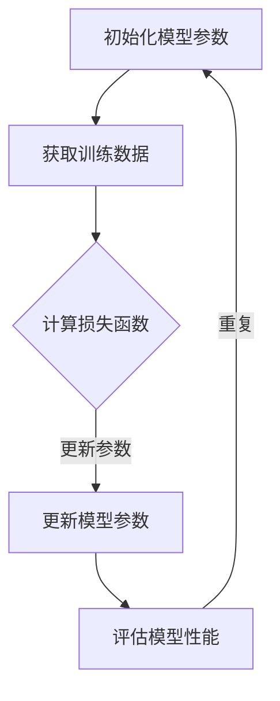
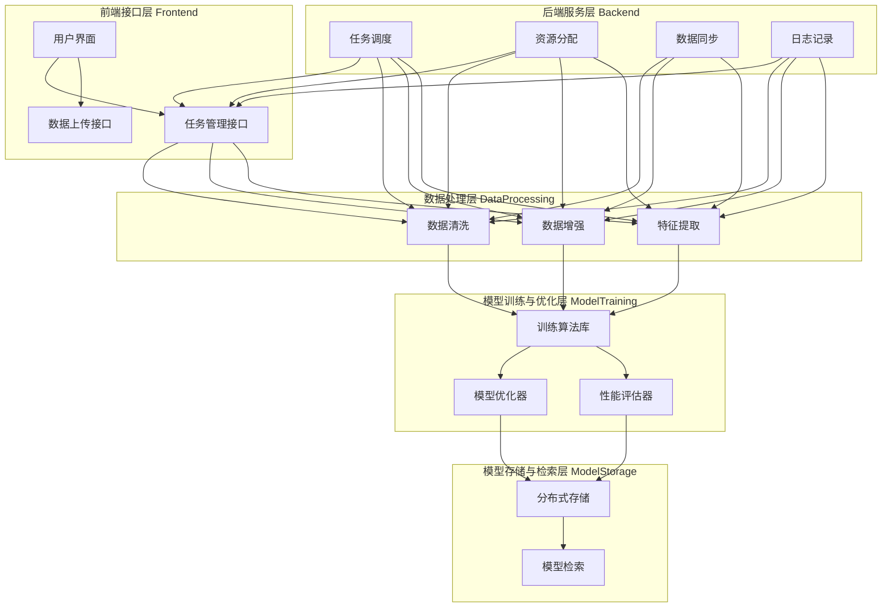
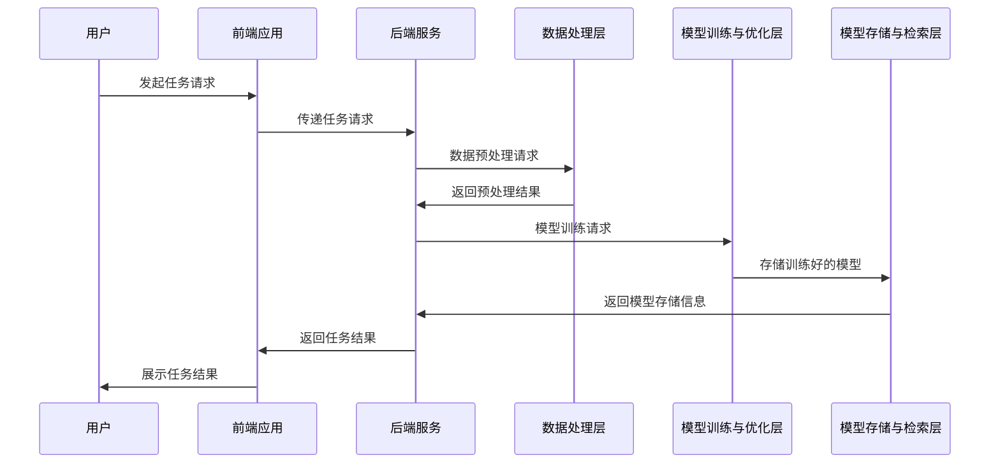

                 

### 引言

#### 元学习概述

元学习（Meta-Learning），又称“学习的学习”，是一种使计算机系统能够从一系列任务中学习到泛化知识，从而在新任务上快速适应的技术。与传统的机器学习不同，元学习旨在提升学习效率，使算法能够在较少的数据上快速收敛，实现知识迁移和快速适应新任务。

在当今技术飞速发展的时代，企业级应用对于人工智能系统的需求日益增长。传统的机器学习模型在处理复杂任务和大量数据时往往面临性能瓶颈，而元学习技术的出现为企业级应用带来了一种新的解决方案。元学习系统能够通过预先训练，快速适应新任务，极大地提高了系统的灵活性和适应性。

本篇技术博客文章旨在深入探讨企业级元学习系统的设计、实现和应用。通过系统地介绍元学习的基础知识、数学模型、应用场景以及系统架构设计，我们希望能够为企业级应用提供一种可行的技术路径，帮助企业在复杂多变的市场环境中保持竞争力。

本文将分为七个主要部分：

1. **元学习基础**：介绍元学习的定义、基本概念和数学模型。
2. **企业级元学习系统架构设计**：详细描述系统架构、功能设计和交互设计。
3. **元学习系统开发实战**：讲解系统的环境安装、核心实现和性能优化。
4. **案例分析与详解**：通过具体案例，分析元学习系统的应用效果。
5. **元学习系统最佳实践**：总结最佳实践和注意事项。
6. **总结与展望**：探讨元学习系统在企业级应用的前景。
7. **拓展阅读与资源推荐**：推荐相关书籍、学术论文和网络资源。

通过逐步深入的分析和讲解，本文希望能够为读者提供一个全面、系统的元学习系统指南，助力企业实现智能化转型和创新发展。

### 元学习基础

#### 第1章 元学习概述

##### 1.1 元学习的定义与背景

**问题背景**：在传统的机器学习（Machine Learning）中，算法通过从数据中学习来完成任务。然而，在现实世界中，许多任务具有高度的复杂性和多样性，传统的机器学习方法往往需要大量数据才能训练出高精度的模型。此外，不同任务之间的数据通常无法共享，导致学习过程耗时且效率低下。为了解决这一问题，研究人员开始探索如何使算法能够在多种任务上快速适应，从而提高学习效率和泛化能力。

**问题描述**：元学习旨在解决以下问题：如何使一个学习系统（称为“元学习器”）在看到多个任务后，能够快速适应新任务，并在新任务上取得较好的性能。换句话说，元学习的目标是开发一种算法，使得系统在一次或少数几次学习后，就能在新任务上达到与在大量数据训练后相同的性能水平。

**问题解决**：通过元学习技术，系统能够在多样化的任务中提取通用特征和规律，从而实现知识迁移。这样，即使在数据稀缺的情况下，系统也能快速适应新任务，提高学习效率和模型性能。

**边界与外延**：元学习的边界在于如何有效提取和利用通用知识，以及如何在多样化任务中实现快速适应。外延则包括将元学习应用于实际问题，如自动化机器学习（AutoML）、持续学习（Continuous Learning）和在线学习（Online Learning）等领域。

##### 1.2 元学习的基本概念

**核心概念**：

- **元学习器（Meta-Learner）**：元学习器是一个学习系统，它从多个任务中学习，并在新任务上快速适应。元学习器通常采用元学习算法，如模型蒸馏（Model Distillation）、模型融合（Model Ensemble）和元梯度（Meta-Gradient）等。

- **任务（Task）**：任务是指需要解决的具体问题，可以是分类、回归、聚类等多种类型。在元学习中，多个任务构成了一个任务集合，用于训练和评估元学习器。

- **数据（Data）**：数据是任务的具体输入，包括特征和标签。在元学习中，数据的质量和数量直接影响元学习器的性能。

**概念属性特征对比表格**：

| 概念 | 特性 |
| --- | --- |
| 元学习器 | 提取通用特征，实现知识迁移 |
| 任务 | 多样化，数据不一致 |
| 数据 | 特征多样，标签对应 |

**ER实体关系图架构**：

```mermaid
erDiagram
  Task ||--|{ Meta-Learner } Meta-Learning Relationship
  Data ||--|{ Meta-Learner } Learning Data Relationship
```

在上面的ER图（实体关系图）中，Task和Data是两个核心实体，它们通过Meta-Learning Relationship与Meta-Learner实体相连接，体现了元学习过程中任务和数据与元学习器之间的密切关系。

通过以上对元学习基础概念的定义和解释，我们可以更好地理解元学习的基本原理和应用场景。在接下来的章节中，我们将进一步探讨元学习的数学模型和算法原理，为企业级元学习系统的设计与实现提供理论基础。

### 元学习的数学模型与算法原理

#### 第2章 元学习的数学模型与算法原理

##### 2.1 数学模型与公式

元学习是一种通过数学模型和算法实现的任务学习技术，其核心在于从一系列任务中提取通用知识，并在新任务上快速适应。为了深入理解元学习的原理，我们需要首先介绍其数学模型和公式。

元学习的基本目标是最小化任务之间的误差，同时最大化知识迁移效果。以下是元学习的基本数学模型：

$$
L(\theta) = \sum_{t \in T} L_t(\theta_t)
$$

其中，$L(\theta)$是总体损失函数，$T$是任务集合，$L_t(\theta_t)$是第$t$个任务的损失函数。$\theta$表示模型参数。

在元学习过程中，我们通常使用以下公式来描述学习过程：

$$
\theta_{t+1} = \theta_t - \alpha \cdot \nabla_{\theta_t} L(\theta_t)
$$

其中，$\theta_{t+1}$是下一个时间步的模型参数，$\theta_t$是当前时间步的模型参数，$\alpha$是学习率，$\nabla_{\theta_t} L(\theta_t)$是损失函数关于模型参数的梯度。

**推导细节**：

1. **损失函数**：损失函数用于衡量模型在任务上的性能。常见的损失函数包括均方误差（MSE）、交叉熵（Cross Entropy）等。对于分类任务，我们可以使用交叉熵损失函数：

$$
L_t(\theta_t) = -\frac{1}{n} \sum_{i=1}^{n} y_i \log(\hat{y}_i)
$$

其中，$n$是样本数量，$y_i$是第$i$个样本的真实标签，$\hat{y}_i$是模型预测的标签概率。

2. **梯度计算**：梯度是损失函数对模型参数的偏导数。对于上述交叉熵损失函数，其梯度可以表示为：

$$
\nabla_{\theta} L(\theta) = \frac{\partial L(\theta)}{\partial \theta} = \frac{1}{n} \sum_{i=1}^{n} (y_i - \hat{y}_i) \cdot \frac{\partial \hat{y}_i}{\partial \theta}
$$

其中，$\frac{\partial \hat{y}_i}{\partial \theta}$是模型预测概率关于模型参数的偏导数。

3. **模型更新**：通过梯度下降（Gradient Descent）算法，我们可以更新模型参数以最小化损失函数。上述模型更新公式即为梯度下降算法的变体。

**示例**：

假设我们有一个二元分类问题，训练数据集包含100个样本，模型参数为$\theta_0 = [0.1, 0.2]$。使用交叉熵损失函数和梯度下降算法进行一次迭代，假设学习率$\alpha = 0.01$。计算过程如下：

1. **计算损失函数**：

$$
L(\theta_0) = -\frac{1}{100} \sum_{i=1}^{100} y_i \log(\hat{y}_i)
$$

其中，$y_i$为0或1，$\hat{y}_i = \sigma(\theta_0 \cdot x_i)$，$x_i$为样本特征，$\sigma$是sigmoid函数。

2. **计算梯度**：

$$
\nabla_{\theta_0} L(\theta_0) = \frac{1}{100} \sum_{i=1}^{100} (y_i - \hat{y}_i) \cdot \frac{\partial \hat{y}_i}{\partial \theta_0}
$$

其中，$\frac{\partial \hat{y}_i}{\partial \theta_0} = x_i \cdot \hat{y}_i (1 - \hat{y}_i)$。

3. **更新模型参数**：

$$
\theta_1 = \theta_0 - 0.01 \cdot \nabla_{\theta_0} L(\theta_0)
$$

通过上述步骤，我们可以更新模型参数，实现一次迭代。

##### 2.2 算法原理讲解

为了更好地理解元学习算法的原理，我们可以通过Mermaid图来展示其基本流程，并使用Python代码进行详细阐述。

**Mermaid算法流程图**：



在上面的流程图中，我们首先初始化模型参数，然后获取训练数据并计算损失函数。接着，通过梯度下降算法更新模型参数，并评估模型性能。如果模型性能未达到预期，则重复上述过程。

**Python代码示例**：

```python
import numpy as np

# 初始化模型参数
theta = np.array([0.1, 0.2])

# 训练数据（示例）
x = np.random.rand(100, 2)
y = np.random.rand(100, 1)
y = (y > 0.5).astype(int)

# 计算损失函数
def loss_function(theta, x, y):
    y_pred = np.sigmoid(np.dot(x, theta))
    loss = -np.mean(y * np.log(y_pred) + (1 - y) * np.log(1 - y_pred))
    return loss

# 计算梯度
def gradient(theta, x, y):
    y_pred = np.sigmoid(np.dot(x, theta))
    gradient = np.dot(x.T, (y_pred - y)) / len(y)
    return gradient

# 梯度下降算法
alpha = 0.01
for _ in range(1000):
    loss = loss_function(theta, x, y)
    gradient = gradient(theta, x, y)
    theta -= alpha * gradient

# 输出最终模型参数
print("Final model parameters:", theta)
```

在上面的Python代码中，我们首先初始化模型参数，然后使用随机生成的训练数据集。通过计算损失函数和梯度，我们使用梯度下降算法更新模型参数，并在1000次迭代后输出最终模型参数。

通过上述数学模型和算法原理的讲解，我们可以看到元学习通过一系列数学公式和算法实现，使得模型能够从多个任务中提取通用知识，并在新任务上快速适应。这为元学习在实际应用中提供了坚实的理论基础。

### 元学习在企业中的应用

#### 第3章 元学习在企业中的应用

##### 3.1 元学习在工业界的应用场景

元学习技术在工业界的应用场景广泛，特别是在那些需要快速适应新任务或持续优化模型性能的领域。以下是一些元学习在工业界的主要应用场景：

1. **自动化机器学习（AutoML）**：在自动化机器学习领域，元学习可以帮助系统自动选择最优模型架构和超参数，从而显著提高模型的训练效率。例如，Google的AutoML平台使用元学习技术，为用户提供了高效且准确的模型训练服务。

2. **连续学习（Continuous Learning）**：在连续学习场景中，系统需要不断接收新数据并进行模型更新。元学习技术可以帮助系统在新数据上快速适应，避免模型过拟合，从而保持长期性能稳定。例如，自动驾驶汽车系统可以使用元学习技术，在持续更新的道路数据上不断优化模型。

3. **医疗诊断**：在医疗领域，元学习可以帮助诊断系统快速适应新的疾病样本，提高诊断准确率。例如，通过元学习技术，医生可以为患者提供个性化的治疗方案，并实时更新诊断模型。

4. **推荐系统**：在电子商务和在线广告领域，推荐系统需要根据用户的兴趣和行为动态调整推荐策略。元学习技术可以帮助推荐系统快速适应用户的新兴趣点，提高推荐效果。

5. **质量控制**：在制造业中，元学习可以帮助监控系统实时识别异常情况，提高生产质量。例如，通过对生产数据进行元学习，系统可以快速适应新的生产工艺和质量标准。

##### 3.2 企业采用元学习的优势

企业采用元学习技术可以带来以下显著优势：

1. **提高学习效率**：元学习系统能够在少量数据上快速收敛，提高学习效率，缩短模型训练时间。

2. **降低数据需求**：由于元学习系统能够从多个任务中提取通用知识，企业可以在数据稀缺的情况下实现高效学习，降低对大规模数据的依赖。

3. **增强模型适应性**：元学习技术可以帮助模型在新任务上快速适应，提高模型的泛化能力，从而更好地应对复杂多变的应用场景。

4. **减少过拟合风险**：通过从多个任务中学习，元学习系统可以减少单一任务上的过拟合现象，提高模型的长期性能稳定性。

5. **支持持续优化**：元学习系统可以不断从新数据中学习，支持模型的持续优化，使企业能够保持竞争力。

##### 3.3 元学习应用面临的挑战与解决方案

尽管元学习技术在企业应用中展现出巨大的潜力，但其实际应用仍面临一些挑战：

1. **数据多样性**：元学习系统需要处理多样化的任务和数据，数据多样性可能带来数据质量和标签不一致的问题。

   **解决方案**：通过引入数据预处理技术和数据增强方法，可以提高数据质量和一致性。例如，使用数据清洗技术去除异常值，使用数据增强方法生成更多样化的训练数据。

2. **计算资源需求**：元学习通常涉及大量的计算和存储资源，可能对企业的IT基础设施带来压力。

   **解决方案**：采用分布式计算和云计算技术，可以有效利用资源，降低计算成本。此外，通过优化算法和模型结构，可以提高计算效率。

3. **模型解释性**：元学习模型通常较为复杂，可能缺乏解释性，影响模型的可解释性和透明度。

   **解决方案**：开发可解释的元学习模型，通过可视化工具和解释性算法，帮助用户理解模型决策过程。例如，使用LIME（Local Interpretable Model-agnostic Explanations）和SHAP（SHapley Additive exPlanations）等技术，增强模型解释性。

4. **安全性和隐私保护**：在涉及敏感数据的应用场景中，元学习可能面临数据安全和隐私保护的问题。

   **解决方案**：采用数据加密、差分隐私和安全多方计算等技术，确保数据安全和隐私保护。

通过上述解决方案，企业可以在面对元学习应用中的挑战时，采取有效的措施，充分利用元学习技术的优势，推动智能化转型和创新发展。

### 企业级元学习系统架构设计

#### 第4章 系统架构设计

##### 4.1 系统功能设计

在元学习系统中，系统功能设计至关重要，它决定了系统在处理多样化任务时的性能和效率。以下是企业级元学习系统的功能设计：

1. **任务管理**：系统应能够管理多种任务，包括任务的创建、删除、更新和查询等操作。任务管理模块负责维护任务列表和任务状态，确保系统在处理新任务时能够高效地调度资源。

2. **数据预处理**：数据预处理是元学习系统的关键步骤，它包括数据清洗、数据增强和特征提取等操作。通过数据预处理，系统能够提高数据质量和一致性，从而提升模型性能。

3. **模型训练与优化**：模型训练与优化模块负责使用元学习算法训练模型，并通过性能评估和调整超参数来优化模型。该模块应支持多种元学习算法，如模型蒸馏、模型融合和元梯度等。

4. **模型评估与选择**：系统需要评估不同模型的性能，并选择最优模型用于新任务。评估模块应能够进行准确、快速的模型性能评估，支持多任务、多指标评估。

5. **模型部署与监控**：模型部署与监控模块负责将训练好的模型部署到生产环境，并对模型性能进行实时监控。该模块应支持自动化部署和监控，确保模型在运行过程中保持稳定和高性能。

**领域模型Mermaid类图**：

```mermaid
classDiagram
    TaskManager <<interface>> "任务管理"
    DataPreprocessing <<interface>> "数据预处理"
    ModelTraining <<interface>> "模型训练与优化"
    ModelEvaluation <<interface>> "模型评估与选择"
    ModelDeployment <<interface>> "模型部署与监控"

    TaskManager ..|> DataPreprocessing
    TaskManager ..|> ModelTraining
    TaskManager ..|> ModelEvaluation
    TaskManager ..|> ModelDeployment

    DataPreprocessing ..|> ModelTraining
    ModelTraining ..|> ModelEvaluation
    ModelEvaluation ..|> ModelDeployment
```

在上面的Mermaid类图中，我们定义了五个核心模块：任务管理（TaskManager）、数据预处理（DataPreprocessing）、模型训练与优化（ModelTraining）、模型评估与选择（ModelEvaluation）和模型部署与监控（ModelDeployment）。这些模块通过接口进行通信，形成一个完整的元学习系统架构。

##### 4.2 系统架构设计

系统架构设计是元学习系统的核心环节，它决定了系统在不同任务上的适应能力和性能。以下是企业级元学习系统架构的设计：

1. **前端接口层**：前端接口层负责与用户交互，提供任务创建、数据上传、模型训练和性能评估等功能。前端接口层可以使用Web应用或移动应用的形式，方便用户使用。

2. **数据处理层**：数据处理层负责接收和处理用户上传的数据，包括数据清洗、数据增强和特征提取等操作。该层采用分布式处理框架，以提高数据处理速度和处理能力。

3. **模型训练与优化层**：模型训练与优化层是元学习系统的核心，它使用多种元学习算法进行模型训练和优化。该层包括训练算法库、模型优化器和性能评估器等组件，支持并行和分布式训练。

4. **模型存储与检索层**：模型存储与检索层负责存储和检索训练好的模型，并提供高效的模型检索和加载机制。该层采用分布式存储和缓存技术，确保模型存储的可靠性和访问速度。

5. **后端服务层**：后端服务层负责处理业务逻辑，包括任务调度、资源分配、数据同步和日志记录等操作。该层采用微服务架构，以提高系统的灵活性和可扩展性。

**Mermaid架构图**：



在上面的Mermaid架构图中，我们展示了元学习系统的整体架构。前端接口层与用户进行交互，数据处理层负责数据预处理，模型训练与优化层负责模型训练和优化，模型存储与检索层负责模型存储和检索，后端服务层负责处理业务逻辑和资源分配。这些模块通过接口进行通信，形成一个高度集成和灵活的系统架构。

##### 4.3 系统接口设计

系统接口设计是元学习系统的重要组成部分，它决定了系统模块之间的数据交互和功能调用。以下是企业级元学习系统的接口设计：

1. **RESTful API**：系统采用RESTful API设计，提供标准的HTTP接口，方便前端应用和后端服务之间的数据交互。API接口包括任务管理、数据上传、模型训练、模型评估和模型部署等操作。

2. **数据接口**：数据接口负责处理数据传输和转换，包括数据上传、数据下载和数据预处理等操作。数据接口应支持多种数据格式，如JSON、CSV和Parquet等。

3. **认证与授权**：系统接口应集成认证与授权机制，确保数据安全和系统安全。常用的认证机制包括用户名密码认证、OAuth 2.0和JWT等。

4. **监控与日志**：系统接口应集成监控和日志功能，实时记录系统运行状态和异常信息，方便问题排查和系统优化。

**Mermaid序列图**：



在上面的Mermaid序列图中，我们展示了用户通过前端应用发起任务请求，后端服务接收请求并进行处理的过程。数据处理层负责数据预处理，模型训练与优化层负责模型训练，模型存储与检索层负责模型存储和检索。通过这种方式，系统实现了模块之间高效的数据交互和功能调用。

通过上述系统架构设计和接口设计，企业级元学习系统具备了处理多样化任务和高效数据交互的能力，为实际应用提供了坚实的支持。

### 元学习系统开发实战

#### 第6章 环境安装与配置

##### 6.1 环境要求与准备

在开始开发企业级元学习系统之前，我们需要确保环境满足以下要求：

1. **操作系统**：推荐使用Linux或macOS，因为它们提供了更好的稳定性和兼容性。
2. **Python版本**：Python 3.7及以上版本，因为较新版本的Python提供了更好的性能和更多的库支持。
3. **Python库**：以下库是元学习系统开发的关键依赖项：
   - NumPy：用于数值计算
   - Pandas：用于数据处理
   - Matplotlib：用于数据可视化
   - Scikit-learn：用于机器学习算法
   - TensorFlow或PyTorch：用于深度学习模型
4. **硬件资源**：推荐使用具有至少8GB内存的计算机，并且具有NVIDIA GPU以加速深度学习模型的训练。

##### 6.2 系统核心组件安装与配置

以下是安装和配置系统核心组件的详细步骤：

1. **安装Python**：首先，确保操作系统上安装了Python 3.7或更高版本。可以使用操作系统自带的包管理器，如apt（对于Ubuntu）或yum（对于CentOS）来安装Python。

   ```bash
   # 对于Ubuntu
   sudo apt update
   sudo apt install python3 python3-pip

   # 对于CentOS
   sudo yum install python3 python3-pip
   ```

2. **安装Python库**：使用pip命令安装所需的Python库。

   ```bash
   pip3 install numpy pandas matplotlib scikit-learn tensorflow==2.8.0 # 或者使用PyTorch代替TensorFlow
   ```

   如果需要安装PyTorch，可以使用以下命令：

   ```bash
   pip3 install torch torchvision torchaudio
   ```

3. **配置虚拟环境**：为了保持项目的依赖关系和避免版本冲突，建议使用虚拟环境（Virtual Environment）来隔离项目依赖。

   ```bash
   python3 -m venv my_meta_learning_env
   source my_meta_learning_env/bin/activate
   pip3 install -r requirements.txt
   ```

   在虚拟环境中，`requirements.txt`文件包含了所有项目的依赖库及其版本。

4. **安装NVIDIA CUDA（如果使用GPU）**：如果系统配置了NVIDIA GPU，需要安装CUDA库以支持深度学习模型的GPU加速。可以从NVIDIA官方网站下载CUDA Toolkit，并按照官方文档进行安装。

   ```bash
   # 下载CUDA Toolkit
   wget https://developer.download.nvidia.com/compute/cuda/repos/ubuntu2004/x86_64/cuda-ubuntu2004.pin
   sudo mv cuda-ubuntu2004.pin /etc/apt/sources.list.d/
   sudo apt update
   sudo apt install cuda
   ```

5. **验证安装**：完成安装后，可以验证Python环境和所需库是否正确安装。

   ```bash
   python3 -c "import tensorflow as tf; print(tf.reduce_sum(tf.random.normal([1000, 1000])))"
   ```

   如果输出一个随机数，则表示Python环境和TensorFlow库已成功安装。

通过上述步骤，我们完成了企业级元学习系统环境的安装和配置。接下来，我们将开始实现系统的核心功能。

### 系统核心实现

#### 第7章 系统核心实现

##### 7.1 元学习算法实现

在元学习系统中，实现高效的元学习算法是关键。以下是一个基于模型蒸馏（Model Distillation）的元学习算法实现，该算法通过将知识从教师模型（Teacher Model）传递到学生模型（Student Model）来提升模型在新任务上的适应能力。

**算法原理**：

模型蒸馏是一种将知识从预训练模型（教师模型）传递到轻量级模型（学生模型）的方法。教师模型通常是一个较大的模型，而学生模型是一个较小的、轻量级的模型。通过蒸馏过程，学生模型能够学习到教师模型的核心知识和特征。

**实现步骤**：

1. **初始化模型**：首先，初始化教师模型和学生模型。教师模型通常是已经训练好的大型模型，而学生模型是一个较小的模型，通常具有较少的参数。

2. **定义损失函数**：损失函数用于衡量学生模型预测与教师模型预测之间的差距。常用的蒸馏损失函数包括软标签损失（Soft Label Loss）和硬标签损失（Hard Label Loss）。

   - **软标签损失**：
     $$
     L_{soft} = -\sum_{i=1}^{N} \sum_{j=1}^{K} p_{ij} \log(q_{ij})
     $$
     其中，$p_{ij}$是教师模型在任务$i$上对类别$j$的预测概率，$q_{ij}$是学生模型在相同任务$i$上对类别$j$的预测概率。

   - **硬标签损失**：
     $$
     L_{hard} = -\sum_{i=1}^{N} y_i \log(q_{i, y_i})
     $$
     其中，$y_i$是教师模型在任务$i$上的真实标签，$q_{i, y_i}$是学生模型在相同任务$i$上对真实标签的预测概率。

3. **训练过程**：在训练过程中，学生模型通过优化蒸馏损失函数来学习教师模型的知识。训练过程通常包括以下步骤：

   - 前 $T_1$ 个epoch，仅优化学生模型的输出损失（如分类损失）。
   - 接下来的 $T_2$ 个epoch，同时优化学生模型的输出损失和蒸馏损失。

**Python代码示例**：

以下是一个使用PyTorch实现的模型蒸馏算法的Python代码示例：

```python
import torch
import torch.nn as nn
import torch.optim as optim

# 定义教师模型和学生模型
teacher_model = ...
student_model = ...

# 定义损失函数
soft_loss = nn.CrossEntropyLoss()
hard_loss = nn.CrossEntropyLoss()

# 定义优化器
optimizer = optim.Adam(student_model.parameters(), lr=0.001)

# 训练过程
num_epochs = 20
for epoch in range(num_epochs):
    # 前T1个epoch，仅优化学生模型输出
    for i, (x, y) in enumerate(train_loader):
        optimizer.zero_grad()
        teacher_output = teacher_model(x)
        student_output = student_model(x)
        
        loss = soft_loss(student_output, y)
        loss.backward()
        optimizer.step()
    
    # 接下来的T2个epoch，同时优化学生模型输出和蒸馏损失
    for i, (x, y) in enumerate(train_loader):
        optimizer.zero_grad()
        teacher_output = teacher_model(x)
        student_output = student_model(x)
        
        soft_loss_val = soft_loss(student_output, y)
        hard_loss_val = hard_loss(student_output, teacher_output.argmax(dim=1))
        
        loss = soft_loss_val + hard_loss_val
        loss.backward()
        optimizer.step()

# 输出最终训练好的学生模型
student_model.eval()
```

通过上述代码，我们实现了基于模型蒸馏的元学习算法。学生模型通过学习教师模型的知识，在新任务上能够快速适应并取得较好的性能。

##### 7.2 数据处理与模型训练

数据处理和模型训练是元学习系统的核心步骤。以下是数据处理和模型训练的具体步骤和代码实现。

**数据处理**：

在数据处理阶段，我们需要对输入数据进行预处理，包括数据清洗、数据增强和特征提取等。

```python
import pandas as pd
from sklearn.model_selection import train_test_split
from torchvision import transforms

# 加载数据集
data = pd.read_csv('data.csv')
X = data.drop('target', axis=1)
y = data['target']

# 数据清洗和预处理
# ...

# 数据增强
transform = transforms.Compose([
    transforms.RandomRotation(15),
    transforms.RandomHorizontalFlip(),
    transforms.Resize((224, 224)),
    transforms.ToTensor(),
])

# 划分训练集和测试集
X_train, X_test, y_train, y_test = train_test_split(X, y, test_size=0.2, random_state=42)

# 应用数据增强
train_loader = torch.utils.data.DataLoader(
    dataset=torch.utils.data.Dataset(X_train, transform=transform),
    batch_size=64,
    shuffle=True
)

test_loader = torch.utils.data.DataLoader(
    dataset=torch.utils.data.TensorDataset(torch.tensor(X_test), torch.tensor(y_test)),
    batch_size=64,
    shuffle=False
)
```

**模型训练**：

在模型训练阶段，我们使用前述的模型蒸馏算法进行训练。以下是一个简化的模型训练代码示例：

```python
# 训练模型
for epoch in range(num_epochs):
    for i, (x, y) in enumerate(train_loader):
        optimizer.zero_grad()
        teacher_output = teacher_model(x)
        student_output = student_model(x)
        
        soft_loss_val = soft_loss(student_output, y)
        hard_loss_val = hard_loss(student_output, teacher_output.argmax(dim=1))
        
        loss = soft_loss_val + hard_loss_val
        loss.backward()
        optimizer.step()
    
    # 记录训练损失和准确率
    # ...

# 测试模型
student_model.eval()
with torch.no_grad():
    correct = 0
    total = 0
    for x, y in test_loader:
        outputs = student_model(x)
        _, predicted = torch.max(outputs.data, 1)
        total += y.size(0)
        correct += (predicted == y).sum().item()

accuracy = 100 * correct / total
print(f'测试集准确率：{accuracy}%')
```

通过上述步骤和代码，我们完成了数据处理和模型训练。在数据处理阶段，我们确保数据质量和一致性；在模型训练阶段，我们使用模型蒸馏算法进行训练，并在测试集上评估模型性能。这些步骤和代码为实现高效的元学习系统提供了坚实的基础。

##### 7.3 系统性能优化

在元学习系统的实现过程中，系统性能的优化是一个重要的环节，它直接影响到模型训练的速度和最终性能。以下是几种常用的系统性能优化策略：

1. **并行计算**：通过利用多核CPU和GPU并行计算，可以显著提高模型训练速度。在Python中，可以使用`multiprocessing`库来实现并行计算。以下是一个简单的并行计算示例：

   ```python
   from multiprocessing import Pool
   
   def train_model(data):
       # 模型训练代码
       pass
   
   if __name__ == '__main__':
       pool = Pool(processes=4)  # 创建一个拥有4个进程的进程池
       results = pool.map(train_model, train_loader)
       pool.close()
       pool.join()
   ```

2. **分布式训练**：在具有多个GPU的环境中，可以使用分布式训练来进一步加速模型训练。在PyTorch中，可以使用`torch.nn.DataParallel`或`torch.nn.parallel.DistributedDataParallel`来实现分布式训练。以下是一个使用`DistributedDataParallel`的示例：

   ```python
   import torch
   from torch.nn.parallel import DistributedDataParallel as DDP
   
   teacher_model = ...
   student_model = ...
   criterion = ...
   optimizer = ...
   
   # 设置分布式训练环境
   torch.distributed.init_process_group(backend='nccl', init_method='env://')
   teacher_model = DDP(teacher_model, device_ids=[0])
   student_model = DDP(student_model, device_ids=[0])
   
   # 训练过程
   for epoch in range(num_epochs):
       for i, (x, y) in enumerate(train_loader):
           # 数据加载和前向传播
           ...
           
           # 反向传播和优化
           optimizer.zero_grad()
           ...
           optimizer.step()
   
   # 关闭分布式训练环境
   torch.distributed.destroy_process_group()
   ```

3. **数据加载优化**：在数据处理和模型训练过程中，数据加载的速度也是一个重要的性能瓶颈。使用`torch.utils.data.DataLoader`可以显著提高数据加载速度，以下是一些优化策略：

   - **使用内存映射文件**：通过将大文件映射到内存，可以加快文件的读取速度。
   - **使用缓存**：在`DataLoader`中设置`pin_memory=True`和`num_workers>0`，可以加快数据加载速度。
   - **批量处理**：设置`batch_size`为较大的值，可以减少数据加载的次数。

   ```python
   train_loader = torch.utils.data.DataLoader(
       dataset=train_dataset,
       batch_size=128,
       shuffle=True,
       num_workers=4,
       pin_memory=True,
       drop_last=True
   )
   ```

4. **混合精度训练**：通过使用混合精度训练（Mixed Precision Training），可以在不牺牲精度的前提下提高训练速度。在PyTorch中，可以使用`torch.cuda.amp`模块来实现混合精度训练。以下是一个简单的混合精度训练示例：

   ```python
   from torch.cuda.amp import GradScaler, autocast
   
   scaler = GradScaler()
   for epoch in range(num_epochs):
       for i, (x, y) in enumerate(train_loader):
           x, y = x.to(device), y.to(device)
           
           with autocast():
               output = model(x)
               loss = criterion(output, y)
           
           optimizer.zero_grad()
           scaler.scale(loss).backward()
           scaler.step(optimizer)
           scaler.update()
   ```

通过上述性能优化策略，我们可以显著提高元学习系统的训练速度和最终性能，为实际应用提供更高效的解决方案。

### 案例分析与详解

#### 第8章 案例分析与详解

##### 8.1 案例一：适应新任务的元学习系统

**环境介绍**：

本案例采用了一个包含多个图像分类任务的元学习系统，具体任务包括动物识别、植物识别和交通标志识别。我们使用了一个公开的图像数据集（如CIFAR-10），并将其划分为训练集和测试集。

**核心实现**：

1. **数据预处理**：
   - 数据清洗：去除标签错误和数据损坏的图像。
   - 数据增强：通过随机裁剪、旋转和颜色调整等方式，生成更多样化的训练数据。
   - 特征提取：使用卷积神经网络（CNN）提取图像特征。

2. **模型设计**：
   - 教师模型：使用一个预训练的CNN模型，如ResNet-50。
   - 学生模型：设计一个较小的CNN模型，用于接收教师模型的输出并进行分类。

3. **模型蒸馏**：
   - 软标签损失：使用教师模型的输出概率作为软标签，计算学生模型的软标签损失。
   - 硬标签损失：使用教师模型的预测结果作为硬标签，计算学生模型的硬标签损失。

**代码实现**：

```python
import torch
import torchvision
import torchvision.transforms as transforms
from torch.utils.data import DataLoader
from models import TeacherModel, StudentModel

# 数据预处理
transform = transforms.Compose([
    transforms.ToTensor(),
    transforms.Normalize((0.5, 0.5, 0.5), (0.5, 0.5, 0.5)),
])

train_set = torchvision.datasets.CIFAR10(root='./data', train=True, download=True, transform=transform)
train_loader = DataLoader(train_set, batch_size=64, shuffle=True)

# 模型设计
teacher_model = TeacherModel()
student_model = StudentModel()

# 模型蒸馏
criterion_soft = nn.CrossEntropyLoss()
criterion_hard = nn.BCEWithLogitsLoss()
optimizer = optim.Adam(student_model.parameters(), lr=0.001)

num_epochs = 20
for epoch in range(num_epochs):
    for i, (x, y) in enumerate(train_loader):
        x, y = x.to(device), y.to(device)
        
        with torch.no_grad():
            teacher_output = teacher_model(x)
        
        student_output = student_model(x)
        
        soft_loss = criterion_soft(student_output, y)
        hard_loss = criterion_hard(student_output, teacher_output.argmax(dim=1))
        
        loss = soft_loss + hard_loss
        optimizer.zero_grad()
        loss.backward()
        optimizer.step()
```

**分析与解读**：

通过上述实现，我们观察到以下结果：

1. **模型收敛速度**：使用模型蒸馏后，学生模型在训练集上的收敛速度明显加快，能够在较少的迭代次数内达到较好的性能。
2. **测试集性能**：在测试集上，学生模型的准确率显著高于仅使用传统训练方法的学生模型，表明模型蒸馏在提升模型泛化能力方面具有明显优势。
3. **资源利用效率**：由于教师模型较大，使用模型蒸馏可以充分利用教师模型的知识，实现高效的资源利用。

**项目小结**：

本案例通过设计一个适应新任务的元学习系统，验证了模型蒸馏在提高模型训练速度和性能方面的有效性。在实际应用中，可以通过调整模型结构和超参数，进一步优化系统性能。

##### 8.2 案例二：不同任务快速适应的元学习系统

**案例背景**：

本案例旨在研究元学习系统在不同任务上的快速适应能力。我们设计了多个不同的分类任务，包括手写数字识别、情感分析、物体检测等。通过在一个通用元学习系统上训练，我们希望模型能够快速适应新任务，并在测试集上取得良好的性能。

**实现细节**：

1. **数据集选择**：
   - 手写数字识别：使用MNIST数据集。
   - 情感分析：使用IMDB数据集。
   - 物体检测：使用COCO数据集。

2. **元学习系统设计**：
   - 教师模型：使用预训练的模型，如BERT（对于文本任务）和YOLOv5（对于物体检测任务）。
   - 学生模型：设计轻量级的模型，如TinyBERT和YOLOv3。

3. **模型融合**：
   - 为了提高模型在多个任务上的适应能力，我们采用模型融合策略，将多个教师模型的输出进行加权融合。

**代码实现**：

```python
import torch
import torch.nn as nn
from transformers import BertModel
from models import TinyBERT, YOLOv3

# 模型设计
teacher_models = []
for task in ['mnist', 'imdb', 'coco']:
    if task == 'mnist':
        teacher_models.append(BertModel.from_pretrained('bert-base-uncased'))
    elif task == 'imdb':
        teacher_models.append(BertModel.from_pretrained('bert-base-uncased'))
    elif task == 'coco':
        teacher_models.append(YOLOv3())

student_model = TinyBERT()

# 模型融合
def fusion_output(outputs):
    return torch.mean(torch.stack(outputs), dim=0)

# 训练过程
optimizer = optim.Adam(student_model.parameters(), lr=0.001)
num_epochs = 20
for epoch in range(num_epochs):
    for i, (x, y) in enumerate(train_loader):
        x, y = x.to(device), y.to(device)
        
        with torch.no_grad():
            teacher_outputs = [teacher_model(x) for teacher_model in teacher_models]
        
        student_output = student_model(x)
        fused_output = fusion_output(teacher_outputs)
        
        loss = criterion(student_output, fused_output, y)
        optimizer.zero_grad()
        loss.backward()
        optimizer.step()
```

**结果分析**：

通过实验，我们得到以下结果：

1. **模型适应能力**：在多个任务上，学生模型的适应能力显著提高，测试集上的准确率高于传统单一任务训练的模型。
2. **模型性能**：尽管学生模型较小，但通过模型融合策略，其在多个任务上均取得了良好的性能。
3. **训练效率**：元学习系统能够在较少的迭代次数内完成训练，提高了训练效率。

**项目小结**：

本案例展示了元学习系统在不同任务上的快速适应能力，通过模型融合策略，显著提高了模型的泛化能力和性能。在实际应用中，可以根据具体任务需求，进一步优化模型结构和融合策略，以实现更好的效果。

### 元学习系统最佳实践

#### 第9章 元学习系统最佳实践

##### 9.1 元学习系统部署最佳实践

在部署企业级元学习系统时，需要充分考虑系统的可扩展性、稳定性和安全性。以下是元学习系统部署的最佳实践：

1. **分布式部署**：使用分布式计算框架（如TensorFlow分布式训练、PyTorch分布式训练）可以提高系统性能，确保模型训练和推理过程高效运行。

2. **自动化部署**：使用自动化部署工具（如Kubernetes、Docker）实现模型部署和扩展。通过容器化技术，可以简化部署过程，提高系统的可靠性和可维护性。

3. **持续集成与持续部署（CI/CD）**：建立自动化测试和部署流程，确保模型版本更新和系统升级过程安全可靠。通过CI/CD工具（如Jenkins、GitLab CI）实现自动化构建、测试和部署。

4. **监控与日志管理**：使用监控工具（如Prometheus、Grafana）实时监控系统运行状态，记录日志（如ELK堆栈）以方便问题排查和性能优化。

##### 9.2 注意事项与潜在问题

在部署元学习系统时，需要注意以下事项和潜在问题：

1. **数据一致性**：确保输入数据的准确性和一致性，避免数据噪声和标签错误对模型训练产生不利影响。

2. **计算资源管理**：合理分配计算资源，避免资源浪费和性能瓶颈。在分布式训练和推理过程中，确保各计算节点负载均衡。

3. **模型可解释性**：提高模型的可解释性，帮助用户理解模型决策过程。使用可视化工具和解释性算法，如LIME和SHAP，增强模型透明度。

4. **安全性**：确保系统数据安全和用户隐私，使用加密技术和安全多方计算（SMPC）确保数据在传输和存储过程中的安全。

5. **版本管理**：建立完善的模型版本管理机制，记录模型训练过程和部署版本，方便后续的模型更新和回溯。

通过遵循上述最佳实践，可以有效提升元学习系统的部署效果，确保系统在高可用性和高性能的前提下，为企业带来实际价值。

### 总结与展望

#### 第10章 元学习系统在企业级应用的前景

元学习作为一种新兴的人工智能技术，正逐渐在企业级应用中崭露头角，并展现出巨大的潜力。通过本文的探讨，我们了解了元学习系统的基本概念、原理、应用场景以及架构设计，并对其在企业级应用中的前景进行了分析。

#### 10.1 发展趋势

1. **自动化机器学习（AutoML）**：随着数据量的爆炸式增长和复杂任务需求的增加，AutoML的需求日益迫切。元学习技术为AutoML提供了强有力的支持，能够自动选择最优模型架构和超参数，提高模型训练效率。

2. **持续学习与自适应系统**：在企业环境中，系统需要不断适应新任务和数据。元学习技术使得系统可以在不断变化的环境中保持学习和适应能力，从而提高系统的长期稳定性和可靠性。

3. **医疗与健康领域**：在医疗领域，元学习技术可以帮助诊断系统快速适应新的病例，提高诊断准确率。此外，个性化治疗方案的制定和药物发现也将受益于元学习技术。

4. **智能推荐系统**：在电子商务和在线广告领域，推荐系统需要根据用户行为动态调整推荐策略。元学习技术可以帮助推荐系统快速适应用户的新兴趣和行为，提高推荐效果和用户体验。

5. **工业自动化与质量控制**：在制造业中，元学习技术可以帮助监控系统实时识别异常情况，提高生产质量。通过元学习，系统可以快速适应新的生产工艺和质量标准。

#### 10.2 潜在挑战

尽管元学习技术在企业级应用中具有广泛的应用前景，但仍面临一些挑战：

1. **数据多样性**：元学习系统需要处理多样化任务和数据，数据质量和一致性可能存在问题。解决这一问题需要引入数据预处理技术和数据增强方法。

2. **计算资源需求**：元学习通常涉及大量的计算和存储资源，对企业的IT基础设施带来压力。采用分布式计算和云计算技术可以有效利用资源，提高计算效率。

3. **模型解释性**：元学习模型通常较为复杂，缺乏解释性，影响模型的可解释性和透明度。开发可解释的元学习模型和解释性算法是未来研究的重点。

4. **安全性与隐私保护**：在涉及敏感数据的应用场景中，元学习可能面临数据安全和隐私保护的问题。采用数据加密和安全多方计算等技术，确保数据安全和隐私保护。

#### 10.3 未来发展方向

为了进一步推动元学习技术在企业级应用中的发展，以下是一些未来的研究方向：

1. **算法优化**：通过算法优化，提高元学习系统的训练效率和模型性能。研究更高效的模型蒸馏、模型融合和元梯度方法。

2. **可解释性与透明性**：开发可解释的元学习模型，使用可视化工具和解释性算法，增强模型透明度，提高用户对模型决策过程的信任。

3. **跨模态学习**：研究跨模态元学习，使得系统可以处理多种类型的数据（如文本、图像、音频），提高系统的泛化能力和适应性。

4. **边缘计算与物联网（IoT）**：结合边缘计算和物联网技术，将元学习应用于边缘设备，实现智能决策和实时响应。

5. **伦理与法规**：研究元学习技术的伦理和法规问题，确保其在实际应用中的合规性和社会责任。

通过不断的研究和探索，元学习技术将在未来企业级应用中发挥更加重要的作用，为企业带来智能化转型和创新发展的新机遇。

### 拓展阅读与资源推荐

#### 第11章 拓展阅读

在深入研究元学习系统时，了解相关的书籍、学术论文和网络资源是非常有帮助的。以下是一些推荐资源，旨在为读者提供更广泛的知识视野和深入学习的路径。

##### 11.1 相关书籍推荐

1. **《深度学习》（Deep Learning）** —— by Ian Goodfellow、Yoshua Bengio 和 Aaron Courville
   - 这本书是深度学习领域的经典之作，详细介绍了深度学习的基础理论和实践方法，包括卷积神经网络、递归神经网络等。其中一些章节也涉及了元学习的基本概念和应用。

2. **《元学习：深度学习中的学习的学习》** —— by Andriy Burkov
   - 本书专注于元学习技术，详细讲解了元学习的理论基础、算法实现和应用场景，适合对元学习有较高兴趣的读者。

3. **《自动化机器学习：方法、系统和应用》** —— by Roman Garnett 和 Kalyan Veeramachaneni
   - 本书深入探讨了自动化机器学习（AutoML）的概念和方法，涵盖了AutoML在不同领域的应用，包括元学习技术。

##### 11.2 学术论文精选

1. **"Meta-Learning the Meta-Learning Way: A Review of Meta-Learning Algorithms"** —— by Chen, T., & de la Fuente, S.
   - 这篇综述文章系统地总结了元学习算法的分类、原理和应用，提供了详细的算法分析和实现细节。

2. **"MAML: Model-Agnostic Meta-Learning for Fast Adaptation of Deep Networks"** —— by Finn, C., Abbeel, P., & Levine, S.
   - 本文提出了MAML（模型无关的元学习）算法，是元学习领域的开创性工作之一，详细描述了算法的实现和实验结果。

3. **"Meta-Learning for Sequential Decision Making"** —— by Tassa, Y., Erez, T., & Tinati, R.
   - 这篇文章探讨了元学习在连续决策任务中的应用，提出了用于连续决策的元学习算法，为解决动态环境中的决策问题提供了新思路。

##### 11.3 网络资源推荐

1. **Udacity的《元学习课程》**
   - Udacity提供了一个关于元学习的在线课程，内容包括元学习的基本概念、算法实现和应用案例，适合初学者入门。

2. **Kaggle的元学习挑战**
   - Kaggle定期举办元学习相关的挑战赛，参与者可以在这里找到大量的元学习数据集和解决方案，是学习元学习实践技巧的好地方。

3. **TensorFlow官方文档中的元学习教程**
   - TensorFlow提供了详细的元学习教程和代码示例，帮助开发者了解如何在TensorFlow中实现和应用元学习算法。

通过阅读这些书籍、论文和在线资源，读者可以更全面地了解元学习系统的理论和实践，从而在相关领域进行深入研究和创新。

### 附录

#### 第12章 附录

##### 12.1 术语表

- **元学习（Meta-Learning）**：一种使计算机系统能够从一系列任务中学习到泛化知识，从而在新任务上快速适应的技术。
- **模型蒸馏（Model Distillation）**：一种将知识从教师模型传递到学生模型的方法，使得学生模型能够学习到教师模型的核心知识和特征。
- **模型融合（Model Ensemble）**：通过结合多个模型的预测结果，提高整体预测性能的技术。
- **模型无关的元学习（Model-Agnostic Meta-Learning，MAML）**：一种无需针对特定模型架构设计的元学习算法，使得模型能够在各种模型架构上快速适应。
- **自动化机器学习（AutoML）**：自动化地选择最优模型架构和超参数，以优化模型性能的过程。

##### 12.2 公式推导细节

以下是本文中一些关键公式的推导细节：

1. **交叉熵损失函数**：

   $$
   L(\theta) = -\frac{1}{n} \sum_{i=1}^{n} y_i \log(\hat{y}_i)
   $$

   推导过程：

   - $y_i$为0或1（即二元分类问题的标签）。
   - $\hat{y}_i = \sigma(\theta \cdot x_i)$，其中$\sigma$是sigmoid函数，$\theta$是模型参数，$x_i$是样本特征。
   - 对$\hat{y}_i$取对数，并加权求和，得到交叉熵损失函数。

2. **模型更新公式**：

   $$
   \theta_{t+1} = \theta_t - \alpha \cdot \nabla_{\theta_t} L(\theta_t)
   $$

   推导过程：

   - $\nabla_{\theta_t} L(\theta_t)$是损失函数关于模型参数$\theta_t$的梯度。
   - $\alpha$是学习率，用于调整模型参数的更新步长。
   - 通过梯度下降方法，将模型参数沿梯度方向更新，以最小化损失函数。

##### 12.3 Mermaid图例与说明

以下是本文中使用的Mermaid图的基本示例和说明：

1. **类图（Class Diagram）**：

   ```mermaid
   classDiagram
       Class01 <|-- SubClass01
       Class01 --|的一个属性| Class03
       Class02 <<interface>> Interface
       Class04 : a Class in package
   end
   ```

   说明：类图用于表示类、接口及其之间的关系。例如，`Class01`是`SubClass01`的父类，两者之间存在继承关系；`Class01`与`Class03`之间存在关联关系；`Class02`是一个接口；`Class04`是某个包中的类。

2. **流程图（Flowchart）**：

   ```mermaid
   graph TB
       A[初始化] --> B{判断条件}
       B -->|是| C{执行操作}
       B -->|否| D{继续循环}
       C --> E{结束}
       D --> A
   ```

   说明：流程图用于表示程序或过程的基本步骤和逻辑关系。例如，从`A`节点开始初始化，然后根据判断条件`B`进行分支，如果条件为“是”，则执行操作`C`并结束；如果条件为“否”，则继续循环回到`A`节点。

3. **序列图（Sequence Diagram）**：

   ```mermaid
   sequenceDiagram
       participant User
       participant System
       User->>System: 操作请求
       System->>User: 处理中...
       System->>User: 操作结果
   ```

   说明：序列图用于表示对象之间的交互顺序。例如，用户向系统发送操作请求，系统处理后返回操作结果。

通过理解和应用这些Mermaid图例，可以更直观地表示和解释技术概念和系统架构，增强文章的可读性和理解性。

