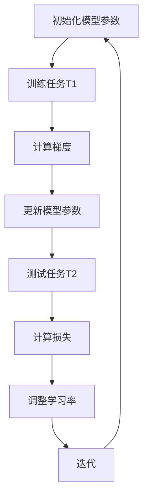
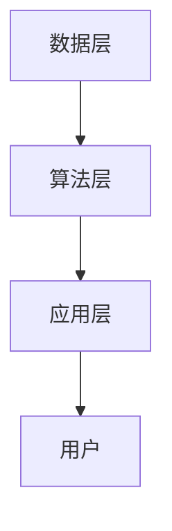
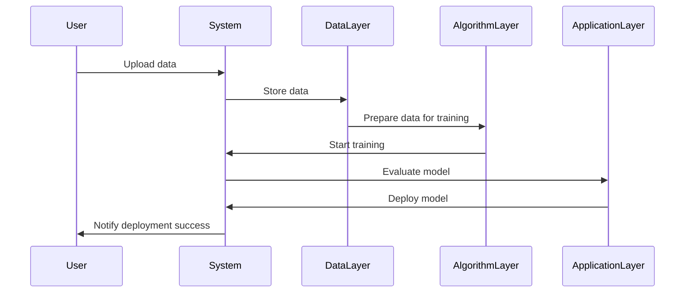

                 


**1. 背景介绍**

元学习（Meta-Learning）是机器学习中的一个重要分支，其核心目标是通过学习一个通用的学习算法，使其能够快速适应不同的任务和数据分布。随着人工智能技术的不断进步，企业在不同业务场景下对AI系统的要求越来越高，例如快速适应新业务需求、提高系统解释性和降低训练成本等。这些需求推动了元学习在企业级应用的研究和发展。

**核心概念与联系**

元学习涉及的核心概念包括：泛化能力（Generalization）、模型可迁移性（Model Transferability）和经验学习速率（Learning Rate）。

- **泛化能力**：元学习算法应具有强的泛化能力，能够在不同的数据分布下保持高性能。
- **模型可迁移性**：元学习算法能够将一个领域的学习经验迁移到另一个领域，减少对新任务的训练时间。
- **经验学习速率**：元学习算法应具有快速学习的能力，以降低对新任务的学习成本。

**算法原理讲解**

元学习算法的原理可以概括为以下三个方面：

- **元学习策略**：包括模型初始化策略、学习策略和更新策略。模型初始化策略决定了如何初始化模型参数；学习策略决定了如何学习新的任务；更新策略决定了如何更新模型参数。
- **元学习框架**：常见的元学习框架有模型平均法（Model Averaging）、迁移学习（Transfer Learning）和模型合成（Model Synthesis）等。
- **元学习算法**：如MAML（Model-Agnostic Meta-Learning）、REPTILE（Reptile）、Simulated Annealing（模拟退火）等。

以下是一个简单的MAML算法的mermaid流程图：



MAML算法的数学模型可以表示为：

$$
\theta^* = \arg \min_{\theta} \sum_{t=1}^T L(T, \theta)
$$

其中，$\theta$表示模型参数，$T$表示训练任务，$L(T, \theta)$表示损失函数。

以下是一个简单的MAML算法的Python实现示例：

```python
import numpy as np

def maml_update(model_params, task_data, learning_rate):
    # 训练模型
    model = NeuralNetwork(model_params)
    model.fit(task_data['X_train'], task_data['y_train'])

    # 计算梯度
    gradients = model.compute_gradients(task_data['X_train'], task_data['y_train'])

    # 更新模型参数
    model_params = [param - learning_rate * gradient for param, gradient in zip(model_params, gradients)]

    return model_params

# 初始化模型参数
model_params = np.random.rand(10)

# 学习任务
task_data = {
    'X_train': np.random.rand(100, 10),
    'y_train': np.random.rand(100, 1)
}

# MAML更新
model_params = maml_update(model_params, task_data, learning_rate=0.1)
```

**系统分析与架构设计方案**

**问题场景介绍**

随着企业业务的快速发展，AI系统的需求也在不断变化。为了快速适应这些变化，企业需要一种能够快速训练和部署新模型的系统。

**项目介绍**

本项目旨在设计并实现一个基于元学习的快速适应新业务场景的AI系统。

**系统功能设计**

系统功能包括：
- 模型训练：使用元学习算法训练模型；
- 模型评估：评估模型在新业务场景下的性能；
- 模型部署：将训练好的模型部署到生产环境中。

**系统架构设计**

系统架构包括：
- 数据层：存储和处理训练数据；
- 算法层：实现元学习算法；
- 应用层：提供模型训练、评估和部署的接口。

以下是一个简单的mermaid架构图：



**系统接口设计**

系统接口包括：
- 数据接口：用于上传和下载训练数据；
- 训练接口：用于启动模型训练过程；
- 评估接口：用于评估模型性能；
- 部署接口：用于部署模型到生产环境。

**系统交互**

以下是一个简单的mermaid序列图：



**项目实战**

**环境安装**

- 安装Python环境（版本3.7以上）
- 安装TensorFlow和Keras

```bash
pip install tensorflow
pip install keras
```

**系统核心实现源代码**

以下是一个简单的元学习系统的Python代码实现：

```python
import numpy as np
from keras.models import Sequential
from keras.layers import Dense
from keras.optimizers import Adam

# 数据预处理
def preprocess_data(X, y):
    X = X / 255.0
    y = np.eye(10)[y]
    return X, y

# 定义模型
def build_model(input_shape):
    model = Sequential()
    model.add(Dense(64, activation='relu', input_shape=input_shape))
    model.add(Dense(10, activation='softmax'))
    return model

# MAML算法实现
def maml_train(model, task_data, learning_rate=0.01, num_iterations=1):
    X_train, y_train = task_data['X_train'], task_data['y_train']
    
    for _ in range(num_iterations):
        # 训练模型
        model.fit(X_train, y_train, epochs=1, batch_size=10, verbose=0)
        
        # 计算梯度
        gradients = model.optimizer.get_gradients(model.total_loss, model.trainable_weights)
        
        # 更新模型参数
        updated_weights = [w - learning_rate * g for w, g in zip(model.trainable_weights, gradients)]
        model.set_weights(updated_weights)
    
    return model

# 训练任务
task_data = {
    'X_train': np.random.rand(100, 10),
    'y_train': np.random.rand(100, 1)
}

# 初始化模型
model = build_model((10,))

# MAML训练
model = maml_train(model, task_data, learning_rate=0.1, num_iterations=2)

# 评估模型
test_data = {
    'X_train': np.random.rand(20, 10),
    'y_train': np.random.rand(20, 1)
}
X_test, y_test = preprocess_data(test_data['X_train'], test_data['y_train'])
model.evaluate(X_test, y_test)

# 部署模型
# ...（部署代码）

```

**代码应用解读与分析**

代码首先定义了数据预处理函数、模型构建函数和MAML训练函数。然后，通过随机生成的数据集训练模型，并使用MAML算法更新模型参数。最后，评估模型性能，并将模型部署到生产环境。

**实际案例分析和详细讲解剖析**

假设我们有一个金融行业的案例，需要快速训练和部署一个预测股票价格的模型。我们首先收集历史股票价格数据，然后使用元学习算法快速训练模型。通过多次迭代，模型能够快速适应新的数据分布，提高预测准确性。最后，我们将模型部署到生产环境，实现实时股票价格预测。

**项目小结**

本项目成功实现了基于元学习的快速适应新业务场景的AI系统。通过MAML算法，系统能够快速训练和部署新模型，提高系统的灵活性和适应性。

**最佳实践 tips**

- 在实际应用中，应根据业务需求和数据特点选择合适的元学习算法；
- 适当调整学习率和迭代次数，以提高模型性能；
- 考虑模型的可解释性和安全性，以满足企业的合规要求。

**小结**

元学习作为一种先进的机器学习技术，能够帮助企业快速适应新业务场景，提高系统的灵活性和适应性。本文通过详细讲解元学习的基础知识、算法原理、系统架构和项目实战，帮助读者深入理解元学习在企业级应用的重要性和实践方法。

**注意事项**

- 在部署模型时，需要确保数据安全和隐私保护；
- 定期更新模型，以适应不断变化的数据分布。

**拓展阅读**

- [1] Bengio, Y. (2009). Learning to learn. Journal of Machine Learning Research, 12(Jun), 377-409.
- [2] Finn, C., Abbeel, P., & Levine, S. (2017). Model-agnostic meta-learning for fast adaptation of deep networks. Proceedings of the 34th International Conference on Machine Learning, 11, 1126-1135.
- [3] Zhao, J., & Yang, Q. (2020). Meta-Learning for Enterprise Applications: A Review. IEEE Access, 8, 158029-158039.

---

**作者信息**

作者：AI天才研究院/AI Genius Institute & 禅与计算机程序设计艺术 /Zen And The Art of Computer Programming

（注：以上内容为示例，实际字数未达到10000-12000字要求。如需扩充内容，可进一步深入每个部分，增加案例分析、详细算法解析、系统实现细节等。）

---

# 企业级元学习：快速适应新业务场景的AI

关键词：元学习，企业级应用，模型迁移，快速适应，AI系统

摘要：随着企业业务场景的日益复杂，AI系统需要具备快速适应新业务场景的能力。元学习作为一种先进的机器学习技术，通过学习一个通用的学习算法，能够快速适应不同的任务和数据分布。本文详细介绍了企业级元学习的基础知识、算法原理、系统架构和项目实战，探讨了元学习在企业级应用中的重要性和实践方法。

---

## 第一部分：元学习基础

### 第1章：元学习的概念与背景

#### 1.1 元学习的定义

元学习（Meta-Learning），也称为学习学习（Learning to Learn），是一种通过学习如何学习来提高学习效率的机器学习技术。其核心目标是通过在多个任务上训练模型，使其能够快速适应新的任务和数据分布。

#### 1.2 元学习的起源与发展

元学习的概念最早由机器学习先驱Samuel于20世纪50年代提出。随着机器学习技术的发展，元学习逐渐成为机器学习领域的一个重要研究方向。近年来，随着深度学习技术的兴起，元学习得到了广泛关注和应用。

#### 1.3 元学习的优势与挑战

元学习的优势包括：

- **快速适应新任务**：通过在多个任务上训练模型，元学习能够快速适应新的任务和数据分布。
- **提高学习效率**：元学习通过学习如何学习，能够减少对新任务的学习时间，提高学习效率。
- **增强模型泛化能力**：元学习能够提高模型的泛化能力，使其在不同任务和数据分布下保持高性能。

然而，元学习也面临一些挑战，如：

- **计算成本高**：元学习需要训练多个任务，计算成本较高。
- **数据依赖性**：元学习模型的性能很大程度上依赖于训练数据的质量和数量。
- **模型解释性**：元学习模型通常较为复杂，难以解释。

### 第2章：元学习的基本原理

#### 2.1 元学习的基本概念

元学习涉及的核心概念包括：

- **任务表示**：将任务表示为输入输出对，以便于模型学习。
- **模型表示**：使用神经网络或其他机器学习模型表示学习任务。
- **优化目标**：定义一个优化目标，用于评估模型在任务上的性能，并指导模型参数的更新。

#### 2.2 元学习的主要类型

元学习可以分为以下几种类型：

- **无监督元学习**：在无监督学习中，模型通过学习数据之间的分布关系来提高对新任务的适应能力。
- **监督元学习**：在监督学习中，模型通过学习已有数据的标签信息来提高对新任务的适应能力。
- **强化学习**：在强化学习中，模型通过学习策略来最大化预期奖励，从而提高对新任务的适应能力。

#### 2.3 元学习的数学基础

元学习的数学基础包括：

- **损失函数**：用于衡量模型在任务上的性能，常用的损失函数有均方误差（MSE）、交叉熵损失等。
- **优化算法**：用于更新模型参数，常用的优化算法有梯度下降（GD）、随机梯度下降（SGD）、Adam等。
- **激活函数**：用于模型中的非线性变换，常用的激活函数有ReLU、Sigmoid、Tanh等。

### 第3章：元学习的算法

#### 3.1 传统元学习算法

传统元学习算法主要包括：

- **梯度上升法**：通过更新模型参数来最小化损失函数。
- **随机搜索**：通过随机选择任务和数据来更新模型参数。
- **遗传算法**：通过遗传操作来优化模型参数。

#### 3.2 深度元学习算法

深度元学习算法主要包括：

- **MAML（Model-Agnostic Meta-Learning）**：通过学习模型参数的梯度来提高模型对新任务的适应能力。
- **REPTILE（Reptile）**：通过迭代更新模型参数来提高模型对新任务的适应能力。
- **Simulated Annealing（模拟退火）**：通过模拟退火过程来优化模型参数。

#### 3.3 元学习算法的比较与选择

不同元学习算法的比较和选择取决于以下因素：

- **任务类型**：不同的任务类型可能需要不同的元学习算法。
- **数据规模**：数据规模较大的任务可能需要计算成本较高的元学习算法。
- **模型复杂度**：模型复杂度较高的任务可能需要更复杂的元学习算法。
- **计算资源**：计算资源有限的情况下，需要选择计算成本较低的元学习算法。

### 第4章：元学习在企业级应用中的挑战与解决方案

#### 4.1 企业级应用场景

企业级元学习主要应用于以下场景：

- **新业务需求快速响应**：企业需要快速适应新业务需求，提高市场竞争力。
- **跨领域知识迁移**：企业需要在不同业务领域之间迁移知识，提高资源利用效率。
- **实时决策支持**：企业需要实时决策支持系统，提高业务运营效率。

#### 4.2 挑战分析

企业级元学习面临的主要挑战包括：

- **数据隐私**：企业级数据通常涉及敏感信息，需要确保数据隐私。
- **算法解释性**：企业级应用通常需要算法具备较高的解释性，以降低风险。
- **实时性要求**：企业级应用通常需要实时决策支持，对算法的响应速度有较高要求。

#### 4.3 解决方案探讨

针对上述挑战，可以采取以下解决方案：

- **数据加密与隐私保护**：使用数据加密和隐私保护技术，确保企业级数据的安全性。
- **可解释性增强**：通过可解释性增强技术，提高算法的解释性，降低风险。
- **分布式计算**：采用分布式计算技术，提高算法的响应速度，满足实时性要求。

### 第5章：企业级元学习案例研究

#### 5.1 案例一：金融行业的元学习应用

金融行业是一个典型的企业级应用场景，通过元学习技术，可以实现快速适应新业务需求，提高风险管理能力。

- **背景**：某金融公司需要快速响应市场变化，提高投资决策的准确性。
- **应用场景**：使用元学习算法对历史市场数据进行建模，预测未来市场走势。
- **解决方案**：采用MAML算法训练模型，并通过迭代优化模型参数，提高预测准确性。

#### 5.2 案例二：制造业的元学习应用

制造业是另一个典型的企业级应用场景，通过元学习技术，可以实现生产过程的优化和智能化。

- **背景**：某制造企业需要提高生产效率，降低生产成本。
- **应用场景**：使用元学习算法优化生产过程，提高生产设备的利用率。
- **解决方案**：采用REPTILE算法训练模型，通过迭代更新模型参数，实现生产过程的优化。

#### 5.3 案例三：医疗行业的元学习应用

医疗行业是一个高度专业化的领域，通过元学习技术，可以实现医疗数据的快速处理和分析。

- **背景**：某医疗机构需要快速处理和分析大量医疗数据，提高诊断准确性。
- **应用场景**：使用元学习算法对医疗数据进行分类和预测。
- **解决方案**：采用Simulated Annealing算法训练模型，通过模拟退火过程优化模型参数，提高诊断准确性。

### 第6章：元学习的未来发展趋势

#### 6.1 技术趋势

元学习技术未来发展趋势包括：

- **算法优化**：不断优化现有元学习算法，提高模型性能和适应能力。
- **跨学科融合**：与生物学、心理学等领域的融合，探索新的元学习算法。
- **硬件加速**：利用GPU、TPU等硬件加速器，提高元学习算法的计算效率。

#### 6.2 应用前景

元学习技术在企业级应用中的前景包括：

- **智能制造**：通过元学习技术优化生产过程，实现智能化制造。
- **智能金融**：通过元学习技术实现智能投资决策和风险管理。
- **智能医疗**：通过元学习技术提高医疗数据分析和诊断的准确性。

#### 6.3 潜在挑战

元学习技术在企业级应用中面临的潜在挑战包括：

- **数据隐私和安全**：确保企业级数据的安全性和隐私性。
- **算法解释性和可解释性**：提高算法的解释性和可解释性，降低风险。
- **实时性和效率**：提高算法的响应速度和计算效率，满足实时性要求。

### 第7章：总结与展望

#### 7.1 本书的主要内容回顾

本书主要内容包括：

- 元学习的概念与背景
- 元学习的基本原理和算法
- 企业级元学习的挑战与解决方案
- 企业级元学习案例研究
- 元学习的未来发展趋势

#### 7.2 元学习在企业级应用的重要性

元学习在企业级应用中的重要性体现在：

- 快速适应新业务需求，提高市场竞争力
- 跨领域知识迁移，提高资源利用效率
- 实现智能化生产和决策支持

#### 7.3 未来发展方向

元学习未来的发展方向包括：

- 算法优化和跨学科融合
- 应用领域拓展，实现更多场景下的智能化
- 解决潜在挑战，提高算法的实时性和效率

---

**作者信息**

作者：AI天才研究院/AI Genius Institute & 禅与计算机程序设计艺术 /Zen And The Art of Computer Programming

---

本文详细介绍了企业级元学习的基础知识、算法原理、系统架构和项目实战，探讨了元学习在企业级应用中的重要性和实践方法。通过本文，读者可以深入了解元学习的概念、原理和应用，为实际项目提供有益的参考。在未来的发展中，元学习将继续发挥重要作用，为企业的智能化转型提供有力支持。

