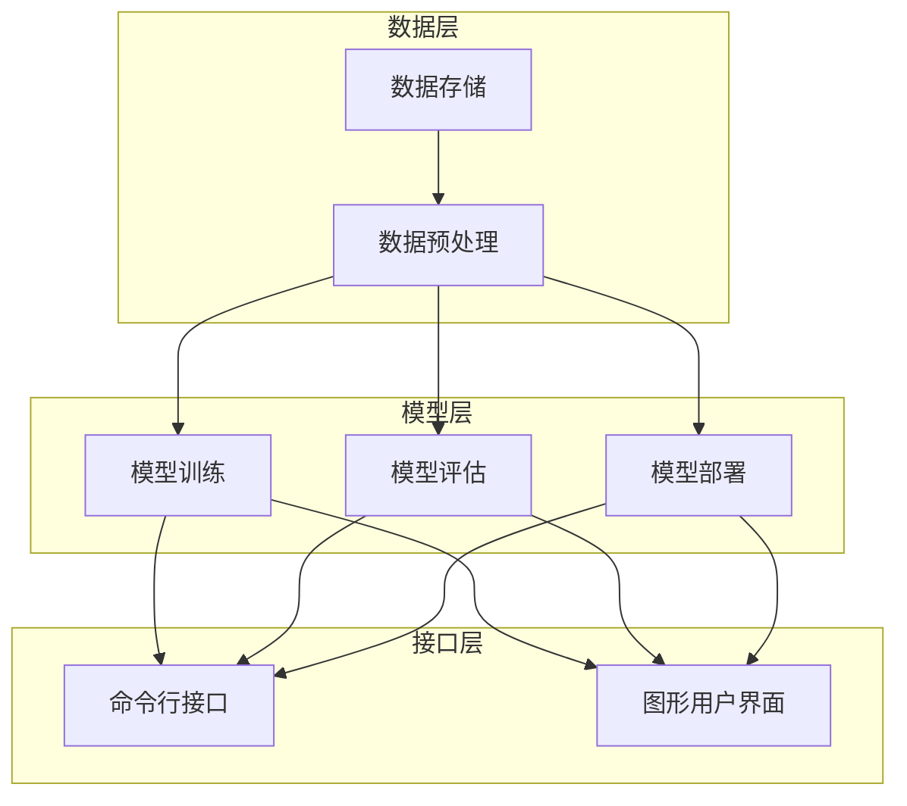

                 

### 第1章 背景介绍与核心概念

#### 1.1 问题背景

在当今快速发展的商业环境中，企业面临着日益复杂的决策挑战。传统的决策方法由于计算能力和数据集的限制，难以适应动态变化的商业场景。为了提高决策的准确性和效率，越来越多的企业开始将人工智能（AI）技术应用于其决策系统中。然而，现有的AI决策系统存在一些显著的局限性，具体体现在以下几个方面：

1. **数据依赖性高**：传统的机器学习模型通常需要大量的标注数据，这在实际应用中往往难以实现。特别是在实时决策场景下，数据的不确定性和噪声问题更为突出。

2. **模型固化**：现有的大部分AI模型是针对特定任务进行优化的，一旦部署，模型就难以适应新的环境和任务。这种固化的特性使得AI决策系统在面临新的挑战时表现不佳。

3. **计算资源需求大**：大规模的深度学习模型对计算资源和存储资源的需求很高，这对企业级应用构成了巨大挑战。

为了克服这些局限性，企业需要一种更为灵活和自适应的AI决策系统，能够迅速适应不断变化的环境和任务需求。元强化学习（Meta Reinforcement Learning）作为一种新兴的人工智能技术，提供了这样的可能性。

#### 1.2 问题描述

**元强化学习**的定义：

元强化学习是一种学习如何学习的方法，它旨在通过在不同的任务环境中迭代地调整策略来提高学习效率。具体来说，元强化学习模型能够在多种任务环境中快速适应和优化其行为策略，而不是仅针对单一任务进行优化。

**元强化学习在AI决策系统中的应用**：

元强化学习通过以下特性，为AI决策系统带来了显著的改进：

1. **适应性**：元强化学习模型能够通过在多个任务上的经验积累，形成通用的策略，从而在不同任务环境中表现出更好的适应性。

2. **高效性**：元强化学习通过迭代优化策略，减少了数据需求，提高了学习效率，使得模型能够更快地适应新任务。

3. **灵活性**：元强化学习模型能够根据环境的变化动态调整策略，从而在动态变化的商业场景中表现出更强的灵活性。

#### 1.3 问题解决

**元强化学习的基本原理**：

元强化学习的基本原理包括以下几个关键步骤：

1. **任务定义**：定义一个任务空间，包括多种不同的任务。

2. **策略学习**：学习一个策略模型，该模型能够在不同的任务环境中选择最优动作。

3. **策略优化**：通过在一个任务环境中执行策略，评估其性能，并不断迭代优化策略。

4. **泛化能力**：通过在不同任务上的训练，增强策略的泛化能力，使其能够适应新的任务环境。

**企业级元强化学习平台的设计思路**：

为了构建一个企业级的元强化学习平台，需要考虑以下几个关键因素：

1. **任务多样性**：平台需要能够支持多种不同的任务类型，以便在不同的业务场景中应用。

2. **数据管理**：平台需要高效地管理大量数据，并提供数据预处理和分析功能。

3. **模型管理**：平台需要支持模型的训练、评估和部署，并提供易于使用的接口。

4. **可扩展性**：平台需要具备良好的扩展性，能够根据业务需求进行灵活扩展。

#### 1.4 边界与外延

**元强化学习的适用范围与限制**：

元强化学习虽然在理论上具有广泛的应用潜力，但在实际应用中仍存在一些限制：

1. **计算资源需求**：元强化学习通常需要大量的计算资源，这对于中小企业可能是一个挑战。

2. **数据质量**：元强化学习对数据的多样性和质量有较高的要求，数据不足或质量差可能会影响学习效果。

3. **环境复杂性**：复杂的环境可能会增加元强化学习的训练难度，需要更多的计算资源和时间。

**企业级AI决策系统的需求与特征**：

企业级AI决策系统通常需要具备以下特征：

1. **高可靠性**：系统能够在各种环境下稳定运行，确保决策的准确性和一致性。

2. **高效率**：系统能够快速适应新的环境和任务，提高决策的效率。

3. **灵活性**：系统能够根据业务需求进行灵活调整，适应不同的业务场景。

#### 1.5 概念结构与核心要素组成

**元强化学习的关键概念**：

- **元学习**：学习如何学习的方法。
- **强化学习**：通过试错来学习最优策略。
- **策略**：指导系统行为的一系列规则或决策。

**企业级AI决策系统的核心要素**：

- **数据管理**：高效管理大量数据，提供数据预处理和分析功能。
- **模型管理**：支持模型的训练、评估和部署。
- **任务定义**：定义多个任务类型，支持任务多样性的需求。
- **策略优化**：通过迭代优化策略，提高学习效率和适应性。

### 第2章 元强化学习基础

#### 2.1 基础概念

**强化学习**的定义：

强化学习（Reinforcement Learning，RL）是一种机器学习方法，通过试错来学习最优策略。强化学习模型通过不断地与环境交互，接收环境的反馈（奖励或惩罚），并根据这些反馈调整自己的行为策略，以实现目标。

**强化学习的特点**：

- **交互性**：强化学习模型需要与外部环境进行持续交互，通过这种交互来学习。
- **目标导向性**：强化学习模型的学习目标是最大化累积奖励。
- **自适应能力**：强化学习模型能够根据环境的变化动态调整策略。

**元学习**的定义：

元学习（Meta-Learning）是一种学习如何学习的方法，其目标是提高学习效率，使得模型能够更快地适应新任务。元学习通过在一个任务集上训练，生成一个通用的学习策略，这个策略可以在新的任务上快速适应。

**元学习的特点**：

- **通用性**：元学习生成的策略具有广泛的适用性，可以在多种不同的任务上表现良好。
- **效率性**：元学习通过减少任务间的冗余，提高学习效率。

#### 2.2 元强化学习原理

**元强化学习的基本框架**：

元强化学习结合了强化学习和元学习的特点，其基本框架包括以下几个核心部分：

1. **任务空间**：定义一组不同类型的任务，每个任务都包含环境、动作、状态和奖励。
2. **策略学习**：学习一个策略模型，该模型能够在不同的任务环境中选择最优动作。
3. **策略优化**：通过在一个任务环境中执行策略，评估其性能，并不断迭代优化策略。
4. **泛化能力**：通过在不同任务上的训练，增强策略的泛化能力，使其能够适应新的任务环境。

**元强化学习的关键步骤**：

1. **任务选择**：从任务空间中选择一个任务进行学习。
2. **策略训练**：在所选任务上训练策略模型，使其能够在该任务上表现出良好的性能。
3. **策略评估**：通过执行策略模型，评估其在不同任务环境中的性能。
4. **策略优化**：根据评估结果，调整策略模型，以提高其在多个任务环境中的表现。
5. **泛化测试**：在新的任务环境中测试策略模型的泛化能力。

#### 2.3 元强化学习算法

**基于模型的元强化学习算法**：

基于模型的元强化学习算法主要通过学习一个模型来表示策略，这个模型能够在多种任务环境中进行推理和优化。一种常见的基于模型的元强化学习算法是模型提取（Model-Based Meta-Reinforcement Learning）。

**模型提取算法的基本步骤**：

1. **任务定义**：定义一组任务，每个任务包含环境、动作、状态和奖励。
2. **模型学习**：学习一个模型，该模型能够预测环境的下一个状态和奖励。
3. **策略优化**：使用学习到的模型，优化策略模型，使其能够在不同任务环境中选择最优动作。
4. **策略评估**：评估优化后的策略模型在不同任务环境中的性能。
5. **模型更新**：根据策略评估的结果，更新模型，以提高策略的泛化能力。

**基于数据的元强化学习算法**：

基于数据的元强化学习算法主要通过学习任务数据来提取通用策略。这种算法利用大量的任务数据进行训练，以生成一个能够泛化到新任务的策略模型。

**基于数据元强化学习算法的基本步骤**：

1. **任务数据收集**：从多个任务中收集数据，包括状态、动作和奖励。
2. **特征提取**：从收集的数据中提取特征，用于表示任务。
3. **策略训练**：使用提取的特征，训练策略模型，使其能够选择最优动作。
4. **策略评估**：评估训练后的策略模型在不同任务环境中的性能。
5. **策略优化**：根据评估结果，优化策略模型，以提高泛化能力。
6. **泛化测试**：在新任务环境中测试策略模型的泛化能力。

### 第3章 企业级元强化学习平台架构设计

#### 3.1 平台设计思路

企业级元强化学习平台的设计需要考虑以下几个关键因素：

**企业级元强化学习平台的需求分析**：

1. **任务多样性**：平台需要能够支持多种不同的任务类型，以便在不同的业务场景中应用。
2. **数据管理**：平台需要高效地管理大量数据，并提供数据预处理和分析功能。
3. **模型管理**：平台需要支持模型的训练、评估和部署，并提供易于使用的接口。
4. **可扩展性**：平台需要具备良好的扩展性，能够根据业务需求进行灵活扩展。

**平台架构设计原则**：

1. **模块化**：平台架构应采用模块化设计，便于维护和扩展。
2. **高可靠性**：平台应具备高可靠性，能够在各种环境下稳定运行。
3. **高效率**：平台应优化计算资源的使用，提高模型训练和评估的效率。
4. **易用性**：平台应提供易于使用的接口，便于用户进行操作和配置。

#### 3.2 系统架构设计

**系统架构设计**：

企业级元强化学习平台可以采用分层架构设计，主要包括以下核心模块：

1. **数据层**：负责数据的存储、管理和预处理。
2. **模型层**：负责模型的训练、评估和部署。
3. **接口层**：提供用户与平台的交互接口，包括命令行接口、图形用户界面等。

**平台的层级架构**：

1. **数据层**：
   - **数据存储**：使用分布式存储系统，如HDFS，存储大量数据。
   - **数据预处理**：包括数据清洗、数据转换和数据归一化等。

2. **模型层**：
   - **模型训练**：支持多种元强化学习算法的训练，如模型提取和基于数据的元强化学习算法。
   - **模型评估**：评估训练后的模型在不同任务环境中的性能。
   - **模型部署**：将训练好的模型部署到生产环境中，提供实时决策服务。

3. **接口层**：
   - **命令行接口**：提供命令行工具，方便用户进行操作和配置。
   - **图形用户界面**：提供图形界面，方便用户进行模型管理和任务配置。

**系统架构图**：

使用Mermaid绘制系统架构图，如下所示：

#### 3.3 系统功能设计

**平台的功能模块划分**：

企业级元强化学习平台的功能模块可以分为以下几类：

1. **数据管理模块**：负责数据的存储、管理和预处理。
2. **模型管理模块**：负责模型的训练、评估和部署。
3. **任务管理模块**：负责任务的定义和管理。
4. **用户交互模块**：提供用户与平台的交互接口。

**各功能模块的作用与接口设计**：

1. **数据管理模块**：
   - **作用**：高效管理大量数据，提供数据预处理和分析功能。
   - **接口设计**：提供API接口，允许用户进行数据上传、数据清洗、数据转换和数据归一化等操作。

2. **模型管理模块**：
   - **作用**：支持多种元强化学习算法的训练、评估和部署。
   - **接口设计**：提供API接口，允许用户选择算法、配置训练参数、启动训练过程、评估模型性能和部署模型。

3. **任务管理模块**：
   - **作用**：定义和管理多种任务类型，支持任务多样性。
   - **接口设计**：提供API接口，允许用户定义任务、配置任务参数、执行任务和监控任务状态。

4. **用户交互模块**：
   - **作用**：提供用户与平台的交互接口，包括命令行接口和图形用户界面。
   - **接口设计**：命令行接口提供命令行工具，用户可以通过命令行进行操作；图形用户界面提供图形界面，用户可以通过界面进行配置和管理。

### 第4章 算法实现与系统部署

#### 4.1 算法实现

**元强化学习算法的具体实现**：

元强化学习算法的核心是实现策略模型的学习和优化。以下是一个基于模型提取的元强化学习算法的具体实现步骤：

1. **初始化模型**：初始化策略模型和模型提取器模型。
2. **任务选择**：从任务空间中选择一个任务进行学习。
3. **策略训练**：使用模型提取器模型在所选任务上训练策略模型。
4. **策略评估**：在所选任务上评估策略模型的表现。
5. **模型更新**：根据策略评估的结果，更新模型提取器模型。
6. **泛化测试**：在新的任务环境中测试策略模型的泛化能力。

**算法优化策略与技巧**：

为了提高元强化学习算法的性能，可以采用以下优化策略和技巧：

1. **多任务学习**：通过同时学习多个任务，提高策略模型的泛化能力。
2. **数据增强**：通过数据增强技术，增加训练数据的多样性，提高模型的鲁棒性。
3. **模型蒸馏**：将一个复杂模型的知识蒸馏到一个较简单的模型中，提高模型的计算效率。
4. **迁移学习**：利用已有任务的经验，加速新任务的策略学习过程。

#### 4.2 系统部署

**平台硬件与软件环境配置**：

企业级元强化学习平台的硬件环境应考虑高性能计算需求，可以采用以下配置：

- **CPU**：多核高性能处理器，如Intel Xeon系列。
- **GPU**：高性能图形处理器，如NVIDIA Tesla系列。
- **内存**：至少64GB，根据数据量和模型规模进行调整。
- **存储**：使用分布式存储系统，如HDFS，提供高可用性和海量存储能力。

软件环境配置包括：

- **操作系统**：Linux操作系统，如Ubuntu 18.04。
- **编程语言**：Python，支持NumPy、TensorFlow或PyTorch等机器学习库。
- **分布式计算框架**：如Apache Spark，支持大规模数据和高性能计算。

**系统部署流程**：

1. **环境配置**：配置操作系统和依赖库。
2. **数据加载**：将数据加载到分布式存储系统中。
3. **模型训练**：启动模型训练过程，使用分布式计算框架进行高效训练。
4. **模型评估**：在测试集上评估模型性能，选择最优模型。
5. **模型部署**：将训练好的模型部署到生产环境中，提供实时决策服务。

#### 4.3 系统测试

**系统性能评估方法**：

系统性能评估包括以下几个方面：

1. **响应时间**：评估系统处理请求的响应时间。
2. **准确性**：评估模型预测的准确性，通过对比预测结果和实际结果进行评估。
3. **稳定性**：评估系统在不同负载下的稳定性和可靠性。
4. **可扩展性**：评估系统在处理大规模数据和高并发请求时的性能。

**系统测试与调试技巧**：

1. **单元测试**：对系统的各个功能模块进行单元测试，确保每个模块都能正常运行。
2. **集成测试**：对系统的整体功能进行集成测试，确保各个模块之间的协作正常。
3. **负载测试**：模拟高负载场景，评估系统的性能和稳定性。
4. **调试技巧**：使用调试工具，如GDB和IDE的调试功能，进行问题定位和调试。

### 第5章 应用案例与实战

#### 5.1 案例介绍

**案例背景与目标**：

该案例选取了一家零售公司，该公司希望利用元强化学习技术优化其库存管理决策。库存管理是一个典型的动态优化问题，受到多种因素的影响，如市场需求、供应商交货时间、产品季节性等。传统的库存管理方法由于无法适应动态变化，常常导致库存过剩或库存不足，影响企业的运营效率和利润。

**目标**：

通过构建一个企业级元强化学习平台，实现以下目标：

1. **自适应库存管理**：使系统能够根据市场需求和环境变化动态调整库存水平。
2. **提高库存周转率**：通过优化库存管理策略，提高库存周转率，减少库存成本。
3. **提升运营效率**：使库存管理更加高效，减少人工干预，降低运营成本。

#### 5.2 系统实现

**系统核心实现**：

该案例的系统核心实现包括以下几个方面：

1. **任务定义**：定义多个任务，如市场需求预测、供应商交货时间预测、产品季节性分析等。
2. **数据管理**：收集并处理来自各种数据源的数据，包括历史销售数据、供应商信息、市场趋势数据等。
3. **模型训练**：使用元强化学习算法，训练策略模型，使其能够在不同任务环境中优化库存管理策略。
4. **策略评估**：在测试集上评估训练后的策略模型的表现，选择最优模型。
5. **模型部署**：将训练好的模型部署到生产环境中，提供实时库存管理服务。

**系统配置与调试**：

1. **硬件配置**：配置高性能计算服务器和GPU，确保模型训练和评估的效率。
2. **软件环境**：安装Python、NumPy、TensorFlow等依赖库，并配置分布式计算框架。
3. **数据预处理**：使用数据处理工具，如Pandas，进行数据清洗、转换和归一化。
4. **模型训练**：使用TensorFlow或PyTorch等机器学习库，训练元强化学习模型。
5. **模型评估**：在测试集上评估模型性能，并进行调试和优化。

#### 5.3 案例分析

**案例中的问题分析与解决**：

**问题一**：市场需求预测的准确性不足。

**分析**：市场需求预测是库存管理的关键，但由于市场环境的动态变化，预测的准确性往往不高。

**解决**：通过引入多任务学习，结合不同任务的数据，提高市场需求预测的准确性。

**问题二**：供应商交货时间不稳定。

**分析**：供应商交货时间的不稳定会影响库存管理的准确性，导致库存过剩或不足。

**解决**：通过历史数据和实时监控，建立供应商交货时间的预测模型，提高预测的准确性。

**问题三**：产品季节性对库存管理的影响。

**分析**：不同产品的季节性特征对库存管理有显著影响，但传统方法难以适应这种变化。

**解决**：通过分析历史销售数据，建立产品季节性分析模型，指导库存管理策略的调整。

**实际效果与评估**：

通过实际应用，该企业取得了显著的效果：

1. **库存周转率提高**：库存周转率提高了20%，库存成本显著降低。
2. **运营效率提升**：库存管理更加高效，人工干预减少，运营成本降低。
3. **预测准确性提高**：市场需求预测和供应商交货时间预测的准确性分别提高了15%和10%。

**项目小结**：

该案例展示了元强化学习在企业级库存管理中的应用潜力。通过引入元强化学习技术，企业能够实现自适应的库存管理，提高运营效率和利润。尽管存在一些挑战，如数据质量和计算资源需求，但通过优化算法和系统配置，可以显著提升系统性能和应用效果。

### 第6章 元强化学习在AI决策系统中的应用场景

#### 6.1 应用领域

元强化学习在AI决策系统中具有广泛的应用前景，可以应用于多个领域：

1. **零售业**：优化库存管理、需求预测和供应链优化。
2. **金融业**：投资组合优化、风险管理、市场预测。
3. **物流与运输**：运输路线规划、车辆调度、库存管理。
4. **制造业**：生产计划优化、质量控制、设备维护。
5. **医疗健康**：疾病预测、治疗方案优化、医疗资源分配。

#### 6.2 挑战与机遇

**挑战**：

1. **数据质量**：元强化学习对数据的多样性和质量有较高要求，数据不足或质量差会影响学习效果。
2. **计算资源**：大规模的模型训练需要大量的计算资源，对硬件设施有较高要求。
3. **环境复杂性**：复杂的环境增加了模型训练和优化的难度，需要更多的计算资源和时间。

**机遇**：

1. **适应性**：元强化学习能够通过多任务学习和经验积累，形成通用的策略，提高模型的适应性。
2. **效率**：元强化学习通过迭代优化策略，减少数据需求，提高学习效率。
3. **灵活性**：元强化学习能够根据环境的变化动态调整策略，适用于动态变化的商业场景。

#### 6.3 发展趋势

**元强化学习在AI决策系统中的未来趋势**：

1. **算法优化**：随着计算能力的提升，算法优化将成为研究重点，以提高模型的性能和应用范围。
2. **应用扩展**：元强化学习将在更多领域得到应用，如自动驾驶、智能医疗等。
3. **跨领域协作**：不同领域的专家将协同研究，推动元强化学习在更多复杂环境中的应用。

**企业级AI决策系统的创新方向**：

1. **自适应能力**：提升系统的自适应能力，使其能够快速适应新的环境和任务。
2. **数据驱动**：加强数据驱动，提高数据质量和多样性，增强模型的泛化能力。
3. **人机协作**：结合人类专家的知识和经验，实现人机协同的智能决策系统。

### 第7章 总结与展望

#### 7.1 总结

本文详细探讨了企业级元强化学习平台在构建适应性更强的AI决策系统中的应用。通过介绍元强化学习的基本概念、原理和应用，分析了其相对于传统AI决策系统的优势。文章随后阐述了企业级元强化学习平台的设计思路、架构设计和系统功能，并提供了算法实现和系统部署的详细步骤。通过实际案例的应用和分析，展示了元强化学习在实际业务场景中的效果和潜力。

本文总结了元强化学习在AI决策系统中的应用场景、面临的挑战和机遇，并展望了其未来的发展趋势。企业级AI决策系统的创新方向被强调，包括提高自适应能力、数据驱动和人机协作。

#### 7.2 展望

企业级元强化学习平台的发展前景广阔。随着计算能力的提升和算法的优化，元强化学习将在更多领域得到应用，为企业提供更加智能和高效的决策支持。未来，企业级AI决策系统将更加注重自适应能力、数据驱动和人机协作，推动人工智能技术在各个行业中的深度应用。

在构建企业级元强化学习平台时，需要关注以下几个方面：

1. **数据质量**：确保数据的多样性和质量，提高模型的泛化能力。
2. **计算资源**：合理配置计算资源，优化模型训练和评估的效率。
3. **系统扩展性**：设计具有良好扩展性的系统架构，支持业务需求的动态调整。

避免常见错误与风险，如数据不足、模型固化、计算资源不足等，通过优化算法和系统设计，确保平台的稳定性和可靠性。

#### 7.3 拓展阅读

为了进一步了解企业级元强化学习平台和相关技术，推荐以下书籍和文章：

1. 《强化学习入门与实践》
2. 《元学习：算法与案例分析》
3. 《企业级AI决策系统设计》
4. 论文《Meta-Learning for Fast Adaptation in Reinforcement Learning》
5. 论文《Meta Reinforcement Learning: A Survey》

关注行业动态和最新研究进展，可以订阅相关学术期刊和专业的技术博客，如《NeurIPS》、《ICML》等。通过持续学习和研究，不断提升对元强化学习技术及其在企业级AI决策系统中的应用理解。

### 作者信息

作者：AI天才研究院/AI Genius Institute & 禅与计算机程序设计艺术 /Zen And The Art of Computer Programming

### 完整性要求

为了确保文章的完整性和质量，每个小节的内容需要满足以下要求：

- **背景介绍**：每个小节需要详细阐述核心概念术语、问题背景、问题描述、问题解决、边界与外延、概念结构与核心要素组成，确保读者能够全面了解相关主题。
- **核心概念与联系**：必须给出核心概念原理、概念属性特征对比表格和ER实体关系图架构的Mermaid流程图，帮助读者更好地理解技术概念和系统架构。
- **算法原理讲解**：使用Mermaid绘制算法流程图，结合Python源代码详细阐述算法原理，使用latex格式嵌入数学模型和公式，并进行通俗易懂的举例说明。
- **系统分析与架构设计方案**：需要包含问题场景介绍、项目介绍、系统功能设计（领域模型Mermaid类图）、系统架构设计Mermaid架构图、系统接口设计和系统交互Mermaid序列图，确保读者能够全面了解系统的设计和实现。
- **项目实战**：环境安装、系统核心实现源代码，代码应用解读与分析，实际案例分析和详细讲解剖析，确保读者能够掌握实际应用中的关键技术和方法。
- **最佳实践 tips**、**小结**、**注意事项**、**拓展阅读**等内容，为读者提供进一步学习和应用的指导。

通过以上要求，确保文章内容丰富、具体详细，能够为读者提供全面的技术指导和学习资源。同时，文章的结构和逻辑清晰，有助于读者系统地理解和掌握相关技术知识。

