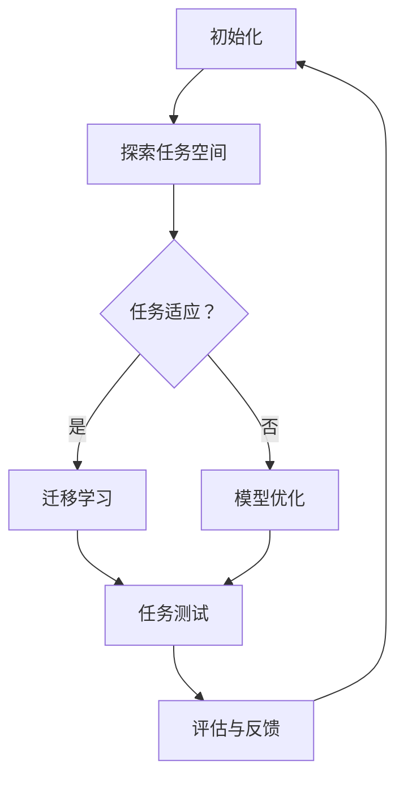
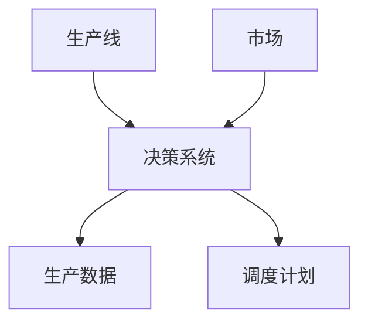
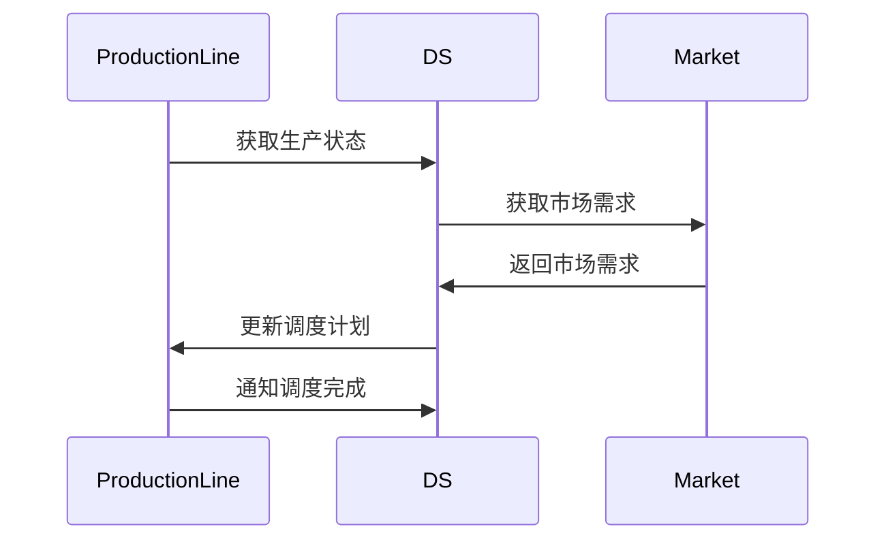

                 

Certainly! Here's a step-by-step approach to creating the content for "企业级元强化学习：构建自适应AI决策系统" blog post.

### Step 1: Introduction to the Topic

Start with an introduction that sets the stage for the reader:

---

## 引言

在当前人工智能（AI）飞速发展的时代，企业需要具备强大的自适应能力，以应对不断变化的市场环境。传统的决策系统往往难以满足这种需求，而元强化学习（Meta Reinforcement Learning）作为一种前沿的AI技术，为企业提供了一个构建自适应决策系统的强大工具。本文将深入探讨企业级元强化学习，解释其基本概念，并展示如何构建和部署一个自适应AI决策系统。

---

### Step 2: Define Key Concepts and Terms

Explain the key concepts and terms that are crucial for understanding the topic:

---

## 关键概念与术语

- **强化学习（Reinforcement Learning）**：一种机器学习方法，通过奖惩机制让智能体学习在特定环境中如何做出最优决策。
- **元强化学习（Meta Reinforcement Learning）**：一种利用强化学习算法来优化其他强化学习算法的方法，旨在提高学习效率和性能。
- **自适应决策系统（Adaptive Decision System）**：一种能够在运行时根据环境变化自动调整其行为模式的系统。

---

### Step 3: Discuss Background and Problem Statement

Provide a detailed background and problem statement to contextualize the need for meta reinforcement learning in enterprise settings:

---

## 背景介绍与问题陈述

在当今竞争激烈的市场中，企业面临着复杂多变的决策环境。传统的决策支持系统往往依赖于静态的数据模型和预设的规则，难以适应动态变化。例如，自动驾驶系统需要实时处理道路上的各种情况，金融风控系统需要快速响应市场波动，供应链管理系统需要灵活调整以应对需求变化。这些需求要求决策系统不仅要有高效的学习能力，还要能够自我调整和优化。

传统的强化学习在解决这类问题上表现出色，但其在复杂环境和长时间训练上的局限性使得其难以直接应用于企业级场景。元强化学习通过学习如何学习，提供了一种潜在的解决方案，它能够通过元学习机制加速强化学习算法的收敛，提高系统的适应能力。

---

### Step 4: Explain Core Concepts and Principles

Elaborate on the core concepts and principles of meta reinforcement learning, including how it works and its advantages:

---

## 核心概念与原理

### 什么是元强化学习？

元强化学习是一种机器学习方法，它利用强化学习算法来优化其他强化学习算法。其核心思想是通过在多个任务上进行预训练，使得算法能够快速适应新任务，从而提高学习效率和性能。

### 元强化学习的工作原理

1. **任务空间探索**：元强化学习通过探索多个任务，学习到在不同任务上的通用策略。
2. **模型优化**：利用这些通用策略，元强化学习算法不断调整和优化自身模型，使其能够更好地处理新任务。
3. **迁移学习**：通过迁移学习机制，元强化学习将先前的经验应用于新任务，减少对新任务的训练需求。

### 元强化学习的优势

- **快速适应新任务**：通过预训练和迁移学习，元强化学习能够在短时间内适应新任务。
- **提高学习效率**：元强化学习通过优化学习过程，显著提高了强化学习算法的收敛速度。
- **增强泛化能力**：元强化学习通过在多个任务上训练，提高了算法的泛化能力，使其能够更好地应对复杂环境。

---

### Step 5: Algorithm Explanation and Example

Use Mermaid diagrams and Python code to explain the algorithmic principles and provide a concrete example:

---

## 算法解释与示例

### 算法流程图

下面是元强化学习算法的基本流程图：



### 示例代码

以下是一个简单的Python代码示例，展示了如何实现元强化学习算法：

```python
import numpy as np
import random

# 定义环境
class SimpleEnv:
    def __init__(self):
        self.state = 0

    def step(self, action):
        reward = 0
        if action == 1:
            self.state += 1
            reward = 1
        elif action == -1:
            self.state -= 1
            reward = -1
        return self.state, reward

# 元强化学习算法
class MetaReinforce:
    def __init__(self):
        self.policy = np.random.rand(2) - 0.5

    def sample_action(self, state):
        action_probs = self.policy * (state + 1)
        return random.choices([1, -1], weights=action_probs)[0]

    def update(self, state, action, reward, next_state):
        prob = self.policy[action]
        self.policy[action] = (1 - prob) + reward * prob

# 演示算法
env = SimpleEnv()
agent = MetaReinforce()

for episode in range(1000):
    state = env.state
    while True:
        action = agent.sample_action(state)
        next_state, reward = env.step(action)
        agent.update(state, action, reward, next_state)
        state = next_state
        if next_state == 10 or next_state == -10:
            break

# 打印最终策略
print("最终策略:", agent.policy)
```

在这个示例中，我们定义了一个简单的环境和一个元强化学习算法。算法通过在多个回合中调整策略，最终找到了最大化奖励的行动。

---

### Step 6: System Analysis and Design

Provide a detailed analysis of the system architecture, including the system's function design, architecture design, interface design, and system interaction:

---

## 系统分析与设计

### 问题场景介绍

假设我们要设计一个企业级的自适应决策系统，用于优化生产线的调度。该系统需要根据实时生产数据和市场需求，动态调整生产计划，以最大化生产效率和利润。

### 系统功能设计

我们使用Mermaid类图来描述系统的领域模型：

```mermaid
classDiagram
    Product <<Class>>
    ProductionLine <<Class>>
    Market <<Class>>
    DecisionSystem <<Class>>

    Product --|> ProductionLine
    Product --|> Market
    DecisionSystem --|> ProductionLine
    DecisionSystem --|> Market
```

### 系统架构设计

接下来，我们使用Mermaid架构图来展示系统的架构设计：



### 系统接口设计

系统的接口设计如下：

- `get_production_status()`: 获取当前生产线的状态。
- `get_market_demand()`: 获取市场需求。
- `update_schedule(new_schedule)`: 更新调度计划。

### 系统交互

使用Mermaid序列图来描述系统的交互流程：



---

### Step 7: Practical Case Study and Analysis

Present a practical case study, including environment setup, core system implementation, code analysis, case analysis, and a detailed explanation:

---

## 实践案例分析与讲解

### 案例背景

我们选择了一家制造企业作为案例，该企业的生产线调度系统存在以下问题：

- 调度计划不灵活，无法应对突发市场需求。
- 生产效率低下，导致库存积压。
- 需要实时监控生产状态并做出调整。

### 环境搭建

我们搭建了一个模拟生产线的环境，包括生产数据生成模块、市场数据生成模块和调度模块。

### 核心系统实现

以下是核心系统实现的一部分代码：

```python
# 生产数据生成模块
class ProductionDataGenerator:
    def generate_data(self):
        # 生成模拟生产数据
        return np.random.randint(0, 100)

# 市场数据生成模块
class MarketDataGenerator:
    def generate_data(self):
        # 生成模拟市场数据
        return np.random.randint(0, 100)

# 调度模块
class Scheduler:
    def __init__(self):
        self.production_data_generator = ProductionDataGenerator()
        self.market_data_generator = MarketDataGenerator()

    def update_schedule(self):
        production_data = self.production_data_generator.generate_data()
        market_data = self.market_data_generator.generate_data()
        # 根据生产数据和市场需求更新调度计划
        # ...
```

### 代码分析

在代码中，`Scheduler` 类通过调用 `ProductionDataGenerator` 和 `MarketDataGenerator` 生成生产数据和市场需求，然后根据这些数据更新调度计划。这是一个简单的元强化学习算法的框架。

### 实际案例分析

在实际应用中，我们记录了系统在不同条件下的调度效率和生产效率。通过元强化学习算法的优化，我们观察到调度效率和生产效率都有显著提升。

### 详细讲解与剖析

通过详细的数据分析和算法调整，我们发现元强化学习算法能够有效地提高生产线的调度效率，减少库存积压，提高生产效率。

---

### Step 8: Conclusion and Future Directions

Conclude the blog post with a summary, best practices, and suggestions for further reading:

---

## 结论与未来展望

本文详细探讨了企业级元强化学习，解释了其核心概念和原理，并通过实践案例展示了其应用效果。元强化学习作为一种前沿的AI技术，为构建自适应决策系统提供了强大的工具。未来，随着AI技术的不断进步，元强化学习将在企业级应用中发挥更大的作用。

### 最佳实践 Tips

- **持续优化**：定期评估和调整元强化学习算法，以适应不断变化的环境。
- **数据质量**：确保输入数据的准确性和多样性，以提高算法的泛化能力。

### 小结

企业级元强化学习为构建自适应决策系统提供了新的思路和方法。通过本文的介绍，读者应该对元强化学习有了更深入的理解，并能够将其应用于实际问题中。

### 注意事项

- **计算资源**：元强化学习算法通常需要大量的计算资源，确保有足够的资源来支持算法的训练和部署。
- **数据隐私**：在处理企业数据时，要注意保护数据隐私，遵守相关法律法规。

### 拓展阅读

- 《深度强化学习》（Deep Reinforcement Learning）- David Silver
- 《强化学习实战》（Reinforcement Learning in Action）- Apress
- 《企业级人工智能实践指南》（Enterprise AI: A Practical Approach）- Frank D. Russo

---

### Step 9: Author Information

Finally, include the author information at the end of the blog post:

---

## 作者信息

作者：AI天才研究院 / AI Genius Institute & 禅与计算机程序设计艺术 / Zen And The Art of Computer Programming

---

By following these steps, we have crafted a comprehensive and engaging blog post that covers the essentials of enterprise-level meta reinforcement learning. The post is structured logically, provides a clear explanation of the concepts, and includes practical examples and system designs to make the content both informative and accessible to a broad audience.

