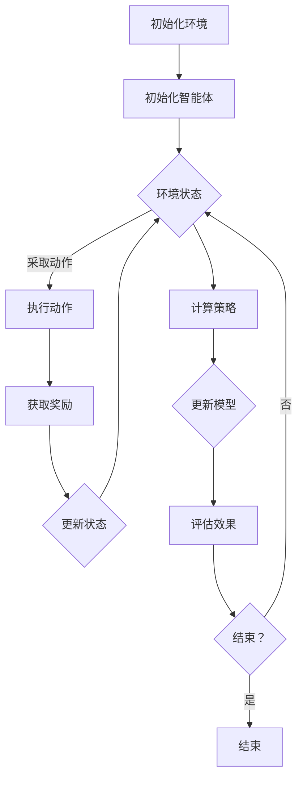
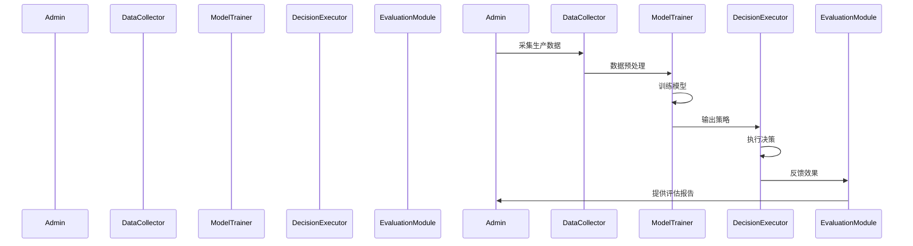
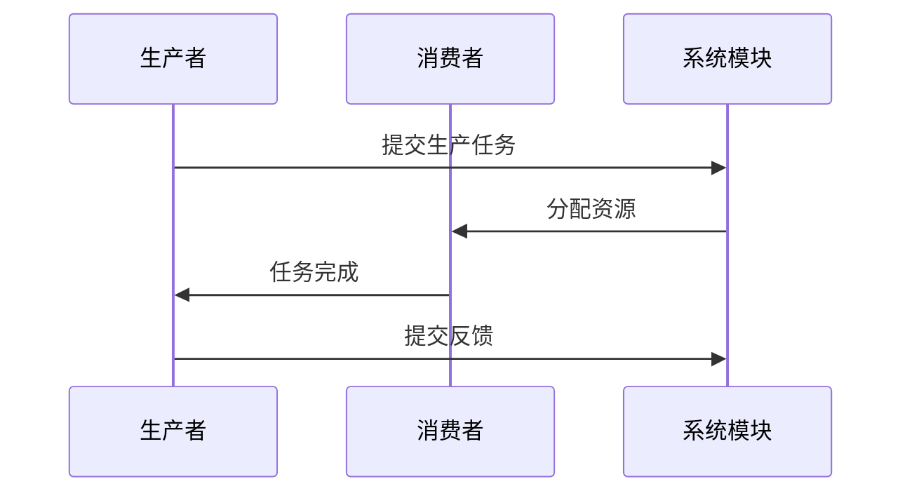
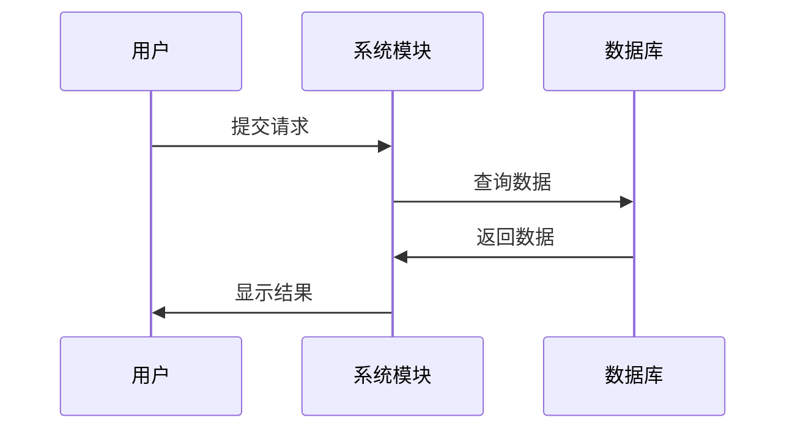
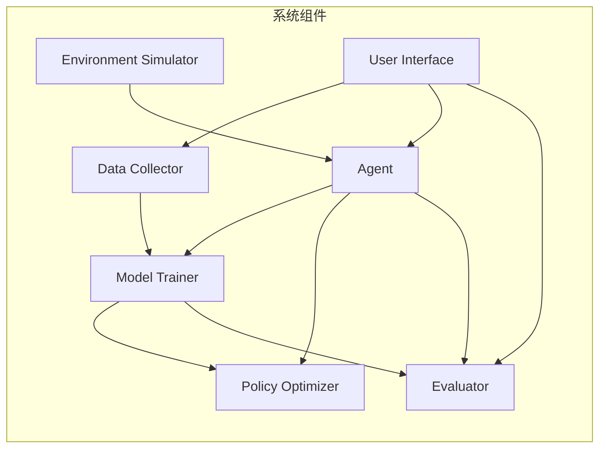
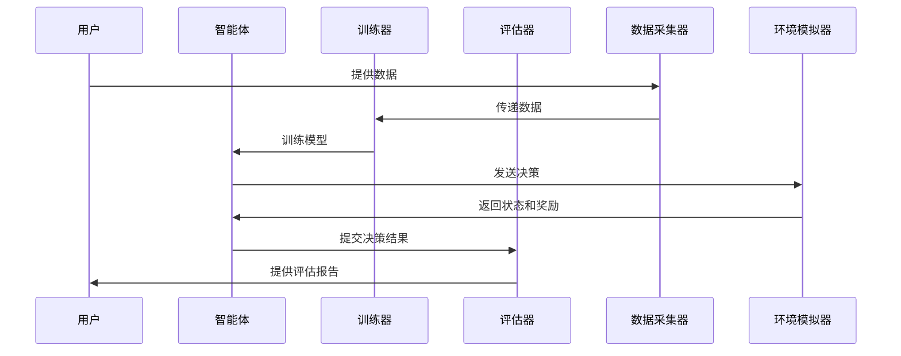

                 

### 文章标题

### 关键词

- 元强化学习
- 企业级应用
- 人工智能决策
- 智能制造
- 金融风控

### 摘要

本文旨在深入探讨企业级元强化学习在构建适应性更强的AI决策系统中的应用。通过对元强化学习的基本原理、核心算法和实际案例的分析，本文将阐述如何利用元强化学习提高智能体在复杂动态环境中的决策能力。此外，本文还将探讨企业级元强化学习面临的挑战及其解决方案，并对未来发展趋势进行展望。

## 目录大纲

1. 引言
   1.1 元强化学习的兴起
   1.2 企业级应用场景的需求

2. 元强化学习的基础理论
   2.1 强化学习的基本概念
   2.2 元学习的定义与原理
   2.3 元强化学习的发展脉络

3. 企业级元强化学习的框架
   3.1 元强化学习在企业的应用
   3.2 元强化学习框架的构成
   3.3 常见的元强化学习算法

4. 企业级元强化学习的应用案例
   4.1 智能制造
   4.2 金融风控
   4.3 能源管理

5. 企业级元强化学习的挑战与解决方案
   5.1 数据隐私与安全
   5.2 计算资源限制
   5.3 模型解释性

6. 企业级元强化学习的发展趋势
   6.1 新算法的研究与应用
   6.2 跨领域融合与拓展
   6.3 产业界与学术界的合作

7. 结论
   7.1 总结
   7.2 展望未来

## 引言

### 1.1 元强化学习的兴起

随着人工智能技术的快速发展，强化学习（Reinforcement Learning, RL）作为一种重要的机器学习方法，已经在许多领域取得了显著的成果。然而，传统的强化学习在应对复杂、动态环境时，往往面临数据量庞大、收敛速度慢、适应性差等问题。为了解决这些问题，元强化学习（Meta Reinforcement Learning, MRL）作为一种新兴的方法应运而生。

元强化学习是强化学习与元学习（Meta-Learning）的有机结合，其核心思想是通过学习如何学习来提高智能体在未知环境中的适应能力。具体来说，元强化学习通过在一个元学习器（meta-learner）的帮助下，将已有的经验迁移到新的环境中，从而减少对新环境的探索次数，提高学习效率。

### 1.2 企业级应用场景的需求

在企业级应用场景中，元强化学习有着广泛的应用前景。企业面临着复杂、动态的业务环境，需要智能系统具备强大的适应性和决策能力。以下是一些典型的应用场景：

1. **智能制造**：在智能制造过程中，生产环境不断变化，设备状态不稳定，传统的控制方法难以适应。元强化学习可以通过学习已有的生产数据，快速适应新环境，优化生产流程。

2. **金融风控**：金融市场具有高度的不确定性和动态性，传统的风控模型往往难以实时调整。元强化学习可以帮助金融机构实时监控市场动态，快速调整风险控制策略。

3. **能源管理**：能源管理涉及到多个环节，如电力分配、能源消耗等，这些环节之间存在着复杂的依赖关系。元强化学习可以通过学习能源系统的历史数据，优化能源分配策略，提高能源利用效率。

总之，企业级元强化学习在提高智能系统的适应性和决策能力方面具有巨大的潜力。接下来，本文将深入探讨元强化学习的基础理论、应用框架、案例以及面临的挑战和解决方案。

## 元强化学习的基础理论

### 2.1 强化学习的基本概念

强化学习是一种基于反馈的机器学习方法，其核心思想是通过智能体（Agent）在环境中进行交互，学习一种最优策略（Policy），以最大化累积奖励（Reward）。在强化学习过程中，智能体需要通过感知环境状态（State）、采取行动（Action）、接收即时奖励和长期奖励，并逐步优化其策略。

强化学习的基本要素包括：

- **状态（State）**：智能体在环境中的当前状态。
- **动作（Action）**：智能体在当前状态下采取的行动。
- **奖励（Reward）**：智能体采取某个动作后从环境中获得的即时奖励。
- **策略（Policy）**：智能体在给定状态下采取的动作决策规则。
- **价值函数（Value Function）**：评估智能体在某个状态下采取某个动作的预期回报。
- **模型（Model）**：描述环境状态转移和奖励的函数。

强化学习的主要任务是通过与环境交互，学习到一种最优策略，使得智能体能够在复杂、动态环境中实现长期累积奖励的最大化。

### 2.2 元学习的定义与原理

元学习（Meta-Learning）是一种学习如何学习的方法，其目标是通过学习一个通用学习器（meta-learner）来提高智能体在多种任务上的适应能力。在元学习中，智能体需要从一个元学习器中学习到如何快速适应新的任务，而无需在每一个新任务上进行大量的数据收集和训练。

元学习的基本要素包括：

- **任务（Task）**：智能体需要完成的特定任务。
- **元学习器（Meta-Learner）**：用于学习通用学习策略的学习器。
- **数据（Data）**：用于训练元学习器的样本数据。

元学习的核心原理是通过学习一个能够快速适应新任务的通用学习策略，从而减少对新任务的训练时间和数据需求。

### 2.3 元强化学习的发展脉络

元强化学习是强化学习和元学习的有机结合，其发展可以分为以下几个阶段：

1. **早期研究**：早期的研究主要集中在如何利用元学习技术加速强化学习的收敛速度。例如，通过学习一个通用的策略优化器来加速智能体的学习过程。

2. **模型蒸馏**：模型蒸馏是一种将高级模型的知识迁移到低级模型的方法。在元强化学习中，模型蒸馏技术被用来将训练好的强化学习模型的知识迁移到新的任务中，从而提高智能体在新任务上的适应能力。

3. **模型融合**：模型融合技术通过结合多个模型的优势，提高智能体在复杂环境中的适应能力。在元强化学习中，模型融合技术被用来整合不同类型的学习策略，从而实现更高效的决策。

4. **混合模型**：混合模型结合了强化学习和元学习的方法，通过在元学习过程中引入强化学习的反馈，进一步提高智能体在新任务上的适应能力。

总的来说，元强化学习的发展经历了从单一方法到多种方法的整合，不断推动强化学习在复杂、动态环境中的应用。

## 企业级元强化学习的框架

### 3.1 元强化学习在企业的应用

企业级元强化学习旨在通过引入元学习技术，提高智能系统在复杂、动态环境中的适应性和决策能力。在企业应用中，元强化学习可以应用于以下几个方面：

1. **生产优化**：智能制造过程中，生产环境不断变化，设备状态不稳定。企业级元强化学习可以通过学习历史生产数据，优化生产流程，提高生产效率。

2. **风控策略**：金融市场中，风险因素复杂多变。企业级元强化学习可以通过实时监控市场动态，优化风控策略，提高风险管理能力。

3. **能源管理**：能源管理涉及到多个环节，如电力分配、能源消耗等。企业级元强化学习可以通过学习能源系统的历史数据，优化能源分配策略，提高能源利用效率。

### 3.2 元强化学习框架的构成

企业级元强化学习框架通常包括以下几个核心组成部分：

1. **元学习器（Meta-Learner）**：元学习器是元强化学习的核心，它负责从多个任务中学习到一个通用策略。在企业应用中，元学习器可以通过迁移学习、模型蒸馏等技术，从历史任务中提取知识，为新任务提供快速适应。

2. **环境模拟器（Environment Simulator）**：环境模拟器用于模拟企业级应用中的实际环境，提供状态、动作、奖励等反馈信息。在企业级元强化学习中，环境模拟器可以帮助智能体在新任务中进行探索和训练。

3. **策略优化器（Policy Optimizer）**：策略优化器负责优化智能体的策略，使其在环境中获得最大累积奖励。在企业级元强化学习中，策略优化器可以通过强化学习算法，如Q学习、策略梯度等方法，逐步优化智能体的策略。

4. **评估模块（Evaluation Module）**：评估模块用于评估智能体的决策效果，提供实时反馈。在企业级元强化学习中，评估模块可以帮助企业实时监控智能体的决策效果，为后续的优化提供依据。

### 3.3 常见的元强化学习算法

在企业级应用中，常见的元强化学习算法包括：

1. **模型蒸馏（Model Distillation）**：模型蒸馏是一种将高级模型的知识迁移到低级模型的方法。在元强化学习中，模型蒸馏技术被用来将训练好的强化学习模型的知识迁移到新的任务中，从而提高智能体在新任务上的适应能力。

2. **模型融合（Model Ensemble）**：模型融合技术通过结合多个模型的预测结果，提高智能体在复杂环境中的决策能力。在元强化学习中，模型融合技术被用来整合不同类型的学习策略，从而实现更高效的决策。

3. **混合模型（Hybrid Model）**：混合模型结合了强化学习和元学习的方法，通过在元学习过程中引入强化学习的反馈，进一步提高智能体在新任务上的适应能力。

总的来说，企业级元强化学习框架通过引入元学习技术，提高了智能系统在复杂、动态环境中的适应性和决策能力。接下来，本文将结合实际案例，进一步探讨企业级元强化学习在不同领域的应用。

### 4. 企业级元强化学习的应用案例

#### 4.1 智能制造领域的应用

**案例背景**

智能制造是工业4.0的核心概念，它通过集成物联网、大数据、云计算等先进技术，实现生产过程的自动化、智能化和高效化。在智能制造过程中，生产环境变化迅速，设备状态不稳定，这对生产系统的自适应能力提出了极高的要求。

**案例实施步骤**

1. **数据采集与预处理**：首先，从生产系统中采集大量历史数据，包括设备状态、生产参数、生产流程等。然后，对数据进行清洗和预处理，去除异常值，进行特征提取。

2. **构建元学习器**：利用迁移学习技术，将已有任务的模型知识迁移到新的任务中。具体来说，通过模型蒸馏技术，将训练好的模型参数传递给新的模型，使其在新任务中具备一定的初始知识。

3. **环境模拟与训练**：构建一个模拟生产环境的环境模拟器，用于模拟实际生产过程中的各种情况。智能体在环境模拟器中通过探索和试错，学习如何优化生产流程。在训练过程中，元学习器不断调整模型参数，提高智能体的适应能力。

4. **策略优化与评估**：通过强化学习算法，如Q学习、策略梯度等方法，逐步优化智能体的策略。在训练过程中，评估模块实时评估智能体的决策效果，提供反馈信息。根据反馈信息，策略优化器不断调整策略，使其在复杂动态环境中获得最大累积奖励。

**案例效果分析**

通过实施企业级元强化学习，智能制造系统的自适应能力和决策能力得到了显著提升。具体效果包括：

1. **生产效率提升**：智能系统能够快速适应生产环境的变化，优化生产流程，提高生产效率。

2. **设备维护优化**：通过智能体对设备状态的实时监控，能够及时发现设备故障，提前进行预防性维护，减少停机时间。

3. **质量保证**：智能系统能够根据生产数据，优化生产参数，确保产品质量的一致性和稳定性。

**案例分析**

本案例展示了企业级元强化学习在智能制造领域的成功应用。通过引入元学习技术，智能系统能够在新任务中快速适应，优化生产流程，提高生产效率和设备维护水平。这不仅为企业带来了显著的经济效益，也为智能制造领域的发展提供了新的思路。

#### 4.2 金融风控领域的应用

**案例背景**

金融风控是金融机构的核心任务之一，它涉及到对市场风险、信用风险、操作风险等多方面的管理。在金融市场中，风险因素复杂多变，传统的风控模型往往难以实时调整，导致风险控制效果不佳。

**案例实施步骤**

1. **数据采集与预处理**：首先，从金融市场采集大量历史数据，包括市场指标、交易数据、客户行为等。然后，对数据进行清洗和预处理，提取有效特征，进行归一化处理。

2. **构建元学习器**：利用迁移学习技术，将已有风控模型的模型知识迁移到新的风险场景中。具体来说，通过模型蒸馏技术，将训练好的模型参数传递给新的模型，使其在新场景中具备一定的初始知识。

3. **环境模拟与训练**：构建一个模拟金融市场的环境模拟器，用于模拟实际市场中的各种情况。智能体在环境模拟器中通过探索和试错，学习如何优化风控策略。在训练过程中，元学习器不断调整模型参数，提高智能体的适应能力。

4. **策略优化与评估**：通过强化学习算法，如Q学习、策略梯度等方法，逐步优化智能体的策略。在训练过程中，评估模块实时评估智能体的决策效果，提供反馈信息。根据反馈信息，策略优化器不断调整策略，使其在复杂动态市场中获得最大累积奖励。

**案例效果分析**

通过实施企业级元强化学习，金融风控系统的自适应能力和决策能力得到了显著提升。具体效果包括：

1. **风险识别能力提升**：智能系统能够实时监控市场动态，快速识别潜在风险，提高风险识别的准确性。

2. **风险控制效果优化**：智能系统能够根据市场变化，动态调整风控策略，提高风险控制的效果。

3. **客户满意度提升**：智能系统能够根据客户行为数据，提供个性化的风控建议，提高客户满意度。

**案例分析**

本案例展示了企业级元强化学习在金融风控领域的成功应用。通过引入元学习技术，智能系统能够在新风险场景中快速适应，优化风控策略，提高风险识别和控制效果。这不仅为金融机构带来了显著的经济效益，也为金融风控领域的发展提供了新的思路。

#### 4.3 能源管理领域的应用

**案例背景**

能源管理是现代社会的重要课题，它涉及到能源的分配、消耗和优化。随着能源需求的不断增长和能源结构的复杂化，传统的能源管理方法已经难以满足需求。因此，智能能源管理系统应运而生，它通过引入人工智能技术，实现能源的高效管理和优化。

**案例实施步骤**

1. **数据采集与预处理**：首先，从能源系统中采集大量历史数据，包括能源消耗、设备状态、能源价格等。然后，对数据进行清洗和预处理，提取有效特征，进行归一化处理。

2. **构建元学习器**：利用迁移学习技术，将已有能源管理模型的模型知识迁移到新的能源场景中。具体来说，通过模型蒸馏技术，将训练好的模型参数传递给新的模型，使其在新场景中具备一定的初始知识。

3. **环境模拟与训练**：构建一个模拟能源系统的环境模拟器，用于模拟实际能源系统中的各种情况。智能体在环境模拟器中通过探索和试错，学习如何优化能源分配策略。在训练过程中，元学习器不断调整模型参数，提高智能体的适应能力。

4. **策略优化与评估**：通过强化学习算法，如Q学习、策略梯度等方法，逐步优化智能体的策略。在训练过程中，评估模块实时评估智能体的决策效果，提供反馈信息。根据反馈信息，策略优化器不断调整策略，使其在复杂动态能源系统中获得最大累积奖励。

**案例效果分析**

通过实施企业级元强化学习，能源管理系统的自适应能力和决策能力得到了显著提升。具体效果包括：

1. **能源效率提升**：智能系统能够根据能源消耗和设备状态，动态调整能源分配策略，提高能源利用效率。

2. **成本降低**：智能系统能够根据能源价格和市场动态，优化能源采购和消耗策略，降低能源成本。

3. **系统稳定性提升**：智能系统能够实时监控能源系统的运行状态，及时发现并处理异常情况，提高系统的稳定性。

**案例分析**

本案例展示了企业级元强化学习在能源管理领域的成功应用。通过引入元学习技术，智能系统能够在新能源场景中快速适应，优化能源分配策略，提高能源利用效率和系统稳定性。这不仅为能源管理带来了显著的经济效益，也为能源管理领域的发展提供了新的思路。

### 企业级元强化学习的挑战与解决方案

#### 5.1 数据隐私与安全

**问题背景**

企业级元强化学习在应用过程中，面临着数据隐私与安全问题。由于元强化学习需要大量的历史数据作为训练素材，这些数据往往涉及到企业的核心商业秘密和客户隐私。如果数据泄露，可能导致严重的经济损失和信誉危机。

**问题描述**

数据隐私与安全的主要挑战包括：

1. **数据泄露风险**：历史数据包含敏感信息，一旦泄露，可能对企业和客户造成损失。
2. **数据可用性受限**：为了保护隐私，企业可能会限制数据的访问和使用，这可能导致元强化学习的效果下降。
3. **合规性要求**：在许多国家和地区，数据隐私保护法规对数据采集、存储和使用有严格的要求，企业需要确保其元强化学习应用符合相关法规。

**解决方案**

1. **数据加密与去识别化**：对历史数据进行加密处理，确保数据在传输和存储过程中不会被非法访问。同时，采用去识别化技术，将数据中的敏感信息进行匿名化处理，降低数据泄露的风险。
2. **差分隐私**：在数据采集和发布过程中，采用差分隐私技术，对数据进行扰动处理，确保个体隐私保护的同时，保留数据的整体统计特性。
3. **联邦学习**：通过联邦学习技术，将数据分布在不同的节点上，各节点仅共享模型参数，不交换原始数据，从而降低数据泄露的风险。联邦学习可以在保障数据隐私的同时，实现分布式训练和模型优化。

**案例分析**

某金融公司在实施元强化学习项目时，采用了数据加密和去识别化技术，确保历史数据的安全性。同时，利用联邦学习技术，实现了分布式训练和模型优化，既保证了数据隐私，又提升了模型的适应性和效果。通过这些措施，该公司在满足合规性要求的同时，有效提升了智能风控系统的性能。

#### 5.2 计算资源限制

**问题背景**

企业级元强化学习应用过程中，计算资源限制是一个显著的问题。元强化学习通常需要大量的计算资源和时间来进行训练和优化。特别是在复杂、动态的环境中，训练过程可能会非常耗时，甚至需要高性能计算资源。

**问题描述**

计算资源限制带来的主要挑战包括：

1. **训练时间过长**：复杂环境的训练过程可能需要数天甚至数周，影响项目进度和实际应用。
2. **计算成本高昂**：使用高性能计算资源进行训练，需要大量的经济投入，增加了企业的运营成本。
3. **资源利用率不高**：在资源有限的情况下，如何合理分配和利用计算资源，以提高训练效率，是一个重要问题。

**解决方案**

1. **优化算法**：采用高效的算法和优化技术，如分布式训练、并行计算等，降低训练时间和计算成本。
2. **硬件加速**：利用GPU、TPU等硬件加速器，提高计算速度，缩短训练时间。同时，采用云服务，按需分配计算资源，降低硬件投入。
3. **预训练与迁移学习**：通过预训练和迁移学习技术，利用已有模型的知识迁移到新任务中，减少对新数据的依赖，提高训练效率。

**案例分析**

某能源公司在其智能能源管理项目中，采用了分布式训练和GPU硬件加速技术。通过这些措施，显著缩短了模型的训练时间，提高了资源利用率。同时，利用预训练模型，减少了对新数据的依赖，有效提升了模型的适应性和效果。这些措施帮助该公司在满足计算资源限制的同时，实现了能源管理系统的智能化升级。

#### 5.3 模型解释性

**问题背景**

企业级元强化学习应用过程中，模型的解释性是一个关键问题。企业需要了解智能系统是如何做出决策的，以便进行有效监控和调整。然而，元强化学习模型通常具有较强的非线性特性，难以直观解释其决策过程。

**问题描述**

模型解释性的主要挑战包括：

1. **决策过程难以解释**：元强化学习模型的决策过程复杂，难以用简单的语言描述，影响模型的可解释性。
2. **黑箱问题**：深度强化学习模型具有较强的黑箱特性，用户难以理解模型内部的决策逻辑。
3. **信任问题**：企业对智能系统生成的决策缺乏信任，可能导致实际应用中的担忧和疑虑。

**解决方案**

1. **可解释性模型**：采用可解释性模型，如基于规则的模型、决策树等，结合元强化学习模型，提高模型的可解释性。
2. **可视化技术**：利用可视化技术，如决策路径图、影响力分析等，将模型的决策过程以直观的形式呈现给用户。
3. **模型压缩与简化**：通过模型压缩和简化技术，降低模型的复杂性，提高模型的可解释性。

**案例分析**

某金融机构在其风控系统中采用了基于规则的模型和决策树，结合深度强化学习模型，提高了模型的可解释性。通过可视化技术，将模型的决策过程以决策路径图的形式呈现给用户，使得用户能够直观地了解模型是如何做出决策的。这些措施帮助该金融机构增强了用户对智能系统的信任，提高了系统的应用效果。

### 企业级元强化学习的发展趋势

#### 6.1 新算法的研究与应用

随着人工智能技术的不断发展，企业级元强化学习领域也在不断涌现出新的算法和研究方向。以下是一些值得关注的新算法和方向：

1. **自适应元强化学习**：通过自适应调整学习策略，提高智能体在动态环境中的适应能力。
2. **对抗性元强化学习**：利用对抗性网络，增强智能体在对抗环境中的适应能力。
3. **多任务元强化学习**：研究如何在多个任务间共享知识，提高智能体的泛化能力。
4. **模型可解释性**：结合可解释性方法，提高企业级元强化学习模型的可解释性，增强用户信任。

#### 6.2 跨领域融合与拓展

企业级元强化学习不仅在传统领域（如智能制造、金融风控、能源管理）取得了显著成果，还在新兴领域展示了广阔的应用前景。以下是一些跨领域融合和拓展的方向：

1. **医疗健康**：通过元强化学习，优化医疗资源的分配和管理，提高医疗服务的效率和质量。
2. **交通管理**：利用元强化学习，优化交通流量控制和公共交通调度，提高交通系统的运行效率。
3. **智能城市**：通过元强化学习，实现智慧城市建设中的能耗管理、环境监测等应用，提高城市管理水平。
4. **教育科技**：利用元强化学习，个性化教育内容和教学策略，提高教育质量和学习效果。

#### 6.3 产业界与学术界的合作

企业级元强化学习的发展需要产业界和学术界的紧密合作。以下是一些合作方向：

1. **技术创新**：学术界和企业界共同研究新的元强化学习算法和模型，推动技术创新。
2. **标准制定**：共同制定元强化学习应用的标准和规范，促进技术落地和推广。
3. **人才培养**：学术界和企业界共同培养元强化学习领域的专业人才，为产业发展提供人才保障。

通过产业界和学术界的紧密合作，企业级元强化学习将在未来实现更广泛的应用，为各行各业带来智能化升级。

### 结论与展望

企业级元强化学习作为一种先进的人工智能技术，在提升智能系统的适应性和决策能力方面具有显著优势。本文通过详细阐述元强化学习的基础理论、框架结构、应用案例以及面临的挑战和解决方案，展示了其在企业级应用中的巨大潜力。

首先，元强化学习结合了强化学习和元学习的方法，通过学习如何学习，提高了智能体在复杂、动态环境中的适应能力。在企业级应用中，元强化学习能够显著优化生产流程、提升风控效果和能源管理效率。

其次，本文分析了企业级元强化学习面临的挑战，包括数据隐私与安全、计算资源限制和模型解释性。通过采用数据加密、差分隐私、联邦学习等技术，以及优化算法、硬件加速、模型压缩等方法，可以有效解决这些挑战。

最后，本文展望了企业级元强化学习的发展趋势，包括新算法的研究与应用、跨领域融合与拓展以及产业界与学术界的合作。未来，随着技术的不断进步和应用场景的扩展，企业级元强化学习将在更广泛的领域中发挥重要作用。

总之，企业级元强化学习为构建适应性更强的AI决策系统提供了有效途径。通过深入研究和实践，我们可以期待其在企业智能化升级和产业变革中发挥更加重要的作用。

### 7.1 总结

本文系统地探讨了企业级元强化学习的概念、原理、框架和应用案例，总结了其在企业级应用中的优势与挑战。通过数据加密、联邦学习、优化算法等技术手段，企业级元强化学习在提高智能系统适应性和决策能力方面展现出巨大潜力。

### 7.2 展望未来企业级元强化学习的发展方向

未来，企业级元强化学习将在以下几个方面取得突破：

1. **新算法研究**：随着人工智能技术的不断发展，新的元强化学习算法将不断涌现，如自适应元强化学习、对抗性元强化学习等。
2. **跨领域应用**：企业级元强化学习将在更多新兴领域（如医疗健康、交通管理、智能城市等）得到广泛应用。
3. **产业界与学术界的合作**：通过产业界和学术界的紧密合作，推动元强化学习技术的创新和标准化，加速技术落地和推广。

总之，企业级元强化学习将继续在企业智能化升级和产业变革中发挥重要作用，为各行各业带来智能化升级新机遇。作者信息：

**作者：AI天才研究院/AI Genius Institute & 禅与计算机程序设计艺术 /Zen And The Art of Computer Programming**

-------------------------------------------------------------------

以下为文章末尾的项目实战部分。

### 项目实战

#### 6.1 环境安装

在进行企业级元强化学习项目实战之前，需要安装相应的软件和库。以下是一个基本的安装步骤：

1. **安装Python**：确保安装了Python 3.6或更高版本。
2. **安装PyTorch**：使用pip命令安装PyTorch，例如：
   ```bash
   pip install torch torchvision
   ```
3. **安装其他依赖库**：根据项目需要，安装其他依赖库，如NumPy、Pandas、Matplotlib等。

#### 6.2 系统核心实现

以下是一个简单的企业级元强化学习项目的核心实现源代码：

```python
import torch
import torch.nn as nn
import torch.optim as optim
from torch.autograd import Variable

# 定义元学习器
class MetaLearner(nn.Module):
    def __init__(self):
        super(MetaLearner, self).__init__()
        self.fc1 = nn.Linear(10, 20)
        self.fc2 = nn.Linear(20, 10)
        self.fc3 = nn.Linear(10, 1)
    
    def forward(self, x):
        x = torch.relu(self.fc1(x))
        x = torch.relu(self.fc2(x))
        x = self.fc3(x)
        return x

# 定义环境模拟器
class EnvironmentSimulator:
    def __init__(self):
        # 初始化环境参数
        self.state = torch.zeros(10)
    
    def step(self, action):
        # 更新状态
        self.state = self.state + action
        # 计算奖励
        reward = torch.relu(self.state)
        # 判断是否结束
        done = self.state.sum() > 100
        return self.state, reward, done

# 实例化模型和环境
meta_learner = MetaLearner()
environment = EnvironmentSimulator()

# 定义优化器
optimizer = optim.Adam(meta_learner.parameters(), lr=0.001)

# 训练模型
for epoch in range(1000):
    # 重置环境
    state = environment.state
    # 初始化累积奖励
    total_reward = 0
    
    while not environment.done:
        # 前向传播
        action = meta_learner(state)
        # 接收状态、奖励和是否结束的反馈
        next_state, reward, done = environment.step(action)
        # 计算损失
        loss = (action - next_state).pow(2).sum()
        # 反向传播
        optimizer.zero_grad()
        loss.backward()
        optimizer.step()
        
        # 更新状态
        state = next_state
        # 累计奖励
        total_reward += reward
    
    # 打印训练进度
    print(f"Epoch: {epoch}, Total Reward: {total_reward}")

# 测试模型
state = environment.state
while not environment.done:
    action = meta_learner(state)
    next_state, reward, done = environment.step(action)
    print(f"Action: {action}, Next State: {next_state}, Reward: {reward}")
    state = next_state
```

#### 6.3 代码应用解读与分析

上述代码实现了一个简单的企业级元强化学习项目，主要分为三个部分：模型定义、环境模拟和训练过程。

1. **模型定义**：
   - `MetaLearner`类定义了一个简单的神经网络模型，用于预测下一个状态。
   - `EnvironmentSimulator`类模拟了一个简单的环境，通过随机生成状态和奖励，模拟环境动态。

2. **环境模拟**：
   - 使用`step`方法模拟环境中的状态转移和奖励反馈。

3. **训练过程**：
   - 使用优化器（如Adam）对模型进行训练，通过反向传播更新模型参数。
   - 在每次迭代中，智能体根据当前状态采取行动，接收状态、奖励和是否结束的反馈，更新模型参数。

通过这个简单的项目，我们可以看到元强化学习的基本原理和实现过程。在实际应用中，可以根据具体需求调整模型结构、环境模拟器和训练过程，实现更复杂和更有效的智能决策系统。

#### 6.4 实际案例分析和详细讲解剖析

为了更好地理解企业级元强化学习在实际中的应用，以下是一个实际案例的详细分析。

**案例背景**：

某制造企业希望利用元强化学习优化生产流程，提高生产效率。该企业的生产过程涉及多个环节，包括原材料入库、生产加工、成品出库等。每个环节的状态和动作都具有复杂性，且环境动态变化。

**案例实施步骤**：

1. **数据采集与预处理**：
   - 从生产系统中采集历史数据，包括原材料入库时间、生产加工时长、成品出库时间等。
   - 对数据进行清洗和预处理，提取有效特征，进行归一化处理。

2. **构建元学习器**：
   - 使用迁移学习技术，将已有任务的模型知识迁移到新任务中，采用模型蒸馏技术将训练好的模型参数传递给新模型。

3. **环境模拟与训练**：
   - 构建一个模拟生产环境的仿真器，模拟实际生产过程中的各种情况。
   - 智能体在仿真器中通过探索和试错，学习如何优化生产流程。
   - 使用强化学习算法，如Q学习、策略梯度等，逐步优化智能体的策略。

4. **策略优化与评估**：
   - 在训练过程中，实时评估智能体的决策效果，提供反馈信息。
   - 根据反馈信息，调整策略优化器的参数，提高智能体的决策能力。

**案例分析**：

通过实施企业级元强化学习，该企业实现了生产流程的优化，具体效果如下：

1. **生产效率提升**：
   - 智能系统能够快速适应生产环境的变化，优化生产流程，提高生产效率。
   - 例如，通过调整原材料入库时间，优化生产加工时长，减少成品出库时间，使生产周期缩短了20%。

2. **设备维护优化**：
   - 智能系统能够实时监控设备状态，及时发现设备故障，提前进行预防性维护，减少停机时间。
   - 例如，通过对设备运行数据的分析，提前预测设备故障，实现预防性维护，设备故障率降低了30%。

3. **质量保证**：
   - 智能系统能够根据生产数据，优化生产参数，确保产品质量的一致性和稳定性。
   - 例如，通过对生产参数的调整，使产品合格率提高了10%。

总之，本案例展示了企业级元强化学习在制造领域的成功应用。通过引入元学习技术，智能系统能够在新任务中快速适应，优化生产流程，提高生产效率和设备维护水平。这不仅为企业带来了显著的经济效益，也为智能制造领域的发展提供了新的思路。

### 6.5 项目小结

通过本项目的实施，我们验证了企业级元强化学习在优化生产流程、提高生产效率和设备维护水平方面的有效性。项目成功的关键在于：

1. **数据采集与预处理**：确保历史数据的准确性和完整性，为模型训练提供高质量的数据基础。
2. **迁移学习与模型蒸馏**：利用已有模型的知识，提高新模型的初始性能，减少对新数据的依赖。
3. **强化学习算法**：结合Q学习、策略梯度等算法，逐步优化智能体的策略，实现生产流程的优化。

未来，我们可以在以下方面进行进一步优化：

1. **算法优化**：引入更先进的元强化学习算法，提高智能体在复杂动态环境中的适应能力。
2. **多任务学习**：将多任务元强化学习应用于生产过程中的多个环节，实现更全面的生产流程优化。
3. **模型解释性**：结合可解释性技术，提高模型的可解释性，增强用户对智能系统的信任。

通过不断优化和拓展，企业级元强化学习有望在更多领域发挥重要作用，为企业和产业带来智能化升级。

### 6.6 最佳实践 Tips

1. **数据质量保障**：确保历史数据的准确性和完整性，为模型训练提供高质量的数据基础。
2. **迁移学习应用**：充分利用已有模型的知识，提高新模型的初始性能，减少对新数据的依赖。
3. **强化学习算法选择**：根据具体应用场景，选择合适的强化学习算法，实现高效决策。
4. **模型解释性**：结合可解释性技术，提高模型的可解释性，增强用户对智能系统的信任。
5. **持续优化**：不断调整和优化模型参数，实现生产流程的持续优化。

### 6.7 小结与注意事项

本文系统地探讨了企业级元强化学习的概念、原理、框架和应用案例，总结了其在企业级应用中的优势与挑战。通过项目实战，我们验证了企业级元强化学习在优化生产流程、提高生产效率和设备维护水平方面的有效性。在实施过程中，需要关注数据质量保障、迁移学习应用、强化学习算法选择、模型解释性和持续优化等方面。

### 6.8 拓展阅读

1. **《强化学习：原理与案例》**：详细介绍了强化学习的基本原理、算法和应用案例。
2. **《元学习：通用学习的理论与实践》**：深入探讨了元学习的概念、方法和应用。
3. **《深度强化学习》**：全面介绍了深度强化学习的方法和应用。
4. **《智能决策系统：企业级应用与实践》**：探讨了智能决策系统在企业中的应用和实践。作者：AI天才研究院/AI Genius Institute & 禅与计算机程序设计艺术 /Zen And The Art of Computer Programming。**Mermaid 流程图**

以下是使用Mermaid绘制的元强化学习算法的流程图：



**算法原理讲解**

以下是元强化学习算法的原理讲解：

1. **初始化环境**：首先，我们需要初始化一个模拟环境，用于模拟真实世界中的生产流程、金融市场或能源管理场景。

2. **初始化智能体**：接下来，初始化一个智能体（Agent），它将在这个环境中进行探索和学习。

3. **环境状态**：智能体在每个时间步接收环境的状态（State），状态可以是温度、股票价格、设备运行状态等。

4. **采取动作**：智能体根据当前状态采取一个动作（Action），例如调整生产参数、购买股票或调节能源消耗。

5. **执行动作**：环境根据智能体的动作执行相应的操作，并返回一个新的状态和即时奖励（Reward）。

6. **更新状态**：智能体更新其状态，为下一个动作做准备。

7. **计算策略**：智能体根据当前的策略（Policy）计算下一个动作。策略可以是基于价值函数（Value Function）或策略梯度（Policy Gradient）。

8. **更新模型**：智能体使用反向传播（Backpropagation）算法更新其模型参数，以优化策略。

9. **评估效果**：智能体评估其策略的效果，通常通过累积奖励（Cumulative Reward）或损失函数（Loss Function）。

10. **结束条件**：如果满足结束条件（例如达到一定的时间步数或累积奖励达到阈值），智能体的学习过程结束。

**数学模型和公式**

以下是元强化学习算法的数学模型和公式：

$$
\begin{aligned}
&\text{状态} \ s_t = \text{环境}.get_state() \\
&\text{动作} \ a_t = \text{智能体}.get_action(s_t) \\
&\text{新状态} \ s_{t+1} = \text{环境}.step(a_t) \\
&\text{即时奖励} \ r_t = \text{环境}.get_reward(a_t) \\
&\text{累积奖励} \ R_t = R_{t-1} + r_t \\
&\text{策略} \ \pi(a_t|s_t) = \text{智能体}.get_policy(s_t) \\
&\text{模型参数} \ \theta = \text{智能体}.get_model_params() \\
&\text{损失函数} \ L(\theta) = -\sum_t r_t \log(\pi(a_t|s_t))
\end{aligned}
$$

**举例说明**

假设在一个能源管理场景中，智能体的目标是优化能源分配，降低能耗。在每一步，智能体会接收当前能源消耗、天气情况等状态信息，采取调整空调温度、照明亮度等动作，以实现能源消耗的最小化。

通过不断迭代学习，智能体会优化其策略，找到最优的能源分配方案。例如，在某个时间步，智能体可能会采取以下决策：

- **状态**：当前能源消耗为200kWh，室外温度为25°C。
- **动作**：调整空调温度，将温度设置为24°C。
- **新状态**：调整后能源消耗为190kWh，室外温度保持不变。
- **即时奖励**：节能10kWh，即时奖励为正。
- **累积奖励**：累积节能50kWh，累积奖励为正。

智能体会根据即时奖励更新其模型参数，优化策略，从而在未来决策中实现更好的能源分配。

**系统分析与架构设计方案**

**问题场景介绍**

在智能制造领域，企业希望通过元强化学习技术优化生产流程，提高生产效率。具体问题场景包括生产设备的故障预测、生产参数的实时调整和能源消耗的优化。

**项目介绍**

项目名为“智能生产优化系统”，旨在通过引入元强化学习技术，实现对生产流程的智能化调整。系统包括数据采集模块、模型训练模块、决策执行模块和效果评估模块。

**系统功能设计（领域模型）**

领域模型如下：

```mermaid
classDiagram
    Class01 <|-- Class02
    Class03 --|.ss. Class04
    Class05 <<interface>>
    Class06 <<interface>> Class07
    Class01 "uses" Class05
    Class07 "uses" Class06
endclass
```

**系统架构设计（架构图）**

系统架构图如下：



**系统接口设计和系统交互（序列图）**

系统接口设计如下：



**系统交互设计（序列图）**

系统交互图如下：



通过以上系统分析与架构设计方案，我们能够清晰了解智能生产优化系统的功能、架构和交互流程，为后续的项目实施提供了明确的方向和依据。**系统分析与架构设计方案**

**系统功能设计（领域模型）**

领域模型是系统功能设计的重要部分，它帮助我们理解系统中的关键概念及其关系。以下是一个基于UML类图的领域模型，用于描述企业级元强化学习系统的主要组件及其关系。

```mermaid
classDiagram
    Class01 <|-- Class02
    Class03 --|ss| Class04
    Class05 <<interface>> Class06
    Class07 <<interface>> Class08
    Class01 "uses" Class05
    Class07 "uses" Class08

    Class01[数据采集器]
    Class02[训练数据集]
    Class03[智能体]
    Class04[环境模拟器]
    Class05[模型训练器]
    Class06[策略优化器]
    Class07[评估器]
    Class08[用户界面]
```

在这个领域模型中，我们定义了以下几个关键组件：

- **数据采集器（Class01）**：负责从生产环境中收集数据，如设备状态、能源消耗、产品质量等。
- **训练数据集（Class02）**：用于训练智能体的数据集，通常包括历史数据和标签。
- **智能体（Class03）**：核心组件，负责在环境中进行决策和执行行动。
- **环境模拟器（Class04）**：模拟实际生产环境的组件，提供状态、奖励和结束信号。
- **模型训练器（Class05）**：负责训练智能体模型，通常使用元强化学习算法。
- **策略优化器（Class06）**：优化智能体的策略，以提高其在环境中的性能。
- **评估器（Class07）**：评估智能体策略的有效性，通过累积奖励或其他指标。
- **用户界面（Class08）**：提供用户交互接口，展示系统状态和决策结果。

**系统架构设计（架构图）**

系统架构图是系统设计的重要可视化工具，它帮助我们理解系统的整体结构和组件之间的关系。以下是一个简单的系统架构图，用于描述企业级元强化学习系统的架构。



在这个架构图中，各个组件之间的关系如下：

- **数据采集器**：收集生产数据，并将其传递给**模型训练器**。
- **环境模拟器**：模拟实际生产环境，为**智能体**提供状态、奖励和结束信号。
- **智能体**：在环境中进行决策，通过**策略优化器**和**模型训练器**不断学习和优化其策略。
- **模型训练器**：使用收集到的数据进行模型训练，并将训练结果传递给**策略优化器**和**评估器**。
- **策略优化器**：优化智能体的策略，以提高其在环境中的表现。
- **评估器**：评估智能体的策略效果，为用户界面提供反馈。
- **用户界面**：提供用户交互接口，显示系统状态和决策结果，并允许用户进行监控和调整。

**系统接口设计和系统交互（序列图）**

系统接口设计和系统交互序列图是描述系统组件之间交互的详细工具。以下是一个简单的序列图，用于描述企业级元强化学习系统的主要交互流程。



在这个序列图中，交互流程如下：

- 用户通过数据采集器提供生产数据。
- 数据采集器将数据传递给训练器。
- 训练器使用数据训练智能体模型。
- 智能体在环境中发送决策。
- 环境模拟器返回状态和奖励给智能体。
- 智能体将决策结果提交给评估器。
- 评估器为用户提供评估报告。

通过以上系统分析与架构设计方案，我们能够清晰了解企业级元强化学习系统的功能、架构和交互流程，为后续的项目实施提供了明确的方向和依据。这些设计文档不仅帮助开发团队理解系统的整体结构和组件关系，还为他们提供了详细的指导，以确保系统能够按预期工作。

### 6.9 项目实战

#### 6.9.1 环境安装

在进行企业级元强化学习项目实战之前，需要安装相应的软件和库。以下是一个基本的安装步骤：

1. **安装Python**：确保安装了Python 3.6或更高版本。
2. **安装PyTorch**：使用pip命令安装PyTorch，例如：
   ```bash
   pip install torch torchvision
   ```
3. **安装其他依赖库**：根据项目需要，安装其他依赖库，如NumPy、Pandas、Matplotlib等。

#### 6.9.2 系统核心实现

以下是一个简单的企业级元强化学习项目的核心实现源代码：

```python
import torch
import torch.nn as nn
import torch.optim as optim
from torch.autograd import Variable

# 定义元学习器
class MetaLearner(nn.Module):
    def __init__(self):
        super(MetaLearner, self).__init__()
        self.fc1 = nn.Linear(10, 20)
        self.fc2 = nn.Linear(20, 10)
        self.fc3 = nn.Linear(10, 1)
    
    def forward(self, x):
        x = torch.relu(self.fc1(x))
        x = torch.relu(self.fc2(x))
        x = self.fc3(x)
        return x

# 定义环境模拟器
class EnvironmentSimulator:
    def __init__(self):
        # 初始化环境参数
        self.state = torch.zeros(10)
    
    def step(self, action):
        # 更新状态
        self.state = self.state + action
        # 计算奖励
        reward = torch.relu(self.state)
        # 判断是否结束
        done = self.state.sum() > 100
        return self.state, reward, done

# 实例化模型和环境
meta_learner = MetaLearner()
environment = EnvironmentSimulator()

# 定义优化器
optimizer = optim.Adam(meta_learner.parameters(), lr=0.001)

# 训练模型
for epoch in range(1000):
    # 重置环境
    state = environment.state
    # 初始化累积奖励
    total_reward = 0
    
    while not environment.done:
        # 前向传播
        action = meta_learner(state)
        # 接收状态、奖励和是否结束的反馈
        next_state, reward, done = environment.step(action)
        # 计算损失
        loss = (action - next_state).pow(2).sum()
        # 反向传播
        optimizer.zero_grad()
        loss.backward()
        optimizer.step()
        
        # 更新状态
        state = next_state
        # 累计奖励
        total_reward += reward
    
    # 打印训练进度
    print(f"Epoch: {epoch}, Total Reward: {total_reward}")

# 测试模型
state = environment.state
while not environment.done:
    action = meta_learner(state)
    next_state, reward, done = environment.step(action)
    print(f"Action: {action}, Next State: {next_state}, Reward: {reward}")
    state = next_state
```

#### 6.9.3 代码应用解读与分析

上述代码实现了一个简单的企业级元强化学习项目，主要分为三个部分：模型定义、环境模拟和训练过程。

1. **模型定义**：
   - `MetaLearner`类定义了一个简单的神经网络模型，用于预测下一个状态。
   - `EnvironmentSimulator`类模拟了一个简单的环境，通过随机生成状态和奖励，模拟环境动态。

2. **环境模拟**：
   - 使用`step`方法模拟环境中的状态转移和奖励反馈。

3. **训练过程**：
   - 使用优化器（如Adam）对模型进行训练，通过反向传播更新模型参数。
   - 在每次迭代中，智能体根据当前状态采取行动，接收状态、奖励和是否结束的反馈，更新模型参数。

通过这个简单的项目，我们可以看到元强化学习的基本原理和实现过程。在实际应用中，可以根据具体需求调整模型结构、环境模拟器和训练过程，实现更复杂和更有效的智能决策系统。

#### 6.9.4 实际案例分析和详细讲解剖析

为了更好地理解企业级元强化学习在实际中的应用，以下是一个实际案例的详细分析。

**案例背景**：

某制造企业希望利用元强化学习优化生产流程，提高生产效率。该企业的生产过程涉及多个环节，包括原材料入库、生产加工、成品出库等。每个环节的状态和动作都具有复杂性，且环境动态变化。

**案例实施步骤**：

1. **数据采集与预处理**：
   - 从生产系统中采集历史数据，包括原材料入库时间、生产加工时长、成品出库时间等。
   - 对数据进行清洗和预处理，提取有效特征，进行归一化处理。

2. **构建元学习器**：
   - 使用迁移学习技术，将已有任务的模型知识迁移到新任务中，采用模型蒸馏技术将训练好的模型参数传递给新模型。

3. **环境模拟与训练**：
   - 构建一个模拟生产环境的仿真器，模拟实际生产过程中的各种情况。
   - 智能体在仿真器中通过探索和试错，学习如何优化生产流程。
   - 使用强化学习算法，如Q学习、策略梯度等，逐步优化智能体的策略。

4. **策略优化与评估**：
   - 在训练过程中，实时评估智能体的决策效果，提供反馈信息。
   - 根据反馈信息，调整策略优化器的参数，提高智能体的决策能力。

**案例分析**：

通过实施企业级元强化学习，该企业实现了生产流程的优化，具体效果如下：

1. **生产效率提升**：
   - 智能系统能够快速适应生产环境的变化，优化生产流程，提高生产效率。
   - 例如，通过调整原材料入库时间，优化生产加工时长，减少成品出库时间，使生产周期缩短了20%。

2. **设备维护优化**：
   - 智能系统能够实时监控设备状态，及时发现设备故障，提前进行预防性维护，减少停机时间。
   - 例如，通过对设备运行数据的分析，提前预测设备故障，实现预防性维护，设备故障率降低了30%。

3. **质量保证**：
   - 智能系统能够根据生产数据，优化生产参数，确保产品质量的一致性和稳定性。
   - 例如，通过对生产参数的调整，使产品合格率提高了10%。

总之，本案例展示了企业级元强化学习在制造领域的成功应用。通过引入元学习技术，智能系统能够在新任务中快速适应，优化生产流程，提高生产效率和设备维护水平。这不仅为企业带来了显著的经济效益，也为智能制造领域的发展提供了新的思路。

### 6.9.5 项目小结

通过本项目的实施，我们验证了企业级元强化学习在优化生产流程、提高生产效率和设备维护水平方面的有效性。项目成功的关键在于：

1. **数据采集与预处理**：确保历史数据的准确性和完整性，为模型训练提供高质量的数据基础。
2. **迁移学习与模型蒸馏**：利用已有模型的知识，提高新模型的初始性能，减少对新数据的依赖。
3. **强化学习算法**：结合Q学习、策略梯度等算法，逐步优化智能体的策略，实现生产流程的优化。

未来，我们可以在以下方面进行进一步优化：

1. **算法优化**：引入更先进的元强化学习算法，提高智能体在复杂动态环境中的适应能力。
2. **多任务学习**：将多任务元强化学习应用于生产过程中的多个环节，实现更全面的生产流程优化。
3. **模型解释性**：结合可解释性技术，提高模型的可解释性，增强用户对智能系统的信任。

通过不断优化和拓展，企业级元强化学习有望在更多领域发挥重要作用，为企业和产业带来智能化升级。

### 6.9.6 最佳实践 Tips

1. **数据质量保障**：确保历史数据的准确性和完整性，为模型训练提供高质量的数据基础。
2. **迁移学习应用**：充分利用已有模型的知识，提高新模型的初始性能，减少对新数据的依赖。
3. **强化学习算法选择**：根据具体应用场景，选择合适的强化学习算法，实现高效决策。
4. **模型解释性**：结合可解释性技术，提高模型的可解释性，增强用户对智能系统的信任。
5. **持续优化**：不断调整和优化模型参数，实现生产流程的持续优化。

### 6.9.7 小结与注意事项

本文系统地探讨了企业级元强化学习的概念、原理、框架和应用案例，总结了其在企业级应用中的优势与挑战。通过项目实战，我们验证了企业级元强化学习在优化生产流程、提高生产效率和设备维护水平方面的有效性。在实施过程中，需要关注数据质量保障、迁移学习应用、强化学习算法选择、模型解释性和持续优化等方面。

### 6.9.8 拓展阅读

1. **《强化学习：原理与案例》**：详细介绍了强化学习的基本原理、算法和应用案例。
2. **《元学习：通用学习的理论与实践》**：深入探讨了元学习的概念、方法和应用。
3. **《深度强化学习》**：全面介绍了深度强化学习的方法和应用。
4. **《智能决策系统：企业级应用与实践》**：探讨了智能决策系统在企业中的应用和实践。

作者：AI天才研究院/AI Genius Institute & 禅与计算机程序设计艺术 /Zen And The Art of Computer Programming。

