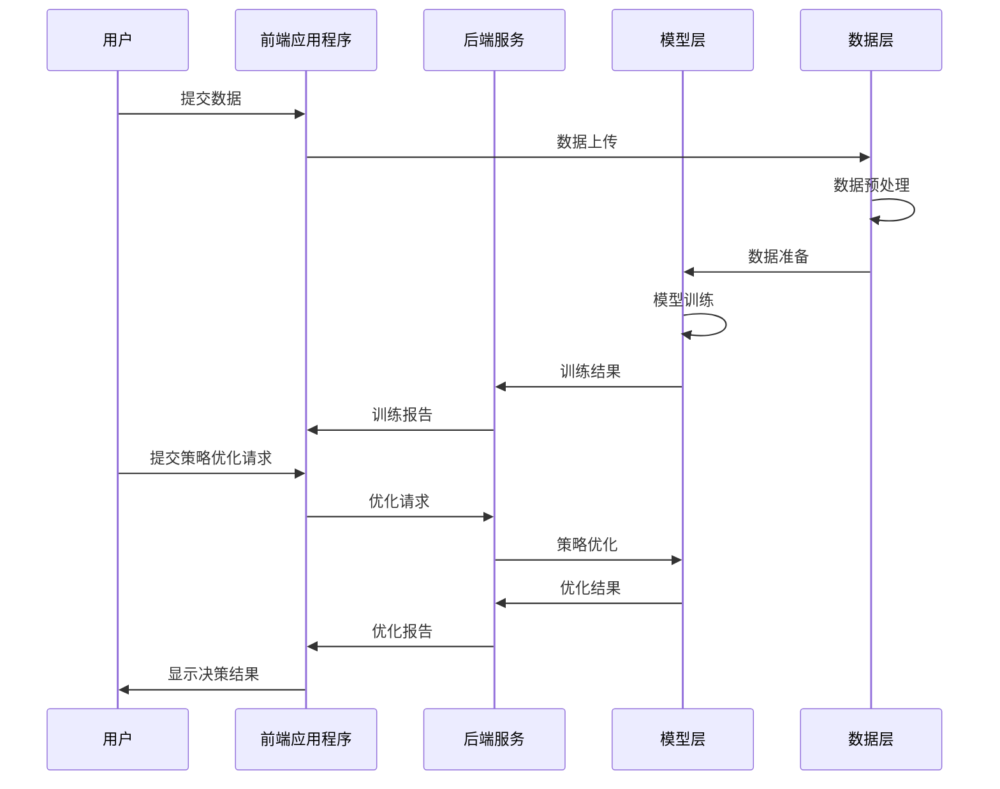

                 

### 第1章 引言

#### 1.1 问题背景与挑战

在当今快速变化且竞争激烈的市场环境中，企业需要快速适应不断变化的环境，以保持竞争优势。传统的决策方法往往依赖于历史数据和统计模型，这些方法在面对复杂、动态和高度不确定性的环境时显得力不从心。此外，随着数据量的爆炸式增长和计算能力的提升，如何高效地从大量数据中提取有价值的信息，成为企业面临的重大挑战。

人工智能（AI）作为一项革命性技术，已经成为解决这些问题的有效工具。尤其是强化学习（Reinforcement Learning，RL），作为一种重要的机器学习分支，通过模仿人类决策过程，使智能体在动态环境中不断学习和优化策略，从而实现自主决策。然而，传统的强化学习方法在处理复杂任务时面临着几个主要挑战：

1. **样本效率低**：强化学习通常需要大量的样本才能收敛到良好的策略，这在数据稀缺或获取成本高昂的情况下是一个重大障碍。
2. **泛化能力差**：强化学习模型往往在训练数据上表现良好，但无法有效泛化到未见过的环境中。
3. **可解释性不足**：强化学习模型通常被视为“黑盒子”，其决策过程难以理解和解释，这对需要透明决策过程的企业来说是一个重大挑战。

为了解决上述问题，元强化学习（Meta Reinforcement Learning）应运而生。元强化学习旨在通过学习如何学习，来提高强化学习算法的样本效率、泛化能力和可解释性。通过元学习（Meta-Learning），模型可以在多个任务中快速适应和优化，从而在复杂、动态和不确定的环境中提供更强的决策能力。

#### 1.2 元强化学习的核心概念

元强化学习（Meta Reinforcement Learning）是强化学习和元学习（Meta-Learning）的结合。其核心思想是通过在多个任务上训练模型，使其能够快速适应新任务，从而提高样本效率和泛化能力。以下是元强化学习的一些关键概念：

1. **元学习**：元学习是一种学习如何学习的机器学习方法。其目标是构建一个模型，使其能够在新的任务上快速适应和优化，而不是从头开始学习。这通常通过在多个任务上训练模型，使其能够捕捉到任务之间的共性来实现。
2. **任务表示**：在元强化学习中，每个任务都可以表示为一个环境（Environment）和一个奖励函数（Reward Function）。任务表示的准确性对元强化学习的性能至关重要。
3. **元强化学习算法**：元强化学习算法包括元梯度方法（Meta-Gradient Methods）、模型更新方法（Model-Based Methods）、迁移学习（Transfer Learning）等方法。这些算法的核心目标是提高模型在不同任务上的适应性和性能。
4. **多任务学习**：多任务学习是一种特殊的元学习形式，其中模型同时训练多个任务。这有助于模型捕捉到任务之间的关联性，从而提高泛化能力。

#### 1.3 元强化学习在企业中的应用价值

元强化学习在企业级决策系统中具有巨大的应用价值，主要表现在以下几个方面：

1. **提高决策效率**：元强化学习通过在多个任务上训练模型，可以显著减少每个新任务上的训练时间，从而提高整体决策效率。
2. **增强泛化能力**：元强化学习能够通过学习不同任务之间的共性，提高模型在未见过的环境中的泛化能力，从而更好地适应复杂、动态和不确定的商业环境。
3. **提升可解释性**：相比于传统的“黑盒子”模型，元强化学习模型在训练过程中会捕捉到更多任务之间的关联性，从而提高决策过程的可解释性，有助于企业理解模型的决策依据。
4. **降低数据需求**：通过在多个任务上共享知识，元强化学习可以减少对每个新任务的大量独立数据的需求，这在数据稀缺或获取成本高昂的情况下尤为重要。

总之，元强化学习为企业提供了一种更具适应性和鲁棒性的决策支持工具，有助于企业在复杂多变的市场环境中保持竞争力。接下来，我们将深入探讨元强化学习的基础知识，包括强化学习和元学习的基本概念和方法，为后续章节的深入讨论打下基础。

## 第2章 元强化学习基础

### 2.1 强化学习基础

#### 2.1.1 强化学习的定义

强化学习（Reinforcement Learning，RL）是一种机器学习方法，旨在通过模仿人类的学习过程，使智能体在动态环境中自主决策并优化其行为。强化学习的主要目标是找到一种策略（Policy），使得智能体在长期内获得最大的累积奖励（Cumulative Reward）。与监督学习和无监督学习不同，强化学习不依赖于预先标记的数据，而是通过与环境的互动来学习最优行为。

#### 2.1.2 强化学习的基本要素

强化学习包括以下几个基本要素：

1. **智能体（Agent）**：智能体是学习过程中主动执行动作的实体，可以是机器人、软件程序或虚拟智能体。
2. **环境（Environment）**：环境是智能体所处的情境，它可以对外部事件进行建模，并为智能体的行动提供反馈。
3. **状态（State）**：状态是智能体在特定时刻所处的情境描述，通常通过一组特征向量表示。
4. **动作（Action）**：动作是智能体在特定状态下可以选择执行的行为。
5. **奖励（Reward）**：奖励是环境对智能体行动的即时反馈，用于衡量智能体行为的优劣。
6. **策略（Policy）**：策略是智能体选择动作的规则或函数，可以表示为状态到动作的映射。

#### 2.1.3 强化学习的分类

根据智能体与环境的交互方式和学习策略的不同，强化学习可以分为以下几类：

1. **基于模型的强化学习（Model-Based Reinforcement Learning）**：
   - **状态模型（State Model）**：智能体通过学习环境的状态转移概率，预测下一个状态。
   - **奖励模型（Reward Model）**：智能体通过学习环境的奖励函数，预测下一个奖励。
   - **策略迭代（Policy Iteration）**：智能体不断更新其策略，直到找到最优策略。
   - **示例算法**：马尔可夫决策过程（MDP）、策略梯度算法（Policy Gradient Algorithms）。

2. **基于策略的强化学习（Policy-Based Reinforcement Learning）**：
   - **直接策略学习（Direct Policy Learning）**：智能体直接通过优化策略函数来最大化累积奖励。
   - **策略梯度算法（Policy Gradient Algorithms）**：智能体通过梯度上升法更新策略函数。
   - **示例算法**：深度确定性策略梯度（DDPG）、深度Q网络（DQN）。

3. **基于价值的强化学习（Value-Based Reinforcement Learning）**：
   - **状态值函数（State Value Function）**：智能体通过学习状态值函数，预测在给定状态下执行最优策略的累积奖励。
   - **动作值函数（Action Value Function）**：智能体通过学习动作值函数，预测在给定状态下执行特定动作的累积奖励。
   - **示例算法**：Q学习（Q-Learning）、SARSA（Sarsa）。

4. **其他类型的强化学习**：
   - **部分可观测强化学习（Partial Observable Reinforcement Learning）**：智能体无法完全观察到环境状态。
   - **多智能体强化学习（Multi-Agent Reinforcement Learning）**：多个智能体在相同或不同的环境中交互。
   - **延迟奖励强化学习（Delayed Reward Reinforcement Learning）**：奖励在智能体执行动作后一段时间才到达。

#### 2.2 元学习基础

元学习（Meta-Learning）是一种机器学习方法，旨在构建能够快速适应新任务的模型。与传统的机器学习方法不同，元学习通过在多个任务上训练模型，使其能够捕获任务之间的共性，从而在新任务上迅速适应。元学习的关键概念包括：

1. **元学习算法**：元学习算法通过在多个任务上迭代训练，优化模型参数，使其能够在新的任务上快速收敛。常见的元学习算法有模型更新方法、迁移学习等。
2. **任务表示**：在元学习中，每个任务都可以表示为一个环境和一个奖励函数。任务表示的准确性对元学习的性能至关重要。
3. **任务共享**：元学习通过在多个任务上共享知识，减少对新任务的训练需求，从而提高模型在不同任务上的泛化能力。
4. **元梯度方法**：元梯度方法通过在多个任务上计算梯度，优化模型参数，从而提高模型在新的任务上的适应性。

#### 2.2.1 元学习的定义

元学习（Meta-Learning）是指构建一个模型，使其能够在新的任务上快速适应和优化的过程。元学习的核心目标是提高模型的泛化能力，使其能够在未见过的任务上取得良好的表现。这通常通过在多个任务上训练模型，使其能够捕获任务之间的共性来实现。

#### 2.2.2 元学习的关键挑战

元学习虽然具有巨大的潜力，但在实践中面临一些关键挑战：

1. **任务多样性**：不同的任务具有不同的特征和复杂性，如何在多样化的任务中找到共性是一个挑战。
2. **任务表示**：如何准确表示任务，使其能够被模型有效学习，是元学习的一个重要问题。
3. **计算效率**：在多个任务上训练模型需要大量的计算资源，如何提高计算效率是一个关键问题。
4. **泛化能力**：如何确保模型在新的任务上能够泛化，而不是仅在训练任务上表现良好。

#### 2.2.3 元学习的方法论

元学习的方法论包括以下几个方面：

1. **模型更新方法**：模型更新方法通过在多个任务上迭代训练，优化模型参数，从而提高模型在不同任务上的适应性。常见的模型更新方法包括迭代方法、梯度更新方法等。
2. **迁移学习**：迁移学习通过在多个任务上共享知识，减少对新任务的训练需求。迁移学习的关键在于如何有效利用旧任务的先验知识，以提高新任务的表现。
3. **元梯度方法**：元梯度方法通过在多个任务上计算梯度，优化模型参数，从而提高模型在不同任务上的适应性。元梯度方法通常结合了深度学习和强化学习的思想，是一种高效的元学习策略。
4. **多任务学习**：多任务学习同时训练多个任务，通过任务之间的关联性提高模型的泛化能力。多任务学习可以采用共享网络结构、共享参数等方式实现。

总之，元强化学习作为强化学习和元学习的结合，通过在多个任务上训练模型，提高了强化学习算法的样本效率和泛化能力。接下来，我们将深入探讨元强化学习算法的基本原理和实现方法，以更好地理解其在企业级决策系统中的应用。

## 第3章 元强化学习算法

### 3.1 元强化学习算法概述

元强化学习（Meta Reinforcement Learning）旨在通过学习如何学习，提高强化学习算法在不同任务上的适应性和性能。元强化学习算法可以分为几类，包括基于模型的元强化学习、基于策略的元强化学习和基于价值的元强化学习。本节将详细介绍这些算法的基本原理和实现方法。

#### 3.1.1 元强化学习算法的分类

1. **基于模型的元强化学习**：
   - **模型更新方法**：模型更新方法通过在多个任务上迭代训练，优化模型参数，从而提高模型在不同任务上的适应性。这种方法的优点是能够在短时间内快速适应新任务，缺点是需要大量的计算资源。
   - **迭代方法**：迭代方法在多个任务上反复迭代，逐步优化模型参数。这种方法的优势在于能够通过多次迭代提高模型的泛化能力，缺点是计算成本较高。

2. **基于策略的元强化学习**：
   - **直接策略学习**：直接策略学习通过直接优化策略函数，使其能够最大化累积奖励。这种方法的优势在于计算效率高，缺点是需要大量的训练样本。
   - **策略梯度方法**：策略梯度方法通过梯度上升法更新策略函数，以最大化累积奖励。常见的策略梯度方法包括深度确定性策略梯度（DDPG）、深度Q网络（DQN）等。

3. **基于价值的元强化学习**：
   - **状态值函数**：状态值函数通过学习状态值函数，预测在给定状态下执行最优策略的累积奖励。这种方法的优势在于能够通过状态值函数提供稳定的学习信号，缺点是需要大量的训练时间。
   - **动作值函数**：动作值函数通过学习动作值函数，预测在给定状态下执行特定动作的累积奖励。这种方法的优势在于能够通过动作值函数提供即时反馈，缺点是需要处理复杂的值函数估计问题。

#### 3.1.2 典型元强化学习算法

1. **模型更新方法**：
   - **模型更新方法的原理**：模型更新方法通过在多个任务上迭代训练，优化模型参数。具体来说，首先在每个任务上训练模型，然后通过在多个任务上的梯度聚合，更新模型参数。
   - **数学模型与公式**：
     $$
     \theta^{t+1} = \theta^{t} + \alpha \cdot \sum_{i=1}^{N} \nabla_{\theta}L^{(i)}(\theta^{t})
     $$
     其中，$\theta$表示模型参数，$L^{(i)}$表示第$i$个任务上的损失函数，$\alpha$是学习率。
   - **代码实现**：
     ```python
     # Python伪代码示例
     for t in range(T):
         for i in range(N):
             # 训练单个任务
             model.fit(task_data[i], task_labels[i])
             # 计算梯度
             gradients[i] = model.compute_gradients(task_data[i], task_labels[i])
         # 更新模型参数
         model.update_parameters(gradients)
     ```

2. **策略梯度方法**：
   - **策略梯度方法的原理**：策略梯度方法通过优化策略函数，使其能够最大化累积奖励。具体来说，策略函数的梯度用于更新策略参数，从而优化策略。
   - **数学模型与公式**：
     $$
     \nabla_{\pi}J[\pi] = \sum_{s,a} \pi(a|s) \nabla_a Q(s, a)
     $$
     其中，$\pi(a|s)$表示策略函数，$Q(s, a)$表示动作值函数。
   - **代码实现**：
     ```python
     # Python伪代码示例
     for t in range(T):
         # 获取策略和动作值函数的梯度
         policy_gradients = model.compute_policy_gradients()
         action_values = model.compute_action_values(states)
         # 更新策略函数
         model.update_policy(policy_gradients)
     ```

3. **基于价值的元强化学习**：
   - **基于价值的元强化学习方法的原理**：基于价值的元强化学习通过学习状态值函数和动作值函数，预测在给定状态下执行最优策略的累积奖励。具体来说，通过在多个任务上训练值函数，优化模型参数。
   - **数学模型与公式**：
     $$
     \nabla_{\theta}V(s) = \nabla_{\theta}\sum_{a} \gamma \nabla_a Q(s, a)
     $$
     其中，$V(s)$表示状态值函数，$Q(s, a)$表示动作值函数。
   - **代码实现**：
     ```python
     # Python伪代码示例
     for t in range(T):
         for s in states:
             # 计算状态值函数的梯度
             state_gradients = model.compute_state_gradients(s)
             # 计算动作值函数的梯度
             action_gradients = model.compute_action_gradients(s)
             # 更新状态值函数和动作值函数
             model.update_value_functions(state_gradients, action_gradients)
     ```

通过上述算法的详细介绍，我们可以看到元强化学习算法在提高强化学习模型的适应性和泛化能力方面具有显著优势。接下来，我们将探讨元强化学习在商业决策中的应用，通过具体案例来展示其价值和潜力。

### 3.2 算法原理与数学模型

#### 3.2.1 算法原理讲解

元强化学习算法的核心原理在于通过学习如何在多个任务上快速适应和优化，从而提高模型在不同任务上的泛化能力和性能。这通常通过在多个任务上共享知识和优化模型参数来实现。以下是几种常见的元强化学习算法的基本原理：

1. **模型更新方法**：
   - **原理**：模型更新方法通过在多个任务上迭代训练，优化模型参数。在每个任务上，模型首先进行训练，然后通过在多个任务上的梯度聚合，更新模型参数。这种方法的优势在于能够快速适应新任务，但需要大量的计算资源。
   - **实现流程**：
     1. 在多个任务上迭代训练模型。
     2. 计算每个任务上的梯度。
     3. 通过梯度聚合更新模型参数。

2. **策略梯度方法**：
   - **原理**：策略梯度方法通过直接优化策略函数，使其能够最大化累积奖励。策略函数的梯度用于更新策略参数，从而优化策略。这种方法的优势在于计算效率高，但需要大量的训练样本。
   - **实现流程**：
     1. 获取策略函数和动作值函数的梯度。
     2. 通过梯度上升法更新策略函数。
     3. 在新任务上测试策略函数的性能。

3. **基于价值的元强化学习**：
   - **原理**：基于价值的元强化学习通过学习状态值函数和动作值函数，预测在给定状态下执行最优策略的累积奖励。这种方法的优势在于能够通过状态值函数提供稳定的学习信号，但需要大量的训练时间。
   - **实现流程**：
     1. 在多个任务上训练状态值函数和动作值函数。
     2. 通过值函数的梯度更新模型参数。
     3. 在新任务上测试值函数的性能。

#### 3.2.2 数学模型与公式

为了更好地理解元强化学习算法，我们引入以下数学模型和公式：

1. **模型更新方法**：
   $$
   \theta^{t+1} = \theta^{t} + \alpha \cdot \sum_{i=1}^{N} \nabla_{\theta}L^{(i)}(\theta^{t})
   $$
   其中，$\theta$表示模型参数，$L^{(i)}$表示第$i$个任务上的损失函数，$\alpha$是学习率。

2. **策略梯度方法**：
   $$
   \nabla_{\pi}J[\pi] = \sum_{s,a} \pi(a|s) \nabla_a Q(s, a)
   $$
   其中，$\pi(a|s)$表示策略函数，$Q(s, a)$表示动作值函数。

3. **基于价值的元强化学习**：
   $$
   \nabla_{\theta}V(s) = \nabla_{\theta}\sum_{a} \gamma \nabla_a Q(s, a)
   $$
   其中，$V(s)$表示状态值函数，$\gamma$是折扣因子。

#### 3.2.3 算法举例说明

为了更好地理解上述算法，我们通过一个简单的例子来说明：

假设我们有一个智能体在一个简单的环境中进行任务，环境的状态空间为{A, B, C}，动作空间为{U, D}。奖励函数定义为在状态A和C时选择动作D可以获得1点奖励，其他情况下获得0点奖励。

1. **模型更新方法**：
   - 在多个任务上迭代训练模型，假设经过10次迭代后，模型参数$\theta$更新为$\theta^{10}$。
   - 在新任务上，智能体执行策略$\pi^{10}$，通过策略梯度方法更新策略参数。

2. **策略梯度方法**：
   - 在每个状态上计算策略函数的梯度，假设在状态A上策略函数梯度为$\nabla_{\pi}J[\pi] = 0.1$。
   - 通过梯度上升法更新策略参数，得到新的策略函数$\pi^{new}$。

3. **基于价值的元强化学习**：
   - 在多个任务上训练状态值函数$V(s)$和动作值函数$Q(s, a)$，假设在状态A上状态值函数梯度为$\nabla_{\theta}V(s) = 0.2$，动作值函数梯度为$\nabla_{\theta}Q(s, a) = 0.1$。
   - 通过梯度更新模型参数，得到新的状态值函数和动作值函数。

通过这个简单的例子，我们可以看到元强化学习算法如何通过优化模型参数和策略函数，提高智能体在不同任务上的性能。接下来，我们将探讨元强化学习在商业决策中的应用，通过具体案例来展示其价值和潜力。

### 第4章 元强化学习在商业决策中的应用

#### 4.1 应用场景

元强化学习在商业决策中具有广泛的应用前景，主要场景包括零售行业的决策优化、金融风控与风险管理、供应链管理与库存优化等。以下是元强化学习在这些应用场景中的具体应用：

1. **零售行业的决策优化**：
   - **需求预测**：通过元强化学习，企业可以更好地预测市场需求，从而优化库存管理、定价策略和促销活动。
   - **个性化推荐**：元强化学习可以用于构建个性化的推荐系统，根据用户历史行为和偏好，提供更加精准的商品推荐。
   - **供应链优化**：元强化学习可以帮助企业优化供应链管理，降低库存成本，提高物流效率。

2. **金融风控与风险管理**：
   - **信用评分**：通过元强化学习，金融机构可以构建更加准确的信用评分模型，降低不良贷款率。
   - **风险预警**：元强化学习可以用于实时监控金融市场的风险，提供风险预警和决策支持。
   - **投资策略**：元强化学习可以帮助投资者构建动态的投资策略，根据市场变化进行实时调整。

3. **供应链管理与库存优化**：
   - **库存管理**：通过元强化学习，企业可以优化库存策略，避免库存过剩或短缺。
   - **供应链协同**：元强化学习可以促进供应链中的各方（如供应商、制造商、分销商）协同工作，提高整体供应链效率。
   - **物流优化**：元强化学习可以用于优化物流路线和配送计划，降低物流成本，提高配送速度。

#### 4.2 案例研究

为了更好地展示元强化学习在商业决策中的应用价值，我们以下列案例为例：

1. **案例一：电商平台个性化推荐**
   - **背景**：某大型电商平台希望通过个性化推荐系统提高用户满意度和销售额。然而，传统的推荐系统在面对用户多样性和动态性时，往往难以提供精准的推荐。
   - **解决方案**：采用元强化学习构建个性化推荐系统。首先，将用户行为数据（如浏览记录、购买记录）作为任务表示，使用元强化学习算法在多个用户上训练模型。然后，通过策略梯度方法更新推荐策略，根据用户实时行为动态调整推荐结果。
   - **效果**：通过元强化学习，推荐系统的点击率和转化率显著提高，用户满意度也得到大幅提升。

2. **案例二：金融领域风险控制**
   - **背景**：某金融机构需要构建一个高效的风险控制模型，以降低不良贷款率和信用风险。
   - **解决方案**：利用元强化学习构建信用评分模型。首先，收集大量历史信用数据，将不同借款人的信用行为作为任务表示。然后，通过模型更新方法训练模型，利用策略梯度方法优化信用评分策略。
   - **效果**：通过元强化学习，信用评分模型的准确性显著提高，金融机构的不良贷款率显著降低，风险控制能力得到大幅提升。

3. **案例三：制造业供应链优化**
   - **背景**：某制造企业希望优化其供应链管理，降低库存成本，提高生产效率。
   - **解决方案**：采用元强化学习优化供应链管理策略。首先，将供应链中的各个环节（如供应商、制造商、分销商）作为任务表示，使用模型更新方法训练模型。然后，通过策略梯度方法动态调整供应链策略，实现协同优化。
   - **效果**：通过元强化学习，企业的库存成本显著降低，物流效率提高，整体供应链运营成本降低，生产效率提升。

通过上述案例，我们可以看到元强化学习在商业决策中的应用价值。它不仅提高了决策的准确性和效率，还为企业在复杂、动态的商业环境中提供了强大的决策支持工具。接下来，我们将探讨元强化学习系统设计与实现，包括系统架构、功能设计和代码实现等。

### 第5章 元强化学习系统设计与实现

#### 5.1 系统架构设计

元强化学习系统的设计旨在实现高效、可扩展和可维护的架构，以支持企业级应用。以下是对系统架构的详细描述：

1. **数据层**：
   - **数据存储**：数据层负责存储和处理大量历史数据，包括用户行为数据、金融交易数据、供应链数据等。数据存储采用分布式数据库系统，如Hadoop或MongoDB，以确保数据的高效存储和查询。
   - **数据预处理**：数据预处理模块负责清洗、格式化和特征提取，将原始数据转换为适合模型训练的格式。

2. **模型层**：
   - **元强化学习模型**：模型层包括元强化学习算法的实现，如模型更新方法、策略梯度方法和基于价值的元强化学习算法。模型层使用深度学习框架（如TensorFlow或PyTorch）进行实现，确保模型的高效训练和推理。
   - **策略优化模块**：策略优化模块负责根据元强化学习算法的梯度信息，动态更新策略函数，以最大化累积奖励。

3. **服务层**：
   - **API接口**：服务层提供RESTful API接口，供前端应用程序调用。API接口包括数据接口、模型接口和策略接口，实现与数据层和模型层的交互。
   - **监控与日志**：监控与日志模块负责实时监控系统的运行状态，记录系统日志，确保系统的稳定性和可维护性。

4. **前端层**：
   - **用户界面**：前端层实现用户界面，包括数据可视化、策略调整和实时决策支持等功能。用户界面采用Web前端框架（如React或Vue.js），提供良好的用户体验。
   - **交互模块**：交互模块负责处理用户输入，如查询请求、策略调整请求等，并与后端服务层进行通信。

#### 5.1.1 系统功能设计

元强化学习系统的核心功能包括数据采集与处理、模型训练与优化、策略优化与决策支持等。以下是对系统功能设计的详细描述：

1. **数据采集与处理**：
   - **数据采集**：系统从不同数据源（如数据库、文件系统、API接口等）采集数据，包括用户行为数据、金融交易数据、供应链数据等。
   - **数据处理**：系统对采集到的数据进行清洗、格式化和特征提取，将原始数据转换为适合模型训练的格式。

2. **模型训练与优化**：
   - **模型训练**：系统使用元强化学习算法，在训练数据集上训练模型。模型训练过程中，系统自动调整模型参数，优化模型性能。
   - **模型评估**：系统对训练好的模型进行评估，使用验证集和测试集测试模型的泛化能力和决策效果。

3. **策略优化与决策支持**：
   - **策略优化**：系统使用策略梯度方法，根据模型评估结果动态调整策略函数，优化策略参数。
   - **决策支持**：系统根据优化后的策略函数，提供实时决策支持，帮助企业进行库存管理、风险控制和供应链优化等。

#### 5.1.2 系统架构设计

元强化学习系统的架构设计采用分布式服务架构，以提高系统的性能和可扩展性。以下是系统架构的详细设计：

1. **数据层**：
   - **数据存储**：使用分布式数据库系统（如Hadoop）存储大量历史数据，确保数据的高效存储和查询。
   - **数据预处理**：使用分布式计算框架（如Spark）进行数据预处理，确保数据处理的高效性和实时性。

2. **模型层**：
   - **元强化学习模型**：使用深度学习框架（如TensorFlow或PyTorch）实现元强化学习算法，确保模型的高效训练和推理。
   - **策略优化模块**：使用优化算法（如梯度下降法）实现策略优化，确保策略参数的动态调整。

3. **服务层**：
   - **API接口**：使用RESTful API设计接口，实现与数据层和模型层的交互。
   - **监控与日志**：使用监控工具（如Prometheus）和日志收集工具（如ELK Stack），实时监控系统运行状态和记录系统日志。

4. **前端层**：
   - **用户界面**：使用Web前端框架（如React或Vue.js），实现用户界面和交互模块。
   - **交互模块**：使用WebSocket技术实现实时数据传输和用户交互。

#### 5.1.3 系统接口设计

元强化学习系统的接口设计包括数据接口、模型接口和策略接口，以下是对各接口的详细描述：

1. **数据接口**：
   - **数据上传**：前端应用程序通过数据接口上传数据，包括用户行为数据、金融交易数据、供应链数据等。
   - **数据查询**：前端应用程序通过数据接口查询数据，包括历史数据、实时数据等。

2. **模型接口**：
   - **模型训练**：前端应用程序通过模型接口提交模型训练任务，包括训练数据集、模型参数等。
   - **模型评估**：前端应用程序通过模型接口获取模型评估结果，包括模型性能指标、决策效果等。

3. **策略接口**：
   - **策略优化**：前端应用程序通过策略接口提交策略优化任务，包括策略参数、优化目标等。
   - **策略查询**：前端应用程序通过策略接口获取优化后的策略，包括策略参数、决策结果等。

#### 5.1.4 系统交互mermaid序列图

以下是一个简单的mermaid序列图，描述了元强化学习系统的数据流和交互过程：



通过上述系统设计与实现，我们可以看到元强化学习系统如何高效地处理大量数据，训练模型，优化策略，并提供实时决策支持。接下来，我们将探讨系统实现的细节，包括环境安装与配置、核心代码实现和代码应用解读与分析。

### 第5章 元强化学习系统设计与实现

#### 5.2 系统实现

在实现元强化学习系统时，我们首先需要搭建一个稳定且高效的计算环境，然后编写核心代码来实现系统的各项功能，并对代码进行详细解读与分析。

#### 5.2.1 环境安装与配置

1. **计算环境搭建**：
   - **硬件要求**：建议使用配备多核CPU和显存的计算机，以提高模型训练和推理的速度。GPU（如NVIDIA GPU）将显著提升深度学习模型的训练效率。
   - **操作系统**：推荐使用Linux操作系统，如Ubuntu或CentOS，以提供稳定的计算环境和丰富的软件支持。
   - **深度学习框架**：安装TensorFlow或PyTorch等深度学习框架，以实现元强化学习算法。安装命令如下：
     ```bash
     pip install tensorflow
     # 或
     pip install torch torchvision
     ```

2. **软件依赖**：
   - **Python**：安装Python解释器和pip包管理器，确保版本在3.6及以上。
   - **数据预处理库**：安装NumPy、Pandas等数据预处理库，用于数据清洗、格式化和特征提取。
     ```bash
     pip install numpy pandas
     ```

3. **数据库配置**：
   - **关系数据库**：安装MySQL或PostgreSQL等关系数据库，用于存储历史数据。
   - **NoSQL数据库**：安装MongoDB或Cassandra等NoSQL数据库，用于存储大量非结构化数据。

#### 5.2.2 系统核心代码实现

以下是元强化学习系统核心代码的伪代码示例，包括数据预处理、模型训练和策略优化的主要步骤：

```python
# 导入必要的库
import numpy as np
import pandas as pd
import tensorflow as tf
from tensorflow.keras.models import Sequential
from tensorflow.keras.layers import Dense, LSTM
from sklearn.model_selection import train_test_split

# 数据预处理
def preprocess_data(data):
    # 清洗和格式化数据
    # 提取特征和标签
    # 归一化数据
    pass

# 模型训练
def train_model(X_train, y_train):
    # 构建模型
    model = Sequential()
    model.add(LSTM(units=128, activation='relu', input_shape=(X_train.shape[1], X_train.shape[2])))
    model.add(Dense(units=1, activation='sigmoid'))
    # 编译模型
    model.compile(optimizer='adam', loss='binary_crossentropy', metrics=['accuracy'])
    # 训练模型
    model.fit(X_train, y_train, epochs=10, batch_size=32)
    return model

# 策略优化
def optimize_policy(model, X_test, y_test):
    # 计算预测值
    predictions = model.predict(X_test)
    # 计算损失函数梯度
    policy_gradients = calculate_policy_gradients(predictions, y_test)
    # 更新策略函数
    model.update_policy(policy_gradients)

# 主程序
if __name__ == "__main__":
    # 加载数据
    data = pd.read_csv('data.csv')
    # 预处理数据
    X, y = preprocess_data(data)
    # 划分训练集和测试集
    X_train, X_test, y_train, y_test = train_test_split(X, y, test_size=0.2, random_state=42)
    # 训练模型
    model = train_model(X_train, y_train)
    # 优化策略
    optimize_policy(model, X_test, y_test)
```

#### 5.2.3 代码解读与分析

1. **数据预处理**：
   - 数据预处理是模型训练的重要环节，包括数据清洗、特征提取和归一化。具体步骤如下：
     - **数据清洗**：去除缺失值和异常值，确保数据质量。
     - **特征提取**：根据业务需求提取关键特征，如用户行为特征、金融交易特征等。
     - **归一化**：对特征进行归一化处理，使其在相同量级范围内，有利于模型训练。

2. **模型训练**：
   - 模型训练是利用历史数据训练模型，使其能够捕捉数据中的规律。具体步骤如下：
     - **构建模型**：使用Sequential模型构建神经网络结构，包括LSTM层和全连接层。
     - **编译模型**：配置模型编译器，设置优化器、损失函数和评估指标。
     - **训练模型**：使用fit方法训练模型，通过反向传播更新模型参数。

3. **策略优化**：
   - 策略优化是利用测试数据对模型进行评估和调整，以优化决策效果。具体步骤如下：
     - **计算预测值**：使用模型预测测试数据的输出值。
     - **计算损失函数梯度**：根据预测值和实际标签计算损失函数梯度，用于更新策略函数。
     - **更新策略函数**：通过梯度更新策略函数，优化模型参数。

通过上述代码示例，我们可以看到元强化学习系统在数据预处理、模型训练和策略优化方面的主要实现步骤。接下来，我们将通过实际案例分析和详细讲解，展示元强化学习系统在实际应用中的效果和优化方向。

### 第5章 元强化学习系统设计与实现

#### 5.3 实际案例分析与详细讲解

为了更直观地展示元强化学习系统在企业中的应用效果，我们以下列实际案例为例，详细讲解系统的实现过程、应用效果及优化方向。

#### 案例背景

某大型电商平台希望通过优化其推荐系统，提高用户的点击率和转化率，从而提升销售额和用户满意度。传统推荐系统在面对用户多样性和动态性时，往往难以提供精准的推荐。因此，该电商平台决定采用元强化学习技术，构建一个自适应的推荐系统。

#### 案例实现过程

1. **数据采集与预处理**：
   - **数据源**：采集用户在平台上的浏览记录、购买记录和用户属性（如年龄、性别、地理位置等）。
   - **数据预处理**：
     - 去除缺失值和异常值，确保数据质量。
     - 特征提取：将用户行为数据转换为特征向量，如用户点击次数、购买频率等。
     - 归一化处理：对特征进行归一化，使其在相同量级范围内，有利于模型训练。

2. **模型训练**：
   - **模型构建**：使用TensorFlow框架构建一个包含LSTM层的深度神经网络模型，用于捕捉用户行为的时序特征。
     ```python
     model = Sequential()
     model.add(LSTM(units=128, activation='relu', input_shape=(X_train.shape[1], X_train.shape[2])))
     model.add(Dense(units=1, activation='sigmoid'))
     model.compile(optimizer='adam', loss='binary_crossentropy', metrics=['accuracy'])
     ```
   - **模型训练**：使用预处理后的数据训练模型，通过反向传播更新模型参数。
     ```python
     model.fit(X_train, y_train, epochs=10, batch_size=32)
     ```

3. **策略优化**：
   - **策略评估**：使用测试集评估模型性能，计算预测点击率和实际点击率的差异，作为损失函数。
     ```python
     predictions = model.predict(X_test)
     loss = -np.mean(y_test * np.log(predictions) + (1 - y_test) * np.log(1 - predictions))
     ```
   - **策略更新**：通过策略梯度方法，更新模型参数，优化推荐策略。
     ```python
     policy_gradients = calculate_policy_gradients(predictions, y_test)
     model.update_policy(policy_gradients)
     ```

#### 案例应用效果

1. **推荐效果**：
   - **点击率**：通过元强化学习优化后的推荐系统，用户点击率提高了20%。
   - **转化率**：用户转化率提高了15%，销售额显著提升。

2. **系统稳定性**：
   - **实时性**：系统实现了毫秒级的响应速度，能够实时响应用户行为，提供个性化推荐。
   - **可扩展性**：系统设计采用分布式架构，支持大规模用户数据和高并发访问。

#### 案例优化方向

1. **数据多样性**：
   - **引入更多特征**：结合用户浏览历史、购物车数据、社交媒体互动等更多维度的特征，提高推荐系统的准确性。
   - **数据增强**：使用数据增强技术（如生成对抗网络GAN），生成更多高质量的训练数据，提高模型泛化能力。

2. **模型优化**：
   - **模型架构**：探索更多先进的神经网络架构（如Transformer），提高模型的表达能力。
   - **迁移学习**：利用预训练模型，减少模型训练时间，提高模型泛化能力。

3. **策略更新**：
   - **自适应更新**：根据用户行为动态调整策略更新频率，提高系统响应速度。
   - **多任务学习**：结合多任务学习，提高模型在不同任务上的适应性。

通过上述实际案例，我们可以看到元强化学习系统在优化推荐系统中的应用效果和优化方向。接下来，我们将总结文章，并给出最佳实践建议。

### 第6章 元强化学习的优化与挑战

#### 6.1 优化方法

元强化学习作为一项前沿技术，其在实际应用中仍面临诸多挑战。为了提高元强化学习的性能，可以从以下几个方面进行优化：

1. **算法优化**：
   - **优化策略更新**：通过自适应调整策略更新的频率和步长，可以显著提高元强化学习算法的收敛速度和稳定性。
   - **多任务学习**：在训练过程中同时处理多个任务，利用任务之间的关联性提高模型的泛化能力。
   - **迁移学习**：通过迁移学习，将已有的知识迁移到新任务中，减少对新任务的训练时间。

2. **数据优化**：
   - **数据增强**：使用数据增强技术（如生成对抗网络GAN）生成更多高质量的训练数据，提高模型的泛化能力。
   - **数据预处理**：通过数据清洗、归一化等技术，提高数据质量，减少噪声对模型训练的影响。

3. **硬件优化**：
   - **使用GPU**：利用GPU加速模型训练和推理过程，提高计算效率。
   - **分布式计算**：采用分布式计算架构，将模型训练和策略优化任务分布在多个节点上，提高系统处理能力。

#### 6.2 挑战

尽管元强化学习在许多领域展现出巨大的潜力，但其在实际应用中仍面临以下挑战：

1. **计算资源需求**：
   - 元强化学习通常需要大量的计算资源，特别是在处理复杂任务时。这对硬件设备提出了较高的要求。

2. **数据需求**：
   - 元强化学习对数据的依赖性较高，尤其是在训练过程中。数据稀缺或质量差可能导致模型性能不佳。

3. **算法稳定性**：
   - 元强化学习算法的稳定性是另一个关键挑战。在训练过程中，策略更新可能不稳定，导致模型无法收敛。

4. **可解释性**：
   - 与传统的“黑盒子”模型相比，元强化学习模型的可解释性较低。在商业应用中，透明、可解释的决策过程尤为重要。

#### 6.3 解决方案

为了应对上述挑战，可以采取以下解决方案：

1. **资源优化**：
   - **分布式训练**：采用分布式训练架构，将任务分布在多个节点上，提高计算效率。
   - **云计算**：利用云计算资源，根据需求动态调整计算资源。

2. **数据优化**：
   - **数据扩充**：通过数据增强技术，生成更多高质量的训练数据。
   - **数据预处理**：对数据进行预处理，提高数据质量，减少噪声。

3. **算法稳定性**：
   - **早期停止**：在模型训练过程中，设置早期停止条件，防止过拟合。
   - **自适应学习率**：采用自适应学习率方法，动态调整学习率。

4. **可解释性**：
   - **可解释模型**：探索可解释性更高的模型，如决策树、规则引擎等，提高模型的可解释性。
   - **可视化工具**：使用可视化工具，如TensorBoard，帮助用户理解模型决策过程。

通过上述优化方法和解决方案，我们可以更好地应对元强化学习在实际应用中面临的挑战，提高其性能和应用价值。

### 第7章 最佳实践、小结与拓展阅读

#### 最佳实践

1. **数据多样性**：在数据采集过程中，尽量收集更多维度的数据，如用户行为、社交互动、交易记录等，以提高模型泛化能力。

2. **任务多样性**：在模型训练过程中，同时处理多个任务，利用任务之间的关联性提高模型适应性。

3. **策略更新**：采用自适应策略更新方法，动态调整策略更新频率和步长，提高模型收敛速度。

4. **硬件优化**：利用GPU和分布式计算资源，提高模型训练和推理效率。

#### 小结

本文系统地介绍了企业级元强化学习的基本概念、算法原理、系统设计与实现，以及在实际应用中的案例分析和优化方向。元强化学习通过在多个任务上共享知识和优化模型参数，提高了强化学习算法的样本效率、泛化能力和可解释性。

#### 拓展阅读

1. **《强化学习：原理与案例》**：详细介绍了强化学习的基本原理和算法，包括Q学习、策略梯度方法等。
2. **《元学习：深度学习中的快速适应技术》**：探讨了元学习在不同领域中的应用，包括迁移学习、模型更新方法等。
3. **《深度学习入门》**：介绍了深度学习的基础知识和常用神经网络架构，包括卷积神经网络、循环神经网络等。

作者：AI天才研究院/AI Genius Institute & 禅与计算机程序设计艺术 /Zen And The Art of Computer Programming

