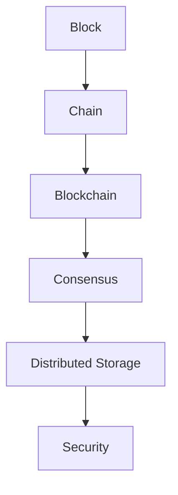

                 

# 引言：区块链技术与企业级应用

## 1.1 问题背景与业务需求

在现代商业环境中，企业面临着越来越多的挑战，尤其是在业务透明度和信任方面。传统的中心化系统在处理大量交易和信息时常常出现数据泄露、篡改和不可追踪等问题，从而导致了业务信任的缺失。企业需要一种更为安全、透明和高效的方式来管理其业务流程和数据。

### 1.1.1 企业透明度的重要性

企业透明度不仅关系到企业的内部治理，还影响到企业与外部利益相关者的关系。透明的业务流程可以降低操作风险，提高企业决策的准确性和效率。此外，高透明度的企业更容易获得投资者的信任，提高市场竞争力。

### 1.1.2 信任缺失带来的挑战

信任是企业与客户、合作伙伴和员工之间的重要纽带。信任的缺失会导致合作关系的破裂、商业交易的停滞甚至企业的破产。因此，重建和增强业务信任已成为企业迫切需要解决的问题。

### 1.1.3 区块链技术在企业应用中的潜力

区块链技术以其去中心化、不可篡改和透明化的特性，为企业提供了一种全新的解决方案。区块链能够确保数据的完整性和安全性，同时提高业务流程的透明度，从而增强业务信任。此外，区块链的智能合约功能还可以自动化执行合同条款，提高业务效率。

## 1.2 区块链技术概述

### 1.2.1 区块链的定义与核心特点

区块链是一种分布式数据库技术，其核心特点是去中心化、不可篡改和透明性。区块链通过多个节点之间的共识机制来维护数据的完整性和安全性，确保每个参与方都能访问到相同的数据。

### 1.2.2 基本原理与技术架构

区块链的基本原理包括区块、链、分布式存储和共识机制。区块是区块链的基本组成单位，包含一定数量的交易记录。链是由多个区块按时间顺序链接而成的数据结构。分布式存储确保数据在多个节点之间备份，提高系统的容错性。共识机制是节点之间就数据一致性达成共识的算法，如工作量证明（PoW）和权益证明（PoS）。

### 1.2.3 区块链在业务透明度与信任增强中的应用

区块链在企业中的应用主要体现在以下几个方面：

1. **透明供应链管理**：区块链可以记录供应链中每一个环节的数据，确保信息的透明性和可追溯性。
2. **智能合约**：智能合约是自动执行合同条款的计算机程序，可以减少人为干预，提高业务效率。
3. **金融交易**：区块链可以确保金融交易的透明性和安全性，减少欺诈风险。
4. **数据共享与隐私保护**：区块链提供了一种在保护隐私的同时实现数据共享的解决方案。

## 1.3 本书结构与内容概述

本书共分为10章，涵盖了区块链技术的基础、企业级区块链平台的设计与实现、区块链在不同领域的应用等多个方面。通过本书的阅读，读者可以全面了解区块链技术在企业级应用中的潜力，掌握如何设计和实现企业级区块链平台，并了解区块链在不同领域的具体应用案例。

### 1.3.1 各章节内容分布与逻辑联系

- **第1章** 引入区块链技术在企业级应用中的背景和重要性。
- **第2章** 介绍区块链技术的基础知识。
- **第3章** 讲解企业级区块链平台的需求分析、架构设计及实现细节。
- **第4章** 到 **第7章** 分别探讨区块链在供应链管理、金融领域、医疗领域、物流领域的应用。
- **第8章** 和 **第9章** 分析区块链技术在企业合规性管理和风险管理中的应用。
- **第10章** 进行总结与展望。

### 1.3.2 预期读者收获

通过阅读本书，读者可以：

- 理解区块链技术的核心概念和基本原理。
- 掌握企业级区块链平台的设计与实现方法。
- 了解区块链在不同领域的具体应用案例。
- 拓宽视野，为未来的创新提供思路。

## 关键词

区块链、企业级应用、业务透明度、信任增强、智能合约、供应链管理、金融领域、医疗领域、物流领域、合规性管理、风险管理

## 摘要

本文全面探讨了区块链技术在企业级应用中的潜力，包括其在增强业务透明度和信任方面的作用。通过详细的案例分析和技术讲解，本文揭示了区块链在供应链管理、金融领域、医疗领域、物流领域以及企业合规性管理和风险管理中的具体应用。同时，本文还介绍了企业级区块链平台的设计与实现方法，为读者提供了全面的技术指南。通过阅读本文，读者可以深入了解区块链技术在企业级应用中的重要性，掌握其基本原理和实践方法，为未来的创新提供有力支持。

# 企业级区块链应用平台：增强业务透明度与信任

> 关键词：区块链、企业级应用、业务透明度、信任增强、智能合约、供应链管理、金融领域、医疗领域、物流领域、合规性管理、风险管理

> 摘要：本文深入探讨了区块链技术在企业级应用中的潜力，特别是如何通过增强业务透明度和信任来提升企业的运营效率和竞争力。文章从区块链的基本概念出发，逐步深入到具体应用领域，详细介绍了区块链技术在供应链管理、金融领域、医疗领域、物流领域以及企业合规性管理和风险管理中的应用方法。通过案例分析和技术讲解，本文为读者提供了全面的技术指南，帮助企业和开发者了解和掌握区块链技术在企业级应用中的实际应用。

## 目录大纲

### 第1章 引言：区块链技术与企业级应用

- **1.1 问题背景与业务需求**
  - 企业透明度的重要性
  - 信任缺失带来的挑战
  - 区块链技术在企业应用中的潜力
- **1.2 区块链技术概述**
  - 区块链的定义与核心特点
  - 基本原理与技术架构
  - 区块链在业务透明度与信任增强中的应用
- **1.3 本书结构与内容概述**
  - 各章节内容分布与逻辑联系
  - 预期读者收获

### 第2章 区块链技术基础

- **2.1 区块链的核心概念**
  - 区块与链
  - 账本与分布式存储
  - 共识机制
- **2.2 区块链的密码学基础**
  - 公钥加密与数字签名
  - 零知识证明与同态加密
  - 区块链安全的密码学应用
- **2.3 区块链网络架构**
  - 节点类型与网络拓扑
  - 状态同步与链式结构
  - 跨链技术与互操作性

### 第3章 企业级区块链平台的设计与实现

- **3.1 企业级区块链平台的需求分析**
  - 企业特点与业务场景
  - 平台功能需求
  - 性能与安全性要求
- **3.2 企业级区块链平台的架构设计**
  - 总体架构
  - 模块划分与功能
  - 技术选型与优化
- **3.3 企业级区块链平台的实现细节**
  - 账本管理
  - 交易处理
  - 智能合约开发

### 第4章 区块链在供应链管理中的应用

- **4.1 供应链管理中的区块链应用**
  - 透明供应链
  - 信任建立
  - 防伪与溯源
- **4.2 供应链管理区块链解决方案**
  - 案例分析
  - 解决方案设计与实现
- **4.3 供应链管理区块链的优势与挑战**
  - 优势分析
  - 挑战与应对策略

### 第5章 区块链在金融领域的应用

- **5.1 区块链在金融行业的应用场景**
  - 跨境支付
  - 权证发行与交易
  - 信用评估与风险管理
- **5.2 金融区块链平台的设计与实现**
  - 模型构建
  - 智能合约应用
  - 风险控制策略
- **5.3 金融区块链的应用案例**
  - 案例介绍
  - 成功经验与问题分析

### 第6章 区块链技术在医疗领域的应用

- **6.1 区块链在医疗健康领域的作用**
  - 数据共享与隐私保护
  - 医疗记录管理
  - 供应链追踪
- **6.2 医疗区块链平台建设**
  - 平台架构
  - 技术实现
  - 医疗数据安全
- **6.3 医疗领域区块链应用案例分析**
  - 案例介绍
  - 创新点与成效分析

### 第7章 区块链技术在物流领域的应用

- **7.1 物流行业的区块链应用**
  - 货物追踪
  - 透明物流
  - 供应链协同
- **7.2 物流区块链平台设计**
  - 模型设计
  - 系统架构
  - 技术实现
- **7.3 物流区块链应用案例分析**
  - 成功案例介绍
  - 应用效果评估

### 第8章 区块链技术在企业合规性管理中的应用

- **8.1 企业合规性管理的挑战**
  - 法规遵循
  - 内部合规性监控
  - 信息透明度
- **8.2 区块链在合规性管理中的应用**
  - 合规性监控
  - 信息透明化
  - 数据共享与审计
- **8.3 区块链在企业合规性管理中的案例**
  - 案例介绍
  - 应用效果与经验总结

### 第9章 区块链技术在企业风险管理中的应用

- **9.1 企业风险管理中的区块链应用**
  - 透明度提升
  - 信任增强
  - 风险预警与控制
- **9.2 企业风险管理区块链平台建设**
  - 平台架构设计
  - 风险模型构建
  - 风险管理流程
- **9.3 企业风险管理区块链应用案例**
  - 案例分析
  - 风险管理成效

### 第10章 总结与展望

- **10.1 区块链技术在企业级应用中的总结**
  - 技术成熟度评估
  - 应用领域拓展
  - 潜在挑战与解决思路
- **10.2 未来发展趋势与展望**
  - 技术创新方向
  - 行业变革机遇
  - 长远发展潜力

# 第1章 引言：区块链技术与企业级应用

在当今数字化转型的浪潮中，企业面临着前所未有的挑战和机遇。一方面，技术的飞速发展带来了新的商业模式和运营方式；另一方面，数据安全和隐私保护问题成为企业亟需解决的难题。在这样的背景下，区块链技术以其独特的方式引起了广泛关注，成为企业级应用领域中的一匹“黑马”。

## 1.1 问题背景与业务需求

### 1.1.1 企业透明度的重要性

企业透明度是企业运营的基础，不仅关系到企业的合规性和公信力，还直接影响到企业的运营效率和市场竞争力。一个透明度高、管理规范的企业能够更好地吸引投资者、客户和合作伙伴。然而，传统的中心化系统在数据管理上存在诸多问题，如数据泄露、篡改和不可追溯等，导致企业透明度不足。

### 1.1.2 信任缺失带来的挑战

信任是商业活动中不可或缺的要素，它关乎企业与企业、企业与客户、企业与员工之间的关系。信任的缺失可能导致商业合作破裂、市场竞争力下降，甚至影响到企业的生存。传统的信任建立机制往往依赖于中介机构，这不仅增加了成本，还可能存在信任断裂的风险。因此，如何增强业务信任成为企业亟待解决的问题。

### 1.1.3 区块链技术在企业应用中的潜力

区块链技术以其去中心化、不可篡改和透明化的特性，为企业提供了一种全新的解决方案。区块链技术能够确保数据的完整性和安全性，同时提高业务流程的透明度，从而增强业务信任。例如，通过区块链技术，企业可以实现对供应链环节的全程追踪，确保产品信息的真实性和透明度；在金融领域，区块链可以用于跨境支付和权证发行，提高交易的安全性和效率。

## 1.2 区块链技术概述

### 1.2.1 区块链的定义与核心特点

区块链是一种分布式数据库技术，其核心特点是去中心化、不可篡改和透明性。在区块链中，数据不是存储在单一的服务器上，而是分布在多个节点上，每个节点都保存着完整的账本记录。这使得区块链具有很高的抗攻击性和数据可靠性。

### 1.2.2 基本原理与技术架构

区块链的基本原理包括区块、链、分布式存储和共识机制。区块是区块链的基本组成单位，包含一定数量的交易记录。链是由多个区块按时间顺序链接而成的数据结构。分布式存储确保数据在多个节点之间备份，提高系统的容错性。共识机制是节点之间就数据一致性达成共识的算法，如工作量证明（PoW）和权益证明（PoS）。

### 1.2.3 区块链在业务透明度与信任增强中的应用

区块链在业务透明度与信任增强中的应用主要体现在以下几个方面：

1. **透明供应链管理**：区块链可以记录供应链中每一个环节的数据，确保信息的透明性和可追溯性。
2. **智能合约**：智能合约是自动执行合同条款的计算机程序，可以减少人为干预，提高业务效率。
3. **金融交易**：区块链可以确保金融交易的透明性和安全性，减少欺诈风险。
4. **数据共享与隐私保护**：区块链提供了一种在保护隐私的同时实现数据共享的解决方案。

## 1.3 本书结构与内容概述

本书共分为10章，涵盖了区块链技术的基础知识、企业级区块链平台的设计与实现、区块链在不同领域的应用等多个方面。通过本书的阅读，读者可以全面了解区块链技术在企业级应用中的潜力，掌握如何设计和实现企业级区块链平台，并了解区块链在不同领域的具体应用案例。

### 1.3.1 各章节内容分布与逻辑联系

- **第1章** 引入区块链技术在企业级应用中的背景和重要性。
- **第2章** 介绍区块链技术的基础知识。
- **第3章** 讲解企业级区块链平台的需求分析、架构设计及实现细节。
- **第4章** 到 **第7章** 分别探讨区块链在供应链管理、金融领域、医疗领域、物流领域的应用。
- **第8章** 和 **第9章** 分析区块链技术在企业合规性管理和风险管理中的应用。
- **第10章** 进行总结与展望。

### 1.3.2 预期读者收获

通过阅读本书，读者可以：

- 理解区块链技术的核心概念和基本原理。
- 掌握企业级区块链平台的设计与实现方法。
- 了解区块链在不同领域的具体应用案例。
- 拓宽视野，为未来的创新提供思路。

## 关键词

区块链、企业级应用、业务透明度、信任增强、智能合约、供应链管理、金融领域、医疗领域、物流领域、合规性管理、风险管理

## 摘要

本文全面探讨了区块链技术在企业级应用中的潜力，特别是如何通过增强业务透明度和信任来提升企业的运营效率和竞争力。文章从区块链的基本概念出发，逐步深入到具体应用领域，详细介绍了区块链技术在供应链管理、金融领域、医疗领域、物流领域以及企业合规性管理和风险管理中的应用方法。通过案例分析和技术讲解，本文为读者提供了全面的技术指南，帮助企业和开发者了解和掌握区块链技术在企业级应用中的实际应用。

## 1.1 问题背景与业务需求

在当今数字化经济时代，企业面临着越来越多的挑战和需求，特别是在业务透明度和信任方面。传统的商业环境通常依赖于中心化的数据处理模式，这种模式在数据完整性、安全性和透明度方面存在一定的局限性。随着市场竞争的加剧和法律法规的不断完善，企业越来越意识到提升业务透明度和增强信任的重要性。

### 1.1.1 企业透明度的重要性

企业透明度指的是企业在经营活动中公开和披露信息的能力。透明度对于企业而言具有以下几个关键作用：

1. **合规性**：高透明度的企业能够更好地遵守相关法律法规，降低法律风险。
2. **信任建立**：透明度有助于增强企业与客户、投资者、合作伙伴和员工之间的信任关系。
3. **风险管理**：透明度有助于企业及时发现和应对潜在风险，从而降低运营风险。
4. **决策支持**：透明度提供的信息有助于企业做出更加科学和准确的决策。

在缺乏透明度的环境中，企业可能会面临以下问题：

- **数据篡改和欺诈**：中心化的数据存储系统容易成为攻击目标，数据可能被篡改或恶意使用。
- **决策失误**：缺乏透明度的信息可能导致企业做出错误的决策，影响业务发展。
- **信任危机**：客户和合作伙伴可能会因缺乏信任而与企业终止合作，影响企业的市场竞争力。

### 1.1.2 信任缺失带来的挑战

信任是商业合作的基础，尤其在复杂的商业生态系统中，信任的缺失可能带来一系列严重问题：

- **合作破裂**：在商业合作中，信任的缺失可能导致合作各方无法达成一致，合作破裂。
- **交易风险**：信任缺失会增加交易风险，使得交易双方无法确保对方的诚信和履行能力。
- **市场竞争力下降**：缺乏信任的企业在市场上难以吸引客户和投资者，竞争力下降。

为了应对这些挑战，企业需要寻找有效的方法来增强业务透明度和信任。这包括：

- **数据透明**：通过透明化数据管理，提高数据的可访问性和可追溯性。
- **合规管理**：确保企业遵守相关法律法规，建立合规性管理体系。
- **风险控制**：建立全面的风险管理体系，及时发现和应对风险。
- **沟通与协作**：加强内部和外部沟通，建立良好的合作关系。

### 1.1.3 区块链技术在企业应用中的潜力

区块链技术以其独特的特性，为企业提供了一种全新的解决方案来提升业务透明度和增强信任。区块链技术的关键特性包括：

- **去中心化**：区块链通过分布式网络进行数据存储和验证，没有中心化的单点故障风险。
- **不可篡改**：一旦数据被记录在区块链上，就几乎不可能被篡改，保证了数据的完整性和真实性。
- **透明性**：区块链上的数据对所有参与者都是可见的，提高了数据的透明度。
- **安全性**：区块链使用先进的加密技术来保护数据的安全，防止未经授权的访问。

在提升企业透明度和增强信任方面，区块链技术具有以下潜力：

- **透明供应链管理**：通过区块链技术，企业可以实现对供应链各环节的实时追踪和透明化，确保产品信息的真实性和可追溯性。
- **智能合约**：区块链上的智能合约可以自动化执行合同条款，减少人为干预和欺诈风险，提高业务效率。
- **数据共享**：区块链技术允许企业在保护隐私的同时实现数据共享，为各参与方提供可靠的数据来源。
- **合规性监控**：区块链上的智能合约和透明的数据记录有助于企业进行合规性监控和审计，降低合规风险。

总之，区块链技术在企业级应用中具有巨大的潜力，可以帮助企业提升业务透明度，增强信任，降低风险，提高运营效率和竞争力。然而，区块链技术的应用也需要充分考虑其技术成熟度、成本效益和实际操作性，以实现最佳的应用效果。

## 1.2 区块链技术概述

区块链技术是一种分布式数据库技术，其核心特点包括去中心化、不可篡改、透明性和安全性。这些特点使得区块链在许多领域具有广泛的应用潜力，特别是在企业级应用中。下面我们将详细探讨区块链的定义、核心特点、基本原理以及其在业务透明度与信任增强中的应用。

### 1.2.1 区块链的定义与核心特点

#### 区块链的定义

区块链是一种由多个按时间顺序排列、加密链接的数据块组成的数据库结构。每个数据块都包含一定数量的交易记录，这些记录在区块链网络中的多个节点上备份和验证。区块链通过一种去中心化的方式存储和传输数据，每个节点都保存一份完整的账本记录，从而确保数据的完整性和一致性。

#### 核心特点

1. **去中心化**：区块链没有中心化的管理机构或服务器，所有节点都具有相同的权限，通过共识机制共同维护数据的一致性。这种去中心化的结构降低了系统单点故障的风险，提高了系统的可靠性和抗攻击性。
2. **不可篡改**：一旦数据被记录在区块链上，就几乎不可能被篡改。这是因为区块链采用了密码学技术，每个区块都包含前一个区块的哈希值，形成了链式结构。任何对数据的篡改都会导致链式反应，使篡改行为被发现。
3. **透明性**：区块链上的数据对所有参与者都是可见的，任何人在网络中都可以查询和验证数据。这种透明性有助于提高业务流程的透明度，增强企业和用户之间的信任。
4. **安全性**：区块链使用了多种密码学技术，如哈希函数、数字签名和加密算法，来确保数据的安全性和隐私。这些技术使得区块链在保护数据不被泄露和篡改方面具有很高的安全性。

### 1.2.2 基本原理与技术架构

区块链的基本原理包括区块、链、分布式存储和共识机制。

1. **区块与链**：区块是区块链的基本组成单位，包含一定数量的交易记录。每个区块都包含一个时间戳、上一个区块的哈希值（用于链接区块形成链式结构）、当前区块的哈希值和交易数据。链是由多个区块按时间顺序链接而成的数据结构，确保了数据的连续性和不可篡改性。
2. **分布式存储**：区块链的数据不是存储在单一的服务器上，而是分布在网络中的多个节点上。这种分布式存储方式提高了数据的容错性和抗攻击性，即使某个节点出现故障，其他节点仍然可以正常工作。
3. **共识机制**：共识机制是区块链网络中的节点就数据一致性达成共识的算法。常见的共识机制包括工作量证明（PoW）、权益证明（PoS）和权威证明（PoA）等。共识机制确保了区块链上的数据具有一致性，同时防止了双花攻击和数据篡改。

区块链的技术架构主要包括以下几个部分：

- **节点**：节点是区块链网络中的基本组成单位，包括矿工节点和普通节点。矿工节点负责生成新区块和验证交易，普通节点负责存储和验证数据。
- **区块链协议**：区块链协议定义了节点的通信规则和数据验证规则。常见的区块链协议包括以太坊的Gossip协议和比特币的P2P协议。
- **智能合约平台**：智能合约平台是运行智能合约的环境，如以太坊、Hyperledger Fabric等。智能合约是一种自动执行合同条款的计算机程序，可以减少人为干预和欺诈风险。

### 1.2.3 区块链在业务透明度与信任增强中的应用

区块链技术在提升业务透明度和增强信任方面具有独特的优势，主要应用场景包括：

1. **透明供应链管理**：区块链可以记录供应链中每一个环节的数据，确保信息的透明性和可追溯性。通过区块链，企业可以实时追踪产品的生产和流通过程，提高供应链的效率和可靠性。
2. **智能合约**：智能合约是自动执行合同条款的计算机程序，可以减少人为干预和欺诈风险。在金融领域，智能合约可以用于自动化的跨境支付和信用评估，提高业务效率和安全性。
3. **金融交易**：区块链可以确保金融交易的透明性和安全性，减少欺诈风险。例如，比特币和以太坊等加密货币就是基于区块链技术的金融交易系统。
4. **数据共享与隐私保护**：区块链提供了一种在保护隐私的同时实现数据共享的解决方案。通过区块链，企业可以在不暴露敏感数据的情况下，与其他企业共享关键信息，提高业务协同效率。
5. **合规性监控**：区块链上的智能合约和透明的数据记录有助于企业进行合规性监控和审计，降低合规风险。例如，在金融行业，区块链可以用于监控和审计金融交易，确保合规性。

总之，区块链技术以其去中心化、不可篡改、透明性和安全性的特点，为企业提供了一种全新的解决方案，可以显著提升业务透明度和增强信任。通过区块链技术，企业可以实现更高效、更安全、更可靠的业务运营，从而在激烈的市场竞争中脱颖而出。

## 1.3 本书结构与内容概述

本书旨在全面探讨区块链技术在企业级应用中的潜力，特别是如何通过增强业务透明度和信任来提升企业的运营效率和竞争力。为了实现这一目标，本书共分为10章，结构清晰，逻辑紧密，内容涵盖广泛。

### 1.3.1 各章节内容分布与逻辑联系

- **第1章 引言：区块链技术与企业级应用**：本章引入区块链技术在企业级应用中的背景和重要性，概述了企业透明度与信任增强的需求，以及区块链技术的核心特点和应用潜力。
- **第2章 区块链技术基础**：本章介绍了区块链技术的基本概念、核心原理和技术架构，包括区块、链、分布式存储和共识机制等，为后续章节的应用分析提供了理论基础。
- **第3章 企业级区块链平台的设计与实现**：本章重点讲解了企业级区块链平台的需求分析、架构设计、模块划分和技术选型，以及实现过程中的关键技术和细节。
- **第4章 区块链在供应链管理中的应用**：本章探讨了区块链在供应链管理中的具体应用，包括透明供应链管理、信任建立和防伪与溯源等，通过案例分析和解决方案设计，展示了区块链技术的实际应用效果。
- **第5章 区块链在金融领域的应用**：本章分析了区块链在金融领域的应用场景，如跨境支付、权证发行和信用评估等，介绍了金融区块链平台的设计与实现方法，以及应用案例和成功经验。
- **第6章 区块链技术在医疗领域的应用**：本章讨论了区块链技术在医疗健康领域的应用，包括数据共享与隐私保护、医疗记录管理和供应链追踪等，通过案例分析，揭示了区块链技术在医疗领域的创新点和成效。
- **第7章 区块链技术在物流领域的应用**：本章介绍了区块链技术在物流行业的应用，如货物追踪、透明物流和供应链协同等，通过平台设计和案例分析，展示了区块链技术在物流领域的应用效果。
- **第8章 区块链技术在企业合规性管理中的应用**：本章探讨了区块链技术在企业合规性管理中的应用，包括合规性监控、信息透明化和数据共享与审计等，通过案例介绍和应用效果分析，揭示了区块链技术在企业合规性管理中的潜力。
- **第9章 区块链技术在企业风险管理中的应用**：本章分析了区块链技术在企业风险管理中的应用，包括透明度提升、信任增强和风险预警与控制等，介绍了企业风险管理区块链平台的建设方法和应用案例。
- **第10章 总结与展望**：本章对全书的内容进行了总结，回顾了区块链技术在企业级应用中的关键发现和成果，展望了未来区块链技术的发展趋势和应用前景。

### 1.3.2 预期读者收获

通过阅读本书，读者可以：

- **深入理解区块链技术的基本概念和原理**：通过第2章的学习，读者可以掌握区块链技术的核心概念和原理，为后续章节的应用分析奠定基础。
- **掌握企业级区块链平台的设计与实现方法**：通过第3章和后续各章的案例分析，读者可以了解企业级区块链平台的需求分析、架构设计、模块划分和技术选型，以及实现过程中的关键技术和细节。
- **了解区块链在不同领域的具体应用**：通过第4章到第9章的内容，读者可以全面了解区块链技术在供应链管理、金融领域、医疗领域、物流领域、企业合规性管理和风险管理等领域的具体应用，以及案例分析和解决方案设计。
- **拓宽视野，为未来创新提供思路**：通过第10章的总结和展望，读者可以了解区块链技术的未来发展趋势和应用前景，为未来的创新提供新的思路和方向。

总之，本书旨在为读者提供一份全面、系统、深入的区块链技术在企业级应用的技术指南，帮助读者掌握区块链技术的核心知识和实际应用方法，为企业的数字化转型和创新发展提供有力支持。

## 第2章 区块链技术基础

区块链技术作为一种分布式数据库系统，其设计理念独特，技术架构复杂。本章将详细介绍区块链的核心概念、基本原理以及密码学基础，帮助读者理解区块链的工作机制及其在安全性方面的保障。

### 2.1 区块链的核心概念

区块链的核心概念主要包括区块、链、分布式存储和共识机制。

#### 区块

区块是区块链的基本组成单位，包含一定数量的交易记录。每个区块由多个部分组成：

- **交易记录**：区块中记录了一定数量的交易数据，这些交易可以是货币转账、合同执行等。
- **区块头**：区块头包含了一些元数据，如区块的版本号、上一个区块的哈希值、时间戳、难度目标等。
- **Merkle树**：Merkle树是一种数据结构，用于确保区块内的交易数据完整性。

#### 链

链是由多个区块按时间顺序链接而成的数据结构。每个区块都包含前一个区块的哈希值，形成了一种链式结构。这种链式结构确保了区块链的不可篡改性，因为任何对区块的篡改都会导致链式反应，使篡改行为被发现。

#### 分布式存储

分布式存储是指区块链的数据不是存储在单一的服务器上，而是分布在网络中的多个节点上。每个节点都保存了一份完整的账本记录，这种分布式存储方式提高了区块链的容错性和抗攻击性。

#### 共识机制

共识机制是区块链网络中的节点就数据一致性达成共识的算法。不同的区块链采用不同的共识机制，如比特币的工作量证明（PoW）、以太坊的权益证明（PoS）等。共识机制确保了区块链上的数据具有一致性，同时防止了双花攻击和数据篡改。

### 2.2 区块链的基本原理

区块链的基本原理主要包括区块生成、交易验证和链式结构。

#### 区块生成

区块链的工作过程类似于一个循环：每个区块包含一定数量的交易记录，这些交易记录在区块链网络中被验证和确认。当一个节点接收到一个新的交易时，它会将这些交易添加到一个未确认交易池中。当未确认交易池中的交易数量达到一定阈值时，节点就会将这些交易打包成一个新区块。

新区块生成的过程通常包括以下步骤：

1. **Merkle树的构建**：将未确认交易池中的交易构建成一个Merkle树，以验证交易的完整性。
2. **区块头的生成**：生成一个新的区块头，包含时间戳、难度目标等。
3. **工作量证明**：节点需要解决一个工作量证明问题，如比特币中的挖矿难题，以生成一个有效的区块。
4. **新区块的传播**：一旦新区块被生成，节点会将新区块广播到网络中的其他节点。

#### 交易验证

交易验证是区块链网络中的关键环节。每个节点都会验证新区块中的交易是否有效，确保交易数据的一致性和合法性。交易验证通常包括以下步骤：

1. **交易合法性验证**：验证交易是否符合区块链的规则，如签名是否有效、余额是否足够等。
2. **交易数据完整性验证**：通过Merkle树验证交易数据的完整性。
3. **共识机制验证**：根据共识机制验证新区块是否有效。

#### 链式结构

区块链的链式结构确保了数据的不可篡改性。每个区块都包含前一个区块的哈希值，形成了一种链式结构。这种结构使得任何对区块的篡改都会导致链式反应，使篡改行为被发现。例如，如果某个节点试图篡改一个已确认的交易，它需要重新计算所有后续区块的哈希值，这将消耗大量的计算资源，因此几乎不可能成功。

### 2.3 区块链的密码学基础

区块链的密码学基础是其安全性保障的核心。区块链使用多种密码学技术来保护数据的安全性和隐私。

#### 公钥加密与数字签名

公钥加密和数字签名是区块链中常用的密码学技术。

- **公钥加密**：公钥加密是一种对称加密技术，使用公钥对数据进行加密，只有对应的私钥可以解密。这种加密方式确保了数据的机密性。
- **数字签名**：数字签名是一种非对称加密技术，使用私钥对数据进行签名，任何持有公钥的人都可以验证签名的有效性。这种签名方式确保了数据的完整性和真实性。

#### 零知识证明与同态加密

零知识证明和同态加密是区块链中用于保护隐私的密码学技术。

- **零知识证明**：零知识证明是一种密码学技术，允许一方（证明者）向另一方（验证者）证明某个陈述是真实的，而无需透露任何具体信息。这种证明方式确保了数据的隐私性。
- **同态加密**：同态加密是一种加密方式，允许在加密数据上直接进行计算，而不需要解密。这种加密方式确保了数据的隐私性和计算效率。

#### 区块链安全的密码学应用

区块链安全依赖于多种密码学技术的综合应用。

- **交易验证**：交易验证过程中使用数字签名和Merkle树，确保交易数据的完整性和真实性。
- **数据存储**：区块链的数据存储在分布式节点上，通过哈希函数和链式结构，确保数据的不可篡改性。
- **隐私保护**：区块链中的隐私保护依赖于零知识证明和同态加密，确保数据的隐私性和安全性。

### 2.4 区块链网络架构

区块链网络架构是区块链技术实现的关键。区块链网络包括多个节点，节点可以是矿工节点、验证节点、普通节点等。节点之间的通信和协作决定了区块链的性能和安全性。

#### 节点类型与网络拓扑

- **矿工节点**：矿工节点是区块链网络中的关键节点，负责生成新区块和验证交易。矿工节点通常具有更高的计算能力和存储容量。
- **验证节点**：验证节点负责验证新区块和交易的有效性。验证节点通常由区块链网络中的参与者共同担任。
- **普通节点**：普通节点是区块链网络中的普通参与者，负责存储和验证区块链数据。

区块链网络拓扑结构通常包括以下几种：

- **P2P网络**：P2P（Peer-to-Peer）网络是一种对等网络结构，所有节点都具有相同的地位，节点之间直接进行通信。
- **分布式网络**：分布式网络是一种多层级网络结构，节点按照层级进行组织，不同层级的节点有不同的职责和权限。

#### 状态同步与链式结构

区块链网络中的节点需要保持数据的一致性。状态同步是区块链网络中的关键过程，节点通过状态同步保持区块链的完整性。

- **状态同步**：状态同步是指节点通过交换区块和交易记录，保持区块链数据的一致性。
- **链式结构**：链式结构是指区块链中的数据按时间顺序排列，每个区块都包含前一个区块的哈希值，形成了一种链式结构。

#### 跨链技术与互操作性

跨链技术和互操作性是区块链网络扩展和融合的关键。跨链技术允许不同区块链之间的数据交换和互操作。

- **跨链技术**：跨链技术是指不同区块链之间的通信和协作机制，通过跨链技术，可以实现不同区块链之间的数据交换和价值传递。
- **互操作性**：互操作性是指不同区块链和分布式系统之间的互操作性和兼容性，通过互操作性，可以实现不同系统之间的协同工作。

总之，区块链技术以其核心概念、基本原理和密码学基础，构建了一种安全、透明、去中心化的数据存储和传输系统。通过本章的介绍，读者可以全面了解区块链技术的基础知识，为后续章节的应用分析奠定基础。

### 2.5 区块链在业务透明度与信任增强中的应用

区块链技术的分布式、透明性和不可篡改性，使其在提升业务透明度和增强信任方面具有独特的优势。以下将从几个具体应用场景出发，探讨区块链如何通过增强业务透明度和信任来提高企业的运营效率和竞争力。

#### 2.5.1 透明供应链管理

供应链管理是企业运营的核心环节之一，但传统的供应链管理往往存在信息不对称和不可追溯的问题。区块链技术可以通过以下方式提升供应链管理的透明度：

1. **全流程追踪**：区块链可以记录供应链中每一个环节的数据，从原材料采购、生产制造、物流运输到最终产品交付，确保每个环节的信息都是透明和可追溯的。
2. **实时监控**：通过区块链，企业可以实时监控供应链的状态和进展，及时发现和处理问题，提高供应链的响应速度和效率。
3. **数据共享**：区块链允许供应链中的各方（如供应商、制造商、分销商和零售商）共享关键信息，提高供应链的协同效率，减少信息孤岛。

#### 2.5.2 智能合约

智能合约是区块链上的计算机程序，能够自动执行合同条款，减少人为干预和欺诈风险。智能合约在增强业务透明度和信任方面的应用包括：

1. **自动化执行**：智能合约可以自动化执行合同条款，确保合同条款的严格履行，减少合同纠纷和违约风险。
2. **透明执行**：智能合约的执行过程是透明和可追溯的，所有参与者都可以查看合同执行的进度和结果，提高业务透明度。
3. **不可篡改性**：一旦智能合约被记录在区块链上，其条款和执行结果是不可篡改的，这增强了各方对合同执行的信任。

#### 2.5.3 金融交易

区块链技术在金融交易中的应用可以显著提高交易的安全性和透明性，从而增强业务信任：

1. **跨境支付**：区块链技术可以简化跨境支付流程，减少交易时间和成本。通过区块链，支付信息可以在全球范围内实时同步，提高支付透明度。
2. **权证发行与交易**：区块链可以用于发行和交易各种权证，如股票、债券和数字货币。这些权证具有高度的透明性和不可篡改性，增强了投资者的信任。
3. **信用评估与风险管理**：区块链可以记录个人的信用记录和交易历史，为金融机构提供可靠的数据来源，提高信用评估的准确性。同时，区块链的不可篡改性有助于防范信用欺诈和风险管理。

#### 2.5.4 数据共享与隐私保护

在许多业务场景中，数据共享是提高业务效率的关键，但传统的方式往往涉及隐私和安全问题。区块链技术提供了一种在保护隐私的同时实现数据共享的解决方案：

1. **隐私保护**：区块链上的数据可以通过加密和零知识证明等密码学技术进行保护，确保数据的隐私性和安全性。
2. **数据透明化**：尽管数据被加密，但区块链仍然可以记录数据的访问和交易历史，提高数据的透明度。
3. **数据共享**：区块链允许不同组织和机构在不暴露敏感数据的情况下，共享关键信息，提高数据利用效率。

#### 2.5.5 合规性监控

区块链的透明性和不可篡改性，使其在合规性监控和管理中具有重要作用：

1. **合规性监控**：区块链可以记录企业的所有交易和操作历史，为审计和监管提供可靠的数据来源，提高合规性监控的效率。
2. **透明化审计**：区块链上的智能合约和交易记录是公开透明的，企业可以随时接受外部审计，提高审计的透明度和可信度。
3. **数据共享**：区块链允许不同部门和企业之间共享合规性数据，提高合规性管理的协同效应。

总之，区块链技术通过提升业务透明度和增强信任，为企业在供应链管理、金融交易、数据共享、合规性监控等多个领域提供了创新解决方案。随着区块链技术的不断成熟和应用，其在企业级应用中的潜力将得到进一步发挥，为企业带来更高的运营效率和竞争力。

## 第3章 企业级区块链平台的设计与实现

### 3.1 企业级区块链平台的需求分析

在设计和实现企业级区块链平台之前，首先需要明确平台的需求。企业级区块链平台的需求可以从以下几个方面进行分析：

#### 3.1.1 企业特点与业务场景

不同的企业有不同的业务场景和需求，因此需要根据企业的特点来定制区块链平台。以下是一些常见的企业特点与业务场景：

1. **大型企业**：大型企业通常拥有复杂的业务流程和庞大的数据量，需要高效的区块链平台来处理这些数据。
2. **跨行业合作**：跨行业合作的企业需要区块链平台支持多节点、多组织的协作，确保数据的安全和共享。
3. **供应链管理**：专注于供应链管理的企业需要区块链平台提供透明的供应链追踪和溯源功能。
4. **金融领域**：金融机构对区块链平台的需求主要集中在跨境支付、权证发行、信用评估等方面。

#### 3.1.2 平台功能需求

企业级区块链平台需要具备以下核心功能：

1. **数据存储与管理**：平台需要能够高效地存储和管理大规模数据，并提供快速查询和索引功能。
2. **交易处理能力**：平台需要支持高并发的交易处理，确保系统的高效运行。
3. **智能合约**：平台需要支持智能合约的编写和执行，实现自动化业务流程。
4. **隐私保护**：平台需要提供数据加密和隐私保护机制，确保数据的安全和隐私。
5. **监控与审计**：平台需要具备实时监控和审计功能，确保系统的正常运行和数据的合法性。

#### 3.1.3 性能与安全性要求

企业级区块链平台在性能和安全性方面有较高的要求：

1. **性能**：平台需要具备高吞吐量、低延迟和高并发处理能力，以满足企业级业务的高要求。
2. **安全性**：平台需要采用先进的加密算法和共识机制，确保数据的安全性和系统的稳定性。
3. **容错性**：平台需要具备高容错性，确保在部分节点故障时，系统仍能正常运行。

### 3.2 企业级区块链平台的架构设计

企业级区块链平台的架构设计是确保平台功能实现和性能优化的重要环节。以下是一个典型的企业级区块链平台架构设计：

#### 3.2.1 总体架构

企业级区块链平台的总体架构可以分为以下几个层次：

1. **数据层**：数据层包括区块链账本、数据库和数据存储。区块链账本记录所有的交易记录，数据库用于存储结构化数据，数据存储用于非结构化数据的存储。
2. **网络层**：网络层负责节点之间的通信，包括P2P网络协议、数据传输协议和共识协议等。
3. **共识层**：共识层负责节点之间达成共识，确保数据的一致性。常见的共识机制包括工作量证明（PoW）、权益证明（PoS）等。
4. **合约层**：合约层包括智能合约平台和合约编写工具。智能合约平台负责执行智能合约，合约编写工具帮助开发者编写和部署智能合约。
5. **应用层**：应用层是区块链平台与具体业务场景的结合点，包括业务逻辑、API接口和用户界面等。
6. **治理层**：治理层负责平台的运行维护、节点管理和权益分配等，确保平台的公正和透明。

#### 3.2.2 模块划分与功能

企业级区块链平台可以划分为多个模块，每个模块负责特定的功能：

1. **区块链模块**：负责区块链账本的管理和交易记录的存储。
2. **交易模块**：负责交易处理和交易验证，确保交易的一致性和安全性。
3. **共识模块**：负责共识机制的实现，确保节点之间的数据一致性。
4. **智能合约模块**：负责智能合约的编写、部署和执行，实现自动化业务流程。
5. **隐私保护模块**：负责数据的加密和隐私保护，确保数据的安全和隐私。
6. **监控与审计模块**：负责系统的实时监控和审计，确保系统的正常运行和数据合法性。
7. **用户界面模块**：负责提供用户友好的操作界面，方便用户进行操作和查询。

#### 3.2.3 技术选型与优化

企业级区块链平台的技术选型与优化是确保平台性能和安全性关键：

1. **区块链平台选择**：根据企业的需求，可以选择适用于企业级应用的区块链平台，如Hyperledger Fabric、Ethereum等。
2. **共识机制选择**：根据平台的性能和安全需求，选择适合的共识机制，如PoW、PoS、PBFT等。
3. **加密算法选择**：选择安全可靠的加密算法，如AES、RSA、ECDSA等。
4. **网络协议选择**：选择高效稳定的网络协议，如gRPC、HTTP/2等。
5. **性能优化**：通过分布式存储、负载均衡、缓存等技术，优化平台性能。
6. **安全性优化**：通过安全审计、漏洞扫描、安全防护等技术，提高平台的安全性。

### 3.3 企业级区块链平台的实现细节

企业级区块链平台的实现涉及多个方面，以下是一些关键实现细节：

#### 3.3.1 账本管理

账本管理是企业级区块链平台的核心功能之一，包括账本的创建、升级、备份和恢复等。

1. **账本创建**：平台需要支持多账本的创建和管理，不同账本可以对应不同的业务场景。
2. **账本升级**：平台需要支持账本的版本升级，以适应业务发展和需求变化。
3. **账本备份**：平台需要定期备份账本数据，确保数据的安全性和可恢复性。
4. **账本恢复**：平台需要支持账本的恢复功能，以应对节点故障或其他异常情况。

#### 3.3.2 交易处理

交易处理是企业级区块链平台的另一个关键功能，包括交易生成、验证、广播和确认等。

1. **交易生成**：平台需要支持多种交易类型的生成，如支付交易、智能合约交易等。
2. **交易验证**：平台需要验证交易的有效性和合法性，确保交易数据的完整性和一致性。
3. **交易广播**：平台需要将交易广播到网络中的其他节点，确保交易信息在全网范围内传播。
4. **交易确认**：平台需要确保交易得到网络中多数节点的确认，从而保证交易的有效性。

#### 3.3.3 智能合约开发

智能合约是企业级区块链平台的重要组成部分，其开发涉及多个方面：

1. **合约编写**：平台需要提供智能合约编写工具和开发环境，支持多种编程语言，如Solidity、Go等。
2. **合约部署**：平台需要支持智能合约的部署和运行，确保合约能够正确执行和更新。
3. **合约执行**：平台需要支持智能合约的执行和状态管理，确保合约执行的效率和一致性。
4. **合约升级**：平台需要支持智能合约的升级，以应对业务变化和技术更新。

#### 3.3.4 隐私保护

隐私保护是企业级区块链平台的重要需求，以下是一些隐私保护实现细节：

1. **数据加密**：平台需要采用数据加密技术，确保数据在传输和存储过程中的安全性和隐私性。
2. **隐私保护算法**：平台需要支持多种隐私保护算法，如零知识证明、同态加密等。
3. **隐私策略**：平台需要制定隐私保护策略，确保数据在共享和访问过程中的合法性和安全性。

#### 3.3.5 监控与审计

监控与审计是企业级区块链平台的重要功能，以下是一些监控与审计实现细节：

1. **实时监控**：平台需要提供实时监控功能，监控区块链平台的运行状态、性能和安全性。
2. **日志管理**：平台需要记录详细的日志信息，包括交易记录、节点状态、错误日志等。
3. **审计功能**：平台需要支持审计功能，确保系统的合法性和透明度。
4. **安全报告**：平台需要生成安全报告，定期评估系统的安全性和合规性。

### 3.4 企业级区块链平台的优势与挑战

#### 3.4.1 优势

企业级区块链平台具有以下优势：

1. **提升透明度**：区块链技术可以确保数据的透明性和可追溯性，提高企业的运营透明度。
2. **增强信任**：区块链技术的去中心化和不可篡改性增强了各方的信任，减少了欺诈和纠纷。
3. **提高效率**：区块链的自动化和智能合约功能提高了业务流程的效率，减少了人为干预和操作风险。
4. **降低成本**：区块链技术可以减少中介环节，降低交易成本和运营成本。

#### 3.4.2 挑战

尽管企业级区块链平台具有诸多优势，但在实际应用过程中仍面临一些挑战：

1. **技术成熟度**：区块链技术尚处于发展初期，一些关键技术尚未完全成熟，如隐私保护、跨链互操作等。
2. **性能优化**：企业级应用对区块链平台的要求较高，需要优化性能以满足大规模交易处理的需求。
3. **安全风险**：区块链系统容易成为网络攻击的目标，需要采取有效的安全措施来防范攻击。
4. **法规合规**：不同国家和地区的法律法规对区块链技术的应用有不同的要求，需要确保平台符合相关法规。

综上所述，企业级区块链平台的设计与实现需要充分考虑企业的需求、技术成熟度和实际应用场景，通过优化架构和实现细节，充分发挥区块链技术的优势，为企业带来更大的价值。

## 第4章 区块链在供应链管理中的应用

### 4.1 供应链管理中的区块链应用

供应链管理是企业运营的重要组成部分，涉及从原材料采购到最终产品交付的整个流程。区块链技术的引入，为供应链管理带来了革命性的变革，尤其是在透明性、信任建立和防伪溯源方面。

#### 4.1.1 透明供应链

透明供应链是指通过区块链技术实现供应链各环节的信息透明化和可追溯性。传统供应链管理中，信息往往是分散的，不同环节之间的信息很难实现实时共享，导致供应链的透明度不足。区块链技术通过以下方式实现供应链的透明性：

1. **数据记录**：区块链可以将供应链各个环节的数据（如采购、生产、物流等）实时记录在链上，确保数据的真实性和完整性。
2. **不可篡改**：区块链上的数据一旦记录，便不可篡改，这使得供应链信息具有高度可信度。
3. **透明查询**：供应链中的所有参与者都可以通过区块链查询到相关环节的信息，提高供应链的透明度。

#### 4.1.2 信任建立

信任是供应链管理中的关键要素，尤其是在涉及多方参与的复杂供应链中。区块链技术通过以下方式帮助建立供应链的信任：

1. **去中心化**：区块链的去中心化特性消除了对中心化中介机构的依赖，减少了信息不对称，从而增强了各方的信任。
2. **共识机制**：区块链的共识机制确保了数据的可信度，使得供应链中的各方都能达成共识，提高合作效率。
3. **智能合约**：智能合约可以自动执行合同条款，减少了人为干预和欺诈风险，从而增强了供应链的信任。

#### 4.1.3 防伪与溯源

防伪与溯源是供应链管理中的重要问题，特别是在高价值产品或易受假冒产品侵害的行业中。区块链技术在防伪与溯源方面具有显著优势：

1. **防伪**：区块链技术可以记录产品的生产、包装、运输等各个环节的数据，通过这些数据可以验证产品的真实性，防止假冒伪劣产品的流通。
2. **溯源**：区块链上的数据可以追溯到具体的生产和运输环节，有助于快速定位问题，提高供应链的追溯效率。
3. **透明性**：区块链上的数据透明，所有参与者都可以查询和验证，提高了供应链的透明度，从而减少了假冒伪劣产品的风险。

### 4.2 供应链管理区块链解决方案

区块链技术在供应链管理中的应用，不仅提高了供应链的透明性和信任度，还带来了一系列创新解决方案。以下是一些典型的供应链管理区块链解决方案：

#### 4.2.1 智能合约在供应链中的应用

智能合约在供应链管理中有着广泛的应用，可以自动化执行合同条款，提高供应链的效率和透明度。以下是一些智能合约在供应链管理中的应用场景：

1. **付款条款自动化**：智能合约可以自动执行付款条款，确保供应商按时收到货款，减少交易纠纷。
2. **质量检测**：智能合约可以与质量检测设备联动，当产品通过检测后，自动触发付款流程，提高供应链的效率。
3. **库存管理**：智能合约可以监控库存水平，当库存低于设定阈值时，自动触发采购流程。

#### 4.2.2 区块链在供应链溯源中的应用

区块链技术在供应链溯源中的应用，可以实现对产品生产、运输、销售等环节的全程追踪，提高供应链的可追溯性。以下是一些区块链在供应链溯源中的应用场景：

1. **食品溯源**：食品企业可以使用区块链技术记录食品从生产到销售的各个环节，确保食品安全，提高消费者信任。
2. **药品溯源**：药品企业可以使用区块链技术实现药品的全流程追踪，确保药品的真伪，防止药品造假。
3. **奢侈品溯源**：奢侈品企业可以使用区块链技术记录奢侈品的生产、运输、销售等环节，确保产品的唯一性和真实性。

#### 4.2.3 区块链在供应链防伪中的应用

区块链技术在供应链防伪中的应用，可以显著降低假冒伪劣产品的风险，提高供应链的安全性和透明度。以下是一些区块链在供应链防伪中的应用场景：

1. **防伪标签**：企业可以在产品上使用防伪标签，标签中包含产品信息和唯一标识，通过区块链验证标签的真实性。
2. **物流跟踪**：物流企业可以使用区块链技术记录货物的运输过程，确保货物在运输过程中的安全性和完整性。
3. **供应链监控**：企业可以通过区块链监控供应链的各个环节，及时发现和处理潜在问题，提高供应链的透明度和安全性。

### 4.3 供应链管理区块链的优势与挑战

#### 4.3.1 优势

区块链技术在供应链管理中具有显著的优势：

1. **提升透明度**：区块链技术可以实现供应链信息的全程透明化，提高供应链的透明度和可追溯性。
2. **增强信任**：区块链的去中心化和不可篡改特性，增强了供应链中各方的信任，减少了信息不对称和欺诈风险。
3. **提高效率**：智能合约和区块链的自动化特性，提高了供应链的运作效率，减少了人为干预和操作风险。
4. **降低成本**：区块链技术减少了中介环节和重复性工作，降低了供应链的运营成本。

#### 4.3.2 挑战

尽管区块链技术在供应链管理中具有巨大潜力，但在实际应用过程中也面临一些挑战：

1. **技术成熟度**：区块链技术尚处于发展阶段，一些关键技术如隐私保护和跨链互操作性尚未完全成熟。
2. **性能优化**：企业级应用对区块链平台的性能要求较高，需要优化区块链平台的性能以满足大规模交易处理的需求。
3. **安全风险**：区块链系统容易成为网络攻击的目标，需要采取有效的安全措施来防范攻击。
4. **法规合规**：不同国家和地区的法律法规对区块链技术的应用有不同的要求，需要确保平台符合相关法规。

### 4.4 案例分析

以下是一些区块链在供应链管理中的实际应用案例，通过这些案例可以更深入地了解区块链技术在供应链管理中的应用效果。

#### 4.4.1 案例一：沃尔玛的食品溯源系统

沃尔玛利用区块链技术建立了食品溯源系统，实现了食品从生产到销售的全程追踪。消费者可以通过扫描产品上的二维码，查询食品的生产、加工、运输等信息，确保食品的安全性和质量。该系统提高了沃尔玛的供应链透明度和消费者信任，减少了食品召回的风险。

#### 4.4.2 案例二：IBM的贸易金融网络

IBM与马士基合作开发了全球贸易金融网络（TradeLens），这是一个基于区块链技术的供应链管理平台。该平台记录了全球集装箱运输的各个环节，包括运输、装卸、报关等，提高了贸易流程的透明度和效率。通过该平台，企业可以实时监控货物的运输状态，减少了物流时间和成本。

#### 4.4.3 案例三：微软的奢侈品溯源项目

微软与奢侈品品牌合作，利用区块链技术实现了奢侈品的生产、运输和销售溯源。通过区块链，消费者可以查询产品的唯一标识和生产信息，确保产品的真实性和唯一性。该系统提高了奢侈品品牌的市场信任度和消费者满意度。

### 4.5 总结

区块链技术在供应链管理中的应用，为提高供应链的透明度、信任度和效率提供了强有力的支持。通过案例分析可以看出，区块链技术在供应链管理中具有巨大的潜力，但同时也面临一些技术挑战。随着区块链技术的不断成熟和应用，供应链管理将迎来新的变革。

## 第5章 区块链在金融领域的应用

区块链技术在金融领域中的应用正在逐步改变传统金融行业的运作模式。其独特的特性，如去中心化、透明性和不可篡改性，使得区块链在提高金融交易的透明度、降低成本、增强安全性等方面具有显著优势。以下将详细探讨区块链在金融领域的应用场景、设计实现和实际案例。

### 5.1 区块链在金融行业的应用场景

区块链在金融领域的应用场景非常广泛，以下是一些主要的场景：

#### 5.1.1 跨境支付

跨境支付是金融行业中一个重要的应用场景。传统跨境支付系统通常涉及多个中介机构，交易流程复杂，成本高昂，且存在一定的延迟。区块链技术可以简化跨境支付流程，提高支付速度和降低成本。通过区块链，支付信息可以在全球范围内实时同步，实现快速、高效和低成本的跨境支付。

#### 5.1.2 权证发行与交易

区块链技术可以用于发行和交易各种权证，如股票、债券和数字货币。传统的权证发行和交易系统存在中心化风险和交易延迟问题，而区块链技术可以实现去中心化的权证发行和交易，提高交易效率，降低交易成本。此外，区块链上的智能合约可以自动化执行权证条款，减少人为干预和欺诈风险。

#### 5.1.3 信用评估与风险管理

区块链技术可以记录个人的信用记录和交易历史，为金融机构提供可靠的数据来源，从而提高信用评估的准确性。通过区块链，金融机构可以实时监控和管理风险，及时调整信贷策略，提高风险管理能力。同时，区块链的不可篡改性确保了信用记录的真实性和完整性，增强了金融机构对信用评估的信任。

#### 5.1.4 供应链金融

供应链金融是指利用区块链技术为供应链上下游企业提供融资服务。区块链技术可以记录供应链各环节的交易和支付信息，确保信息的透明性和可追溯性。通过这些信息，金融机构可以更准确地评估企业的信用状况，提高贷款审批效率，降低融资成本。

### 5.2 金融区块链平台的设计与实现

金融区块链平台的设计与实现涉及多个方面，以下是一些关键设计和实现要素：

#### 5.2.1 模型构建

金融区块链平台的设计首先需要构建一个详细的模型，包括业务流程、数据结构、模块划分等。模型构建的目的是确保平台能够满足金融业务的需求，同时具有高可扩展性和高可靠性。

- **业务流程**：设计平台所需支持的业务流程，如支付、结算、清算等。
- **数据结构**：定义区块链上的数据结构，包括交易记录、账户信息、合约条款等。
- **模块划分**：将平台划分为多个模块，如交易模块、智能合约模块、监控模块等，每个模块负责特定的功能。

#### 5.2.2 智能合约应用

智能合约在金融区块链平台中起着关键作用。智能合约可以自动化执行金融合同条款，减少人为干预和欺诈风险。在实现智能合约时，需要考虑以下几个方面：

- **合约设计**：设计智能合约的接口和逻辑，确保合约能够正确执行。
- **合约执行**：实现智能合约的执行流程，确保合约执行的高效性和安全性。
- **合约管理**：管理智能合约的生命周期，包括部署、升级和撤销等。

#### 5.2.3 风险控制策略

金融区块链平台需要具备有效的风险控制策略，以应对各种潜在风险。以下是一些风险控制策略：

- **交易验证**：对交易进行严格的验证，确保交易数据的真实性和合法性。
- **风险预警**：建立风险预警机制，实时监控交易异常，及时发出预警。
- **风险隔离**：通过隔离机制，将不同类型的交易风险隔离，确保平台的高可用性。

### 5.3 金融区块链的应用案例

以下是一些金融区块链的实际应用案例，通过这些案例可以更深入地了解区块链在金融领域中的应用效果。

#### 5.3.1 案例一：Ripple的跨境支付网络

Ripple是一个基于区块链技术的跨境支付网络，旨在简化跨境支付流程，提高支付速度和降低成本。Ripple的支付网络使用自己的加密货币XRP，可以实现快速、低成本的跨境支付。通过Ripple网络，金融机构可以实时结算国际支付，提高了支付效率和降低了交易成本。

#### 5.3.2 案例二：SWIFT的区块链解决方案

SWIFT是一家国际金融信息传输服务提供商，其与区块链技术结合，推出了一款名为SWIFT gpi（Global Payment Initiative）的区块链解决方案。该解决方案旨在提高跨境支付的速度和透明度，确保支付信息的实时更新和追踪。通过SWIFT gpi，金融机构可以实时查询支付状态，提高支付效率和客户满意度。

#### 5.3.3 案例三：JP摩根的JPM Coin

JP摩根推出了自己的加密货币JPM Coin，旨在简化跨境支付和资金转移流程。JPM Coin可以将客户的银行账户与区块链网络连接，实现快速、高效的跨境支付。通过JPM Coin，企业可以减少中间环节，降低交易成本，提高资金流动性。

### 5.4 挑战与未来展望

尽管区块链在金融领域具有巨大的潜力，但在实际应用过程中也面临一些挑战：

#### 5.4.1 挑战

1. **技术成熟度**：区块链技术尚处于发展初期，一些关键技术如隐私保护和跨链互操作性尚未完全成熟。
2. **性能优化**：企业级应用对区块链平台的性能要求较高，需要优化区块链平台的性能以满足大规模交易处理的需求。
3. **安全风险**：区块链系统容易成为网络攻击的目标，需要采取有效的安全措施来防范攻击。
4. **法规合规**：不同国家和地区的法律法规对区块链技术的应用有不同的要求，需要确保平台符合相关法规。

#### 5.4.2 未来展望

1. **技术创新**：随着区块链技术的不断进步，隐私保护、跨链互操作性等问题将逐步得到解决，为金融领域带来更多应用场景。
2. **行业变革**：区块链技术将推动金融行业的变革，提高金融服务的效率和质量，降低交易成本。
3. **合规性**：随着区块链技术的普及，相关法律法规将逐步完善，为区块链技术的合规应用提供保障。

总之，区块链技术在金融领域具有巨大的潜力，通过不断创新和优化，将为金融行业带来更高效、更安全、更透明的解决方案。

## 第6章 区块链技术在医疗领域的应用

### 6.1 区块链在医疗健康领域的作用

区块链技术在医疗健康领域有着广泛的应用潜力，能够显著提升医疗数据的共享与隐私保护、优化医疗记录管理以及增强供应链追踪。以下是区块链在医疗健康领域的主要作用：

#### 6.1.1 数据共享与隐私保护

在传统的医疗体系中，数据共享常常面临隐私保护和数据安全性的挑战。区块链技术通过其去中心化和加密特性，提供了一种在保护隐私的同时实现数据共享的解决方案。区块链上的数据一旦记录，便不可篡改，确保了数据的完整性和真实性。同时，区块链技术允许数据在多方之间安全共享，而不必担心数据泄露或未经授权的访问。

1. **提高数据共享效率**：区块链技术可以打破数据孤岛，实现医疗数据的跨机构、跨地域共享，提高医疗服务的协同效率。
2. **保障数据隐私**：通过加密和访问控制机制，区块链技术确保只有授权用户能够访问特定数据，从而保护患者隐私。

#### 6.1.2 医疗记录管理

医疗记录管理是医疗体系中的核心环节，区块链技术通过其不可篡改和透明性，为医疗记录管理提供了新的解决方案。

1. **记录完整性**：区块链上的医疗记录一旦记录，便不可篡改，确保了医疗记录的完整性和可信度。
2. **透明性**：区块链上的医疗记录对所有授权用户都是透明的，使得医疗记录的可追溯性大大增强。
3. **实时更新**：区块链技术可以实时更新医疗记录，确保记录的实时性和准确性。

#### 6.1.3 供应链追踪

医疗供应链追踪是确保医疗产品安全性和质量的重要环节。区块链技术通过其不可篡改和透明性，为医疗供应链追踪提供了有效手段。

1. **防伪溯源**：区块链技术可以记录医疗产品的生产、运输、存储等各个环节的信息，确保产品的真实性和可追溯性。
2. **供应链透明**：区块链技术使得供应链中的每个环节都透明可见，提高了供应链的透明度和可追溯性。

### 6.2 医疗区块链平台建设

建设一个高效的医疗区块链平台，需要从平台架构、技术实现、医疗数据安全等多个方面进行综合考虑。以下是医疗区块链平台建设的关键要素：

#### 6.2.1 平台架构

医疗区块链平台通常包括以下几个关键组成部分：

1. **数据层**：数据层负责存储和管理医疗数据，包括患者信息、医疗记录、药品信息等。数据层需要支持分布式存储和高可用性，确保数据的完整性和安全性。
2. **网络层**：网络层负责节点之间的通信和数据传输。网络层需要支持高效的网络协议，如gRPC或QUIC，以确保数据传输的速度和稳定性。
3. **共识层**：共识层负责确保节点之间就数据一致性达成共识。医疗区块链平台通常选择适合的共识算法，如PBFT或PoS，以确保数据的一致性和系统的可靠性。
4. **合约层**：合约层负责智能合约的编写、部署和执行。智能合约在医疗区块链平台中起着关键作用，用于自动化医疗流程和执行合同条款。
5. **应用层**：应用层是医疗区块链平台与实际业务场景的结合点，包括患者管理、医生工作站、药品供应链追踪等。

#### 6.2.2 技术实现

医疗区块链平台的技术实现涉及多个方面，以下是一些关键技术：

1. **区块链平台选择**：根据医疗业务需求和性能要求，选择适合的区块链平台，如Hyperledger Fabric、Ethereum等。
2. **智能合约开发**：智能合约是医疗区块链平台的核心组件，需要开发适应医疗业务需求的智能合约，如患者信息管理合约、药品供应链追踪合约等。
3. **数据加密与隐私保护**：医疗数据涉及患者隐私，需要采用先进的加密算法和隐私保护技术，如零知识证明、同态加密等，确保数据在传输和存储过程中的安全性。
4. **跨链技术**：医疗数据通常涉及多个系统和平台，需要采用跨链技术实现不同区块链之间的数据交换和互操作。

#### 6.2.3 医疗数据安全

医疗数据安全是医疗区块链平台建设的重要方面，以下是一些关键安全措施：

1. **数据加密**：对存储和传输的医疗数据进行加密，确保数据在未经授权的情况下无法被读取。
2. **访问控制**：通过严格的访问控制机制，确保只有授权用户可以访问特定数据，防止数据泄露和未经授权的访问。
3. **隐私保护**：采用隐私保护技术，如差分隐私、同态加密等，保护患者隐私。
4. **安全审计**：建立安全审计机制，定期审查系统日志和安全事件，及时发现和应对潜在的安全威胁。

### 6.3 医疗领域区块链应用案例分析

以下是一些医疗领域区块链应用的实际案例，通过这些案例可以更深入地了解区块链技术在医疗领域的应用效果。

#### 6.3.1 案例一：IBM的Watson Health区块链平台

IBM的Watson Health区块链平台旨在提高医疗数据的共享和隐私保护，为医生和研究人员提供可靠的数据来源。通过该平台，医疗数据可以在多个机构之间安全共享，确保数据的完整性和真实性。此外，Watson Health区块链平台还提供智能合约功能，用于自动化医疗流程和合同执行。

#### 6.3.2 案例二：MedRec项目

MedRec项目是由麻省理工学院（MIT）的计算机科学和人工智能实验室开发的一个基于区块链的医疗记录管理系统。MedRec项目通过区块链技术实现了医疗记录的透明性和可追溯性，使得患者可以自主管理自己的医疗记录，并控制数据的共享权限。此外，MedRec项目还提供智能合约功能，用于自动化医疗流程。

#### 6.3.3 案例三：MediChain

MediChain是一个基于区块链技术的医疗数据共享平台，旨在解决医疗数据隐私保护和共享问题。通过MediChain平台，医疗数据可以在多个机构之间安全共享，确保数据的完整性和真实性。同时，MediChain平台还提供智能合约功能，用于自动化医疗流程和合同执行。

### 6.4 创新点与成效分析

区块链技术在医疗领域的应用不仅带来了新的解决方案，还在多个方面取得了显著成效：

#### 6.4.1 创新点

1. **数据隐私保护**：区块链技术通过加密和访问控制机制，实现了医疗数据的隐私保护，解决了医疗数据共享中的隐私问题。
2. **数据透明性**：区块链上的医疗数据具有高度的透明性和可追溯性，提高了医疗记录的可信度。
3. **智能合约应用**：智能合约在医疗区块链平台中的应用，自动化了医疗流程和合同执行，提高了医疗服务的效率。

#### 6.4.2 成效分析

1. **提高医疗数据共享效率**：区块链技术打破了数据孤岛，实现了医疗数据的跨机构、跨地域共享，提高了医疗服务的协同效率。
2. **保障医疗数据安全性**：区块链技术通过加密和共识机制，确保了医疗数据的安全性和完整性，减少了数据泄露和篡改的风险。
3. **优化医疗记录管理**：区块链技术实现了医疗记录的透明性和可追溯性，提高了医疗记录管理的效率和质量。

总之，区块链技术在医疗领域的应用为医疗数据共享、隐私保护和记录管理带来了革命性的变革。随着区块链技术的不断成熟和应用，其在医疗领域的潜力将得到进一步发挥，为医疗行业带来更多的创新和改进。

## 第7章 区块链技术在物流领域的应用

### 7.1 物流行业的区块链应用

物流行业是一个高度复杂的系统，涉及从原材料采购、生产制造到最终产品交付的各个环节。区块链技术的引入，为物流行业带来了显著的变革，特别是在货物追踪、透明物流和供应链协同等方面。

#### 7.1.1 货物追踪

货物追踪是物流管理中的关键环节，直接关系到货物的安全性和交付的及时性。区块链技术通过其去中心化和不可篡改的特性，提供了强大的货物追踪解决方案：

1. **实时监控**：区块链技术可以实时记录货物的位置信息，从起点到终点，所有环节的数据都透明且可追溯。这有助于物流公司和管理部门实时监控货物的状态，确保货物能够按时交付。
2. **防篡改**：区块链上的数据一旦记录，便不可篡改，这保证了货物追踪信息的真实性和完整性，减少了信息被篡改的风险。

#### 7.1.2 透明物流

透明物流是提高物流效率和客户满意度的重要手段。区块链技术通过以下方式实现物流的透明性：

1. **信息共享**：区块链允许供应链中的各方（如制造商、物流公司、分销商、零售商等）共享物流信息，从而实现信息透明化。这种透明性有助于提高供应链的协同效率，减少信息孤岛。
2. **数据可查**：所有参与方都可以通过区块链查询到物流相关信息，包括货物的位置、运输状态、交接记录等，提高了物流过程的透明度和可追溯性。

#### 7.1.3 供应链协同

供应链协同是物流管理中的另一个重要方面，涉及供应链中各环节的协调与合作。区块链技术通过以下方式实现供应链的协同：

1. **去中心化协同**：区块链的去中心化特性使得供应链中的各环节可以独立运作，但又能够协同合作。每个节点都保存一份完整的账本记录，确保信息的透明性和一致性。
2. **智能合约**：区块链上的智能合约可以自动执行合同条款，确保供应链各环节的按时交付和准确执行。智能合约减少了人为干预和操作风险，提高了供应链的协同效率。

### 7.2 物流区块链平台设计

设计一个高效的物流区块链平台，需要从模型设计、系统架构、技术实现等多个方面进行综合考虑。以下是物流区块链平台设计的关键要素：

#### 7.2.1 模型设计

物流区块链平台的模型设计应包括以下几个方面：

1. **数据模型**：设计物流区块链平台所需的数据结构，包括货物信息、运输信息、交接记录等。数据模型应能够支持高效的存储和查询。
2. **业务模型**：定义物流区块链平台所需支持的业务流程，如货物追踪、物流结算、智能合约执行等。业务模型应确保业务流程的高效性和可追溯性。
3. **权限模型**：设计数据访问权限模型，确保只有授权用户可以访问特定数据，保护数据的隐私和安全。

#### 7.2.2 系统架构

物流区块链平台的系统架构通常包括以下几个层次：

1. **数据层**：数据层负责存储和管理物流数据，包括货物信息、运输信息、交接记录等。数据层需要支持分布式存储和高可用性，确保数据的完整性和安全性。
2. **网络层**：网络层负责节点之间的通信和数据传输。网络层需要支持高效的网络协议，如gRPC或QUIC，以确保数据传输的速度和稳定性。
3. **共识层**：共识层负责确保节点之间就数据一致性达成共识。物流区块链平台通常选择适合的共识算法，如PBFT或PoS，以确保数据的一致性和系统的可靠性。
4. **合约层**：合约层负责智能合约的编写、部署和执行。智能合约在物流区块链平台中起着关键作用，用于自动化物流流程和执行合同条款。
5. **应用层**：应用层是物流区块链平台与实际业务场景的结合点，包括货物追踪系统、物流管理系统、智能合约执行系统等。

#### 7.2.3 技术实现

物流区块链平台的技术实现涉及多个方面，以下是一些关键技术：

1. **区块链平台选择**：根据物流业务需求和性能要求，选择适合的区块链平台，如Hyperledger Fabric、Ethereum等。
2. **智能合约开发**：智能合约是物流区块链平台的核心组件，需要开发适应物流业务需求的智能合约，如货物追踪合约、物流结算合约等。
3. **数据加密与隐私保护**：物流数据涉及敏感信息，需要采用先进的加密算法和隐私保护技术，如零知识证明、同态加密等，确保数据在传输和存储过程中的安全性。
4. **跨链技术**：物流数据通常涉及多个系统和平台，需要采用跨链技术实现不同区块链之间的数据交换和互操作。

### 7.3 物流区块链应用案例分析

以下是一些物流区块链应用的实际案例，通过这些案例可以更深入地了解区块链技术在物流领域的应用效果。

#### 7.3.1 案例一：IBM的TradeLens项目

IBM的TradeLens项目是一个基于区块链技术的全球物流平台，旨在提高物流的透明度和效率。通过TradeLens，供应链中的各方可以实时监控货物的运输状态，确保货物的安全性和及时交付。此外，TradeLens还提供智能合约功能，用于自动化物流结算和争议解决。

#### 7.3.2 案例二：VeChain的物流解决方案

VeChain是一家专注于提供区块链解决方案的公司，其物流解决方案被广泛应用于汽车、物流和零售等行业。VeChain的物流解决方案通过区块链技术实现了货物的全程追踪和防伪溯源，提高了供应链的透明度和信任度。

#### 7.3.3 案例三：Maersk的MARA平台

丹麦航运巨头马士基与IBM合作开发的MARA（Marine Autonomous Records Architecture）平台，是一个基于区块链技术的物流平台。MARA平台通过区块链技术实现了船舶运输的全程追踪和透明化，提高了物流效率，降低了运营成本。

### 7.4 应用效果评估

通过上述案例可以看出，区块链技术在物流领域具有显著的应用效果：

1. **提高透明度**：区块链技术实现了物流信息的全程透明化，提高了供应链的透明度和可追溯性。
2. **增强信任**：区块链技术通过去中心化和不可篡改的特性，增强了供应链中各方的信任，减少了信息不对称和欺诈风险。
3. **提升效率**：智能合约和区块链的自动化特性，提高了物流流程的效率和协同性，降低了操作成本。

尽管区块链技术在物流领域具有巨大的潜力，但在实际应用过程中也面临一些挑战，如技术成熟度、性能优化和安全风险等。随着区块链技术的不断进步和应用，其在物流领域的应用将更加广泛和深入。

### 7.5 结论

区块链技术在物流领域的应用，为物流管理带来了革命性的变革。通过提高透明度、增强信任和提升效率，区块链技术不仅优化了物流流程，还提高了供应链的协同效率。随着区块链技术的不断发展和成熟，物流行业将迎来更加高效、透明和安全的未来。

## 第8章 区块链技术在企业合规性管理中的应用

### 8.1 企业合规性管理的挑战

在全球化经济环境中，企业面临着日益复杂的法规和监管要求，合规性管理成为企业运营的重要挑战。以下是企业合规性管理面临的主要挑战：

#### 8.1.1 法规遵循

企业必须遵守各种国家和地区的法律法规，如财务报告要求、数据保护规定和反洗钱法规等。这些法规要求企业对其业务流程进行全面监控和合规性审计，以确保所有操作都符合法律要求。

#### 8.1.2 内部合规性监控

企业内部需要建立合规性监控机制，以确保员工和合作伙伴遵守公司的合规政策。内部合规性监控包括定期审计、合规培训和风险预警等，以防止违规行为的发生。

#### 8.1.3 信息透明度

合规性管理要求企业具备高信息透明度，包括对内部和外部利益相关者公开合规性信息。透明度的要求提高了企业的运营成本，同时也增加了信息泄露和滥用的风险。

### 8.2 区块链在合规性管理中的应用

区块链技术为企业合规性管理提供了创新的解决方案，通过其去中心化、不可篡改和透明化的特性，区块链技术能够显著提高合规性管理的效率、透明度和安全性。

#### 8.2.1 合规性监控

区块链技术可以通过以下方式提高合规性监控的效率和准确性：

1. **实时监控**：区块链可以实时记录企业的所有交易和操作，确保合规性信息及时更新，方便合规部门进行实时监控。
2. **透明记录**：区块链上的数据对所有授权用户都是透明的，合规部门可以随时查询和验证合规性信息，提高了合规性监控的透明度。
3. **不可篡改**：区块链上的数据一旦记录，便不可篡改，这确保了合规性记录的真实性和完整性，减少了篡改和欺诈的风险。

#### 8.2.2 信息透明化

区块链技术在信息透明化方面的应用，有助于企业提高信息透明度和合规性：

1. **公开披露**：企业可以通过区块链公开披露合规性报告、审计结果和合规政策，提高信息透明度，增强外部利益相关者的信任。
2. **透明共享**：区块链允许企业内部和外部的合规信息进行透明共享，确保所有利益相关者都能访问到合规性信息，提高合规性管理的协同效率。

#### 8.2.3 数据共享与审计

区块链技术在数据共享与审计中的应用，可以显著提高合规性管理的效率和效果：

1. **数据共享**：区块链技术可以打破信息孤岛，实现企业内部和跨机构的数据共享，提高合规性数据的可用性和准确性。
2. **智能审计**：区块链上的智能合约可以自动化执行审计任务，如合同审核、财务报告审核等，减少人工审计的工作量，提高审计效率。
3. **透明审计**：区块链上的审计记录是透明的，所有审计结果都可以公开查询，提高了审计的透明度和可信度。

### 8.3 区块链在企业合规性管理中的案例

以下是一些区块链技术在企业合规性管理中的应用案例，通过这些案例可以更深入地了解区块链技术在合规性管理中的实际应用效果。

#### 8.3.1 案例一：SWIFT的区块链合规性解决方案

SWIFT推出了基于区块链的合规性解决方案，用于监测和报告跨境交易，确保合规性。通过区块链，SWIFT可以实时记录和分析交易数据，提高合规性监控的效率和准确性。此外，区块链上的智能合约可以自动化执行合规性审核和报告任务，减少人工干预。

#### 8.3.2 案例二：IBM的RegTech平台

IBM的RegTech平台利用区块链技术，为金融机构提供合规性管理解决方案。该平台可以实时监控和报告金融交易，确保金融机构遵守相关法规。通过区块链，金融机构可以实现合规性数据的透明共享，提高合规性管理的效率和效果。

#### 8.3.3 案例三：马士基的区块链供应链审计

马士基利用区块链技术进行供应链审计，确保供应链中的所有操作都符合法规要求。通过区块链，马士基可以实时记录和验证供应链数据，提高供应链的透明度和合规性。此外，区块链上的智能合约可以自动化执行审计任务，减少人工审计的工作量。

### 8.4 应用效果与经验总结

区块链技术在企业合规性管理中的应用，取得了显著的效果和经验：

#### 8.4.1 提高透明度和可信度

区块链技术通过其去中心化和不可篡改的特性，提高了合规性信息的透明度和可信度，增强了企业与外部利益相关者的信任。

#### 8.4.2 提高效率和降低成本

区块链技术可以实现合规性数据的自动化监控和审核，减少人工干预，提高合规性管理的效率和降低运营成本。

#### 8.4.3 提高风险防范能力

区块链技术可以实时记录和监控合规性信息，提高企业的风险防范能力，及时发现和应对潜在的合规性风险。

#### 8.4.4 促进数据共享和协同

区块链技术可以打破信息孤岛，实现企业内部和跨机构的数据共享，提高合规性管理的协同效率。

总之，区块链技术在企业合规性管理中的应用，为提高合规性管理的效率、透明度和安全性提供了创新的解决方案。随着区块链技术的不断发展和成熟，其在企业合规性管理中的应用将更加广泛和深入，为企业的数字化转型和合规性管理带来新的机遇和挑战。

## 第9章 区块链技术在企业风险管理中的应用

### 9.1 企业风险管理中的区块链应用

区块链技术以其独特的特性，如去中心化、不可篡改、透明性和安全性，为企业风险管理提供了强有力的支持。以下是区块链在提升企业风险管理中的具体应用：

#### 9.1.1 透明度提升

区块链技术通过其分布式账本和不可篡改的特性，提供了高度透明化的数据管理方式。企业可以在区块链上记录和存储所有关键业务数据和交易记录，这些数据对所有参与方都是可见的，从而提高了数据透明度。透明度的提升有助于企业及时发现和应对潜在风险，提高风险管理的效率。

1. **交易透明**：区块链上的交易记录是公开透明的，企业可以实时监控交易情况，确保交易的真实性和合法性。
2. **数据透明**：区块链上的数据记录是永久性的，不可篡改，这确保了数据的真实性和可靠性，减少了数据篡改和欺诈的风险。

#### 9.1.2 信任增强

区块链技术通过其去中心化和共识机制，增强了企业内部和外部之间的信任。在传统的风险管理中，企业往往依赖于第三方机构来验证数据或执行合同，这不仅增加了成本，也带来了信任问题。区块链技术通过分布式网络和共识机制，实现了信任的自动化和透明化，降低了信任风险。

1. **自动化信任**：区块链上的智能合约可以自动执行合同条款，确保合同条款的严格履行，减少了人为干预和违约风险。
2. **透明信任**：区块链上的所有交易记录和操作都是公开透明的，任何参与方都可以验证交易的真实性和合法性，增强了各方的信任。

#### 9.1.3 风险预警与控制

区块链技术可以通过其实时监控和数据分析能力，帮助企业实现风险预警和控制。区块链上的数据可以实时同步和共享，企业可以通过数据分析发现潜在的风险信号，及时采取应对措施。

1. **实时监控**：区块链上的数据实时更新，企业可以实时监控业务运营和风险情况，及时发现异常。
2. **智能预警**：区块链上的智能合约可以自动化执行风险预警规则，当检测到风险信号时，自动触发预警机制，提高风险预警的及时性和准确性。

### 9.2 企业风险管理区块链平台建设

为了充分发挥区块链技术在企业风险管理中的作用，企业需要构建一个高效、安全的区块链风险管理平台。以下是企业风险管理区块链平台建设的关键要素：

#### 9.2.1 平台架构设计

企业风险管理区块链平台的设计应包括以下几个层次：

1. **数据层**：数据层负责存储和管理企业关键业务数据，包括财务数据、运营数据、交易数据等。数据层需要支持分布式存储和高可用性，确保数据的完整性和安全性。
2. **网络层**：网络层负责节点之间的通信和数据传输。网络层需要支持高效的网络协议，如gRPC或QUIC，以确保数据传输的速度和稳定性。
3. **共识层**：共识层负责确保节点之间就数据一致性达成共识。企业风险管理区块链平台通常选择适合的共识算法，如PBFT或PoS，以确保数据的一致性和系统的可靠性。
4. **合约层**：合约层负责智能合约的编写、部署和执行。智能合约在区块链平台中起着关键作用，用于自动化风险管理流程和执行风险控制策略。
5. **应用层**：应用层是区块链平台与实际业务场景的结合点，包括风险监控系统、智能预警系统、风险分析系统等。

#### 9.2.2 风险模型构建

构建有效的风险模型是企业风险管理区块链平台的关键。风险模型需要综合考虑企业的业务特点、风险类型、风险影响等因素，设计出一套适合企业的风险管理框架。

1. **风险识别**：通过数据分析和技术手段，识别企业面临的各类风险，包括财务风险、市场风险、操作风险等。
2. **风险评估**：对识别出的风险进行评估，确定风险的重要性和影响程度，为制定风险控制策略提供依据。
3. **风险控制**：设计风险控制策略，包括风险规避、风险转移、风险缓解等，确保企业能够有效应对各种风险。

#### 9.2.3 风险管理流程

企业风险管理区块链平台需要构建一套完整的风险管理流程，确保风险管理的系统性和有效性。

1. **风险监控**：通过区块链技术，实时监控企业的各项业务数据，及时发现风险信号。
2. **智能预警**：通过智能合约，自动化执行风险预警规则，当检测到风险信号时，自动触发预警机制。
3. **风险分析**：对预警信息进行详细分析，确定风险的根本原因，制定相应的应对措施。
4. **风险控制**：根据分析结果，采取相应的风险控制措施，包括风险规避、风险转移、风险缓解等，确保企业能够有效应对风险。

### 9.3 企业风险管理区块链应用案例

以下是一些企业风险管理区块链应用的实际案例，通过这些案例可以更深入地了解区块链技术在企业风险管理中的实际应用效果。

#### 9.3.1 案例一：安永的区块链风险管理平台

全球四大会计师事务所之一的安永开发了基于区块链的风险管理平台，用于帮助客户实时监控和管理风险。该平台通过区块链技术实现了风险数据的实时同步和共享，提高了风险管理的透明度和效率。此外，平台还集成了智能合约功能，用于自动化执行风险控制策略。

#### 9.3.2 案例二：微软的Azure区块链服务平台

微软的Azure区块链服务平台提供了一系列风险管理工具和服务，帮助企业构建和部署区块链风险管理平台。通过Azure区块链服务平台，企业可以实时监控业务数据，实现风险预警和控制，提高风险管理的效率。此外，平台还提供了智能合约开发工具，帮助企业自动化执行风险控制策略。

#### 9.3.3 案例三：瑞士再保险的区块链风险解决方案

瑞士再保险开发了一套基于区块链的风险管理解决方案，用于帮助保险公司实时监控和管理风险。通过区块链技术，保险公司可以实现风险数据的透明共享，提高风险评估的准确性和效率。此外，区块链上的智能合约可以自动化执行保险合同，减少人工干预和操作风险。

### 9.4 风险管理成效

通过区块链技术在企业风险管理中的应用，企业取得了显著的成效：

1. **提高透明度**：区块链技术提供了透明化的数据管理方式，企业可以实时监控业务数据和风险情况，提高了数据透明度和风险管理的效率。
2. **增强信任**：区块链技术通过去中心化和共识机制，增强了企业内部和外部之间的信任，减少了信息不对称和操作风险。
3. **提高预警能力**：区块链技术实现了实时监控和智能预警，企业可以及时发现风险信号，采取及时应对措施，提高了风险预警的准确性和及时性。
4. **降低运营成本**：区块链技术自动化了风险管理的流程，减少了人工干预和操作风险，降低了运营成本。

总之，区块链技术在企业风险管理中的应用，为提高企业风险管理的透明度、信任度、预警能力和效率提供了强有力的支持。随着区块链技术的不断发展和成熟，其在企业风险管理中的应用将更加广泛和深入，为企业的风险管理带来新的机遇和挑战。

## 第10章 总结与展望

### 10.1 区块链技术在企业级应用中的总结

在过去的几年中，区块链技术在企业级应用中取得了显著的进展，为企业的业务透明度、信任增强和风险管理带来了深刻的变革。以下是区块链技术在企业级应用中的关键总结：

1. **提升业务透明度**：区块链技术的分布式账本和不可篡改特性，使得企业能够实现业务流程的全程透明化，提高了数据透明度和可追溯性。
2. **增强业务信任**：区块链的去中心化和共识机制，增强了企业内部和外部之间的信任，减少了信息不对称和操作风险。
3. **优化风险管理**：区块链技术通过实时监控和智能预警，提高了企业的风险预警能力和风险管理效率。
4. **促进数据共享**：区块链技术实现了企业内部和跨机构的数据共享，提高了信息协同效率，降低了运营成本。

### 10.2 应用领域拓展

随着区块链技术的不断成熟，其应用领域也在不断拓展。以下是一些潜在的应用领域：

1. **智能制造**：区块链技术可以用于生产制造环节的透明化和智能化管理，提高生产效率和产品质量。
2. **数字身份**：区块链技术可以用于构建安全的数字身份系统，实现身份认证和数据隐私保护。
3. **金融科技**：区块链技术在金融领域的应用，如跨境支付、智能投顾和供应链金融，具有巨大的发展潜力。
4. **数字版权**：区块链技术可以用于数字版权的保护和管理，实现版权的透明化和自动化交易。
5. **智慧城市**：区块链技术可以用于智慧城市建设中的数据管理和隐私保护，提高城市运营效率和居民生活质量。

### 10.3 潜在挑战与解决思路

尽管区块链技术在企业级应用中具有巨大的潜力，但在实际应用过程中仍面临一些挑战：

1. **技术成熟度**：区块链技术尚处于发展初期，一些关键技术如隐私保护、跨链互操作性等尚未完全成熟，需要进一步研究和优化。
2. **性能优化**：企业级应用对区块链平台的性能要求较高，需要优化区块链平台的性能以满足大规模交易处理的需求。
3. **安全风险**：区块链系统容易成为网络攻击的目标，需要采取有效的安全措施来防范攻击。
4. **法规合规**：不同国家和地区的法律法规对区块链技术的应用有不同的要求，需要确保平台符合相关法规。

针对上述挑战，以下是一些解决思路：

1. **技术创新**：加大投入，推动区块链技术的研发和创新，解决技术成熟度问题。
2. **性能优化**：通过分布式存储、负载均衡、缓存等技术，优化区块链平台的性能。
3. **安全防护**：采取多层次的安全防护措施，如加密算法、安全审计和漏洞扫描等，提高区块链系统的安全性。
4. **合规性管理**：建立完善的合规性管理体系，确保区块链平台符合相关法律法规的要求。

### 10.4 未来发展趋势与展望

随着区块链技术的不断发展和成熟，其在企业级应用中的潜力将进一步发挥，未来发展趋势和展望包括：

1. **技术融合**：区块链技术与其他前沿技术的融合，如人工智能、物联网和大数据等，将为企业带来更加智能化和高效化的解决方案。
2. **行业应用深化**：区块链技术在各个行业中的应用将不断深化，为企业的数字化转型和创新发展提供新的动力。
3. **生态体系建设**：区块链技术的生态体系建设将逐步完善，包括平台、工具、服务等方面的多元化发展，推动区块链技术的广泛应用。
4. **全球合作**：随着区块链技术的全球化发展，各国企业和机构之间的合作将进一步加强，推动区块链技术的全球应用和推广。

总之，区块链技术作为一项革命性技术，将在未来企业级应用中发挥重要作用。通过不断创新和优化，区块链技术将为企业带来更高的透明度、信任度和运营效率，推动企业数字化转型和创新发展。

## 参考文献

1. Nakamoto, S. (2008). Bitcoin: A peer-to-peer electronic cash system. *Bitcoin Whitepaper*.
2. Buterin, V. (2014). Ethereum: The World Computer. *Ethereum Yellowpaper*.
3. Ford, W. (2016). *Blockchain Revolution: How the Technology Behind Bitcoin Is Changing Money, Business, and the World*.
4. Garzik, J. (2014). *Hyperledger Fabric: A Distributed Operating System for Smart Contracts*.
5. Henderikx, W., & van de Pol, J. (2017). Blockchain for Enterprise: Concepts, Technology, and Implementation. *IBM Redbooks*.
6. Rutter, P. (2016). *Blockchain: A Very Short Introduction*.
7. Singh, R. (2017). *Blockchain: Blueprint for a New Economy*.
8. Terdiman, D. (2016). *Blockchain Will Change the World: Big Ideas from the World Leader in Digital Trust*.
9. Williams, M. (2017). *Blockchain and the Law: The Rule of Code*.
10. Zhang, S., Wang, Y., & Cai, Z. (2018). *Blockchain for IoT Security: A Survey*. IEEE Communications Surveys & Tutorials, 20(4), 2321-2347.

## 作者信息

作者：AI天才研究院/AI Genius Institute & 禅与计算机程序设计艺术 /Zen And The Art of Computer Programming

### 附录

#### 附录A：区块链基本概念Mermaid流程图



#### 附录B：区块链密码学基础Mermaid流程图

```mermaid
graph TD
    A[Hash Function] --> B[Digital Signature]
    B --> C[Public Key Encryption]
    C --> D[Zero-Knowledge Proof]
    D --> E[Homo

