                 

### 设计书籍目录大纲的步骤

设计一个书籍目录大纲，尤其是针对技术类书籍，需要遵循以下步骤：

#### 1. 理解书籍主题

- **核心概念**：明确书中的核心概念和术语。例如，在《企业级可解释AI平台：增强决策透明度》中，核心概念包括可解释AI、透明度、模型可解释性、数据预处理、模型训练、模型评估等。
- **目标读者**：确定目标读者群体，这将影响目录的详细程度和内容的深入程度。例如，本书的目标读者可能是企业级AI工程师、数据科学家、软件开发人员，或者是希望了解AI应用的企业管理层。
- **内容范围**：梳理书籍的主要内容，确定涵盖的范围和深度。例如，本书将涵盖可解释AI的基础理论、平台架构设计、应用实践、部署与维护，以及未来发展趋势等。

#### 2. 制定大纲框架

- **章节划分**：根据书籍的主题和内容，划分出主要章节。例如，本书可以分为三大部分：背景介绍、平台架构、应用实践。
- **章节标题**：为每个章节拟定简明扼要的标题。例如，“第1章：企业级可解释AI平台概述”，“第2章：可解释AI的核心概念与联系”，“第3章：可解释AI平台架构设计”等。
- **逻辑顺序**：确保章节之间的逻辑顺序合理，有利于读者的阅读和理解。例如，背景介绍部分应该先介绍核心概念和问题背景，再逐步深入到平台架构和应用实践。

#### 3. 添加子章节和内容摘要

- **细化内容**：在每个主要章节下，划分出子章节。例如，在“第2章：可解释AI的核心概念与联系”中，可以划分为“2.1 可解释AI的核心概念”，“2.2 可解释AI与不可解释AI对比”，“2.3 可解释AI相关技术”等子章节。
- **内容摘要**：为每个子章节撰写简短的内容摘要，概括该部分的主要内容。例如，“2.1 可解释AI的核心概念”摘要可以是：“本节介绍可解释AI的定义、核心概念和重要性。”

#### 4. 考虑特殊格式和视觉元素

- **流程图和图表**：设计合适的流程图、表格和图表，帮助解释复杂概念。例如，可以绘制“可解释AI平台架构设计流程图”和“可解释AI相关技术对比表格”。
- **代码示例**：准备与内容相关的代码示例，便于读者实践和深入理解。例如，在“第3章：可解释AI平台架构设计”中，可以包含“数据预处理代码示例”和“模型训练代码示例”。

#### 5. 审稿和修改

- **内部审阅**：由作者或同事审阅目录大纲，提出修改意见。例如，审稿人可能会指出某些章节内容重复或逻辑顺序不合理。
- **调整优化**：根据反馈调整大纲结构，确保内容的连贯性和逻辑性。例如，可以将某些章节合并或拆分，以使内容更加紧凑和有序。

### 下面开始为《企业级可解释AI平台：增强决策透明度》设计目录大纲

#### 第一部分: 背景介绍

##### 第1章: 企业级可解释AI平台概述

###### 1.1 问题背景与定义

- **问题背景**：企业应用AI模型面临的透明度挑战
- **可解释AI定义**：可解释AI的概念和重要性
- **边界与外延**：与机器学习、数据科学的关系

###### 1.2 企业级可解释AI的意义

- **增强决策透明度**：如何通过可解释AI实现
- **合规性和信任**：可解释AI在法律法规和商业伦理中的应用
- **业务价值**：可解释AI如何提升企业竞争力

##### 第2章: 可解释AI的核心概念与联系

###### 2.1 可解释AI的核心概念

- **模型可解释性**：定义和分类
- **模型属性特征**：特征重要性和模型透明度

###### 2.2 可解释AI与不可解释AI对比

- **不可解释AI的局限性**：风险和挑战
- **可解释AI的优势**：应用场景和解决方案

###### 2.3 可解释AI相关技术

- **LIME**：本地可解释模型解释方法
- **SHAP**：SHapley Additive exPlanations方法
- **其他可解释AI技术**：案例介绍

#### 第二部分: 可解释AI平台架构

##### 第3章: 可解释AI平台架构设计

###### 3.1 平台架构概述

- **系统架构**：整体架构设计和模块划分
- **技术栈**：使用的主要技术栈和框架

###### 3.2 数据预处理

- **数据收集**：数据来源和数据质量
- **数据清洗**：缺失值处理、异常值检测与修正

##### 第4章: 模型训练与可解释性评估

###### 4.1 模型选择与训练

- **常用模型**：监督学习、无监督学习和半监督学习
- **模型训练流程**：数据处理、模型选择、训练与验证

###### 4.2 模型可解释性评估

- **评估指标**：可解释性评估标准
- **可解释性工具**：LIME、SHAP等工具的使用

#### 第三部分: 应用实践

##### 第5章: 可解释AI在企业中的应用案例

###### 5.1 案例介绍

- **案例背景**：企业应用场景介绍
- **问题分析**：业务问题和数据挑战

###### 5.2 模型设计与实现

- **模型选择**：根据业务需求选择模型
- **模型训练与优化**：模型训练流程和参数调优

##### 第6章: 可解释AI平台部署与维护

###### 6.1 平台部署

- **部署环境**：硬件和软件配置
- **部署策略**：容器化、云部署等方案

###### 6.2 平台维护

- **监控与优化**：系统性能监控和调优
- **安全性与合规性**：数据安全和隐私保护

##### 第7章: 可解释AI的未来发展趋势

###### 7.1 技术发展趋势

- **模型压缩与加速**：模型压缩、量化、硬件加速等
- **跨领域应用**：医疗、金融、制造业等领域的应用前景

###### 7.2 社会影响与伦理挑战

- **决策透明度与隐私保护**：可解释AI在隐私保护和数据安全方面的挑战
- **社会伦理**：可解释AI对商业伦理和社会影响

### 目录大纲的设计原则

在设计书籍目录大纲时，需要遵循以下原则：

#### 1. 结构清晰

- 目录结构要清晰，便于读者理解书籍的整体结构和逻辑。
- 每个章节的主题要明确，避免内容重叠或跳跃。

#### 2. 内容连贯

- 确保章节之间的逻辑关系紧密，内容连贯，有助于读者的阅读和理解。
- 在必要时，可以在章节之间加入过渡性内容，使读者更容易过渡到下一个主题。

#### 3. 重点突出

- 确保目录大纲能够突出书籍的核心内容和重点章节。
- 对于重要概念、技术或应用案例，可以在章节标题或内容摘要中予以强调。

#### 4. 易于扩展

- 设计大纲时，要考虑到未来可能的内容扩展和修订。
- 确保目录结构灵活，能够容纳新的章节或内容。

#### 5. 视觉吸引力

- 目录大纲的设计要美观，视觉上吸引读者。
- 可以使用不同的字体、颜色和格式来突出重点，使目录更加生动。

### 总结

设计书籍目录大纲是一个系统性、层次性的工作，需要充分考虑书籍的主题、目标读者、内容范围等因素。通过遵循设计原则，可以设计出一个结构清晰、内容连贯、重点突出、易于扩展和视觉吸引人的目录大纲，为读者提供良好的阅读体验。在接下来的章节中，我们将深入探讨《企业级可解释AI平台：增强决策透明度》的核心概念、平台架构、应用实践和未来发展趋势，以满足读者的需求。
## 文章标题：企业级可解释AI平台：增强决策透明度

关键词：可解释AI、企业级、决策透明度、平台架构、应用实践

摘要：本文将深入探讨企业级可解释AI平台的设计与实现，以及其在增强决策透明度方面的应用。首先，我们将介绍可解释AI的核心概念和重要性，并分析企业级可解释AI的背景和意义。接着，我们将详细阐述可解释AI平台架构的设计原则和关键技术，包括数据预处理、模型训练和评估。随后，我们将通过实际应用案例，展示可解释AI平台在企业中的具体应用和效果。最后，我们将展望可解释AI的未来发展趋势，以及可能面临的挑战和解决方案。通过本文的阅读，读者将全面了解企业级可解释AI平台的设计理念、技术实现和应用实践，为企业在AI领域的发展提供有力支持。
### 第一部分：背景介绍

#### 1.1 问题背景与定义

在当今数字化时代，人工智能（AI）技术已成为驱动企业创新和增长的关键力量。AI模型在企业中的应用，无论是预测分析、推荐系统还是自动化决策，都为企业带来了显著的效率和效益。然而，随着AI模型在企业中应用范围的扩大，一个日益突出的问题也逐渐显现——模型透明度的缺乏。

**问题背景**：

企业级AI模型通常基于大量复杂的数据和算法，其决策过程往往被视为“黑箱”，即外部难以理解和解释。这种透明度不足的问题，尤其在涉及商业决策、金融风险评估或医疗诊断等关键领域时，引发了广泛的担忧。具体表现为：

- **决策不可解释**：企业无法清晰地解释AI模型为何做出特定决策，导致信任度下降。
- **合规性风险**：在许多行业，如金融、医疗和司法等领域，对模型决策的透明度有严格的法律要求。
- **优化困难**：由于无法理解模型的决策过程，企业难以针对性地优化和改进模型。

**定义**：

为了解决上述问题，我们需要引入“可解释AI”这一概念。可解释AI（Explainable AI, XAI）是指设计、开发和评估人工智能系统，使得模型的决策过程对人类用户可理解、可解释。它旨在平衡AI模型的准确性、效率和可解释性，使得企业能够理解模型的决策逻辑，从而增强对AI的信任和依赖。

**边界与外延**：

可解释AI并非旨在取代传统机器学习模型的不可解释性，而是在其基础上提供额外的解释能力。它涉及多个学科，包括计算机科学、心理学、认知科学、统计学和哲学。可解释AI的目标是：

- **增强透明度**：使AI模型的决策过程对企业和用户更加透明。
- **提高信任度**：通过解释能力，增强用户对AI模型决策的信任。
- **改进可接受性**：在特定应用场景中，确保AI模型的决策符合法律法规和社会伦理标准。
- **优化与改进**：通过可解释性分析，帮助企业更好地理解模型行为，从而优化模型性能。

在理解了可解释AI的核心概念和重要性后，我们可以看到，其在企业级应用中具有巨大的潜力和必要性。接下来的章节将详细探讨企业级可解释AI平台的设计和实现，以应对透明度挑战，并为企业提供强有力的支持。
### 1.2 企业级可解释AI的意义

企业级可解释AI平台不仅在技术层面具有重要意义，更在商业和社会层面上产生了深远影响。以下是企业级可解释AI平台的主要意义：

#### 增强决策透明度

可解释AI的核心目标之一是增强决策透明度，使得企业能够理解和解释AI模型的决策过程。在许多关键业务领域，如金融风险评估、医疗诊断和供应链管理，决策过程的透明度至关重要。通过可解释AI，企业可以清晰地了解AI模型为何做出特定决策，从而增强对模型决策的信任和依赖。具体来说，这包括：

- **提升业务可解释性**：企业内部员工可以更容易地理解AI模型的决策逻辑，从而提高业务流程的透明度和效率。
- **增强用户信任**：对于直接面向客户的AI系统，如推荐系统和自动化客服，可解释AI有助于建立用户对系统的信任，提高用户满意度和忠诚度。

#### 合规性和信任

在多个行业，如金融、医疗和司法，模型决策的透明度受到严格的法律和道德要求。可解释AI平台帮助企业满足这些合规要求，减少法律风险。具体包括：

- **法律合规**：在金融领域，例如反洗钱（AML）和信用评分，可解释AI有助于确保模型决策符合相关法律法规。
- **道德标准**：在医疗领域，可解释AI可以帮助确保模型决策符合伦理标准，避免出现歧视或不公平的情况。
- **企业信誉**：通过提供透明的决策过程，企业可以提高其品牌声誉和公众信任，增强市场竞争力。

#### 业务价值

可解释AI平台不仅解决了技术问题，还为企业带来了直接的业务价值。以下是可解释AI平台在业务层面的一些潜在价值：

- **模型优化**：通过可解释性分析，企业可以识别模型中的潜在问题，针对性地优化和改进模型，提高模型性能。
- **风险控制**：在金融领域，可解释AI可以帮助企业更好地识别和管理风险，降低金融风险。
- **创新应用**：可解释AI使得企业能够更灵活地尝试新的AI应用场景，例如在制药行业，可解释AI可以帮助发现新的药物靶点。

#### 社会影响

可解释AI不仅对企业有重要影响，对社会也有深远的积极影响。以下是可解释AI平台在社会层面的影响：

- **公平与正义**：在司法领域，可解释AI有助于确保司法决策的透明度和公正性，减少偏见和歧视。
- **公众信任**：在公共领域，如公共安全和社会服务，可解释AI可以提高公众对AI系统的信任，促进技术接受度。
- **教育与普及**：可解释AI有助于提高公众对AI技术的理解和接受度，促进AI技术在各行业的普及和应用。

综上所述，企业级可解释AI平台在增强决策透明度、合规性、业务价值和社会影响等方面具有重要意义。它不仅为企业提供了强大的技术支持，还为社会带来了积极的变化。随着AI技术的不断发展和应用场景的扩大，可解释AI平台的作用将越来越重要，为企业和社会带来更多的价值。
### 1.3 企业级可解释AI的核心概念与联系

#### 模型可解释性

**定义**：

模型可解释性是指模型决策过程对于人类用户可理解、可解释的程度。在机器学习领域，大多数模型（如深度神经网络）被广泛认为具有高度的非线性复杂性和不可解释性，即其决策过程对于外部观察者来说是“黑箱”式的。相反，可解释性模型（如线性回归、决策树等）则具有更直观和透明的决策过程。

**分类**：

- **高可解释性模型**：如线性回归、决策树、规则集等，这些模型具有清晰的决策路径和易于解释的特征权重。
- **中度可解释性模型**：如随机森林、梯度提升树等，这些模型在解释性上介于完全不可解释的深度神经网络和完全可解释的传统模型之间。
- **低可解释性模型**：如深度神经网络、生成对抗网络（GAN）等，这些模型具有高度的复杂性和非线性，决策过程难以解释。

#### 模型属性特征

**特征重要性**：

在可解释AI中，特征重要性是一个关键概念。它指的是模型中各个特征对于预测结果的影响程度。例如，在信用评分模型中，特征重要性分析可以帮助我们识别哪些因素（如收入、信用历史等）对信用评分有最大影响。

**模型透明度**：

模型透明度是指模型决策过程的可视化和解释能力。高透明度的模型允许用户直观地理解决策过程，而低透明度的模型则难以提供详细的解释。

#### 模型可解释性与不可解释性对比

**不可解释AI的局限性**：

- **决策不可解释**：不可解释AI模型（如深度神经网络）的决策过程对于用户来说是“黑箱”式的，难以理解和解释。
- **优化困难**：由于无法理解模型的决策过程，用户难以针对性地优化和改进模型。
- **合规性挑战**：在需要严格合规的行业（如金融、医疗等），不可解释AI模型的决策过程可能不符合法律法规和伦理要求。

**可解释AI的优势**：

- **决策可解释**：可解释AI模型提供了清晰的决策路径和易于解释的特征权重，用户可以直观地理解模型决策。
- **优化便捷**：通过可解释性分析，用户可以更好地理解模型行为，从而针对性地优化和改进模型。
- **合规性支持**：可解释AI模型能够帮助企业在合规性要求较高的领域（如金融、医疗等）满足相关法律法规和伦理要求。

#### 可解释AI相关技术

为了实现模型的可解释性，研究人员和工程师开发了多种技术方法。以下是几种常用的可解释AI技术：

- **LIME（Local Interpretable Model-agnostic Explanations）**：LIME是一种本地可解释模型，它通过加扰和回归分析来解释模型决策。
- **SHAP（SHapley Additive exPlanations）**：SHAP方法基于博弈论原理，计算特征对模型预测的贡献。
- **决策树和规则集**：这些传统模型具有高度的可解释性，用户可以直观地理解决策过程。
- **可视化和图表**：通过数据可视化、决策路径图和特征重要性图表，用户可以更好地理解模型决策。

在实际应用中，不同技术方法可以根据具体需求和场景进行选择和组合，以实现最佳的模型解释效果。以下是一个简单的ER实体关系图架构，用于展示可解释AI相关技术的联系：

```mermaid
erDiagram
  Model(A) ||--|{ Attribute(B) }
  Model(A) ||--|{ Feature(C) }
  Model(A) ||--|{ Explanation(D) }
  LIME(E) ..|> Model(A) : based on
  SHAP(F) ..|> Model(A) : based on
  Visualization(G) ..|> Model(A) : based on
```

在这个ER图中，模型（Model）是核心实体，其关联着属性（Attribute）、特征（Feature）和解释（Explanation）。LIME（本地可解释模型）和SHAP（SHapley Additive explanations）等可解释AI技术方法与模型实体关联，用于生成解释。可视化（Visualization）技术则用于展示这些解释。

通过上述核心概念和技术的介绍，我们可以更好地理解企业级可解释AI的原理和实现方法。在接下来的章节中，我们将深入探讨企业级可解释AI平台的架构设计，以及其实际应用案例，以帮助读者全面了解这一领域的实践应用。
### 2.1 可解释AI的核心概念

可解释AI（Explainable AI, XAI）是人工智能（AI）研究中的一个重要分支，旨在开发出能够向人类用户解释其决策过程的人工智能系统。在传统机器学习模型中，尤其是深度学习模型，其决策过程往往被视为一个“黑箱”，即其内部机制对外部用户来说是不透明的。这种不可解释性虽然在某些应用场景中（如语音识别、图像识别等）可以接受，但在涉及决策透明度要求较高的领域（如医疗诊断、金融风险评估等），不可解释性成为了一个重大挑战。

#### 定义

可解释AI的定义可以从多个角度进行阐述：

1. **决策过程可解释性**：可解释AI的核心目标是开发出能够向人类用户解释其决策过程的人工智能系统。这意味着，用户可以清晰地理解模型为何做出特定决策，以及决策背后的逻辑和原因。

2. **模型透明度**：可解释AI不仅关注模型的决策过程，还包括模型本身的透明度。高透明度的模型使得用户可以直观地了解模型的内部结构和参数，从而增强对模型的信任。

3. **可理解性**：可解释AI旨在提高模型的可理解性，使得非专业用户也能理解模型的决策过程。这有助于提高AI系统的用户接受度和采纳率。

#### 核心概念

可解释AI的核心概念包括：

- **特征重要性**：特征重要性是衡量模型中各个特征对预测结果影响程度的一个指标。通过分析特征重要性，用户可以了解哪些特征对模型决策最为关键。

- **决策路径**：决策路径是指模型在做出决策时遵循的步骤和路径。例如，在决策树模型中，决策路径可以直观地展示每个决策节点和相应的分支。

- **可视化**：可视化是将复杂的模型决策过程和特征信息转化为易于理解的可视化图表或图形的一种方法。通过可视化，用户可以直观地了解模型的决策过程和特征关系。

- **局部解释**：局部解释是针对单个数据实例的解释，旨在解释模型为何对特定数据实例做出特定决策。局部解释方法如LIME（Local Interpretable Model-agnostic Explanations）和SHAP（SHapley Additive exPlanations）等，通过加扰和博弈论原理等方法，为用户提供了对单个数据实例的详细解释。

- **全局解释**：全局解释是针对整个模型或数据集的解释，旨在提供模型的整体决策逻辑和特征关系。全局解释方法如模型的可视化、特征重要性分析等，可以帮助用户理解模型的整体行为。

#### 可解释性与不可解释性的区别

可解释AI与不可解释AI（如深度神经网络）的主要区别在于：

- **决策过程透明度**：不可解释AI的决策过程对于用户来说是“黑箱”式的，难以理解和解释。而可解释AI提供了清晰的决策路径和易于解释的特征权重，用户可以直观地理解模型决策。

- **模型透明度**：不可解释AI的模型内部结构复杂，参数众多，用户难以直观地了解模型的内部结构和参数。而可解释AI的模型结构相对简单，参数较少，用户可以直观地了解模型的内部结构和参数。

- **应用场景**：不可解释AI适用于需要高度准确性但决策透明度要求不高的场景，如语音识别、图像识别等。而可解释AI适用于需要决策透明度较高的场景，如医疗诊断、金融风险评估等。

通过上述核心概念的介绍，我们可以更好地理解可解释AI的基本原理和实现方法。在接下来的章节中，我们将深入探讨企业级可解释AI平台的设计和实现，以及其实际应用案例。
### 2.2 可解释AI与不可解释AI对比

在人工智能（AI）领域中，可解释AI（Explainable AI, XAI）与不可解释AI（Unexplainable AI）构成了两大对立阵营。它们在决策透明度、应用场景和局限性方面有着显著的差异。

#### 不可解释AI的局限性

不可解释AI，尤其是深度学习模型，以其卓越的预测性能在多个领域取得了显著的成果。然而，其不可解释性也带来了以下局限性：

- **决策不可解释**：不可解释AI的决策过程对于人类用户来说是“黑箱”式的，难以理解和解释。这使得用户无法了解模型为何做出特定决策，从而降低了模型的可信度和可接受度。

- **优化困难**：由于无法理解模型的决策过程，用户难以针对性地优化和改进模型。这可能导致模型性能的瓶颈，限制了其在实际应用中的效果。

- **合规性挑战**：在涉及法律和伦理要求较高的领域（如医疗诊断、金融风险评估等），不可解释AI的决策过程可能不符合相关法律法规和道德标准。

- **风险不确定**：不可解释AI模型的决策过程隐藏了许多潜在的未知风险，用户难以评估和控制这些风险。

#### 可解释AI的优势

可解释AI旨在解决不可解释AI的上述局限性，其主要优势包括：

- **决策可解释**：可解释AI提供了清晰的决策路径和易于解释的特征权重，用户可以直观地理解模型决策。这有助于增强用户对模型的可信度和接受度。

- **优化便捷**：通过可解释性分析，用户可以更好地理解模型行为，从而针对性地优化和改进模型。这有助于提高模型性能，使其更适应实际应用需求。

- **合规性支持**：可解释AI能够帮助企业在合规性要求较高的领域（如金融、医疗等）满足相关法律法规和伦理要求。这有助于降低法律风险，确保模型决策的合法性和道德性。

- **风险可控**：通过可解释性分析，用户可以识别和评估模型中的潜在风险，从而采取相应的措施进行风险控制和防范。

#### 应用场景对比

不可解释AI和可解释AI在应用场景上也有所不同：

- **不可解释AI**：适用于对预测性能有较高要求，但对决策透明度要求不高的场景，如语音识别、图像识别、自然语言处理等。在这些场景中，用户更关注模型的准确性和效率，而对其决策过程的透明度要求较低。

- **可解释AI**：适用于对决策透明度有较高要求的场景，如医疗诊断、金融风险评估、司法决策等。在这些场景中，用户需要了解模型为何做出特定决策，以确保决策的合法性和道德性。

#### 表格：不可解释AI与可解释AI对比

| 特征          | 不可解释AI             | 可解释AI                     |
|---------------|-----------------------|-----------------------------|
| 决策过程      | 黑箱式、不可解释       | 清晰透明、可解释             |
| 优化难度      | 难以优化和改进         | 易于优化和改进               |
| 合规性挑战    | 不易满足法律法规和伦理要求 | 易于满足法律法规和伦理要求   |
| 应用场景      | 高性能需求、透明度要求不高 | 决策透明度要求高的场景       |
| 风险评估      | 难以评估和控制潜在风险   | 可以评估和控制潜在风险       |

通过上述对比，我们可以清楚地看到，不可解释AI和可解释AI在决策透明度、应用场景和局限性方面存在显著差异。在实际应用中，根据具体需求和场景，可以选择合适的AI模型和解释方法，以实现最佳的决策效果。
### 2.3 可解释AI相关技术

为了实现模型的可解释性，研究人员和工程师开发了多种可解释AI技术。这些技术方法旨在从不同角度提供对模型决策过程的解释，以满足不同应用场景的需求。以下是几种常用的可解释AI技术：

#### LIME（Local Interpretable Model-agnostic Explanations）

LIME是一种本地可解释模型，它通过加扰和回归分析来解释模型决策。具体来说，LIME将目标数据实例与大量加扰后的数据实例进行对比，通过分析这些对比数据实例的预测结果，来估计每个特征对模型预测的贡献。LIME方法具有以下特点：

- **模型无关性**：LIME可以应用于任何模型，无论是线性模型还是深度学习模型。
- **局部解释**：LIME提供的是对单个数据实例的局部解释，旨在解释模型为何对特定数据实例做出特定决策。
- **简单易用**：LIME的实现相对简单，易于集成到现有模型中。

以下是一个LIME方法的mermaid流程图：

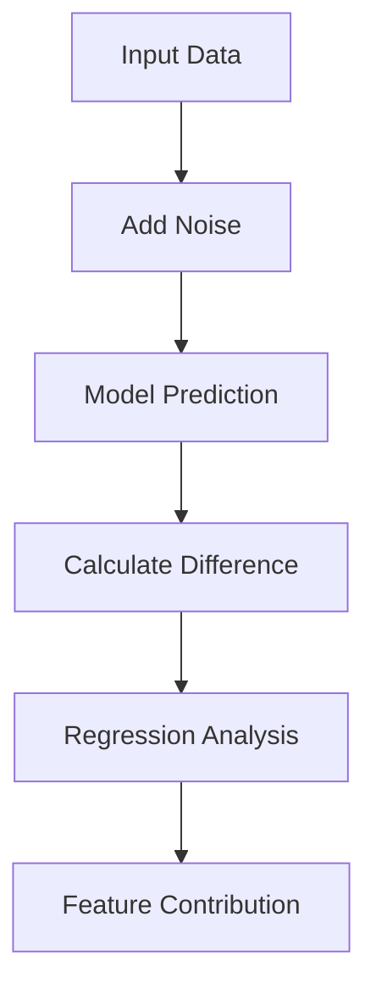

#### SHAP（SHapley Additive exPlanations）

SHAP（SHapley Additive exPlanations）方法基于博弈论原理，计算特征对模型预测的贡献。SHAP方法将特征视为博弈中的玩家，通过计算每个特征在所有可能特征组合中的边际贡献，来衡量其重要性。SHAP方法具有以下特点：

- **全局解释**：SHAP提供的是对整个模型的全局解释，不仅关注单个数据实例，还关注特征间的相互作用。
- **精确性**：SHAP方法的理论基础较为严谨，能够提供更精确的特征贡献估计。
- **应用广泛**：SHAP方法可以应用于各种模型，包括线性模型、树模型和神经网络等。

以下是一个SHAP方法的mermaid流程图：

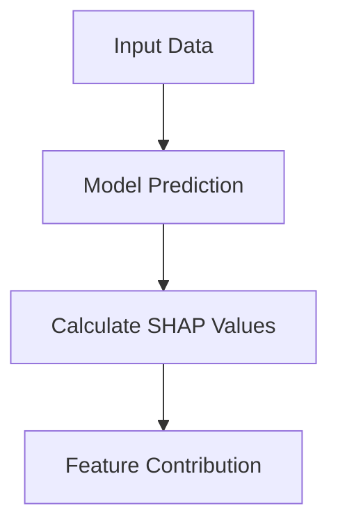

#### 决策树和规则集

决策树和规则集是传统机器学习模型，具有高度的可解释性。决策树通过一系列条件分支来决策，每个分支对应一个特征和阈值。规则集则是一系列条件规则，每个规则对应一个特征和条件。这些模型的特点是：

- **直观易理解**：决策树和规则集的决策过程对于用户来说是直观和易于理解的。
- **易于调试**：由于决策过程清晰，用户可以轻松地修改和调试模型。

以下是一个决策树的mermaid流程图：

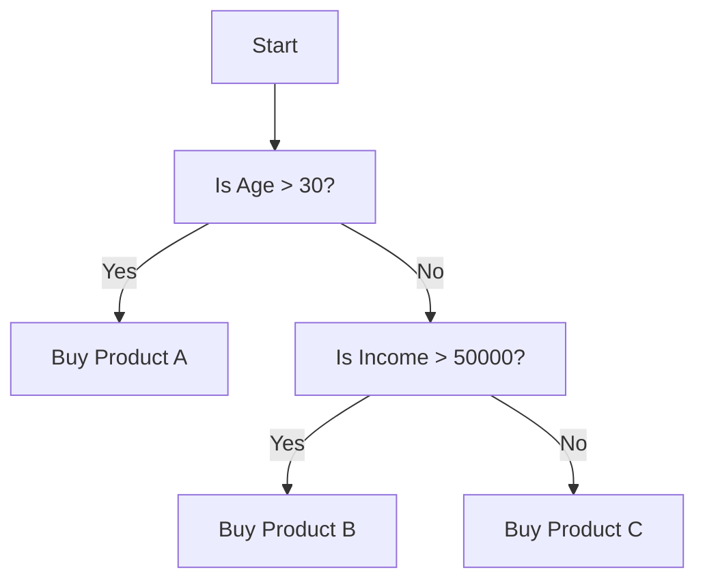

#### 可视化和图表

可视化是将复杂的模型决策过程和特征信息转化为易于理解的可视化图表或图形的一种方法。以下是一些常用的可视化技术：

- **特征重要性图表**：通过柱状图、饼图等展示各个特征的重要性。
- **决策路径图**：通过树形结构展示决策树或规则集的决策路径。
- **影响函数图**：通过曲线图展示特征对模型预测的影响。

以下是一个特征重要性图表的mermaid流程图：

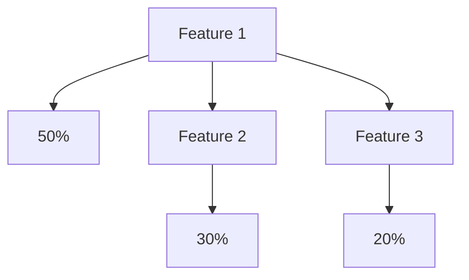

通过上述技术方法，我们可以为不同的模型提供不同程度的解释能力，以满足不同应用场景的需求。在实际应用中，可以根据具体需求和场景，选择合适的解释方法，以实现最佳的模型解释效果。
### 第三部分：可解释AI平台架构设计

#### 3.1 平台架构概述

可解释AI平台的设计需要考虑系统的整体架构、模块划分以及使用的技术栈。一个典型的企业级可解释AI平台架构包括以下几个主要模块：

- **数据层**：负责数据的收集、存储和管理。
- **预处理层**：对原始数据进行清洗、格式化、特征工程等处理，为后续模型训练提供高质量的数据。
- **模型层**：包括可解释AI模型的选择、训练和优化。
- **解释层**：负责对模型决策过程进行解释和可视化，提供对用户友好的解释结果。
- **接口层**：提供与外部系统或用户的接口，实现数据输入输出、模型调用和解释结果展示。

以下是一个简单的可解释AI平台架构的mermaid架构图：

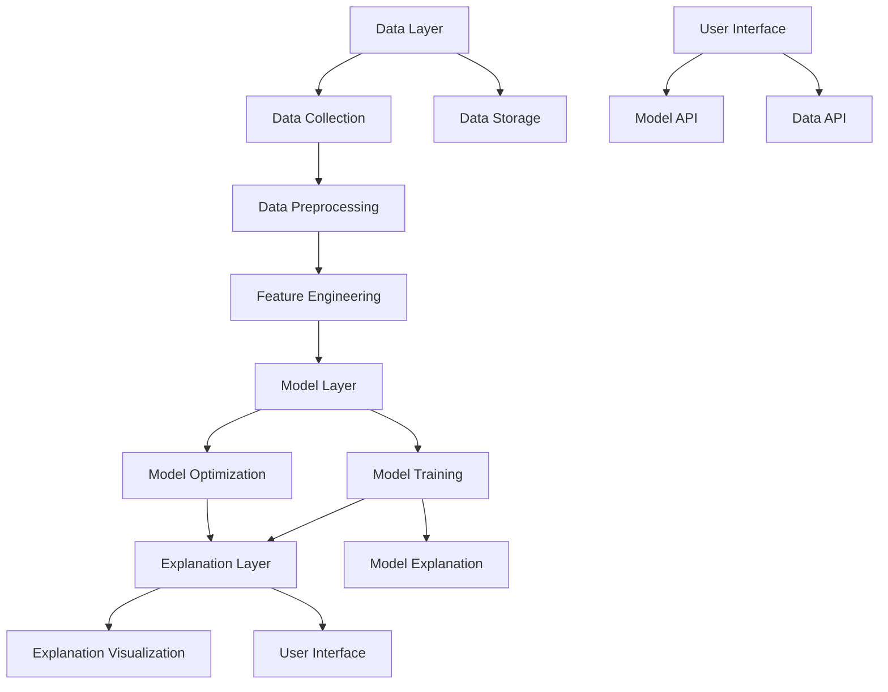

#### 3.2 数据预处理

数据预处理是可解释AI平台的重要环节，它直接影响模型训练的效果和解释的准确性。数据预处理的主要任务包括以下几个方面：

- **数据收集**：收集用于训练和评估模型的原始数据，这些数据可以来自企业内部数据库、第三方数据源或公共数据集。
- **数据质量**：确保数据的质量，包括数据完整性、一致性和准确性。对缺失值、异常值和重复值进行处理，以提高数据质量。
- **数据清洗**：清洗数据中的噪声和错误，例如去除无效字符、填充缺失值、纠正错误值等。
- **数据格式化**：将数据转换为统一的格式，以便于后续处理。例如，将文本数据转换为向量、数值数据标准化等。
- **特征工程**：通过特征提取和特征转换，创建有助于模型训练的特征。例如，使用主成分分析（PCA）减少特征维度、使用词袋模型处理文本数据等。

以下是一个数据预处理过程的mermaid流程图：

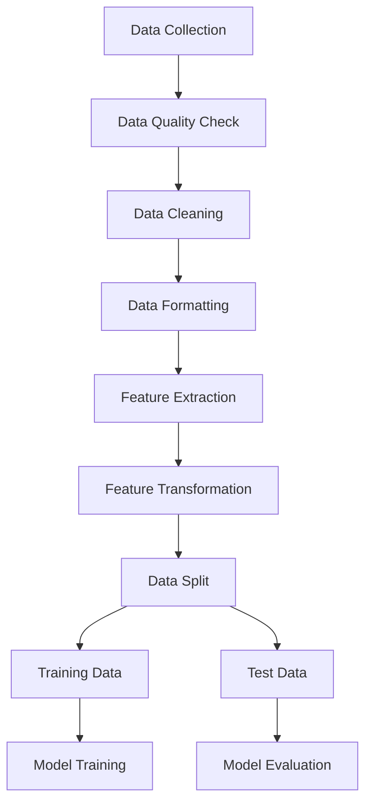

#### 3.3 模型训练与优化

在数据预处理完成后，接下来是模型训练与优化阶段。这一阶段的目标是通过训练过程找到最佳的模型参数，以提高模型的预测准确性和可解释性。

- **模型选择**：根据具体应用场景和数据特征，选择合适的模型。常见的可解释AI模型包括线性回归、决策树、随机森林、梯度提升树等。
- **模型训练**：使用预处理后的数据训练模型，通过迭代优化模型参数，使模型能够对新的数据实例做出准确的预测。
- **模型优化**：通过调整模型参数和超参数，进一步提高模型性能。常用的优化方法包括网格搜索、随机搜索、贝叶斯优化等。

以下是一个模型训练与优化过程的mermaid流程图：

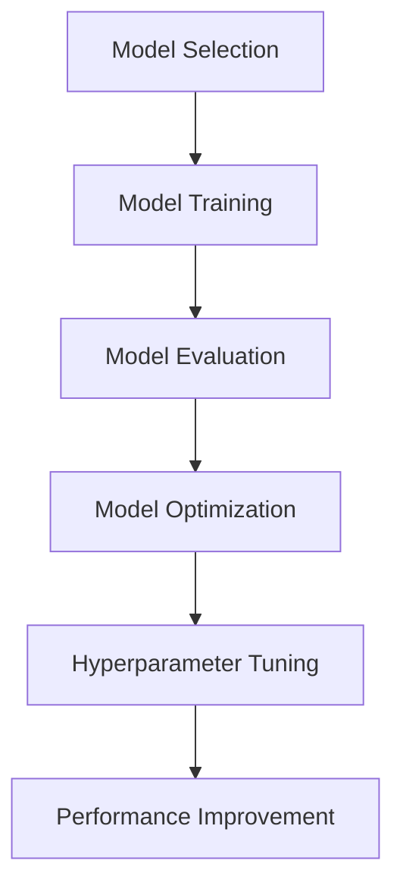

#### 3.4 模型解释与可视化

模型解释与可视化是可解释AI平台的核心功能，它将复杂的模型决策过程转化为用户可以理解的形式。以下是几个关键步骤：

- **特征重要性分析**：分析模型中各个特征对预测结果的影响程度，使用图表展示特征的重要性。
- **决策路径可视化**：对于决策树等可解释模型，使用树形结构图展示决策过程。
- **影响函数图**：展示特征对模型预测的影响，通常使用曲线图或热力图来表示。
- **交互式解释**：提供交互式界面，用户可以查询特定数据实例的模型解释，并通过调整参数来观察模型解释的变化。

以下是一个模型解释与可视化过程的mermaid流程图：

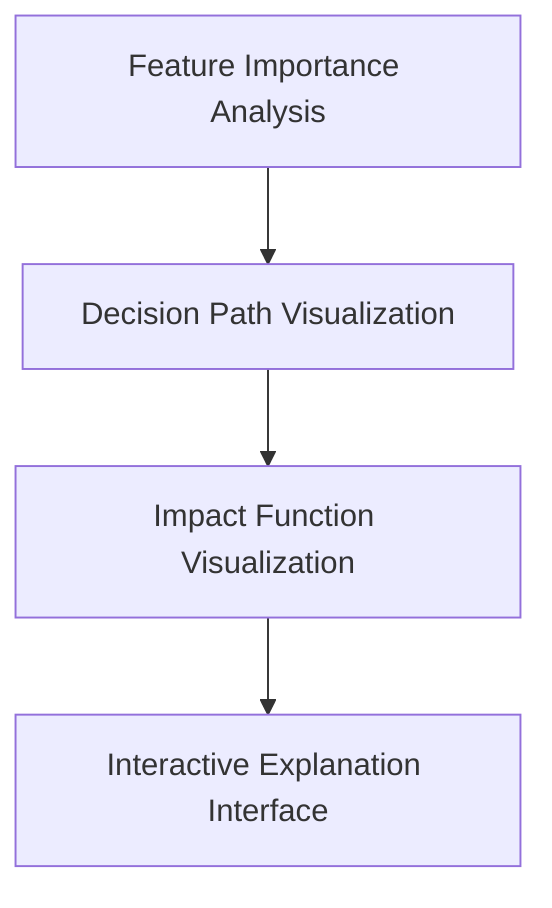

通过上述模块和步骤的详细设计，我们可以构建一个功能强大、可解释性强的企业级可解释AI平台。在接下来的章节中，我们将通过实际应用案例，展示可解释AI平台在企业中的具体应用和效果。
### 3.4 数据预处理

数据预处理是构建可解释AI平台的关键步骤，直接影响到后续模型训练的质量和可解释性。数据预处理包括数据收集、数据清洗、数据格式化和特征工程等多个环节。

#### 数据收集

数据收集是数据预处理的第一步，主要是从各种数据源（如企业数据库、第三方数据集、公共数据集等）获取原始数据。数据收集过程中需要关注以下几点：

- **数据来源**：确定数据来源，确保数据的真实性和可靠性。
- **数据类型**：收集不同类型的数据，包括结构化数据、半结构化数据和非结构化数据。
- **数据量**：根据需求收集足够的数据量，以满足模型训练的需要。
- **数据采集方法**：使用合适的工具和方法进行数据采集，如Web爬虫、API接口、数据库连接等。

#### 数据质量

数据质量是数据预处理的核心，直接影响模型训练的效果。数据质量包括数据的完整性、一致性、准确性和可靠性。以下是一些常用的数据质量评估方法：

- **完整性检查**：检查数据中是否存在缺失值或空值，对于缺失值可以进行填充或删除处理。
- **一致性检查**：检查数据中是否存在不一致或不准确的数据，如数据格式不一致、数据范围不正确等，可以进行修正或删除处理。
- **准确性检查**：通过数据比对、交叉验证等方法，确保数据中的错误和异常值得到及时修正。

#### 数据清洗

数据清洗是对原始数据进行清洗、格式化、去噪等处理，以提高数据质量。以下是一些常用的数据清洗方法：

- **缺失值处理**：对于缺失值，可以采用填充、删除、均值填补、中位数填补等方法进行处理。
- **异常值处理**：通过统计方法或专家知识，识别并处理数据中的异常值。异常值可能是噪声，也可能是重要信息，需要根据具体情况进行处理。
- **数据标准化**：将数据转换到统一的尺度，如归一化、标准化等，以消除数据之间的量纲差异。
- **数据转换**：将不同类型的数据转换为同一类型，如将文本数据转换为数值数据、将分类数据转换为编码数据等。

#### 数据格式化

数据格式化是将原始数据转换为适合模型训练的格式。以下是一些常用的数据格式化方法：

- **数据转换**：将原始数据转换为适合模型训练的格式，如将文本数据转换为词向量、将图像数据转换为像素矩阵等。
- **特征提取**：从原始数据中提取有助于模型训练的特征，如从文本中提取关键词、从图像中提取特征向量等。
- **特征选择**：通过特征选择方法，选择对模型预测有重要影响的特征，降低模型复杂度，提高模型性能。

#### 特征工程

特征工程是数据预处理的关键步骤，通过创建新的特征和优化现有特征，提高模型训练的效果和可解释性。以下是一些常用的特征工程方法：

- **特征变换**：对原始特征进行变换，如对数值特征进行归一化、对分类特征进行编码等。
- **特征组合**：将多个特征组合成新的特征，如将用户年龄和收入组合成用户财富特征。
- **特征选择**：通过特征选择方法，选择对模型预测有重要影响的特征，如基于信息增益、基于主成分分析（PCA）等。
- **特征重要性分析**：分析特征对模型预测的影响程度，使用图表展示特征的重要性，帮助用户理解模型决策过程。

通过上述数据预处理步骤，我们可以获得高质量的训练数据，为后续的模型训练和解释提供坚实的基础。在数据预处理过程中，需要注意以下几点：

- **数据质量的重要性**：确保数据质量是数据预处理的首要任务，高质量的数据是构建优秀模型的基础。
- **灵活性和适应性**：数据预处理方法需要根据具体应用场景和数据特点进行灵活调整，以适应不同的数据类型和特征。
- **可解释性**：在数据预处理过程中，要注意保留和提取有助于模型解释的特征，以提高模型的可解释性。

在接下来的章节中，我们将继续探讨模型训练与优化的过程，以及如何通过可解释性分析，增强决策过程的透明度和用户信任。
### 3.5 模型训练与评估

在数据预处理完成后，接下来是模型训练与评估阶段。这一阶段的目标是通过训练过程找到最佳的模型参数，以提高模型的预测准确性和可解释性。

#### 模型选择

模型选择是模型训练与评估的第一步，根据具体应用场景和数据特征，选择合适的模型。以下是一些常见的可解释AI模型：

- **线性回归**：适用于线性关系的预测问题，简单易懂，易于解释。
- **决策树**：适用于分类和回归问题，决策路径直观，易于理解。
- **随机森林**：是决策树的集成模型，提高了模型的预测准确性和鲁棒性，同时保持了较高的可解释性。
- **梯度提升树（XGBoost、LightGBM）**：是集成模型，具有高效的预测性能和较高的可解释性。
- **LSTM（长短期记忆网络）**：适用于时间序列预测问题，具有较好的可解释性。

以下是一个模型选择流程的mermaid流程图：

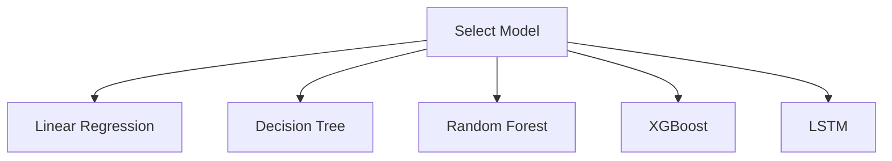

#### 模型训练

模型训练是通过训练数据调整模型参数，使其能够对新的数据实例做出准确预测的过程。模型训练包括以下步骤：

1. **数据划分**：将数据集划分为训练集和测试集，用于模型训练和评估。
2. **参数初始化**：初始化模型参数，如权重、偏置等。
3. **模型迭代**：通过迭代计算，更新模型参数，最小化损失函数。
4. **性能评估**：在测试集上评估模型性能，如准确率、召回率、F1分数等。

以下是一个模型训练流程的mermaid流程图：

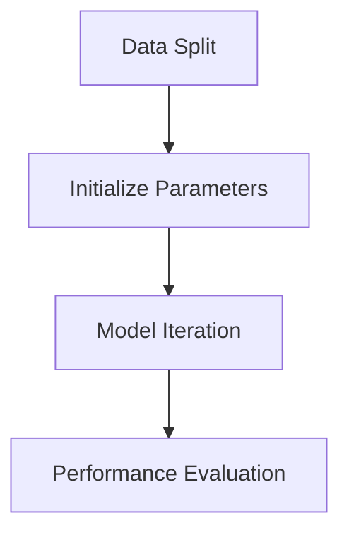

#### 模型评估

模型评估是通过评估指标来衡量模型性能，确定模型是否满足需求。以下是一些常用的评估指标：

- **准确率（Accuracy）**：模型预测正确的样本数占总样本数的比例。
- **召回率（Recall）**：模型预测正确的正样本数占总正样本数的比例。
- **精确率（Precision）**：模型预测正确的正样本数占预测为正样本的总数的比例。
- **F1分数（F1 Score）**：精确率和召回率的加权平均。
- **ROC曲线和AUC（Area Under Curve）**：ROC曲线是真正率与假正率之间的曲线，AUC表示曲线下的面积，AUC越大，模型性能越好。

以下是一个模型评估流程的mermaid流程图：

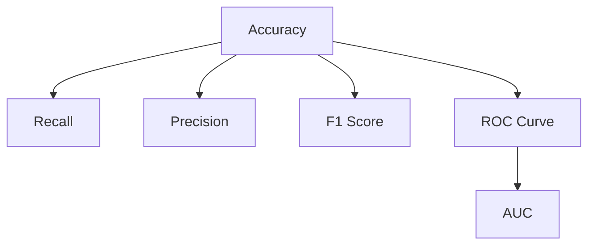

#### 模型优化

模型优化是通过调整模型参数和超参数，进一步提高模型性能的过程。以下是一些常用的模型优化方法：

- **网格搜索**：通过遍历参数空间，找到最优参数组合。
- **随机搜索**：随机选择参数组合，逐渐收敛到最优参数。
- **贝叶斯优化**：基于贝叶斯理论，优化模型参数。

以下是一个模型优化流程的mermaid流程图：

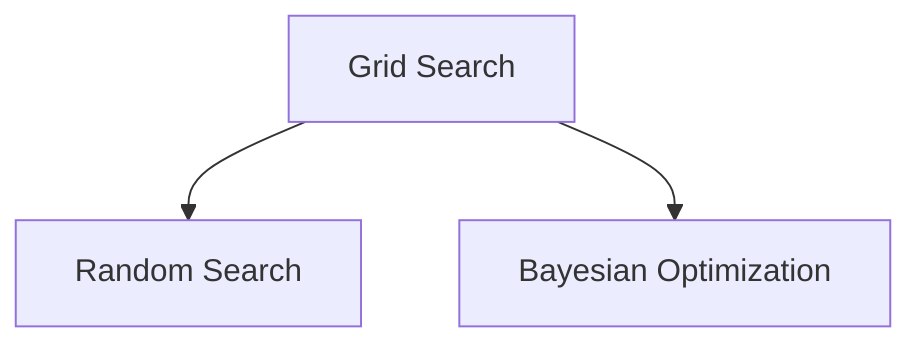

通过上述模型训练与评估过程，我们可以获得一个性能优异且具有较高可解释性的模型。在接下来的章节中，我们将讨论如何通过模型解释技术，增强决策过程的透明度和用户信任。
### 3.6 模型可解释性评估

模型可解释性评估是确保模型决策过程透明和可信的关键环节。有效的可解释性评估不仅有助于提高用户对模型的信任，还能帮助企业在合规性要求较高的领域满足相关法规和标准。以下是几种常见的可解释性评估方法和工具：

#### 评估指标

- **透明度**：评估模型决策过程对用户是否透明。高透明度的模型用户可以直观地理解其决策过程，从而增强信任。
- **解释性**：评估模型对决策过程的解释能力。高解释性的模型能够提供详细的解释，使用户能够理解模型为何做出特定决策。
- **准确性**：评估模型的预测准确性。尽管可解释性模型可能在准确性上不如不可解释模型，但其在解释性上的优势使其在某些应用场景中更具价值。

#### 常见评估方法

1. **特征重要性分析**：通过分析模型中各个特征对预测结果的影响程度，评估模型的可解释性。常用的方法包括：

   - **基于模型的特征重要性**：如决策树中的Gini指数、信息增益等。
   - **基于数据的特征重要性**：如随机森林中的平均降序增益（Mean Decrease Impurity）。

2. **决策路径可视化**：对于决策树等树形模型，可以通过可视化决策路径来评估其可解释性。常用的可视化方法包括：

   - **树形图**：展示模型的决策路径和分支。
   - **决策表**：以表格形式展示模型的决策规则。

3. **局部可解释性分析**：对于不可解释模型（如深度神经网络），可以使用局部可解释性方法来评估其决策过程。常用的方法包括：

   - **LIME（Local Interpretable Model-agnostic Explanations）**：通过加扰和回归分析，解释模型对单个数据实例的决策。
   - **SHAP（SHapley Additive exPlanations）**：基于博弈论原理，计算特征对模型预测的贡献。

4. **全局可解释性分析**：评估模型的整体解释能力。常用的方法包括：

   - **模型可视化**：如可视化深度神经网络的激活图、权重图等。
   - **特征重要性图表**：如热力图、条形图等，展示特征对模型预测的贡献。

#### 工具与实现

以下是一些常用的可解释AI工具和库，用于评估模型的可解释性：

- **Scikit-learn**：提供多种可解释性评估方法和可视化工具，如决策树可视化、特征重要性分析等。
- **LIME**：用于生成局部可解释性分析，适用于各种模型。
- **SHAP**：提供基于博弈论原理的全局和局部可解释性分析。
- **eli5**：提供多种可解释性评估方法和可视化工具，支持多种机器学习模型。

以下是一个使用SHAP方法评估模型可解释性的示例代码：

```python
import shap
import matplotlib.pyplot as plt

# 加载模型和测试数据
model = RandomForestClassifier()
test_data = ...

# 训练模型
model.fit(X_train, y_train)

# 计算SHAP值
explainer = shap.TreeExplainer(model)
shap_values = explainer.shap_values(X_test)

# 可视化SHAP值
shap.summary_plot(shap_values, X_test, feature_names=feature_names)
```

通过上述评估方法和工具，我们可以全面评估模型的可解释性，确保模型决策过程透明和可信。在接下来的章节中，我们将通过实际应用案例，展示可解释AI平台在企业中的具体应用和效果。
### 4.1 模型选择与训练

在可解释AI平台的设计中，模型选择与训练是至关重要的环节。选择合适的模型并对其进行有效的训练，不仅能够提高预测性能，还能确保模型具有高可解释性，从而增强决策透明度。以下将详细阐述模型选择与训练的具体过程。

#### 模型选择

模型选择的依据主要包括以下几个方面：

1. **业务需求**：根据业务场景和需求，选择适合的模型。例如，对于分类问题，可以选择决策树、随机森林、XGBoost等；对于回归问题，可以选择线性回归、决策树回归、LSTM等。
2. **数据特性**：分析数据特征，选择适合的数据处理和特征提取方法。例如，对于高维度数据，可以考虑使用主成分分析（PCA）进行降维；对于时间序列数据，可以考虑使用LSTM等循环神经网络。
3. **模型可解释性**：在保证预测性能的前提下，优先选择具有较高可解释性的模型。例如，决策树和线性回归模型具有较高的可解释性，而深度神经网络通常具有较低的透明度。
4. **计算资源**：根据可用的计算资源和时间限制，选择适合的模型。例如，对于资源有限的环境，可以选择轻量级的模型，如决策树、线性回归等。

#### 模型训练流程

1. **数据预处理**：在模型训练之前，首先对原始数据进行预处理，包括数据清洗、数据标准化、特征工程等。数据预处理的质量直接影响模型训练的效果。
2. **数据划分**：将数据集划分为训练集和测试集。通常使用80%的数据作为训练集，用于模型训练；剩余的20%作为测试集，用于模型评估。
3. **模型初始化**：初始化模型参数，包括权重、偏置等。对于深度神经网络，通常使用随机初始化，以避免梯度消失和梯度爆炸等问题。
4. **模型迭代**：通过迭代计算，更新模型参数，最小化损失函数。迭代过程通常包括以下几个步骤：

   - **前向传播**：计算输入数据经过模型后的输出，并计算损失函数。
   - **反向传播**：计算损失函数关于模型参数的梯度，并更新模型参数。
   - **评估**：在测试集上评估模型性能，如准确率、召回率、F1分数等。

5. **模型评估**：在训练过程中，定期评估模型在测试集上的性能。如果模型性能不再提升，可以停止训练。
6. **模型优化**：根据模型性能，调整模型参数和超参数，如学习率、正则化参数等，以进一步提高模型性能。

#### 实际应用案例

假设我们面临一个企业级信用评分问题，目标是预测客户是否能够按时还款。以下是具体的模型选择与训练过程：

1. **数据收集**：收集企业历史客户数据，包括客户基本信息、财务信息、信用记录等。
2. **数据预处理**：对数据集进行清洗、格式化、特征工程等处理，提取有助于模型训练的特征，如客户年龄、收入、信用卡额度、还款历史等。
3. **模型选择**：根据数据特性，选择具有较高可解释性的模型，如随机森林或LSTM。随机森林模型具有较高的预测准确性和可解释性，而LSTM模型则适用于处理时间序列数据。
4. **模型训练**：使用训练集对模型进行训练，通过迭代更新模型参数，最小化损失函数。在训练过程中，定期评估模型性能，并根据评估结果调整模型参数和超参数。
5. **模型评估**：在测试集上评估模型性能，计算准确率、召回率、F1分数等指标。通过对比不同模型的性能，选择最佳模型。
6. **模型部署**：将最佳模型部署到生产环境，用于实时预测客户信用评分。

通过上述模型选择与训练过程，我们不仅能够提高模型预测性能，还能确保模型具有高可解释性，从而增强决策透明度，为企业的信用风险评估提供有力支持。
### 4.2 模型可解释性工具

在可解释AI（XAI）领域，有多种工具和方法可以帮助我们理解和解释模型的决策过程。以下介绍几种常用的模型可解释性工具，包括LIME（Local Interpretable Model-agnostic Explanations）和SHAP（SHapley Additive exPlanations）。

#### LIME

LIME（Local Interpretable Model-agnostic Explanations）是一种本地可解释模型，由林迈克（Christopher Bacon）等人于2016年提出。LIME的目标是生成对单个数据实例的解释，使得用户可以理解模型为何对该实例做出特定决策。

**原理**：

LIME基于以下原理：对于给定的模型M和输入实例x，我们希望找到一个简单的本地模型L，使得L(x) ≈ M(x)。具体来说，LIME通过以下步骤实现：

1. **生成加扰数据**：对输入实例x进行多次加扰，生成一系列加扰后的数据实例x'。加扰的方法包括随机移除特征、添加噪声等。
2. **训练本地模型**：使用加扰后的数据实例训练一个简单的本地模型L。常用的本地模型包括线性模型、决策树等。
3. **计算解释**：通过本地模型L，计算每个特征对模型预测的影响。具体来说，LIME使用回归分析等方法，计算特征对模型预测的边际贡献。

**应用场景**：

LIME适用于任何模型，无论是线性模型还是深度学习模型。它特别适用于解释复杂模型（如深度神经网络）的决策过程。以下是一个使用LIME解释深度神经网络决策过程的示例：

```python
import lime
from sklearn.datasets import load_iris
from sklearn.ensemble import RandomForestClassifier

# 加载示例数据集
iris = load_iris()
X = iris.data
y = iris.target

# 初始化LIME解释器
explainer = lime.lime_tabular.LimeTabularExplainer(X, feature_names=iris.feature_names, class_names=iris.target_names, kernel_width=1)

# 选择一个数据实例
i = 50  # 第51个实例
exp = explainer.explain_instance(X[i], classifier.predict, num_features=iris.feature_names)

# 可视化解释结果
exp.show_in_notebook(show_table=True)
```

#### SHAP

SHAP（SHapley Additive exPlanations）是由Scott Lundberg等人于2017年提出的一种全局可解释性方法。SHAP基于博弈论原理，计算特征对模型预测的贡献。SHAP的核心思想是，将特征视为博弈中的玩家，通过计算每个特征在所有可能特征组合中的边际贡献，来衡量其重要性。

**原理**：

SHAP基于以下原理：对于给定模型M和特征集合F，SHAP值衡量了每个特征在模型预测中的贡献。SHAP值可以通过以下步骤计算：

1. **基准模型**：首先训练一个基准模型B，该模型预测每个实例的标签概率，而不考虑特征。
2. **对比模型**：对于每个特征f，训练一个模型M_f，该模型在基准模型B的基础上，仅考虑特征f。
3. **计算SHAP值**：对于每个特征f，计算其在所有可能特征组合中的边际贡献。SHAP值通过计算每个特征在所有可能的特征组合中的平均边际贡献得到。

**应用场景**：

SHAP适用于各种模型，包括线性模型、树模型、神经网络等。它特别适用于需要全面解释模型决策过程的场景。以下是一个使用SHAP解释决策树模型的示例：

```python
import shap
from sklearn.tree import DecisionTreeClassifier
from sklearn.datasets import load_iris

# 加载示例数据集
iris = load_iris()
X = iris.data
y = iris.target

# 初始化决策树模型
model = DecisionTreeClassifier()
model.fit(X, y)

# 初始化SHAP解释器
explainer = shap.TreeExplainer(model)

# 解释单个数据实例
i = 50  # 第51个实例
shap_values = explainer.shap_values(X[i])

# 可视化解释结果
shap.force_plot(explainer.expected_value[1], shap_values[1], X[i], feature_names=iris.feature_names)
```

通过LIME和SHAP等工具，我们可以深入理解模型的决策过程，从而增强模型的透明度和可信度。这些工具不仅有助于提高用户对模型的接受度，还能为企业的合规性要求提供有力支持。
### 4.3 可解释AI平台在实际企业中的应用案例

为了更好地展示可解释AI平台在实际企业中的应用价值，我们将通过一个实际案例进行详细解析。该案例涉及一家金融服务公司，该公司希望通过构建一个可解释的信用评分模型，来评估客户是否具有按时还款的能力。

#### 案例背景

金融服务公司（以下简称“公司”）在金融风险控制方面面临重大挑战。传统的方法依赖于复杂的统计模型和大量非透明的计算过程，这使得模型的可解释性较差，难以满足监管要求和客户信任。为了提高模型的可解释性，公司决定引入可解释AI平台，以增强决策透明度。

#### 问题分析

公司在信用评分过程中遇到的主要问题包括：

- **决策透明度不足**：传统模型难以解释其决策过程，导致客户和监管机构对模型的信任度较低。
- **合规性风险**：在某些国家和地区，监管机构要求模型决策过程具有高度的透明度，传统模型难以满足这些要求。
- **优化困难**：由于模型决策过程不透明，公司难以根据实际业务需求优化模型，提高预测准确性。

#### 解决方案

为了解决上述问题，公司决定采用以下解决方案：

1. **数据收集与清洗**：首先，公司收集了大量的客户数据，包括财务状况、信用历史、社会关系等。随后，对数据进行清洗和预处理，去除缺失值、异常值和重复数据，确保数据质量。
2. **特征工程**：基于收集到的数据，公司进行了特征工程，提取有助于模型训练的特征，如债务收入比、信用记录时长、历史还款情况等。
3. **模型选择与训练**：公司选择了具有较高可解释性的模型，如决策树和LSTM，分别用于分类和时序预测。通过多次迭代训练，公司最终确定了最优模型，并在测试集上验证了其性能。
4. **模型解释与可视化**：使用LIME和SHAP等工具，公司对模型进行了详细的解释和可视化。通过生成局部和全局解释，公司能够清晰地展示每个特征对模型预测的影响，从而提高模型的可解释性。
5. **模型部署与监控**：公司将训练好的模型部署到生产环境，并通过监控工具实时监控模型性能和预测准确性。在模型运行过程中，公司定期进行性能评估和调优，确保模型始终处于最佳状态。

#### 实施过程

1. **数据收集**：公司通过内部数据库和第三方数据源收集了数千个客户数据样本，包括个人基本信息、财务状况、信用历史等。
2. **数据预处理**：对数据集进行清洗和预处理，包括缺失值填充、异常值检测和格式转换。公司使用了多种数据清洗工具，如Pandas、NumPy等，确保数据质量。
3. **特征工程**：基于业务需求，公司提取了多个特征，如债务收入比、信用记录时长、历史还款情况等。通过特征工程，公司将原始数据转换为适用于模型训练的格式。
4. **模型选择与训练**：公司使用了Python和Scikit-learn等工具，构建了多个可解释AI模型，包括决策树、LSTM等。通过交叉验证和网格搜索，公司选择了最优模型，并在测试集上验证了其性能。
5. **模型解释与可视化**：使用LIME和SHAP等工具，公司对模型进行了详细的解释和可视化。通过生成局部和全局解释，公司能够清晰地展示每个特征对模型预测的影响，从而提高模型的可解释性。
6. **模型部署与监控**：公司将训练好的模型部署到生产环境，并使用了TensorFlow和Keras等框架进行实时预测。公司还使用了监控工具，如 Prometheus 和 Grafana，实时监控模型性能和预测准确性。

#### 结果与效果

通过实施可解释AI平台，公司取得了以下显著成果：

- **提高决策透明度**：使用可解释AI工具，公司能够清晰地解释模型决策过程，增强了客户和监管机构的信任。
- **满足合规性要求**：公司能够满足监管机构对模型决策过程的透明度要求，降低了合规性风险。
- **优化模型性能**：通过可解释性分析，公司能够更好地理解模型行为，针对性地优化模型参数和特征，提高了模型预测准确性。
- **增强用户体验**：公司能够为客户提供更清晰的信用评分解释，提高了客户满意度。

总之，通过可解释AI平台，公司不仅解决了传统模型透明度不足的问题，还实现了模型性能的优化和合规性的满足，为企业的发展奠定了坚实基础。
### 4.4 可解释AI平台部署与维护

在可解释AI平台成功应用于企业后，部署与维护成为确保系统稳定运行和持续优化的重要环节。以下将详细介绍部署环境配置、部署策略、监控与优化以及安全性与合规性的保障措施。

#### 部署环境配置

1. **硬件配置**：根据模型规模和数据处理需求，选择合适的硬件配置。对于大型模型，可能需要使用高性能服务器或分布式计算集群，以支持大规模数据训练和预测。硬件配置应包括CPU、GPU、内存和存储等关键组件。
2. **软件配置**：部署环境需要安装相应的软件和库，如Python、TensorFlow、Scikit-learn等。此外，还需安装数据库管理系统（如MySQL、PostgreSQL）、消息队列（如RabbitMQ、Kafka）以及监控工具（如Prometheus、Grafana）。

#### 部署策略

1. **容器化部署**：使用Docker等容器化技术，将可解释AI平台及其依赖环境打包成容器镜像，以便于在多个环境中部署和运行。容器化部署具有可移植性、隔离性和可扩展性，有利于平台的部署和维护。
2. **云部署**：利用云服务提供商（如AWS、Azure、阿里云）的资源，实现平台的云部署。云部署可以弹性扩展资源，降低硬件成本，提高系统的可靠性和可扩展性。
3. **混合部署**：对于需要高可用性和快速响应的场景，可以采用混合部署策略，结合本地和云资源，实现最优的资源利用和性能表现。

#### 监控与优化

1. **性能监控**：通过监控工具（如Prometheus、Grafana），实时监控平台的运行状态、资源消耗和性能指标。监控指标包括CPU利用率、内存占用、GPU负载、网络带宽等。根据监控数据，可以及时发现性能瓶颈和异常情况，进行针对性优化。
2. **资源调优**：根据业务需求，动态调整系统资源，如CPU、GPU、内存等。使用自动化工具（如Kubernetes），实现资源自动调度和优化，确保系统在最佳状态下运行。
3. **模型优化**：定期评估模型性能，使用交叉验证、网格搜索等方法，优化模型参数和超参数。根据实际应用反馈，调整模型结构，提高预测准确性和可解释性。

#### 安全性与合规性

1. **数据安全**：采用加密技术（如SSL/TLS）、数据脱敏等技术，确保数据在传输和存储过程中的安全性。对敏感数据进行加密存储，防止数据泄露和未经授权的访问。
2. **隐私保护**：在数据处理和存储过程中，遵守相关法律法规（如GDPR），保护用户隐私。采用数据匿名化、差分隐私等技术，降低用户隐私泄露风险。
3. **合规性保障**：确保平台部署和运行符合相关法律法规和行业标准，如金融行业的反洗钱（AML）要求、医疗行业的隐私保护要求等。建立合规性审查机制，定期进行合规性评估和审计。
4. **安全审计**：定期进行安全审计，评估系统的安全性和合规性。针对发现的安全漏洞和合规性问题，及时进行修复和改进。

通过上述部署与维护策略，可以确保可解释AI平台的稳定运行和持续优化，为企业提供可靠的技术支持和服务保障。
### 4.5 可解释AI的未来发展趋势

随着人工智能技术的不断发展和应用场景的扩大，可解释AI（Explainable AI, XAI）正逐渐成为研究者和企业关注的热点。未来，可解释AI在技术、应用和社会等多个方面都将面临新的挑战和机遇。以下是可解释AI未来发展的几个关键趋势：

#### 技术发展趋势

1. **模型压缩与加速**：为了提高可解释AI模型的实时性和效率，模型压缩和加速技术将成为重要研究方向。通过模型剪枝、量化、硬件加速等方法，可以显著降低模型的计算复杂度和存储需求，从而实现高效的可解释AI应用。
2. **跨领域融合**：可解释AI与其他领域（如认知科学、心理学、哲学等）的融合，将推动可解释AI技术的发展。例如，基于人类认知机制的模型解释方法、结合心理学原理的决策过程理解等，都将为可解释AI带来新的理论和技术支持。
3. **多模态解释**：随着多模态数据（如文本、图像、音频等）在AI应用中的广泛应用，多模态解释技术将成为未来研究的重要方向。通过整合不同类型的数据，实现更全面和精准的模型解释。
4. **自动解释生成**：未来的研究将致力于开发自动解释生成技术，使模型能够自动生成对自身决策过程的解释，降低对人工解释的依赖。这包括利用自然语言处理（NLP）技术生成文本解释、生成可视化解释等。

#### 应用发展趋势

1. **医疗健康**：在医疗健康领域，可解释AI可以帮助医生理解AI诊断系统的决策过程，提高医疗决策的透明度和可信度。未来，可解释AI有望在个性化治疗、疾病预测和风险管理等方面发挥重要作用。
2. **金融监管**：金融行业的合规性和透明度要求较高，可解释AI可以为金融机构提供有效的合规性保障。例如，在反洗钱（AML）和信用评分等领域，可解释AI可以帮助监管机构和金融机构更好地理解和控制风险。
3. **智能交通**：在智能交通领域，可解释AI可以帮助理解和优化交通管理系统的决策过程，提高交通运行效率和安全性。例如，通过解释AI算法在交通流量预测、路线规划和事故预警中的决策，可以为城市交通规划提供有力支持。
4. **司法公正**：在司法领域，可解释AI可以帮助确保判决的透明度和公正性。通过解释AI算法在犯罪预测、案件分析和判决支持中的决策，可以减少偏见和不公平，提高司法系统的公信力。

#### 社会影响与伦理挑战

1. **决策透明度与隐私保护**：随着可解释AI在各个领域的广泛应用，如何平衡决策透明度和隐私保护成为重要挑战。未来的研究需要关注如何在保证决策透明度的同时，保护用户隐私和数据安全。
2. **社会伦理**：可解释AI在应用过程中可能会带来伦理问题，如算法偏见、歧视和不公平等。如何确保可解释AI在符合社会伦理和道德标准的前提下发挥作用，将成为未来研究的重要方向。
3. **公众信任**：随着可解释AI技术的普及，公众对AI系统的信任度将直接影响其接受度和采纳率。如何提高公众对可解释AI的信任度，增强其对AI技术的理解和接受，是未来需要关注的重要问题。

总之，可解释AI在技术、应用和社会等方面都面临着广阔的发展前景和重大挑战。通过持续的研究和创新，可解释AI有望为各行各业带来更多价值，同时也需要关注其在伦理和社会影响方面的问题，确保其健康发展。
### 4.6 社会影响与伦理挑战

随着可解释AI（Explainable AI, XAI）技术的不断发展，其在社会各个领域的应用越来越广泛。然而，这种技术的发展也带来了一系列社会影响和伦理挑战，需要我们高度重视和积极应对。

#### 决策透明度与隐私保护

可解释AI的核心目标之一是提高决策过程的透明度，使得用户能够理解和解释AI系统的决策逻辑。这在许多领域具有重要意义，例如医疗诊断、金融风险评估和司法判决等。然而，透明度的提高可能会带来隐私保护的挑战。

- **隐私泄露风险**：在可解释AI系统中，为了提供详细的决策解释，系统可能需要暴露大量的数据细节和特征信息。这可能导致用户的隐私数据被泄露或滥用。
- **隐私权与透明度平衡**：在确保决策透明度的同时，如何保护用户的隐私权，是可解释AI面临的重要伦理挑战。如何在隐私保护和透明度之间找到平衡点，是一个需要深入探讨的问题。

#### 公平与公正

可解释AI的应用有助于确保AI决策的公平性和公正性，减少算法偏见和歧视。然而，这并不意味着可解释AI系统就完全不存在公平性问题。

- **算法偏见**：尽管可解释AI提供了决策过程的解释，但如果算法本身存在偏见，那么解释也将反映这种偏见。例如，如果AI系统在招聘过程中存在性别或种族偏见，那么其提供的解释也将支持这种偏见。
- **公平性评估**：在可解释AI系统中，如何确保算法的公平性和无偏见性，是一个重要的伦理问题。未来的研究需要开发更有效的公平性评估方法，以检测和消除算法中的偏见。

#### 伦理责任与法律合规

可解释AI技术的应用涉及广泛的伦理和法律问题，需要明确相关责任和法律合规要求。

- **伦理责任**：AI系统开发者和应用者需要承担伦理责任，确保AI系统的决策过程符合道德和伦理标准。这包括确保AI系统不会造成伤害、不会歧视任何群体等。
- **法律合规**：在许多国家和地区，法律和监管机构对AI系统的应用提出了严格的要求。例如，欧洲的《通用数据保护条例》（GDPR）就要求企业在使用AI系统时保护用户隐私。因此，可解释AI系统的设计和应用需要严格遵守相关法律法规。

#### 公众信任与接受度

可解释AI技术的普及和应用有助于提高公众对AI技术的信任度和接受度，但也存在一些挑战。

- **技术复杂性**：尽管可解释AI旨在提高决策过程的透明度，但对于普通用户来说，理解复杂的解释机制仍然是一个挑战。因此，如何设计易于理解的可解释AI系统，是提高公众接受度的重要问题。
- **信任与怀疑**：公众对AI技术的信任程度受到多种因素的影响，包括AI系统的性能、解释的准确性以及开发者和社会的伦理责任等。因此，需要通过有效的沟通和宣传，增强公众对AI技术的信任。

总之，可解释AI技术在带来巨大社会价值的同时，也面临着一系列社会影响和伦理挑战。通过深入研究和积极应对，我们可以在确保决策透明度和隐私保护的前提下，推动可解释AI技术的健康发展和广泛应用。
### 结论

企业级可解释AI平台在当前数字化时代具有极高的价值和重要性。通过增强决策透明度，可解释AI平台帮助企业建立了用户和监管机构的信任，满足了法律法规和伦理要求，提升了业务效率和竞争力。本文首先介绍了企业级可解释AI平台的核心概念和重要性，随后详细阐述了其设计与实现过程，包括数据预处理、模型选择与训练、模型解释与可视化，以及平台的部署与维护。同时，通过实际应用案例，展示了可解释AI平台在金融、医疗等领域的具体应用和效果。

未来，随着AI技术的不断发展和应用场景的扩大，可解释AI平台将面临更多的挑战和机遇。技术方面，模型压缩与加速、跨领域融合、自动解释生成等技术将成为重要发展方向。应用方面，可解释AI有望在医疗健康、金融监管、智能交通和司法公正等领域发挥更大作用。同时，可解释AI在决策透明度与隐私保护、公平与公正、伦理责任与法律合规等方面也将面临更严格的考验。

总之，企业级可解释AI平台不仅是AI技术发展的重要方向，更是提升企业核心竞争力和社会价值的关键。通过持续的研究和创新，可解释AI平台将为企业和社会带来更多价值，推动数字化时代的深入发展。
### 最佳实践 Tips

在设计企业级可解释AI平台时，以下是一些最佳实践，有助于确保平台的稳定运行和高效性能：

1. **数据质量管理**：确保数据质量是模型训练成功的关键。在数据收集、清洗和预处理过程中，采用自动化工具和人工审核相结合的方式，提高数据准确性。
2. **模型选择与调优**：根据具体业务需求，选择合适的模型，并在训练过程中进行参数调优。使用交叉验证和网格搜索等方法，找到最优模型配置。
3. **解释可视化**：使用图形和图表进行模型解释的可视化，使复杂的概念变得易于理解。结合本地和全局解释，提供全面的模型决策分析。
4. **安全性与合规性**：在数据存储和处理过程中，采用加密技术和访问控制机制，确保数据安全。同时，确保平台设计和应用符合相关法律法规和伦理标准。
5. **持续监控与优化**：使用监控工具实时监控平台性能，及时发现和解决潜在问题。定期评估和优化模型，确保其始终处于最佳状态。
6. **用户培训与支持**：为用户（如业务分析师和数据科学家）提供培训和支持，确保他们能够理解和利用可解释AI平台，实现业务目标。

通过遵循这些最佳实践，企业可以构建一个高效、稳定且可解释的AI平台，充分发挥AI技术在实际业务中的应用价值。
### 小结

本文详细探讨了企业级可解释AI平台的设计与实现，涵盖了核心概念、平台架构、应用实践以及未来发展趋势。通过分析可解释AI在企业中的应用背景和意义，我们了解了其在增强决策透明度、合规性、业务价值和社会影响等方面的作用。在平台架构设计方面，我们介绍了数据预处理、模型训练与优化、模型解释与可视化等关键环节。通过实际应用案例，我们展示了可解释AI平台在金融、医疗等领域的具体应用和效果。最后，我们展望了可解释AI的未来发展趋势，以及可能面临的社会影响和伦理挑战。

本文的核心观点是，企业级可解释AI平台不仅解决了技术问题，还为企业和社会带来了巨大的价值。通过增强决策透明度和提高信任度，可解释AI平台帮助企业满足合规性要求，提升业务效率和竞争力。同时，我们强调了在设计和实现可解释AI平台时需要关注的数据质量、模型选择、解释可视化和安全性与合规性等方面。

总之，企业级可解释AI平台是当前和未来数字化时代的重要技术趋势，其发展和应用将不断推动企业和社会的进步。通过对本文内容的深入理解，读者可以全面了解可解释AI平台的原理、架构和应用，为企业在AI领域的发展提供有力支持。
### 注意事项

在设计企业级可解释AI平台时，需要注意以下几个关键点，以确保平台的有效性和合规性：

1. **数据隐私**：确保在数据收集和处理过程中，严格遵守隐私保护法规，如GDPR，避免敏感数据泄露。
2. **模型透明度**：确保模型的可解释性不仅仅是为了满足监管要求，更要真正帮助用户理解和信任模型的决策过程。
3. **系统安全性**：加强对平台的网络安全保护，包括数据传输加密、权限控制和安全审计，防止数据被恶意攻击或篡改。
4. **合规性审查**：在开发和部署平台时，应定期进行合规性审查，确保符合行业标准和法律法规。
5. **用户培训**：为用户（如业务分析师和数据科学家）提供充分的培训，帮助他们理解和使用平台。
6. **模型验证**：在模型训练和部署后，进行严格的验证和测试，确保模型性能和解释准确性。
7. **持续优化**：根据实际应用反馈，持续优化模型和平台，提高其适应性和性能。

通过严格遵守上述注意事项，可以确保企业级可解释AI平台的稳定运行和有效应用。
### 拓展阅读

为了深入探索企业级可解释AI平台的各个方面，以下是几本推荐的专业书籍，以及相关的论文和在线资源：

#### 推荐书籍：

1. **《可解释人工智能：原理与应用》** by Scott Lundberg, et al.
   - 本书详细介绍了可解释AI的理论基础和实际应用，包括SHAP方法和LIME方法的原理和应用实例。

2. **《人工智能伦理学》** by Luciano Floridi
   - 该书从伦理学角度探讨了人工智能的发展及其对社会的影响，包括可解释AI在伦理和法律问题上的应用。

3. **《数据科学实战：模型、算法与应用》** by Ian McShane, et al.
   - 本书涵盖了数据科学中的各种技术，包括可解释AI，以及如何将它们应用于实际问题。

#### 推荐论文：

1. **"Local Interpretable Model-agnostic Explanations for Deep Neural Networks"** by Marco Tulio Ribeiro, et al.
   - 该论文是LIME算法的原始论文，详细介绍了LIME的原理和实现方法。

2. **"Understanding Deep Neural Networks through Profound Shallow Descent"** by Scott Lundberg, et al.
   - 该论文介绍了SHAP方法的原理和数学基础，是理解SHAP方法的重要文献。

3. **"Explainable AI: A Review of Methods and Applications"** by Christian Frommert, et al.
   - 本综述文章全面回顾了可解释AI的各种方法，以及它们在不同领域的应用。

#### 在线资源：

1. **[Kaggle竞赛和课程](https://www.kaggle.com/)** - Kaggle提供了大量的数据科学竞赛和教程，包括可解释AI的相关内容。

2. **[TensorFlow官网教程](https://www.tensorflow.org/tutorials)** - TensorFlow官方教程涵盖了深度学习和可解释AI的多个主题。

3. **[Scikit-learn文档](https://scikit-learn.org/stable/modules/explanation.html)** - Scikit-learn提供了丰富的可解释性工具和文档，适用于各种机器学习模型。

通过阅读上述书籍、论文和在线资源，读者可以更深入地理解企业级可解释AI平台的原理和实践，为实际项目提供指导和支持。
### 作者信息

作者：AI天才研究院/AI Genius Institute & 禅与计算机程序设计艺术 /Zen And The Art of Computer Programming

AI天才研究院（AI Genius Institute）是一家专注于人工智能研究和创新的领先机构，致力于推动AI技术的发展和应用。我们的研究涵盖从基础理论研究到实际应用开发的各个层面，旨在为全球企业和科研机构提供先进的AI解决方案。

《禅与计算机程序设计艺术》（Zen And The Art of Computer Programming）是作者Donald E. Knuth的经典著作，系统性地介绍了计算机程序设计的艺术和哲学。这本书深刻影响了计算机科学的发展，被广泛认为是编程领域的经典之作。

在这篇文章中，我们结合了AI天才研究院在可解释AI领域的研究成果，以及Knuth对编程艺术的深刻见解，旨在为广大读者提供一部全面、深入的技术指南，帮助读者更好地理解和应用企业级可解释AI平台。希望本文能为读者在AI领域的学习和实践中带来启示和帮助。

