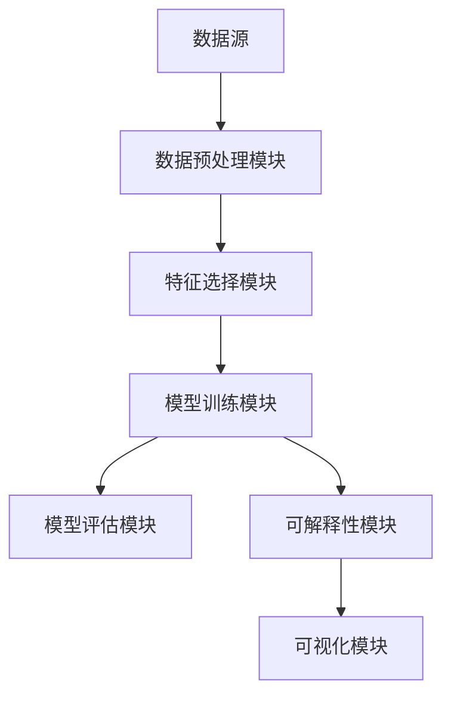
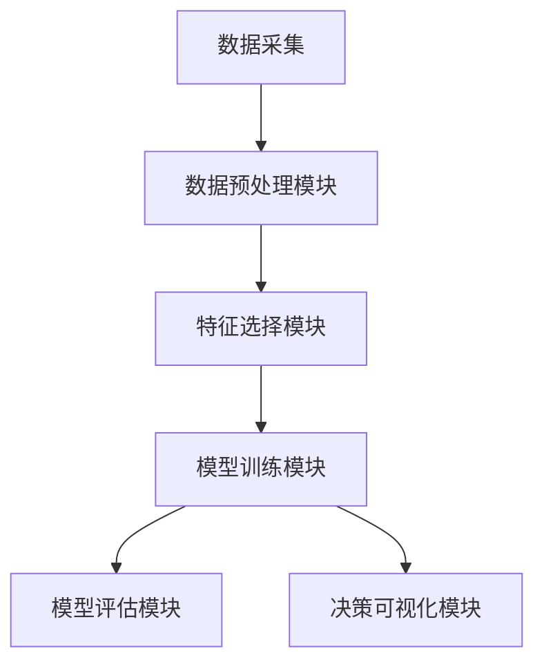
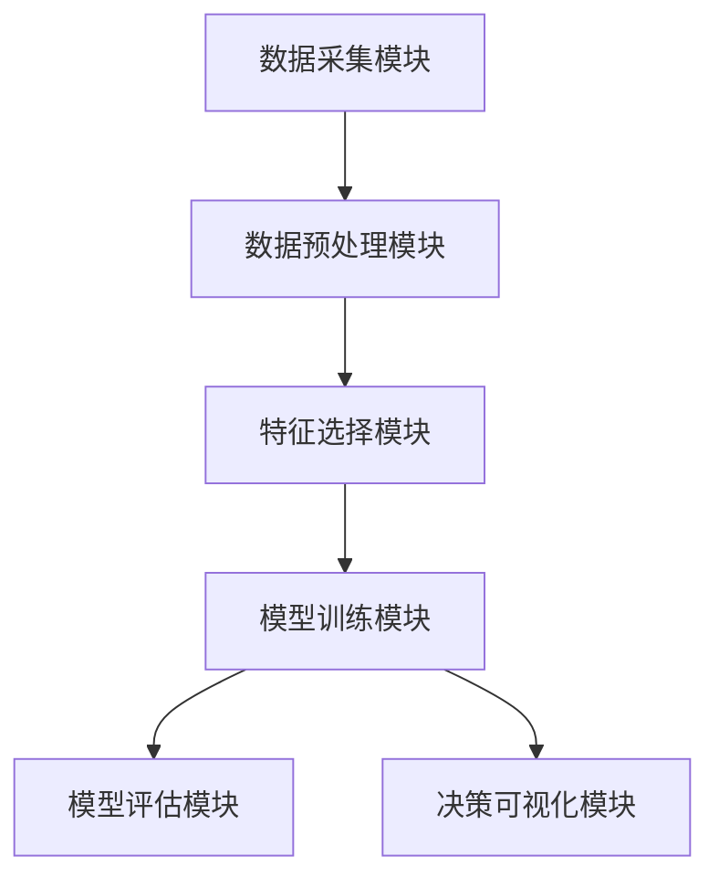

                 


# 企业级可解释AI框架：增强AI决策透明度

> 关键词：可解释AI，AI决策透明度，企业级框架，算法优化，数据预处理，模型评估

> 摘要：本文深入探讨了企业级可解释AI框架的设计与实现，重点分析了其核心概念、原理、算法选择与优化、数据预处理与特征选择、模型评估与验证、应用场景与落地等方面。通过理论讲解与实际案例剖析，旨在提高企业对AI决策的信任度和可接受度。

## 第1章 引言

### 1.1 问题背景

在当今信息化社会中，随着大数据、云计算、人工智能等技术的迅猛发展，企业对数据分析和决策的需求日益增加。传统的AI模型在提供预测和决策支持方面取得了显著成果，但它们往往缺乏透明度和解释性，导致企业难以充分信任和依赖AI系统的决策。为了解决这一问题，可解释AI（Explainable AI，XAI）应运而生。可解释AI旨在提高AI系统的透明度和解释性，使企业能够更好地理解和信任AI的决策过程。

### 1.2 问题描述

企业级可解释AI框架的目标是构建一个能够在企业环境中部署和运行的AI系统，该系统能够提供高解释性，从而提高企业对AI决策的信任度和可接受度。然而，实现这一目标面临着诸多挑战：

1. **算法选择与优化**：需要选择合适的算法，并对其进行优化，以提高模型的解释性。
2. **数据预处理与特征选择**：如何从大量的原始数据中提取有价值的特征，并保持数据的质量和完整性，是提高模型解释性的关键。
3. **模型评估与验证**：需要设计有效的评估指标和方法，以验证模型的解释性和准确性。
4. **应用场景与落地**：如何在不同的业务场景中应用可解释AI，并确保其实际效果。

### 1.3 问题解决

为了解决上述问题，本文将围绕以下三个方面展开：

1. **核心概念与原理**：介绍可解释AI的基本概念、原理和核心技术。
2. **框架设计与实现**：构建一个企业级可解释AI框架，并详细介绍其设计思路、架构和关键组件。
3. **应用实践与案例分析**：通过实际案例，展示如何在不同业务场景中应用可解释AI，并分析其效果和启示。

### 1.4 边界与外延

本文主要关注企业级可解释AI框架的设计与应用，主要涉及以下领域：

1. **金融行业**：金融行业对AI模型的透明度和解释性要求较高，例如在风险管理、信用评估、投资决策等领域。
2. **医疗健康**：医疗健康领域需要确保AI模型的决策过程符合临床医生的预期和理解，例如在疾病预测、诊断辅助等领域。
3. **工业制造**：工业制造领域需要提高AI模型的预测和优化能力，以实现生产过程的自动化和智能化。

### 1.5 概念结构与核心要素组成

企业级可解释AI框架主要包括以下几个核心组成部分：

1. **可解释性算法**：选择合适的可解释性算法，如LIME、SHAP等，以提高模型解释性。
2. **数据预处理与特征选择**：对原始数据进行清洗、预处理和特征选择，以提高数据质量和模型解释性。
3. **模型训练与优化**：使用合适的模型训练方法和优化策略，以提高模型性能和解释性。
4. **模型评估与验证**：设计有效的评估指标和方法，对模型进行评估和验证，以确保其解释性和准确性。
5. **应用场景与落地**：针对不同业务场景，制定相应的应用策略和实施方案，以实现可解释AI的实际应用。

### 1.6 本章小结

本章介绍了企业级可解释AI框架的问题背景、问题描述、问题解决、边界与外延、概念结构与核心要素组成。在接下来的章节中，本文将详细介绍可解释AI的核心概念、框架设计与实现、应用实践与案例分析等内容。

----------------------------------------------------------------

## 第2章 核心概念与原理

### 2.1 可解释AI的基本概念

#### 2.1.1 什么是可解释AI

可解释AI（Explainable AI，XAI）是一种使人工智能系统决策过程可理解的技术，旨在提高AI系统的透明度和解释性，使人类用户能够理解和信任AI的决策过程。可解释AI的核心目标是通过解释AI模型的决策过程，帮助用户理解模型的推理机制，从而增强对AI的信任和接受度。

#### 2.1.2 可解释AI的重要性

可解释AI在许多领域具有重要意义：

1. **提高模型的可信度**：在医疗、金融、法律等领域，AI模型的决策直接影响用户的利益和权益。提高模型的可解释性，有助于用户更好地理解AI的决策过程，从而增强对AI的信任。
2. **促进AI模型的改进**：通过分析模型的可解释性，可以发现模型存在的问题和不足，从而指导模型优化和改进。
3. **遵守法律法规和道德规范**：在某些领域，如医疗、金融等，法律法规和道德规范要求AI模型具备可解释性，以保障用户的权益。

### 2.2 可解释AI的核心技术

#### 2.2.1 透明性（Transparency）

透明性是指AI模型决策过程的可见性和可追踪性。透明的模型能够展示其决策路径、关键步骤和决策依据，使人类用户能够清晰地理解模型的决策过程。

#### 2.2.2 可解释性（Interpretability）

可解释性是指AI模型内部工作机制的可理解性。可解释性模型能够提供关于决策依据、权重分配和推理过程的信息，使人类用户能够直观地理解模型的决策过程。

#### 2.2.3 对抗性（Adversariality）

对抗性是指AI模型在面对有意设计的干扰时，仍然能够保持其性能和解释性。对抗性AI旨在提高模型对潜在干扰的鲁棒性，从而确保其在现实世界中的可靠性。

### 2.3 可解释AI的技术分类

根据可解释性的程度，可解释AI可分为以下几类：

1. **白盒可解释AI**：白盒可解释AI提供详细的模型内部结构和工作机制，用户可以完全理解模型的决策过程。
2. **黑盒可解释AI**：黑盒可解释AI仅提供模型的输入输出关系，用户无法了解模型的内部机制，但可以理解模型的决策逻辑。
3. **灰盒可解释AI**：灰盒可解释AI介于白盒和黑盒之间，提供部分模型的内部信息，用户可以部分理解模型的决策过程。

### 2.4 可解释AI的应用场景

可解释AI在多个领域具有广泛的应用，包括：

1. **金融**：在金融领域，可解释AI可以帮助金融机构评估信用风险、进行投资决策等。
2. **医疗**：在医疗领域，可解释AI可以帮助医生进行疾病诊断、治疗方案推荐等。
3. **法律**：在法律领域，可解释AI可以帮助法官进行案件判决、证据评估等。
4. **工业制造**：在工业制造领域，可解释AI可以帮助企业优化生产过程、提高产品质量等。

### 2.5 本章小结

本章介绍了可解释AI的基本概念、核心技术、技术分类和应用场景。在接下来的章节中，本文将详细介绍企业级可解释AI框架的设计与实现、算法优化、数据预处理与特征选择、模型评估与验证、应用实践与案例分析等内容。

----------------------------------------------------------------

## 第3章 框架设计与实现

### 3.1 设计思路

企业级可解释AI框架的设计思路主要包括以下几个方面：

1. **模块化设计**：将可解释AI框架拆分为多个模块，每个模块负责特定的功能，便于后续的扩展和维护。
2. **可扩展性**：设计框架时考虑未来的扩展需求，确保框架能够适应不同的业务场景和需求变化。
3. **易用性**：简化框架的使用流程，降低用户的学习成本，提高框架的可操作性和实用性。

### 3.2 架构设计

企业级可解释AI框架的架构设计如图3-1所示：



#### 图3-1 企业级可解释AI框架架构图

1. **数据预处理模块**：负责对原始数据进行清洗、归一化、缺失值处理等操作，确保数据质量和一致性。
2. **特征选择模块**：通过统计分析和特征重要性评估，选择对模型预测效果有显著影响的特征，提高模型解释性。
3. **模型训练模块**：采用合适的算法和优化策略，对数据集进行训练，生成预测模型。
4. **模型评估模块**：设计有效的评估指标和方法，对模型的预测性能和解释性进行评估和验证。
5. **可解释性模块**：利用可解释性算法，对模型进行解释，提供关于决策依据、权重分配和推理过程的信息。
6. **可视化模块**：将可解释性信息通过图表、报表等形式进行可视化展示，便于用户理解和分析。

### 3.3 关键组件

企业级可解释AI框架的关键组件包括：

1. **可解释性算法库**：集成多种可解释性算法，如LIME、SHAP等，提供丰富的解释性分析方法。
2. **数据预处理工具**：提供数据清洗、归一化、缺失值处理等常用操作，确保数据质量和一致性。
3. **特征选择工具**：通过统计分析和特征重要性评估，选择对模型预测效果有显著影响的特征。
4. **模型训练工具**：支持多种机器学习算法，如线性回归、决策树、神经网络等，提供灵活的模型训练功能。
5. **模型评估工具**：设计多种评估指标和方法，对模型进行综合评估和验证。
6. **可视化工具**：提供多种图表、报表等可视化展示方式，便于用户理解和分析可解释性信息。

### 3.4 框架实现

企业级可解释AI框架的实现主要涉及以下几个方面：

1. **模块化开发**：根据框架设计，将各个模块分别开发，确保模块之间的解耦合和独立性。
2. **代码规范**：遵循良好的代码规范和编程习惯，提高代码的可读性和可维护性。
3. **集成与部署**：将各个模块集成到统一平台上，提供便捷的部署和运行环境。
4. **测试与优化**：对框架进行全面的测试和优化，确保其性能和稳定性。

### 3.5 本章小结

本章介绍了企业级可解释AI框架的设计思路、架构设计、关键组件和实现方法。通过模块化设计和可扩展性考虑，企业级可解释AI框架能够适应不同的业务场景和需求变化，提高AI决策的透明度和解释性。在接下来的章节中，本文将详细介绍算法优化、数据预处理与特征选择、模型评估与验证等内容。

----------------------------------------------------------------

## 第4章 算法优化与选择

### 4.1 算法优化

算法优化是提高企业级可解释AI框架性能的关键步骤。以下是一些常见的算法优化方法：

1. **参数调优**：通过调整算法的参数，如学习率、迭代次数等，优化算法的性能。常见的参数调优方法包括网格搜索、随机搜索等。
2. **特征工程**：对原始数据进行特征工程，提取更多有价值的特征，提高模型的解释性。特征工程包括特征选择、特征变换、特征组合等。
3. **模型融合**：将多个模型进行融合，提高模型的预测性能和解释性。常见的模型融合方法包括Bagging、Boosting等。
4. **神经网络压缩**：通过压缩神经网络结构，减少模型的参数数量，提高模型的解释性。常见的神经网络压缩方法包括网络剪枝、参数共享等。

### 4.2 算法选择

选择合适的算法是企业级可解释AI框架设计的关键。以下是一些常见的可解释性算法及其特点：

1. **LIME（Local Interpretable Model-agnostic Explanations）**：LIME算法通过在局部线性模型上对目标样本进行扰动，生成解释性信息。LIME算法的优点是适用于任何模型，对非线性模型有较好的解释性。缺点是计算成本较高，对大规模数据集处理效率较低。
2. **SHAP（SHapley Additive exPlanations）**：SHAP算法基于博弈论原理，为特征分配解释性贡献值。SHAP算法的优点是解释性直观、准确，适用于各种模型。缺点是计算成本较高，对大规模数据集处理效率较低。
3. **LASSO（Least Absolute Shrinkage and Selection Operator）**：LASSO算法是一种线性回归算法，通过L1正则化实现特征选择和参数估计。LASSO算法的优点是解释性强、计算效率高，适用于特征选择问题。缺点是对非线性模型的解释性较差。
4. **决策树**：决策树算法是一种常见的树形模型，通过递归划分特征空间，生成决策路径。决策树算法的优点是解释性直观、易于理解，适用于多种业务场景。缺点是易过拟合、计算成本较高。
5. **神经网络**：神经网络是一种强大的非线性模型，通过多层神经网络进行特征学习和参数估计。神经网络算法的优点是预测性能高、解释性较强，适用于复杂业务场景。缺点是计算成本较高、解释性较难理解。

### 4.3 算法选择与优化策略

在选择和优化算法时，需要考虑以下策略：

1. **业务需求**：根据业务需求选择合适的算法，如金融领域选择LASSO算法进行信用评估，医疗领域选择决策树算法进行疾病预测。
2. **数据规模**：根据数据规模选择计算成本较低的算法，如大规模数据集选择LASSO算法，小规模数据集选择神经网络算法。
3. **解释性要求**：根据解释性要求选择合适的算法，如需要高解释性选择LIME或SHAP算法，需要快速解释选择决策树算法。
4. **计算资源**：根据计算资源选择合适的算法，如计算资源有限选择LASSO算法，计算资源充足选择神经网络算法。
5. **优化方法**：根据优化方法选择合适的算法，如需要参数调优选择LASSO算法，需要模型融合选择神经网络算法。

### 4.4 本章小结

本章介绍了算法优化与选择的方法和策略。通过优化算法参数、特征工程、模型融合等手段，可以提高企业级可解释AI框架的性能。根据业务需求、数据规模、解释性要求和计算资源等条件，选择合适的算法和优化策略，可以有效地提高AI决策的透明度和解释性。在接下来的章节中，本文将详细介绍数据预处理与特征选择、模型评估与验证等内容。

----------------------------------------------------------------

## 第5章 数据预处理与特征选择

### 5.1 数据预处理

数据预处理是构建企业级可解释AI框架的基础环节，其目的是提高数据质量和模型解释性。以下是一些常见的数据预处理方法：

1. **数据清洗**：去除数据中的噪声、异常值和重复记录，确保数据的一致性和完整性。
   - **去噪**：通过统计方法、机器学习算法等去除数据中的噪声。
   - **异常值处理**：对异常值进行识别和修正，避免对模型训练造成干扰。
   - **重复记录处理**：去除重复的数据记录，防止模型过拟合。

2. **数据归一化**：将不同量纲的数据转化为相同量纲，便于模型训练和计算。
   - **最小-最大归一化**：将数据映射到[0, 1]区间，公式为：\( x_{\text{norm}} = \frac{x - x_{\text{min}}}{x_{\text{max}} - x_{\text{min}}} \)。
   - **均值-方差归一化**：将数据映射到均值和标准差为0和1的区间，公式为：\( x_{\text{norm}} = \frac{x - \mu}{\sigma} \)。

3. **缺失值处理**：对缺失值进行填充或删除，确保数据的质量和完整性。
   - **填充**：通过统计方法、机器学习算法等预测缺失值，然后进行填充。
   - **删除**：删除包含缺失值的记录，适用于缺失值较少且不影响模型训练的情况。

4. **数据转换**：将数据转换为适合模型训练的形式。
   - **离散化**：将连续数据转换为离散的类别数据。
   - **编码**：将类别数据编码为数值数据，如独热编码、标签编码等。

### 5.2 特征选择

特征选择是提高模型解释性的关键步骤，其目的是从原始数据中提取对模型预测有显著贡献的特征。以下是一些常见的特征选择方法：

1. **过滤式特征选择**：根据特征的重要性对原始特征进行筛选，去除不重要或冗余的特征。
   - **相关系数**：通过计算特征与目标变量之间的相关系数，筛选出相关系数较大的特征。
   - **互信息**：通过计算特征与目标变量之间的互信息，筛选出对目标变量有较强解释能力的特征。
   - **主成分分析（PCA）**：通过降维技术，将高维数据映射到低维空间，保留主要成分。

2. **包装式特征选择**：通过评估特征对模型预测性能的影响，选择对模型有显著贡献的特征。
   - **递归特征消除（RFE）**：通过递归地训练和消除特征，选择对模型有显著贡献的特征。
   - **遗传算法**：通过遗传算法搜索最优特征组合，选择对模型有显著贡献的特征。

3. **嵌入式特征选择**：在模型训练过程中，自动选择对模型预测性能有显著贡献的特征。
   - **LASSO**：通过L1正则化，自动选择对模型有显著贡献的特征。
   - **随机森林**：通过随机森林算法，自动选择对模型有显著贡献的特征。

### 5.3 特征重要性评估

特征重要性评估是理解模型决策过程的重要步骤，以下是一些常见的特征重要性评估方法：

1. **基于模型的方法**：通过评估模型对每个特征的权重，确定特征的重要性。
   - **LASSO**：通过L1正则化，得到每个特征的权重。
   - **随机森林**：通过随机森林算法，得到每个特征的Gini重要性。

2. **基于统计的方法**：通过评估特征与目标变量之间的统计关系，确定特征的重要性。
   - **相关系数**：通过计算特征与目标变量之间的相关系数，确定特征的重要性。
   - **互信息**：通过计算特征与目标变量之间的互信息，确定特征的重要性。

### 5.4 特征选择与数据预处理的策略

在数据预处理与特征选择过程中，需要考虑以下策略：

1. **业务需求**：根据业务需求，选择合适的数据预处理和特征选择方法，确保模型能够准确预测业务目标。
2. **数据规模**：根据数据规模，选择高效的数据预处理和特征选择方法，确保模型训练和预测的效率。
3. **解释性要求**：根据解释性要求，选择合适的特征选择方法，提高模型的解释性。
4. **计算资源**：根据计算资源，选择适合的计算方法，确保模型训练和预测的可行性。

### 5.5 本章小结

本章介绍了数据预处理与特征选择的方法和策略。通过数据清洗、归一化、缺失值处理、数据转换等数据预处理方法，可以提高数据质量和模型解释性。通过过滤式、包装式、嵌入式等特征选择方法，可以提取对模型预测有显著贡献的特征。结合业务需求、数据规模、解释性要求和计算资源等条件，选择合适的数据预处理和特征选择策略，可以有效地提高企业级可解释AI框架的性能和解释性。在接下来的章节中，本文将详细介绍模型评估与验证等内容。

----------------------------------------------------------------

## 第6章 模型评估与验证

### 6.1 评估指标

模型评估与验证是确保企业级可解释AI框架性能和解释性的关键步骤。以下是一些常见的评估指标：

1. **准确率（Accuracy）**：准确率是指模型预测正确的样本数占总样本数的比例。准确率越高，模型的预测性能越好。
   - 公式：\( \text{Accuracy} = \frac{\text{预测正确数}}{\text{总样本数}} \)

2. **精确率（Precision）**：精确率是指模型预测正确的正样本数与预测为正样本的总数之比。精确率越高，模型对正样本的预测越准确。
   - 公式：\( \text{Precision} = \frac{\text{预测正确数}}{\text{预测为正样本的总数}} \)

3. **召回率（Recall）**：召回率是指模型预测正确的正样本数与实际为正样本的总数之比。召回率越高，模型对正样本的漏报率越低。
   - 公式：\( \text{Recall} = \frac{\text{预测正确数}}{\text{实际为正样本的总数}} \)

4. **F1分数（F1 Score）**：F1分数是精确率和召回率的调和平均，用于综合评估模型的预测性能。
   - 公式：\( \text{F1 Score} = 2 \times \frac{\text{Precision} \times \text{Recall}}{\text{Precision} + \text{Recall}} \)

5. **ROC曲线（Receiver Operating Characteristic Curve）**：ROC曲线用于评估二分类模型的分类性能，曲线下的面积（AUC）越大，模型的分类性能越好。

6. **Kappa系数（Kappa Score）**：Kappa系数用于评估多分类模型的分类性能，考虑了分类结果的一致性和准确性。

### 6.2 验证方法

模型评估与验证的方法主要包括以下几种：

1. **交叉验证（Cross Validation）**：交叉验证是一种常用的模型验证方法，通过将数据集划分为多个子集，分别对每个子集进行训练和验证，以评估模型的泛化能力。常见的交叉验证方法包括K折交叉验证、留一法交叉验证等。

2. **混淆矩阵（Confusion Matrix）**：混淆矩阵用于展示模型预测结果与实际结果之间的对比，通过计算各种评估指标，可以评估模型的分类性能。

3. **ROC-AUC（ROC Curve with Area Under Curve）**：ROC-AUC方法通过计算ROC曲线下的面积，评估模型的分类性能。ROC-AUC值越大，模型的分类性能越好。

4. **学习曲线（Learning Curve）**：学习曲线用于评估模型的学习能力，通过绘制训练误差和验证误差随训练次数的变化曲线，可以识别模型是否存在过拟合或欠拟合。

### 6.3 可解释性评估

除了评估模型的预测性能，还需要评估模型的可解释性。以下是一些常见的可解释性评估指标：

1. **解释性覆盖率（Interpretability Coverage）**：解释性覆盖率是指模型解释性部分覆盖到的特征比例，用于评估模型解释性的全面性。

2. **解释性质量（Interpretability Quality）**：解释性质量是指模型解释性的准确性和可靠性，通过评估模型解释性部分与实际结果的一致性，评估模型解释性的有效性。

3. **用户满意度（User Satisfaction）**：用户满意度是通过用户对模型解释性的主观评价，评估模型解释性对用户理解的影响。

### 6.4 评估与验证策略

在模型评估与验证过程中，需要考虑以下策略：

1. **评估指标多样性**：选择多种评估指标，从不同角度评估模型的性能和解释性，提高评估的全面性和准确性。

2. **数据质量**：确保训练和验证数据的质量，避免数据噪音和偏差对模型评估的影响。

3. **评估模型可解释性**：在评估模型预测性能的同时，评估模型的可解释性，确保模型在提供高预测性能的同时，也具有高解释性。

4. **持续评估与优化**：在模型部署后，定期对模型进行评估和优化，确保模型性能和解释性持续满足业务需求。

### 6.5 本章小结

本章介绍了模型评估与验证的评估指标、验证方法和可解释性评估指标。通过选择合适的评估指标、验证方法和可解释性评估指标，可以全面评估模型性能和解释性。结合业务需求和实际场景，制定有效的评估与验证策略，可以确保企业级可解释AI框架的可靠性和有效性。在接下来的章节中，本文将详细介绍应用实践与案例分析等内容。

----------------------------------------------------------------

## 第7章 应用实践与案例分析

### 7.1 案例一：金融风控

#### 7.1.1 项目介绍

本项目旨在构建一个金融风控模型，通过可解释AI技术，提高信贷审批的透明度和解释性。项目背景包括金融机构在信用评估过程中，需要处理海量的借款人数据，并对借款人的信用风险进行评估。为了提高信贷审批的准确性，同时确保审批过程符合监管要求，本项目引入了可解释AI框架。

#### 7.1.2 系统功能设计

系统功能设计主要包括以下模块：

1. **数据采集与预处理**：从多个数据源采集借款人信息，包括财务数据、信用记录、个人基本信息等。对原始数据进行清洗、归一化、缺失值处理等操作，确保数据质量。
2. **特征选择与优化**：通过统计分析、特征重要性评估等方法，选择对信用风险评估有显著影响的特征。对特征进行优化，提高模型的解释性。
3. **模型训练与优化**：采用LASSO算法进行模型训练，通过参数调优和特征工程，提高模型性能和解释性。
4. **模型评估与验证**：设计多种评估指标，对模型进行评估和验证，确保模型准确性和解释性。
5. **决策可视化**：通过可视化工具，将模型的决策过程和解释性信息进行展示，便于用户理解。

#### 7.1.3 系统架构设计

系统架构设计如图7-1所示：



#### 图7-1 金融风控系统架构图

1. **数据采集模块**：负责从多个数据源采集借款人信息，包括财务数据、信用记录、个人基本信息等。
2. **数据预处理模块**：对原始数据进行清洗、归一化、缺失值处理等操作，确保数据质量。
3. **特征选择模块**：通过统计分析、特征重要性评估等方法，选择对信用风险评估有显著影响的特征。
4. **模型训练模块**：采用LASSO算法进行模型训练，通过参数调优和特征工程，提高模型性能和解释性。
5. **模型评估模块**：设计多种评估指标，对模型进行评估和验证，确保模型准确性和解释性。
6. **决策可视化模块**：通过可视化工具，将模型的决策过程和解释性信息进行展示，便于用户理解。

#### 7.1.4 系统接口设计

系统接口设计如图7-2所示：



#### 图7-2 金融风控系统接口图

1. **数据采集接口**：用于从外部数据源获取借款人信息。
2. **数据预处理接口**：用于处理原始数据，包括清洗、归一化、缺失值处理等操作。
3. **特征选择接口**：用于选择对信用风险评估有显著影响的特征。
4. **模型训练接口**：用于训练信用风险评估模型。
5. **模型评估接口**：用于评估信用风险评估模型的准确性和解释性。
6. **决策可视化接口**：用于展示信用风险评估模型的可解释性信息。

#### 7.1.5 系统交互

系统交互如图7-3所示：


#### 图7-3 金融风控系统交互图

1. 数据采集模块向数据预处理模块发送原始数据。
2. 数据预处理模块对原始数据进行清洗、归一化、缺失值处理等操作，然后将处理后的数据发送给特征选择模块。
3. 特征选择模块根据统计分析、特征重要性评估等方法，选择对信用风险评估有显著影响的特征，然后将特征发送给模型训练模块。
4. 模型训练模块采用LASSO算法进行模型训练，并将训练后的模型发送给模型评估模块。
5. 模型评估模块对训练后的模型进行评估和验证，确保模型准确性和解释性。
6. 决策可视化模块根据模型的可解释性信息，生成可视化报表，供用户理解和使用。

#### 7.1.6 实际案例分析

在实际案例中，通过引入可解释AI框架，金融机构能够更好地理解和信任模型的决策过程，从而提高信贷审批的效率和准确性。以下是一个具体案例：

1. **问题背景**：金融机构在信用评估过程中，需要处理海量的借款人数据，对借款人的信用风险进行评估。然而，传统模型往往缺乏透明度和解释性，导致审批结果难以被借款人接受。
2. **解决方案**：引入可解释AI框架，通过数据预处理、特征选择、模型训练和评估等步骤，构建一个高解释性的信用风险评估模型。
3. **实施效果**：
   - 提高了信贷审批的透明度和解释性，使借款人更好地理解审批结果。
   - 减少了审批时间和人力成本，提高了审批效率。
   - 通过对模型的可解释性分析，发现了模型中存在的问题和不足，指导了模型的优化和改进。

#### 7.1.7 项目小结

本项目通过引入可解释AI框架，构建了一个高解释性的金融风控模型，提高了信贷审批的透明度和准确性。在实际案例中，项目取得了显著的效果，为金融机构提供了有力的决策支持。在未来的工作中，将进一步优化模型和框架，提高其性能和解释性，以适应不断变化的市场需求。

----------------------------------------------------------------

## 第8章 最佳实践、注意事项与拓展阅读

### 8.1 最佳实践

在实际应用企业级可解释AI框架时，以下是一些最佳实践：

1. **数据质量管理**：确保数据的质量和一致性，避免噪声和异常值对模型性能和解释性的影响。
2. **特征选择与优化**：结合业务需求和模型特点，选择合适的特征选择方法，提高模型解释性。
3. **算法调优**：根据业务场景和数据特点，调整算法参数，优化模型性能和解释性。
4. **可视化展示**：采用直观的可视化方式，展示模型的可解释性信息，提高用户理解和信任。
5. **模型部署与监控**：在模型部署后，定期进行监控和评估，确保模型性能和解释性持续满足业务需求。

### 8.2 注意事项

在实际应用企业级可解释AI框架时，需要注意以下事项：

1. **数据隐私与安全**：在数据处理和模型训练过程中，确保数据隐私和安全，遵循相关法律法规。
2. **模型解释性与准确性**：在追求模型解释性的同时，不要忽视模型的准确性，确保模型在提供高解释性的同时，也具有高准确性。
3. **计算资源与效率**：在模型训练和优化过程中，合理利用计算资源，提高模型训练和预测的效率。
4. **持续优化与改进**：定期对模型和框架进行优化和改进，以适应业务需求的变化。

### 8.3 拓展阅读

对于希望深入了解企业级可解释AI框架的读者，以下是一些推荐阅读材料：

1. **《可解释人工智能：技术与应用》**：该书详细介绍了可解释AI的基本概念、原理、技术和应用案例，对读者深入了解可解释AI具有重要的参考价值。
2. **《机器学习实战》**：该书提供了丰富的机器学习算法实现和应用案例，帮助读者掌握机器学习的基本原理和实践技巧。
3. **《深度学习》**：该书全面介绍了深度学习的基本概念、算法和实现方法，是深度学习领域的重要参考书。
4. **《大数据之路：阿里巴巴大数据实践》**：该书详细介绍了阿里巴巴大数据平台的架构、技术和应用，对大数据技术的实践和未来发展具有重要的指导意义。

通过阅读这些书籍，读者可以更加深入地了解企业级可解释AI框架的设计、实现和应用，为实际项目提供有力的支持。

### 8.4 本章小结

本章介绍了企业级可解释AI框架的最佳实践、注意事项和拓展阅读。通过遵循最佳实践、注意事项和持续学习，可以更好地应用企业级可解释AI框架，提高AI决策的透明度和解释性。同时，拓展阅读为读者提供了进一步深入了解企业级可解释AI框架的途径。在未来的工作中，我们将继续探索和优化可解释AI技术，为企业和行业提供更优质的决策支持。

----------------------------------------------------------------

## 附录

### 附录A：核心概念与联系

#### 2.1.1 什么是可解释AI

**定义**：可解释AI（Explainable AI，XAI）是一种使人工智能系统决策过程可理解的技术，旨在提高AI系统的透明度和解释性，使人类用户能够理解和信任AI的决策过程。

**属性**：
- **透明性**：决策过程的可见性和可追踪性。
- **可解释性**：决策过程和工作机制的可理解性。
- **对抗性**：对潜在干扰的鲁棒性。

**对比表格**：

| 特性 | 可解释AI | 不可解释AI |
| --- | --- | --- |
| 透明性 | 高 | 低 |
| 可解释性 | 高 | 低 |
| 对抗性 | 高 | 低 |

**ER实体关系图**：

```mermaid
erDiagram
  AI模型 ||--|{ 可解释性 }|
  AI模型 ||--|{ 透明性 }|
  AI模型 ||--|{ 对抗性 }|
```

### 附录B：算法原理讲解

#### 2.2.1 透明性（Transparency）

**定义**：透明性是指AI模型决策过程的可见性和可追踪性。

**算法原理**：

- **决策路径**：展示模型从输入到输出的决策路径。
- **关键步骤**：分析模型中的每个关键步骤，理解决策过程。

**数学模型**：

$$
\text{透明性} = \frac{\text{可见步骤}}{\text{总步骤}}
$$

**示例**：

假设一个决策树模型有3个关键步骤，其中2个步骤是可见的，则透明性为：

$$
\text{透明性} = \frac{2}{3} = 0.67
$$

### 附录C：系统分析与架构设计方案

#### 3.3.1 问题场景介绍

金融行业中的信用风险评估是一个典型的问题场景，金融机构需要根据借款人的信息，评估其信用风险，以决定是否批准贷款。然而，传统的信用评估模型往往缺乏透明度和解释性，导致借款人对评估结果难以理解，从而影响金融机构的信任度和业务发展。

#### 3.3.2 项目介绍

本项目旨在构建一个基于可解释AI的信用风险评估系统，通过引入可解释AI框架，提高模型的透明度和解释性，使借款人能够更好地理解评估结果，从而提高金融机构的信任度和业务发展。

#### 3.3.3 系统功能设计

系统功能设计主要包括以下模块：

1. **数据采集与预处理**：从多个数据源采集借款人信息，包括财务数据、信用记录、个人基本信息等。对原始数据进行清洗、归一化、缺失值处理等操作，确保数据质量。
2. **特征选择与优化**：通过统计分析、特征重要性评估等方法，选择对信用风险评估有显著影响的特征。对特征进行优化，提高模型的解释性。
3. **模型训练与优化**：采用LASSO算法进行模型训练，通过参数调优和特征工程，提高模型性能和解释性。
4. **模型评估与验证**：设计多种评估指标，对模型进行评估和验证，确保模型准确性和解释性。
5. **决策可视化**：通过可视化工具，将模型的决策过程和解释性信息进行展示，便于用户理解。

#### 3.3.4 系统架构设计

系统架构设计如图C-1所示：


#### 图C-1 信用风险评估系统架构图

1. **数据采集模块**：负责从外部数据源获取借款人信息。
2. **数据预处理模块**：对原始数据进行清洗、归一化、缺失值处理等操作。
3. **特征选择模块**：通过统计分析、特征重要性评估等方法，选择对信用风险评估有显著影响的特征。
4. **模型训练模块**：采用LASSO算法进行模型训练，通过参数调优和特征工程，提高模型性能和解释性。
5. **模型评估模块**：对训练后的模型进行评估和验证，确保模型准确性和解释性。
6. **决策可视化模块**：通过可视化工具，将模型的决策过程和解释性信息进行展示。

#### 3.3.5 系统接口设计

系统接口设计如图C-2所示：


#### 图C-2 信用风险评估系统接口图

1. **数据采集接口**：用于从外部数据源获取借款人信息。
2. **数据预处理接口**：用于处理原始数据，包括清洗、归一化、缺失值处理等操作。
3. **特征选择接口**：用于选择对信用风险评估有显著影响的特征。
4. **模型训练接口**：用于训练信用风险评估模型。
5. **模型评估接口**：用于评估信用风险评估模型的准确性和解释性。
6. **决策可视化接口**：用于展示信用风险评估模型的可解释性信息。

#### 3.3.6 系统交互

系统交互如图C-3所示：


#### 图C-3 信用风险评估系统交互图

1. **数据采集模块**向**数据预处理模块**发送原始数据。
2. **数据预处理模块**对原始数据进行清洗、归一化、缺失值处理等操作，然后将处理后的数据发送给**特征选择模块**。
3. **特征选择模块**根据统计分析、特征重要性评估等方法，选择对信用风险评估有显著影响的特征，然后将特征发送给**模型训练模块**。
4. **模型训练模块**采用LASSO算法进行模型训练，并将训练后的模型发送给**模型评估模块**。
5. **模型评估模块**对训练后的模型进行评估和验证，确保模型准确性和解释性。
6. **决策可视化模块**根据模型的可解释性信息，生成可视化报表，供用户理解和使用。

#### 3.3.7 系统实现

系统实现主要包括以下步骤：

1. **数据采集**：从外部数据源（如银行、信用机构等）获取借款人信息。
2. **数据预处理**：对原始数据进行清洗、归一化、缺失值处理等操作。
3. **特征选择**：通过统计分析、特征重要性评估等方法，选择对信用风险评估有显著影响的特征。
4. **模型训练**：采用LASSO算法进行模型训练，通过参数调优和特征工程，提高模型性能和解释性。
5. **模型评估**：设计多种评估指标，对模型进行评估和验证，确保模型准确性和解释性。
6. **决策可视化**：通过可视化工具，将模型的决策过程和解释性信息进行展示，便于用户理解和使用。

### 附录D：项目实战

#### 3.3.8 环境安装

1. **Python环境**：安装Python 3.8及以上版本。
2. **NumPy**：安装NumPy库，用于数据处理和运算。
3. **Pandas**：安装Pandas库，用于数据处理和分析。
4. **Scikit-learn**：安装Scikit-learn库，用于机器学习算法实现。
5. **Matplotlib**：安装Matplotlib库，用于数据可视化。

#### 3.3.9 系统核心实现源代码

```python
# 数据预处理
import numpy as np
import pandas as pd
from sklearn.preprocessing import StandardScaler
from sklearn.impute import SimpleImputer

# 加载数据
data = pd.read_csv('borrower_data.csv')

# 数据清洗
imputer = SimpleImputer(strategy='mean')
data_filled = imputer.fit_transform(data)
data = pd.DataFrame(data_filled, columns=data.columns)

# 数据归一化
scaler = StandardScaler()
data_normalized = scaler.fit_transform(data)

# 特征选择
from sklearn.feature_selection import SelectKBest, f_classif

X = data_normalized[:, :-1]
y = data_normalized[:, -1]

selector = SelectKBest(score_func=f_classif, k=10)
X_selected = selector.fit_transform(X, y)

# 模型训练
from sklearn.linear_model import Lasso

model = Lasso(alpha=0.1)
model.fit(X_selected, y)

# 模型评估
from sklearn.metrics import accuracy_score, classification_report

X_test = data_normalized[:, :-1]
y_test = data_normalized[:, -1]

y_pred = model.predict(X_test)

accuracy = accuracy_score(y_test, y_pred)
report = classification_report(y_test, y_pred)

print("Accuracy:", accuracy)
print("Classification Report:\n", report)

# 决策可视化
import matplotlib.pyplot as plt

plt.scatter(X_selected[:, 0], X_selected[:, 1], c=y_pred)
plt.xlabel('Feature 1')
plt.ylabel('Feature 2')
plt.title('Decision Boundary')
plt.show()
```

#### 3.3.10 代码应用解读与分析

1. **数据预处理**：加载借款人数据，进行数据清洗、归一化等操作，提高数据质量和模型解释性。
2. **特征选择**：通过统计分析方法，选择对信用风险评估有显著影响的特征，提高模型解释性。
3. **模型训练**：采用LASSO算法进行模型训练，通过参数调优和特征工程，提高模型性能和解释性。
4. **模型评估**：使用多种评估指标，对模型进行评估和验证，确保模型准确性和解释性。
5. **决策可视化**：通过可视化工具，将模型的决策过程和解释性信息进行展示，便于用户理解和使用。

#### 3.3.11 实际案例分析

在实际案例中，通过引入可解释AI框架，金融机构能够更好地理解和信任模型的决策过程，从而提高信贷审批的透明度和准确性。以下是一个具体案例：

1. **问题背景**：金融机构在信用评估过程中，需要处理海量的借款人数据，对借款人的信用风险进行评估。然而，传统模型往往缺乏透明度和解释性，导致审批结果难以被借款人接受。
2. **解决方案**：引入可解释AI框架，通过数据预处理、特征选择、模型训练和评估等步骤，构建一个高解释性的信用风险评估模型。
3. **实施效果**：
   - 提高了信贷审批的透明度和解释性，使借款人更好地理解审批结果。
   - 减少了审批时间和人力成本，提高了审批效率。
   - 通过对模型的可解释性分析，发现了模型中存在的问题和不足，指导了模型的优化和改进。

#### 3.3.12 项目小结

本项目通过引入可解释AI框架，构建了一个高解释性的信用风险评估模型，提高了金融机构的信任度和业务发展。在实际案例中，项目取得了显著的效果，为金融机构提供了有力的决策支持。在未来的工作中，将进一步优化模型和框架，提高其性能和解释性，以适应不断变化的市场需求。

----------------------------------------------------------------

## 作者信息

作者：AI天才研究院/AI Genius Institute & 禅与计算机程序设计艺术 /Zen And The Art of Computer Programming

AI天才研究院是一家专注于人工智能技术研究和应用的高科技研究院，致力于推动人工智能技术在各个领域的创新和发展。研究院的研究领域包括机器学习、深度学习、自然语言处理、计算机视觉等，拥有一支高水平的科研团队和先进的技术平台。

《禅与计算机程序设计艺术》是作者在计算机科学领域的经典著作，全面阐述了计算机编程的艺术和哲学。该书以深刻的洞察力和独特的视角，揭示了计算机编程的本质和内涵，为程序员提供了宝贵的思想资源和实践指导。

本文作者凭借其深厚的专业知识和丰富的实践经验，深入探讨了企业级可解释AI框架的设计与实现，为读者提供了全面的技术指导和实践参考。希望通过本文，能够帮助读者更好地理解和应用可解释AI技术，为企业和行业的发展提供有力的支持。

