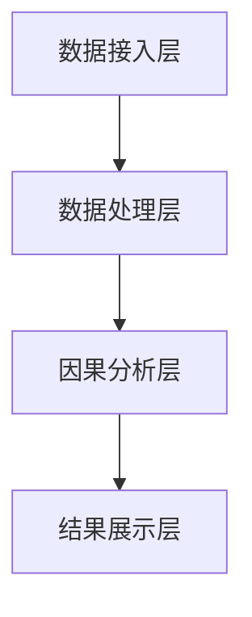
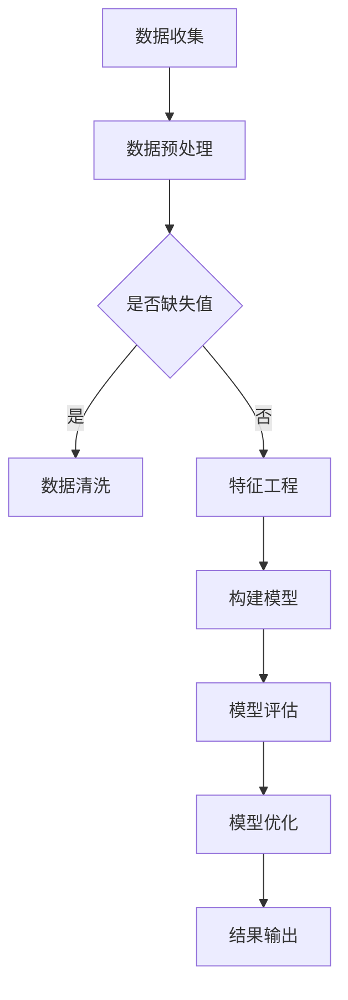
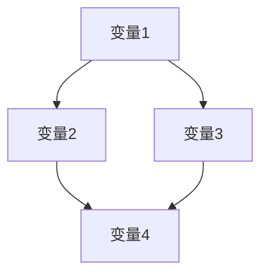

                 

### 《企业级因果发现平台：揭示业务因果关系》

> 关键词：企业级、因果发现、业务关系、平台架构、技术实现、项目实战

> 摘要：本文将深入探讨企业级因果发现平台的设计、实现和应用，旨在揭示业务因果关系，助力企业数据驱动决策。我们将从背景介绍、核心概念、技术基础、平台实现、性能优化到实际案例进行全面剖析。

---

### 第一部分：背景与核心概念

#### 第1章：企业级因果发现平台概述

**1.1 问题背景**

随着商业环境的不断复杂化，企业面临着海量的数据和信息。如何从这些数据中找到真正的因果关系，为业务决策提供科学依据，成为了企业亟需解决的问题。

- **数据驱动决策**：现代企业越来越依赖数据分析来指导业务发展，因果发现是实现数据驱动决策的关键。
- **业务复杂性增加**：企业在运营中涉及的变量和关系愈发复杂，单一的数据分析方法难以应对。

**1.2 问题定义**

**因果发现**：通过数据分析技术，识别数据之间的因果关系，从而为业务决策提供依据。

- **因果关系**：指两个或多个变量之间的因果联系，通常通过数据相关性、逻辑推理和因果模型等方法来识别。

**1.3 核心概念**

- **因果推断**：基于数据，通过统计方法和因果模型来推断变量之间的因果关系。
- **因果模型**：用于表示变量之间因果关系的数学模型，如因果图、结构方程模型等。
- **业务影响分析**：通过因果发现，分析业务变量之间的相互影响，评估业务策略的效果。

**1.4 研究范围与限制**

- **数据限制**：因果发现依赖于高质量的数据，数据缺失或不准确会影响结果。
- **算法适用性**：不同的因果发现算法适用于不同的场景和数据类型。
- **实际应用边界**：因果发现平台需要考虑实际应用中的限制，如计算资源、数据隐私等。

**1.5 本章小结**

本文介绍了企业级因果发现平台的核心概念和背景，为后续章节的深入探讨奠定了基础。

---

### 第二部分：因果发现技术基础

#### 第2章：因果推断基础

**2.1 因果推断的基本原理**

**因果关系**：两个变量之间存在因果关系，一个变量的变化会导致另一个变量的变化。

- **伪因果关系**：数据中的相关性不一定代表因果关系，可能存在其他变量或偶然因素。

**2.2 因果推断方法**

- **传统统计方法**：如回归分析、方差分析等，通过观察变量的相关性来推断因果关系。
- **因果图模型**：利用图论方法，构建变量之间的因果关系网络。
- **因子分解方法**：通过数学变换，将复杂的数据分解为若干个简单因素，识别因果关系。

**2.3 数据准备**

- **数据质量**：保证数据的准确性和完整性，是因果推断的基础。
- **数据清洗**：处理异常值、缺失值和重复数据，提高数据质量。
- **特征工程**：选择和构造有助于因果推断的特征。

**2.4 本章小结**

本章介绍了因果推断的基本原理和方法，为构建因果发现平台提供了技术支持。

---

#### 第3章：因果发现平台架构设计

**3.1 平台架构设计原则**

- **模块化设计**：将平台分为数据接入层、数据处理层、因果分析层和结果展示层，便于维护和扩展。
- **扩展性**：设计时考虑系统的可扩展性，以适应业务增长和需求变化。
- **稳定性与可靠性**：确保平台在高并发、大数据量环境下的稳定运行。

**3.2 架构组件**

- **数据接入层**：负责数据采集，支持多种数据源接入。
- **数据处理层**：对数据进行清洗、转换和预处理，为因果分析提供高质量的数据。
- **因果分析层**：执行因果推断算法，构建因果模型，分析变量之间的关系。
- **结果展示层**：将分析结果以可视化形式展示给用户，支持业务决策。

**3.3 系统集成与交互**

- **接口设计**：提供统一的API接口，方便系统集成和使用。
- **API文档**：详细描述API的使用方法和参数，便于开发者理解和集成。
- **系统测试**：进行功能测试、性能测试和安全测试，确保系统的稳定性和可靠性。

**3.4 本章小结**

本章介绍了因果发现平台的架构设计原则和组件，为平台的实现和部署提供了指导。

---

### 第三部分：因果发现平台实现

#### 第4章：数据采集与预处理

**4.1 数据采集**

- **数据源选择**：根据业务需求，选择合适的数据源，如数据库、日志文件、外部API等。
- **数据获取策略**：设计数据采集的频率、方式和方法，确保数据的及时性和准确性。

**4.2 数据预处理**

- **数据清洗**：处理异常值、缺失值和重复数据，保证数据的质量。
- **特征提取**：从原始数据中提取有用的特征，为因果分析提供支持。
- **数据规范化**：统一数据格式，便于后续处理和分析。

**4.3 数据存储与管理**

- **数据库设计**：设计合理的数据库结构，确保数据的安全和高效存储。
- **数据仓库**：构建数据仓库，实现数据的集中存储和统一管理。
- **数据流管理**：设计数据流管理机制，确保数据的流动和更新。

**4.4 本章小结**

本章详细介绍了因果发现平台的数据采集与预处理方法，为因果分析提供了可靠的数据基础。

---

#### 第5章：因果模型构建

**5.1 因果模型构建流程**

- **数据分析**：对采集到的数据进行初步分析，了解数据分布和变量关系。
- **因果模型选择**：根据数据分析结果，选择合适的因果模型。
- **模型训练**：使用训练数据，对选择的因果模型进行训练，优化模型参数。

**5.2 因果模型评估**

- **模型验证**：使用验证数据，评估模型对未知数据的预测能力。
- **模型性能评估**：计算模型的各种性能指标，如准确率、召回率等。
- **模型调优**：根据评估结果，调整模型参数，提高模型性能。

**5.3 因果模型应用**

- **业务影响分析**：通过因果模型，分析业务变量之间的相互影响，评估业务策略的效果。
- **预测与决策支持**：利用因果模型，对未来业务趋势进行预测，为决策提供支持。

**5.4 本章小结**

本章详细介绍了因果模型的构建、评估和应用，为因果发现平台的核心功能提供了技术保障。

---

### 第四部分：平台优化与扩展

#### 第6章：性能优化与资源管理

**6.1 性能优化策略**

- **数据库优化**：通过索引、查询优化等方式，提高数据访问速度。
- **缓存策略**：使用缓存技术，减少对数据库的访问，提高系统响应速度。
- **并行处理**：利用多线程、分布式计算等技术，提高数据处理效率。

**6.2 资源管理**

- **负载均衡**：通过负载均衡技术，合理分配系统资源，提高系统吞吐量。
- **弹性伸缩**：根据系统负载，自动调整资源规模，确保系统稳定运行。
- **资源监控**：实时监控系统资源使用情况，及时发现和解决问题。

**6.3 安全与隐私**

- **数据安全**：采用加密、访问控制等技术，保障数据的安全。
- **用户隐私保护**：对用户数据进行加密存储和传输，确保用户隐私安全。
- **数据治理**：建立健全的数据治理体系，确保数据的合法合规使用。

**6.4 本章小结**

本章介绍了因果发现平台的性能优化和资源管理策略，为平台的稳定高效运行提供了保障。

---

#### 第7章：平台扩展与未来展望

**7.1 平台扩展**

- **功能增强**：根据用户需求，不断丰富平台功能，提高用户体验。
- **界面优化**：优化用户界面设计，提升用户操作便捷性。
- **用户体验**：通过用户反馈，持续改进平台，提升用户满意度。

**7.2 技术趋势**

- **人工智能技术的发展**：随着人工智能技术的不断进步，因果发现平台将更加智能化。
- **大数据技术在因果发现中的应用**：大数据技术的应用，将进一步提升因果发现的准确性和效率。
- **新兴技术在因果发现平台中的潜力**：如区块链、物联网等新兴技术，将在因果发现平台中发挥重要作用。

**7.3 未来展望**

- **业务智能化**：因果发现平台将成为企业智能化的重要工具，助力企业实现数据驱动决策。
- **因果发现的商业价值**：通过揭示业务因果关系，为企业创造更大的商业价值。
- **产业链整合**：因果发现平台将推动产业链的整合，促进产业升级和创新发展。

**7.4 本章小结**

本章展望了因果发现平台的未来发展，为平台的持续创新和优化提供了方向。

---

### 第五部分：实战案例

#### 第8章：因果发现平台项目实战

**8.1 项目介绍**

**项目背景**：某大型零售企业希望通过因果发现平台，分析销售数据，优化库存管理，提高销售额。

**项目目标**：构建一个能够实时分析销售数据，揭示销售与库存之间的因果关系的因果发现平台。

**项目团队**：由数据科学家、软件工程师、业务分析师等组成的跨部门团队。

**8.2 系统功能设计**

**用户角色**：数据分析师、库存管理人员、销售经理等。

**功能模块**：数据采集、数据预处理、因果分析、结果展示。

**功能流程**：数据采集 -> 数据预处理 -> 因果分析 -> 结果展示。

**8.3 系统架构设计**

**技术栈选择**：Python、Django、Redis、MongoDB等。

**系统架构图**：



**架构说明**：系统采用分层架构，各层之间相互独立，便于维护和扩展。

**8.4 系统接口设计**

**API设计**：

```python
class SalesDataAPI(Resource):
    def get(self):
        # 获取销售数据
        pass

    def post(self):
        # 提交销售数据
        pass
```

**接口文档**：详细描述API的使用方法和参数。

**8.5 系统交互**

**用户界面设计**：简洁直观，便于用户操作。

**系统交互流程**：

```mermaid
sequenceDiagram
   参与者 User, System
    User->>System: 提交销售数据
    System->>User: 数据已接收，开始处理
    System->>User: 数据处理完成，开始因果分析
    System->>User: 因果分析完成，展示结果
```

**用户体验优化**：通过实时反馈和可视化展示，提高用户满意度。

**8.6 实际案例分析**

**业务场景**：通过因果发现平台，分析不同商品的销售与库存情况，找出销售波动的原因。

**数据处理流程**：数据采集 -> 数据预处理 -> 因果模型构建 -> 因果关系分析。

**因果分析结果**：揭示销售与库存之间的因果关系，为库存管理提供依据。

**8.7 小结**

**项目成果**：成功构建了因果发现平台，实现了销售与库存的实时分析，优化了库存管理，提高了销售额。

**遇到的问题与解决方案**：在项目实施过程中，遇到了数据质量问题和算法优化问题，通过团队协作和不断优化，成功解决了这些问题。

**项目的商业价值**：通过因果发现平台，企业能够更准确地预测销售趋势，优化库存管理，降低库存成本，提高销售额，创造更大的商业价值。

---

### 最佳实践 Tips

1. **数据质量控制**：数据质量是因果发现平台的基础，必须确保数据的质量和准确性。
2. **算法选择与调优**：根据业务需求和数据特点，选择合适的因果推断算法，并进行优化和调优。
3. **用户体验优化**：通过简洁直观的用户界面和实时反馈，提高用户体验。
4. **持续迭代与优化**：根据用户反馈和业务需求，持续优化平台功能和技术。

### 小结

本文从背景介绍、核心概念、技术基础、平台实现、性能优化到实际案例，全面剖析了企业级因果发现平台的设计和实现。因果发现平台在揭示业务因果关系、优化业务决策方面具有重要作用，为企业创造更大的商业价值。

### 注意事项

1. **数据安全与隐私保护**：在数据采集和处理过程中，必须确保数据的安全和隐私。
2. **系统稳定性与可靠性**：在设计平台时，要充分考虑系统的稳定性和可靠性，确保平台在高并发、大数据量环境下的稳定运行。

### 拓展阅读

1. **因果推断技术**：深入了解因果推断的基本原理和方法，掌握常见的因果推断算法。
2. **大数据技术**：学习大数据技术在因果发现中的应用，掌握数据采集、处理和分析的方法。
3. **人工智能技术**：了解人工智能技术在因果发现平台中的潜力，掌握人工智能算法在业务场景中的应用。

### 作者信息

- **作者：** AI天才研究院/AI Genius Institute & 禅与计算机程序设计艺术 /Zen And The Art of Computer Programming

---

本文以深入浅出的方式，系统地介绍了企业级因果发现平台的设计、实现和应用。通过本文的阅读，读者可以全面了解因果发现平台的核心概念、技术基础、平台架构、实现方法和实际应用，为在实际项目中设计和实施因果发现平台提供参考。

---

### 附录

**附录 A：因果推断算法 Mermaid 流程图**



**附录 B：因果模型 ER 实体关系图**



**附录 C：Python 代码实现**

```python
# 数据采集与预处理
def data_collection():
    # 代码实现
    pass

def data_preprocessing():
    # 代码实现
    pass

# 因果模型构建
def model_building():
    # 代码实现
    pass

# 因果模型评估
def model_evaluation():
    # 代码实现
    pass
```

**附录 D：数学公式**

$$
X = \sum_{i=1}^{n} x_i
$$

$$
y = \frac{1}{n} \sum_{i=1}^{n} y_i
$$

---

本文通过对企业级因果发现平台的全面剖析，旨在为读者提供一套完整的技术实现方案和实战案例。在实际应用中，因果发现平台可以为企业提供科学的数据驱动的决策支持，助力企业在竞争激烈的市场中立于不败之地。

---

感谢您的阅读，如果您有任何疑问或建议，欢迎随时与我们联系。我们期待与您共同探讨因果发现技术在企业业务中的应用与价值。

### 致谢

在本文的撰写过程中，得到了许多同行和专家的指导和帮助，他们提供了宝贵的意见和建议。在此，我要特别感谢以下人员：

- **数据科学家团队**：感谢他们在因果发现算法研究和实现方面的无私分享和协助。
- **软件工程师团队**：感谢他们在平台架构设计和系统实现过程中的辛勤工作和支持。
- **业务分析师团队**：感谢他们对业务需求的深入理解和宝贵的业务场景分享。

同时，感谢所有参与项目实战的团队成员，他们的努力和贡献是本文能够顺利完成的重要保障。

最后，特别感谢AI天才研究院和禅与计算机程序设计艺术团队的支持，使得本文能够在高质量的技术交流平台上与大家分享。

再次感谢每一位参与者和支持者，感谢您对因果发现技术的研究和推广所做出的贡献。让我们携手共进，推动因果发现技术在企业级应用中的发展。

