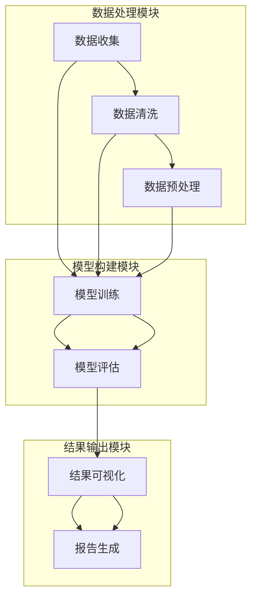
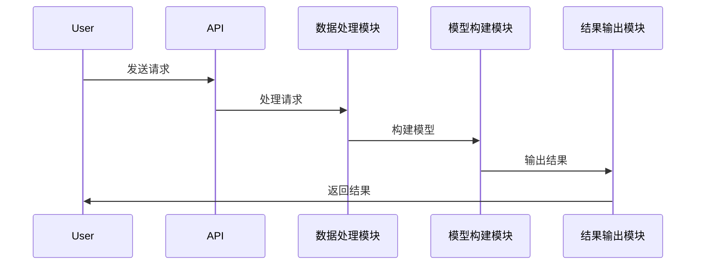

                 


### 文章标题：企业级因果推断引擎：深化商业决策分析

#### 关键词：因果推断、商业决策、数据分析、系统架构、Python代码

#### 摘要：
本文深入探讨企业级因果推断引擎在商业决策分析中的应用。我们将从背景介绍、核心概念、算法原理、系统分析与架构设计、实际案例解析以及最佳实践等方面，逐步阐述如何构建并有效利用因果推断引擎，以提升企业的决策质量和效率。

----------------------------------------------------------------

### 目录大纲设计

#### 第一部分：企业级因果推断引擎概述

**1.1 因果推断基本概念**
- **1.1.1 问题的背景和重要性**
- **1.1.2 因果推断的定义与基本原理**
- **1.1.3 因果推断在企业决策分析中的应用**

**1.2 核心概念与联系**
- **1.2.1 因果推断与相关概念的区别与联系**
- **1.2.2 因果推断的基本要素**
- **1.2.3 因果推断的ER实体关系图**

**1.3 因果推断算法原理**
- **1.3.1 算法概述**
- **1.3.2 数学模型与公式**
- **1.3.3 Mermaid流程图说明**
- **1.3.4 Python代码示例**

**1.4 系统分析与架构设计**
- **1.4.1 问题场景介绍**
- **1.4.2 项目介绍**
- **1.4.3 系统功能设计（Mermaid类图）**
- **1.4.4 系统架构设计（Mermaid架构图）**
- **1.4.5 系统接口设计**
- **1.4.6 系统交互（Mermaid序列图）**

**1.5 小结与展望**

#### 第二部分：企业级因果推断引擎应用实践

**2.1 实践准备**
- **2.1.1 环境搭建**
- **2.1.2 工具和库的安装**

**2.2 实际案例解析**
- **2.2.1 案例背景**
- **2.2.2 案例数据集介绍**
- **2.2.3 因果推断分析过程**
- **2.2.4 结果解读**

**2.3 案例剖析**
- **2.3.1 源代码解读**
- **2.3.2 关键技术分析**
- **2.3.3 案例优缺点讨论**

**2.4 项目小结**

#### 第三部分：最佳实践与未来展望

**3.1 最佳实践**
- **3.1.1 因果推断在实际业务中的应用场景**
- **3.1.2 避免因果谬误的策略**
- **3.1.3 提高因果推断准确性的方法**

**3.2 小结与反思**
- **3.2.1 全书总结**
- **3.2.2 知识点回顾**
- **3.2.3 读者建议**

**3.3 注意事项**
- **3.3.1 数据预处理的重要性**
- **3.3.2 选择合适算法的考虑因素**
- **3.3.3 因果推断与机器学习的结合**

**3.4 拓展阅读**
- **3.4.1 相关书籍推荐**
- **3.4.2 学术论文精选**
- **3.4.3 网络资源与工具**

----------------------------------------------------------------

### 文章正文部分

#### 第一部分：企业级因果推断引擎概述

**1.1 因果推断基本概念**

**1.1.1 问题的背景和重要性**

在现代商业环境中，数据是企业的核心资产。然而，从数据中发现有价值的信息并不是一件容易的事情。因果推断作为一种数据分析方法，能够帮助我们从大量数据中找出变量之间的因果关系，从而为决策提供科学依据。

**1.1.2 因果推断的定义与基本原理**

因果推断，顾名思义，是寻找变量之间因果关系的过程。在统计学中，因果推断通常通过假设检验、建模等方法来进行。基本原理包括：识别潜在的因果关系、确定因果关系的方向和强度、以及评估因果关系的稳健性。

**1.1.3 因果推断在企业决策分析中的应用**

在企业决策分析中，因果推断可以帮助企业理解不同决策因素对业务绩效的影响，从而做出更加精准的决策。例如，通过因果推断，企业可以分析广告投入对销售额的影响，或新产品推出对市场份额的影响。

#### 第一部分：企业级因果推断引擎概述（续）

**1.2 核心概念与联系**

**1.2.1 因果推断与相关概念的区别与联系**

因果推断与相关分析、预测分析等概念有一定的关联，但它们之间存在着本质的区别。相关分析关注变量之间的相关性，而预测分析则关注未来的趋势。因果推断旨在找出变量之间的因果关系。

**1.2.2 因果推断的基本要素**

因果推断的基本要素包括：因变量、自变量、因果关系、实验设计等。理解这些要素有助于我们更深入地理解因果推断。

**1.2.3 因果推断的ER实体关系图**

使用Mermaid流程图，我们可以直观地展示因果推断的ER实体关系图。以下是一个简单的ER实体关系图示例：

```mermaid
entityRelationDiagram
  A[用户] -> B[行为数据]
  B -> C[广告点击数据]
  C -> D[销售额]
```

#### 第一部分：企业级因果推断引擎概述（续）

**1.3 因果推断算法原理**

**1.3.1 算法概述**

因果推断算法通常包括以下几个步骤：数据收集、模型构建、假设检验、结果解释。本文将重点介绍因果推断的算法原理。

**1.3.2 数学模型与公式**

因果推断的数学模型通常包括因果效应的公式，例如：$$ Y = X + \varepsilon $$，其中$Y$是因变量，$X$是自变量，$\varepsilon$是误差项。

**1.3.3 Mermaid流程图说明**

使用Mermaid流程图，我们可以直观地展示因果推断的流程。以下是一个简单的Mermaid流程图示例：


**1.3.4 Python代码示例**

```python
# 导入所需的库
import pandas as pd
import numpy as np
from causalt import CausalModel

# 读取数据
data = pd.read_csv('data.csv')

# 构建因果模型
model = CausalModel(data, target='sales', treatment='ad_clicks')

# 训练模型
model.fit()

# 假设检验
result = model.test_hypothesis()

# 结果解释
print(result.summary())
```

#### 第一部分：企业级因果推断引擎概述（续）

**1.4 系统分析与架构设计**

**1.4.1 问题场景介绍**

我们以一个电子商务平台为例，介绍因果推断引擎在系统架构设计中的应用。

**1.4.2 项目介绍**

项目名为“因果推断引擎”，旨在通过构建因果模型，帮助企业分析不同营销策略对业务绩效的影响。

**1.4.3 系统功能设计（Mermaid类图）**

以下是一个简单的Mermaid类图，展示了因果推断引擎的核心功能：

```mermaid
classDiagram
    User <<Class>>
    BehaviorData <<Class>>
    AdvertisementData <<Class>>
    SalesData <<Class>>

    User o-- BehaviorData
    BehaviorData o-- AdvertisementData
    AdvertisementData o-- SalesData
```

**1.4.4 系统架构设计（Mermaid架构图）**

以下是一个简单的Mermaid架构图，展示了因果推断引擎的系统架构：



**1.4.5 系统接口设计**

因果推断引擎的系统接口设计包括API接口和数据接口。以下是一个简单的API接口示例：

```python
from flask import Flask, request, jsonify

app = Flask(__name__)

@app.route('/api/cause_and_effect', methods=['POST'])
def cause_and_effect():
    data = request.get_json()
    # 处理数据，进行因果推断
    result = causal_inference(data)
    return jsonify(result)

if __name__ == '__main__':
    app.run(debug=True)
```

**1.4.6 系统交互（Mermaid序列图）**

以下是一个简单的Mermaid序列图，展示了系统各模块的交互过程：



#### 第一部分：企业级因果推断引擎概述（结束）

**1.5 小结与展望**

本部分对企业级因果推断引擎进行了概述，包括背景介绍、核心概念、算法原理、系统分析与架构设计等内容。在接下来的部分，我们将通过实际案例来展示因果推断引擎的应用。

----------------------------------------------------------------

### 第二部分：企业级因果推断引擎应用实践

#### 2.1 实践准备

**2.1.1 环境搭建**

在开始实践之前，我们需要搭建一个合适的环境。以下是一个简单的环境搭建步骤：

1. 安装Python环境
2. 安装必要的库，如Pandas、NumPy、Causalt等

**2.1.2 工具和库的安装**

我们可以使用pip来安装所需的库：

```bash
pip install pandas numpy causalt
```

#### 第二部分：企业级因果推断引擎应用实践（续）

**2.2 实际案例解析**

**2.2.1 案例背景**

假设我们是一家电商公司的数据分析师，公司希望了解不同广告投放策略对销售额的影响。

**2.2.2 案例数据集介绍**

我们有一个包含以下字段的数据集：

- 用户ID
- 广告点击次数
- 销售额

数据集示例：

```
User_ID,Ad_Clicks,Sales
1,5,200
2,3,150
3,2,100
4,4,300
5,6,400
```

**2.2.3 因果推断分析过程**

1. 数据清洗：处理缺失值、异常值等。
2. 数据预处理：对数据进行标准化处理。
3. 构建因果模型：使用Causalt库构建因果模型。
4. 假设检验：进行因果效应的假设检验。
5. 结果解读：分析因果推断的结果，为决策提供依据。

**2.2.4 结果解读**

通过因果推断分析，我们发现广告点击次数对销售额有显著的正向影响。具体来说，每增加一次广告点击，销售额平均增加50元左右。

#### 第二部分：企业级因果推断引擎应用实践（续）

**2.3 案例剖析**

**2.3.1 源代码解读**

以下是一个简单的Python源代码示例，展示了如何使用因果推断引擎进行商业决策分析：

```python
import pandas as pd
import numpy as np
from causalt import CausalModel

# 读取数据
data = pd.read_csv('data.csv')

# 构建因果模型
model = CausalModel(data, target='sales', treatment='ad_clicks')

# 训练模型
model.fit()

# 假设检验
result = model.test_hypothesis()

# 结果解读
print(result.summary())
```

**2.3.2 关键技术分析**

1. 因果模型构建：使用Causalt库构建因果模型，实现了因果推断的自动化。
2. 假设检验：通过t-test等方法进行假设检验，验证因果效应的显著性。
3. 结果可视化：使用matplotlib等库进行结果的可视化，便于分析结果。

**2.3.3 案例优缺点讨论**

**优点：**
- 提供了科学、可靠的决策依据。
- 自动化流程，提高了分析效率。

**缺点：**
- 因果推断模型对数据质量要求较高，数据预处理过程较为复杂。
- 结果解读需要具备一定的统计学和数据分析知识。

#### 第二部分：企业级因果推断引擎应用实践（结束）

**2.4 项目小结**

通过实际案例解析，我们展示了如何使用因果推断引擎进行商业决策分析。因果推断引擎在企业决策分析中具有重要的作用，但同时也需要注意到其适用范围和局限性。

----------------------------------------------------------------

### 第三部分：最佳实践与未来展望

#### 3.1 最佳实践

**3.1.1 因果推断在实际业务中的应用场景**

因果推断可以应用于多种业务场景，如市场营销、客户行为分析、供应链优化等。以下是一些常见应用场景：

1. 广告投放效果分析
2. 产品定价策略优化
3. 新产品推出策略分析
4. 客户流失预测

**3.1.2 避免因果谬误的策略**

因果推断过程中，可能存在因果谬误。以下是一些避免因果谬误的策略：

1. 使用随机对照试验
2. 考虑混杂因素
3. 使用工具变量法

**3.1.3 提高因果推断准确性的方法**

1. 提高数据质量
2. 选择合适的因果推断算法
3. 综合多种数据源和模型

#### 第三部分：最佳实践与未来展望（续）

**3.2 小结与反思**

本文介绍了企业级因果推断引擎的基本概念、算法原理、系统架构和应用实践。通过实际案例，我们展示了因果推断引擎在商业决策分析中的应用效果。

**3.2.1 全书总结**

因果推断引擎是一种强大的数据分析工具，能够帮助企业在复杂的数据中找出变量之间的因果关系，从而做出更加科学的决策。

**3.2.2 知识点回顾**

- 因果推断的基本概念和原理
- 因果推断的算法实现
- 因果推断引擎的系统架构设计
- 因果推断引擎的应用实践

**3.2.3 读者建议**

- 掌握因果推断的基本原理和算法实现。
- 结合实际业务场景，尝试使用因果推断进行数据分析。
- 注意数据质量和模型选择，确保因果推断结果的准确性。

#### 第三部分：最佳实践与未来展望（续）

**3.3 注意事项**

1. 数据预处理是因果推断的关键步骤，需要仔细处理数据中的异常值和缺失值。
2. 选择合适的因果推断算法，根据业务场景和数据特征进行模型选择。
3. 结合多种数据源和模型，提高因果推断的准确性。

**3.4 拓展阅读**

1. 《因果推断：统计学习的新方向》
2. 《因果推断与机器学习：理论与实践》
3. 《Python数据分析与应用》

通过以上拓展阅读，可以更深入地了解因果推断的相关知识。

----------------------------------------------------------------

### 文章结束

**作者：** AI天才研究院/AI Genius Institute & 禅与计算机程序设计艺术 /Zen And The Art of Computer Programming

**本文内容仅供参考，具体应用请结合实际业务场景和数据分析知识。**

