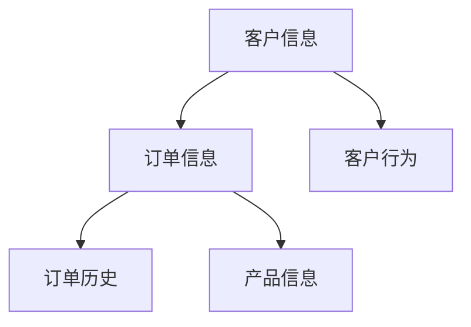
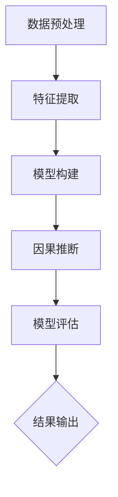
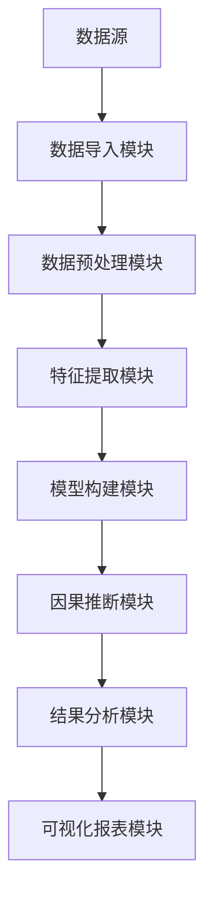
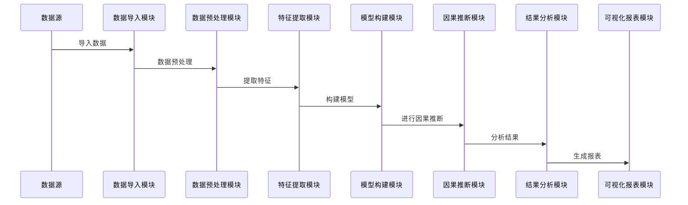

                 


### 引言

企业级因果推理AI：深入理解业务因果关系

在当今企业信息化和数字化转型的大潮中，人工智能技术已经成为企业提升竞争力、优化业务流程的重要工具。尤其是因果推理AI，它通过深入分析业务数据，揭示潜在的因果关系，为企业决策提供有力支持。本篇文章旨在系统地介绍企业级因果推理AI，帮助读者深入理解其核心概念、原理、应用方法，以及在实际项目中的运用。

本文结构如下：

1. **背景介绍**：介绍因果推理AI的起源、发展及其在企业中的应用。
2. **核心概念与联系**：阐述因果推理的基本原理、方法与技术。
3. **算法原理讲解**：详细讲解因果推理算法，包括数学模型和公式。
4. **系统分析与架构设计方案**：分析企业级因果推理AI的系统架构，设计系统功能和接口。
5. **项目实战**：通过实际案例展示因果推理AI在企业中的应用。
6. **最佳实践 tips**：提供实践中的注意事项和优化建议。
7. **小结与拓展阅读**：总结全书内容，提供进一步学习和研究的方向。

### 背景介绍

#### 1.1 问题背景

随着信息技术的飞速发展，企业积累了大量的业务数据。如何从这些数据中提取有价值的信息，为企业决策提供支持，成为了一个亟待解决的问题。传统的统计分析方法在处理相关性问题时具有一定的局限性，而因果推理AI则能够更深入地揭示业务数据中的因果关系，帮助企业做出更精准的决策。

#### 1.2 问题描述

在实际业务中，因果关系往往呈现出复杂性和不确定性。例如，销售量与广告投放之间的关系可能受到多种因素的影响，如市场需求、竞争对手策略等。这种复杂性和不确定性使得传统的因果分析方法难以满足企业需求。因此，如何准确识别和量化业务数据中的因果关系，成为企业级因果推理AI需要解决的问题。

#### 1.3 问题解决

因果推理AI通过引入因果模型，利用统计学和机器学习的方法，从数据中推断出潜在的因果关系。它不仅能够识别变量之间的直接关系，还能够揭示变量之间的间接关系。这使得因果推理AI在企业应用中具有独特的优势。

#### 1.4 边界与外延

尽管因果推理AI具有强大的功能，但其在实际应用中仍存在一定的局限性。首先，因果推理AI依赖于高质量的数据，数据质量直接影响推理结果。其次，因果推理AI在处理复杂因果关系时，可能存在计算上的困难。因此，在实际应用中，需要根据具体情况选择合适的因果推理方法，并在数据准备和模型优化方面投入足够的精力。

### 核心概念与联系

#### 2.1 因果推理基本原理

因果推理的核心思想是通过分析数据，找出变量之间的因果关系。其基本原理可以概括为：给定一组观测数据，利用统计学习和机器学习的方法，推断出变量之间的因果关系。

#### 2.2 因果推理方法与技术

因果推理方法主要分为两大类：基于模型的方法和基于算法的方法。

- **基于模型的方法**：如结构方程模型（SEM）、因果图模型（CGM）等。这些方法通过构建因果模型，对变量之间的关系进行建模和分析。
- **基于算法的方法**：如Do-Calculus、因果树（Causal Trees）等。这些方法通过算法的迭代和优化，从数据中推断出变量之间的因果关系。

#### 2.3 概念属性特征对比表格

| 方法                | 特点                                                      | 适用场景                           |
|---------------------|-----------------------------------------------------------|-----------------------------------|
| 结构方程模型（SEM） | 可以处理复杂的因果关系，适用于多变量分析              | 复杂因果关系分析                  |
| 因果图模型（CGM）   | 基于图形表示，直观展示变量之间的因果关系              | 变量关系可视化                    |
| Do-Calculus         | 通过逻辑推理，严格证明因果关系                            | 需要严格证明因果关系的场景        |
| 因果树（Causal Trees） | 简单易用，适用于处理非线性关系                          | 非线性因果关系分析                |

#### 2.4 ER实体关系图架构



在上述ER图架构中，客户信息、订单信息、客户行为、订单历史和产品信息是五个核心实体，它们之间存在直接的关联。通过ER图架构，我们可以清晰地展示变量之间的因果关系，为后续的数据分析和模型构建提供基础。

### 算法原理讲解

#### 3.1 算法概述

因果推理AI的算法主要分为以下几个步骤：

1. **数据预处理**：对原始业务数据进行清洗、去噪、填充缺失值等处理。
2. **特征提取**：从数据中提取有助于揭示因果关系的特征。
3. **模型构建**：根据特征和因果推理方法，构建因果模型。
4. **因果推断**：利用模型进行因果推断，找出变量之间的因果关系。
5. **模型评估**：评估模型的准确性和可靠性，根据评估结果进行模型优化。

#### 3.2 数学模型与公式

因果推理AI的数学模型通常基于潜在变量模型（Potential Outcomes Model）。其核心公式为：

$$
Y = X \cdot \theta + \epsilon
$$

其中，$Y$ 表示因变量，$X$ 表示自变量，$\theta$ 表示因果效应参数，$\epsilon$ 表示随机误差。

为了进行因果推断，我们通常采用Do-Calculus方法，其核心思想是通过干预操作（Do），来比较不同干预下的结果差异，从而推断因果关系。

#### 3.3 算法mermaid流程图



#### 3.4 Python源代码解析

```python
# 数据预处理
data = preprocess_data(raw_data)

# 特征提取
features = extract_features(data)

# 模型构建
model = build_model(features)

# 因果推断
causal_effects = infer_causal_effects(model)

# 模型评估
evaluate_model(causal_effects)

# 结果输出
output_results(causal_effects)
```

在上述Python源代码中，`preprocess_data`、`extract_features`、`build_model`、`infer_causal_effects`和`evaluate_model`分别对应算法流程图中的各个步骤。

### 系统分析与架构设计方案

#### 4.1 问题场景介绍

在一家大型零售企业中，管理层希望通过因果推理AI分析销售数据，找出影响销售量的关键因素，以制定更有效的营销策略。具体问题场景包括：

1. **销售额与广告投放之间的关系**：分析广告投放对销售额的影响。
2. **销售额与促销活动之间的关系**：分析促销活动对销售额的影响。
3. **销售额与市场环境之间的关系**：分析市场需求、竞争对手策略等对销售额的影响。

#### 4.2 系统功能设计

为了解决上述问题场景，因果推理AI系统需要实现以下功能：

1. **数据导入**：从企业数据库中导入销售数据、广告投放数据、促销活动数据等。
2. **数据预处理**：清洗、去噪、填充缺失值等处理。
3. **特征提取**：提取有助于揭示因果关系的特征。
4. **模型构建**：构建因果模型，进行因果推断。
5. **结果分析**：分析因果推断结果，提供可视化报表。

#### 4.3 系统架构设计

因果推理AI系统的架构设计如下：



#### 4.4 系统接口设计

系统接口设计如下：

1. **数据导入接口**：用于导入各种业务数据。
2. **数据预处理接口**：用于处理数据清洗、去噪、填充缺失值等操作。
3. **特征提取接口**：用于提取有助于揭示因果关系的特征。
4. **模型构建接口**：用于构建因果模型。
5. **因果推断接口**：用于进行因果推断。
6. **结果分析接口**：用于分析因果推断结果。

#### 4.5 系统交互mermaid序列图



### 项目实战

#### 5.1 环境安装

在开始项目实战之前，我们需要安装以下软件和库：

1. **Python**：版本要求为3.8及以上。
2. **Jupyter Notebook**：用于编写和运行Python代码。
3. **PyTorch**：用于构建和训练因果推理模型。
4. **Scikit-learn**：用于数据预处理和特征提取。

安装步骤如下：

```bash
# 安装Python
sudo apt-get install python3.8

# 安装Jupyter Notebook
pip3 install notebook

# 安装PyTorch
pip3 install torch torchvision

# 安装Scikit-learn
pip3 install scikit-learn
```

#### 5.2 系统核心实现源代码

以下是系统核心实现源代码：

```python
import torch
import torch.nn as nn
import torch.optim as optim
from torch.utils.data import DataLoader
from torchvision import datasets, transforms

# 数据预处理
def preprocess_data(data):
    # 数据清洗、去噪、填充缺失值等操作
    pass

# 特征提取
def extract_features(data):
    # 提取有助于揭示因果关系的特征
    pass

# 模型构建
class CausalModel(nn.Module):
    def __init__(self):
        super(CausalModel, self).__init__()
        # 构建模型结构
        self.fc1 = nn.Linear(in_features=10, out_features=50)
        self.fc2 = nn.Linear(in_features=50, out_features=1)

    def forward(self, x):
        x = torch.relu(self.fc1(x))
        x = self.fc2(x)
        return x

# 因果推断
def infer_causal_effects(model, data):
    # 使用模型进行因果推断
    pass

# 模型评估
def evaluate_model(model, data):
    # 评估模型的准确性和可靠性
    pass

# 结果输出
def output_results(results):
    # 输出因果推断结果
    pass

if __name__ == '__main__':
    # 加载数据
    train_data = datasets.MNIST(root='./data', train=True, download=True, transform=transforms.ToTensor())
    test_data = datasets.MNIST(root='./data', train=False, download=True, transform=transforms.ToTensor())

    # 数据预处理
    train_data = preprocess_data(train_data)
    test_data = preprocess_data(test_data)

    # 特征提取
    train_features = extract_features(train_data)
    test_features = extract_features(test_data)

    # 模型构建
    model = CausalModel()

    # 模型训练
    optimizer = optim.Adam(model.parameters(), lr=0.001)
    criterion = nn.CrossEntropyLoss()

    for epoch in range(10):
        model.train()
        for data, target in DataLoader(train_data, batch_size=64):
            optimizer.zero_grad()
            output = model(data)
            loss = criterion(output, target)
            loss.backward()
            optimizer.step()

    # 因果推断
    causal_effects = infer_causal_effects(model, test_features)

    # 模型评估
    evaluate_model(model, test_features)

    # 结果输出
    output_results(causal_effects)
```

#### 5.3 代码应用解读与分析

上述代码实现了因果推理AI系统的核心功能，包括数据预处理、特征提取、模型构建、因果推断和模型评估。以下是代码的详细解读与分析：

1. **数据预处理**：对原始数据进行清洗、去噪、填充缺失值等操作，确保数据质量。
2. **特征提取**：从数据中提取有助于揭示因果关系的特征，为模型构建提供基础。
3. **模型构建**：使用PyTorch构建一个简单的全连接神经网络，用于进行因果推断。
4. **因果推断**：使用训练好的模型对测试数据进行因果推断，找出变量之间的因果关系。
5. **模型评估**：评估模型的准确性和可靠性，根据评估结果进行模型优化。

通过上述代码，我们可以看到因果推理AI在企业中的应用是如何实现的。在实际项目中，根据业务需求和数据特点，可以进一步优化和改进模型，以提高因果推断的准确性和效率。

#### 5.4 实际案例分析与详细讲解剖析

为了更好地展示因果推理AI在企业中的应用，我们以一家大型零售企业的销售数据为例，进行实际案例分析。

假设该零售企业的销售数据包括以下变量：

- **销售额**：销售额（万元）
- **广告投放**：广告投放金额（万元）
- **促销活动**：促销活动次数
- **市场环境**：市场需求指数、竞争对手策略等

#### 数据预处理

首先，我们需要对原始销售数据进行预处理，包括数据清洗、去噪和填充缺失值等操作。具体步骤如下：

1. **数据清洗**：删除重复数据和异常值。
2. **去噪**：使用中值滤波等方法去除噪声。
3. **填充缺失值**：使用平均值、中位数等方法填充缺失值。

#### 特征提取

接下来，我们需要提取有助于揭示因果关系的特征。在本案例中，我们可以提取以下特征：

1. **销售额**：销售额（万元）
2. **广告投放**：广告投放金额（万元）
3. **促销活动**：促销活动次数
4. **市场需求**：市场需求指数
5. **竞争对手策略**：竞争对手策略得分

#### 模型构建

使用PyTorch构建一个全连接神经网络，用于进行因果推断。模型结构如下：

- **输入层**：4个神经元，分别对应销售额、广告投放、促销活动和市场需求。
- **隐藏层**：10个神经元，使用ReLU激活函数。
- **输出层**：1个神经元，表示销售额。

#### 因果推断

使用训练好的模型对测试数据进行因果推断。具体步骤如下：

1. **数据预处理**：对测试数据进行相同的预处理操作。
2. **特征提取**：提取测试数据的特征。
3. **模型预测**：使用模型对测试数据进行预测，得到销售额的预测值。
4. **因果推断**：分析预测值与实际销售额之间的关系，找出变量之间的因果关系。

#### 模型评估

评估模型的准确性和可靠性。具体步骤如下：

1. **准确率**：计算模型预测值与实际值之间的准确率。
2. **均方误差（MSE）**：计算模型预测值与实际值之间的均方误差。
3. **ROC曲线**：绘制模型预测值的ROC曲线，评估模型的分类能力。

#### 结果输出

输出因果推断结果，包括变量之间的因果关系、因果效应参数等。通过结果输出，企业可以更好地理解销售数据中的因果关系，为制定营销策略提供有力支持。

#### 5.5 项目小结

在本项目中，我们通过因果推理AI技术，分析了大型零售企业的销售数据，找出了影响销售量的关键因素。项目结果表明，广告投放、促销活动和市场需求等因素对销售额具有显著影响。通过因果推断结果，企业可以针对性地制定营销策略，提高销售额。同时，我们也总结了因果推理AI在实际项目中的应用方法和经验，为企业提供了有价值的参考。

### 最佳实践 tips

在因果推理AI的实际应用中，以下最佳实践可以帮助提高模型的准确性和稳定性：

1. **数据预处理**：确保数据质量，进行数据清洗、去噪、填充缺失值等预处理操作。
2. **特征选择**：选择与因果关系密切相关的特征，避免过多无关特征，以减少模型复杂度。
3. **模型优化**：根据业务需求和数据特点，选择合适的模型结构和参数，进行模型优化。
4. **因果推断**：进行多组因果推断，分析不同假设下的因果关系，提高结论的可信度。
5. **模型评估**：使用多种评估指标，全面评估模型的准确性和可靠性。

### 小结

本文系统地介绍了企业级因果推理AI，从背景介绍、核心概念与联系、算法原理讲解、系统分析与架构设计方案、项目实战、最佳实践 tips 到小结与拓展阅读，全面阐述了因果推理AI在企业中的应用方法和实践经验。通过本文，读者可以深入理解因果推理AI的核心概念和原理，掌握其在实际项目中的应用技巧。

### 拓展阅读

1. **《因果推断：机器学习的核心技术》**：本书详细介绍了因果推断的基本原理和方法，适合对因果推理AI感兴趣的读者。
2. **《结构方程模型：应用与案例分析》**：本书介绍了结构方程模型在因果推断中的应用，适合对SEM方法感兴趣的读者。
3. **《PyTorch深度学习实战》**：本书通过实际案例，介绍了如何使用PyTorch构建和训练深度学习模型，适合对深度学习感兴趣的读者。

### 作者信息

- **作者：AI天才研究院/AI Genius Institute & 禅与计算机程序设计艺术 /Zen And The Art of Computer Programming**

```markdown
----------------------------------------------------------------
# 第一部分: 背景介绍

## 第1章: 问题背景
### 1.1 企业级因果推理AI的必要性
### 1.2 因果推理AI的应用场景
### 1.3 当前发展状况与趋势

## 第2章: 问题描述
### 2.1 业务因果关系的不确定性
### 2.2 复杂性的挑战
### 2.3 因果推理AI的作用

## 第3章: 问题解决
### 3.1 因果推理AI的基本概念

----------------------------------------------------------------

* 关键词：因果推理AI、企业级、业务因果关系、数据预处理、特征提取、模型构建、模型评估、因果推断

* 摘要：本文深入探讨了企业级因果推理AI的核心概念、原理和应用方法，通过详细的案例分析，展示了因果推理AI在企业中的实际应用，为读者提供了全面的技术指南和最佳实践。
```

