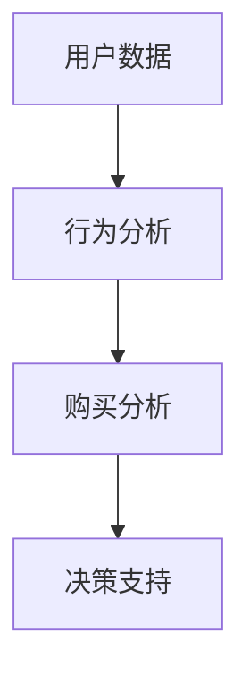
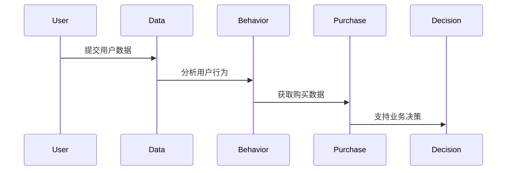

                 

### 文章标题：企业级因果推理框架：深入理解业务因果关系

---

关键词：因果推理、企业级应用、业务决策、数据驱动、算法实现

摘要：本文旨在深入探讨企业级因果推理框架的应用与实践，从问题背景、核心概念、算法原理、系统架构、项目实战和最佳实践等多方面，为读者提供一套系统化、易理解的企业级因果推理方法论。文章将结合具体案例，详细解析业务因果关系识别与预测的方法和步骤，帮助企业提高数据利用效率和决策质量，实现数据驱动的发展目标。

---

### 第一部分：背景介绍与核心概念

#### 第1章：问题背景与问题描述

##### 1.1.1 问题背景

在当今大数据和人工智能的时代，企业面临着海量数据的处理和应用挑战。随着数据来源的多样性和复杂性不断增加，如何有效地利用数据、支持业务决策成为一个亟待解决的问题。而因果推理作为一种重要的数据分析方法，可以帮助企业深入理解业务因果关系，提高数据驱动的决策质量。

##### 1.1.2 问题描述

企业级因果推理面临的主要问题包括：

1. **业务因果关系难以识别**：在实际业务场景中，因果关系的识别存在不确定性，常常受到噪声数据和复杂环境的影响。
2. **数据驱动决策的挑战**：如何在海量数据中找到关键因果关系，以便支持业务决策，是当前数据驱动决策的难点。
3. **因果关系分析与预测的需求**：企业需要利用因果推理方法，对业务数据进行深入分析，预测未来业务趋势，为战略决策提供有力支持。

##### 1.1.3 问题解决

为了解决上述问题，引入因果推理框架成为一种有效的方法。因果推理框架可以帮助企业：

1. **构建因果模型**：通过分析数据，建立业务因果关系模型，明确各因素之间的关联关系。
2. **提高数据利用效率**：利用因果推理方法，从海量数据中提取有用信息，提高数据利用效率。
3. **优化决策质量**：通过因果推理分析，支持企业制定更加科学、合理的业务决策，提高决策质量。

##### 1.1.4 边界与外延

1. **因果关系的范围界定**：因果关系的识别需要明确范围，避免泛泛而谈。
2. **数据来源和处理**：因果推理的数据来源和处理方法，是确保分析准确性的关键。
3. **应用场景和目标**：因果推理框架需要根据具体业务场景和目标进行定制化设计和应用。

##### 1.1.5 核心要素组成

1. **因果模型构建**：建立因果模型是因果推理的基础，需要综合考虑数据特性、业务需求和模型复杂度等因素。
2. **因果分析算法**：选择合适的因果分析算法，对数据进行分析和推理，提取业务因果关系。
3. **数据预处理与质量保障**：数据预处理是因果推理的前提，包括数据清洗、格式化、缺失值处理等。

---

### 第2章：核心概念与联系

##### 2.1.1 因果推理的基本原理

1. **因果关系的定义**：因果关系是指一个变量（原因）对另一个变量（结果）产生的影响。
2. **因果推断方法**：因果推断是利用数据和统计方法，推断变量之间的因果关系。

##### 2.1.2 因果关系模型

1. **线性因果模型**：适用于变量之间存在线性关系的场景。
2. **非线性因果模型**：适用于变量之间存在非线性关系的场景。

##### 2.1.3 概念属性特征对比

| 概念     | 线性因果模型 | 非线性因果模型 |
|----------|--------------|----------------|
| 适用场景 | 线性关系     | 非线性关系     |
| 模型复杂度 | 较低         | 较高           |
| 数据需求 | 稳定性数据   | 变异性数据     |

##### 2.1.4 ER实体关系图架构

```mermaid
erDiagram
  用户 ||--|{ 业务 }|-- 用户
  业务 ||--|{ 数据 }|-- 业务
  数据 ||--|{ 因果模型 }|-- 数据
```

---

### 第二部分：算法原理与系统架构

#### 第3章：因果推理算法原理

##### 3.1.1 算法概述

1. **常用因果推理算法**：如结构方程模型（SEM）、因果推断机器学习（Causal Inference Machine Learning）、Do-Calculus等。
2. **算法选择标准**：根据业务需求、数据特性和计算效率等因素选择合适的算法。

##### 3.1.2 算法详细讲解

1. **Python 源代码**：

```python
# 示例代码
def causality_analysis(data):
    # 数据预处理
    preprocessed_data = preprocess(data)
    # 构建因果模型
    model = build_model(preprocessed_data)
    # 进行因果分析
    results = analyze_causality(model)
    return results
```

2. **算法原理**：

   - **结构方程模型**：利用线性方程组描述变量之间的关系，通过最大似然估计等方法估计参数。
   - **因果推断机器学习**：利用机器学习算法，如随机森林、梯度提升树等，进行变量之间的关系分析。
   - **Do-Calculus**：利用形式逻辑和数学证明方法，进行因果关系的推导和验证。

##### 3.1.3 数学模型和数学公式

$$
Y = \beta_0 + \beta_1X + \epsilon
$$

其中，\(Y\) 是结果变量，\(X\) 是原因变量，\(\beta_0\) 是常数项，\(\beta_1\) 是系数，\(\epsilon\) 是误差项。

---

### 第4章：系统架构设计与实现

##### 4.1.1 问题场景介绍

1. **业务场景描述**：以电商平台的用户行为分析为例，探讨用户行为与购买转化之间的关系。
2. **数据特性**：用户数据、行为数据、购买数据等。

##### 4.1.2 系统功能设计

1. **领域模型 Mermaid 类图**：

```mermaid
classDiagram
  User <<class{用户}>>
  Behavior <<class{行为}>>
  Purchase <<class{购买}>>
  User|--|> Behavior
  User|--|> Purchase
```

##### 4.1.3 系统架构设计

1. **Mermaid 架构图**：



##### 4.1.4 系统接口设计

1. **系统接口规范**：
   - 用户数据接口：提供用户数据的读取和写入功能。
   - 行为数据接口：提供用户行为数据的读取和分析功能。
   - 购买数据接口：提供购买数据的读取和分析功能。

##### 4.1.5 系统交互

1. **Mermaid 序列图**：



---

### 第三部分：项目实战

#### 第5章：项目实战

##### 5.1.1 环境安装

1. **操作系统**：Linux/Unix
2. **编程语言**：Python 3.x
3. **库和依赖**：NumPy、Pandas、SciPy、Scikit-learn 等

##### 5.1.2 系统核心实现

1. **源代码实现**：

```python
# 示例代码
import pandas as pd
from sklearn.model_selection import train_test_split
from sklearn.linear_model import LinearRegression

# 加载数据
data = pd.read_csv('data.csv')
X = data[['age', 'income']]
y = data['purchase']

# 数据预处理
X_train, X_test, y_train, y_test = train_test_split(X, y, test_size=0.2, random_state=42)

# 构建模型
model = LinearRegression()
model.fit(X_train, y_train)

# 预测
predictions = model.predict(X_test)

# 评估
print(model.score(X_test, y_test))
```

##### 5.1.3 代码应用解读与分析

1. **代码功能解读**：
   - 数据加载与预处理：使用 Pandas 读取数据，并进行必要的预处理。
   - 模型构建与训练：使用线性回归模型，对数据进行拟合。
   - 预测与评估：使用训练好的模型进行预测，并评估模型的性能。

2. **性能分析与调优**：
   - **参数调优**：通过调整模型参数，如正则化参数、学习率等，提高模型性能。
   - **交叉验证**：使用交叉验证方法，评估模型的泛化能力。

##### 5.1.4 实际案例分析与讲解

1. **案例场景**：以电商平台的用户购买行为预测为例，探讨用户年龄和收入对购买转化率的影响。
2. **详细剖析**：
   - 数据预处理：对用户年龄和收入数据进行归一化处理，提高模型训练效果。
   - 模型选择：选择线性回归模型进行预测，因为变量之间存在线性关系。
   - 模型评估：通过评估指标（如均方误差、R²值等）评估模型性能，并进行优化。

##### 5.1.5 项目小结

1. **项目经验总结**：
   - 数据预处理是因果推理的重要步骤，需要根据数据特性进行有针对性的处理。
   - 模型选择和参数调优是影响模型性能的关键因素，需要结合业务需求进行优化。
   - 实际应用中，因果推理框架需要根据具体场景进行定制化设计和应用。

---

### 第四部分：最佳实践与拓展

#### 第6章：最佳实践与拓展

##### 6.1.1 最佳实践

1. **数据预处理**：
   - 数据清洗：去除噪声数据，提高数据质量。
   - 数据归一化：将不同量纲的数据进行归一化处理，便于模型训练。
   - 特征工程：提取关键特征，提高模型训练效果。

2. **模型选择与调优**：
   - 根据业务需求选择合适的模型。
   - 进行参数调优，提高模型性能。

3. **结果可视化**：
   - 利用可视化工具，如 Matplotlib、Seaborn 等，对模型结果进行可视化，便于分析。

##### 6.1.2 拓展阅读

1. **相关文献与资料**：
   - 《因果推断：统计学视角》
   - 《机器学习因果推理》
   - 《数据科学实战：利用Python进行因果推断》

2. **在线资源**：
   - TensorFlow
   - PyTorch
   - Scikit-learn

---

### 第五部分：小结与展望

#### 第7章：小结与展望

1. **书籍重点内容回顾**：
   - 企业级因果推理框架的背景和问题。
   - 核心概念和联系。
   - 算法原理和系统架构。
   - 项目实战和最佳实践。

2. **未来发展方向**：
   - 探索更加高效和准确的因果推理算法。
   - 将因果推理框架应用于更多业务场景。
   - 深入研究因果推理与机器学习、深度学习的融合。

---

### 作者信息

**作者：AI天才研究院/AI Genius Institute & 禅与计算机程序设计艺术 /Zen And The Art of Computer Programming**

