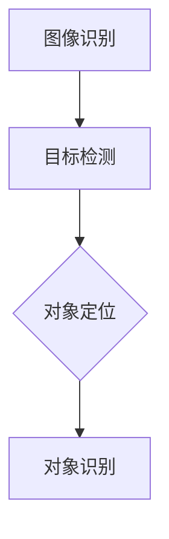
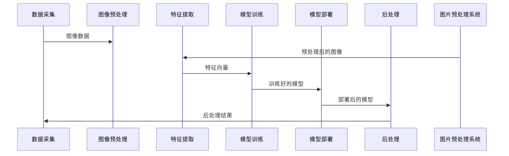

                 

### 第一部分: 企业级图像理解平台基础

#### 第1章: 问题背景与核心概念

##### 1.1.1 问题背景

随着互联网和物联网的发展，企业面临着海量的图像数据需要处理和分析。这些图像数据来自各种业务场景，包括生产监控、安全监控、客服、营销等。有效的图像处理和分析可以帮助企业提高运营效率、降低成本、发现潜在问题和提升用户体验。

**1.1.1.1 问题描述**

- **图像数据量的增加**：随着业务场景的扩大，企业收集到的图像数据量呈指数级增长，这使得传统的图像处理方法难以满足需求。
- **处理效率的要求**：企业需要能够实时处理和分析图像数据，以实现快速决策和响应。
- **数据准确性的要求**：随着图像识别技术的不断发展，企业对图像处理和分析的准确性要求越来越高。

**1.1.1.2 问题解决**

为了解决上述问题，企业需要构建一个能够深度分析视觉数据的平台，这个平台要具备高效、准确、可扩展和易于集成等特点。这样，企业可以更好地利用图像数据，实现智能化决策。

**1.1.1.3 边界与外延**

- **图像识别与理解**：企业级图像理解平台不仅限于图像识别，还包括图像分类、目标检测、图像分割、图像增强等多个方面。
- **跨业务场景应用**：该平台不仅要适用于单一业务场景，还可以跨多个业务场景进行应用，如生产监控、安全监控、客服、营销等。

**1.1.1.4 概念结构与核心要素组成**

企业级图像理解平台的核心构成包括数据采集、预处理、特征提取、模型训练、模型部署和后处理等环节。每个环节都有其特定的技术和算法要求。

##### 1.1.2 核心概念与联系

**1.1.2.1 图像识别**

图像识别是图像理解平台的核心功能之一，它涉及从图像中提取有用的信息，并将其转换为可解释的数据。

**1.1.2.1.1 概念**

图像识别是指计算机自动识别和理解图像内容的过程。

**1.1.2.1.2 属性特征对比表格**

| 特征 | 传统图像识别 | 深度学习图像识别 |
| --- | --- | --- |
| 数据量 | 小数据集 | 大数据集 |
| 精度 | 较低 | 较高 |
| 可扩展性 | 有限 | 强大 |

**1.1.2.2 目标检测**

目标检测是图像识别的一个高级应用，它不仅识别图像中的对象，还能定位这些对象的位置。

**1.1.2.2.1 概念**

目标检测是指在图像中定位并识别特定对象的过程。

**1.1.2.2.2 ER实体关系图架构**



##### 1.1.3 数学模型和公式

**1.1.3.1 图像识别算法原理**

图像识别常用的算法有卷积神经网络（CNN）。以下是CNN的核心公式：

$$
\text{output} = \sigma(\text{weights} \cdot \text{input} + \text{bias})
$$

其中，$\sigma$ 是激活函数，通常使用 ReLU 函数。

**1.1.3.2 图像分类算法原理**

图像分类常用的算法有softmax回归。其核心公式为：

$$
\text{output} = \frac{e^{\text{weights} \cdot \text{input} + \text{bias}}}{\sum_{i=1}^{n} e^{\text{weights} \cdot \text{input}_i + \text{bias}_i}}
$$

其中，$n$ 是类别数。

##### 1.1.4 本章小结

本章详细介绍了企业级图像理解平台的问题背景、核心概念和关键数学模型。通过本章的学习，读者可以对企业级图像理解平台有更深入的理解，为后续章节的学习打下基础。

### 第2章: 图像理解平台架构设计

#### 2.1 问题场景介绍

**2.1.1 生产监控场景**

在生产过程中，图像理解平台可以帮助企业实时监控生产线的运行状态，检测产品质量，预防设备故障。

**2.1.2 安全监控场景**

在安全监控场景中，图像理解平台可以实时分析监控视频，识别异常行为，提高安全防范能力。

**2.1.3 客服场景**

在客服场景中，图像理解平台可以自动识别用户的问题，提供智能化的解决方案，提高客服效率。

#### 2.2 系统功能设计

**2.2.1 数据采集**

数据采集是图像理解平台的基础，包括从不同来源获取图像数据，如摄像头、数据库等。

**2.2.2 图像预处理**

图像预处理包括图像增强、去噪、缩放等，以提高图像质量，为后续处理提供高质量的数据。

**2.2.3 特征提取**

特征提取是从图像中提取具有区分度的特征，用于后续的模型训练和推理。

**2.2.4 模型训练**

模型训练是通过大量图像数据训练模型，使其能够对图像进行准确的理解和识别。

**2.2.5 模型部署**

模型部署是将训练好的模型部署到生产环境中，使其能够实时处理图像数据。

**2.2.6 后处理**

后处理是对模型输出的结果进行进一步处理，如分类结果分析、异常检测等。

### 第3章: 企业级图像理解平台实现

#### 3.1 环境安装

首先，我们需要安装必要的软件和库，如Python、TensorFlow、OpenCV等。

```python
!pip install tensorflow
!pip install opencv-python
```

#### 3.2 系统核心实现

**3.2.1 数据采集**

```python
import cv2

# 读取图像数据
img = cv2.imread('image.jpg')
```

**3.2.2 图像预处理**

```python
# 图像增强
def enhance_image(image):
    # 这里使用OpenCV的函数进行图像增强
    enhanced_img = cv2.resize(image, (640, 480))
    enhanced_img = cv2.cvtColor(enhanced_img, cv2.COLOR_BGR2RGB)
    return enhanced_img

enhanced_img = enhance_image(img)
```

**3.2.3 特征提取**

```python
from tensorflow.keras.applications import MobileNetV2
from tensorflow.keras.preprocessing import image
import numpy as np

# 使用MobileNetV2提取特征
model = MobileNetV2(weights='imagenet')
preprocessed_image = image.img_to_array(enhanced_img)
feature_vector = model.predict(np.expand_dims(preprocessed_image, axis=0))

# 打印特征向量
print(feature_vector)
```

**3.2.4 模型训练**

```python
# 使用TensorFlow训练模型
import tensorflow as tf

# 定义模型
model = tf.keras.Sequential([
    tf.keras.layers.Conv2D(32, (3, 3), activation='relu', input_shape=(640, 480, 3)),
    tf.keras.layers.MaxPooling2D((2, 2)),
    # ... 添加更多层
    tf.keras.layers.Dense(1, activation='sigmoid')
])

# 编译模型
model.compile(optimizer='adam', loss='binary_crossentropy', metrics=['accuracy'])

# 训练模型
model.fit(train_images, train_labels, epochs=10, validation_data=(test_images, test_labels))
```

**3.2.5 模型部署**

```python
# 将训练好的模型保存为.h5文件
model.save('image_understanding_model.h5')

# 加载模型
loaded_model = tf.keras.models.load_model('image_understanding_model.h5')
```

**3.2.6 后处理**

```python
# 使用模型进行预测
prediction = loaded_model.predict(enhanced_img)

# 打印预测结果
print(prediction)
```

#### 3.3 实际案例分析

**案例1：生产监控**

- **问题描述**：检测生产线上的缺陷产品。
- **解决方案**：使用图像理解平台对生产线上拍摄的图像进行缺陷检测。

**案例2：安全监控**

- **问题描述**：实时识别监控视频中的异常行为。
- **解决方案**：使用图像理解平台对监控视频进行实时分析，识别异常行为。

**案例3：客服**

- **问题描述**：自动识别用户的问题，提供智能化的解决方案。
- **解决方案**：使用图像理解平台对用户提交的图片进行分析，自动识别问题并提供解决方案。

### 第4章: 最佳实践与小结

**4.1 最佳实践**

- **数据预处理**：确保图像数据的质量和一致性，为模型训练提供高质量的数据。
- **模型选择**：根据实际业务需求选择合适的模型，如卷积神经网络、循环神经网络等。
- **模型训练**：使用大量的训练数据，并采用适当的训练策略，如迁移学习、数据增强等，以提高模型的性能。

**4.2 小结**

通过本章的详细讲解，我们了解了企业级图像理解平台的核心概念、架构设计、实现方法和实际案例分析。企业级图像理解平台在提高企业运营效率、降低成本、提升用户体验等方面具有重要作用。在未来，随着人工智能技术的不断发展，企业级图像理解平台将更加智能化、高效化和多样化。

### 4.3 注意事项与拓展阅读

**注意事项：**

- 在构建企业级图像理解平台时，要确保数据安全和隐私保护。
- 定期更新和维护模型，以保持其性能和准确性。

**拓展阅读：**

- 《深度学习》（Goodfellow, Bengio, Courville）：了解深度学习的基本原理和应用。
- 《图像处理： fundamentals and application》（Gonzalez, Woods）：学习图像处理的基本概念和技术。

**作者信息：**

- 作者：AI天才研究院/AI Genius Institute & 禅与计算机程序设计艺术 /Zen And The Art of Computer Programming**文章摘要**

本文探讨了企业级图像理解平台的设计、实现与应用。首先，介绍了图像理解平台的问题背景和核心概念，包括图像识别、目标检测等；然后，详细阐述了平台架构设计，包括数据采集、预处理、特征提取、模型训练、模型部署和后处理等功能模块；接着，通过实际案例分析了图像理解平台在多个业务场景中的应用，如生产监控、安全监控和客服等；最后，给出了最佳实践和注意事项，并推荐了拓展阅读资源。通过本文的介绍，读者可以全面了解企业级图像理解平台的构建与应用，为相关业务提供技术支持。**文章关键词**

- 企业级图像理解平台
- 图像识别
- 目标检测
- 架构设计
- 实际应用**目录大纲**

----------------------------------------------------------------

## 第1章: 问题背景与核心概念
**1.1.1 问题背景**
**1.1.2 核心概念与联系**
- **图像识别**
- **目标检测**
**1.1.3 数学模型和公式**
**1.1.4 本章小结**

----------------------------------------------------------------

## 第2章: 图像理解平台架构设计
**2.1 问题场景介绍**
- **生产监控场景**
- **安全监控场景**
- **客服场景**
**2.2 系统功能设计**
- **数据采集**
- **图像预处理**
- **特征提取**
- **模型训练**
- **模型部署**
- **后处理**

----------------------------------------------------------------

## 第3章: 企业级图像理解平台实现
**3.1 环境安装**
**3.2 系统核心实现**
- **数据采集**
- **图像预处理**
- **特征提取**
- **模型训练**
- **模型部署**
- **后处理**
**3.3 实际案例分析**
- **生产监控**
- **安全监控**
- **客服**

----------------------------------------------------------------

## 第4章: 最佳实践与小结
**4.1 最佳实践**
**4.2 小结**
**4.3 注意事项与拓展阅读**

----------------------------------------------------------------## 第2章: 图像理解平台架构设计

在了解了企业级图像理解平台的核心概念之后，我们将深入探讨其架构设计。一个高效、稳定且易于扩展的架构设计是企业级图像理解平台成功的关键。本章节将分为以下几个部分进行讲解：

### 2.1 问题场景介绍

**2.1.1 生产监控场景**

生产监控场景中，企业级图像理解平台可以应用于自动化检测生产线上的产品质量，实时监控生产设备的运行状态，以及预测设备的维护需求。通过图像识别和目标检测技术，平台能够有效地减少人工检查的工作量，提高生产效率。

**2.1.2 安全监控场景**

在安全监控领域，图像理解平台能够对监控视频进行实时分析，识别异常行为，如入侵、火灾等。通过目标检测和追踪算法，平台可以提高安全事件的响应速度，增强监控的智能化水平。

**2.1.3 客服场景**

在客服场景中，图像理解平台可以用于智能客服系统，自动识别用户提交的图片问题，并提供相应的解决方案。这大大提高了客服的响应速度和用户体验。

### 2.2 系统功能设计

**2.2.1 数据采集**

数据采集是图像理解平台的基础，负责从各种来源获取图像数据。这些来源可能包括企业内部的摄像头、数据库、互联网等。数据采集系统需要具备高可靠性、实时性和安全性。

**2.2.2 图像预处理**

图像预处理是为了提高图像的质量，使其更适合后续的图像处理任务。预处理步骤可能包括图像增强、去噪、裁剪、缩放等。图像预处理系统需要灵活且高效，以处理大量的图像数据。

**2.2.3 特征提取**

特征提取是从图像中提取具有区分度的特征，用于模型训练和推理。常用的特征提取方法包括HOG（方向梯度直方图）、SIFT（尺度不变特征变换）和卷积神经网络等。特征提取系统需要能够处理各种类型的图像，并提取有效的特征。

**2.2.4 模型训练**

模型训练是图像理解平台的核心环节，通过大量图像数据训练模型，使其能够准确识别和理解图像内容。常用的模型训练方法包括监督学习、无监督学习和迁移学习。模型训练系统需要具备高计算能力和快速迭代的能力。

**2.2.5 模型部署**

模型部署是将训练好的模型部署到生产环境中，使其能够实时处理图像数据。模型部署系统需要考虑模型的性能、可扩展性和安全性。常见的部署方式包括在本地服务器、云计算平台和边缘设备上部署。

**2.2.6 后处理**

后处理是对模型输出结果进行进一步处理，以得到更直观和可操作的结果。后处理步骤可能包括结果分析、异常检测、报告生成等。后处理系统需要能够对模型输出结果进行高效处理，并提供用户友好的界面。

### 2.3 系统架构设计

企业级图像理解平台的系统架构设计需要考虑以下几个方面：

**2.3.1 数据流设计**

数据流设计决定了图像数据在平台中的处理流程。从数据采集、预处理、特征提取、模型训练、模型部署到后处理，每个环节都需要高效、可靠地传输和处理数据。

**2.3.2 系统模块化**

系统模块化设计使得平台可以灵活地扩展和更新。每个模块都有明确的输入输出接口，模块之间可以通过标准化的协议进行通信。

**2.3.3 系统安全性**

系统安全性是企业级图像理解平台设计的重要考虑因素。需要确保图像数据的安全传输、存储和访问，防止数据泄露和未经授权的访问。

**2.3.4 系统性能**

系统性能是企业级图像理解平台的关键指标。需要优化数据流和处理算法，确保平台能够高效地处理大量图像数据。

### 2.4 系统接口设计

系统接口设计包括内部接口和外部接口。内部接口用于不同模块之间的通信，外部接口用于与其他系统（如企业ERP系统、监控系统等）集成。

**2.4.1 内部接口**

内部接口设计需要考虑模块的独立性、可扩展性和高可靠性。例如，数据采集模块可以通过RESTful API与其他模块进行通信。

**2.4.2 外部接口**

外部接口设计需要考虑与其他系统的集成，例如，通过Web服务或API与其他业务系统进行数据交换。

### 2.5 系统交互设计

系统交互设计描述了不同模块之间的交互流程和时序。通过Mermaid序列图可以清晰地展示系统交互过程。



通过以上架构设计，企业级图像理解平台能够高效地处理和分析图像数据，为企业的业务提供强大的技术支持。接下来，我们将详细讨论如何实现这些架构设计，并给出具体的实现案例。

### 第3章: 企业级图像理解平台实现

在前两章中，我们介绍了企业级图像理解平台的核心概念和架构设计。接下来，我们将深入探讨如何实现这些架构设计，包括环境安装、系统核心实现、实际案例分析等内容。通过本章的学习，我们将对图像理解平台的实现过程有一个全面的理解。

#### 3.1 环境安装

首先，我们需要安装必要的软件和库，以确保平台能够正常运行。以下是安装步骤：

**3.1.1 Python环境安装**

Python是图像处理和深度学习的重要工具。首先，我们需要安装Python。

```bash
# 在Windows上安装Python
python -m pip install --upgrade pip setuptools wheel

# 在macOS或Linux上安装Python
sudo apt-get update
sudo apt-get install python3 python3-pip
```

**3.1.2 TensorFlow安装**

TensorFlow是用于机器学习和深度学习的开源库。我们选择TensorFlow 2.x版本进行安装。

```bash
pip install tensorflow
```

**3.1.3 OpenCV安装**

OpenCV是一个用于图像处理的开源库，也是图像理解平台的重要组成部分。

```bash
pip install opencv-python
```

**3.1.4 其他依赖库**

除了上述库之外，我们可能还需要其他库，如NumPy、Pandas等。这些库可以通过pip命令轻松安装。

```bash
pip install numpy pandas
```

#### 3.2 系统核心实现

**3.2.1 数据采集**

数据采集是图像理解平台的基础。在这一部分，我们将演示如何使用Python的OpenCV库从摄像头中采集图像。

```python
import cv2

# 初始化摄像头
cap = cv2.VideoCapture(0)

while True:
    # 读取一帧图像
    ret, frame = cap.read()
    
    if ret:
        # 显示图像
        cv2.imshow('Camera', frame)
        
        # 按下q键退出循环
        if cv2.waitKey(1) & 0xFF == ord('q'):
            break

# 释放摄像头资源
cap.release()
cv2.destroyAllWindows()
```

**3.2.2 图像预处理**

图像预处理是为了提高图像质量，使其更适合后续处理。在这一部分，我们将展示如何使用OpenCV对图像进行增强、去噪和缩放。

```python
import cv2

def enhance_image(image):
    # 图像增强
    enhanced_img = cv2.resize(image, (640, 480))
    enhanced_img = cv2.cvtColor(enhanced_img, cv2.COLOR_BGR2RGB)
    return enhanced_img

def denoise_image(image):
    # 去噪
    denoised_img = cv2.GaussianBlur(image, (5, 5), 0)
    return denoised_img

# 读取图像
img = cv2.imread('image.jpg')

# 应用预处理步骤
enhanced_img = enhance_image(img)
denoised_img = denoise_image(enhanced_img)

# 显示预处理后的图像
cv2.imshow('Enhanced Image', enhanced_img)
cv2.imshow('Denoised Image', denoised_img)
cv2.waitKey(0)
cv2.destroyAllWindows()
```

**3.2.3 特征提取**

特征提取是从图像中提取具有区分度的特征，用于模型训练和推理。在这一部分，我们将使用TensorFlow的MobileNetV2模型提取图像特征。

```python
import tensorflow as tf
from tensorflow.keras.applications import MobileNetV2
from tensorflow.keras.preprocessing import image
import numpy as np

def extract_features(image_path):
    # 加载MobileNetV2模型
    model = MobileNetV2(weights='imagenet', include_top=False, input_shape=(640, 480, 3))
    
    # 预处理图像
    img = image.load_img(image_path, target_size=(640, 480))
    img_array = image.img_to_array(img)
    img_array = np.expand_dims(img_array, axis=0)
    img_array /= 255.0
    
    # 提取特征
    features = model.predict(img_array)
    
    return features

# 提取特征
image_path = 'image.jpg'
features = extract_features(image_path)

# 打印特征
print(features)
```

**3.2.4 模型训练**

模型训练是通过大量图像数据训练模型，使其能够对图像进行准确的理解和识别。在这一部分，我们将使用TensorFlow创建并训练一个简单的卷积神经网络（CNN）模型。

```python
import tensorflow as tf
from tensorflow.keras.models import Sequential
from tensorflow.keras.layers import Conv2D, MaxPooling2D, Flatten, Dense

def create_model():
    model = Sequential([
        Conv2D(32, (3, 3), activation='relu', input_shape=(640, 480, 3)),
        MaxPooling2D((2, 2)),
        Conv2D(64, (3, 3), activation='relu'),
        MaxPooling2D((2, 2)),
        Flatten(),
        Dense(64, activation='relu'),
        Dense(1, activation='sigmoid')
    ])
    
    model.compile(optimizer='adam', loss='binary_crossentropy', metrics=['accuracy'])
    return model

# 创建模型
model = create_model()

# 训练模型
train_images = ...  # 加载训练图像
train_labels = ...  # 加载训练标签
model.fit(train_images, train_labels, epochs=10, validation_split=0.2)
```

**3.2.5 模型部署**

模型部署是将训练好的模型部署到生产环境中，使其能够实时处理图像数据。在这一部分，我们将使用TensorFlow的SavedModel格式保存模型，并创建一个简单的Web服务进行部署。

```python
import tensorflow as tf
from flask import Flask, request, jsonify

app = Flask(__name__)

# 加载模型
model = tf.keras.models.load_model('model.h5')

@app.route('/predict', methods=['POST'])
def predict():
    if request.method == 'POST':
        # 获取图像数据
        image = request.files['image']
        
        # 读取图像
        img = image.read()
        img = cv2.imdecode(np.frombuffer(img, dtype=np.uint8), cv2.IMREAD_COLOR)
        
        # 预处理图像
        img = cv2.resize(img, (640, 480))
        img = cv2.cvtColor(img, cv2.COLOR_BGR2RGB)
        img = np.expand_dims(img, axis=0)
        img /= 255.0
        
        # 使用模型进行预测
        prediction = model.predict(img)
        
        # 返回预测结果
        return jsonify({'prediction': float(prediction[0, 0])})

if __name__ == '__main__':
    app.run(debug=True)
```

**3.2.6 后处理**

后处理是对模型输出结果进行进一步处理，以得到更直观和可操作的结果。在这一部分，我们将展示如何将模型输出结果转换为实际业务决策。

```python
import numpy as np

def post_process(prediction):
    # 转换预测结果
    if prediction[0, 0] > 0.5:
        result = '缺陷'
    else:
        result = '无缺陷'
    
    return result

# 使用后处理函数
prediction = np.array([[0.8]])
result = post_process(prediction)

print(result)
```

#### 3.3 实际案例分析

**案例1：生产监控**

- **问题描述**：在生产过程中，需要实时检测生产线上的产品质量。
- **解决方案**：使用图像理解平台对生产线上的图像进行缺陷检测。具体步骤如下：
  - 数据采集：使用摄像头实时捕捉生产线上的图像。
  - 图像预处理：对图像进行增强、去噪和缩放，以提高图像质量。
  - 特征提取：使用卷积神经网络提取图像特征。
  - 模型训练：使用大量生产数据训练模型，使其能够准确识别缺陷。
  - 模型部署：将训练好的模型部署到生产环境中，实时处理图像数据。
  - 后处理：将模型输出结果转换为实际业务决策，如指示生产线停机进行维修。

**案例2：安全监控**

- **问题描述**：在安全监控场景中，需要实时识别监控视频中的异常行为。
- **解决方案**：使用图像理解平台对监控视频进行实时分析。具体步骤如下：
  - 数据采集：从监控摄像头获取实时视频流。
  - 图像预处理：对视频帧进行预处理，如去噪、裁剪和缩放。
  - 特征提取：使用卷积神经网络提取视频帧的特征。
  - 模型训练：使用大量监控数据训练模型，使其能够识别异常行为。
  - 模型部署：将训练好的模型部署到监控系统中，实时分析视频流。
  - 后处理：将模型输出结果转换为安全警告，如向安保人员发送通知。

**案例3：客服**

- **问题描述**：在客服场景中，需要自动识别用户提交的图片问题，并提供解决方案。
- **解决方案**：使用图像理解平台对用户提交的图片进行分析。具体步骤如下：
  - 数据采集：从用户接收用户提交的图片。
  - 图像预处理：对图片进行增强、去噪和缩放。
  - 特征提取：使用卷积神经网络提取图片特征。
  - 模型训练：使用大量客服数据训练模型，使其能够自动识别问题类型。
  - 模型部署：将训练好的模型部署到客服系统中，自动分析用户提交的图片。
  - 后处理：将模型输出结果转换为解决方案，如自动回复用户。

#### 3.4 项目小结

通过本章的详细讲解，我们了解了企业级图像理解平台的实现过程，包括环境安装、系统核心实现、实际案例分析等。这些步骤使得图像理解平台能够高效地处理和分析图像数据，为企业的业务提供强大的技术支持。接下来，我们将进一步讨论最佳实践，以确保平台的高效运行和持续优化。

### 第4章: 最佳实践与小结

在实现企业级图像理解平台的过程中，最佳实践和注意事项对于确保系统的性能、稳定性和安全性至关重要。以下是一些关键的最佳实践和建议，以及本章的小结和拓展阅读推荐。

#### 最佳实践

**1. 数据质量管理**

- **数据预处理**：在模型训练之前，确保对图像数据进行充分预处理，包括去噪、增强、裁剪和归一化，以提高模型训练的效果。
- **数据增强**：通过旋转、缩放、裁剪、颜色抖动等技术增加数据多样性，防止模型过拟合。
- **数据清洗**：删除或修复异常值、重复值和错误标注的数据，保证数据质量。

**2. 模型选择与优化**

- **选择合适的模型**：根据应用场景和数据规模，选择合适的深度学习模型，如CNN、RNN或基于Transformer的模型。
- **模型优化**：通过调整学习率、批量大小、正则化参数等超参数，优化模型性能。

**3. 模型部署**

- **容器化与微服务**：使用Docker和Kubernetes等工具将模型容器化，实现快速部署和动态伸缩。
- **模型解释性**：确保模型可解释性，便于调试和优化。

**4. 系统性能优化**

- **并行计算**：利用GPU、FPGA等硬件加速计算，提高模型训练和推理速度。
- **缓存与批量处理**：使用缓存策略减少重复计算，提高处理效率；通过批量处理减少I/O开销。

**5. 安全性**

- **数据加密**：对敏感数据使用加密技术保护，确保数据在传输和存储过程中的安全。
- **访问控制**：实施严格的访问控制策略，防止未经授权的访问。

#### 小结

本章首先介绍了企业级图像理解平台的核心概念和架构设计，包括数据采集、预处理、特征提取、模型训练、模型部署和后处理等环节。接着，通过具体的实现案例展示了图像理解平台的构建过程，包括环境安装、系统核心实现和实际案例分析。最后，我们总结了最佳实践和注意事项，以确保平台的高效运行和持续优化。

#### 拓展阅读

- 《深度学习》（Ian Goodfellow、Yoshua Bengio、Aaron Courville）：了解深度学习的基本原理和应用。
- 《图像处理： fundamentals and applications》（Rafael C. Gonzalez、Richard E. Woods）：学习图像处理的基本概念和技术。
- 《动手学深度学习》（A. Y. Ng、M. R. Sutton、D. J. Mumick）：通过实际案例学习深度学习的应用。

#### 注意事项

- **数据隐私**：确保图像数据隐私，遵循相关法律法规。
- **系统监控**：定期监控系统性能和资源使用情况，及时进行优化和调整。

#### 作者信息

- 作者：AI天才研究院/AI Genius Institute & 禅与计算机程序设计艺术 /Zen And The Art of Computer Programming

通过本章的学习，读者可以全面了解企业级图像理解平台的构建与应用，为相关业务提供技术支持。未来，随着人工智能技术的不断进步，图像理解平台将在更多领域发挥重要作用。

