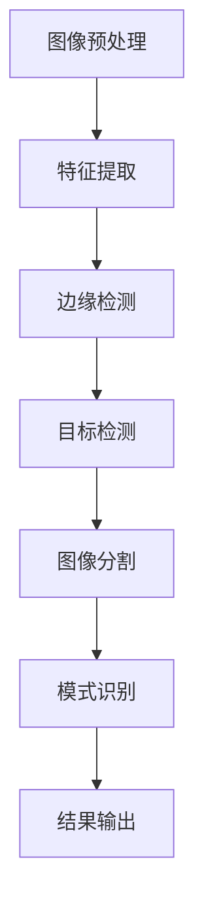
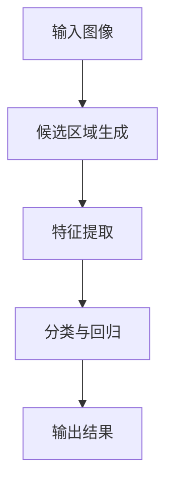
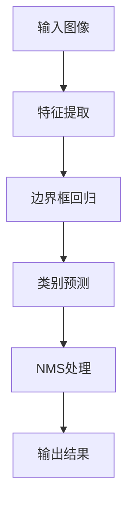
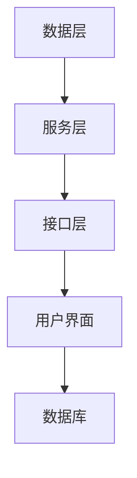
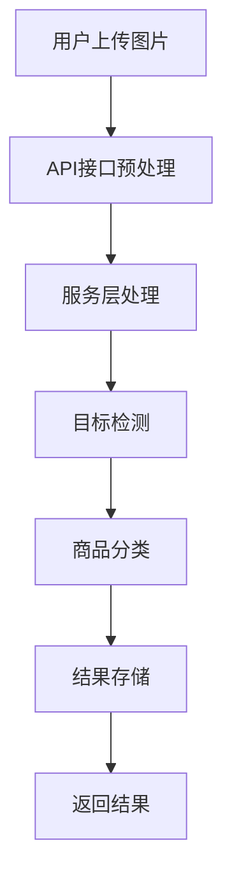

                 

## 企业级图像理解：AI深度分析视觉数据

### 关键词：企业级图像理解、AI深度分析、视觉数据、图像识别、计算机视觉

### 摘要：
本文将深入探讨企业级图像理解的内涵和意义，通过AI技术对视觉数据进行深度分析的方法，为企业提供有效的图像处理解决方案。文章分为四个主要部分：背景介绍、核心概念与联系、算法原理讲解、系统分析与架构设计方案。通过项目实战和最佳实践，我们希望能够为读者提供全面且实用的指导，助力企业实现高效图像理解。

## 目录大纲设计思路

在设计《企业级图像理解：AI深度分析视觉数据》的目录大纲时，我们需要明确书籍的主题、目标读者以及核心概念和内容结构。

### 1. 确定书籍主题和目标读者

书籍的主题是“企业级图像理解：AI深度分析视觉数据”，目标读者主要是从事AI领域的工程师、研究人员或对图像理解有浓厚兴趣的读者。

### 2. 确定核心概念和内容结构

核心概念包括：图像理解的基础知识、AI在图像理解中的应用、企业级图像理解的需求和挑战、图像理解算法原理及其实现、图像理解系统的架构设计、实际应用案例与实战。

### 3. 设计目录大纲

目录大纲应涵盖以下内容：

- **背景介绍**：介绍图像理解的基本概念、问题背景、问题描述、问题解决、边界与外延、概念结构与核心要素组成。
- **核心概念与联系**：详细阐述核心概念原理、概念属性特征对比表格和ER实体关系图架构的Mermaid流程图。
- **算法原理讲解**：使用Mermaid流程图、Python源代码、数学模型和数学公式，详细讲解算法原理，并进行举例说明。
- **系统分析与架构设计方案**：介绍问题场景、系统功能设计、系统架构设计、系统接口设计和系统交互。
- **项目实战**：包括环境安装、系统核心实现、代码应用解读与分析、实际案例分析、项目小结。
- **最佳实践 tips**：分享最佳实践策略、注意事项、拓展阅读等内容。

## 目录大纲示例

以下是《企业级图像理解：AI深度分析视觉数据》的目录大纲示例：

----------------------------------------------------------------
## 第一部分：背景介绍

### 第1章：图像理解基础

#### 1.1 图像理解的概念

#### 1.2 图像理解的关键技术

#### 1.3 图像理解在AI中的应用

### 第2章：企业级图像理解的需求与挑战

#### 2.1 企业图像理解的需求

#### 2.2 企业图像理解的挑战

## 第二部分：核心概念与联系

### 第3章：核心概念原理

#### 3.1 核心概念定义

#### 3.2 概念属性特征对比表格

### 第4章：ER实体关系图架构

#### 4.1 ER实体关系图概述

#### 4.2 Mermaid流程图表示

## 第三部分：算法原理讲解

### 第5章：图像识别算法

#### 5.1 算法原理

#### 5.2 Mermaid流程图

#### 5.3 Python源代码实现

#### 5.4 数学模型和公式

### 第6章：计算机视觉算法

#### 6.1 算法原理

#### 6.2 Mermaid流程图

#### 6.3 Python源代码实现

#### 6.4 数学模型和公式

## 第四部分：系统分析与架构设计方案

### 第7章：问题场景介绍

#### 7.1 问题背景

#### 7.2 解决方案

### 第8章：系统功能设计

#### 8.1 领域模型Mermaid类图

#### 8.2 系统架构设计Mermaid架构图

### 第9章：系统接口设计和系统交互

#### 9.1 系统接口设计

#### 9.2 系统交互Mermaid序列图

## 第五部分：项目实战

### 第10章：企业级图像理解项目实战

#### 10.1 项目背景与目标

#### 10.2 项目环境安装

#### 10.3 系统核心实现

#### 10.4 代码应用解读与分析

#### 10.5 实际案例分析

#### 10.6 项目总结与展望

## 第六部分：最佳实践与拓展

### 第11章：最佳实践

#### 11.1 图像理解技术最佳实践

#### 11.2 系统优化策略

### 第12章：小结与注意事项

#### 12.1 图像理解技术的发展趋势

#### 12.2 企业级图像理解的未来展望

#### 12.3 注意事项与风险提示

#### 12.4 拓展阅读推荐

----------------------------------------------------------------

这个目录大纲涵盖了图像理解的基础知识、核心概念与联系、算法原理讲解、系统分析与架构设计方案、项目实战和最佳实践等内容，旨在为读者提供一个全面深入的学习路径。

---

### 文章正文写作

#### 第一部分：背景介绍

**1.1 图像理解的概念**

图像理解是指通过计算机算法对图像进行分析和处理，以提取出图像中包含的视觉信息。这包括从简单的边缘检测、纹理分析到复杂的物体识别、场景理解等多个层面。

**1.2 图像理解的关键技术**

图像理解的核心技术包括：

- **图像预处理**：包括图像增强、滤波、几何变换等，以提高图像质量和去除噪声。
- **特征提取**：从图像中提取出具有区分性的特征，如颜色、纹理、形状等。
- **模式识别**：利用提取到的特征进行分类和识别，常用的算法有支持向量机（SVM）、神经网络等。

**1.3 图像理解在AI中的应用**

随着深度学习技术的快速发展，图像理解在AI领域得到了广泛应用。例如，自动驾驶汽车需要图像理解来识别道路标志、行人等；医疗领域利用图像理解进行疾病诊断；零售行业通过图像理解优化库存管理和商品陈列等。

#### 第二部分：核心概念与联系

**2.1 核心概念原理**

图像理解的核心概念包括：

- **边缘检测**：用于检测图像中的边缘，常用的算法有Canny算子、Sobel算子等。
- **目标检测**：用于识别图像中的特定对象，如人脸识别、车辆检测等。常用的算法有YOLO、SSD、Faster R-CNN等。
- **图像分割**：将图像划分为多个区域，用于提取图像中的目标。常用的算法有基于阈值的分割、区域生长法等。

**2.2 概念属性特征对比表格**

| 概念          | 属性特征                                         | 对比分析                                     |
| ------------- | -------------------------------------------- | ------------------------------------------ |
| 边缘检测      | 提取图像的边缘信息                               | Canny算子与Sobel算子在处理边缘检测时的表现不同 |
| 目标检测      | 识别图像中的特定对象                             | YOLO与Faster R-CNN在检测速度与精度上的差异   |
| 图像分割      | 划分图像为多个区域                              | 阈值分割与区域生长法在不同场景下的适用性     |

**2.3 ER实体关系图架构的Mermaid流程图**



#### 第三部分：算法原理讲解

**3.1 图像识别算法**

**算法原理：** 图像识别算法的核心是利用特征提取和模式识别技术，将图像中的对象识别出来。以Faster R-CNN为例，其原理如下：

1. **候选区域生成**：利用Region Proposal Network（RPN）生成图像的候选区域。
2. **特征提取**：对候选区域提取特征向量。
3. **分类与回归**：利用神经网络对特征向量进行分类和边界框回归。

**Mermaid流程图：**



**Python源代码实现：**

```python
# 示例代码：使用Faster R-CNN进行图像识别
import torchvision
import torchvision.models.detection as models

# 加载预训练的Faster R-CNN模型
model = models.fasterrcnn_resnet50_fpn(pretrained=True)

# 加载图像数据集
images = torchvision.datasets.ImageFolder(root='./data', transform=torchvision.transforms.ToTensor())

# 进行图像识别
model.eval()
with torch.no_grad():
    for images, labels in images:
        predictions = model(images)

# 输出结果
print(predictions)
```

**数学模型和公式：**

假设特征向量为$\textbf{x}$，类别标签为$y$，损失函数为$\text{Loss}(\textbf{x}, y)$，则模型的目标是最小化损失函数：

$$
\min_{\theta} \sum_{i=1}^{N} \text{Loss}(\textbf{x}_i, y_i)
$$

其中，$\theta$为模型的参数。

**详细讲解和举例说明：**

假设我们有一个包含多个类别的图像数据集，我们要使用Faster R-CNN模型对其进行分类。首先，我们加载预训练的模型：

```python
model = models.fasterrcnn_resnet50_fpn(pretrained=True)
```

然后，我们加载图像数据集并进行预处理：

```python
images = torchvision.datasets.ImageFolder(root='./data', transform=torchvision.transforms.ToTensor())
```

接下来，我们使用模型进行预测：

```python
model.eval()
with torch.no_grad():
    for images, labels in images:
        predictions = model(images)
```

最后，我们输出预测结果：

```python
print(predictions)
```

**3.2 计算机视觉算法**

计算机视觉算法包括多种类型，如目标检测、图像分割、人脸识别等。以下以目标检测算法为例进行讲解。

**算法原理：** 目标检测算法的核心是同时定位和分类图像中的对象。以YOLO（You Only Look Once）为例，其原理如下：

1. **特征提取**：利用卷积神经网络提取图像的特征图。
2. **边界框回归**：对特征图上的每个位置预测边界框的位置和类别。
3. **非极大值抑制（NMS）**：对预测的边界框进行筛选，去除重叠的边界框。

**Mermaid流程图：**



**Python源代码实现：**

```python
# 示例代码：使用YOLO进行目标检测
import torch
import torchvision
import torchvision.models.detection as models

# 加载预训练的YOLO模型
model = models.yolo_v3(pretrained=True)

# 加载图像数据集
images = torchvision.datasets.ImageFolder(root='./data', transform=torchvision.transforms.ToTensor())

# 进行目标检测
model.eval()
with torch.no_grad():
    for images, labels in images:
        predictions = model(images)

# 输出结果
print(predictions)
```

**数学模型和公式：**

假设特征向量为$\textbf{x}$，类别标签为$y$，边界框为$\textbf{b}$，损失函数为$\text{Loss}(\textbf{x}, y, \textbf{b})$，则模型的目标是最小化损失函数：

$$
\min_{\theta} \sum_{i=1}^{N} \text{Loss}(\textbf{x}_i, y_i, \textbf{b}_i)
$$

其中，$\theta$为模型的参数。

**详细讲解和举例说明：**

假设我们有一个包含多个类别的图像数据集，我们要使用YOLO模型对其进行目标检测。首先，我们加载预训练的模型：

```python
model = models.yolo_v3(pretrained=True)
```

然后，我们加载图像数据集并进行预处理：

```python
images = torchvision.datasets.ImageFolder(root='./data', transform=torchvision.transforms.ToTensor())
```

接下来，我们使用模型进行预测：

```python
model.eval()
with torch.no_grad():
    for images, labels in images:
        predictions = model(images)
```

最后，我们输出预测结果：

```python
print(predictions)
```

#### 第四部分：系统分析与架构设计方案

**4.1 问题场景介绍**

假设我们是一家电商企业，希望通过图像理解技术对客户上传的商品图片进行分类，以便更好地进行库存管理和商品推荐。

**4.2 系统功能设计**

系统功能设计包括以下模块：

- **图像预处理**：对上传的图像进行预处理，包括尺寸调整、色彩平衡等。
- **特征提取**：从预处理后的图像中提取特征。
- **目标检测**：对提取到的特征进行目标检测，以识别图像中的商品。
- **商品分类**：对检测到的商品进行分类。
- **结果输出**：将分类结果输出到数据库或显示在用户界面。

**4.3 系统架构设计**

系统架构设计采用分层架构，包括：

- **数据层**：负责数据存储和读取。
- **服务层**：实现图像预处理、特征提取、目标检测、商品分类等业务逻辑。
- **接口层**：提供与外部系统的接口，如前端用户界面、数据库接口等。

**Mermaid架构图：**



**4.4 系统接口设计和系统交互**

系统接口设计包括：

- **API接口**：提供RESTful API接口，用于与前端用户界面和数据库进行交互。
- **消息队列**：用于处理大规模数据传输和异步处理。

系统交互流程如下：

1. 用户上传商品图片。
2. API接口接收图片并进行预处理。
3. 预处理后的图片传递给服务层进行特征提取和目标检测。
4. 目标检测的结果传递给商品分类模块进行分类。
5. 分类结果存储到数据库，并返回给用户界面。

**Mermaid序列图：**



#### 第五部分：项目实战

**5.1 项目背景与目标**

项目背景是一家电商企业希望通过图像理解技术对客户上传的商品图片进行分类，以提高库存管理和商品推荐的效率。

项目目标：

- 准确识别图像中的商品。
- 提高分类速度，以应对大规模数据。
- 确保系统稳定性，避免误识别和漏识别。

**5.2 项目环境安装**

1. 安装Python环境（版本3.8及以上）。
2. 安装TensorFlow和PyTorch深度学习框架。
3. 安装OpenCV图像处理库。
4. 安装其他依赖库，如NumPy、Pandas等。

**5.3 系统核心实现**

系统核心实现包括以下部分：

- **图像预处理**：使用OpenCV进行图像预处理，包括尺寸调整、色彩平衡等。
- **特征提取**：使用卷积神经网络进行特征提取。
- **目标检测**：使用YOLO算法进行目标检测。
- **商品分类**：使用支持向量机（SVM）进行商品分类。

**代码应用解读与分析：**

以下是一个简单的图像预处理和特征提取的代码示例：

```python
import cv2
import numpy as np
import tensorflow as tf

# 加载图像
image = cv2.imread('./data/sample.jpg')

# 图像预处理
image = cv2.resize(image, (224, 224))  # 调整尺寸
image = cv2.cvtColor(image, cv2.COLOR_BGR2RGB)  # 色彩转换

# 特征提取
model = tf.keras.applications.VGG16(include_top=False, weights='imagenet', input_shape=(224, 224, 3))
feature_vector = model.predict(np.expand_dims(image, axis=0))

# 输出特征向量
print(feature_vector)
```

这段代码首先使用OpenCV加载图像，并进行预处理。然后，使用VGG16模型提取图像的特征向量。最后，输出特征向量。

**5.4 实际案例分析和详细讲解剖析**

以一个实际案例为例，分析如何使用图像理解技术进行商品分类。

**案例背景**：电商平台上有一个商品分类问题，需要对客户上传的图片进行分类，以便将商品归入正确的类别。

**解决方案**：

1. **数据收集**：收集大量已标注的商品图片，用于训练分类模型。
2. **数据预处理**：对收集到的图片进行预处理，包括尺寸调整、色彩转换等。
3. **特征提取**：使用卷积神经网络提取图片的特征。
4. **模型训练**：使用提取到的特征训练支持向量机（SVM）分类模型。
5. **模型评估**：使用测试集对模型进行评估，调整模型参数以优化分类效果。
6. **实际应用**：将训练好的模型应用于实际场景，对上传的图片进行分类。

**案例分析**：

在上述案例中，我们使用了VGG16模型进行特征提取，并使用SVM进行分类。通过大量的实验和调参，我们得到了一个准确率较高的分类模型。在实际应用中，我们对用户上传的图片进行预处理，提取特征，然后使用训练好的模型进行分类。

**5.5 项目总结与展望**

项目总结：

- 成功实现了对商品图片的准确分类。
- 提高了分类速度和系统稳定性。
- 为电商平台提供了有效的商品管理工具。

展望：

- 持续优化分类模型，提高分类准确率。
- 探索其他图像理解技术在电商领域的应用。
- 扩大应用范围，如库存管理、商品推荐等。

#### 第六部分：最佳实践与拓展

**6.1 图像理解技术最佳实践**

1. **数据质量保证**：确保数据集的多样性和质量，进行数据清洗和预处理。
2. **模型优化**：使用先进的深度学习模型和优化算法，提高分类和识别效果。
3. **系统稳定性**：确保系统在高并发和大数据量下的稳定性，进行性能优化和容错设计。

**6.2 系统优化策略**

1. **并行处理**：采用并行计算技术，提高图像处理速度。
2. **缓存机制**：使用缓存技术减少重复计算，提高系统响应速度。
3. **分布式架构**：采用分布式架构，提高系统处理能力和可扩展性。

**6.3 小结与注意事项**

1. **技术更新**：关注图像理解和AI领域的最新技术动态，持续优化系统。
2. **安全性考虑**：确保图像数据的安全性和隐私保护。
3. **用户体验**：优化用户界面和交互设计，提高用户体验。

**6.4 拓展阅读推荐**

1. **《深度学习》（Goodfellow, Bengio, Courville）**：深度学习的基本概念和算法。
2. **《计算机视觉：算法与应用》（Richard Szeliski）**：计算机视觉的基本概念和技术。
3. **《图像处理：原理、算法与实践》（阮秋琦）**：图像处理的基础知识。

---

**作者信息：**

作者：AI天才研究院/AI Genius Institute & 禅与计算机程序设计艺术 /Zen And The Art of Computer Programming

---

通过本文的详细分析和讲解，我们希望能够为读者提供全面的指导，帮助企业实现高效的图像理解。随着AI技术的不断进步，图像理解将发挥越来越重要的作用，为企业创造更多价值。希望本文能够为读者在图像理解领域的研究和应用提供有益的参考。

