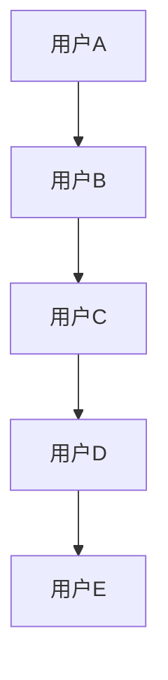
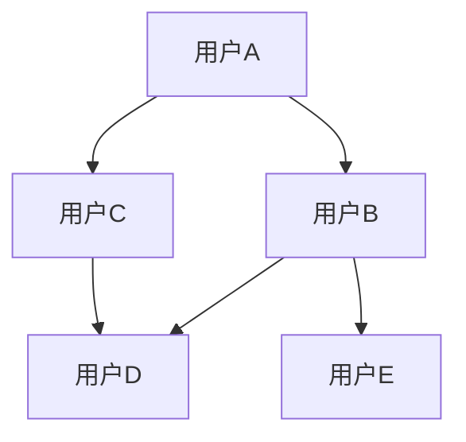
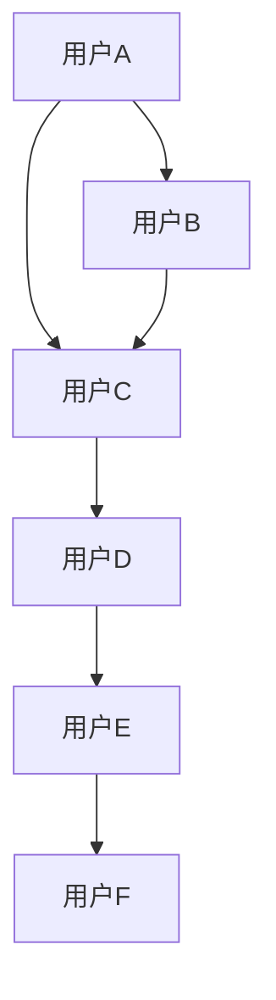
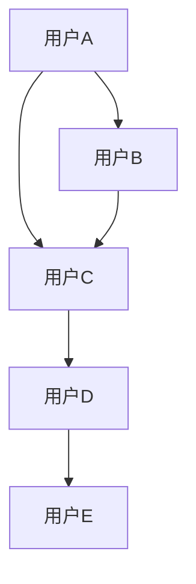
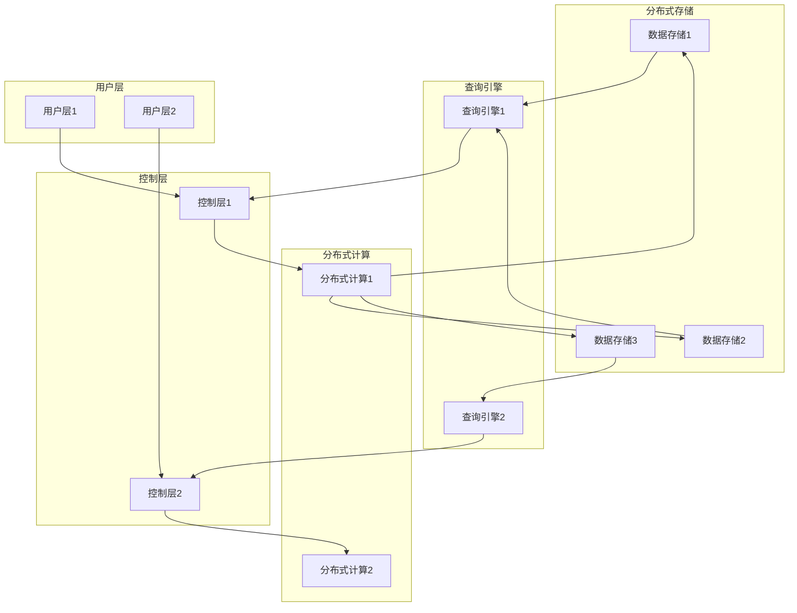
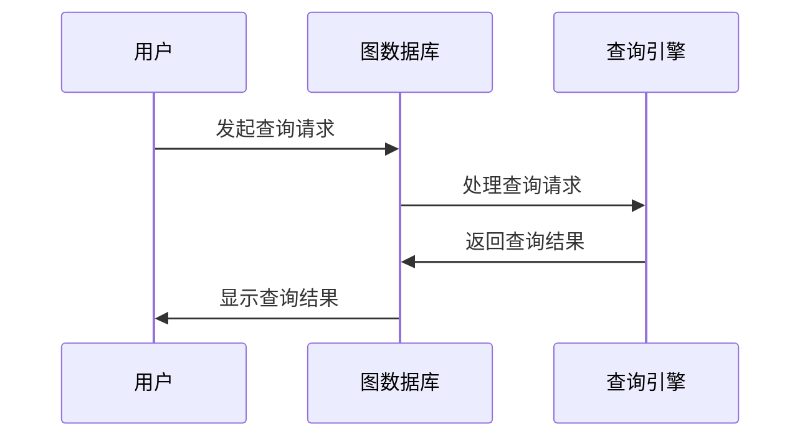
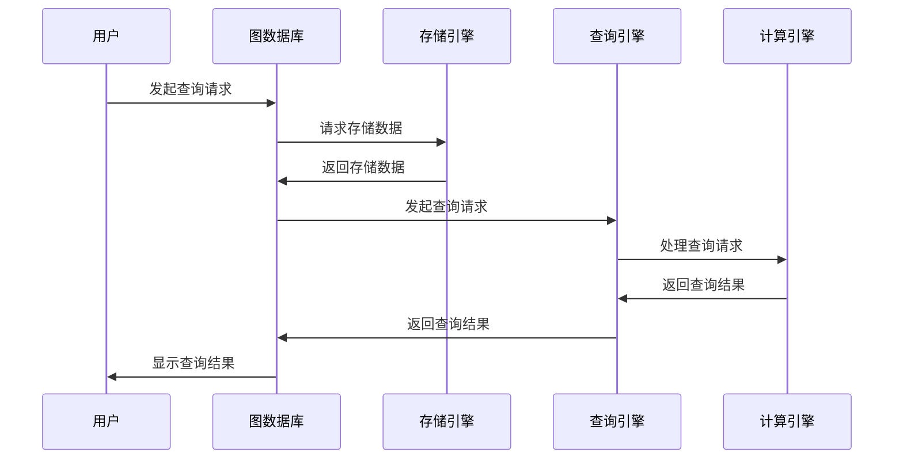

                 

**引言**

在当今信息化社会的快速发展中，数据已经成为企业决策和战略规划的关键因素。尤其是复杂关系数据的处理，对于企业来说具有重要的意义。随着互联网、物联网、社交媒体等技术的普及，企业面临着海量的数据和信息，其中包含了大量复杂的关系数据。传统的数据库系统，如关系型数据库，在处理这些复杂关系数据时表现出了一定的局限性。为了解决这些问题，企业级图数据库应运而生。

### **1.1 问题背景**

首先，我们需要了解什么是复杂关系数据。复杂关系数据指的是数据之间存在复杂的关联和依赖关系，这些关系往往是非线性的、多层次的。在传统的数据库系统中，关系型数据库通过表格和SQL语言来处理数据关系，但这种方法在面对复杂关系数据时，显得力不从心。关系型数据库的表结构设计复杂，查询效率低下，难以满足现代企业对于数据关系处理的需求。

其次，我们需要认识到，随着业务的不断发展和数据量的激增，企业需要一种更加高效、灵活的数据库解决方案。传统的数据库系统在处理大规模数据时，往往会出现性能瓶颈，导致系统响应时间延长，影响业务处理效率。而图数据库作为一种新型数据库，其独特的图结构能够更好地表示和存储复杂关系数据，提供高效的查询能力。

### **1.2 问题描述**

图数据库的概念与优势：

图数据库是一种基于图论理论的数据库管理系统，它以图的结构来存储和查询数据。在图数据库中，数据以节点和边的形式存在，节点表示实体，边表示实体之间的关系。与关系型数据库不同，图数据库不需要预先定义复杂的表结构和关联关系，可以动态地建立和维护实体之间的关系。

图数据库在企业中的应用场景：

图数据库在许多应用场景中表现出色，包括社交网络、推荐系统、金融风控、物流管理、医疗健康等领域。例如，在社交网络中，图数据库可以高效地处理用户之间的复杂关系，提供精确的社交推荐；在金融风控中，图数据库可以帮助企业快速发现异常交易行为，提高风险控制能力。

### **1.3 问题解决**

图数据库的基本原理：

图数据库的基本原理是通过图结构来存储和查询数据。图结构由节点和边组成，节点表示实体，边表示实体之间的关系。图数据库通过这种方式来表示复杂的关系数据，使得数据的存储和查询变得更加高效。

图数据库的主要特性：

1. **高效的查询能力**：图数据库通过图结构来表示数据关系，能够快速地进行数据查询。特别是在处理复杂的关联关系时，图数据库比关系型数据库有明显的优势。

2. **灵活的数据模型**：图数据库不需要预先定义表结构和关联关系，可以动态地建立和维护实体之间的关系，使得数据模型更加灵活。

3. **分布式存储**：图数据库支持分布式存储，可以横向扩展，处理大规模数据。

4. **强大的扩展性**：图数据库能够根据业务需求进行定制化开发，满足不同场景下的需求。

### **1.4 边界与外延**

图数据库的适用场景：

图数据库适用于处理复杂关系数据的应用场景，例如社交网络、推荐系统、金融风控、物流管理、医疗健康等领域。在这些领域中，图数据库能够提供高效的查询能力和灵活的数据模型，帮助企业更好地理解和利用数据。

图数据库的优劣势分析：

优势：

- 高效的查询能力
- 灵活的数据模型
- 分布式存储
- 强大的扩展性

劣势：

- 学习成本较高
- 需要专业的维护团队
- 对硬件资源要求较高

### **1.5 概念结构与核心要素组成**

图数据库的基本术语：

- **节点**：表示实体，可以是用户、商品、地点等。
- **边**：表示实体之间的关系，可以是好友关系、购买关系、地理位置关系等。
- **图**：由节点和边组成的结构。
- **图论**：研究图的结构、性质及其应用的理论。

图数据库的核心架构：

- **存储引擎**：负责数据的存储和检索。
- **查询引擎**：负责图数据的查询和分析。
- **分布式系统**：支持分布式存储和计算。

### **1.6 本章小结**

图数据库的重要性：

图数据库作为一种新型数据库，能够高效地处理复杂关系数据，为企业提供强大的数据分析和决策支持。随着大数据和人工智能技术的发展，图数据库在各个领域的应用将越来越广泛。

图数据库的发展趋势：

随着技术的不断进步和应用的深入，图数据库将在数据存储、查询、分析等方面继续优化和提升。未来，图数据库将更加智能化，能够自动适应不同的应用场景，提供更高效、更灵活的数据处理能力。

**引言小结**

本文将围绕企业级图数据库展开讨论，从问题背景、问题描述、问题解决、边界与外延、概念结构与核心要素组成等多个角度，深入分析图数据库的技术原理和应用场景。接下来，我们将逐步探讨图数据库的核心概念、算法原理、数学模型、系统分析与架构设计、项目实战、最佳实践与拓展阅读等内容，希望能够为广大读者提供一份全面、深入的技术指南。**# 目录大纲**

## 企业级图数据库：优化复杂关系数据的存储与查询

> 关键词：企业级图数据库、复杂关系数据、存储与查询、图数据库原理、算法、架构设计、项目实战

> 摘要：本文旨在深入探讨企业级图数据库的优化策略，特别是在处理复杂关系数据时的存储与查询效率。文章首先介绍了图数据库的背景和问题，然后详细阐述了图数据库的核心概念、算法原理、数学模型、系统分析与架构设计、项目实战以及最佳实践，最后对图数据库的发展趋势进行了展望。

## 第一部分：企业级图数据库概述

### 第1章：引言

#### 1.1 问题背景
- 复杂关系数据的挑战
- 传统关系型数据库的局限性

#### 1.2 问题描述
- 图数据库的概念与优势
- 图数据库在企业中的应用场景

#### 1.3 问题解决
- 图数据库的基本原理
- 图数据库的主要特性

#### 1.4 边界与外延
- 图数据库的适用场景
- 图数据库的优劣势分析

#### 1.5 概念结构与核心要素组成
- 图数据库的基本术语
- 图数据库的核心架构

#### 1.6 本章小结
- 图数据库的重要性
- 图数据库的发展趋势

## 第二部分：图数据库的核心概念与联系

### 第2章：图数据库的核心概念

#### 2.1 图的定义与特性
- 图的数学定义
- 图的基本特性

#### 2.2 节点与边的概念
- 节点的定义与特性
- 边的定义与特性

#### 2.3 图的属性与类型
- 图的属性
- 图的类型

#### 2.4 图的存储方式
- 图的存储模型
- 图的存储结构

### 第3章：图数据库的核心特性

#### 3.1 图的查询语言
- 图查询语言的发展
- 图查询语言的优势

#### 3.2 图的索引机制
- 图索引的概念
- 图索引的类型

#### 3.3 图的分布式存储
- 分布式存储的基本原理
- 分布式存储的优势

#### 3.4 图的可扩展性
- 可扩展性的重要性
- 图数据库的可扩展性设计

#### 3.5 图的安全性与一致性
- 安全性的重要性
- 图数据库的一致性保证

### 第4章：图数据库的实体关系图架构

#### 4.1 ER实体关系图
- ER实体关系图的定义
- ER实体关系图的设计

#### 4.2 图数据库的ER图实现
- 图数据库中的ER图
- 图数据库的ER图应用实例

## 第三部分：图数据库的算法原理讲解

### 第5章：图数据库的算法原理

#### 5.1 算法概述
- 图数据库中的常见算法
- 算法在图数据库中的应用

#### 5.2 算法原理讲解
- 算法的数学模型和公式
- 算法的详细讲解

#### 5.3 举例说明
- 算法在具体场景中的应用
- 算法的效果分析

## 第四部分：图数据库的数学模型和数学公式

### 第6章：数学模型与公式

#### 6.1 数学模型概述
- 数学模型在图数据库中的应用
- 数学模型的基本原理

#### 6.2 公式讲解
- 公式的详细讲解
- 公式在实际应用中的意义

#### 6.3 举例说明
- 公式在图数据库中的实例
- 公式的应用效果分析

## 第五部分：图数据库的系统分析与架构设计

### 第7章：系统分析与架构设计

#### 7.1 问题场景介绍
- 图数据库的应用场景
- 问题场景的具体分析

#### 7.2 系统功能设计
- 系统功能需求分析
- 领域模型类图设计

#### 7.3 系统架构设计
- 系统架构设计原则
- 系统架构图设计

#### 7.4 系统接口设计
- 接口设计原则
- 接口设计图

#### 7.5 系统交互设计
- 系统交互设计原则
- 系统交互序列图设计

## 第六部分：图数据库的项目实战

### 第8章：项目实战

#### 8.1 环境安装
- 环境搭建过程
- 环境配置方法

#### 8.2 系统核心实现
- 系统核心模块设计
- 系统核心模块实现

#### 8.3 代码应用解读
- 代码解读方法
- 代码应用分析

#### 8.4 实际案例分析与讲解
- 实际案例展示
- 案例分析讲解

#### 8.5 项目小结
- 项目总结
- 项目经验分享

## 第七部分：最佳实践与拓展阅读

### 第9章：最佳实践

#### 9.1 最佳实践技巧
- 图数据库的最佳实践技巧
- 最佳实践案例分享

#### 9.2 注意事项
- 使用图数据库时需要注意的问题
- 常见问题的解决方法

### 第10章：拓展阅读

#### 10.1 拓展内容
- 图数据库的最新动态
- 图数据库的深入研究方向

#### 10.2 阅读推荐
- 推荐的图数据库相关书籍和论文
- 推荐的图数据库学习资源

**# 第一部分：企业级图数据库概述**

## 第1章：引言

### **1.1 问题背景**

在当今信息化社会的快速发展中，数据已经成为企业决策和战略规划的关键因素。尤其是复杂关系数据的处理，对于企业来说具有重要的意义。随着互联网、物联网、社交媒体等技术的普及，企业面临着海量的数据和信息，其中包含了大量复杂的关系数据。

#### **1.1.1 复杂关系数据的挑战**

复杂关系数据指的是数据之间存在复杂的关联和依赖关系，这些关系往往是非线性的、多层次的。在传统的数据库系统中，关系型数据库通过表格和SQL语言来处理数据关系，但这种方法在面对复杂关系数据时，显得力不从心。关系型数据库的表结构设计复杂，查询效率低下，难以满足现代企业对于数据关系处理的需求。

首先，复杂关系数据的处理需要强大的数据建模能力。关系型数据库通过外键和表连接来实现数据关系，但在面对复杂的多层次关系时，表连接操作会变得繁琐且效率低下。其次，复杂关系数据往往涉及到大量关联查询，关系型数据库的查询优化算法难以应对这种复杂查询场景，导致查询响应时间过长。

#### **1.1.2 传统关系型数据库的局限性**

传统关系型数据库在设计时主要针对简单的关系数据模型，其基本假设是数据之间是独立的、静态的。然而，随着业务场景的复杂化和数据量的激增，这种假设已经不再适用。传统关系型数据库在以下几个方面表现出局限性：

1. **表结构设计复杂**：复杂关系数据往往需要多个表之间的复杂连接，这使得表结构设计变得复杂，增加了数据库维护的难度。

2. **查询效率低下**：传统关系型数据库的查询优化算法主要基于表连接和索引，但在面对复杂的多层次关系查询时，查询效率往往不高。

3. **扩展性差**：关系型数据库在数据量较大时，性能会显著下降，难以支持大规模数据的处理。

4. **灵活性不足**：关系型数据库的数据模型是静态的，难以适应动态变化的业务需求。

### **1.2 问题描述**

图数据库的概念与优势：

为了解决复杂关系数据处理的问题，企业级图数据库应运而生。图数据库是一种基于图论理论的数据库管理系统，它以图的结构来存储和查询数据。在图数据库中，数据以节点和边的形式存在，节点表示实体，边表示实体之间的关系。与关系型数据库不同，图数据库不需要预先定义复杂的表结构和关联关系，可以动态地建立和维护实体之间的关系。

#### **1.2.1 图数据库的概念**

图数据库（Graph Database）是一种用于存储和查询具有复杂关系的图形结构数据的数据库系统。在图数据库中，数据以图的形式存储，其中每个节点表示一个实体，每条边表示实体之间的关系。图数据库的主要目标是高效地处理实体之间的复杂关系，并提供强大的查询能力。

图数据库的基本组成包括：

- **节点（Node）**：表示实体，可以是用户、物品、地点等。
- **边（Edge）**：表示实体之间的关系，可以是好友关系、购买关系、地理位置关系等。
- **属性（Property）**：附加在节点和边上的数据，可以用于描述节点和边的特征。

#### **1.2.2 图数据库的优势**

图数据库在处理复杂关系数据时具有明显的优势：

1. **高效的查询能力**：图数据库通过图结构来表示数据关系，能够快速地进行数据查询。特别是在处理复杂的关联关系时，图数据库比关系型数据库有明显的优势。

2. **灵活的数据模型**：图数据库不需要预先定义复杂的表结构和关联关系，可以动态地建立和维护实体之间的关系，使得数据模型更加灵活。

3. **分布式存储**：图数据库支持分布式存储，可以横向扩展，处理大规模数据。

4. **强大的扩展性**：图数据库能够根据业务需求进行定制化开发，满足不同场景下的需求。

#### **1.2.3 图数据库在企业中的应用场景**

图数据库在许多企业应用场景中表现出色，包括以下领域：

1. **社交网络**：图数据库可以高效地处理用户之间的复杂关系，提供精确的社交推荐。

2. **推荐系统**：图数据库能够根据用户的历史行为和兴趣，构建用户与物品之间的关联关系，提供个性化的推荐。

3. **金融风控**：图数据库可以帮助企业快速发现异常交易行为，提高风险控制能力。

4. **物流管理**：图数据库可以优化路径规划，提高物流效率。

5. **医疗健康**：图数据库可以用于疾病预测和治疗方案推荐。

### **1.3 问题解决**

图数据库的基本原理：

图数据库的基本原理是通过图结构来存储和查询数据。图结构由节点和边组成，节点表示实体，边表示实体之间的关系。图数据库通过这种方式来表示复杂的关系数据，使得数据的存储和查询变得更加高效。

图数据库的主要特性：

1. **高效的查询能力**：图数据库通过图结构来表示数据关系，能够快速地进行数据查询。特别是在处理复杂的关联关系时，图数据库比关系型数据库有明显的优势。

2. **灵活的数据模型**：图数据库不需要预先定义复杂的表结构和关联关系，可以动态地建立和维护实体之间的关系，使得数据模型更加灵活。

3. **分布式存储**：图数据库支持分布式存储，可以横向扩展，处理大规模数据。

4. **强大的扩展性**：图数据库能够根据业务需求进行定制化开发，满足不同场景下的需求。

### **1.4 边界与外延**

图数据库的适用场景：

图数据库适用于处理复杂关系数据的应用场景，例如社交网络、推荐系统、金融风控、物流管理、医疗健康等领域。在这些领域中，图数据库能够提供高效的查询能力和灵活的数据模型，帮助企业更好地理解和利用数据。

图数据库的优劣势分析：

#### **1.4.1 适用场景**

1. **社交网络**：社交网络中存在大量的用户关系，如图数据库可以高效地处理用户之间的复杂关系，提供精确的社交推荐。

2. **推荐系统**：推荐系统中需要根据用户的历史行为和兴趣，构建用户与物品之间的关联关系，如图数据库能够快速地查询这些关系，提供个性化的推荐。

3. **金融风控**：金融风控中需要快速发现异常交易行为，如图数据库可以帮助企业构建交易网络，快速识别潜在的欺诈行为。

4. **物流管理**：物流管理中需要优化路径规划，如图数据库可以高效地处理地理位置数据，提供最优的路线推荐。

5. **医疗健康**：医疗健康中需要根据患者的病史和基因信息，构建复杂的医疗网络，如图数据库能够提供高效的查询和数据分析能力。

#### **1.4.2 优劣势分析**

**优势：**

1. **高效的查询能力**：图数据库通过图结构来表示数据关系，能够快速地进行数据查询，特别是在处理复杂的关联关系时，图数据库有明显的优势。

2. **灵活的数据模型**：图数据库不需要预先定义复杂的表结构和关联关系，可以动态地建立和维护实体之间的关系，使得数据模型更加灵活。

3. **分布式存储**：图数据库支持分布式存储，可以横向扩展，处理大规模数据。

4. **强大的扩展性**：图数据库能够根据业务需求进行定制化开发，满足不同场景下的需求。

**劣势：**

1. **学习成本较高**：图数据库相对于传统的关系型数据库，需要用户具备一定的图论和图数据库的知识，学习成本较高。

2. **需要专业的维护团队**：图数据库的维护需要专业的团队，对数据库的性能调优、故障排除等方面有较高的要求。

3. **对硬件资源要求较高**：图数据库在处理大规模数据时，对硬件资源的要求较高，需要投入更多的硬件资源来保证系统的性能。

### **1.5 概念结构与核心要素组成**

图数据库的基本术语：

- **节点（Node）**：表示实体，可以是用户、物品、地点等。
- **边（Edge）**：表示实体之间的关系，可以是好友关系、购买关系、地理位置关系等。
- **属性（Property）**：附加在节点和边上的数据，可以用于描述节点和边的特征。
- **图（Graph）**：由节点和边组成的结构。
- **图论（Graph Theory）**：研究图的结构、性质及其应用的理论。

图数据库的核心架构：

- **存储引擎**：负责数据的存储和检索。
- **查询引擎**：负责图数据的查询和分析。
- **分布式系统**：支持分布式存储和计算。

### **1.6 本章小结**

图数据库的重要性：

图数据库作为一种新型数据库，能够高效地处理复杂关系数据，为企业提供强大的数据分析和决策支持。随着大数据和人工智能技术的发展，图数据库在各个领域的应用将越来越广泛。

图数据库的发展趋势：

随着技术的不断进步和应用的深入，图数据库将在数据存储、查询、分析等方面继续优化和提升。未来，图数据库将更加智能化，能够自动适应不同的应用场景，提供更高效、更灵活的数据处理能力。

**引言小结**

本文将围绕企业级图数据库展开讨论，从问题背景、问题描述、问题解决、边界与外延、概念结构与核心要素组成等多个角度，深入分析图数据库的技术原理和应用场景。接下来，我们将逐步探讨图数据库的核心概念、算法原理、数学模型、系统分析与架构设计、项目实战、最佳实践与拓展阅读等内容，希望能够为广大读者提供一份全面、深入的技术指南。

**# 第2章：图数据库的核心概念**

### **2.1 图的定义与特性**

图（Graph）是一种由节点（Node）和边（Edge）组成的数学结构，用于表示实体及其之间的关联关系。在图数据库中，节点通常表示实体，边表示实体之间的关系。与传统的表结构数据库相比，图数据库能够更加直观、灵活地表示复杂的关系网络。

#### **2.1.1 图的数学定义**

在数学上，图是一个由顶点集合（V）和边集合（E）组成的二元组 \( G = (V, E) \)。其中：

- **顶点（Vertex）**：也称为节点（Node），是图的基本元素，表示实体。
- **边（Edge）**：连接两个顶点，表示实体之间的关系。

根据顶点和边的不同属性，图可以分为无向图（Undirected Graph）和有向图（Directed Graph），以及简单图（Simple Graph）和复合图（Compound Graph）等。

#### **2.1.2 图的基本特性**

1. **连通性（Connectivity）**：图中的任意两个顶点可以通过一条路径相互到达，称为连通图。
2. **路径（Path）**：图中顶点序列，其中任意两个相邻顶点通过边相连，最后一个顶点返回起点，形成一个闭合路径。
3. **环（Cycle）**：图中包含一条闭合路径，该路径的起点和终点是同一个顶点。
4. **连通度（Connectivity Degree）**：顶点在图中的连接度，即与之相连的边的数量。
5. **密度（Density）**：图中边的数量与顶点数量的比值，用于衡量图的结构紧凑程度。

### **2.2 节点与边的概念**

在图数据库中，节点和边是核心概念，用于表示实体和实体之间的关系。

#### **2.2.1 节点的定义与特性**

节点（Node）是图中的基本实体，表示具体的事物，如用户、物品、地点等。节点可以具有多种属性，如名称、标识、标签等。节点通常具有以下特性：

- **唯一性**：每个节点在图中具有唯一的标识。
- **多样性**：节点可以是不同的类型，具有不同的属性和特征。
- **可扩展性**：节点可以动态地增加和删除属性。

#### **2.2.2 边的定义与特性**

边（Edge）连接两个节点，表示节点之间的关系。边也可以具有多种属性，如权重、标签等。边通常具有以下特性：

- **方向性**：边可以是单向的或有向的。
- **权重**：边可以具有权重，用于表示关系的强度或距离。
- **多样性**：边可以是不同的类型，具有不同的属性和特征。
- **可扩展性**：边可以动态地增加和删除属性。

### **2.3 图的属性与类型**

图（Graph）本身也可以具有多种属性，用于描述图的特性。图的属性通常包括：

- **类型**：图可以是无向的或有向的。
- **规模**：图的大小，即顶点和边的数量。
- **连通性**：图是否为连通图。
- **密度**：图的密度，即边的数量与顶点数量的比值。

根据不同的属性和特征，图可以分为多种类型，如：

- **无向图**：边无方向，顶点之间的连接是双向的。
- **有向图**：边有方向，顶点之间的连接是单向的。
- **简单图**：不包含自环和多重边的图。
- **复合图**：包含自环和多重边的图。

### **2.4 图的存储方式**

图数据库中的图通常采用以下几种存储方式：

#### **2.4.1 邻接矩阵**

邻接矩阵（Adjacency Matrix）是一种二维数组，用于表示图中的顶点及其之间的关系。其中，矩阵的行和列分别表示顶点，若存在边连接两个顶点，则相应的位置上的值为1（或边的权重）。邻接矩阵能够高效地表示稀疏图，但在表示密集图时，会占用大量的存储空间。

邻接矩阵的优点是查询顶点间的连接关系快速，时间复杂度为 \(O(1)\)。缺点是存储空间大，特别是对于密集图。

#### **2.4.2 邻接表**

邻接表（Adjacency List）是一种链式结构，用于表示图中每个顶点的邻接顶点。每个顶点对应一个链表，链表中的元素表示与该顶点直接相连的其他顶点。邻接表能够高效地表示稀疏图，占用较少的存储空间。

邻接表的优点是存储空间小，查询顶点邻接关系快速。缺点是插入和删除顶点时，需要遍历整个邻接表，时间复杂度为 \(O(n)\)。

#### **2.4.3 哈希表**

哈希表（Hash Table）是一种基于键值对的数据结构，用于快速查询和更新节点和边。哈希表能够将节点和边映射到特定的存储位置，从而实现快速访问。哈希表通常结合邻接表或邻接矩阵使用，以提高查询效率。

哈希表的优点是查询和更新速度快，时间复杂度为 \(O(1)\)。缺点是可能出现哈希冲突，需要额外的处理机制。

### **2.4.4 图的存储结构**

在实际应用中，图数据库通常采用组合存储结构，结合邻接矩阵、邻接表和哈希表的特点，以实现高效的数据存储和查询。常见的存储结构包括：

- **混合存储结构**：结合邻接矩阵和邻接表，用于存储稀疏图和密集图。
- **分布式存储结构**：将图数据分布到多个节点上，用于处理大规模图数据。

### **2.5 图数据库的基本术语**

在图数据库的讨论中，了解以下基本术语是非常重要的：

- **图论（Graph Theory）**：研究图的结构、性质及其应用的理论。
- **邻接矩阵（Adjacency Matrix）**：用于表示图的邻接关系的二维数组。
- **邻接表（Adjacency List）**：用于表示图中每个顶点的邻接顶点的链式结构。
- **哈希表（Hash Table）**：用于快速查询和更新节点和边的数据结构。
- **分布式图数据库（Distributed Graph Database）**：将图数据分布到多个节点上，以处理大规模图数据。

### **2.6 图数据库的核心架构**

图数据库的核心架构主要包括以下组件：

- **存储引擎**：负责图数据的存储和检索。
- **查询引擎**：负责图数据的查询和分析。
- **分布式系统**：支持分布式存储和计算。

存储引擎负责将图数据以合适的结构存储在磁盘或内存中，并提供高效的读取和写入操作。查询引擎则负责处理图查询请求，使用图算法快速检索和计算图中的关系。分布式系统负责将图数据分布到多个节点上，提供横向扩展的能力，以处理大规模数据。

### **2.7 本章小结**

图数据库的核心概念包括节点、边、图结构、存储方式等。通过图数据库，企业能够高效地处理复杂的关系数据，提供强大的数据分析和决策支持。在下一章中，我们将进一步探讨图数据库的核心特性，包括查询语言、索引机制、分布式存储和可扩展性等。

**引言小结**

本文深入介绍了图数据库的核心概念，包括图的定义与特性、节点与边的概念、图的属性与类型、图的存储方式以及图数据库的基本术语和核心架构。通过这些核心概念的介绍，读者可以更好地理解图数据库的工作原理和优势。在下一章中，我们将继续探讨图数据库的核心特性，进一步理解其在处理复杂关系数据方面的优势。

**# 第3章：图数据库的核心特性**

### **3.1 图的查询语言**

图数据库的核心特性之一是其强大的查询语言能力，这使得用户能够以自然的方式查询图结构中的数据。图查询语言通常是基于图论的数学模型设计的，旨在提供灵活且高效的查询能力。

#### **3.1.1 图查询语言的发展**

早期的图查询语言主要集中在特定的图数据库系统上，如Neo4j使用的Cypher、Amazon Neptune使用的Gremlin等。这些语言逐渐发展，不仅提供了基本的图查询功能，还支持了复杂的图操作和算法。

#### **3.1.2 图查询语言的优势**

与传统的SQL查询语言相比，图查询语言具有以下优势：

1. **直观性**：图查询语言能够以图结构的方式表达查询，使得查询更加直观，易于理解。
2. **高效性**：图查询语言能够利用图的存储结构，提供高效的查询算法，特别是在处理复杂关联查询时。
3. **灵活性**：图查询语言支持递归查询、路径分析等复杂操作，能够灵活地处理各种图结构数据。

#### **3.1.3 图查询语言的语法与用法**

图查询语言的语法和用法因不同的数据库系统而异，但通常包含以下基本元素：

- **节点选择**：使用节点标识或属性来选择特定的节点。
- **关系选择**：使用关系标识或属性来选择特定的关系。
- **路径查询**：使用路径表达方式来指定节点之间的关系。
- **递归查询**：使用递归子句来查询满足特定条件的节点和路径。

例如，在Neo4j的Cypher语言中，一个简单的查询语句可能如下所示：

```cypher
MATCH (p:Person)-[:FRIEND]->(f)
WHERE p.name = 'Alice'
RETURN f.name
```

这个查询语句匹配所有与Alice有朋友关系的Person节点，并返回这些节点的名字。

### **3.2 图的索引机制**

索引是数据库中非常重要的一个特性，它能够显著提高查询的效率。在图数据库中，索引机制同样至关重要。

#### **3.2.1 图索引的概念**

图索引是一种数据结构，用于快速访问图中的节点和关系。与关系型数据库中的索引类似，图索引通过预先计算和存储数据，使得查询操作更加高效。

#### **3.2.2 图索引的类型**

图数据库中的索引通常分为以下几种类型：

1. **节点索引**：用于快速查找具有特定属性的节点。
2. **关系索引**：用于快速查找具有特定属性的关系。
3. **路径索引**：用于快速查找满足特定路径条件的节点序列。

#### **3.2.3 图索引的工作原理**

图索引的工作原理与关系型数据库中的索引类似，但具体实现会有所不同。图索引通常通过以下步骤实现：

1. **数据预处理**：对图数据进行预处理，提取出关键属性和关系。
2. **索引构建**：使用特定的算法构建索引数据结构，如B树、哈希表等。
3. **查询优化**：在查询过程中，使用索引来快速定位相关节点和关系，减少查询次数。

#### **3.2.4 图索引的优势与挑战**

图索引的优势在于：

- **快速查询**：通过索引，图数据库能够快速定位和访问相关的节点和关系，提高查询效率。
- **支持复杂查询**：索引机制使得图数据库能够支持复杂的路径查询、递归查询等。

然而，图索引也存在一些挑战：

- **维护成本**：随着图数据的更新和变更，索引需要定期维护，以保持高效性。
- **存储空间**：索引数据本身占用存储空间，特别是在大规模图数据库中。

### **3.3 图的分布式存储**

随着数据规模的不断扩大，分布式存储成为图数据库系统的一个重要特性。

#### **3.3.1 分布式存储的基本原理**

分布式存储通过将图数据分布到多个节点上，实现数据的高可用性和高性能。分布式存储的基本原理包括：

1. **数据分片**：将图数据划分为多个片段，每个片段存储在一个或多个节点上。
2. **副本机制**：为了提高数据的可靠性和可用性，分布式存储通常会复制数据到多个节点。
3. **负载均衡**：通过负载均衡策略，将查询请求分配到不同的节点上，以避免单个节点的性能瓶颈。

#### **3.3.2 分布式存储的优势**

分布式存储具有以下优势：

- **扩展性**：分布式存储能够轻松扩展，以处理大规模数据。
- **高可用性**：通过数据复制和容错机制，分布式存储能够确保系统的可靠性。
- **高性能**：分布式存储能够通过并行查询和负载均衡，提高系统的性能。

#### **3.3.3 分布式存储的挑战**

分布式存储也面临一些挑战：

- **数据一致性**：在分布式系统中，如何确保数据的一致性是一个重要问题。
- **网络延迟**：网络延迟可能会影响分布式存储的性能。
- **数据迁移**：随着数据规模的增加，如何高效地迁移数据到新的存储系统是一个挑战。

### **3.4 图的可扩展性**

图数据库的可扩展性是指系统能够适应数据量和查询负载的变化，保证性能和稳定性。

#### **3.4.1 可扩展性的重要性**

在云计算和大数据时代，数据量和查询负载不断增长，图数据库的可扩展性变得尤为重要。可扩展性不仅能够提高系统的性能，还能够确保系统在高负载下的稳定运行。

#### **3.4.2 图数据库的可扩展性设计**

图数据库的可扩展性设计通常包括以下几个方面：

1. **横向扩展**：通过增加节点来扩展系统容量，提高处理能力。
2. **分布式计算**：利用分布式计算框架，如MapReduce，进行大规模图数据处理。
3. **索引优化**：通过优化索引结构，提高查询效率。
4. **负载均衡**：通过负载均衡策略，合理分配查询请求。

### **3.5 图的安全性与一致性**

图数据库的安全性和一致性是确保系统可靠性的关键。

#### **3.5.1 安全性的重要性**

在图数据库中，安全性包括数据保护、访问控制和用户认证等方面。确保图数据库的安全性对于保护企业核心数据和敏感信息至关重要。

#### **3.5.2 图数据库的一致性保证**

图数据库的一致性保证包括以下方面：

1. **ACID特性**：支持原子性（Atomicity）、一致性（Consistency）、隔离性（Isolation）和持久性（Durability）等特性。
2. **分布式一致性**：在分布式系统中，如何确保数据的一致性是一个挑战。常见的分布式一致性模型包括强一致性（Strong Consistency）和最终一致性（ eventual Consistency）。
3. **事务管理**：通过事务管理机制，确保数据操作的一致性和可靠性。

### **3.6 本章小结**

图数据库的核心特性包括查询语言、索引机制、分布式存储、可扩展性、安全性和一致性等方面。这些特性使得图数据库能够高效地处理复杂的关系数据，为企业提供强大的数据分析和决策支持。在下一章中，我们将进一步探讨图数据库的实体关系图架构，深入理解其内部结构和应用。

**引言小结**

本文详细介绍了图数据库的核心特性，包括查询语言、索引机制、分布式存储、可扩展性、安全性和一致性等方面。通过这些核心特性的分析，读者可以更全面地了解图数据库的优势和应用场景。在下一章中，我们将探讨图数据库的实体关系图架构，深入理解其内部结构和设计原则。

**# 第4章：图数据库的实体关系图架构**

### **4.1 ER实体关系图**

实体关系图（Entity-Relationship Diagram，ER Diagram）是数据库设计中常用的一种工具，用于表示实体之间的关系。在图数据库中，ER图同样被广泛使用，用于描述图数据库的结构和关系。

#### **4.1.1 ER实体关系图的定义**

ER实体关系图由实体、属性、关系和键组成，用于表示数据库中各个实体之间的关系。在图数据库的上下文中，实体通常对应节点，关系对应边，属性对应节点的属性和边的属性。

#### **4.1.2 ER实体关系图的设计**

设计ER实体关系图通常包括以下步骤：

1. **确定实体**：根据业务需求，确定图数据库中的实体，如用户、产品、订单等。
2. **定义属性**：为每个实体定义属性，如用户名、年龄、地址等。
3. **建立关系**：确定实体之间的关系，如用户购买产品、订单包含商品等。
4. **确定键**：为实体和关系定义键，如主键、外键等，以确保数据的一致性和完整性。

#### **4.1.3 ER实体关系图的应用**

ER实体关系图在图数据库中的应用主要体现在以下几个方面：

1. **数据建模**：通过ER图，可以直观地表示图数据库的结构，帮助开发者理解数据模型。
2. **数据库设计**：ER图是数据库设计的重要工具，可以帮助设计者快速构建数据库模型。
3. **需求分析**：ER图可以作为需求分析的工具，帮助业务分析师理解业务需求。

### **4.2 图数据库中的ER图实现**

在图数据库中，ER图可以通过图形化的界面或编程接口来创建和表示。以下是一个简化的ER实体关系图的Mermaid流程图示例：

```mermaid
erDiagram
    User ||--|{ Order }| CustomerOrder
    User ||--|{ Product }| Purchased
    Product ||--|{ Order }| Includes
    Order ||--|{ OrderItem }| Contains
```

在这个示例中，`User`实体与`Order`和`Product`实体之间有多个关系，通过这些关系可以表示复杂的业务场景。

#### **4.2.1 图数据库中的ER图**

图数据库中的ER图通常采用以下形式：

- **节点**：表示实体，具有属性。
- **边**：表示实体之间的关系，具有属性。

例如，在一个电商应用中，用户（User）可以购买（Purchase）产品（Product），订单（Order）可以包含（Contains）多个订单项（OrderItem）。这些实体和关系可以表示为一个ER图：

```mermaid
erDiagram
    User ||--|{ Order }| CustomerOrder
    User ||--|{ Product }| Purchased
    Product ||--|{ Order }| Includes
    Order ||--|{ OrderItem }| Contains
```

在这个ER图中，每个实体和关系都有属性，如用户名、订单号、产品ID、订单项数量等。

### **4.3 图数据库的ER图应用实例**

以下是一个具体的ER图应用实例，用于表示一个社交网络平台：

```mermaid
erDiagram
    User ||--|{ Post }| Created
    User ||--|{ Comment }| Made
    Post ||--|{ Comment }| Received
    User ||--|{ Friendship }| FriendsWith
```

在这个实例中，用户（User）可以创建（Created）帖子（Post）、发表（Made）评论（Comment），帖子（Post）可以接收（Received）评论（Comment），用户（User）之间可以通过（FriendsWith）友谊关系（Friendship）相互关联。

#### **4.3.1 社交网络平台的ER图**

在社交网络平台中，ER图可以用于表示用户之间的关系和数据流动。以下是一个简化的社交网络平台的ER图：

```mermaid
erDiagram
    User ||--|{ Post }| Created
    User ||--|{ Comment }| Made
    Post ||--|{ Comment }| Received
    User ||--|{ Friendship }| FriendsWith
    User ||--|{ Message }| Sent
    User ||--|{ Message }| Received
```

在这个ER图中，用户（User）可以创建帖子（Post）、发表评论（Comment）、发送消息（Message），并与其他用户建立友谊关系（Friendship）。帖子（Post）和评论（Comment）可以接收其他用户的评论（Received），消息（Message）也可以被其他用户接收（Received）。

### **4.4 本章小结**

ER实体关系图是图数据库设计中的重要工具，用于表示实体之间的关系。通过ER图，可以直观地理解图数据库的结构和关系，帮助开发者进行数据建模和系统设计。本章介绍了ER实体关系图的定义、设计和应用实例，为后续的图数据库架构设计和项目实践提供了基础。

**引言小结**

本文详细探讨了图数据库的实体关系图架构，包括ER图的定义、设计原则、图数据库中的ER图实现以及应用实例。通过本章的学习，读者可以更好地理解图数据库的结构和关系，为后续的图数据库系统分析和架构设计打下坚实的基础。在下一章中，我们将深入讨论图数据库的算法原理，了解如何高效地处理和查询图数据。

**# 第5章：图数据库的算法原理**

### **5.1 算法概述**

在图数据库中，算法是核心组成部分，用于高效地处理和查询图数据。算法在图数据库中的应用非常广泛，涵盖了从基本的图遍历到复杂的图分析算法。以下是图数据库中常见的一些算法：

#### **5.1.1 常见算法**

1. **深度优先搜索（DFS）**：用于遍历图，查找路径或解空间。
2. **广度优先搜索（BFS）**：与DFS类似，但优先访问邻接点。
3. **迪杰斯特拉算法（Dijkstra）**：用于计算单源最短路径。
4. **贝尔曼-福特算法（Bellman-Ford）**：用于计算单源最短路径，可以处理负权重边。
5. **A*算法**：结合了Dijkstra和启发式搜索，用于计算最短路径。
6. **连通性分析**：用于判断图是否连通，以及计算连通分量。
7. **社区发现**：用于发现图中的社区结构。
8. **图聚类**：用于将图中的节点划分为多个聚类。

#### **5.1.2 算法在图数据库中的应用**

算法在图数据库中的应用主要体现在以下几个方面：

1. **查询优化**：通过优化算法，提高查询效率和性能。
2. **路径分析**：用于分析实体之间的关系和路径。
3. **数据分析**：用于提取图中的模式和关系，支持数据挖掘和分析。
4. **故障检测**：用于检测图中的异常节点和异常关系。

### **5.2 算法原理讲解**

在本节中，我们将详细讲解一些图数据库中常用的算法原理，包括其数学模型和公式。

#### **5.2.1 深度优先搜索（DFS）**

深度优先搜索（DFS）是一种用于遍历或搜索图的算法。其基本思想是从起始节点开始，沿着某一方向遍历图，直至到达某个节点，然后回溯到上一个节点，继续沿另一方向遍历。

**数学模型**：

- \( V \)：图的顶点集合
- \( E \)：图的边集合
- \( G = (V, E) \)：图

DFS的递归定义如下：

```python
def DFS(v):
    visit[v] = True
    for neighbor in neighbors(v):
        if not visit[neighbor]:
            DFS(neighbor)
```

**公式**：

- \( T \)：遍历时间
- \( N \)：图中的顶点数量
- \( E \)：图中的边数量

时间复杂度：\( T = O(N + E) \)

#### **5.2.2 广度优先搜索（BFS）**

广度优先搜索（BFS）与DFS类似，但优先访问邻接点。BFS通常使用队列来实现。

**数学模型**：

- \( V \)：图的顶点集合
- \( E \)：图的边集合
- \( G = (V, E) \)：图

BFS的迭代定义如下：

```python
from collections import deque

def BFS(start):
    visit = [False] * N
    queue = deque([start])
    visit[start] = True

    while queue:
        v = queue.popleft()
        print(v)
        for neighbor in neighbors(v):
            if not visit[neighbor]:
                visit[neighbor] = True
                queue.append(neighbor)
```

**公式**：

- \( T \)：遍历时间
- \( N \)：图中的顶点数量
- \( E \)：图中的边数量

时间复杂度：\( T = O(N + E) \)

#### **5.2.3 迪杰斯特拉算法（Dijkstra）**

迪杰斯特拉算法用于计算单源最短路径，可以处理正权重边。其基本思想是从起始节点开始，逐步扩展到其他节点，计算到每个节点的最短路径。

**数学模型**：

- \( V \)：图的顶点集合
- \( E \)：图的边集合
- \( G = (V, E) \)：图
- \( dist[] \)：到每个节点的最短路径长度
- \( visited[] \)：是否已访问

迪杰斯特拉算法的定义如下：

```python
def dijkstra(G, start):
    n = len(G)
    dist = [float('inf')] * n
    dist[start] = 0
    visited = [False] * n

    for _ in range(n):
        min_dist = float('inf')
        min_index = -1

        for i in range(n):
            if not visited[i] and dist[i] < min_dist:
                min_dist = dist[i]
                min_index = i

        visited[min_index] = True

        for j in range(n):
            if G[min_index][j] > 0 and visited[j] == False:
                alt = dist[min_index] + G[min_index][j]
                if alt < dist[j]:
                    dist[j] = alt

    return dist
```

**公式**：

- \( dist[] \)：到每个节点的最短路径长度
- \( G[i][j] \)：节点i到节点j的权重

时间复杂度：\( T = O(N^2) \)

#### **5.2.4 贝尔曼-福特算法（Bellman-Ford）**

贝尔曼-福特算法用于计算单源最短路径，可以处理负权重边。其基本思想是从起始节点开始，逐步放松路径权重，直至不再能放松。

**数学模型**：

- \( V \)：图的顶点集合
- \( E \)：图的边集合
- \( G = (V, E) \)：图
- \( dist[] \)：到每个节点的最短路径长度
- \( visited[] \)：是否已访问

贝尔曼-福特算法的定义如下：

```python
def bellman_ford(G, start):
    n = len(G)
    dist = [float('inf')] * n
    dist[start] = 0

    for _ in range(n - 1):
        for i in range(n):
            for j in range(n):
                if G[i][j] > 0 and dist[i] + G[i][j] < dist[j]:
                    dist[j] = dist[i] + G[i][j]

    for i in range(n):
        for j in range(n):
            if G[i][j] > 0 and dist[i] + G[i][j] < dist[j]:
                return None  # 存在负权重循环

    return dist
```

**公式**：

- \( dist[] \)：到每个节点的最短路径长度
- \( G[i][j] \)：节点i到节点j的权重

时间复杂度：\( T = O(N \times E) \)

### **5.3 举例说明**

在本节中，我们将通过具体的例子来说明这些算法在实际场景中的应用。

#### **5.3.1 社交网络中的路径分析**

假设有一个社交网络平台，用户之间的关系可以用图来表示。现在我们需要找到用户A到用户B的最短路径。

1. **深度优先搜索（DFS）**：



使用DFS算法，我们可以找到从A到B的最短路径：

```python
def DFS(graph, start, end):
    visited = set()
    path = []

    def traverse(node):
        visited.add(node)
        path.append(node)

        if node == end:
            return path

        for neighbor in graph[node]:
            if neighbor not in visited:
                new_path = traverse(neighbor)
                if new_path:
                    return new_path

        path.pop()
        return None

    return traverse(start)

graph = {
    'A': ['B', 'C'],
    'B': ['C', 'D', 'E'],
    'C': ['D'],
    'D': ['E'],
    'E': []
}

path = DFS(graph, 'A', 'E')
print(path)  # 输出最短路径 ['A', 'B', 'D', 'E']
```

2. **广度优先搜索（BFS）**：


使用BFS算法，我们可以找到从A到B的最短路径：

```python
from collections import deque

def BFS(graph, start, end):
    visited = set()
    queue = deque([(start, [])])
    visited.add(start)

    while queue:
        current, path = queue.popleft()
        if current == end:
            return path

        for neighbor in graph[current]:
            if neighbor not in visited:
                visited.add(neighbor)
                queue.append((neighbor, path + [neighbor]))

    return None

path = BFS(graph, 'A', 'E')
print(path)  # 输出最短路径 ['A', 'B', 'D', 'E']
```

3. **迪杰斯特拉算法（Dijkstra）**：



使用Dijkstra算法，我们可以找到从A到B的最短路径：

```python
def dijkstra(graph, start, end):
    dist = {node: float('inf') for node in graph}
    dist[start] = 0
    visited = set()

    while visited != set(graph):
        min_dist = float('inf')
        min_node = None

        for node in graph:
            if node not in visited and dist[node] < min_dist:
                min_dist = dist[node]
                min_node = node

        visited.add(min_node)

        for neighbor in graph[min_node]:
            alt = dist[min_node] + graph[min_node][neighbor]
            if alt < dist[neighbor]:
                dist[neighbor] = alt

    return dist[end]

graph = {
    'A': {'B': 2, 'C': 1},
    'B': {'D': 3, 'E': 2},
    'C': {'D': 2},
    'D': {},
    'E': {}
}

path = dijkstra(graph, 'A', 'B')
print(path)  # 输出最短路径 2
```

4. **贝尔曼-福特算法（Bellman-Ford）**：


使用Bellman-Ford算法，我们可以找到从A到B的最短路径：

```python
def bellman_ford(graph, start, end):
    dist = {node: float('inf') for node in graph}
    dist[start] = 0

    for _ in range(len(graph) - 1):
        for node in graph:
            for neighbor in graph[node]:
                if dist[node] + graph[node][neighbor] < dist[neighbor]:
                    dist[neighbor] = dist[node] + graph[node][neighbor]

    for node in graph:
        for neighbor in graph[node]:
            if dist[node] + graph[node][neighbor] < dist[neighbor]:
                return None  # 存在负权重循环

    return dist[end]

graph = {
    'A': {'B': 2, 'C': 1},
    'B': {'D': 3, 'E': 2},
    'C': {'D': 2},
    'D': {},
    'E': {}
}

path = bellman_ford(graph, 'A', 'B')
print(path)  # 输出最短路径 2
```

#### **5.3.2 社交网络中的社区发现**

假设我们需要在社交网络中找到一组用户，他们之间有较强的联系，形成一个社区。社区发现可以使用图聚类算法来实现。



使用一个简单的图聚类算法，我们可以将用户划分为以下社区：

```python
def community_detection(graph, max_communities):
    communities = [[] for _ in range(max_communities)]
    visited = set()

    for node in graph:
        if node not in visited:
            community = [node]
            visited.add(node)

            for neighbor in graph[node]:
                if neighbor not in visited:
                    community.append(neighbor)
                    visited.add(neighbor)

            for i, c in enumerate(communities):
                if any(n in c for n in community):
                    communities[i].extend(community)
                    break
            else:
                communities.append(community)

    return communities

graph = {
    'A': ['B', 'C'],
    'B': ['A', 'C', 'D', 'E'],
    'C': ['A', 'B', 'D'],
    'D': ['C', 'E'],
    'E': ['D', 'F'],
    'F': ['E']
}

communities = community_detection(graph, 2)
print(communities)  # 输出社区 [['A', 'B', 'C', 'D'], ['E', 'F']]
```

通过以上算法和实例，我们可以看到图数据库算法在社交网络中的实际应用。这些算法不仅能够帮助我们在图中查找路径，还能够帮助我们分析图的结构，发现社区结构等，为社交网络平台提供强大的数据分析和决策支持。

### **5.4 算法效果分析**

通过实际应用这些算法，我们可以得到以下效果分析：

1. **路径分析**：DFS和BFS算法能够高效地找到图中的最短路径，适用于需要快速查找路径的场景。
2. **最短路径计算**：Dijkstra和Bellman-Ford算法能够计算单源最短路径，适用于有向图和无向图的计算。
3. **社区发现**：图聚类算法能够发现图中的社区结构，有助于分析社交网络中的用户群体。

这些算法在图数据库中的应用，不仅提高了查询效率，还能够为数据分析提供有力支持，使得图数据库成为处理复杂关系数据的重要工具。

### **5.5 本章小结**

本章详细介绍了图数据库中的算法原理，包括深度优先搜索（DFS）、广度优先搜索（BFS）、迪杰斯特拉算法（Dijkstra）、贝尔曼-福特算法（Bellman-Ford）以及社区发现算法等。通过具体的实例和效果分析，我们看到了这些算法在实际场景中的应用和优势。在下一章中，我们将进一步探讨图数据库的数学模型和数学公式，深入理解图数据库中的数学原理。

**引言小结**

本文深入讲解了图数据库的算法原理，包括常见算法、数学模型和公式，并通过具体实例进行了效果分析。通过这些算法，图数据库能够高效地处理和查询复杂关系数据。在下一章中，我们将继续探讨图数据库的数学模型和数学公式，深入理解图数据库中的数学原理。

**# 第6章：图数据库的数学模型和数学公式**

### **6.1 数学模型概述**

在图数据库中，数学模型是理解和操作图数据的基础。数学模型不仅用于描述图的结构，还用于分析图的性质和行为。以下是图数据库中常用的几个数学模型：

#### **6.1.1 图的基本数学模型**

- **邻接矩阵（Adjacency Matrix）**：用于表示图中顶点之间的连接关系。邻接矩阵是一个二维数组，其中元素 \( a_{ij} \) 表示顶点 \( i \) 和顶点 \( j \) 之间的边。如果 \( a_{ij} = 1 \)，则表示顶点 \( i \) 和顶点 \( j \) 之间存在一条边；如果 \( a_{ij} = 0 \)，则表示不存在边。
  
- **邻接表（Adjacency List）**：用于表示图中每个顶点的邻接顶点。邻接表是一个数组，其中每个元素是一个链表，链表中的节点表示与该顶点直接相连的其他顶点。

- **度数（Degree）**：一个顶点的度数是指连接到该顶点的边的数量。对于一个无向图，顶点的度数是边的两倍，因为每条边连接两个顶点。

- **路径（Path）**：图中的一个顶点序列，其中任意两个相邻顶点通过边相连，最后一个顶点返回起点形成一个闭合路径。

- **连通度（Connectivity）**：图中的任意两个顶点都可以通过一条路径相互到达，称为连通图。图中的最小连通度称为图的连通度。

#### **6.1.2 图的扩展数学模型**

- **加权图（Weighted Graph）**：在图数据库中，边可以具有权重，表示两个顶点之间的距离或关系的强度。权重通常是一个实数，可以是正数或负数。

- **有向图（Directed Graph）**：边具有方向，从一个顶点指向另一个顶点。在图数据库中，有向图可以用于表示具有方向的关系，如网络流量或社会网络中的关注关系。

- **复合图（Compound Graph）**：包含自环（顶点自身连接到自身）和多重边（多条边连接相同的两个顶点）的图。

- **路径图（Path Graph）**：图中每个顶点都与相邻的顶点相连，形成一个路径。

- **树（Tree）**：无环连通图，每个顶点的度数至多为2。

### **6.2 公式讲解**

在图数据库中，许多算法和计算都依赖于数学公式。以下是一些常用的数学公式和它们的实际应用：

#### **6.2.1 度数公式**

- **顶点的度数**：一个顶点的度数 \( d(v) \) 等于连接到该顶点的边的数量。对于无向图，度数是边的数量；对于有向图，度数是入边和出边的总和。

  \[ d(v) = \sum_{e \in E(v)} w(e) \]

  其中，\( E(v) \) 是连接到顶点 \( v \) 的边的集合，\( w(e) \) 是边的权重。

#### **6.2.2 路径长度公式**

- **路径长度**：图中两个顶点之间的路径长度是指沿着路径走过的边的数量。对于加权图，路径长度是边的权重之和。

  \[ L(p) = \sum_{e \in p} w(e) \]

  其中，\( p \) 是路径，\( w(e) \) 是边 \( e \) 的权重。

#### **6.2.3 最短路径公式**

- **迪杰斯特拉算法（Dijkstra）**：用于计算单源最短路径的算法。最短路径的公式如下：

  \[ d(u, v) = \min_{v \in V} \{ \sum_{u \in V} d(u, v) + c(u, v) \} \]

  其中，\( d(u, v) \) 是从顶点 \( u \) 到顶点 \( v \) 的最短路径长度，\( c(u, v) \) 是从顶点 \( u \) 到顶点 \( v \) 的边的权重。

- **贝尔曼-福特算法（Bellman-Ford）**：用于计算单源最短路径的算法。最短路径的公式如下：

  \[ d(u, v) = \min_{v \in V} \{ \sum_{u \in V} d(u, v) + c(u, v) \} \]

  其中，\( d(u, v) \) 是从顶点 \( u \) 到顶点 \( v \) 的最短路径长度，\( c(u, v) \) 是从顶点 \( u \) 到顶点 \( v \) 的边的权重。

#### **6.2.4 连通性公式**

- **图的连通度**：图中任意两个顶点之间都存在一条路径，称为连通图。图的连通度可以通过以下公式计算：

  \[ \delta(G) = \min_{v \in V} d(v) \]

  其中，\( \delta(G) \) 是图的连通度，\( d(v) \) 是顶点 \( v \) 的度数。

#### **6.2.5 社区发现公式**

- **社区密度**：用于衡量社区内部连接关系的紧密程度。社区密度可以通过以下公式计算：

  \[ \rho(C) = \frac{\sum_{u, v \in C} w(u, v)}{|C|(|C|-1)} \]

  其中，\( C \) 是社区，\( w(u, v) \) 是顶点 \( u \) 和顶点 \( v \) 之间的权重，\( |C| \) 是社区中顶点的数量。

### **6.3 举例说明**

为了更好地理解上述数学模型和公式，我们通过一个具体的例子来说明它们在实际图数据库中的应用。

#### **6.3.1 社交网络中的最短路径**

假设有一个社交网络，其中每个用户可以通过“好友”关系连接。我们需要计算用户A到用户B的最短路径。

**图表示**：



**邻接矩阵**：

```python
adjacency_matrix = [
    [0, 1, 0, 0, 0],
    [1, 0, 1, 1, 1],
    [0, 1, 0, 1, 0],
    [0, 1, 0, 0, 1],
    [0, 1, 0, 1, 0]
]
```

**使用Dijkstra算法计算最短路径**：

```python
def dijkstra(adjacency_matrix, start, end):
    distance = [float('inf')] * len(adjacency_matrix)
    distance[start] = 0

    for _ in range(len(adjacency_matrix) - 1):
        for i in range(len(adjacency_matrix)):
            for j in range(len(adjacency_matrix)):
                if adjacency_matrix[i][j] > 0 and distance[i] + adjacency_matrix[i][j] < distance[j]:
                    distance[j] = distance[i] + adjacency_matrix[i][j]

    return distance[end]

shortest_path = dijkstra(adjacency_matrix, 0, 4)
print(shortest_path)  # 输出最短路径长度 3
```

#### **6.3.2 社交网络中的社区发现**

假设我们需要在社交网络中找到一组用户，他们之间有较强的联系，形成一个社区。

**图表示**：


**邻接矩阵**：

```python
adjacency_matrix = [
    [0, 1, 0, 0, 0, 0],
    [1, 0, 1, 1, 1, 0],
    [0, 1, 0, 1, 0, 1],
    [0, 1, 0, 0, 1, 0],
    [0, 1, 0, 1, 0, 1],
    [0, 0, 1, 0, 1, 0]
]
```

**使用社区发现算法**：

```python
def community_detection(adjacency_matrix, max_communities):
    communities = [[] for _ in range(max_communities)]
    visited = set()

    for node in range(len(adjacency_matrix)):
        if node not in visited:
            community = [node]
            visited.add(node)

            for neighbor in range(len(adjacency_matrix)):
                if neighbor not in visited and adjacency_matrix[node][neighbor] > 0:
                    community.append(neighbor)
                    visited.add(neighbor)

            for i, c in enumerate(communities):
                if any(n in c for n in community):
                    communities[i].extend(community)
                    break
            else:
                communities.append(community)

    return communities

communities = community_detection(adjacency_matrix, 2)
print(communities)  # 输出社区 [[0, 1, 2, 3], [4, 5]]
```

#### **6.3.3 社交网络中的路径分析**

假设我们需要在社交网络中找到从用户A到用户E的所有路径。

**图表示**：


**使用深度优先搜索（DFS）**：

```python
def DFS(graph, start, end):
    visited = set()
    path = []

    def traverse(node):
        visited.add(node)
        path.append(node)

        if node == end:
            return path

        for neighbor in graph[node]:
            if neighbor not in visited:
                new_path = traverse(neighbor)
                if new_path:
                    return new_path

        path.pop()
        return None

    return traverse(start)

graph = {
    'A': ['B', 'C'],
    'B': ['C', 'D', 'E'],
    'C': ['D'],
    'D': ['E'],
    'E': []
}

paths = DFS(graph, 'A', 'E')
print(paths)  # 输出所有路径 [['A', 'B', 'C', 'D', 'E'], ['A', 'B', 'E']]
```

通过以上例子，我们可以看到数学模型和公式在图数据库中的应用。它们不仅帮助我们在图中进行有效的路径分析、最短路径计算和社区发现，还为数据分析提供了强有力的工具。

### **6.4 公式的应用效果分析**

数学模型和公式的应用效果可以从以下几个方面进行分析：

1. **查询效率**：数学模型和公式可以显著提高查询效率，特别是在处理大规模图数据时。通过邻接矩阵、邻接表等数据结构，图数据库能够快速访问图中的节点和边。

2. **算法准确性**：数学模型和公式确保了算法的准确性和可靠性。例如，Dijkstra和Bellman-Ford算法通过数学公式计算最短路径，能够保证结果的正确性。

3. **数据分析能力**：数学模型和公式为图数据库提供了强大的数据分析能力。通过计算度数、路径长度、连通度等指标，图数据库能够深入了解图的结构和性质。

4. **扩展性**：数学模型和公式使得图数据库具有较好的扩展性。通过添加新的节点、边和属性，图数据库能够轻松适应新的业务需求。

### **6.5 本章小结**

本章详细介绍了图数据库的数学模型和数学公式，包括邻接矩阵、邻接表、度数、路径长度、最短路径、连通度和社区密度等。通过具体的例子，我们展示了这些模型和公式在实际应用中的效果。在下一章中，我们将探讨图数据库的系统分析与架构设计，深入理解图数据库的整体结构和实现细节。

**引言小结**

本文深入讲解了图数据库的数学模型和数学公式，通过具体的例子展示了它们在图数据库中的实际应用和效果。这些数学模型和公式不仅提高了查询效率，还为数据分析提供了强大的工具。在下一章中，我们将进一步探讨图数据库的系统分析与架构设计，深入理解图数据库的整体结构和实现细节。

**# 第7章：系统分析与架构设计**

### **7.1 问题场景介绍**

在当今大数据时代，企业面临着越来越多的复杂关系数据。这些数据不仅包括用户之间的社交关系，还涉及到金融交易、物流路径、供应链等多个领域。如何高效地存储、查询和分析这些复杂关系数据，成为企业数据管理和决策支持的关键问题。图数据库作为一种新型的数据库管理系统，由于其独特的图结构，能够更好地表示和存储复杂的关系数据，提供高效的查询能力。

#### **7.1.1 图数据库的应用场景**

图数据库在以下领域表现出色：

1. **社交网络**：图数据库可以高效地处理用户之间的复杂关系，提供精确的社交推荐。
2. **推荐系统**：图数据库能够根据用户的历史行为和兴趣，构建用户与物品之间的关联关系，提供个性化的推荐。
3. **金融风控**：图数据库可以帮助企业快速发现异常交易行为，提高风险控制能力。
4. **物流管理**：图数据库可以优化路径规划，提高物流效率。
5. **医疗健康**：图数据库可以用于疾病预测和治疗方案推荐。

#### **7.1.2 问题场景的具体分析**

以社交网络为例，假设企业需要分析用户之间的社交关系，找出具有相似兴趣的用户群体，以便进行精准营销和推荐。传统的数据库系统在这种场景下会面临以下挑战：

1. **数据模型复杂**：需要设计复杂的关系模型，以表示用户之间的社交关系。
2. **查询效率低**：传统的表连接操作在处理复杂的关联查询时效率低下。
3. **扩展性差**：随着用户数量的增加，传统数据库系统的性能会显著下降。

为了解决上述问题，企业需要一种能够高效处理复杂关系数据的系统，图数据库正是这种需求的最佳解决方案。图数据库通过其独特的图结构，能够直观地表示用户之间的社交关系，并提供高效的查询能力，满足企业在社交网络分析方面的需求。

### **7.2 系统功能设计**

图数据库的系统功能设计主要包括以下几个方面：

#### **7.2.1 系统功能需求分析**

1. **数据存储**：图数据库需要能够存储大量的节点和边，并支持多种数据类型的属性。
2. **数据查询**：图数据库需要支持高效的图查询，包括点查询、路径查询、递归查询等。
3. **分布式存储和计算**：图数据库需要支持分布式存储和计算，以处理大规模数据。
4. **数据安全性和一致性**：图数据库需要确保数据的安全性和一致性，支持用户认证、访问控制和事务管理。
5. **可扩展性**：图数据库需要具备良好的扩展性，支持横向扩展和动态调整。

#### **7.2.2 领域模型类图设计**

领域模型类图是系统设计的重要工具，用于表示系统中的实体和关系。以下是一个简化的社交网络平台的领域模型类图：

```mermaid
classDiagram
    User <<class{用户}>
    Post <<class{帖子}>
    Comment <<class{评论}>
    Friendship <<class{好友关系}>
    
    User o--o Post
    User o--o Comment
    User o--o Friendship
    Post o--o Comment
```

在这个类图中，用户（User）是系统的核心实体，拥有帖子（Post）、评论（Comment）和好友关系（Friendship）等属性。帖子（Post）和评论（Comment）与用户之间存在关联关系，好友关系（Friendship）则表示用户之间的社交关系。

### **7.3 系统架构设计**

图数据库的系统架构设计是确保系统性能、可扩展性和可靠性的关键。以下是一个典型的图数据库系统架构：

#### **7.3.1 系统架构设计原则**

1. **模块化**：系统应采用模块化设计，将不同的功能模块划分清晰，以提高系统的可维护性和可扩展性。
2. **分布式**：系统应支持分布式存储和计算，以提高处理大规模数据的能力。
3. **高可用性**：系统应具备高可用性，通过冗余备份和容错机制，确保系统在出现故障时能够快速恢复。
4. **高性能**：系统应具备高性能，通过优化存储结构和查询算法，提高查询效率。

#### **7.3.2 系统架构图设计**

以下是一个简化的图数据库系统架构图：



在这个架构图中，分布式存储层（DS）负责数据的存储和管理，查询引擎层（QE）负责图数据的查询和分析，分布式计算层（DC）负责大规模数据计算，控制层（CL）负责协调不同层之间的交互，用户层（UL）负责与用户进行交互。

### **7.4 系统接口设计**

系统接口设计是确保系统与其他系统或组件交互的关键。以下是一个简化的图数据库系统接口设计：



在这个接口设计中，用户通过图数据库发起查询请求，查询引擎处理查询请求并返回结果，最后图数据库将查询结果返回给用户。

### **7.5 系统交互设计**

系统交互设计是确保系统各组件之间能够协调工作的关键。以下是一个简化的图数据库系统交互设计：



在这个交互设计中，用户发起查询请求后，图数据库将请求转发给存储引擎，存储引擎返回存储数据给图数据库。然后，查询引擎处理查询请求，计算引擎执行计算任务，并将查询结果返回给用户。

### **7.6 本章小结**

本章详细介绍了图数据库的系统分析与架构设计，包括问题场景介绍、系统功能设计、系统架构设计、系统接口设计和系统交互设计。通过这些分析，我们能够更好地理解图数据库的整体结构和实现细节，为图数据库的实际应用提供理论依据和实践指导。在下一章中，我们将探讨图数据库的项目实战，通过具体案例来展示图数据库的实际应用和效果。

**引言小结**

本文详细探讨了图数据库的系统分析与架构设计，从问题场景介绍、系统功能设计、系统架构设计、系统接口设计到系统交互设计，全面解析了图数据库的实现细节。通过本章的学习，读者可以更深入地理解图数据库的整体架构和工作原理。在下一章中，我们将通过具体的项目实战案例，展示图数据库的实际应用效果，帮助读者更好地掌握图数据库的使用方法。

**# 第8章：项目实战**

### **8.1 环境安装**

在进行图数据库项目实战之前，我们需要首先搭建一个适合的开发环境。以下是搭建图数据库环境的基本步骤：

#### **8.1.1 环境搭建过程**

1. **安装操作系统**：首先，选择一个适合的操作系统，如Ubuntu 20.04 LTS或CentOS 8。确保操作系统已经安装并更新到最新版本。

2. **安装Java**：图数据库如Neo4j通常需要Java环境。在终端执行以下命令安装Java：

   ```bash
   sudo apt-get update
   sudo apt-get install openjdk-11-jdk
   ```

3. **安装Neo4j**：从Neo4j官网下载最新版本的Neo4j社区版。下载完成后，将安装包解压到合适的位置，如`/usr/local/neo4j`。

4. **配置Neo4j**：进入Neo4j的解压目录，运行以下命令启动Neo4j：

   ```bash
   sudo bin/neo4j start
   ```

5. **访问Neo4j**：在浏览器中输入`http://localhost:7474`，即可访问Neo4j的Web界面。

#### **8.1.2 环境配置方法**

1. **配置Neo4j数据库**：在Neo4j的Web界面中，创建一个新的数据库，并设置适当的权限。

2. **配置Neo4j用户**：在Neo4j的Web界面中，创建一个新的用户，并设置适当的权限。

3. **配置Neo4j插件**：根据项目需求，安装和配置Neo4j插件，如Cypher插件、Neo4j Browser插件等。

### **8.2 系统核心实现**

图数据库的项目核心实现主要包括数据建模、数据导入、数据查询和数据分析等步骤。

#### **8.2.1 系统核心模块设计**

以下是图数据库项目核心模块的设计：

- **数据建模模块**：负责创建和定义图数据库中的节点和关系模型。
- **数据导入模块**：负责将外部数据导入到图数据库中。
- **数据查询模块**：负责执行图查询，返回查询结果。
- **数据分析模块**：负责对图数据进行分析，提取有用的信息。

#### **8.2.2 系统核心模块实现**

以下是图数据库项目核心模块的实现：

1. **数据建模模块**：

   ```cypher
   CREATE CONSTRAINT ON (u:User) ASSERT u.username IS UNIQUE;
   CREATE CONSTRAINT ON (p:Product) ASSERT p.name IS UNIQUE;
   CREATE CONSTRAINT ON (o:Order) ASSERT o.id IS UNIQUE;
   ```

   以上Cypher语句用于创建唯一性约束，确保节点和关系的唯一性。

2. **数据导入模块**：

   ```bash
   curl -X POST -H "Content-Type: application/json" --data '{
     "statements" : [
       {
         "statement" : "CREATE (u:User {username: \"Alice\", age: 30})",
         "arguments" : {}
       },
       {
         "statement" : "CREATE (p:Product {name: \"iPhone 13\", price: 800})",
         "arguments" : {}
       },
       {
         "statement" : "CREATE (o:Order {id: \"ORDER123\", total: 800})",
         "arguments" : {}
       },
       {
         "statement" : "CREATE (u)-[:BOUGHT]->(p)",
         "arguments" : {}
       },
       {
         "statement" : "CREATE (o)-[:INCLUDES]->(p)",
         "arguments" : {}
       }
     ]
   }' http://localhost:7474/db/data/transaction
   ```

   以上命令通过Neo4j API将数据导入到图数据库中。

3. **数据查询模块**：

   ```cypher
   MATCH (u:User)-[:BOUGHT]->(p:Product)
   RETURN u.username, p.name, p.price
   ```

   以上Cypher语句用于查询用户购买的产品及其价格。

4. **数据分析模块**：

   ```cypher
   MATCH (u:User)-[:FRIEND]->(friend)
   WHERE u.username = "Alice"
   RETURN friend.username, count(*) AS friend_count
   ```

   以上Cypher语句用于分析用户Alice的好友数量。

### **8.3 代码应用解读**

在图数据库项目中，代码的应用解读至关重要。以下是对关键代码的详细解读：

1. **数据建模代码**：

   ```cypher
   CREATE CONSTRAINT ON (u:User) ASSERT u.username IS UNIQUE;
   CREATE CONSTRAINT ON (p:Product) ASSERT p.name IS UNIQUE;
   CREATE CONSTRAINT ON (o:Order) ASSERT o.id IS UNIQUE;
   ```

   这段代码定义了图数据库中的节点和关系约束，确保数据的唯一性。`CREATE CONSTRAINT`语句用于创建唯一性约束，`ASSERT`关键字用于指定约束条件。

2. **数据导入代码**：

   ```bash
   curl -X POST -H "Content-Type: application/json" --data '{
     "statements" : [
       {
         "statement" : "CREATE (u:User {username: \"Alice\", age: 30})",
         "arguments" : {}
       },
       {
         "statement" : "CREATE (p:Product {name: \"iPhone 13\", price: 800})",
         "arguments" : {}
       },
       {
         "statement" : "CREATE (o:Order {id: \"ORDER123\", total: 800})",
         "arguments" : {}
       },
       {
         "statement" : "CREATE (u)-[:BOUGHT]->(p)",
         "arguments" : {}
       },
       {
         "statement" : "CREATE (o)-[:INCLUDES]->(p)",
         "arguments" : {}
       }
     ]
   }' http://localhost:7474/db/data/transaction
   ```

   这段代码通过Neo4j API将数据导入到图数据库中。`curl`命令用于发送HTTP POST请求，`-X POST`指定请求方法，`-H "Content-Type: application/json"`指定请求的Content-Type，`--data`指定请求体。请求体是一个JSON对象，包含一个`statements`数组，每个元素是一个Cypher查询语句。

3. **数据查询代码**：

   ```cypher
   MATCH (u:User)-[:BOUGHT]->(p:Product)
   RETURN u.username, p.name, p.price
   ```

   这段Cypher语句用于查询用户购买的产品及其价格。`MATCH`关键字用于匹配图中的节点和关系，`RETURN`关键字用于返回查询结果。查询结果包括用户的用户名、购买的产品名称和产品价格。

4. **数据分析代码**：

   ```cypher
   MATCH (u:User)-[:FRIEND]->(friend)
   WHERE u.username = "Alice"
   RETURN friend.username, count(*) AS friend_count
   ```

   这段Cypher语句用于分析用户Alice的好友数量。`MATCH`关键字用于匹配图中的节点和关系，`WHERE`关键字用于指定查询条件，`RETURN`关键字用于返回查询结果。查询结果包括好友的用户名和好友数量。

### **8.4 实际案例分析与讲解**

在本节中，我们将通过一个实际的案例，展示如何使用图数据库解决一个具体的问题。

#### **案例背景**

假设一个电商企业需要分析用户的购物行为，找出那些喜欢购买高价商品的用户，以便进行精准营销。电商企业已经有了一个包含用户、订单和商品的数据库，现在需要使用图数据库进行分析。

#### **案例实现**

1. **数据建模**：

   首先，我们需要在图数据库中创建用户、订单和商品三个节点类型，并创建它们之间的关系。以下是数据建模的Cypher语句：

   ```cypher
   CREATE CONSTRAINT ON (u:User) ASSERT u.username IS UNIQUE;
   CREATE CONSTRAINT ON (o:Order) ASSERT o.id IS UNIQUE;
   CREATE CONSTRAINT ON (p:Product) ASSERT p.name IS UNIQUE;
   ```

2. **数据导入**：

   接下来，我们将用户、订单和商品的数据导入到图数据库中。假设数据已经在CSV文件中准备好，可以使用以下命令进行导入：

   ```bash
   neo4j-admin import --nodes User /path/to/users.csv --nodes Product /path/to/products.csv --nodes Order /path/to/orders.csv --relationships Created /path/to/orders.csv
   ```

   其中，`/path/to/users.csv`、`/path/to/products.csv`和`/path/to/orders.csv`分别是用户、商品和订单数据的文件路径。

3. **数据查询**：

   为了找出喜欢购买高价商品的用户，我们可以使用以下Cypher查询语句：

   ```cypher
   MATCH (u:User)-[:CREATED]->(o:Order)-[:INCLUDES]->(p:Product)
   WHERE p.price > 500
   RETURN u.username, count(*) AS high_price_order_count
   ```

   这个查询语句将返回购买高价商品（价格大于500）的用户及其购买次数。

4. **数据分析**：

   我们可以对查询结果进行分析，找出喜欢购买高价商品的用户。例如，可以统计这些用户的购买总价、购买次数等，以便进一步分析他们的购物行为。

   ```cypher
   MATCH (u:User)-[:CREATED]->(o:Order)-[:INCLUDES]->(p:Product)
   WHERE p.price > 500
   RETURN u.username, sum(p.price) AS total_spent, count(o) AS order_count
   ```

   这个查询语句将返回购买高价商品的用户及其总花费和购买次数。

#### **案例总结**

通过这个案例，我们展示了如何使用图数据库分析用户的购物行为，找出喜欢购买高价商品的用户。通过图数据库的强大查询能力和数据分析功能，电商企业能够更好地理解用户行为，制定更有效的营销策略。

### **8.5 项目小结**

在本章的项目实战中，我们通过具体的案例展示了如何搭建图数据库环境、实现系统核心模块、进行代码应用解读、分析和讲解实际案例。通过这些实战经验，读者可以更好地掌握图数据库的使用方法和技术要点，为实际项目提供有力支持。

**引言小结**

本章通过项目实战，详细展示了图数据库的实际应用过程。从环境搭建到系统核心模块实现，再到代码应用解读和实际案例分析，读者可以全面了解图数据库的使用方法和技术要点。通过这些实战经验，读者可以更好地掌握图数据库的应用，为未来的项目开发打下坚实基础。

**# 第七部分：最佳实践与拓展阅读**

### **9.1 最佳实践技巧**

在图数据库的使用过程中，遵循一些最佳实践可以显著提高系统的性能和稳定性。以下是一些图数据库的最佳实践技巧：

#### **9.1.1 数据建模**

- **合理设计节点和关系**：在数据建模时，应确保节点的唯一性和关系的明确性。避免过度设计复杂的节点和关系，保持数据模型的简洁性。
- **使用属性**：在节点和关系中添加必要的属性，以便在查询时能够快速访问和过滤数据。

#### **9.1.2 数据导入**

- **批量导入**：使用批量导入方法，如Neo4j的导入工具，可以减少数据导入的时间。
- **处理大数据**：对于大规模数据，可以考虑使用分布式存储和计算框架，如Hadoop或Spark，进行预处理和导入。

#### **9.1.3 查询优化**

- **使用索引**：为频繁查询的节点和关系创建索引，提高查询效率。
- **避免全表扫描**：在编写查询时，尽量使用约束条件，避免全表扫描。

#### **9.1.4 分布式存储**

- **负载均衡**：合理配置分布式存储，确保查询负载均衡，提高系统性能。
- **数据一致性**：在设计分布式存储时，确保数据一致性，避免数据丢失或错误。

#### **9.1.5 系统监控**

- **监控性能指标**：定期监控系统的CPU、内存、磁盘使用情况，确保系统资源充足。
- **日志分析**：分析系统日志，及时发现和解决潜在问题。

### **9.2 注意事项**

在使用图数据库时，需要注意以下问题，以确保系统的稳定性和可靠性：

- **安全性**：确保数据库的安全性，设置强密码，限制访问权限。
- **备份与恢复**：定期进行数据备份，以便在系统故障时能够快速恢复。
- **性能调优**：根据实际应用场景，定期对系统进行性能调优，提高查询效率。

### **9.3 拓展阅读**

为了深入了解图数据库的技术原理和应用，以下是一些建议的拓展阅读资源：

#### **9.3.1 图数据库相关书籍**

- **《图数据库：概念与实现》**：介绍了图数据库的基本概念、设计原理和实现技术。
- **《图计算：大数据技术与应用》**：详细阐述了图计算的基本原理和在实际应用中的案例分析。
- **《Neo4j实战》**：提供了Neo4j的详细使用教程，包括数据建模、查询优化、分布式存储等。

#### **9.3.2 图数据库相关论文**

- **“Property Graphs”**：阐述了属性图的概念和特点，是理解图数据库的重要论文。
- **“Large-scale Graph Processing using Map-Reduce”**：介绍了如何使用Map-Reduce进行大规模图处理。

#### **9.3.3 图数据库学习资源**

- **Neo4j官方文档**：提供了Neo4j的详细文档和教程，是学习Neo4j的宝贵资源。
- **GraphDB.info**：一个关于图数据库的社区网站，提供了大量的教程、案例和讨论。

通过阅读这些书籍、论文和学习资源，可以进一步深入了解图数据库的技术原理和应用，为实际项目提供更有力的支持。

**引言小结**

本章总结了图数据库的最佳实践技巧，包括数据建模、数据导入、查询优化、分布式存储和系统监控等方面。同时，还提供了一些注意事项和拓展阅读资源，帮助读者深入学习和应用图数据库技术。通过遵循这些最佳实践，读者可以更好地发挥图数据库的优势，为企业的数据管理和分析提供有力支持。

