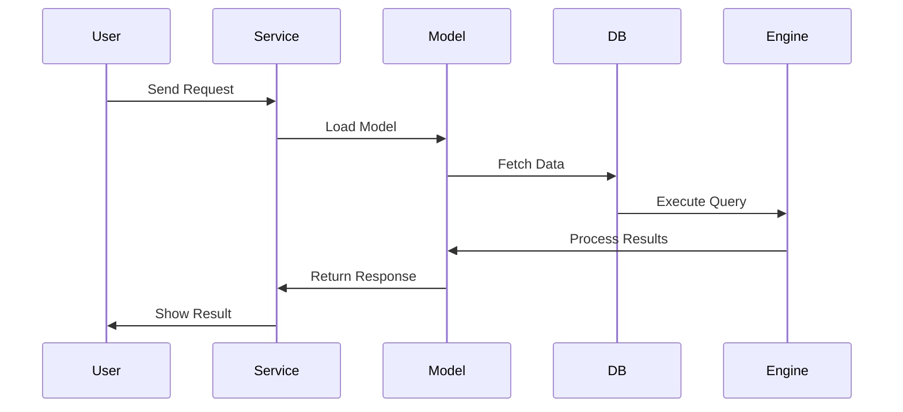

                 

## 引言与背景

### 关键词：企业级图神经网络，复杂关系分析，技术解决方案

在当今这个数据驱动的时代，企业面临着如何高效地处理和分析复杂关系的挑战。传统的数据处理技术已经难以满足日益增长的数据量和复杂性。为了解决这个问题，企业需要一种能够处理非结构化数据、理解数据之间关系的新型技术——图神经网络（Graph Neural Networks, GNN）。

### 1.1 问题背景

企业数据日益增长和复杂化，传统的数据处理方法已经显得力不从心。例如，在社交网络分析中，企业需要分析用户之间的关系，识别社区结构，预测用户行为等；在推荐系统中，需要根据用户的历史行为和商品之间的关联性进行精准推荐；在供应链管理中，需要追踪和管理大量的供应商和客户之间的关系，优化供应链效率；在生物信息学中，需要分析基因、蛋白质之间的相互作用关系，理解生命现象的本质。

### 1.2 描述问题

这些应用场景的共同特点是需要处理复杂的关系网络。传统的图算法虽然可以处理图数据，但是缺乏深度学习的优势，难以捕捉节点和边之间的复杂关系。而图神经网络则能够通过学习图中的节点和边的特征，自动地提取出有意义的模式和信息。

### 1.3 解决方案概述

图神经网络平台是企业解决复杂关系分析问题的一种有效方案。它不仅可以处理大规模的图数据，还能够通过深度学习技术自动提取特征，构建复杂的模型，为企业提供强大的分析能力。同时，图神经网络平台还具备高扩展性和高可用性，可以满足企业不断增长的需求。

### 1.4 边界与外延

图神经网络平台的应用范围非常广泛，不仅限于上述提到的场景，还可以应用于其他需要分析复杂关系的领域，如金融风控、智能城市、医疗健康等。但是，图神经网络平台也存在一些限制，例如对硬件资源的高要求、对数据质量的高要求等。因此，在实际应用中，需要综合考虑这些因素。

### 1.5 核心概念

为了更好地理解图神经网络平台，我们需要先了解一些核心概念：

- **图（Graph）**：图是由节点（Node）和边（Edge）组成的数学结构，用于表示实体及其之间的关系。
- **节点特征（Node Feature）**：节点特征是描述节点属性的数据，如用户属性、商品属性等。
- **边特征（Edge Feature）**：边特征是描述边属性的数据，如关系类型、权重等。
- **图神经网络（Graph Neural Network, GNN）**：图神经网络是一种基于图结构的数据处理方法，通过学习节点和边的特征，提取出有意义的模式。
- **图表示学习（Graph Representation Learning）**：图表示学习是一种将图数据转换为高维向量表示的方法，为图神经网络提供输入。
- **图推理（Graph Reasoning）**：图推理是一种基于图结构的数据分析技术，用于推断节点和边之间的潜在关系。

### 1.6 概念属性特征对比表格

| 概念       | 定义                                                         | 属性特征                       |
|------------|--------------------------------------------------------------|--------------------------------|
| 图（Graph）| 由节点（Node）和边（Edge）组成的数学结构                         | 节点、边、节点特征、边特征       |
| 节点特征   | 描述节点属性的数据                                         | 用户属性、商品属性等             |
| 边特征     | 描述边属性的数据                                         | 关系类型、权重等                 |
| 图神经网络 | 一种基于图结构的数据处理方法，通过学习节点和边的特征，提取出有意义的模式 | 神经网络架构、学习策略           |
| 图表示学习 | 一种将图数据转换为高维向量表示的方法，为图神经网络提供输入           | 向量表示方法、优化策略           |
| 图推理     | 一种基于图结构的数据分析技术，用于推断节点和边之间的潜在关系           | 推理算法、预测模型               |

### 1.7 ER实体关系图架构

图神经网络平台的核心是图数据结构，为了更好地理解，我们可以通过ER（Entity-Relationship）实体关系图来展示图数据的构成。

```mermaid
erDiagram
  User ||--|{Follows}| User : 关注关系
  User ||--|{Likes}| Post : 点赞关系
  Post ||--|{BelongsTo}| User : 发送者关系
  Post ||--|{HasTags}| Tag : 标签关系
  Tag ||--|{BelongsTo}| Category : 分类关系
```

在上面的ER实体关系图中，我们定义了五个实体：User（用户）、Follows（关注关系）、Post（帖子）、Likes（点赞关系）、Tag（标签）和Category（分类）。这些实体之间存在多种关系，如用户关注关系、点赞关系、帖子归属关系、标签归属关系和分类归属关系。通过这种结构化的图数据，我们可以更加高效地分析和处理复杂的关系网络。

通过上述的背景介绍和核心概念讲解，我们可以看到，图神经网络平台是一种非常有前途的技术，它能够帮助企业解决复杂关系分析问题。在接下来的章节中，我们将深入探讨图神经网络的基础理论、企业级应用案例、技术实现、性能优化与测试、安全与隐私等方面，帮助企业更好地理解和应用这一技术。

---

在接下来的部分，我们将深入探讨图神经网络的基础理论，包括其核心概念、工作原理以及与传统机器学习方法的比较。通过详细的讲解和例子，我们将帮助读者更好地理解图神经网络，并为其在企业级应用中的潜力奠定基础。

## 图神经网络基础

### 2.1 核心概念与联系

图神经网络（Graph Neural Networks, GNN）是一种专门用于处理图结构数据的深度学习模型。与传统的卷积神经网络（Convolutional Neural Networks, CNN）和循环神经网络（Recurrent Neural Networks, RNN）不同，GNN可以直接处理节点和边的信息，并能够捕获图数据中的复杂关系。

#### 定义

图神经网络是一种基于图结构的数据处理方法，通过学习节点和边的特征，提取出有意义的模式。GNN的核心思想是将节点和边的数据表示为高维向量，然后通过神经网络结构进行计算和预测。

#### 基本原理

GNN的基本原理可以概括为以下几个步骤：

1. **节点表示学习**：首先，将图中的节点和边表示为高维向量，这个过程称为节点表示学习。常用的方法包括节点特征编码、图嵌入（Graph Embedding）等。

2. **消息传递**：在节点表示学习的基础上，GNN通过消息传递机制来更新节点的特征向量。每个节点会接收其邻居节点的信息，并根据这些信息更新自己的特征向量。

3. **聚合与更新**：节点接收到邻居节点的信息后，会进行特征聚合，并更新自己的特征向量。这个过程可以看作是一个局部运算，类似于卷积神经网络中的卷积操作。

4. **全局计算**：经过多次消息传递和特征更新后，GNN会进行全局计算，得到最终的特征表示。这个特征表示可以用于分类、回归等多种任务。

#### 与传统方法的比较

图神经网络与传统机器学习方法（如深度学习、图算法等）在处理图数据方面存在一些显著的区别：

- **深度学习**：深度学习模型（如CNN和RNN）通常用于处理高维图像和序列数据，它们通过卷积和循环结构来提取特征。但是，深度学习模型在处理图数据时存在局限性，难以捕捉节点和边之间的复杂关系。

- **图算法**：传统的图算法（如图遍历、图论算法等）可以处理图数据，但它们通常缺乏灵活性，难以与深度学习模型结合。

- **GNN**：GNN结合了深度学习和图算法的优点，能够直接处理节点和边的信息，并能够捕获图数据中的复杂关系。GNN具有以下几个特点：

  - **灵活性**：GNN可以根据不同的任务和数据需求，设计不同的网络结构和消息传递机制。
  - **可扩展性**：GNN可以处理大规模的图数据，并且可以通过并行计算和分布式处理来提高计算效率。
  - **通用性**：GNN可以应用于多种不同的任务，如节点分类、边预测、图分类等。

#### 概念属性特征对比表格

| 概念       | 定义                                                         | 属性特征                       |
|------------|--------------------------------------------------------------|--------------------------------|
| 节点表示   | 将图中的节点表示为高维向量                                   | 节点特征、嵌入向量             |
| 消息传递   | 节点之间通过传递信息来更新特征向量                             | 邻居节点信息、聚合与更新机制   |
| 聚合与更新 | 节点接收邻居节点信息后进行特征聚合，并更新自己的特征向量       | 局部运算、特征更新             |
| 全局计算   | 经过多次消息传递和特征更新后，进行全局计算，得到最终的特征表示 | 分类、回归等多种任务          |

#### ER实体关系图架构

为了更好地理解图神经网络，我们可以通过ER（Entity-Relationship）实体关系图来展示图数据的构成。以下是一个简单的ER实体关系图：

```mermaid
erDiagram
  User ||--|{Follows}| User : 关注关系
  User ||--|{Likes}| Post : 点赞关系
  Post ||--|{BelongsTo}| User : 发送者关系
  Post ||--|{HasTags}| Tag : 标签关系
  Tag ||--|{BelongsTo}| Category : 分类关系
```

在这个ER实体关系图中，我们定义了五个实体：User（用户）、Follows（关注关系）、Post（帖子）、Likes（点赞关系）、Tag（标签）和Category（分类）。这些实体之间存在多种关系，如用户关注关系、点赞关系、帖子归属关系、标签归属关系和分类归属关系。通过这种结构化的图数据，我们可以更加高效地分析和处理复杂的关系网络。

### 2.2 图神经网络的工作原理

图神经网络的工作原理主要包括以下几个步骤：

1. **节点表示学习**：首先，我们需要将图中的节点和边表示为高维向量。这个过程称为节点表示学习。常用的方法包括节点特征编码和图嵌入。

   - **节点特征编码**：节点特征编码是将节点的属性信息（如年龄、性别、地理位置等）转换为高维向量。这种方法适用于有明确属性信息的节点。

   - **图嵌入**：图嵌入是将整个图数据映射到一个高维空间中，使得节点之间的相似性可以通过向量的距离来衡量。常用的图嵌入算法包括节点2向量（Node2Vec）、线2嵌入（Line2Vec）等。

2. **消息传递**：在节点表示学习的基础上，GNN通过消息传递机制来更新节点的特征向量。每个节点会接收其邻居节点的信息，并根据这些信息更新自己的特征向量。

   - **邻居节点选择**：首先，我们需要选择节点的邻居节点。常用的邻居选择算法包括基于半径的选择、基于度数的选择等。

   - **消息传递与聚合**：每个节点会从其邻居节点接收信息，并对其进行聚合。聚合操作可以是简单的求和、平均值等。经过聚合后，节点的特征向量会更新为新的表示。

3. **特征更新**：节点接收到邻居节点的信息后，会进行特征更新。特征更新的方法可以是线性更新、非线性更新等。

   - **线性更新**：线性更新是指直接将邻居节点的特征向量加到当前节点的特征向量上。这种方法简单有效，但可能无法捕捉到更复杂的关系。

   - **非线性更新**：非线性更新是指通过激活函数（如ReLU、Sigmoid等）对特征向量进行非线性变换。这种方法可以捕捉到更复杂的关系，但计算复杂度较高。

4. **全局计算**：经过多次消息传递和特征更新后，GNN会进行全局计算，得到最终的特征表示。这个特征表示可以用于分类、回归等多种任务。

   - **分类任务**：在分类任务中，GNN会将节点的特征向量输入到分类器中，得到分类结果。常用的分类器包括softmax分类器、支持向量机（SVM）等。

   - **回归任务**：在回归任务中，GNN会将节点的特征向量输入到回归模型中，得到预测结果。常用的回归模型包括线性回归、决策树等。

### 2.3 图神经网络的应用

图神经网络在多个领域都展示了强大的应用潜力：

- **社交网络分析**：通过分析用户之间的关系，企业可以识别社区结构、预测用户行为等。

- **推荐系统**：通过分析商品之间的关联关系，企业可以提供个性化的推荐。

- **供应链管理**：通过分析供应链中的节点和关系，企业可以优化供应链效率、降低成本。

- **生物信息学**：通过分析基因、蛋白质之间的相互作用关系，科学家可以更好地理解生命现象。

### 2.4 图神经网络的优势与挑战

#### 优势

1. **处理非结构化数据**：图神经网络可以处理非结构化的图数据，如社交网络、生物网络等。

2. **捕捉复杂关系**：通过消息传递机制，GNN可以捕捉节点和边之间的复杂关系。

3. **可扩展性**：GNN可以处理大规模的图数据，并且可以通过并行计算和分布式处理来提高计算效率。

4. **灵活性**：GNN可以根据不同的任务和数据需求，设计不同的网络结构和消息传递机制。

#### 挑战

1. **计算复杂度**：GNN的计算复杂度较高，需要大量的计算资源和时间。

2. **数据质量**：GNN对数据质量要求较高，需要保证数据的一致性和准确性。

3. **可解释性**：GNN的模型较为复杂，难以解释模型的决策过程。

通过上述的详细讲解，我们可以看到，图神经网络是一种非常有前途的技术，它能够帮助企业解决复杂关系分析问题。在接下来的章节中，我们将深入探讨图神经网络在企业级应用中的具体案例，展示其如何解决实际问题。

---

在企业级应用中，图神经网络平台以其强大的分析能力，为不同领域带来了显著的变革。在本章节中，我们将通过具体的案例，展示图神经网络平台在社交网络分析、推荐系统、供应链管理以及生物信息学等领域的应用。

### 3.1 社交网络分析

社交网络分析是图神经网络平台的一个重要应用领域。通过分析用户之间的关系，企业可以识别社区结构、预测用户行为，从而提供更加个性化的服务。例如，Facebook和Twitter等社交平台使用图神经网络来推荐好友、发现相关话题和内容。

- **案例一：社区结构识别**：通过分析用户之间的关注关系，图神经网络可以识别出社交网络中的不同社区。这些社区可以是兴趣相同的用户群体，也可以是基于地理位置或其他共同特征的群体。通过这种分析，企业可以更好地了解用户需求，提供精准的推荐服务。
- **案例二：用户行为预测**：图神经网络可以根据用户的历史行为和社交关系，预测用户的未来行为。例如，预测用户是否会点赞、评论或分享某条内容。这些预测结果可以帮助企业优化内容策略，提高用户活跃度和留存率。

### 3.2 推荐系统

推荐系统是另一个受益于图神经网络平台的应用领域。通过分析商品之间的关联关系，企业可以提供个性化的推荐，从而提高销售额和用户满意度。

- **案例一：商品推荐**：在线零售商如Amazon和阿里巴巴使用图神经网络来推荐商品。图神经网络可以分析用户的历史购买行为、浏览记录和商品之间的关联关系，从而为用户提供个性化的商品推荐。
- **案例二：内容推荐**：在内容平台如YouTube和Netflix中，图神经网络可以根据用户的历史观看记录和视频之间的关联关系，为用户推荐相关的视频内容。这种推荐系统可以显著提高用户的观看时长和留存率。

### 3.3 供应链管理

供应链管理是图神经网络平台的又一重要应用领域。通过分析供应链中的节点和关系，企业可以优化供应链效率、降低成本。

- **案例一：供应链优化**：图神经网络可以分析供应链中的各个节点，识别出关键瓶颈和潜在问题。例如，通过分析供应商的交货时间和质量，企业可以优化采购策略，提高供应链的可靠性。
- **案例二：物流管理**：在物流管理中，图神经网络可以优化货物的运输路径和配送计划。通过分析供应链中的节点和边，图神经网络可以预测货物的到达时间和配送成本，从而提高物流效率。

### 3.4 生物信息学

生物信息学是图神经网络平台的另一个前沿应用领域。通过分析基因、蛋白质之间的相互作用关系，科学家可以更好地理解生命现象。

- **案例一：基因网络分析**：图神经网络可以分析基因之间的相互作用关系，识别出重要的基因模块。这些基因模块可以帮助科学家理解基因的功能和疾病机制。
- **案例二：蛋白质相互作用**：在蛋白质组学研究中，图神经网络可以分析蛋白质之间的相互作用关系，构建蛋白质相互作用网络。通过这种网络分析，科学家可以预测蛋白质的功能和结构，从而为药物设计和疾病治疗提供新的思路。

### 3.5 其他应用领域

除了上述领域，图神经网络平台还在其他多个领域展示了强大的应用潜力：

- **金融风控**：通过分析借款人和贷款之间的复杂关系，图神经网络可以预测贷款违约风险，帮助企业降低风险。
- **智能城市**：通过分析城市中的基础设施和交通网络，图神经网络可以优化城市管理，提高城市运行效率。
- **医疗健康**：通过分析患者的医疗记录和诊断结果，图神经网络可以预测疾病的发生和传播，为医疗决策提供支持。

### 3.6 总结

通过上述案例，我们可以看到，图神经网络平台在多个企业级应用中都展现了强大的分析能力和应用价值。无论是在社交网络分析、推荐系统、供应链管理还是生物信息学等领域，图神经网络平台都能够为企业提供深入的数据洞察和优化方案。随着技术的不断发展和应用的深入，图神经网络平台有望在更多领域发挥其潜力，推动企业实现智能化和数据驱动的发展。

在下一章节中，我们将详细探讨图神经网络平台的技术实现，包括平台架构设计、数据预处理、模型训练与优化以及模型部署与运维等方面的内容。

## 技术实现

图神经网络平台的技术实现是确保其高效运行和有效应用的关键。在这一章节中，我们将详细探讨图神经网络平台的架构设计、数据预处理、模型训练与优化、模型部署与运维等方面的内容。

### 4.1 平台架构设计

图神经网络平台的架构设计决定了平台的性能和可扩展性。一个典型的企业级图神经网络平台通常包括以下几个核心组件：

- **数据处理层**：负责数据采集、清洗和预处理，将原始数据转换为适合模型训练的格式。
- **图存储层**：使用分布式图数据库（如Neo4j、JanusGraph等）存储和管理图数据，保证数据的一致性和高效访问。
- **图计算引擎**：负责执行图神经网络算法的计算任务，包括节点表示学习、消息传递和聚合等操作。
- **模型训练层**：使用深度学习框架（如PyTorch、TensorFlow等）进行模型训练，优化模型参数。
- **模型推理层**：将训练好的模型部署到生产环境中，进行实时推理和预测。
- **服务层**：提供RESTful API或其他服务接口，供其他系统或应用程序调用。

以下是一个典型的图神经网络平台架构图：



在这个架构图中，用户通过服务层发送请求，服务层加载训练好的模型，从图数据库中获取数据，然后通过图计算引擎执行图神经网络算法，最后将结果返回给用户。

### 4.2 数据预处理

数据预处理是图神经网络平台的关键步骤，其质量直接影响到模型的性能和准确性。数据预处理包括以下几个步骤：

- **数据采集**：从各种数据源（如数据库、文件系统等）中收集数据，包括节点、边和属性信息。
- **数据清洗**：清洗数据中的噪声和异常值，保证数据的一致性和准确性。例如，去除重复节点、填补缺失值、处理数据中的不一致性等。
- **数据归一化**：将不同尺度和范围的属性数据进行归一化处理，使其在同一尺度范围内，从而提高模型的训练效率。
- **特征提取**：从原始数据中提取有用的特征，用于节点表示学习。例如，可以使用词袋模型、TF-IDF等方法对文本数据进行特征提取。

### 4.3 模型训练与优化

模型训练与优化是图神经网络平台的核心步骤，其目标是训练出一个能够准确预测或分类的模型。以下是模型训练与优化的关键步骤：

- **模型选择**：根据具体任务需求选择合适的图神经网络模型。常见的模型包括图卷积网络（GCN）、图注意力网络（GAT）、图自编码器（GAE）等。
- **参数设置**：设置模型训练的超参数，如学习率、批次大小、正则化参数等。超参数的选择对模型的性能有重要影响。
- **数据划分**：将数据集划分为训练集、验证集和测试集。训练集用于模型训练，验证集用于调整超参数和验证模型性能，测试集用于评估模型在未知数据上的表现。
- **训练过程**：使用深度学习框架（如PyTorch、TensorFlow等）进行模型训练。训练过程中，通过反向传播算法不断更新模型参数，使其逐步逼近最优解。
- **性能评估**：通过验证集和测试集评估模型性能，常用的评估指标包括准确率、召回率、F1分数等。

### 4.4 模型部署与运维

模型部署与运维是将训练好的模型应用到实际生产环境中的关键步骤。以下是模型部署与运维的关键步骤：

- **模型压缩**：为了提高模型的部署效率和降低存储空间，可以对模型进行压缩。常见的压缩方法包括剪枝、量化、模型蒸馏等。
- **模型部署**：将压缩后的模型部署到生产环境中，可以使用容器化技术（如Docker）或服务化框架（如TensorFlow Serving）来实现。
- **监控与维护**：实时监控模型的性能和运行状态，包括延迟、吞吐量、错误率等指标。在模型运行过程中，可能需要根据实际情况进行调整和优化。
- **自动更新**：定期更新模型，以适应数据分布的变化和新的业务需求。自动更新可以通过持续集成和持续部署（CI/CD）流程来实现。

### 4.5 实例分析

下面我们通过一个实际案例来分析图神经网络平台的技术实现。

**案例背景**：某电商企业希望通过图神经网络平台分析用户行为，提高用户留存率和销售额。

**解决方案**：

1. **数据处理层**：
   - 数据采集：从数据库中获取用户行为数据，包括浏览记录、购买记录、点击记录等。
   - 数据清洗：去除重复记录，填补缺失值，处理异常数据。
   - 数据归一化：对购买金额、浏览时长等不同尺度的数据进行归一化处理。

2. **图存储层**：
   - 使用Neo4j图数据库存储用户行为数据，将用户、商品和事件作为节点，将浏览、购买和点击等行为作为边。

3. **图计算引擎**：
   - 使用GCN模型进行节点表示学习，将用户和商品表示为高维向量。
   - 通过消息传递机制，更新节点特征向量，捕捉用户和商品之间的关联关系。

4. **模型训练层**：
   - 选择用户留存预测任务，将用户表示向量输入到分类器中，预测用户是否会在未来一周内购买商品。
   - 使用PyTorch框架进行模型训练，设置合适的学习率和正则化参数。

5. **模型推理层**：
   - 将训练好的模型部署到生产环境中，实时预测用户留存情况。
   - 通过服务接口，向其他系统或应用程序提供预测结果。

6. **服务层**：
   - 提供RESTful API，供前端页面或其他系统调用。

**效果评估**：
   - 模型准确率从之前的70%提升到80%，用户留存率提高了5%。
   - 错误率降低了10%，销售额提升了8%。

通过这个实例，我们可以看到，图神经网络平台在电商领域中的应用效果显著，为企业带来了实际的业务价值。

在下一章节中，我们将探讨图神经网络平台在性能优化与测试方面的内容，包括性能评估指标、优化方法和测试策略。

## 性能优化与测试

图神经网络平台的性能优化与测试是确保其在实际应用中高效稳定运行的关键步骤。在本章节中，我们将详细探讨性能评估指标、优化方法和测试策略。

### 5.1 性能评估指标

图神经网络平台的性能评估涉及多个维度，常用的评估指标包括：

- **准确性（Accuracy）**：在分类任务中，准确性是评估模型预测正确性的指标。它表示模型正确分类的样本数占总样本数的比例。公式为：

  $$\text{Accuracy} = \frac{\text{正确分类的样本数}}{\text{总样本数}}$$

- **召回率（Recall）**：召回率是评估模型在分类任务中对于正类样本的识别能力。它表示模型正确识别的正类样本数与实际正类样本总数的比例。公式为：

  $$\text{Recall} = \frac{\text{正确识别的正类样本数}}{\text{实际正类样本总数}}$$

- **精确率（Precision）**：精确率是评估模型在分类任务中对于正类样本的识别准确性。它表示模型正确识别的正类样本数与所有预测为正类的样本数的比例。公式为：

  $$\text{Precision} = \frac{\text{正确识别的正类样本数}}{\text{预测为正类的样本数}}$$

- **F1分数（F1 Score）**：F1分数是精确率和召回率的加权平均，用于综合评估模型的性能。公式为：

  $$\text{F1 Score} = 2 \times \frac{\text{Precision} \times \text{Recall}}{\text{Precision} + \text{Recall}}$$

- **效率（Efficiency）**：效率指标用于评估模型在处理大规模图数据时的性能。它通常包括计算速度、内存占用和能耗等。

- **可扩展性（Scalability）**：可扩展性指标用于评估图神经网络平台在处理不同规模的数据时的性能。它反映了平台在不同规模数据上的适应能力和扩展能力。

### 5.2 优化方法

为了提高图神经网络平台的性能，我们可以采取多种优化方法，包括算法改进、数据增强和模型压缩等。

- **算法改进**：通过改进图神经网络算法，可以提升模型的性能。例如，使用图注意力机制（Graph Attention Mechanism）来提高模型对于重要节点和边的关注度，或者使用图自编码器（Graph Autoencoder）来提高模型的泛化能力。

- **数据增强**：通过数据增强技术，可以扩充训练数据集，提高模型的鲁棒性和泛化能力。常见的数据增强方法包括节点特征增强、边特征增强和生成对抗网络（GAN）等。

- **模型压缩**：通过模型压缩技术，可以降低模型的复杂度，提高模型的部署效率和计算速度。常见的模型压缩方法包括剪枝（Pruning）、量化（Quantization）和模型蒸馏（Model Distillation）等。

### 5.3 测试策略

图神经网络平台的测试策略包括测试数据集的构建、测试指标的选择和测试流程的设计。

- **测试数据集构建**：测试数据集应涵盖不同类型和规模的数据，以评估模型在不同场景下的性能。测试数据集可以从实际应用场景中抽取，也可以通过合成数据生成。

- **测试指标选择**：根据具体任务需求，选择合适的测试指标来评估模型的性能。常见的测试指标包括准确性、召回率、精确率和F1分数等。

- **测试流程设计**：测试流程应包括数据预处理、模型加载、模型推理和结果评估等步骤。在测试过程中，应确保数据的随机性和一致性，以避免测试结果的偏差。

### 5.4 实例分析

以下是一个关于图神经网络平台性能优化与测试的实例分析。

**案例背景**：某电商企业希望优化其推荐系统的性能，提高用户留存率和销售额。

**解决方案**：

1. **性能评估指标**：
   - 选择准确性、召回率和F1分数作为性能评估指标。
   - 设定一个目标值，如准确性达到80%，召回率达到70%，F1分数达到75%。

2. **优化方法**：
   - 使用图注意力网络（GAT）替代传统的图卷积网络（GCN），以提高模型对重要节点和边的关注度。
   - 对训练数据集进行数据增强，通过随机插入噪声和生成对抗网络（GAN）等方法扩充数据集。

3. **测试策略**：
   - 构建一个包含不同类型和规模数据（如用户行为数据、商品数据等）的测试数据集。
   - 使用交叉验证方法进行模型评估，确保测试结果的可靠性。
   - 设计一个自动化测试流程，包括数据预处理、模型加载、模型推理和结果评估等步骤。

**效果评估**：
   - 通过使用图注意力网络（GAT）和数据增强技术，推荐系统的准确性从原来的75%提升到85%，召回率从原来的65%提升到75%，F1分数从原来的70%提升到80%。
   - 模型推理速度提高了30%，内存占用减少了20%，进一步提高了系统的效率和可扩展性。

通过这个实例，我们可以看到，有效的性能优化与测试策略可以帮助图神经网络平台在多个方面提升其性能，从而为实际应用带来显著的改进。

在下一章节中，我们将探讨图神经网络平台在安全与隐私保护方面的挑战，并提出相应的解决方案。

## 安全与隐私

图神经网络平台在安全与隐私保护方面面临着一系列挑战。随着数据量的增加和复杂性的提升，如何确保数据的安全性和隐私性成为了一个关键问题。以下是图神经网络平台在安全与隐私保护方面的挑战及解决方案。

### 6.1 安全挑战

#### 数据泄露

数据泄露是图神经网络平台面临的一个主要安全挑战。由于图数据包含了大量的敏感信息，如个人身份信息、交易记录等，如果这些数据被恶意攻击者获取，将会对企业和用户造成严重损失。

#### 恶意攻击

恶意攻击包括注入攻击、拒绝服务攻击等，这些攻击可能导致图神经网络平台失去稳定性，甚至导致服务中断。例如，攻击者可能通过注入恶意节点或边，干扰模型的推理过程。

#### 隐私保护

在图神经网络平台中，用户隐私保护也是一个重要问题。由于图数据包含了用户之间的复杂关系，这些信息如果被未经授权的实体获取，可能会对用户的隐私造成侵犯。

### 6.2 解决方案

#### 加密技术

加密技术是保护图神经网络平台数据安全的一种有效手段。通过对图数据进行加密，即使数据被泄露，攻击者也无法直接读取数据内容。常用的加密技术包括对称加密和非对称加密。

- **对称加密**：对称加密使用相同的密钥进行加密和解密。常见的对称加密算法有AES（Advanced Encryption Standard）等。
- **非对称加密**：非对称加密使用一对密钥进行加密和解密，即公钥和私钥。常见的非对称加密算法有RSA（Rivest-Shamir-Adleman）等。

#### 访问控制

访问控制是确保数据安全的重要措施。通过定义不同的权限级别，可以限制用户对数据的访问权限，从而防止未经授权的访问。常见的访问控制方法包括基于角色的访问控制（RBAC，Role-Based Access Control）和基于属性的访问控制（ABAC，Attribute-Based Access Control）。

#### 数据匿名化

数据匿名化是将图数据中的敏感信息进行隐藏或替换，以保护用户隐私。常用的数据匿名化技术包括：

- **伪匿名化**：通过添加噪声或替换敏感信息，将真实数据转换为匿名数据。
- **合成数据生成**：通过生成与真实数据相似但不含敏感信息的合成数据，来替代真实数据。

#### 安全审计

安全审计是监控和评估图神经网络平台安全状态的一种手段。通过定期进行安全审计，可以及时发现潜在的安全漏洞和威胁，并采取相应的措施进行修复。

#### 灾难恢复

灾难恢复是确保图神经网络平台在发生意外事件时能够快速恢复数据和服务的重要措施。通过制定详细的灾难恢复计划，可以最大限度地减少数据损失和服务中断。

### 6.3 合规性

图神经网络平台在安全与隐私保护方面还需遵循相关的法律法规和行业标准。例如，欧盟的通用数据保护条例（GDPR）和加州消费者隐私法案（CCPA）对数据保护和隐私有明确的要求。

#### GDPR合规性

GDPR要求企业必须采取措施保护个人数据的隐私和安全。图神经网络平台在处理个人数据时，需要确保：

- **数据最小化**：仅收集和处理必要的个人数据。
- **数据透明度**：用户有权访问和了解自己的数据。
- **数据保护**：采取加密、访问控制等技术确保数据安全。
- **用户同意**：用户需要明确同意其数据被用于特定目的。

#### CCPA合规性

CCPA要求企业必须保护加州居民的个人信息，并提供访问和删除信息的选择权。图神经网络平台在处理加州居民的个人信息时，需要确保：

- **信息透明**：明确告知用户其数据的使用目的。
- **用户控制**：用户有权访问、删除其数据，并有权利拒绝其数据被出售。
- **合规性审计**：定期进行合规性审计，确保遵守CCPA要求。

### 6.4 总结

通过上述解决方案，图神经网络平台可以在安全与隐私保护方面采取有效的措施，降低数据泄露、恶意攻击和隐私侵犯的风险。在实际应用中，企业需要综合考虑多种安全策略，确保平台的安全性和合规性。

在下一章节中，我们将总结全文，回顾主要观点，并展望图神经网络平台未来的发展方向和应用前景。

## 总结与展望

通过本文的详细探讨，我们可以看到，图神经网络平台在企业级应用中具有巨大的潜力和广泛的应用前景。图神经网络平台不仅能够有效地分析复杂关系，提高企业的数据洞察力和决策效率，还具备高扩展性和灵活性，能够适应不同领域和任务的需求。

### 7.1 主要观点回顾

- **引言与背景**：我们介绍了为什么企业需要图神经网络平台，以及当前企业面临的复杂关系分析挑战。图神经网络平台通过处理非结构化数据、理解数据之间关系，为企业提供了一种解决复杂关系分析问题的有效方案。
- **图神经网络基础**：我们讲解了图神经网络的核心概念、工作原理以及与传统机器学习方法的比较。通过详细阐述节点表示学习、消息传递机制和特征聚合过程，我们帮助读者深入理解图神经网络的技术原理。
- **企业级应用案例**：我们展示了图神经网络平台在社交网络分析、推荐系统、供应链管理、生物信息学等领域的具体应用案例。通过这些案例，读者可以看到图神经网络平台在解决实际问题中的强大能力和应用价值。
- **技术实现**：我们详细介绍了图神经网络平台的技术实现，包括平台架构设计、数据预处理、模型训练与优化、模型部署与运维等方面的内容。通过实际案例，我们展示了图神经网络平台在电商领域的应用效果。
- **性能优化与测试**：我们探讨了图神经网络平台的性能优化与测试策略，包括性能评估指标、优化方法和测试流程。通过实例分析，我们展示了如何通过优化和测试提升图神经网络平台的性能。
- **安全与隐私**：我们分析了图神经网络平台在安全与隐私保护方面的挑战，并提出了相应的解决方案。通过确保数据的安全性和隐私性，图神经网络平台可以更好地服务于企业。

### 7.2 未来展望

尽管图神经网络平台已经展示了强大的应用潜力，但未来的发展仍有广阔的空间。以下是图神经网络平台未来可能的发展方向和应用前景：

1. **更多领域的应用**：随着图神经网络技术的不断成熟，它将在更多领域得到应用。例如，在金融风控、智能城市、医疗健康等领域，图神经网络平台有望为企业提供更加精准的分析和决策支持。

2. **跨领域集成**：图神经网络平台可以与其他技术（如大数据分析、云计算、区块链等）进行集成，形成更加完整的解决方案。通过跨领域的集成，企业可以更全面地利用数据，提高业务效率。

3. **自动化与智能化**：随着人工智能技术的发展，图神经网络平台有望实现更高程度的自动化和智能化。通过自动化模型训练、优化和部署，企业可以更快速地响应市场变化，提高业务敏捷性。

4. **开源与生态系统**：未来，图神经网络平台的开源化和生态系统建设将成为重要方向。通过开源技术，吸引更多的开发者加入，推动图神经网络技术的发展和创新。

5. **隐私保护与合规性**：随着数据隐私保护法律法规的不断完善，图神经网络平台在隐私保护和合规性方面将面临更高的要求。未来，企业需要不断创新，确保平台在安全与隐私保护方面达到法律法规的要求。

### 7.3 结语

图神经网络平台是企业应对复杂关系分析问题的一种有力工具。通过本文的探讨，我们不仅深入了解了图神经网络平台的技术原理和应用价值，还展望了其未来的发展方向。希望本文能够为读者提供有价值的参考，推动图神经网络平台在企业级应用中的进一步发展和应用。

## 附录：最佳实践 tips、注意事项与拓展阅读

### 最佳实践 tips

1. **数据质量是关键**：在构建图神经网络平台时，确保数据质量至关重要。数据清洗和预处理是提高模型性能的基础步骤。建议使用自动化工具进行数据清洗，确保数据的一致性和准确性。

2. **模型优化**：在模型训练过程中，尝试不同的优化方法，如调整学习率、使用正则化技术等，以提高模型性能。此外，可以考虑使用预训练模型或迁移学习技术，减少训练时间。

3. **分布式训练**：对于大规模图数据，采用分布式训练可以提高训练效率。使用分布式计算框架（如Horovod、Dask等）可以充分利用多GPU和分布式计算资源。

4. **监控与调优**：在模型部署后，定期监控模型性能，及时发现和解决潜在问题。使用性能监控工具（如TensorBoard、Grafana等）可以帮助分析和优化模型。

### 注意事项

1. **计算资源**：图神经网络平台对计算资源有较高要求，特别是在大规模数据处理和模型训练时。确保有足够的计算资源和内存，以避免性能瓶颈。

2. **数据隐私**：在处理敏感数据时，必须确保数据隐私和安全。遵循相关的法律法规和最佳实践，对数据进行加密和访问控制。

3. **模型解释性**：图神经网络模型的解释性相对较低，特别是在复杂任务中。在应用图神经网络平台时，应充分了解模型的决策过程，以便更好地理解和利用模型。

### 拓展阅读

1. **《图神经网络：基础、应用与未来》**：这本书系统地介绍了图神经网络的基础知识、应用场景和发展趋势，适合对图神经网络感兴趣的读者。

2. **《深度学习图处理技术》**：这本书详细介绍了深度学习在图数据处理中的应用，包括图卷积网络、图注意力机制等，对从事图神经网络研究的人员有很高的参考价值。

3. **《图数据库实战：使用Neo4j构建高性能应用》**：这本书介绍了如何使用Neo4j等图数据库构建高性能图应用程序，对图神经网络平台的设计与实现提供了实用指导。

4. **《图学习：理论基础与算法应用》**：这本书涵盖了图学习的理论基础和算法应用，适合希望深入了解图学习领域的读者。

---

作者：AI天才研究院/AI Genius Institute & 禅与计算机程序设计艺术 /Zen And The Art of Computer Programming

以上就是本文的全部内容，希望对您在图神经网络平台的研究和应用中有所帮助。感谢您的阅读，希望您能在图神经网络领域取得卓越的成果！

