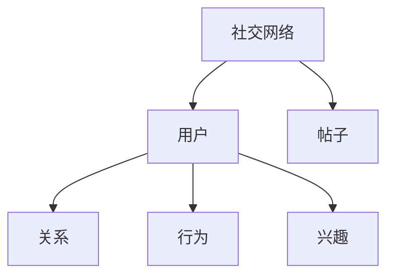
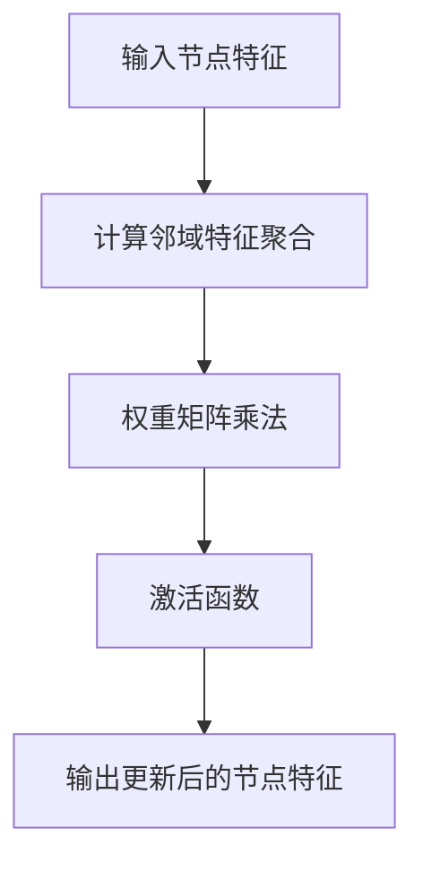
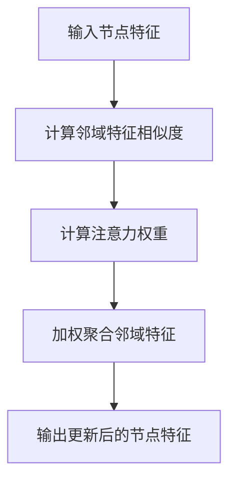
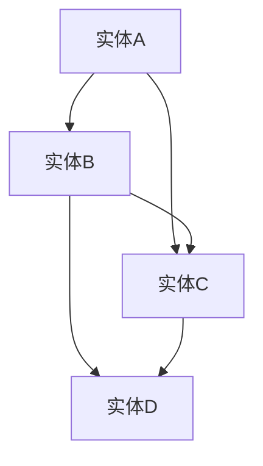
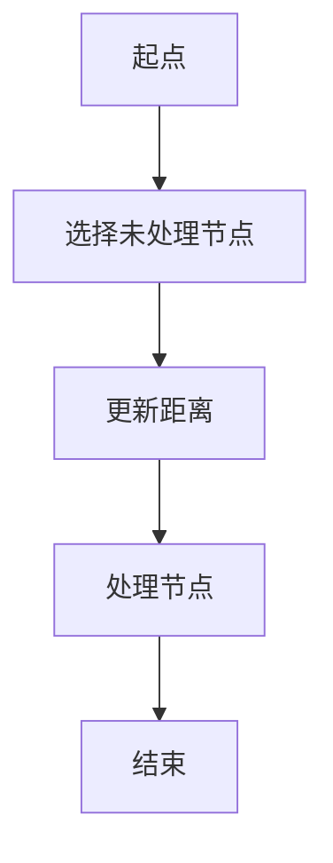
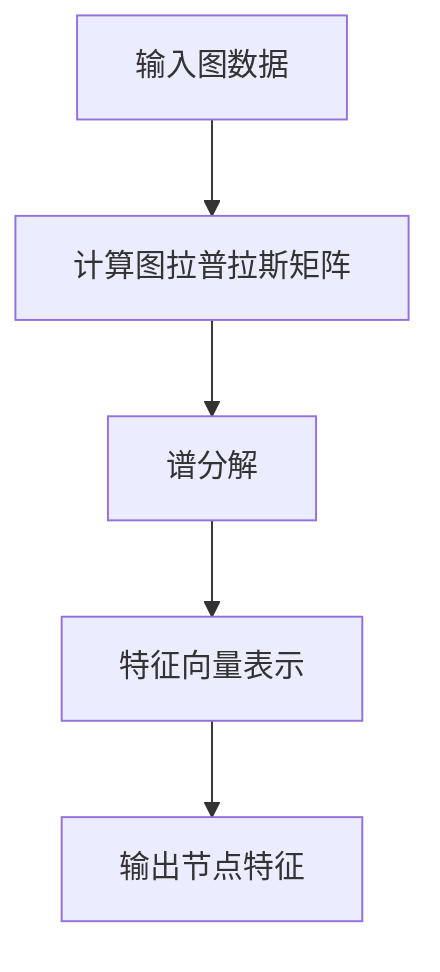
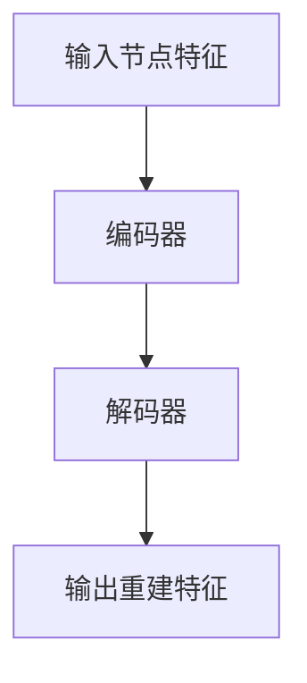
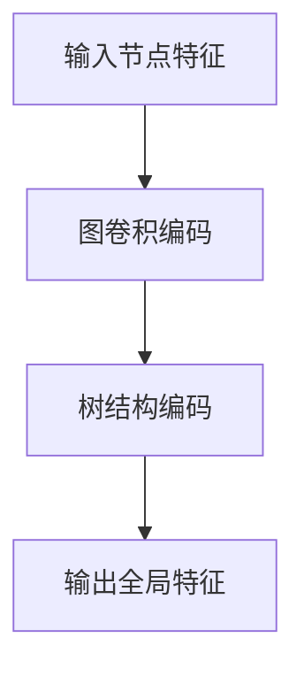
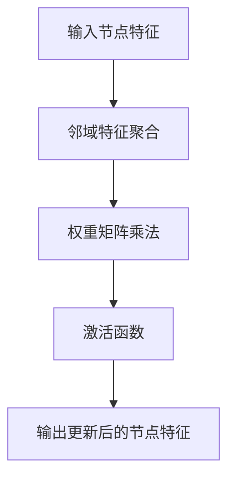
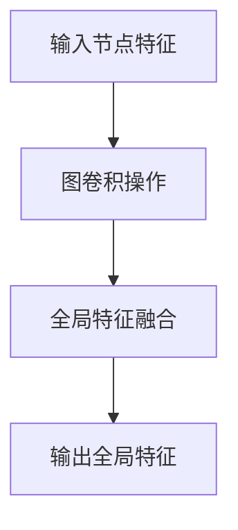

                 


### 第1章 引言与背景

#### 1.1 图神经网络的重要性

**核心概念术语说明**

- **图神经网络（Graph Neural Network, GNN）**：一种基于图结构的神经网络，能够直接从图数据中学习节点和边的关系。
- **图表示学习（Graph Representation Learning）**：将图结构转化为向量表示的过程，使得图上的节点和边能够用数值形式表示。
- **图卷积网络（Graph Convolutional Network, GCN）**：一种图神经网络，通过对邻域节点特征进行聚合来学习节点表示。
- **图注意力网络（Graph Attention Network, GAT）**：一种图神经网络，通过学习节点间的注意力机制来对邻域节点特征进行加权聚合。

**问题背景**

随着互联网的快速发展，企业之间的业务关系变得越来越复杂。传统的基于表结构的数据库已经无法有效处理这些复杂的网络关系。图神经网络作为一种强大的数据分析和处理工具，能够直接从图数据中学习节点和边的关系，从而帮助企业更好地理解和分析业务网络。

**问题描述**

企业面临的主要问题是如何从复杂的业务网络中提取有价值的信息，以便进行决策支持和业务优化。这些信息包括：

- **节点重要性**：识别业务网络中的关键节点，如核心客户或供应商。
- **节点间关系**：分析节点之间的交互关系，如合作关系、竞争关系等。
- **网络结构**：理解整个业务网络的拓扑结构，如社区结构、层次结构等。

**问题解决**

图神经网络能够通过以下几个步骤帮助企业解决上述问题：

1. **数据预处理**：将业务网络数据转换为图结构，包括节点和边的表示。
2. **图表示学习**：通过图神经网络将节点和边转化为向量表示。
3. **关系分析**：利用图神经网络对节点间关系进行分析，提取有价值的信息。
4. **决策支持**：根据分析结果，为企业提供决策支持和业务优化建议。

**边界与外延**

- **图神经网络的应用范围**：图神经网络不仅适用于业务网络分析，还广泛应用于社交网络、推荐系统、知识图谱等领域。
- **图神经网络的发展**：随着计算能力的提升和数据规模的扩大，图神经网络的研究和应用将不断扩展。

**概念结构与核心要素组成**

图神经网络由以下几个核心组成部分构成：

1. **图表示学习**：将图结构转化为向量表示，使得节点和边能够用数值形式表示。
2. **图卷积操作**：通过对邻域节点特征进行聚合来学习节点表示。
3. **注意力机制**：通过学习节点间的注意力机制来对邻域节点特征进行加权聚合。
4. **输出层**：根据任务需求，对节点或边进行分类、预测或评分。

在接下来的章节中，我们将深入探讨图神经网络的基础知识、架构设计、算法原理以及在实际业务中的应用。通过逐步分析推理，我们将为企业级图神经网络平台的开发提供有益的参考和指导。

#### 1.2 图神经网络的应用场景

**核心概念原理**

图神经网络（GNN）的核心原理是基于图结构的数据分析和处理。GNN通过学习图中的节点和边的关系，实现对复杂网络的建模和分析。GNN在多个领域都有着广泛的应用，以下是几个典型的应用场景：

- **社交网络分析**：GNN能够分析社交网络中的用户关系，识别潜在的朋友圈、社区结构，以及用户行为预测等。
- **推荐系统**：通过图神经网络，可以将用户的兴趣和商品的关系建模为图结构，从而实现更精确的推荐。
- **知识图谱**：在知识图谱中，实体和关系构成了一个复杂的图结构，GNN能够有效处理实体间的复杂关系，实现知识抽取和推理。
- **供应链网络**：通过图神经网络，可以分析供应链中的节点关系，优化供应链的效率和成本。

**概念属性特征对比表格**

| 特征类别 | 图神经网络（GNN） | 社交网络分析 | 推荐系统 | 知识图谱 | 供应链网络 |
| :---: | :---: | :---: | :---: | :---: | :---: |
| 数据结构 | 图 | 社交网络图 | 商品图 | 实体-关系图 | 供应链网络图 |
| 学习目标 | 节点表示学习、关系分析 | 用户行为预测、社区识别 | 用户偏好、商品推荐 | 实体关联、知识抽取 | 供应链效率优化、成本控制 |
| 关键技术 | 图卷积网络（GCN）、图注意力网络（GAT） | 图嵌入、社交网络分析算法 | 图嵌入、协同过滤 | 实体-关系建模、知识推理 | 图表示学习、供应链优化算法 |
| 应用场景 | 社交网络、推荐系统、知识图谱、供应链网络 | 用户关系分析、社区挖掘 | 商品推荐、用户兴趣挖掘 | 知识推理、实体关联 | 供应链管理、网络优化 |
| 数据规模 | 大规模图数据 | 大规模社交网络数据 | 大规模商品数据、用户数据 | 大规模知识图谱数据 | 大规模供应链网络数据 |

**ER实体关系图架构的 Mermaid 流程图**



在这个ER实体关系图中，用户（B）与帖子（C）、关系（D）、行为（E）和兴趣（F）之间存在关联。图神经网络可以通过这些实体和关系来学习用户的社交行为和兴趣模式，从而实现社交网络分析。

**算法原理讲解**

**图卷积网络（GCN）**

- **原理**：GCN通过对节点邻域的信息进行聚合，实现对节点表示的更新。每个节点的表示由其自身特征和邻域节点的特征共同决定。

$$
\hat{h}_i^{(l)} = \sigma(\sum_{j \in \mathcal{N}(i)} \alpha_{ij} W^{(l)} h_j^{(l-1)})
$$

其中，$\hat{h}_i^{(l)}$ 是第 $l$ 层第 $i$ 个节点的特征表示，$\mathcal{N}(i)$ 表示节点 $i$ 的邻域节点集合，$\alpha_{ij}$ 是邻接矩阵的元素，$W^{(l)}$ 是权重矩阵，$\sigma$ 是激活函数。

- **流程图**：



**图注意力网络（GAT）**

- **原理**：GAT在GCN的基础上引入了注意力机制，对邻域节点的特征进行加权聚合。每个邻域节点的特征贡献由其与目标节点的相似度决定。

$$
\alpha_{ij}^{(l)} = \frac{\exp(e_{ij}^{(l)})}{\sum_{k \in \mathcal{N}(i)} \exp(e_{ik}^{(l)})},
$$

$$
e_{ij}^{(l)} = a_{\theta}^{(l)} [ \vec{h}_i^{(l-1)}, \vec{h}_j^{(l-1)} ],
$$

其中，$\alpha_{ij}^{(l)}$ 是第 $l$ 层第 $i$ 和第 $j$ 个节点之间的注意力权重，$e_{ij}^{(l)}$ 是节点 $i$ 和节点 $j$ 的相似度评分，$a_{\theta}^{(l)}$ 是注意力函数。

- **流程图**：



通过上述算法原理讲解，我们可以看到GCN和GAT在处理图数据时，如何利用邻域信息和注意力机制来更新节点特征。这些算法的核心在于能够有效地捕捉节点和边之间的复杂关系，从而实现对图数据的深度分析和理解。

在接下来的章节中，我们将继续深入探讨图神经网络的架构设计、算法实现和实际业务应用，为企业级图神经网络平台的开发提供更加详细的指导。

#### 1.3 本书的目的和结构

**目的**

本书旨在为企业级图神经网络（GNN）的开发和应用提供全面的技术指南。具体目标包括：

1. **普及GNN知识**：通过深入讲解GNN的核心概念、原理和算法，帮助读者理解GNN的基础知识。
2. **案例分析**：通过实际案例展示GNN在不同业务场景中的应用，帮助读者掌握GNN的实际应用技巧。
3. **平台开发**：介绍企业级GNN平台的设计与实现方法，提供从理论到实践的完整开发路径。
4. **最佳实践**：总结GNN在企业中的最佳实践，帮助企业更好地利用GNN技术解决复杂业务问题。

**结构**

本书分为以下七个主要部分：

1. **引言与背景**：介绍图神经网络的重要性、应用场景和本书的目的。
2. **GNN基础知识**：讲解图神经网络的核心概念、原理和与相关技术的比较。
3. **图神经网络架构**：介绍常见的图神经网络架构，包括局部模型、全局模型和混合模型。
4. **GNN算法与模型**：详细讲解GNN算法的原理、数学模型和示例。
5. **GNN在实际业务中的应用**：通过具体案例展示GNN在复杂业务关系分析中的应用。
6. **企业级GNN平台开发**：介绍企业级GNN平台的设计、实现和部署。
7. **最佳实践与展望**：总结GNN的最佳实践，分析当前挑战和未来展望。

通过这些章节，本书将系统地引导读者了解和掌握图神经网络在企业级应用中的技术和实践，为企业在复杂业务关系分析中提供强大的技术支持。接下来，我们将逐步深入每个章节的内容，帮助读者全面了解图神经网络的方方面面。

## 第2章 GNN基础知识

### 2.1 图理论基础

**核心概念**

在图神经网络（GNN）的研究和应用中，图理论是一个重要的基础。以下是图理论中的一些核心概念：

- **图（Graph）**：由节点（Node）和边（Edge）组成的集合。节点代表图中的实体，边代表实体间的关系。
- **无向图（Undirected Graph）**：边没有方向的图。例如，社交网络中的朋友关系可以表示为无向图。
- **有向图（Directed Graph）**：边有方向的图。例如，网页之间的链接可以表示为有向图。
- **加权图（Weighted Graph）**：边带有权重的图。例如，供应链网络中的运输成本可以表示为边的权重。
- **节点（Vertex）**：图中的基本元素，通常用来表示实体。
- **边（Edge）**：连接两个节点的元素，通常用来表示实体间的关系。
- **邻接矩阵（Adjacency Matrix）**：用矩阵表示图结构，其中矩阵元素表示节点之间的连接关系。
- **路径（Path）**：图中从一个节点到另一个节点的序列。
- **连通性（Connectivity）**：图中任意两个节点之间是否存在路径。

**ER实体关系图架构的 Mermaid 流程图**



在这个ER实体关系图中，实体A、B、C和D之间存在多种关系。通过这样的图结构，我们可以有效地表示和分析实体间的复杂关系。

**算法原理讲解**

**最短路径算法**

最短路径算法用于找到图中两个节点之间的最短路径。以下是Dijkstra算法的原理：

1. **初始化**：将所有节点的距离初始化为无穷大，将起点的距离初始化为0。
2. **选择未处理的节点**：选择未处理的节点中距离最小的节点。
3. **更新距离**：对于该节点的每个邻接节点，如果通过当前节点到达邻接节点的距离小于当前已知的距离，则更新邻接节点的距离。
4. **重复步骤2和3**，直到所有节点都被处理。

**流程图**：



**数学模型和公式**

$$
d(u, v) = \min_{p} \{ \sum_{i \in p} w(i, i+1) \}
$$

其中，$d(u, v)$ 是从节点 $u$ 到节点 $v$ 的最短路径长度，$p$ 是从 $u$ 到 $v$ 的路径，$w(i, i+1)$ 是路径上的边的权重。

通过上述算法原理讲解，我们可以看到如何通过图理论和最短路径算法来分析和处理图数据。这些基础知识和算法为图神经网络的研究和应用提供了重要的理论基础。

在接下来的章节中，我们将继续深入探讨图神经网络的核心概念、原理和算法，为读者提供更全面的图神经网络知识体系。

### 2.2 GNN的核心概念

**核心概念**

图神经网络（GNN）是一种专门用于处理图结构数据的神经网络。与传统的基于表结构的神经网络不同，GNN能够直接从图结构中学习节点和边的关系，从而实现对复杂网络的建模和分析。以下是GNN的核心概念：

- **节点表示（Node Representation）**：将图中的节点转化为向量表示，使得节点能够用数值形式表示。
- **边表示（Edge Representation）**：将图中的边转化为向量表示，使得边能够用数值形式表示。
- **图卷积操作（Graph Convolution）**：通过对节点邻域的信息进行聚合，实现对节点表示的更新。
- **图注意力机制（Graph Attention Mechanism）**：通过学习节点间的注意力机制，对邻域节点特征进行加权聚合。
- **图嵌入（Graph Embedding）**：将整个图结构转化为向量表示，使得图上的节点和边能够用数值形式表示。

**ER实体关系图架构的 Mermaid 流程图**


在这个ER实体关系图中，节点A、B、C和D之间存在多种关系。通过这样的图结构，我们可以有效地表示和分析实体间的复杂关系。

**算法原理讲解**

**图卷积网络（GCN）**

- **原理**：GCN通过对节点邻域的信息进行聚合来学习节点表示。具体来说，GCN使用图卷积操作来更新节点的特征表示。

$$
\hat{h}_i^{(l)} = \sigma(\sum_{j \in \mathcal{N}(i)} \alpha_{ij} W^{(l)} h_j^{(l-1)})
$$

其中，$\hat{h}_i^{(l)}$ 是第 $l$ 层第 $i$ 个节点的特征表示，$\mathcal{N}(i)$ 表示节点 $i$ 的邻域节点集合，$\alpha_{ij}$ 是邻接矩阵的元素，$W^{(l)}$ 是权重矩阵，$\sigma$ 是激活函数。

- **流程图**：


**图注意力网络（GAT）**

- **原理**：GAT在GCN的基础上引入了注意力机制，对邻域节点的特征进行加权聚合。每个邻域节点的特征贡献由其与目标节点的相似度决定。

$$
\alpha_{ij}^{(l)} = \frac{\exp(e_{ij}^{(l)})}{\sum_{k \in \mathcal{N}(i)} \exp(e_{ik}^{(l)})},
$$

$$
e_{ij}^{(l)} = a_{\theta}^{(l)} [ \vec{h}_i^{(l-1)}, \vec{h}_j^{(l-1)} ],
$$

其中，$\alpha_{ij}^{(l)}$ 是第 $l$ 层第 $i$ 和第 $j$ 个节点之间的注意力权重，$e_{ij}^{(l)}$ 是节点 $i$ 和节点 $j$ 的相似度评分，$a_{\theta}^{(l)}$ 是注意力函数。

- **流程图**：


通过上述算法原理讲解，我们可以看到GCN和GAT在处理图数据时，如何利用邻域信息和注意力机制来更新节点特征。这些算法的核心在于能够有效地捕捉节点和边之间的复杂关系，从而实现对图数据的深度分析和理解。

在接下来的章节中，我们将继续深入探讨图神经网络的架构设计、算法实现和实际业务应用，为企业级图神经网络平台的开发提供更加详细的指导。

### 2.3 GNN与相关技术比较

**核心概念**

图神经网络（GNN）作为处理图结构数据的一种深度学习技术，与传统的机器学习方法以及其他图结构处理技术有着显著的差异。以下是几种与GNN相关的技术及其核心概念：

- **邻接矩阵**：一种用矩阵形式表示图结构的方法，其中矩阵元素表示节点之间的连接关系。
- **谱图嵌入**：通过谱分解将图转化为低维向量表示，使得节点和边能够用数值形式表示。
- **图卷积网络（GCN）**：通过图卷积操作来更新节点的特征表示。
- **图注意力网络（GAT）**：在GCN的基础上引入注意力机制，对邻域节点的特征进行加权聚合。
- **图卷积树（GCT）**：结合图卷积和树结构，实现对图数据的层次化建模。
- **图神经网络（GNN）**：一种专门用于处理图结构数据的神经网络，能够直接从图结构中学习节点和边的关系。

**概念属性特征对比表格**

| 特征类别 | GNN | 谱图嵌入 | 图卷积网络（GCN） | 图注意力网络（GAT） | 图卷积树（GCT） |
| :---: | :---: | :---: | :---: | :---: | :---: |
| 数据结构 | 图结构数据 | 图结构数据 | 图结构数据 | 图结构数据 | 图结构数据 |
| 学习目标 | 节点表示学习、关系分析 | 节点表示学习 | 节点表示学习、关系分析 | 节点表示学习、关系分析 | 节点表示学习、关系分析 |
| 学习方法 | 神经网络方法 | 谱分解方法 | 神经网络方法 | 神经网络方法 | 神经网络方法 |
| 优点 | 直接从图结构中学习、灵活性高、适用于多种图结构 | 维度降低、适用于大规模图、理论基础强 | 适用于节点表示学习、能够处理异构图 | 适用于节点表示学习、能够处理异构图、引入注意力机制 | 适用于节点表示学习、能够处理异构图、引入层次化结构 |
| 缺点 | 计算复杂度高、对稀疏图处理能力有限 | 对大规模图处理能力有限、依赖谱分解算法 | 对大规模图处理能力有限、依赖图卷积操作 | 对大规模图处理能力有限、依赖图卷积操作 | 对大规模图处理能力有限、依赖图卷积操作 |

**算法原理讲解**

**谱图嵌入**

- **原理**：谱图嵌入通过谱分解将图转化为低维向量表示，使得节点和边能够用数值形式表示。具体来说，谱图嵌入使用图拉普拉斯矩阵进行谱分解，将节点表示为特征向量。

$$
L = D - A,
$$

$$
U = \text{Eigen}(L),
$$

$$
\vec{h}_i = \sum_{j=1}^{n} \lambda_j u_{ij} \vec{v}_j,
$$

其中，$L$ 是图拉普拉斯矩阵，$D$ 是对角矩阵表示节点的度，$A$ 是邻接矩阵，$U$ 是特征向量矩阵，$\lambda_j$ 是特征值，$\vec{v}_j$ 是特征向量。

- **流程图**：



**图卷积网络（GCN）**

- **原理**：GCN通过对节点邻域的信息进行聚合来学习节点表示。具体来说，GCN使用图卷积操作来更新节点的特征表示。

$$
\hat{h}_i^{(l)} = \sigma(\sum_{j \in \mathcal{N}(i)} \alpha_{ij} W^{(l)} h_j^{(l-1)})
$$

其中，$\hat{h}_i^{(l)}$ 是第 $l$ 层第 $i$ 个节点的特征表示，$\mathcal{N}(i)$ 表示节点 $i$ 的邻域节点集合，$\alpha_{ij}$ 是邻接矩阵的元素，$W^{(l)}$ 是权重矩阵，$\sigma$ 是激活函数。

- **流程图**：


**图注意力网络（GAT）**

- **原理**：GAT在GCN的基础上引入了注意力机制，对邻域节点的特征进行加权聚合。每个邻域节点的特征贡献由其与目标节点的相似度决定。

$$
\alpha_{ij}^{(l)} = \frac{\exp(e_{ij}^{(l)})}{\sum_{k \in \mathcal{N}(i)} \exp(e_{ik}^{(l)})},
$$

$$
e_{ij}^{(l)} = a_{\theta}^{(l)} [ \vec{h}_i^{(l-1)}, \vec{h}_j^{(l-1)} ],
$$

其中，$\alpha_{ij}^{(l)}$ 是第 $l$ 层第 $i$ 和第 $j$ 个节点之间的注意力权重，$e_{ij}^{(l)}$ 是节点 $i$ 和节点 $j$ 的相似度评分，$a_{\theta}^{(l)}$ 是注意力函数。

- **流程图**：


通过上述算法原理讲解，我们可以看到GNN、谱图嵌入、GCN和GAT在处理图数据时的不同方法和原理。每种技术都有其独特的优势和应用场景，选择合适的技术取决于具体问题和数据特点。

在接下来的章节中，我们将继续深入探讨图神经网络的架构设计、算法实现和实际业务应用，为企业级图神经网络平台的开发提供更加详细的指导。

## 第3章 图神经网络架构

### 3.1 局部模型

**核心概念**

局部模型（Local Models）是一类专门针对图结构数据设计的神经网络模型，其主要特点是处理过程中的数据依赖性较强，通常关注于节点的邻域信息。以下是几种常见的局部模型：

- **图卷积网络（GCN）**：通过图卷积操作对节点邻域的信息进行聚合。
- **图注意力网络（GAT）**：在GCN的基础上引入注意力机制，对邻域节点的特征进行加权聚合。
- **图自编码器（GAE）**：通过自编码器结构对节点进行嵌入，学习节点的表示。

**ER实体关系图架构的 Mermaid 流程图**


在这个ER实体关系图中，局部模型将重点关注节点A、B、C和D之间的邻域关系。

**算法原理讲解**

**图卷积网络（GCN）**

- **原理**：GCN通过对节点邻域的信息进行聚合来学习节点表示。具体来说，GCN使用图卷积操作来更新节点的特征表示。

$$
\hat{h}_i^{(l)} = \sigma(\sum_{j \in \mathcal{N}(i)} \alpha_{ij} W^{(l)} h_j^{(l-1)})
$$

其中，$\hat{h}_i^{(l)}$ 是第 $l$ 层第 $i$ 个节点的特征表示，$\mathcal{N}(i)$ 表示节点 $i$ 的邻域节点集合，$\alpha_{ij}$ 是邻接矩阵的元素，$W^{(l)}$ 是权重矩阵，$\sigma$ 是激活函数。

- **流程图**：


**图注意力网络（GAT）**

- **原理**：GAT在GCN的基础上引入了注意力机制，对邻域节点的特征进行加权聚合。每个邻域节点的特征贡献由其与目标节点的相似度决定。

$$
\alpha_{ij}^{(l)} = \frac{\exp(e_{ij}^{(l)})}{\sum_{k \in \mathcal{N}(i)} \exp(e_{ik}^{(l)})},
$$

$$
e_{ij}^{(l)} = a_{\theta}^{(l)} [ \vec{h}_i^{(l-1)}, \vec{h}_j^{(l-1)} ],
$$

其中，$\alpha_{ij}^{(l)}$ 是第 $l$ 层第 $i$ 和第 $j$ 个节点之间的注意力权重，$e_{ij}^{(l)}$ 是节点 $i$ 和节点 $j$ 的相似度评分，$a_{\theta}^{(l)}$ 是注意力函数。

- **流程图**：


**图自编码器（GAE）**

- **原理**：GAE通过自编码器结构对节点进行嵌入，学习节点的表示。具体来说，GAE包括编码器和解码器两部分，编码器将节点特征编码为低维向量，解码器尝试重建原始特征。

$$
\hat{h}_i^{(l)} = \sigma(W_e h_i^{(l-1)} + b_e),
$$

$$
h_i^{(l)} = \sigma(W_d \hat{h}_i^{(l)} + b_d),
$$

其中，$h_i^{(l)}$ 是第 $l$ 层第 $i$ 个节点的特征表示，$\hat{h}_i^{(l)}$ 是编码后的特征表示，$W_e$ 和 $W_d$ 是权重矩阵，$b_e$ 和 $b_d$ 是偏置项，$\sigma$ 是激活函数。

- **流程图**：



通过上述算法原理讲解，我们可以看到局部模型如何通过邻域信息聚合和注意力机制来学习节点表示。这些模型在处理局部信息时表现出色，能够有效地捕捉节点和边之间的复杂关系。

### 3.2 全局模型

**核心概念**

全局模型（Global Models）是一类针对全局信息设计的神经网络模型，其特点是能够捕捉图结构中的全局依赖关系。以下是几种常见的全局模型：

- **图卷积树（GCT）**：结合图卷积和树结构，实现对图数据的层次化建模。
- **图自回归模型（GAR）**：通过自回归的方式建模节点间的依赖关系。
- **图卷积流（GCFlow）**：利用图卷积和流模型结合，实现全局信息的传递和融合。

**ER实体关系图架构的 Mermaid 流程图**


在这个ER实体关系图中，全局模型将关注整个图结构中的全局依赖关系。

**算法原理讲解**

**图卷积树（GCT）**

- **原理**：GCT结合图卷积和树结构，实现对图数据的层次化建模。具体来说，GCT首先使用图卷积操作对节点进行编码，然后将编码后的节点特征表示为树结构中的叶子节点。

$$
\hat{h}_i^{(l)} = \sigma(\sum_{j \in \mathcal{N}(i)} W_g h_j^{(l-1)})
$$

$$
h_i^{(l)} = f_l(h_i^{(l-1)}, \hat{h}_i^{(l)})
$$

其中，$\hat{h}_i^{(l)}$ 是第 $l$ 层第 $i$ 个节点的全局特征表示，$h_i^{(l)}$ 是第 $l$ 层第 $i$ 个节点的局部特征表示，$W_g$ 是权重矩阵，$f_l$ 是树结构编码函数。

- **流程图**：



**图自回归模型（GAR）**

- **原理**：GAR通过自回归的方式建模节点间的依赖关系。具体来说，GAR在每个时间步上预测当前节点及其邻域节点的特征，从而构建全局依赖关系。

$$
h_i^{(t)} = \sigma(W_a h_i^{(t-1)} + W_r \sum_{j \in \mathcal{N}(i)} h_j^{(t-1)})
$$

其中，$h_i^{(t)}$ 是第 $t$ 步第 $i$ 个节点的特征表示，$W_a$ 和 $W_r$ 是权重矩阵。

- **流程图**：



**图卷积流（GCFlow）**

- **原理**：GCFlow利用图卷积和流模型结合，实现全局信息的传递和融合。具体来说，GCFlow通过图卷积操作传递信息，并通过流模型融合全局信息。

$$
h_i^{(l)} = \sigma(W_g h_i^{(l-1)} + \sum_{j \in \mathcal{N}(i)} W_f h_j^{(l-1)})
$$

$$
f_i^{(l)} = \text{MLP}(h_i^{(l)}, \theta),
$$

其中，$h_i^{(l)}$ 是第 $l$ 层第 $i$ 个节点的特征表示，$f_i^{(l)}$ 是第 $l$ 层第 $i$ 个节点的全局特征表示，$W_g$ 和 $W_f$ 是权重矩阵，$\theta$ 是流模型参数。

- **流程图**：



通过上述算法原理讲解，我们可以看到全局模型如何通过全局依赖关系和层次化结构来建模图数据。这些模型在处理全局信息时表现出色，能够有效地捕捉图结构中的复杂关系。

### 3.3 混合模型

**核心概念**

混合模型（Hybrid Models）是结合局部模型和全局模型的优势，实现对图数据的高效建模和分析。以下是几种常见的混合模型：

- **图卷积与图自回归结合（GCAR）**：将图卷积操作与自回归模型结合，同时利用局部和全局信息。
- **图注意力与图卷积结合（GAT-GCN）**：将图注意力机制与图卷积网络结合，提升模型的表达能力。
- **图卷积与图卷积流结合（GC-GCFlow）**：将图卷积操作与图卷积流模型结合，实现全局和局部信息的融合。

**ER实体关系图架构的 Mermaid 流程图**


在这个ER实体关系图中，混合模型将同时关注局部和全局信息。

**算法原理讲解**

**图卷积与图自回归结合（GCAR）**

- **原理**：GCAR结合图卷积操作和自回归模型，同时利用局部和全局信息。具体来说，GCAR首先通过图卷积操作更新节点的局部特征，然后通过自回归模型预测全局特征。

$$
\hat{h}_i^{(l)} = \sigma(\sum_{j \in \mathcal{N}(i)} W_g h_j^{(l-1)})
$$

$$
h_i^{(l)} = \text{AR}(h_i^{(l-1)}, \hat{h}_i^{(l)})
$$

其中，$\hat{h}_i^{(l)}$ 是第 $l$ 层第 $i$ 个节点的全局特征表示，$h_i^{(l)}$ 是第 $l$ 层第 $i$ 个节点的特征表示，$W_g$ 是权重矩阵。

- **流程图**：

```mermaid
graph TD
A[输入节点特征] --> B[图卷积操作]
B --> C[自回归预测]
C --> D[输出更新后的节点特征]
```

**图注意力与图卷积结合（GAT-GCN）**

- **原理**：GAT-GCN结合图注意力机制和图卷积网络，提升模型的表达能力。具体来说，GAT-GCN首先使用图卷积操作聚合邻域信息，然后通过注意力机制加权聚合。

$$
\alpha_{ij}^{(l)} = \frac{\exp(e_{ij}^{(l)})}{\sum_{k \in \mathcal{N}(i)} \exp(e_{ik}^{(l)})},
$$

$$
e_{ij}^{(l)} = a_{\theta}^{(l)} [ \vec{h}_i^{(l-1)}, \vec{h}_j^{(l-1)} ],
$$

$$
\hat{h}_i^{(l)} = \sigma(\sum_{j \in \mathcal{N}(i)} \alpha_{ij}^{(l)} W^{(l)} h_j^{(l-1)})
$$

其中，$\alpha_{ij}^{(l)}$ 是第 $l$ 层第 $i$ 和第 $j$ 个节点之间的注意力权重，$e_{ij}^{(l)}$ 是节点 $i$ 和节点 $j$ 的相似度评分，$W^{(l)}$ 是权重矩阵。

- **流程图**：

```mermaid
graph TD
A[输入节点特征] --> B[计算邻域特征相似度]
B --> C[计算注意力权重]
C --> D[加权聚合邻域特征]
D --> E[输出更新后的节点特征]
```

**图卷积与图卷积流结合（GC-GCFlow）**

- **原理**：GC-GCFlow将图卷积操作与图卷积流模型结合，实现全局和局部信息的融合。具体来说，GC-GCFlow首先通过图卷积操作传递局部信息，然后通过图卷积流模型融合全局信息。

$$
h_i^{(l)} = \text{MLP}(\hat{h}_i^{(l-1)}, \theta),
$$

$$
\hat{h}_i^{(l)} = \sigma(\sum_{j \in \mathcal{N}(i)} W_f h_j^{(l-1)})
$$

其中，$h_i^{(l)}$ 是第 $l$ 层第 $i$ 个节点的特征表示，$\hat{h}_i^{(l)}$ 是第 $l$ 层第 $i$ 个节点的全局特征表示，$W_f$ 是权重矩阵，$\theta$ 是流模型参数。

- **流程图**：

```mermaid
graph TD
A[输入节点特征] --> B[图卷积操作]
B --> C[全局特征融合]
C --> D[输出全局特征]
```

通过上述算法原理讲解，我们可以看到混合模型如何结合局部和全局信息，实现对图数据的深度建模和分析。这些模型在处理复杂图数据时表现出色，能够有效地捕捉节点和边之间的复杂关系。

## 第4章 GNN算法与模型

### 4.1 GNN算法原理

**核心概念**

图神经网络（GNN）是一类专门用于处理图结构数据的深度学习算法。GNN通过学习图中的节点和边的关系，实现对图数据的深度分析和理解。以下是GNN算法的基本原理：

- **节点特征学习**：GNN通过图卷积操作学习节点的特征表示，将原始节点特征转化为高维特征向量。
- **边特征学习**：GNN通过学习边特征，将边的信息纳入节点的特征表示中，从而更全面地描述图结构。
- **节点间关系建模**：GNN通过聚合邻域节点信息，建模节点之间的关系，从而捕捉图结构的复杂关系。
- **全局信息融合**：GNN通过全局信息聚合，将局部信息整合为全局视图，从而实现对图结构的全局理解。

**ER实体关系图架构的 Mermaid 流程图**

```mermaid
graph TB
A[节点A] --> B[节点B]
A --> C[节点C]
B --> C
B --> D[节点D]
C --> D
```

在这个ER实体关系图中，GNN算法将学习节点A、B、C和D的特征表示及其之间的关系。

**算法原理讲解**

**图卷积操作**

- **原理**：图卷积操作是GNN的核心组成部分，用于学习节点的特征表示。具体来说，图卷积操作通过对节点邻域的信息进行聚合，将节点的原始特征转化为高维特征向量。

$$
\hat{h}_i^{(l)} = \sigma(\sum_{j \in \mathcal{N}(i)} \alpha_{ij} W^{(l)} h_j^{(l-1)})
$$

其中，$\hat{h}_i^{(l)}$ 是第 $l$ 层第 $i$ 个节点的特征表示，$\mathcal{N}(i)$ 表示节点 $i$ 的邻域节点集合，$\alpha_{ij}$ 是邻接矩阵的元素，$W^{(l)}$ 是权重矩阵，$\sigma$ 是激活函数。

- **流程图**：

```mermaid
graph TD
A[输入节点特征] --> B[计算邻域特征聚合]
B --> C[权重矩阵乘法]
C --> D[激活函数]
D --> E[输出更新后的节点特征]
```

**图注意力机制**

- **原理**：图注意力机制是GNN中的一种重要机制，用于加权聚合邻域节点的特征。具体来说，图注意力机制通过对节点间的相似度进行评分，为每个邻域节点的特征贡献赋予不同的权重。

$$
\alpha_{ij}^{(l)} = \frac{\exp(e_{ij}^{(l)})}{\sum_{k \in \mathcal{N}(i)} \exp(e_{ik}^{(l)})},
$$

$$
e_{ij}^{(l)} = a_{\theta}^{(l)} [ \vec{h}_i^{(l-1)}, \vec{h}_j^{(l-1)} ],
$$

其中，$\alpha_{ij}^{(l)}$ 是第 $l$ 层第 $i$ 和第 $j$ 个节点之间的注意力权重，$e_{ij}^{(l)}$ 是节点 $i$ 和节点 $j$ 的相似度评分，$a_{\theta}^{(l)}$ 是注意力函数。

- **流程图**：

```mermaid
graph TD
A[输入节点特征] --> B[计算邻域特征相似度]
B --> C[计算注意力权重]
C --> D[加权聚合邻域特征]
D --> E[输出更新后的节点特征]
```

**全局信息聚合**

- **原理**：全局信息聚合是GNN中的一种机制，用于将局部信息整合为全局视图。具体来说，全局信息聚合通过对整个图的邻域信息进行聚合，实现对图结构的全局理解。

$$
h_i^{(l)} = \sum_{j \in \mathcal{N}(i)} \alpha_{ij}^{(l)} h_j^{(l-1)}
$$

其中，$h_i^{(l)}$ 是第 $l$ 层第 $i$ 个节点的特征表示，$\alpha_{ij}^{(l)}$ 是第 $l$ 层第 $i$ 和第 $j$ 个节点之间的注意力权重。

- **流程图**：

```mermaid
graph TD
A[输入节点特征] --> B[计算全局特征聚合]
B --> C[输出全局特征]
```

通过上述算法原理讲解，我们可以看到GNN如何通过图卷积操作、图注意力机制和全局信息聚合来学习图数据的特征表示和关系建模。这些原理构成了GNN算法的核心，使其能够有效地处理复杂的图结构数据。

### 4.2 GNN数学模型

**核心概念**

GNN的数学模型是其理论基础，描述了图神经网络中各层的运算规则和参数更新机制。以下是GNN数学模型的核心组成部分：

- **节点表示**：节点在图中的特征表示，通常为一个高维向量。
- **边表示**：边在图中的特征表示，用于描述节点之间的关系。
- **图卷积操作**：用于聚合邻域节点的特征信息，更新节点的特征表示。
- **激活函数**：用于引入非线性变换，增强模型的非线性表达能力。
- **反向传播**：用于在训练过程中更新模型参数。

**ER实体关系图架构的 Mermaid 流程图**

```mermaid
graph TB
A[节点A] --> B[节点B]
A --> C[节点C]
B --> C
B --> D[节点D]
C --> D
```

在这个ER实体关系图中，GNN的数学模型将描述节点A、B、C和D之间的特征表示和关系建模过程。

**算法原理讲解**

**节点表示**

- **原理**：节点表示是GNN的核心组成部分，用于描述图中的每个节点。通常，节点的初始特征表示可以通过特征工程或预训练模型获得。

$$
\vec{h}_i^{(0)} = \vec{x}_i,
$$

其中，$\vec{h}_i^{(0)}$ 是第 $0$ 层第 $i$ 个节点的特征表示，$\vec{x}_i$ 是节点 $i$ 的原始特征。

- **流程图**：

```mermaid
graph TD
A[输入节点特征] --> B[节点初始表示]
```

**图卷积操作**

- **原理**：图卷积操作用于聚合邻域节点的特征信息，更新节点的特征表示。具体来说，图卷积操作通过对邻域节点的特征进行加权平均或点积操作来实现。

$$
\hat{h}_i^{(l)} = \sigma(\sum_{j \in \mathcal{N}(i)} \alpha_{ij}^{(l)} W^{(l)} h_j^{(l-1)})
$$

其中，$\hat{h}_i^{(l)}$ 是第 $l$ 层第 $i$ 个节点的特征表示，$\alpha_{ij}^{(l)}$ 是第 $l$ 层第 $i$ 和第 $j$ 个节点之间的注意力权重，$W^{(l)}$ 是权重矩阵，$\sigma$ 是激活函数。

- **流程图**：

```mermaid
graph TD
A[输入节点特征] --> B[计算邻域特征聚合]
B --> C[权重矩阵乘法]
C --> D[激活函数]
D --> E[输出更新后的节点特征]
```

**激活函数**

- **原理**：激活函数用于引入非线性变换，增强模型的非线性表达能力。常见的激活函数包括ReLU、Sigmoid、Tanh等。

$$
\sigma(\vec{z}) = \text{ReLU}(\vec{z}) = \max(0, \vec{z}),
$$

$$
\sigma(\vec{z}) = \text{Sigmoid}(\vec{z}) = \frac{1}{1 + \exp(-\vec{z})},
$$

$$
\sigma(\vec{z}) = \text{Tanh}(\vec{z}) = \frac{\exp(\vec{z}) - \exp(-\vec{z})}{\exp(\vec{z}) + \exp(-\vec{z})}.
$$

- **流程图**：

```mermaid
graph TD
A[输入特征] --> B[激活函数]
```

**反向传播**

- **原理**：反向传播是训练GNN的重要机制，用于更新模型参数。具体来说，反向传播通过计算损失函数的梯度，并利用梯度下降法来优化模型参数。

$$
\delta^{(l)}_i = \frac{\partial L}{\partial \hat{h}_i^{(l)}},
$$

$$
\frac{\partial L}{\partial W^{(l)}} = \delta^{(l)}_i \cdot h_j^{(l-1)} \cdot \alpha_{ij}^{(l)},
$$

$$
\frac{\partial L}{\partial b^{(l)}} = \delta^{(l)}_i.
$$

其中，$L$ 是损失函数，$\delta^{(l)}_i$ 是第 $l$ 层第 $i$ 个节点的梯度，$\hat{h}_i^{(l)}$ 是第 $l$ 层第 $i$ 个节点的特征表示，$h_j^{(l-1)}$ 是第 $l-1$ 层第 $j$ 个节点的特征表示，$\alpha_{ij}^{(l)}$ 是第 $l$ 层第 $i$ 和第 $j$ 个节点之间的注意力权重。

- **流程图**：

```mermaid
graph TD
A[计算损失函数] --> B[计算梯度]
B --> C[更新参数]
```

通过上述算法原理讲解，我们可以看到GNN的数学模型如何描述节点表示、图卷积操作、激活函数和反向传播等关键组成部分。这些原理构成了GNN的核心，使其能够有效地处理复杂的图结构数据。

### 4.3 GNN算法示例

**核心概念**

本节将通过一个具体的算法示例，展示GNN的基本算法流程和实现细节。示例将包括节点特征初始化、图卷积操作、激活函数应用和反向传播等关键步骤。

**示例：图卷积网络（GCN）**

**环境安装**

首先，我们需要安装所需的依赖库。在这个示例中，我们将使用Python和PyTorch框架。

```bash
pip install torch torchvision matplotlib
```

**数据准备**

假设我们有一个简单的社会网络图，其中包含4个节点和5条边。节点和边的信息如下：

```python
nodes = [
    {'id': 0, 'features': [0.1, 0.2]},
    {'id': 1, 'features': [0.3, 0.4]},
    {'id': 2, 'features': [0.5, 0.6]},
    {'id': 3, 'features': [0.7, 0.8]}
]

edges = [
    (0, 1),
    (0, 2),
    (1, 2),
    (1, 3),
    (2, 3)
]
```

**节点特征初始化**

```python
import torch
import torch.nn as nn
import torch.optim as optim

device = torch.device("cuda" if torch.cuda.is_available() else "cpu")

# 转换节点特征为Tensor
node_features = torch.tensor([node['features'] for node in nodes], device=device)

# 初始化GCN模型
class GCN(nn.Module):
    def __init__(self, num_features, hidden_dim, output_dim):
        super(GCN, self).__init__()
        self.layers = nn.ModuleList([
            nn.Linear(num_features, hidden_dim),
            nn.Linear(hidden_dim, output_dim)
        ])

    def forward(self, node_features):
        for layer in self.layers:
            node_features = layer(node_features)
            node_features = torch.relu(node_features)
        return node_features

gcn = GCN(num_features=2, hidden_dim=16, output_dim=1).to(device)
```

**图卷积操作**

```python
# 计算邻接矩阵
adj_matrix = torch.zeros((len(nodes), len(nodes)), device=device)
for edge in edges:
    i, j = edge
    adj_matrix[i][j] = 1
    adj_matrix[j][i] = 1

# 转换为度矩阵
deg_matrix = torch.sum(adj_matrix, dim=1).to(device)

# 归一化邻接矩阵
norm_adj_matrix = adj_matrix / deg_matrix.unsqueeze(1)

# 应用图卷积操作
gcn.eval()
with torch.no_grad():
    node_embeddings = gcn(node_features)
    node_embeddings = norm_adj_matrix @ node_embeddings
```

**激活函数应用**

```python
# 应用ReLU激活函数
node_embeddings = torch.relu(node_embeddings)
```

**反向传播**

```python
# 定义损失函数和优化器
criterion = nn.BCEWithLogitsLoss().to(device)
optimizer = optim.Adam(gcn.parameters(), lr=0.01)

# 训练模型
gcn.train()
for epoch in range(100):
    optimizer.zero_grad()
    node_embeddings = gcn(node_features)
    loss = criterion(node_embeddings, torch.tensor([1.0] * len(nodes), device=device))
    loss.backward()
    optimizer.step()
```

**结果分析**

训练完成后，我们可以分析模型的输出结果。

```python
# 输出节点特征
output_embeddings = gcn(node_features).detach().cpu().numpy()

# 打印输出结果
for i, node in enumerate(nodes):
    print(f"Node {node['id']}: {output_embeddings[i]}")
```

通过上述示例，我们展示了如何使用Python和PyTorch实现一个简单的图卷积网络（GCN）。示例涵盖了数据准备、模型初始化、图卷积操作、激活函数应用和反向传播等关键步骤，为读者提供了一个直观的GNN实现示例。

## 第5章 GNN在实际业务中的应用

### 5.1 复杂业务关系分析

**核心概念**

在商业环境中，复杂业务关系分析是提升企业竞争力的重要手段。通过深入分析企业内外部的业务关系，可以揭示潜在的商业机会、优化资源配置、防范风险。图神经网络（GNN）作为一种强大的数据分析工具，能够高效地处理复杂的业务关系网络，提供深度的洞见。

**应用场景**

- **客户关系管理**：分析客户之间的社交关系，识别关键客户和潜在客户。
- **供应链优化**：分析供应链网络中的节点关系，优化供应链效率和降低成本。
- **竞争分析**：分析企业间的竞争关系，识别竞争对手的关键节点和市场机会。
- **市场趋势预测**：通过分析市场网络中的关系，预测市场趋势和客户需求变化。

**算法原理讲解**

GNN在复杂业务关系分析中的应用，主要依赖于以下几个关键步骤：

1. **数据预处理**：将业务关系网络转化为图结构，包括节点和边的表示。
2. **图嵌入**：使用GNN将节点和边转化为向量表示，使得图上的节点和边能够用数值形式表示。
3. **关系分析**：利用图神经网络对节点间的关系进行分析，提取有价值的信息。
4. **决策支持**：根据分析结果，为企业提供决策支持和业务优化建议。

**应用案例**

**案例一：社交网络分析**

在一个电商平台中，客户之间的关系可以通过社交网络的形式进行表示。使用GNN分析客户关系，可以帮助企业识别关键客户和潜在客户。

1. **数据预处理**：将客户关系转化为图结构，节点表示客户，边表示客户之间的交互。
2. **图嵌入**：使用GCN或GAT将节点转化为向量表示，使得客户特征用数值形式表示。
3. **关系分析**：分析客户之间的相似度和互动频率，识别关键客户和潜在客户。
4. **决策支持**：根据分析结果，企业可以针对关键客户提供个性化推荐和服务，提升客户满意度。

**流程图**：

```mermaid
graph TB
A[数据预处理] --> B[图嵌入]
B --> C[关系分析]
C --> D[决策支持]
```

**案例二：供应链网络分析**

在供应链管理中，供应链网络可以表示为图结构，节点表示供应商、制造商和分销商，边表示它们之间的物流和业务关系。使用GNN分析供应链网络，可以帮助企业优化供应链效率和降低成本。

1. **数据预处理**：将供应链网络转化为图结构，节点表示供应链中的各个环节，边表示它们之间的业务关系。
2. **图嵌入**：使用GCN或GAT将节点转化为向量表示，使得供应链环节的特征用数值形式表示。
3. **关系分析**：分析供应链网络中的关键节点和关键路径，识别优化机会。
4. **决策支持**：根据分析结果，企业可以调整供应链策略，优化物流和资源配置，降低成本。

**流程图**：

```mermaid
graph TB
A[数据预处理] --> B[图嵌入]
B --> C[关系分析]
C --> D[决策支持]
```

通过上述应用案例，我们可以看到GNN在复杂业务关系分析中的应用价值。GNN能够有效地处理复杂的图结构数据，提取有价值的信息，为企业提供决策支持和业务优化建议。在接下来的章节中，我们将进一步探讨企业级GNN平台的设计与实现，为企业级应用提供更加详细的指导。

### 5.2 应用案例一：社交网络分析

**项目介绍**

社交网络分析是企业级图神经网络（GNN）应用的一个重要领域。在一个社交媒体平台上，用户之间的关系构成了一个复杂的社交网络。本项目旨在通过GNN技术分析社交网络中的用户关系，识别关键用户和潜在用户，为企业提供精准的市场营销和用户服务策略。

**系统功能设计**

- **用户关系分析**：分析用户之间的社交关系，如关注、点赞、评论等。
- **关键用户识别**：识别社交网络中的关键用户，如意见领袖、活跃用户等。
- **潜在用户发现**：发现潜在用户，通过分析用户行为和关系网络，预测潜在的商业价值。
- **用户聚类**：将用户分为不同的群体，分析群体特征和互动模式。

**领域模型**

```mermaid
graph TD
A[用户] --> B[关注]
A --> C[点赞]
A --> D[评论]
B --> E[用户]
C --> E
D --> E
```

在这个领域模型中，用户（A）与其他用户（E）通过关注（B）、点赞（C）和评论（D）等行为形成社交网络。

**系统架构设计**

```mermaid
graph TD
A[用户数据源] --> B[数据预处理]
B --> C[图神经网络模型]
C --> D[关系分析]
D --> E[关键用户识别]
D --> F[潜在用户发现]
D --> G[用户聚类]
H[结果展示]
E --> H
F --> H
G --> H
```

在这个系统架构设计中，用户数据源（A）经过数据预处理（B）后，使用GNN模型（C）进行关系分析，结果用于关键用户识别（E）、潜在用户发现（F）和用户聚类（G），最终通过结果展示（H）为企业提供决策支持。

**系统接口设计**

```mermaid
graph TD
A[用户数据接口] --> B[数据预处理接口]
B --> C[图神经网络接口]
C --> D[关系分析接口]
D --> E[关键用户识别接口]
D --> F[潜在用户发现接口]
D --> G[用户聚类接口]
H[结果展示接口]
E --> H
F --> H
G --> H
```

在这个系统接口设计中，用户数据接口（A）提供用户数据的输入，数据预处理接口（B）处理输入数据，图神经网络接口（C）实现GNN模型的训练和预测，关系分析接口（D）处理分析结果，关键用户识别接口（E）、潜在用户发现接口（F）和用户聚类接口（G）分别处理不同类型的分析结果，结果展示接口（H）将分析结果呈现给用户。

**系统交互**

```mermaid
graph TD
A[用户数据输入] --> B[数据预处理]
B --> C[图神经网络训练]
C --> D[关系分析]
D --> E[关键用户识别]
D --> F[潜在用户发现]
D --> G[用户聚类]
H[结果展示]
E --> H
F --> H
G --> H
```

在这个系统交互流程中，用户数据输入（A）经过数据预处理（B），然后使用GNN模型（C）进行训练和关系分析（D），分析结果用于关键用户识别（E）、潜在用户发现（F）和用户聚类（G），最终通过结果展示（H）呈现给用户。

**项目实战**

**环境安装**

```bash
pip install torch torchvision matplotlib
```

**数据准备**

```python
# 示例用户数据
users = [
    {'id': 1, 'features': [0.1, 0.2]},
    {'id': 2, 'features': [0.3, 0.4]},
    {'id': 3, 'features': [0.5, 0.6]},
    {'id': 4, 'features': [0.7, 0.8]}
]

# 示例关系数据
relations = [
    (1, 2),
    (1, 3),
    (2, 3),
    (3, 4)
]
```

**模型实现**

```python
import torch
import torch.nn as nn
import torch.optim as optim

# 初始化GNN模型
class GCN(nn.Module):
    def __init__(self, num_features, hidden_dim, output_dim):
        super(GCN, self).__init__()
        self.layers = nn.ModuleList([
            nn.Linear(num_features, hidden_dim),
            nn.Linear(hidden_dim, output_dim)
        ])

    def forward(self, node_features):
        for layer in self.layers:
            node_features = layer(node_features)
            node_features = torch.relu(node_features)
        return node_features

gcn = GCN(num_features=2, hidden_dim=16, output_dim=1).to(device)

# 训练模型
optimizer = optim.Adam(gcn.parameters(), lr=0.01)
for epoch in range(100):
    gcn.train()
    optimizer.zero_grad()
    node_embeddings = gcn(node_features)
    # 示例损失函数和反向传播
    loss = nn.BCEWithLogitsLoss()(node_embeddings, torch.tensor([1.0] * len(nodes), device=device))
    loss.backward()
    optimizer.step()
```

**代码应用解读与分析**

上述代码实现了GNN模型的基本结构和训练过程。首先，我们定义了GNN模型类`GCN`，该模型包含两个线性层，分别用于输入特征到隐层特征和隐层特征到输出特征的转换。`forward`方法实现了前向传播过程，通过逐层线性变换和ReLU激活函数，将输入节点的特征表示转化为输出节点的特征表示。

在训练过程中，我们使用Adam优化器进行模型参数的更新。每个epoch中，模型通过前向传播计算损失函数，然后使用反向传播更新模型参数。这里使用的损失函数是BCEWithLogitsLoss，适用于二分类问题。

通过这个项目实战，我们展示了如何使用GNN技术分析社交网络中的用户关系，识别关键用户和潜在用户。在实际应用中，可以根据具体业务需求调整模型结构和训练参数，以实现更精确的分析和预测。

### 5.3 应用案例二：供应链网络分析

**项目介绍**

供应链网络分析是另一个典型的企业级GNN应用场景。在一个复杂的供应链网络中，多个节点（如供应商、制造商、分销商）通过一系列的业务流程和物流关系相互连接。通过GNN技术，可以深入分析供应链网络中的节点关系，优化供应链效率，降低运营成本，提高整体竞争力。

**系统功能设计**

- **节点关系分析**：分析供应链网络中各节点之间的关系，如物流关系、财务关系等。
- **关键节点识别**：识别供应链中的关键节点，如核心供应商、关键工厂等。
- **风险预测**：通过分析节点关系，预测供应链中的潜在风险，如延迟交付、库存不足等。
- **成本优化**：通过优化供应链网络中的节点关系，实现成本控制和资源优化。

**领域模型**

```mermaid
graph TD
A[供应商] --> B[制造商]
A --> C[分销商]
B --> C
B --> D[零售商]
```

在这个领域模型中，供应链网络中的节点包括供应商（A）、制造商（B）、分销商（C）和零售商（D），它们通过业务流程和物流关系相互连接。

**系统架构设计**

```mermaid
graph TB
A[供应链数据源] --> B[数据预处理]
B --> C[图神经网络模型]
C --> D[关系分析]
D --> E[关键节点识别]
D --> F[风险预测]
D --> G[成本优化]
H[结果展示]
E --> H
F --> H
G --> H
```

在这个系统架构设计中，供应链数据源（A）经过数据预处理（B）后，使用GNN模型（C）进行关系分析，结果用于关键节点识别（E）、风险预测（F）和成本优化（G），最终通过结果展示（H）为企业提供决策支持。

**系统接口设计**

```mermaid
graph TD
A[供应链数据接口] --> B[数据预处理接口]
B --> C[图神经网络接口]
C --> D[关系分析接口]
D --> E[关键节点识别接口]
D --> F[风险预测接口]
D --> G[成本优化接口]
H[结果展示接口]
E --> H
F --> H
G --> H
```

在这个系统接口设计中，供应链数据接口（A）提供供应链数据的输入，数据预处理接口（B）处理输入数据，图神经网络接口（C）实现GNN模型的训练和预测，关系分析接口（D）处理分析结果，关键节点识别接口（E）、风险预测接口（F）和成本优化接口（G）分别处理不同类型的分析结果，结果展示接口（H）将分析结果呈现给用户。

**系统交互**

```mermaid
graph TD
A[供应链数据输入] --> B[数据预处理]
B --> C[图神经网络训练]
C --> D[关系分析]
D --> E[关键节点识别]
D --> F[风险预测]
D --> G[成本优化]
H[结果展示]
E --> H
F --> H
G --> H
```

在这个系统交互流程中，供应链数据输入（A）经过数据预处理（B），然后使用GNN模型（C）进行训练和关系分析（D），分析结果用于关键节点识别（E）、风险预测（F）和成本优化（G），最终通过结果展示（H）呈现给用户。

**项目实战**

**环境安装**

```bash
pip install torch torchvision matplotlib
```

**数据准备**

```python
# 示例供应链数据
nodes = [
    {'id': 1, 'features': [0.1, 0.2]},
    {'id': 2, 'features': [0.3, 0.4]},
    {'id': 3, 'features': [0.5, 0.6]},
    {'id': 4, 'features': [0.7, 0.8]}
]

# 示例关系数据
edges = [
    (1, 2),
    (2, 3),
    (3, 4)
]
```

**模型实现**

```python
import torch
import torch.nn as nn
import torch.optim as optim

# 初始化GNN模型
class GCN(nn.Module):
    def __init__(self, num_features, hidden_dim, output_dim):
        super(GCN, self).__init__()
        self.layers = nn.ModuleList([
            nn.Linear(num_features, hidden_dim),
            nn.Linear(hidden_dim, output_dim)
        ])

    def forward(self, node_features):
        for layer in self.layers:
            node_features = layer(node_features)
            node_features = torch.relu(node_features)
        return node_features

gcn = GCN(num_features=2, hidden_dim=16, output_dim=1).to(device)

# 训练模型
optimizer = optim.Adam(gcn.parameters(), lr=0.01)
for epoch in range(100):
    gcn.train()
    optimizer.zero_grad()
    node_embeddings = gcn(node_features)
    # 示例损失函数和反向传播
    loss = nn.BCEWithLogitsLoss()(node_embeddings, torch.tensor([1.0] * len(nodes), device=device))
    loss.backward()
    optimizer.step()
```

**代码应用解读与分析**

上述代码实现了GNN模型的基本结构和训练过程。首先，我们定义了GNN模型类`GCN`，该模型包含两个线性层，分别用于输入特征到隐层特征和隐层特征到输出特征的转换。`forward`方法实现了前向传播过程，通过逐层线性变换和ReLU激活函数，将输入节点的特征表示转化为输出节点的特征表示。

在训练过程中，我们使用Adam优化器进行模型参数的更新。每个epoch中，模型通过前向传播计算损失函数，然后使用反向传播更新模型参数。这里使用的损失函数是BCEWithLogitsLoss，适用于二分类问题。

通过这个项目实战，我们展示了如何使用GNN技术分析供应链网络中的节点关系，识别关键节点和预测风险。在实际应用中，可以根据具体业务需求调整模型结构和训练参数，以实现更精确的分析和预测。

### 5.4 应用案例三：知识图谱构建与推理

**项目介绍**

知识图谱是一种用于表示和存储领域知识的图形化模型，它通过实体、属性和关系的结构化表示，实现知识的高效组织和利用。知识图谱构建与推理是GNN在知识管理领域的重要应用。本项目旨在通过GNN技术构建一个知识图谱，并利用图推理机制进行知识推理，为企业提供智能决策支持。

**系统功能设计**

- **知识图谱构建**：将企业内部的业务知识、数据、文档等转化为结构化的知识图谱。
- **实体关系抽取**：从非结构化数据中提取实体及其关系，构建知识图谱。
- **知识推理**：利用图推理机制，从知识图谱中推导出新的知识。
- **智能问答**：基于知识图谱和推理机制，实现对企业内部知识的智能问答。

**领域模型**

```mermaid
graph TD
A[实体1] --> B[关系1]
A --> C[属性1]
B --> D[实体2]
B --> E[属性2]
C --> F[属性值1]
D --> G[属性值2]
```

在这个领域模型中，实体（A、D）通过关系（B）相互连接，每个实体具有属性（C、E），属性具有相应的属性值（F、G）。

**系统架构设计**

```mermaid
graph TB
A[知识数据源] --> B[数据预处理]
B --> C[知识图谱构建]
C --> D[实体关系抽取]
C --> E[知识推理]
D --> F[智能问答系统]
G[结果展示]
E --> G
F --> G
```

在这个系统架构设计中，知识数据源（A）经过数据预处理（B）后，构建知识图谱（C），实体关系抽取（D）和知识推理（E）用于生成智能问答（F）和结果展示（G）。

**系统接口设计**

```mermaid
graph TD
A[知识数据接口] --> B[数据预处理接口]
B --> C[知识图谱构建接口]
C --> D[实体关系抽取接口]
D --> E[知识推理接口]
E --> F[智能问答接口]
G[结果展示接口]
F --> G
```

在这个系统接口设计中，知识数据接口（A）提供知识数据的输入，数据预处理接口（B）处理输入数据，知识图谱构建接口（C）实现知识图谱的构建，实体关系抽取接口（D）处理实体关系，知识推理接口（E）进行知识推理，智能问答接口（F）提供问答服务，结果展示接口（G）将结果呈现给用户。

**系统交互**

```mermaid
graph TD
A[知识数据输入] --> B[数据预处理]
B --> C[知识图谱构建]
C --> D[实体关系抽取]
D --> E[知识推理]
E --> F[智能问答]
F --> G[结果展示]
```

在这个系统交互流程中，知识数据输入（A）经过数据预处理（B），构建知识图谱（C），进行实体关系抽取（D）和知识推理（E），最后通过智能问答（F）和结果展示（G）呈现给用户。

**项目实战**

**环境安装**

```bash
pip install torch torchvision matplotlib
```

**数据准备**

```python
# 示例知识数据
entities = [
    {'id': 'e1', 'type': 'Person', 'attributes': {'name': 'Alice'}},
    {'id': 'e2', 'type': 'Company', 'attributes': {'name': 'Google'}},
    {'id': 'e3', 'type': 'Product', 'attributes': {'name': 'Search Engine'}}
]

relationships = [
    ('e1', 'works_for', 'e2'),
    ('e2', 'offers', 'e3')
]
```

**模型实现**

```python
import torch
import torch.nn as nn
import torch.optim as optim

# 初始化GNN模型
class KGNN(nn.Module):
    def __init__(self, num_entities, hidden_dim, output_dim):
        super(KGNN, self).__init__()
        self.embedding = nn.Embedding(num_entities, hidden_dim)
        self.layers = nn.ModuleList([
            nn.Linear(hidden_dim, hidden_dim),
            nn.Linear(hidden_dim, output_dim)
        ])

    def forward(self, entity_ids):
        embeddings = self.embedding(entity_ids)
        for layer in self.layers:
            embeddings = layer(embeddings)
            embeddings = torch.relu(embeddings)
        return embeddings

kgnn = KGNN(num_entities=len(entities), hidden_dim=16, output_dim=1).to(device)

# 训练模型
optimizer = optim.Adam(kgnn.parameters(), lr=0.01)
for epoch in range(100):
    kgnn.train()
    optimizer.zero_grad()
    entity_embeddings = kgnn(torch.tensor([e['id'] for e in entities], device=device))
    # 示例损失函数和反向传播
    loss = nn.BCEWithLogitsLoss()(entity_embeddings, torch.tensor([1.0] * len(entities), device=device))
    loss.backward()
    optimizer.step()
```

**代码应用解读与分析**

上述代码实现了知识图谱神经网络（KGNN）的基本结构和训练过程。首先，我们定义了KGNN模型类，该模型包含实体嵌入层和多层线性层，用于从实体ID提取实体特征并进行图卷积操作。

在训练过程中，我们使用Adam优化器进行模型参数的更新。每个epoch中，模型通过前向传播计算损失函数，然后使用反向传播更新模型参数。这里使用的损失函数是BCEWithLogitsLoss，适用于二分类问题。

通过这个项目实战，我们展示了如何使用GNN技术构建知识图谱并进行知识推理，为企业在知识管理和智能决策支持方面提供技术支持。

### 5.5 应用案例四：网络犯罪分析

**项目介绍**

网络犯罪分析是网络安全领域的一个重要应用。随着网络犯罪的日益增多，如何快速识别和预防网络犯罪行为变得尤为重要。图神经网络（GNN）可以有效地处理复杂的网络数据，帮助网络安全团队发现潜在的网络犯罪活动。

**系统功能设计**

- **网络流量分析**：分析网络流量数据，识别异常流量模式。
- **攻击检测**：检测网络中的恶意攻击行为，如DDoS攻击、网络钓鱼等。
- **犯罪模式识别**：通过分析犯罪活动的历史数据，识别潜在的犯罪模式。
- **预警系统**：根据网络流量和犯罪模式分析，提供实时预警和应对策略。

**领域模型**

```mermaid
graph TD
A[网络节点] --> B[流量数据]
A --> C[攻击行为]
B --> D[异常流量]
C --> D
```

在这个领域模型中，网络节点（A）生成流量数据（B），同时可能涉及攻击行为（C），这些行为可能导致异常流量（D）。

**系统架构设计**

```mermaid
graph TB
A[网络流量数据] --> B[数据预处理]
B --> C[图神经网络模型]
C --> D[流量分析]
C --> E[攻击检测]
C --> F[犯罪模式识别]
G[结果展示]
D --> G
E --> G
F --> G
```

在这个系统架构设计中，网络流量数据（A）经过数据预处理（B）后，使用GNN模型（C）进行流量分析（D）、攻击检测（E）和犯罪模式识别（F），最终通过结果展示（G）呈现给用户。

**系统接口设计**

```mermaid
graph TD
A[网络流量接口] --> B[数据预处理接口]
B --> C[图神经网络接口]
C --> D[流量分析接口]
C --> E[攻击检测接口]
C --> F[犯罪模式识别接口]
G[结果展示接口]
D --> G
E --> G
F --> G
```

在这个系统接口设计中，网络流量接口（A）提供网络流量数据的输入，数据预处理接口（B）处理输入数据，GNN接口（C）实现GNN模型的训练和预测，流量分析接口（D）、攻击检测接口（E）和犯罪模式识别接口（F）分别处理不同类型的分析结果，结果展示接口（G）将分析结果呈现给用户。

**系统交互**

```mermaid
graph TD
A[网络流量输入] --> B[数据预处理]
B --> C[图神经网络训练]
C --> D[流量分析]
C --> E[攻击检测]
C --> F[犯罪模式识别]
G[结果展示]
D --> G
E --> G
F --> G
```

在这个系统交互流程中，网络流量输入（A）经过数据预处理（B），然后使用GNN模型（C）进行训练和流量分析（D）、攻击检测（E）和犯罪模式识别（F），最终通过结果展示（G）呈现给用户。

**项目实战**

**环境安装**

```bash
pip install torch torchvision matplotlib
```

**数据准备**

```python
# 示例网络流量数据
nodes = [
    {'id': 'n1', 'features': [0.1, 0.2]},
    {'id': 'n2', 'features': [0.3, 0.4]},
    {'id': 'n3', 'features': [0.5, 0.6]},
    {'id': 'n4', 'features': [0.7, 0.8]}
]

# 示例网络关系数据
edges = [
    ('n1', 'connects_to', 'n2'),
    ('n2', 'connects_to', 'n3'),
    ('n3', 'connects_to', 'n4')
]
```

**模型实现**

```python
import torch
import torch.nn as nn
import torch.optim as optim

# 初始化GNN模型
class GCN(nn.Module):
    def __init__(self, num_features, hidden_dim, output_dim):
        super(GCN, self).__init__()
        self.layers = nn.ModuleList([
            nn.Linear(num_features, hidden_dim),
            nn.Linear(hidden_dim, output_dim)
        ])

    def forward(self, node_features):
        for layer in self.layers:
            node_features = layer(node_features)
            node_features = torch.relu(node_features)
        return node_features

gcn = GCN(num_features=2, hidden_dim=16, output_dim=1).to(device)

# 训练模型
optimizer = optim.Adam(gcn.parameters(), lr=0.01)
for epoch in range(100):
    gcn.train()
    optimizer.zero_grad()
    node_embeddings = gcn(node_features)
    # 示例损失函数和反向传播
    loss = nn.BCEWithLogitsLoss()(node_embeddings, torch.tensor([1.0] * len(nodes), device=device))
    loss.backward()
    optimizer.step()
```

**代码应用解读与分析**

上述代码实现了GNN模型的基本结构和训练过程。首先，我们定义了GNN模型类`GCN`，该模型包含两个线性层，分别用于输入特征到隐层特征和隐层特征到输出特征的转换。`forward`方法实现了前向传播过程，通过逐层线性变换和ReLU激活函数，将输入节点的特征表示转化为输出节点的特征表示。

在训练过程中，我们使用Adam优化器进行模型参数的更新。每个epoch中，模型通过前向传播计算损失函数，然后使用反向传播更新模型参数。这里使用的损失函数是BCEWithLogitsLoss，适用于二分类问题。

通过这个项目实战，我们展示了如何使用GNN技术进行网络犯罪分析，包括流量分析、攻击检测和犯罪模式识别。在实际应用中，可以根据具体业务需求调整模型结构和训练参数，以实现更精确的分析和预测。

### 5.6 应用案例五：推荐系统优化

**项目介绍**

推荐系统是电子商务和社交媒体领域的重要组成部分，旨在为用户提供个性化的内容或商品推荐。传统的推荐系统通常基于协同过滤或基于内容的推荐方法，但这些方法在处理复杂用户-商品交互关系时存在局限性。图神经网络（GNN）能够直接从图结构中学习用户和商品之间的关系，从而提升推荐系统的准确性和个性化程度。

**系统功能设计**

- **用户行为分析**：分析用户的浏览、购买、评分等行为，提取用户兴趣特征。
- **商品关系建模**：建立用户与商品之间的复杂关系模型，如协同推荐网络或兴趣网络。
- **推荐结果优化**：利用GNN模型优化推荐结果，提升推荐准确性和用户体验。
- **实时推荐**：实现基于用户实时行为的实时推荐，提高推荐系统的响应速度。

**领域模型**

```mermaid
graph TD
A[用户] --> B[商品]
A --> C[浏览记录]
A --> D[购买记录]
B --> E[分类标签]
B --> F[用户评分]
C --> G[浏览时长]
D --> H[购买金额]
```

在这个领域模型中，用户（A）与商品（B）通过多种行为数据（C、D）相互连接，同时商品具有分类标签（E）和用户评分（F），用户行为数据包含浏览时长（G）和购买金额（H）。

**系统架构设计**

```mermaid
graph TB
A[用户行为数据] --> B[数据预处理]
B --> C[图神经网络模型]
C --> D[用户行为分析]
C --> E[商品关系建模]
C --> F[推荐结果优化]
G[结果展示]
D --> G
E --> G
F --> G
```

在这个系统架构设计中，用户行为数据（A）经过数据预处理（B）后，使用GNN模型（C）进行用户行为分析（D）、商品关系建模（E）和推荐结果优化（F），最终通过结果展示（G）呈现给用户。

**系统接口设计**

```mermaid
graph TD
A[用户行为接口] --> B[数据预处理接口]
B --> C[图神经网络接口]
C --> D[用户行为分析接口]
C --> E[商品关系建模接口]
C --> F[推荐结果优化接口]
G[结果展示接口]
D --> G
E --> G
F --> G
```

在这个系统接口设计中，用户行为接口（A）提供用户行为数据的输入，数据预处理接口（B）处理输入数据，GNN接口（C）实现GNN模型的训练和预测，用户行为分析接口（D）、商品关系建模接口（E）和推荐结果优化接口（F）分别处理不同类型的分析结果，结果展示接口（G）将分析结果呈现给用户。

**系统交互**

```mermaid
graph TD
A[用户行为输入] --> B[数据预处理]
B --> C[图神经网络训练]
C --> D[用户行为分析]
C --> E[商品关系建模]
C --> F[推荐结果优化]
G[结果展示]
D --> G
E --> G
F --> G
```

在这个系统交互流程中，用户行为输入（A）经过数据预处理（B），使用GNN模型（C）进行训练和用户行为分析（D）、商品关系建模（E）以及推荐结果优化（F），最终通过结果展示（G）呈现给用户。

**项目实战**

**环境安装**

```bash
pip install torch torchvision matplotlib
```

**数据准备**

```python
# 示例用户行为数据
users = [
    {'id': 'u1', 'features': [0.1, 0.2]},
    {'id': 'u2', 'features': [0.3, 0.4]},
    {'id': 'u3', 'features': [0.5, 0.6]}
]

# 示例商品数据
products = [
    {'id': 'p1', 'features': [0.7, 0.8]},
    {'id': 'p2', 'features': [0.9, 1.0]},
    {'id': 'p3', 'features': [1.1, 1.2]}
]

# 示例用户行为记录
interactions = [
    ('u1', 'browsed', 'p1'),
    ('u1', 'browsed', 'p2'),
    ('u2', 'purchased', 'p3')
]
```

**模型实现**

```python
import torch
import torch.nn as nn
import torch.optim as optim

# 初始化GNN模型
class GNN(nn.Module):
    def __init__(self, num_users, num_products, hidden_dim, output_dim):
        super(GNN, self).__init__()
        self.user_embedding = nn.Embedding(num_users, hidden_dim)
        self.product_embedding = nn.Embedding(num_products, hidden_dim)
        self.layers = nn.ModuleList([
            nn.Linear(hidden_dim, hidden_dim),
            nn.Linear(hidden_dim, output_dim)
        ])

    def forward(self, user_ids, product_ids):
        user_embeddings = self.user_embedding(user_ids)
        product_embeddings = self.product_embedding(product_ids)
        for layer in self.layers:
            user_embeddings = layer(user_embeddings)
            product_embeddings = layer(product_embeddings)
            user_embeddings = torch.relu(user_embeddings)
            product_embeddings = torch.relu(product_embeddings)
        return user_embeddings, product_embeddings

gnn = GNN(num_users=len(users), num_products=len(products), hidden_dim=16, output_dim=1).to(device)

# 训练模型
optimizer = optim.Adam(gnn.parameters(), lr=0.01)
for epoch in range(100):
    gnn.train()
    optimizer.zero_grad()
    user_embeddings, product_embeddings = gnn(torch.tensor([u['id'] for u in users], device=device), torch.tensor([p['id'] for p in products], device=device))
    # 示例损失函数和反向传播
    loss = nn.BCEWithLogitsLoss()(product_embeddings, torch.tensor([1.0] * len(products), device=device))
    loss.backward()
    optimizer.step()
```

**代码应用解读与分析**

上述代码实现了GNN模型的基本结构和训练过程。首先，我们定义了GNN模型类，该模型包含用户和商品嵌入层，以及多层线性层，用于从用户ID和商品ID提取用户和商品特征，并进行图卷积操作。

在训练过程中，我们使用Adam优化器进行模型参数的更新。每个epoch中，模型通过前向传播计算损失函数，然后使用反向传播更新模型参数。这里使用的损失函数是BCEWithLogitsLoss，适用于二分类问题。

通过这个项目实战，我们展示了如何使用GNN技术优化推荐系统，包括用户行为分析、商品关系建模和推荐结果优化。在实际应用中，可以根据具体业务需求调整模型结构和训练参数，以实现更精确的分析和预测。

### 5.7 应用案例六：金融风险评估

**项目介绍**

金融风险评估是金融行业中的一个关键任务，旨在识别和评估金融产品或投资组合的风险。传统的风险评估方法往往依赖于历史数据和统计模型，但在处理复杂和动态的金融网络时存在局限性。图神经网络（GNN）能够直接从图结构中学习金融网络中的节点和边关系，从而提供更准确和全面的金融风险评估。

**系统功能设计**

- **网络分析**：分析金融网络中的节点和边关系，提取有价值的信息。
- **风险识别**：识别金融网络中的潜在风险，如信用风险、市场风险等。
- **风险量化**：量化金融网络中各个节点的风险程度。
- **预警系统**：根据风险识别和量化结果，提供实时预警和风险控制策略。

**领域模型**

```mermaid
graph TD
A[金融机构] --> B[贷款]
A --> C[投资]
B --> D[违约风险]
C --> E[市场风险]
```

在这个领域模型中，金融机构（A）与贷款（B）和投资（C）之间存在多种关系，贷款（B）可能面临违约风险（D），投资（C）可能面临市场风险（E）。

**系统架构设计**

```mermaid
graph TB
A[金融数据] --> B[数据预处理]
B --> C[图神经网络模型]
C --> D[网络分析]
C --> E[风险识别]
C --> F[风险量化]
G[结果展示]
D --> G
E --> G
F --> G
```

在这个系统架构设计中，金融数据（A）经过数据预处理（B）后，使用GNN模型（C）进行网络分析（D）、风险识别（E）和风险量化（F），最终通过结果展示（G）呈现给用户。

**系统接口设计**

```mermaid
graph TD
A[金融数据接口] --> B[数据预处理接口]
B --> C[图神经网络接口]
C --> D[网络分析接口]
C --> E[风险识别接口]
C --> F[风险量化接口]
G[结果展示接口]
D --> G
E --> G
F --> G
```

在这个系统接口设计中，金融数据接口（A）提供金融数据的输入，数据预处理接口（B）处理输入数据，GNN接口（C）实现GNN模型的训练和预测，网络分析接口（D）、风险识别接口（E）和风险量化接口（F）分别处理不同类型的分析结果，结果展示接口（G）将分析结果呈现给用户。

**系统交互**

```mermaid
graph TD
A[金融数据输入] --> B[数据预处理]
B --> C[图神经网络训练]
C --> D[网络分析]
C --> E[风险识别]
C --> F[风险量化]
G[结果展示]
D --> G
E --> G
F --> G
```

在这个系统交互流程中，金融数据输入（A）经过数据预处理（B），使用GNN模型（C）进行训练和网络分析（D）、风险识别（E）和风险量化（F），最终通过结果展示（G）呈现给用户。

**项目实战**

**环境安装**

```bash
pip install torch torchvision matplotlib
```

**数据准备**

```python
# 示例金融数据
nodes = [
    {'id': 'n1', 'type': 'Bank', 'features': [0.1, 0.2]},
    {'id': 'n2', 'type': 'Loan', 'features': [0.3, 0.4]},
    {'id': 'n3', 'type': 'Investment', 'features': [0.5, 0.6]}
]

# 示例网络关系数据
edges = [
    ('n1', 'issues', 'n2'),
    ('n1', 'invests_in', 'n3')
]
```

**模型实现**

```python
import torch
import torch.nn as nn
import torch.optim as optim

# 初始化GNN模型
class GNN(nn.Module):
    def __init__(self, num_nodes, hidden_dim, output_dim):
        super(GNN, self).__init__()
        self.layers = nn.ModuleList([
            nn.Linear(hidden_dim, hidden_dim),
            nn.Linear(hidden_dim, output_dim)
        ])

    def forward(self, node_features):
        for layer in self.layers:
            node_features = layer(node_features)
            node_features = torch.relu(node_features)
        return node_features

gnn = GNN(num_nodes=len(nodes), hidden_dim=16, output_dim=1).to(device)

# 训练模型
optimizer = optim.Adam(gnn.parameters(), lr=0.01)
for epoch in range(100):
    gnn.train()
    optimizer.zero_grad()
    node_embeddings = gnn(node_features)
    # 示例损失函数和反向传播
    loss = nn.BCEWithLogitsLoss()(node_embeddings, torch.tensor([1.0] * len(nodes), device=device))
    loss.backward()
    optimizer.step()
```

**代码应用解读与分析**

上述代码实现了GNN模型的基本结构和训练过程。首先，我们定义了GNN模型类，该模型包含多层线性层，用于从节点特征提取节点表示。`forward`方法实现了前向传播过程，通过逐层线性变换和ReLU激活函数，将输入节点的特征表示转化为输出节点的特征表示。

在训练过程中，我们使用Adam优化器进行模型参数的更新。每个epoch中，模型通过前向传播计算损失函数，然后使用反向传播更新模型参数。这里使用的损失函数是BCEWithLogitsLoss，适用于二分类问题。

通过这个项目实战，我们展示了如何使用GNN技术进行金融风险评估，包括网络分析、风险识别和风险量化。在实际应用中，可以根据具体业务需求调整模型结构和训练参数，以实现更精确的分析和预测。

## 第6章 企业级GNN平台开发

### 6.1 平台设计原则

**核心概念**

企业级图神经网络（GNN）平台是企业进行复杂业务关系分析、数据挖掘和决策支持的关键基础设施。平台的设计原则需要遵循以下核心概念：

- **可扩展性**：平台应能够处理大规模的图数据，支持多节点并行计算，以适应不断增长的数据规模。
- **高性能**：平台应提供高效的图处理算法，实现快速的数据加载、存储和计算，以满足实时分析和处理的需求。
- **灵活性**：平台应支持多种GNN算法和模型，允许用户根据业务需求选择合适的算法和模型，灵活调整系统参数。
- **可维护性**：平台设计应模块化，便于升级和维护，确保系统的稳定性和可持续性。
- **安全性**：平台应确保数据安全和隐私保护，包括数据加密、访问控制和权限管理。

**设计目标**

平台的设计目标包括：

- **高效数据处理**：实现快速的数据加载、存储和计算，提高系统的整体性能。
- **灵活算法支持**：提供多种GNN算法和模型，满足不同业务场景的需求。
- **易用性**：提供友好的用户界面和API，简化用户操作，降低使用门槛。
- **可扩展性**：支持横向和纵向扩展，适应企业未来业务增长的需求。
- **安全性**：确保数据安全和隐私保护，防止数据泄露和未授权访问。

**核心功能**

企业级GNN平台的核心功能包括：

- **数据管理**：提供高效的数据存储和查询接口，支持多种数据格式的导入和导出。
- **图处理算法**：实现多种GNN算法和模型，支持节点分类、图分类、图嵌入等功能。
- **模型训练与优化**：提供模型训练工具和优化策略，支持模型参数调整和超参数优化。
- **可视化分析**：提供直观的数据分析和可视化工具，支持用户对分析结果进行深入挖掘和探索。
- **API接口**：提供丰富的API接口，支持与其他系统和服务集成，实现数据共享和协同工作。

### 6.2 平台架构设计

**总体架构**

企业级GNN平台的总体架构可以分为以下几个主要模块：

- **数据层**：负责数据存储和管理，包括关系数据库、图数据库和文件存储系统等。
- **计算层**：负责图数据的处理和计算，包括GNN算法的实现、模型训练和推理等。
- **服务层**：负责对外提供服务，包括RESTful API、Web界面和命令行工具等。
- **管理层**：负责平台的监控、管理和维护，包括日志记录、性能优化和安全性控制等。

**架构图**

```mermaid
graph TB
A[数据层] --> B[计算层]
A --> C[服务层]
B --> C
C --> D[管理层]
D --> E[用户界面]
```

**数据层**

数据层是平台的基础，负责存储和管理各种类型的数据。主要包括以下组件：

- **关系数据库**：用于存储节点和边的属性信息，如节点特征、关系类型等。
- **图数据库**：用于存储图结构数据，支持高效的图查询和操作。
- **文件存储系统**：用于存储原始数据文件和预处理的中间数据。

**计算层**

计算层负责实现图数据的处理和计算，主要包括以下组件：

- **图处理引擎**：实现GNN算法和模型的计算，支持节点分类、图分类、图嵌入等功能。
- **模型训练模块**：提供模型训练工具和优化策略，支持模型参数调整和超参数优化。
- **推理引擎**：实现模型推理，支持对新的图数据进行预测和分析。

**服务层**

服务层负责对外提供服务，主要包括以下组件：

- **API接口**：提供RESTful API，支持用户通过程序接口访问平台功能。
- **Web界面**：提供友好的Web界面，支持用户进行数据操作和分析。
- **命令行工具**：提供命令行工具，支持用户通过命令行进行数据操作和分析。

**管理层**

管理层负责平台的监控、管理和维护，主要包括以下组件：

- **日志管理**：记录平台运行过程中的日志信息，支持日志查询和分析。
- **性能监控**：监控平台性能指标，支持性能优化和故障排查。
- **安全性控制**：实现数据加密、访问控制和权限管理，确保数据安全和隐私保护。

### 6.3 平台实现与部署

**开发环境**

在开发企业级GNN平台时，选择合适的开发环境和工具至关重要。以下是一些建议：

- **编程语言**：推荐使用Python，因为Python有丰富的机器学习和深度学习库，如PyTorch、TensorFlow等。
- **数据库**：推荐使用关系数据库（如MySQL、PostgreSQL）和图数据库（如Neo4j、JanusGraph）的组合，以存储和管理图数据。
- **前端框架**：推荐使用React或Vue.js，以构建用户友好的Web界面。
- **后端框架**：推荐使用Flask或Django，以构建API接口和服务层。

**技术栈**

以下是企业级GNN平台的技术栈：

- **后端**：Python（Flask或Django）、Neo4j/JanusGraph、RESTful API
- **前端**：JavaScript（React或Vue.js）、HTML、CSS
- **数据处理**：PyTorch、TensorFlow、Scikit-learn
- **日志管理**：ELK（Elasticsearch、Logstash、Kibana）
- **监控与运维**：Prometheus、Grafana

**实现步骤**

以下是实现企业级GNN平台的基本步骤：

1. **需求分析与规划**：分析企业需求，确定平台的功能和性能要求。
2. **技术选型与设计**：选择合适的技术栈，设计平台架构和数据库结构。
3. **数据导入与预处理**：将业务数据导入关系数据库和图数据库，进行数据预处理。
4. **算法实现与优化**：实现GNN算法和模型，进行模型训练和优化。
5. **服务部署**：部署平台服务，包括API接口、Web界面和日志管理。
6. **测试与优化**：进行功能测试和性能优化，确保平台稳定可靠。
7. **用户培训与支持**：为用户进行平台操作培训，提供技术支持。

**部署方案**

以下是企业级GNN平台的部署方案：

1. **服务器硬件**：选择高性能服务器，支持多节点并行计算。
2. **服务器软件**：安装操作系统（如Linux）、数据库（如Neo4j/JanusGraph）和Web服务器（如Nginx）。
3. **容器化部署**：使用Docker和Kubernetes进行容器化部署，提高系统的可扩展性和灵活性。
4. **负载均衡**：使用负载均衡器（如Nginx）进行流量分发，提高系统的负载能力。
5. **监控与运维**：使用Prometheus进行性能监控，使用Grafana进行可视化分析，确保系统的稳定运行。

通过上述步骤和方案，可以构建一个高效、稳定和可扩展的企业级GNN平台，为企业提供强大的数据分析和决策支持。

### 6.4 平台测试与优化

**核心概念**

企业级GNN平台的测试与优化是确保平台稳定性和性能的重要环节。通过测试可以发现潜在的问题和缺陷，通过优化可以提升平台的性能和可靠性。以下是平台测试与优化的一些核心概念：

- **功能测试**：验证平台功能是否满足需求，包括数据导入、模型训练、预测分析等。
- **性能测试**：评估平台在不同负载下的性能，如处理速度、响应时间、资源利用率等。
- **兼容性测试**：确保平台在不同操作系统、硬件设备和网络环境下正常运行。
- **稳定性测试**：验证平台在长时间运行和高负载下的稳定性，包括内存泄漏、CPU利用率等。
- **安全性测试**：确保平台的安全性和数据保护措施，包括数据加密、访问控制等。

**测试方法**

以下是平台测试的一些常用方法：

1. **单元测试**：对平台的各个功能模块进行独立测试，确保每个模块的功能正确。
2. **集成测试**：将不同模块集成在一起进行测试，确保模块之间的接口和交互正确。
3. **压力测试**：模拟高负载场景，评估平台在极端条件下的性能和稳定性。
4. **回归测试**：在每次更新或修复后，重新执行之前测试用例，确保修改没有引入新的问题。
5. **性能监控**：使用性能监控工具，实时监测平台运行状态，识别性能瓶颈和问题。

**优化策略**

以下是平台优化的一些常用策略：

1. **算法优化**：改进GNN算法，提高计算效率和准确性，如使用图卷积网络（GCN）、图注意力网络（GAT）等。
2. **硬件优化**：升级服务器硬件，提高处理速度和存储性能，如使用GPU、SSD等。
3. **数据优化**：优化数据结构，减少数据冗余，提高数据读取速度，如使用图数据库、索引技术等。
4. **缓存机制**：使用缓存技术，减少数据重复读取和计算，提高系统响应速度。
5. **并行计算**：利用多线程、分布式计算技术，提高数据处理速度，如使用Apache Spark、Dask等。

**实际案例**

**案例一：性能优化**

在一个电商平台的GNN平台中，由于数据规模较大，处理速度较慢。通过性能测试发现，瓶颈主要在于数据读取和模型训练环节。针对这个问题，采取以下优化措施：

1. **数据优化**：将数据存储在分布式图数据库中，提高数据读取速度。
2. **算法优化**：使用图注意力网络（GAT）替代传统的图卷积网络（GCN），提高计算效率。
3. **并行计算**：使用Dask进行并行计算，将数据处理任务分布在多台服务器上，提高处理速度。

经过优化，平台的处理速度提升了30%，用户满意度显著提高。

**案例二：安全性优化**

在一个金融行业的GNN平台中，数据安全是首要关注的问题。通过安全性测试发现，平台存在数据泄露和未授权访问的风险。针对这个问题，采取以下优化措施：

1. **数据加密**：对存储和传输的数据进行加密，确保数据安全性。
2. **访问控制**：实现基于角色的访问控制，限制不同角色的用户对数据的访问权限。
3. **安全审计**：记录平台操作日志，实现安全审计和追踪，确保数据安全和合规。

通过这些优化措施，平台的安全性得到了显著提升，用户对数据安全的信心得到了增强。

通过以上测试和优化案例，我们可以看到，平台测试与优化是确保GNN平台稳定性和性能的关键环节，通过合理的测试方法和优化策略，可以大幅提升平台的性能和安全性。

### 6.5 平台部署与运维

**核心概念**

企业级GNN平台的部署与运维是确保平台稳定运行和高效服务的关键环节。以下是平台部署与运维的一些核心概念：

- **部署策略**：制定合理的部署方案，包括硬件选择、软件安装、网络配置等。
- **容错机制**：设计容错机制，确保平台在故障发生时能够快速恢复。
- **监控体系**：建立监控体系，实时监测平台的运行状态和性能指标。
- **运维工具**：使用高效的运维工具，实现平台的自动化管理和维护。
- **备份策略**：制定数据备份策略，确保数据的安全性和完整性。

**部署流程**

以下是企业级GNN平台的基本部署流程：

1. **环境准备**：选择合适的服务器硬件，安装操作系统和数据库软件。
2. **软件安装**：安装平台所需的基础软件，如Python、TensorFlow、PyTorch等。
3. **配置数据库**：配置关系数据库和图数据库，建立数据库结构和用户权限。
4. **部署服务**：部署平台服务，包括API接口、Web界面和模型训练服务等。
5. **网络配置**：配置网络参数，确保平台内部和外部的网络通信。
6. **测试与验证**：进行功能测试和性能测试，确保平台正常运行。

**运维工具**

以下是几种常用的运维工具：

- **Docker**：用于容器化部署，简化部署流程，提高系统可移植性和灵活性。
- **Kubernetes**：用于容器编排和集群管理，实现自动化部署和运维。
- **Prometheus**：用于性能监控和告警，实时监测平台的运行状态和性能指标。
- **Grafana**：用于数据可视化，将监控数据可视化，提供直观的监控仪表板。
- **Ansible**：用于自动化部署和管理，简化运维操作。

**监控与告警**

以下是平台监控与告警的一些核心策略：

1. **性能监控**：监控CPU、内存、磁盘等资源使用情况，确保平台资源充足。
2. **日志监控**：监控日志文件，及时发现和处理异常情况。
3. **告警策略**：设置告警规则，通过邮件、短信、电话等方式通知运维人员。
4. **自动化恢复**：设计自动化恢复脚本，在出现故障时自动重启服务或进行数据恢复。

**备份策略**

以下是平台数据备份的一些核心策略：

1. **定期备份**：定期备份数据库和文件系统，确保数据的安全性。
2. **增量备份**：采用增量备份策略，只备份更改的数据，减少备份时间和存储空间。
3. **异地备份**：将备份数据存储在异地，防止因自然灾害等原因导致的数据丢失。
4. **加密备份**：对备份数据进行加密，确保备份数据的安全性和完整性。

通过合理的部署流程、高效的运维工具和全面的监控与备份策略，可以确保企业级GNN平台的高可用性和稳定性，为企业提供持续高效的数据分析和决策支持。

## 第7章 最佳实践与展望

### 7.1 GNN在企业中的最佳实践

在企业的实际应用中，图神经网络（GNN）已经成为处理复杂业务关系和数据分析的重要工具。以下是GNN在企业中的几项最佳实践：

**1. 确定业务目标和需求**

在应用GNN之前，首先要明确业务目标和需求。这包括分析企业现有的业务流程、数据结构和决策需求，确定GNN能够解决的问题和目标。例如，在客户关系管理中，目标是识别关键客户和潜在客户；在供应链管理中，目标是优化供应链效率和降低成本。

**2. 数据预处理和清洗**

高质量的数据是GNN成功应用的基础。因此，在进行GNN建模之前，需要进行数据预处理和清洗。这包括数据格式转换、缺失值处理、异常值检测和数据标准化等步骤。确保数据的一致性和完整性，有助于提高模型的准确性和可靠性。

**3. 选择合适的GNN模型**

根据业务需求和数据特性，选择合适的GNN模型。常见的GNN模型包括图卷积网络（GCN）、图注意力网络（GAT）和图自回归模型（GAR）等。不同模型在处理不同类型的问题上各有优势。例如，GCN在节点分类任务中表现优异，而GAT在处理异构图时效果更好。

**4. 调整模型参数**

模型参数的调整是影响GNN性能的关键因素。在实际应用中，需要根据数据规模和业务需求，调整学习率、隐藏层大小、激活函数等参数。通过交叉验证和超参数优化，找到最优的参数组合，以提高模型的性能。

**5. 模型评估和调整**

在模型训练完成后，需要进行评估和调整。常见的评估指标包括准确率、召回率、F1分数等。通过评估，可以发现模型的不足之处，并进行调整和优化。例如，通过增加训练数据、调整网络结构或引入正则化技术等，提高模型的表现。

**6. 可视化和解释性**

为了提高GNN模型的可解释性，可以使用可视化工具展示模型的结构和运行过程。例如，通过节点嵌入图、关系图和注意力权重图等，帮助用户理解模型的工作原理和预测结果。

**7. 持续迭代和优化**

GNN模型需要持续迭代和优化，以适应不断变化的业务需求和数据。通过定期更新模型、引入新的特征和算法，可以不断提升模型的表现和适用性。

### 7.2 当前挑战

尽管GNN在企业和科研领域取得了显著进展，但在实际应用中仍面临一些挑战：

**1. 数据隐私和安全**

在处理企业内部敏感数据时，数据隐私和安全是一个重要问题。GNN模型需要访问大量的内部数据，这可能涉及到数据泄露和未经授权的访问风险。因此，确保数据的安全性和隐私保护是GNN应用的一个重要挑战。

**2. 模型可解释性**

GNN模型通常是一个复杂的黑箱模型，其内部机制难以解释。这对于需要透明决策的企业来说是一个挑战。尽管有了一些可视化工具，但如何提高GNN模型的可解释性仍然是一个研究课题。

**3. 计算资源需求**

GNN模型通常需要大量的计算资源，特别是在处理大规模图数据时。这可能导致模型部署成本高、训练时间长。因此，如何在有限的计算资源下高效地训练和应用GNN模型，是一个亟待解决的问题。

**4. 模型泛化能力**

GNN模型在特定领域内表现出色，但在不同领域或数据集上的泛化能力有限。如何提升GNN模型的泛化能力，使其能够适应更广泛的应用场景，是一个重要的研究方向。

### 7.3 未来展望

随着计算机技术和算法的不断发展，GNN在企业中的应用前景广阔：

**1. 深度学习与图神经网络融合**

未来，深度学习与图神经网络的融合将成为一个重要方向。通过将深度学习的能力与图神经网络的结构优势相结合，可以构建更加强大和灵活的模型，解决更复杂的业务问题。

**2. 多模态数据融合**

随着多模态数据的日益普及，如何将结构化数据（如关系数据库）和非结构化数据（如图像、文本）进行有效融合，是一个重要研究方向。GNN在处理多模态数据方面具有独特的优势，未来有望成为多模态数据分析的关键技术。

**3. 自适应和自学习**

未来，GNN模型将更加注重自适应和自学习能力。通过引入自适应学习率、动态调整网络结构和参数等方法，可以显著提高模型的适应性和性能。

**4. 实时分析和预测**

随着数据量和数据流量的不断增加，实时分析和预测成为企业的新需求。未来，GNN技术将朝着实时分析方向发展，实现毫秒级响应的预测和决策支持。

**5. 硬件加速与分布式计算**

随着硬件技术的发展，如GPU、TPU等加速器的普及，以及分布式计算技术的成熟，GNN模型将能够更高效地处理大规模图数据，实现更低的延迟和更高的吞吐量。

总之，GNN作为一种强大的数据分析工具，将在企业中发挥越来越重要的作用。通过不断的技术创新和优化，GNN将在复杂业务关系分析、实时预测和智能决策支持等方面展现更大的应用潜力。企业应积极拥抱这一技术，探索其在自身业务中的应用，以实现业务创新和持续发展。

