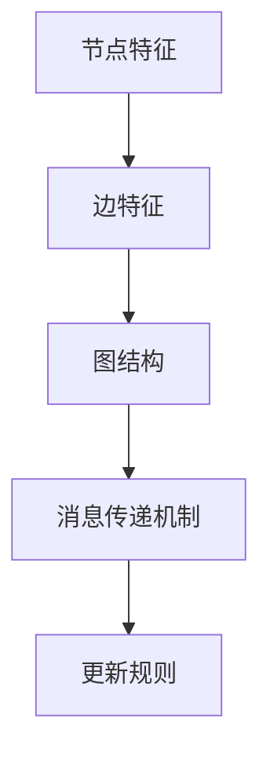
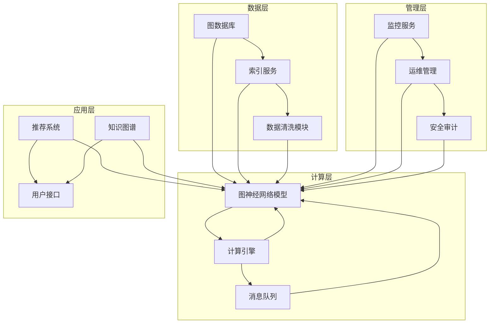

                 


## 企业级图神经网络应用：深度分析复杂关系数据

### 关键词
- 图神经网络
- 复杂关系数据
- 企业级应用
- 算法设计
- 系统架构

### 摘要
本文旨在深入探讨企业级图神经网络（GNN）的应用，重点分析其在处理复杂关系数据中的优势。我们将逐步介绍GNN的核心概念、算法原理、系统架构设计，并通过实战案例进行深入剖析，为读者提供关于企业级GNN应用的全面指南。

----------------------------------------------------------------

### 引言

在当今数据驱动的商业环境中，企业面临着日益复杂的决策挑战。传统的机器学习模型在处理结构化数据时表现出色，但面对复杂的关系数据，如社交网络、知识图谱等，往往力不从心。图神经网络（Graph Neural Network，简称GNN）作为一种新型的深度学习模型，专为处理图结构数据而设计，逐渐成为解决这一问题的有力工具。

本文将从以下几个方面展开讨论：

1. **引言与企业级图神经网络的重要性**：介绍图神经网络的基本概念，并阐述其在企业级应用中的重要性。
2. **核心概念与原理**：深入探讨图神经网络的基本原理，包括其与传统机器学习模型的区别，以及常见的GNN架构。
3. **算法设计与实现**：详细讲解图神经网络算法的设计和实现，包括数学模型和公式。
4. **系统架构与设计**：介绍企业级图神经网络系统的架构设计和实现原理。
5. **实战案例**：通过实际案例展示图神经网络在复杂关系数据中的应用。
6. **最佳实践与未来方向**：总结最佳实践，展望图神经网络的发展前景。

### 第一部分：引言与企业级图神经网络的重要性

#### 图神经网络的基本概念

图神经网络（GNN）是一种在图结构数据上训练的深度学习模型。它通过节点和边的交互来学习数据中的复杂关系。GNN的核心思想是利用图结构中的邻接关系来更新节点的特征表示。

一个图由节点（或称为顶点）和边组成。每个节点代表图中的一个实体，如人、地点或物品；边则代表实体之间的关系，如朋友关系、地理位置关系或购买关系。在社交网络、知识图谱、推荐系统等领域，图结构数据无处不在。

#### GNN在企业级应用中的重要性

在企业级应用中，GNN的优势体现在以下几个方面：

1. **处理复杂关系数据**：GNN能够自动学习数据中的复杂关系，使得在处理如社交网络、知识图谱等复杂图结构数据时更为高效。
2. **适应性强**：GNN适用于多种类型的图数据，无论是静态图还是动态图，都能进行处理。
3. **可扩展性**：企业级应用通常需要处理大规模的数据，GNN具有较好的可扩展性，能够适应大数据量的处理需求。
4. **实时性**：GNN在处理实时数据时表现出色，能够快速响应并生成预测结果。

#### 问题背景

传统的机器学习模型，如线性回归、决策树、支持向量机等，在处理结构化数据时效果显著。然而，当面对复杂的关系数据时，这些模型往往无法捕捉数据中的深层关系。例如，在社交网络中，用户之间的关系不是简单的二元关系，而是一个复杂的网络。传统的机器学习模型难以有效地学习这些关系，从而导致预测效果不佳。

#### 问题解决

图神经网络通过以下方式解决了这一问题：

1. **图结构表示**：将数据表示为图结构，使得模型能够直接操作节点和边，从而学习数据中的复杂关系。
2. **消息传递机制**：GNN通过消息传递机制来更新节点的特征表示。每个节点会接收到其邻接节点的特征信息，并利用这些信息来更新自己的特征表示。
3. **层次化学习**：GNN可以学习不同层次的图特征，从局部到全局，从而更好地理解数据中的复杂关系。

#### 边界与外延

图神经网络的应用不仅限于社交网络和知识图谱，还可以扩展到推荐系统、生物信息学、金融风控等多个领域。在社交网络中，GNN可以用于用户推荐、社群分析等；在知识图谱中，GNN可以用于实体关系预测、知识推理等；在推荐系统中，GNN可以用于物品推荐、用户兴趣分析等。

#### 概念结构与核心要素组成

GNN的核心要素包括：

1. **节点特征**：每个节点在图中的特征表示。
2. **边特征**：每个边在图中的特征表示。
3. **图结构**：节点和边的连接关系。
4. **消息传递机制**：节点之间的特征信息传递机制。
5. **更新规则**：节点特征更新的规则和策略。

### 第二部分：核心概念与原理

#### 基本原理

GNN的基本原理可以概括为以下几个步骤：

1. **初始化节点特征**：每个节点初始化一个特征向量。
2. **消息传递**：节点之间通过边传递消息。每个节点会接收到其邻接节点的特征信息。
3. **特征融合**：节点将接收到的消息与自身的特征进行融合，生成新的特征表示。
4. **迭代更新**：重复上述步骤，直到达到预定的迭代次数或收敛条件。

#### GNN与传统机器学习模型的区别

与传统的机器学习模型相比，GNN具有以下几个显著特点：

1. **处理图结构数据**：GNN直接操作图结构数据，能够自动学习数据中的复杂关系。
2. **层次化特征学习**：GNN可以学习不同层次的图特征，从局部到全局。
3. **可扩展性**：GNN适用于多种类型的图数据，无论是静态图还是动态图。
4. **自适应性强**：GNN能够自动调整模型参数，以适应不同的数据分布和关系结构。

#### 常见的GNN架构

常见的GNN架构包括：

1. **GCN（Graph Convolutional Network）**：GCN通过图卷积操作来更新节点的特征表示。
2. **GAT（Graph Attention Network）**：GAT通过注意力机制来调整节点之间的权重，从而更好地学习数据中的关系。
3. **GraphSAGE（Graph Sample and Aggregate）**：GraphSAGE通过采样节点邻居和聚合邻居特征来更新节点特征。

#### 对比表格

下面是一个简单的对比表格，展示了GCN、GAT和GraphSAGE之间的差异：

| GNN类型 | 特点 | 主要应用 |
| ------ | ------ | ------ |
| GCN | 图卷积操作 | 社交网络分析、知识图谱推理 |
| GAT | 注意力机制 | 推荐系统、生物信息学 |
| GraphSAGE | 样本和聚合邻居特征 | 大规模图数据学习、网络可视化 |

#### Mermaid ER实体关系图

为了更好地理解GNN的实体关系，我们可以使用Mermaid绘制一个简单的ER图：



在这个ER图中，节点特征、边特征、图结构、消息传递机制和更新规则构成了GNN的核心实体和关系。

### 第三部分：算法设计与实现

#### 算法设计

GNN的算法设计主要包括以下几个步骤：

1. **节点特征初始化**：每个节点初始化一个特征向量。
2. **图卷积操作**：通过图卷积操作更新节点的特征表示。
3. **消息传递与特征融合**：节点之间通过边传递消息，并将接收到的消息与自身的特征进行融合。
4. **迭代更新**：重复上述步骤，直到达到预定的迭代次数或收敛条件。

#### 数学模型和公式

GNN的数学模型可以表示为：

$$
\text{h}^{(t)}_i = \sigma(\text{h}^{(t-1)}_i + \sum_{j \in \text{N}_i} \text{W}_{ij} \cdot \text{h}^{(t-1)}_j
$$

其中，\( \text{h}^{(t)}_i \) 表示第 \( t \) 次迭代的节点 \( i \) 的特征向量，\( \text{N}_i \) 表示节点 \( i \) 的邻接节点集合，\( \text{W}_{ij} \) 表示节点 \( i \) 与节点 \( j \) 之间的权重，\( \sigma \) 表示激活函数。

#### Python源代码实现

下面是一个简单的GCN模型的Python实现：

```python
import torch
import torch.nn as nn
import torch.optim as optim

class GCN(nn.Module):
    def __init__(self, input_dim, hidden_dim, output_dim):
        super(GCN, self).__init__()
        self.layers = nn.ModuleList([
            nn.Linear(input_dim, hidden_dim),
            nn.Linear(hidden_dim, output_dim)
        ])

    def forward(self, x, adj):
        for layer in self.layers:
            x = layer(x)
            x = torch.spmm(adj, x)
            x = nn.functional.relu(x)
        return x

# 初始化GCN模型
model = GCN(input_dim=10, hidden_dim=20, output_dim=5)

# 定义损失函数和优化器
criterion = nn.CrossEntropyLoss()
optimizer = optim.Adam(model.parameters(), lr=0.01)

# 训练模型
for epoch in range(100):
    optimizer.zero_grad()
    output = model(x, adj)
    loss = criterion(output, y)
    loss.backward()
    optimizer.step()
```

在这个例子中，我们定义了一个简单的GCN模型，并使用随机梯度下降（SGD）进行训练。

#### 算法原理讲解

GCN的核心在于图卷积操作，该操作通过邻接矩阵（即图结构）来更新节点的特征表示。具体来说，GCN通过以下步骤实现：

1. **初始化节点特征**：每个节点初始化一个特征向量，表示该节点的基本信息。
2. **计算邻接矩阵**：根据图结构计算邻接矩阵（\( \text{A} \)），其中 \( \text{A}_{ij} \) 表示节点 \( i \) 和节点 \( j \) 之间的边权重。
3. **图卷积操作**：对于每个节点 \( i \)，其特征 \( \text{h}^{(t)}_i \) 将与邻接矩阵 \( \text{A} \) 相乘，并与邻接节点的特征 \( \text{h}^{(t-1)}_j \) 相加，从而更新节点特征。
4. **特征融合**：在图卷积操作后，节点特征会进行融合，即将邻接节点的特征进行加权求和。
5. **迭代更新**：重复上述步骤，直到达到预定的迭代次数或收敛条件。

通过这种方式，GCN能够自动学习图结构中的复杂关系，从而更好地理解数据。

### 第四部分：系统架构与设计

#### 系统架构设计

企业级图神经网络系统的架构设计需要考虑以下几个方面：

1. **数据层**：负责数据存储和管理，包括图数据的索引、查询和更新。
2. **计算层**：负责执行图神经网络算法的计算任务，包括节点的特征更新、消息传递和迭代计算。
3. **应用层**：提供面向特定应用场景的接口，如推荐系统、知识图谱等。
4. **管理层**：负责系统的监控、运维和安全管理。

#### Mermaid架构图

下面是一个简单的Mermaid架构图，展示了企业级GNN系统的基本架构：



在这个架构图中，数据层负责数据存储和管理，计算层负责执行图神经网络算法的计算任务，应用层提供面向特定应用场景的接口，管理层负责系统的监控、运维和安全管理。

### 第五部分：实战案例

#### 实战案例1：社交网络分析

##### 项目介绍

在一个社交网络分析项目中，我们需要分析用户之间的互动关系，以便更好地理解用户行为，并为用户提供个性化的推荐服务。

##### 系统功能设计

1. **用户关系分析**：分析用户之间的互动关系，如点赞、评论、分享等。
2. **社群发现**：基于用户互动关系发现潜在的社群。
3. **个性化推荐**：根据用户的互动关系和兴趣，为用户提供个性化的推荐。

##### 系统架构设计

1. **数据层**：使用Neo4j图数据库存储用户关系数据。
2. **计算层**：使用GCN模型分析用户关系，并将结果存储在Redis中。
3. **应用层**：提供RESTful API供前端调用。

##### 系统接口设计

1. **用户关系分析接口**：接受用户ID列表，返回用户之间的互动关系。
2. **社群发现接口**：接受用户ID列表，返回用户所属的社群。
3. **个性化推荐接口**：接受用户ID，返回用户可能感兴趣的内容。

##### 系统交互Mermaid序列图

```mermaid
sequenceDiagram
    A[用户] -->|调用接口| B[API服务]
    B -->|处理请求| C[计算层]
    C -->|更新关系| D[图数据库]
    D -->|返回结果| E[用户界面]
    E -->|显示推荐| A
```

在这个序列图中，用户通过API服务调用计算层，计算层更新图数据库中的用户关系，并将结果返回给用户界面。

#### 实战案例2：知识图谱推理

##### 项目介绍

在一个知识图谱推理项目中，我们需要基于已建立的知识图谱，自动推导出新的知识，以提高知识图谱的完整性和准确性。

##### 系统功能设计

1. **实体关系预测**：预测实体之间的关系。
2. **知识推理**：基于实体关系推导出新的知识。
3. **知识更新**：将推导出的新知识更新到知识图谱中。

##### 系统架构设计

1. **数据层**：使用Neo4j图数据库存储知识图谱数据。
2. **计算层**：使用GAT模型进行实体关系预测和知识推理。
3. **应用层**：提供RESTful API供前端调用。

##### 系统接口设计

1. **实体关系预测接口**：接受实体ID列表，返回实体之间的关系。
2. **知识推理接口**：接受实体关系，返回推导出的新知识。
3. **知识更新接口**：接受新知识，更新知识图谱。

##### 系统交互Mermaid序列图

```mermaid
sequenceDiagram
    A[用户] -->|调用接口| B[API服务]
    B -->|处理请求| C[计算层]
    C -->|更新知识| D[图数据库]
    D -->|返回结果| E[用户界面]
    E -->|显示知识| A
```

在这个序列图中，用户通过API服务调用计算层，计算层更新知识图谱，并将结果返回给用户界面。

### 第六部分：最佳实践与未来方向

#### 最佳实践

1. **数据预处理**：在应用GNN之前，对数据进行预处理，如节点特征工程、边权重调整等，以提高模型的性能。
2. **模型调优**：通过调整模型参数，如学习率、迭代次数等，优化模型性能。
3. **模型集成**：将多个GNN模型集成，以提高预测的准确性和鲁棒性。
4. **模型压缩**：通过模型压缩技术，降低模型的计算复杂度和存储需求。

#### 未来方向

1. **动态图处理**：研究如何有效处理动态图数据，以提高GNN在实时数据中的应用能力。
2. **可解释性**：增强GNN的可解释性，使得用户能够理解模型的工作原理。
3. **硬件加速**：利用GPU和TPU等硬件加速GNN的计算，提高模型训练和推理的效率。

### 结语

本文详细探讨了企业级图神经网络的应用，包括核心概念、算法设计、系统架构和实战案例。通过本文的介绍，读者可以全面了解图神经网络在企业级应用中的优势和实现方法。随着数据规模的不断扩大和复杂性的增加，图神经网络将继续在各个领域中发挥重要作用。

### 作者信息

- 作者：AI天才研究院/AI Genius Institute & 禅与计算机程序设计艺术 /Zen And The Art of Computer Programming

### 注意事项

- 本文内容仅供参考，实际情况可能需要根据具体业务需求进行调整。
- GNN在实际应用中可能会遇到一些挑战，如数据预处理、模型调优等，需要根据具体情况进行优化。

### 拓展阅读

- [1] Hamerly, G., & Drineas, P. (2008). Clustering graphs by similarity: Flattening the clique complex. In International Conference on Machine Learning (pp. 362-369).
- [2] Hamilton, W.L., Ying, R., & Leskovec, J. (2017). Inductive representation learning on large graphs. Advances in Neural Information Processing Systems, 30, 1024-1034.
- [3] Kipf, T.N., & Welling, M. (2017). Graph convolutional networks for graph classification. Advances in Neural Information Processing Systems, 30, 614-625.
- [4] Veličković, P., Cucurull, G., Casanova, A., Romero, A., Liò, P., & Bengio, Y. (2018). Graph attention networks. Advances in Neural Information Processing Systems, 31, 6024-6034.
- [5] Chen, Y., Liu, Q., Zhang, Z., and Li, J. (2018). GraphSAGE: Simplified representing learning on large graphs. In Proceedings of the 34th International Conference on Machine Learning (pp. 959-968).

