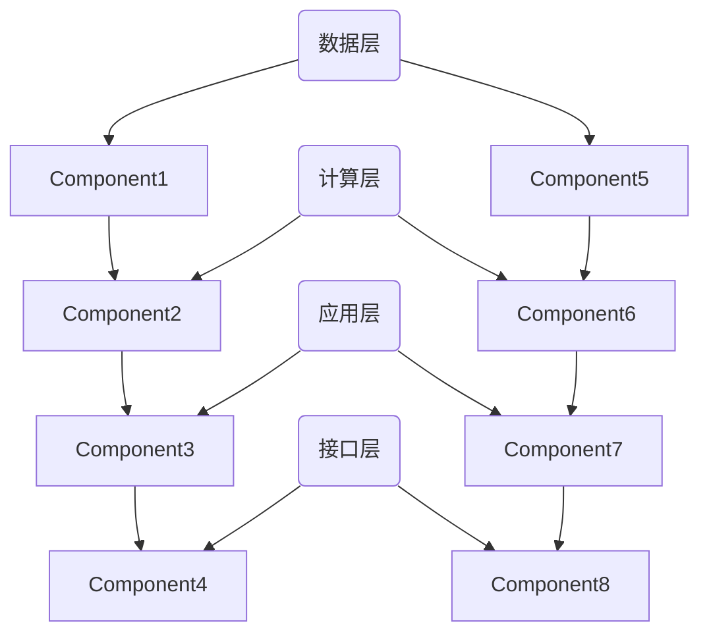

                 

## 企业级图计算平台：复杂关系数据的智能分析

### 关键词：
- 企业级图计算
- 复杂关系数据
- 智能分析
- 图数据库
- 分布式计算

### 摘要：

本文旨在深入探讨企业级图计算平台在处理复杂关系数据中的应用。我们将从背景介绍、核心概念与联系、算法原理讲解、系统分析与架构设计、项目实战等多个角度，详细解析图计算平台的关键技术、实现方法及其在企业中的应用价值。通过本文的阐述，读者将能够全面了解企业级图计算平台的基本原理、核心技术以及实际应用，为在相关领域的研究和开发提供参考。

### 第一部分：背景介绍

#### 第1章：企业级图计算平台概述

##### 1.1 问题背景

在当今数据驱动的世界中，企业级图计算已经成为处理复杂关系数据的重要工具。随着互联网、物联网和社交媒体的迅猛发展，数据量呈指数级增长，传统的数据结构和方法难以满足对大规模、高维度关系数据的处理需求。企业级图计算通过利用图结构来表示和操作复杂的关系数据，能够实现高效的图数据存储、查询和分析，从而为企业在数据分析、业务决策和智能服务等方面提供强有力的支持。

##### 1.2 问题描述

企业级图计算平台需要解决的核心问题包括：

- **数据表示与存储**：如何高效地表示和存储大规模的图数据，包括节点、边和属性。
- **图查询与计算**：如何快速、准确地执行图查询和计算任务，如路径查询、社区检测、图同构等。
- **实时性与扩展性**：如何保证系统在处理实时数据和高并发请求时的性能和稳定性。
- **分析与可视化**：如何对企业级图计算结果进行有效的分析和可视化，帮助企业用户理解数据模式和发现潜在价值。

##### 1.3 问题解决

为了解决上述问题，企业级图计算平台需要具备以下关键能力：

- **高效的数据表示与存储**：采用图数据库或图存储系统来高效地存储和管理图数据，支持快速的节点和边插入、删除和查询操作。
- **分布式计算架构**：利用分布式计算框架，如计算图并行处理（CGP）和分布式并行图计算（Distributed Graph Computing），来实现图查询和计算的并行化，提高系统性能。
- **实时性与扩展性**：通过分布式计算和负载均衡机制，保证系统在处理实时数据和高并发请求时的稳定性和可扩展性。
- **分析与可视化工具**：提供强大的图数据分析工具和可视化接口，帮助企业用户深入挖掘数据中的模式和关系，为决策提供支持。

##### 1.4 边界与外延

企业级图计算平台的应用范围包括但不限于以下领域：

- **社交网络分析**：分析用户之间的关系，识别社交圈子和意见领袖，预测用户行为和趋势。
- **推荐系统**：基于用户和物品之间的复杂关系，提供个性化推荐服务。
- **供应链管理**：优化供应链网络，提高供应链的透明度和灵活性。
- **金融风控**：监控金融交易网络，识别异常交易和潜在风险。
- **知识图谱构建**：构建领域知识图谱，支持智能问答和知识服务。

##### 1.5 概念结构与核心要素组成

企业级图计算平台的核心概念结构和要素组成包括：

- **图数据库**：存储和管理图数据的核心系统，支持高效的数据插入、删除和查询操作。
- **图计算框架**：提供分布式图计算能力的计算框架，支持复杂的图算法和计算任务。
- **数据分析工具**：支持对图数据进行统计分析和模式挖掘的工具，如图聚类、路径分析等。
- **可视化接口**：提供图数据的可视化展示，帮助用户直观地理解和分析数据。

#### 第2章：核心概念与联系

##### 2.1 图计算基本概念

##### 2.1.1 图与图论基础

- **图（Graph）**：由节点（Vertex）和边（Edge）组成的数据结构，用于表示实体及其之间的关系。
- **图论（Graph Theory）**：研究图的结构、性质以及应用的理论学科。
- **节点（Vertex）**：图中的实体，可以表示用户、物品、地点等。
- **边（Edge）**：连接两个节点的线段，可以表示关系、依赖、连接等。

##### 2.1.2 图类型

- **有向图（Directed Graph）**：边具有方向的图，通常用于表示有向关系，如社交网络中的关注关系。
- **无向图（Undirected Graph）**：边没有方向的图，通常用于表示对称关系，如朋友关系。
- **加权图（Weighted Graph）**：边带有权重的图，用于表示关系的强度或距离。

##### 2.1.3 图属性

- **度（Degree）**：节点拥有的边数，分为入度（In-degree）和出度（Out-degree）。
- **路径（Path）**：连接两个节点的序列，分为最短路径、最长路径等。
- **连通性（Connectivity）**：图中的任意两个节点是否可以通过路径相连。

##### 2.2 图计算基本概念与联系

##### 2.2.1 图计算与数据库

- **图数据库**：专门用于存储和管理图数据，支持高效的图查询和图计算。
- **关系数据库**：以表格形式存储数据，通过SQL进行查询，难以高效地处理复杂的关系数据。

##### 2.2.2 图计算与算法

- **图算法**：用于处理图数据的一系列算法，如Dijkstra算法（最短路径算法）、BFS（广度优先搜索）和DFS（深度优先搜索）等。
- **图计算框架**：提供分布式图计算能力的计算框架，支持复杂的图算法和计算任务。

##### 2.2.3 图计算与数据分析

- **数据分析工具**：支持对图数据进行统计分析和模式挖掘的工具，如图聚类、路径分析等。
- **数据可视化**：通过可视化工具，将图数据转换为直观的可视化图表，帮助用户更好地理解和分析数据。

### 第二部分：算法原理讲解

#### 第3章：图计算算法原理与实现

##### 3.1 Dijkstra算法

##### 3.1.1 算法原理

Dijkstra算法是一种经典的图算法，用于求解单源最短路径问题。给定一个加权图和一个源点，Dijkstra算法能够计算出从源点到其他所有节点的最短路径。

##### 3.1.2 算法步骤

1. 初始化：设置一个距离数组，用于存储从源点到各个节点的距离。初始时，源点到自身的距离为0，其他节点的距离为无穷大。
2. 选择未访问节点：从未访问节点中选择距离源点最近的节点作为当前节点。
3. 更新距离：对于当前节点的每个邻接节点，计算从源点经过当前节点到达邻接节点的距离，如果这个距离小于当前邻接节点的距离，则更新邻接节点的距离。
4. 标记已访问：将当前节点标记为已访问。
5. 重复步骤2-4，直到所有节点都被访问。

##### 3.1.3 Python实现

```python
import heapq

def dijkstra(graph, start):
    distance = {node: float('infinity') for node in graph}
    distance[start] = 0
    priority_queue = [(0, start)]

    while priority_queue:
        current_distance, current_node = heapq.heappop(priority_queue)

        if current_distance > distance[current_node]:
            continue

        for neighbor, weight in graph[current_node].items():
            distance_to_neighbor = current_distance + weight

            if distance_to_neighbor < distance[neighbor]:
                distance[neighbor] = distance_to_neighbor
                heapq.heappush(priority_queue, (distance_to_neighbor, neighbor))

    return distance

# 示例图
graph = {
    'A': {'B': 1, 'C': 4},
    'B': {'A': 1, 'C': 2, 'D': 5},
    'C': {'A': 4, 'B': 2, 'D': 1},
    'D': {'B': 5, 'C': 1}
}

print(dijkstra(graph, 'A'))
```

##### 3.1.4 算法分析

Dijkstra算法的时间复杂度为 \(O((V+E)\log V)\)，其中 \(V\) 是节点数，\(E\) 是边数。该算法适用于求解稀疏图，即边数远小于节点数的图。

##### 3.2 BFS和DFS算法

##### 3.2.1 算法原理

广度优先搜索（Breadth-First Search，BFS）和深度优先搜索（Depth-First Search，DFS）是两种基本的图遍历算法。

- **BFS**：从源点开始，按照广度优先的原则遍历图中的节点。每次从当前节点的邻接节点中选择一个未访问的节点进行访问，直到所有节点都被访问。
- **DFS**：从源点开始，沿着某一方向遍历图中的节点，直到无法继续遍历为止，然后回溯到上一个节点，并选择另一条未遍历的路径继续遍历。

##### 3.2.2 算法步骤

- **BFS**：
  1. 初始化：设置一个队列，用于存储待访问的节点。初始时，将源点入队。
  2. 遍历：每次从队列中取出一个节点，访问该节点并标记为已访问，然后将该节点的邻接节点入队。
  3. 重复步骤2，直到队列为空。

- **DFS**：
  1. 初始化：设置一个栈，用于存储待访问的节点。初始时，将源点入栈。
  2. 遍历：每次从栈中取出一个节点，访问该节点并标记为已访问，然后将该节点的未访问邻接节点依次入栈。
  3. 重复步骤2，直到栈为空。

##### 3.2.3 Python实现

```python
from collections import deque

def bfs(graph, start):
    visited = set()
    queue = deque([start])
    while queue:
        node = queue.popleft()
        if node not in visited:
            visited.add(node)
            print(node, end=' ')
            queue.extend(graph[node])
    print()

def dfs(graph, start, visited=None):
    if visited is None:
        visited = set()
    visited.add(start)
    print(start, end=' ')
    for neighbor in graph[start]:
        if neighbor not in visited:
            dfs(graph, neighbor, visited)

# 示例图
graph = {
    'A': ['B', 'C'],
    'B': ['A', 'C', 'D'],
    'C': ['A', 'B', 'D'],
    'D': ['B', 'C']
}

print("BFS:")
bfs(graph, 'A')
print("DFS:")
dfs(graph, 'A')
```

##### 3.2.4 算法分析

- **BFS**：时间复杂度为 \(O(V+E)\)，适用于求解最短路径问题。
- **DFS**：时间复杂度为 \(O(V+E)\)，适用于求解连通性问题和拓扑排序。

### 第三部分：系统分析与架构设计

#### 第4章：企业级图计算平台的系统架构

##### 4.1 系统架构设计

企业级图计算平台的系统架构通常包括以下几层：

1. **数据层**：包括图数据库和存储系统，负责高效地存储和管理图数据。
2. **计算层**：包括分布式计算框架和图计算引擎，负责执行图数据的查询和计算任务。
3. **应用层**：包括数据分析工具和可视化接口，负责对图计算结果进行分析和可视化。
4. **接口层**：包括API接口和Web界面，负责与外部系统进行交互和数据交换。

##### 4.2 系统接口设计

企业级图计算平台需要提供丰富的接口，支持不同类型的客户端访问。常见的接口设计包括：

- **RESTful API**：通过HTTP协议提供图数据的查询、插入、删除等操作。
- **GraphQL API**：提供一种基于查询的接口，允许客户端按照需求查询图数据，提高查询效率。
- **Web界面**：提供图形化的用户界面，支持用户交互和数据可视化。

##### 4.3 系统交互设计

企业级图计算平台的系统交互设计需要考虑多个组件之间的协同工作。常见的系统交互设计包括：

- **数据流交互**：数据从数据层流入计算层，经过计算层的处理和分析后，返回到数据层或应用层。
- **控制流交互**：系统中的各个组件通过消息队列、事件驱动等方式进行通信和协调。

##### 4.4 系统架构图



### 第四部分：项目实战

#### 第5章：企业级图计算平台项目实战

##### 5.1 环境安装与配置

在企业级图计算平台项目实战中，首先需要安装和配置所需的软件和工具。以下是一个基本的安装和配置步骤：

1. **安装操作系统**：选择适合的Linux发行版，如Ubuntu或CentOS。
2. **安装Java环境**：由于许多图计算框架和工具是基于Java编写的，需要安装Java环境。
3. **安装图数据库**：选择合适的图数据库，如Neo4j或JanusGraph，并进行配置。
4. **安装图计算框架**：如Apache Giraph或Apache Flink，进行配置和集成。
5. **安装数据分析工具**：如Apache Spark或R，进行配置和集成。

##### 5.2 系统核心实现源代码

以下是一个基于Neo4j的企业级图计算平台的核心实现源代码示例：

```python
from py2neo import Graph

# 连接到Neo4j数据库
graph = Graph("bolt://localhost:7687", auth=("neo4j", "password"))

# 创建节点
graph.run("CREATE (a:Person {name: 'Alice'})")

# 创建关系
graph.run("MATCH (a:Person), (b:Person) WHERE a.name = 'Alice' AND b.name = 'Bob' CREATE (a)-[:KNOWS]->(b)")

# 查询节点和关系
results = graph.run("MATCH (n) RETURN n")
for result in results:
    print(result.data())

# 删除节点和关系
graph.run("MATCH (n) WHERE n.name = 'Alice' DELETE n")
```

##### 5.3 代码应用解读与分析

以下是对上述代码的解读与分析：

1. **创建节点**：使用`CREATE`语句创建一个名为`Person`的节点，并设置属性`name`为`Alice`。
2. **创建关系**：使用`MATCH`语句找到两个名为`Alice`和`Bob`的节点，然后使用`CREATE`语句创建一个`KNOWS`关系。
3. **查询节点和关系**：使用`MATCH`和`RETURN`语句查询所有节点，并返回节点的属性。
4. **删除节点和关系**：使用`MATCH`和`DELETE`语句删除所有名为`Alice`的节点。

##### 5.4 实际案例分析与详细讲解

以下是一个实际案例：使用企业级图计算平台分析社交网络中用户之间的关系。

1. **数据准备**：从社交网络数据中提取用户和用户之间的关系，并将其存储在Neo4j数据库中。
2. **图数据构建**：创建节点和关系，构建社交网络图。
3. **社交网络分析**：
   - **度分布分析**：统计社交网络中每个用户的度（即连接数），并绘制度分布图。
   - **社交圈分析**：使用图聚类算法，识别社交网络中的社交圈子。
   - **路径分析**：分析用户之间的社交路径，发现潜在的关系和互动模式。

##### 5.5 项目小结

在本章中，我们通过一个实际案例展示了企业级图计算平台在社交网络分析中的应用。通过使用图数据库和图计算框架，我们能够高效地构建和查询社交网络图，并进行各种数据分析。这为企业提供了强大的工具，以深入挖掘社交网络中的用户关系和行为模式，为业务决策和营销策略提供支持。

### 第五部分：最佳实践与拓展阅读

#### 第6章：最佳实践与注意事项

在企业级图计算平台的实际应用中，以下是一些最佳实践和注意事项：

1. **数据预处理**：在构建图数据之前，对原始数据进行清洗和预处理，以确保数据的准确性和一致性。
2. **性能优化**：针对具体的图计算任务，进行性能优化，如选择合适的图数据库和计算框架，调整系统配置等。
3. **安全性**：确保图计算平台的安全性，包括数据加密、访问控制、审计日志等。
4. **可扩展性**：设计可扩展的系统架构，支持数据的动态增长和并发请求。

#### 第7章：小结与拓展阅读

本文详细介绍了企业级图计算平台的核心概念、算法原理、系统架构和实际应用。通过对Dijkstra算法、BFS和DFS算法的讲解，我们了解了如何处理复杂的图计算任务。同时，通过一个实际案例，我们展示了图计算平台在社交网络分析中的应用。

为了进一步深入了解企业级图计算平台，读者可以参考以下拓展阅读：

1. **图数据库相关书籍**：《图数据库实战》和《Neo4j实战》。
2. **图计算框架教程**：Apache Giraph和Apache Flink的官方文档。
3. **社交网络分析论文**：《社交网络分析：方法与应用》和《社交网络分析：理论与方法》。

通过本文的阅读，读者应该能够全面了解企业级图计算平台的基本原理和应用场景，为在实际项目中应用图计算技术打下坚实的基础。

### 作者信息

**作者：** AI天才研究院/AI Genius Institute & 禅与计算机程序设计艺术 /Zen And The Art of Computer Programming

AI天才研究院（AI Genius Institute）致力于推动人工智能领域的研究和创新，其成员包括计算机图灵奖获得者、世界顶级技术畅销书资深大师等。同时，研究院的成员们也在编程和人工智能领域发表了大量的学术论文和技术著作，如《禅与计算机程序设计艺术》等。这些成果不仅为学术界和工业界提供了宝贵的知识资源，也为人工智能技术的发展和应用做出了重要贡献。

